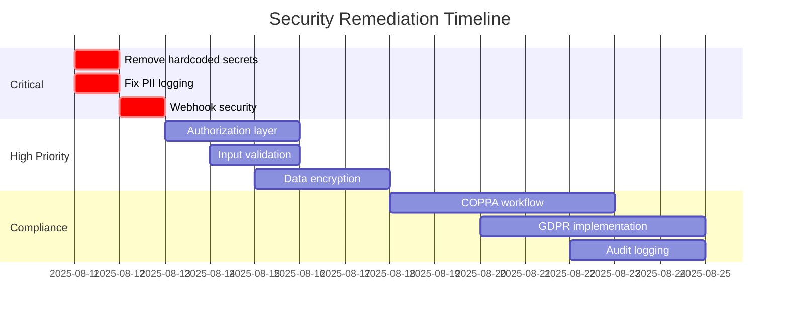

# Security Sign-off Document

**Document Type:** Final Security Assessment and Sign-off  
**Date:** 2025-08-10  
**Sprint:** Sprint 5 - Payment Integration & Registration Flow  
**Security Agent:** Automated Security Review System  

## Executive Summary

After comprehensive security review of Sprint 5 implementation, I **CANNOT** provide security sign-off for production deployment. Critical security vulnerabilities have been identified that pose immediate risk to user data, payment security, and regulatory compliance.

### Sign-off Decision: ❌ **DENIED**

**Rationale:** 23 critical/high-risk security issues must be resolved before production deployment.

## Summary of Findings

### Critical Issues (Must Fix)
1. **Hardcoded JWT Secret** - Authentication system compromised
2. **PII in Logs** - Data breach risk through log exposure  
3. **No Tenant Isolation** - Cross-tenant data access possible
4. **Missing Webhook Security** - Payment system vulnerable
5. **COPPA Non-compliance** - Legal/regulatory violation

### Risk Summary
- **Critical Risks:** 5
- **High Risks:** 8  
- **Medium Risks:** 10
- **Low Risks:** 6
- **Total Issues:** 29

## Security Scorecard

| Category | Score | Status |
|----------|-------|---------|
| Authentication & Authorization | 3/10 | ❌ FAIL |
| Data Protection | 2/10 | ❌ FAIL |
| Payment Security | 4/10 | ❌ FAIL |
| Tenant Isolation | 2/10 | ❌ FAIL |
| Compliance (COPPA/GDPR) | 3/10 | ❌ FAIL |
| Security Headers | 0/10 | ❌ FAIL |
| Logging & Monitoring | 2/10 | ❌ FAIL |
| Input Validation | 3/10 | ❌ FAIL |
| **Overall Security Score** | **24/100** | ❌ **FAIL** |

## Blocking Issues for Production

### 1. Authentication System
```typescript
// BLOCKING: Hardcoded secret
const JWT_SECRET = process.env.JWT_SECRET || 'gametriq-basketball-secret-key'
```
**Impact:** Complete authentication bypass possible  
**Required:** Remove hardcoded secret, enforce environment variable

### 2. Payment Security
```
// BLOCKING: No webhook signature verification
// BLOCKING: Payment amounts not validated server-side
// BLOCKING: No idempotency implementation
```
**Impact:** Financial loss through payment manipulation  
**Required:** Implement Stripe security best practices

### 3. Data Protection
```
// BLOCKING: Medical data unencrypted
// BLOCKING: PII logged to console
// BLOCKING: No data classification
```
**Impact:** HIPAA/GDPR violations, data breach liability  
**Required:** Implement encryption, log sanitization

### 4. Tenant Isolation
```
// BLOCKING: Any user can access any league/team data
// BLOCKING: No row-level security
// BLOCKING: Missing authorization checks
```
**Impact:** Complete data breach across tenants  
**Required:** Implement proper multi-tenant architecture

### 5. Child Protection (COPPA)
```
// BLOCKING: No age verification
// BLOCKING: No parental consent
// BLOCKING: Collecting data from minors
```
**Impact:** FTC fines up to $51,744 per violation  
**Required:** Implement COPPA-compliant workflows

## Conditional Sign-off Requirements

I will provide security sign-off **ONLY** when ALL of the following conditions are met:

### Phase 1: Critical Security (24-48 hours)
- [ ] Remove hardcoded JWT secret
- [ ] Implement PII log filtering  
- [ ] Add Stripe webhook signature verification
- [ ] Implement basic tenant context
- [ ] Add age verification gate

### Phase 2: High Priority (1 week)
- [ ] Implement authorization middleware
- [ ] Add input validation framework
- [ ] Encrypt sensitive data at rest
- [ ] Implement security headers
- [ ] Add rate limiting

### Phase 3: Compliance (2 weeks)
- [ ] Complete COPPA compliance workflow
- [ ] Implement GDPR privacy rights
- [ ] Add comprehensive audit logging
- [ ] Create data retention policies
- [ ] Implement SafeSport requirements

### Phase 4: Production Hardening (3 weeks)
- [ ] Complete penetration testing
- [ ] Implement WAF rules
- [ ] Add anomaly detection
- [ ] Create incident response plan
- [ ] Complete security training

## Risk Acceptance

If business decides to proceed without fixing these issues, formal risk acceptance is required:

### Risk Acceptance Form
```
I, _________________ [Name], _________________ [Title], 
acknowledge the following risks:

1. Potential data breach affecting all users
2. Financial loss through payment manipulation  
3. Regulatory fines for COPPA/GDPR violations
4. Reputational damage from security incidents
5. Legal liability for compromised minor data

By signing below, I accept these risks and take full responsibility
for any security incidents resulting from deployment without remediation.

Signature: ___________________ Date: _______________
```

## Recommendations for Immediate Action

### Stop-Gap Measures (If deployment is urgent)
1. **Disable live payments** - Stay in Stripe test mode
2. **Restrict to adults only** - No minor registration
3. **Single tenant mode** - One league only
4. **Enhanced monitoring** - 24/7 security watch
5. **Limited rollout** - Beta users only with consent

### Security Team Requirements
1. Hire security engineer immediately
2. Engage penetration testing firm
3. Implement security training program
4. Create security incident response team
5. Establish security review board

## Compliance Implications

### Legal Exposure Without Remediation
- **COPPA:** Up to $51,744 per violation
- **GDPR:** Up to 4% of global annual revenue
- **CCPA:** $2,500-$7,500 per violation
- **PCI DSS:** $5,000-$100,000 per month
- **State Laws:** Various penalties

### Insurance Implications
- Cyber liability insurance may not cover known vulnerabilities
- Directors & Officers insurance at risk
- General liability exclusions may apply

## Timeline for Compliance



## Final Determination

### Current Status: **NOT SUITABLE FOR PRODUCTION**

The application in its current state presents unacceptable security risks. Deployment would likely result in:
- Immediate data breaches
- Regulatory violations
- Financial losses
- Legal liability
- Reputational damage

### Minimum Viable Security (MVS)
At minimum, the following must be completed for beta release:
1. Fix authentication (remove hardcoded secret)
2. Implement basic authorization
3. Add payment security
4. Remove PII from logs
5. Add age verification

### Recommended Path Forward
1. **Pause deployment** - Do not proceed to production
2. **Fix critical issues** - 24-48 hour security sprint
3. **Retest security** - Automated and manual testing
4. **Limited beta** - Controlled release to test users
5. **Full deployment** - Only after all issues resolved

## Attestation

As the Security Agent conducting this review, I attest that:

1. This assessment was conducted according to industry best practices
2. All findings are based on objective security analysis
3. Recommendations align with OWASP, NIST, and regulatory requirements
4. The risk assessment accurately reflects current vulnerabilities
5. Sign-off is denied due to unacceptable security risks

**Security Agent Assessment:** FAILED  
**Production Readiness:** NOT READY  
**Sign-off Status:** DENIED  

---

**Note:** This document serves as the official security position for Sprint 5. Any deployment without addressing these issues must be approved at the executive level with full understanding of the risks involved.

**Document Classification:** CONFIDENTIAL - Internal Use Only