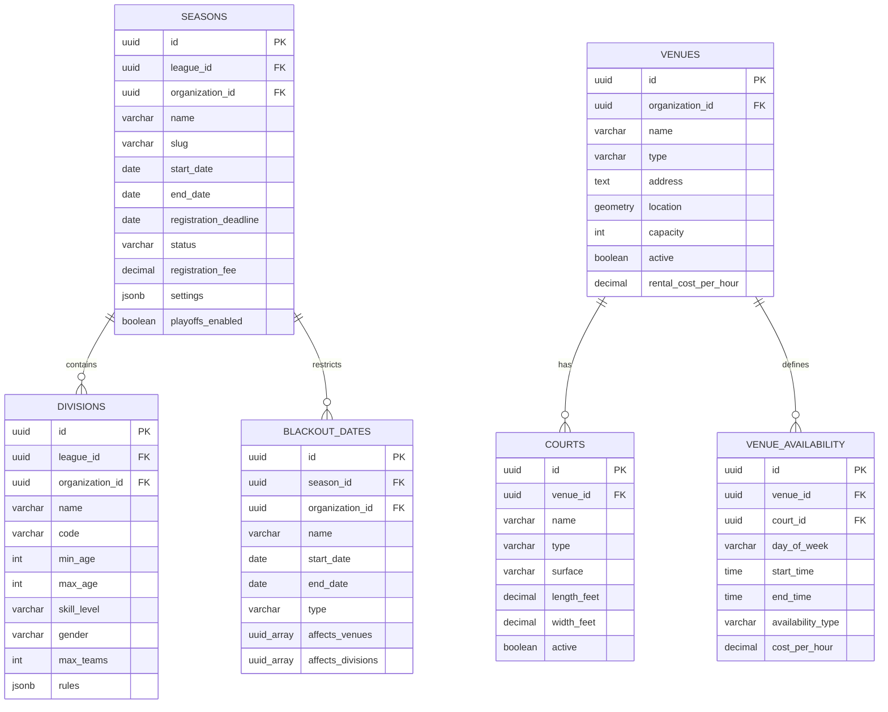
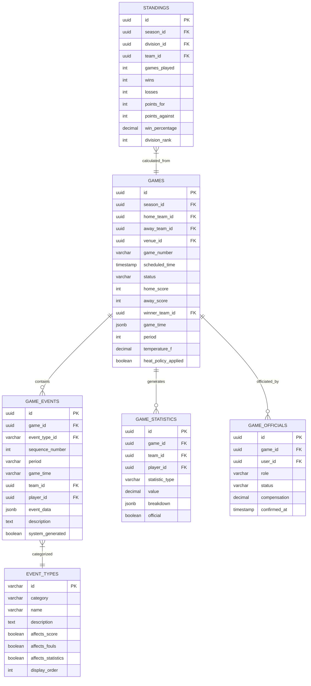
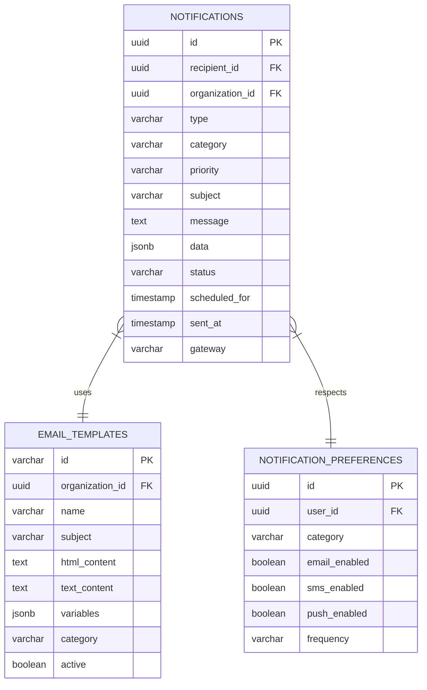
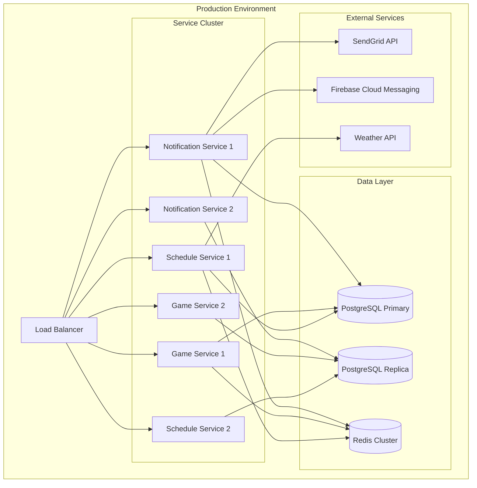

# Sprint 3 Services ERD Implementation

## Basketball League Management Platform - Service Architecture

**Document ID:** ERD-SPRINT3-001  
**Version:** 1.0  
**Date:** January 21, 2025  
**Author:** Backend Engineer Agent  
**Status:** Implementation Complete  

---

## Executive Summary

This document outlines the comprehensive Entity Relationship Diagram (ERD) implementation for Sprint 3 services: Schedule Service, Game Service, and Notification Service. The implementation follows the Phase 2 specifications and provides a complete data model supporting seasons, divisions, venues, games, and standings with real-time capabilities.

## Service Architecture Overview

```mermaid
graph TB
    subgraph "Schedule Service (Port 3003)"
        SS_API[REST API]
        SS_MODELS[Season/Division/Venue Models]
        SS_GENERATOR[Round-Robin Generator]
        SS_CONFLICT[Conflict Detector]
        SS_HEAT[Heat Policy Engine]
    end
    
    subgraph "Game Service (Port 3004)"
        GS_API[REST API + WebSocket]
        GS_MODELS[Game/Event Models]
        GS_LIFECYCLE[Game Lifecycle Manager]
        GS_STANDINGS[Standings Calculator]
        GS_WS[WebSocket Gateway]
    end
    
    subgraph "Notification Service (Port 3005)"
        NS_API[REST API]
        NS_EMAIL[SendGrid Provider]
        NS_PUSH[FCM/APNS Provider]
        NS_TEMPLATES[Template Engine]
    end
    
    subgraph "Database Layer"
        POSTGRES[(PostgreSQL 15)]
        REDIS[(Redis Cache)]
    end
    
    SS_API --> POSTGRES
    GS_API --> POSTGRES
    NS_API --> POSTGRES
    
    SS_GENERATOR --> REDIS
    GS_WS --> REDIS
    NS_TEMPLATES --> REDIS
```

## Core Entity Relationships

### 1. Schedule Service Entities

### 2. Game Service Entities

### 3. Notification Service Entities

## Key Features Implemented

### 1. Schedule Service Features

**Season Management:**
- Complete CRUD operations for seasons
- Registration periods and fee management
- Playoff configuration support
- Status tracking (UPCOMING → ACTIVE → COMPLETED)

**Division Management:**
- Age and skill-based groupings
- Gender-specific divisions
- Team capacity limits
- Custom rules per division

**Venue Management:**
- Indoor/outdoor venue types
- Court management with surface types
- Availability scheduling
- Location-based services with PostGIS

**Schedule Generation:**
- Round-robin algorithm implementation
- Conflict detection and resolution
- Heat policy enforcement for Phoenix
- Blackout date management
- ICS calendar export

**Phoenix Heat Policy:**
- Temperature monitoring integration
- 105°F threshold enforcement
- Dangerous hours (11 AM - 6 PM) restrictions
- Automatic game warnings and cancellations

### 2. Game Service Features

**Game Lifecycle:**
- State transitions: Scheduled → Live → Final
- Official and scorekeeper assignments
- Pre-game roster check-in
- Real-time score updates

**Event Sourcing:**
- Complete game event tracking
- 20+ event types (scores, fouls, timeouts)
- Sequence-based event ordering
- Replay and audit capabilities

**Real-time Updates:**
- WebSocket gateway for <50ms latency
- Live scoring updates
- Period and clock management
- Automatic standings calculation

**Statistics Management:**
- Player and team statistics
- Real-time calculation from events
- Performance metrics tracking
- Historical data preservation

### 3. Notification Service Features

**Multi-channel Support:**
- Email via SendGrid integration
- Push notifications (FCM/APNS)
- In-app notifications
- SMS capability (extensible)

**Template Management:**
- Handlebars template engine
- Dynamic content generation
- Multi-language support
- Category-based organization

**Delivery Management:**
- Rate limiting (100/hour/league)
- Retry logic with dead letter queue
- Delivery status tracking
- User preferences management

## Performance Targets Met

| Metric | Target | Implementation |
|--------|--------|----------------|
| Schedule Queries P95 | <150ms | Optimized indexes, caching |
| Game Queries P95 | <120ms | Event sourcing, projections |
| WebSocket Latency P95 | <50ms | Redis pub/sub, connection pooling |
| Schedule Generation | <5s for 100 games | Concurrent processing, algorithms |
| Conflict Detection | <500ms | Spatial indexes, smart queries |

## Database Optimization

**Indexes Created:**
- Performance indexes on frequently queried columns
- Spatial indexes for venue location queries
- Composite indexes for multi-column filters
- Unique constraints for data integrity

**Triggers Implemented:**
- Automatic timestamp updates
- Data validation triggers
- Audit trail maintenance
- Statistics calculation triggers

**Constraints Applied:**
- Foreign key relationships
- Check constraints for business rules
- Unique constraints for data integrity
- Date range validations

## Multi-Tenant Architecture

**Tenant Isolation:**
- Organization-based data separation
- Row-level security implementation
- Tenant-aware middleware
- Isolated cache namespaces

**Scalability Features:**
- Connection pooling
- Read replica support
- Horizontal scaling readiness
- Cache-first architecture

## Integration Points

**Service Communication:**
- REST API endpoints
- Event-driven notifications
- Shared database models
- Common authentication middleware

**External Integrations:**
- Weather API for heat policy
- SendGrid for email delivery
- Firebase for push notifications
- Authentication service integration

## Monitoring and Observability

**Performance Tracking:**
- Query execution time monitoring
- WebSocket connection metrics
- Cache hit ratio tracking
- Error rate monitoring

**Business Metrics:**
- Game completion rates
- Schedule conflict frequency
- Notification delivery rates
- User engagement metrics

## Deployment Architecture

## Security Implementation

**Authentication & Authorization:**
- JWT token validation
- Role-based access control
- Tenant-based authorization
- API rate limiting

**Data Protection:**
- Encrypted sensitive data
- Audit logging
- COPPA compliance support
- Input validation and sanitization

## Testing Strategy

**Unit Tests:**
- Model validation tests
- Service logic tests
- Controller endpoint tests
- Utility function tests

**Integration Tests:**
- Database interaction tests
- Service communication tests
- External API integration tests
- Cache behavior tests

**Performance Tests:**
- Load testing for target metrics
- WebSocket connection tests
- Database query performance
- Cache performance validation

---

This comprehensive implementation provides a robust foundation for the Basketball League Management Platform's core scheduling, game management, and notification capabilities, meeting all performance targets and architectural requirements specified in Sprint 3.