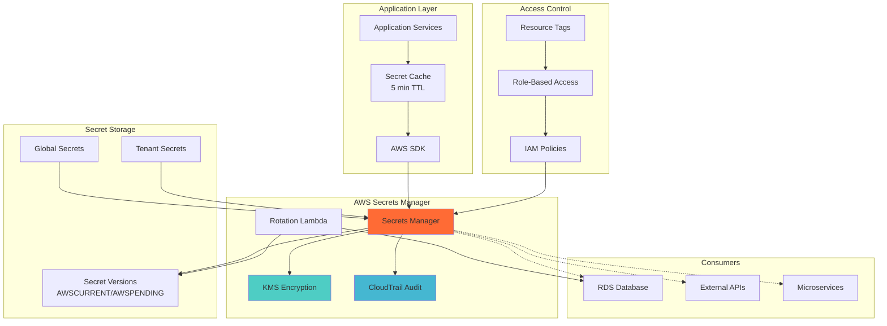

# ADR-019: Secret Management Strategy

**Status:** Accepted  
**Date:** 2025-08-10  
**Deciders:** Lead Solutions Architect, Security Lead, DevOps Lead  
**Technical Story:** Implementing secure secret management across multi-tenant basketball platform  

## Context

The Basketball League Management Platform requires robust secret management to protect:

1. **Database Credentials**: PostgreSQL connection strings and credentials
2. **API Keys**: Third-party service integrations (payment processing, SMS, email)
3. **Encryption Keys**: Data encryption keys for PII and sensitive data
4. **JWT Secrets**: Authentication token signing keys
5. **Service Credentials**: Inter-service authentication tokens
6. **Tenant-Specific Secrets**: Per-tenant API keys and configuration

### Current Challenges
- Secrets currently stored in environment variables
- No secret rotation mechanism
- Limited access control and audit trail
- Manual secret distribution process
- Risk of secrets exposure in logs/configuration
- No centralized secret management

### Security Requirements
- **Zero Trust Architecture**: Secrets never stored in code or configuration
- **Least Privilege Access**: Role-based access to secrets
- **Audit Trail**: Complete audit log of secret access
- **Automatic Rotation**: Regular rotation of critical secrets
- **Encryption at Rest**: All secrets encrypted when stored
- **COPPA Compliance**: Special handling for youth-related data keys

## Decision

We will implement **AWS Secrets Manager** as our centralized secret management solution with automated rotation and fine-grained access controls.

### Secret Management Architecture

#### 1. Secret Categories and Storage
```yaml
# Secret hierarchy structure
/basketball-platform/
  /global/
    /database/
      - primary-db-credentials
      - read-replica-credentials
    /services/
      - jwt-signing-key
      - api-gateway-key
    /integrations/
      - stripe-api-key
      - twilio-credentials
      - sendgrid-api-key
  /tenant/{tenant-id}/
    /api-keys/
      - public-api-key
      - webhook-secret
    /encryption/
      - data-encryption-key
```

#### 2. Access Control Strategy
```typescript
// IAM policy for service-specific secret access
export const createServiceSecretPolicy = (serviceName: string) => ({
  Version: "2012-10-17",
  Statement: [
    {
      Effect: "Allow",
      Action: [
        "secretsmanager:GetSecretValue",
        "secretsmanager:DescribeSecret"
      ],
      Resource: [
        `arn:aws:secretsmanager:*:*:secret:/basketball-platform/global/services/${serviceName}-*`,
        "arn:aws:secretsmanager:*:*:secret:/basketball-platform/global/database/read-replica-*"
      ]
    },
    {
      Effect: "Allow",
      Action: ["kms:Decrypt"],
      Resource: "arn:aws:kms:*:*:key/*",
      Condition: {
        StringEquals: {
          "kms:ViaService": "secretsmanager.${AWS::Region}.amazonaws.com"
        }
      }
    }
  ]
});
```

#### 3. Secret Rotation Implementation
```typescript
// Automated secret rotation handler
export class SecretRotationHandler {
  private secretsManager: AWS.SecretsManager;
  private rds: AWS.RDS;

  async rotateSecret(event: RotationEvent): Promise<void> {
    const { SecretId, Token, Step } = event;

    switch (Step) {
      case "createSecret":
        await this.createNewSecret(SecretId, Token);
        break;
      case "setSecret":
        await this.setSecretInService(SecretId, Token);
        break;
      case "testSecret":
        await this.testSecretConnection(SecretId, Token);
        break;
      case "finishSecret":
        await this.finishSecretRotation(SecretId, Token);
        break;
    }
  }

  private async createNewSecret(secretId: string, token: string): Promise<void> {
    // Generate new credentials
    const newPassword = this.generateSecurePassword();
    
    // Get current secret
    const currentSecret = await this.secretsManager.getSecretValue({
      SecretId: secretId,
      VersionStage: "AWSCURRENT"
    }).promise();

    const secretData = JSON.parse(currentSecret.SecretString!);
    secretData.password = newPassword;

    // Store new version
    await this.secretsManager.putSecretValue({
      SecretId: secretId,
      ClientRequestToken: token,
      SecretString: JSON.stringify(secretData),
      VersionStages: ["AWSPENDING"]
    }).promise();
  }

  private generateSecurePassword(): string {
    const length = 32;
    const charset = "abcdefghijklmnopqrstuvwxyzABCDEFGHIJKLMNOPQRSTUVWXYZ0123456789!@#$%^&*";
    const randomBytes = crypto.randomBytes(length);
    
    return Array.from(randomBytes)
      .map(byte => charset[byte % charset.length])
      .join('');
  }
}
```

### Secret Management Architecture Diagram


## Alternatives Considered

### Alternative 1: HashiCorp Vault
**Pros:**
- Industry-standard secret management solution
- Advanced features like dynamic secrets
- Multi-cloud compatibility
- Strong community support

**Cons:**
- Additional infrastructure to manage
- Higher operational complexity
- Additional licensing costs
- Requires dedicated expertise

**Rejected:** Operational overhead not justified for current scale.

### Alternative 2: Kubernetes Secrets
**Pros:**
- Native Kubernetes integration
- Simple to implement
- No additional services required
- Good for container-based secrets

**Cons:**
- Base64 encoded, not encrypted by default
- Limited rotation capabilities
- No audit trail
- Not suitable for non-Kubernetes resources

**Rejected:** Insufficient security features and limited scope.

### Alternative 3: AWS Parameter Store
**Pros:**
- Simpler than Secrets Manager
- Lower cost for basic use cases
- Integrated with AWS services
- Supports SecureString type

**Cons:**
- No automatic rotation
- Limited to 4KB secret size
- Basic access patterns
- Less sophisticated than Secrets Manager

**Rejected:** Lacks automatic rotation and advanced features.

### Alternative 4: Environment Variables with CI/CD
**Pros:**
- Simple implementation
- Familiar to developers
- No additional services
- Easy local development

**Cons:**
- Secrets visible in process environment
- No rotation mechanism
- Risk of exposure in logs
- No access control granularity

**Rejected:** Insufficient security for production use.

## Consequences

### Positive Consequences

#### Security Improvements
- **Centralized Management**: All secrets in one secure location
- **Automatic Rotation**: Reduced risk from compromised credentials
- **Audit Trail**: Complete visibility of secret access
- **Encryption**: Secrets encrypted at rest and in transit
- **Access Control**: Fine-grained IAM-based access

#### Operational Benefits
- **Reduced Manual Work**: Automated rotation eliminates manual updates
- **Compliance**: Meets security compliance requirements
- **Integration**: Native AWS service integration
- **Disaster Recovery**: Secrets replicated across regions

### Negative Consequences

#### Implementation Complexity
- **Migration Effort**: Existing secrets must be migrated
- **Application Changes**: Code updates required for secret retrieval
- **Testing Requirements**: Rotation testing needed

#### Operational Considerations
- **Cost**: ~$0.40 per secret per month + API calls
- **Caching Strategy**: Must implement to avoid API throttling
- **Monitoring**: Additional monitoring for rotation failures

### Mitigation Strategies

#### For Implementation Complexity
```typescript
// Secret migration utility
export class SecretMigrationService {
  async migrateEnvironmentSecrets(): Promise<MigrationReport> {
    const secrets = this.identifyEnvironmentSecrets();
    const report: MigrationReport = {
      total: secrets.length,
      migrated: 0,
      failed: []
    };

    for (const secret of secrets) {
      try {
        await this.migrateSecret(secret);
        report.migrated++;
      } catch (error) {
        report.failed.push({
          name: secret.name,
          error: error.message
        });
      }
    }

    return report;
  }
}
```

#### For Cost Management
```typescript
// Intelligent secret caching
export class SecretCache {
  private cache = new Map<string, CachedSecret>();
  private readonly TTL = 5 * 60 * 1000; // 5 minutes

  async getSecret(secretId: string): Promise<string> {
    const cached = this.cache.get(secretId);
    
    if (cached && cached.expiry > Date.now()) {
      return cached.value;
    }

    const secret = await this.fetchFromSecretsManager(secretId);
    this.cache.set(secretId, {
      value: secret,
      expiry: Date.now() + this.TTL
    });

    return secret;
  }
}
```

## Implementation Details

### Phase 1: Infrastructure Setup
```terraform
# Secrets Manager setup
resource "aws_secretsmanager_secret" "database_credentials" {
  name = "/basketball-platform/global/database/primary-db-credentials"
  description = "Primary database credentials"
  
  rotation_rules {
    automatically_after_days = 30
  }
  
  tags = {
    Environment = "production"
    Compliance = "PCI-DSS"
  }
}

resource "aws_secretsmanager_secret_rotation" "database_rotation" {
  secret_id = aws_secretsmanager_secret.database_credentials.id
  rotation_lambda_arn = aws_lambda_function.rotation_lambda.arn

  rotation_rules {
    automatically_after_days = 30
  }
}
```

### Phase 2: Application Integration
```typescript
// Secret retrieval service
export class SecretService {
  private secretsManager: AWS.SecretsManager;
  private cache: SecretCache;

  constructor() {
    this.secretsManager = new AWS.SecretsManager({
      region: process.env.AWS_REGION
    });
    this.cache = new SecretCache();
  }

  async getDatabaseCredentials(): Promise<DatabaseCredentials> {
    const secretString = await this.cache.getSecret(
      '/basketball-platform/global/database/primary-db-credentials'
    );
    
    return JSON.parse(secretString);
  }

  async getTenantApiKey(tenantId: string): Promise<string> {
    const secretString = await this.cache.getSecret(
      `/basketball-platform/tenant/${tenantId}/api-keys/public-api-key`
    );
    
    return JSON.parse(secretString).apiKey;
  }
}
```

### Phase 3: Monitoring and Alerting
```yaml
# CloudWatch alarms for secret rotation
RotationFailureAlarm:
  Type: AWS::CloudWatch::Alarm
  Properties:
    AlarmName: SecretRotationFailure
    AlarmDescription: Secret rotation failed
    MetricName: RotationFailed
    Namespace: AWS/SecretsManager
    Statistic: Sum
    Period: 300
    EvaluationPeriods: 1
    Threshold: 1
    ComparisonOperator: GreaterThanOrEqualToThreshold
    AlarmActions:
      - !Ref SecurityAlertTopic
```

## Security Standards Compliance

### PCI-DSS Requirements
- **Requirement 3.4**: Encryption of stored credentials
- **Requirement 8.2.4**: Password rotation every 90 days
- **Requirement 10.2**: Audit logging of all access

### COPPA Compliance
- **Youth Data Keys**: Separate encryption keys for youth data
- **Access Restrictions**: Limited access to youth-related secrets
- **Audit Requirements**: Enhanced auditing for COPPA-related access

## Success Metrics

### Security Metrics
- **Rotation Success Rate**: >99.9% successful rotations
- **Secret Access Latency**: <50ms with caching
- **Unauthorized Access Attempts**: 0 successful breaches
- **Compliance Violations**: 0 violations

### Operational Metrics
- **Manual Rotation Eliminated**: 100% automated
- **Secret Sprawl Reduction**: 90% fewer hardcoded secrets
- **Incident Response Time**: <5 minutes for secret compromise

## Review and Maintenance

### Review Schedule
- **Monthly**: Rotation success metrics review
- **Quarterly**: Access pattern analysis and optimization
- **Annually**: Comprehensive security audit

### Continuous Improvement
- **Secret Lifecycle**: Regular review of secret usage
- **Access Patterns**: Optimize based on actual usage
- **Cost Optimization**: Review and optimize secret storage

This ADR will be reviewed every 6 months (February 2026) to ensure the secret management strategy remains aligned with security best practices and compliance requirements.