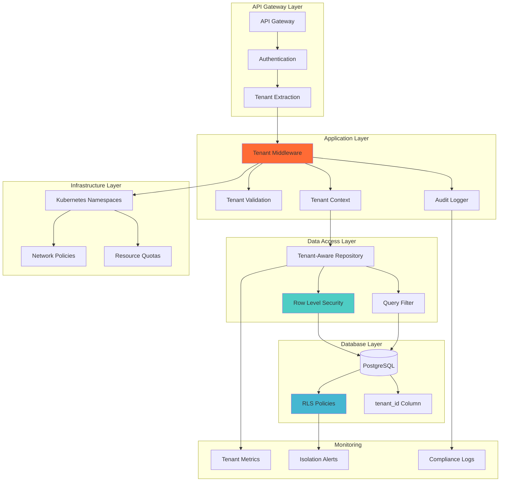

# ADR-020: Tenant Isolation Guarantees

**Status:** Accepted  
**Date:** 2025-08-10  
**Deciders:** Lead Solutions Architect, Security Lead, Platform Architect  
**Technical Story:** Implementing complete tenant isolation for multi-tenant basketball platform  

## Context

The Basketball League Management Platform serves multiple youth basketball organizations, each requiring complete data isolation and security guarantees:

1. **Data Isolation**: Each tenant's data must be completely isolated
2. **Performance Isolation**: One tenant's usage cannot impact others
3. **Security Boundaries**: Prevent cross-tenant data access
4. **Compliance Requirements**: COPPA and youth sports regulations
5. **Audit Trail**: Complete audit of all cross-tenant access attempts
6. **Resource Limits**: Prevent resource exhaustion by any tenant

### Current Challenges
- Shared database with tenant_id discrimination
- No network-level isolation
- Limited resource quotas per tenant
- Risk of SQL injection exposing cross-tenant data
- Shared infrastructure without boundaries
- Complex query filtering requirements

### Isolation Requirements
- **Zero Trust Between Tenants**: No possibility of cross-tenant access
- **Defense in Depth**: Multiple layers of isolation
- **Performance Guarantees**: Isolated resource pools
- **Compliance**: Meet data residency and isolation requirements
- **Scalability**: Support 1000+ tenants
- **Cost Efficiency**: Balance isolation with operational costs

## Decision

We will implement a **hybrid isolation model** combining database-level row security, application-level enforcement, and infrastructure isolation for critical workloads.

### Tenant Isolation Architecture

#### 1. Database Isolation Strategy
```sql
-- Row Level Security (RLS) implementation
CREATE POLICY tenant_isolation_policy ON games
  FOR ALL
  TO application_role
  USING (tenant_id = current_setting('app.current_tenant_id')::uuid);

-- Enable RLS on all tenant tables
ALTER TABLE games ENABLE ROW LEVEL SECURITY;
ALTER TABLE teams ENABLE ROW LEVEL SECURITY;
ALTER TABLE players ENABLE ROW LEVEL SECURITY;
ALTER TABLE users ENABLE ROW LEVEL SECURITY;

-- Automated RLS enforcement for new tables
CREATE OR REPLACE FUNCTION enforce_tenant_isolation()
RETURNS event_trigger AS $$
DECLARE
  obj record;
BEGIN
  FOR obj IN SELECT * FROM pg_event_trigger_ddl_commands()
  WHERE command_tag = 'CREATE TABLE'
  LOOP
    EXECUTE format('ALTER TABLE %s ENABLE ROW LEVEL SECURITY', obj.object_identity);
    EXECUTE format('CREATE POLICY tenant_isolation ON %s FOR ALL TO application_role USING (tenant_id = current_setting(''app.current_tenant_id'')::uuid)', obj.object_identity);
  END LOOP;
END;
$$ LANGUAGE plpgsql;

CREATE EVENT TRIGGER enforce_rls_on_create
  ON ddl_command_end
  WHEN TAG IN ('CREATE TABLE')
  EXECUTE FUNCTION enforce_tenant_isolation();
```

#### 2. Application Layer Enforcement
```typescript
// Tenant context middleware
export class TenantIsolationMiddleware {
  async use(req: Request, res: Response, next: NextFunction) {
    const tenantId = this.extractTenantId(req);
    
    if (!tenantId) {
      throw new UnauthorizedException('Tenant context required');
    }

    // Validate tenant exists and is active
    const tenant = await this.tenantService.validateTenant(tenantId);
    
    if (!tenant.isActive) {
      throw new ForbiddenException('Tenant is not active');
    }

    // Set tenant context for request
    req.tenantContext = {
      tenantId: tenant.id,
      tier: tenant.tier,
      limits: tenant.resourceLimits
    };

    // Set database session context
    await this.setDatabaseContext(tenantId);

    // Apply tenant-specific rate limits
    await this.applyRateLimits(tenant);

    next();
  }

  private async setDatabaseContext(tenantId: string): Promise<void> {
    // Set tenant context for RLS
    await this.dbConnection.query(
      'SET LOCAL app.current_tenant_id = $1',
      [tenantId]
    );
  }
}

// Repository base class with tenant enforcement
export abstract class TenantAwareRepository<T> {
  protected tenantId: string;

  constructor(
    @InjectEntityManager() protected manager: EntityManager,
    @Inject(TENANT_CONTEXT) tenantContext: TenantContext
  ) {
    this.tenantId = tenantContext.tenantId;
  }

  async findOne(id: string): Promise<T | null> {
    const query = this.manager
      .createQueryBuilder(this.entityClass, 'entity')
      .where('entity.id = :id', { id })
      .andWhere('entity.tenant_id = :tenantId', { tenantId: this.tenantId });

    // Add audit log for data access
    await this.auditAccess('findOne', id);

    return query.getOne();
  }

  async create(data: Partial<T>): Promise<T> {
    // Force tenant_id on all creates
    const entityData = {
      ...data,
      tenant_id: this.tenantId
    };

    // Validate no cross-tenant references
    await this.validateTenantReferences(entityData);

    return this.manager.save(this.entityClass, entityData);
  }

  private async validateTenantReferences(data: any): Promise<void> {
    // Check all foreign key references belong to same tenant
    for (const [key, value] of Object.entries(data)) {
      if (key.endsWith('_id') && value) {
        const isValid = await this.validateReference(key, value as string);
        if (!isValid) {
          throw new ForbiddenException(`Cross-tenant reference detected: ${key}`);
        }
      }
    }
  }
}
```

#### 3. Infrastructure Isolation
```typescript
// Kubernetes namespace isolation per tenant tier
export class TenantNamespaceManager {
  async provisionTenantNamespace(tenant: Tenant): Promise<void> {
    const namespace = `tenant-${tenant.id}`;
    
    // Create isolated namespace
    await this.k8sApi.createNamespace({
      metadata: {
        name: namespace,
        labels: {
          'tenant-id': tenant.id,
          'tenant-tier': tenant.tier
        }
      }
    });

    // Apply network policies
    await this.applyNetworkPolicies(namespace, tenant);

    // Apply resource quotas
    await this.applyResourceQuotas(namespace, tenant);

    // Apply pod security policies
    await this.applySecurityPolicies(namespace, tenant);
  }

  private async applyNetworkPolicies(namespace: string, tenant: Tenant): Promise<void> {
    const networkPolicy = {
      apiVersion: 'networking.k8s.io/v1',
      kind: 'NetworkPolicy',
      metadata: {
        name: 'tenant-isolation',
        namespace: namespace
      },
      spec: {
        podSelector: {},
        policyTypes: ['Ingress', 'Egress'],
        ingress: [{
          from: [
            // Only allow traffic from same namespace
            { podSelector: {} },
            // Allow from API gateway
            {
              namespaceSelector: {
                matchLabels: {
                  name: 'api-gateway'
                }
              }
            }
          ]
        }],
        egress: [{
          to: [
            // Allow to same namespace
            { podSelector: {} },
            // Allow to shared services
            {
              namespaceSelector: {
                matchLabels: {
                  name: 'shared-services'
                }
              }
            }
          ]
        }]
      }
    };

    await this.k8sApi.createNetworkPolicy(networkPolicy);
  }

  private async applyResourceQuotas(namespace: string, tenant: Tenant): Promise<void> {
    const quotas = this.calculateQuotas(tenant.tier);
    
    await this.k8sApi.createResourceQuota({
      metadata: {
        name: 'tenant-quota',
        namespace: namespace
      },
      spec: {
        hard: {
          'requests.cpu': quotas.cpu,
          'requests.memory': quotas.memory,
          'persistentvolumeclaims': quotas.storage,
          'pods': quotas.pods
        }
      }
    });
  }
}
```

### Tenant Isolation Architecture Diagram


## Alternatives Considered

### Alternative 1: Separate Database per Tenant
**Pros:**
- Complete physical isolation
- Simple security model
- Easy backup/restore per tenant
- No risk of cross-tenant queries

**Cons:**
- High operational overhead
- Expensive at scale (1000+ databases)
- Complex cross-tenant reporting
- Difficult schema management

**Rejected:** Not cost-effective for expected tenant scale.

### Alternative 2: Shared Schema, No RLS
**Pros:**
- Simple implementation
- Good performance
- Easy to understand
- Standard ORM patterns

**Cons:**
- Single bug could expose all tenant data
- No database-level enforcement
- Relies entirely on application logic
- High security risk

**Rejected:** Insufficient security guarantees.

### Alternative 3: Separate Kubernetes Cluster per Tenant
**Pros:**
- Complete infrastructure isolation
- Independent scaling
- Fault isolation
- Maximum security

**Cons:**
- Extremely expensive
- High operational complexity
- Difficult to manage at scale
- Overkill for most tenants

**Rejected:** Cost prohibitive and operationally complex.

### Alternative 4: Schema-per-Tenant
**Pros:**
- Logical isolation within database
- Easier than database-per-tenant
- Good performance isolation
- Native PostgreSQL feature

**Cons:**
- Complex schema management
- Connection pool challenges
- Migration complexity
- Limited to ~1000 schemas

**Rejected:** Schema management complexity at scale.

## Consequences

### Positive Consequences

#### Security Benefits
- **Defense in Depth**: Multiple layers of tenant isolation
- **Audit Trail**: Complete visibility of access patterns
- **Compliance**: Meets isolation requirements
- **Zero Trust**: No implicit trust between tenants

#### Operational Benefits
- **Scalability**: Supports 1000+ tenants efficiently
- **Performance**: Isolated resource pools
- **Flexibility**: Different isolation levels per tier
- **Monitoring**: Per-tenant metrics and limits

### Negative Consequences

#### Implementation Complexity
- **Development Overhead**: Every query needs tenant context
- **Testing Complexity**: Must test isolation thoroughly
- **Performance Impact**: RLS adds query overhead
- **Debugging**: More complex troubleshooting

#### Operational Considerations
- **Resource Management**: Complex quota management
- **Cost**: Higher infrastructure costs
- **Monitoring**: More metrics to track
- **Incident Response**: Tenant-specific procedures

### Mitigation Strategies

#### For Development Complexity
```typescript
// Automated tenant injection
export class TenantAwareQueryBuilder<T> extends SelectQueryBuilder<T> {
  constructor(
    queryBuilder: SelectQueryBuilder<T>,
    private tenantId: string
  ) {
    super(queryBuilder);
    this.andWhere(`${this.alias}.tenant_id = :tenantId`, { tenantId });
  }

  // Override methods to ensure tenant filter
  where(condition: string, parameters?: ObjectLiteral): this {
    super.where(condition, parameters);
    return this.ensureTenantFilter();
  }

  private ensureTenantFilter(): this {
    const hastenantFilter = this.expressionMap.wheres.some(
      where => where.condition.includes('tenant_id')
    );
    
    if (!hastenantFilter) {
      throw new Error('Tenant filter is required on all queries');
    }
    
    return this;
  }
}
```

#### For Performance Optimization
```sql
-- Optimized indexes for tenant queries
CREATE INDEX idx_games_tenant_id_created_at 
  ON games(tenant_id, created_at DESC);

CREATE INDEX idx_teams_tenant_id_season_id 
  ON teams(tenant_id, season_id);

-- Partition large tables by tenant for premium tiers
CREATE TABLE games_partitioned (
  LIKE games INCLUDING ALL
) PARTITION BY HASH (tenant_id);

CREATE TABLE games_partition_0 
  PARTITION OF games_partitioned 
  FOR VALUES WITH (modulus 10, remainder 0);
```

## Implementation Details

### Phase 1: Database Layer
```typescript
// Migration to add RLS
export class AddRowLevelSecurity1234567890 implements MigrationInterface {
  public async up(queryRunner: QueryRunner): Promise<void> {
    // Add tenant_id to all tables
    const tables = await queryRunner.query(`
      SELECT table_name 
      FROM information_schema.tables 
      WHERE table_schema = 'public' 
        AND table_type = 'BASE TABLE'
        AND table_name NOT IN ('migrations', 'typeorm_metadata')
    `);

    for (const { table_name } of tables) {
      // Add tenant_id if not exists
      await queryRunner.query(`
        ALTER TABLE ${table_name} 
        ADD COLUMN IF NOT EXISTS tenant_id UUID NOT NULL
      `);

      // Enable RLS
      await queryRunner.query(`
        ALTER TABLE ${table_name} ENABLE ROW LEVEL SECURITY
      `);

      // Create policy
      await queryRunner.query(`
        CREATE POLICY tenant_isolation_${table_name} 
        ON ${table_name} 
        FOR ALL 
        TO application_role 
        USING (tenant_id = current_setting('app.current_tenant_id')::uuid)
      `);
    }
  }
}
```

### Phase 2: Application Integration
```typescript
// Tenant-aware service base class
@Injectable()
export abstract class TenantAwareService {
  constructor(
    @Inject(TENANT_CONTEXT) protected tenantContext: TenantContext,
    protected auditService: AuditService
  ) {}

  protected async validateTenantAccess(resourceId: string): Promise<void> {
    const resource = await this.getResource(resourceId);
    
    if (resource.tenantId !== this.tenantContext.tenantId) {
      // Log security violation
      await this.auditService.logSecurityViolation({
        type: 'CROSS_TENANT_ACCESS_ATTEMPT',
        tenantId: this.tenantContext.tenantId,
        attemptedTenantId: resource.tenantId,
        resourceId: resourceId,
        userId: this.tenantContext.userId
      });

      throw new ForbiddenException('Access denied');
    }
  }

  protected abstract getResource(id: string): Promise<{ tenantId: string }>;
}
```

### Phase 3: Monitoring and Compliance
```typescript
// Tenant isolation monitoring
export class TenantIsolationMonitor {
  async checkIsolationHealth(): Promise<IsolationHealthReport> {
    const report: IsolationHealthReport = {
      timestamp: new Date(),
      checks: []
    };

    // Check RLS is enabled
    report.checks.push(await this.checkRLSEnabled());

    // Check for cross-tenant queries
    report.checks.push(await this.checkCrossTenantQueries());

    // Check resource quota compliance
    report.checks.push(await this.checkResourceQuotas());

    // Check network policies
    report.checks.push(await this.checkNetworkPolicies());

    return report;
  }

  private async checkRLSEnabled(): Promise<HealthCheck> {
    const tables = await this.db.query(`
      SELECT tablename, rowsecurity 
      FROM pg_tables 
      WHERE schemaname = 'public'
    `);

    const tablesWithoutRLS = tables.filter(t => !t.rowsecurity);

    return {
      name: 'Row Level Security',
      status: tablesWithoutRLS.length === 0 ? 'healthy' : 'unhealthy',
      details: {
        tablesWithoutRLS: tablesWithoutRLS.map(t => t.tablename)
      }
    };
  }
}
```

## Security Standards Compliance

### COPPA Requirements
- **Data Segregation**: Youth data isolated by tenant
- **Access Controls**: Strict tenant boundary enforcement
- **Audit Trail**: All access attempts logged
- **Parental Controls**: Tenant-specific privacy settings

### SOC 2 Type II Requirements
- **Logical Separation**: Complete tenant data isolation
- **Access Monitoring**: Continuous monitoring of access patterns
- **Incident Response**: Automated response to violations
- **Audit Logging**: Comprehensive audit trail

## Success Metrics

### Security Metrics
- **Cross-Tenant Access Attempts**: 0 successful breaches
- **RLS Policy Coverage**: 100% of tenant tables
- **Audit Completeness**: 100% of data access logged
- **Isolation Violations**: <0.001% false positives

### Performance Metrics
- **Query Overhead**: <5% from RLS policies
- **Tenant Provisioning**: <30 seconds
- **Resource Isolation**: 100% quota enforcement
- **Monitoring Coverage**: All tenant boundaries monitored

## Review and Maintenance

### Review Schedule
- **Weekly**: Cross-tenant access attempt review
- **Monthly**: Performance impact analysis
- **Quarterly**: Security audit and penetration testing
- **Annually**: Architecture review and optimization

### Continuous Improvement
- **Performance Tuning**: Optimize RLS policies and indexes
- **Security Hardening**: Regular security assessments
- **Automation**: Increase automation of tenant management
- **Monitoring**: Enhanced anomaly detection

This ADR will be reviewed every 3 months (November 2025) to ensure tenant isolation remains effective as the platform scales.