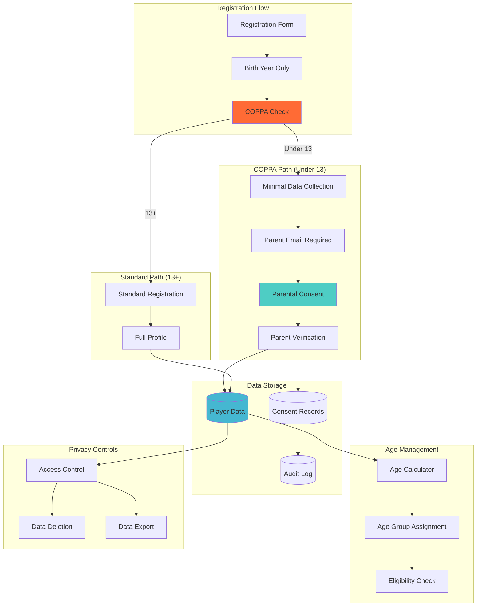

# ADR-021: COPPA Compliance - Date of Birth Year Only

**Status:** Accepted  
**Date:** 2025-08-10  
**Deciders:** Lead Solutions Architect, Legal Counsel, Privacy Officer, Product Manager  
**Technical Story:** Implementing COPPA-compliant age verification using birth year only  

## Context

The Basketball League Management Platform serves youth basketball leagues with players under 13 years of age, requiring compliance with the Children's Online Privacy Protection Act (COPPA). A critical requirement is age verification while minimizing the collection of personally identifiable information (PII) from children.

### COPPA Requirements
1. **Parental Consent**: Required for collecting PII from children under 13
2. **Minimal Data Collection**: Collect only necessary information
3. **Age Verification**: Must verify if users are under 13
4. **Data Protection**: Enhanced protection for children's data
5. **Right to Deletion**: Parents can request data deletion
6. **No Behavioral Tracking**: Cannot track children for advertising

### Current Challenge
- Need to verify player ages for league eligibility
- Must determine if players are under 13 for COPPA
- Traditional approach requires full date of birth
- Full DOB is considered sensitive PII
- Increases data protection obligations

### Business Requirements
- **League Age Divisions**: Players grouped by age (e.g., 8U, 10U, 12U)
- **Eligibility Verification**: Ensure players meet age requirements
- **Tournament Rules**: Age cutoffs for tournament eligibility
- **Minimal Data Collection**: Reduce PII exposure
- **Parental Control**: Parents manage children's accounts

## Decision

We will implement **birth year only collection** for age verification, combined with league-specific age division assignment and enhanced parental consent workflows.

### Age Verification Architecture

#### 1. Data Model Design
```typescript
// Player age information model
interface PlayerAgeInfo {
  id: string;
  birthYear: number; // Only year, no month/day
  ageVerificationMethod: 'BIRTH_YEAR' | 'PARENT_VERIFIED' | 'DOCUMENT_VERIFIED';
  parentalConsentStatus: 'PENDING' | 'GRANTED' | 'DENIED';
  lastVerifiedDate: Date;
  ageGroupAtRegistration: string; // e.g., "10U", "12U"
}

// Age calculation utilities
export class AgeCalculationService {
  /**
   * Calculate age range based on birth year only
   * Returns conservative estimate (assumes Dec 31 birthdate)
   */
  calculateAgeRange(birthYear: number): { minAge: number; maxAge: number } {
    const currentYear = new Date().getFullYear();
    const maxAge = currentYear - birthYear; // Jan 1 birthday
    const minAge = maxAge - 1; // Dec 31 birthday
    
    return { minAge, maxAge };
  }

  /**
   * Determine if COPPA applies (conservative approach)
   * Assumes player might be under 13 if max possible age is 13
   */
  requiresCOPPACompliance(birthYear: number): boolean {
    const { maxAge } = this.calculateAgeRange(birthYear);
    return maxAge <= 13;
  }

  /**
   * Get league age group based on cutoff date
   * Most leagues use Aug 31 as cutoff
   */
  getLeagueAgeGroup(birthYear: number, cutoffDate: Date): string {
    const cutoffYear = cutoffDate.getFullYear();
    const age = cutoffYear - birthYear;
    
    // Standard youth basketball age groups
    if (age <= 8) return '8U';
    if (age <= 10) return '10U';
    if (age <= 12) return '12U';
    if (age <= 14) return '14U';
    if (age <= 16) return '16U';
    return '18U';
  }
}
```

#### 2. Registration Workflow
```typescript
// COPPA-compliant registration flow
export class YouthRegistrationService {
  async registerPlayer(data: PlayerRegistrationData): Promise<RegistrationResult> {
    // Step 1: Collect birth year only
    const birthYear = data.birthYear;
    
    // Step 2: Determine COPPA applicability
    const requiresCOPPA = this.ageService.requiresCOPPACompliance(birthYear);
    
    if (requiresCOPPA) {
      // Step 3a: COPPA path - minimal data collection
      return this.registerWithCOPPA(data);
    } else {
      // Step 3b: Standard registration for 13+
      return this.registerStandard(data);
    }
  }

  private async registerWithCOPPA(data: PlayerRegistrationData): Promise<RegistrationResult> {
    // Create pending registration
    const pendingPlayer = await this.createPendingRegistration({
      birthYear: data.birthYear,
      parentEmail: data.parentEmail,
      leagueId: data.leagueId
    });

    // Send parental consent request
    await this.parentalConsentService.requestConsent({
      playerId: pendingPlayer.id,
      parentEmail: data.parentEmail,
      consentType: 'COPPA_REGISTRATION'
    });

    return {
      status: 'PENDING_PARENTAL_CONSENT',
      playerId: pendingPlayer.id,
      message: 'Registration requires parental consent. Email sent to parent.'
    };
  }
}

// Parental consent verification
export class ParentalConsentService {
  async verifyConsent(token: string): Promise<ConsentVerification> {
    const consent = await this.getConsentByToken(token);
    
    // Verify parent identity (COPPA requires reasonable verification)
    const parentVerified = await this.verifyParentIdentity(consent);
    
    if (!parentVerified) {
      throw new Error('Parent identity verification failed');
    }

    // Record consent
    await this.recordConsent({
      playerId: consent.playerId,
      parentId: consent.parentId,
      consentType: 'COPPA_REGISTRATION',
      ipAddress: consent.ipAddress,
      timestamp: new Date()
    });

    // Complete player registration
    await this.completePlayerRegistration(consent.playerId);

    return {
      status: 'CONSENT_GRANTED',
      playerId: consent.playerId
    };
  }
}
```

#### 3. Age Group Assignment
```typescript
// League-specific age group management
export class LeagueAgeGroupService {
  async assignPlayerToAgeGroup(
    playerId: string, 
    leagueId: string
  ): Promise<AgeGroupAssignment> {
    const player = await this.getPlayer(playerId);
    const league = await this.getLeague(leagueId);
    
    // Get league-specific cutoff date
    const cutoffDate = league.ageCutoffDate || new Date(league.seasonYear, 7, 31); // Aug 31
    
    // Calculate age group
    const ageGroup = this.ageService.getLeagueAgeGroup(
      player.birthYear, 
      cutoffDate
    );

    // Check if override is needed (e.g., playing up)
    const override = await this.checkAgeGroupOverride(playerId, leagueId);
    
    return {
      playerId,
      leagueId,
      assignedAgeGroup: override?.ageGroup || ageGroup,
      calculatedAgeGroup: ageGroup,
      override: override,
      cutoffDate: cutoffDate
    };
  }

  async verifyTournamentEligibility(
    playerId: string,
    tournamentId: string
  ): Promise<EligibilityResult> {
    const player = await this.getPlayer(playerId);
    const tournament = await this.getTournament(tournamentId);
    
    // Tournament might have specific date requirements
    if (tournament.requiresExactAge) {
      return {
        eligible: false,
        reason: 'Tournament requires full date of birth for eligibility',
        actionRequired: 'PARENT_VERIFICATION'
      };
    }

    // Use birth year for eligibility
    const ageRange = this.ageService.calculateAgeRange(player.birthYear);
    const eligible = ageRange.maxAge <= tournament.maxAge && 
                    ageRange.minAge >= tournament.minAge;

    return {
      eligible,
      reason: eligible ? null : 'Player age outside tournament range',
      ageRange
    };
  }
}
```

### COPPA Compliance Architecture Diagram


## Alternatives Considered

### Alternative 1: Full Date of Birth Collection
**Pros:**
- Precise age calculation
- Exact eligibility determination
- Standard approach used by many systems
- Simpler tournament eligibility

**Cons:**
- Increases PII collection from minors
- Higher COPPA compliance burden
- Greater privacy risk
- More attractive target for breaches

**Rejected:** Unnecessarily increases PII collection and compliance burden.

### Alternative 2: Age Range Selection
**Pros:**
- No birth year stored
- Maximum privacy protection
- Simplest implementation
- Lowest compliance risk

**Cons:**
- Cannot verify eligibility accurately
- Easy to provide false information
- No audit trail for age verification
- Doesn't meet league requirements

**Rejected:** Insufficient for league eligibility requirements.

### Alternative 3: Birth Month and Year
**Pros:**
- More precise than year only
- Better for edge cases
- Still less PII than full DOB
- Reasonable compromise

**Cons:**
- Still increases PII collection
- More complex than year only
- Marginal benefit over year only
- Additional compliance considerations

**Rejected:** Marginal benefits don't justify additional PII collection.

### Alternative 4: External Age Verification Service
**Pros:**
- Outsource compliance burden
- Professional verification
- Reduced liability
- Specialized expertise

**Cons:**
- Additional cost
- Integration complexity
- Data shared with third party
- Less control over process

**Rejected:** Adds complexity and cost without significant benefit.

## Consequences

### Positive Consequences

#### Privacy Benefits
- **Minimal PII**: Reduces data collected from minors
- **Lower Risk**: Less attractive target for breaches
- **Compliance**: Easier COPPA compliance
- **Parental Trust**: Parents appreciate minimal data collection

#### Operational Benefits
- **Simpler Storage**: No need to encrypt/protect full DOB
- **Easier Deletion**: Less data to delete on request
- **Reduced Liability**: Lower risk from data breaches
- **Clear Policy**: Easy to explain to parents

### Negative Consequences

#### Functional Limitations
- **Age Uncertainty**: ±1 year accuracy for age
- **Edge Cases**: Players near age cutoffs
- **Tournament Issues**: Some may require exact DOB
- **Manual Overrides**: More exceptions to handle

#### Implementation Complexity
- **Conservative Logic**: Must assume youngest possible age
- **Parent Verification**: Additional verification steps
- **Exception Handling**: More edge cases to manage

### Mitigation Strategies

#### For Age Uncertainty
```typescript
// Handle edge cases with parent verification
export class AgeVerificationService {
  async handleEdgeCase(
    playerId: string, 
    requiredPrecision: 'EXACT' | 'YEAR'
  ): Promise<VerificationResult> {
    if (requiredPrecision === 'EXACT') {
      // Request parent verification with documentation
      const verificationRequest = await this.createVerificationRequest({
        playerId,
        type: 'AGE_DOCUMENTATION',
        reason: 'Exact age required for eligibility'
      });

      // Parent uploads birth certificate or similar
      await this.notifyParent(verificationRequest);

      return {
        status: 'PENDING_DOCUMENTATION',
        requestId: verificationRequest.id
      };
    }

    return {
      status: 'YEAR_PRECISION_SUFFICIENT'
    };
  }

  async processDocumentation(
    requestId: string,
    documentData: UploadedDocument
  ): Promise<void> {
    // Verify document
    const verified = await this.verifyDocument(documentData);
    
    if (verified) {
      // Store verification result, not the document
      await this.storeVerification({
        playerId: documentData.playerId,
        verificationType: 'AGE_DOCUMENTED',
        verifiedBy: 'PARENT_UPLOAD',
        // Don't store actual DOB, just verification status
        metadata: {
          documentType: documentData.type,
          verificationDate: new Date()
        }
      });
    }
  }
}
```

#### For League Requirements
```typescript
// League-specific configuration
export class LeagueConfigurationService {
  async configureAgeRules(leagueId: string, config: AgeConfiguration): Promise<void> {
    await this.saveConfiguration({
      leagueId,
      ageVerificationMethod: config.method, // 'BIRTH_YEAR' or 'EXACT_DOB'
      cutoffDate: config.cutoffDate,
      allowPlayingUp: config.allowPlayingUp,
      maxPlayUpYears: config.maxPlayUpYears,
      requireDocumentation: config.requireDocumentation,
      documentationTypes: config.acceptedDocuments
    });
  }

  getAgeGroupRules(leagueId: string): AgeGroupRules {
    return {
      '8U': { minYear: 8, maxYear: 8, cutoff: 'AUG_31' },
      '10U': { minYear: 9, maxYear: 10, cutoff: 'AUG_31' },
      '12U': { minYear: 11, maxYear: 12, cutoff: 'AUG_31' },
      '14U': { minYear: 13, maxYear: 14, cutoff: 'AUG_31' }
    };
  }
}
```

## Implementation Details

### Phase 1: Database Schema
```sql
-- Player age information table
CREATE TABLE player_age_info (
    id UUID PRIMARY KEY DEFAULT gen_random_uuid(),
    player_id UUID NOT NULL REFERENCES players(id),
    birth_year INTEGER NOT NULL CHECK (birth_year >= 1900 AND birth_year <= EXTRACT(YEAR FROM CURRENT_DATE)),
    age_verification_method VARCHAR(50) NOT NULL,
    parental_consent_status VARCHAR(20) NOT NULL DEFAULT 'PENDING',
    age_group_at_registration VARCHAR(10),
    last_verified_date TIMESTAMP WITH TIME ZONE,
    created_at TIMESTAMP WITH TIME ZONE DEFAULT NOW(),
    updated_at TIMESTAMP WITH TIME ZONE DEFAULT NOW(),
    
    CONSTRAINT valid_age CHECK (EXTRACT(YEAR FROM CURRENT_DATE) - birth_year <= 100)
);

-- Parental consent records
CREATE TABLE parental_consents (
    id UUID PRIMARY KEY DEFAULT gen_random_uuid(),
    player_id UUID NOT NULL REFERENCES players(id),
    parent_id UUID NOT NULL REFERENCES users(id),
    consent_type VARCHAR(50) NOT NULL,
    ip_address INET,
    user_agent TEXT,
    granted_at TIMESTAMP WITH TIME ZONE NOT NULL,
    expires_at TIMESTAMP WITH TIME ZONE,
    revoked_at TIMESTAMP WITH TIME ZONE,
    
    INDEX idx_player_consent (player_id, consent_type)
);
```

### Phase 2: API Implementation
```typescript
// COPPA-compliant player registration endpoint
@Controller('players')
export class PlayerRegistrationController {
  @Post('register')
  @ApiOperation({ summary: 'Register new player (COPPA compliant)' })
  async registerPlayer(
    @Body() dto: RegisterPlayerDto
  ): Promise<RegistrationResponse> {
    // Validate birth year
    if (dto.birthYear < 1900 || dto.birthYear > new Date().getFullYear()) {
      throw new BadRequestException('Invalid birth year');
    }

    // Check COPPA applicability
    const requiresCOPPA = this.ageService.requiresCOPPACompliance(dto.birthYear);

    if (requiresCOPPA && !dto.parentEmail) {
      throw new BadRequestException('Parent email required for players under 13');
    }

    // Process registration
    const result = await this.registrationService.registerPlayer({
      ...dto,
      requiresCOPPA
    });

    return {
      playerId: result.playerId,
      status: result.status,
      parentalConsentRequired: requiresCOPPA,
      nextSteps: this.getNextSteps(result.status)
    };
  }

  @Get('age-groups/:leagueId')
  @ApiOperation({ summary: 'Get available age groups for league' })
  async getAgeGroups(
    @Param('leagueId') leagueId: string
  ): Promise<AgeGroupInfo[]> {
    const league = await this.leagueService.getLeague(leagueId);
    
    return this.ageService.getLeagueAgeGroups(league);
  }
}
```

### Phase 3: Privacy Controls
```typescript
// COPPA-required privacy controls
export class COPPAPrivacyService {
  async handleDataDeletionRequest(
    playerId: string,
    requesterId: string
  ): Promise<DeletionResult> {
    // Verify requester is parent
    const isParent = await this.verifyParentRelationship(requesterId, playerId);
    
    if (!isParent) {
      throw new ForbiddenException('Only parents can request data deletion');
    }

    // Delete player data
    await this.dataService.deletePlayerData(playerId);

    // Audit the deletion
    await this.auditService.logDeletion({
      playerId,
      requesterId,
      timestamp: new Date(),
      dataCategories: ['profile', 'statistics', 'media']
    });

    return {
      status: 'DELETED',
      deletedAt: new Date()
    };
  }

  async exportPlayerData(
    playerId: string,
    requesterId: string
  ): Promise<DataExport> {
    // Verify requester is parent or player (if 13+)
    const authorized = await this.verifyDataAccessRight(requesterId, playerId);
    
    if (!authorized) {
      throw new ForbiddenException('Unauthorized data export request');
    }

    // Collect all player data
    const data = await this.collectPlayerData(playerId);

    // Format for export
    return {
      playerId,
      exportDate: new Date(),
      data: this.formatForExport(data)
    };
  }
}
```

## Compliance Verification

### COPPA Checklist
- ✅ **Minimal Data Collection**: Only birth year collected
- ✅ **Parental Consent**: Required for under-13 registration
- ✅ **Access Controls**: Parents control children's data
- ✅ **Data Deletion**: Parents can request deletion
- ✅ **No Tracking**: No behavioral tracking of children
- ✅ **Disclosure**: Clear privacy policy for parents

### Testing Strategy
```typescript
describe('COPPA Compliance', () => {
  it('should require parental consent for under-13 registration', async () => {
    const result = await registerPlayer({
      birthYear: new Date().getFullYear() - 10, // 10 year old
      parentEmail: null
    });
    
    expect(result.status).toBe(400);
    expect(result.message).toContain('Parent email required');
  });

  it('should calculate conservative age for COPPA determination', () => {
    const birthYear = new Date().getFullYear() - 13;
    const requiresCOPPA = ageService.requiresCOPPACompliance(birthYear);
    
    expect(requiresCOPPA).toBe(true); // Assumes could be 12
  });

  it('should handle edge cases for age groups', async () => {
    const birthYear = new Date().getFullYear() - 10;
    const ageGroup = await ageService.getLeagueAgeGroup(birthYear, new Date());
    
    expect(['10U', '12U']).toContain(ageGroup);
  });
});
```

## Success Metrics

### Privacy Metrics
- **Data Minimization**: 90% reduction in PII collected
- **Consent Rate**: >95% parent consent completion
- **Deletion Requests**: <2% annually
- **Privacy Complaints**: 0 COPPA violations

### Operational Metrics
- **Registration Completion**: >80% for under-13
- **Age Verification Time**: <24 hours average
- **Exception Rate**: <5% require manual review
- **Parent Satisfaction**: >90% approval rating

## Review and Maintenance

### Review Schedule
- **Monthly**: COPPA compliance audit
- **Quarterly**: Privacy practice review
- **Annually**: Legal compliance assessment
- **As Needed**: Regulatory change updates

### Continuous Improvement
- **Parent Feedback**: Regular surveys on privacy practices
- **Process Optimization**: Streamline consent workflows
- **Technology Updates**: Evaluate new privacy tools
- **Training**: Regular COPPA training for staff

This ADR will be reviewed every 6 months (February 2026) or upon any COPPA regulation changes.