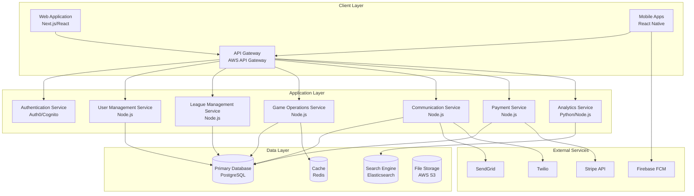

# Technical Requirements Document (TRD)
## Basketball League Management Platform

**Document ID:** TRD-BLMP-001  
**Version:** 1.0  
**Date:** January 8, 2025  
**Status:** Draft  
**Document Owner:** Business Analyst (CBAP Certified)

---

## Table of Contents

1. [Executive Summary](#1-executive-summary)
2. [Technical Architecture Overview](#2-technical-architecture-overview)
3. [Functional Technical Requirements](#3-functional-technical-requirements)
4. [Non-Functional Technical Requirements](#4-non-functional-technical-requirements)
5. [System Integration Requirements](#5-system-integration-requirements)
6. [Data Architecture Requirements](#6-data-architecture-requirements)
7. [Security Technical Requirements](#7-security-technical-requirements)
8. [Performance Technical Requirements](#8-performance-technical-requirements)
9. [Infrastructure Requirements](#9-infrastructure-requirements)
10. [Development & Deployment Requirements](#10-development--deployment-requirements)
11. [Compliance Technical Requirements](#11-compliance-technical-requirements)
12. [Quality Assurance Requirements](#12-quality-assurance-requirements)

---

## 1. Executive Summary

### 1.1 Purpose
This Technical Requirements Document (TRD) translates the business requirements defined in the PRD into detailed technical specifications following BABOK v3 guidelines. It serves as the foundation for solution architects, developers, and technical teams to implement the Basketball League Management Platform.

### 1.2 Scope
This document covers all technical requirements for the platform including:
- Web and mobile application architecture
- Database design and data management
- Integration with third-party services
- Security and compliance implementations
- Performance and scalability requirements
- Infrastructure and deployment specifications

### 1.3 Technical Approach
The platform follows modern cloud-native architecture patterns with:
- Microservices architecture for scalability
- API-first design for integration flexibility
- Mobile-first responsive design
- Real-time capabilities for live scoring
- Offline-first mobile applications

---

## 2. Technical Architecture Overview

### 2.1 High-Level Architecture



### 2.2 Technology Stack

#### Frontend Technologies
- **Web Application**: Next.js 14+, React 18+, TypeScript 5+
- **Mobile Application**: React Native 0.73+, Expo SDK 50+
- **UI Framework**: Tailwind CSS 3.4+, React Native Elements
- **State Management**: Zustand, React Query
- **Real-time**: Socket.io Client

#### Backend Technologies
- **Runtime**: Node.js 20+, TypeScript 5+
- **Framework**: Express.js, Fastify
- **API**: GraphQL (Apollo Server), REST endpoints
- **Real-time**: Socket.io Server
- **Authentication**: Auth0 or AWS Cognito
- **Validation**: Joi, Yup schemas

#### Database & Storage
- **Primary Database**: PostgreSQL 15+
- **Cache**: Redis 7+
- **Search**: Elasticsearch 8+
- **File Storage**: AWS S3
- **CDN**: AWS CloudFront

#### Infrastructure & DevOps
- **Cloud Provider**: AWS
- **Containerization**: Docker, Kubernetes
- **CI/CD**: GitHub Actions
- **Infrastructure as Code**: Terraform
- **Monitoring**: DataDog, New Relic

---

## 3. Functional Technical Requirements

### 3.1 User Management Service (TReq-001 through TReq-010)

#### TReq-001: Multi-Role Authentication System
**Business Requirement Mapping**: REQ-001, REQ-002  
**Priority**: Must Have (P0)  
**Technical Specification**:
```javascript
// Authentication JWT payload structure
interface JWTPayload {
  sub: string;           // User ID
  email: string;
  roles: UserRole[];     // Array of roles
  permissions: Permission[];
  exp: number;
  iat: number;
  iss: string;          // Issuer
}

// User role enumeration
enum UserRole {
  LEAGUE_ADMIN = 'league_admin',
  TEAM_COACH = 'team_coach',  
  PARENT = 'parent',
  PLAYER = 'player',
  REFEREE = 'referee',
  SCOREKEEPER = 'scorekeeper'
}
```

**Implementation Requirements**:
- OAuth 2.0 / OpenID Connect implementation
- JWT token-based authentication with refresh tokens
- Role-based access control (RBAC) middleware
- Multi-factor authentication for administrative roles
- Password strength validation (OWASP guidelines)
- Account lockout after failed attempts (5 attempts, 15-minute lockout)

#### TReq-002: User Profile Management API
**Business Requirement Mapping**: REQ-003  
**Priority**: Must Have (P0)  
**API Specifications**:
```typescript
// REST API endpoints
POST   /api/v1/users/profile          // Create profile
GET    /api/v1/users/profile/:id      // Get profile
PUT    /api/v1/users/profile/:id      // Update profile
DELETE /api/v1/users/profile/:id      // Soft delete profile

// GraphQL mutations
type Mutation {
  updateUserProfile(input: UserProfileInput!): UserProfile!
  uploadProfileImage(file: Upload!): FileUpload!
}
```

#### TReq-003: COPPA Compliant Registration
**Business Requirement Mapping**: NFR-013  
**Priority**: Must Have (P0)  
**Technical Implementation**:
- Age verification during registration
- Parental consent workflow for users under 13
- Encrypted storage of consent records
- Audit trail for all consent actions
- Automated consent reminder system

### 3.2 League Management Service (TReq-011 through TReq-020)

#### TReq-011: League Configuration Engine
**Business Requirement Mapping**: REQ-011  
**Priority**: Must Have (P0)  
**Database Schema**:
```sql
CREATE TABLE leagues (
  id UUID PRIMARY KEY DEFAULT gen_random_uuid(),
  name VARCHAR(255) NOT NULL,
  description TEXT,
  sport_type VARCHAR(50) NOT NULL DEFAULT 'basketball',
  season_start_date DATE NOT NULL,
  season_end_date DATE NOT NULL,
  registration_deadline TIMESTAMP,
  rules JSONB,
  fee_structure JSONB,
  divisions JSONB,
  settings JSONB,
  created_at TIMESTAMP DEFAULT NOW(),
  updated_at TIMESTAMP DEFAULT NOW()
);

CREATE INDEX idx_leagues_sport_season ON leagues(sport_type, season_start_date);
```

#### TReq-012: Team Management System
**Business Requirement Mapping**: REQ-012  
**Priority**: Must Have (P0)  
**Technical Specifications**:
- Dynamic roster size configuration
- Player eligibility validation engine
- Team balance algorithms (skill level, age)
- Coach assignment workflows
- Team communication channels

### 3.3 Scheduling Engine (TReq-021 through TReq-030)

#### TReq-021: Automated Schedule Generation Algorithm
**Business Requirement Mapping**: REQ-021  
**Priority**: Must Have (P0)  
**Algorithm Requirements**:
```typescript
interface SchedulingConstraints {
  teams: Team[];
  venues: Venue[];
  timeSlots: TimeSlot[];
  blackoutDates: Date[];
  minimumRestPeriod: number; // hours between games
  maxTravelDistance: number; // miles
  homeAwayBalance: boolean;
}

interface SchedulingResult {
  games: Game[];
  conflicts: Conflict[];
  optimizationScore: number;
  suggestions: Suggestion[];
}
```

**Implementation Approach**:
- Constraint satisfaction problem (CSP) solver
- Genetic algorithm for optimization
- Real-time conflict detection
- Manual override capabilities
- Batch processing for large leagues

#### TReq-022: Real-time Schedule Updates
**Business Requirement Mapping**: REQ-022  
**Priority**: Must Have (P0)  
**Technical Implementation**:
- Event-driven architecture for schedule changes
- WebSocket broadcasts for real-time updates
- Push notification triggers
- Calendar sync API integrations
- Audit log for all schedule modifications

### 3.4 Game Operations Service (TReq-031 through TReq-040)

#### TReq-031: Live Scoring System
**Business Requirement Mapping**: REQ-031  
**Priority**: Must Have (P0)  
**Real-time Architecture**:
```typescript
// WebSocket event structure
interface GameEvent {
  gameId: string;
  timestamp: number;
  eventType: 'SCORE' | 'FOUL' | 'TIMEOUT' | 'SUBSTITUTION';
  teamId: string;
  playerId?: string;
  points?: number;
  quarter: number;
  gameTime: string;
  metadata?: any;
}

// Offline-first data structure
interface OfflineGameState {
  gameId: string;
  events: GameEvent[];
  lastSyncTimestamp: number;
  conflictResolution: ConflictResolution[];
}
```

**Technical Requirements**:
- Offline-first mobile application
- Automatic conflict resolution
- Real-time synchronization via WebSockets
- Event sourcing for game state management
- Rollback capabilities for scoring errors

#### TReq-032: Statistics Engine
**Business Requirement Mapping**: REQ-033  
**Priority**: Should Have (P1)  
**Implementation Specifications**:
- Real-time statistics calculation
- Historical data aggregation
- Player performance metrics
- Team analytics
- Comparative analysis tools

---

## 4. Non-Functional Technical Requirements

### 4.1 Performance Requirements

#### TReq-NFR-001: API Response Times
**Business Requirement Mapping**: NFR-001  
**Specifications**:
- 95th percentile: < 200ms for read operations
- 99th percentile: < 500ms for read operations
- Write operations: < 1000ms
- Real-time updates: < 2000ms end-to-end

**Technical Implementation**:
- Database query optimization with proper indexing
- Redis caching strategy (write-through, read-through)
- CDN for static assets
- Database connection pooling
- API response caching headers

#### TReq-NFR-002: Concurrent User Support
**Business Requirement Mapping**: NFR-002  
**Specifications**:
- Normal load: 500 concurrent users
- Peak load: 1,000+ concurrent users (tournament days)
- Horizontal scaling capabilities
- Load balancer configuration

### 4.2 Security Requirements

#### TReq-NFR-011: Data Encryption Standards
**Business Requirement Mapping**: NFR-011  
**Technical Specifications**:
```typescript
// Encryption configuration
const encryptionConfig = {
  algorithm: 'aes-256-gcm',
  keyDerivation: 'pbkdf2',
  iterations: 100000,
  keyLength: 32,
  ivLength: 16,
  tagLength: 16
};

// Database encryption
CREATE TABLE sensitive_data (
  id UUID PRIMARY KEY,
  encrypted_data BYTEA,  -- AES-256 encrypted
  encryption_key_id VARCHAR(255),
  created_at TIMESTAMP
);
```

**Implementation Requirements**:
- TLS 1.3 for all communications
- AES-256 encryption for sensitive data at rest
- Key rotation every 90 days
- Hardware Security Module (HSM) for key management
- End-to-end encryption for sensitive communications

---

## 5. System Integration Requirements

### 5.1 Payment Processing Integration (TReq-INT-001)

#### Stripe Integration Specifications
**Business Requirement Mapping**: REQ-051  
**Technical Requirements**:
```typescript
// Payment processing interface
interface PaymentProcessor {
  createPaymentIntent(amount: number, currency: string): Promise<PaymentIntent>;
  confirmPayment(paymentIntentId: string): Promise<PaymentResult>;
  createSubscription(customerId: string, planId: string): Promise<Subscription>;
  handleWebhook(payload: string, signature: string): Promise<WebhookEvent>;
}

// Webhook endpoint
POST /api/v1/payments/webhooks/stripe
Content-Type: application/json
Stripe-Signature: [signature]
```

### 5.2 Communication Services Integration (TReq-INT-002)

#### Multi-Channel Communication
**Business Requirement Mapping**: REQ-041, REQ-042  
**Technical Specifications**:
- SendGrid for transactional emails
- Twilio for SMS notifications
- Firebase Cloud Messaging for push notifications
- WebSocket for real-time messaging

### 5.3 Calendar Integration (TReq-INT-003)

#### Calendar Sync Capabilities
**Technical Requirements**:
```typescript
// Calendar sync interface
interface CalendarSync {
  exportToICS(scheduleId: string): Promise<string>;
  syncWithGoogleCalendar(userId: string, calendarId: string): Promise<SyncResult>;
  syncWithOutlook(userId: string, calendarId: string): Promise<SyncResult>;
  handleCalendarWebhook(payload: CalendarWebhook): Promise<void>;
}
```

---

## 6. Data Architecture Requirements

### 6.1 Database Design Specifications

#### Primary Database Schema
```sql
-- Core entity relationships
CREATE TABLE organizations (
  id UUID PRIMARY KEY DEFAULT gen_random_uuid(),
  name VARCHAR(255) NOT NULL,
  type VARCHAR(50) NOT NULL, -- 'league', 'club', 'association'
  settings JSONB,
  created_at TIMESTAMP DEFAULT NOW()
);

CREATE TABLE leagues (
  id UUID PRIMARY KEY DEFAULT gen_random_uuid(),
  organization_id UUID REFERENCES organizations(id),
  name VARCHAR(255) NOT NULL,
  sport VARCHAR(50) NOT NULL DEFAULT 'basketball',
  season_config JSONB,
  rules JSONB,
  created_at TIMESTAMP DEFAULT NOW()
);

CREATE TABLE teams (
  id UUID PRIMARY KEY DEFAULT gen_random_uuid(),
  league_id UUID REFERENCES leagues(id),
  name VARCHAR(255) NOT NULL,
  division VARCHAR(100),
  coach_id UUID REFERENCES users(id),
  roster_config JSONB,
  created_at TIMESTAMP DEFAULT NOW()
);

CREATE TABLE users (
  id UUID PRIMARY KEY DEFAULT gen_random_uuid(),
  email VARCHAR(255) UNIQUE NOT NULL,
  password_hash VARCHAR(255),
  profile JSONB,
  roles VARCHAR(50)[] DEFAULT '{}',
  last_login TIMESTAMP,
  created_at TIMESTAMP DEFAULT NOW()
);

CREATE TABLE games (
  id UUID PRIMARY KEY DEFAULT gen_random_uuid(),
  league_id UUID REFERENCES leagues(id),
  home_team_id UUID REFERENCES teams(id),
  away_team_id UUID REFERENCES teams(id),
  venue_id UUID REFERENCES venues(id),
  scheduled_at TIMESTAMP NOT NULL,
  game_state JSONB,
  score_home INTEGER DEFAULT 0,
  score_away INTEGER DEFAULT 0,
  status VARCHAR(50) DEFAULT 'scheduled',
  created_at TIMESTAMP DEFAULT NOW()
);

CREATE TABLE game_events (
  id UUID PRIMARY KEY DEFAULT gen_random_uuid(),
  game_id UUID REFERENCES games(id),
  event_type VARCHAR(50) NOT NULL,
  team_id UUID REFERENCES teams(id),
  player_id UUID REFERENCES users(id),
  timestamp_game INTEGER NOT NULL, -- Game time in seconds
  timestamp_real TIMESTAMP DEFAULT NOW(),
  data JSONB,
  created_at TIMESTAMP DEFAULT NOW()
);
```

### 6.2 Data Migration Strategy
**Requirements**:
- Zero-downtime migrations
- Rollback capabilities
- Data validation scripts
- Performance impact monitoring

### 6.3 Backup and Recovery
**Technical Specifications**:
- Point-in-time recovery (PITR)
- Automated daily backups
- Cross-region replication
- Backup encryption
- Recovery testing procedures

---

## 7. Security Technical Requirements

### 7.1 Authentication & Authorization

#### JWT Token Management
```typescript
// JWT configuration
const jwtConfig = {
  secret: process.env.JWT_SECRET,
  audience: 'basketball-league-platform',
  issuer: 'gametriq-auth-service',
  expiresIn: '15m',        // Access token
  refreshExpiresIn: '7d'   // Refresh token
};

// Permission-based access control
interface Permission {
  resource: string;
  actions: string[];
  conditions?: Condition[];
}
```

### 7.2 Data Protection

#### PII Data Handling
**Technical Implementation**:
- Field-level encryption for PII
- Data anonymization for analytics
- Audit trails for data access
- Data retention policies
- Right to be forgotten implementation

---

## 8. Performance Technical Requirements

### 8.1 Caching Strategy

#### Multi-Level Caching
```typescript
// Cache layer configuration
interface CacheConfig {
  levels: {
    browser: CacheBrowserConfig;
    cdn: CacheCDNConfig;
    application: CacheAppConfig;
    database: CacheDBConfig;
  };
  ttl: {
    static: number;      // 24 hours
    dynamic: number;     // 5 minutes
    realtime: number;    // 30 seconds
  };
}
```

### 8.2 Database Optimization

#### Query Performance
```sql
-- Critical indexes for performance
CREATE INDEX CONCURRENTLY idx_games_league_scheduled 
ON games(league_id, scheduled_at) 
WHERE status IN ('scheduled', 'in_progress');

CREATE INDEX CONCURRENTLY idx_game_events_game_timestamp
ON game_events(game_id, timestamp_game);

CREATE INDEX CONCURRENTLY idx_users_roles_gin 
ON users USING GIN(roles);
```

---

## 9. Infrastructure Requirements

### 9.1 Cloud Infrastructure Architecture

#### AWS Services Configuration
```yaml
# Infrastructure as Code (Terraform)
resource "aws_ecs_cluster" "basketball_platform" {
  name = "basketball-league-platform"
  
  setting {
    name  = "containerInsights"
    value = "enabled"
  }
}

resource "aws_rds_cluster" "postgresql" {
  cluster_identifier      = "basketball-platform-db"
  engine                 = "aurora-postgresql"
  engine_version         = "15.3"
  master_username        = var.db_username
  master_password        = var.db_password
  backup_retention_period = 7
  preferred_backup_window = "07:00-09:00"
  
  serverlessv2_scaling_configuration {
    max_capacity = 2
    min_capacity = 0.5
  }
}
```

### 9.2 Container Orchestration

#### Kubernetes Deployment
```yaml
# Kubernetes deployment example
apiVersion: apps/v1
kind: Deployment
metadata:
  name: league-management-service
spec:
  replicas: 3
  selector:
    matchLabels:
      app: league-management-service
  template:
    metadata:
      labels:
        app: league-management-service
    spec:
      containers:
      - name: league-service
        image: gametriq/league-service:latest
        ports:
        - containerPort: 3000
        env:
        - name: DATABASE_URL
          valueFrom:
            secretKeyRef:
              name: db-credentials
              key: url
        resources:
          requests:
            memory: "256Mi"
            cpu: "250m"
          limits:
            memory: "512Mi"
            cpu: "500m"
```

---

## 10. Development & Deployment Requirements

### 10.1 CI/CD Pipeline Configuration

#### GitHub Actions Workflow
```yaml
name: Deploy Basketball Platform
on:
  push:
    branches: [main]
  pull_request:
    branches: [main]

jobs:
  test:
    runs-on: ubuntu-latest
    steps:
      - uses: actions/checkout@v4
      - uses: actions/setup-node@v4
        with:
          node-version: '20'
      - run: npm ci
      - run: npm run test:unit
      - run: npm run test:integration
      - run: npm run test:e2e

  security-scan:
    runs-on: ubuntu-latest
    steps:
      - uses: actions/checkout@v4
      - name: Run security scan
        uses: securecodewarrior/github-action-add-sarif@v1
        with:
          sarif-file: security-scan-results.sarif

  deploy:
    needs: [test, security-scan]
    runs-on: ubuntu-latest
    if: github.ref == 'refs/heads/main'
    steps:
      - name: Deploy to production
        run: |
          kubectl apply -f k8s/
          kubectl rollout restart deployment/league-management-service
```

### 10.2 Environment Configuration

#### Environment-Specific Settings
```typescript
// Configuration management
interface EnvironmentConfig {
  database: {
    host: string;
    port: number;
    ssl: boolean;
    poolSize: number;
  };
  redis: {
    host: string;
    port: number;
    cluster: boolean;
  };
  auth: {
    provider: 'auth0' | 'cognito';
    clientId: string;
    domain: string;
  };
  integrations: {
    stripe: StripeConfig;
    sendgrid: SendGridConfig;
    twilio: TwilioConfig;
  };
}
```

---

## 11. Compliance Technical Requirements

### 11.1 COPPA Compliance Implementation

#### Technical Specifications
```typescript
// COPPA compliance service
class COPPAComplianceService {
  async verifyAge(birthDate: Date): Promise<boolean> {
    const age = this.calculateAge(birthDate);
    return age >= 13;
  }
  
  async initiateParentalConsent(childUserId: string, parentEmail: string): Promise<ConsentProcess> {
    // Generate secure consent link
    // Send email to parent
    // Create consent record
  }
  
  async validateParentalConsent(token: string, signature: string): Promise<boolean> {
    // Verify digital signature
    // Update consent status
    // Audit log entry
  }
}
```

### 11.2 SafeSport Compliance

#### Message Monitoring System
```typescript
// SafeSport compliance for communications
interface MessageMonitoring {
  scanMessage(content: string, senderId: string, recipientId: string): Promise<ModerationResult>;
  flagInappropriateContent(messageId: string, reason: string): Promise<void>;
  auditCommunications(userId: string, dateRange: DateRange): Promise<CommunicationAudit>;
}
```

---

## 12. Quality Assurance Requirements

### 12.1 Testing Strategy

#### Test Coverage Requirements
```typescript
// Testing configuration
const testConfig = {
  coverage: {
    statements: 85,
    branches: 80,
    functions: 90,
    lines: 85
  },
  types: {
    unit: { framework: 'Jest', threshold: 90 },
    integration: { framework: 'Supertest', threshold: 80 },
    e2e: { framework: 'Playwright', threshold: 70 }
  }
};
```

### 12.2 Performance Testing

#### Load Testing Specifications
```javascript
// K6 performance test example
import http from 'k6/http';
import { check, sleep } from 'k6';

export let options = {
  stages: [
    { duration: '2m', target: 100 },  // Ramp up
    { duration: '5m', target: 500 },  // Stay at 500 users
    { duration: '2m', target: 1000 }, // Ramp up to 1000
    { duration: '5m', target: 1000 }, // Stay at 1000
    { duration: '2m', target: 0 },    // Ramp down
  ],
  thresholds: {
    http_req_duration: ['p(95)<500'], // 95% of requests under 500ms
  },
};
```

---

## Traceability Matrix

| Technical Requirement | Business Requirement | Test Case | Implementation Status |
|----------------------|----------------------|-----------|----------------------|
| TReq-001 | REQ-001, REQ-002 | TC-AUTH-001 | Not Started |
| TReq-002 | REQ-003 | TC-PROFILE-001 | Not Started |
| TReq-011 | REQ-011 | TC-LEAGUE-001 | Not Started |
| TReq-021 | REQ-021 | TC-SCHEDULE-001 | Not Started |
| TReq-031 | REQ-031 | TC-SCORING-001 | Not Started |
| TReq-NFR-001 | NFR-001 | TC-PERF-001 | Not Started |
| TReq-NFR-011 | NFR-011 | TC-SEC-001 | Not Started |

---

## Appendices

### Appendix A: API Documentation Standards
- OpenAPI 3.0 specification required
- Automated documentation generation
- Interactive API explorer
- Example requests/responses

### Appendix B: Code Quality Standards
- TypeScript strict mode enabled
- ESLint + Prettier configuration
- Husky pre-commit hooks
- Conventional commit messages

### Appendix C: Monitoring & Observability
- Application Performance Monitoring (APM)
- Error tracking and alerting
- Business metrics dashboards
- Log aggregation and analysis

---

**Document Approval**

| Role | Name | Signature | Date |
|------|------|-----------|------|
| Business Analyst | [CBAP Certified] | [Pending] | [Pending] |
| Solution Architect | [Pending] | [Pending] | [Pending] |
| Technical Lead | [Pending] | [Pending] | [Pending] |
| Security Architect | [Pending] | [Pending] | [Pending] |

---

*This document follows BABOK v3 guidelines and CBAP standards for technical requirements analysis and documentation.*