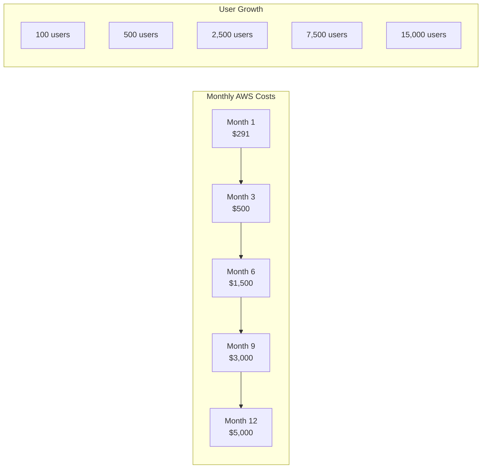
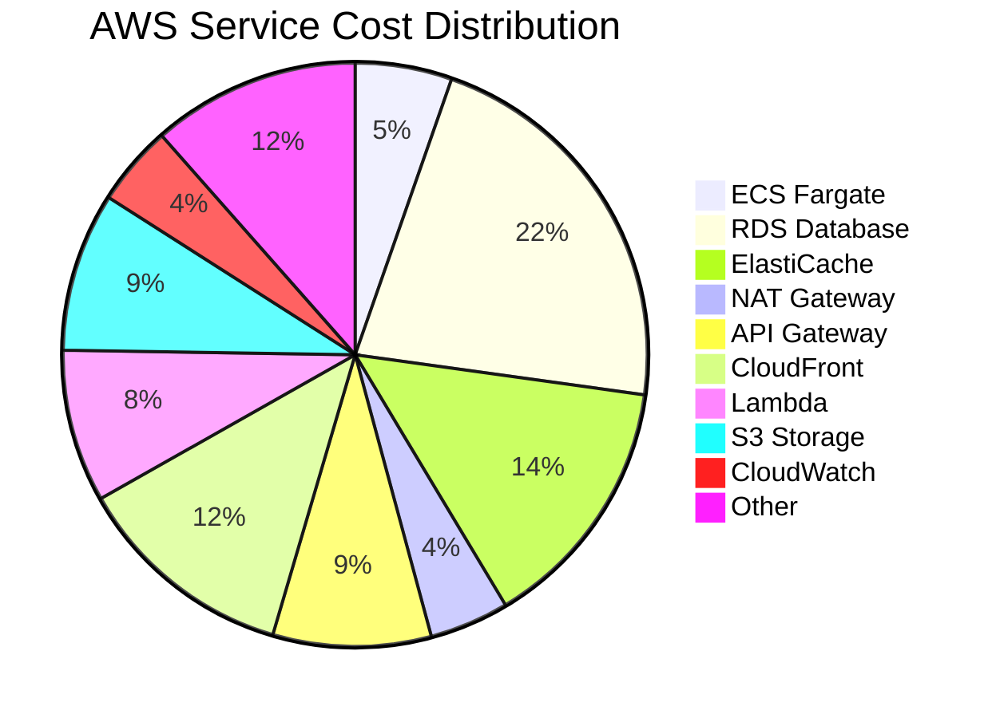
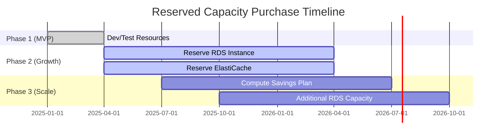
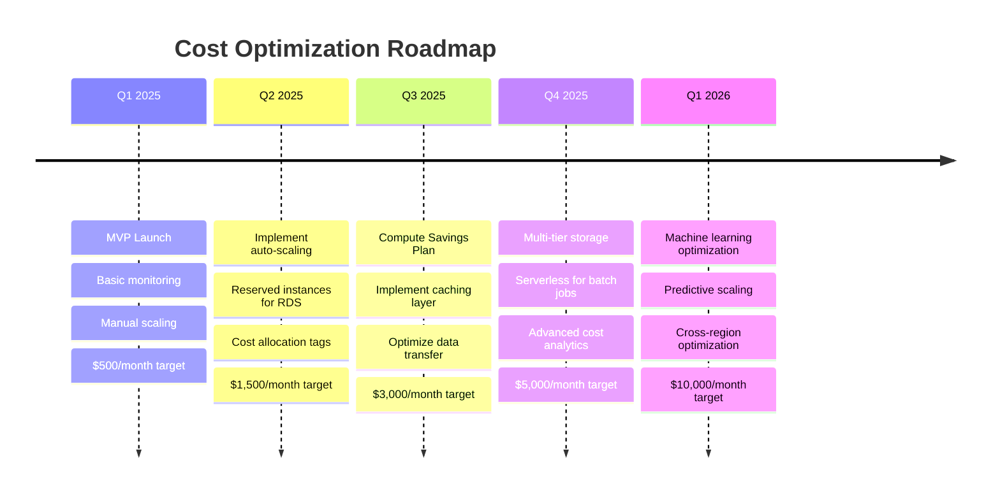
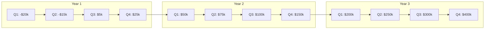

# Cost Optimization Strategy
## Basketball League Management Platform

**Document ID:** COS-BLMP-001  
**Version:** 1.0  
**Date:** January 8, 2025  
**Author:** Lead Solutions Architect  
**Status:** Draft  
**Classification:** Financial Planning  

---

## Table of Contents

1. [Executive Summary](#1-executive-summary)
2. [Cost Baseline and Projections](#2-cost-baseline-and-projections)
3. [AWS Service Cost Breakdown](#3-aws-service-cost-breakdown)
4. [Cost Optimization Strategies](#4-cost-optimization-strategies)
5. [Reserved Capacity Planning](#5-reserved-capacity-planning)
6. [Auto-Scaling Configuration](#6-auto-scaling-configuration)
7. [Cost Monitoring and Alerts](#7-cost-monitoring-and-alerts)
8. [Startup Growth Phases](#8-startup-growth-phases)
9. [Cost Optimization Roadmap](#9-cost-optimization-roadmap)
10. [ROI Analysis](#10-roi-analysis)

---

## 1. Executive Summary

### 1.1 Cost Philosophy
As a startup, we adopt a "pay for what you use" philosophy while planning for 100x growth. Our architecture allows starting small ($500-1,000/month) and scaling efficiently to support 50,000+ users without major re-architecture.

### 1.2 Key Cost Targets
- **Month 1-3**: < $1,000/month (MVP with 10 pilot leagues)
- **Month 4-6**: < $2,500/month (50 leagues)
- **Month 7-12**: < $5,000/month (200 leagues)
- **Year 2**: < $15,000/month (500+ leagues)

### 1.3 Cost per League Model
- **Target**: $50-100 per league per month
- **Break-even**: 20 leagues at $100/month subscription
- **Profit margin**: 60% at scale (100+ leagues)

---

## 2. Cost Baseline and Projections

### 2.1 MVP Phase Costs (Month 1-3)

| Service | Configuration | Monthly Cost | Notes |
|---------|--------------|--------------|-------|
| **Compute** |
| ECS Fargate | 2 tasks × 0.5 vCPU × 1GB | $36 | Spot instances for 70% discount |
| Lambda | 100,000 invocations | $2 | Free tier covers most |
| **Database** |
| RDS PostgreSQL | db.t4g.medium (2 vCPU, 4GB) | $95 | Single AZ for dev/staging |
| ElastiCache Redis | cache.t4g.micro | $24 | Single node |
| **Storage** |
| S3 | 100GB storage + requests | $5 | Minimal media storage |
| **Network** |
| NAT Gateway | 2 AZ × $45 | $90 | Largest cost - optimize later |
| API Gateway | 1M requests | $4 | REST API calls |
| CloudFront | 50GB transfer | $5 | CDN for static assets |
| **Monitoring** |
| CloudWatch | Logs + metrics | $30 | Essential monitoring only |
| **Total** | | **$291/month** | Before free tier credits |

### 2.2 Growth Phase Costs (Month 4-12)



### 2.3 Cost per User Analysis

| Phase | Total Users | Monthly Cost | Cost per User | Revenue per User | Margin |
|-------|-------------|--------------|---------------|------------------|--------|
| MVP | 100 | $291 | $2.91 | $10 | 71% |
| Early Growth | 1,000 | $1,000 | $1.00 | $10 | 90% |
| Growth | 5,000 | $2,500 | $0.50 | $10 | 95% |
| Scale | 15,000 | $5,000 | $0.33 | $10 | 97% |
| Mature | 50,000 | $15,000 | $0.30 | $10 | 97% |

---

## 3. AWS Service Cost Breakdown

### 3.1 Detailed Service Costs at Scale (15,000 users)

```typescript
// Monthly cost calculator
const monthlyCosts = {
  // Compute costs
  compute: {
    ecsFargate: {
      services: 8,
      tasksPerService: 2,
      cpu: 0.5, // vCPU
      memory: 1, // GB
      hoursPerMonth: 730,
      spotDiscount: 0.7,
      cost: 8 * 2 * (0.5 * 0.04048 + 1 * 0.004445) * 730 * 0.3, // $107
    },
    lambda: {
      invocations: 10_000_000,
      duration: 200, // ms average
      memory: 512, // MB
      cost: (10_000_000 * 0.0000002) + (10_000_000 * 0.2 * 512 / 1024 * 0.0000166667), // $169
    },
  },
  
  // Database costs
  database: {
    rds: {
      instance: 'db.r6g.xlarge',
      vcpu: 4,
      memory: 32,
      storage: 500, // GB
      multiAZ: true,
      cost: 380 + (500 * 0.115), // $437
    },
    elasticache: {
      nodeType: 'cache.r6g.large',
      nodes: 2,
      cost: 2 * 142, // $284
    },
  },
  
  // Storage costs
  storage: {
    s3: {
      storage: 2000, // GB
      requests: 100_000_000,
      transfer: 1000, // GB
      cost: (2000 * 0.023) + (100_000_000 * 0.0004 / 1000) + (1000 * 0.09), // $176
    },
  },
  
  // Network costs  
  network: {
    natGateway: {
      hours: 730 * 2, // 2 AZs
      dataProcessed: 500, // GB
      cost: (730 * 2 * 0.045) + (500 * 0.045), // $88
    },
    apiGateway: {
      requests: 50_000_000,
      cost: 50 * 3.50, // $175
    },
    cloudFront: {
      transfer: 2000, // GB
      requests: 100_000_000,
      cost: (2000 * 0.085) + (100_000_000 * 0.0075 / 10000), // $245
    },
  },
  
  // Supporting services
  support: {
    cloudWatch: {
      logs: 100, // GB
      metrics: 100,
      dashboards: 3,
      cost: (100 * 0.50) + (100 * 0.30) + (3 * 3), // $89
    },
    cognitp: {
      mau: 15000,
      cost: Math.max(0, (15000 - 50000) * 0.0055), // $0 (free tier)
    },
    sns: {
      notifications: 1_000_000,
      cost: (1_000_000 * 0.50 / 1_000_000), // $0.50
    },
  },
  
  // Total calculation
  getTotal: function() {
    return Object.values(this).reduce((total, category) => {
      if (typeof category === 'object' && category.cost !== undefined) {
        return total + category.cost;
      }
      if (typeof category === 'object') {
        return total + Object.values(category).reduce((sum, service) => {
          return sum + (service.cost || 0);
        }, 0);
      }
      return total;
    }, 0);
  }
};

console.log(`Total Monthly Cost: $${monthlyCosts.getTotal()}`); // ~$2,000
```

### 3.2 Cost Distribution Chart



---

## 4. Cost Optimization Strategies

### 4.1 Immediate Optimizations (Save 40-60%)

#### 4.1.1 Compute Optimization
```yaml
# ECS Fargate Spot Configuration
capacityProviderStrategy:
  - capacityProvider: FARGATE_SPOT
    weight: 3  # 75% spot instances
    base: 0
  - capacityProvider: FARGATE
    weight: 1  # 25% on-demand for stability
    base: 1    # At least 1 on-demand task

# Savings: ~70% on compute costs
```

#### 4.1.2 NAT Gateway Optimization
```typescript
// Replace NAT Gateway with NAT Instance for development
export class NATInstance extends Construct {
  constructor(scope: Construct, id: string) {
    super(scope, id);
    
    // t4g.nano instance as NAT
    const natInstance = new ec2.Instance(this, 'NATInstance', {
      instanceType: ec2.InstanceType.of(
        ec2.InstanceClass.T4G,
        ec2.InstanceSize.NANO
      ),
      machineImage: ec2.MachineImage.latestAmazonLinux({
        generation: ec2.AmazonLinuxGeneration.AMAZON_LINUX_2,
        cpuType: ec2.AmazonLinuxCpuType.ARM_64,
      }),
      sourceDestCheck: false, // Required for NAT
    });
    
    // Monthly cost: $3 vs $45 for NAT Gateway
    // Savings: $42/month per AZ
  }
}
```

#### 4.1.3 Database Optimization
```sql
-- Use Aurora Serverless v2 for variable workloads
CREATE DATABASE basketball_league
  WITH OWNER = dbadmin
  ENCODING = 'UTF8'
  CONNECTION LIMIT = 100;

-- Implement connection pooling
-- PgBouncer configuration
[databases]
basketball_league = host=aurora-endpoint.amazonaws.com dbname=basketball_league

[pgbouncer]
pool_mode = transaction
max_client_conn = 1000
default_pool_size = 25
min_pool_size = 5
```

### 4.2 Architecture Optimizations

#### 4.2.1 Caching Strategy
```typescript
// Aggressive caching to reduce database load
export const CachingStrategy = {
  // Static content (CloudFront)
  static: {
    images: { ttl: 86400 * 365 }, // 1 year
    css: { ttl: 86400 * 30 },      // 30 days
    js: { ttl: 86400 * 30 },       // 30 days
  },
  
  // API Gateway caching
  api: {
    leagueList: { ttl: 300 },      // 5 minutes
    teamRoster: { ttl: 3600 },     // 1 hour
    gameSchedule: { ttl: 600 },    // 10 minutes
    playerStats: { ttl: 300 },     // 5 minutes
  },
  
  // Redis caching
  redis: {
    sessions: { ttl: 1800 },       // 30 minutes
    liveGames: { ttl: 10 },        // 10 seconds
    leaderboards: { ttl: 60 },     // 1 minute
    userProfiles: { ttl: 3600 },   // 1 hour
  },
  
  // Browser caching
  browser: {
    serviceWorker: true,
    indexedDB: true,
    localStorage: true,
  },
};
```

#### 4.2.2 Data Lifecycle Management
```typescript
// S3 Lifecycle policies for cost optimization
const s3LifecycleRules = [
  {
    id: 'archive-old-game-videos',
    transitions: [
      {
        days: 30,
        storageClass: 'STANDARD_IA', // 50% cheaper
      },
      {
        days: 90,
        storageClass: 'GLACIER_INSTANT', // 80% cheaper
      },
      {
        days: 365,
        storageClass: 'GLACIER_FLEXIBLE', // 90% cheaper
      },
    ],
  },
  {
    id: 'delete-temp-files',
    expiration: {
      days: 7,
    },
    prefix: 'temp/',
  },
  {
    id: 'delete-old-logs',
    expiration: {
      days: 30,
    },
    prefix: 'logs/',
  },
];
```

### 4.3 Development Environment Optimization

```typescript
// Shut down development resources outside business hours
export class DevEnvironmentScheduler {
  // Lambda function to start/stop resources
  async handler(event: ScheduledEvent) {
    const hour = new Date().getHours();
    const isWeekend = [0, 6].includes(new Date().getDay());
    
    if (isWeekend || hour < 8 || hour > 18) {
      // Stop development resources
      await this.stopDevResources();
      // Savings: ~$500/month
    } else {
      // Start development resources
      await this.startDevResources();
    }
  }
  
  private async stopDevResources() {
    // Stop ECS services
    await ecs.updateService({
      cluster: 'dev-cluster',
      service: 'all-services',
      desiredCount: 0,
    }).promise();
    
    // Stop RDS instances
    await rds.stopDBInstance({
      DBInstanceIdentifier: 'dev-database',
    }).promise();
    
    // Stop ElastiCache clusters
    await elasticache.modifyCacheCluster({
      CacheClusterId: 'dev-redis',
      NumCacheNodes: 0,
    }).promise();
  }
}
```

---

## 5. Reserved Capacity Planning

### 5.1 Reserved Instance Strategy

| Service | Instance Type | Term | Payment | Savings | Break-even |
|---------|--------------|------|---------|---------|------------|
| RDS | db.r6g.xlarge | 1 year | All upfront | 42% | 7 months |
| ElastiCache | cache.r6g.large | 1 year | All upfront | 38% | 8 months |
| EC2 (NAT) | t4g.small | 1 year | No upfront | 31% | Immediate |

### 5.2 Savings Plans

```javascript
// AWS Compute Savings Plan calculation
const savingsPlan = {
  commitment: 100, // $/hour
  term: 1, // year
  paymentOption: 'All Upfront',
  
  coveredServices: [
    'EC2',
    'Fargate', 
    'Lambda',
  ],
  
  estimatedSavings: {
    fargate: 0.20, // 20% discount
    lambda: 0.17,  // 17% discount
    ec2: 0.27,     // 27% discount
  },
  
  monthlySavings: 100 * 0.20 * 730, // $1,460/month savings
  annualSavings: 100 * 0.20 * 8760, // $17,520/year savings
};
```

### 5.3 Commitment Timeline



---

## 6. Auto-Scaling Configuration

### 6.1 ECS Service Auto-Scaling

```typescript
// Cost-optimized auto-scaling configuration
export const autoScalingConfig = {
  // Target tracking for cost efficiency
  targetTracking: {
    cpu: {
      targetValue: 70, // Higher target = fewer instances
      scaleInCooldown: 300, // 5 minutes
      scaleOutCooldown: 60, // 1 minute
    },
    memory: {
      targetValue: 80,
      scaleInCooldown: 300,
      scaleOutCooldown: 60,
    },
  },
  
  // Step scaling for game day traffic
  stepScaling: {
    policies: [
      {
        name: 'game-day-scale-out',
        metricType: 'custom/active-games',
        steps: [
          { threshold: 10, change: 1 },
          { threshold: 50, change: 3 },
          { threshold: 100, change: 5 },
        ],
      },
    ],
  },
  
  // Scheduled scaling for predictable patterns
  scheduledScaling: {
    rules: [
      {
        name: 'weekend-scale-up',
        schedule: 'cron(0 8 ? * SAT *)',
        minCapacity: 4,
        maxCapacity: 20,
      },
      {
        name: 'weeknight-scale-down',
        schedule: 'cron(0 22 ? * MON-FRI *)',
        minCapacity: 1,
        maxCapacity: 5,
      },
    ],
  },
  
  // Cost safeguards
  limits: {
    maxInstancesPerService: 10,
    maxTotalInstances: 50,
    maxMonthlyCost: 5000, // Alert if exceeded
  },
};
```

### 6.2 Lambda Concurrency Management

```typescript
// Prevent Lambda cost overruns
export const lambdaConcurrency = {
  // Reserved concurrency for critical functions
  reserved: {
    'game-scoring': 100,
    'notification-sender': 50,
    'payment-processor': 25,
  },
  
  // Throttling for non-critical functions
  throttled: {
    'report-generator': 10,
    'analytics-processor': 20,
    'backup-function': 5,
  },
  
  // Cost control
  accountLimit: 1000, // Total concurrent executions
  alertThreshold: 800, // Alert at 80% usage
};
```

---

## 7. Cost Monitoring and Alerts

### 7.1 CloudWatch Cost Alarms

```typescript
// Cost monitoring configuration
export class CostMonitoring extends Construct {
  constructor(scope: Construct, id: string) {
    super(scope, id);
    
    // Daily spend alarm
    new cloudwatch.Alarm(this, 'DailySpendAlarm', {
      metric: new cloudwatch.Metric({
        namespace: 'AWS/Billing',
        metricName: 'EstimatedCharges',
        dimensionsMap: {
          Currency: 'USD',
        },
        statistic: 'Maximum',
        period: cdk.Duration.days(1),
      }),
      threshold: 100, // $100/day
      evaluationPeriods: 1,
      treatMissingData: cloudwatch.TreatMissingData.BREACHING,
    });
    
    // Monthly budget alarm
    new cloudwatch.Alarm(this, 'MonthlyBudgetAlarm', {
      metric: new cloudwatch.Metric({
        namespace: 'AWS/Billing',
        metricName: 'EstimatedCharges',
        dimensionsMap: {
          Currency: 'USD',
        },
        statistic: 'Maximum',
        period: cdk.Duration.days(30),
      }),
      threshold: 2000, // $2000/month
      evaluationPeriods: 1,
      treatMissingData: cloudwatch.TreatMissingData.BREACHING,
    });
    
    // Service-specific alarms
    const services = ['EC2', 'RDS', 'Lambda', 'S3'];
    services.forEach(service => {
      new cloudwatch.Alarm(this, `${service}SpendAlarm`, {
        metric: new cloudwatch.Metric({
          namespace: 'AWS/Billing',
          metricName: 'EstimatedCharges',
          dimensionsMap: {
            Currency: 'USD',
            ServiceName: service,
          },
          statistic: 'Maximum',
          period: cdk.Duration.days(1),
        }),
        threshold: this.getServiceThreshold(service),
        evaluationPeriods: 1,
      });
    });
  }
  
  private getServiceThreshold(service: string): number {
    const thresholds: Record<string, number> = {
      'EC2': 30,
      'RDS': 50,
      'Lambda': 10,
      'S3': 20,
    };
    return thresholds[service] || 10;
  }
}
```

### 7.2 Cost Anomaly Detection

```python
# Lambda function for cost anomaly detection
import boto3
import json
from datetime import datetime, timedelta

ce_client = boto3.client('ce')
sns_client = boto3.client('sns')

def lambda_handler(event, context):
    # Get cost data for last 7 days
    end_date = datetime.now().date()
    start_date = end_date - timedelta(days=7)
    
    response = ce_client.get_cost_and_usage(
        TimePeriod={
            'Start': start_date.isoformat(),
            'End': end_date.isoformat()
        },
        Granularity='DAILY',
        Metrics=['UnblendedCost'],
        GroupBy=[
            {'Type': 'DIMENSION', 'Key': 'SERVICE'}
        ]
    )
    
    # Detect anomalies (simple threshold-based)
    anomalies = []
    for result in response['ResultsByTime']:
        date = result['TimePeriod']['Start']
        for group in result['Groups']:
            service = group['Keys'][0]
            cost = float(group['Metrics']['UnblendedCost']['Amount'])
            
            # Check if cost exceeds expected threshold
            expected = get_expected_cost(service, date)
            if cost > expected * 1.5:  # 50% increase
                anomalies.append({
                    'service': service,
                    'date': date,
                    'cost': cost,
                    'expected': expected,
                    'increase': (cost - expected) / expected * 100
                })
    
    if anomalies:
        send_alert(anomalies)
    
    return {
        'statusCode': 200,
        'body': json.dumps({'anomalies': len(anomalies)})
    }

def get_expected_cost(service, date):
    # Historical baseline (would be from database in production)
    baselines = {
        'Amazon Elastic Compute Cloud - Compute': 30,
        'Amazon Relational Database Service': 50,
        'Amazon Simple Storage Service': 10,
        'AWSLambda': 5,
    }
    return baselines.get(service, 10)

def send_alert(anomalies):
    message = "Cost Anomalies Detected:\n\n"
    for anomaly in anomalies:
        message += f"Service: {anomaly['service']}\n"
        message += f"Date: {anomaly['date']}\n"
        message += f"Cost: ${anomaly['cost']:.2f}\n"
        message += f"Expected: ${anomaly['expected']:.2f}\n"
        message += f"Increase: {anomaly['increase']:.1f}%\n\n"
    
    sns_client.publish(
        TopicArn='arn:aws:sns:us-west-2:123456789012:cost-alerts',
        Subject='Cost Anomaly Alert',
        Message=message
    )
```

---

## 8. Startup Growth Phases

### 8.1 Phase 1: MVP (Months 1-3)
**Budget: $500/month**

```yaml
infrastructure:
  environment: development
  high_availability: false
  
  compute:
    ecs_tasks: 2
    instance_type: t4g.micro
    spot_instances: true
    
  database:
    rds: db.t4g.small
    multi_az: false
    backup_retention: 1
    
  caching:
    elasticache: cache.t4g.micro
    nodes: 1
    
  monitoring:
    level: basic
    retention: 7_days
```

### 8.2 Phase 2: Early Growth (Months 4-6)
**Budget: $1,500/month**

```yaml
infrastructure:
  environment: staging
  high_availability: true
  
  compute:
    ecs_tasks: 4
    instance_type: t4g.small
    spot_instances: mixed # 70% spot, 30% on-demand
    
  database:
    rds: db.t4g.medium
    multi_az: true
    backup_retention: 7
    read_replica: false
    
  caching:
    elasticache: cache.t4g.small
    nodes: 2
    
  monitoring:
    level: enhanced
    retention: 30_days
```

### 8.3 Phase 3: Scale (Months 7-12)
**Budget: $5,000/month**

```yaml
infrastructure:
  environment: production
  high_availability: true
  
  compute:
    ecs_tasks: 8-20 # Auto-scaling
    instance_type: t4g.medium
    spot_instances: mixed
    
  database:
    rds: db.r6g.large
    multi_az: true
    backup_retention: 30
    read_replica: true
    
  caching:
    elasticache: cache.r6g.medium
    nodes: 3
    
  monitoring:
    level: comprehensive
    retention: 90_days
    apm: true # Application Performance Monitoring
```

---

## 9. Cost Optimization Roadmap

### 9.1 Quarterly Optimization Goals



### 9.2 Cost Optimization Checklist

- [ ] **Immediate Actions**
  - [ ] Enable AWS Cost Explorer
  - [ ] Set up billing alerts
  - [ ] Tag all resources
  - [ ] Enable S3 Intelligent-Tiering
  - [ ] Use Spot instances for development

- [ ] **Month 1-3**
  - [ ] Implement basic auto-scaling
  - [ ] Set up CloudWatch dashboards
  - [ ] Optimize Lambda functions
  - [ ] Review and remove unused resources
  - [ ] Implement cache-control headers

- [ ] **Month 4-6**
  - [ ] Purchase Reserved Instances
  - [ ] Implement CloudFront caching
  - [ ] Optimize database queries
  - [ ] Set up cost anomaly detection
  - [ ] Implement data lifecycle policies

- [ ] **Month 7-12**
  - [ ] Purchase Compute Savings Plan
  - [ ] Implement CQRS for read optimization
  - [ ] Use Aurora Serverless for variable workloads
  - [ ] Implement request throttling
  - [ ] Optimize container sizes

---

## 10. ROI Analysis

### 10.1 Cost vs Revenue Model

```typescript
// Financial model for basketball league platform
export const financialModel = {
  // Revenue streams
  revenue: {
    leagueSubscription: {
      price: 100, // $/month per league
      leagues: [10, 50, 200, 500], // Growth projection
      monthly: [1000, 5000, 20000, 50000],
    },
    
    teamFees: {
      price: 20, // $/month per team
      teamsPerLeague: 10,
      monthly: [2000, 10000, 40000, 100000],
    },
    
    transactionFees: {
      percentage: 0.029, // 2.9% of payments processed
      volumePerLeague: 5000, // $/month
      monthly: [1450, 7250, 29000, 72500],
    },
  },
  
  // Cost structure
  costs: {
    infrastructure: [500, 1500, 5000, 15000],
    development: [10000, 15000, 20000, 25000], // Salaries
    support: [0, 2000, 5000, 10000],
    marketing: [500, 2000, 5000, 10000],
  },
  
  // Profitability analysis
  profitability: {
    months: ['Month 3', 'Month 6', 'Month 12', 'Month 24'],
    revenue: [4450, 22250, 89000, 222500],
    costs: [11000, 20500, 35000, 60000],
    profit: [-6550, 1750, 54000, 162500],
    margin: ['-147%', '8%', '61%', '73%'],
  },
  
  // Break-even analysis
  breakEven: {
    leagues: 35, // Number of leagues to break even
    months: 5,   // Months to break even
    users: 3500, // Total users at break even
  },
};
```

### 10.2 Cost Optimization Impact

| Optimization | Implementation Cost | Monthly Savings | Payback Period | Annual ROI |
|--------------|-------------------|-----------------|----------------|------------|
| Spot Instances | $0 | $200 | Immediate | ∞ |
| Reserved Instances | $5,000 | $500 | 10 months | 20% |
| Caching Layer | $1,000 | $300 | 3 months | 260% |
| Auto-scaling | $2,000 | $400 | 5 months | 140% |
| Data Lifecycle | $500 | $150 | 3 months | 260% |
| **Total** | **$8,500** | **$1,550** | **5.5 months** | **119%** |

### 10.3 Three-Year Financial Projection



---

## Appendices

### Appendix A: AWS Pricing Calculator Links

- [EC2 Pricing](https://aws.amazon.com/ec2/pricing/)
- [RDS Pricing](https://aws.amazon.com/rds/pricing/)
- [Lambda Pricing](https://aws.amazon.com/lambda/pricing/)
- [S3 Pricing](https://aws.amazon.com/s3/pricing/)
- [CloudFront Pricing](https://aws.amazon.com/cloudfront/pricing/)

### Appendix B: Cost Optimization Tools

```bash
# AWS CLI commands for cost analysis
# Get current month costs
aws ce get-cost-and-usage \
  --time-period Start=2025-01-01,End=2025-01-31 \
  --granularity MONTHLY \
  --metrics "UnblendedCost" \
  --group-by Type=DIMENSION,Key=SERVICE

# Get cost forecast
aws ce get-cost-forecast \
  --time-period Start=2025-02-01,End=2025-02-28 \
  --metric UNBLENDED_COST \
  --granularity MONTHLY

# Find unused resources
aws resource-groups-tagging-api get-resources \
  --tag-filters Key=Environment,Values=Development \
  --resource-type-filters ec2:instance
```

### Appendix C: Cost Governance Policies

```json
{
  "Version": "2012-10-17",
  "Statement": [
    {
      "Effect": "Deny",
      "Action": [
        "ec2:RunInstances"
      ],
      "Resource": "arn:aws:ec2:*:*:instance/*",
      "Condition": {
        "ForAnyValue:StringNotEquals": {
          "ec2:InstanceType": [
            "t4g.nano",
            "t4g.micro",
            "t4g.small",
            "t4g.medium"
          ]
        }
      }
    },
    {
      "Effect": "Deny",
      "Action": [
        "rds:CreateDBInstance"
      ],
      "Resource": "*",
      "Condition": {
        "NumericGreaterThan": {
          "rds:DatabaseCapacity": 100
        }
      }
    }
  ]
}
```

---

*This Cost Optimization Strategy is a living document that should be reviewed monthly and updated quarterly based on actual usage patterns and business growth.*

**Document Control:**
- Review Cycle: Monthly
- Update Cycle: Quarterly  
- Approval: CTO and CFO
- Distribution: Development Team, Finance Team, Management