# Disaster Recovery and Business Continuity Plan
## Basketball League Management Platform

**Document ID:** DR-BLMP-001  
**Version:** 1.0  
**Date:** January 8, 2025  
**Author:** Lead Solutions Architect  
**Status:** Active  
**Classification:** Critical Operations  
**Last Test Date:** Pending Initial Test  
**Next Review Date:** April 8, 2025  

---

## Table of Contents

1. [Executive Summary](#1-executive-summary)
2. [Business Impact Analysis](#2-business-impact-analysis)
3. [Recovery Objectives](#3-recovery-objectives)
4. [Disaster Scenarios](#4-disaster-scenarios)
5. [Recovery Strategies](#5-recovery-strategies)
6. [Backup and Restore Procedures](#6-backup-and-restore-procedures)
7. [Failover Procedures](#7-failover-procedures)
8. [Communication Plan](#8-communication-plan)
9. [Testing and Maintenance](#9-testing-and-maintenance)
10. [Recovery Runbooks](#10-recovery-runbooks)

---

## 1. Executive Summary

### 1.1 Purpose
This Disaster Recovery (DR) and Business Continuity Plan ensures the Basketball League Management Platform can recover from various disaster scenarios while maintaining critical operations for youth basketball leagues across Phoenix.

### 1.2 Scope
- **Covered Systems**: All production systems including web applications, mobile apps, databases, and APIs
- **Geographic Coverage**: Primary region (us-west-2) with DR capabilities
- **User Impact**: 50,000+ users across 500+ leagues
- **Critical Period**: Weekend tournaments (Friday 5 PM - Sunday 10 PM)

### 1.3 Key Metrics
- **RTO (Recovery Time Objective)**: 4 hours for critical services
- **RPO (Recovery Point Objective)**: 1 hour for transactional data
- **Service Availability Target**: 99.9% (8.76 hours downtime/year)
- **Data Durability Target**: 99.999999999% (11 9's)

---

## 2. Business Impact Analysis

### 2.1 Critical Business Functions

| Function | Description | Maximum Tolerable Downtime | Financial Impact/Hour | User Impact |
|----------|-------------|---------------------------|----------------------|-------------|
| Live Scoring | Real-time game score updates | 15 minutes | $5,000 | Critical - Games cannot proceed |
| Game Scheduling | Schedule management | 4 hours | $1,000 | High - Confusion and delays |
| User Authentication | Login and access control | 1 hour | $2,000 | High - Complete platform lockout |
| Payment Processing | Registration fees | 24 hours | $500 | Medium - Delayed registrations |
| Team Management | Roster management | 8 hours | $250 | Medium - Administrative delays |
| Statistics/Reports | Historical data | 48 hours | $100 | Low - Can be regenerated |

### 2.2 System Dependencies


### 2.3 Data Classification

| Data Type | Classification | RPO | RTO | Backup Frequency |
|-----------|---------------|-----|-----|------------------|
| Live Game Scores | Critical | 5 minutes | 15 minutes | Continuous replication |
| User Accounts | Critical | 1 hour | 1 hour | Hourly snapshots |
| Payment Records | Critical | 1 hour | 4 hours | Hourly + transaction logs |
| Game Schedules | Important | 4 hours | 4 hours | Every 4 hours |
| Team Rosters | Important | 24 hours | 8 hours | Daily |
| Historical Stats | Standard | 24 hours | 48 hours | Daily |
| Media Files | Standard | 7 days | 72 hours | Weekly |

---

## 3. Recovery Objectives

### 3.1 Recovery Time Objectives (RTO)

```mermaid
gantt
    title Recovery Time Objectives by Service
    dateFormat HH:mm
    axisFormat %H:%M
    
    section Critical (0-1hr)
    Authentication Service    :crit, 00:00, 30m
    Database Primary          :crit, 00:00, 45m
    API Gateway              :crit, 00:00, 30m
    Live Scoring             :crit, 00:00, 15m
    
    section Important (1-4hr)
    Game Scheduling          :important, 00:30, 3h
    Payment Processing       :important, 01:00, 3h
    User Management          :important, 00:45, 2h
    
    section Standard (4-24hr)
    Reporting Services       :standard, 04:00, 20h
    Email Notifications      :standard, 02:00, 6h
    Media Storage           :standard, 04:00, 20h
```



### 3.2 Recovery Point Objectives (RPO)

| Service Tier | RPO Target | Backup Method | Validation Frequency |
|--------------|------------|---------------|---------------------|
| Tier 1 (Critical) | 5-15 minutes | Continuous replication | Every 15 minutes |
| Tier 2 (Important) | 1-4 hours | Hourly snapshots | Every hour |
| Tier 3 (Standard) | 24 hours | Daily backups | Daily |

---

## 4. Disaster Scenarios

### 4.1 Scenario Classification

| Scenario | Probability | Impact | Risk Level | Primary Strategy |
|----------|-------------|--------|------------|------------------|
| AWS Service Outage | Medium | High | High | Multi-AZ failover |
| Database Corruption | Low | Critical | High | Point-in-time recovery |
| DDoS Attack | Medium | High | High | AWS Shield + WAF |
| Data Center Failure | Low | Critical | Medium | Cross-region failover |
| Human Error | High | Medium | High | Versioning + backups |
| Ransomware | Low | Critical | Medium | Immutable backups |
| Natural Disaster | Low | Critical | Medium | Geographic redundancy |

### 4.2 Incident Severity Levels

```typescript
enum IncidentSeverity {
  SEV1 = "Critical - Complete platform outage",
  SEV2 = "Major - Core functionality impaired", 
  SEV3 = "Minor - Degraded performance",
  SEV4 = "Low - Minimal impact"
}

interface IncidentResponse {
  severity: IncidentSeverity;
  notificationTime: number; // minutes
  escalationPath: string[];
  requiredResponders: string[];
  communicationChannels: string[];
}

const incidentMatrix: Record<IncidentSeverity, IncidentResponse> = {
  [IncidentSeverity.SEV1]: {
    severity: IncidentSeverity.SEV1,
    notificationTime: 5,
    escalationPath: ['OnCall', 'TeamLead', 'CTO', 'CEO'],
    requiredResponders: ['SRE', 'DBA', 'Security', 'Leadership'],
    communicationChannels: ['PagerDuty', 'Slack', 'Phone', 'StatusPage']
  },
  // ... other severity levels
};
```

---

## 5. Recovery Strategies

### 5.1 High Availability Architecture

```yaml
# Multi-AZ deployment configuration
production:
  region: us-west-2
  availability_zones:
    - us-west-2a
    - us-west-2b
    
  rds:
    multi_az: true
    automated_backups: true
    backup_retention: 30
    backup_window: "03:00-04:00"
    
  elasticache:
    multi_az: true
    automatic_failover: true
    snapshot_retention: 7
    
  ecs:
    services:
      desired_count: 2
      deployment:
        maximum_percent: 200
        minimum_healthy_percent: 100
```

### 5.2 Backup Strategy


### 5.3 Failover Strategy

```typescript
// Automated failover configuration
export class FailoverManager {
  private readonly healthCheckInterval = 30; // seconds
  private readonly unhealthyThreshold = 3;
  private readonly healthyThreshold = 2;
  
  async checkHealth(): Promise<HealthStatus> {
    const checks = await Promise.all([
      this.checkDatabase(),
      this.checkAPI(),
      this.checkCache(),
      this.checkStorage(),
    ]);
    
    return {
      healthy: checks.every(c => c.healthy),
      services: checks,
      timestamp: new Date(),
    };
  }
  
  async initiateFailover(service: string): Promise<void> {
    console.log(`Initiating failover for ${service}`);
    
    switch(service) {
      case 'database':
        await this.failoverDatabase();
        break;
      case 'cache':
        await this.failoverCache();
        break;
      case 'region':
        await this.failoverRegion();
        break;
    }
    
    await this.notifyStakeholders(service);
    await this.updateStatusPage(service);
  }
  
  private async failoverDatabase(): Promise<void> {
    // Promote read replica to primary
    const rds = new AWS.RDS();
    await rds.promoteReadReplica({
      DBInstanceIdentifier: 'basketball-league-replica',
      BackupRetentionPeriod: 7,
    }).promise();
    
    // Update connection strings
    await this.updateDatabaseEndpoints();
    
    // Verify new primary
    await this.verifyDatabaseConnectivity();
  }
}
```

---

## 6. Backup and Restore Procedures

### 6.1 Automated Backup Configuration

```typescript
// AWS Backup Plan configuration
export const backupPlan = {
  rules: [
    {
      ruleName: 'DailyBackups',
      targetBackupVault: 'basketball-league-vault',
      scheduleExpression: 'cron(0 3 * * ? *)', // 3 AM daily
      startWindowMinutes: 60,
      completionWindowMinutes: 120,
      lifecycle: {
        deleteAfterDays: 30,
        moveToColdStorageAfterDays: 7,
      },
      recoveryPointTags: {
        Type: 'Daily',
        Application: 'BasketballLeague',
      },
    },
    {
      ruleName: 'HourlyBackups',
      targetBackupVault: 'basketball-league-vault',
      scheduleExpression: 'rate(1 hour)',
      startWindowMinutes: 60,
      completionWindowMinutes: 120,
      lifecycle: {
        deleteAfterDays: 2,
      },
      recoveryPointTags: {
        Type: 'Hourly',
        Application: 'BasketballLeague',
      },
    },
  ],
  
  selections: [
    {
      name: 'DatabaseBackup',
      resources: [
        'arn:aws:rds:us-west-2:*:cluster:basketball-league-*',
      ],
      tags: {
        Backup: 'true',
        Environment: 'production',
      },
    },
    {
      name: 'StorageBackup',
      resources: [
        'arn:aws:s3:::basketball-league-*',
      ],
      tags: {
        Backup: 'true',
        DataType: 'persistent',
      },
    },
  ],
};
```

### 6.2 Database Restore Procedures

```sql
-- Point-in-time recovery for PostgreSQL
-- Step 1: Identify recovery point
SELECT * FROM pg_stat_archiver;
SELECT * FROM pg_stat_bgwriter;

-- Step 2: Stop application connections
ALTER DATABASE basketball_league CONNECTION LIMIT 0;
SELECT pg_terminate_backend(pid) 
FROM pg_stat_activity 
WHERE datname = 'basketball_league' AND pid <> pg_backend_pid();

-- Step 3: Create recovery point
SELECT pg_create_restore_point('before_restore_' || now()::text);

-- Step 4: Restore from backup (AWS CLI)
```

```bash
#!/bin/bash
# restore-database.sh

RESTORE_TIME="2025-01-08T10:00:00Z"
SOURCE_DB="basketball-league-cluster"
TARGET_DB="basketball-league-restored"

# Create new cluster from backup
aws rds restore-db-cluster-to-point-in-time \
  --source-db-cluster-identifier $SOURCE_DB \
  --db-cluster-identifier $TARGET_DB \
  --restore-to-time $RESTORE_TIME \
  --use-latest-restorable-time

# Wait for restoration
aws rds wait db-cluster-available \
  --db-cluster-identifier $TARGET_DB

# Verify data integrity
psql -h $TARGET_DB.cluster-xxx.us-west-2.rds.amazonaws.com \
  -U admin -d basketball_league \
  -c "SELECT COUNT(*) FROM games WHERE date >= '2025-01-08';"
```

### 6.3 Application Recovery

```typescript
// Application recovery orchestration
export class ApplicationRecovery {
  async executeRecovery(scenario: string): Promise<RecoveryResult> {
    const steps: RecoveryStep[] = this.getRecoverySteps(scenario);
    const results: StepResult[] = [];
    
    for (const step of steps) {
      try {
        console.log(`Executing: ${step.name}`);
        const result = await this.executeStep(step);
        results.push(result);
        
        if (!result.success && step.critical) {
          throw new Error(`Critical step failed: ${step.name}`);
        }
      } catch (error) {
        await this.rollback(results);
        throw error;
      }
    }
    
    return {
      scenario,
      steps: results,
      duration: this.calculateDuration(results),
      success: results.every(r => r.success),
    };
  }
  
  private getRecoverySteps(scenario: string): RecoveryStep[] {
    const scenarios: Record<string, RecoveryStep[]> = {
      'database-failure': [
        { name: 'Stop application traffic', critical: true, timeout: 60 },
        { name: 'Promote read replica', critical: true, timeout: 300 },
        { name: 'Update DNS records', critical: true, timeout: 120 },
        { name: 'Verify database connectivity', critical: true, timeout: 60 },
        { name: 'Restart application services', critical: true, timeout: 180 },
        { name: 'Run health checks', critical: true, timeout: 120 },
        { name: 'Enable application traffic', critical: true, timeout: 60 },
        { name: 'Monitor for 15 minutes', critical: false, timeout: 900 },
      ],
      'region-failure': [
        { name: 'Declare disaster', critical: true, timeout: 60 },
        { name: 'Activate DR region', critical: true, timeout: 300 },
        { name: 'Restore from cross-region backup', critical: true, timeout: 1800 },
        { name: 'Update Route53 records', critical: true, timeout: 300 },
        { name: 'Verify all services', critical: true, timeout: 600 },
        { name: 'Notify users', critical: false, timeout: 300 },
      ],
    };
    
    return scenarios[scenario] || [];
  }
}
```

---

## 7. Failover Procedures

### 7.1 Database Failover


### 7.2 Regional Failover

```typescript
// Cross-region failover automation
export class RegionalFailover {
  private readonly primaryRegion = 'us-west-2';
  private readonly drRegion = 'us-east-1';
  
  async executeFailover(): Promise<void> {
    // Step 1: Verify primary region failure
    const primaryHealth = await this.checkRegionHealth(this.primaryRegion);
    if (primaryHealth.healthy) {
      throw new Error('Primary region is healthy, aborting failover');
    }
    
    // Step 2: Activate DR region
    await this.activateDRRegion();
    
    // Step 3: Update Route53 weighted routing
    await this.updateRoute53Weights({
      [this.primaryRegion]: 0,
      [this.drRegion]: 100,
    });
    
    // Step 4: Restore latest data
    await this.restoreFromCrossRegionBackup();
    
    // Step 5: Verify DR region services
    await this.verifyDRServices();
    
    // Step 6: Update status page
    await this.updateStatusPage('Operating from DR region');
  }
  
  private async activateDRRegion(): Promise<void> {
    const cloudFormation = new AWS.CloudFormation({
      region: this.drRegion,
    });
    
    // Deploy DR stack
    await cloudFormation.createStack({
      StackName: 'basketball-league-dr',
      TemplateURL: 's3://dr-templates/main.yaml',
      Parameters: [
        { ParameterKey: 'Environment', ParameterValue: 'dr' },
        { ParameterKey: 'ActivationMode', ParameterValue: 'immediate' },
      ],
      Capabilities: ['CAPABILITY_IAM'],
      OnFailure: 'ROLLBACK',
    }).promise();
    
    // Wait for stack completion
    await cloudFormation.waitFor('stackCreateComplete', {
      StackName: 'basketball-league-dr',
    }).promise();
  }
}
```

### 7.3 Service-Level Failover

| Service | Failover Method | Automatic | Time to Failover | Data Loss Risk |
|---------|----------------|-----------|------------------|----------------|
| API Gateway | Multi-AZ by default | Yes | < 30 seconds | None |
| ECS Services | Task replacement | Yes | < 2 minutes | None |
| RDS Primary | Multi-AZ failover | Yes | < 2 minutes | < 5 minutes |
| ElastiCache | Replica promotion | Yes | < 1 minute | < 1 minute |
| S3 | Cross-region replication | Yes | Immediate | None |
| Lambda | Multi-AZ by default | Yes | Immediate | None |

---

## 8. Communication Plan

### 8.1 Incident Communication Matrix

| Stakeholder | SEV1 | SEV2 | SEV3 | SEV4 | Method |
|-------------|------|------|------|------|--------|
| On-Call Engineer | Immediate | Immediate | 15 min | 1 hour | PagerDuty |
| Engineering Manager | 5 min | 15 min | 1 hour | Next day | Phone + Slack |
| CTO | 15 min | 1 hour | Next day | Weekly | Phone + Email |
| CEO | 30 min | 2 hours | Weekly | Monthly | Phone + Email |
| Customer Success | 15 min | 30 min | 2 hours | Next day | Slack + Email |
| Customers | 30 min | 1 hour | 4 hours | None | Status Page + Email |

### 8.2 Communication Templates

```markdown
## Initial Incident Notification

**Subject**: [SEV{severity}] {service} Service Disruption

**Body**:
We are currently experiencing issues with {service}.

**Impact**: {description of impact}
**Start Time**: {time}
**Affected Users**: {number or percentage}
**Current Status**: Investigating | Identified | Monitoring | Resolved

Our team is actively working on resolution.
Updates will be provided every {15|30|60} minutes.

Next update: {time}

## Resolution Notification

**Subject**: [RESOLVED] {service} Service Restored

**Body**:
The issue affecting {service} has been resolved.

**Resolution Time**: {time}
**Total Duration**: {duration}
**Root Cause**: {brief description}
**Actions Taken**: {summary of fix}

We apologize for any inconvenience caused.
A detailed post-mortem will be available within 48 hours.
```

### 8.3 Status Page Updates

```typescript
// Automated status page updates
export class StatusPageUpdater {
  private readonly statusPageApi = 'https://api.statuspage.io/v1';
  private readonly pageId = 'YOUR_PAGE_ID';
  
  async createIncident(
    severity: IncidentSeverity,
    affectedComponents: string[],
    message: string
  ): Promise<void> {
    const incident = {
      name: this.generateIncidentName(severity),
      status: 'investigating',
      impact: this.mapSeverityToImpact(severity),
      body: message,
      component_ids: affectedComponents,
      deliver_notifications: true,
    };
    
    await axios.post(
      `${this.statusPageApi}/pages/${this.pageId}/incidents`,
      { incident },
      {
        headers: {
          'Authorization': `OAuth ${process.env.STATUSPAGE_API_KEY}`,
        },
      }
    );
  }
  
  private mapSeverityToImpact(severity: IncidentSeverity): string {
    const mapping = {
      [IncidentSeverity.SEV1]: 'critical',
      [IncidentSeverity.SEV2]: 'major',
      [IncidentSeverity.SEV3]: 'minor',
      [IncidentSeverity.SEV4]: 'maintenance',
    };
    return mapping[severity];
  }
}
```

---

## 9. Testing and Maintenance

### 9.1 DR Testing Schedule

| Test Type | Frequency | Duration | Scope | Success Criteria |
|-----------|-----------|----------|-------|------------------|
| Backup Verification | Daily | 30 min | Automated backup integrity | All backups readable |
| Failover Drill | Monthly | 2 hours | Single service failover | RTO < target |
| Partial DR Test | Quarterly | 4 hours | Multiple services | RPO & RTO met |
| Full DR Simulation | Annually | 8 hours | Complete platform | Full recovery < 4 hours |
| Chaos Engineering | Weekly | 1 hour | Random failures | Auto-recovery works |

### 9.2 Testing Procedures

```bash
#!/bin/bash
# dr-test.sh - Disaster Recovery Test Script

set -e

echo "Starting DR Test: $(date)"

# Test 1: Backup Verification
echo "Testing backup integrity..."
aws backup describe-recovery-point \
  --backup-vault-name basketball-league-vault \
  --recovery-point-arn $LATEST_RECOVERY_POINT

# Test 2: Database Restore
echo "Testing database restore..."
aws rds restore-db-cluster-to-point-in-time \
  --source-db-cluster-identifier basketball-league-cluster \
  --db-cluster-identifier test-restore-$(date +%s) \
  --restore-type copy-on-write \
  --use-latest-restorable-time

# Test 3: Service Health Checks
echo "Testing service health endpoints..."
services=("api" "auth" "game" "user")
for service in "${services[@]}"; do
  response=$(curl -s -o /dev/null -w "%{http_code}" \
    https://${service}.basketballleague.com/health)
  
  if [ $response -eq 200 ]; then
    echo "✓ ${service} service is healthy"
  else
    echo "✗ ${service} service failed health check"
    exit 1
  fi
done

# Test 4: Failover Simulation
echo "Simulating database failover..."
aws rds failover-db-cluster \
  --db-cluster-identifier basketball-league-cluster \
  --target-db-instance-identifier basketball-league-instance-2

# Wait for failover completion
sleep 120

# Verify application connectivity
echo "Verifying application connectivity post-failover..."
npm run test:integration

echo "DR Test completed successfully: $(date)"
```

### 9.3 Chaos Engineering Tests

```typescript
// Chaos engineering configuration
export const chaosTests = {
  // Network chaos
  networkTests: [
    {
      name: 'Introduce latency',
      target: 'database',
      action: 'add-latency',
      parameters: { delay: '100ms', jitter: '50ms' },
      duration: '5m',
      expectedBehavior: 'Graceful degradation',
    },
    {
      name: 'Packet loss',
      target: 'redis',
      action: 'packet-loss',
      parameters: { percentage: 10 },
      duration: '3m',
      expectedBehavior: 'Retry with backoff',
    },
  ],
  
  // Service chaos
  serviceTests: [
    {
      name: 'Kill random container',
      target: 'ecs-tasks',
      action: 'terminate',
      parameters: { count: 1 },
      expectedBehavior: 'Auto-replacement within 2 minutes',
    },
    {
      name: 'CPU stress',
      target: 'game-service',
      action: 'stress-cpu',
      parameters: { utilization: 90 },
      duration: '10m',
      expectedBehavior: 'Auto-scaling triggers',
    },
  ],
  
  // Data chaos
  dataTests: [
    {
      name: 'Corrupt cache entry',
      target: 'redis',
      action: 'corrupt-key',
      parameters: { pattern: 'game:*' },
      expectedBehavior: 'Fallback to database',
    },
  ],
};
```

---

## 10. Recovery Runbooks

### 10.1 Database Recovery Runbook

```markdown
## Runbook: Database Recovery
**ID**: RB-001
**Last Updated**: January 8, 2025
**Owner**: Database Team

### Prerequisites
- AWS CLI configured
- Database admin credentials
- Access to backup vault

### Steps

1. **Assess the situation** (5 minutes)
   ```bash
   aws rds describe-db-clusters --db-cluster-identifier basketball-league-cluster
   aws rds describe-db-cluster-snapshots --db-cluster-identifier basketball-league-cluster
   ```

2. **Stop application traffic** (2 minutes)
   ```bash
   aws elbv2 modify-target-group-attributes \
     --target-group-arn $TARGET_GROUP_ARN \
     --attributes Key=deregistration_delay.timeout_seconds,Value=0
   ```

3. **Identify recovery point** (5 minutes)
   ```sql
   SELECT max(backup_timestamp) FROM backup_log;
   ```

4. **Initiate recovery** (30-60 minutes)
   ```bash
   aws rds restore-db-cluster-from-snapshot \
     --db-cluster-identifier basketball-league-recovered \
     --snapshot-identifier $SNAPSHOT_ID \
     --engine aurora-postgresql
   ```

5. **Update application configuration** (5 minutes)
   ```bash
   aws secretsmanager update-secret \
     --secret-id basketball-league/database \
     --secret-string '{"host":"new-endpoint.rds.amazonaws.com"}'
   ```

6. **Verify data integrity** (10 minutes)
   ```sql
   SELECT COUNT(*) FROM games WHERE created_at > NOW() - INTERVAL '1 day';
   SELECT COUNT(*) FROM users WHERE last_login > NOW() - INTERVAL '1 week';
   ```

7. **Resume application traffic** (2 minutes)
   ```bash
   aws ecs update-service --cluster basketball-league \
     --service game-service --force-new-deployment
   ```

8. **Monitor for issues** (30 minutes)
   - Check CloudWatch dashboards
   - Review application logs
   - Monitor error rates

### Rollback Procedure
If recovery fails:
1. Revert DNS changes
2. Restore original configuration
3. Escalate to senior DBA
```

### 10.2 Application Recovery Runbook

```markdown
## Runbook: Application Service Recovery
**ID**: RB-002
**Last Updated**: January 8, 2025
**Owner**: Platform Team

### Steps

1. **Identify failed service** (2 minutes)
   ```bash
   aws ecs list-services --cluster basketball-league
   aws ecs describe-services --cluster basketball-league --services $SERVICE
   ```

2. **Check recent deployments** (3 minutes)
   ```bash
   aws ecs describe-task-definition --task-definition $TASK_DEF
   git log --oneline -10
   ```

3. **Rollback if needed** (5 minutes)
   ```bash
   # Rollback to previous task definition
   aws ecs update-service \
     --cluster basketball-league \
     --service $SERVICE \
     --task-definition $PREVIOUS_TASK_DEF
   ```

4. **Scale up healthy instances** (2 minutes)
   ```bash
   aws ecs update-service \
     --cluster basketball-league \
     --service $SERVICE \
     --desired-count 5
   ```

5. **Clear problematic cache** (1 minute)
   ```bash
   redis-cli FLUSHALL
   ```

6. **Verify service health** (5 minutes)
   ```bash
   curl https://api.basketballleague.com/$SERVICE/health
   ```
```

### 10.3 Complete Platform Recovery Runbook

```typescript
// Automated platform recovery orchestration
export class PlatformRecovery {
  async executeTotalRecovery(): Promise<void> {
    const recoverySteps = [
      { name: 'Assess damage', fn: this.assessDamage, timeout: 300 },
      { name: 'Activate DR site', fn: this.activateDRSite, timeout: 900 },
      { name: 'Restore databases', fn: this.restoreDatabases, timeout: 1800 },
      { name: 'Deploy applications', fn: this.deployApplications, timeout: 600 },
      { name: 'Restore cache', fn: this.restoreCache, timeout: 300 },
      { name: 'Update DNS', fn: this.updateDNS, timeout: 300 },
      { name: 'Verify services', fn: this.verifyServices, timeout: 600 },
      { name: 'Enable traffic', fn: this.enableTraffic, timeout: 300 },
      { name: 'Monitor stability', fn: this.monitorStability, timeout: 1800 },
    ];
    
    const startTime = Date.now();
    const results = [];
    
    for (const step of recoverySteps) {
      console.log(`Executing: ${step.name}`);
      
      try {
        await this.withTimeout(step.fn(), step.timeout * 1000);
        results.push({ step: step.name, success: true });
      } catch (error) {
        console.error(`Failed: ${step.name}`, error);
        results.push({ step: step.name, success: false, error });
        
        // Determine if we should continue
        if (this.isCriticalStep(step.name)) {
          throw new Error(`Critical step failed: ${step.name}`);
        }
      }
    }
    
    const duration = (Date.now() - startTime) / 1000 / 60; // minutes
    console.log(`Total recovery time: ${duration} minutes`);
    
    await this.generateRecoveryReport(results, duration);
  }
  
  private async withTimeout<T>(
    promise: Promise<T>,
    timeout: number
  ): Promise<T> {
    return Promise.race([
      promise,
      new Promise<T>((_, reject) =>
        setTimeout(() => reject(new Error('Timeout')), timeout)
      ),
    ]);
  }
}
```

---

## Appendices

### Appendix A: Contact Information

| Role | Name | Primary Contact | Backup Contact | Escalation Time |
|------|------|----------------|----------------|-----------------|
| CTO | John Smith | +1-555-0100 | john@basketball.com | SEV1: 15 min |
| Lead DBA | Sarah Jones | +1-555-0101 | sarah@basketball.com | SEV1: 5 min |
| Lead SRE | Mike Wilson | +1-555-0102 | mike@basketball.com | SEV1: 5 min |
| Security Lead | Lisa Brown | +1-555-0103 | lisa@basketball.com | SEV1: 30 min |
| AWS TAM | David Lee | +1-555-0104 | aws-support@amazon.com | SEV1: 1 hour |

### Appendix B: Critical Vendor Contacts

| Vendor | Service | Support Tier | Contact | SLA |
|--------|---------|--------------|---------|-----|
| AWS | Infrastructure | Enterprise | 1-800-AWS-SUPPORT | 15 min response |
| Stripe | Payments | Premium | support@stripe.com | 1 hour response |
| SendGrid | Email | Pro | support@sendgrid.com | 4 hour response |
| Twilio | SMS | Enterprise | support@twilio.com | 1 hour response |
| PagerDuty | Alerting | Business | support@pagerduty.com | 30 min response |

### Appendix C: Recovery Metrics Dashboard

```sql
-- Recovery metrics queries
-- RTO achievement
SELECT 
  incident_id,
  service_name,
  downtime_minutes,
  rto_target_minutes,
  CASE 
    WHEN downtime_minutes <= rto_target_minutes THEN 'MET'
    ELSE 'MISSED'
  END as rto_status
FROM incident_metrics
WHERE incident_date >= NOW() - INTERVAL '30 days';

-- RPO achievement  
SELECT
  backup_type,
  AVG(data_loss_minutes) as avg_data_loss,
  MIN(data_loss_minutes) as best_rpo,
  MAX(data_loss_minutes) as worst_rpo,
  COUNT(*) as recovery_count
FROM recovery_metrics
GROUP BY backup_type;

-- Service availability
SELECT
  service_name,
  (1 - SUM(downtime_minutes) / (30 * 24 * 60)) * 100 as availability_percentage
FROM service_metrics
WHERE metric_date >= NOW() - INTERVAL '30 days'
GROUP BY service_name;
```

---

*This Disaster Recovery Plan must be reviewed quarterly and tested annually. All team members must be familiar with their roles in the recovery process.*

**Document Control:**
- Review Cycle: Quarterly
- Full Test: Annually
- Approval: CTO and CEO
- Distribution: All technical staff, executive team, AWS TAM