# System Architecture Document (SAD)
## Basketball League Management Platform

**Document ID:** SAD-BLMP-001  
**Version:** 1.0  
**Date:** January 8, 2025  
**Author:** Lead Solutions Architect (AWS Certified Solutions Architect Professional)  
**Status:** Draft  
**Classification:** Technical Architecture  

---

## Table of Contents

1. [Executive Summary](#1-executive-summary)
2. [Architectural Overview](#2-architectural-overview)
3. [System Context (C4 Level 1)](#3-system-context-c4-level-1)
4. [Container Architecture (C4 Level 2)](#4-container-architecture-c4-level-2)
5. [Component Architecture (C4 Level 3)](#5-component-architecture-c4-level-3)
6. [Microservices Architecture](#6-microservices-architecture)
7. [Data Architecture](#7-data-architecture)
8. [Security Architecture](#8-security-architecture)
9. [Integration Architecture](#9-integration-architecture)
10. [Deployment Architecture](#10-deployment-architecture)
11. [Performance Architecture](#11-performance-architecture)
12. [Architectural Principles](#12-architectural-principles)

---

## 1. Executive Summary

### 1.1 Purpose
This System Architecture Document provides a comprehensive blueprint for the Basketball League Management Platform, designed to support 50,000+ youth basketball participants across the Phoenix metropolitan area. The architecture follows AWS Well-Architected Framework principles and Clean Architecture patterns to ensure scalability, security, and maintainability.

### 1.2 Key Architectural Decisions
- **Cloud-Native**: AWS-based infrastructure for elastic scalability
- **Microservices**: Domain-driven design with bounded contexts
- **Event-Driven**: Real-time updates using WebSockets and event streaming
- **Mobile-First**: Progressive Web App with offline capabilities
- **Multi-Tenant**: Isolated league data with shared infrastructure
- **API-First**: RESTful and GraphQL APIs for flexibility

### 1.3 Design Goals
- Support 1,000+ concurrent users during peak tournament times
- Sub-second response times for critical operations
- 99.9% uptime SLA
- Horizontal scalability for 100x growth
- COPPA and SafeSport compliance by design
- Cost optimization for startup budget constraints

---

## 2. Architectural Overview

### 2.1 High-Level Architecture Style

The platform employs a **hybrid architecture** combining:
- **Microservices Architecture** for business logic separation
- **Event-Driven Architecture** for real-time features
- **Serverless Architecture** for cost optimization
- **Clean Architecture** for maintainability

### 2.2 Technology Stack Summary

| Layer | Technology | Justification |
|-------|------------|---------------|
| Frontend | Next.js 14, React 18, TypeScript | SSR/SSG for SEO, Type safety, React ecosystem |
| Mobile | React Native, Expo | Code reuse, Native performance, OTA updates |
| API Gateway | AWS API Gateway | Managed service, Auto-scaling, Rate limiting |
| Backend Services | Node.js, Express, TypeScript | JavaScript everywhere, Large ecosystem |
| Database | PostgreSQL 15, Redis | ACID compliance, Complex queries, Caching |
| Message Queue | AWS SQS/SNS | Managed service, Reliability, Dead letter queues |
| File Storage | AWS S3, CloudFront | Unlimited storage, Global CDN, Cost-effective |
| Authentication | AWS Cognito | Managed auth, MFA support, COPPA compliance |
| Monitoring | AWS CloudWatch, X-Ray | Native AWS integration, Distributed tracing |

### 2.3 AWS Well-Architected Framework Alignment

The architecture addresses all six pillars:

1. **Operational Excellence**: Infrastructure as Code, CI/CD automation
2. **Security**: Defense in depth, encryption at rest/transit
3. **Reliability**: Multi-AZ deployment, auto-scaling, circuit breakers
4. **Performance Efficiency**: Caching layers, CDN, database optimization
5. **Cost Optimization**: Serverless where possible, reserved instances
6. **Sustainability**: Auto-scaling, efficient resource utilization

---

## 3. System Context (C4 Level 1)

### 3.1 Context Diagram

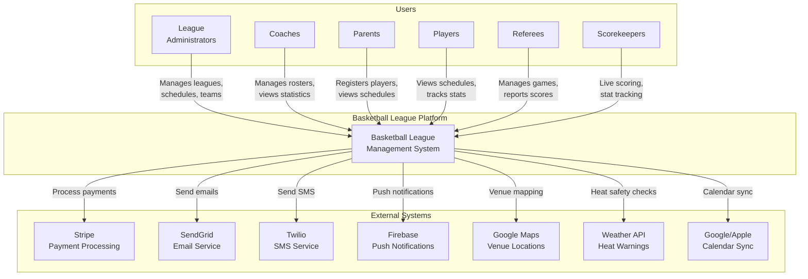

### 3.2 External System Interfaces

| System | Integration Type | Purpose | Data Flow |
|--------|-----------------|---------|-----------|
| Stripe | REST API | Payment processing | Bidirectional |
| SendGrid | REST API | Email delivery | Outbound |
| Twilio | REST API | SMS notifications | Outbound |
| Firebase FCM | SDK | Push notifications | Outbound |
| Google Maps | JavaScript API | Venue visualization | Inbound |
| Weather API | REST API | Heat warnings | Inbound |
| Calendar Services | CalDAV/REST | Schedule sync | Bidirectional |

---

## 4. Container Architecture (C4 Level 2)

### 4.1 Container Diagram

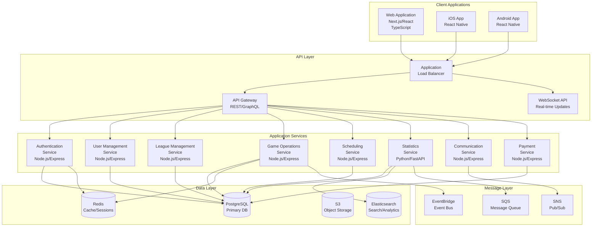

### 4.2 Container Descriptions

| Container | Technology | Purpose | Scaling Strategy |
|-----------|------------|---------|------------------|
| Web Application | Next.js on Vercel/AWS Amplify | Progressive Web App | CDN + Edge Functions |
| Mobile Apps | React Native | Native mobile experience | App Store distribution |
| API Gateway | AWS API Gateway | API management, rate limiting | Auto-scaling |
| Auth Service | Node.js on ECS Fargate | Authentication/authorization | Horizontal scaling |
| User Service | Node.js on ECS Fargate | User profile management | Horizontal scaling |
| League Service | Node.js on ECS Fargate | League operations | Horizontal scaling |
| Game Service | Node.js on ECS Fargate | Real-time game management | Horizontal + WebSocket |
| Schedule Service | Node.js on Lambda | Scheduling algorithms | Serverless scaling |
| Stats Service | Python on ECS Fargate | Analytics processing | Batch processing |
| Comm Service | Node.js on Lambda | Notifications | Serverless scaling |
| Payment Service | Node.js on ECS Fargate | Payment processing | Vertical scaling |

---

## 5. Component Architecture (C4 Level 3)

### 5.1 Game Operations Service Components

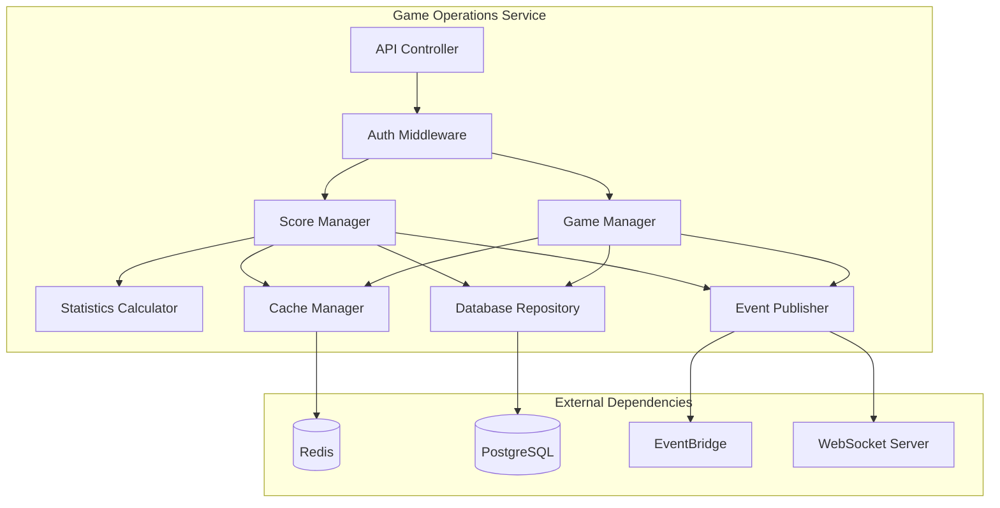

### 5.2 Component Responsibilities

| Component | Responsibility | Design Pattern |
|-----------|---------------|----------------|
| API Controller | HTTP request handling | MVC Controller |
| Auth Middleware | Token validation, RBAC | Chain of Responsibility |
| Game Manager | Game lifecycle management | Domain Service |
| Score Manager | Live scoring operations | Domain Service |
| Statistics Calculator | Real-time stat computation | Strategy Pattern |
| Event Publisher | Event broadcasting | Observer Pattern |
| Cache Manager | Cache operations | Repository Pattern |
| Database Repository | Data persistence | Repository Pattern |

---

## 6. Microservices Architecture

### 6.1 Service Boundaries

Services are designed around bounded contexts following Domain-Driven Design:

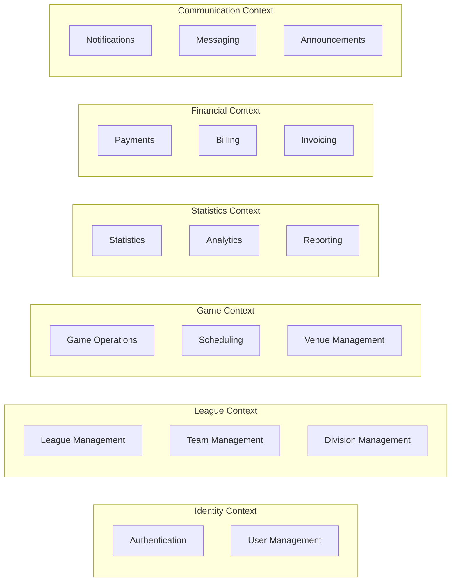

### 6.2 Service Communication Matrix

| Source Service | Target Service | Protocol | Pattern | Purpose |
|---------------|---------------|----------|---------|---------|
| All Services | Auth Service | HTTP/gRPC | Request-Reply | Token validation |
| Game Service | Stats Service | Event | Pub-Sub | Score updates |
| Schedule Service | Notification Service | Event | Pub-Sub | Schedule changes |
| Payment Service | User Service | HTTP | Request-Reply | Subscription updates |
| League Service | Team Service | HTTP | Request-Reply | Team queries |
| Stats Service | Analytics Service | Event | Pub-Sub | Stat aggregation |

### 6.3 Service Mesh Configuration

```yaml
apiVersion: v1
kind: ServiceMesh
metadata:
  name: basketball-league-mesh
spec:
  istio:
    enabled: true
    version: 1.17
  features:
    - circuit-breakers
    - retry-policies
    - timeout-policies
    - rate-limiting
  observability:
    tracing: true
    metrics: true
    logging: true
```

---

## 7. Data Architecture

### 7.1 Data Model Overview

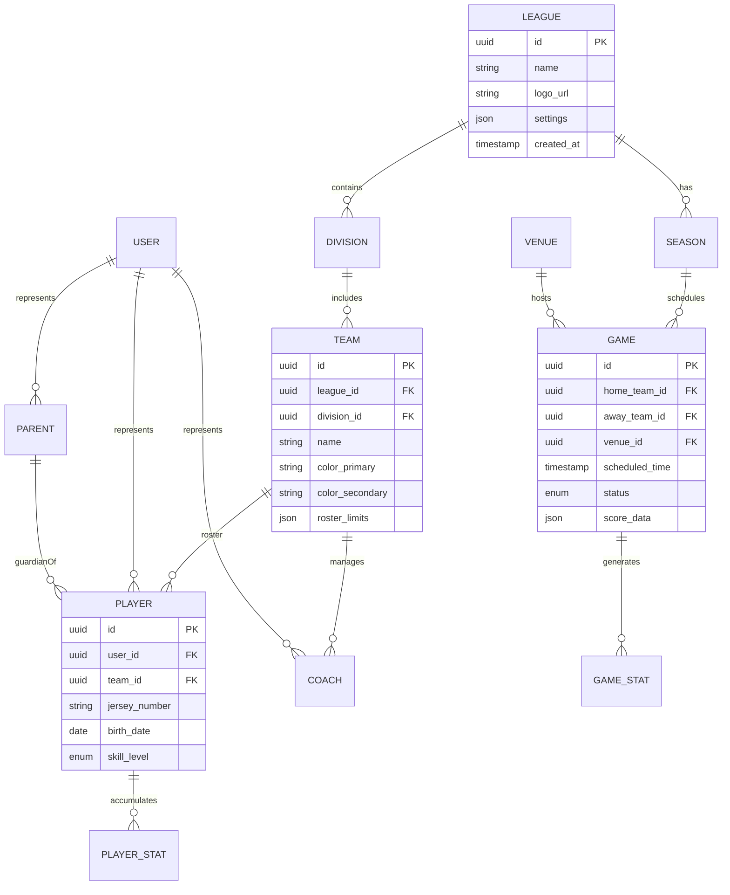

### 7.2 Database Strategy

| Database Type | Technology | Use Case | Scaling Strategy |
|--------------|------------|----------|------------------|
| Primary OLTP | PostgreSQL 15 | Transactional data | Read replicas, partitioning |
| Cache | Redis 7 | Sessions, hot data | Redis Cluster |
| Search | Elasticsearch 8 | Full-text search | Horizontal sharding |
| Analytics | PostgreSQL + TimescaleDB | Time-series stats | Hypertables |
| Object Storage | S3 | Media files, documents | Unlimited |
| Archive | S3 Glacier | Historical data | Lifecycle policies |

### 7.3 Data Partitioning Strategy

```sql
-- League-based partitioning for multi-tenancy
CREATE TABLE games (
    id UUID PRIMARY KEY,
    league_id UUID NOT NULL,
    -- other columns
) PARTITION BY LIST (league_id);

-- Time-based partitioning for statistics
CREATE TABLE game_stats (
    id UUID PRIMARY KEY,
    game_date DATE NOT NULL,
    -- other columns
) PARTITION BY RANGE (game_date);
```

### 7.4 Caching Strategy

| Cache Level | Technology | TTL | Use Case |
|-------------|------------|-----|----------|
| CDN | CloudFront | 24 hours | Static assets |
| API Gateway | API Gateway Cache | 5 minutes | GET endpoints |
| Application | Redis | 1 hour | User sessions |
| Database | Redis | 10 minutes | Query results |
| Client | Service Worker | 1 hour | Offline data |

---

## 8. Security Architecture

### 8.1 Security Layers

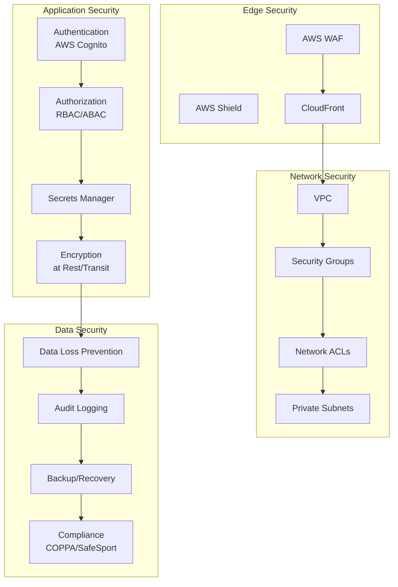

### 8.2 Authentication & Authorization Flow

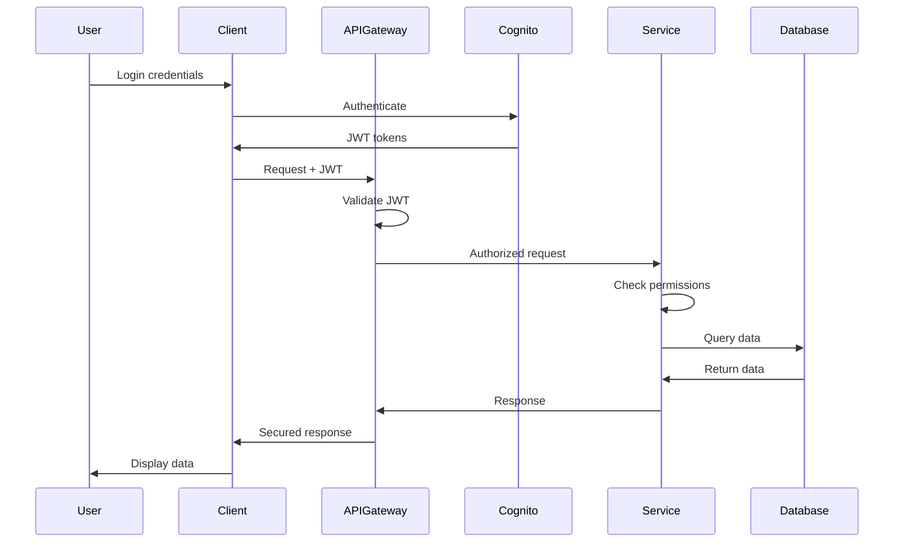

### 8.3 Data Protection Matrix

| Data Type | Classification | Encryption | Access Control | Retention |
|-----------|---------------|------------|----------------|-----------|
| User PII | Sensitive | AES-256 | Role-based | 7 years |
| Youth Data | Highly Sensitive | AES-256 + tokenization | Parental consent | Until 18 or deletion |
| Payment Data | PCI | Tokenized via Stripe | Need-to-know | Per PCI standards |
| Game Statistics | Public | TLS in transit | Public read | Indefinite |
| System Logs | Internal | AES-256 | Admin only | 90 days |

### 8.4 COPPA Compliance Architecture

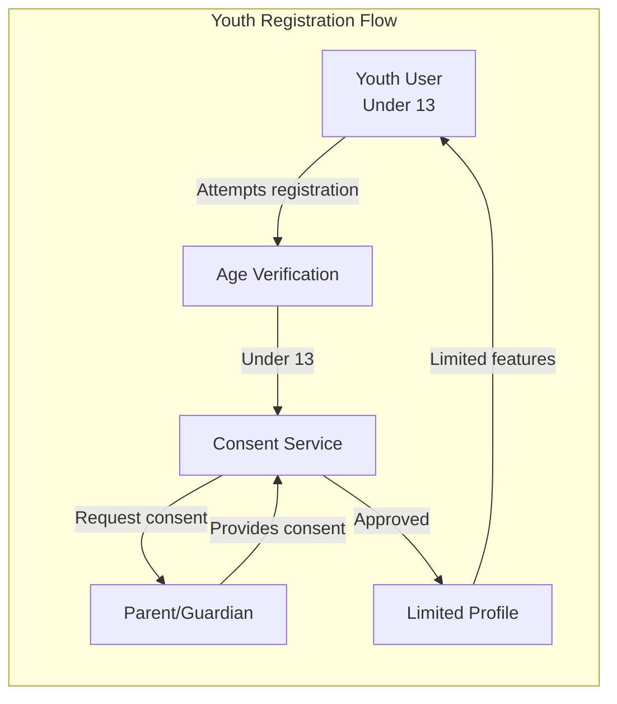

---

## 9. Integration Architecture

### 9.1 Integration Patterns

| Pattern | Use Case | Implementation |
|---------|----------|----------------|
| REST API | Synchronous operations | OpenAPI 3.0 specification |
| GraphQL | Flexible queries | Apollo Server |
| WebSockets | Real-time updates | Socket.io |
| Webhooks | External notifications | HMAC-signed callbacks |
| Event Streaming | Internal events | EventBridge |
| Batch Processing | Data imports | SQS + Lambda |

### 9.2 API Gateway Configuration

```yaml
apiVersion: apigateway.amazonaws.com/v1
kind: RestApi
metadata:
  name: basketball-league-api
spec:
  throttling:
    rateLimit: 1000
    burstLimit: 2000
  cors:
    allowOrigins:
      - https://app.basketballleague.com
    allowMethods:
      - GET
      - POST
      - PUT
      - DELETE
    allowHeaders:
      - Content-Type
      - Authorization
  authentication:
    type: COGNITO_USER_POOLS
    userPoolArn: arn:aws:cognito:us-west-2:xxx
  stages:
    - name: prod
      caching: true
      cacheTtl: 300
    - name: staging
      caching: false
```

### 9.3 Third-Party Integration Architecture

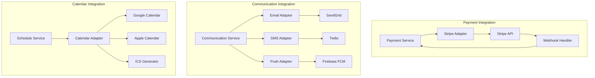

---

## 10. Deployment Architecture

### 10.1 AWS Infrastructure

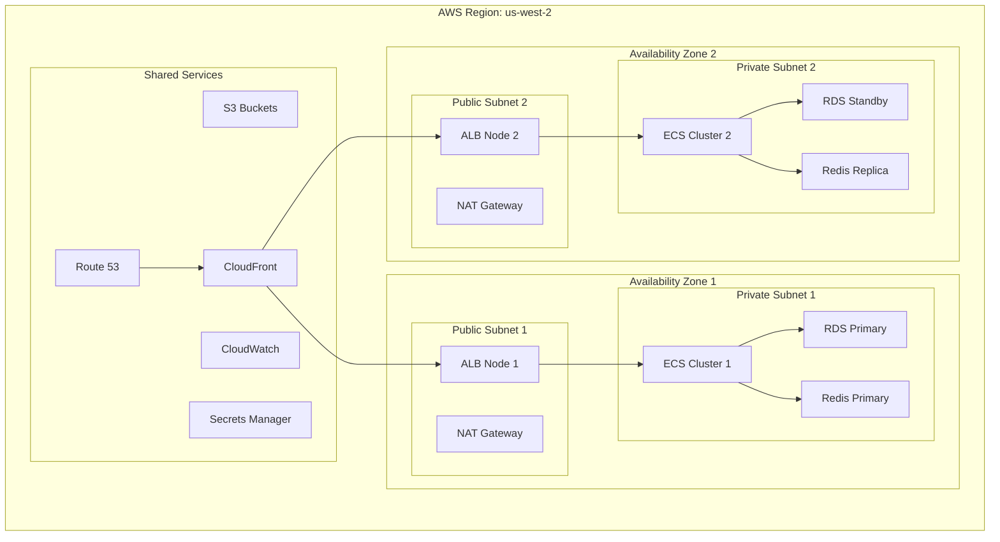

### 10.2 Container Orchestration

```yaml
apiVersion: v1
kind: ECSTaskDefinition
metadata:
  family: game-service
spec:
  requiresCompatibilities:
    - FARGATE
  networkMode: awsvpc
  cpu: "512"
  memory: "1024"
  containerDefinitions:
    - name: game-service
      image: ${ECR_REPO}/game-service:${VERSION}
      portMappings:
        - containerPort: 3000
          protocol: tcp
      environment:
        - name: NODE_ENV
          value: production
        - name: DATABASE_URL
          valueFrom:
            secretsManagerArn: ${DB_SECRET_ARN}
      healthCheck:
        command:
          - CMD-SHELL
          - curl -f http://localhost:3000/health || exit 1
        interval: 30
        timeout: 5
        retries: 3
```

### 10.3 CI/CD Pipeline

```mermaid
graph LR
    subgraph "Development"
        DEV[Developer]
        GIT[GitHub]
    end
    
    subgraph "CI Pipeline"
        ACTIONS[GitHub Actions]
        BUILD[Build]
        TEST[Test]
        SCAN[Security Scan]
        PACKAGE[Package]
    end
    
    subgraph "CD Pipeline"
        ECR[ECR Registry]
        STAGING[Staging Deploy]
        E2E[E2E Tests]
        APPROVE[Manual Approval]
        PROD[Production Deploy]
    end
    
    DEV -->|Push| GIT
    GIT -->|Trigger| ACTIONS
    ACTIONS --> BUILD
    BUILD --> TEST
    TEST --> SCAN
    SCAN --> PACKAGE
    PACKAGE --> ECR
    ECR --> STAGING
    STAGING --> E2E
    E2E --> APPROVE
    APPROVE --> PROD
```

---

## 11. Performance Architecture

### 11.1 Performance Targets

| Metric | Target | Measurement Point |
|--------|--------|-------------------|
| Page Load Time | < 2 seconds | 95th percentile |
| API Response Time | < 200ms | 95th percentile |
| Real-time Update Latency | < 100ms | WebSocket delivery |
| Database Query Time | < 50ms | 95th percentile |
| Concurrent Users | 1,000+ | Peak tournament time |
| Requests per Second | 10,000 RPS | API Gateway |
| Availability | 99.9% | Monthly uptime |

### 11.2 Performance Optimization Strategies

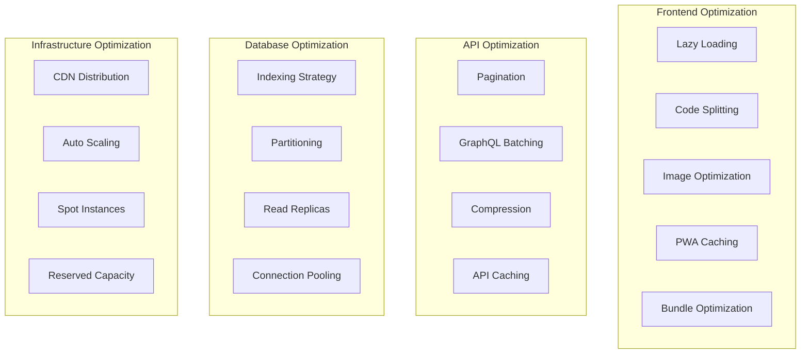

### 11.3 Caching Architecture

| Cache Layer | Technology | Strategy | TTL |
|-------------|------------|----------|-----|
| Browser | Service Worker | Cache-first | 1 hour |
| CDN | CloudFront | Static assets | 24 hours |
| API Gateway | Built-in cache | GET requests | 5 minutes |
| Application | Redis | Session data | 30 minutes |
| Database | Query cache | Frequent queries | 10 minutes |

### 11.4 Database Performance Tuning

```sql
-- Critical indexes for performance
CREATE INDEX idx_games_league_date ON games(league_id, scheduled_time);
CREATE INDEX idx_game_stats_player ON game_stats(player_id, game_id);
CREATE INDEX idx_teams_division ON teams(division_id);

-- Materialized view for dashboard
CREATE MATERIALIZED VIEW league_standings AS
SELECT 
    t.id,
    t.name,
    COUNT(CASE WHEN g.winner_id = t.id THEN 1 END) as wins,
    COUNT(CASE WHEN g.loser_id = t.id THEN 1 END) as losses
FROM teams t
LEFT JOIN games g ON t.id IN (g.home_team_id, g.away_team_id)
GROUP BY t.id, t.name
WITH DATA;

-- Refresh strategy
REFRESH MATERIALIZED VIEW CONCURRENTLY league_standings;
```

---

## 12. Architectural Principles

### 12.1 Core Principles

1. **Domain-Driven Design**: Bounded contexts align with business domains
2. **API-First**: All functionality exposed through well-defined APIs
3. **Cloud-Native**: Designed for cloud scalability and resilience
4. **Security by Design**: Security considered at every layer
5. **Mobile-First**: Optimized for mobile usage patterns
6. **Event-Driven**: Loose coupling through events
7. **Microservices**: Independent deployment and scaling
8. **DevOps Culture**: Automated everything
9. **Data-Driven Decisions**: Comprehensive monitoring and analytics
10. **Cost-Conscious**: Optimize for startup budget

### 12.2 Design Patterns Applied

| Pattern | Application | Benefit |
|---------|------------|---------|
| Circuit Breaker | Service calls | Fault tolerance |
| Retry with Backoff | API calls | Resilience |
| Bulkhead | Resource isolation | Failure containment |
| CQRS | Read/write separation | Performance |
| Event Sourcing | Game statistics | Audit trail |
| Saga | Distributed transactions | Consistency |
| API Gateway | Single entry point | Simplified client |
| Service Mesh | Service communication | Observability |
| Sidecar | Cross-cutting concerns | Separation of concerns |
| Strangler Fig | Legacy migration | Incremental updates |

### 12.3 Technology Selection Criteria

All technology choices evaluated against:
- **Maturity**: Production-ready with community support
- **Scalability**: Ability to handle 100x growth
- **Cost**: TCO including licenses and operations
- **Developer Experience**: Productivity and maintainability
- **Security**: Built-in security features
- **Compliance**: Support for regulatory requirements
- **Performance**: Meeting SLA requirements
- **Integration**: Ecosystem compatibility

### 12.4 Future Architecture Considerations

| Consideration | Timeline | Impact |
|--------------|----------|--------|
| Multi-region deployment | 12-18 months | Global expansion |
| GraphQL Federation | 6-9 months | API flexibility |
| Kubernetes migration | 12 months | Container orchestration |
| AI/ML integration | 9-12 months | Smart features |
| Blockchain integration | 18-24 months | Immutable records |
| IoT integration | 12-18 months | Wearable devices |

---

## Appendices

### Appendix A: Technology Stack Details

| Component | Version | License | Support |
|-----------|---------|---------|---------|
| Node.js | 20 LTS | MIT | Community |
| PostgreSQL | 15 | PostgreSQL | Community |
| Redis | 7 | BSD | AWS Managed |
| React | 18 | MIT | Meta |
| Next.js | 14 | MIT | Vercel |
| TypeScript | 5 | Apache 2.0 | Microsoft |

### Appendix B: Compliance Requirements

- COPPA (Children's Online Privacy Protection Act)
- SafeSport Authorization Act
- GDPR (for future expansion)
- CCPA (California Consumer Privacy Act)
- PCI DSS (Payment Card Industry)
- WCAG 2.1 AA (Accessibility)

### Appendix C: Monitoring Metrics

- Golden Signals: Latency, Traffic, Errors, Saturation
- Business Metrics: User signups, Active leagues, Games played
- Infrastructure Metrics: CPU, Memory, Disk, Network
- Application Metrics: Response times, Error rates, Throughput
- User Experience Metrics: Core Web Vitals, Session duration

### Appendix D: Disaster Recovery

- **RTO (Recovery Time Objective)**: 4 hours
- **RPO (Recovery Point Objective)**: 1 hour
- **Backup Strategy**: Daily automated backups to S3
- **Multi-AZ Deployment**: Automatic failover
- **Data Replication**: Cross-region replication for critical data
- **Runbook Documentation**: Automated recovery procedures

---

*This document is a living artifact and will be updated as the architecture evolves.*

**Document Control:**
- Review Cycle: Quarterly
- Change Process: Architecture Review Board approval required
- Distribution: Development Team, DevOps Team, Management