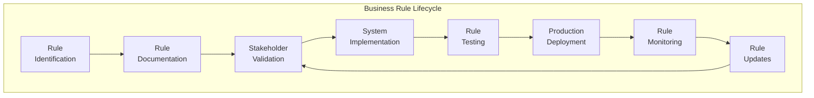
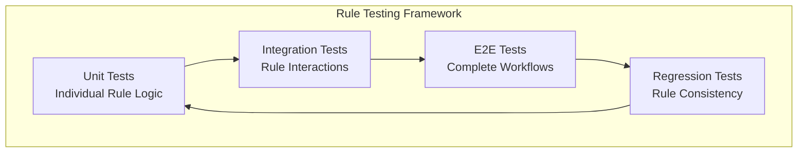

# Business Rules Documentation
## Basketball League Management Platform

**Document ID:** BR-BLMP-001  
**Version:** 1.0  
**Date:** January 8, 2025  
**Status:** Draft  
**Document Owner:** Business Analyst (CBAP Certified)

---

## Table of Contents

1. [Business Rules Overview](#1-business-rules-overview)
2. [League Management Rules](#2-league-management-rules)
3. [Player Management Rules](#3-player-management-rules)
4. [Team Formation Rules](#4-team-formation-rules)
5. [Scheduling Rules](#5-scheduling-rules)
6. [Game Operations Rules](#6-game-operations-rules)
7. [Payment and Financial Rules](#7-payment-and-financial-rules)
8. [Communication Rules](#8-communication-rules)
9. [Safety and Compliance Rules](#9-safety-and-compliance-rules)
10. [Tournament Rules](#10-tournament-rules)
11. [Data Management Rules](#11-data-management-rules)
12. [System Administration Rules](#12-system-administration-rules)

---

## 1. Business Rules Overview

### 1.1 Purpose
This document defines all business rules governing the operation of the Basketball League Management Platform. Following BABOK v3 guidelines, these rules provide the foundation for system behavior, validation logic, and operational constraints that ensure compliance with youth sports regulations and industry best practices.

### 1.2 Rule Categories

#### BABOK v3 Business Rule Classification

| Rule Type | Description | Implementation | Examples |
|-----------|-------------|----------------|----------|
| **Structural Rules** | Define business entities and relationships | Database constraints, data models | Player must belong to exactly one team |
| **Operative Rules** | Define allowable business operations | Business logic, workflows | Games cannot be scheduled during blackout periods |
| **Behavioral Rules** | Define responses to business events | Event handlers, triggers | Send notification when game is rescheduled |
| **Derived Rules** | Define calculated values | Formulas, algorithms | Team standings calculated from game results |

### 1.3 Rule Notation

**Rule Format**: BR-[Category]-[Number]: [Rule Statement]  
**Priority Levels**: Critical, High, Medium, Low  
**Enforcement**: System Enforced, User Guided, Manual Override

### 1.4 Rule Management Framework



---

## 2. League Management Rules

### 2.1 League Creation Rules

#### BR-LEAGUE-001: League Naming Convention
**Rule**: League names must be unique within the organization and contain only alphanumeric characters, spaces, hyphens, and apostrophes  
**Priority**: High  
**Enforcement**: System Enforced  
**Rationale**: Ensures clear identification and prevents system conflicts  
**Implementation**: Database unique constraint + input validation  

#### BR-LEAGUE-002: Season Date Validation
**Rule**: League season end date must be at least 30 days after start date  
**Priority**: Critical  
**Enforcement**: System Enforced  
**Rationale**: Ensures minimum viable season length  
**Implementation**: Date validation logic  

#### BR-LEAGUE-003: Division Age Ranges
**Rule**: Age divisions cannot have overlapping age ranges within the same league  
**Priority**: Critical  
**Enforcement**: System Enforced  
**Rationale**: Prevents player eligibility confusion  
**Implementation**: Age range validation algorithm  

#### BR-LEAGUE-004: Registration Deadline
**Rule**: Registration deadline must be at least 7 days before season start date  
**Priority**: High  
**Enforcement**: System Enforced  
**Rationale**: Allows time for team formation and scheduling  
**Implementation**: Date validation with 7-day buffer  

#### BR-LEAGUE-005: League Administrator Assignment
**Rule**: Every league must have at least one designated administrator with full league management privileges  
**Priority**: Critical  
**Enforcement**: System Enforced  
**Rationale**: Ensures administrative accountability  
**Implementation**: Role assignment validation  

### 2.2 League Configuration Rules

#### BR-LEAGUE-006: Maximum Teams Per Division
**Rule**: Divisions cannot exceed 20 teams unless specifically approved by system administrator  
**Priority**: Medium  
**Enforcement**: User Guided with Override  
**Rationale**: Maintains manageable division size for scheduling  
**Implementation**: Team count validation with admin override  

#### BR-LEAGUE-007: Fee Structure Validation
**Rule**: Registration fees must be positive numeric values with maximum of $500 per player  
**Priority**: High  
**Enforcement**: System Enforced  
**Rationale**: Prevents data entry errors and unreasonable fees  
**Implementation**: Numeric validation with range checking  

#### BR-LEAGUE-008: Season Overlap Restriction
**Rule**: Leagues within the same organization cannot have more than 50% season date overlap  
**Priority**: Medium  
**Enforcement**: User Guided  
**Rationale**: Prevents resource conflicts and administrative burden  
**Implementation**: Date overlap calculation  

---

## 3. Player Management Rules

### 3.1 Player Registration Rules

#### BR-PLAYER-001: Age Verification Requirement
**Rule**: All players must have verified birth date documentation for age division eligibility  
**Priority**: Critical  
**Enforcement**: System Enforced  
**Rationale**: Ensures fair competition and safety  
**Implementation**: Document upload validation + manual verification  

#### BR-PLAYER-002: Age Cutoff Date
**Rule**: Player age is determined as of January 1st of the current calendar year for age division assignment  
**Priority**: Critical  
**Enforcement**: System Enforced  
**Rationale**: Standardizes age calculation across all leagues  
**Implementation**: Age calculation algorithm  

#### BR-PLAYER-003: Duplicate Registration Prevention
**Rule**: Players cannot be registered in multiple leagues simultaneously unless leagues are in different seasons  
**Priority**: High  
**Enforcement**: System Enforced  
**Rationale**: Prevents schedule conflicts and ensures player commitment  
**Implementation**: Cross-league registration check  

#### BR-PLAYER-004: Parental Consent for Minors
**Rule**: Players under 18 years old require documented parental consent before participating in league activities  
**Priority**: Critical  
**Enforcement**: System Enforced  
**Rationale**: Legal requirement for minor participation  
**Implementation**: Digital consent workflow with audit trail  

#### BR-PLAYER-005: COPPA Compliance for Children Under 13
**Rule**: Players under 13 years old require verified parental consent before any personal information is collected  
**Priority**: Critical  
**Enforcement**: System Enforced  
**Rationale**: Federal law compliance (COPPA)  
**Implementation**: Age-gated registration with parental verification  

### 3.2 Player Eligibility Rules

#### BR-PLAYER-006: Medical Clearance Requirement
**Rule**: All players must provide current medical clearance documentation before first game participation  
**Priority**: Critical  
**Enforcement**: System Enforced  
**Rationale**: Player safety and liability protection  
**Implementation**: Document tracking with expiration monitoring  

#### BR-PLAYER-007: Player Transfer Rules
**Rule**: Players can transfer between teams within the same league only with administrator approval and before 50% of season completion  
**Priority**: High  
**Enforcement**: User Guided with Approval Workflow  
**Rationale**: Maintains competitive balance while allowing flexibility  
**Implementation**: Transfer request workflow with approval gates  

#### BR-PLAYER-008: Playing Time Eligibility
**Rule**: Players are eligible to play only after registration payment is completed and all required documents are submitted and approved  
**Priority**: High  
**Enforcement**: System Enforced  
**Rationale**: Ensures complete registration compliance  
**Implementation**: Eligibility status calculation  

#### BR-PLAYER-009: Age Division Movement
**Rule**: Players may only "play up" to higher age divisions with parental consent and administrator approval, never "play down"  
**Priority**: Critical  
**Enforcement**: System Enforced with Override  
**Rationale**: Safety and competitive fairness  
**Implementation**: Age division validation with approval workflow  

---

## 4. Team Formation Rules

### 4.1 Team Creation Rules

#### BR-TEAM-001: Minimum Team Size
**Rule**: Teams must have minimum 8 players and maximum 15 players  
**Priority**: High  
**Enforcement**: System Enforced  
**Rationale**: Ensures viable teams while preventing excessive bench size  
**Implementation**: Roster size validation  

#### BR-TEAM-002: Coach Assignment Requirement
**Rule**: Every team must have at least one designated head coach before season begins  
**Priority**: Critical  
**Enforcement**: System Enforced  
**Rationale**: Ensures proper team supervision and coaching  
**Implementation**: Coach assignment validation  

#### BR-TEAM-003: Team Name Uniqueness
**Rule**: Team names must be unique within each league and cannot contain inappropriate language  
**Priority**: Medium  
**Enforcement**: System Enforced  
**Rationale**: Clear team identification and appropriate content  
**Implementation**: Name uniqueness check + content filtering  

#### BR-TEAM-004: Gender-Specific Teams
**Rule**: Teams can be designated as male, female, or co-ed based on league configuration  
**Priority**: Medium  
**Enforcement**: System Enforced  
**Rationale**: Accommodates different league structures  
**Implementation**: Gender designation validation  

### 4.2 Team Balance Rules

#### BR-TEAM-005: Skill Level Distribution
**Rule**: When using balanced team formation, skill level variance between teams should not exceed 15%  
**Priority**: High  
**Enforcement**: User Guided  
**Rationale**: Promotes competitive balance  
**Implementation**: Skill level distribution algorithm  

#### BR-TEAM-006: Draft Order Fairness
**Rule**: Draft order for team selection must use serpentine (snake) draft format to ensure fairness  
**Priority**: Medium  
**Enforcement**: System Enforced  
**Rationale**: Prevents early draft advantage from continuing  
**Implementation**: Serpentine draft algorithm  

#### BR-TEAM-007: Special Requests Limitation
**Rule**: Special requests for specific team assignments cannot exceed 25% of total players in a division  
**Priority**: Medium  
**Enforcement**: User Guided  
**Rationale**: Balances accommodation with team balance requirements  
**Implementation**: Special request quota tracking  

---

## 5. Scheduling Rules

### 5.1 Schedule Generation Rules

#### BR-SCHEDULE-001: Game Frequency Limits
**Rule**: Teams cannot play more than 3 games per week or more than 1 game per day  
**Priority**: Critical  
**Enforcement**: System Enforced  
**Rationale**: Player safety and prevents overcommitment  
**Implementation**: Frequency validation algorithm  

#### BR-SCHEDULE-002: Minimum Rest Period
**Rule**: Teams must have at least 48 hours between games  
**Priority**: High  
**Enforcement**: System Enforced  
**Rationale**: Player recovery and performance optimization  
**Implementation**: Rest period calculation  

#### BR-SCHEDULE-003: Home/Away Balance
**Rule**: Each team should have approximately equal number of home and away games (±1 game difference)  
**Priority**: Medium  
**Enforcement**: User Guided  
**Rationale**: Fair distribution of travel burden  
**Implementation**: Home/away balance algorithm  

#### BR-SCHEDULE-004: Venue Capacity Matching
**Rule**: Games cannot be scheduled at venues with capacity less than expected attendance (team roster sizes × 3)  
**Priority**: Medium  
**Enforcement**: User Guided  
**Rationale**: Ensures adequate spectator accommodation  
**Implementation**: Capacity validation check  

#### BR-SCHEDULE-005: Blackout Period Enforcement
**Rule**: No games can be scheduled during designated blackout periods (holidays, major events)  
**Priority**: Critical  
**Enforcement**: System Enforced  
**Rationale**: Respects community events and family time  
**Implementation**: Blackout date validation  

### 5.2 Schedule Modification Rules

#### BR-SCHEDULE-006: Rescheduling Notice Period
**Rule**: Game reschedules require minimum 48-hour notice unless weather emergency  
**Priority**: High  
**Enforcement**: User Guided with Override  
**Rationale**: Provides adequate notice to stakeholders  
**Implementation**: Time-based validation with emergency override  

#### BR-SCHEDULE-007: Referee Assignment Consistency
**Rule**: Same referee cannot officiate more than 2 games involving the same team in a season  
**Priority**: Low  
**Enforcement**: User Guided  
**Rationale**: Ensures varied officiating perspectives  
**Implementation**: Referee assignment tracking  

#### BR-SCHEDULE-008: Game Time Constraints
**Rule**: Games must start between 6:00 AM and 10:00 PM local time  
**Priority**: Medium  
**Enforcement**: System Enforced  
**Rationale**: Reasonable hours for youth sports  
**Implementation**: Time range validation  

---

## 6. Game Operations Rules

### 6.1 Game Execution Rules

#### BR-GAME-001: Minimum Player Requirement
**Rule**: Teams must have minimum 5 players present to start/continue a game  
**Priority**: Critical  
**Enforcement**: System Enforced  
**Rationale**: Ensures viable game competition  
**Implementation**: Player attendance validation  

#### BR-GAME-002: Scorekeeper Authorization
**Rule**: Only designated scorekeepers can modify official game scores  
**Priority**: Critical  
**Enforcement**: System Enforced  
**Rationale**: Maintains score integrity and accountability  
**Implementation**: Role-based access control  

#### BR-GAME-003: Game Duration Limits
**Rule**: Games cannot exceed maximum duration of 2.5 hours including timeouts and breaks  
**Priority**: Medium  
**Enforcement**: User Guided  
**Rationale**: Reasonable time commitment for participants  
**Implementation**: Duration tracking with alerts  

#### BR-GAME-004: Score Correction Time Limit
**Rule**: Score corrections can only be made within 24 hours of game completion  
**Priority**: High  
**Enforcement**: System Enforced with Override  
**Rationale**: Balances accuracy with finality  
**Implementation**: Time-based modification restrictions  

### 6.2 Game Statistics Rules

#### BR-GAME-005: Individual Statistics Validation
**Rule**: Individual player statistics cannot exceed team totals (e.g., player points ≤ team points)  
**Priority**: High  
**Enforcement**: System Enforced  
**Rationale**: Mathematical consistency and data integrity  
**Implementation**: Statistical validation algorithms  

#### BR-GAME-006: Playing Time Tracking
**Rule**: Individual player playing time cannot exceed total game time  
**Priority**: Medium  
**Enforcement**: System Enforced  
**Rationale**: Data accuracy for performance analysis  
**Implementation**: Time validation logic  

#### BR-GAME-007: Foul Limit Enforcement
**Rule**: Players with 5 personal fouls are automatically marked as fouled out  
**Priority**: Critical  
**Enforcement**: System Enforced  
**Rationale**: Standard basketball rules compliance  
**Implementation**: Foul counting and status updates  

---

## 7. Payment and Financial Rules

### 7.1 Registration Payment Rules

#### BR-PAYMENT-001: Payment Deadline Enforcement
**Rule**: Player registration is not complete until payment is received by the payment deadline  
**Priority**: Critical  
**Enforcement**: System Enforced  
**Rationale**: Ensures revenue collection and planning certainty  
**Implementation**: Payment status tracking with deadline validation  

#### BR-PAYMENT-002: Refund Policy Timeline
**Rule**: Full refunds available until 14 days before season start; 50% refund until 7 days before; no refund after season start  
**Priority**: High  
**Enforcement**: System Enforced  
**Rationale**: Balances flexibility with administrative planning  
**Implementation**: Date-based refund calculation  

#### BR-PAYMENT-003: Payment Plan Eligibility
**Rule**: Payment plans are available for registrations over $200 with minimum 50% down payment  
**Priority**: Medium  
**Enforcement**: System Enforced  
**Rationale**: Makes programs accessible while ensuring commitment  
**Implementation**: Amount-based payment plan eligibility  

#### BR-PAYMENT-004: Late Payment Penalties
**Rule**: Late payments incur $25 late fee after 7-day grace period  
**Priority**: Medium  
**Enforcement**: System Enforced  
**Rationale**: Encourages timely payment while providing grace period  
**Implementation**: Automated late fee calculation  

### 7.2 Financial Management Rules

#### BR-PAYMENT-005: Revenue Recognition
**Rule**: Revenue is recognized when payment is successfully processed, not when registration is submitted  
**Priority**: High  
**Enforcement**: System Enforced  
**Rationale**: Accurate financial reporting  
**Implementation**: Payment confirmation-based revenue recording  

#### BR-PAYMENT-006: Scholarship Allocation
**Rule**: Scholarships cannot exceed 15% of total league capacity  
**Priority**: Medium  
**Enforcement**: User Guided  
**Rationale**: Maintains program sustainability while providing accessibility  
**Implementation**: Scholarship quota tracking  

#### BR-PAYMENT-007: Payment Method Security
**Rule**: Credit card information cannot be stored in the platform database  
**Priority**: Critical  
**Enforcement**: System Enforced  
**Rationale**: PCI DSS compliance and security  
**Implementation**: Token-based payment processing  

---

## 8. Communication Rules

### 8.1 SafeSport Compliance Rules

#### BR-COMM-001: Adult-Minor Communication Restrictions
**Rule**: All communication between adults and minors must include parent/guardian as recipient or be in group settings  
**Priority**: Critical  
**Enforcement**: System Enforced  
**Rationale**: SafeSport compliance and child protection  
**Implementation**: Recipient validation and group communication enforcement  

#### BR-COMM-002: Content Monitoring
**Rule**: All platform communications are subject to automated content scanning for inappropriate material  
**Priority**: Critical  
**Enforcement**: System Enforced  
**Rationale**: Child safety and platform liability  
**Implementation**: AI-powered content filtering  

#### BR-COMM-003: Communication Audit Trail
**Rule**: All platform communications must maintain permanent audit trail for compliance purposes  
**Priority**: Critical  
**Enforcement**: System Enforced  
**Rationale**: Legal compliance and incident investigation  
**Implementation**: Immutable message logging  

#### BR-COMM-004: Emergency Communication Override
**Rule**: Emergency communications bypass normal approval workflows but require subsequent justification  
**Priority**: High  
**Enforcement**: System Enforced with Audit  
**Rationale**: Allows rapid emergency response while maintaining accountability  
**Implementation**: Emergency flag with post-hoc review  

### 8.2 Communication Delivery Rules

#### BR-COMM-005: Message Priority Routing
**Rule**: High-priority messages (emergencies, schedule changes) are sent via multiple channels (email, SMS, push notification)  
**Priority**: High  
**Enforcement**: System Enforced  
**Rationale**: Ensures critical information delivery  
**Implementation**: Priority-based multi-channel routing  

#### BR-COMM-006: Opt-out Respect
**Rule**: Users who opt out of non-essential communications cannot receive marketing or promotional messages  
**Priority**: High  
**Enforcement**: System Enforced  
**Rationale**: Legal compliance and user preference respect  
**Implementation**: Preference-based message filtering  

#### BR-COMM-007: Message Retention Policy
**Rule**: Platform messages are retained for 7 years from date of sending for compliance purposes  
**Priority**: Medium  
**Enforcement**: System Enforced  
**Rationale**: Legal requirement compliance and dispute resolution  
**Implementation**: Automated retention and archival  

---

## 9. Safety and Compliance Rules

### 9.1 Youth Safety Rules

#### BR-SAFETY-001: Background Check Requirement
**Rule**: All coaches and volunteers must complete background checks before interacting with players  
**Priority**: Critical  
**Enforcement**: System Enforced  
**Rationale**: Child protection and risk mitigation  
**Implementation**: Background check status validation  

#### BR-SAFETY-002: SafeSport Training Requirement
**Rule**: All coaches must complete current SafeSport training before season begins  
**Priority**: Critical  
**Enforcement**: System Enforced  
**Rationale**: Abuse prevention and compliance  
**Implementation**: Training completion tracking  

#### BR-SAFETY-003: Incident Reporting Requirement
**Rule**: All safety incidents must be reported within 24 hours of occurrence  
**Priority**: Critical  
**Enforcement**: User Guided with Alerts  
**Rationale**: Rapid response and legal compliance  
**Implementation**: Incident reporting workflow with time tracking  

#### BR-SAFETY-004: Medical Emergency Protocol
**Rule**: Medical emergencies trigger immediate notification to emergency contacts and league administrators  
**Priority**: Critical  
**Enforcement**: System Enforced  
**Rationale**: Rapid medical response  
**Implementation**: Automated emergency notification system  

### 9.2 Weather Safety Rules (Arizona-Specific)

#### BR-SAFETY-005: Heat Index Thresholds
**Rule**: Outdoor games must be canceled when heat index exceeds 105°F  
**Priority**: Critical  
**Enforcement**: System Enforced  
**Rationale**: Player safety in Arizona heat  
**Implementation**: Weather API integration with automatic alerts  

#### BR-SAFETY-006: Hydration Break Requirements
**Rule**: Mandatory hydration breaks every 15 minutes when temperature exceeds 95°F  
**Priority**: High  
**Enforcement**: User Guided with Alerts  
**Rationale**: Heat illness prevention  
**Implementation**: Temperature-based break reminders  

#### BR-SAFETY-007: Lightning Safety Protocol
**Rule**: All outdoor activities must cease immediately when lightning is detected within 8 miles  
**Priority**: Critical  
**Enforcement**: System Enforced  
**Rationale**: Lightning safety compliance  
**Implementation**: Weather service integration with automatic alerts  

---

## 10. Tournament Rules

### 10.1 Tournament Structure Rules

#### BR-TOURNAMENT-001: Seeding Requirements
**Rule**: Tournament seeding must be based on regular season performance metrics  
**Priority**: High  
**Enforcement**: System Enforced  
**Rationale**: Fair competition and merit-based advancement  
**Implementation**: Automated seeding calculation  

#### BR-TOURNAMENT-002: Elimination Format Validation
**Rule**: Tournament brackets must maintain mathematical consistency for elimination format selected  
**Priority**: Critical  
**Enforcement**: System Enforced  
**Rationale**: Tournament integrity and completion certainty  
**Implementation**: Bracket validation algorithms  

#### BR-TOURNAMENT-003: Tie-Breaking Procedures
**Rule**: Tournament ties are resolved using: 1) Head-to-head record, 2) Point differential, 3) Points scored  
**Priority**: High  
**Enforcement**: System Enforced  
**Rationale**: Consistent and fair tie resolution  
**Implementation**: Automated tie-breaker calculation  

#### BR-TOURNAMENT-004: Tournament Registration Deadline
**Rule**: Tournament registration closes 7 days before tournament start date  
**Priority**: Medium  
**Enforcement**: System Enforced  
**Rationale**: Allows adequate bracket preparation time  
**Implementation**: Registration deadline validation  

### 10.2 Tournament Advancement Rules

#### BR-TOURNAMENT-005: Advancement by Performance
**Rule**: Teams advance in tournaments based solely on game results, not subjective criteria  
**Priority**: Critical  
**Enforcement**: System Enforced  
**Rationale**: Objective competition and fairness  
**Implementation**: Result-based advancement logic  

#### BR-TOURNAMENT-006: Forfeiture Impact
**Rule**: Team forfeiting a tournament game is automatically eliminated from tournament  
**Priority**: High  
**Enforcement**: System Enforced  
**Rationale**: Tournament integrity and respect for competition  
**Implementation**: Forfeit detection and elimination logic  

---

## 11. Data Management Rules

### 11.1 Data Privacy Rules

#### BR-DATA-001: Personal Information Access
**Rule**: Personal information can only be accessed by users with legitimate business need and appropriate role permissions  
**Priority**: Critical  
**Enforcement**: System Enforced  
**Rationale**: Privacy protection and legal compliance  
**Implementation**: Role-based access control with audit logging  

#### BR-DATA-002: Data Retention Limits
**Rule**: Personal data of former players is retained for maximum 7 years after last participation  
**Priority**: High  
**Enforcement**: System Enforced  
**Rationale**: Legal compliance and privacy rights  
**Implementation**: Automated data archival and deletion  

#### BR-DATA-003: Data Export Rights
**Rule**: Users have right to export their personal data in machine-readable format upon request  
**Priority**: High  
**Enforcement**: System Enforced  
**Rationale**: GDPR and CCPA compliance  
**Implementation**: Data export functionality  

#### BR-DATA-004: Data Breach Notification
**Rule**: Data breaches affecting personal information must be reported to affected users within 72 hours  
**Priority**: Critical  
**Enforcement**: Manual Process  
**Rationale**: Legal compliance and transparency  
**Implementation**: Breach notification workflow  

### 11.2 Data Quality Rules

#### BR-DATA-005: Data Validation Requirements
**Rule**: All data entry must pass validation rules before being saved to prevent corrupt data  
**Priority**: High  
**Enforcement**: System Enforced  
**Rationale**: Data integrity and system reliability  
**Implementation**: Comprehensive validation frameworks  

#### BR-DATA-006: Duplicate Detection
**Rule**: System must detect and flag potential duplicate records for manual review  
**Priority**: Medium  
**Enforcement**: User Guided  
**Rationale**: Data quality and accuracy  
**Implementation**: Duplicate detection algorithms  

#### BR-DATA-007: Data Backup Frequency
**Rule**: Critical business data must be backed up every 4 hours with point-in-time recovery capability  
**Priority**: Critical  
**Enforcement**: System Enforced  
**Rationale**: Business continuity and data protection  
**Implementation**: Automated backup systems  

---

## 12. System Administration Rules

### 12.1 Access Control Rules

#### BR-ADMIN-001: Administrator Account Requirements
**Rule**: System administrator accounts require multi-factor authentication and regular password changes  
**Priority**: Critical  
**Enforcement**: System Enforced  
**Rationale**: System security and unauthorized access prevention  
**Implementation**: MFA enforcement with password policies  

#### BR-ADMIN-002: Role Assignment Approval
**Rule**: Assignment of administrative roles requires approval from existing system administrator  
**Priority**: Critical  
**Enforcement**: System Enforced  
**Rationale**: Prevents unauthorized privilege escalation  
**Implementation**: Approval workflow for role assignments  

#### BR-ADMIN-003: Audit Log Immutability
**Rule**: System audit logs cannot be modified or deleted by any user, including administrators  
**Priority**: Critical  
**Enforcement**: System Enforced  
**Rationale**: Audit trail integrity and compliance  
**Implementation**: Immutable audit log architecture  

#### BR-ADMIN-004: Session Timeout
**Rule**: Administrative sessions automatically timeout after 30 minutes of inactivity  
**Priority**: High  
**Enforcement**: System Enforced  
**Rationale**: Security and unauthorized access prevention  
**Implementation**: Session management with timeout enforcement  

### 12.2 System Maintenance Rules

#### BR-ADMIN-005: Maintenance Window Restrictions
**Rule**: System maintenance cannot occur during peak usage hours (4 PM - 8 PM local time, game days)  
**Priority**: High  
**Enforcement**: Manual Process  
**Rationale**: Minimizes user impact and ensures availability  
**Implementation**: Maintenance scheduling guidelines  

#### BR-ADMIN-006: Change Approval Process
**Rule**: All production system changes require documented approval from technical lead and product owner  
**Priority**: High  
**Enforcement**: Manual Process  
**Rationale**: Change control and risk management  
**Implementation**: Change management workflow  

#### BR-ADMIN-007: Performance Monitoring
**Rule**: System performance metrics must be monitored continuously with automatic alerts for degradation  
**Priority**: Medium  
**Enforcement**: System Enforced  
**Rationale**: Service level maintenance and user experience  
**Implementation**: APM tooling with alerting  

---

## Business Rules Implementation Matrix

### Implementation Priority and Status

| Rule Category | Critical Rules | High Priority Rules | Total Rules | Implementation Status |
|---------------|----------------|-------------------|-------------|----------------------|
| **League Management** | 3 | 3 | 8 | Not Started |
| **Player Management** | 4 | 3 | 9 | Not Started |
| **Team Formation** | 1 | 2 | 7 | Not Started |
| **Scheduling** | 2 | 2 | 8 | Not Started |
| **Game Operations** | 2 | 2 | 7 | Not Started |
| **Payment & Financial** | 2 | 2 | 7 | Not Started |
| **Communication** | 3 | 2 | 7 | Not Started |
| **Safety & Compliance** | 4 | 2 | 7 | Not Started |
| **Tournament** | 2 | 2 | 6 | Not Started |
| **Data Management** | 3 | 2 | 7 | Not Started |
| **System Administration** | 3 | 2 | 7 | Not Started |
| **TOTAL** | **29** | **24** | **79** | **Not Started** |

### Rule Implementation Strategy

#### Phase 1: Critical Rules (Months 1-2)
Focus on implementing all 29 Critical priority rules that are essential for:
- Legal compliance (COPPA, SafeSport)
- Player safety and protection
- Data security and integrity
- System security and access control

#### Phase 2: High Priority Rules (Months 3-4)
Implement 24 High priority rules that enhance:
- User experience and workflow efficiency
- Data quality and accuracy
- Operational effectiveness
- Performance and reliability

#### Phase 3: Medium/Low Priority Rules (Months 5-6)
Complete implementation of remaining rules for:
- Enhanced functionality
- User convenience features
- Optimization and fine-tuning
- Advanced reporting and analytics

### Rule Validation and Testing Strategy

#### Automated Rule Testing


#### Rule Compliance Monitoring
- **Real-time Validation**: Rules enforced at data entry
- **Batch Validation**: Nightly checks for rule compliance
- **Audit Reports**: Regular rule violation reports
- **Exception Handling**: Documented override processes

---

## Rule Maintenance and Governance

### Business Rule Change Management

#### Change Request Process
1. **Rule Impact Analysis**: Assess impact on system and users
2. **Stakeholder Review**: Business and technical stakeholder approval
3. **Implementation Planning**: Technical implementation approach
4. **Testing Strategy**: Comprehensive rule testing plan
5. **Communication Plan**: User notification and training
6. **Rollback Plan**: Emergency rule rollback procedures

### Rule Documentation Standards

#### Rule Documentation Template
```
Rule ID: BR-[CATEGORY]-[NUMBER]
Rule Name: [Descriptive Name]
Rule Statement: [Clear, unambiguous rule statement]
Priority: [Critical/High/Medium/Low]
Enforcement: [System Enforced/User Guided/Manual Process]
Business Rationale: [Why this rule exists]
Implementation Approach: [How rule is implemented]
Dependencies: [Other rules or systems this rule depends on]
Test Cases: [Specific test scenarios for validation]
Exception Handling: [How exceptions are managed]
Review Schedule: [When rule should be reviewed]
```

### Rule Governance Committee

#### Committee Composition
- **Business Analyst (Chair)**: Rule definition and management
- **Product Owner**: Business priority and user impact
- **Technical Lead**: Implementation feasibility
- **Compliance Officer**: Regulatory requirement validation
- **QA Manager**: Testing and validation strategy

#### Committee Responsibilities
- Review and approve new business rules
- Assess rule change requests for impact
- Monitor rule compliance and effectiveness
- Quarterly rule review and optimization
- Exception approval for rule overrides

---

**Document Approval**

| Role | Name | Signature | Date |
|------|------|-----------|------|
| Business Analyst (CBAP) | [Pending] | [Pending] | [Pending] |
| Product Owner | [Pending] | [Pending] | [Pending] |
| Technical Lead | [Pending] | [Pending] | [Pending] |
| Compliance Officer | [Pending] | [Pending] | [Pending] |
| Legal Counsel | [Pending] | [Pending] | [Pending] |

---

*This Business Rules Documentation follows BABOK v3 guidelines for comprehensive business rule identification, documentation, and management in accordance with CBAP standards for business analysis excellence.*