# Process Flow Diagrams
## Basketball League Management Platform

**Document ID:** PROC-BLMP-001  
**Version:** 1.0  
**Date:** January 8, 2025  
**Status:** Draft  
**Document Owner:** Business Analyst (CBAP Certified)

---

## Table of Contents

1. [Process Flow Overview](#1-process-flow-overview)
2. [Player Registration Process](#2-player-registration-process)
3. [Team Formation Process](#3-team-formation-process)
4. [Season Scheduling Process](#4-season-scheduling-process)
5. [Game Day Operations Process](#5-game-day-operations-process)
6. [Payment Processing Flow](#6-payment-processing-flow)
7. [Tournament Management Process](#7-tournament-management-process)
8. [Communication Workflows](#8-communication-workflows)
9. [Dispute Resolution Process](#9-dispute-resolution-process)
10. [Emergency Response Process](#10-emergency-response-process)

---

## 1. Process Flow Overview

This document presents comprehensive BPMN 2.0 compliant process flows for the Basketball League Management Platform, following CBAP standards for business process modeling. Each process includes:

- **Swim lanes** for different stakeholder roles
- **Decision gateways** for business logic
- **Exception handling** for error scenarios  
- **Integration points** with external systems
- **Compliance checkpoints** for youth sports regulations

### 1.1 Process Categories

| Process Category | Primary Stakeholders | Frequency | Criticality |
|-----------------|---------------------|-----------|-------------|
| Player Registration | Parents, League Admin | Seasonal | High |
| Team Formation | League Admin, Coaches | Seasonal | High |  
| Scheduling | League Admin, Coaches, Referees | Weekly/Seasonal | Critical |
| Game Operations | All Stakeholders | Per Game | Critical |
| Payments | Parents, League Admin | Various | High |
| Tournaments | All Stakeholders | Seasonal | Medium |

### 1.2 BPMN Legend

- **Start Event**: ○ (Circle)
- **End Event**: ⊙ (Circle with thick border)
- **Task**: ▭ (Rectangle)
- **Decision Gateway**: ◇ (Diamond)
- **Message Event**: ✉ (Envelope icon)
- **Timer Event**: ⏰ (Clock icon)
- **Error Event**: ⚠ (Warning triangle)

---

## 2. Player Registration Process

### 2.1 High-Level Player Registration Flow

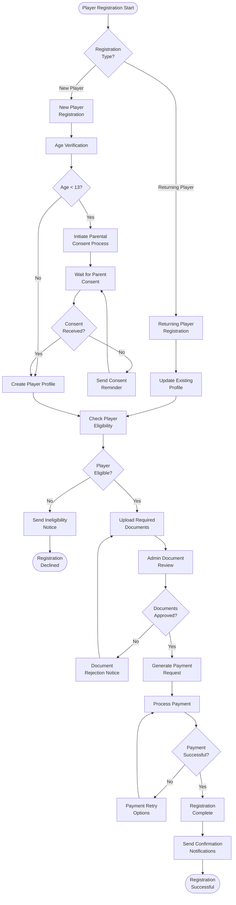

### 2.2 Detailed Registration Process with Swim Lanes

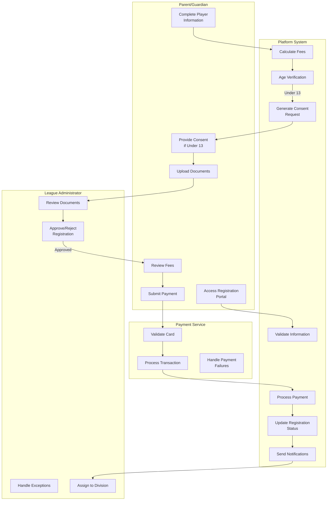

### 2.3 COPPA Compliance Sub-Process

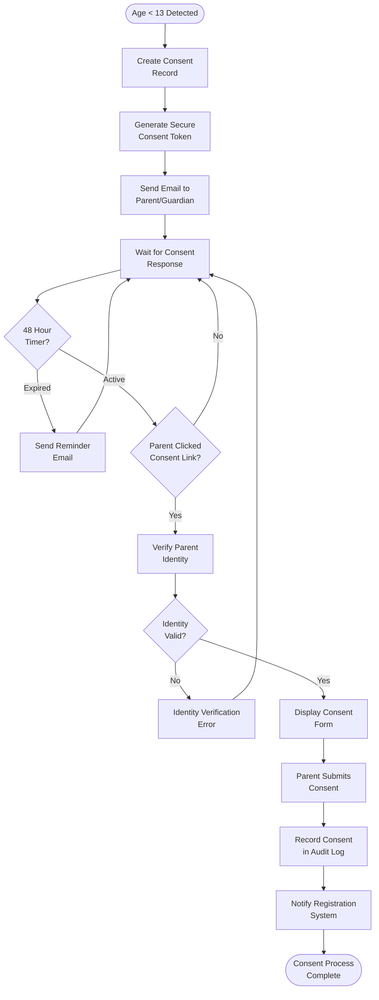

---

## 3. Team Formation Process

### 3.1 Team Formation Workflow

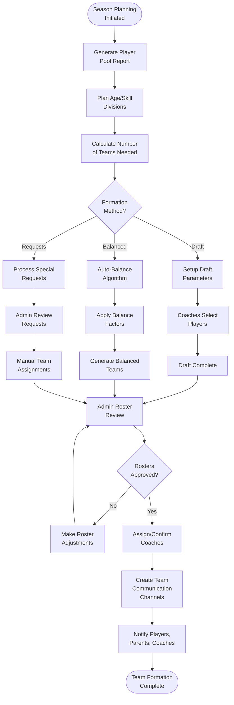

### 3.2 Team Balance Algorithm Sub-Process

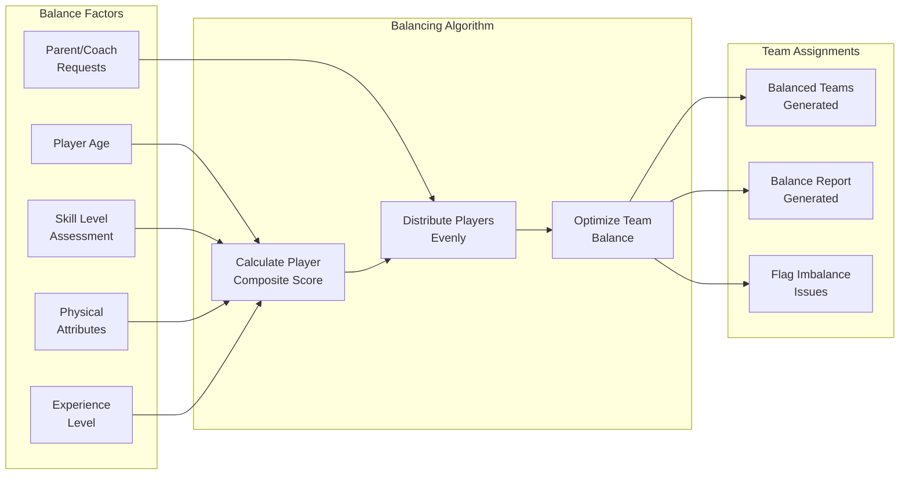

---

## 4. Season Scheduling Process

### 4.1 Comprehensive Scheduling Workflow

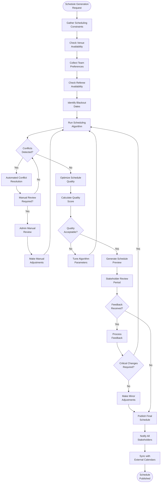

### 4.2 Scheduling Algorithm Decision Matrix

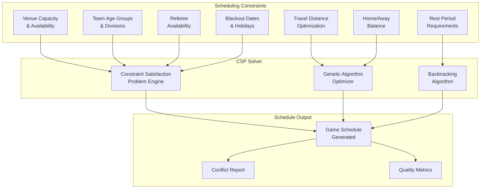

---

## 5. Game Day Operations Process

### 5.1 Complete Game Day Workflow

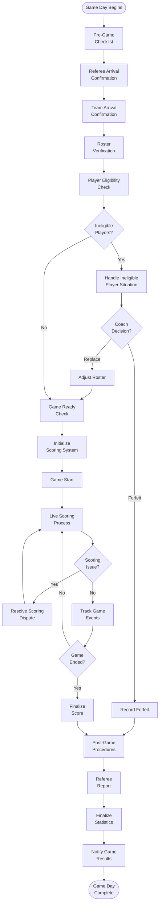

### 5.2 Live Scoring Sub-Process with Offline Handling

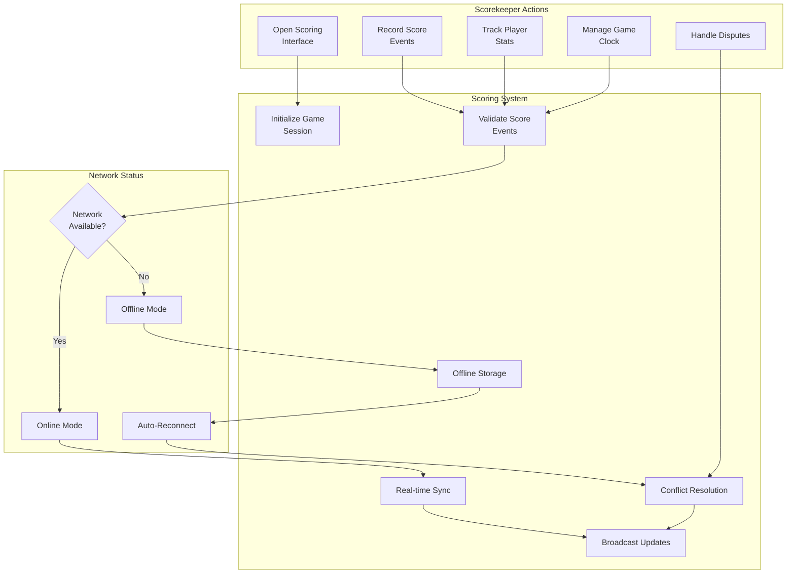

### 5.3 Game Event Processing

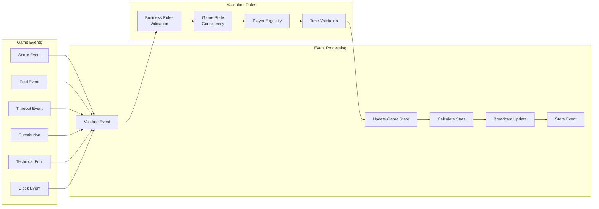

---

## 6. Payment Processing Flow

### 6.1 Complete Payment Processing Workflow

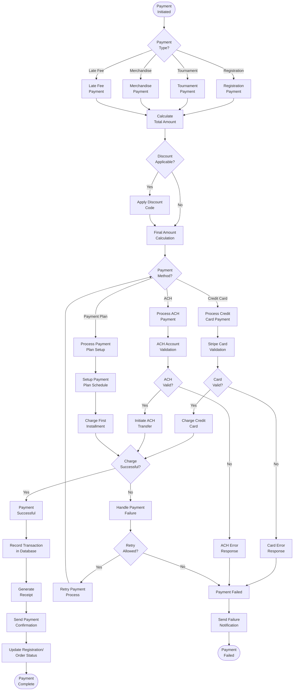

### 6.2 Payment Plan Management

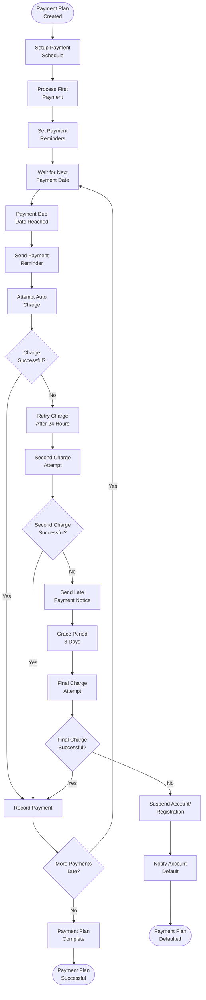

---

## 7. Tournament Management Process

### 7.1 Tournament Lifecycle Management

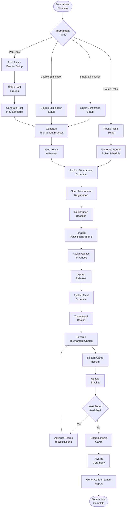

### 7.2 Bracket Management Sub-Process

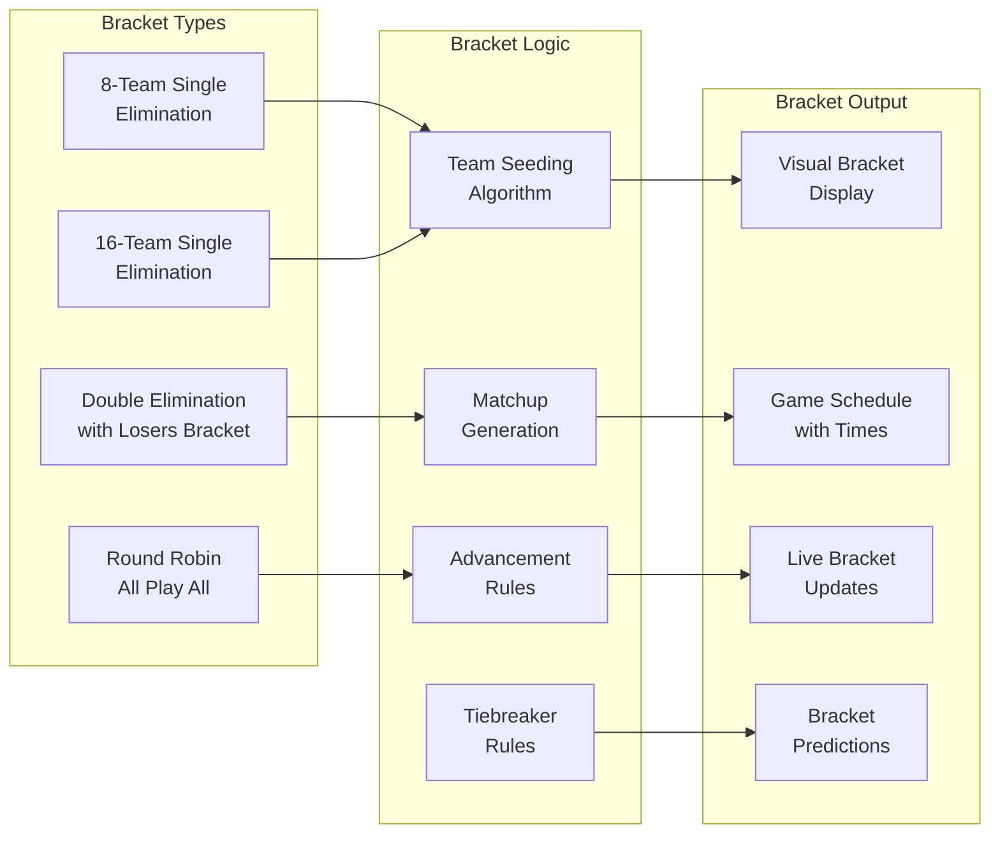

---

## 8. Communication Workflows

### 8.1 Multi-Channel Communication Process

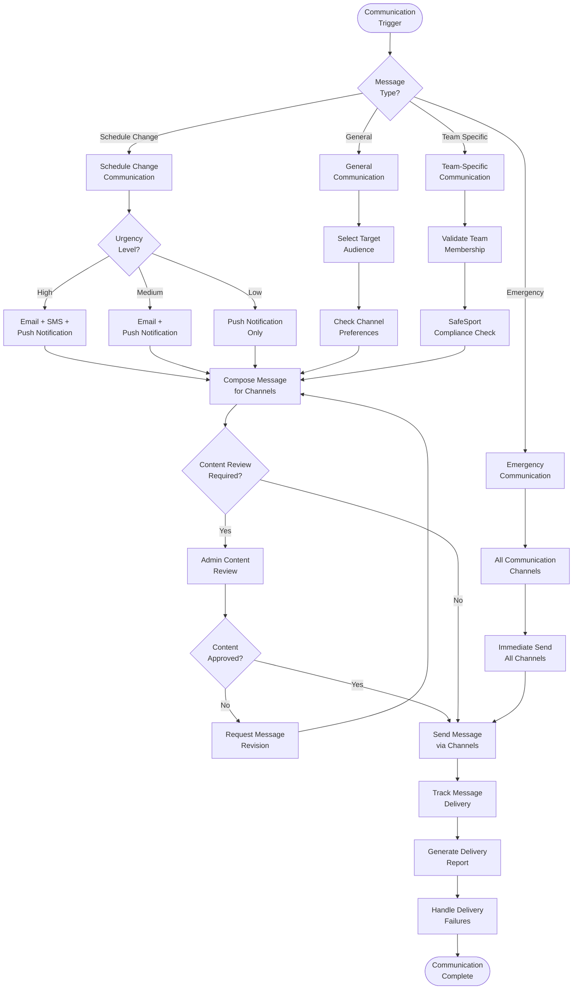

### 8.2 SafeSport Compliant Messaging

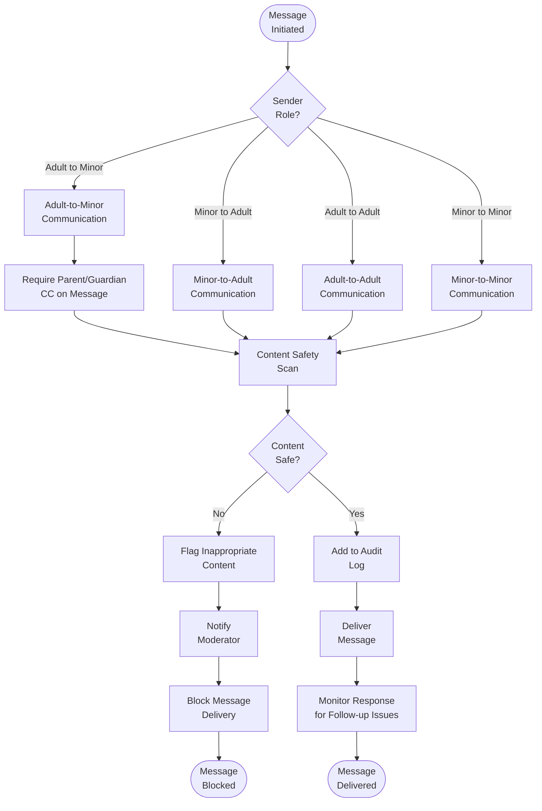

---

## 9. Dispute Resolution Process

### 9.1 Comprehensive Dispute Resolution Workflow

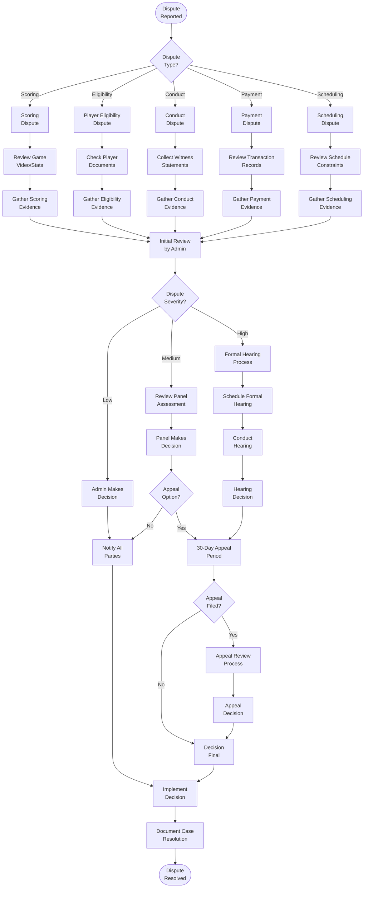

---

## 10. Emergency Response Process

### 10.1 Emergency Response Workflow

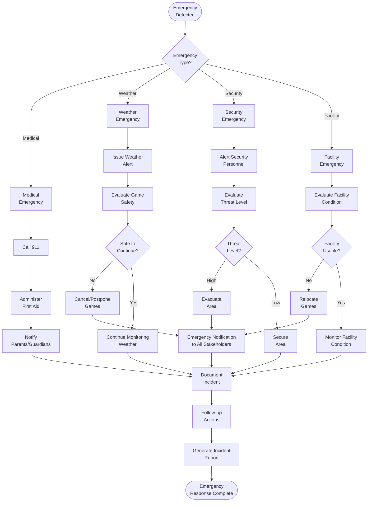

### 10.2 Heat Safety Protocol (Arizona-Specific)

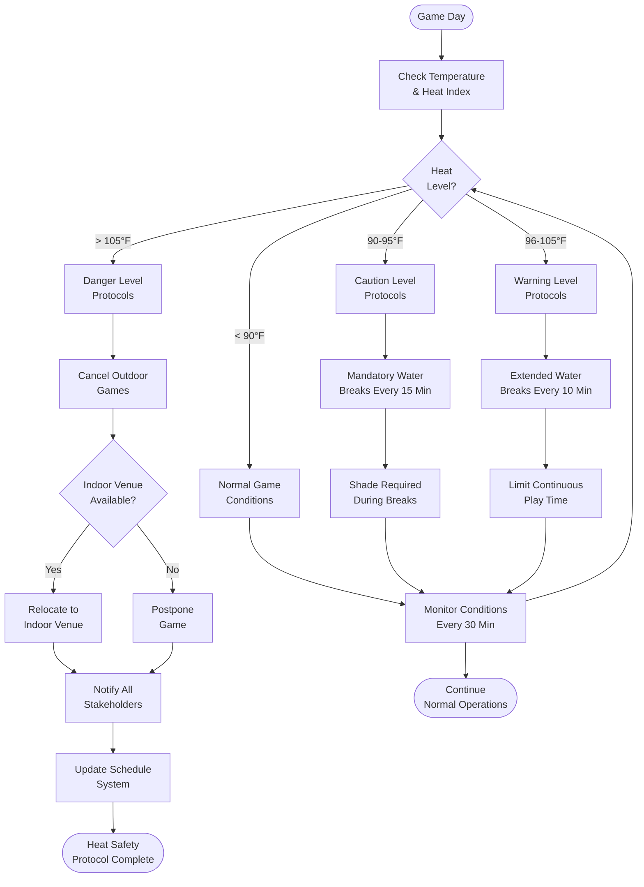

---

## Process Metrics and KPIs

### Key Performance Indicators

| Process | Primary KPI | Target | Measurement Method |
|---------|-------------|--------|-------------------|
| Player Registration | Time to Complete Registration | < 10 minutes | User Analytics |
| Team Formation | Balance Score Variance | < 5% between teams | Algorithm Metrics |
| Scheduling | Conflict Rate | < 2% of total games | System Reports |
| Game Operations | Scoring Accuracy | > 99.5% | Audit Comparisons |
| Payment Processing | Success Rate | > 98% | Transaction Logs |
| Communication | Delivery Rate | > 95% | Delivery Reports |
| Dispute Resolution | Resolution Time | < 72 hours | Case Tracking |

### Process Improvement Framework

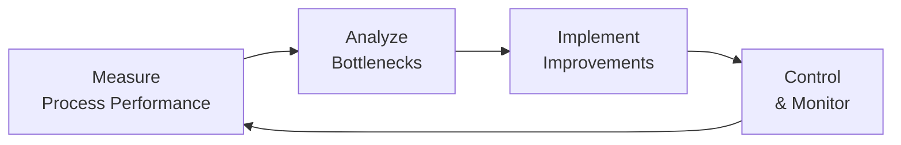

---

## Compliance and Audit Trail

### Process Compliance Requirements

1. **COPPA Compliance**: All processes involving minors under 13 must include parental consent workflows
2. **SafeSport Compliance**: Communication processes must include monitoring and audit capabilities
3. **Financial Compliance**: Payment processes must maintain PCI DSS compliance
4. **Data Privacy**: All processes must respect data retention and deletion policies

### Audit Trail Requirements

Each process must maintain:
- **Process Execution Logs**: Who, what, when, where
- **Decision Points**: Rationale for automated and manual decisions
- **Exception Handling**: How exceptions were resolved
- **Performance Metrics**: Time, cost, quality measurements
- **Compliance Checkpoints**: Verification of regulatory requirements

---

**Document Approval**

| Role | Name | Signature | Date |
|------|------|-----------|------|
| Business Analyst (CBAP) | [Pending] | [Pending] | [Pending] |
| Process Owner | [Pending] | [Pending] | [Pending] |
| Compliance Officer | [Pending] | [Pending] | [Pending] |
| Technical Lead | [Pending] | [Pending] | [Pending] |

---

*This document follows BPMN 2.0 standards and CBAP best practices for business process modeling and documentation.*