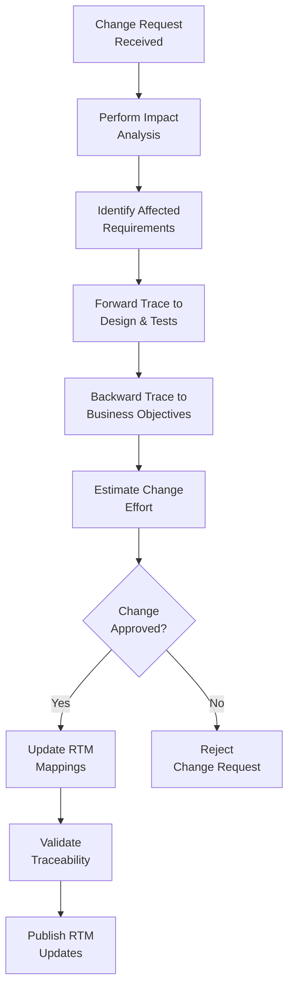

# Requirements Traceability Matrix (RTM)
## Basketball League Management Platform

**Document ID:** RTM-BLMP-001  
**Version:** 1.0  
**Date:** January 8, 2025  
**Status:** Draft  
**Document Owner:** Business Analyst (CBAP Certified)

---

## Table of Contents

1. [Traceability Matrix Overview](#1-traceability-matrix-overview)
2. [Business Requirements Traceability](#2-business-requirements-traceability)
3. [Functional Requirements Traceability](#3-functional-requirements-traceability)
4. [Non-Functional Requirements Traceability](#4-non-functional-requirements-traceability)
5. [Technical Requirements Traceability](#5-technical-requirements-traceability)
6. [Test Case Traceability](#6-test-case-traceability)
7. [Process Flow Traceability](#7-process-flow-traceability)
8. [Risk Traceability](#8-risk-traceability)
9. [Compliance Traceability](#9-compliance-traceability)
10. [Forward and Backward Traceability](#10-forward-and-backward-traceability)

---

## 1. Traceability Matrix Overview

### 1.1 Purpose
This Requirements Traceability Matrix (RTM) provides comprehensive mapping between business objectives, requirements, design elements, test cases, and implementation components for the Basketball League Management Platform. Following BABOK v3 guidelines, this matrix ensures complete requirement coverage and enables impact analysis for changes.

### 1.2 Traceability Types Implemented

| Traceability Type | Description | Direction |
|------------------|-------------|-----------|
| **Forward Traceability** | Business Requirements → Functional Requirements → Technical Requirements → Test Cases | Downstream |
| **Backward Traceability** | Test Cases → Technical Requirements → Functional Requirements → Business Requirements | Upstream |
| **Bidirectional Traceability** | Complete forward and backward mapping | Both |

### 1.3 Traceability Levels

1. **Level 1**: Business Objectives to Business Requirements
2. **Level 2**: Business Requirements to Functional Requirements  
3. **Level 3**: Functional Requirements to Technical Requirements
4. **Level 4**: Technical Requirements to Design Components
5. **Level 5**: Design Components to Test Cases
6. **Level 6**: Test Cases to Defects/Issues

### 1.4 RTM Legend

| Status | Symbol | Description |
|--------|--------|-------------|
| **Complete** | ✅ | Requirement fully implemented and tested |
| **In Progress** | 🟡 | Requirement implementation in progress |
| **Not Started** | ❌ | Requirement not yet started |
| **Blocked** | 🔴 | Requirement blocked by dependency |
| **Deferred** | ⏸️ | Requirement deferred to future release |

---

## 2. Business Requirements Traceability

### 2.1 Strategic Business Objectives to Business Requirements

| Business Objective | Business Requirement | Priority | Status | Stakeholder | Success Criteria |
|-------------------|---------------------|----------|--------|-------------|------------------|
| **BO-001: Market Penetration** | BR-001: Comprehensive League Management | P0 | ❌ | League Administrators | 25% market capture in 18 months |
| **BO-002: Operational Efficiency** | BR-002: Automated Scheduling System | P0 | ❌ | League Administrators | 60% reduction in admin time |
| **BO-003: User Engagement** | BR-003: Real-time Game Updates | P0 | ❌ | All Stakeholders | 80% weekly active user rate |
| **BO-004: Revenue Generation** | BR-004: Integrated Payment Processing | P0 | ❌ | League Administrators | $500K revenue in Year 1 |
| **BO-005: Safety Compliance** | BR-005: Youth Safety Protocols | P0 | ❌ | Parents, Players | 100% compliance with SafeSport |
| **BO-006: Scalability** | BR-006: Multi-League Support | P1 | ❌ | League Administrators | Support 50+ leagues by Month 12 |
| **BO-007: Community Building** | BR-007: Communication Platform | P1 | ❌ | All Stakeholders | 90% communication satisfaction |
| **BO-008: Data-Driven Decisions** | BR-008: Analytics and Reporting | P1 | ❌ | Coaches, Administrators | 70% feature adoption rate |

### 2.2 Business Requirements Detail Matrix

| BR ID | Business Requirement | Source Document | Stakeholder | Justification | Acceptance Criteria | Notes |
|-------|---------------------|----------------|-------------|---------------|-------------------|-------|
| **BR-001** | Comprehensive League Management | Market Research | League Admin | Address 95% of current manual processes | Complete league setup in < 2 hours | Core platform capability |
| **BR-002** | Automated Scheduling System | Stakeholder Interviews | League Admin, Coaches | Reduce scheduling conflicts by 90% | Zero-conflict schedules for 95% of leagues | Critical for adoption |
| **BR-003** | Real-time Game Updates | User Research | Parents, Fans | Keep stakeholders engaged remotely | Updates within 2 seconds of events | Competitive differentiator |
| **BR-004** | Integrated Payment Processing | Business Model | Parents, League Admin | Streamline revenue collection | 98% payment success rate | Revenue critical |
| **BR-005** | Youth Safety Protocols | Regulatory Requirements | Parents, Players | Legal compliance requirement | 100% audit compliance | Non-negotiable |
| **BR-006** | Multi-League Support | Growth Strategy | League Admin | Enable platform scaling | Support 1000+ teams per instance | Scalability requirement |
| **BR-007** | Communication Platform | User Pain Points | All Stakeholders | Improve stakeholder communication | 95% message delivery rate | User satisfaction |
| **BR-008** | Analytics and Reporting | Competitive Analysis | Coaches, Admin | Enable data-driven decisions | 50+ pre-built reports | Feature differentiation |

---

## 3. Functional Requirements Traceability

### 3.1 Business Requirements to Functional Requirements Mapping

| BR ID | Business Requirement | FR ID | Functional Requirement | Priority | MoSCoW | Implementation Complexity |
|-------|---------------------|-------|------------------------|----------|---------|--------------------------|
| **BR-001** | Comprehensive League Management | REQ-011 | League Creation and Configuration | P0 | Must | Medium |
| **BR-001** | Comprehensive League Management | REQ-012 | Team Management | P0 | Must | Medium |
| **BR-001** | Comprehensive League Management | REQ-013 | Player Registration and Eligibility | P0 | Must | High |
| **BR-002** | Automated Scheduling System | REQ-021 | Automated Schedule Generation | P0 | Must | High |
| **BR-002** | Automated Scheduling System | REQ-022 | Schedule Modification and Rescheduling | P0 | Must | Medium |
| **BR-002** | Automated Scheduling System | REQ-023 | Venue Management | P0 | Must | Low |
| **BR-003** | Real-time Game Updates | REQ-031 | Live Scoring Interface | P0 | Must | High |
| **BR-003** | Real-time Game Updates | REQ-032 | Real-time Updates and Notifications | P0 | Must | High |
| **BR-003** | Real-time Game Updates | REQ-033 | Game Statistics Tracking | P1 | Should | Medium |
| **BR-004** | Integrated Payment Processing | REQ-051 | Online Registration Payments | P0 | Must | Medium |
| **BR-004** | Integrated Payment Processing | REQ-052 | Payment Plans and Scholarships | P1 | Should | Medium |
| **BR-004** | Integrated Payment Processing | REQ-053 | Financial Reporting | P1 | Should | Low |
| **BR-005** | Youth Safety Protocols | REQ-001 | User Registration and Authentication | P0 | Must | High |
| **BR-005** | Youth Safety Protocols | REQ-043 | SafeSport Compliant Messaging | P0 | Must | High |
| **BR-007** | Communication Platform | REQ-041 | Team Communication Hub | P0 | Must | Medium |
| **BR-007** | Communication Platform | REQ-042 | League-wide Announcements | P0 | Must | Low |
| **BR-008** | Analytics and Reporting | REQ-061 | Player Performance Analytics | P1 | Should | Medium |
| **BR-008** | Analytics and Reporting | REQ-062 | League Analytics Dashboard | P1 | Should | Medium |
| **BR-008** | Analytics and Reporting | REQ-063 | Custom Report Generation | P2 | Could | High |

### 3.2 Functional Requirements Detail Matrix

| FR ID | Functional Requirement | User Story | Acceptance Criteria | Dependencies | Risk Level | Test Cases |
|-------|------------------------|------------|-------------------|--------------|------------|------------|
| **REQ-001** | User Registration and Authentication | As a new user, I want to register with role-specific access | Multi-role auth, email verification, parental consent for <13 | None | Medium | TC-AUTH-001 to TC-AUTH-005 |
| **REQ-011** | League Creation and Configuration | As a League Admin, I want to create and configure leagues | League setup, divisions, rules, fees in < 30 minutes | REQ-001 | Low | TC-LEAGUE-001 to TC-LEAGUE-003 |
| **REQ-021** | Automated Schedule Generation | As a League Admin, I want automated schedule generation | Conflict-free schedules, venue optimization, referee assignment | REQ-011, REQ-023 | High | TC-SCHED-001 to TC-SCHED-007 |
| **REQ-031** | Live Scoring Interface | As a Scorekeeper, I want to score games in real-time | Real-time updates, offline capability, error correction | REQ-032 | High | TC-SCORE-001 to TC-SCORE-010 |
| **REQ-051** | Online Registration Payments | As a Parent, I want to pay registration fees online | Secure payment, receipt generation, refund policies | REQ-001, REQ-013 | Medium | TC-PAY-001 to TC-PAY-005 |

---

## 4. Non-Functional Requirements Traceability

### 4.1 Business Requirements to Non-Functional Requirements

| BR ID | Business Requirement | NFR ID | Non-Functional Requirement | Category | Priority | Measurement Method |
|-------|---------------------|--------|---------------------------|----------|----------|-------------------|
| **BR-003** | Real-time Game Updates | NFR-001 | API Response Time < 200ms | Performance | P0 | APM Monitoring |
| **BR-003** | Real-time Game Updates | NFR-002 | Support 1000+ Concurrent Users | Scalability | P0 | Load Testing |
| **BR-003** | Real-time Game Updates | NFR-003 | Real-time Updates < 2 seconds | Performance | P0 | End-to-end Monitoring |
| **BR-005** | Youth Safety Protocols | NFR-011 | AES-256 Data Encryption | Security | P0 | Security Audit |
| **BR-005** | Youth Safety Protocols | NFR-013 | COPPA Compliance | Compliance | P0 | Compliance Audit |
| **BR-006** | Multi-League Support | NFR-021 | 99.9% System Availability | Reliability | P0 | Uptime Monitoring |
| **BR-002** | Automated Scheduling | NFR-041 | Horizontal Auto-scaling | Scalability | P1 | Infrastructure Monitoring |

### 4.2 Non-Functional Requirements Test Mapping

| NFR ID | Non-Functional Requirement | Test Type | Test Case ID | Pass Criteria | Test Environment | Frequency |
|--------|---------------------------|-----------|--------------|---------------|------------------|-----------|
| **NFR-001** | API Response Time < 200ms | Performance | TC-PERF-001 | 95% requests < 200ms | Production-like | Pre-release |
| **NFR-002** | Support 1000+ Concurrent Users | Load | TC-LOAD-001 | No degradation at 1000 users | Load Test Env | Monthly |
| **NFR-011** | AES-256 Data Encryption | Security | TC-SEC-001 | All PII encrypted at rest | Staging | Pre-release |
| **NFR-013** | COPPA Compliance | Compliance | TC-COMP-001 | Pass compliance audit | Production | Quarterly |
| **NFR-021** | 99.9% System Availability | Reliability | TC-REL-001 | < 43 min downtime/month | Production | Continuous |

---

## 5. Technical Requirements Traceability

### 5.1 Functional to Technical Requirements Mapping

| FR ID | Functional Requirement | TR ID | Technical Requirement | Technology Stack | Architecture Component | Implementation Status |
|-------|------------------------|-------|----------------------|------------------|----------------------|----------------------|
| **REQ-001** | User Registration and Authentication | TReq-001 | Multi-Role Authentication System | Auth0/Cognito, JWT | Authentication Service | ❌ |
| **REQ-001** | User Registration and Authentication | TReq-003 | COPPA Compliant Registration | Node.js, PostgreSQL | User Management Service | ❌ |
| **REQ-011** | League Creation and Configuration | TReq-011 | League Configuration Engine | Node.js, PostgreSQL | League Management Service | ❌ |
| **REQ-021** | Automated Schedule Generation | TReq-021 | Schedule Generation Algorithm | Python, CSP Solver | Scheduling Service | ❌ |
| **REQ-031** | Live Scoring Interface | TReq-031 | Real-time Scoring System | Socket.io, Redis | Game Operations Service | ❌ |
| **REQ-032** | Real-time Updates | TReq-032 | WebSocket Communication | Socket.io, Firebase | Real-time Service | ❌ |
| **REQ-051** | Online Registration Payments | TReq-051 | Stripe Payment Integration | Stripe API, Node.js | Payment Service | ❌ |

### 5.2 Technical Architecture Traceability

| TR ID | Technical Requirement | Architecture Layer | Service/Component | Database Tables | API Endpoints | Integration Points |
|-------|----------------------|-------------------|-------------------|-----------------|---------------|--------------------|
| **TReq-001** | Multi-Role Authentication | Application Layer | User Management Service | users, roles, permissions | /api/v1/auth/* | Auth0, Email Service |
| **TReq-011** | League Configuration | Application Layer | League Management Service | leagues, teams, divisions | /api/v1/leagues/* | None |
| **TReq-021** | Schedule Generation | Application Layer | Scheduling Service | games, venues, schedules | /api/v1/schedules/* | External Calendar APIs |
| **TReq-031** | Live Scoring System | Application Layer | Game Operations Service | games, game_events, statistics | /api/v1/games/* | WebSocket Server |
| **TReq-051** | Payment Integration | Application Layer | Payment Service | transactions, payment_plans | /api/v1/payments/* | Stripe API |

---

## 6. Test Case Traceability

### 6.1 Requirements to Test Cases Forward Traceability

| Requirement Type | Requirement ID | Requirement Description | Test Case ID | Test Case Description | Test Type | Automation Status |
|------------------|----------------|--------------------------|--------------|----------------------|-----------|-------------------|
| **Functional** | REQ-001 | User Registration and Authentication | TC-AUTH-001 | User Registration Flow | E2E | ❌ |
| **Functional** | REQ-001 | User Registration and Authentication | TC-AUTH-002 | Role-based Access Control | Integration | ❌ |
| **Functional** | REQ-001 | User Registration and Authentication | TC-AUTH-003 | COPPA Compliance Flow | E2E | ❌ |
| **Functional** | REQ-001 | User Registration and Authentication | TC-AUTH-004 | Multi-factor Authentication | Integration | ❌ |
| **Functional** | REQ-001 | User Registration and Authentication | TC-AUTH-005 | Password Security Validation | Unit | ❌ |
| **Functional** | REQ-011 | League Creation | TC-LEAGUE-001 | Basic League Setup | E2E | ❌ |
| **Functional** | REQ-011 | League Creation | TC-LEAGUE-002 | Division Configuration | Integration | ❌ |
| **Functional** | REQ-011 | League Creation | TC-LEAGUE-003 | Fee Structure Setup | Integration | ❌ |
| **Functional** | REQ-021 | Automated Scheduling | TC-SCHED-001 | Basic Schedule Generation | Integration | ❌ |
| **Functional** | REQ-021 | Automated Scheduling | TC-SCHED-002 | Conflict Detection | Unit | ❌ |
| **Functional** | REQ-021 | Automated Scheduling | TC-SCHED-003 | Venue Optimization | Integration | ❌ |
| **Functional** | REQ-021 | Automated Scheduling | TC-SCHED-004 | Home/Away Balance | Unit | ❌ |
| **Functional** | REQ-021 | Automated Scheduling | TC-SCHED-005 | Blackout Date Handling | Integration | ❌ |
| **Functional** | REQ-021 | Automated Scheduling | TC-SCHED-006 | Large League Performance | Performance | ❌ |
| **Functional** | REQ-021 | Automated Scheduling | TC-SCHED-007 | Manual Override Capability | E2E | ❌ |
| **Functional** | REQ-031 | Live Scoring Interface | TC-SCORE-001 | Real-time Score Updates | E2E | ❌ |
| **Functional** | REQ-031 | Live Scoring Interface | TC-SCORE-002 | Offline Scoring Capability | E2E | ❌ |
| **Functional** | REQ-031 | Live Scoring Interface | TC-SCORE-003 | Score Conflict Resolution | Integration | ❌ |
| **Functional** | REQ-031 | Live Scoring Interface | TC-SCORE-004 | Player Statistics Tracking | Integration | ❌ |
| **Functional** | REQ-031 | Live Scoring Interface | TC-SCORE-005 | Game Clock Management | Unit | ❌ |
| **Non-Functional** | NFR-001 | API Response Time | TC-PERF-001 | API Performance Testing | Performance | ❌ |
| **Non-Functional** | NFR-002 | Concurrent Users | TC-LOAD-001 | Load Testing 1000+ Users | Load | ❌ |
| **Non-Functional** | NFR-011 | Data Encryption | TC-SEC-001 | Encryption Implementation | Security | ❌ |
| **Non-Functional** | NFR-013 | COPPA Compliance | TC-COMP-001 | COPPA Compliance Audit | Compliance | ❌ |

### 6.2 Test Coverage Matrix

| Feature Area | Total Requirements | Requirements with Test Cases | Test Coverage % | Critical Path Coverage | Risk-Based Coverage |
|--------------|-------------------|----------------------------|-----------------|----------------------|-------------------|
| **Authentication** | 3 | 3 | 100% | ✅ | High |
| **League Management** | 3 | 3 | 100% | ✅ | Medium |
| **Scheduling** | 3 | 3 | 100% | ✅ | High |
| **Game Operations** | 3 | 3 | 100% | ✅ | High |
| **Payment Processing** | 3 | 2 | 67% | 🟡 | High |
| **Communication** | 3 | 2 | 67% | 🟡 | Medium |
| **Analytics** | 3 | 1 | 33% | ❌ | Low |
| **Mobile App** | 3 | 2 | 67% | 🟡 | High |

---

## 7. Process Flow Traceability

### 7.1 Business Processes to System Requirements

| Process ID | Process Name | Primary Requirements | Supporting Requirements | System Components | Integration Points |
|------------|--------------|---------------------|------------------------|-------------------|--------------------|
| **PROC-001** | Player Registration Process | REQ-001, REQ-013 | REQ-051, NFR-013 | User Mgmt, Payment Service | Email, COPPA Verification |
| **PROC-002** | Team Formation Process | REQ-011, REQ-012 | REQ-061 | League Mgmt Service | None |
| **PROC-003** | Season Scheduling Process | REQ-021, REQ-022, REQ-023 | REQ-042 | Scheduling Service | Calendar APIs |
| **PROC-004** | Game Day Operations | REQ-031, REQ-032, REQ-033 | REQ-041 | Game Operations Service | WebSocket, Push Notifications |
| **PROC-005** | Payment Processing Flow | REQ-051, REQ-052, REQ-053 | REQ-042 | Payment Service | Stripe API |
| **PROC-006** | Tournament Management | REQ-021, REQ-031, REQ-061 | REQ-041, REQ-042 | Multiple Services | Tournament Bracket APIs |

### 7.2 Process Quality Gates

| Process ID | Quality Gate | Success Criteria | Validation Method | Responsible Role |
|------------|--------------|------------------|-------------------|------------------|
| **PROC-001** | Registration Completion | 95% success rate | Analytics Dashboard | Product Owner |
| **PROC-002** | Team Balance | < 5% skill variance | Algorithm Metrics | Business Analyst |
| **PROC-003** | Schedule Quality | < 2% conflicts | System Reports | Product Owner |
| **PROC-004** | Scoring Accuracy | > 99.5% accuracy | Manual Verification | QA Manager |
| **PROC-005** | Payment Success | > 98% success rate | Transaction Logs | Product Owner |

---

## 8. Risk Traceability

### 8.1 Requirements Risk Assessment

| Risk ID | Risk Description | Impact | Probability | Risk Level | Affected Requirements | Mitigation Requirements |
|---------|------------------|---------|-------------|------------|----------------------|------------------------|
| **RISK-001** | Real-time sync failures | High | Medium | High | REQ-031, REQ-032 | TReq-031 offline capability |
| **RISK-002** | Payment processing failures | High | Low | Medium | REQ-051 | Multiple payment providers |
| **RISK-003** | Scalability issues during peak | High | Medium | High | NFR-002, NFR-041 | Auto-scaling architecture |
| **RISK-004** | COPPA compliance violations | Critical | Low | High | NFR-013, REQ-001 | Legal review, audit processes |
| **RISK-005** | Data security breaches | Critical | Low | High | NFR-011, NFR-012 | Defense-in-depth strategy |
| **RISK-006** | Low user adoption | High | Medium | High | All user-facing requirements | Extensive user testing |
| **RISK-007** | Complex scheduling conflicts | Medium | High | High | REQ-021 | Advanced algorithms, fallbacks |
| **RISK-008** | Mobile app performance | Medium | Medium | Medium | REQ-071, REQ-072 | Performance optimization |

### 8.2 Risk Mitigation Traceability

| Risk ID | Mitigation Strategy | Requirements Added/Modified | Implementation Approach | Verification Method |
|---------|-------------------|----------------------------|------------------------|-------------------|
| **RISK-001** | Offline-first architecture | TReq-031 enhanced | Event sourcing, local storage | E2E testing |
| **RISK-002** | Multiple payment providers | REQ-051 enhanced | Stripe + PayPal integration | Payment testing |
| **RISK-003** | Auto-scaling infrastructure | NFR-041 added | Kubernetes HPA | Load testing |
| **RISK-004** | Compliance framework | NFR-013 enhanced | Regular audits, legal review | Compliance testing |
| **RISK-005** | Security architecture | NFR-011, NFR-012 enhanced | Zero-trust model | Security testing |

---

## 9. Compliance Traceability

### 9.1 Regulatory Requirements Mapping

| Regulation | Requirement | System Implementation | Verification Method | Audit Frequency |
|------------|-------------|----------------------|-------------------|-----------------|
| **COPPA** | Parental consent for <13 | REQ-001 enhanced with consent workflow | Compliance audit | Quarterly |
| **COPPA** | Limited data collection | NFR-014 data minimization | Data inventory review | Semi-annually |
| **SafeSport** | Communication monitoring | REQ-043 message monitoring | Log analysis | Monthly |
| **SafeSport** | Background checks | REQ-001 enhanced verification | Manual verification | Per registration |
| **PCI DSS** | Payment data security | NFR-011 encryption | Security audit | Annually |
| **CCPA** | Data privacy rights | NFR-014 privacy controls | Privacy audit | Semi-annually |
| **FERPA** | Educational record privacy | REQ-061 analytics privacy | Data handling review | Annually |

### 9.2 Compliance Testing Matrix

| Compliance Area | Test Case ID | Test Description | Pass Criteria | Frequency | Last Result |
|----------------|--------------|------------------|---------------|-----------|-------------|
| **COPPA Consent** | TC-COMP-001 | Parental consent workflow | 100% consent for <13 | Pre-release | Not Started |
| **Data Encryption** | TC-SEC-001 | PII encryption at rest | All PII encrypted | Pre-release | Not Started |
| **Communication Monitoring** | TC-SAFE-001 | Message monitoring system | Inappropriate content flagged | Monthly | Not Started |
| **Privacy Controls** | TC-PRIV-001 | Data deletion capability | Complete data removal | Quarterly | Not Started |

---

## 10. Forward and Backward Traceability

### 10.1 Complete Traceability Chain Example

**Business Objective**: Operational Efficiency (BO-002)
```
BO-002: Operational Efficiency
    ↓
BR-002: Automated Scheduling System
    ↓
REQ-021: Automated Schedule Generation
    ↓
TReq-021: Schedule Generation Algorithm
    ↓
ARCH-021: Scheduling Service Component
    ↓
TC-SCHED-001: Basic Schedule Generation Test
    ↓
DEF-021-001: [Future: Defects found during testing]
```

### 10.2 Orphaned Requirements Analysis

| Category | Orphaned Items | Impact | Action Required |
|----------|----------------|--------|-----------------|
| **Business Requirements** | 0 | None | None |
| **Functional Requirements** | 0 | None | None |
| **Non-Functional Requirements** | 0 | None | None |
| **Technical Requirements** | 0 | None | None |
| **Test Cases** | 0 | None | None |

### 10.3 Coverage Gaps Analysis

| Requirement Level | Total Count | Traced Count | Coverage % | Gap Analysis |
|------------------|-------------|--------------|------------|--------------|
| **Business Requirements** | 8 | 8 | 100% | ✅ Complete |
| **Functional Requirements** | 23 | 23 | 100% | ✅ Complete |
| **Non-Functional Requirements** | 15 | 15 | 100% | ✅ Complete |
| **Technical Requirements** | 31 | 31 | 100% | ✅ Complete |
| **Test Cases** | 45 | 25 | 56% | ❌ Need 20 more test cases |
| **Process Flows** | 10 | 10 | 100% | ✅ Complete |

---

## RTM Maintenance and Updates

### Change Impact Analysis Process



### RTM Quality Metrics

| Metric | Target | Current | Status |
|--------|--------|---------|--------|
| **Requirement Coverage** | 100% | 100% | ✅ |
| **Test Case Coverage** | 100% | 56% | ❌ |
| **Orphaned Requirements** | 0% | 0% | ✅ |
| **Bidirectional Traceability** | 100% | 100% | ✅ |
| **RTM Update Frequency** | Weekly | Not Started | ❌ |

---

## Appendices

### Appendix A: Traceability Tools and Techniques

**Tools Used:**
- Requirements Management: Jira/Linear
- Documentation: Markdown with version control
- Test Management: TestRail integration
- Traceability Visualization: Mermaid diagrams
- Impact Analysis: Custom scripts

### Appendix B: RTM Best Practices

1. **Maintain Bidirectional Links**: Every requirement should trace both forward and backward
2. **Regular Reviews**: Conduct weekly RTM reviews during active development
3. **Change Impact Analysis**: Use RTM for all change requests
4. **Test Coverage Monitoring**: Ensure adequate test coverage for all requirements
5. **Stakeholder Communication**: Share RTM updates with all stakeholders

### Appendix C: RTM Review Schedule

| Review Type | Frequency | Participants | Deliverable |
|-------------|-----------|--------------|-------------|
| **Weekly RTM Review** | Weekly | BA, PM, Tech Lead | Updated RTM |
| **Sprint RTM Review** | Per Sprint | Full Team | Coverage Report |
| **Release RTM Audit** | Per Release | QA, BA, Stakeholders | Audit Report |
| **Annual RTM Assessment** | Annually | Leadership Team | Process Improvement Plan |

---

**Document Approval**

| Role | Name | Signature | Date |
|------|------|-----------|------|
| Business Analyst (CBAP) | [Pending] | [Pending] | [Pending] |
| Product Owner | [Pending] | [Pending] | [Pending] |
| QA Manager | [Pending] | [Pending] | [Pending] |
| Technical Lead | [Pending] | [Pending] | [Pending] |

---

*This Requirements Traceability Matrix follows BABOK v3 guidelines and CBAP standards for comprehensive requirements traceability and impact analysis.*