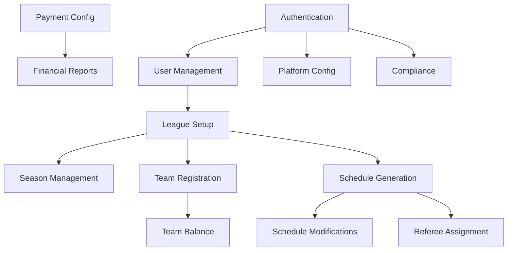

# League Administrator User Stories
## Basketball League Management Platform

**Document ID:** US-ADMIN-001  
**Version:** 1.0  
**Date:** January 8, 2025  
**Author:** Agile User Story Writer  
**Persona:** League Administrator  

---

## Persona Overview

**League Administrator Profile:**
- Age Range: 35-60 years
- Technology Comfort: Moderate to High
- Primary Goals: Efficient league operations, compliance management, stakeholder satisfaction
- Pain Points: Manual processes, complex scheduling, compliance tracking, multi-channel communication
- Usage Context: Desktop primary (80%), mobile for game-day operations (20%)

---

## User Stories by Epic

### Epic E01: User Authentication and Management

#### US-ADMIN-001: Administrator Account Creation
**Title:** Create administrator account with enhanced security  
**User Story:** As a League Administrator, I want to create a secure account with multi-factor authentication so that I can protect sensitive league data and maintain platform integrity.  
**Priority:** P0 - Must Have  
**Story Points:** 5  
**Sprint:** 1  

**Acceptance Criteria:**
```gherkin
Scenario: Successful administrator registration
  Given I am on the registration page
  And I select "League Administrator" as my role
  When I provide valid email, password, and organization details
  And I complete email verification
  And I set up multi-factor authentication
  Then my administrator account is created
  And I receive confirmation of admin privileges
  And an audit log entry is created for the new admin account

Scenario: Password complexity requirements
  Given I am creating an administrator password
  When I enter a password
  Then it must contain at least 12 characters
  And include uppercase, lowercase, numbers, and special characters
  And not match any of my last 5 passwords
  And pass a strength meter validation

Scenario: Multi-factor authentication setup
  Given I have verified my email
  When I access the MFA setup page
  Then I can choose between SMS, authenticator app, or hardware key
  And I must complete MFA verification before account activation
  And backup codes are generated and displayed once
```

**Dependencies:** None  
**Notes:** Implements enhanced security per compliance requirements

---

#### US-ADMIN-002: User Management Dashboard
**Title:** Manage all platform users from central dashboard  
**User Story:** As a League Administrator, I want to view and manage all users in my league so that I can maintain accurate records and handle user issues efficiently.  
**Priority:** P0 - Must Have  
**Story Points:** 8  
**Sprint:** 2  

**Acceptance Criteria:**
```gherkin
Scenario: View user roster
  Given I am logged in as a League Administrator
  When I access the user management dashboard
  Then I see a searchable, filterable list of all users
  And I can filter by role, status, team, and registration date
  And I can export the user list to CSV

Scenario: Edit user information
  Given I am viewing a user's profile
  When I click "Edit User"
  Then I can modify non-sensitive user information
  And changes require confirmation
  And an audit log entry is created
  And the user receives notification of changes

Scenario: Deactivate user account
  Given I need to deactivate a user
  When I select "Deactivate Account"
  Then I must provide a reason
  And the user's access is immediately revoked
  And associated data is retained per retention policy
  And the user receives notification with appeal instructions

Scenario: Bulk user operations
  Given I have selected multiple users
  When I choose a bulk action
  Then I can send mass communications
  Or export selected user data
  Or assign users to teams/roles in bulk
  And all actions are logged for audit
```

**Dependencies:** US-ADMIN-001  
**Notes:** Includes COPPA compliance for youth user management

---

### Epic E06: League Creation and Management

#### US-ADMIN-003: League Setup Wizard
**Title:** Create new league with guided setup  
**User Story:** As a League Administrator, I want to use a step-by-step wizard to set up a new league so that I can ensure all necessary configurations are completed correctly.  
**Priority:** P0 - Must Have  
**Story Points:** 13  
**Sprint:** 3  

**Acceptance Criteria:**
```gherkin
Scenario: Initialize league creation
  Given I am an authenticated League Administrator
  When I click "Create New League"
  Then I enter a league setup wizard with progress indicator
  And I can save progress and resume later
  And validation occurs at each step

Scenario: Configure basic league information
  Given I am on step 1 of league setup
  When I enter league details
  Then I must provide:
    | Field | Validation |
    | League Name | Required, 3-100 characters |
    | Sport Type | Basketball (default) |
    | Season Dates | Start < End, Future dates |
    | Registration Deadline | Before season start |
    | League Description | Optional, 500 char max |
    | Age Divisions | At least one required |

Scenario: Set up divisions and skill levels
  Given I am configuring divisions
  When I add a division
  Then I specify age range (e.g., U10, U12)
  And I set skill level (Recreational, Competitive, Elite)
  And I define max teams per division
  And I set roster size limits
  And I can create multiple divisions

Scenario: Configure league rules
  Given I am on the rules configuration step
  When I set up game rules
  Then I can specify:
    | Rule | Options |
    | Game Duration | Quarters/Halves with time |
    | Shot Clock | Enable/Disable with seconds |
    | Mercy Rule | Point differential and time |
    | Overtime | Format and duration |
    | Fouls | Limit and bonus rules |
  And I can save as template for future use

Scenario: Complete league setup
  Given I have completed all wizard steps
  When I click "Create League"
  Then the league is created with all configurations
  And I receive a summary of settings
  And teams can begin registration
  And the league appears in my dashboard
```

**Dependencies:** US-ADMIN-002  
**Notes:** Consider Phoenix heat for outdoor game scheduling

---

#### US-ADMIN-004: Season Management
**Title:** Manage league seasons and transitions  
**User Story:** As a League Administrator, I want to manage multiple seasons and transition between them so that I can maintain continuous league operations year-round.  
**Priority:** P0 - Must Have  
**Story Points:** 8  
**Sprint:** 4  

**Acceptance Criteria:**
```gherkin
Scenario: View season timeline
  Given I am in the league management area
  When I access season management
  Then I see a timeline of past, current, and planned seasons
  And each season shows key dates and statistics
  And I can drill into any season for details

Scenario: Clone season for quick setup
  Given I want to create a new season
  When I select "Clone from Previous Season"
  Then all settings are copied to the new season
  And I can modify dates and specific settings
  And team/player data is not copied
  And I can choose which elements to clone

Scenario: Archive completed season
  Given a season has ended
  When I select "Archive Season"
  Then all season data is preserved
  And statistics are finalized
  And awards/achievements are locked
  And data remains searchable but read-only
  And storage is optimized for archived data

Scenario: Manage season transitions
  Given I am transitioning between seasons
  When the current season ends
  Then I can run a transition wizard that:
    | Action | Description |
    | Generate Reports | Final standings and statistics |
    | Process Awards | MVP, championships, etc. |
    | Send Notifications | Season wrap-up to all users |
    | Open Registration | For next season |
    | Retain Players | Optional carry-over registration |
```

**Dependencies:** US-ADMIN-003  
**Notes:** Supports year-round league operations

---

### Epic E07: Team Registration and Management

#### US-ADMIN-005: Team Registration Approval
**Title:** Review and approve team registrations  
**User Story:** As a League Administrator, I want to review and approve team registrations so that I can ensure teams meet league requirements and maintain competitive balance.  
**Priority:** P0 - Must Have  
**Story Points:** 5  
**Sprint:** 4  

**Acceptance Criteria:**
```gherkin
Scenario: Review pending team registrations
  Given teams have submitted registration
  When I access the registration queue
  Then I see all pending registrations with status
  And I can sort by submission date, division, or status
  And I see a summary of team information
  And I can bulk approve teams meeting all criteria

Scenario: Validate team eligibility
  Given I am reviewing a team registration
  When I open the detailed view
  Then I can verify:
    | Criteria | Validation |
    | Roster Size | Within division limits |
    | Age Eligibility | All players in age range |
    | Payment Status | Fees paid or pending |
    | Coach Certification | Background check and training |
    | Required Documents | Insurance, waivers |
  And system highlights any issues

Scenario: Approve team registration
  Given a team meets all requirements
  When I click "Approve Registration"
  Then the team status changes to "Active"
  And the coach receives confirmation email
  And the team appears in division standings
  And players receive welcome communications

Scenario: Reject or request modifications
  Given a team has issues with registration
  When I select "Request Modifications"
  Then I can specify required changes
  And provide deadline for corrections
  And the coach receives detailed feedback
  And the registration returns to pending after resubmission
```

**Dependencies:** US-ADMIN-003  
**Notes:** Includes SafeSport certification validation

---

#### US-ADMIN-006: Team Balance and Competitive Parity
**Title:** Manage team assignments for competitive balance  
**User Story:** As a League Administrator, I want to balance teams across divisions so that I can ensure fair competition and enjoyable experience for all participants.  
**Priority:** P1 - Should Have  
**Story Points:** 8  
**Sprint:** 5  

**Acceptance Criteria:**
```gherkin
Scenario: View team distribution
  Given I have multiple teams registered
  When I access team balance dashboard
  Then I see distribution by:
    | Metric | Visualization |
    | Division Count | Bar chart by division |
    | Skill Ratings | Distribution curve |
    | Geographic Spread | Map view |
    | Age Distribution | Histogram |
  And I can identify imbalances

Scenario: Run team balancing algorithm
  Given I want to balance teams
  When I click "Auto-Balance Teams"
  Then the system suggests team movements based on:
    | Factor | Weight |
    | Skill Level | 40% |
    | Geographic Location | 30% |
    | Player Preferences | 20% |
    | Historical Performance | 10% |
  And I can preview changes before applying
  And affected coaches are notified of proposals

Scenario: Manual team adjustments
  Given I need to move players between teams
  When I select players and target team
  Then I can transfer with reason documentation
  And both coaches receive notification
  And player history is maintained
  And moves are restricted after season start

Scenario: Create new teams for overflow
  Given a division has excess players
  When registration exceeds team capacity
  Then I can create new teams
  And assign volunteer coaches
  And auto-distribute unassigned players
  And maintain competitive balance
```

**Dependencies:** US-ADMIN-005  
**Notes:** Critical for recreational league satisfaction

---

### Epic E09: Scheduling System

#### US-ADMIN-007: Automated Schedule Generation
**Title:** Generate season schedules automatically  
**User Story:** As a League Administrator, I want to automatically generate game schedules that consider all constraints so that I can save time and avoid conflicts.  
**Priority:** P0 - Must Have  
**Story Points:** 13  
**Sprint:** 5  

**Acceptance Criteria:**
```gherkin
Scenario: Configure scheduling parameters
  Given I need to create a season schedule
  When I access the schedule generator
  Then I can set parameters:
    | Parameter | Options |
    | Schedule Type | Round-robin, Divisions, Tournaments |
    | Games per Team | Minimum and maximum |
    | Venue Availability | Select available courts/times |
    | Blackout Dates | Holidays, school breaks |
    | Time Preferences | Preferred game times by age |
    | Travel Limits | Maximum distance between venues |

Scenario: Run schedule generation
  Given I have configured parameters
  When I click "Generate Schedule"
  Then the system creates an optimized schedule
  And shows generation progress
  And completes within 2 minutes for 100 teams
  And provides a conflict report
  And allows me to regenerate with different parameters

Scenario: Review generated schedule
  Given a schedule has been generated
  When I review the results
  Then I see:
    | View | Information |
    | Calendar View | Month/week/day views |
    | Team View | Each team's full schedule |
    | Venue View | Court utilization |
    | Conflict List | Any remaining issues |
    | Statistics | Home/away balance, back-to-backs |
  And I can make manual adjustments

Scenario: Handle scheduling conflicts
  Given the generator identifies conflicts
  When I review conflict report
  Then I see detailed conflict information
  And suggested resolutions
  And I can manually resolve
  Or adjust parameters and regenerate
  And system prevents double-booking

Scenario: Publish schedule
  Given I have approved the schedule
  When I click "Publish Schedule"
  Then all stakeholders receive notifications
  And schedule syncs to calendars
  And website updates immediately
  And schedule is locked from auto-changes
```

**Dependencies:** US-ADMIN-003, Venue Management  
**Notes:** Must account for Phoenix heat in scheduling outdoor games

---

#### US-ADMIN-008: Schedule Modifications
**Title:** Modify schedules for weather and conflicts  
**User Story:** As a League Administrator, I want to easily reschedule games when conflicts arise so that I can maintain season continuity despite disruptions.  
**Priority:** P0 - Must Have  
**Story Points:** 8  
**Sprint:** 6  

**Acceptance Criteria:**
```gherkin
Scenario: Reschedule single game
  Given a game needs rescheduling
  When I select the game and click "Reschedule"
  Then I can:
    | Action | Options |
    | Select Reason | Weather, venue issue, team conflict |
    | Find New Slot | System suggests available times |
    | Notify Teams | Automatic notifications sent |
    | Update Records | Calendar and website updated |
  And affected parties receive immediate notice

Scenario: Bulk reschedule for weather
  Given severe weather affects multiple games
  When I select affected date/venue
  Then I can postpone all games
  And system suggests makeup dates
  And maintains competitive balance
  And sends mass notifications
  And updates all integrated calendars

Scenario: Handle venue emergencies
  Given a venue becomes unavailable
  When I mark venue as unavailable
  Then all affected games are flagged
  And alternative venues are suggested
  And I can reassign games in bulk
  And driving directions are updated
  And notifications include new location

Scenario: Manage heat delays (Phoenix-specific)
  Given temperature exceeds safety threshold
  When I check heat index
  Then system recommends:
    | Temperature | Action |
    | 105-110°F | Move to early morning/evening |
    | 110-115°F | Consider postponement |
    | Above 115°F | Mandatory cancellation |
  And I can reschedule based on forecast
  And heat safety notifications are sent
```

**Dependencies:** US-ADMIN-007  
**Notes:** Critical for Phoenix summer operations

---

### Epic E11: Game Day Operations

#### US-ADMIN-009: Game Day Dashboard
**Title:** Monitor all game day activities  
**User Story:** As a League Administrator, I want a real-time dashboard of all game day operations so that I can quickly address issues and ensure smooth operations.  
**Priority:** P0 - Must Have  
**Story Points:** 8  
**Sprint:** 6  

**Acceptance Criteria:**
```gherkin
Scenario: View game day overview
  Given it is a game day
  When I access the game day dashboard
  Then I see:
    | Element | Information |
    | Active Games | Live scores and status |
    | Upcoming Games | Next 2 hours schedule |
    | Venue Status | Court availability |
    | Officials | Assignment and check-in status |
    | Issues | Flagged problems or delays |
  And data refreshes every 30 seconds

Scenario: Monitor game progress
  Given games are in progress
  When I view the live games section
  Then I see for each game:
    | Data | Update Frequency |
    | Current Score | Real-time |
    | Time Remaining | Every second |
    | Foul Situation | Real-time |
    | Injury Reports | Immediate |
    | Technical Issues | Immediate |
  And I can drill into any game for details

Scenario: Handle game incidents
  Given an incident is reported
  When I receive an alert
  Then I can:
    | Incident Type | Actions Available |
    | Injury | Contact emergency services, file report |
    | Behavior Issue | Document, contact parents, suspension |
    | Technical Problem | Contact support, provide backup solution |
    | No Show Official | Assign backup, adjust schedule |
  And all actions are logged
  And required reports are generated

Scenario: Communicate with venues
  Given I need to contact a venue
  When I select venue communication
  Then I can send instant messages
  And make voice calls through platform
  And share documents or updates
  And track communication history
```

**Dependencies:** Live Scoring System, Referee Management  
**Notes:** Mobile-optimized for on-site management

---

### Epic E13: Referee Management

#### US-ADMIN-010: Referee Assignment System
**Title:** Assign and manage game officials  
**User Story:** As a League Administrator, I want to efficiently assign qualified referees to games so that all games have appropriate officiating coverage.  
**Priority:** P0 - Must Have  
**Story Points:** 8  
**Sprint:** 5  

**Acceptance Criteria:**
```gherkin
Scenario: View referee availability
  Given I need to assign referees
  When I access referee management
  Then I see referee availability calendar
  And certification levels
  And game history
  And performance ratings
  And preferred venues

Scenario: Auto-assign referees
  Given I have games needing officials
  When I click "Auto-Assign Officials"
  Then system assigns based on:
    | Criteria | Priority |
    | Availability | Required |
    | Certification Level | Match game level |
    | Experience | Senior games get experienced refs |
    | Travel Distance | Minimize |
    | Recent Assignments | Distribute evenly |
  And I can review before confirming

Scenario: Manual referee assignment
  Given I want to manually assign a referee
  When I select a game and referee
  Then I see any conflicts or warnings
  And I can override with reason
  And assignment is confirmed
  And referee receives notification
  And payment is calculated

Scenario: Handle referee cancellations
  Given a referee cancels assignment
  When I receive cancellation notice
  Then game is flagged as needing official
  And backup referees are notified
  And I can quickly reassign
  And cancellation is tracked in referee record
```

**Dependencies:** US-ADMIN-007  
**Notes:** Includes referee performance tracking

---

### Epic E22: League Analytics Dashboard

#### US-ADMIN-011: League Performance Analytics
**Title:** Analyze league performance and trends  
**User Story:** As a League Administrator, I want comprehensive analytics about league operations so that I can make data-driven decisions and improve league quality.  
**Priority:** P1 - Should Have  
**Story Points:** 8  
**Sprint:** 9  

**Acceptance Criteria:**
```gherkin
Scenario: View league KPIs
  Given I access the analytics dashboard
  When I view the main dashboard
  Then I see key metrics:
    | Metric | Visualization |
    | Total Participants | Trend line graph |
    | Active Teams | Current vs. target |
    | Game Completion Rate | Percentage |
    | Revenue | Monthly comparison |
    | User Satisfaction | NPS score |
    | Safety Incidents | Heat map |

Scenario: Analyze participation trends
  Given I want to understand participation
  When I view participation analytics
  Then I can see:
    | Analysis | Details |
    | Registration Trends | Year-over-year comparison |
    | Retention Rates | By age group and division |
    | Drop-off Points | When players leave |
    | Geographic Distribution | Map of participants |
    | Demographic Breakdown | Age, gender, skill level |
  And I can export reports

Scenario: Financial performance analysis
  Given I need financial insights
  When I access financial analytics
  Then I see:
    | Metric | View |
    | Revenue by Source | Registration, sponsors, merchandise |
    | Payment Timeline | Collection efficiency |
    | Outstanding Balances | By team/family |
    | Refund Rate | Trends and reasons |
    | Scholarship Impact | Utilization and demographics |
  And I can generate board reports

Scenario: Generate custom reports
  Given I need specific analysis
  When I use the report builder
  Then I can select metrics, date ranges, and filters
  And combine multiple data sources
  And save report templates
  And schedule automated delivery
  And export in multiple formats
```

**Dependencies:** All operational systems  
**Notes:** Privacy-compliant analytics only

---

### Epic E26: Payment Processing

#### US-ADMIN-012: Payment Configuration
**Title:** Configure payment settings and options  
**User Story:** As a League Administrator, I want to configure payment options and fee structures so that I can efficiently collect league revenues.  
**Priority:** P0 - Must Have  
**Story Points:** 5  
**Sprint:** 3  

**Acceptance Criteria:**
```gherkin
Scenario: Set up fee structure
  Given I am configuring league payments
  When I access payment settings
  Then I can set:
    | Fee Type | Configuration |
    | Registration Fee | Amount by division |
    | Early Bird Discount | Amount and deadline |
    | Late Fee | Amount and trigger date |
    | Family Discount | Multi-child percentage |
    | Team Fee | Separate from individual |
  And preview how fees apply

Scenario: Configure payment methods
  Given I want to accept payments
  When I set up payment methods
  Then I can enable:
    | Method | Requirements |
    | Credit/Debit Card | Stripe integration |
    | ACH Transfer | Bank verification |
    | Payment Plans | Installment schedule |
    | Offline Payment | Check/cash tracking |
    | Scholarships | Application process |
  And set default options

Scenario: Set up payment plans
  Given families need payment flexibility
  When I configure payment plans
  Then I can offer:
    | Plan Type | Terms |
    | 2-Payment | 50% down, 50% mid-season |
    | 3-Payment | Monthly installments |
    | Custom | Define specific schedule |
  And set eligibility criteria
  And automate payment collection
  And track plan compliance

Scenario: Manage refund policies
  Given I need refund policies
  When I configure refund rules
  Then I can set:
    | Scenario | Refund Percentage |
    | Before season start | 100% minus processing |
    | First week | 75% |
    | After first game | 50% |
    | Mid-season | No refund |
    | Injury/Medical | Case-by-case |
  And automate refund processing
```

**Dependencies:** Stripe Integration  
**Notes:** PCI compliance required

---

### Epic E24: Financial Reporting

#### US-ADMIN-013: Financial Reports and Reconciliation
**Title:** Generate financial reports for board and compliance  
**User Story:** As a League Administrator, I want detailed financial reports so that I can maintain transparency and meet reporting requirements.  
**Priority:** P1 - Should Have  
**Story Points:** 5  
**Sprint:** 8  

**Acceptance Criteria:**
```gherkin
Scenario: Generate monthly financial report
  Given a month has ended
  When I generate monthly report
  Then report includes:
    | Section | Content |
    | Revenue Summary | By category and source |
    | Collection Rate | Percentage collected |
    | Outstanding Items | Aged receivables |
    | Refunds Processed | Amount and reasons |
    | Fee Waivers | Scholarships applied |
  And I can export to PDF or Excel

Scenario: Reconcile payments
  Given I need to reconcile accounts
  When I run reconciliation
  Then system matches:
    | Source | Destination |
    | Stripe Transactions | Database Records |
    | Bank Deposits | Payment Records |
    | Manual Payments | Registration Status |
  And highlights discrepancies
  And provides resolution tools

Scenario: Year-end tax reporting
  Given tax season approaching
  When I generate tax reports
  Then I can produce:
    | Report | Purpose |
    | 1099 Forms | Referee payments |
    | Donation Receipts | Charitable contributions |
    | Scholarship Report | Financial aid given |
    | Revenue Summary | Organization taxes |
  And maintain audit trail

Scenario: Board presentation package
  Given board meeting scheduled
  When I create board package
  Then I can generate:
    - Executive summary dashboard
    - Trend analysis graphs
    - Budget vs. actual comparison
    - Forecast projections
    - Key decision points
  And export as presentation
```

**Dependencies:** US-ADMIN-012  
**Notes:** Supports 501(c)(3) reporting requirements

---

### Epic E04: System Administration

#### US-ADMIN-014: Platform Configuration
**Title:** Configure platform settings and customization  
**User Story:** As a League Administrator, I want to customize platform settings to match our league's brand and operational needs so that we can provide a cohesive experience.  
**Priority:** P0 - Must Have  
**Story Points:** 5  
**Sprint:** 2  

**Acceptance Criteria:**
```gherkin
Scenario: Customize league branding
  Given I want to brand the platform
  When I access branding settings
  Then I can upload:
    | Asset | Specifications |
    | League Logo | PNG/SVG, 500x500px |
    | Color Scheme | Primary and secondary colors |
    | Banner Images | 1920x400px for headers |
    | Favicon | 32x32px icon |
  And preview changes before saving
  And changes apply across all interfaces

Scenario: Configure communication templates
  Given I want consistent communications
  When I set up email templates
  Then I can customize:
    | Template | Customization Options |
    | Welcome Email | Logo, message, links |
    | Game Reminders | Timing, content |
    | Payment Receipts | Footer, tax info |
    | Announcements | Header, signature |
  And use merge variables for personalization
  And maintain mobile responsiveness

Scenario: Set operational preferences
  Given I need to configure operations
  When I access system preferences
  Then I can set:
    | Setting | Options |
    | Time Zone | Phoenix/MST |
    | Week Start | Sunday or Monday |
    | Age Calculation | Date for age determination |
    | Roster Deadlines | Add/drop dates |
    | Communication Rules | SafeSport compliance |
  And changes take effect immediately

Scenario: Manage integrations
  Given I want to connect external services
  When I access integrations
  Then I can configure:
    | Service | Configuration |
    | Google Calendar | OAuth connection |
    | Stripe | API keys |
    | SendGrid | Email service |
    | Twilio | SMS settings |
  And test connections
  And monitor integration health
```

**Dependencies:** US-ADMIN-001  
**Notes:** Maintains league identity

---

#### US-ADMIN-015: Compliance Management
**Title:** Monitor and maintain compliance requirements  
**User Story:** As a League Administrator, I want to track and ensure compliance with youth sports regulations so that we maintain safety standards and avoid legal issues.  
**Priority:** P0 - Must Have  
**Story Points:** 8  
**Sprint:** 2  

**Acceptance Criteria:**
```gherkin
Scenario: Track coach certifications
  Given coaches require certifications
  When I view compliance dashboard
  Then I see:
    | Certification | Status Tracking |
    | Background Check | Pass/Fail, Expiration |
    | SafeSport Training | Completion date |
    | First Aid/CPR | Certification expiry |
    | Coaching License | Level and expiry |
  And receive alerts 30 days before expiration
  And can bulk send renewal reminders

Scenario: Monitor COPPA compliance
  Given we have players under 13
  When I review COPPA compliance
  Then I can verify:
    | Requirement | Status |
    | Parental Consent | Collected and documented |
    | Data Collection | Limited to necessary |
    | Data Sharing | Restricted per policy |
    | Deletion Requests | Processed timely |
  And generate compliance reports
  And maintain audit logs

Scenario: Manage safety incidents
  Given a safety incident occurs
  When I file an incident report
  Then I document:
    | Information | Required Fields |
    | Incident Type | Injury, behavior, other |
    | Date/Time | Timestamp |
    | Involved Parties | Names and roles |
    | Description | Detailed account |
    | Actions Taken | Response and follow-up |
    | Witnesses | Contact information |
  And appropriate parties are notified
  And report is secured and confidential

Scenario: Annual compliance audit
  Given annual audit is due
  When I run compliance check
  Then system verifies:
    - All coaches certified
    - Insurance coverage current
    - Safety equipment inspected
    - Venue certificates valid
    - Emergency plans updated
    - Training records complete
  And generates audit report
  And identifies gaps for resolution
```

**Dependencies:** US-ADMIN-001, Coach Management  
**Notes:** Critical for risk management

---

## Cross-Functional User Stories

#### US-ADMIN-016: Emergency Communication
**Title:** Send emergency communications to all stakeholders  
**User Story:** As a League Administrator, I want to quickly send emergency notifications to all affected parties so that I can ensure everyone's safety and coordinate responses.  
**Priority:** P0 - Must Have  
**Story Points:** 5  
**Sprint:** 4  

**Acceptance Criteria:**
```gherkin
Scenario: Initiate emergency broadcast
  Given an emergency situation arises
  When I click "Emergency Broadcast"
  Then I access streamlined interface
  And can select:
    | Recipients | Options |
    | All Users | Everyone in system |
    | Specific Venue | Those with games at location |
    | Today's Games | All participants today |
    | Custom Selection | Manual selection |
  And message sends within 30 seconds

Scenario: Multi-channel emergency delivery
  Given I send emergency message
  When system processes broadcast
  Then message delivers via:
    | Channel | Delivery Time |
    | Push Notification | Immediate |
    | SMS | Within 1 minute |
    | Email | Within 2 minutes |
    | Platform Banner | Immediate |
  And delivery is confirmed
  And failures are reported

Scenario: Heat emergency protocol (Phoenix-specific)
  Given extreme heat warning issued
  When temperature exceeds 115°F
  Then system automatically:
    - Flags all outdoor games
    - Prepares heat advisory message
    - Suggests rescheduling options
    - Includes hydration reminders
    - Provides cooling station info
  And awaits administrator confirmation
```

**Dependencies:** Notification System  
**Notes:** Critical for Phoenix summer safety

---

#### US-ADMIN-017: Season Championship Management
**Title:** Organize and manage season-ending championships  
**User Story:** As a League Administrator, I want to organize championship tournaments so that I can provide exciting season conclusions and recognize achievements.  
**Priority:** P1 - Should Have  
**Story Points:** 8  
**Sprint:** 10  

**Acceptance Criteria:**
```gherkin
Scenario: Create championship tournament
  Given regular season is ending
  When I create championship tournament
  Then I can configure:
    | Setting | Options |
    | Format | Single/Double elimination, Round-robin |
    | Qualification | Top N teams, Wild cards |
    | Seeding | By record, point differential, head-to-head |
    | Venues | Primary and backup locations |
    | Schedule | Dates and time slots |
  And generate bracket automatically

Scenario: Manage championship progression
  Given tournament is underway
  When games are completed
  Then bracket updates automatically
  And next round matchups are set
  And schedules are confirmed
  And teams receive notifications
  And website shows live bracket

Scenario: Track championship statistics
  Given championship games occur
  When I view tournament stats
  Then I see:
    | Statistic | Display |
    | Live Scores | All active games |
    | Tournament Leaders | Points, rebounds, etc. |
    | Team Performance | Win probability, trends |
    | Historical Context | Records being approached |
  And can generate highlight reports

Scenario: Award ceremony coordination
  Given championships conclude
  When I process awards
  Then I can:
    - Record final placements
    - Assign individual awards (MVP, All-Stars)
    - Generate certificates
    - Update player/team records
    - Share results publicly
    - Archive tournament data
  And create season highlight package
```

**Dependencies:** Tournament Management, Statistics  
**Notes:** Season highlight feature

---

## User Story Summary

### Story Point Distribution by Priority

| Priority | Count | Total Points | Percentage |
|----------|-------|--------------|------------|
| P0 - Must Have | 12 | 89 | 73% |
| P1 - Should Have | 5 | 34 | 27% |
| P2 - Could Have | 0 | 0 | 0% |
| **Total** | **17** | **123** | **100%** |

### Sprint Allocation

| Sprint | Stories | Story Points | Focus Area |
|--------|---------|--------------|------------|
| 1 | US-ADMIN-001 | 5 | Authentication |
| 2 | US-ADMIN-002, 014, 015 | 21 | User & System Management |
| 3 | US-ADMIN-003, 012 | 18 | League Setup & Payments |
| 4 | US-ADMIN-004, 005, 016 | 18 | Season & Team Management |
| 5 | US-ADMIN-006, 007, 010 | 29 | Scheduling & Officials |
| 6 | US-ADMIN-008, 009 | 16 | Game Operations |
| 8 | US-ADMIN-013 | 5 | Financial Reporting |
| 9 | US-ADMIN-011 | 8 | Analytics |
| 10 | US-ADMIN-017 | 8 | Championships |

### Dependencies Map



---

## Acceptance Testing Guidelines

### Testing Priorities
1. **Security & Compliance**: All authentication and data protection features
2. **Core Operations**: League setup, scheduling, team management
3. **Financial**: Payment processing and reporting
4. **Analytics**: Dashboards and insights
5. **Advanced Features**: Championships, advanced analytics

### Non-Functional Requirements
- Page load time < 3 seconds
- Mobile responsive design
- WCAG 2.1 AA accessibility
- 99.9% uptime during season
- Data encryption at rest and in transit

---

## Risk Mitigation

### High-Risk Stories
1. **US-ADMIN-007** (Schedule Generation): Complex algorithm requiring extensive testing
2. **US-ADMIN-012** (Payment Configuration): Financial and security implications
3. **US-ADMIN-015** (Compliance Management): Legal and safety requirements

### Mitigation Strategies
- Early spike for complex algorithms
- Security review for all payment features
- Legal review for compliance features
- Extensive UAT with actual administrators

---

## Document Control

### Revision History
| Version | Date | Author | Changes |
|---------|------|---------|---------|
| 1.0 | 2025-01-08 | Agile User Story Writer | Initial creation |

### Approval
| Role | Name | Date | Status |
|------|------|------|--------|
| Product Owner | [Pending] | [Pending] | [Pending] |
| League Admin Representative | [Pending] | [Pending] | [Pending] |
| Technical Lead | [Pending] | [Pending] | [Pending] |

---

*This document contains all user stories for the League Administrator persona following Mike Cohn's best practices and INVEST criteria.*