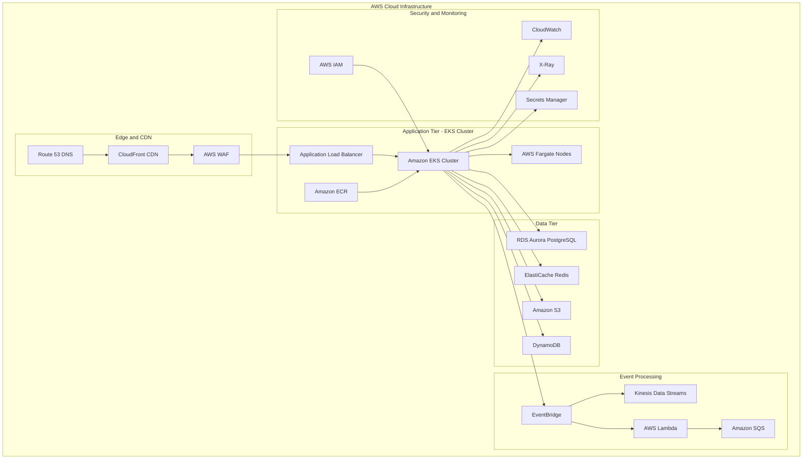

# ADR-005: AWS Cloud-Native Infrastructure with EKS

**Status:** Accepted  
**Date:** 2025-08-08  
**Deciders:** Lead Solutions Architect, DevOps Lead, CTO  
**Technical Story:** Cloud Infrastructure and Container Orchestration  

## Context

The Basketball League Management Platform requires a scalable, reliable, and cost-effective infrastructure that can:

1. **Auto-scale** to handle tournament day traffic spikes (10x normal load)
2. **Provide high availability** with 99.9% uptime SLA
3. **Support microservices architecture** with independent scaling
4. **Minimize operational overhead** for a small DevOps team
5. **Optimize costs** for a startup budget
6. **Enable global expansion** with multi-region capabilities

### Current Infrastructure Challenges
- Single server deployment cannot handle traffic spikes
- Manual scaling processes cause downtime
- No disaster recovery or backup strategy
- Limited monitoring and observability
- High operational burden for maintenance

### Requirements
- Support 1,000+ concurrent users during peak times
- Sub-second response times globally
- Automated scaling and failover
- Infrastructure as Code for reproducibility
- Cost optimization with usage-based pricing
- Security compliance for youth sports data

## Decision

We will adopt **AWS Cloud-Native Infrastructure with Amazon EKS (Elastic Kubernetes Service)** as our container orchestration platform:

### Core Infrastructure Components

#### 1. Container Orchestration
- **Amazon EKS**: Managed Kubernetes service for container orchestration
- **AWS Fargate**: Serverless container runtime for reduced operational overhead
- **Amazon ECR**: Container registry for Docker images
- **Application Load Balancer**: Traffic distribution across containers

#### 2. Database and Storage
- **Amazon RDS Aurora PostgreSQL**: Managed relational database with read replicas
- **Amazon ElastiCache Redis**: Managed in-memory cache and session store
- **Amazon S3**: Object storage for files, documents, and backups
- **Amazon EBS**: Block storage for persistent volumes

#### 3. Networking and Security
- **Amazon VPC**: Isolated network environment
- **AWS WAF**: Web application firewall for protection
- **AWS Shield**: DDoS protection
- **AWS Certificate Manager**: SSL/TLS certificate management

#### 4. Observability and Monitoring
- **Amazon CloudWatch**: Metrics, logs, and alerting
- **AWS X-Ray**: Distributed tracing
- **AWS Config**: Configuration compliance monitoring
- **Amazon GuardDuty**: Threat detection and security monitoring

#### 5. Event Processing
- **Amazon EventBridge**: Event routing and management
- **Amazon Kinesis**: Real-time data streaming
- **AWS Lambda**: Serverless event processing
- **Amazon SQS/SNS**: Message queuing and pub-sub

### Architecture Diagram


## Alternatives Considered

### Alternative 1: Traditional VM-based Infrastructure
**Pros:**
- Familiar deployment model
- Full control over OS and runtime
- Easier debugging and troubleshooting
- Lower complexity for small applications

**Cons:**
- Manual scaling and management overhead
- Resource inefficiency and higher costs
- Slower deployment and rollback processes
- Limited fault tolerance and auto-recovery

**Rejected:** Cannot meet auto-scaling and high availability requirements.

### Alternative 2: Serverless-Only Architecture (Lambda + API Gateway)
**Pros:**
- Ultimate scalability and cost optimization
- Zero infrastructure management
- Built-in high availability
- Pay-per-execution pricing model

**Cons:**
- Cold start latency issues for real-time features
- Vendor lock-in and limited portability
- Complex state management for WebSocket connections
- 15-minute execution time limits
- Limited control over runtime environment

**Rejected:** Cold start latency incompatible with real-time gaming requirements.

### Alternative 3: Docker Compose + EC2
**Pros:**
- Simple container orchestration
- Lower learning curve than Kubernetes
- Direct control over infrastructure
- Good for small to medium applications

**Cons:**
- Limited auto-scaling capabilities
- No built-in service discovery
- Manual load balancing setup
- No advanced deployment strategies
- Limited multi-host networking

**Rejected:** Insufficient for production scalability and reliability requirements.

### Alternative 4: Self-Managed Kubernetes on EC2
**Pros:**
- Full control over Kubernetes configuration
- Cost savings on managed service fees
- Latest Kubernetes features immediately available
- Custom networking and storage configurations

**Cons:**
- Significant operational overhead
- Security updates and patches management
- Complex cluster management and troubleshooting
- Requires deep Kubernetes expertise
- High maintenance burden for small team

**Rejected:** Operational complexity too high for team size and expertise level.

### Alternative 5: Google Cloud Platform (GKE) or Azure (AKS)
**Pros:**
- Competitive managed Kubernetes offerings
- Good integration with respective cloud services
- Potentially lower costs for certain workloads
- Strong developer tooling

**Cons:**
- Team lacks expertise in GCP/Azure ecosystems
- Would require learning new cloud platforms
- Less mature third-party integrations
- Migration complexity from current AWS services

**Rejected:** Team expertise and existing AWS investments favor staying with AWS.

## Consequences

### Positive Consequences

#### Scalability and Performance
- **Auto-scaling**: Horizontal Pod Autoscaler (HPA) and Cluster Autoscaler
- **Load Distribution**: Built-in load balancing across pods and nodes
- **High Availability**: Multi-AZ deployment with automatic failover
- **Global Reach**: CloudFront CDN for worldwide performance
- **Efficient Resource Utilization**: Container density and resource sharing

#### Operational Benefits
- **Managed Infrastructure**: AWS handles Kubernetes control plane
- **Automated Updates**: Managed node groups with automated patching
- **Backup and Recovery**: Automated RDS backups and point-in-time recovery
- **Security**: AWS-managed security updates and compliance
- **Monitoring**: Built-in CloudWatch integration and observability

#### Development and Deployment
- **CI/CD Integration**: Native integration with AWS CodePipeline
- **Infrastructure as Code**: CloudFormation and Terraform support
- **Rolling Deployments**: Zero-downtime deployments with Kubernetes
- **Environment Parity**: Consistent environments from dev to production
- **Container Registry**: Secure private container registry with ECR

#### Cost Optimization
- **Pay-per-Use**: Fargate pricing based on actual resource consumption
- **Spot Instances**: Cost savings with mixed instance types
- **Reserved Capacity**: Long-term cost savings with commitment
- **Auto-scaling**: Automatic resource adjustment to match demand
- **Resource Right-sizing**: Continuous optimization recommendations

### Negative Consequences

#### Complexity and Learning Curve
- **Kubernetes Complexity**: Steep learning curve for container orchestration
- **AWS Service Sprawl**: Many services to learn and manage
- **Networking Complexity**: VPC, subnets, security groups configuration
- **Debugging Challenges**: Distributed system troubleshooting complexity
- **YAML Configuration**: Complex Kubernetes manifest management

#### Vendor Lock-in
- **AWS Dependency**: Tight coupling to AWS-specific services
- **Migration Difficulty**: Complex migration to other cloud providers
- **Cost Lock-in**: Potential for unexpected cost increases
- **Service Limitations**: Bound by AWS service capabilities and limitations

#### Operational Challenges
- **Cost Management**: Complex billing with multiple services
- **Security Configuration**: Proper IAM and security group management
- **Disaster Recovery**: Complex multi-service backup and recovery
- **Compliance**: Ensuring compliance across multiple AWS services

### Mitigation Strategies

#### For Complexity
- **Team Training**: Comprehensive AWS and Kubernetes training program
- **Documentation**: Detailed runbooks and operational procedures
- **Automation**: Infrastructure as Code to reduce manual configuration
- **Monitoring**: Comprehensive observability to understand system behavior
- **Gradual Migration**: Phased migration to reduce risk and complexity

#### For Vendor Lock-in
- **Abstraction Layers**: Use of cloud-agnostic tools where possible
- **Open Standards**: Kubernetes provides some portability
- **Multi-cloud Strategy**: Future consideration for multi-cloud deployment
- **Cost Monitoring**: Regular cost analysis and optimization

#### For Operational Challenges
- **Cost Monitoring**: AWS Cost Explorer and budgets with alerts
- **Security Automation**: Automated security scanning and compliance checks
- **Backup Strategy**: Comprehensive backup and disaster recovery testing
- **Team Expertise**: Dedicated DevOps engineer and AWS certifications

## Implementation Plan

### Phase 1: Foundation Setup (Weeks 1-4)
1. **VPC and Networking**: Set up isolated network environment
2. **EKS Cluster**: Create managed Kubernetes cluster
3. **Container Registry**: Set up ECR for Docker images
4. **CI/CD Pipeline**: Implement automated deployment pipeline

### Phase 2: Core Services Migration (Weeks 5-8)
1. **Database Setup**: Deploy RDS Aurora with read replicas
2. **Caching Layer**: Implement ElastiCache Redis cluster
3. **Object Storage**: Configure S3 buckets with proper security
4. **Load Balancing**: Set up Application Load Balancer

### Phase 3: Application Deployment (Weeks 9-12)
1. **Microservices Deployment**: Deploy containerized services to EKS
2. **Service Mesh**: Implement Istio for service-to-service communication
3. **Event Processing**: Set up EventBridge and Kinesis streams
4. **Monitoring**: Implement comprehensive observability stack

### Phase 4: Production Readiness (Weeks 13-16)
1. **Security Hardening**: Implement security best practices
2. **Performance Testing**: Load testing and optimization
3. **Disaster Recovery**: Test backup and recovery procedures
4. **Documentation**: Complete operational runbooks

## Infrastructure as Code

### Terraform Configuration Example
```hcl
# EKS Cluster
resource "aws_eks_cluster" "basketball_platform" {
  name     = "basketball-platform"
  role_arn = aws_iam_role.eks_cluster_role.arn
  version  = "1.27"

  vpc_config {
    subnet_ids              = aws_subnet.private[*].id
    endpoint_private_access = true
    endpoint_public_access  = true
    public_access_cidrs     = ["0.0.0.0/0"]
  }

  enabled_cluster_log_types = [
    "api", "audit", "authenticator", "controllerManager", "scheduler"
  ]

  depends_on = [
    aws_iam_role_policy_attachment.eks_cluster_policy,
    aws_iam_role_policy_attachment.eks_service_policy,
  ]
}

# Fargate Profile
resource "aws_eks_fargate_profile" "basketball_platform" {
  cluster_name           = aws_eks_cluster.basketball_platform.name
  fargate_profile_name   = "basketball-platform"
  pod_execution_role_arn = aws_iam_role.fargate_pod_execution_role.arn
  subnet_ids            = aws_subnet.private[*].id

  selector {
    namespace = "default"
  }

  selector {
    namespace = "kube-system"
  }
}

# RDS Aurora Cluster
resource "aws_rds_cluster" "basketball_platform" {
  cluster_identifier      = "basketball-platform"
  engine                 = "aurora-postgresql"
  engine_version         = "15.3"
  database_name          = "basketball_platform"
  master_username        = var.db_username
  master_password        = var.db_password
  backup_retention_period = 7
  preferred_backup_window = "03:00-04:00"
  preferred_maintenance_window = "Mon:04:00-Mon:05:00"
  
  serverlessv2_scaling_configuration {
    max_capacity = 16
    min_capacity = 0.5
  }
  
  vpc_security_group_ids = [aws_security_group.rds.id]
  db_subnet_group_name   = aws_db_subnet_group.main.name
  
  skip_final_snapshot = false
  final_snapshot_identifier = "basketball-platform-final-snapshot"
  
  tags = {
    Name = "Basketball Platform Aurora Cluster"
  }
}
```

### Kubernetes Deployment Example
```yaml
apiVersion: apps/v1
kind: Deployment
metadata:
  name: game-service
  namespace: default
spec:
  replicas: 3
  selector:
    matchLabels:
      app: game-service
  template:
    metadata:
      labels:
        app: game-service
    spec:
      containers:
      - name: game-service
        image: 123456789.dkr.ecr.us-west-2.amazonaws.com/game-service:latest
        ports:
        - containerPort: 3000
        env:
        - name: NODE_ENV
          value: "production"
        - name: DATABASE_URL
          valueFrom:
            secretKeyRef:
              name: database-secret
              key: url
        - name: REDIS_URL
          valueFrom:
            secretKeyRef:
              name: redis-secret
              key: url
        resources:
          requests:
            memory: "256Mi"
            cpu: "250m"
          limits:
            memory: "512Mi"
            cpu: "500m"
        livenessProbe:
          httpGet:
            path: /health
            port: 3000
          initialDelaySeconds: 30
          periodSeconds: 10
        readinessProbe:
          httpGet:
            path: /ready
            port: 3000
          initialDelaySeconds: 5
          periodSeconds: 5

---
apiVersion: v1
kind: Service
metadata:
  name: game-service
spec:
  selector:
    app: game-service
  ports:
    - protocol: TCP
      port: 80
      targetPort: 3000
  type: ClusterIP

---
apiVersion: autoscaling/v2
kind: HorizontalPodAutoscaler
metadata:
  name: game-service-hpa
spec:
  scaleTargetRef:
    apiVersion: apps/v1
    kind: Deployment
    name: game-service
  minReplicas: 3
  maxReplicas: 50
  metrics:
  - type: Resource
    resource:
      name: cpu
      target:
        type: Utilization
        averageUtilization: 70
  - type: Resource
    resource:
      name: memory
      target:
        type: Utilization
        averageUtilization: 80
```

## Security Configuration

### IAM Roles and Policies
```json
{
  "Version": "2012-10-17",
  "Statement": [
    {
      "Effect": "Allow",
      "Action": [
        "s3:GetObject",
        "s3:PutObject",
        "s3:DeleteObject"
      ],
      "Resource": "arn:aws:s3:::basketball-platform-*/*"
    },
    {
      "Effect": "Allow",
      "Action": [
        "rds-db:connect"
      ],
      "Resource": "arn:aws:rds-db:*:*:dbuser:basketball-platform/*"
    },
    {
      "Effect": "Allow",
      "Action": [
        "events:PutEvents"
      ],
      "Resource": "arn:aws:events:*:*:event-bus/basketball-platform"
    }
  ]
}
```

### Network Security
```hcl
# Security group for EKS nodes
resource "aws_security_group" "eks_nodes" {
  name_prefix = "basketball-platform-eks-nodes"
  vpc_id      = aws_vpc.main.id

  ingress {
    from_port = 443
    to_port   = 443
    protocol  = "tcp"
    cidr_blocks = [aws_vpc.main.cidr_block]
  }

  ingress {
    from_port = 80
    to_port   = 80
    protocol  = "tcp"
    cidr_blocks = [aws_vpc.main.cidr_block]
  }

  egress {
    from_port   = 0
    to_port     = 0
    protocol    = "-1"
    cidr_blocks = ["0.0.0.0/0"]
  }

  tags = {
    Name = "basketball-platform-eks-nodes"
  }
}
```

## Cost Optimization Strategy

### Resource Right-Sizing
- **Container Resources**: Set appropriate CPU/memory requests and limits
- **Database**: Use Aurora Serverless v2 for automatic scaling
- **Storage**: Implement S3 lifecycle policies for cost optimization
- **Compute**: Mix of on-demand and spot instances for non-critical workloads

### Monitoring and Alerts
```yaml
# CloudWatch Cost Anomaly Detection
Resources:
  CostAnomalyDetector:
    Type: AWS::CE::AnomalyDetector
    Properties:
      AnomalyDetectorName: "Basketball Platform Cost Anomaly"
      MonitorType: "DIMENSIONAL"
      MonitorSpecification:
        DimensionKey: "SERVICE"
        DimensionValueList:
          - "Amazon Elastic Container Service for Kubernetes"
          - "Amazon Relational Database Service"
          - "Amazon ElastiCache"

  CostAnomalySubscription:
    Type: AWS::CE::AnomalySubscription
    Properties:
      SubscriptionName: "Basketball Platform Alerts"
      MonitorArnList:
        - !Ref CostAnomalyDetector
      Subscribers:
        - Type: "EMAIL"
          Address: "devops@basketballplatform.com"
      Frequency: "DAILY"
      ThresholdExpression: "100"
```

## Monitoring and Alerting

### Key Metrics to Monitor
- **Application**: Request latency, error rates, throughput
- **Infrastructure**: CPU, memory, disk usage, network
- **Database**: Connection count, query performance, replication lag
- **Kubernetes**: Pod health, cluster capacity, node status
- **Cost**: Daily spending, resource utilization, cost per user

### Alert Configuration
```yaml
# CloudWatch Alarms
Resources:
  HighErrorRateAlarm:
    Type: AWS::CloudWatch::Alarm
    Properties:
      AlarmName: "High Error Rate"
      AlarmDescription: "Error rate exceeds 5%"
      MetricName: "ErrorRate"
      Namespace: "Basketball/Platform"
      Statistic: "Average"
      Period: 300
      EvaluationPeriods: 2
      Threshold: 5.0
      ComparisonOperator: "GreaterThanThreshold"
      AlarmActions:
        - !Ref SNSTopicArn
```

## Success Metrics

### Performance Targets
- **API Response Time**: <200ms (95th percentile)
- **Database Query Time**: <50ms (95th percentile)
- **Auto-scaling Time**: <5 minutes to scale up
- **Deployment Time**: <10 minutes for rolling updates

### Reliability Targets
- **Uptime**: >99.9% monthly availability
- **Recovery Time**: <30 minutes for service restoration
- **Data Durability**: >99.999999999% (11 9's)
- **Backup Recovery**: <4 hours RTO, <1 hour RPO

### Cost Targets
- **Infrastructure Cost**: <30% of total revenue
- **Cost per User**: <$2/month per active user
- **Utilization**: >70% average resource utilization
- **Waste Reduction**: <10% unutilized resources

## Review and Maintenance

### Regular Reviews
- **Weekly**: Cost analysis and optimization opportunities
- **Monthly**: Performance metrics and capacity planning
- **Quarterly**: Security audit and compliance review
- **Semi-annually**: Architecture review and technology updates

### Maintenance Activities
- **Daily**: Monitoring dashboard review and alert triage
- **Weekly**: Security patch assessment and application
- **Monthly**: Backup testing and disaster recovery validation
- **Quarterly**: Capacity planning and infrastructure optimization

This ADR will be reviewed in 6 months (February 2026) to assess the effectiveness of the chosen infrastructure and identify areas for improvement based on operational experience and changing requirements.