# ADR-006: API Gateway Pattern with Kong and GraphQL Federation

**Status:** Accepted  
**Date:** 2025-08-08  
**Deciders:** Lead Solutions Architect, API Team Lead, Frontend Team Lead  
**Technical Story:** API Management and Client Integration Strategy  

## Context

The microservices architecture requires a unified API strategy that can:

1. **Provide a single entry point** for client applications (web and mobile)
2. **Handle cross-cutting concerns** like authentication, rate limiting, and logging
3. **Support multiple API paradigms** (REST, GraphQL, WebSockets)
4. **Enable API versioning** and backward compatibility
5. **Optimize for mobile clients** with efficient data fetching
6. **Support real-time features** for live game updates

### Current Challenges
- Multiple microservices expose different API endpoints
- Inconsistent authentication and authorization across services
- Mobile apps make multiple API calls causing performance issues
- No centralized rate limiting or monitoring
- Difficult to version and evolve APIs independently

### Requirements
- Single API endpoint for client applications
- Sub-200ms API response times
- Support for 1000+ concurrent connections
- GraphQL support for efficient mobile queries
- WebSocket support for real-time features
- Comprehensive API analytics and monitoring

## Decision

We will implement a **hybrid API Gateway pattern** using:

1. **Kong API Gateway** for REST APIs, authentication, and cross-cutting concerns
2. **GraphQL Federation** with Apollo Gateway for efficient data fetching
3. **Direct WebSocket connections** for real-time features
4. **API versioning strategy** with backward compatibility

### Architecture Components

#### 1. Kong API Gateway
- **Purpose**: REST API management, authentication, rate limiting
- **Features**: Plugin ecosystem, load balancing, service discovery
- **Deployment**: Kubernetes-native with Ingress controller
- **Protocols**: HTTP/HTTPS, gRPC

#### 2. GraphQL Federation
- **Purpose**: Unified GraphQL schema across microservices
- **Technology**: Apollo Gateway with federated schemas
- **Benefits**: Single GraphQL endpoint, efficient data fetching
- **Features**: Query planning, caching, type composition

#### 3. WebSocket Gateway
- **Purpose**: Real-time bidirectional communication
- **Technology**: Socket.io with Redis adapter
- **Features**: Room-based broadcasting, authentication
- **Scaling**: Horizontal scaling with session affinity

### API Architecture Diagram

```mermaid
graph TB
    subgraph "Client Applications"
        WEB[Web App<br/>React]
        MOBILE[Mobile Apps<br/>React Native]
        ADMIN[Admin Portal<br/>Next.js]
    end
    
    subgraph "API Gateway Layer"
        subgraph "Kong API Gateway"
            KONG[Kong Gateway<br/>REST APIs]
            KONG_AUTH[Auth Plugin]
            KONG_RATE[Rate Limit Plugin]
            KONG_LOG[Logging Plugin]
        end
        
        subgraph "GraphQL Layer"
            APOLLO_GW[Apollo Gateway<br/>GraphQL Federation]
            SCHEMA_REG[Schema Registry]
        end
        
        subgraph "Real-time Layer"
            SOCKET_GW[Socket.io Gateway<br/>WebSocket/Polling]
            REDIS_ADAPTER[Redis Adapter<br/>Scaling]
        end
    end
    
    subgraph "Microservices"
        USER_SVC[User Service<br/>REST + GraphQL]
        LEAGUE_SVC[League Service<br/>REST + GraphQL]
        GAME_SVC[Game Service<br/>REST + GraphQL + WS]
        ANALYTICS_SVC[Analytics Service<br/>GraphQL]
        NOTIFICATION_SVC[Notification Service<br/>REST]
    end
    
    subgraph "External Services"
        AUTH0[Auth0<br/>Authentication]
        STRIPE[Stripe<br/>Payments]
        SENDGRID[SendGrid<br/>Email]
    end
    
    %% Client connections
    WEB -->|REST APIs| KONG
    WEB -->|GraphQL| APOLLO_GW
    WEB -->|WebSocket| SOCKET_GW
    
    MOBILE -->|REST APIs| KONG
    MOBILE -->|GraphQL| APOLLO_GW
    MOBILE -->|WebSocket| SOCKET_GW
    
    ADMIN -->|REST APIs| KONG
    ADMIN -->|GraphQL| APOLLO_GW
    
    %% Kong routing
    KONG --> USER_SVC
    KONG --> LEAGUE_SVC
    KONG --> GAME_SVC
    KONG --> NOTIFICATION_SVC
    
    %% GraphQL Federation
    APOLLO_GW --> USER_SVC
    APOLLO_GW --> LEAGUE_SVC
    APOLLO_GW --> GAME_SVC
    APOLLO_GW --> ANALYTICS_SVC
    SCHEMA_REG --> APOLLO_GW
    
    %% WebSocket connections
    SOCKET_GW --> GAME_SVC
    REDIS_ADAPTER --> SOCKET_GW
    
    %% External integrations
    KONG_AUTH --> AUTH0
    KONG --> STRIPE
    KONG --> SENDGRID
    
    style KONG fill:#ff6b35
    style APOLLO_GW fill:#4ecdc4
    style SOCKET_GW fill:#45b7d1
```


## Alternatives Considered

### Alternative 1: Single API Gateway (Kong Only)
**Pros:**
- Simpler architecture with single entry point
- Consistent API management across all services
- Well-established patterns and tooling
- Single point of monitoring and logging

**Cons:**
- Limited GraphQL support
- Inefficient for mobile data fetching (N+1 queries)
- Requires custom solutions for real-time features
- All traffic through single bottleneck

**Rejected:** Insufficient for efficient mobile data fetching requirements.

### Alternative 2: GraphQL-Only API
**Pros:**
- Single GraphQL endpoint for all data needs
- Efficient data fetching with single request
- Strong typing and schema validation
- Excellent developer experience

**Cons:**
- Learning curve for team and external integrations
- File upload complexity
- Caching challenges
- Limited REST ecosystem integration
- WebSocket still requires separate solution

**Rejected:** Too radical a change with integration challenges.

### Alternative 3: AWS API Gateway
**Pros:**
- Fully managed service with auto-scaling
- Native AWS integrations
- Built-in authentication and authorization
- Pay-per-request pricing model

**Cons:**
- Vendor lock-in to AWS
- Limited customization options
- Higher latency for complex routing
- Less flexible plugin ecosystem
- Limited GraphQL support

**Rejected:** Lack of flexibility and GraphQL limitations.

### Alternative 4: Service Mesh (Istio) as API Gateway
**Pros:**
- Advanced traffic management capabilities
- Built-in security and observability
- Native Kubernetes integration
- No additional infrastructure

**Cons:**
- Primarily designed for service-to-service communication
- Complex configuration for API gateway use cases
- Limited API management features
- Steep learning curve

**Rejected:** Not optimized for API gateway patterns and client requirements.

### Alternative 5: BFF (Backend for Frontend) Pattern
**Pros:**
- Optimized APIs for specific client needs
- Complete control over client experience
- Can implement client-specific business logic
- Simple to understand and implement

**Cons:**
- Code duplication across BFF services
- Multiple services to maintain
- Inconsistent API patterns
- Higher development overhead

**Rejected:** Higher maintenance overhead and potential for inconsistency.

## Consequences

### Positive Consequences

#### Performance and Efficiency
- **Optimized Data Fetching**: GraphQL reduces over-fetching and under-fetching
- **Caching**: Multi-level caching with Kong and GraphQL query caching
- **Connection Pooling**: Efficient connection management to backend services
- **Load Balancing**: Intelligent routing and load distribution
- **Real-time Optimization**: Dedicated WebSocket infrastructure

#### Developer Experience
- **Single Entry Point**: Simplified client development
- **Type Safety**: GraphQL schema provides strong typing
- **API Documentation**: Auto-generated documentation from schemas
- **Testing**: Centralized API testing and mocking capabilities
- **Versioning**: Clean API versioning strategies

#### Operational Benefits
- **Centralized Monitoring**: Single point for API metrics and logging
- **Security**: Consistent authentication and authorization
- **Rate Limiting**: Prevent abuse and ensure fair usage
- **Circuit Breaking**: Fault tolerance and resilience
- **Analytics**: Comprehensive API usage analytics

#### Business Benefits
- **Faster Development**: Accelerated client application development
- **Mobile Optimization**: Reduced data usage and faster load times
- **Third-party Integration**: Standard REST APIs for partners
- **Real-time Features**: Enhanced user experience with live updates

### Negative Consequences

#### Complexity
- **Multiple Technologies**: Kong, GraphQL, and WebSocket solutions
- **Federation Complexity**: Managing distributed GraphQL schemas
- **Debugging**: More complex request tracing across layers
- **Configuration Management**: Multiple gateway configurations to maintain

#### Performance Risks
- **Single Point of Failure**: Gateway outages affect all clients
- **Latency Introduction**: Additional network hop for all requests
- **Resource Usage**: Gateway instances consume compute resources
- **Caching Complexity**: Multi-layer caching invalidation challenges

#### Operational Overhead
- **Service Dependencies**: Gateway depends on all backend services
- **Monitoring Complexity**: Multiple systems to monitor and alert on
- **Version Coordination**: GraphQL schema evolution across services
- **Security Surface**: Additional attack vector to secure

### Mitigation Strategies

#### For Complexity
- **Documentation**: Comprehensive API gateway setup and operation guides
- **Tooling**: Automated schema validation and federation tooling
- **Training**: Team education on GraphQL Federation and Kong configuration
- **Observability**: Distributed tracing to understand request flows

#### For Performance Risks
- **High Availability**: Multi-instance deployment with load balancing
- **Circuit Breakers**: Fault tolerance patterns to prevent cascade failures
- **Caching Strategy**: Intelligent caching at gateway and service levels
- **Performance Monitoring**: Real-time performance tracking and alerting

#### For Operational Overhead
- **Automation**: Infrastructure as Code for gateway configuration
- **Service Health Checks**: Comprehensive health monitoring for all services
- **Gradual Rollouts**: Canary deployments for gateway changes
- **Runbook Documentation**: Clear incident response procedures

## Implementation Details

### Kong Configuration
```yaml
# Kong Gateway Kubernetes Ingress
apiVersion: networking.k8s.io/v1
kind: Ingress
metadata:
  name: basketball-platform-api
  annotations:
    kubernetes.io/ingress.class: kong
    konghq.com/plugins: rate-limiting-plugin, auth-plugin, logging-plugin
spec:
  tls:
  - hosts:
    - api.basketballplatform.com
    secretName: api-tls-secret
  rules:
  - host: api.basketballplatform.com
    http:
      paths:
      - path: /api/v1/users
        pathType: Prefix
        backend:
          service:
            name: user-service
            port:
              number: 80
      - path: /api/v1/leagues
        pathType: Prefix
        backend:
          service:
            name: league-service
            port:
              number: 80
      - path: /api/v1/games
        pathType: Prefix
        backend:
          service:
            name: game-service
            port:
              number: 80

---
# Kong Plugins
apiVersion: configuration.konghq.com/v1
kind: KongPlugin
metadata:
  name: rate-limiting-plugin
config:
  minute: 1000
  hour: 10000
  policy: redis
  redis_host: redis.default.svc.cluster.local
plugin: rate-limiting

---
apiVersion: configuration.konghq.com/v1
kind: KongPlugin
metadata:
  name: auth-plugin
config:
  uri_param_names: [jwt]
  cookie_names: [jwt]
  anonymous: null
plugin: jwt

---
apiVersion: configuration.konghq.com/v1
kind: KongPlugin
metadata:
  name: logging-plugin
config:
  http_endpoint: https://logs.basketballplatform.com/webhook
plugin: http-log
```

### GraphQL Federation Setup
```typescript
// Apollo Gateway Configuration
import { ApolloGateway, IntrospectAndCompose } from '@apollo/gateway';
import { ApolloServer } from 'apollo-server-express';

const gateway = new ApolloGateway({
  supergraphSdl: new IntrospectAndCompose({
    subgraphs: [
      { name: 'users', url: 'http://user-service/graphql' },
      { name: 'leagues', url: 'http://league-service/graphql' },
      { name: 'games', url: 'http://game-service/graphql' },
      { name: 'analytics', url: 'http://analytics-service/graphql' },
    ],
    pollIntervalInMs: 30000, // Poll for schema changes
  }),
  buildService({ url }) {
    return new RemoteGraphQLDataSource({
      url,
      willSendRequest({ request, context }) {
        // Forward authentication headers
        if (context.authToken) {
          request.http.headers.set('Authorization', `Bearer ${context.authToken}`);
        }
        if (context.tenantId) {
          request.http.headers.set('X-Tenant-ID', context.tenantId);
        }
      }
    });
  }
});

// GraphQL Server
const server = new ApolloServer({
  gateway,
  context: ({ req }) => ({
    authToken: req.headers.authorization?.replace('Bearer ', ''),
    tenantId: req.headers['x-tenant-id'],
  }),
  subscriptions: false, // Use separate WebSocket server
  plugins: [
    // Query complexity analysis
    require('graphql-query-complexity').createComplexityLimitRule(1000),
    // Query depth limiting
    require('graphql-depth-limit')(10),
    // Caching
    responseCachePlugin({
      ttl: 300, // 5 minutes
      sessionId: (requestContext) => requestContext.request.http.headers.get('authorization') || null
    })
  ]
});
```

### Federated Schema Example
```graphql
# User Service Schema
type User @key(fields: "id") {
  id: ID!
  email: String!
  profile: UserProfile
  createdAt: DateTime!
}

extend type Team @key(fields: "id") {
  id: ID! @external
  coach: User @requires(fields: "coachId")
  players: [User!]! @requires(fields: "playerIds")
}

# League Service Schema  
type League @key(fields: "id") {
  id: ID!
  name: String!
  teams: [Team!]!
  seasons: [Season!]!
}

type Team @key(fields: "id") {
  id: ID!
  name: String!
  coachId: ID!
  playerIds: [ID!]!
  league: League!
}

# Game Service Schema
type Game @key(fields: "id") {
  id: ID!
  homeTeam: Team! @provides(fields: "id name")
  awayTeam: Team! @provides(fields: "id name") 
  score: GameScore!
  status: GameStatus!
  scheduledTime: DateTime!
}

extend type Team @key(fields: "id") {
  id: ID! @external
  games: [Game!]!
  statistics: TeamStatistics!
}
```

### WebSocket Gateway Implementation
```typescript
// Socket.io Server with Redis Adapter
import { Server } from 'socket.io';
import { createAdapter } from '@socket.io/redis-adapter';
import { createClient } from 'redis';

const io = new Server(server, {
  cors: {
    origin: process.env.ALLOWED_ORIGINS?.split(','),
    methods: ['GET', 'POST']
  },
  transports: ['websocket', 'polling']
});

// Redis adapter for horizontal scaling
const pubClient = createClient({ 
  host: process.env.REDIS_HOST,
  port: parseInt(process.env.REDIS_PORT || '6379')
});
const subClient = pubClient.duplicate();

io.adapter(createAdapter(pubClient, subClient));

// Authentication middleware
io.use(async (socket, next) => {
  try {
    const token = socket.handshake.auth.token;
    const user = await validateJWTToken(token);
    
    socket.userId = user.id;
    socket.tenantId = user.tenantId;
    socket.roles = user.roles;
    
    next();
  } catch (error) {
    next(new Error('Authentication failed'));
  }
});

// Game event handlers
io.on('connection', (socket) => {
  console.log(`User ${socket.userId} connected`);
  
  // Join tenant room
  socket.join(`tenant:${socket.tenantId}`);
  
  // Join game room
  socket.on('join-game', async (gameId) => {
    try {
      // Verify user has access to game
      const hasAccess = await verifyGameAccess(socket.userId, gameId);
      if (!hasAccess) {
        socket.emit('error', { message: 'Access denied' });
        return;
      }
      
      socket.join(`game:${gameId}`);
      
      // Send current game state
      const gameState = await getGameState(gameId);
      socket.emit('game-state', gameState);
      
    } catch (error) {
      socket.emit('error', { message: error.message });
    }
  });
  
  // Handle live scoring (scorekeeper only)
  socket.on('record-score', async (scoreData) => {
    try {
      // Verify scorekeeper role
      if (!socket.roles.includes('scorekeeper')) {
        socket.emit('error', { message: 'Insufficient permissions' });
        return;
      }
      
      // Process score update
      const updatedGame = await recordScore(scoreData);
      
      // Broadcast to all game subscribers
      io.to(`game:${scoreData.gameId}`).emit('score-update', {
        gameId: scoreData.gameId,
        score: updatedGame.score,
        event: scoreData
      });
      
    } catch (error) {
      socket.emit('error', { message: error.message });
    }
  });
  
  socket.on('disconnect', () => {
    console.log(`User ${socket.userId} disconnected`);
  });
});
```

### API Versioning Strategy
```typescript
// Version-aware routing in Kong
const versionedRoutes = {
  'v1': {
    '/users': 'user-service-v1',
    '/leagues': 'league-service-v1', 
    '/games': 'game-service-v1'
  },
  'v2': {
    '/users': 'user-service-v2',
    '/leagues': 'league-service-v1', // Same version
    '/games': 'game-service-v2'
  }
};

// GraphQL versioning through schema evolution
const schemaVersioning = {
  // Additive changes (safe)
  addField: true,
  addType: true,
  addEnumValue: true,
  
  // Breaking changes (require new version)
  removeField: false,
  changeFieldType: false,
  removeEnumValue: false
};

// Client version negotiation
app.use('/graphql', (req, res, next) => {
  const clientVersion = req.headers['api-version'] || 'v1';
  req.apiVersion = clientVersion;
  next();
});
```

## Security Implementation

### Authentication Flow
```typescript
// Kong JWT Plugin Configuration
const jwtConfig = {
  uri_param_names: ['jwt'],
  cookie_names: ['jwt'],
  header_names: ['authorization'],
  claims_to_verify: ['exp', 'nbf'],
  key_claim_name: 'iss',
  secret_is_base64: false,
  run_on_preflight: true
};

// GraphQL Authentication Context
const createContext = async ({ req }) => {
  const token = extractTokenFromRequest(req);
  
  if (!token) {
    return { authenticated: false };
  }
  
  try {
    const decoded = await verifyJWT(token);
    const user = await getUserById(decoded.sub);
    
    return {
      authenticated: true,
      user,
      tenantId: decoded.tenantId,
      roles: decoded.roles
    };
  } catch (error) {
    return { authenticated: false, error: error.message };
  }
};
```

### Rate Limiting Configuration
```yaml
# Different rate limits for different endpoints
apiVersion: configuration.konghq.com/v1
kind: KongPlugin
metadata:
  name: user-rate-limit
config:
  minute: 100
  hour: 1000
  policy: redis
  hide_client_headers: false
plugin: rate-limiting

---
apiVersion: configuration.konghq.com/v1
kind: KongPlugin
metadata:
  name: game-rate-limit
config:
  minute: 500  # Higher limit for real-time features
  hour: 5000
  policy: redis
plugin: rate-limiting

---
apiVersion: configuration.konghq.com/v1
kind: KongPlugin
metadata:
  name: graphql-complexity-limit
config:
  max_complexity: 1000
  max_depth: 15
plugin: request-size-limiting
```

## Monitoring and Analytics

### API Gateway Metrics
```typescript
// Custom Kong metrics
const kongMetrics = {
  // Request metrics
  'kong_http_requests_total': 'Counter for HTTP requests',
  'kong_request_duration_ms': 'Histogram for request duration',
  'kong_upstream_latency_ms': 'Histogram for upstream latency',
  
  // Error metrics  
  'kong_http_status': 'Counter for HTTP status codes',
  'kong_error_rate': 'Rate of 4xx and 5xx errors',
  
  // GraphQL metrics
  'graphql_query_complexity': 'Histogram for query complexity',
  'graphql_query_depth': 'Histogram for query depth',
  'graphql_resolver_duration': 'Histogram for resolver execution time'
};

// CloudWatch custom metrics
const cloudWatchMetrics = {
  putMetric: (metricName, value, dimensions) => {
    cloudwatch.putMetricData({
      Namespace: 'Basketball/Platform/API',
      MetricData: [{
        MetricName: metricName,
        Value: value,
        Dimensions: dimensions,
        Timestamp: new Date()
      }]
    });
  }
};
```

### Dashboard Configuration
```yaml
# Grafana Dashboard for API Gateway
apiVersion: v1
kind: ConfigMap
metadata:
  name: api-gateway-dashboard
data:
  dashboard.json: |
    {
      "dashboard": {
        "title": "API Gateway Metrics",
        "panels": [
          {
            "title": "Request Rate",
            "type": "graph",
            "targets": [
              {
                "expr": "rate(kong_http_requests_total[5m])",
                "legendFormat": "{{service}}"
              }
            ]
          },
          {
            "title": "Response Times", 
            "type": "graph",
            "targets": [
              {
                "expr": "histogram_quantile(0.95, rate(kong_request_duration_ms_bucket[5m]))",
                "legendFormat": "95th percentile"
              }
            ]
          },
          {
            "title": "Error Rates",
            "type": "graph", 
            "targets": [
              {
                "expr": "rate(kong_http_requests_total{status=~\"4..|5..\"}[5m])",
                "legendFormat": "{{status}}"
              }
            ]
          }
        ]
      }
    }
```

## Performance Optimization

### Caching Strategy
```typescript
// Multi-level caching
const cachingStrategy = {
  // Kong response caching
  kongCache: {
    ttl: 300, // 5 minutes
    vary: ['Authorization', 'X-Tenant-ID']
  },
  
  // GraphQL query caching
  graphqlCache: {
    ttl: 60, // 1 minute
    keyGenerator: (query, variables, context) => {
      return `${hash(query)}:${JSON.stringify(variables)}:${context.userId}`;
    }
  },
  
  // Redis application caching
  applicationCache: {
    ttl: 1800, // 30 minutes
    keyPrefix: 'api:cache:'
  }
};

// Implement caching middleware
const cacheMiddleware = (ttl = 300) => {
  return async (req, res, next) => {
    const cacheKey = `${req.method}:${req.originalUrl}:${req.get('Authorization')}`;
    const cachedResponse = await redis.get(cacheKey);
    
    if (cachedResponse) {
      return res.json(JSON.parse(cachedResponse));
    }
    
    // Override res.json to cache response
    const originalJson = res.json;
    res.json = function(data) {
      redis.setex(cacheKey, ttl, JSON.stringify(data));
      return originalJson.call(this, data);
    };
    
    next();
  };
};
```

## Success Metrics

### Performance Targets
- **API Response Time**: <200ms (95th percentile) via Kong
- **GraphQL Query Time**: <150ms (95th percentile)
- **WebSocket Latency**: <50ms for real-time updates
- **Cache Hit Rate**: >80% for cacheable endpoints

### Reliability Targets  
- **API Gateway Uptime**: >99.95%
- **Error Rate**: <0.5% of all requests
- **Rate Limit Accuracy**: >99.9%
- **Schema Federation Uptime**: >99.9%

### Business Metrics
- **API Adoption**: >90% of client requests via gateway
- **GraphQL Usage**: >70% of mobile requests
- **Real-time Connections**: 1000+ concurrent WebSocket connections
- **Developer Satisfaction**: >4.5/5.0 API developer experience rating

## Migration Plan

### Phase 1: Infrastructure Setup (Weeks 1-2)
1. Deploy Kong API Gateway on Kubernetes
2. Set up Apollo Gateway with initial schemas
3. Configure WebSocket server with Redis adapter
4. Implement basic authentication and rate limiting

### Phase 2: Service Integration (Weeks 3-4)
1. Migrate existing REST APIs behind Kong
2. Implement GraphQL schemas for core services
3. Set up GraphQL Federation
4. Configure monitoring and alerting

### Phase 3: Client Migration (Weeks 5-6)  
1. Update web application to use unified APIs
2. Migrate mobile apps to GraphQL
3. Implement WebSocket real-time features
4. Performance testing and optimization

### Phase 4: Advanced Features (Weeks 7-8)
1. Implement advanced caching strategies
2. Add API analytics and business metrics
3. Configure automated scaling
4. Complete documentation and training

## Review and Maintenance

This ADR will be reviewed quarterly to assess:
- API gateway performance and reliability
- GraphQL Federation effectiveness
- Client developer experience and satisfaction
- Operational complexity and maintenance burden

Next scheduled review: November 2025