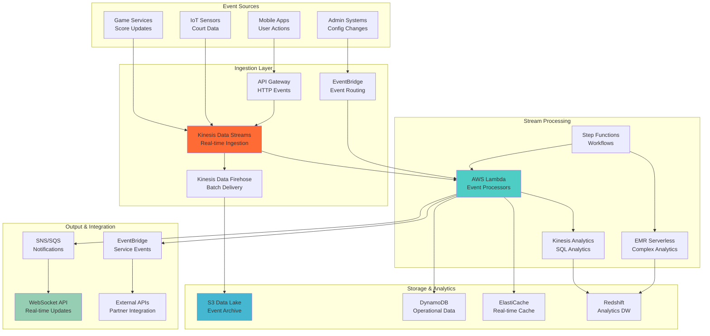

# ADR-007: Real-time Data Processing with Kinesis and Event Streaming

**Status:** Accepted  
**Date:** 2025-08-08  
**Deciders:** Lead Solutions Architect, Data Engineering Lead, DevOps Lead  
**Technical Story:** Real-time Event Processing and Analytics Pipeline  

## Context

The Basketball League Management Platform requires sophisticated real-time data processing capabilities to support:

1. **Live Game Analytics**: Real-time statistics, trends, and insights during games
2. **Event Stream Processing**: Processing high-volume event streams from multiple games simultaneously
3. **Real-time Notifications**: Instant alerts for game events, score updates, and milestones
4. **Data Lake Integration**: Streaming data to data lake for long-term analytics and ML
5. **Third-party Integrations**: Real-time data feeds to partner applications and APIs
6. **Performance Monitoring**: Real-time system metrics and business KPIs

### Current Challenges
- Point-to-point event processing creates tight coupling between services
- Database-based event processing cannot handle tournament-scale traffic
- Batch processing creates delays in analytics and notifications
- No unified event streaming platform for cross-service communication
- Limited ability to replay events for debugging or new feature development

### Requirements
- Process 10,000+ events per second during peak tournament times
- Sub-second latency for critical event processing
- Durable event storage with replay capabilities
- Horizontal scaling for varying event loads
- Integration with machine learning pipelines
- Multi-consumer support for different processing requirements

## Decision

We will implement **Amazon Kinesis Data Streams with AWS Lambda for real-time event processing** supported by a comprehensive streaming architecture:

### Core Architecture Components

#### 1. Event Ingestion Layer
- **Kinesis Data Streams**: Primary event streaming platform
- **Kinesis Data Firehose**: Batch delivery to S3 and data warehouse
- **EventBridge**: Event routing and transformation
- **API Gateway**: HTTP event ingestion endpoints

#### 2. Stream Processing Layer
- **AWS Lambda**: Serverless stream processing functions
- **Kinesis Analytics**: SQL-based stream analytics
- **EMR Serverless**: Complex analytical workloads
- **Step Functions**: Orchestration of complex event workflows

#### 3. Data Storage Layer
- **S3 Data Lake**: Long-term event storage and analytics
- **DynamoDB**: Real-time operational data
- **ElastiCache Redis**: High-speed caching and session storage
- **Redshift Serverless**: Analytics data warehouse

#### 4. Output and Integration Layer
- **SNS/SQS**: Notification and message queuing
- **WebSocket API**: Real-time client updates
- **EventBridge**: Cross-service event distribution
- **External APIs**: Third-party system integration

### Event Streaming Architecture


## Alternatives Considered

### Alternative 1: Apache Kafka on Self-Managed Infrastructure
**Pros:**
- Industry-standard streaming platform with rich ecosystem
- High throughput and low latency capabilities
- Strong exactly-once processing guarantees
- Extensive monitoring and tooling available
- Large community and documentation

**Cons:**
- Significant operational overhead for cluster management
- Requires dedicated DevOps expertise for Kafka operations
- Higher infrastructure costs for redundancy and scaling
- Complex setup for multi-AZ high availability
- Manual scaling and capacity planning required

**Rejected:** Operational complexity too high for team size and current expertise level.

### Alternative 2: Amazon MSK (Managed Kafka)
**Pros:**
- Managed Kafka service reducing operational burden
- Native integration with AWS security and monitoring
- Familiar Kafka APIs and ecosystem
- Built-in encryption and authentication
- Automatic scaling and patch management

**Cons:**
- Still requires Kafka expertise for optimal configuration
- Higher costs compared to Kinesis for variable workloads
- More complex than serverless alternatives
- Additional networking and security configuration required

**Rejected:** Cost and complexity not justified for current scale requirements.

### Alternative 3: Database-Based Event Processing
**Pros:**
- Simple to implement with existing database skills
- ACID guarantees for event processing
- No additional infrastructure components
- Familiar debugging and monitoring tools
- Easy to implement complex queries and joins

**Cons:**
- Cannot handle high-throughput event streams
- Limited horizontal scaling capabilities
- No built-in event replay or time-travel queries
- Tight coupling between producers and consumers
- Performance degrades under high concurrent load

**Rejected:** Cannot meet scalability and performance requirements for tournament-scale traffic.

### Alternative 4: Redis Streams
**Pros:**
- Simple and fast in-memory streaming
- Good performance for moderate throughput
- Built-in consumer groups and acknowledgments
- Lower complexity than full streaming platforms
- Can leverage existing Redis infrastructure

**Cons:**
- Limited durability compared to disk-based solutions
- Memory constraints limit event retention
- No built-in integration with analytics services
- Limited ecosystem compared to Kafka or Kinesis
- Single point of failure without complex replication setup

**Rejected:** Insufficient durability and retention capabilities for audit and analytics requirements.

### Alternative 5: Google Cloud Pub/Sub
**Pros:**
- Fully managed message streaming service
- Excellent integration with Google Cloud services
- Global availability with automatic scaling
- Strong exactly-once delivery guarantees
- Good performance for high-throughput workloads

**Cons:**
- Requires migration to Google Cloud Platform
- Team lacks GCP expertise and existing integrations
- Different pricing model and cost structure
- Would require learning new tools and practices

**Rejected:** Team expertise and existing AWS investments favor staying with AWS ecosystem.

## Consequences

### Positive Consequences

#### Performance and Scalability
- **High Throughput**: Kinesis can handle millions of events per second
- **Low Latency**: Sub-second processing for critical event streams  
- **Automatic Scaling**: Serverless components scale automatically with load
- **Parallel Processing**: Multiple shards enable horizontal processing
- **Replay Capability**: Event streams can be replayed for debugging or new features

#### Development and Operations
- **Serverless**: Lambda functions eliminate server management overhead
- **Managed Services**: AWS handles infrastructure scaling and maintenance
- **Pay-per-Use**: Cost scales with actual usage rather than provisioned capacity
- **Integration**: Native integration with other AWS services
- **Monitoring**: Built-in CloudWatch metrics and logging

#### Business Value
- **Real-time Insights**: Immediate analytics and decision-making capabilities
- **Better User Experience**: Sub-second updates for live game following
- **Competitive Advantage**: Advanced analytics and ML capabilities
- **Scalability**: Platform can grow with business without architectural changes

### Negative Consequences

#### Complexity and Learning Curve
- **Stream Processing Paradigm**: Team needs to learn event-driven patterns
- **Eventual Consistency**: Handling eventual consistency across stream processors
- **Debugging Complexity**: Distributed stream processing is harder to debug
- **Testing Challenges**: Integration testing of streaming pipelines is complex

#### Operational Challenges
- **Monitoring Complexity**: Many components to monitor and alert on
- **Error Handling**: Complex error handling and retry strategies required
- **Data Ordering**: Maintaining event ordering across multiple processors
- **Cost Management**: Potential for unexpected costs with high event volumes

#### Vendor Lock-in
- **AWS Dependency**: Tight coupling to AWS-specific streaming services
- **Migration Difficulty**: Complex to migrate to other cloud providers
- **Service Limitations**: Bound by AWS service capabilities and quotas

### Mitigation Strategies

#### For Complexity
- **Training Program**: Comprehensive team training on stream processing patterns
- **Documentation**: Clear architectural patterns and implementation examples
- **Tools and Libraries**: Standardized libraries for common streaming operations
- **Incremental Migration**: Phase implementation to reduce risk and complexity

#### For Operational Challenges
- **Comprehensive Monitoring**: Multi-layer monitoring and alerting strategy
- **Error Handling Patterns**: Standardized error handling and circuit breaker patterns
- **Testing Framework**: Automated testing tools for streaming pipeline validation
- **Cost Controls**: Budget alerts and automated scaling policies

#### For Vendor Lock-in
- **Abstraction Layers**: Use cloud-agnostic interfaces where possible
- **Data Portability**: Ensure event data can be exported and migrated
- **Standards Compliance**: Use standard protocols and formats where available

## Implementation Details

### Kinesis Data Stream Configuration
```typescript
// Kinesis Data Stream setup with optimal configuration
const streamConfig = {
  StreamName: 'basketball-platform-events',
  ShardCount: 10, // Start with 10 shards, auto-scale based on load
  RetentionPeriod: 168, // 7 days retention for replay capability
  ShardLevelMetrics: [
    'IncomingRecords',
    'IncomingBytes', 
    'OutgoingRecords',
    'OutgoingBytes',
    'WriteProvisionedThroughputExceeded',
    'ReadProvisionedThroughputExceeded'
  ],
  Tags: {
    Environment: 'production',
    Service: 'basketball-platform',
    Purpose: 'real-time-events'
  }
};

// Event producer with error handling and retries
export class KinesisEventProducer {
  private kinesis: AWS.Kinesis;
  private streamName: string;

  constructor(streamName: string) {
    this.kinesis = new AWS.Kinesis({ region: process.env.AWS_REGION });
    this.streamName = streamName;
  }

  async publishEvent(event: DomainEvent): Promise<void> {
    const record = {
      Data: JSON.stringify(event),
      PartitionKey: event.aggregateId, // Ensures related events go to same shard
      StreamName: this.streamName
    };

    const retryConfig = {
      retries: 3,
      retryDelayOptions: {
        customBackoff: (retryCount: number) => Math.pow(2, retryCount) * 100
      }
    };

    try {
      await this.kinesis.putRecord(record).promise();
    } catch (error) {
      if (error.code === 'ProvisionedThroughputExceededException') {
        // Implement backoff and retry
        await this.exponentialBackoffRetry(() => 
          this.kinesis.putRecord(record).promise()
        );
      } else {
        throw error;
      }
    }
  }
}
```

### Lambda Event Processor Examples
```typescript
// Real-time game statistics processor
export const gameStatisticsProcessor = async (event: KinesisStreamEvent): Promise<void> => {
  const redis = new Redis(process.env.REDIS_URL);
  
  for (const record of event.Records) {
    try {
      const eventData = JSON.parse(
        Buffer.from(record.kinesis.data, 'base64').toString()
      ) as GameEvent;
      
      switch (eventData.eventType) {
        case 'ScoreRecorded':
          await updateGameScore(redis, eventData);
          await updatePlayerStatistics(redis, eventData);
          await checkScoreMilestones(eventData);
          break;
          
        case 'GameStarted':
          await initializeGameState(redis, eventData);
          await notifyGameStart(eventData);
          break;
          
        case 'GameCompleted':
          await finalizeGameStatistics(redis, eventData);
          await triggerPostGameAnalytics(eventData);
          break;
      }
      
      // Update real-time dashboard
      await updateDashboard(eventData);
      
    } catch (error) {
      // Send failed events to DLQ for manual processing
      await sendToDeadLetterQueue(record, error);
    }
  }
};

// Machine learning feature extraction processor
export const mlFeatureProcessor = async (event: KinesisStreamEvent): Promise<void> => {
  const dynamodb = new AWS.DynamoDB.DocumentClient();
  
  for (const record of event.Records) {
    const gameEvent = JSON.parse(
      Buffer.from(record.kinesis.data, 'base64').toString()
    );
    
    // Extract features for ML models
    const features = await extractMLFeatures(gameEvent);
    
    // Store features for training and inference
    await dynamodb.put({
      TableName: 'ml-features',
      Item: {
        gameId: gameEvent.gameId,
        timestamp: gameEvent.timestamp,
        features: features,
        ttl: Math.floor(Date.now() / 1000) + (90 * 24 * 60 * 60) // 90 days
      }
    }).promise();
    
    // Trigger real-time predictions if model is available
    if (features.shouldTriggerPrediction) {
      await triggerRealtimePrediction(features);
    }
  }
};
```

### Kinesis Analytics SQL Processing
```sql
-- Real-time aggregations for game statistics
CREATE STREAM game_statistics (
  game_id VARCHAR(64),
  team_id VARCHAR(64),
  player_id VARCHAR(64),
  event_type VARCHAR(32),
  event_timestamp TIMESTAMP,
  points INTEGER
);

-- Calculate rolling statistics over 5-minute windows
CREATE STREAM player_rolling_stats AS
SELECT 
  player_id,
  team_id,
  game_id,
  SUM(points) as total_points,
  COUNT(*) as total_events,
  AVG(points) as avg_points_per_event,
  ROWTIME as window_end
FROM SOURCE_SQL_STREAM_001
WHERE event_type IN ('field_goal', 'free_throw', 'three_pointer')
GROUP BY 
  player_id,
  team_id,
  game_id,
  RANGE INTERVAL '5' MINUTE;

-- Detect unusual scoring patterns
CREATE STREAM scoring_anomalies AS
SELECT
  game_id,
  team_id,
  total_points,
  avg_points_per_minute,
  'high_scoring_rate' as anomaly_type,
  ROWTIME as detected_at
FROM (
  SELECT 
    game_id,
    team_id,
    SUM(points) as total_points,
    SUM(points) / 5.0 as avg_points_per_minute,
    ROWTIME
  FROM SOURCE_SQL_STREAM_001
  WHERE event_type IN ('field_goal', 'free_throw', 'three_pointer')
  GROUP BY 
    game_id,
    team_id,
    RANGE INTERVAL '5' MINUTE
) 
WHERE avg_points_per_minute > 20; -- Threshold for high scoring rate
```

### Event Schema Definition
```typescript
// Base event interface
interface DomainEvent {
  eventId: string;
  aggregateId: string;
  aggregateType: string;
  eventType: string;
  eventVersion: string;
  eventData: Record<string, any>;
  metadata: EventMetadata;
  timestamp: Date;
}

// Event metadata for tracing and debugging
interface EventMetadata {
  causationId?: string;
  correlationId: string;
  userId?: string;
  source: string;
  userAgent?: string;
  ipAddress?: string;
}

// Specific game events
interface ScoreRecordedEvent extends DomainEvent {
  eventType: 'ScoreRecorded';
  eventData: {
    gameId: string;
    teamId: string;
    playerId: string;
    points: number;
    shotType: 'field_goal' | 'free_throw' | 'three_pointer';
    gameTime: string;
    period: number;
  };
}

interface GameStatusChangedEvent extends DomainEvent {
  eventType: 'GameStatusChanged';
  eventData: {
    gameId: string;
    fromStatus: GameStatus;
    toStatus: GameStatus;
    changedBy: string;
    reason?: string;
  };
}
```

## Performance Optimization Strategies

### Shard Management
```typescript
// Dynamic shard scaling based on throughput
export class KinesisShardManager {
  private cloudwatch: AWS.CloudWatch;
  private kinesis: AWS.Kinesis;

  async monitorAndScale(streamName: string): Promise<void> {
    const metrics = await this.getStreamMetrics(streamName);
    
    const avgIncomingRecords = metrics.IncomingRecords.Average;
    const avgWriteThrottled = metrics.WriteProvisionedThroughputExceeded.Sum;
    
    // Scale up if throttling or high utilization
    if (avgWriteThrottled > 0 || avgIncomingRecords > 800) { // 80% of 1000 records/sec limit
      await this.scaleUpShards(streamName);
    }
    
    // Scale down if utilization is consistently low
    if (avgIncomingRecords < 200 && avgWriteThrottled === 0) { // 20% utilization
      await this.scaleDownShards(streamName);
    }
  }

  private async scaleUpShards(streamName: string): Promise<void> {
    const stream = await this.kinesis.describeStream({ StreamName: streamName }).promise();
    const currentShardCount = stream.StreamDescription.Shards.length;
    const targetShardCount = Math.min(currentShardCount * 2, 100); // Max 100 shards
    
    await this.kinesis.updateShardCount({
      StreamName: streamName,
      TargetShardCount: targetShardCount,
      ScalingType: 'UNIFORM_SCALING'
    }).promise();
  }
}
```

### Batch Processing Optimization
```typescript
// Efficient batch processing for high-throughput scenarios
export class BatchEventProcessor {
  async processBatch(records: KinesisStreamRecord[]): Promise<void> {
    // Group records by aggregate ID for efficient processing
    const recordsByAggregate = this.groupRecordsByAggregate(records);
    
    // Process each aggregate's events in order
    const processingPromises = Object.entries(recordsByAggregate).map(
      async ([aggregateId, aggregateRecords]) => {
        return this.processAggregateEvents(aggregateId, aggregateRecords);
      }
    );
    
    // Use Promise.allSettled to handle partial failures
    const results = await Promise.allSettled(processingPromises);
    
    // Handle failed batches
    const failedResults = results
      .filter((result): result is PromiseRejectedResult => result.status === 'rejected')
      .map(result => result.reason);
    
    if (failedResults.length > 0) {
      await this.handleBatchFailures(failedResults);
    }
  }

  private groupRecordsByAggregate(records: KinesisStreamRecord[]): Record<string, KinesisStreamRecord[]> {
    return records.reduce((groups, record) => {
      const event = JSON.parse(Buffer.from(record.kinesis.data, 'base64').toString());
      const aggregateId = event.aggregateId;
      
      if (!groups[aggregateId]) {
        groups[aggregateId] = [];
      }
      groups[aggregateId].push(record);
      
      return groups;
    }, {} as Record<string, KinesisStreamRecord[]>);
  }
}
```

## Error Handling and Retry Strategies

### Dead Letter Queue Implementation
```typescript
// Comprehensive error handling with DLQ
export class StreamErrorHandler {
  private sqs: AWS.SQS;
  private dlqUrl: string;

  async handleProcessingError(
    record: KinesisStreamRecord, 
    error: Error, 
    context: any
  ): Promise<void> {
    const errorInfo = {
      record: {
        sequenceNumber: record.kinesis.sequenceNumber,
        partitionKey: record.kinesis.partitionKey,
        data: record.kinesis.data
      },
      error: {
        message: error.message,
        stack: error.stack,
        name: error.name
      },
      context: {
        functionName: context.functionName,
        requestId: context.awsRequestId,
        timestamp: new Date().toISOString()
      }
    };

    // Send to DLQ for manual investigation
    await this.sqs.sendMessage({
      QueueUrl: this.dlqUrl,
      MessageBody: JSON.stringify(errorInfo),
      MessageAttributes: {
        ErrorType: {
          StringValue: error.name,
          DataType: 'String'
        },
        RetryCount: {
          StringValue: '1',
          DataType: 'Number'
        }
      }
    }).promise();

    // Log error for monitoring
    console.error('Stream processing error:', errorInfo);
  }
}
```

## Monitoring and Alerting

### CloudWatch Dashboards
```typescript
// Comprehensive monitoring dashboard
export class StreamMonitoringDashboard {
  private cloudwatch: AWS.CloudWatch;

  async createDashboard(): Promise<void> {
    const dashboardBody = {
      widgets: [
        {
          type: 'metric',
          properties: {
            metrics: [
              ['AWS/Kinesis', 'IncomingRecords', 'StreamName', 'basketball-platform-events'],
              ['AWS/Kinesis', 'OutgoingRecords', 'StreamName', 'basketball-platform-events'],
              ['AWS/Lambda', 'Duration', 'FunctionName', 'game-statistics-processor'],
              ['AWS/Lambda', 'Errors', 'FunctionName', 'game-statistics-processor']
            ],
            period: 300,
            stat: 'Average',
            region: 'us-west-2',
            title: 'Stream Processing Metrics'
          }
        },
        {
          type: 'log',
          properties: {
            query: `
              SOURCE '/aws/lambda/game-statistics-processor'
              | filter @type = "REPORT"
              | stats avg(@duration), max(@duration), min(@duration) by bin(5m)
            `,
            region: 'us-west-2',
            title: 'Lambda Performance'
          }
        }
      ]
    };

    await this.cloudwatch.putDashboard({
      DashboardName: 'Basketball-Platform-Streaming',
      DashboardBody: JSON.stringify(dashboardBody)
    }).promise();
  }
}
```

### Alert Configuration
```yaml
# CloudWatch alarms for streaming pipeline
Resources:
  HighErrorRateAlarm:
    Type: AWS::CloudWatch::Alarm
    Properties:
      AlarmName: 'Stream Processing High Error Rate'
      AlarmDescription: 'Error rate exceeds 5% for stream processing'
      MetricName: 'Errors'
      Namespace: 'AWS/Lambda'
      Statistic: 'Sum'
      Period: 300
      EvaluationPeriods: 2
      Threshold: 10
      ComparisonOperator: 'GreaterThanThreshold'
      Dimensions:
        - Name: 'FunctionName'
          Value: 'game-statistics-processor'
      AlarmActions:
        - !Ref SNSTopicArn

  StreamWriteThrottleAlarm:
    Type: AWS::CloudWatch::Alarm
    Properties:
      AlarmName: 'Kinesis Stream Write Throttling'
      AlarmDescription: 'Stream is experiencing write throttling'
      MetricName: 'WriteProvisionedThroughputExceeded'
      Namespace: 'AWS/Kinesis'
      Statistic: 'Sum'
      Period: 300
      EvaluationPeriods: 1
      Threshold: 0
      ComparisonOperator: 'GreaterThanThreshold'
      Dimensions:
        - Name: 'StreamName'
          Value: 'basketball-platform-events'
```

## Success Metrics

### Performance Targets
- **Event Ingestion Rate**: >10,000 events/second during peak tournament load
- **Processing Latency**: <500ms from event ingestion to read model update (95th percentile)
- **Stream Availability**: >99.9% monthly uptime
- **Error Rate**: <0.1% of events result in processing failures

### Business Metrics
- **Real-time Analytics Accuracy**: >99% accuracy compared to batch processed data
- **Notification Delivery Time**: <1 second for critical game events
- **Data Lake Integration**: 100% of events successfully archived for analytics
- **Third-party Integration**: <2 second latency for partner API data feeds

### Cost Targets
- **Per Event Cost**: <$0.001 per processed event including all AWS services
- **Monthly Streaming Costs**: <20% of total infrastructure budget
- **Cost Scaling**: Linear cost scaling with event volume (no cost surprises)

## Migration Strategy

### Phase 1: Pilot Implementation (Month 1)
1. Set up Kinesis streams for game events only
2. Implement basic Lambda processors for real-time statistics
3. Create monitoring and alerting infrastructure
4. Test with single league during low-traffic periods

### Phase 2: Service Integration (Month 2)  
1. Integrate all microservices with Kinesis event publishing
2. Implement comprehensive event schema validation
3. Add machine learning feature extraction pipelines
4. Deploy analytics and notification processors

### Phase 3: Full Production (Month 3)
1. Migrate all real-time processing to Kinesis-based architecture
2. Implement advanced error handling and retry mechanisms
3. Deploy comprehensive monitoring and cost optimization
4. Performance testing and capacity planning

### Phase 4: Optimization (Month 4)
1. Fine-tune shard counts and Lambda configurations
2. Implement advanced analytics and ML model deployment
3. Add cross-region replication for disaster recovery
4. Complete documentation and team training

## Review and Maintenance

### Regular Reviews
- **Weekly**: Performance metrics review and optimization
- **Monthly**: Cost analysis and capacity planning  
- **Quarterly**: Architecture review and technology updates
- **Semi-annually**: Disaster recovery testing and validation

### Maintenance Activities
- **Daily**: Monitor stream health and error rates
- **Weekly**: Review and process dead letter queue items
- **Monthly**: Update Lambda function configurations and dependencies
- **Quarterly**: Evaluate new AWS streaming features and optimizations

This ADR will be reviewed in 6 months (February 2026) to assess the effectiveness of the real-time streaming architecture and identify opportunities for improvement or technology updates.