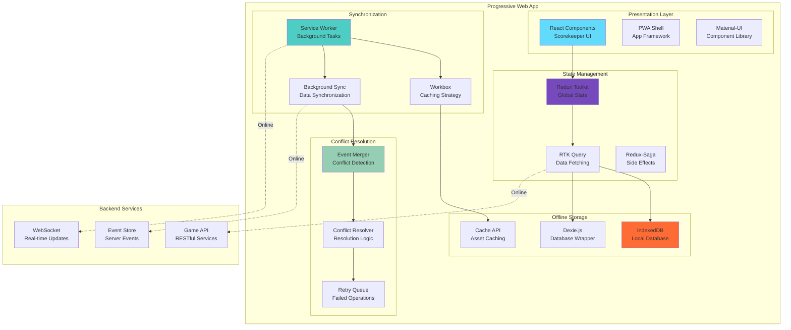

# ADR-008: Offline-First Mobile Architecture with Progressive Web Apps

**Status:** Accepted  
**Date:** 2025-08-08  
**Deciders:** Lead Solutions Architect, Mobile Team Lead, UX Lead  
**Technical Story:** Mobile-First Offline Capability for Scorekeeper Apps  

## Context

The Basketball League Management Platform must support mobile scorekeeping applications that function reliably in various connectivity scenarios:

1. **Gymnasium Connectivity Issues**: Many basketball courts have poor or inconsistent internet connectivity
2. **Critical Data Integrity**: Game scores and statistics cannot be lost due to connectivity problems
3. **Real-time Synchronization**: When connectivity is available, data must sync immediately
4. **Multi-Platform Support**: iOS, Android, and web-based scorekeeping interfaces
5. **Conflict Resolution**: Multiple scorekeepers may make changes that need to be reconciled
6. **Performance Requirements**: Sub-second response times for scorekeeper actions

### Current Challenges
- Native mobile apps require separate development for iOS and Android
- Poor connectivity causes data loss and frustrated users
- No offline capability for critical game operations
- Complex synchronization logic leads to data conflicts
- Expensive mobile development and maintenance overhead

### Requirements
- 100% functionality during offline periods
- Automatic synchronization when connectivity returns
- Cross-platform compatibility with single codebase
- Conflict resolution for concurrent edits
- Native mobile performance and user experience
- Easy deployment and updates without app store approval

## Decision

We will implement **Progressive Web Apps (PWAs) with offline-first architecture** using modern web technologies:

### Core Technology Stack
- **Framework**: React 18+ with Concurrent Features
- **State Management**: Redux Toolkit with RTK Query
- **Offline Storage**: IndexedDB with Dexie.js
- **Service Worker**: Workbox for caching and background sync
- **Sync Strategy**: Event sourcing with conflict resolution
- **UI Framework**: Material-UI with responsive design
- **Build Tools**: Vite for fast development and optimal production builds

### Offline-First Architecture Components

#### 1. Client-Side Data Layer
```typescript
// Offline data management with IndexedDB
interface OfflineDataStore {
  events: GameEvent[];        // Local event store
  gameState: GameState;       // Computed game state
  syncQueue: SyncItem[];      // Pending synchronization items
  conflicts: ConflictItem[];  // Merge conflict resolution queue
}
```

#### 2. Synchronization Layer
```typescript
// Background synchronization service
interface SyncService {
  syncToServer(): Promise<SyncResult>;
  handleServerEvents(events: GameEvent[]): Promise<void>;
  resolveConflicts(conflicts: ConflictItem[]): Promise<void>;
}
```

#### 3. Event Sourcing for Offline Operations
```typescript
// Local event sourcing for game operations
interface GameEventStore {
  appendEvent(event: GameEvent): Promise<void>;
  getEvents(gameId: string): Promise<GameEvent[]>;
  rebuildGameState(gameId: string): Promise<GameState>;
}
```

### PWA Architecture Diagram


## Alternatives Considered

### Alternative 1: Native Mobile Apps (iOS/Android)
**Pros:**
- Best possible native performance and user experience
- Full access to device capabilities and APIs
- Excellent offline capabilities with local databases
- Platform-specific optimization opportunities
- Better integration with device features

**Cons:**
- Requires separate development teams for iOS and Android
- Significantly higher development and maintenance costs
- App store approval process delays feature releases
- Complex deployment and update management
- Limited team expertise in native mobile development

**Rejected:** Development cost and timeline constraints with limited mobile expertise.

### Alternative 2: Hybrid Mobile Apps (React Native/Flutter)
**Pros:**
- Single codebase for multiple platforms
- Near-native performance capabilities
- Good offline support with local storage
- Faster development than pure native
- Growing ecosystem and community support

**Cons:**
- Still requires mobile-specific expertise and tooling
- Platform-specific customizations can be complex
- App store deployment and approval processes
- Bridge performance overhead for complex operations
- Additional complexity compared to web solutions

**Rejected:** Team lacks mobile development expertise and prefers web-first approach.

### Alternative 3: Responsive Web App (No PWA Features)
**Pros:**
- Simplest development approach using existing web skills
- Single codebase for all platforms and devices
- Easy deployment and updates
- No app store dependencies
- Familiar development and debugging tools

**Cons:**
- No offline capabilities - critical failure for scorekeeper use case
- Poor performance on mobile devices
- Limited access to device features
- No push notifications or background processing
- Requires constant internet connectivity

**Rejected:** Lack of offline capability is a critical limitation for primary use case.

### Alternative 4: Electron-based Desktop Apps
**Pros:**
- Leverages existing web development skills
- Cross-platform desktop application support
- Good offline capabilities with local storage
- Easy integration with existing web services
- Single JavaScript codebase

**Cons:**
- Not suitable for mobile/tablet scorekeeper scenarios
- High memory and resource consumption
- Poor touch interface experience
- Limited portability for court-side usage
- Not addressing the primary mobile use case

**Rejected:** Does not address the mobile-first requirement for scorekeeper applications.

### Alternative 5: Server-Side Rendering (SSR) with Caching
**Pros:**
- Excellent SEO and initial load performance
- Good caching strategies for improved performance
- Single codebase with universal JavaScript
- Better perceived performance for content-heavy pages

**Cons:**
- Still requires online connectivity for core functionality
- Complex caching invalidation strategies
- Server-side infrastructure complexity
- Limited offline capabilities for dynamic content
- Not suitable for real-time interactive applications

**Rejected:** Insufficient offline capability for critical scorekeeper functionality.

## Consequences

### Positive Consequences

#### Development and Maintenance
- **Single Codebase**: One codebase serves web, mobile, and tablet interfaces
- **Web Technology**: Leverages existing team expertise in JavaScript/React
- **Rapid Development**: Faster development cycles compared to native apps
- **Easy Updates**: Instant updates without app store approval process
- **Lower Costs**: Significantly reduced development and maintenance overhead

#### User Experience
- **Offline Functionality**: Complete scorekeeper functionality without internet
- **Native-like Performance**: Service worker and caching provide app-like experience
- **Cross-Platform**: Consistent experience across iOS, Android, and web
- **Installable**: Can be installed on home screen like native apps
- **Push Notifications**: Service worker enables background notifications

#### Technical Benefits
- **Reliable Synchronization**: Event sourcing ensures data integrity
- **Conflict Resolution**: Sophisticated merge strategies handle concurrent edits
- **Performance**: Local-first approach provides sub-second response times
- **Resilience**: Works completely offline with automatic sync when online
- **Scalable**: Web architecture scales easily with business growth

### Negative Consequences

#### Platform Limitations
- **Device Integration**: Limited access to native device features compared to native apps
- **Performance Overhead**: JavaScript execution overhead compared to native code
- **Browser Dependency**: Relies on browser PWA support and implementation quality
- **iOS Limitations**: Apple's restrictions on PWA capabilities on iOS devices
- **Storage Limits**: Browser storage quotas may limit offline data capacity

#### Development Complexity
- **Service Worker Complexity**: Complex service worker management and debugging
- **Offline-First Patterns**: Requires different thinking patterns than online-first development
- **Sync Logic**: Complex synchronization and conflict resolution logic
- **Testing Challenges**: Difficult to test offline scenarios and edge cases
- **Browser Compatibility**: Need to handle various browser implementations

#### Operational Challenges
- **Caching Management**: Complex cache invalidation and update strategies
- **Data Migration**: Challenging to migrate offline data when schema changes
- **Debugging Difficulties**: Harder to debug issues in production PWAs
- **Performance Monitoring**: Limited visibility into client-side performance issues

### Mitigation Strategies

#### For Platform Limitations
- **Progressive Enhancement**: Design core functionality to work on all platforms
- **Feature Detection**: Use feature detection to provide enhanced experiences where available
- **Performance Optimization**: Implement aggressive caching and optimization strategies
- **Alternative Solutions**: Provide alternative interfaces for unsupported features

#### For Development Complexity
- **Training Program**: Comprehensive team training on PWA development patterns
- **Development Tools**: Invest in proper development and testing tools for PWAs
- **Documentation**: Maintain detailed documentation of offline-first patterns
- **Code Standards**: Establish clear patterns and abstractions for complex sync logic

#### For Operational Challenges
- **Monitoring Tools**: Implement client-side error tracking and performance monitoring
- **Testing Strategy**: Comprehensive offline testing scenarios and automation
- **Migration Tools**: Build tools for handling offline data migration
- **User Communication**: Clear user feedback for sync status and conflict resolution

## Implementation Details

### Service Worker Configuration
```typescript
// Service worker for offline functionality
import { precacheAndRoute, cleanupOutdatedCaches } from 'workbox-precaching';
import { registerRoute } from 'workbox-routing';
import { BackgroundSync } from 'workbox-background-sync';
import { CacheFirst, NetworkFirst, StaleWhileRevalidate } from 'workbox-strategies';

declare const self: ServiceWorkerGlobalScope;

// Precache static assets
precacheAndRoute(self.__WB_MANIFEST);
cleanupOutdatedCaches();

// Cache strategies for different resource types
registerRoute(
  ({ request }) => request.destination === 'document',
  new NetworkFirst({
    cacheName: 'pages',
    plugins: [{
      cacheWillUpdate: async ({ response }) => {
        return response.status === 200 ? response : null;
      }
    }]
  })
);

registerRoute(
  ({ url }) => url.pathname.startsWith('/api/games/'),
  new StaleWhileRevalidate({
    cacheName: 'game-data',
    plugins: [{
      cacheKeyWillBeUsed: async ({ request }) => {
        // Custom cache key for game data
        return `${request.url}?v=${Date.now()}`;
      }
    }]
  })
);

// Background sync for score updates
const bgSync = new BackgroundSync('score-updates', {
  maxRetentionTime: 24 * 60 // Retry for 24 hours
});

registerRoute(
  ({ url }) => url.pathname.startsWith('/api/games/') && 
               url.pathname.includes('/score'),
  bgSync.replayHandler,
  'POST'
);

// Handle offline game event synchronization
self.addEventListener('sync', event => {
  if (event.tag === 'score-sync') {
    event.waitUntil(syncGameEvents());
  }
});

async function syncGameEvents(): Promise<void> {
  try {
    const offlineEvents = await getOfflineEvents();
    for (const event of offlineEvents) {
      await syncEventToServer(event);
    }
  } catch (error) {
    console.error('Background sync failed:', error);
    throw error; // Will retry later
  }
}
```

### Offline Data Management
```typescript
// IndexedDB management with Dexie
import Dexie, { Table } from 'dexie';

interface GameEvent {
  id?: number;
  eventId: string;
  gameId: string;
  type: string;
  data: any;
  timestamp: number;
  synced: boolean;
  version: number;
}

interface GameState {
  id?: number;
  gameId: string;
  state: any;
  lastUpdated: number;
  version: number;
}

class OfflineDatabase extends Dexie {
  events!: Table<GameEvent>;
  gameStates!: Table<GameState>;
  syncQueue!: Table<SyncItem>;

  constructor() {
    super('BasketballPlatformOffline');
    
    this.version(1).stores({
      events: '++id, eventId, gameId, timestamp, synced',
      gameStates: '++id, gameId, lastUpdated',
      syncQueue: '++id, type, gameId, timestamp, retryCount'
    });
  }

  async addEvent(event: Omit<GameEvent, 'id'>): Promise<number> {
    const id = await this.events.add(event);
    
    // Update game state projection
    await this.updateGameState(event.gameId, event);
    
    // Add to sync queue if not already synced
    if (!event.synced) {
      await this.syncQueue.add({
        type: 'event',
        gameId: event.gameId,
        eventId: event.eventId,
        timestamp: Date.now(),
        retryCount: 0
      });
    }
    
    return id;
  }

  async updateGameState(gameId: string, event: GameEvent): Promise<void> {
    const currentState = await this.gameStates.get({ gameId });
    
    if (!currentState) {
      // Initialize game state
      await this.gameStates.add({
        gameId,
        state: this.initializeGameState(event),
        lastUpdated: Date.now(),
        version: 1
      });
    } else {
      // Apply event to current state
      const newState = this.applyEventToState(currentState.state, event);
      
      await this.gameStates.update(currentState.id!, {
        state: newState,
        lastUpdated: Date.now(),
        version: currentState.version + 1
      });
    }
  }
}

export const offlineDb = new OfflineDatabase();
```

### Conflict Resolution System
```typescript
// Event-based conflict resolution
interface ConflictResolution {
  resolveConflict(
    localEvents: GameEvent[], 
    serverEvents: GameEvent[]
  ): Promise<ResolvedEvents>;
}

class GameEventConflictResolver implements ConflictResolution {
  async resolveConflict(
    localEvents: GameEvent[], 
    serverEvents: GameEvent[]
  ): Promise<ResolvedEvents> {
    
    // Three-way merge strategy
    const commonAncestor = await this.findCommonAncestor(localEvents, serverEvents);
    
    if (!commonAncestor) {
      // No common ancestor - manual resolution required
      return this.createManualResolution(localEvents, serverEvents);
    }
    
    // Automatic merge based on event timestamps and types
    const mergedEvents = this.mergeEvents(
      localEvents,
      serverEvents, 
      commonAncestor
    );
    
    // Validate merge result
    const isValid = await this.validateMergedState(mergedEvents);
    
    if (!isValid) {
      // Fallback to manual resolution
      return this.createManualResolution(localEvents, serverEvents);
    }
    
    return {
      events: mergedEvents,
      conflicts: [],
      resolution: 'automatic'
    };
  }

  private mergeEvents(
    localEvents: GameEvent[],
    serverEvents: GameEvent[],
    commonAncestor: GameEvent
  ): GameEvent[] {
    
    // Events after common ancestor from both sources
    const localChanges = localEvents.filter(e => e.timestamp > commonAncestor.timestamp);
    const serverChanges = serverEvents.filter(e => e.timestamp > commonAncestor.timestamp);
    
    // Merge strategy based on event types
    const merged: GameEvent[] = [...serverEvents.filter(e => e.timestamp <= commonAncestor.timestamp)];
    
    // Combine and sort by timestamp
    const allChanges = [...localChanges, ...serverChanges]
      .sort((a, b) => a.timestamp - b.timestamp);
    
    // Apply conflict resolution rules
    for (const event of allChanges) {
      const conflictingEvent = merged.find(e => 
        this.eventsConflict(e, event)
      );
      
      if (conflictingEvent) {
        // Apply resolution strategy
        const resolved = this.resolveEventConflict(conflictingEvent, event);
        merged.splice(merged.indexOf(conflictingEvent), 1, resolved);
      } else {
        merged.push(event);
      }
    }
    
    return merged;
  }

  private eventsConflict(event1: GameEvent, event2: GameEvent): boolean {
    // Define conflict detection logic
    if (event1.type === 'score_recorded' && event2.type === 'score_recorded') {
      // Same player scoring at similar time
      const timeDiff = Math.abs(event1.timestamp - event2.timestamp);
      return timeDiff < 5000 && // Within 5 seconds
             event1.data.playerId === event2.data.playerId;
    }
    
    // Add more conflict detection rules
    return false;
  }
}
```

### React Hook for Offline-First Data
```typescript
// Custom React hook for offline-first data fetching
export function useOfflineFirstQuery<T>(
  queryKey: string,
  queryFn: () => Promise<T>,
  options?: {
    staleTime?: number;
    refetchOnReconnect?: boolean;
  }
): {
  data: T | undefined;
  isLoading: boolean;
  isError: boolean;
  isOffline: boolean;
  error: Error | null;
  refetch: () => Promise<void>;
} {
  const [data, setData] = useState<T | undefined>();
  const [isLoading, setIsLoading] = useState(true);
  const [isError, setIsError] = useState(false);
  const [error, setError] = useState<Error | null>(null);
  const [isOffline, setIsOffline] = useState(!navigator.onLine);

  // Listen for online/offline events
  useEffect(() => {
    const handleOnline = () => setIsOffline(false);
    const handleOffline = () => setIsOffline(true);

    window.addEventListener('online', handleOnline);
    window.addEventListener('offline', handleOffline);

    return () => {
      window.removeEventListener('online', handleOnline);
      window.removeEventListener('offline', handleOffline);
    };
  }, []);

  const fetchData = useCallback(async () => {
    try {
      setIsLoading(true);
      setIsError(false);
      setError(null);

      // Try to get cached data first
      const cachedData = await getCachedData<T>(queryKey);
      if (cachedData) {
        setData(cachedData);
        setIsLoading(false);
      }

      // If online, fetch fresh data
      if (navigator.onLine) {
        const freshData = await queryFn();
        setData(freshData);
        
        // Cache the fresh data
        await setCachedData(queryKey, freshData);
      } else if (!cachedData) {
        throw new Error('No cached data available offline');
      }

    } catch (err) {
      setIsError(true);
      setError(err as Error);
    } finally {
      setIsLoading(false);
    }
  }, [queryKey, queryFn]);

  // Initial fetch
  useEffect(() => {
    fetchData();
  }, [fetchData]);

  // Refetch when coming back online
  useEffect(() => {
    if (!isOffline && options?.refetchOnReconnect) {
      fetchData();
    }
  }, [isOffline, options?.refetchOnReconnect, fetchData]);

  return {
    data,
    isLoading,
    isError,
    isOffline,
    error,
    refetch: fetchData
  };
}
```

## Performance Optimization Strategies

### Bundle Splitting and Code Loading
```typescript
// Dynamic imports for code splitting
const ScoreboardComponent = lazy(() => import('./ScoreboardComponent'));
const StatisticsComponent = lazy(() => import('./StatisticsComponent'));
const GameManagementComponent = lazy(() => import('./GameManagementComponent'));

// Route-based code splitting
const AppRouter: React.FC = () => (
  <Router>
    <Suspense fallback={<LoadingScreen />}>
      <Routes>
        <Route path="/scoreboard" element={<ScoreboardComponent />} />
        <Route path="/statistics" element={<StatisticsComponent />} />
        <Route path="/manage" element={<GameManagementComponent />} />
      </Routes>
    </Suspense>
  </Router>
);

// Feature-based splitting with preloading
export const preloadScoreboardFeature = () => {
  import('./ScoreboardComponent');
  import('./scorekeeper/ScoreEntryForm');
  import('./scorekeeper/GameTimer');
};
```

### Virtual Scrolling for Large Datasets
```typescript
// Virtual scrolling for game history and statistics
export const VirtualizedGameList: React.FC<{
  games: GameSummary[];
  onGameSelect: (game: GameSummary) => void;
}> = ({ games, onGameSelect }) => {
  const virtualizerRef = useRef<FixedSizeList>(null);
  
  const GameRow = ({ index, style }: ListChildComponentProps) => (
    <div style={style}>
      <GameListItem 
        game={games[index]} 
        onClick={() => onGameSelect(games[index])}
      />
    </div>
  );
  
  return (
    <FixedSizeList
      ref={virtualizerRef}
      height={600}
      itemCount={games.length}
      itemSize={80}
      width="100%"
    >
      {GameRow}
    </FixedSizeList>
  );
};
```

## User Experience Considerations

### Offline State Indication
```typescript
// Offline indicator component
export const OfflineIndicator: React.FC = () => {
  const [isOffline, setIsOffline] = useState(!navigator.onLine);
  const [pendingSyncCount, setPendingSyncCount] = useState(0);

  useEffect(() => {
    const updateOnlineStatus = () => setIsOffline(!navigator.onLine);
    
    window.addEventListener('online', updateOnlineStatus);
    window.addEventListener('offline', updateOnlineStatus);
    
    return () => {
      window.removeEventListener('online', updateOnlineStatus);
      window.removeEventListener('offline', updateOnlineStatus);
    };
  }, []);

  if (!isOffline) return null;

  return (
    <Paper elevation={3} sx={{ p: 2, bgcolor: 'warning.light' }}>
      <Box display="flex" alignItems="center" gap={1}>
        <WifiOffIcon />
        <Typography variant="body2">
          Working offline
          {pendingSyncCount > 0 && (
            <Chip 
              label={`${pendingSyncCount} pending`} 
              size="small" 
              sx={{ ml: 1 }} 
            />
          )}
        </Typography>
      </Box>
    </Paper>
  );
};
```

### Optimistic UI Updates
```typescript
// Optimistic updates for better UX
export const useOptimisticScoreUpdate = () => {
  const dispatch = useAppDispatch();
  
  const updateScore = useCallback(async (
    gameId: string, 
    teamId: string, 
    points: number
  ) => {
    // Optimistic update
    const optimisticUpdate = {
      id: generateTempId(),
      gameId,
      teamId,
      points,
      timestamp: Date.now(),
      optimistic: true
    };
    
    dispatch(addOptimisticScoreUpdate(optimisticUpdate));
    
    try {
      // Try to sync with server
      const result = await syncScoreUpdate(gameId, teamId, points);
      
      // Replace optimistic update with server result
      dispatch(replaceOptimisticUpdate({
        tempId: optimisticUpdate.id,
        serverResult: result
      }));
      
    } catch (error) {
      // Handle error but keep optimistic update
      dispatch(markOptimisticUpdateFailed({
        tempId: optimisticUpdate.id,
        error: error.message
      }));
      
      // Queue for background sync
      await queueForSync(optimisticUpdate);
    }
  }, [dispatch]);
  
  return { updateScore };
};
```

## Testing Strategy

### Offline Testing Framework
```typescript
// Testing utilities for offline scenarios
export class OfflineTestUtils {
  static async simulateOffline(): Promise<void> {
    // Mock navigator.onLine
    Object.defineProperty(navigator, 'onLine', {
      writable: true,
      value: false
    });
    
    // Trigger offline event
    window.dispatchEvent(new Event('offline'));
    
    // Mock fetch to reject
    global.fetch = jest.fn().mockRejectedValue(
      new Error('Network request failed')
    );
  }
  
  static async simulateOnline(): Promise<void> {
    Object.defineProperty(navigator, 'onLine', {
      writable: true,
      value: true
    });
    
    window.dispatchEvent(new Event('online'));
    
    // Restore fetch mock
    global.fetch = jest.fn().mockResolvedValue({
      ok: true,
      json: async () => ({ success: true })
    });
  }
  
  static async clearOfflineStorage(): Promise<void> {
    await offlineDb.events.clear();
    await offlineDb.gameStates.clear();
    await offlineDb.syncQueue.clear();
  }
}

// Example offline test
describe('Offline Scorekeeper Functionality', () => {
  beforeEach(async () => {
    await OfflineTestUtils.clearOfflineStorage();
  });
  
  test('should record scores offline', async () => {
    await OfflineTestUtils.simulateOffline();
    
    const { getByTestId } = render(<ScoreboardComponent gameId="test-game" />);
    
    // Record a score while offline
    fireEvent.click(getByTestId('home-team-score-button'));
    
    // Verify score is recorded locally
    const localEvents = await offlineDb.events.where({ gameId: 'test-game' }).toArray();
    expect(localEvents).toHaveLength(1);
    expect(localEvents[0].type).toBe('score_recorded');
  });
  
  test('should sync when coming back online', async () => {
    // Start offline and record events
    await OfflineTestUtils.simulateOffline();
    await offlineDb.addEvent({
      eventId: 'test-event-1',
      gameId: 'test-game',
      type: 'score_recorded',
      data: { teamId: 'home', points: 2 },
      timestamp: Date.now(),
      synced: false,
      version: 1
    });
    
    // Come back online
    await OfflineTestUtils.simulateOnline();
    
    // Trigger sync
    await syncPendingEvents();
    
    // Verify sync occurred
    const syncedEvents = await offlineDb.events.where({ synced: true }).toArray();
    expect(syncedEvents).toHaveLength(1);
  });
});
```

## Success Metrics

### Performance Targets
- **Offline Response Time**: <100ms for all scorekeeper actions
- **Sync Time**: <5 seconds to sync pending events when coming online
- **App Load Time**: <3 seconds initial load, <1 second subsequent loads
- **Offline Storage**: Support 24+ hours of game events locally

### User Experience Targets
- **Offline Functionality**: 100% of scorekeeper features work offline
- **Data Integrity**: Zero data loss during offline periods
- **Conflict Resolution**: <5% of events require manual conflict resolution
- **User Satisfaction**: >4.5/5 rating for offline user experience

### Technical Metrics
- **PWA Installation Rate**: >60% of mobile users install PWA
- **Cache Hit Rate**: >90% for static assets, >70% for dynamic content
- **Background Sync Success**: >99% success rate for background synchronization
- **Cross-Platform Compatibility**: 100% feature parity across platforms

## Deployment and Maintenance

### PWA Deployment Pipeline
```yaml
# CI/CD pipeline for PWA deployment
name: PWA Deployment
on:
  push:
    branches: [main]

jobs:
  build-and-deploy:
    runs-on: ubuntu-latest
    steps:
    - uses: actions/checkout@v3
    
    - name: Setup Node.js
      uses: actions/setup-node@v3
      with:
        node-version: '18'
        cache: 'npm'
    
    - name: Install dependencies
      run: npm ci
    
    - name: Run tests
      run: npm run test:ci
    
    - name: Build PWA
      run: npm run build
      env:
        REACT_APP_API_URL: ${{ secrets.API_URL }}
        REACT_APP_WS_URL: ${{ secrets.WEBSOCKET_URL }}
    
    - name: Run PWA audits
      run: |
        npm install -g lighthouse
        lighthouse --chrome-flags="--headless" --output=json --output-path=./lighthouse-results.json ./build/index.html
    
    - name: Deploy to S3
      run: aws s3 sync ./build s3://${{ secrets.S3_BUCKET_NAME }} --delete
      env:
        AWS_ACCESS_KEY_ID: ${{ secrets.AWS_ACCESS_KEY_ID }}
        AWS_SECRET_ACCESS_KEY: ${{ secrets.AWS_SECRET_ACCESS_KEY }}
    
    - name: Invalidate CloudFront
      run: |
        aws cloudfront create-invalidation \
          --distribution-id ${{ secrets.CLOUDFRONT_DISTRIBUTION_ID }} \
          --paths "/*"
```

### Update Strategy
```typescript
// Service worker update handling
export class PWAUpdateManager {
  private registration: ServiceWorkerRegistration | null = null;
  
  async checkForUpdates(): Promise<boolean> {
    if (!this.registration) return false;
    
    await this.registration.update();
    return this.registration.waiting !== null;
  }
  
  async applyUpdate(): Promise<void> {
    if (!this.registration?.waiting) return;
    
    // Send message to waiting service worker to skip waiting
    this.registration.waiting.postMessage({ type: 'SKIP_WAITING' });
    
    // Reload the page to activate new service worker
    window.location.reload();
  }
  
  async registerUpdateListener(callback: (available: boolean) => void): Promise<void> {
    if ('serviceWorker' in navigator) {
      this.registration = await navigator.serviceWorker.register('/sw.js');
      
      this.registration.addEventListener('updatefound', () => {
        callback(true);
      });
    }
  }
}
```

## Review and Maintenance

### Regular Review Schedule
- **Weekly**: Performance metrics and user feedback analysis
- **Monthly**: PWA audit and optimization review
- **Quarterly**: Technology stack updates and security review
- **Semi-annually**: Comprehensive architecture review and roadmap planning

### Maintenance Activities
- **Daily**: Monitor error rates and sync failures
- **Weekly**: Update dependencies and security patches
- **Monthly**: Performance optimization and cache strategy review
- **Quarterly**: PWA features and browser compatibility testing

This ADR will be reviewed in 6 months (February 2026) to evaluate the effectiveness of the PWA approach and assess opportunities for native app development or enhanced PWA features.