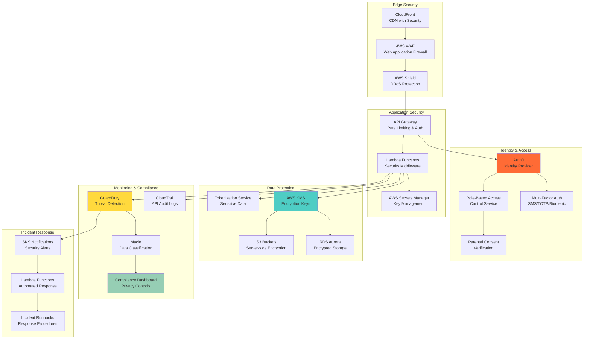

# ADR-009: Security and Compliance Architecture for Youth Sports Data

**Status:** Accepted  
**Date:** 2025-08-08  
**Deciders:** Lead Solutions Architect, Security Architect, Compliance Officer  
**Technical Story:** Data Protection and Privacy Compliance for Youth Basketball Platform  

## Context

The Basketball League Management Platform handles sensitive personal information of minors (under 13) participating in youth sports, requiring strict compliance with:

1. **COPPA Compliance**: Children's Online Privacy Protection Act for users under 13
2. **GDPR Requirements**: General Data Protection Regulation for EU users
3. **CCPA Compliance**: California Consumer Privacy Act requirements
4. **FERPA Considerations**: Educational privacy for school-based leagues
5. **State Privacy Laws**: Various state-level youth privacy protections
6. **Data Security**: Protection against breaches and unauthorized access

### Current Security Challenges
- Handling sensitive youth data with appropriate protections
- Ensuring parental consent and control over minor data
- Implementing proper data retention and deletion policies
- Securing multi-tenant data with strict isolation
- Managing identity verification for parents and guardians
- Audit trail requirements for compliance reporting

### Requirements
- COPPA-compliant data collection and processing for users under 13
- Verifiable parental consent mechanisms
- Data minimization and purpose limitation
- Right to deletion and data portability
- Encrypted data storage and transmission
- Comprehensive audit logging and monitoring
- Incident response and breach notification procedures

## Decision

We will implement a **comprehensive security and compliance architecture** with privacy-by-design principles:

### Core Security Framework

#### 1. Identity and Access Management (IAM)
- **Multi-Factor Authentication**: Required for all administrative accounts
- **Role-Based Access Control (RBAC)**: Granular permissions based on user roles
- **Parental Verification**: Identity verification for parental consent
- **Session Management**: Secure session handling with automatic expiration

#### 2. Data Protection Layer
- **Encryption at Rest**: AES-256 encryption for all stored data
- **Encryption in Transit**: TLS 1.3 for all data transmission
- **Tokenization**: Sensitive data tokenization for payment processing
- **Data Loss Prevention (DLP)**: Automated sensitive data detection

#### 3. Privacy Controls
- **Consent Management**: Granular consent tracking and management
- **Data Subject Rights**: Automated tools for data access and deletion
- **Data Minimization**: Collect only necessary data for specific purposes
- **Retention Policies**: Automated data retention and deletion schedules

#### 4. Compliance Monitoring
- **Audit Logging**: Comprehensive logging of all data access and modifications
- **Compliance Dashboards**: Real-time compliance status monitoring
- **Privacy Impact Assessments**: Automated privacy risk assessment tools
- **Breach Detection**: AI-powered anomaly detection for security incidents

### Security Architecture Diagram


## Alternatives Considered

### Alternative 1: Basic Authentication with Database Encryption
**Pros:**
- Simple to implement with standard web authentication
- Basic data protection through database encryption
- Lower implementation complexity and cost
- Familiar patterns for development team

**Cons:**
- Insufficient for COPPA and GDPR compliance requirements
- No parental consent mechanisms
- Limited audit capabilities for compliance reporting
- Inadequate data subject rights implementation
- Basic security posture insufficient for youth data

**Rejected:** Insufficient compliance capabilities for youth data protection requirements.

### Alternative 2: Third-Party Compliance Platform Integration
**Pros:**
- Specialized compliance tools designed for youth data protection
- Pre-built COPPA and GDPR compliance features
- Reduced development effort for compliance features
- Expert-maintained compliance rule updates

**Cons:**
- Additional vendor dependency and integration complexity
- Higher ongoing costs for compliance platform licensing
- Limited customization for specific business requirements
- Potential vendor lock-in for critical compliance functions
- Integration complexity with existing multi-tenant architecture

**Rejected:** Cost and integration complexity outweigh benefits for current scale.

### Alternative 3: On-Premises Security Infrastructure
**Pros:**
- Complete control over security infrastructure and data
- No cloud vendor dependencies for security services
- Potentially lower long-term costs for security tools
- Compliance with data residency requirements

**Cons:**
- Significant operational overhead for security infrastructure
- High upfront capital investment in security tools
- Requires specialized security expertise to maintain
- Slower response to emerging threats and vulnerabilities
- Complex disaster recovery and high availability setup

**Rejected:** Operational complexity too high for team size and expertise level.

### Alternative 4: Microservice-Level Security Implementation
**Pros:**
- Fine-grained security controls at each service level
- Distributed security model with service isolation
- Flexible security policies per service requirement
- Good alignment with microservices architecture

**Cons:**
- High implementation complexity across all services
- Potential security policy inconsistencies
- Difficult to maintain centralized compliance view
- Complex inter-service security communication
- Higher development and maintenance overhead

**Rejected:** Implementation complexity risks inconsistent security controls.

### Alternative 5: Hybrid Cloud-Native with External Security Audit
**Pros:**
- Leverage AWS native security services for efficiency
- External audit provides independent compliance validation
- Balance of automation and human oversight
- Good cost-effectiveness for compliance requirements

**Cons:**
- Dependency on external audit firm availability
- Potential delays in compliance validation
- Less continuous compliance monitoring
- May miss real-time compliance issues

**Considered but enhanced:** Adopted with additional continuous monitoring.

## Consequences

### Positive Consequences

#### Compliance and Legal Protection
- **COPPA Compliance**: Full compliance with children's privacy regulations
- **GDPR Alignment**: European data protection regulation compliance
- **Legal Risk Mitigation**: Reduced liability through comprehensive data protection
- **Audit Readiness**: Continuous audit trail for regulatory inspections
- **Industry Standards**: Adherence to youth sports data protection best practices

#### Data Security Benefits
- **Defense in Depth**: Multiple layers of security controls
- **Encryption Everywhere**: Data protected at rest and in transit
- **Access Controls**: Granular permissions prevent unauthorized access
- **Threat Detection**: Proactive identification of security incidents
- **Incident Response**: Automated response to security events

#### Business Value
- **Customer Trust**: Enhanced trust through transparent privacy practices
- **Market Differentiation**: Security-first approach as competitive advantage
- **Operational Efficiency**: Automated compliance reduces manual overhead
- **Scalability**: Security architecture scales with business growth
- **Risk Management**: Comprehensive risk assessment and mitigation

### Negative Consequences

#### Implementation Complexity
- **Development Overhead**: Security requirements add development complexity
- **Integration Challenges**: Complex integration of multiple security services
- **Testing Complexity**: Comprehensive security testing requirements
- **Operational Overhead**: Additional monitoring and maintenance requirements

#### Performance Impact
- **Encryption Overhead**: Performance impact of encryption/decryption operations
- **Authentication Latency**: Additional latency for authentication and authorization
- **Audit Logging**: Storage and processing overhead for comprehensive logging
- **Compliance Checks**: Runtime performance impact of compliance validations

#### Cost Implications
- **Security Services**: Higher infrastructure costs for security services
- **Compliance Tools**: Licensing costs for compliance monitoring tools
- **Training Requirements**: Team training on security and compliance practices
- **External Audits**: Ongoing costs for compliance validation and auditing

### Mitigation Strategies

#### For Implementation Complexity
- **Security Framework**: Standardized security patterns and libraries
- **Developer Training**: Comprehensive security training for development team
- **Security Champions**: Designated security experts in each development team
- **Automation Tools**: Automated security testing and compliance validation

#### For Performance Impact
- **Performance Optimization**: Optimized encryption and authentication implementations
- **Caching Strategies**: Intelligent caching of authentication and authorization decisions
- **Asynchronous Processing**: Background processing for non-critical security operations
- **Performance Monitoring**: Continuous monitoring of security-related performance impact

#### For Cost Management
- **Cost Optimization**: Regular review and optimization of security service usage
- **Automation**: Automated compliance processes to reduce manual labor costs
- **Shared Services**: Leveraging shared AWS security services across tenants
- **Gradual Implementation**: Phased implementation to spread costs over time

## Implementation Details

### COPPA Compliance Implementation
```typescript
// Parental consent management system
export class ParentalConsentService {
  private verificationProvider: IdentityVerificationProvider;
  private consentStorage: ConsentStorageService;
  private auditLogger: AuditLogger;

  async requestParentalConsent(childData: ChildRegistrationData): Promise<ConsentRequest> {
    // Validate child age requires parental consent
    const age = this.calculateAge(childData.dateOfBirth);
    if (age >= 13) {
      throw new Error('Parental consent not required for users 13 and older');
    }

    // Create consent request
    const consentRequest = {
      id: generateUUID(),
      childId: childData.id,
      parentEmail: childData.parentEmail,
      requiredConsents: [
        'data_collection',
        'data_processing', 
        'email_communication',
        'photo_video_sharing'
      ],
      expirationDate: new Date(Date.now() + 30 * 24 * 60 * 60 * 1000), // 30 days
      status: 'pending',
      createdAt: new Date()
    };

    await this.consentStorage.storeConsentRequest(consentRequest);

    // Send consent request to parent
    await this.sendConsentRequest(consentRequest);

    // Audit log
    await this.auditLogger.log({
      action: 'consent_requested',
      childId: childData.id,
      parentEmail: childData.parentEmail,
      timestamp: new Date(),
      metadata: { consentRequestId: consentRequest.id }
    });

    return consentRequest;
  }

  async verifyParentalConsent(
    consentRequestId: string,
    parentVerificationData: ParentVerificationData
  ): Promise<ConsentVerification> {
    
    // Verify parent identity
    const identityVerification = await this.verificationProvider.verifyIdentity(
      parentVerificationData
    );

    if (!identityVerification.verified) {
      throw new Error('Parent identity verification failed');
    }

    // Update consent status
    const consent = await this.consentStorage.getConsentRequest(consentRequestId);
    const verifiedConsent = {
      ...consent,
      status: 'verified',
      verificationMethod: identityVerification.method,
      verificationTimestamp: new Date(),
      parentIdentity: {
        name: identityVerification.name,
        verificationId: identityVerification.id
      }
    };

    await this.consentStorage.updateConsentRequest(verifiedConsent);

    // Audit log
    await this.auditLogger.log({
      action: 'consent_verified',
      consentRequestId,
      parentVerificationId: identityVerification.id,
      timestamp: new Date()
    });

    return verifiedConsent;
  }

  async checkConsentStatus(childId: string, purpose: DataProcessingPurpose): Promise<boolean> {
    const consent = await this.consentStorage.getActiveConsent(childId);
    
    if (!consent || consent.status !== 'verified') {
      return false;
    }

    // Check if consent covers the specific purpose
    return consent.grantedPurposes.includes(purpose);
  }
}
```

### Data Subject Rights Implementation
```typescript
// GDPR data subject rights automation
export class DataSubjectRightsService {
  private dataInventory: DataInventoryService;
  private encryptionService: EncryptionService;
  private auditLogger: AuditLogger;

  async processDataAccessRequest(
    subjectId: string,
    requestType: 'access' | 'portability' | 'deletion'
  ): Promise<DataSubjectRightsResponse> {
    
    // Verify request authenticity
    await this.verifySubjectIdentity(subjectId);

    switch (requestType) {
      case 'access':
        return await this.generateDataAccessReport(subjectId);
      
      case 'portability':
        return await this.generateDataPortabilityPackage(subjectId);
      
      case 'deletion':
        return await this.processDataDeletionRequest(subjectId);
      
      default:
        throw new Error(`Unsupported request type: ${requestType}`);
    }
  }

  private async generateDataAccessReport(subjectId: string): Promise<DataAccessReport> {
    // Discover all data for the subject across services
    const dataInventory = await this.dataInventory.findSubjectData(subjectId);
    
    const report: DataAccessReport = {
      subjectId,
      generatedAt: new Date(),
      dataCategories: [],
      processingPurposes: [],
      dataRetentionPeriods: [],
      thirdPartySharing: []
    };

    // Collect data from each service
    for (const dataLocation of dataInventory) {
      const serviceData = await this.retrieveServiceData(
        dataLocation.service,
        dataLocation.identifier
      );

      report.dataCategories.push({
        category: dataLocation.category,
        service: dataLocation.service,
        data: await this.sanitizeDataForExport(serviceData),
        collectedAt: dataLocation.collectedAt,
        lastUpdated: dataLocation.lastUpdated
      });
    }

    // Audit the data access
    await this.auditLogger.log({
      action: 'data_access_report_generated',
      subjectId,
      reportId: report.id,
      dataCategories: report.dataCategories.map(c => c.category),
      timestamp: new Date()
    });

    return report;
  }

  private async processDataDeletionRequest(subjectId: string): Promise<DeletionResponse> {
    // Check for legal basis to retain data
    const retentionCheck = await this.checkRetentionRequirements(subjectId);
    
    if (retentionCheck.mustRetain) {
      return {
        status: 'partial_deletion',
        retainedData: retentionCheck.retentionReasons,
        message: 'Some data retained due to legal requirements'
      };
    }

    // Execute deletion across all services
    const deletionTasks = await this.executeDeletionPlan(subjectId);
    
    // Verify deletion completion
    const verificationResult = await this.verifyDeletionCompletion(subjectId);
    
    // Audit the deletion
    await this.auditLogger.log({
      action: 'data_deletion_completed',
      subjectId,
      deletedServices: deletionTasks.map(t => t.service),
      verificationResult,
      timestamp: new Date()
    });

    return {
      status: 'completed',
      deletedServices: deletionTasks.map(t => t.service),
      verificationResult
    };
  }
}
```

### Encryption and Tokenization
```typescript
// Comprehensive encryption service
export class DataProtectionService {
  private kmsClient: AWS.KMS;
  private tokenizationService: TokenizationService;

  constructor() {
    this.kmsClient = new AWS.KMS({ region: process.env.AWS_REGION });
  }

  async encryptSensitiveData(
    data: any,
    dataType: DataClassification,
    tenantId: string
  ): Promise<EncryptedData> {
    
    // Get tenant-specific encryption key
    const encryptionKey = await this.getTenantEncryptionKey(tenantId);
    
    let processedData = data;
    
    // Apply field-level encryption based on data sensitivity
    if (dataType === DataClassification.HIGHLY_SENSITIVE) {
      processedData = await this.encryptFields(data, [
        'ssn', 'dateOfBirth', 'medicalInfo'
      ], encryptionKey);
    } else if (dataType === DataClassification.SENSITIVE) {
      processedData = await this.encryptFields(data, [
        'email', 'phone', 'address'
      ], encryptionKey);
    }

    // Tokenize PII data
    if (this.containsPII(data)) {
      processedData = await this.tokenizationService.tokenizePII(processedData);
    }

    return {
      data: processedData,
      encryptionMetadata: {
        keyId: encryptionKey.keyId,
        algorithm: 'AES-256-GCM',
        timestamp: new Date()
      }
    };
  }

  private async getTenantEncryptionKey(tenantId: string): Promise<EncryptionKey> {
    const keyAlias = `alias/tenant-${tenantId}`;
    
    try {
      // Get existing tenant key
      const key = await this.kmsClient.describeKey({
        KeyId: keyAlias
      }).promise();
      
      return {
        keyId: key.KeyMetadata!.KeyId!,
        keyArn: key.KeyMetadata!.Arn!
      };
      
    } catch (error) {
      if (error.code === 'NotFoundException') {
        // Create new tenant-specific key
        return await this.createTenantEncryptionKey(tenantId);
      }
      throw error;
    }
  }

  private async encryptFields(
    data: any,
    fieldsToEncrypt: string[],
    encryptionKey: EncryptionKey
  ): Promise<any> {
    const result = { ...data };
    
    for (const field of fieldsToEncrypt) {
      if (result[field]) {
        const encrypted = await this.kmsClient.encrypt({
          KeyId: encryptionKey.keyId,
          Plaintext: Buffer.from(JSON.stringify(result[field]))
        }).promise();
        
        result[field] = {
          encrypted: true,
          data: encrypted.CiphertextBlob!.toString('base64'),
          keyId: encryptionKey.keyId
        };
      }
    }
    
    return result;
  }
}
```

### Audit Logging and Compliance Monitoring
```typescript
// Comprehensive audit logging system
export class ComplianceAuditService {
  private auditStream: AWS.Kinesis;
  private complianceRules: ComplianceRuleEngine;

  async logDataAccess(event: DataAccessEvent): Promise<void> {
    const auditLog: ComplianceAuditLog = {
      eventId: generateUUID(),
      timestamp: new Date(),
      eventType: 'data_access',
      userId: event.userId,
      tenantId: event.tenantId,
      dataSubjectId: event.dataSubjectId,
      dataCategory: event.dataCategory,
      accessPurpose: event.accessPurpose,
      legalBasis: event.legalBasis,
      metadata: {
        ipAddress: event.ipAddress,
        userAgent: event.userAgent,
        sessionId: event.sessionId
      }
    };

    // Check compliance rules
    const complianceCheck = await this.complianceRules.evaluate(auditLog);
    if (!complianceCheck.compliant) {
      await this.handleComplianceViolation(auditLog, complianceCheck);
    }

    // Stream to audit log
    await this.auditStream.putRecord({
      StreamName: 'compliance-audit-logs',
      Data: JSON.stringify(auditLog),
      PartitionKey: event.tenantId
    }).promise();
  }

  async generateComplianceReport(
    tenantId: string,
    reportType: ComplianceReportType,
    dateRange: DateRange
  ): Promise<ComplianceReport> {
    
    const report: ComplianceReport = {
      reportId: generateUUID(),
      tenantId,
      reportType,
      generatedAt: new Date(),
      dateRange,
      findings: [],
      metrics: {
        totalDataRequests: 0,
        consentRates: {},
        dataBreaches: 0,
        complianceScore: 0
      }
    };

    switch (reportType) {
      case 'COPPA':
        report.findings = await this.generateCOPPAFindings(tenantId, dateRange);
        break;
      
      case 'GDPR':
        report.findings = await this.generateGDPRFindings(tenantId, dateRange);
        break;
      
      case 'COMPREHENSIVE':
        report.findings = [
          ...(await this.generateCOPPAFindings(tenantId, dateRange)),
          ...(await this.generateGDPRFindings(tenantId, dateRange))
        ];
        break;
    }

    // Calculate compliance score
    report.metrics.complianceScore = this.calculateComplianceScore(report.findings);

    return report;
  }

  private async handleComplianceViolation(
    auditLog: ComplianceAuditLog,
    violation: ComplianceViolation
  ): Promise<void> {
    
    // Create incident record
    const incident: ComplianceIncident = {
      incidentId: generateUUID(),
      severity: violation.severity,
      violationType: violation.type,
      auditLogId: auditLog.eventId,
      detectedAt: new Date(),
      status: 'open',
      description: violation.description
    };

    await this.storeComplianceIncident(incident);

    // Send immediate notifications for high severity violations
    if (violation.severity === 'HIGH' || violation.severity === 'CRITICAL') {
      await this.sendComplianceAlert(incident);
    }

    // Trigger automated remediation if available
    if (violation.autoRemediation) {
      await this.triggerAutomatedRemediation(incident, violation);
    }
  }
}
```

## Security Monitoring and Incident Response

### Threat Detection and Response
```typescript
// Automated security incident response
export class SecurityIncidentResponse {
  private guardDutyClient: AWS.GuardDuty;
  private snsClient: AWS.SNS;
  private lambdaClient: AWS.Lambda;

  async handleSecurityFinding(finding: GuardDutyFinding): Promise<void> {
    const incident: SecurityIncident = {
      incidentId: generateUUID(),
      findingId: finding.Id,
      severity: finding.Severity,
      type: finding.Type,
      detectedAt: new Date(finding.CreatedAt),
      affectedResources: finding.Service.ResourceRole === 'TARGET' ? 
        [finding.Service.RemoteIpDetails] : [],
      status: 'open'
    };

    // Classify incident severity and trigger appropriate response
    switch (finding.Severity) {
      case 'HIGH':
      case 'CRITICAL':
        await this.handleCriticalIncident(incident, finding);
        break;
      
      case 'MEDIUM':
        await this.handleMediumIncident(incident, finding);
        break;
      
      case 'LOW':
        await this.handleLowIncident(incident, finding);
        break;
    }

    // Store incident for tracking
    await this.storeSecurityIncident(incident);
  }

  private async handleCriticalIncident(
    incident: SecurityIncident,
    finding: GuardDutyFinding
  ): Promise<void> {
    
    // Immediate response actions
    await Promise.all([
      // Block suspicious IP addresses
      this.blockSuspiciousIPs(finding),
      
      // Revoke potentially compromised credentials
      this.revokeCompromisedCredentials(finding),
      
      // Isolate affected resources
      this.isolateAffectedResources(finding),
      
      // Send immediate alerts
      this.sendCriticalSecurityAlert(incident)
    ]);

    // Trigger incident response runbook
    await this.lambdaClient.invoke({
      FunctionName: 'security-incident-response',
      Payload: JSON.stringify({
        incidentId: incident.incidentId,
        finding: finding,
        severity: 'CRITICAL'
      })
    }).promise();
  }
}
```

### Data Breach Response Protocol
```typescript
// Automated data breach detection and response
export class DataBreachResponseService {
  private macieClient: AWS.Macie2;
  private complianceService: ComplianceAuditService;

  async handleDataClassificationFinding(finding: MacieFinding): Promise<void> {
    // Analyze for potential data breach
    if (this.isPotentialDataBreach(finding)) {
      await this.initiateDataBreachProtocol(finding);
    }
  }

  private async initiateDataBreachProtocol(finding: MacieFinding): Promise<void> {
    const breach: DataBreach = {
      breachId: generateUUID(),
      detectedAt: new Date(),
      description: finding.Description,
      affectedData: finding.Sample?.map(s => s.AssetClassification?.AssetType),
      severity: this.calculateBreachSeverity(finding),
      status: 'investigating'
    };

    // Immediate containment actions
    await this.containDataBreach(breach);

    // Begin 72-hour notification countdown for GDPR
    await this.scheduleBreachNotifications(breach);

    // Start investigation process
    await this.initiateBreachInvestigation(breach);

    // Log breach for compliance tracking
    await this.complianceService.logDataBreach(breach);
  }

  private async scheduleBreachNotifications(breach: DataBreach): Promise<void> {
    // Schedule GDPR notification (72 hours)
    if (this.requiresGDPRNotification(breach)) {
      await this.scheduleNotification({
        breachId: breach.breachId,
        notificationType: 'GDPR_SUPERVISORY_AUTHORITY',
        deadline: new Date(Date.now() + 72 * 60 * 60 * 1000) // 72 hours
      });
    }

    // Schedule affected individuals notification (if required)
    if (this.requiresIndividualNotification(breach)) {
      await this.scheduleNotification({
        breachId: breach.breachId,
        notificationType: 'AFFECTED_INDIVIDUALS',
        deadline: new Date(Date.now() + 72 * 60 * 60 * 1000)
      });
    }
  }
}
```

## Performance and Security Testing

### Security Testing Framework
```typescript
// Automated security testing
export class SecurityTestingSuite {
  async runSecurityTests(): Promise<SecurityTestResults> {
    const results: SecurityTestResults = {
      testSuite: 'comprehensive-security',
      executedAt: new Date(),
      tests: [],
      overallStatus: 'pending'
    };

    // Authentication and authorization tests
    results.tests.push(await this.testAuthenticationSecurity());
    results.tests.push(await this.testAuthorizationControls());

    // Data protection tests
    results.tests.push(await this.testEncryptionImplementation());
    results.tests.push(await this.testDataMaskingControls());

    // API security tests
    results.tests.push(await this.testAPISecurityControls());
    results.tests.push(await this.testRateLimitingControls());

    // Compliance tests
    results.tests.push(await this.testCOPPACompliance());
    results.tests.push(await this.testGDPRCompliance());

    // Calculate overall status
    const failedTests = results.tests.filter(t => t.status === 'failed');
    results.overallStatus = failedTests.length === 0 ? 'passed' : 'failed';

    return results;
  }

  private async testCOPPACompliance(): Promise<SecurityTestResult> {
    const test: SecurityTestResult = {
      testName: 'COPPA Compliance Validation',
      category: 'compliance',
      status: 'running',
      startTime: new Date(),
      assertions: []
    };

    try {
      // Test parental consent requirements
      const consentTest = await this.validateParentalConsentFlow();
      test.assertions.push(consentTest);

      // Test data minimization
      const dataMinimizationTest = await this.validateDataMinimization();
      test.assertions.push(dataMinimizationTest);

      // Test age verification
      const ageVerificationTest = await this.validateAgeVerification();
      test.assertions.push(ageVerificationTest);

      const failedAssertions = test.assertions.filter(a => !a.passed);
      test.status = failedAssertions.length === 0 ? 'passed' : 'failed';

    } catch (error) {
      test.status = 'failed';
      test.error = error.message;
    }

    test.endTime = new Date();
    return test;
  }
}
```

## Success Metrics

### Security Metrics
- **Zero Data Breaches**: No unauthorized access to youth data
- **Compliance Score**: >95% on automated compliance assessments
- **Incident Response Time**: <30 minutes for critical security incidents
- **Vulnerability Resolution**: <24 hours for critical, <7 days for high severity

### Privacy Metrics
- **Parental Consent Rate**: >98% successful consent verification
- **Data Subject Request Processing**: <72 hours for access requests
- **Data Deletion Compliance**: 100% successful deletion within retention periods
- **Audit Trail Completeness**: 100% of data access events logged

### Operational Metrics
- **Security Training Completion**: 100% of team members annually
- **Compliance Audit Success**: Pass all external compliance audits
- **False Positive Rate**: <5% for automated security alerts
- **Recovery Time Objective**: <4 hours for security incident recovery

## Cost Management and Optimization

### Security Cost Optimization
- **Automated Scaling**: Dynamic scaling of security services based on usage
- **Shared Security Services**: Leverage shared AWS security services across tenants
- **Cost Monitoring**: Regular analysis of security service costs and optimization
- **Open Source Integration**: Where appropriate, integrate cost-effective open source security tools

## Review and Maintenance

### Security Review Schedule
- **Daily**: Security monitoring and incident response
- **Weekly**: Security metrics review and threat landscape analysis
- **Monthly**: Compliance assessment and policy updates
- **Quarterly**: Comprehensive security architecture review
- **Annually**: External security audit and penetration testing

### Compliance Maintenance
- **Continuous**: Automated compliance monitoring and alerting
- **Monthly**: Compliance metrics review and reporting
- **Quarterly**: Data subject rights request processing review
- **Annually**: Comprehensive compliance audit and certification

This ADR will be reviewed every 6 months (February 2026) to ensure continued compliance with evolving privacy regulations and security threats in the youth sports technology landscape.