# ADR-010: Disaster Recovery and Business Continuity Strategy

**Status:** Accepted  
**Date:** 2025-08-08  
**Deciders:** Lead Solutions Architect, DevOps Lead, CTO  
**Technical Story:** Business Continuity and Disaster Recovery for Critical Basketball Operations  

## Context

The Basketball League Management Platform serves as critical infrastructure for youth sports organizations, requiring robust disaster recovery and business continuity capabilities to ensure:

1. **Tournament Continuity**: Games and tournaments cannot be interrupted by system failures
2. **Data Protection**: Complete protection of player, coach, and organizational data
3. **Financial Continuity**: Payment processing and financial operations must remain available
4. **Compliance Requirements**: Audit trail and compliance data must survive disasters
5. **Reputation Management**: System availability impacts organization reputation and trust
6. **Multi-Tenant Resilience**: Disaster affecting one tenant cannot impact others

### Current Risk Assessment
- Single region deployment creates regional disaster vulnerability
- Database failures could result in complete data loss
- Limited backup and recovery automation
- No tested disaster recovery procedures
- Potential for extended downtime during regional outages
- Lack of automated failover capabilities

### Business Requirements
- **Recovery Time Objective (RTO)**: <4 hours for critical services
- **Recovery Point Objective (RPO)**: <1 hour for transactional data
- **Availability Target**: 99.9% annual uptime including disaster scenarios
- **Data Durability**: 99.999999999% (11 9's) for all business data
- **Multi-Region Failover**: Automatic failover to secondary region
- **Compliance Continuity**: Maintained audit trail during disaster recovery

## Decision

We will implement a **comprehensive multi-region disaster recovery strategy** with automated failover and business continuity processes:

### Disaster Recovery Architecture

#### 1. Multi-Region Deployment
- **Primary Region**: US-West-2 (Oregon) for primary operations
- **Secondary Region**: US-East-1 (Virginia) for disaster recovery
- **Tertiary Region**: US-East-2 (Ohio) for critical data replication
- **Cross-Region Replication**: Automated data replication across regions

#### 2. Data Protection Strategy
- **Database Replication**: Aurora Global Database with cross-region replication
- **Event Store Backup**: Multi-region DynamoDB Global Tables
- **File Storage**: S3 Cross-Region Replication for all assets
- **Configuration Backup**: Parameter Store and Secrets Manager replication

#### 3. Application Layer Resilience
- **Infrastructure as Code**: Complete environment recreation capability
- **Container Registry**: Multi-region ECR replication
- **Load Balancing**: Route 53 health checks with automatic failover
- **Monitoring Continuity**: Cross-region monitoring and alerting

#### 4. Business Continuity Processes
- **Incident Response**: Automated escalation and communication procedures
- **Recovery Orchestration**: Step Functions for automated recovery workflows
- **Data Validation**: Automated data integrity verification post-recovery
- **Service Restoration**: Prioritized service restoration procedures

### Disaster Recovery Architecture Diagram

```mermaid
graph TB
    subgraph "Primary Region (US-West-2)"
        subgraph "Production Environment"
            LB_PRIMARY[Application Load Balancer]
            EKS_PRIMARY[EKS Cluster<br/>Primary Services]
            RDS_PRIMARY[Aurora PostgreSQL<br/>Primary Cluster]
            DDB_PRIMARY[DynamoDB<br/>Primary Tables]
            S3_PRIMARY[S3 Buckets<br/>Primary Storage]
        end
        
        subgraph "Backup Services"
            BACKUP_PRIMARY[AWS Backup<br/>Automated Backups]
            SNAPSHOT_PRIMARY[RDS Snapshots<br/>Point-in-time Recovery]
            LOGS_PRIMARY[CloudWatch Logs<br/>Centralized Logging]
        end
    end
    
    subgraph "Secondary Region (US-East-1)"
        subgraph "Disaster Recovery Environment"
            LB_SECONDARY[Application Load Balancer<br/>Standby]
            EKS_SECONDARY[EKS Cluster<br/>Minimal Standby]
            RDS_SECONDARY[Aurora PostgreSQL<br/>Read Replica]
            DDB_SECONDARY[DynamoDB Global Tables<br/>Read Replica]
            S3_SECONDARY[S3 Buckets<br/>Cross-Region Replica]
        end
        
        subgraph "Recovery Services"
            BACKUP_SECONDARY[AWS Backup<br/>Cross-Region Copy]
            RESTORE_SECONDARY[Recovery Automation<br/>Lambda Functions]
            MONITOR_SECONDARY[CloudWatch<br/>Cross-Region Monitoring]
        end
    end
    
    subgraph "Tertiary Region (US-East-2)"
        subgraph "Critical Data Archive"
            S3_ARCHIVE[S3 Deep Archive<br/>Long-term Storage]
            GLACIER[Glacier Vault<br/>Compliance Archive]
            BACKUP_ARCHIVE[Cross-Region Backups<br/>Final Repository]
        end
    end
    
    subgraph "Global Services"
        ROUTE53[Route 53<br/>Health Check & Failover]
        CLOUDFRONT[CloudFront<br/>Global CDN]
        WAF_GLOBAL[AWS WAF<br/>Global Protection]
    end
    
    subgraph "Monitoring & Orchestration"
        CLOUDWATCH_GLOBAL[CloudWatch<br/>Cross-Region Dashboards]
        STEP_FUNCTIONS[Step Functions<br/>Recovery Orchestration]
        SNS_ALERTS[SNS Topics<br/>Incident Notifications]
    end
    
    %% Primary region connections
    ROUTE53 --> LB_PRIMARY
    LB_PRIMARY --> EKS_PRIMARY
    EKS_PRIMARY --> RDS_PRIMARY
    EKS_PRIMARY --> DDB_PRIMARY
    EKS_PRIMARY --> S3_PRIMARY
    
    %% Replication connections
    RDS_PRIMARY -.->|Continuous Replication| RDS_SECONDARY
    DDB_PRIMARY -.->|Global Tables| DDB_SECONDARY  
    S3_PRIMARY -.->|Cross-Region Replication| S3_SECONDARY
    S3_PRIMARY -.->|Archive Lifecycle| S3_ARCHIVE
    
    %% Backup connections
    BACKUP_PRIMARY -.->|Cross-Region Copy| BACKUP_SECONDARY
    SNAPSHOT_PRIMARY -.->|Automated Copy| BACKUP_ARCHIVE
    LOGS_PRIMARY -.->|Log Replication| MONITOR_SECONDARY
    
    %% Failover connections
    ROUTE53 -.->|Failover| LB_SECONDARY
    STEP_FUNCTIONS -.->|Recovery Automation| RESTORE_SECONDARY
    CLOUDWATCH_GLOBAL -.->|Alert Triggering| SNS_ALERTS
    
    style RDS_PRIMARY fill:#ff6b35
    style RDS_SECONDARY fill:#ffa500
    style ROUTE53 fill:#4ecdc4
    style STEP_FUNCTIONS fill:#96ceb4
```


## Alternatives Considered

### Alternative 1: Single Region with Enhanced Backup
**Pros:**
- Lower infrastructure costs with single region deployment
- Simplified architecture and operational overhead
- Faster deployment and development cycles
- Reduced complexity in data consistency management

**Cons:**
- Vulnerable to regional disasters and outages
- Cannot meet 4-hour RTO requirement during major outages
- Higher risk of extended downtime
- Limited geographical redundancy for critical data
- Insufficient for business continuity requirements

**Rejected:** Cannot meet business continuity requirements for critical tournament operations.

### Alternative 2: Active-Active Multi-Region Deployment
**Pros:**
- Highest availability with load distribution across regions
- Immediate failover capability with no service interruption
- Better performance with geographical load distribution
- No standby infrastructure waste

**Cons:**
- Significantly higher infrastructure costs (2x minimum)
- Complex data consistency challenges across regions
- Difficult conflict resolution for concurrent writes
- Higher operational complexity and monitoring requirements
- Increased network latency for cross-region coordination

**Rejected:** Cost and complexity not justified for current business scale and requirements.

### Alternative 3: Hybrid Cloud Disaster Recovery
**Pros:**
- Reduced vendor lock-in with multi-cloud strategy
- Potentially lower costs with mixed cloud providers
- Enhanced resilience through cloud provider diversification
- Learning opportunity for multi-cloud expertise

**Cons:**
- Significantly higher operational complexity
- Different APIs and services across cloud providers
- Complex networking and security configurations
- Higher learning curve and expertise requirements
- Inconsistent service availability across providers

**Rejected:** Operational complexity outweighs benefits for team size and expertise level.

### Alternative 4: Third-Party Disaster Recovery Service
**Pros:**
- Specialized expertise in disaster recovery operations
- Proven recovery procedures and testing protocols
- Reduced internal operational overhead
- Professional disaster recovery management

**Cons:**
- Higher ongoing costs for managed services
- Less control over recovery procedures and timing
- Potential vendor dependency for critical operations
- May not integrate well with cloud-native architecture
- Limited customization for specific business requirements

**Rejected:** Loss of control over critical business continuity processes.

### Alternative 5: On-Premises Backup with Cloud Primary
**Pros:**
- Complete control over backup infrastructure
- Potential cost savings for long-term storage
- Physical separation from cloud provider risks
- Compliance with specific data residency requirements

**Cons:**
- High capital expenditure for backup infrastructure
- Operational overhead for on-premises management
- Slower recovery times due to infrastructure provisioning
- Limited scalability compared to cloud solutions
- Network bandwidth limitations for large data transfers

**Rejected:** Infrastructure investment and operational overhead not aligned with cloud-first strategy.

## Consequences

### Positive Consequences

#### Business Continuity
- **High Availability**: Platform remains available during regional outages
- **Tournament Protection**: Critical game operations continue during disasters
- **Customer Confidence**: Enhanced trust through demonstrated reliability
- **Competitive Advantage**: Superior reliability compared to competitors
- **Revenue Protection**: Minimized revenue loss during outages

#### Technical Benefits
- **Automated Recovery**: Reduced manual intervention during disasters
- **Data Protection**: Multiple layers of data protection and replication
- **Scalability**: Recovery infrastructure can scale with business growth
- **Testing Capability**: Regular disaster recovery testing and validation
- **Compliance**: Enhanced compliance with data protection regulations

#### Operational Benefits
- **Reduced Downtime**: Minimized service interruption during failures
- **Faster Recovery**: Automated recovery processes reduce RTO/RPO
- **Incident Response**: Clear procedures and automated escalation
- **Peace of Mind**: Reduced stress and anxiety during operational incidents
- **Knowledge Building**: Team expertise in disaster recovery operations

### Negative Consequences

#### Cost Impact
- **Infrastructure Costs**: ~40-50% increase in infrastructure spending
- **Operational Overhead**: Additional monitoring and maintenance costs
- **Testing Costs**: Regular disaster recovery testing and validation
- **Storage Costs**: Multi-region data replication and backup storage
- **Network Costs**: Cross-region data transfer and replication costs

#### Operational Complexity
- **Architecture Complexity**: More complex system architecture and dependencies
- **Monitoring Overhead**: Multi-region monitoring and alerting requirements
- **Deployment Complexity**: Multi-region deployment and configuration management
- **Debugging Challenges**: More complex troubleshooting across regions
- **Training Requirements**: Team training on disaster recovery procedures

#### Technical Challenges
- **Data Consistency**: Ensuring consistency across replicated data stores
- **Network Latency**: Cross-region replication latency impact
- **Configuration Drift**: Keeping configurations synchronized across regions
- **Version Management**: Managing application versions across regions
- **Testing Complexity**: Comprehensive testing of disaster recovery scenarios

### Mitigation Strategies

#### For Cost Management
- **Cost Monitoring**: Detailed tracking and optimization of DR costs
- **Efficient Scaling**: Right-sizing of disaster recovery infrastructure
- **Reserved Capacity**: Cost savings through reserved instance planning
- **Lifecycle Policies**: Automated data lifecycle management for cost optimization

#### For Operational Complexity
- **Automation**: Comprehensive automation of disaster recovery procedures
- **Documentation**: Detailed runbooks and recovery procedures
- **Training**: Regular team training on disaster recovery operations
- **Monitoring**: Proactive monitoring and alerting for early issue detection

#### For Technical Challenges
- **Testing Programs**: Regular disaster recovery testing and validation
- **Configuration Management**: Infrastructure as Code for consistency
- **Monitoring Tools**: Advanced monitoring and observability tools
- **Performance Testing**: Regular performance testing of recovery procedures

## Implementation Details

### Multi-Region Database Setup
```yaml
# Aurora Global Database Configuration
Resources:
  GlobalCluster:
    Type: AWS::RDS::GlobalCluster
    Properties:
      GlobalClusterIdentifier: basketball-platform-global
      SourceDBClusterIdentifier: !Ref PrimaryCluster
      BackupRetentionPeriod: 7
      DeletionProtection: true

  PrimaryCluster:
    Type: AWS::RDS::DBCluster
    Properties:
      DBClusterIdentifier: basketball-platform-primary
      Engine: aurora-postgresql
      EngineVersion: '15.3'
      MasterUsername: !Ref DBUsername
      MasterUserPassword: !Ref DBPassword
      BackupRetentionPeriod: 7
      PreferredBackupWindow: '03:00-04:00'
      PreferredMaintenanceWindow: 'Mon:04:00-Mon:05:00'
      VpcSecurityGroupIds:
        - !Ref DatabaseSecurityGroup
      DBSubnetGroupName: !Ref DBSubnetGroup
      EnableCloudwatchLogsExports:
        - postgresql
      DeletionProtection: true

  SecondaryCluster:
    Type: AWS::RDS::DBCluster
    Properties:
      DBClusterIdentifier: basketball-platform-secondary
      Engine: aurora-postgresql
      EngineVersion: '15.3'
      GlobalClusterIdentifier: !Ref GlobalCluster
      BackupRetentionPeriod: 7
      VpcSecurityGroupIds:
        - !Ref SecondaryDatabaseSecurityGroup
      DBSubnetGroupName: !Ref SecondaryDBSubnetGroup
      EnableCloudwatchLogsExports:
        - postgresql
```

### Disaster Recovery Automation
```typescript
// Automated disaster recovery orchestration
export class DisasterRecoveryOrchestrator {
  private stepFunctions: AWS.StepFunctions;
  private route53: AWS.Route53;
  private ecs: AWS.ECS;
  
  constructor() {
    this.stepFunctions = new AWS.StepFunctions();
    this.route53 = new AWS.Route53();
    this.ecs = new AWS.ECS();
  }

  async initiateDisasterRecovery(
    disasterType: DisasterType,
    affectedRegion: string
  ): Promise<DisasterRecoveryExecution> {
    
    const recoveryPlan = await this.generateRecoveryPlan(disasterType, affectedRegion);
    
    // Start disaster recovery state machine
    const execution = await this.stepFunctions.startExecution({
      stateMachineArn: process.env.DR_STATE_MACHINE_ARN!,
      input: JSON.stringify({
        disasterType,
        affectedRegion,
        recoveryPlan,
        initiatedAt: new Date().toISOString(),
        initiatedBy: 'automated-system'
      })
    }).promise();

    // Send immediate notifications
    await this.sendDisasterNotifications(disasterType, affectedRegion, execution.executionArn!);

    return {
      executionArn: execution.executionArn!,
      recoveryPlan,
      status: 'initiated',
      estimatedRTO: recoveryPlan.estimatedRTO,
      estimatedRPO: recoveryPlan.estimatedRPO
    };
  }

  private async generateRecoveryPlan(
    disasterType: DisasterType,
    affectedRegion: string
  ): Promise<RecoveryPlan> {
    
    const plan: RecoveryPlan = {
      disasterType,
      affectedRegion,
      recoveryRegion: this.getRecoveryRegion(affectedRegion),
      steps: [],
      estimatedRTO: 0,
      estimatedRPO: 0
    };

    // Generate recovery steps based on disaster type
    switch (disasterType) {
      case 'REGION_OUTAGE':
        plan.steps = await this.generateRegionFailoverSteps(affectedRegion);
        plan.estimatedRTO = 240; // 4 hours
        plan.estimatedRPO = 60;  // 1 hour
        break;

      case 'DATABASE_FAILURE':
        plan.steps = await this.generateDatabaseRecoverySteps();
        plan.estimatedRTO = 120; // 2 hours
        plan.estimatedRPO = 15;  // 15 minutes
        break;

      case 'APPLICATION_FAILURE':
        plan.steps = await this.generateApplicationRecoverySteps();
        plan.estimatedRTO = 60;  // 1 hour
        plan.estimatedRPO = 5;   // 5 minutes
        break;
    }

    return plan;
  }

  private async generateRegionFailoverSteps(affectedRegion: string): Promise<RecoveryStep[]> {
    return [
      {
        name: 'Validate Secondary Region Health',
        type: 'validation',
        estimatedDuration: 5,
        parameters: {
          region: this.getRecoveryRegion(affectedRegion),
          checks: ['database', 'application', 'networking']
        }
      },
      {
        name: 'Promote Aurora Read Replica',
        type: 'database_promotion',
        estimatedDuration: 15,
        parameters: {
          clusterId: `basketball-platform-${this.getRecoveryRegion(affectedRegion)}`
        }
      },
      {
        name: 'Scale Application Services',
        type: 'service_scaling',
        estimatedDuration: 10,
        parameters: {
          cluster: `basketball-platform-${this.getRecoveryRegion(affectedRegion)}`,
          services: this.getCriticalServices(),
          targetCapacity: 'full'
        }
      },
      {
        name: 'Update Route 53 DNS Records',
        type: 'dns_failover',
        estimatedDuration: 5,
        parameters: {
          hostedZoneId: process.env.HOSTED_ZONE_ID,
          records: this.getDNSRecords()
        }
      },
      {
        name: 'Validate Application Health',
        type: 'health_check',
        estimatedDuration: 10,
        parameters: {
          endpoints: this.getHealthCheckEndpoints(),
          timeout: 300
        }
      },
      {
        name: 'Send Recovery Notifications',
        type: 'notification',
        estimatedDuration: 5,
        parameters: {
          channels: ['email', 'sms', 'slack'],
          message: 'Disaster recovery completed successfully'
        }
      }
    ];
  }
}
```

### Route 53 Health Checks and Failover
```typescript
// Automated DNS failover configuration
export class DNSFailoverManager {
  private route53: AWS.Route53;

  constructor() {
    this.route53 = new AWS.Route53();
  }

  async setupHealthChecks(): Promise<void> {
    // Primary region health check
    const primaryHealthCheck = await this.route53.createHealthCheck({
      Type: 'HTTPS',
      ResourcePath: '/health',
      FullyQualifiedDomainName: 'api-primary.basketballplatform.com',
      Port: 443,
      RequestInterval: 30,
      FailureThreshold: 3,
      Tags: [
        { Key: 'Name', Value: 'Primary Region Health Check' },
        { Key: 'Environment', Value: 'production' }
      ]
    }).promise();

    // Secondary region health check
    const secondaryHealthCheck = await this.route53.createHealthCheck({
      Type: 'HTTPS',
      ResourcePath: '/health',
      FullyQualifiedDomainName: 'api-secondary.basketballplatform.com',
      Port: 443,
      RequestInterval: 30,
      FailureThreshold: 3,
      Tags: [
        { Key: 'Name', Value: 'Secondary Region Health Check' },
        { Key: 'Environment', Value: 'disaster-recovery' }
      ]
    }).promise();

    // Setup DNS records with failover routing
    await this.setupFailoverRecords(
      primaryHealthCheck.HealthCheck.Id,
      secondaryHealthCheck.HealthCheck.Id
    );
  }

  private async setupFailoverRecords(
    primaryHealthCheckId: string,
    secondaryHealthCheckId: string
  ): Promise<void> {
    
    const hostedZoneId = process.env.HOSTED_ZONE_ID!;

    // Primary record (active)
    await this.route53.changeResourceRecordSets({
      HostedZoneId: hostedZoneId,
      ChangeBatch: {
        Changes: [{
          Action: 'UPSERT',
          ResourceRecordSet: {
            Name: 'api.basketballplatform.com',
            Type: 'A',
            SetIdentifier: 'primary',
            Failover: 'PRIMARY',
            TTL: 60,
            ResourceRecords: [
              { Value: '52.32.123.45' } // Primary ALB IP
            ],
            HealthCheckId: primaryHealthCheckId
          }
        }]
      }
    }).promise();

    // Secondary record (standby)
    await this.route53.changeResourceRecordSets({
      HostedZoneId: hostedZoneId,
      ChangeBatch: {
        Changes: [{
          Action: 'UPSERT',
          ResourceRecordSet: {
            Name: 'api.basketballplatform.com',
            Type: 'A',
            SetIdentifier: 'secondary',
            Failover: 'SECONDARY',
            TTL: 60,
            ResourceRecords: [
              { Value: '54.85.234.56' } // Secondary ALB IP
            ],
            HealthCheckId: secondaryHealthCheckId
          }
        }]
      }
    }).promise();
  }
}
```

### Data Integrity Validation
```typescript
// Post-recovery data integrity validation
export class DataIntegrityValidator {
  private primaryDB: DatabaseClient;
  private secondaryDB: DatabaseClient;

  async validateDataIntegrity(recoveryContext: RecoveryContext): Promise<IntegrityReport> {
    const report: IntegrityReport = {
      validationId: generateUUID(),
      validatedAt: new Date(),
      recoveryExecutionArn: recoveryContext.executionArn,
      validations: [],
      overallStatus: 'running'
    };

    // Validate critical data consistency
    report.validations.push(await this.validateGameData());
    report.validations.push(await this.validateUserAccounts());
    report.validations.push(await this.validateFinancialTransactions());
    report.validations.push(await this.validateAuditLogs());

    // Check for data corruption
    report.validations.push(await this.checkDataCorruption());

    // Validate referential integrity
    report.validations.push(await this.validateReferentialIntegrity());

    // Calculate overall status
    const failedValidations = report.validations.filter(v => v.status === 'failed');
    report.overallStatus = failedValidations.length === 0 ? 'passed' : 'failed';

    // Generate detailed report
    if (report.overallStatus === 'failed') {
      await this.generateIntegrityFailureReport(report);
    }

    return report;
  }

  private async validateGameData(): Promise<ValidationResult> {
    const validation: ValidationResult = {
      validationType: 'game_data_consistency',
      status: 'running',
      startTime: new Date(),
      details: []
    };

    try {
      // Get recent game data from both regions
      const primaryGames = await this.primaryDB.query(`
        SELECT game_id, final_score, last_updated, checksum 
        FROM games 
        WHERE updated_at > NOW() - INTERVAL '24 hours'
      `);

      const secondaryGames = await this.secondaryDB.query(`
        SELECT game_id, final_score, last_updated, checksum 
        FROM games 
        WHERE updated_at > NOW() - INTERVAL '24 hours'
      `);

      // Compare data consistency
      const inconsistencies = this.compareGameData(primaryGames, secondaryGames);
      
      if (inconsistencies.length === 0) {
        validation.status = 'passed';
        validation.details.push({
          check: 'game_data_comparison',
          result: 'consistent',
          recordsCompared: primaryGames.length
        });
      } else {
        validation.status = 'failed';
        validation.details.push({
          check: 'game_data_comparison',
          result: 'inconsistent',
          inconsistencies: inconsistencies
        });
      }

    } catch (error) {
      validation.status = 'failed';
      validation.error = error.message;
    }

    validation.endTime = new Date();
    return validation;
  }
}
```

## Business Continuity Procedures

### Incident Response Workflow
```typescript
// Business continuity incident response
export class BusinessContinuityManager {
  private communicationService: CommunicationService;
  private stakeholderRegistry: StakeholderRegistry;

  async handleBusinessContinuityIncident(incident: BCIncident): Promise<void> {
    // Assess incident severity and business impact
    const impact = await this.assessBusinessImpact(incident);
    
    // Activate appropriate response level
    switch (impact.severity) {
      case 'CRITICAL':
        await this.activateLevel1Response(incident, impact);
        break;
      case 'HIGH':
        await this.activateLevel2Response(incident, impact);
        break;
      case 'MEDIUM':
        await this.activateLevel3Response(incident, impact);
        break;
    }

    // Coordinate with disaster recovery if needed
    if (incident.requiresDR) {
      await this.coordinateDisasterRecovery(incident);
    }
  }

  private async activateLevel1Response(
    incident: BCIncident, 
    impact: BusinessImpact
  ): Promise<void> {
    
    // Immediate notifications to all stakeholders
    await this.communicationService.sendCriticalAlert({
      incident: incident,
      impact: impact,
      recipients: await this.stakeholderRegistry.getCriticalStakeholders(),
      channels: ['email', 'sms', 'phone', 'slack'],
      urgency: 'immediate'
    });

    // Activate emergency response team
    await this.activateEmergencyResponseTeam();

    // Initiate customer communications
    await this.initiateCrisisCommunications(incident);

    // Begin impact mitigation
    await this.beginImpactMitigation(incident, impact);
  }

  private async initiateCrisisCommunications(incident: BCIncident): Promise<void> {
    const communicationPlan: CrisisCommunicationPlan = {
      initialMessage: this.generateInitialMessage(incident),
      updateFrequency: 30, // minutes
      channels: [
        'status_page',
        'email_notifications', 
        'social_media',
        'customer_portal'
      ],
      keyMessages: this.generateKeyMessages(incident)
    };

    await this.communicationService.executeCommunicationPlan(communicationPlan);
  }
}
```

### Recovery Testing Framework
```typescript
// Automated disaster recovery testing
export class DisasterRecoveryTesting {
  private testScheduler: TestScheduler;
  private testValidation: TestValidation;

  async runScheduledDRTest(testType: DRTestType): Promise<DRTestResult> {
    const testExecution: DRTestExecution = {
      testId: generateUUID(),
      testType: testType,
      startTime: new Date(),
      status: 'running',
      phases: []
    };

    try {
      switch (testType) {
        case 'TABLETOP_EXERCISE':
          return await this.runTabletopExercise(testExecution);
        
        case 'PARTIAL_FAILOVER':
          return await this.runPartialFailoverTest(testExecution);
        
        case 'FULL_FAILOVER':
          return await this.runFullFailoverTest(testExecution);
        
        case 'DATA_RECOVERY':
          return await this.runDataRecoveryTest(testExecution);
      }
    } catch (error) {
      testExecution.status = 'failed';
      testExecution.error = error.message;
      
      // Ensure cleanup even on failure
      await this.cleanupTestEnvironment(testExecution);
      
      throw error;
    }
  }

  private async runFullFailoverTest(execution: DRTestExecution): Promise<DRTestResult> {
    // Phase 1: Pre-test validation
    execution.phases.push(await this.validatePreTestConditions());

    // Phase 2: Simulate primary region failure
    execution.phases.push(await this.simulateRegionFailure());

    // Phase 3: Execute automated failover
    execution.phases.push(await this.executeFailover());

    // Phase 4: Validate service restoration
    execution.phases.push(await this.validateServiceRestoration());

    // Phase 5: Test data integrity
    execution.phases.push(await this.testDataIntegrity());

    // Phase 6: Validate business continuity
    execution.phases.push(await this.validateBusinessContinuity());

    // Phase 7: Execute failback procedure
    execution.phases.push(await this.executeFailback());

    // Phase 8: Post-test validation
    execution.phases.push(await this.validatePostTestConditions());

    const failedPhases = execution.phases.filter(p => p.status === 'failed');
    const testResult: DRTestResult = {
      testExecution: execution,
      overallStatus: failedPhases.length === 0 ? 'passed' : 'failed',
      rtoAchieved: this.calculateAchievedRTO(execution),
      rpoAchieved: this.calculateAchievedRPO(execution),
      recommendations: await this.generateRecommendations(execution)
    };

    return testResult;
  }
}
```

## Monitoring and Alerting

### Cross-Region Monitoring
```yaml
# CloudWatch Alarms for Disaster Recovery
Resources:
  PrimaryRegionHealthAlarm:
    Type: AWS::CloudWatch::Alarm
    Properties:
      AlarmName: 'Primary Region Health Check Failed'
      AlarmDescription: 'Primary region is unhealthy - potential disaster scenario'
      MetricName: 'HealthCheckStatus'
      Namespace: 'AWS/Route53'
      Statistic: 'Minimum'
      Period: 60
      EvaluationPeriods: 3
      Threshold: 1
      ComparisonOperator: 'LessThanThreshold'
      Dimensions:
        - Name: 'HealthCheckId'
          Value: !Ref PrimaryHealthCheck
      AlarmActions:
        - !Ref DisasterRecoveryTopic
      TreatMissingData: 'breaching'

  DatabaseReplicationLagAlarm:
    Type: AWS::CloudWatch::Alarm
    Properties:
      AlarmName: 'Aurora Cross-Region Replication Lag High'
      AlarmDescription: 'Replication lag exceeds RPO requirements'
      MetricName: 'AuroraGlobalDBReplicationLag'
      Namespace: 'AWS/RDS'
      Statistic: 'Maximum'
      Period: 300
      EvaluationPeriods: 2
      Threshold: 3600 # 1 hour in seconds
      ComparisonOperator: 'GreaterThanThreshold'
      Dimensions:
        - Name: 'DBClusterIdentifier'
          Value: !Ref SecondaryCluster
      AlarmActions:
        - !Ref DisasterRecoveryTopic

  DisasterRecoveryExecutionAlarm:
    Type: AWS::CloudWatch::Alarm
    Properties:
      AlarmName: 'Disaster Recovery Execution Failed'
      AlarmDescription: 'Automated disaster recovery execution failed'
      MetricName: 'ExecutionsFailed'
      Namespace: 'AWS/States'
      Statistic: 'Sum'
      Period: 300
      EvaluationPeriods: 1
      Threshold: 0
      ComparisonOperator: 'GreaterThanThreshold'
      Dimensions:
        - Name: 'StateMachineArn'
          Value: !Ref DisasterRecoveryStateMachine
      AlarmActions:
        - !Ref CriticalIncidentTopic
```

## Success Metrics

### Recovery Time and Point Objectives
- **RTO Achievement**: <4 hours for critical services (99% of tests)
- **RPO Achievement**: <1 hour for transactional data (99% of scenarios)
- **Availability**: >99.9% including disaster recovery scenarios
- **Data Durability**: 99.999999999% (11 9's) across all disaster scenarios

### Testing and Validation Metrics
- **DR Test Success Rate**: >95% for all automated disaster recovery tests
- **Test Frequency**: Monthly partial failover, quarterly full failover tests
- **Recovery Validation**: 100% data integrity validation post-recovery
- **Business Continuity**: <30 minutes to activate crisis communication

### Operational Metrics
- **Incident Response Time**: <15 minutes to acknowledge critical incidents
- **Recovery Automation**: >90% of recovery steps automated
- **Cost Efficiency**: DR infrastructure <50% of primary infrastructure cost
- **Team Readiness**: 100% of team trained on DR procedures annually

## Cost Management

### Disaster Recovery Cost Optimization
```typescript
// Cost optimization for disaster recovery infrastructure
export class DRCostOptimizer {
  private costExplorer: AWS.CostExplorer;
  private ec2: AWS.EC2;
  private rds: AWS.RDS;

  async optimizeDRCosts(): Promise<CostOptimizationReport> {
    const report: CostOptimizationReport = {
      currentCosts: await this.getCurrentDRCosts(),
      optimizations: [],
      projectedSavings: 0
    };

    // Optimize standby database sizing
    const dbOptimization = await this.optimizeStandbyDatabases();
    report.optimizations.push(dbOptimization);

    // Optimize standby compute resources
    const computeOptimization = await this.optimizeStandbyCompute();
    report.optimizations.push(computeOptimization);

    // Optimize backup retention policies
    const backupOptimization = await this.optimizeBackupPolicies();
    report.optimizations.push(backupOptimization);

    // Calculate total projected savings
    report.projectedSavings = report.optimizations
      .reduce((total, opt) => total + opt.monthlySavings, 0);

    return report;
  }

  private async optimizeStandbyDatabases(): Promise<CostOptimization> {
    // Analyze Aurora Serverless v2 for standby regions
    const currentStandbyCost = await this.getStandbyDatabaseCosts();
    
    return {
      area: 'standby_databases',
      currentMonthlyCost: currentStandbyCost,
      optimizedMonthlyCost: currentStandbyCost * 0.3, // 70% savings with serverless
      monthlySavings: currentStandbyCost * 0.7,
      recommendation: 'Use Aurora Serverless v2 for standby databases',
      implementation: 'Convert standby RDS instances to Aurora Serverless v2'
    };
  }
}
```

## Training and Documentation

### Disaster Recovery Runbooks
```markdown
# Disaster Recovery Runbook - Regional Outage

## Severity: CRITICAL
## Estimated RTO: 4 hours
## Estimated RPO: 1 hour

### Pre-Requirements
- [ ] Verify secondary region health status
- [ ] Confirm team availability and contact information
- [ ] Validate backup systems are operational

### Detection Phase (0-15 minutes)
1. **Automatic Detection**
   - Route 53 health checks fail
   - CloudWatch alarms trigger
   - Monitoring systems report outage

2. **Manual Verification**
   - [ ] Verify primary region status via AWS console
   - [ ] Check service endpoints manually
   - [ ] Confirm scope of outage

### Response Phase (15-30 minutes)
1. **Incident Declaration**
   - [ ] Declare disaster recovery incident
   - [ ] Notify stakeholder distribution list
   - [ ] Activate emergency response team

2. **Initial Assessment**
   - [ ] Assess business impact and affected services
   - [ ] Determine recovery strategy (failover vs repair)
   - [ ] Estimate customer impact

### Recovery Execution (30-240 minutes)
1. **Automated Recovery Initiation**
   ```bash
   aws stepfunctions start-execution \
     --state-machine-arn $DR_STATE_MACHINE_ARN \
     --input '{"disasterType":"REGION_OUTAGE","affectedRegion":"us-west-2"}'
   ```

2. **Manual Oversight**
   - [ ] Monitor Step Functions execution
   - [ ] Validate each recovery phase completion
   - [ ] Address any recovery failures manually

3. **Service Validation**
   - [ ] Test critical user journeys
   - [ ] Validate data integrity
   - [ ] Confirm all services operational

### Communication Phase (Throughout)
- [ ] Update status page every 30 minutes
- [ ] Send customer notifications
- [ ] Provide stakeholder updates
- [ ] Document lessons learned

### Post-Recovery Actions
- [ ] Conduct post-incident review
- [ ] Update disaster recovery procedures
- [ ] Plan failback to primary region
- [ ] Submit insurance claims if applicable
```

## Review and Maintenance

### Disaster Recovery Review Schedule
- **Monthly**: DR metrics review and cost optimization
- **Quarterly**: Full disaster recovery testing and validation
- **Semi-annually**: DR strategy review and business alignment
- **Annually**: Comprehensive DR audit and external assessment

### Continuous Improvement Process
- **After Each Incident**: Update procedures based on lessons learned
- **Technology Updates**: Evaluate new AWS DR services and capabilities
- **Business Changes**: Adjust DR strategy based on business growth and changes
- **Regulatory Changes**: Update compliance and regulatory requirements

This ADR will be reviewed every 6 months (February 2026) to ensure the disaster recovery strategy remains aligned with business requirements and incorporates the latest AWS disaster recovery best practices and services.