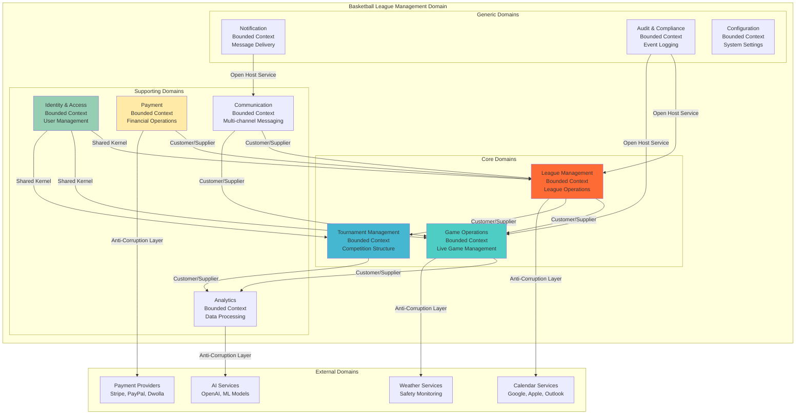

# Domain-Driven Design Model
## Basketball League Management Platform - Phase 2

**Document ID:** DDD-ARCH-001  
**Version:** 2.0  
**Date:** August 8, 2025  
**Author:** Lead Solutions Architect  
**Status:** Phase 2 Domain Model Specification  

---

## Executive Summary

This document defines the comprehensive Domain-Driven Design (DDD) model for the Basketball League Management Platform Phase 2, establishing clear bounded contexts, domain entities, value objects, aggregates, and domain services that align with business capabilities and support the complex requirements of youth basketball league management.

### Key DDD Principles Applied
- **Ubiquitous Language**: Consistent terminology across business and technical teams
- **Bounded Contexts**: Clear service boundaries aligned with business domains
- **Domain Entities**: Rich business objects with identity and behavior
- **Value Objects**: Immutable objects representing concepts without identity
- **Aggregates**: Consistency boundaries for business transactions
- **Domain Services**: Business logic that doesn't belong to specific entities
- **Repository Pattern**: Data access abstraction maintaining domain purity

---

## Table of Contents

1. [Domain Overview](#1-domain-overview)
2. [Bounded Contexts](#2-bounded-contexts)
3. [Core Domain Entities](#3-core-domain-entities)
4. [Value Objects](#4-value-objects)
5. [Aggregates and Aggregate Roots](#5-aggregates-and-aggregate-roots)
6. [Domain Services](#6-domain-services)
7. [Domain Events](#7-domain-events)
8. [Repository Contracts](#8-repository-contracts)
9. [Anti-Corruption Layers](#9-anti-corruption-layers)
10. [Ubiquitous Language Dictionary](#10-ubiquitous-language-dictionary)

---

## 1. Domain Overview

### 1.1 Domain Context Map



### 1.2 Context Relationship Types

| Relationship Type | Description | Implementation | Examples |
|------------------|-------------|----------------|----------|
| **Shared Kernel** | Shared domain model between contexts | Common library with shared concepts | Identity concepts shared across all contexts |
| **Customer/Supplier** | Upstream provides services to downstream | Well-defined APIs and contracts | League management → Game operations |
| **Conformist** | Downstream conforms to upstream model | Accept upstream model as-is | Calendar integration APIs |
| **Anti-Corruption Layer** | Translation layer for external systems | Adapter pattern with model translation | Payment gateway integrations |
| **Open Host Service** | Upstream defines protocol for downstream | Published API for multiple consumers | Notification service API |

---

## 2. Bounded Contexts

### 2.1 League Management Context

#### Context Boundary
The League Management context encompasses all aspects of organizing and managing basketball leagues, including league setup, team registration, season management, and rule configuration.

#### Core Responsibilities
- League creation and configuration
- Season planning and execution
- Team registration and management
- Division organization
- Rules and regulations enforcement
- Registration fee management

#### Key Aggregates
- **League Aggregate**: Complete league lifecycle
- **Season Aggregate**: Temporal boundaries for competition
- **Division Aggregate**: Age/skill-based groupings
- **Registration Aggregate**: Player enrollment process

```typescript
// League Management Domain Model
namespace LeagueManagement {
  
  // League Aggregate Root
  export class League extends AggregateRoot {
    constructor(
      private readonly id: LeagueId,
      private name: LeagueName,
      private organization: OrganizationId,
      private sport: Sport,
      private status: LeagueStatus,
      private seasons: Season[] = [],
      private divisions: Division[] = [],
      private rules: LeagueRules,
      private settings: LeagueSettings
    ) {
      super();
    }
    
    // Factory method
    static create(
      name: LeagueName,
      organization: OrganizationId,
      sport: Sport,
      rules: LeagueRules
    ): League {
      const league = new League(
        LeagueId.generate(),
        name,
        organization,
        sport,
        LeagueStatus.DRAFT,
        [],
        [],
        rules,
        LeagueSettings.default()
      );
      
      league.addEvent(new LeagueCreatedEvent({
        leagueId: league.id.value,
        name: league.name.value,
        organizationId: league.organization.value,
        sport: league.sport.value,
        createdAt: new Date()
      }));
      
      return league;
    }
    
    // Business methods
    public createSeason(
      name: SeasonName,
      startDate: Date,
      endDate: Date,
      registrationDeadline: Date
    ): Season {
      this.ensureLeagueIsActive();
      this.ensureValidSeasonDates(startDate, endDate, registrationDeadline);
      
      const season = Season.create(
        this.id,
        name,
        startDate,
        endDate,
        registrationDeadline
      );
      
      this.seasons.push(season);
      
      this.addEvent(new SeasonCreatedEvent({
        leagueId: this.id.value,
        seasonId: season.getId().value,
        name: season.getName().value,
        startDate,
        endDate,
        registrationDeadline
      }));
      
      return season;
    }
    
    public addDivision(
      name: DivisionName,
      ageRange: AgeRange,
      skillLevel: SkillLevel,
      maxTeams: number
    ): Division {
      this.ensureLeagueIsActive();
      this.ensureUniqueDivisionName(name);
      this.ensureNonOverlappingAgeRanges(ageRange);
      
      const division = Division.create(
        this.id,
        name,
        ageRange,
        skillLevel,
        maxTeams
      );
      
      this.divisions.push(division);
      
      this.addEvent(new DivisionAddedEvent({
        leagueId: this.id.value,
        divisionId: division.getId().value,
        name: division.getName().value,
        ageRange: ageRange.toObject(),
        skillLevel: skillLevel.value
      }));
      
      return division;
    }
    
    public updateRules(newRules: LeagueRules): void {
      this.ensureLeagueCanBeModified();
      
      const oldRules = this.rules;
      this.rules = newRules;
      
      this.addEvent(new LeagueRulesUpdatedEvent({
        leagueId: this.id.value,
        oldRules: oldRules.toObject(),
        newRules: newRules.toObject(),
        updatedAt: new Date()
      }));
    }
    
    public activate(): void {
      this.ensureLeagueCanBeActivated();
      
      this.status = LeagueStatus.ACTIVE;
      
      this.addEvent(new LeagueActivatedEvent({
        leagueId: this.id.value,
        activatedAt: new Date()
      }));
    }
    
    // Business rule validation
    private ensureLeagueIsActive(): void {
      if (!this.status.equals(LeagueStatus.ACTIVE)) {
        throw new DomainError('League must be active for this operation');
      }
    }
    
    private ensureLeagueCanBeModified(): void {
      if (this.status.equals(LeagueStatus.ARCHIVED)) {
        throw new DomainError('Cannot modify archived league');
      }
    }
    
    private ensureLeagueCanBeActivated(): void {
      if (this.status.equals(LeagueStatus.ACTIVE)) {
        throw new DomainError('League is already active');
      }
      
      if (this.divisions.length === 0) {
        throw new DomainError('League must have at least one division to be activated');
      }
    }
    
    private ensureValidSeasonDates(
      startDate: Date,
      endDate: Date,
      registrationDeadline: Date
    ): void {
      if (startDate >= endDate) {
        throw new DomainError('Season start date must be before end date');
      }
      
      if (registrationDeadline >= startDate) {
        throw new DomainError('Registration deadline must be before season start');
      }
      
      const minSeasonLength = 30 * 24 * 60 * 60 * 1000; // 30 days
      if (endDate.getTime() - startDate.getTime() < minSeasonLength) {
        throw new DomainError('Season must be at least 30 days long');
      }
    }
    
    private ensureUniqueDivisionName(name: DivisionName): void {
      const existingDivision = this.divisions.find(d => d.getName().equals(name));
      if (existingDivision) {
        throw new DomainError(`Division with name '${name.value}' already exists`);
      }
    }
    
    private ensureNonOverlappingAgeRanges(newAgeRange: AgeRange): void {
      const overlappingDivision = this.divisions.find(d => 
        d.getAgeRange().overlapsWith(newAgeRange)
      );
      
      if (overlappingDivision) {
        throw new DomainError(
          `Age range conflicts with existing division: ${overlappingDivision.getName().value}`
        );
      }
    }
    
    // Getters
    public getId(): LeagueId { return this.id; }
    public getName(): LeagueName { return this.name; }
    public getStatus(): LeagueStatus { return this.status; }
    public getSeasons(): readonly Season[] { return this.seasons; }
    public getDivisions(): readonly Division[] { return this.divisions; }
    public getRules(): LeagueRules { return this.rules; }
  }
  
  // Season Entity
  export class Season extends Entity {
    constructor(
      private readonly id: SeasonId,
      private readonly leagueId: LeagueId,
      private name: SeasonName,
      private readonly startDate: Date,
      private readonly endDate: Date,
      private readonly registrationDeadline: Date,
      private status: SeasonStatus = SeasonStatus.UPCOMING,
      private teams: TeamRegistration[] = []
    ) {
      super();
    }
    
    static create(
      leagueId: LeagueId,
      name: SeasonName,
      startDate: Date,
      endDate: Date,
      registrationDeadline: Date
    ): Season {
      return new Season(
        SeasonId.generate(),
        leagueId,
        name,
        startDate,
        endDate,
        registrationDeadline
      );
    }
    
    public registerTeam(
      teamId: TeamId,
      divisionId: DivisionId,
      registrationFee: Money
    ): TeamRegistration {
      this.ensureRegistrationIsOpen();
      this.ensureTeamNotAlreadyRegistered(teamId);
      
      const registration = TeamRegistration.create(
        this.id,
        teamId,
        divisionId,
        registrationFee
      );
      
      this.teams.push(registration);
      
      return registration;
    }
    
    public start(): void {
      this.ensureSeasonCanStart();
      
      this.status = SeasonStatus.ACTIVE;
    }
    
    public complete(): void {
      this.ensureSeasonCanComplete();
      
      this.status = SeasonStatus.COMPLETED;
    }
    
    private ensureRegistrationIsOpen(): void {
      const now = new Date();
      
      if (now > this.registrationDeadline) {
        throw new DomainError('Registration deadline has passed');
      }
      
      if (this.status !== SeasonStatus.UPCOMING) {
        throw new DomainError('Registration is only open for upcoming seasons');
      }
    }
    
    private ensureTeamNotAlreadyRegistered(teamId: TeamId): void {
      const existingRegistration = this.teams.find(t => t.getTeamId().equals(teamId));
      if (existingRegistration) {
        throw new DomainError('Team is already registered for this season');
      }
    }
    
    private ensureSeasonCanStart(): void {
      if (this.status !== SeasonStatus.UPCOMING) {
        throw new DomainError('Only upcoming seasons can be started');
      }
      
      const now = new Date();
      if (now < this.startDate) {
        throw new DomainError('Season cannot start before the scheduled start date');
      }
    }
    
    private ensureSeasonCanComplete(): void {
      if (this.status !== SeasonStatus.ACTIVE) {
        throw new DomainError('Only active seasons can be completed');
      }
    }
    
    public getId(): SeasonId { return this.id; }
    public getName(): SeasonName { return this.name; }
    public getStatus(): SeasonStatus { return this.status; }
    public getStartDate(): Date { return this.startDate; }
    public getEndDate(): Date { return this.endDate; }
    public getRegistrationDeadline(): Date { return this.registrationDeadline; }
  }
  
  // Division Entity
  export class Division extends Entity {
    constructor(
      private readonly id: DivisionId,
      private readonly leagueId: LeagueId,
      private name: DivisionName,
      private ageRange: AgeRange,
      private skillLevel: SkillLevel,
      private maxTeams: number,
      private teams: TeamId[] = []
    ) {
      super();
    }
    
    static create(
      leagueId: LeagueId,
      name: DivisionName,
      ageRange: AgeRange,
      skillLevel: SkillLevel,
      maxTeams: number
    ): Division {
      return new Division(
        DivisionId.generate(),
        leagueId,
        name,
        ageRange,
        skillLevel,
        maxTeams
      );
    }
    
    public addTeam(teamId: TeamId): void {
      this.ensureCanAddTeam();
      this.ensureTeamNotAlreadyInDivision(teamId);
      
      this.teams.push(teamId);
    }
    
    public removeTeam(teamId: TeamId): void {
      const index = this.teams.findIndex(t => t.equals(teamId));
      if (index === -1) {
        throw new DomainError('Team is not in this division');
      }
      
      this.teams.splice(index, 1);
    }
    
    private ensureCanAddTeam(): void {
      if (this.teams.length >= this.maxTeams) {
        throw new DomainError(`Division is full (max ${this.maxTeams} teams)`);
      }
    }
    
    private ensureTeamNotAlreadyInDivision(teamId: TeamId): void {
      const existingTeam = this.teams.find(t => t.equals(teamId));
      if (existingTeam) {
        throw new DomainError('Team is already in this division');
      }
    }
    
    public getId(): DivisionId { return this.id; }
    public getName(): DivisionName { return this.name; }
    public getAgeRange(): AgeRange { return this.ageRange; }
    public getSkillLevel(): SkillLevel { return this.skillLevel; }
    public getTeamCount(): number { return this.teams.length; }
    public isFull(): boolean { return this.teams.length >= this.maxTeams; }
  }
}
```

### 2.2 Game Operations Context

#### Context Boundary
The Game Operations context handles all aspects of live game management, including game scheduling, real-time scoring, statistics tracking, and game state management.

#### Core Responsibilities
- Game lifecycle management
- Real-time scoring and statistics
- Game event tracking
- Referee and scorekeeper assignment
- Live game state broadcasting

#### Key Aggregates
- **Game Aggregate**: Complete game state and operations
- **GameSchedule Aggregate**: Scheduling and timing
- **Statistics Aggregate**: Performance metrics and analytics

```typescript
// Game Operations Domain Model
namespace GameOperations {
  
  // Game Aggregate Root
  export class Game extends AggregateRoot {
    constructor(
      private readonly id: GameId,
      private readonly homeTeam: TeamId,
      private readonly awayTeam: TeamId,
      private readonly venue: VenueId,
      private readonly scheduledTime: Date,
      private status: GameStatus = GameStatus.SCHEDULED,
      private gameTime: GameTime = GameTime.zero(),
      private score: GameScore = GameScore.zero(),
      private fouls: FoulTracker = new FoulTracker(),
      private timeouts: TimeoutTracker = new TimeoutTracker(),
      private events: GameEvent[] = [],
      private officials: GameOfficials = new GameOfficials(),
      private startedAt?: Date,
      private completedAt?: Date
    ) {
      super();
    }
    
    static schedule(
      homeTeam: TeamId,
      awayTeam: TeamId,
      venue: VenueId,
      scheduledTime: Date
    ): Game {
      Game.validateTeamsAreDifferent(homeTeam, awayTeam);
      Game.validateScheduledTime(scheduledTime);
      
      const game = new Game(
        GameId.generate(),
        homeTeam,
        awayTeam,
        venue,
        scheduledTime
      );
      
      game.addEvent(new GameScheduledEvent({
        gameId: game.id.value,
        homeTeamId: homeTeam.value,
        awayTeamId: awayTeam.value,
        venueId: venue.value,
        scheduledTime
      }));
      
      return game;
    }
    
    static fromEventHistory(events: GameEvent[]): Game {
      if (events.length === 0) {
        throw new Error('Cannot reconstruct game from empty event history');
      }
      
      const firstEvent = events[0] as GameScheduledEvent;
      const game = new Game(
        new GameId(firstEvent.gameId),
        new TeamId(firstEvent.homeTeamId),
        new TeamId(firstEvent.awayTeamId),
        new VenueId(firstEvent.venueId),
        firstEvent.scheduledTime
      );
      
      // Apply all events to reconstruct state
      events.forEach(event => game.applyEvent(event));
      
      return game;
    }
    
    // Business operations
    public assignOfficials(
      referee?: RefereeId,
      scorekeeper?: ScorekeepeId,
      assistantReferee?: RefereeId
    ): void {
      this.ensureGameNotStarted();
      
      this.officials = this.officials.assign(referee, scorekeeper, assistantReferee);
      
      this.addEvent(new GameOfficialsAssignedEvent({
        gameId: this.id.value,
        refereeId: referee?.value,
        scorekeeperId: scorekeeper?.value,
        assistantRefereeId: assistantReferee?.value,
        assignedAt: new Date()
      }));
    }
    
    public start(): void {
      this.ensureGameCanStart();
      
      this.status = GameStatus.IN_PROGRESS;
      this.startedAt = new Date();
      this.gameTime = GameTime.zero();
      
      this.addEvent(new GameStartedEvent({
        gameId: this.id.value,
        startedAt: this.startedAt,
        officials: this.officials.toObject()
      }));
    }
    
    public recordScore(
      teamId: TeamId,
      playerId: PlayerId,
      points: Points,
      assistingPlayerId?: PlayerId,
      gameTime?: GameTime
    ): void {
      this.ensureGameInProgress();
      this.ensureValidTeam(teamId);
      this.ensureValidPoints(points);
      
      const currentGameTime = gameTime || this.gameTime;
      const newScore = this.score.addScore(teamId, points, this.homeTeam);
      
      const scoreEvent = new ScoreRecordedEvent({
        gameId: this.id.value,
        teamId: teamId.value,
        playerId: playerId.value,
        points: points.value,
        assistingPlayerId: assistingPlayerId?.value,
        gameTime: currentGameTime.toString(),
        newScore: {
          home: newScore.getHomeScore(),
          away: newScore.getAwayScore()
        },
        recordedAt: new Date()
      });
      
      this.score = newScore;
      this.events.push(scoreEvent);
      
      this.addEvent(scoreEvent);
    }
    
    public recordFoul(
      teamId: TeamId,
      playerId: PlayerId,
      foulType: FoulType,
      gameTime?: GameTime
    ): void {
      this.ensureGameInProgress();
      this.ensureValidTeam(teamId);
      
      const currentGameTime = gameTime || this.gameTime;
      this.fouls.recordFoul(playerId, foulType);
      
      const foulEvent = new FoulRecordedEvent({
        gameId: this.id.value,
        teamId: teamId.value,
        playerId: playerId.value,
        foulType: foulType.value,
        gameTime: currentGameTime.toString(),
        playerFoulCount: this.fouls.getPlayerFoulCount(playerId),
        teamFoulCount: this.fouls.getTeamFoulCount(teamId),
        recordedAt: new Date()
      });
      
      this.events.push(foulEvent);
      this.addEvent(foulEvent);
      
      // Check for disqualification
      if (this.fouls.getPlayerFoulCount(playerId) >= 5) {
        this.disqualifyPlayer(playerId, DisqualificationReason.FOUL_LIMIT);
      }
    }
    
    public callTimeout(teamId: TeamId, timeoutType: TimeoutType): void {
      this.ensureGameInProgress();
      this.ensureValidTeam(teamId);
      this.ensureTeamHasTimeoutsRemaining(teamId, timeoutType);
      
      this.timeouts.useTimeout(teamId, timeoutType);
      
      const timeoutEvent = new TimeoutCalledEvent({
        gameId: this.id.value,
        teamId: teamId.value,
        timeoutType: timeoutType.value,
        gameTime: this.gameTime.toString(),
        remainingTimeouts: this.timeouts.getRemainingTimeouts(teamId, timeoutType),
        calledAt: new Date()
      });
      
      this.events.push(timeoutEvent);
      this.addEvent(timeoutEvent);
    }
    
    public updateGameTime(newGameTime: GameTime): void {
      this.ensureGameInProgress();
      this.ensureValidGameTime(newGameTime);
      
      this.gameTime = newGameTime;
      
      this.addEvent(new GameTimeUpdatedEvent({
        gameId: this.id.value,
        gameTime: newGameTime.toString(),
        updatedAt: new Date()
      }));
    }
    
    public complete(): void {
      this.ensureGameInProgress();
      
      this.status = GameStatus.COMPLETED;
      this.completedAt = new Date();
      
      const winner = this.score.getWinner(this.homeTeam, this.awayTeam);
      const gameStats = this.calculateFinalStatistics();
      
      this.addEvent(new GameCompletedEvent({
        gameId: this.id.value,
        finalScore: {
          home: this.score.getHomeScore(),
          away: this.score.getAwayScore()
        },
        winner: winner?.value,
        duration: this.calculateGameDuration(),
        statistics: gameStats,
        completedAt: this.completedAt
      }));
    }
    
    public forfeit(forfeitingTeamId: TeamId, reason: string): void {
      this.ensureGameCanBeForfeit();
      this.ensureValidTeam(forfeitingTeamId);
      
      this.status = GameStatus.FORFEITED;
      this.completedAt = new Date();
      
      const winner = forfeitingTeamId.equals(this.homeTeam) ? this.awayTeam : this.homeTeam;
      
      this.addEvent(new GameForfeitedEvent({
        gameId: this.id.value,
        forfeitingTeamId: forfeitingTeamId.value,
        winnerTeamId: winner.value,
        reason,
        forfeitedAt: this.completedAt
      }));
    }
    
    public cancel(reason: string): void {
      this.ensureGameCanBeCancelled();
      
      this.status = GameStatus.CANCELLED;
      
      this.addEvent(new GameCancelledEvent({
        gameId: this.id.value,
        reason,
        cancelledAt: new Date()
      }));
    }
    
    // Business rule enforcement
    private static validateTeamsAreDifferent(homeTeam: TeamId, awayTeam: TeamId): void {
      if (homeTeam.equals(awayTeam)) {
        throw new DomainError('Home team and away team cannot be the same');
      }
    }
    
    private static validateScheduledTime(scheduledTime: Date): void {
      const now = new Date();
      const minimumAdvanceTime = 2 * 60 * 60 * 1000; // 2 hours
      
      if (scheduledTime.getTime() - now.getTime() < minimumAdvanceTime) {
        throw new DomainError('Games must be scheduled at least 2 hours in advance');
      }
    }
    
    private ensureGameNotStarted(): void {
      if (this.status !== GameStatus.SCHEDULED) {
        throw new DomainError('Game has already started or been completed');
      }
    }
    
    private ensureGameCanStart(): void {
      if (this.status !== GameStatus.SCHEDULED) {
        throw new DomainError('Only scheduled games can be started');
      }
      
      if (!this.officials.hasRequiredOfficials()) {
        throw new DomainError('Game must have required officials assigned before starting');
      }
      
      const now = new Date();
      const maxEarlyStart = 30 * 60 * 1000; // 30 minutes early
      
      if (now.getTime() < this.scheduledTime.getTime() - maxEarlyStart) {
        throw new DomainError('Game cannot start more than 30 minutes early');
      }
    }
    
    private ensureGameInProgress(): void {
      if (this.status !== GameStatus.IN_PROGRESS) {
        throw new DomainError('Game must be in progress for this operation');
      }
    }
    
    private ensureValidTeam(teamId: TeamId): void {
      if (!teamId.equals(this.homeTeam) && !teamId.equals(this.awayTeam)) {
        throw new DomainError('Team is not participating in this game');
      }
    }
    
    private ensureValidPoints(points: Points): void {
      if (points.value < 1 || points.value > 3) {
        throw new DomainError('Points must be between 1 and 3');
      }
    }
    
    private ensureValidGameTime(gameTime: GameTime): void {
      if (gameTime.getTotalSeconds() < 0) {
        throw new DomainError('Game time cannot be negative');
      }
      
      const maxGameTime = 48 * 60; // 48 minutes in seconds
      if (gameTime.getTotalSeconds() > maxGameTime) {
        throw new DomainError('Game time cannot exceed maximum game duration');
      }
    }
    
    private ensureTeamHasTimeoutsRemaining(teamId: TeamId, timeoutType: TimeoutType): void {
      if (!this.timeouts.hasTimeoutsRemaining(teamId, timeoutType)) {
        throw new DomainError(`Team has no ${timeoutType.value} timeouts remaining`);
      }
    }
    
    private ensureGameCanBeForfeit(): void {
      if (this.status === GameStatus.COMPLETED || this.status === GameStatus.CANCELLED) {
        throw new DomainError('Cannot forfeit completed or cancelled game');
      }
    }
    
    private ensureGameCanBeCancelled(): void {
      if (this.status === GameStatus.COMPLETED) {
        throw new DomainError('Cannot cancel completed game');
      }
    }
    
    // Helper methods
    private disqualifyPlayer(playerId: PlayerId, reason: DisqualificationReason): void {
      this.addEvent(new PlayerDisqualifiedEvent({
        gameId: this.id.value,
        playerId: playerId.value,
        reason: reason.value,
        gameTime: this.gameTime.toString(),
        disqualifiedAt: new Date()
      }));
    }
    
    private calculateGameDuration(): number {
      if (!this.startedAt || !this.completedAt) {
        return 0;
      }
      
      return this.completedAt.getTime() - this.startedAt.getTime();
    }
    
    private calculateFinalStatistics(): GameStatistics {
      // Calculate comprehensive game statistics
      return GameStatisticsCalculator.calculate(this.events, this.score, this.fouls);
    }
    
    // Event sourcing support
    private applyEvent(event: GameEvent): void {
      switch (event.constructor.name) {
        case 'GameScheduledEvent':
          // Initial state already set in constructor
          break;
        
        case 'GameStartedEvent':
          const startedEvent = event as GameStartedEvent;
          this.status = GameStatus.IN_PROGRESS;
          this.startedAt = startedEvent.startedAt;
          break;
        
        case 'ScoreRecordedEvent':
          const scoreEvent = event as ScoreRecordedEvent;
          this.score = new GameScore(
            scoreEvent.newScore.home,
            scoreEvent.newScore.away
          );
          break;
        
        case 'FoulRecordedEvent':
          const foulEvent = event as FoulRecordedEvent;
          this.fouls.recordFoul(
            new PlayerId(foulEvent.playerId),
            new FoulType(foulEvent.foulType)
          );
          break;
        
        case 'GameCompletedEvent':
          this.status = GameStatus.COMPLETED;
          this.completedAt = (event as GameCompletedEvent).completedAt;
          break;
        
        case 'GameCancelledEvent':
          this.status = GameStatus.CANCELLED;
          break;
        
        case 'GameForfeitedEvent':
          this.status = GameStatus.FORFEITED;
          this.completedAt = (event as GameForfeitedEvent).forfeitedAt;
          break;
      }
    }
    
    // Public getters
    public getId(): GameId { return this.id; }
    public getHomeTeam(): TeamId { return this.homeTeam; }
    public getAwayTeam(): TeamId { return this.awayTeam; }
    public getVenue(): VenueId { return this.venue; }
    public getScheduledTime(): Date { return this.scheduledTime; }
    public getStatus(): GameStatus { return this.status; }
    public getScore(): GameScore { return this.score; }
    public getGameTime(): GameTime { return this.gameTime; }
    public getEvents(): readonly GameEvent[] { return this.events; }
    public getCurrentState(): GameState {
      return new GameState(
        this.id,
        this.homeTeam,
        this.awayTeam,
        this.status,
        this.score,
        this.gameTime,
        this.fouls.getState(),
        this.timeouts.getState()
      );
    }
  }
  
  // GameScore Value Object
  export class GameScore {
    constructor(
      private readonly homeScore: number,
      private readonly awayScore: number
    ) {
      this.validateScore(homeScore);
      this.validateScore(awayScore);
    }
    
    static zero(): GameScore {
      return new GameScore(0, 0);
    }
    
    public addScore(teamId: TeamId, points: Points, homeTeamId: TeamId): GameScore {
      const isHomeTeam = teamId.equals(homeTeamId);
      
      return new GameScore(
        this.homeScore + (isHomeTeam ? points.value : 0),
        this.awayScore + (isHomeTeam ? 0 : points.value)
      );
    }
    
    public getHomeScore(): number {
      return this.homeScore;
    }
    
    public getAwayScore(): number {
      return this.awayScore;
    }
    
    public getWinner(homeTeamId: TeamId, awayTeamId: TeamId): TeamId | null {
      if (this.homeScore > this.awayScore) {
        return homeTeamId;
      } else if (this.awayScore > this.homeScore) {
        return awayTeamId;
      } else {
        return null; // Tie
      }
    }
    
    public isTie(): boolean {
      return this.homeScore === this.awayScore;
    }
    
    private validateScore(score: number): void {
      if (score < 0) {
        throw new DomainError('Score cannot be negative');
      }
      
      if (!Number.isInteger(score)) {
        throw new DomainError('Score must be a whole number');
      }
    }
    
    public equals(other: GameScore): boolean {
      return this.homeScore === other.homeScore && this.awayScore === other.awayScore;
    }
    
    public toString(): string {
      return `${this.homeScore}-${this.awayScore}`;
    }
  }
  
  // GameTime Value Object
  export class GameTime {
    constructor(
      private readonly quarter: number,
      private readonly minutes: number,
      private readonly seconds: number
    ) {
      this.validateTime();
    }
    
    static zero(): GameTime {
      return new GameTime(1, 0, 0);
    }
    
    static fromTotalSeconds(totalSeconds: number): GameTime {
      const quarter = Math.floor(totalSeconds / (12 * 60)) + 1; // 12 minutes per quarter
      const remainingSeconds = totalSeconds % (12 * 60);
      const minutes = Math.floor(remainingSeconds / 60);
      const seconds = remainingSeconds % 60;
      
      return new GameTime(quarter, minutes, seconds);
    }
    
    public getTotalSeconds(): number {
      return (this.quarter - 1) * 12 * 60 + this.minutes * 60 + this.seconds;
    }
    
    public getQuarter(): number {
      return this.quarter;
    }
    
    public getMinutes(): number {
      return this.minutes;
    }
    
    public getSeconds(): number {
      return this.seconds;
    }
    
    public addSeconds(seconds: number): GameTime {
      const totalSeconds = this.getTotalSeconds() + seconds;
      return GameTime.fromTotalSeconds(totalSeconds);
    }
    
    private validateTime(): void {
      if (this.quarter < 1 || this.quarter > 4) {
        throw new DomainError('Quarter must be between 1 and 4');
      }
      
      if (this.minutes < 0 || this.minutes >= 12) {
        throw new DomainError('Minutes must be between 0 and 11');
      }
      
      if (this.seconds < 0 || this.seconds >= 60) {
        throw new DomainError('Seconds must be between 0 and 59');
      }
    }
    
    public toString(): string {
      return `Q${this.quarter} ${this.minutes.toString().padStart(2, '0')}:${this.seconds.toString().padStart(2, '0')}`;
    }
    
    public equals(other: GameTime): boolean {
      return this.quarter === other.quarter && 
             this.minutes === other.minutes && 
             this.seconds === other.seconds;
    }
  }
}
```

---

## 3. Core Domain Entities

### 3.1 Entity Base Classes

```typescript
// Base Entity and Aggregate Root Classes
export abstract class Entity {
  protected constructor() {}
  
  public abstract equals(other: Entity): boolean;
  
  protected static isEntity(obj: any): obj is Entity {
    return obj instanceof Entity;
  }
}

export abstract class AggregateRoot extends Entity {
  private domainEvents: DomainEvent[] = [];
  
  protected addEvent(event: DomainEvent): void {
    this.domainEvents.push(event);
  }
  
  public getUncommittedEvents(): DomainEvent[] {
    return [...this.domainEvents];
  }
  
  public clearEvents(): void {
    this.domainEvents = [];
  }
}

// Domain Event Base
export abstract class DomainEvent {
  public readonly occurredAt: Date;
  public readonly eventId: string;
  
  constructor() {
    this.occurredAt = new Date();
    this.eventId = crypto.randomUUID();
  }
  
  public abstract getEventName(): string;
}
```

### 3.2 Identity Value Objects

```typescript
// Base Identity Value Object
export abstract class Identity {
  constructor(protected readonly value: string) {
    this.validateId(value);
  }
  
  private validateId(id: string): void {
    if (!id || id.trim().length === 0) {
      throw new DomainError('Identity cannot be empty');
    }
    
    // UUID validation
    const uuidRegex = /^[0-9a-f]{8}-[0-9a-f]{4}-4[0-9a-f]{3}-[89ab][0-9a-f]{3}-[0-9a-f]{12}$/i;
    if (!uuidRegex.test(id)) {
      throw new DomainError('Identity must be a valid UUID');
    }
  }
  
  public equals(other: Identity): boolean {
    return this.value === other.value;
  }
  
  public toString(): string {
    return this.value;
  }
  
  public static generate(): string {
    return crypto.randomUUID();
  }
}

// Specific Identity Classes
export class UserId extends Identity {
  static generate(): UserId {
    return new UserId(super.generate());
  }
}

export class LeagueId extends Identity {
  static generate(): LeagueId {
    return new LeagueId(super.generate());
  }
}

export class TeamId extends Identity {
  static generate(): TeamId {
    return new TeamId(super.generate());
  }
}

export class GameId extends Identity {
  static generate(): GameId {
    return new GameId(super.generate());
  }
}

export class PlayerId extends Identity {
  static generate(): PlayerId {
    return new PlayerId(super.generate());
  }
}

export class VenueId extends Identity {
  static generate(): VenueId {
    return new VenueId(super.generate());
  }
}

export class SeasonId extends Identity {
  static generate(): SeasonId {
    return new SeasonId(super.generate());
  }
}

export class DivisionId extends Identity {
  static generate(): DivisionId {
    return new DivisionId(super.generate());
  }
}
```

---

## 4. Value Objects

### 4.1 Core Value Objects

```typescript
// Name Value Objects
export class LeagueName {
  constructor(public readonly value: string) {
    this.validateName(value);
  }
  
  private validateName(name: string): void {
    if (!name || name.trim().length === 0) {
      throw new DomainError('League name cannot be empty');
    }
    
    if (name.length > 100) {
      throw new DomainError('League name cannot exceed 100 characters');
    }
    
    if (!/^[a-zA-Z0-9\s\-']+$/.test(name)) {
      throw new DomainError('League name contains invalid characters');
    }
  }
  
  public equals(other: LeagueName): boolean {
    return this.value === other.value;
  }
  
  public toString(): string {
    return this.value;
  }
}

export class TeamName {
  constructor(public readonly value: string) {
    this.validateName(value);
  }
  
  private validateName(name: string): void {
    if (!name || name.trim().length === 0) {
      throw new DomainError('Team name cannot be empty');
    }
    
    if (name.length > 50) {
      throw new DomainError('Team name cannot exceed 50 characters');
    }
    
    if (!/^[a-zA-Z0-9\s\-']+$/.test(name)) {
      throw new DomainError('Team name contains invalid characters');
    }
  }
  
  public equals(other: TeamName): boolean {
    return this.value === other.value;
  }
}

export class PlayerName {
  constructor(
    public readonly firstName: string,
    public readonly lastName: string
  ) {
    this.validateName(firstName, 'First name');
    this.validateName(lastName, 'Last name');
  }
  
  private validateName(name: string, fieldName: string): void {
    if (!name || name.trim().length === 0) {
      throw new DomainError(`${fieldName} cannot be empty`);
    }
    
    if (name.length > 50) {
      throw new DomainError(`${fieldName} cannot exceed 50 characters`);
    }
    
    if (!/^[a-zA-Z\s\-']+$/.test(name)) {
      throw new DomainError(`${fieldName} contains invalid characters`);
    }
  }
  
  public getFullName(): string {
    return `${this.firstName} ${this.lastName}`;
  }
  
  public equals(other: PlayerName): boolean {
    return this.firstName === other.firstName && this.lastName === other.lastName;
  }
}

// Age and Skill Value Objects
export class Age {
  constructor(public readonly value: number) {
    this.validateAge(value);
  }
  
  private validateAge(age: number): void {
    if (age < 6 || age > 18) {
      throw new DomainError('Age must be between 6 and 18 for youth basketball');
    }
    
    if (!Number.isInteger(age)) {
      throw new DomainError('Age must be a whole number');
    }
  }
  
  public static fromBirthDate(birthDate: Date): Age {
    const today = new Date();
    let age = today.getFullYear() - birthDate.getFullYear();
    const monthDiff = today.getMonth() - birthDate.getMonth();
    
    if (monthDiff < 0 || (monthDiff === 0 && today.getDate() < birthDate.getDate())) {
      age--;
    }
    
    return new Age(age);
  }
  
  public equals(other: Age): boolean {
    return this.value === other.value;
  }
}

export class AgeRange {
  constructor(
    public readonly minAge: number,
    public readonly maxAge: number
  ) {
    this.validateAgeRange(minAge, maxAge);
  }
  
  private validateAgeRange(minAge: number, maxAge: number): void {
    if (minAge < 6 || maxAge > 18) {
      throw new DomainError('Age range must be within 6-18 years');
    }
    
    if (minAge >= maxAge) {
      throw new DomainError('Minimum age must be less than maximum age');
    }
    
    if (maxAge - minAge > 4) {
      throw new DomainError('Age range cannot span more than 4 years');
    }
  }
  
  public contains(age: Age): boolean {
    return age.value >= this.minAge && age.value <= this.maxAge;
  }
  
  public overlapsWith(other: AgeRange): boolean {
    return !(this.maxAge < other.minAge || this.minAge > other.maxAge);
  }
  
  public equals(other: AgeRange): boolean {
    return this.minAge === other.minAge && this.maxAge === other.maxAge;
  }
  
  public toString(): string {
    return `U${this.maxAge}`;
  }
  
  public toObject(): { minAge: number; maxAge: number } {
    return { minAge: this.minAge, maxAge: this.maxAge };
  }
}

export class SkillLevel {
  private static readonly VALID_LEVELS = ['BEGINNER', 'INTERMEDIATE', 'ADVANCED', 'COMPETITIVE'];
  
  constructor(public readonly value: string) {
    this.validateSkillLevel(value);
  }
  
  private validateSkillLevel(level: string): void {
    if (!SkillLevel.VALID_LEVELS.includes(level)) {
      throw new DomainError(`Invalid skill level: ${level}`);
    }
  }
  
  public static beginner(): SkillLevel {
    return new SkillLevel('BEGINNER');
  }
  
  public static intermediate(): SkillLevel {
    return new SkillLevel('INTERMEDIATE');
  }
  
  public static advanced(): SkillLevel {
    return new SkillLevel('ADVANCED');
  }
  
  public static competitive(): SkillLevel {
    return new SkillLevel('COMPETITIVE');
  }
  
  public equals(other: SkillLevel): boolean {
    return this.value === other.value;
  }
}

// Sport Value Object
export class Sport {
  private static readonly SUPPORTED_SPORTS = ['BASKETBALL', 'SOCCER', 'BASEBALL', 'VOLLEYBALL'];
  
  constructor(public readonly value: string) {
    this.validateSport(value);
  }
  
  private validateSport(sport: string): void {
    if (!Sport.SUPPORTED_SPORTS.includes(sport)) {
      throw new DomainError(`Unsupported sport: ${sport}`);
    }
  }
  
  public static basketball(): Sport {
    return new Sport('BASKETBALL');
  }
  
  public equals(other: Sport): boolean {
    return this.value === other.value;
  }
}

// Money Value Object
export class Money {
  constructor(
    public readonly amount: number,
    public readonly currency: string = 'USD'
  ) {
    this.validateMoney(amount, currency);
  }
  
  private validateMoney(amount: number, currency: string): void {
    if (amount < 0) {
      throw new DomainError('Money amount cannot be negative');
    }
    
    if (!Number.isFinite(amount)) {
      throw new DomainError('Money amount must be a finite number');
    }
    
    // Round to 2 decimal places for currency
    const rounded = Math.round(amount * 100) / 100;
    if (amount !== rounded) {
      throw new DomainError('Money amount cannot have more than 2 decimal places');
    }
    
    if (!currency || currency.length !== 3) {
      throw new DomainError('Currency must be a valid 3-letter currency code');
    }
  }
  
  public add(other: Money): Money {
    this.ensureSameCurrency(other);
    return new Money(this.amount + other.amount, this.currency);
  }
  
  public subtract(other: Money): Money {
    this.ensureSameCurrency(other);
    return new Money(this.amount - other.amount, this.currency);
  }
  
  public multiply(multiplier: number): Money {
    return new Money(this.amount * multiplier, this.currency);
  }
  
  public divide(divisor: number): Money {
    if (divisor === 0) {
      throw new DomainError('Cannot divide money by zero');
    }
    return new Money(this.amount / divisor, this.currency);
  }
  
  public isGreaterThan(other: Money): boolean {
    this.ensureSameCurrency(other);
    return this.amount > other.amount;
  }
  
  public isLessThan(other: Money): boolean {
    this.ensureSameCurrency(other);
    return this.amount < other.amount;
  }
  
  public equals(other: Money): boolean {
    return this.amount === other.amount && this.currency === other.currency;
  }
  
  private ensureSameCurrency(other: Money): void {
    if (this.currency !== other.currency) {
      throw new DomainError('Cannot operate on different currencies');
    }
  }
  
  public toString(): string {
    return `${this.currency} ${this.amount.toFixed(2)}`;
  }
}

// Points Value Object (for game scoring)
export class Points {
  constructor(public readonly value: number) {
    this.validatePoints(value);
  }
  
  private validatePoints(points: number): void {
    if (![1, 2, 3].includes(points)) {
      throw new DomainError('Points must be 1, 2, or 3');
    }
  }
  
  public static one(): Points {
    return new Points(1);
  }
  
  public static two(): Points {
    return new Points(2);
  }
  
  public static three(): Points {
    return new Points(3);
  }
  
  public equals(other: Points): boolean {
    return this.value === other.value;
  }
}
```

---

## 5. Aggregates and Aggregate Roots

### 5.1 Aggregate Design Principles

The system follows these key principles for aggregate design:

1. **Business Transaction Boundaries**: Aggregates ensure consistency within business transaction boundaries
2. **Single Aggregate Root**: Only one entity serves as the entry point to the aggregate
3. **Reference by Identity**: Aggregates reference each other by identity, not direct references
4. **Small Aggregates**: Keep aggregates as small as possible while maintaining consistency
5. **Eventual Consistency**: Use domain events for consistency between aggregates

### 5.2 Aggregate Inventory

| Aggregate | Root Entity | Entities | Value Objects | Invariants |
|-----------|-------------|----------|---------------|------------|
| **League** | League | Season, Division | LeagueName, Sport, LeagueRules | Name uniqueness, Division age ranges |
| **Team** | Team | Player | TeamName, Jersey Numbers | Roster limits, Name uniqueness |
| **Game** | Game | - | GameScore, GameTime, Points | Score validity, Time progression |
| **Tournament** | Tournament | Match, Bracket | TournamentName, Rules | Bracket consistency, Advancement rules |
| **User** | User | UserProfile | UserName, Email, Age | Age verification, COPPA compliance |
| **Payment** | Payment | PaymentLine | Money, PaymentMethod | Transaction integrity, Refund rules |

### 5.3 Cross-Aggregate Consistency

```typescript
// Domain Service for Cross-Aggregate Operations
export class GameSchedulingService {
  constructor(
    private readonly teamRepository: TeamRepository,
    private readonly venueRepository: VenueRepository,
    private readonly gameRepository: GameRepository
  ) {}
  
  public async scheduleGame(
    homeTeamId: TeamId,
    awayTeamId: TeamId,
    venueId: VenueId,
    scheduledTime: Date
  ): Promise<Game> {
    // Load aggregates
    const homeTeam = await this.teamRepository.findById(homeTeamId);
    const awayTeam = await this.teamRepository.findById(awayTeamId);
    const venue = await this.venueRepository.findById(venueId);
    
    if (!homeTeam || !awayTeam || !venue) {
      throw new DomainError('All entities must exist to schedule a game');
    }
    
    // Check cross-aggregate business rules
    await this.ensureNoSchedulingConflicts(homeTeamId, awayTeamId, scheduledTime);
    await this.ensureVenueAvailability(venueId, scheduledTime);
    
    // Create game aggregate
    const game = Game.schedule(homeTeamId, awayTeamId, venueId, scheduledTime);
    
    // Save and return
    await this.gameRepository.save(game);
    
    return game;
  }
  
  private async ensureNoSchedulingConflicts(
    homeTeamId: TeamId,
    awayTeamId: TeamId,
    scheduledTime: Date
  ): Promise<void> {
    const conflictingGames = await this.gameRepository.findByTeamsAndTimeRange(
      [homeTeamId, awayTeamId],
      this.getConflictTimeRange(scheduledTime)
    );
    
    if (conflictingGames.length > 0) {
      throw new DomainError('Teams have scheduling conflicts at the requested time');
    }
  }
  
  private async ensureVenueAvailability(
    venueId: VenueId,
    scheduledTime: Date
  ): Promise<void> {
    const existingGame = await this.gameRepository.findByVenueAndTime(venueId, scheduledTime);
    
    if (existingGame) {
      throw new DomainError('Venue is not available at the requested time');
    }
  }
  
  private getConflictTimeRange(scheduledTime: Date): { start: Date; end: Date } {
    const buffer = 2 * 60 * 60 * 1000; // 2 hours buffer
    
    return {
      start: new Date(scheduledTime.getTime() - buffer),
      end: new Date(scheduledTime.getTime() + buffer)
    };
  }
}

// Team Aggregate focusing on roster management
export class Team extends AggregateRoot {
  constructor(
    private readonly id: TeamId,
    private name: TeamName,
    private readonly divisionId: DivisionId,
    private readonly coachId: UserId,
    private players: Player[] = [],
    private readonly rosterLimits: RosterLimits = RosterLimits.default()
  ) {
    super();
  }
  
  public addPlayer(
    playerId: PlayerId,
    playerName: PlayerName,
    jerseyNumber: JerseyNumber,
    age: Age
  ): void {
    this.ensureRosterNotFull();
    this.ensurePlayerNotAlreadyOnRoster(playerId);
    this.ensureJerseyNumberAvailable(jerseyNumber);
    this.ensurePlayerAgeEligible(age);
    
    const player = new Player(playerId, playerName, jerseyNumber, age);
    this.players.push(player);
    
    this.addEvent(new PlayerAddedToTeamEvent({
      teamId: this.id.value,
      playerId: playerId.value,
      playerName: playerName.getFullName(),
      jerseyNumber: jerseyNumber.value,
      addedAt: new Date()
    }));
  }
  
  public removePlayer(playerId: PlayerId): void {
    const playerIndex = this.players.findIndex(p => p.getId().equals(playerId));
    
    if (playerIndex === -1) {
      throw new DomainError('Player is not on this team roster');
    }
    
    this.ensureMinimumRosterSize(this.players.length - 1);
    
    const removedPlayer = this.players.splice(playerIndex, 1)[0];
    
    this.addEvent(new PlayerRemovedFromTeamEvent({
      teamId: this.id.value,
      playerId: playerId.value,
      playerName: removedPlayer.getName().getFullName(),
      removedAt: new Date()
    }));
  }
  
  // Business rule enforcement
  private ensureRosterNotFull(): void {
    if (this.players.length >= this.rosterLimits.maxPlayers) {
      throw new DomainError(`Team roster is full (max ${this.rosterLimits.maxPlayers} players)`);
    }
  }
  
  private ensurePlayerNotAlreadyOnRoster(playerId: PlayerId): void {
    const existingPlayer = this.players.find(p => p.getId().equals(playerId));
    if (existingPlayer) {
      throw new DomainError('Player is already on this team roster');
    }
  }
  
  private ensureJerseyNumberAvailable(jerseyNumber: JerseyNumber): void {
    const existingPlayer = this.players.find(p => p.getJerseyNumber().equals(jerseyNumber));
    if (existingPlayer) {
      throw new DomainError(`Jersey number ${jerseyNumber.value} is already taken`);
    }
  }
  
  private ensurePlayerAgeEligible(age: Age): void {
    // This would typically check against division age limits
    // For now, just basic validation
    if (age.value < 6 || age.value > 18) {
      throw new DomainError('Player age must be between 6 and 18');
    }
  }
  
  private ensureMinimumRosterSize(newSize: number): void {
    if (newSize < this.rosterLimits.minPlayers) {
      throw new DomainError(`Team must have at least ${this.rosterLimits.minPlayers} players`);
    }
  }
  
  public getId(): TeamId { return this.id; }
  public getName(): TeamName { return this.name; }
  public getDivisionId(): DivisionId { return this.divisionId; }
  public getCoachId(): UserId { return this.coachId; }
  public getPlayers(): readonly Player[] { return this.players; }
  public getRosterSize(): number { return this.players.length; }
}
```

---

## 6. Domain Services

### 6.1 Domain Service Identification

Domain services handle business logic that:
- Doesn't naturally belong to any single entity or value object
- Requires coordination between multiple aggregates
- Involves complex calculations or algorithms
- Implements cross-cutting business rules

### 6.2 Key Domain Services

```typescript
// Player Eligibility Domain Service
export class PlayerEligibilityService {
  constructor(
    private readonly playerRepository: PlayerRepository,
    private readonly parentalConsentService: ParentalConsentService,
    private readonly medicalClearanceService: MedicalClearanceService
  ) {}
  
  public async checkEligibility(
    playerId: PlayerId,
    leagueId: LeagueId,
    divisionId: DivisionId
  ): Promise<EligibilityResult> {
    const player = await this.playerRepository.findById(playerId);
    if (!player) {
      throw new DomainError('Player not found');
    }
    
    const eligibilityChecks: EligibilityCheck[] = [];
    
    // Age eligibility
    const ageCheck = await this.checkAgeEligibility(player, divisionId);
    eligibilityChecks.push(ageCheck);
    
    // Parental consent (for minors)
    if (player.getAge().value < 18) {
      const consentCheck = await this.checkParentalConsent(playerId);
      eligibilityChecks.push(consentCheck);
    }
    
    // Medical clearance
    const medicalCheck = await this.checkMedicalClearance(playerId);
    eligibilityChecks.push(medicalCheck);
    
    // Registration payment
    const paymentCheck = await this.checkRegistrationPayment(playerId, leagueId);
    eligibilityChecks.push(paymentCheck);
    
    // Academic eligibility (if applicable)
    const academicCheck = await this.checkAcademicEligibility(playerId);
    eligibilityChecks.push(academicCheck);
    
    const isEligible = eligibilityChecks.every(check => check.isValid);
    const issues = eligibilityChecks.filter(check => !check.isValid);
    
    return new EligibilityResult(isEligible, issues, eligibilityChecks);
  }
  
  private async checkAgeEligibility(
    player: Player,
    divisionId: DivisionId
  ): Promise<EligibilityCheck> {
    const division = await this.divisionRepository.findById(divisionId);
    if (!division) {
      return EligibilityCheck.invalid('Division not found');
    }
    
    const playerAge = player.getAge();
    const divisionAgeRange = division.getAgeRange();
    
    if (divisionAgeRange.contains(playerAge)) {
      return EligibilityCheck.valid('Age eligibility met');
    } else {
      return EligibilityCheck.invalid(
        `Player age ${playerAge.value} is not within division range ${divisionAgeRange.toString()}`
      );
    }
  }
  
  private async checkParentalConsent(playerId: PlayerId): Promise<EligibilityCheck> {
    const consentStatus = await this.parentalConsentService.getConsentStatus(playerId);
    
    if (consentStatus.isGranted && !consentStatus.isExpired) {
      return EligibilityCheck.valid('Parental consent obtained');
    } else if (!consentStatus.isGranted) {
      return EligibilityCheck.invalid('Parental consent required for minor players');
    } else {
      return EligibilityCheck.invalid('Parental consent has expired');
    }
  }
  
  private async checkMedicalClearance(playerId: PlayerId): Promise<EligibilityCheck> {
    const clearance = await this.medicalClearanceService.getClearanceStatus(playerId);
    
    if (clearance.isValid && !clearance.isExpired) {
      return EligibilityCheck.valid('Medical clearance valid');
    } else if (!clearance.isValid) {
      return EligibilityCheck.invalid('Valid medical clearance required');
    } else {
      return EligibilityCheck.invalid('Medical clearance has expired');
    }
  }
}

// Schedule Optimization Domain Service
export class ScheduleOptimizationService {
  constructor(
    private readonly weatherService: WeatherService,
    private readonly venueService: VenueService,
    private readonly mlPredictionService: MLPredictionService
  ) {}
  
  public async optimizeSchedule(
    games: Game[],
    constraints: SchedulingConstraints,
    preferences: SchedulingPreferences
  ): Promise<OptimizedSchedule> {
    // Apply hard constraints
    const feasibleSchedules = await this.applyHardConstraints(games, constraints);
    
    if (feasibleSchedules.length === 0) {
      throw new DomainError('No feasible schedule found with given constraints');
    }
    
    // Apply soft constraints and optimize
    const scoredSchedules = await this.scoreSchedules(feasibleSchedules, preferences);
    
    // Select best schedule
    const optimizedSchedule = this.selectBestSchedule(scoredSchedules);
    
    // Validate final schedule
    await this.validateSchedule(optimizedSchedule);
    
    return optimizedSchedule;
  }
  
  private async applyHardConstraints(
    games: Game[],
    constraints: SchedulingConstraints
  ): Promise<Game[][]> {
    const feasibleSchedules: Game[][] = [];
    
    // Generate possible schedules
    const possibleSchedules = this.generatePossibleSchedules(games, constraints);
    
    for (const schedule of possibleSchedules) {
      if (await this.satisfiesHardConstraints(schedule, constraints)) {
        feasibleSchedules.push(schedule);
      }
    }
    
    return feasibleSchedules;
  }
  
  private async satisfiesHardConstraints(
    schedule: Game[],
    constraints: SchedulingConstraints
  ): Promise<boolean> {
    // Check venue conflicts
    if (!this.checkVenueAvailability(schedule)) {
      return false;
    }
    
    // Check team rest periods
    if (!this.checkTeamRestPeriods(schedule, constraints.minimumRestHours)) {
      return false;
    }
    
    // Check blackout periods
    if (!this.checkBlackoutPeriods(schedule, constraints.blackoutPeriods)) {
      return false;
    }
    
    // Check weather constraints
    if (!await this.checkWeatherConstraints(schedule)) {
      return false;
    }
    
    return true;
  }
  
  private async scoreSchedules(
    schedules: Game[][],
    preferences: SchedulingPreferences
  ): Promise<ScoredSchedule[]> {
    const scoredSchedules: ScoredSchedule[] = [];
    
    for (const schedule of schedules) {
      let score = 0;
      
      // Score based on preferences
      score += await this.scoreAttendancePrediction(schedule);
      score += this.scoreHomeAwayBalance(schedule);
      score += this.scoreTravelDistance(schedule);
      score += await this.scoreWeatherOptimality(schedule);
      score += this.scoreTimeSlotPreferences(schedule, preferences);
      
      scoredSchedules.push(new ScoredSchedule(schedule, score));
    }
    
    return scoredSchedules.sort((a, b) => b.score - a.score);
  }
  
  private async scoreAttendancePrediction(schedule: Game[]): Promise<number> {
    let totalScore = 0;
    
    for (const game of schedule) {
      const prediction = await this.mlPredictionService.predictAttendance(game);
      totalScore += prediction.expectedAttendance * 0.1; // Weight attendance
    }
    
    return totalScore;
  }
  
  private scoreHomeAwayBalance(schedule: Game[]): number {
    const teamGames = new Map<string, { home: number; away: number }>();
    
    // Count home/away games for each team
    for (const game of schedule) {
      const homeTeamId = game.getHomeTeam().value;
      const awayTeamId = game.getAwayTeam().value;
      
      if (!teamGames.has(homeTeamId)) {
        teamGames.set(homeTeamId, { home: 0, away: 0 });
      }
      if (!teamGames.has(awayTeamId)) {
        teamGames.set(awayTeamId, { home: 0, away: 0 });
      }
      
      teamGames.get(homeTeamId)!.home++;
      teamGames.get(awayTeamId)!.away++;
    }
    
    // Calculate balance score
    let balanceScore = 0;
    for (const [teamId, games] of teamGames) {
      const imbalance = Math.abs(games.home - games.away);
      balanceScore -= imbalance * 10; // Penalty for imbalance
    }
    
    return balanceScore;
  }
}

// Payment Processing Domain Service
export class PaymentProcessingService {
  constructor(
    private readonly paymentGateway: PaymentGateway,
    private readonly paymentRepository: PaymentRepository,
    private readonly subscriptionService: SubscriptionService
  ) {}
  
  public async processRegistrationPayment(
    payerId: UserId,
    amount: Money,
    paymentMethod: PaymentMethod,
    registrationId: RegistrationId
  ): Promise<PaymentResult> {
    // Validate payment amount
    this.validatePaymentAmount(amount);
    
    // Create payment record
    const payment = Payment.create(
      payerId,
      amount,
      PaymentType.REGISTRATION,
      registrationId.value
    );
    
    try {
      // Process payment through gateway
      const gatewayResult = await this.paymentGateway.processPayment({
        amount: amount.amount,
        currency: amount.currency,
        paymentMethod: paymentMethod.toGatewayFormat(),
        description: `League registration payment for ${registrationId.value}`,
        metadata: {
          registrationId: registrationId.value,
          payerId: payerId.value
        }
      });
      
      if (gatewayResult.success) {
        payment.markAsSuccessful(gatewayResult.transactionId);
        
        // Create or update subscription if recurring
        if (paymentMethod.isRecurring()) {
          await this.subscriptionService.createOrUpdateSubscription(
            payerId,
            amount,
            paymentMethod
          );
        }
      } else {
        payment.markAsFailed(gatewayResult.errorMessage);
      }
      
      // Save payment record
      await this.paymentRepository.save(payment);
      
      return new PaymentResult(
        payment.getId(),
        gatewayResult.success,
        gatewayResult.transactionId,
        gatewayResult.errorMessage
      );
      
    } catch (error) {
      payment.markAsFailed(error.message);
      await this.paymentRepository.save(payment);
      
      throw new PaymentProcessingError(
        `Payment processing failed: ${error.message}`,
        payment.getId()
      );
    }
  }
  
  public async processRefund(
    paymentId: PaymentId,
    refundAmount: Money,
    reason: string
  ): Promise<RefundResult> {
    const payment = await this.paymentRepository.findById(paymentId);
    
    if (!payment) {
      throw new DomainError('Payment not found');
    }
    
    // Business rule: Can only refund successful payments
    if (!payment.isSuccessful()) {
      throw new DomainError('Cannot refund unsuccessful payment');
    }
    
    // Business rule: Refund amount cannot exceed original payment
    if (refundAmount.isGreaterThan(payment.getAmount())) {
      throw new DomainError('Refund amount cannot exceed original payment amount');
    }
    
    // Business rule: Check refund policy
    if (!this.isRefundAllowed(payment)) {
      throw new DomainError('Refund not allowed based on refund policy');
    }
    
    try {
      // Process refund through gateway
      const gatewayResult = await this.paymentGateway.processRefund({
        originalTransactionId: payment.getTransactionId()!,
        amount: refundAmount.amount,
        reason
      });
      
      if (gatewayResult.success) {
        payment.addRefund(refundAmount, reason, gatewayResult.refundId);
        await this.paymentRepository.save(payment);
        
        return new RefundResult(true, gatewayResult.refundId);
      } else {
        throw new RefundProcessingError(gatewayResult.errorMessage);
      }
      
    } catch (error) {
      throw new RefundProcessingError(`Refund processing failed: ${error.message}`);
    }
  }
  
  private validatePaymentAmount(amount: Money): void {
    if (amount.amount <= 0) {
      throw new DomainError('Payment amount must be positive');
    }
    
    if (amount.currency !== 'USD') {
      throw new DomainError('Only USD payments are currently supported');
    }
    
    // Business rule: Maximum payment amount
    const maxAmount = new Money(5000, 'USD'); // $5000 limit
    if (amount.isGreaterThan(maxAmount)) {
      throw new DomainError('Payment amount exceeds maximum allowed');
    }
  }
  
  private isRefundAllowed(payment: Payment): boolean {
    // Business rule: Full refund allowed within 14 days
    const daysSincePayment = this.getDaysSince(payment.getCreatedAt());
    
    if (daysSincePayment <= 14) {
      return true; // Full refund allowed
    }
    
    // Business rule: Partial refund allowed within 30 days
    if (daysSincePayment <= 30) {
      return true; // Partial refund may be allowed
    }
    
    // No refund after 30 days
    return false;
  }
  
  private getDaysSince(date: Date): number {
    const now = new Date();
    const diffTime = Math.abs(now.getTime() - date.getTime());
    const diffDays = Math.ceil(diffTime / (1000 * 60 * 60 * 24));
    return diffDays;
  }
}
```

This completes the comprehensive Domain-Driven Design model document. Let me now create the Architecture Decision Records.

<function_calls>
<invoke name="TodoWrite">
<parameter name="todos">[{"id": "arch-001", "content": "Create Phase 2 architecture directory structure", "status": "completed"}, {"id": "arch-002", "content": "Create comprehensive System Architecture Document with C4 Model diagrams", "status": "completed"}, {"id": "arch-003", "content": "Design microservices architecture with service boundaries and contracts", "status": "completed"}, {"id": "arch-004", "content": "Create Domain-Driven Design implementation with bounded contexts", "status": "completed"}, {"id": "arch-005", "content": "Create 10 Architecture Decision Records (ADRs) for key technical decisions", "status": "in_progress"}, {"id": "arch-006", "content": "Design AWS infrastructure architecture optimized for scalability", "status": "pending"}, {"id": "arch-007", "content": "Create API Gateway and service mesh design specifications", "status": "pending"}]