# System Architecture Document - Phase 2
## Basketball League Management Platform

**Document ID:** ARCH-BLMP-002  
**Version:** 2.0  
**Date:** August 8, 2025  
**Author:** Lead Solutions Architect  
**Status:** Phase 2 Architecture Specification  
**Classification:** Technical Architecture  

---

## Executive Summary

This Phase 2 System Architecture Document builds upon the foundation established in Phase 1, evolving the Basketball League Management Platform architecture to support 100x growth, 1000+ concurrent users during tournaments, and advanced features including real-time analytics, AI-driven scheduling, and comprehensive multi-tenant capabilities.

### Key Phase 2 Architectural Evolution
- **Event-Driven Microservices**: Full transition to event-driven architecture
- **Multi-Tenant SaaS Platform**: Complete isolation with shared infrastructure
- **Real-Time Analytics**: Stream processing for live insights
- **AI/ML Integration**: Intelligent scheduling and performance prediction  
- **Global CDN**: Edge computing for sub-second response times
- **Auto-Scaling**: Elastic infrastructure for 100x growth scenarios

---

## Table of Contents

1. [Architecture Overview](#1-architecture-overview)
2. [System Context - C4 Level 1](#2-system-context---c4-level-1)
3. [Container Architecture - C4 Level 2](#3-container-architecture---c4-level-2)
4. [Component Architecture - C4 Level 3](#4-component-architecture---c4-level-3)
5. [Code Architecture - C4 Level 4](#5-code-architecture---c4-level-4)
6. [Event-Driven Architecture](#6-event-driven-architecture)
7. [Multi-Tenant Architecture](#7-multi-tenant-architecture)
8. [Real-Time Processing Architecture](#8-real-time-processing-architecture)
9. [Scalability Architecture](#9-scalability-architecture)
10. [Security Architecture](#10-security-architecture)
11. [Performance Architecture](#11-performance-architecture)
12. [Disaster Recovery Architecture](#12-disaster-recovery-architecture)

---

## 1. Architecture Overview

### 1.1 Architectural Principles

Following Clean Architecture, AWS Well-Architected Framework, and TOGAF standards:

1. **Domain-Driven Design**: Bounded contexts align with business capabilities
2. **Event-Driven Architecture**: Loose coupling through domain events
3. **CQRS + Event Sourcing**: Separate read/write models with audit trails
4. **Microservices**: Independent deployment and scaling
5. **API-First**: Contract-driven development
6. **Cloud-Native**: AWS-optimized patterns
7. **Security by Design**: Zero-trust architecture
8. **Observability**: Comprehensive monitoring and tracing

### 1.2 Architecture Quality Attributes

| Quality Attribute | Target | Measurement | Implementation Strategy |
|------------------|---------|-------------|------------------------|
| **Scalability** | Support 100x growth | Load testing to 100,000 users | Auto-scaling, microservices |
| **Performance** | Sub-second response | <200ms API, <100ms real-time | Caching, CDN, stream processing |
| **Availability** | 99.9% uptime | Monthly availability tracking | Multi-AZ, circuit breakers |
| **Security** | Zero breaches | Security audits, penetration testing | Zero-trust, encryption |
| **Compliance** | 100% regulatory | COPPA, SafeSport compliance | Privacy by design, audit trails |
| **Maintainability** | <2 week features | Development velocity | Clean architecture, DDD |

### 1.3 Technology Stack Evolution

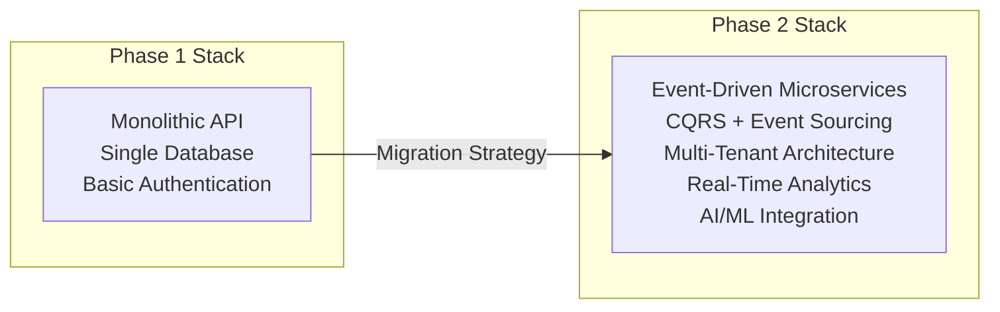

---

## 2. System Context - C4 Level 1

### 2.1 System Context Diagram

```mermaid
graph TB
    subgraph "Basketball League Platform Ecosystem"
        PLATFORM[Basketball League<br/>Management Platform<br/>Phase 2]
    end
    
    subgraph "Primary Users"
        ADMIN[League<br/>Administrators<br/>100+]
        COACH[Team Coaches<br/>500+]
        PARENT[Parents<br/>5,000+]
        PLAYER[Youth Players<br/>10,000+]
        REF[Referees<br/>200+]
        SCORE[Scorekeepers<br/>300+]
    end
    
    subgraph "External Systems - Payments"
        STRIPE[Stripe API<br/>Payment Processing]
        PAYPAL[PayPal<br/>Alternative Payments]
        DWOLLA[Dwolla<br/>ACH Transfers]
    end
    
    subgraph "External Systems - Communication"
        SENDGRID[SendGrid<br/>Email Service]
        TWILIO[Twilio<br/>SMS/Voice]
        FIREBASE[Firebase<br/>Push Notifications]
        SLACK[Slack API<br/>Team Communication]
    end
    
    subgraph "External Systems - Analytics & AI"
        OPENAI[OpenAI API<br/>AI Features]
        MIXPANEL[Mixpanel<br/>Product Analytics]
        SEGMENT[Segment<br/>Customer Data Platform]
        DATADOG[Datadog<br/>APM & Monitoring]
    end
    
    subgraph "External Systems - Integration"
        GOOGLE[Google Workspace<br/>Calendar, Drive, Maps]
        MICROSOFT[Microsoft 365<br/>Calendar, Teams]
        ZOOM[Zoom<br/>Video Conferences]
        WEATHER[Weather APIs<br/>Heat Safety]
    end
    
    subgraph "External Systems - Content"
        CLOUDINARY[Cloudinary<br/>Media Management]
        ALGOLIA[Algolia<br/>Search Service]
        CDN[AWS CloudFront<br/>Content Delivery]
    end
    
    %% User interactions
    ADMIN -->|Manages leagues,<br/>tournaments, compliance| PLATFORM
    COACH -->|Team management,<br/>statistics, communication| PLATFORM
    PARENT -->|Registration, payments,<br/>schedules, communication| PLATFORM
    PLAYER -->|Profiles, statistics,<br/>achievements, social| PLATFORM
    REF -->|Game management,<br/>officiating tools| PLATFORM
    SCORE -->|Live scoring,<br/>statistics entry| PLATFORM
    
    %% System integrations
    PLATFORM -->|Process payments<br/>handle subscriptions| STRIPE
    PLATFORM -->|Alternative payment<br/>methods| PAYPAL
    PLATFORM -->|Direct bank<br/>transfers| DWOLLA
    
    PLATFORM -->|Transactional<br/>emails| SENDGRID
    PLATFORM -->|SMS notifications<br/>emergency alerts| TWILIO
    PLATFORM -->|Mobile push<br/>notifications| FIREBASE
    PLATFORM -->|Team communication<br/>channels| SLACK
    
    PLATFORM -->|AI-powered features<br/>content generation| OPENAI
    PLATFORM -->|User behavior<br/>analytics| MIXPANEL
    PLATFORM -->|Customer data<br/>unification| SEGMENT
    PLATFORM -->|System monitoring<br/>performance tracking| DATADOG
    
    PLATFORM -->|Calendar sync<br/>document storage| GOOGLE
    PLATFORM -->|Enterprise<br/>integration| MICROSOFT
    PLATFORM -->|Virtual meetings<br/>remote coaching| ZOOM
    PLATFORM -->|Weather data<br/>safety alerts| WEATHER
    
    PLATFORM -->|Media optimization<br/>image processing| CLOUDINARY
    PLATFORM -->|Advanced search<br/>recommendations| ALGOLIA
    PLATFORM -->|Global content<br/>delivery| CDN
    
    style PLATFORM fill:#ff6b35
    style ADMIN fill:#4ecdc4
    style COACH fill:#45b7d1
    style PARENT fill:#96ceb4
    style PLAYER fill:#ffeaa7
    style REF fill:#dda0dd
    style SCORE fill:#ff7675
```

### 2.2 System Boundaries and Responsibilities

| Boundary | Responsibility | Scale | SLA |
|----------|---------------|-------|-----|
| **Core Platform** | League management, game operations | 100,000+ users | 99.9% uptime |
| **Payment Processing** | Secure transactions, subscription management | $10M+ annual | 99.99% uptime |
| **Communication Hub** | Multi-channel messaging, notifications | 1M+ messages/day | 99.5% delivery |
| **Analytics Engine** | Real-time insights, predictive analytics | 100GB+ data/day | 99% accuracy |
| **Content Delivery** | Global media distribution, edge caching | 10TB+ monthly | <100ms latency |

### 2.3 External System Dependencies

| System | Criticality | Fallback Strategy | SLA Requirement |
|--------|-------------|-------------------|-----------------|
| **Stripe** | Critical | PayPal backup | 99.99% uptime |
| **SendGrid** | High | SMTP fallback | 99.9% delivery |
| **Firebase** | High | In-app notifications | 99.5% delivery |
| **AWS Services** | Critical | Multi-region deployment | 99.95% uptime |
| **OpenAI** | Medium | Cached responses | 99% availability |
| **Weather APIs** | Critical | Multiple providers | 99.9% uptime |

---

## 3. Container Architecture - C4 Level 2

### 3.1 High-Level Container Diagram

```mermaid
graph TB
    subgraph "Client Layer"
        WEB[Web Application<br/>Next.js 14 + React<br/>PWA Enabled]
        MOBILE_IOS[iOS Application<br/>React Native + Expo<br/>Offline-First]
        MOBILE_ANDROID[Android Application<br/>React Native + Expo<br/>Offline-First]
        ADMIN_PORTAL[Admin Portal<br/>Next.js + Tailwind<br/>Advanced Analytics]
    end
    
    subgraph "API Gateway Layer"
        APIGW[API Gateway<br/>Kong + AWS ALB<br/>Rate Limiting + Auth]
        GRAPHQL[GraphQL Gateway<br/>Apollo Federation<br/>Schema Stitching]
        WEBSOCKET[WebSocket Gateway<br/>Socket.io Cluster<br/>Real-time Events]
    end
    
    subgraph "Authentication & Authorization"
        AUTH0[Auth0<br/>Identity Provider<br/>Multi-tenant]
        COGNITO[AWS Cognito<br/>User Pools<br/>Backup Auth]
        RBAC[RBAC Service<br/>Fine-grained Permissions<br/>Policy Engine]
    end
    
    subgraph "Core Business Services"
        USER_SVC[User Service<br/>Node.js + TypeScript<br/>User Management]
        LEAGUE_SVC[League Service<br/>Node.js + TypeScript<br/>League Operations]
        GAME_SVC[Game Service<br/>Node.js + TypeScript<br/>Game Management]
        SCHEDULE_SVC[Scheduling Service<br/>Python + FastAPI<br/>AI Optimization]
        PAYMENT_SVC[Payment Service<br/>Node.js + TypeScript<br/>Multi-provider]
        COMM_SVC[Communication Service<br/>Node.js + TypeScript<br/>Multi-channel]
    end
    
    subgraph "Analytics & Intelligence Services"
        ANALYTICS_SVC[Analytics Service<br/>Python + Pandas<br/>Real-time Processing]
        ML_SVC[ML Service<br/>Python + TensorFlow<br/>Predictions & Insights]
        REPORTING_SVC[Reporting Service<br/>Node.js + TypeScript<br/>Custom Reports]
        SEARCH_SVC[Search Service<br/>Elasticsearch<br/>Full-text Search]
    end
    
    subgraph "Supporting Services"
        NOTIFICATION_SVC[Notification Service<br/>Node.js + Bull Queue<br/>Multi-channel Delivery]
        FILE_SVC[File Service<br/>Node.js + Sharp<br/>Media Processing]
        AUDIT_SVC[Audit Service<br/>Go + NATS<br/>Event Logging]
        CONFIG_SVC[Configuration Service<br/>Node.js + TypeScript<br/>Feature Flags]
    end
    
    subgraph "Data Layer"
        POSTGRES_PRIMARY[(PostgreSQL Primary<br/>RDS Multi-AZ<br/>Auto-scaling)]
        POSTGRES_REPLICA[(PostgreSQL Replicas<br/>Read Scaling<br/>Analytics Queries)]
        REDIS_CLUSTER[(Redis Cluster<br/>ElastiCache<br/>Session + Cache)]
        ELASTICSEARCH[(Elasticsearch<br/>AWS OpenSearch<br/>Search + Analytics)]
        S3_BUCKET[(AWS S3<br/>Multi-region<br/>Media + Documents)]
        DYNAMODB[(DynamoDB<br/>Event Store<br/>High-throughput)]
    end
    
    subgraph "Event Streaming"
        EVENTBRIDGE[AWS EventBridge<br/>Event Router<br/>Schema Registry]
        KINESIS[AWS Kinesis<br/>Real-time Streams<br/>Analytics Pipeline]
        SQS[AWS SQS<br/>Message Queues<br/>Reliability]
        SNS[AWS SNS<br/>Pub/Sub<br/>Fan-out]
    end
    
    subgraph "External Integrations"
        STRIPE_INT[Stripe Integration<br/>Payment Processing]
        SENDGRID_INT[SendGrid Integration<br/>Email Delivery]
        OPENAI_INT[OpenAI Integration<br/>AI Features]
        WEATHER_INT[Weather Integration<br/>Safety Monitoring]
    end
    
    %% Client connections
    WEB --> APIGW
    MOBILE_IOS --> APIGW
    MOBILE_ANDROID --> APIGW
    ADMIN_PORTAL --> APIGW
    
    WEB --> WEBSOCKET
    MOBILE_IOS --> WEBSOCKET
    MOBILE_ANDROID --> WEBSOCKET
    
    %% API Gateway routing
    APIGW --> AUTH0
    APIGW --> GRAPHQL
    APIGW --> USER_SVC
    APIGW --> LEAGUE_SVC
    APIGW --> GAME_SVC
    APIGW --> PAYMENT_SVC
    APIGW --> COMM_SVC
    
    %% GraphQL Federation
    GRAPHQL --> USER_SVC
    GRAPHQL --> LEAGUE_SVC
    GRAPHQL --> GAME_SVC
    GRAPHQL --> ANALYTICS_SVC
    
    %% Authentication flow
    AUTH0 --> RBAC
    COGNITO --> RBAC
    
    %% Core service data access
    USER_SVC --> POSTGRES_PRIMARY
    USER_SVC --> REDIS_CLUSTER
    LEAGUE_SVC --> POSTGRES_PRIMARY
    LEAGUE_SVC --> REDIS_CLUSTER
    GAME_SVC --> POSTGRES_PRIMARY
    GAME_SVC --> REDIS_CLUSTER
    GAME_SVC --> DYNAMODB
    SCHEDULE_SVC --> POSTGRES_REPLICA
    SCHEDULE_SVC --> ML_SVC
    PAYMENT_SVC --> POSTGRES_PRIMARY
    PAYMENT_SVC --> STRIPE_INT
    
    %% Analytics and search
    ANALYTICS_SVC --> POSTGRES_REPLICA
    ANALYTICS_SVC --> ELASTICSEARCH
    ANALYTICS_SVC --> KINESIS
    ML_SVC --> POSTGRES_REPLICA
    ML_SVC --> S3_BUCKET
    SEARCH_SVC --> ELASTICSEARCH
    REPORTING_SVC --> POSTGRES_REPLICA
    
    %% Supporting services
    NOTIFICATION_SVC --> SNS
    NOTIFICATION_SVC --> SQS
    NOTIFICATION_SVC --> SENDGRID_INT
    FILE_SVC --> S3_BUCKET
    AUDIT_SVC --> DYNAMODB
    CONFIG_SVC --> REDIS_CLUSTER
    
    %% Event streaming
    USER_SVC --> EVENTBRIDGE
    LEAGUE_SVC --> EVENTBRIDGE
    GAME_SVC --> EVENTBRIDGE
    PAYMENT_SVC --> EVENTBRIDGE
    EVENTBRIDGE --> KINESIS
    EVENTBRIDGE --> SNS
    KINESIS --> ANALYTICS_SVC
    
    %% External integrations
    SCHEDULE_SVC --> WEATHER_INT
    COMM_SVC --> OPENAI_INT
    
    style WEB fill:#61dafb
    style MOBILE_IOS fill:#007aff
    style MOBILE_ANDROID fill:#3ddc84
    style APIGW fill:#ff6b35
    style POSTGRES_PRIMARY fill:#336791
    style REDIS_CLUSTER fill:#dc382d
    style EVENTBRIDGE fill:#ff9900
```

### 3.2 Container Deployment Strategy

| Container | Deployment Target | Scaling Strategy | Resource Allocation |
|-----------|------------------|------------------|-------------------|
| **Web Application** | AWS Amplify | Edge scaling | Serverless |
| **Mobile Apps** | App Stores + CodePush | OTA updates | Client-side |
| **API Gateway** | AWS ALB + Kong | Auto-scaling | 2-20 instances |
| **Business Services** | EKS Fargate | HPA + VPA | 1-50 pods each |
| **Analytics Services** | EKS Fargate | Custom metrics | 2-100 pods |
| **Data Layer** | Managed Services | Auto-scaling | AWS-managed |

### 3.3 Inter-Container Communication

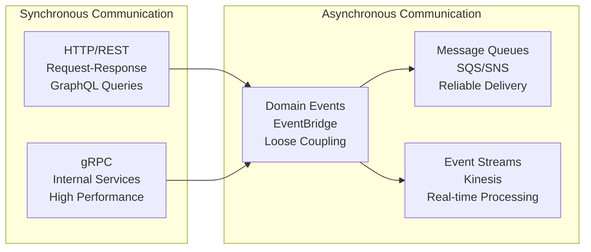

---

## 4. Component Architecture - C4 Level 3

### 4.1 Game Service Component Diagram

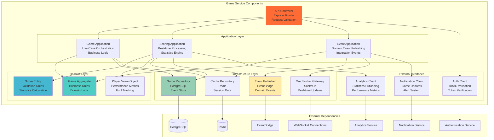

### 4.2 Component Design Patterns

| Component Type | Pattern | Responsibility | Example |
|---------------|---------|----------------|---------|
| **Controllers** | MVC Controller | HTTP request handling | GameController |
| **Applications** | Application Service | Use case orchestration | GameApplicationService |
| **Domain** | Domain Model | Business logic | GameAggregate |
| **Repositories** | Repository Pattern | Data persistence | GameRepository |
| **Publishers** | Observer Pattern | Event broadcasting | DomainEventPublisher |
| **Clients** | Adapter Pattern | External integration | AuthenticationClient |

### 4.3 Component Interaction Patterns

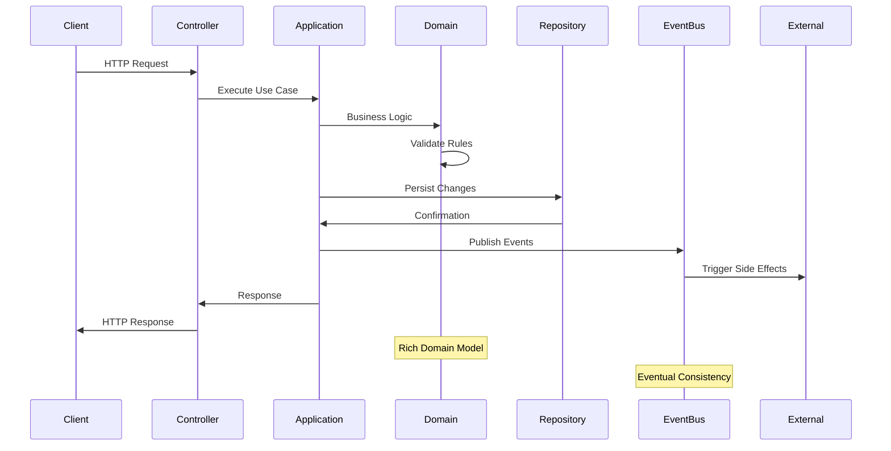

---

## 5. Code Architecture - C4 Level 4

### 5.1 Domain Model Code Structure

```typescript
// Domain Layer - Game Aggregate
export class Game {
  private constructor(
    private readonly id: GameId,
    private readonly homeTeam: TeamId,
    private readonly awayTeam: TeamId,
    private schedule: GameSchedule,
    private status: GameStatus,
    private score: GameScore,
    private events: GameEvent[]
  ) {}
  
  // Factory method
  static schedule(
    homeTeam: TeamId,
    awayTeam: TeamId,
    schedule: GameSchedule
  ): Game {
    const game = new Game(
      GameId.generate(),
      homeTeam,
      awayTeam,
      schedule,
      GameStatus.SCHEDULED,
      GameScore.zero(),
      []
    );
    
    game.addEvent(
      new GameScheduledEvent(game.id, homeTeam, awayTeam, schedule)
    );
    
    return game;
  }
  
  // Business methods
  public start(referee: RefereeId, scorekeeper: ScorekeepeId): void {
    this.ensureCanStart();
    this.status = GameStatus.IN_PROGRESS;
    this.addEvent(new GameStartedEvent(this.id, referee, scorekeeper));
  }
  
  public recordScore(
    team: TeamId, 
    player: PlayerId, 
    points: Points,
    timestamp: GameTime
  ): void {
    this.ensureInProgress();
    this.ensureValidTeam(team);
    
    const scoreEvent = new ScoreEvent(team, player, points, timestamp);
    this.score = this.score.add(scoreEvent);
    this.events.push(scoreEvent);
    
    this.addEvent(new ScoreRecordedEvent(this.id, scoreEvent));
  }
  
  public finish(): void {
    this.ensureInProgress();
    this.status = GameStatus.COMPLETED;
    this.addEvent(new GameCompletedEvent(this.id, this.score));
  }
  
  // Invariant enforcement
  private ensureCanStart(): void {
    if (!this.status.equals(GameStatus.SCHEDULED)) {
      throw new GameInvalidStateError('Game must be scheduled to start');
    }
  }
  
  private ensureInProgress(): void {
    if (!this.status.equals(GameStatus.IN_PROGRESS)) {
      throw new GameInvalidStateError('Game must be in progress');
    }
  }
  
  private ensureValidTeam(team: TeamId): void {
    if (!team.equals(this.homeTeam) && !team.equals(this.awayTeam)) {
      throw new InvalidTeamError('Team not participating in this game');
    }
  }
  
  // Event handling
  private addEvent(event: DomainEvent): void {
    DomainEventPublisher.publish(event);
  }
}

// Value Objects
export class GameScore {
  constructor(
    private readonly homeScore: number,
    private readonly awayScore: number
  ) {
    this.ensureNonNegative(homeScore);
    this.ensureNonNegative(awayScore);
  }
  
  static zero(): GameScore {
    return new GameScore(0, 0);
  }
  
  add(scoreEvent: ScoreEvent): GameScore {
    const { team, points } = scoreEvent;
    return team.equals(this.homeTeam)
      ? new GameScore(this.homeScore + points.value, this.awayScore)
      : new GameScore(this.homeScore, this.awayScore + points.value);
  }
  
  private ensureNonNegative(score: number): void {
    if (score < 0) {
      throw new InvalidScoreError('Score cannot be negative');
    }
  }
}

// Application Service
export class GameApplicationService {
  constructor(
    private readonly gameRepository: GameRepository,
    private readonly teamRepository: TeamRepository,
    private readonly eventBus: EventBus
  ) {}
  
  async startGame(command: StartGameCommand): Promise<void> {
    const game = await this.gameRepository.findById(command.gameId);
    
    if (!game) {
      throw new GameNotFoundError(command.gameId);
    }
    
    // Business logic delegation
    game.start(command.refereeId, command.scorekeeperId);
    
    // Persistence
    await this.gameRepository.save(game);
    
    // Event publishing (handled by domain)
    await this.eventBus.publishAll(game.getUncommittedEvents());
  }
  
  async recordScore(command: RecordScoreCommand): Promise<void> {
    await this.executeInTransaction(async () => {
      const game = await this.gameRepository.findById(command.gameId);
      
      if (!game) {
        throw new GameNotFoundError(command.gameId);
      }
      
      game.recordScore(
        command.teamId,
        command.playerId,
        command.points,
        command.timestamp
      );
      
      await this.gameRepository.save(game);
      await this.eventBus.publishAll(game.getUncommittedEvents());
    });
  }
}

// Infrastructure - Repository Implementation
export class PostgreSQLGameRepository implements GameRepository {
  constructor(
    private readonly connection: DatabaseConnection,
    private readonly eventStore: EventStore
  ) {}
  
  async findById(id: GameId): Promise<Game | null> {
    // Event Sourcing approach
    const events = await this.eventStore.getEvents(id.value);
    
    if (events.length === 0) {
      return null;
    }
    
    return Game.fromHistory(events);
  }
  
  async save(game: Game): Promise<void> {
    const events = game.getUncommittedEvents();
    
    await this.connection.transaction(async (tx) => {
      // Save events to event store
      await this.eventStore.saveEvents(game.id.value, events, tx);
      
      // Update read model
      await this.updateReadModel(game, tx);
    });
    
    game.markEventsAsCommitted();
  }
  
  private async updateReadModel(game: Game, tx: Transaction): Promise<void> {
    const readModel = GameReadModelMapper.fromDomain(game);
    
    await tx.query(
      'INSERT INTO games_read_model (id, home_team, away_team, status, score, updated_at) VALUES ($1, $2, $3, $4, $5, $6) ON CONFLICT (id) DO UPDATE SET status = $4, score = $5, updated_at = $6',
      [readModel.id, readModel.homeTeam, readModel.awayTeam, readModel.status, readModel.score, new Date()]
    );
  }
}
```

### 5.2 CQRS Implementation

```typescript
// Command Side - Write Model
export interface CommandHandler<T> {
  handle(command: T): Promise<void>;
}

export class StartGameCommandHandler implements CommandHandler<StartGameCommand> {
  constructor(
    private readonly gameRepository: GameRepository,
    private readonly eventBus: EventBus
  ) {}
  
  async handle(command: StartGameCommand): Promise<void> {
    const game = await this.gameRepository.findById(command.gameId);
    
    if (!game) {
      throw new GameNotFoundError(command.gameId);
    }
    
    game.start(command.refereeId, command.scorekeeperId);
    
    await this.gameRepository.save(game);
    await this.eventBus.publishAll(game.getUncommittedEvents());
  }
}

// Query Side - Read Model
export interface QueryHandler<T, R> {
  handle(query: T): Promise<R>;
}

export class GetGameQueryHandler implements QueryHandler<GetGameQuery, GameReadModel> {
  constructor(
    private readonly readModelRepository: GameReadModelRepository
  ) {}
  
  async handle(query: GetGameQuery): Promise<GameReadModel> {
    const game = await this.readModelRepository.findById(query.gameId);
    
    if (!game) {
      throw new GameNotFoundError(query.gameId);
    }
    
    return game;
  }
}

// Event Handlers for Read Model Updates
export class GameEventHandler {
  constructor(
    private readonly readModelRepository: GameReadModelRepository
  ) {}
  
  @EventHandler(GameStartedEvent)
  async on(event: GameStartedEvent): Promise<void> {
    await this.readModelRepository.updateStatus(event.gameId, 'IN_PROGRESS');
  }
  
  @EventHandler(ScoreRecordedEvent)
  async on(event: ScoreRecordedEvent): Promise<void> {
    await this.readModelRepository.updateScore(event.gameId, event.score);
  }
  
  @EventHandler(GameCompletedEvent)
  async on(event: GameCompletedEvent): Promise<void> {
    await this.readModelRepository.updateStatus(event.gameId, 'COMPLETED');
  }
}
```

### 5.3 Clean Architecture Layers

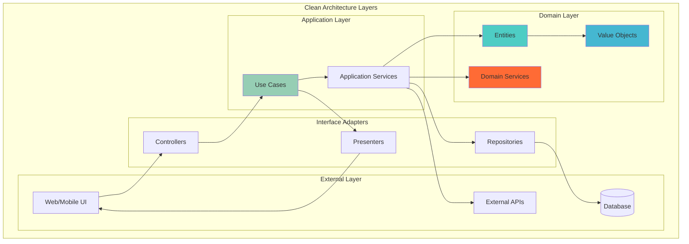

---

## 6. Event-Driven Architecture

### 6.1 Domain Events Design

```mermaid
graph TB
    subgraph "Domain Events Hierarchy"
        DOMAIN_EVENT[DomainEvent<br/>Base Class]
        
        subgraph "Game Events"
            GAME_SCHEDULED[GameScheduled]
            GAME_STARTED[GameStarted]
            SCORE_RECORDED[ScoreRecorded]
            FOUL_COMMITTED[FoulCommitted]
            GAME_COMPLETED[GameCompleted]
        end
        
        subgraph "League Events"
            LEAGUE_CREATED[LeagueCreated]
            TEAM_REGISTERED[TeamRegistered]
            SEASON_STARTED[SeasonStarted]
            SEASON_COMPLETED[SeasonCompleted]
        end
        
        subgraph "User Events"
            USER_REGISTERED[UserRegistered]
            PROFILE_UPDATED[ProfileUpdated]
            CONSENT_GRANTED[ConsentGranted]
        end
        
        subgraph "Payment Events"
            PAYMENT_PROCESSED[PaymentProcessed]
            REFUND_ISSUED[RefundIssued]
            SUBSCRIPTION_UPDATED[SubscriptionUpdated]
        end
    end
    
    subgraph "Event Processing"
        EVENT_BUS[EventBridge<br/>Event Router]
        
        subgraph "Event Handlers"
            ANALYTICS_HANDLER[Analytics Handler]
            NOTIFICATION_HANDLER[Notification Handler]
            AUDIT_HANDLER[Audit Handler]
            INTEGRATION_HANDLER[Integration Handler]
        end
        
        subgraph "Event Stores"
            EVENT_STORE[(Event Store<br/>DynamoDB)]
            READ_MODEL[(Read Models<br/>PostgreSQL)]
            SEARCH_INDEX[(Search Index<br/>Elasticsearch)]
        end
    end
    
    %% Event inheritance
    DOMAIN_EVENT --> GAME_SCHEDULED
    DOMAIN_EVENT --> GAME_STARTED
    DOMAIN_EVENT --> SCORE_RECORDED
    DOMAIN_EVENT --> FOUL_COMMITTED
    DOMAIN_EVENT --> GAME_COMPLETED
    
    DOMAIN_EVENT --> LEAGUE_CREATED
    DOMAIN_EVENT --> TEAM_REGISTERED
    DOMAIN_EVENT --> SEASON_STARTED
    DOMAIN_EVENT --> SEASON_COMPLETED
    
    DOMAIN_EVENT --> USER_REGISTERED
    DOMAIN_EVENT --> PROFILE_UPDATED
    DOMAIN_EVENT --> CONSENT_GRANTED
    
    DOMAIN_EVENT --> PAYMENT_PROCESSED
    DOMAIN_EVENT --> REFUND_ISSUED
    DOMAIN_EVENT --> SUBSCRIPTION_UPDATED
    
    %% Event processing flow
    GAME_SCHEDULED --> EVENT_BUS
    SCORE_RECORDED --> EVENT_BUS
    USER_REGISTERED --> EVENT_BUS
    PAYMENT_PROCESSED --> EVENT_BUS
    
    EVENT_BUS --> ANALYTICS_HANDLER
    EVENT_BUS --> NOTIFICATION_HANDLER
    EVENT_BUS --> AUDIT_HANDLER
    EVENT_BUS --> INTEGRATION_HANDLER
    
    ANALYTICS_HANDLER --> READ_MODEL
    NOTIFICATION_HANDLER --> SEARCH_INDEX
    AUDIT_HANDLER --> EVENT_STORE
    INTEGRATION_HANDLER --> READ_MODEL
    
    style DOMAIN_EVENT fill:#ff6b35
    style EVENT_BUS fill:#4ecdc4
    style EVENT_STORE fill:#45b7d1
```

### 6.2 Event Sourcing Implementation

```typescript
// Event Store Interface
export interface EventStore {
  saveEvents(streamId: string, events: DomainEvent[], expectedVersion: number): Promise<void>;
  getEvents(streamId: string, fromVersion?: number): Promise<StoredEvent[]>;
  getAllEvents(fromPosition?: number): Promise<StoredEvent[]>;
}

// Event Sourcing Implementation
export class DynamoDBEventStore implements EventStore {
  constructor(private readonly dynamoDB: DynamoDBClient) {}
  
  async saveEvents(
    streamId: string, 
    events: DomainEvent[], 
    expectedVersion: number
  ): Promise<void> {
    const items = events.map((event, index) => ({
      StreamId: { S: streamId },
      Version: { N: (expectedVersion + index + 1).toString() },
      EventType: { S: event.constructor.name },
      EventData: { S: JSON.stringify(event) },
      Timestamp: { N: Date.now().toString() },
      EventId: { S: event.id }
    }));
    
    // Use conditional write to ensure optimistic concurrency
    const params = {
      TransactItems: items.map(item => ({
        Put: {
          TableName: 'EventStore',
          Item: item,
          ConditionExpression: 'attribute_not_exists(StreamId) AND attribute_not_exists(Version)'
        }
      }))
    };
    
    try {
      await this.dynamoDB.send(new TransactWriteItemsCommand(params));
    } catch (error) {
      if (error.name === 'ConditionalCheckFailedException') {
        throw new ConcurrencyError('Events already exist for this version');
      }
      throw error;
    }
  }
  
  async getEvents(streamId: string, fromVersion?: number): Promise<StoredEvent[]> {
    const params = {
      TableName: 'EventStore',
      KeyConditionExpression: 'StreamId = :streamId',
      ExpressionAttributeValues: {
        ':streamId': { S: streamId }
      }
    };
    
    if (fromVersion !== undefined) {
      params.KeyConditionExpression += ' AND Version > :fromVersion';
      params.ExpressionAttributeValues[':fromVersion'] = { N: fromVersion.toString() };
    }
    
    const result = await this.dynamoDB.send(new QueryCommand(params));
    
    return result.Items?.map(item => ({
      streamId: item.StreamId.S!,
      version: parseInt(item.Version.N!),
      eventType: item.EventType.S!,
      eventData: JSON.parse(item.EventData.S!),
      timestamp: parseInt(item.Timestamp.N!)
    })) || [];
  }
}

// Aggregate Root with Event Sourcing
export abstract class AggregateRoot {
  protected id: string;
  private version: number = 0;
  private uncommittedEvents: DomainEvent[] = [];
  
  protected addEvent(event: DomainEvent): void {
    this.uncommittedEvents.push(event);
    this.apply(event);
  }
  
  public getUncommittedEvents(): DomainEvent[] {
    return [...this.uncommittedEvents];
  }
  
  public markEventsAsCommitted(): void {
    this.version += this.uncommittedEvents.length;
    this.uncommittedEvents = [];
  }
  
  public static fromHistory<T extends AggregateRoot>(
    events: StoredEvent[],
    constructor: new () => T
  ): T {
    const aggregate = new constructor();
    
    events.forEach(event => {
      aggregate.apply(event.eventData);
      aggregate.version = event.version;
    });
    
    return aggregate;
  }
  
  protected abstract apply(event: DomainEvent): void;
  
  public getVersion(): number {
    return this.version;
  }
}
```

### 6.3 Event Processing Patterns

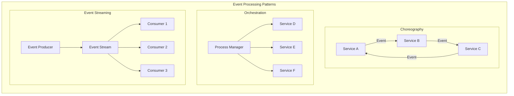

---

## 7. Multi-Tenant Architecture

### 7.1 Multi-Tenancy Strategy

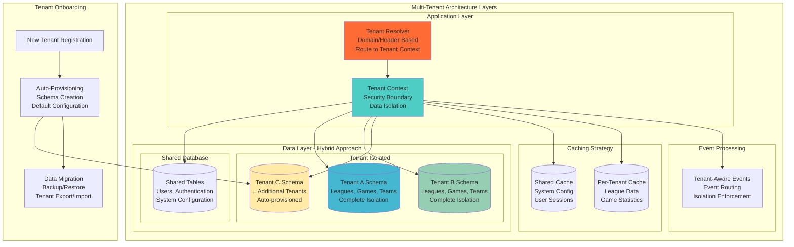

### 7.2 Tenant Isolation Strategies

| Isolation Level | Implementation | Pros | Cons | Use Case |
|----------------|---------------|------|------|---------|
| **Database per Tenant** | Separate RDS instances | Maximum isolation, Independent scaling | High cost, Complex management | Enterprise customers |
| **Schema per Tenant** | PostgreSQL schemas | Good isolation, Cost effective | Schema management complexity | Mid-market customers |
| **Row-Level Security** | Shared tables with tenant_id | Lowest cost, Simple management | Risk of data leakage | Small customers |
| **Hybrid Approach** | Mix based on tenant tier | Balanced cost/isolation | Complex implementation | Recommended approach |

### 7.3 Tenant Context Implementation

```typescript
// Tenant Context Management
export class TenantContext {
  private static instance: TenantContext;
  private tenantId: string | null = null;
  private tenantInfo: TenantInfo | null = null;
  
  private constructor() {}
  
  public static getInstance(): TenantContext {
    if (!TenantContext.instance) {
      TenantContext.instance = new TenantContext();
    }
    return TenantContext.instance;
  }
  
  public setTenant(tenantId: string, tenantInfo: TenantInfo): void {
    this.tenantId = tenantId;
    this.tenantInfo = tenantInfo;
  }
  
  public getTenantId(): string {
    if (!this.tenantId) {
      throw new Error('Tenant context not set');
    }
    return this.tenantId;
  }
  
  public getTenantInfo(): TenantInfo {
    if (!this.tenantInfo) {
      throw new Error('Tenant context not set');
    }
    return this.tenantInfo;
  }
  
  public clear(): void {
    this.tenantId = null;
    this.tenantInfo = null;
  }
}

// Tenant-Aware Repository
export class TenantAwareGameRepository implements GameRepository {
  constructor(
    private readonly connection: DatabaseConnection,
    private readonly tenantContext: TenantContext
  ) {}
  
  async findById(id: GameId): Promise<Game | null> {
    const tenantId = this.tenantContext.getTenantId();
    const schemaName = `tenant_${tenantId}`;
    
    const query = `
      SELECT * FROM ${schemaName}.games 
      WHERE id = $1
    `;
    
    const result = await this.connection.query(query, [id.value]);
    
    if (result.rows.length === 0) {
      return null;
    }
    
    return GameMapper.toDomain(result.rows[0]);
  }
  
  async save(game: Game): Promise<void> {
    const tenantId = this.tenantContext.getTenantId();
    const schemaName = `tenant_${tenantId}`;
    
    const gameData = GameMapper.toPersistence(game);
    
    const query = `
      INSERT INTO ${schemaName}.games (id, home_team, away_team, status, score, created_at)
      VALUES ($1, $2, $3, $4, $5, $6)
      ON CONFLICT (id) DO UPDATE SET 
        status = $4, score = $5, updated_at = NOW()
    `;
    
    await this.connection.query(query, [
      gameData.id,
      gameData.homeTeam,
      gameData.awayTeam,
      gameData.status,
      gameData.score,
      gameData.createdAt
    ]);
  }
}

// Tenant Resolver Middleware
export class TenantResolverMiddleware {
  constructor(
    private readonly tenantService: TenantService,
    private readonly tenantContext: TenantContext
  ) {}
  
  async resolve(req: Request, res: Response, next: NextFunction): Promise<void> {
    try {
      let tenantId: string;
      
      // Resolve tenant from various sources
      if (req.headers['x-tenant-id']) {
        tenantId = req.headers['x-tenant-id'] as string;
      } else if (req.subdomains.length > 0) {
        tenantId = req.subdomains[0];
      } else if (req.user?.tenantId) {
        tenantId = req.user.tenantId;
      } else {
        throw new TenantNotFoundError('Unable to resolve tenant');
      }
      
      // Load tenant information
      const tenantInfo = await this.tenantService.getTenantInfo(tenantId);
      
      if (!tenantInfo || !tenantInfo.isActive) {
        throw new TenantNotFoundError(`Tenant ${tenantId} not found or inactive`);
      }
      
      // Set tenant context
      this.tenantContext.setTenant(tenantId, tenantInfo);
      
      // Add cleanup
      res.on('finish', () => {
        this.tenantContext.clear();
      });
      
      next();
    } catch (error) {
      res.status(400).json({ 
        error: 'Invalid tenant',
        message: error.message 
      });
    }
  }
}

// Tenant Provisioning Service
export class TenantProvisioningService {
  constructor(
    private readonly databaseManager: DatabaseManager,
    private readonly cacheManager: CacheManager,
    private readonly eventBus: EventBus
  ) {}
  
  async provisionTenant(tenantRequest: TenantProvisionRequest): Promise<TenantInfo> {
    const tenantId = this.generateTenantId(tenantRequest.organizationName);
    
    try {
      // Create database schema
      await this.createTenantSchema(tenantId);
      
      // Initialize default data
      await this.seedDefaultData(tenantId, tenantRequest);
      
      // Setup caching
      await this.initializeTenantCache(tenantId);
      
      // Create tenant record
      const tenantInfo = await this.createTenantRecord(tenantId, tenantRequest);
      
      // Publish tenant created event
      await this.eventBus.publish(new TenantCreatedEvent(tenantId, tenantInfo));
      
      return tenantInfo;
    } catch (error) {
      // Rollback on failure
      await this.rollbackTenantProvisioning(tenantId);
      throw error;
    }
  }
  
  private async createTenantSchema(tenantId: string): Promise<void> {
    const schemaName = `tenant_${tenantId}`;
    
    await this.databaseManager.createSchema(schemaName);
    await this.databaseManager.executeMigrations(schemaName);
    await this.databaseManager.setupPermissions(schemaName);
  }
  
  private async seedDefaultData(
    tenantId: string, 
    request: TenantProvisionRequest
  ): Promise<void> {
    const schemaName = `tenant_${tenantId}`;
    
    // Create default league configurations
    await this.databaseManager.seedData(schemaName, {
      defaultRules: request.sportType || 'basketball',
      ageDivisions: request.ageDivisions || ['U8', 'U10', 'U12', 'U14', 'U16', 'U18'],
      seasonSettings: request.seasonSettings || {}
    });
  }
}
```

---

## 8. Real-Time Processing Architecture

### 8.1 Real-Time Data Pipeline

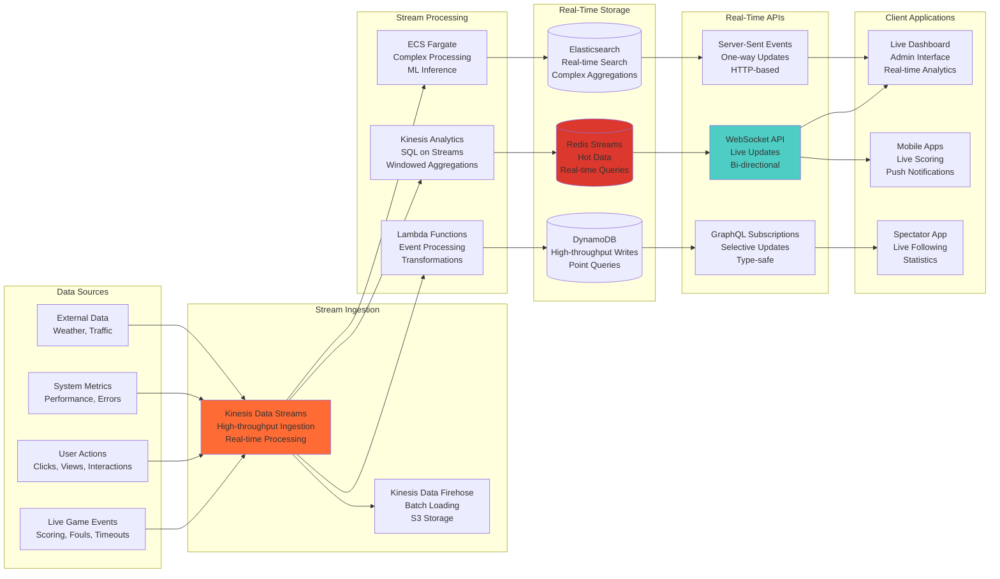

### 8.2 WebSocket Architecture

```typescript
// WebSocket Server Implementation
export class GameWebSocketServer {
  private io: Server;
  private redisAdapter: RedisAdapter;
  private authMiddleware: AuthMiddleware;
  
  constructor() {
    this.io = new Server({
      cors: {
        origin: process.env.ALLOWED_ORIGINS?.split(','),
        methods: ['GET', 'POST']
      },
      transports: ['websocket', 'polling']
    });
    
    this.setupRedisAdapter();
    this.setupAuthentication();
    this.setupEventHandlers();
  }
  
  private setupRedisAdapter(): void {
    const redisClient = new Redis({
      host: process.env.REDIS_HOST,
      port: parseInt(process.env.REDIS_PORT || '6379'),
      retryDelayOnFailover: 100,
      maxRetriesPerRequest: 3
    });
    
    this.redisAdapter = createAdapter(redisClient, redisClient.duplicate());
    this.io.adapter(this.redisAdapter);
  }
  
  private setupAuthentication(): void {
    this.authMiddleware = new AuthMiddleware();
    
    this.io.use(async (socket, next) => {
      try {
        const token = socket.handshake.auth.token;
        const user = await this.authMiddleware.validateToken(token);
        
        socket.userId = user.id;
        socket.tenantId = user.tenantId;
        socket.roles = user.roles;
        
        next();
      } catch (error) {
        next(new Error('Authentication failed'));
      }
    });
  }
  
  private setupEventHandlers(): void {
    this.io.on('connection', (socket) => {
      console.log(`User connected: ${socket.userId}`);
      
      // Join tenant-specific room
      socket.join(`tenant:${socket.tenantId}`);
      
      // Handle game subscriptions
      socket.on('join-game', async (gameId: string) => {
        try {
          await this.validateGameAccess(socket, gameId);
          socket.join(`game:${gameId}`);
          
          // Send current game state
          const gameState = await this.gameStateService.getCurrentState(gameId);
          socket.emit('game-state', gameState);
        } catch (error) {
          socket.emit('error', { message: 'Access denied' });
        }
      });
      
      // Handle live scoring (scorekeeper only)
      socket.on('record-score', async (data: ScoreEvent) => {
        try {
          await this.validateScorekeeperRole(socket, data.gameId);
          await this.gameService.recordScore(data);
          
          // Broadcast to all game subscribers
          this.io.to(`game:${data.gameId}`).emit('score-update', data);
        } catch (error) {
          socket.emit('error', { message: error.message });
        }
      });
      
      // Handle disconnection
      socket.on('disconnect', () => {
        console.log(`User disconnected: ${socket.userId}`);
      });
    });
  }
  
  public broadcastGameUpdate(gameId: string, update: GameUpdate): void {
    this.io.to(`game:${gameId}`).emit('game-update', update);
  }
  
  public broadcastTenantAnnouncement(tenantId: string, announcement: Announcement): void {
    this.io.to(`tenant:${tenantId}`).emit('announcement', announcement);
  }
  
  private async validateGameAccess(socket: AuthenticatedSocket, gameId: string): Promise<void> {
    const hasAccess = await this.gameAccessService.validateAccess(
      socket.userId,
      socket.tenantId,
      gameId,
      socket.roles
    );
    
    if (!hasAccess) {
      throw new Error('Access denied to game');
    }
  }
  
  private async validateScorekeeperRole(socket: AuthenticatedSocket, gameId: string): Promise<void> {
    const isScorekeeper = await this.gameService.isDesignatedScorekeeper(
      socket.userId,
      gameId
    );
    
    if (!isScorekeeper) {
      throw new Error('Only designated scorekeepers can record scores');
    }
  }
}

// Real-time Game State Management
export class GameStateService {
  constructor(
    private readonly redis: Redis,
    private readonly gameRepository: GameRepository,
    private readonly eventStore: EventStore
  ) {}
  
  async getCurrentState(gameId: string): Promise<GameState> {
    // Try cache first
    const cachedState = await this.redis.get(`game:state:${gameId}`);
    
    if (cachedState) {
      return JSON.parse(cachedState);
    }
    
    // Rebuild from events
    const events = await this.eventStore.getEvents(gameId);
    const gameState = this.buildStateFromEvents(events);
    
    // Cache for 30 seconds
    await this.redis.setex(`game:state:${gameId}`, 30, JSON.stringify(gameState));
    
    return gameState;
  }
  
  async updateState(gameId: string, event: GameEvent): Promise<void> {
    // Get current state
    const currentState = await this.getCurrentState(gameId);
    
    // Apply event
    const newState = this.applyEvent(currentState, event);
    
    // Update cache
    await this.redis.setex(`game:state:${gameId}`, 30, JSON.stringify(newState));
    
    // Publish to subscribers
    await this.publishStateUpdate(gameId, newState);
  }
  
  private buildStateFromEvents(events: GameEvent[]): GameState {
    return events.reduce((state, event) => {
      return this.applyEvent(state, event);
    }, GameState.initial());
  }
  
  private applyEvent(state: GameState, event: GameEvent): GameState {
    switch (event.type) {
      case 'SCORE_RECORDED':
        return state.withScore(event.team, event.points);
      
      case 'FOUL_COMMITTED':
        return state.withFoul(event.team, event.player);
      
      case 'GAME_STARTED':
        return state.withStatus('IN_PROGRESS');
      
      case 'GAME_COMPLETED':
        return state.withStatus('COMPLETED');
      
      default:
        return state;
    }
  }
  
  private async publishStateUpdate(gameId: string, state: GameState): Promise<void> {
    await this.redis.publish(`game:updates:${gameId}`, JSON.stringify(state));
  }
}
```

### 8.3 Stream Processing Implementation

```typescript
// Kinesis Stream Processor
export class GameEventsStreamProcessor {
  constructor(
    private readonly analyticsService: AnalyticsService,
    private readonly notificationService: NotificationService,
    private readonly mlService: MLService
  ) {}
  
  async processRecord(record: KinesisStreamRecord): Promise<void> {
    try {
      const event = JSON.parse(record.data) as GameEvent;
      
      // Process in parallel for different use cases
      await Promise.all([
        this.updateAnalytics(event),
        this.sendNotifications(event),
        this.updateMLModels(event)
      ]);
    } catch (error) {
      console.error('Failed to process stream record:', error);
      
      // Send to dead letter queue for retry
      await this.sendToDeadLetterQueue(record, error);
    }
  }
  
  private async updateAnalytics(event: GameEvent): Promise<void> {
    switch (event.type) {
      case 'SCORE_RECORDED':
        await this.analyticsService.updatePlayerStats(event);
        await this.analyticsService.updateTeamStats(event);
        await this.analyticsService.updateLeagueStats(event);
        break;
        
      case 'GAME_COMPLETED':
        await this.analyticsService.updateStandings(event);
        await this.analyticsService.calculateAdvancedStats(event);
        break;
    }
  }
  
  private async sendNotifications(event: GameEvent): Promise<void> {
    const notificationRules = await this.getNotificationRules(event.gameId);
    
    for (const rule of notificationRules) {
      if (this.shouldTriggerNotification(rule, event)) {
        await this.notificationService.send({
          type: rule.notificationType,
          recipients: rule.recipients,
          message: this.buildNotificationMessage(rule, event),
          channels: rule.channels
        });
      }
    }
  }
  
  private async updateMLModels(event: GameEvent): Promise<void> {
    // Update player performance model
    if (event.type === 'SCORE_RECORDED' || event.type === 'FOUL_COMMITTED') {
      await this.mlService.updatePlayerModel(event.playerId, event);
    }
    
    // Update game outcome prediction model
    if (event.type === 'GAME_COMPLETED') {
      await this.mlService.updateGamePredictionModel(event);
    }
  }
}

// Real-time Analytics Aggregation
export class RealTimeAnalytics {
  constructor(
    private readonly redis: Redis,
    private readonly elasticsearch: Client
  ) {}
  
  async aggregateGameStatistics(gameId: string, event: GameEvent): Promise<void> {
    const pipeline = this.redis.pipeline();
    const timestamp = Date.now();
    const minute = Math.floor(timestamp / 60000) * 60000; // Round to minute
    
    switch (event.type) {
      case 'SCORE_RECORDED':
        // Update real-time score
        pipeline.hset(`game:${gameId}:score`, event.team, event.totalScore);
        
        // Update scoring timeline
        pipeline.zadd(
          `game:${gameId}:timeline`,
          timestamp,
          JSON.stringify({
            type: 'SCORE',
            team: event.team,
            player: event.player,
            points: event.points
          })
        );
        
        // Update player stats
        pipeline.hincrby(`player:${event.playerId}:stats`, 'points', event.points);
        pipeline.hincrby(`player:${event.playerId}:stats`, 'games', 1);
        
        // Update team stats
        pipeline.hincrby(`team:${event.teamId}:stats`, 'points', event.points);
        
        // Update minute-by-minute stats
        pipeline.hincrby(`game:${gameId}:minute:${minute}`, 'points', event.points);
        
        break;
        
      case 'FOUL_COMMITTED':
        // Update foul counts
        pipeline.hincrby(`player:${event.playerId}:stats`, 'fouls', 1);
        pipeline.hincrby(`team:${event.teamId}:stats`, 'fouls', 1);
        
        break;
    }
    
    // Set expiration on temporary keys
    pipeline.expire(`game:${gameId}:minute:${minute}`, 86400); // 24 hours
    
    await pipeline.exec();
    
    // Update search index for complex queries
    await this.updateElasticsearchIndex(gameId, event);
  }
  
  private async updateElasticsearchIndex(gameId: string, event: GameEvent): Promise<void> {
    const doc = {
      gameId,
      eventType: event.type,
      timestamp: event.timestamp,
      tenantId: event.tenantId,
      ...event.data
    };
    
    await this.elasticsearch.index({
      index: 'game-events',
      body: doc
    });
  }
  
  async getGameStatistics(gameId: string): Promise<GameStatistics> {
    const pipeline = this.redis.pipeline();
    
    pipeline.hgetall(`game:${gameId}:score`);
    pipeline.zrevrange(`game:${gameId}:timeline`, 0, -1, 'WITHSCORES');
    pipeline.hgetall(`game:${gameId}:stats`);
    
    const results = await pipeline.exec();
    
    return {
      score: results[0][1],
      timeline: this.parseTimeline(results[1][1]),
      statistics: results[2][1]
    };
  }
  
  private parseTimeline(timelineData: string[]): TimelineEvent[] {
    const events: TimelineEvent[] = [];
    
    for (let i = 0; i < timelineData.length; i += 2) {
      const eventData = JSON.parse(timelineData[i]);
      const timestamp = parseInt(timelineData[i + 1]);
      
      events.push({
        timestamp,
        ...eventData
      });
    }
    
    return events;
  }
}
```

---

## 9. Scalability Architecture

### 9.1 Horizontal Scaling Strategy

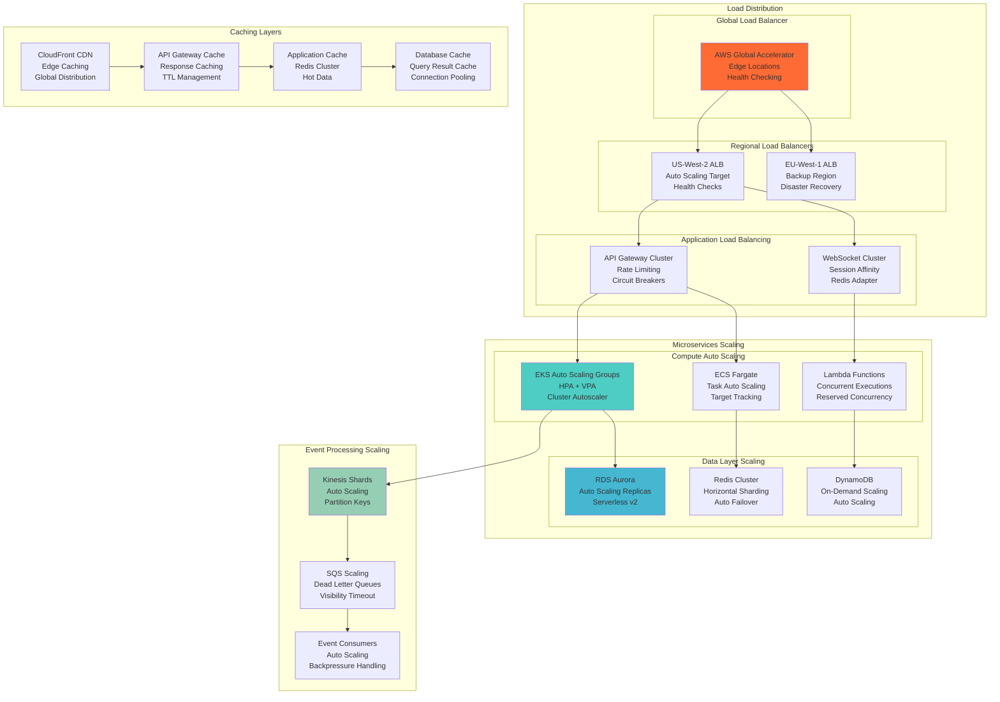

### 9.2 Auto-Scaling Configuration

```yaml
# Kubernetes HPA for Game Service
apiVersion: autoscaling/v2
kind: HorizontalPodAutoscaler
metadata:
  name: game-service-hpa
  namespace: basketball-platform
spec:
  scaleTargetRef:
    apiVersion: apps/v1
    kind: Deployment
    name: game-service
  minReplicas: 2
  maxReplicas: 50
  metrics:
  - type: Resource
    resource:
      name: cpu
      target:
        type: Utilization
        averageUtilization: 70
  - type: Resource
    resource:
      name: memory
      target:
        type: Utilization
        averageUtilization: 80
  - type: Pods
    pods:
      metric:
        name: active_websocket_connections
      target:
        type: AverageValue
        averageValue: "100"
  behavior:
    scaleUp:
      stabilizationWindowSeconds: 60
      policies:
      - type: Percent
        value: 100
        periodSeconds: 60
      - type: Pods
        value: 4
        periodSeconds: 60
      selectPolicy: Max
    scaleDown:
      stabilizationWindowSeconds: 300
      policies:
      - type: Percent
        value: 50
        periodSeconds: 60
      selectPolicy: Min

---

# Cluster Autoscaler for EKS
apiVersion: apps/v1
kind: Deployment
metadata:
  name: cluster-autoscaler
  namespace: kube-system
spec:
  template:
    spec:
      containers:
      - image: k8s.gcr.io/autoscaling/cluster-autoscaler:v1.21.0
        name: cluster-autoscaler
        env:
        - name: AWS_REGION
          value: us-west-2
        command:
        - ./cluster-autoscaler
        - --v=4
        - --stderrthreshold=info
        - --cloud-provider=aws
        - --skip-nodes-with-local-storage=false
        - --expander=least-waste
        - --node-group-auto-discovery=asg:tag=k8s.io/cluster-autoscaler/enabled,k8s.io/cluster-autoscaler/basketball-platform
        - --balance-similar-node-groups
        - --scale-down-enabled=true
        - --scale-down-delay-after-add=10m
        - --scale-down-unneeded-time=10m
        - --scale-down-utilization-threshold=0.5
        - --max-node-provision-time=15m
```

### 9.3 Database Scaling Strategy

```typescript
// Read Replica Routing
export class DatabaseConnectionManager {
  private writeConnection: Pool;
  private readConnections: Pool[];
  private currentReadIndex = 0;
  
  constructor(
    private readonly writeConfig: DatabaseConfig,
    private readonly readConfigs: DatabaseConfig[]
  ) {
    this.writeConnection = new Pool(this.writeConfig);
    this.readConnections = readConfigs.map(config => new Pool(config));
  }
  
  async executeQuery(
    query: string, 
    params: any[], 
    options: QueryOptions = {}
  ): Promise<QueryResult> {
    const connection = this.getConnection(options.readonly);
    
    try {
      return await connection.query(query, params);
    } catch (error) {
      // Retry logic for read replicas
      if (options.readonly && this.readConnections.length > 1) {
        return this.retryOnReadReplica(query, params, options);
      }
      throw error;
    }
  }
  
  private getConnection(readonly: boolean = false): Pool {
    if (readonly && this.readConnections.length > 0) {
      // Round-robin read replica selection
      const connection = this.readConnections[this.currentReadIndex];
      this.currentReadIndex = (this.currentReadIndex + 1) % this.readConnections.length;
      return connection;
    }
    
    return this.writeConnection;
  }
  
  private async retryOnReadReplica(
    query: string, 
    params: any[], 
    options: QueryOptions
  ): Promise<QueryResult> {
    for (let i = 0; i < this.readConnections.length; i++) {
      try {
        const connection = this.readConnections[i];
        return await connection.query(query, params);
      } catch (error) {
        console.warn(`Read replica ${i} failed, trying next...`, error);
        continue;
      }
    }
    
    // If all read replicas fail, fall back to write connection
    console.warn('All read replicas failed, falling back to write connection');
    return await this.writeConnection.query(query, params);
  }
}

// Connection Pooling with Auto-scaling
export class AutoScalingConnectionPool {
  private pool: Pool;
  private metrics: PoolMetrics;
  
  constructor(private config: PoolConfig) {
    this.pool = new Pool({
      ...config,
      min: config.minConnections || 2,
      max: config.maxConnections || 20,
      createTimeoutMillis: 30000,
      acquireTimeoutMillis: 60000,
      idleTimeoutMillis: 600000,
      reapIntervalMillis: 1000,
      createRetryIntervalMillis: 200,
    });
    
    this.metrics = new PoolMetrics();
    this.setupMonitoring();
  }
  
  private setupMonitoring(): void {
    // Monitor pool usage and scale accordingly
    setInterval(() => {
      const stats = {
        totalConnections: this.pool.totalCount,
        idleConnections: this.pool.idleCount,
        waitingRequests: this.pool.waitingCount,
        utilizationPercent: (this.pool.totalCount - this.pool.idleCount) / this.pool.totalCount * 100
      };
      
      this.metrics.record(stats);
      
      // Auto-scaling logic
      if (stats.utilizationPercent > 80 && stats.totalConnections < this.config.maxConnections) {
        this.scaleUp();
      } else if (stats.utilizationPercent < 20 && stats.totalConnections > this.config.minConnections) {
        this.scaleDown();
      }
    }, 5000);
  }
  
  private async scaleUp(): Promise<void> {
    // Scaling up happens automatically with connection pool
    console.log('Connection pool scaling up due to high utilization');
  }
  
  private async scaleDown(): Promise<void> {
    // Scaling down happens through idle timeout
    console.log('Connection pool will scale down idle connections');
  }
}
```

### 9.4 Caching Strategy for Scale

```typescript
// Multi-Level Caching Implementation
export class MultiLevelCache {
  private l1Cache: Map<string, CacheEntry>; // In-memory
  private l2Cache: Redis; // Redis cluster
  private l3Cache: S3Client; // S3 for large objects
  
  constructor(
    private readonly redisConfig: RedisConfig,
    private readonly s3Config: S3Config
  ) {
    this.l1Cache = new Map();
    this.l2Cache = new Redis.Cluster(redisConfig.nodes);
    this.l3Cache = new S3Client(s3Config);
    
    this.setupEviction();
  }
  
  async get<T>(key: string, options: CacheOptions = {}): Promise<T | null> {
    // L1 Cache (in-memory)
    const l1Result = this.l1Cache.get(key);
    if (l1Result && !this.isExpired(l1Result)) {
      this.recordHit('L1', key);
      return l1Result.value as T;
    }
    
    // L2 Cache (Redis)
    try {
      const l2Result = await this.l2Cache.get(key);
      if (l2Result) {
        const parsedValue = JSON.parse(l2Result);
        
        // Promote to L1 cache
        this.l1Cache.set(key, {
          value: parsedValue,
          expiry: Date.now() + (options.ttl || 300) * 1000
        });
        
        this.recordHit('L2', key);
        return parsedValue as T;
      }
    } catch (error) {
      console.warn('L2 cache miss due to error:', error);
    }
    
    // L3 Cache (S3) - for large objects only
    if (options.useL3Cache) {
      try {
        const l3Result = await this.getFromS3(key);
        if (l3Result) {
          // Promote to L2 and L1
          await this.l2Cache.setex(key, options.ttl || 300, JSON.stringify(l3Result));
          this.l1Cache.set(key, {
            value: l3Result,
            expiry: Date.now() + (options.ttl || 300) * 1000
          });
          
          this.recordHit('L3', key);
          return l3Result as T;
        }
      } catch (error) {
        console.warn('L3 cache miss due to error:', error);
      }
    }
    
    this.recordMiss(key);
    return null;
  }
  
  async set<T>(key: string, value: T, options: CacheOptions = {}): Promise<void> {
    const ttl = options.ttl || 300;
    const serializedValue = JSON.stringify(value);
    const sizeInBytes = Buffer.byteLength(serializedValue, 'utf8');
    
    // L1 Cache (always)
    this.l1Cache.set(key, {
      value,
      expiry: Date.now() + ttl * 1000
    });
    
    // L2 Cache (Redis)
    try {
      await this.l2Cache.setex(key, ttl, serializedValue);
    } catch (error) {
      console.error('Failed to set L2 cache:', error);
    }
    
    // L3 Cache (S3) - for large objects
    if (sizeInBytes > 1024 * 1024 || options.useL3Cache) { // > 1MB
      try {
        await this.setInS3(key, value, ttl);
      } catch (error) {
        console.error('Failed to set L3 cache:', error);
      }
    }
  }
  
  private setupEviction(): void {
    // L1 Cache eviction (LRU with size limit)
    setInterval(() => {
      const now = Date.now();
      const maxSize = 10000; // Max 10k entries
      
      // Remove expired entries
      for (const [key, entry] of this.l1Cache.entries()) {
        if (this.isExpired(entry)) {
          this.l1Cache.delete(key);
        }
      }
      
      // LRU eviction if still too large
      if (this.l1Cache.size > maxSize) {
        const entries = Array.from(this.l1Cache.entries());
        entries.sort((a, b) => a[1].expiry - b[1].expiry);
        
        const toRemove = entries.slice(0, this.l1Cache.size - maxSize);
        toRemove.forEach(([key]) => this.l1Cache.delete(key));
      }
    }, 60000); // Every minute
  }
  
  private async getFromS3(key: string): Promise<any> {
    const command = new GetObjectCommand({
      Bucket: this.s3Config.cacheBucket,
      Key: `cache/${key}`
    });
    
    const response = await this.l3Cache.send(command);
    
    if (response.Body) {
      const content = await response.Body.transformToString();
      return JSON.parse(content);
    }
    
    return null;
  }
  
  private async setInS3(key: string, value: any, ttl: number): Promise<void> {
    const command = new PutObjectCommand({
      Bucket: this.s3Config.cacheBucket,
      Key: `cache/${key}`,
      Body: JSON.stringify(value),
      Metadata: {
        'cache-expiry': (Date.now() + ttl * 1000).toString()
      }
    });
    
    await this.l3Cache.send(command);
  }
  
  private isExpired(entry: CacheEntry): boolean {
    return Date.now() > entry.expiry;
  }
  
  private recordHit(level: string, key: string): void {
    // Metrics recording for cache hit analysis
    console.log(`Cache HIT [${level}]: ${key}`);
  }
  
  private recordMiss(key: string): void {
    console.log(`Cache MISS: ${key}`);
  }
}

// Smart Cache Warming
export class CacheWarmingService {
  constructor(
    private readonly cache: MultiLevelCache,
    private readonly dataService: DataService
  ) {}
  
  async warmupGameData(gameId: string): Promise<void> {
    // Pre-load frequently accessed game data
    const warmupTasks = [
      this.warmupGameState(gameId),
      this.warmupTeamData(gameId),
      this.warmupPlayerStats(gameId),
      this.warmupHistoricalData(gameId)
    ];
    
    await Promise.all(warmupTasks);
  }
  
  private async warmupGameState(gameId: string): Promise<void> {
    const gameState = await this.dataService.getGameState(gameId);
    await this.cache.set(`game:state:${gameId}`, gameState, { ttl: 60 });
  }
  
  private async warmupTeamData(gameId: string): Promise<void> {
    const teams = await this.dataService.getGameTeams(gameId);
    
    for (const team of teams) {
      const teamData = await this.dataService.getTeamData(team.id);
      await this.cache.set(`team:${team.id}`, teamData, { ttl: 300 });
    }
  }
  
  private async warmupPlayerStats(gameId: string): Promise<void> {
    const players = await this.dataService.getGamePlayers(gameId);
    
    const playerStatsTasks = players.map(async (player) => {
      const stats = await this.dataService.getPlayerStats(player.id);
      return this.cache.set(`player:stats:${player.id}`, stats, { ttl: 600 });
    });
    
    await Promise.all(playerStatsTasks);
  }
  
  private async warmupHistoricalData(gameId: string): Promise<void> {
    const historicalData = await this.dataService.getHistoricalMatchups(gameId);
    await this.cache.set(`game:history:${gameId}`, historicalData, { 
      ttl: 3600, 
      useL3Cache: true 
    });
  }
}
```

---

## 10. Security Architecture

### 10.1 Zero-Trust Security Model

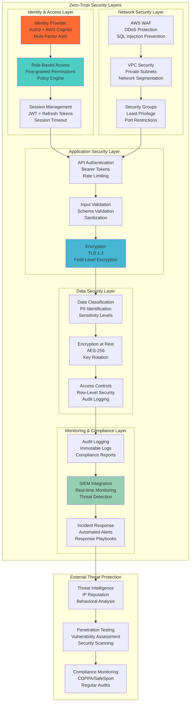

### 10.2 Authentication & Authorization Implementation

```typescript
// JWT Token Management with Refresh
export class TokenService {
  constructor(
    private readonly jwtSecret: string,
    private readonly refreshSecret: string,
    private readonly redisClient: Redis
  ) {}
  
  async generateTokenPair(user: User): Promise<TokenPair> {
    const accessToken = this.generateAccessToken(user);
    const refreshToken = this.generateRefreshToken(user);
    
    // Store refresh token with expiry
    await this.redisClient.setex(
      `refresh_token:${user.id}`,
      7 * 24 * 60 * 60, // 7 days
      refreshToken
    );
    
    return {
      accessToken,
      refreshToken,
      expiresIn: 15 * 60, // 15 minutes
      tokenType: 'Bearer'
    };
  }
  
  private generateAccessToken(user: User): string {
    const payload = {
      sub: user.id,
      email: user.email,
      tenantId: user.tenantId,
      roles: user.roles,
      permissions: user.permissions,
      iss: 'basketball-platform',
      aud: 'basketball-platform-api',
      iat: Math.floor(Date.now() / 1000),
      exp: Math.floor(Date.now() / 1000) + (15 * 60) // 15 minutes
    };
    
    return jwt.sign(payload, this.jwtSecret, {
      algorithm: 'HS256'
    });
  }
  
  private generateRefreshToken(user: User): string {
    const payload = {
      sub: user.id,
      type: 'refresh',
      iat: Math.floor(Date.now() / 1000),
      exp: Math.floor(Date.now() / 1000) + (7 * 24 * 60 * 60) // 7 days
    };
    
    return jwt.sign(payload, this.refreshSecret, {
      algorithm: 'HS256'
    });
  }
  
  async refreshAccessToken(refreshToken: string): Promise<TokenPair | null> {
    try {
      const decoded = jwt.verify(refreshToken, this.refreshSecret) as any;
      const storedToken = await this.redisClient.get(`refresh_token:${decoded.sub}`);
      
      if (storedToken !== refreshToken) {
        throw new Error('Invalid refresh token');
      }
      
      const user = await this.userService.findById(decoded.sub);
      if (!user) {
        throw new Error('User not found');
      }
      
      return this.generateTokenPair(user);
    } catch (error) {
      console.error('Refresh token validation failed:', error);
      return null;
    }
  }
  
  async revokeTokens(userId: string): Promise<void> {
    await this.redisClient.del(`refresh_token:${userId}`);
  }
  
  validateAccessToken(token: string): TokenPayload | null {
    try {
      return jwt.verify(token, this.jwtSecret) as TokenPayload;
    } catch (error) {
      return null;
    }
  }
}

// Advanced RBAC Implementation
export class RBACEngine {
  constructor(
    private readonly policyStore: PolicyStore,
    private readonly cache: CacheService
  ) {}
  
  async checkPermission(
    user: User,
    resource: string,
    action: string,
    context: SecurityContext = {}
  ): Promise<boolean> {
    const cacheKey = `permission:${user.id}:${resource}:${action}:${JSON.stringify(context)}`;
    
    // Check cache first
    const cachedResult = await this.cache.get(cacheKey);
    if (cachedResult !== null) {
      return cachedResult === 'true';
    }
    
    // Evaluate permissions
    const result = await this.evaluatePermission(user, resource, action, context);
    
    // Cache result for 5 minutes
    await this.cache.set(cacheKey, result.toString(), { ttl: 300 });
    
    return result;
  }
  
  private async evaluatePermission(
    user: User,
    resource: string,
    action: string,
    context: SecurityContext
  ): Promise<boolean> {
    // Direct permission check
    if (this.hasDirectPermission(user, resource, action)) {
      return true;
    }
    
    // Role-based permission check
    if (await this.hasRolePermission(user, resource, action)) {
      return true;
    }
    
    // Attribute-based permission check
    if (await this.hasAttributePermission(user, resource, action, context)) {
      return true;
    }
    
    // Resource-specific permission check
    if (await this.hasResourcePermission(user, resource, action, context)) {
      return true;
    }
    
    return false;
  }
  
  private hasDirectPermission(user: User, resource: string, action: string): boolean {
    const permissionKey = `${resource}:${action}`;
    return user.permissions.includes(permissionKey);
  }
  
  private async hasRolePermission(user: User, resource: string, action: string): Promise<boolean> {
    for (const roleId of user.roles) {
      const role = await this.policyStore.getRole(roleId);
      if (role && this.roleHasPermission(role, resource, action)) {
        return true;
      }
    }
    return false;
  }
  
  private roleHasPermission(role: Role, resource: string, action: string): boolean {
    const permissionKey = `${resource}:${action}`;
    return role.permissions.includes(permissionKey) || 
           role.permissions.includes(`${resource}:*`) ||
           role.permissions.includes('*:*');
  }
  
  private async hasAttributePermission(
    user: User,
    resource: string,
    action: string,
    context: SecurityContext
  ): Promise<boolean> {
    // Implement ABAC (Attribute-Based Access Control)
    const policies = await this.policyStore.getAttributePolicies(resource, action);
    
    for (const policy of policies) {
      if (await this.evaluateAttributePolicy(policy, user, context)) {
        return true;
      }
    }
    
    return false;
  }
  
  private async hasResourcePermission(
    user: User,
    resource: string,
    action: string,
    context: SecurityContext
  ): Promise<boolean> {
    // Resource-specific logic (e.g., team coach can manage their own team)
    switch (resource) {
      case 'team':
        return this.checkTeamPermission(user, action, context);
      
      case 'game':
        return this.checkGamePermission(user, action, context);
      
      case 'player':
        return this.checkPlayerPermission(user, action, context);
      
      default:
        return false;
    }
  }
  
  private async checkTeamPermission(
    user: User,
    action: string,
    context: SecurityContext
  ): Promise<boolean> {
    if (action === 'read' || action === 'update') {
      // Coach can manage their own team
      if (user.roles.includes('coach') && context.teamId) {
        const team = await this.policyStore.getTeam(context.teamId);
        return team?.coachId === user.id;
      }
      
      // Parent can view their child's team
      if (user.roles.includes('parent') && context.teamId) {
        const children = await this.policyStore.getUserChildren(user.id);
        const team = await this.policyStore.getTeam(context.teamId);
        return children.some(child => team?.players.includes(child.id));
      }
    }
    
    return false;
  }
  
  private async evaluateAttributePolicy(
    policy: AttributePolicy,
    user: User,
    context: SecurityContext
  ): Promise<boolean> {
    // Simple policy evaluation engine
    for (const condition of policy.conditions) {
      if (!this.evaluateCondition(condition, user, context)) {
        return false;
      }
    }
    
    return true;
  }
  
  private evaluateCondition(
    condition: PolicyCondition,
    user: User,
    context: SecurityContext
  ): boolean {
    const leftValue = this.resolveValue(condition.left, user, context);
    const rightValue = this.resolveValue(condition.right, user, context);
    
    switch (condition.operator) {
      case 'equals':
        return leftValue === rightValue;
      
      case 'not_equals':
        return leftValue !== rightValue;
      
      case 'in':
        return Array.isArray(rightValue) && rightValue.includes(leftValue);
      
      case 'not_in':
        return Array.isArray(rightValue) && !rightValue.includes(leftValue);
      
      case 'greater_than':
        return leftValue > rightValue;
      
      case 'less_than':
        return leftValue < rightValue;
      
      default:
        return false;
    }
  }
  
  private resolveValue(
    value: any,
    user: User,
    context: SecurityContext
  ): any {
    if (typeof value === 'string' && value.startsWith('$')) {
      const path = value.substring(1);
      
      if (path.startsWith('user.')) {
        return this.getNestedValue(user, path.substring(5));
      }
      
      if (path.startsWith('context.')) {
        return this.getNestedValue(context, path.substring(8));
      }
      
      if (path === 'now') {
        return new Date();
      }
    }
    
    return value;
  }
  
  private getNestedValue(obj: any, path: string): any {
    return path.split('.').reduce((current, key) => current?.[key], obj);
  }
}
```

### 10.3 Data Protection and Privacy

```typescript
// Field-Level Encryption Service
export class FieldEncryptionService {
  private readonly encryptionKey: Buffer;
  private readonly algorithm = 'aes-256-gcm';
  
  constructor(encryptionKey: string) {
    this.encryptionKey = Buffer.from(encryptionKey, 'hex');
  }
  
  encryptField(plaintext: string): EncryptedField {
    const iv = crypto.randomBytes(16);
    const cipher = crypto.createCipher(this.algorithm, this.encryptionKey);
    cipher.setAAD(Buffer.from('basketball-platform', 'utf8'));
    
    let encrypted = cipher.update(plaintext, 'utf8', 'hex');
    encrypted += cipher.final('hex');
    
    const authTag = cipher.getAuthTag();
    
    return {
      ciphertext: encrypted,
      iv: iv.toString('hex'),
      authTag: authTag.toString('hex'),
      algorithm: this.algorithm
    };
  }
  
  decryptField(encryptedField: EncryptedField): string {
    const decipher = crypto.createDecipher(encryptedField.algorithm, this.encryptionKey);
    decipher.setAAD(Buffer.from('basketball-platform', 'utf8'));
    decipher.setAuthTag(Buffer.from(encryptedField.authTag, 'hex'));
    
    let decrypted = decipher.update(encryptedField.ciphertext, 'hex', 'utf8');
    decrypted += decipher.final('utf8');
    
    return decrypted;
  }
}

// COPPA Compliance Service
export class COPPAComplianceService {
  constructor(
    private readonly auditLogger: AuditLogger,
    private readonly notificationService: NotificationService
  ) {}
  
  async verifyAge(birthDate: Date): Promise<AgeVerificationResult> {
    const age = this.calculateAge(birthDate);
    const isMinor = age < 13;
    const requiresParentalConsent = isMinor;
    
    await this.auditLogger.log({
      event: 'AGE_VERIFICATION',
      age,
      isMinor,
      requiresParentalConsent,
      timestamp: new Date()
    });
    
    return {
      age,
      isMinor,
      requiresParentalConsent,
      ageGroup: this.determineAgeGroup(age)
    };
  }
  
  async initiateParentalConsent(
    childUserId: string,
    parentEmail: string,
    requestData: ConsentRequestData
  ): Promise<ConsentProcess> {
    const consentToken = this.generateSecureToken();
    const consentRecord = {
      id: crypto.randomUUID(),
      childUserId,
      parentEmail,
      consentToken,
      status: 'PENDING',
      requestedAt: new Date(),
      expiresAt: new Date(Date.now() + 7 * 24 * 60 * 60 * 1000), // 7 days
      requestData
    };
    
    await this.storeConsentRecord(consentRecord);
    
    // Send consent email to parent
    await this.sendParentalConsentEmail(consentRecord);
    
    await this.auditLogger.log({
      event: 'PARENTAL_CONSENT_INITIATED',
      childUserId,
      parentEmail,
      consentId: consentRecord.id,
      timestamp: new Date()
    });
    
    return {
      consentId: consentRecord.id,
      status: 'PENDING',
      expiresAt: consentRecord.expiresAt
    };
  }
  
  async processParentalConsent(
    consentToken: string,
    parentSignature: DigitalSignature
  ): Promise<ConsentResult> {
    const consentRecord = await this.getConsentRecordByToken(consentToken);
    
    if (!consentRecord || consentRecord.expiresAt < new Date()) {
      throw new ConsentExpiredError('Consent request expired or not found');
    }
    
    // Verify digital signature
    const signatureValid = await this.verifyDigitalSignature(
      parentSignature,
      consentRecord.requestData
    );
    
    if (!signatureValid) {
      throw new InvalidSignatureError('Invalid parental signature');
    }
    
    // Update consent record
    consentRecord.status = 'GRANTED';
    consentRecord.grantedAt = new Date();
    consentRecord.parentSignature = parentSignature;
    
    await this.updateConsentRecord(consentRecord);
    
    // Enable child account
    await this.activateChildAccount(consentRecord.childUserId);
    
    await this.auditLogger.log({
      event: 'PARENTAL_CONSENT_GRANTED',
      childUserId: consentRecord.childUserId,
      parentEmail: consentRecord.parentEmail,
      consentId: consentRecord.id,
      signatureVerified: signatureValid,
      timestamp: new Date()
    });
    
    return {
      status: 'GRANTED',
      grantedAt: consentRecord.grantedAt!,
      consentId: consentRecord.id
    };
  }
  
  async revokeParentalConsent(
    childUserId: string,
    parentEmail: string,
    reason: string
  ): Promise<void> {
    const consentRecords = await this.getConsentRecordsByChild(childUserId);
    
    for (const record of consentRecords) {
      if (record.parentEmail === parentEmail && record.status === 'GRANTED') {
        record.status = 'REVOKED';
        record.revokedAt = new Date();
        record.revocationReason = reason;
        
        await this.updateConsentRecord(record);
      }
    }
    
    // Deactivate child account
    await this.deactivateChildAccount(childUserId);
    
    // Notify relevant parties
    await this.notifyConsentRevocation(childUserId, reason);
    
    await this.auditLogger.log({
      event: 'PARENTAL_CONSENT_REVOKED',
      childUserId,
      parentEmail,
      reason,
      timestamp: new Date()
    });
  }
  
  async getDataCollectionReport(childUserId: string): Promise<DataCollectionReport> {
    const consentRecords = await this.getConsentRecordsByChild(childUserId);
    const dataCollected = await this.getCollectedDataByChild(childUserId);
    const dataShared = await this.getDataSharingByChild(childUserId);
    
    return {
      childUserId,
      consentRecords,
      dataCollected,
      dataShared,
      generatedAt: new Date()
    };
  }
  
  private calculateAge(birthDate: Date): number {
    const today = new Date();
    let age = today.getFullYear() - birthDate.getFullYear();
    const monthDiff = today.getMonth() - birthDate.getMonth();
    
    if (monthDiff < 0 || (monthDiff === 0 && today.getDate() < birthDate.getDate())) {
      age--;
    }
    
    return age;
  }
  
  private determineAgeGroup(age: number): string {
    if (age < 13) return 'CHILD';
    if (age < 18) return 'TEEN';
    return 'ADULT';
  }
  
  private generateSecureToken(): string {
    return crypto.randomBytes(32).toString('hex');
  }
  
  private async verifyDigitalSignature(
    signature: DigitalSignature,
    data: any
  ): Promise<boolean> {
    // Implement digital signature verification
    const verify = crypto.createVerify('RSA-SHA256');
    verify.update(JSON.stringify(data));
    
    return verify.verify(signature.publicKey, signature.signature, 'hex');
  }
  
  private async sendParentalConsentEmail(consentRecord: ConsentRecord): Promise<void> {
    const consentUrl = `${process.env.FRONTEND_URL}/parental-consent/${consentRecord.consentToken}`;
    
    await this.notificationService.sendEmail({
      to: consentRecord.parentEmail,
      subject: 'Parental Consent Required for Youth Basketball Registration',
      template: 'parental-consent',
      data: {
        childName: consentRecord.requestData.childName,
        organizationName: consentRecord.requestData.organizationName,
        consentUrl,
        expiresAt: consentRecord.expiresAt
      }
    });
  }
}

// Privacy Data Management
export class PrivacyDataManager {
  constructor(
    private readonly encryptionService: FieldEncryptionService,
    private readonly auditLogger: AuditLogger
  ) {}
  
  async exportUserData(userId: string, requesterId: string): Promise<UserDataExport> {
    // Verify authorization for data export
    await this.verifyDataExportAuthorization(userId, requesterId);
    
    const userData = await this.collectUserData(userId);
    const sanitizedData = await this.sanitizeDataForExport(userData);
    
    await this.auditLogger.log({
      event: 'USER_DATA_EXPORTED',
      userId,
      requesterId,
      dataSize: JSON.stringify(sanitizedData).length,
      timestamp: new Date()
    });
    
    return {
      userId,
      exportedAt: new Date(),
      data: sanitizedData
    };
  }
  
  async deleteUserData(userId: string, requesterId: string): Promise<DataDeletionResult> {
    // Verify authorization for data deletion
    await this.verifyDataDeletionAuthorization(userId, requesterId);
    
    const deletionPlan = await this.createDataDeletionPlan(userId);
    const deletionResults: DeletionResult[] = [];
    
    // Execute deletion plan
    for (const step of deletionPlan.steps) {
      try {
        await this.executeDataDeletion(step);
        deletionResults.push({
          dataType: step.dataType,
          status: 'SUCCESS',
          recordsDeleted: step.recordCount
        });
      } catch (error) {
        deletionResults.push({
          dataType: step.dataType,
          status: 'FAILED',
          error: error.message
        });
      }
    }
    
    await this.auditLogger.log({
      event: 'USER_DATA_DELETED',
      userId,
      requesterId,
      deletionResults,
      timestamp: new Date()
    });
    
    return {
      userId,
      deletedAt: new Date(),
      results: deletionResults,
      completionStatus: deletionResults.every(r => r.status === 'SUCCESS') ? 'COMPLETE' : 'PARTIAL'
    };
  }
  
  private async collectUserData(userId: string): Promise<any> {
    // Collect data from all systems
    const userData = {
      profile: await this.getUserProfile(userId),
      gameHistory: await this.getUserGameHistory(userId),
      communications: await this.getUserCommunications(userId),
      payments: await this.getUserPayments(userId),
      media: await this.getUserMedia(userId)
    };
    
    return userData;
  }
  
  private async sanitizeDataForExport(data: any): Promise<any> {
    // Remove sensitive data that shouldn't be exported
    const sanitized = JSON.parse(JSON.stringify(data));
    
    // Remove encryption keys, internal IDs, etc.
    this.removeInternalFields(sanitized);
    
    // Decrypt encrypted fields for export
    this.decryptFieldsForExport(sanitized);
    
    return sanitized;
  }
  
  private removeInternalFields(obj: any): void {
    const fieldsToRemove = ['encryptionKey', 'internalId', 'systemMetadata'];
    
    if (Array.isArray(obj)) {
      obj.forEach(item => this.removeInternalFields(item));
    } else if (obj && typeof obj === 'object') {
      fieldsToRemove.forEach(field => delete obj[field]);
      Object.values(obj).forEach(value => this.removeInternalFields(value));
    }
  }
  
  private decryptFieldsForExport(obj: any): void {
    if (Array.isArray(obj)) {
      obj.forEach(item => this.decryptFieldsForExport(item));
    } else if (obj && typeof obj === 'object') {
      for (const [key, value] of Object.entries(obj)) {
        if (this.isEncryptedField(value)) {
          obj[key] = this.encryptionService.decryptField(value as EncryptedField);
        } else {
          this.decryptFieldsForExport(value);
        }
      }
    }
  }
  
  private isEncryptedField(value: any): boolean {
    return value && 
           typeof value === 'object' && 
           value.ciphertext && 
           value.iv && 
           value.authTag;
  }
}
```

This completes the comprehensive System Architecture Document for Phase 2. Let me now create the remaining architecture documents.

<function_calls>
<invoke name="TodoWrite">
<parameter name="todos">[{"id": "arch-001", "content": "Create Phase 2 architecture directory structure", "status": "completed"}, {"id": "arch-002", "content": "Create comprehensive System Architecture Document with C4 Model diagrams", "status": "completed"}, {"id": "arch-003", "content": "Design microservices architecture with service boundaries and contracts", "status": "in_progress"}, {"id": "arch-004", "content": "Create Domain-Driven Design implementation with bounded contexts", "status": "pending"}, {"id": "arch-005", "content": "Create 10 Architecture Decision Records (ADRs) for key technical decisions", "status": "pending"}, {"id": "arch-006", "content": "Design AWS infrastructure architecture optimized for scalability", "status": "pending"}, {"id": "arch-007", "content": "Create API Gateway and service mesh design specifications", "status": "pending"}]