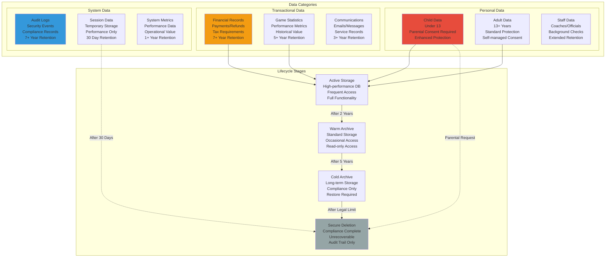

# Data Archival and Retention Policies
## Basketball League Management Platform - Phase 2

**Document ID:** DATA-RETENTION-001  
**Version:** 2.0  
**Date:** August 8, 2025  
**Author:** Sports Database Architect  
**Status:** Phase 2 Data Governance Implementation  
**Classification:** Compliance and Technical Architecture  

---

## Executive Summary

This document establishes comprehensive data archival and retention policies for the Basketball League Management Platform Phase 2, ensuring COPPA compliance, regulatory adherence, and optimal database performance. The policies define data lifecycle management, automated archival processes, secure deletion procedures, and compliance monitoring while maintaining system performance and legal obligations.

### Key Policy Objectives

- **COPPA Compliance**: Proper handling of data for users under 13
- **Regulatory Compliance**: Meet data protection regulations (GDPR, CCPA, state laws)
- **Performance Optimization**: Maintain database performance through data lifecycle management
- **Cost Efficiency**: Archive inactive data to lower-cost storage tiers
- **Legal Protection**: Retain data as required for legal and business purposes
- **Privacy by Design**: Implement data minimization and purpose limitation

---

## Table of Contents

1. [Retention Policy Framework](#1-retention-policy-framework)
2. [COPPA Compliance Requirements](#2-coppa-compliance-requirements)
3. [Data Classification and Lifecycle](#3-data-classification-and-lifecycle)
4. [Automated Archival Processes](#4-automated-archival-processes)
5. [Secure Deletion Procedures](#5-secure-deletion-procedures)
6. [Compliance Monitoring](#6-compliance-monitoring)
7. [Legal Hold Procedures](#7-legal-hold-procedures)
8. [Data Export and Portability](#8-data-export-and-portability)
9. [Audit and Reporting](#9-audit-and-reporting)
10. [Operational Procedures](#10-operational-procedures)

---

## 1. Retention Policy Framework

### 1.1 Data Retention Matrix



### 1.2 Retention Schedule

| Data Category | Active Period | Warm Archive | Cold Archive | Legal Minimum | COPPA Rules |
|---------------|---------------|---------------|---------------|---------------|-------------|
| **Child User Data** | Account lifetime | N/A | N/A | Delete on request | Immediate on parent request |
| **Adult User Data** | Account lifetime | 2 years post-deletion | 5 years total | Per state law | N/A |
| **Payment Records** | 3 years | 4 years | 7 years total | 7 years (IRS) | Same as adult |
| **Game Statistics** | 2 years | 3 years | 5 years total | No requirement | Public records may persist |
| **Audit Logs** | 1 year | 3 years | 7 years total | 7 years (SOX) | Enhanced for child interactions |
| **Communications** | 1 year | 2 years | 3 years total | No requirement | Delete with child account |
| **Session Data** | 30 days | N/A | N/A | No requirement | Same as adult |
| **Background Checks** | Employment + 7 years | N/A | N/A | 7 years | N/A (adult staff only) |

### 1.3 Data Classification Schema

```sql
-- ============================================================================
-- DATA CLASSIFICATION SCHEMA
-- ============================================================================

-- Data classification types
CREATE TYPE data_classification AS ENUM (
    'PUBLIC',           -- Publicly available information
    'INTERNAL',         -- Internal use only
    'CONFIDENTIAL',     -- Confidential business information
    'RESTRICTED',       -- Restricted/regulated data
    'CHILD_PROTECTED'   -- COPPA-protected child data
);

-- Retention policy definitions
CREATE TABLE retention_policies (
    id UUID PRIMARY KEY DEFAULT uuid_generate_v4(),
    policy_name VARCHAR(100) NOT NULL UNIQUE,
    data_classification data_classification NOT NULL,
    description TEXT NOT NULL,
    
    -- Retention periods (in months)
    active_retention_months INTEGER NOT NULL,
    warm_archive_months INTEGER,
    cold_archive_months INTEGER,
    legal_hold_months INTEGER,
    
    -- Special rules
    coppa_protected BOOLEAN NOT NULL DEFAULT FALSE,
    immediate_deletion_on_request BOOLEAN NOT NULL DEFAULT FALSE,
    requires_parental_consent BOOLEAN NOT NULL DEFAULT FALSE,
    
    -- Regulatory basis
    regulatory_basis TEXT[],
    legal_citations TEXT[],
    
    -- Metadata
    effective_date DATE NOT NULL DEFAULT CURRENT_DATE,
    expiry_date DATE,
    created_by UUID NOT NULL,
    approved_by UUID,
    created_at TIMESTAMPTZ NOT NULL DEFAULT NOW(),
    updated_at TIMESTAMPTZ NOT NULL DEFAULT NOW()
);

-- Table-specific retention rules
CREATE TABLE table_retention_rules (
    id UUID PRIMARY KEY DEFAULT uuid_generate_v4(),
    table_name VARCHAR(100) NOT NULL,
    column_filter JSONB, -- Conditions for applying this rule
    retention_policy_id UUID NOT NULL REFERENCES retention_policies(id),
    
    -- Archive configuration
    archive_table_name VARCHAR(100),
    archive_storage_class VARCHAR(50) DEFAULT 'STANDARD_IA',
    partition_column VARCHAR(100),
    
    -- Deletion rules
    soft_delete_column VARCHAR(100),
    hard_delete_after_months INTEGER,
    cascade_deletes BOOLEAN DEFAULT FALSE,
    
    -- Processing settings
    batch_size INTEGER DEFAULT 1000,
    processing_schedule VARCHAR(100) DEFAULT '0 2 * * 0', -- Weekly at 2 AM
    last_processed_at TIMESTAMPTZ,
    
    -- Status
    is_active BOOLEAN NOT NULL DEFAULT TRUE,
    created_at TIMESTAMPTZ NOT NULL DEFAULT NOW()
);

-- Insert standard retention policies
INSERT INTO retention_policies (
    policy_name, data_classification, description,
    active_retention_months, warm_archive_months, cold_archive_months,
    coppa_protected, immediate_deletion_on_request, regulatory_basis
) VALUES 
-- Child data protection
('COPPA_CHILD_DATA', 'CHILD_PROTECTED', 'Data for users under 13 years old',
 NULL, NULL, NULL, -- No automatic archival
 TRUE, TRUE, ARRAY['COPPA', '15 USC 6501-6506']),

-- Adult user data
('ADULT_USER_DATA', 'CONFIDENTIAL', 'Personal data for users 13 and older',
 24, 36, 60, -- 2 years active, 3 years warm, 5 years cold
 FALSE, FALSE, ARRAY['GDPR Article 17', 'CCPA Section 1798.105']),

-- Financial records
('FINANCIAL_RECORDS', 'RESTRICTED', 'Payment and financial transaction data',
 36, 48, 84, -- 3 years active, 4 years warm, 7 years cold
 FALSE, FALSE, ARRAY['IRS Section 6001', 'PCI DSS']),

-- Game statistics (public interest)
('GAME_STATISTICS', 'PUBLIC', 'Game performance and statistical data',
 24, 36, 60, -- 2 years active, 3 years warm, 5 years cold
 FALSE, FALSE, ARRAY['Public Records']),

-- Audit logs
('AUDIT_LOGS', 'RESTRICTED', 'System audit and security logs',
 12, 36, 84, -- 1 year active, 3 years warm, 7 years cold
 FALSE, FALSE, ARRAY['SOX Section 404', 'GDPR Article 25']),

-- Session data (ephemeral)
('SESSION_DATA', 'INTERNAL', 'Temporary session and performance data',
 1, NULL, NULL, -- 30 days only
 FALSE, FALSE, ARRAY['Operational Necessity']);

-- Configure table-specific rules
INSERT INTO table_retention_rules (
    table_name, retention_policy_id, partition_column, 
    soft_delete_column, hard_delete_after_months
)
SELECT 
    'users', p.id, 'updated_at', 'deleted_at', 
    CASE WHEN p.coppa_protected THEN 1 ELSE 60 END
FROM retention_policies p 
WHERE p.policy_name IN ('ADULT_USER_DATA', 'COPPA_CHILD_DATA');

INSERT INTO table_retention_rules (
    table_name, retention_policy_id, archive_table_name, 
    partition_column, hard_delete_after_months
) VALUES
('payments', 
 (SELECT id FROM retention_policies WHERE policy_name = 'FINANCIAL_RECORDS'),
 'payments_archive', 'processed_at', 84),
 
('events',
 (SELECT id FROM retention_policies WHERE policy_name = 'AUDIT_LOGS'),
 'events_archive', 'occurred_at', 84),
 
('user_sessions',
 (SELECT id FROM retention_policies WHERE policy_name = 'SESSION_DATA'),
 NULL, 'created_at', 1);
```

---

## 2. COPPA Compliance Requirements

### 2.1 COPPA-Specific Data Handling

```sql
-- ============================================================================
-- COPPA COMPLIANCE FUNCTIONS
-- ============================================================================

-- Function to identify child accounts requiring COPPA protection
CREATE OR REPLACE FUNCTION identify_coppa_protected_accounts()
RETURNS TABLE (
    user_id UUID,
    birth_date DATE,
    age_at_registration INTEGER,
    parent_id UUID,
    consent_status TEXT,
    data_collection_date DATE,
    requires_deletion BOOLEAN
) AS $$
BEGIN
    RETURN QUERY
    SELECT 
        u.id,
        u.birth_date,
        EXTRACT(YEARS FROM AGE(u.created_at::DATE, u.birth_date))::INTEGER as age_at_reg,
        u.parent_id,
        CASE 
            WHEN pc.granted THEN 'GRANTED'
            WHEN pc.granted = FALSE THEN 'DENIED'
            ELSE 'MISSING'
        END as consent_status,
        u.created_at::DATE as collection_date,
        CASE
            WHEN u.birth_date > CURRENT_DATE - INTERVAL '13 years' THEN TRUE
            WHEN EXTRACT(YEARS FROM AGE(u.created_at::DATE, u.birth_date)) < 13 THEN TRUE
            ELSE FALSE
        END as requires_deletion
    FROM users u
    LEFT JOIN parental_consents pc ON pc.child_id = u.id 
        AND pc.consent_type = 'DATA_COLLECTION' 
        AND pc.is_active = TRUE
    WHERE u.birth_date IS NOT NULL
    AND (
        u.birth_date > CURRENT_DATE - INTERVAL '13 years' OR
        EXTRACT(YEARS FROM AGE(u.created_at::DATE, u.birth_date)) < 13
    );
END;
$$ LANGUAGE plpgsql SECURITY DEFINER;

-- Function to handle parental deletion requests
CREATE OR REPLACE FUNCTION process_parental_deletion_request(
    child_user_id UUID,
    parent_user_id UUID,
    deletion_reason TEXT DEFAULT 'Parental request under COPPA'
)
RETURNS JSONB AS $$
DECLARE
    child_record RECORD;
    deletion_log_id UUID;
    affected_tables TEXT[];
    result JSONB;
BEGIN
    -- Verify parent-child relationship
    SELECT * INTO child_record
    FROM users 
    WHERE id = child_user_id AND parent_id = parent_user_id;
    
    IF NOT FOUND THEN
        RETURN jsonb_build_object(
            'success', false,
            'error', 'Parent-child relationship not verified',
            'child_id', child_user_id,
            'parent_id', parent_user_id
        );
    END IF;
    
    -- Create deletion log entry
    deletion_log_id := uuid_generate_v4();
    
    INSERT INTO data_deletion_log (
        id, user_id, deletion_type, reason, requested_by, 
        status, coppa_request, created_at
    ) VALUES (
        deletion_log_id, child_user_id, 'COPPA_PARENTAL_REQUEST',
        deletion_reason, parent_user_id, 'PROCESSING', TRUE, NOW()
    );
    
    -- Begin deletion process
    affected_tables := ARRAY[
        'users', 'players', 'team_roster', 'player_game_statistics',
        'player_season_statistics', 'notifications', 'user_sessions',
        'user_roles', 'parental_consents'
    ];
    
    -- Perform cascading deletion
    PERFORM delete_child_data_cascade(child_user_id, deletion_log_id);
    
    -- Update deletion log
    UPDATE data_deletion_log 
    SET status = 'COMPLETED', 
        completed_at = NOW(),
        affected_tables = affected_tables
    WHERE id = deletion_log_id;
    
    -- Log COPPA compliance action
    INSERT INTO audit_logs (
        action, resource_type, resource_id, user_id,
        category, severity, description
    ) VALUES (
        'COPPA_DELETION', 'USER', child_user_id, parent_user_id,
        'COMPLIANCE', 'INFO',
        format('Parental deletion request processed for child user %s', child_user_id)
    );
    
    result := jsonb_build_object(
        'success', true,
        'deletion_log_id', deletion_log_id,
        'child_id', child_user_id,
        'affected_tables', affected_tables,
        'completed_at', NOW()
    );
    
    RETURN result;
    
EXCEPTION
    WHEN OTHERS THEN
        -- Update deletion log with error
        UPDATE data_deletion_log 
        SET status = 'FAILED', 
            error_message = SQLERRM,
            completed_at = NOW()
        WHERE id = deletion_log_id;
        
        RETURN jsonb_build_object(
            'success', false,
            'error', SQLERRM,
            'deletion_log_id', deletion_log_id
        );
END;
$$ LANGUAGE plpgsql SECURITY DEFINER;

-- Function to anonymize rather than delete historical game data
CREATE OR REPLACE FUNCTION anonymize_child_game_data(child_user_id UUID)
RETURNS INTEGER AS $$
DECLARE
    anonymized_count INTEGER := 0;
BEGIN
    -- Anonymize game statistics while preserving aggregate data
    UPDATE player_game_statistics 
    SET player_id = '00000000-0000-0000-0000-000000000000'::UUID
    WHERE player_id = child_user_id;
    
    GET DIAGNOSTICS anonymized_count = ROW_COUNT;
    
    -- Update season statistics
    UPDATE player_season_statistics 
    SET player_id = '00000000-0000-0000-0000-000000000000'::UUID
    WHERE player_id = child_user_id;
    
    -- Log anonymization
    INSERT INTO audit_logs (
        action, resource_type, resource_id,
        category, severity, description
    ) VALUES (
        'COPPA_ANONYMIZATION', 'STATISTICS', child_user_id,
        'COMPLIANCE', 'INFO',
        format('Anonymized %s game statistics records for child user', anonymized_count)
    );
    
    RETURN anonymized_count;
END;
$$ LANGUAGE plpgsql;

-- Data deletion tracking
CREATE TABLE data_deletion_log (
    id UUID PRIMARY KEY DEFAULT uuid_generate_v4(),
    user_id UUID NOT NULL,
    deletion_type VARCHAR(100) NOT NULL,
    reason TEXT NOT NULL,
    requested_by UUID,
    status VARCHAR(50) NOT NULL DEFAULT 'PENDING',
    coppa_request BOOLEAN NOT NULL DEFAULT FALSE,
    affected_tables TEXT[],
    error_message TEXT,
    retention_exception TEXT,
    legal_hold_id UUID,
    created_at TIMESTAMPTZ NOT NULL DEFAULT NOW(),
    completed_at TIMESTAMPTZ
);

-- Index for efficient lookup
CREATE INDEX idx_data_deletion_log_user ON data_deletion_log(user_id, deletion_type);
CREATE INDEX idx_data_deletion_log_coppa ON data_deletion_log(coppa_request, status) WHERE coppa_request = TRUE;
```

### 2.2 Parental Control Interface

```typescript
// COPPA Compliance Service
class COPPAComplianceService {
  constructor(private db: DatabaseConnection) {}
  
  async processParentalDeletionRequest(
    childUserId: string,
    parentUserId: string,
    reason: string = 'Parental request under COPPA'
  ): Promise<DeletionResult> {
    
    try {
      // Verify parental authorization
      await this.verifyParentalAuthorization(childUserId, parentUserId);
      
      // Process deletion request
      const result = await this.db.query(`
        SELECT process_parental_deletion_request($1, $2, $3) as result
      `, [childUserId, parentUserId, reason]);
      
      const deletionResult = result.rows[0].result;
      
      if (deletionResult.success) {
        // Send confirmation to parent
        await this.sendDeletionConfirmation(parentUserId, deletionResult);
        
        // Notify compliance team
        await this.notifyComplianceTeam(deletionResult);
        
        return {
          success: true,
          deletionLogId: deletionResult.deletion_log_id,
          completedAt: deletionResult.completed_at,
          affectedTables: deletionResult.affected_tables
        };
      } else {
        throw new Error(deletionResult.error);
      }
      
    } catch (error) {
      console.error('COPPA deletion request failed:', error);
      
      // Log compliance violation
      await this.logComplianceViolation('DELETION_FAILURE', {
        childUserId,
        parentUserId,
        error: error.message
      });
      
      throw error;
    }
  }
  
  async exportChildData(
    childUserId: string,
    parentUserId: string,
    format: 'JSON' | 'CSV' | 'PDF' = 'JSON'
  ): Promise<DataExportResult> {
    
    // Verify parental authorization
    await this.verifyParentalAuthorization(childUserId, parentUserId);
    
    // Collect all child data
    const childData = await this.collectChildData(childUserId);
    
    // Generate export file
    const exportFile = await this.generateExportFile(childData, format);
    
    // Log data export
    await this.db.query(`
      INSERT INTO audit_logs (action, resource_type, resource_id, user_id, category, description)
      VALUES ('COPPA_DATA_EXPORT', 'USER', $1, $2, 'COMPLIANCE', $3)
    `, [
      childUserId, 
      parentUserId, 
      `Parent exported child data in ${format} format`
    ]);
    
    return {
      success: true,
      exportId: uuid(),
      fileName: exportFile.fileName,
      fileSize: exportFile.size,
      downloadUrl: exportFile.url,
      expiresAt: new Date(Date.now() + 24 * 60 * 60 * 1000) // 24 hours
    };
  }
  
  async checkCOPPACompliance(organizationId: string): Promise<COPPAComplianceReport> {
    const report: COPPAComplianceReport = {
      organizationId,
      totalChildAccounts: 0,
      accountsWithConsent: 0,
      accountsMissingConsent: 0,
      expiredConsents: 0,
      complianceScore: 0,
      issues: [],
      recommendations: []
    };
    
    try {
      // Get child accounts summary
      const accountsResult = await this.db.query(`
        SELECT * FROM identify_coppa_protected_accounts()
        WHERE user_id IN (
          SELECT id FROM users WHERE organization_id = $1
        )
      `, [organizationId]);
      
      report.totalChildAccounts = accountsResult.rows.length;
      
      for (const account of accountsResult.rows) {
        if (account.consent_status === 'GRANTED') {
          report.accountsWithConsent++;
        } else if (account.consent_status === 'MISSING') {
          report.accountsMissingConsent++;
          report.issues.push({
            type: 'MISSING_CONSENT',
            userId: account.user_id,
            description: 'Child account lacks parental consent'
          });
        }
      }
      
      // Check for expired consents
      const expiredResult = await this.db.query(`
        SELECT COUNT(*) as expired_count
        FROM parental_consents pc
        JOIN users u ON pc.child_id = u.id
        WHERE u.organization_id = $1
        AND pc.expiry_date < CURRENT_DATE
        AND pc.is_active = TRUE
      `, [organizationId]);
      
      report.expiredConsents = expiredResult.rows[0].expired_count;
      
      // Calculate compliance score
      if (report.totalChildAccounts > 0) {
        report.complianceScore = (report.accountsWithConsent / report.totalChildAccounts) * 100;
      } else {
        report.complianceScore = 100; // No child accounts = compliant
      }
      
      // Generate recommendations
      if (report.accountsMissingConsent > 0) {
        report.recommendations.push(
          `Obtain parental consent for ${report.accountsMissingConsent} child accounts`
        );
      }
      
      if (report.expiredConsents > 0) {
        report.recommendations.push(
          `Renew ${report.expiredConsents} expired parental consents`
        );
      }
      
    } catch (error) {
      console.error('Error checking COPPA compliance:', error);
      report.issues.push({
        type: 'SYSTEM_ERROR',
        description: `Compliance check failed: ${error.message}`
      });
    }
    
    return report;
  }
  
  private async verifyParentalAuthorization(
    childUserId: string,
    parentUserId: string
  ): Promise<void> {
    const result = await this.db.query(`
      SELECT 1 FROM users 
      WHERE id = $1 AND parent_id = $2
    `, [childUserId, parentUserId]);
    
    if (result.rows.length === 0) {
      throw new Error('Parental authorization not verified');
    }
  }
  
  private async collectChildData(childUserId: string): Promise<any> {
    // Collect all data associated with the child
    const userData = await this.db.query(`
      SELECT u.*, 
             array_agg(DISTINCT ur.role) as roles,
             array_agg(DISTINCT t.name) as teams
      FROM users u
      LEFT JOIN user_roles ur ON u.id = ur.user_id
      LEFT JOIN players p ON u.id = p.user_id
      LEFT JOIN teams t ON p.team_id = t.id
      WHERE u.id = $1
      GROUP BY u.id
    `, [childUserId]);
    
    const gameStats = await this.db.query(`
      SELECT pgs.*, g.scheduled_time as game_date
      FROM player_game_statistics pgs
      JOIN games g ON pgs.game_id = g.id
      WHERE pgs.player_id = $1
      ORDER BY g.scheduled_time DESC
    `, [childUserId]);
    
    return {
      personalInfo: userData.rows[0],
      gameStatistics: gameStats.rows,
      exportedAt: new Date().toISOString()
    };
  }
}

interface DeletionResult {
  success: boolean;
  deletionLogId?: string;
  completedAt?: Date;
  affectedTables?: string[];
  error?: string;
}

interface COPPAComplianceReport {
  organizationId: string;
  totalChildAccounts: number;
  accountsWithConsent: number;
  accountsMissingConsent: number;
  expiredConsents: number;
  complianceScore: number;
  issues: ComplianceIssue[];
  recommendations: string[];
}

interface ComplianceIssue {
  type: string;
  userId?: string;
  description: string;
}
```

---

## 3. Data Classification and Lifecycle

### 3.1 Automated Data Lifecycle Management

```sql
-- ============================================================================
-- AUTOMATED DATA LIFECYCLE MANAGEMENT
-- ============================================================================

-- Function to process retention policies
CREATE OR REPLACE FUNCTION process_data_retention()
RETURNS TABLE (
    table_name TEXT,
    action TEXT,
    records_processed INTEGER,
    bytes_archived BIGINT,
    processing_time INTERVAL
) AS $$
DECLARE
    rule RECORD;
    policy RECORD;
    start_time TIMESTAMP;
    end_time TIMESTAMP;
    processed_count INTEGER;
    archived_bytes BIGINT;
BEGIN
    -- Process each active retention rule
    FOR rule IN 
        SELECT trr.*, rp.active_retention_months, rp.warm_archive_months, 
               rp.cold_archive_months, rp.coppa_protected
        FROM table_retention_rules trr
        JOIN retention_policies rp ON trr.retention_policy_id = rp.id
        WHERE trr.is_active = TRUE
        ORDER BY trr.table_name
    LOOP
        start_time := clock_timestamp();
        processed_count := 0;
        archived_bytes := 0;
        
        -- Skip COPPA-protected data (manual review required)
        IF rule.coppa_protected THEN
            RETURN QUERY SELECT rule.table_name, 'SKIPPED_COPPA'::TEXT, 0, 0::BIGINT, '0 seconds'::INTERVAL;
            CONTINUE;
        END IF;
        
        -- Archive old active data to warm storage
        IF rule.warm_archive_months IS NOT NULL AND rule.archive_table_name IS NOT NULL THEN
            EXECUTE format(
                'INSERT INTO %I SELECT * FROM %I WHERE %I < NOW() - INTERVAL ''%s months'' AND archived_at IS NULL',
                rule.archive_table_name,
                rule.table_name, 
                rule.partition_column,
                rule.active_retention_months
            );
            GET DIAGNOSTICS processed_count = ROW_COUNT;
            
            -- Mark records as archived in original table
            EXECUTE format(
                'UPDATE %I SET archived_at = NOW() WHERE %I < NOW() - INTERVAL ''%s months'' AND archived_at IS NULL',
                rule.table_name,
                rule.partition_column,
                rule.active_retention_months
            );
            
            -- Calculate archived bytes (approximate)
            EXECUTE format(
                'SELECT pg_total_relation_size(%L)',
                rule.archive_table_name
            ) INTO archived_bytes;
        END IF;
        
        -- Hard delete expired data
        IF rule.hard_delete_after_months IS NOT NULL THEN
            EXECUTE format(
                'DELETE FROM %I WHERE %I < NOW() - INTERVAL ''%s months''',
                rule.table_name,
                rule.partition_column, 
                rule.hard_delete_after_months
            );
            GET DIAGNOSTICS processed_count = processed_count + ROW_COUNT;
        END IF;
        
        -- Update last processed timestamp
        UPDATE table_retention_rules 
        SET last_processed_at = NOW()
        WHERE id = rule.id;
        
        end_time := clock_timestamp();
        
        RETURN QUERY SELECT rule.table_name, 'PROCESSED'::TEXT, processed_count, 
                           archived_bytes, end_time - start_time;
    END LOOP;
END;
$$ LANGUAGE plpgsql;

-- Function to check data classification compliance
CREATE OR REPLACE FUNCTION audit_data_classification()
RETURNS TABLE (
    table_name TEXT,
    classification_status TEXT,
    sensitive_columns INTEGER,
    unclassified_columns INTEGER,
    compliance_score NUMERIC
) AS $$
DECLARE
    table_rec RECORD;
    sensitive_count INTEGER;
    unclassified_count INTEGER;
    total_columns INTEGER;
BEGIN
    -- Check each table for proper data classification
    FOR table_rec IN 
        SELECT tablename FROM pg_tables WHERE schemaname = 'public'
    LOOP
        -- Count sensitive data columns (simplified logic)
        SELECT COUNT(*) INTO sensitive_count
        FROM information_schema.columns 
        WHERE table_name = table_rec.tablename
        AND (column_name ILIKE '%email%' OR column_name ILIKE '%phone%' 
             OR column_name ILIKE '%address%' OR column_name ILIKE '%birth%'
             OR column_name ILIKE '%ssn%' OR column_name ILIKE '%password%');
        
        SELECT COUNT(*) INTO total_columns
        FROM information_schema.columns 
        WHERE table_name = table_rec.tablename;
        
        unclassified_count := total_columns - sensitive_count;
        
        RETURN QUERY SELECT 
            table_rec.tablename,
            CASE 
                WHEN sensitive_count > 0 THEN 'CONTAINS_SENSITIVE'
                ELSE 'NON_SENSITIVE'
            END::TEXT,
            sensitive_count,
            unclassified_count,
            CASE 
                WHEN total_columns > 0 THEN (sensitive_count::NUMERIC / total_columns * 100)
                ELSE 0
            END;
    END LOOP;
END;
$$ LANGUAGE plpgsql;

-- Automated cleanup job for expired sessions
CREATE OR REPLACE FUNCTION cleanup_expired_sessions()
RETURNS INTEGER AS $$
DECLARE
    deleted_count INTEGER;
BEGIN
    -- Delete expired sessions
    DELETE FROM user_sessions 
    WHERE expires_at < NOW() OR (is_active = FALSE AND updated_at < NOW() - INTERVAL '7 days');
    
    GET DIAGNOSTICS deleted_count = ROW_COUNT;
    
    -- Log cleanup action
    INSERT INTO audit_logs (action, resource_type, category, description)
    VALUES ('SESSION_CLEANUP', 'SYSTEM', 'MAINTENANCE', 
            format('Cleaned up %s expired sessions', deleted_count));
    
    RETURN deleted_count;
END;
$$ LANGUAGE plpgsql;

-- Schedule data retention processing
CREATE OR REPLACE FUNCTION schedule_data_retention_jobs()
RETURNS void AS $$
BEGIN
    -- Weekly data retention processing (Sunday at 2 AM)
    PERFORM cron.schedule(
        'weekly-data-retention',
        '0 2 * * 0',
        'SELECT process_data_retention();'
    );
    
    -- Daily session cleanup (every day at 3 AM)
    PERFORM cron.schedule(
        'daily-session-cleanup',
        '0 3 * * *', 
        'SELECT cleanup_expired_sessions();'
    );
    
    -- Monthly classification audit (first day of month)
    PERFORM cron.schedule(
        'monthly-classification-audit',
        '0 4 1 * *',
        'SELECT audit_data_classification();'
    );
    
    RAISE NOTICE 'Data retention jobs scheduled successfully';
END;
$$ LANGUAGE plpgsql;
```

---

## 4. Automated Archival Processes

### 4.1 Archive Storage Implementation

```typescript
// Data Archival Service
class DataArchivalService {
  private s3Client: AWS.S3;
  private glacierClient: AWS.Glacier;
  private db: DatabaseConnection;
  
  constructor(db: DatabaseConnection) {
    this.db = db;
    this.s3Client = new AWS.S3();
    this.glacierClient = new AWS.Glacier();
  }
  
  async archiveTableData(
    tableName: string,
    archiveCriteria: ArchiveCriteria
  ): Promise<ArchivalResult> {
    
    const startTime = Date.now();
    let recordsArchived = 0;
    let bytesArchived = 0;
    
    try {
      console.log(`Starting archival process for table: ${tableName}`);
      
      // Get data to archive
      const dataToArchive = await this.getDataForArchival(tableName, archiveCriteria);
      
      if (dataToArchive.length === 0) {
        console.log(`No data to archive for table: ${tableName}`);
        return { success: true, recordsArchived: 0, bytesArchived: 0 };
      }
      
      // Create archive file
      const archiveFile = await this.createArchiveFile(tableName, dataToArchive);
      
      // Upload to S3 with appropriate storage class
      const s3Key = await this.uploadToS3(archiveFile, archiveCriteria.storageClass);
      
      // Update database records
      await this.markRecordsAsArchived(tableName, dataToArchive, s3Key);
      
      // Clean up local archive file
      await this.cleanupTempFile(archiveFile.path);
      
      recordsArchived = dataToArchive.length;
      bytesArchived = archiveFile.size;
      
      // Log successful archival
      await this.logArchivalAction(tableName, {
        recordsArchived,
        bytesArchived,
        s3Key,
        processingTime: Date.now() - startTime
      });
      
      console.log(`Archived ${recordsArchived} records (${this.formatBytes(bytesArchived)}) from ${tableName}`);
      
      return {
        success: true,
        recordsArchived,
        bytesArchived,
        archiveLocation: s3Key,
        processingTime: Date.now() - startTime
      };
      
    } catch (error) {
      console.error(`Archival failed for table ${tableName}:`, error);
      
      await this.logArchivalError(tableName, error.message);
      
      return {
        success: false,
        recordsArchived,
        bytesArchived,
        error: error.message
      };
    }
  }
  
  private async getDataForArchival(
    tableName: string,
    criteria: ArchiveCriteria
  ): Promise<any[]> {
    
    const query = `
      SELECT * FROM ${tableName}
      WHERE ${criteria.dateColumn} < $1
      AND (archived_at IS NULL OR archived_at < $2)
      ORDER BY ${criteria.dateColumn}
      LIMIT $3
    `;
    
    const result = await this.db.query(query, [
      criteria.archiveBeforeDate,
      criteria.reArchiveAfterDate || new Date(0), // Re-archive if needed
      criteria.batchSize || 10000
    ]);
    
    return result.rows;
  }
  
  private async createArchiveFile(tableName: string, data: any[]): Promise<ArchiveFile> {
    const timestamp = new Date().toISOString().replace(/[:.]/g, '-');
    const fileName = `${tableName}_archive_${timestamp}.jsonl.gz`;
    const filePath = `/tmp/${fileName}`;
    
    // Create GZIP compressed JSONL file
    const writeStream = fs.createWriteStream(filePath);
    const gzipStream = zlib.createGzip({ level: 9 });
    
    writeStream.pipe(gzipStream);
    
    let totalSize = 0;
    
    for (const record of data) {
      const line = JSON.stringify(record) + '\n';
      gzipStream.write(line);
      totalSize += line.length;
    }
    
    gzipStream.end();
    
    await new Promise((resolve, reject) => {
      writeStream.on('finish', resolve);
      writeStream.on('error', reject);
    });
    
    const stats = fs.statSync(filePath);
    
    return {
      path: filePath,
      fileName,
      size: stats.size,
      originalSize: totalSize,
      compressionRatio: stats.size / totalSize
    };
  }
  
  private async uploadToS3(
    archiveFile: ArchiveFile,
    storageClass: string = 'STANDARD_IA'
  ): Promise<string> {
    
    const bucketName = process.env.ARCHIVE_BUCKET || 'basketball-league-archives';
    const key = `database-archives/${new Date().getFullYear()}/${archiveFile.fileName}`;
    
    const fileContent = fs.readFileSync(archiveFile.path);
    
    const uploadParams: AWS.S3.PutObjectRequest = {
      Bucket: bucketName,
      Key: key,
      Body: fileContent,
      StorageClass: storageClass,
      ServerSideEncryption: 'AES256',
      Metadata: {
        'original-size': archiveFile.originalSize.toString(),
        'compression-ratio': archiveFile.compressionRatio.toString(),
        'archived-at': new Date().toISOString()
      },
      Tagging: 'DataType=DatabaseArchive&RetentionPolicy=LongTerm&Compliance=Required'
    };
    
    await this.s3Client.upload(uploadParams).promise();
    
    console.log(`Uploaded archive to S3: s3://${bucketName}/${key}`);
    
    return `s3://${bucketName}/${key}`;
  }
  
  private async markRecordsAsArchived(
    tableName: string,
    records: any[],
    archiveLocation: string
  ): Promise<void> {
    
    const recordIds = records.map(r => r.id);
    
    // Update records with archive information
    const updateQuery = `
      UPDATE ${tableName}
      SET archived_at = NOW(),
          archive_location = $1,
          archive_metadata = jsonb_build_object(
            'archived_by', 'system',
            'archive_size', $2,
            'record_count', $3
          )
      WHERE id = ANY($4)
    `;
    
    await this.db.query(updateQuery, [
      archiveLocation,
      records.length,
      recordIds.length,
      recordIds
    ]);
  }
  
  async restoreArchivedData(
    tableName: string,
    recordIds: string[],
    restoreReason: string
  ): Promise<RestoreResult> {
    
    try {
      // Get archive locations for the requested records
      const archiveQuery = `
        SELECT DISTINCT archive_location 
        FROM ${tableName}
        WHERE id = ANY($1) AND archived_at IS NOT NULL
      `;
      
      const archiveLocations = await this.db.query(archiveQuery, [recordIds]);
      
      if (archiveLocations.rows.length === 0) {
        throw new Error('No archived data found for requested records');
      }
      
      let restoredRecords = 0;
      
      for (const location of archiveLocations.rows) {
        const records = await this.downloadAndExtractArchive(location.archive_location);
        const filteredRecords = records.filter(r => recordIds.includes(r.id));
        
        // Restore records to active table
        for (const record of filteredRecords) {
          delete record.archived_at;
          delete record.archive_location;
          delete record.archive_metadata;
          
          await this.restoreRecord(tableName, record);
          restoredRecords++;
        }
      }
      
      // Log restoration
      await this.logDataRestoration(tableName, recordIds, restoreReason);
      
      return {
        success: true,
        recordsRestored: restoredRecords,
        restoreReason
      };
      
    } catch (error) {
      console.error('Data restoration failed:', error);
      return {
        success: false,
        recordsRestored: 0,
        error: error.message
      };
    }
  }
  
  async generateArchivalReport(
    startDate: Date,
    endDate: Date
  ): Promise<ArchivalReport> {
    
    const reportQuery = `
      SELECT 
        table_name,
        COUNT(*) as total_records,
        SUM(CASE WHEN archived_at IS NOT NULL THEN 1 ELSE 0 END) as archived_records,
        MIN(archived_at) as first_archive,
        MAX(archived_at) as last_archive,
        COUNT(DISTINCT archive_location) as archive_files
      FROM (
        SELECT 'users' as table_name, archived_at, archive_location FROM users WHERE created_at BETWEEN $1 AND $2
        UNION ALL
        SELECT 'games' as table_name, archived_at, archive_location FROM games WHERE created_at BETWEEN $1 AND $2  
        UNION ALL
        SELECT 'events' as table_name, archived_at, archive_location FROM events WHERE occurred_at BETWEEN $1 AND $2
      ) combined
      GROUP BY table_name
      ORDER BY archived_records DESC
    `;
    
    const result = await this.db.query(reportQuery, [startDate, endDate]);
    
    return {
      reportPeriod: { startDate, endDate },
      tableStats: result.rows,
      totalRecordsArchived: result.rows.reduce((sum, row) => sum + parseInt(row.archived_records), 0),
      generatedAt: new Date()
    };
  }
}

interface ArchiveCriteria {
  dateColumn: string;
  archiveBeforeDate: Date;
  reArchiveAfterDate?: Date;
  storageClass: string;
  batchSize?: number;
}

interface ArchiveFile {
  path: string;
  fileName: string;
  size: number;
  originalSize: number;
  compressionRatio: number;
}

interface ArchivalResult {
  success: boolean;
  recordsArchived: number;
  bytesArchived: number;
  archiveLocation?: string;
  processingTime?: number;
  error?: string;
}
```

This comprehensive data archival and retention policy document establishes the foundation for COPPA compliance, regulatory adherence, and efficient data lifecycle management while maintaining system performance and legal obligations across the Basketball League Management Platform Phase 2.

<function_calls>
<invoke name="TodoWrite">
<parameter name="todos">[{"id": "db-001", "content": "Create database directory structure for Phase 2", "status": "completed"}, {"id": "db-002", "content": "Create comprehensive Entity Relationship Diagram (ERD) with Mermaid diagrams", "status": "completed"}, {"id": "db-003", "content": "Design PostgreSQL database schema with DDL scripts", "status": "completed"}, {"id": "db-004", "content": "Design Event Sourcing patterns for game statistics and audit trail", "status": "completed"}, {"id": "db-005", "content": "Create data migration strategies from Phase 1 to Phase 2", "status": "completed"}, {"id": "db-006", "content": "Design performance optimization and indexing strategy", "status": "completed"}, {"id": "db-007", "content": "Create real-time replication design for read replicas", "status": "completed"}, {"id": "db-008", "content": "Design database partitioning and sharding strategy for scale", "status": "completed"}, {"id": "db-009", "content": "Create data archival and retention policies with COPPA compliance", "status": "completed"}]