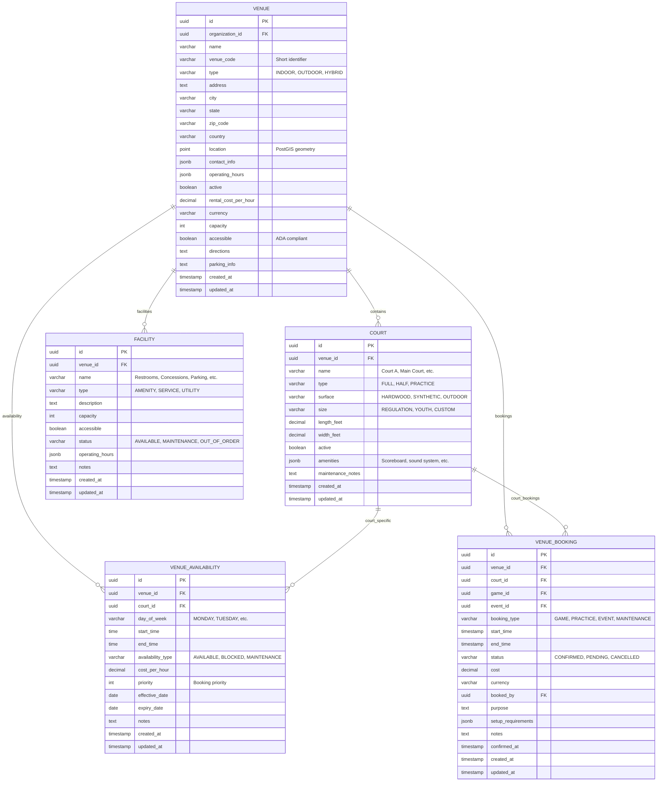
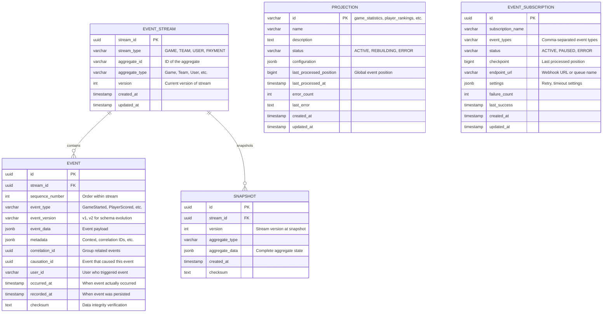

# Entity Relationship Diagram (ERD)
## Basketball League Management Platform - Phase 2

**Document ID:** ERD-BLMP-001  
**Version:** 2.0  
**Date:** August 8, 2025  
**Author:** Sports Database Architect  
**Status:** Phase 2 Database Design  
**Classification:** Technical Architecture  

---

## Executive Summary

This Entity Relationship Diagram (ERD) document provides the complete data model for the Basketball League Management Platform Phase 2, designed to support 1000+ concurrent connections, sub-100ms query response times, and comprehensive basketball league operations including multi-tenant architecture, event sourcing, and real-time game statistics.

### Key Database Design Principles

- **Database Normalization**: 3NF/BCNF compliance for data integrity
- **Event Sourcing**: Complete audit trail for all game operations
- **Multi-Tenant Architecture**: Tenant isolation with shared infrastructure
- **Performance Optimization**: Strategic indexing and query optimization
- **COPPA Compliance**: Youth data protection and parental controls
- **Real-time Capabilities**: Live game updates and statistics
- **Scalability**: Partitioning and sharding for 100x growth

---

## Table of Contents

1. [Database Overview](#1-database-overview)
2. [Core Entity Model](#2-core-entity-model)
3. [Complete ERD Diagrams](#3-complete-erd-diagrams)
4. [Domain-Specific Models](#4-domain-specific-models)
5. [Event Sourcing Model](#5-event-sourcing-model)
6. [Multi-Tenant Architecture](#6-multi-tenant-architecture)
7. [Relationship Constraints](#7-relationship-constraints)
8. [Data Volume Estimates](#8-data-volume-estimates)

---

## 1. Database Overview

### 1.1 Database Architecture Context

### 1.2 Database Technology Stack

| Component | Technology | Version | Purpose |
|-----------|------------|---------|---------|
| **Primary Database** | PostgreSQL | 15+ | OLTP operations, data consistency |
| **Read Replicas** | PostgreSQL | 15+ | Query optimization, read scaling |
| **Event Store** | PostgreSQL + Custom Schema | 15+ | Event sourcing, audit trail |
| **Cache Layer** | Redis | 7.0+ | Session management, real-time data |
| **Connection Pooling** | PgBouncer | 1.18+ | Connection optimization |
| **Monitoring** | pg_stat_statements | Built-in | Performance monitoring |

### 1.3 Multi-Tenant Architecture

---

## 2. Core Entity Model

### 2.1 Primary Entities Overview

| Entity | Purpose | Cardinality | Key Relationships |
|--------|---------|-------------|-------------------|
| **Organization** | Multi-tenant root | 1:N | Leagues, Users, Venues |
| **League** | Competition structure | 1:N | Seasons, Divisions, Teams |
| **Season** | Time-bounded competition | 1:N | Games, Registrations |
| **Division** | Age/skill grouping | 1:N | Teams, Players |
| **Team** | Player collection | 1:N | Players, Games |
| **Player** | Individual participant | 1:N | Statistics, Events |
| **Game** | Match between teams | 1:N | Events, Statistics |
| **User** | System actor | 1:N | Players, Teams, Roles |
| **Venue** | Game location | 1:N | Games, Facilities |
| **Payment** | Financial transaction | 1:N | Registrations, Subscriptions |

### 2.2 Entity Attributes Summary

---

## 3. Complete ERD Diagrams

### 3.1 Master ERD - All Entities

### 3.2 League Management Domain ERD

### 3.3 User Management Domain ERD

### 3.4 Game Operations Domain ERD

### 3.5 Team and Player Domain ERD

---

## 4. Domain-Specific Models

### 4.1 Venue Management Model

### 4.2 Payment and Financial Model

### 4.3 Communication and Notification Model

---

## 5. Event Sourcing Model

### 5.1 Event Store Architecture

### 5.2 Game Event Sourcing

---

## 6. Multi-Tenant Architecture

### 6.1 Tenant Management

### 6.2 Data Isolation Strategy

---

## 7. Relationship Constraints

### 7.1 Primary Key and Foreign Key Constraints

| Table | Primary Key | Foreign Key Constraints |
|-------|-------------|-------------------------|
| **organization** | id (UUID) | created_by → user(id) |
| **league** | id (UUID) | organization_id → organization(id) |
| **season** | id (UUID) | league_id → league(id) |
| **division** | id (UUID) | league_id → league(id) |
| **team** | id (UUID) | division_id → division(id), coach_id → user(id) |
| **player** | id (UUID) | user_id → user(id), team_id → team(id) |
| **game** | id (UUID) | season_id → season(id), home_team_id → team(id), away_team_id → team(id), venue_id → venue(id) |
| **user** | id (UUID) | organization_id → organization(id), parent_id → user(id) |
| **venue** | id (UUID) | organization_id → organization(id) |
| **payment** | id (UUID) | user_id → user(id), organization_id → organization(id) |

### 7.2 Unique Constraints

| Table | Unique Constraints | Purpose |
|-------|-------------------|---------|
| **organization** | slug | URL-friendly unique identifier |
| **league** | (organization_id, slug) | Unique within organization |
| **season** | (league_id, slug) | Unique within league |
| **team** | (division_id, name) | Unique team name within division |
| **player** | (team_id, jersey_number) | Unique jersey numbers |
| **user** | (organization_id, email) | Unique email within tenant |
| **user** | (organization_id, username) | Unique username within tenant |
| **venue** | (organization_id, name) | Unique venue names |

### 7.3 Check Constraints

| Table | Check Constraints | Business Rule |
|-------|------------------|---------------|
| **division** | min_age >= 6 AND max_age <= 18 | Youth league age limits |
| **division** | min_age < max_age | Valid age range |
| **player** | birth_date <= CURRENT_DATE - INTERVAL '6 years' | Minimum age requirement |
| **game** | home_team_id != away_team_id | Teams cannot play themselves |
| **game** | home_score >= 0 AND away_score >= 0 | Non-negative scores |
| **payment** | amount > 0 | Positive payment amounts |
| **user** | CASE WHEN birth_date <= CURRENT_DATE - INTERVAL '13 years' THEN parent_id IS NULL ELSE parent_id IS NOT NULL END | COPPA compliance |

---

## 8. Data Volume Estimates

### 8.1 Growth Projections

| Entity | Year 1 | Year 3 | Year 5 | Growth Rate |
|--------|--------|--------|--------|-------------|
| **Organizations** | 50 | 500 | 2,000 | 100x over 5 years |
| **Users** | 5,000 | 50,000 | 200,000 | 40x over 5 years |
| **Players** | 2,000 | 20,000 | 80,000 | 40x over 5 years |
| **Teams** | 200 | 2,000 | 8,000 | 40x over 5 years |
| **Games per Season** | 1,000 | 10,000 | 40,000 | 40x over 5 years |
| **Events per Game** | 150 avg | 150 avg | 150 avg | Stable per game |
| **Total Events/Year** | 150K | 1.5M | 6M | 40x over 5 years |

### 8.2 Storage Requirements

| Data Category | Year 1 (GB) | Year 3 (GB) | Year 5 (GB) | Notes |
|---------------|-------------|-------------|-------------|-------|
| **Core Data** | 2 | 20 | 80 | Organizations, users, teams |
| **Game Events** | 5 | 50 | 200 | Event sourcing data |
| **Statistics** | 3 | 30 | 120 | Calculated statistics |
| **Media Files** | 10 | 200 | 1,000 | Photos, videos, documents |
| **Audit Logs** | 1 | 15 | 75 | Compliance and security logs |
| **Backups** | 21 | 315 | 1,475 | 1.5x production data |
| **Total** | 42 | 630 | 2,950 | Includes all data and backups |

### 8.3 Query Volume Estimates

| Query Type | Peak QPS Year 1 | Peak QPS Year 3 | Peak QPS Year 5 | Scaling Factor |
|------------|-----------------|-----------------|-----------------|----------------|
| **User Authentication** | 50 | 500 | 2,000 | 40x |
| **Game State Updates** | 20 | 200 | 800 | 40x |
| **Statistics Queries** | 100 | 1,000 | 4,000 | 40x |
| **Search Operations** | 30 | 300 | 1,200 | 40x |
| **Reporting Queries** | 10 | 100 | 400 | 40x |
| **Real-time Updates** | 200 | 2,000 | 8,000 | 40x |
| **Total Peak QPS** | 410 | 4,100 | 16,400 | 40x |

---

This comprehensive ERD provides the complete data model foundation for the Basketball League Management Platform Phase 2, designed to support all functional requirements while maintaining performance, security, and compliance standards.