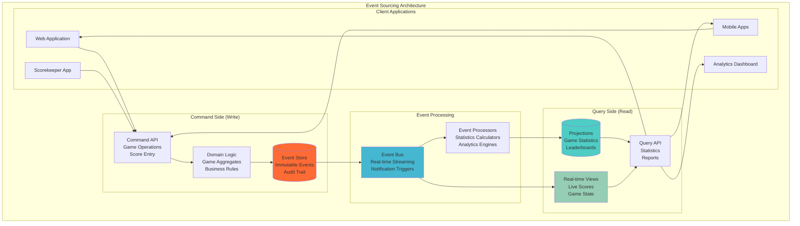
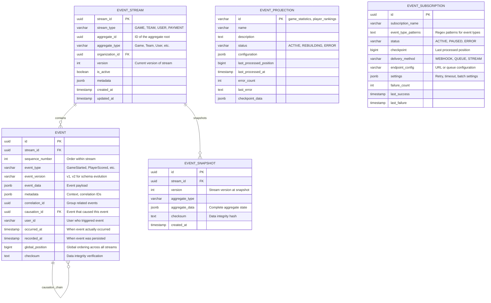
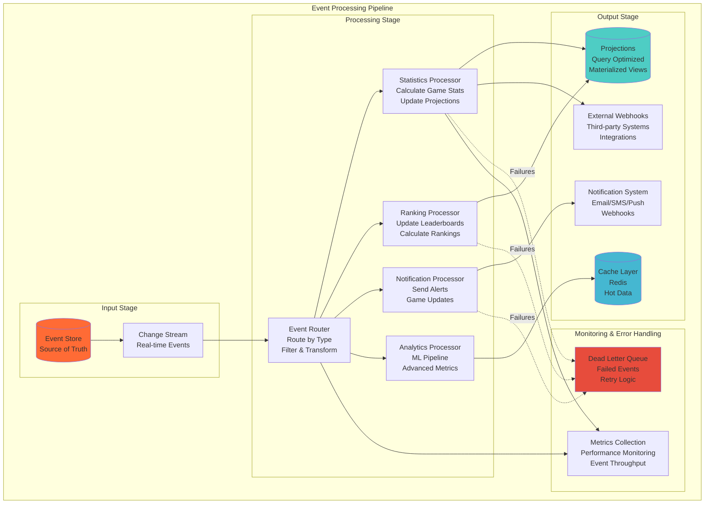

# Event Sourcing Patterns for Game Statistics
## Basketball League Management Platform - Phase 2

**Document ID:** EVENT-SOURCING-001  
**Version:** 2.0  
**Date:** August 8, 2025  
**Author:** Sports Database Architect  
**Status:** Phase 2 Event Sourcing Implementation  
**Classification:** Technical Architecture  

---

## Executive Summary

This document defines comprehensive Event Sourcing patterns for the Basketball League Management Platform Phase 2, focusing on game statistics, real-time updates, audit trails, and event-driven architecture. Event Sourcing provides immutable audit logs, enables real-time game state reconstruction, and supports complex analytics while maintaining data integrity and regulatory compliance.

### Key Event Sourcing Benefits

- **Complete Audit Trail**: Every game action is permanently recorded
- **Real-time Reconstruction**: Game state can be rebuilt from events at any point
- **Temporal Queries**: Query system state at any point in time
- **High Performance**: Optimized for write-heavy game operations
- **Analytics Foundation**: Rich event data enables advanced analytics
- **Compliance**: Immutable records for regulatory requirements
- **Scalability**: Events can be replayed and processed independently

---

## Table of Contents

1. [Event Sourcing Architecture](#1-event-sourcing-architecture)
2. [Event Store Design](#2-event-store-design)
3. [Game Event Patterns](#3-game-event-patterns)
4. [Event Processing Pipeline](#4-event-processing-pipeline)
5. [Projection Strategies](#5-projection-strategies)
6. [Snapshot Management](#6-snapshot-management)
7. [Real-time Event Streaming](#7-real-time-event-streaming)
8. [Analytics and Reporting](#8-analytics-and-reporting)
9. [Data Consistency Patterns](#9-data-consistency-patterns)
10. [Performance Optimization](#10-performance-optimization)

---

## 1. Event Sourcing Architecture

### 1.1 Event Sourcing Overview



### 1.2 Core Event Sourcing Principles

| Principle | Implementation | Benefits |
|-----------|----------------|----------|
| **Immutable Events** | Events are never modified, only appended | Complete audit trail, temporal queries |
| **Event Ordering** | Sequential ordering within aggregates | Consistent state reconstruction |
| **Idempotency** | Events can be safely replayed | Fault tolerance, recovery scenarios |
| **Causality** | Events linked through causation chains | Understanding decision flows |
| **Versioning** | Schema evolution through event versioning | Backward compatibility |

### 1.3 Event-Driven Components

```typescript
// Core Event Sourcing Interfaces
interface DomainEvent {
  id: string;
  streamId: string;
  eventType: string;
  eventVersion: string;
  eventData: any;
  metadata: EventMetadata;
  occurredAt: Date;
  sequenceNumber: number;
}

interface EventMetadata {
  correlationId: string;
  causationId?: string;
  userId: string;
  sessionId?: string;
  ipAddress?: string;
  userAgent?: string;
  [key: string]: any;
}

interface EventStore {
  appendEvents(streamId: string, events: DomainEvent[], expectedVersion: number): Promise<void>;
  getEvents(streamId: string, fromVersion?: number): Promise<DomainEvent[]>;
  getEventsByType(eventType: string, fromTimestamp?: Date): Promise<DomainEvent[]>;
  getAllEvents(fromPosition?: number): Promise<DomainEvent[]>;
}

interface EventBus {
  publish(events: DomainEvent[]): Promise<void>;
  subscribe(eventType: string, handler: EventHandler): void;
}

interface Projection {
  handle(event: DomainEvent): Promise<void>;
  getState(): any;
  rebuild(): Promise<void>;
}
```

---

## 2. Event Store Design

### 2.1 Event Stream Structure



### 2.2 Event Schema Evolution

```typescript
// Event Schema Versioning Strategy
interface EventSchemaRegistry {
  v1: {
    GameStarted: {
      gameId: string;
      homeTeamId: string;
      awayTeamId: string;
      startTime: string;
      officials: OfficialInfo[];
    };
    PlayerScored: {
      gameId: string;
      playerId: string;
      teamId: string;
      points: number;
      gameTime: string;
      period: string;
    };
  };
  
  v2: {
    GameStarted: {
      gameId: string;
      homeTeamId: string;
      awayTeamId: string;
      startTime: string;
      officials: OfficialInfo[];
      weatherConditions?: WeatherInfo;
      broadcastInfo?: BroadcastInfo;
    };
    PlayerScored: {
      gameId: string;
      playerId: string;
      teamId: string;
      points: number;
      gameTime: string;
      period: string;
      assistingPlayerId?: string;
      shotLocation?: CoordinateInfo;
      shotType: 'field_goal' | 'free_throw' | 'three_pointer';
    };
  };
}

// Event Upcasting for Schema Evolution
class EventUpcaster {
  upcast(event: DomainEvent): DomainEvent {
    switch (event.eventType) {
      case 'PlayerScored':
        return this.upcastPlayerScored(event);
      case 'GameStarted':
        return this.upcastGameStarted(event);
      default:
        return event;
    }
  }
  
  private upcastPlayerScored(event: DomainEvent): DomainEvent {
    if (event.eventVersion === 'v1') {
      // Upgrade v1 to v2 by adding new optional fields
      return {
        ...event,
        eventVersion: 'v2',
        eventData: {
          ...event.eventData,
          shotType: this.inferShotType(event.eventData.points),
          shotLocation: null,
          assistingPlayerId: null
        }
      };
    }
    return event;
  }
  
  private inferShotType(points: number): string {
    switch (points) {
      case 1: return 'free_throw';
      case 2: return 'field_goal';
      case 3: return 'three_pointer';
      default: return 'field_goal';
    }
  }
}
```

### 2.3 Event Store Implementation

```typescript
// PostgreSQL Event Store Implementation
class PostgreSQLEventStore implements EventStore {
  constructor(private db: DatabaseConnection) {}
  
  async appendEvents(
    streamId: string, 
    events: DomainEvent[], 
    expectedVersion: number
  ): Promise<void> {
    const client = await this.db.getClient();
    
    try {
      await client.query('BEGIN');
      
      // Check stream version for concurrency control
      const streamResult = await client.query(
        'SELECT version FROM event_streams WHERE stream_id = $1 FOR UPDATE',
        [streamId]
      );
      
      const currentVersion = streamResult.rows[0]?.version || 0;
      
      if (currentVersion !== expectedVersion) {
        throw new ConcurrencyError(
          `Expected version ${expectedVersion}, but stream is at version ${currentVersion}`
        );
      }
      
      // Insert events
      const newVersion = currentVersion + events.length;
      
      for (let i = 0; i < events.length; i++) {
        const event = events[i];
        const sequenceNumber = currentVersion + i + 1;
        
        await client.query(`
          INSERT INTO events (
            id, stream_id, sequence_number, event_type, event_version,
            event_data, metadata, correlation_id, causation_id, user_id,
            occurred_at, recorded_at, checksum
          ) VALUES ($1, $2, $3, $4, $5, $6, $7, $8, $9, $10, $11, NOW(), $12)
        `, [
          event.id,
          streamId,
          sequenceNumber,
          event.eventType,
          event.eventVersion,
          JSON.stringify(event.eventData),
          JSON.stringify(event.metadata),
          event.metadata.correlationId,
          event.metadata.causationId,
          event.metadata.userId,
          event.occurredAt,
          this.calculateChecksum(event)
        ]);
      }
      
      // Update stream version
      await client.query(`
        INSERT INTO event_streams (stream_id, stream_type, aggregate_id, aggregate_type, organization_id, version)
        VALUES ($1, $2, $3, $4, $5, $6)
        ON CONFLICT (stream_id) 
        DO UPDATE SET version = $6, updated_at = NOW()
      `, [
        streamId,
        this.getStreamType(streamId),
        this.getAggregateId(streamId),
        this.getAggregateType(streamId),
        this.getOrganizationId(streamId),
        newVersion
      ]);
      
      await client.query('COMMIT');
      
      // Publish events to event bus
      await this.eventBus.publish(events);
      
    } catch (error) {
      await client.query('ROLLBACK');
      throw error;
    } finally {
      client.release();
    }
  }
  
  async getEvents(streamId: string, fromVersion: number = 0): Promise<DomainEvent[]> {
    const result = await this.db.query(`
      SELECT * FROM events 
      WHERE stream_id = $1 AND sequence_number > $2 
      ORDER BY sequence_number ASC
    `, [streamId, fromVersion]);
    
    return result.rows.map(row => this.mapRowToEvent(row));
  }
  
  async getEventsByType(eventType: string, fromTimestamp?: Date): Promise<DomainEvent[]> {
    const query = fromTimestamp
      ? `SELECT * FROM events WHERE event_type = $1 AND occurred_at >= $2 ORDER BY global_position ASC`
      : `SELECT * FROM events WHERE event_type = $1 ORDER BY global_position ASC`;
    
    const params = fromTimestamp ? [eventType, fromTimestamp] : [eventType];
    const result = await this.db.query(query, params);
    
    return result.rows.map(row => this.mapRowToEvent(row));
  }
  
  private calculateChecksum(event: DomainEvent): string {
    const data = JSON.stringify({
      eventType: event.eventType,
      eventData: event.eventData,
      occurredAt: event.occurredAt
    });
    
    return crypto.createHash('sha256').update(data).digest('hex');
  }
  
  private mapRowToEvent(row: any): DomainEvent {
    return {
      id: row.id,
      streamId: row.stream_id,
      eventType: row.event_type,
      eventVersion: row.event_version,
      eventData: row.event_data,
      metadata: row.metadata,
      occurredAt: row.occurred_at,
      sequenceNumber: row.sequence_number
    };
  }
}
```

---

## 3. Game Event Patterns

### 3.1 Basketball Game Events

```typescript
// Game Event Types and Schemas
namespace GameEvents {
  
  // Game Lifecycle Events
  export interface GameScheduledEvent extends DomainEvent {
    eventType: 'GameScheduled';
    eventData: {
      gameId: string;
      homeTeamId: string;
      awayTeamId: string;
      venueId: string;
      scheduledTime: string;
      seasonId: string;
      gameType: 'REGULAR' | 'PLAYOFF' | 'CHAMPIONSHIP';
    };
  }
  
  export interface GameStartedEvent extends DomainEvent {
    eventType: 'GameStarted';
    eventData: {
      gameId: string;
      actualStartTime: string;
      officials: {
        referee?: string;
        scorekeeper?: string;
        timekeeper?: string;
      };
      weatherConditions?: {
        temperature: number;
        humidity: number;
        heatIndex: number;
      };
      startingLineups: {
        home: PlayerLineup[];
        away: PlayerLineup[];
      };
    };
  }
  
  export interface GameCompletedEvent extends DomainEvent {
    eventType: 'GameCompleted';
    eventData: {
      gameId: string;
      completedAt: string;
      finalScore: {
        home: number;
        away: number;
      };
      winner?: string;
      gameStats: {
        duration: number;
        periods: number;
        attendance?: number;
      };
    };
  }
  
  // Scoring Events
  export interface PlayerScoredEvent extends DomainEvent {
    eventType: 'PlayerScored';
    eventData: {
      gameId: string;
      playerId: string;
      teamId: string;
      points: 1 | 2 | 3;
      gameTime: string;
      period: string;
      shotType: 'free_throw' | 'field_goal' | 'three_pointer';
      shotLocation?: {
        x: number;
        y: number;
        zone: string;
      };
      assistingPlayerId?: string;
      newScore: {
        home: number;
        away: number;
      };
    };
  }
  
  export interface FoulCommittedEvent extends DomainEvent {
    eventType: 'FoulCommitted';
    eventData: {
      gameId: string;
      playerId: string;
      teamId: string;
      foulType: 'PERSONAL' | 'TECHNICAL' | 'FLAGRANT' | 'OFFENSIVE';
      gameTime: string;
      period: string;
      playerFoulCount: number;
      teamFoulCount: number;
      description?: string;
      location?: {
        x: number;
        y: number;
      };
    };
  }
  
  export interface TimeoutCalledEvent extends DomainEvent {
    eventType: 'TimeoutCalled';
    eventData: {
      gameId: string;
      teamId: string;
      timeoutType: 'FULL' | '30_SECOND';
      gameTime: string;
      period: string;
      remainingTimeouts: {
        full: number;
        thirtySecond: number;
      };
      duration: number;
    };
  }
  
  export interface SubstitutionMadeEvent extends DomainEvent {
    eventType: 'SubstitutionMade';
    eventData: {
      gameId: string;
      teamId: string;
      incomingPlayerId: string;
      outgoingPlayerId: string;
      gameTime: string;
      period: string;
      reason?: 'INJURY' | 'FOUL_TROUBLE' | 'TACTICAL' | 'REST';
    };
  }
  
  // Statistical Events
  export interface ReboundRecordedEvent extends DomainEvent {
    eventType: 'ReboundRecorded';
    eventData: {
      gameId: string;
      playerId: string;
      teamId: string;
      reboundType: 'OFFENSIVE' | 'DEFENSIVE';
      gameTime: string;
      period: string;
      location?: {
        x: number;
        y: number;
      };
    };
  }
  
  export interface AssistRecordedEvent extends DomainEvent {
    eventType: 'AssistRecorded';
    eventData: {
      gameId: string;
      assistingPlayerId: string;
      scoringPlayerId: string;
      teamId: string;
      gameTime: string;
      period: string;
      assistType: 'PRIMARY' | 'SECONDARY';
    };
  }
  
  export interface StealRecordedEvent extends DomainEvent {
    eventType: 'StealRecorded';
    eventData: {
      gameId: string;
      stealingPlayerId: string;
      stealingTeamId: string;
      turningOverPlayerId: string;
      turningOverTeamId: string;
      gameTime: string;
      period: string;
      location?: {
        x: number;
        y: number;
      };
    };
  }
  
  export interface BlockRecordedEvent extends DomainEvent {
    eventType: 'BlockRecorded';
    eventData: {
      gameId: string;
      blockingPlayerId: string;
      blockingTeamId: string;
      shootingPlayerId: string;
      shootingTeamId: string;
      gameTime: string;
      period: string;
      location?: {
        x: number;
        y: number;
      };
    };
  }
  
  // Game Flow Events
  export interface PeriodStartedEvent extends DomainEvent {
    eventType: 'PeriodStarted';
    eventData: {
      gameId: string;
      period: string;
      startTime: string;
      gameClockTime: string;
      lineup: {
        home: string[];
        away: string[];
      };
    };
  }
  
  export interface PeriodEndedEvent extends DomainEvent {
    eventType: 'PeriodEnded';
    eventData: {
      gameId: string;
      period: string;
      endTime: string;
      score: {
        home: number;
        away: number;
      };
      periodStats: {
        home: PeriodStats;
        away: PeriodStats;
      };
    };
  }
  
  // Administrative Events
  export interface GamePostponedEvent extends DomainEvent {
    eventType: 'GamePostponed';
    eventData: {
      gameId: string;
      reason: string;
      postponedAt: string;
      newScheduledTime?: string;
      weatherConditions?: any;
    };
  }
  
  export interface GameCancelledEvent extends DomainEvent {
    eventType: 'GameCancelled';
    eventData: {
      gameId: string;
      reason: string;
      cancelledAt: string;
      refundRequired: boolean;
    };
  }
  
  export interface GameForfeitedEvent extends DomainEvent {
    eventType: 'GameForfeited';
    eventData: {
      gameId: string;
      forfeitingTeamId: string;
      winningTeamId: string;
      reason: string;
      forfeitedAt: string;
      finalScore: {
        home: number;
        away: number;
      };
    };
  }
}

// Supporting Types
interface PlayerLineup {
  playerId: string;
  jerseyNumber: number;
  position: string;
  isStarter: boolean;
}

interface PeriodStats {
  points: number;
  fieldGoals: { made: number; attempted: number };
  threePointers: { made: number; attempted: number };
  freeThrows: { made: number; attempted: number };
  rebounds: number;
  assists: number;
  steals: number;
  blocks: number;
  turnovers: number;
  fouls: number;
}
```

### 3.2 Event Correlation and Causation

```typescript
// Event Correlation Service
class EventCorrelationService {
  
  // Create correlated events for complex actions
  async recordPlayerScore(
    gameId: string, 
    playerId: string, 
    teamId: string, 
    points: number,
    assistingPlayerId?: string,
    context: EventContext = {}
  ): Promise<void> {
    
    const correlationId = uuid();
    const baseMetadata = {
      correlationId,
      userId: context.userId,
      sessionId: context.sessionId,
      ipAddress: context.ipAddress
    };
    
    const events: DomainEvent[] = [];
    
    // Primary scoring event
    const scoreEvent: GameEvents.PlayerScoredEvent = {
      id: uuid(),
      streamId: `game-${gameId}`,
      eventType: 'PlayerScored',
      eventVersion: 'v2',
      eventData: {
        gameId,
        playerId,
        teamId,
        points,
        gameTime: context.gameTime!,
        period: context.period!,
        shotType: this.getShotType(points),
        shotLocation: context.shotLocation,
        assistingPlayerId,
        newScore: await this.calculateNewScore(gameId, teamId, points)
      },
      metadata: baseMetadata,
      occurredAt: new Date(),
      sequenceNumber: 0 // Will be set by event store
    };
    
    events.push(scoreEvent);
    
    // Correlated assist event if applicable
    if (assistingPlayerId) {
      const assistEvent: GameEvents.AssistRecordedEvent = {
        id: uuid(),
        streamId: `game-${gameId}`,
        eventType: 'AssistRecorded',
        eventVersion: 'v1',
        eventData: {
          gameId,
          assistingPlayerId,
          scoringPlayerId: playerId,
          teamId,
          gameTime: context.gameTime!,
          period: context.period!,
          assistType: 'PRIMARY'
        },
        metadata: {
          ...baseMetadata,
          causationId: scoreEvent.id
        },
        occurredAt: new Date(),
        sequenceNumber: 0
      };
      
      events.push(assistEvent);
    }
    
    // Append correlated events as a batch
    await this.eventStore.appendEvents(`game-${gameId}`, events, context.expectedVersion!);
  }
  
  // Handle complex foul scenarios
  async recordFoulWithConsequences(
    gameId: string,
    playerId: string,
    teamId: string,
    foulType: string,
    context: EventContext
  ): Promise<void> {
    
    const correlationId = uuid();
    const events: DomainEvent[] = [];
    
    // Get current foul counts
    const gameState = await this.gameStateService.getCurrentState(gameId);
    const playerFouls = gameState.getPlayerFoulCount(playerId);
    const teamFouls = gameState.getTeamFoulCount(teamId);
    
    // Primary foul event
    const foulEvent: GameEvents.FoulCommittedEvent = {
      id: uuid(),
      streamId: `game-${gameId}`,
      eventType: 'FoulCommitted',
      eventVersion: 'v1',
      eventData: {
        gameId,
        playerId,
        teamId,
        foulType: foulType as any,
        gameTime: context.gameTime!,
        period: context.period!,
        playerFoulCount: playerFouls + 1,
        teamFoulCount: teamFouls + 1,
        description: context.description,
        location: context.location
      },
      metadata: {
        correlationId,
        userId: context.userId!,
        sessionId: context.sessionId
      },
      occurredAt: new Date(),
      sequenceNumber: 0
    };
    
    events.push(foulEvent);
    
    // Player disqualification if 5th foul
    if (playerFouls + 1 >= 5) {
      const disqualificationEvent = {
        id: uuid(),
        streamId: `game-${gameId}`,
        eventType: 'PlayerDisqualified',
        eventVersion: 'v1',
        eventData: {
          gameId,
          playerId,
          teamId,
          reason: 'FOUL_LIMIT',
          gameTime: context.gameTime!,
          period: context.period!,
          totalFouls: playerFouls + 1
        },
        metadata: {
          correlationId,
          causationId: foulEvent.id,
          userId: context.userId!
        },
        occurredAt: new Date(),
        sequenceNumber: 0
      };
      
      events.push(disqualificationEvent);
    }
    
    // Bonus situation if team reaches foul limit
    if (teamFouls + 1 >= 7) {
      const bonusEvent = {
        id: uuid(),
        streamId: `game-${gameId}`,
        eventType: 'BonusSituationStarted',
        eventVersion: 'v1',
        eventData: {
          gameId,
          teamId,
          period: context.period!,
          teamFoulCount: teamFouls + 1
        },
        metadata: {
          correlationId,
          causationId: foulEvent.id,
          userId: context.userId!
        },
        occurredAt: new Date(),
        sequenceNumber: 0
      };
      
      events.push(bonusEvent);
    }
    
    await this.eventStore.appendEvents(`game-${gameId}`, events, context.expectedVersion!);
  }
  
  private getShotType(points: number): string {
    switch (points) {
      case 1: return 'free_throw';
      case 2: return 'field_goal';
      case 3: return 'three_pointer';
      default: return 'field_goal';
    }
  }
}

interface EventContext {
  userId?: string;
  sessionId?: string;
  ipAddress?: string;
  gameTime?: string;
  period?: string;
  expectedVersion?: number;
  shotLocation?: { x: number; y: number };
  description?: string;
  location?: { x: number; y: number };
}
```

---

## 4. Event Processing Pipeline

### 4.1 Event Processing Architecture



### 4.2 Event Processing Implementation

```typescript
// Event Processing Framework
interface EventProcessor {
  canHandle(event: DomainEvent): boolean;
  handle(event: DomainEvent): Promise<void>;
  getProcessorName(): string;
  getRetryPolicy(): RetryPolicy;
}

interface RetryPolicy {
  maxRetries: number;
  backoffStrategy: 'LINEAR' | 'EXPONENTIAL';
  initialDelay: number;
  maxDelay: number;
}

// Game Statistics Event Processor
class GameStatisticsProcessor implements EventProcessor {
  constructor(
    private statisticsService: GameStatisticsService,
    private projectionStore: ProjectionStore
  ) {}
  
  canHandle(event: DomainEvent): boolean {
    const gameEventTypes = [
      'PlayerScored', 'FoulCommitted', 'ReboundRecorded',
      'AssistRecorded', 'StealRecorded', 'BlockRecorded',
      'SubstitutionMade', 'TimeoutCalled'
    ];
    return gameEventTypes.includes(event.eventType);
  }
  
  async handle(event: DomainEvent): Promise<void> {
    try {
      switch (event.eventType) {
        case 'PlayerScored':
          await this.handlePlayerScored(event as GameEvents.PlayerScoredEvent);
          break;
        case 'ReboundRecorded':
          await this.handleReboundRecorded(event as GameEvents.ReboundRecordedEvent);
          break;
        case 'AssistRecorded':
          await this.handleAssistRecorded(event as GameEvents.AssistRecordedEvent);
          break;
        case 'FoulCommitted':
          await this.handleFoulCommitted(event as GameEvents.FoulCommittedEvent);
          break;
        default:
          console.log(`Unhandled event type: ${event.eventType}`);
      }
    } catch (error) {
      console.error(`Error processing event ${event.id}:`, error);
      throw error; // Will be caught by retry mechanism
    }
  }
  
  private async handlePlayerScored(event: GameEvents.PlayerScoredEvent): Promise<void> {
    const { gameId, playerId, teamId, points } = event.eventData;
    
    // Update player game statistics
    await this.statisticsService.updatePlayerGameStats(gameId, playerId, {
      points: points,
      fieldGoalsMade: points > 1 ? 1 : 0,
      fieldGoalsAttempted: points > 1 ? 1 : 0,
      threePointersMade: points === 3 ? 1 : 0,
      threePointersAttempted: points === 3 ? 1 : 0,
      freeThrowsMade: points === 1 ? 1 : 0,
      freeThrowsAttempted: points === 1 ? 1 : 0
    });
    
    // Update team game statistics
    await this.statisticsService.updateTeamGameStats(gameId, teamId, {
      points: points,
      fieldGoalsMade: points > 1 ? 1 : 0,
      fieldGoalsAttempted: points > 1 ? 1 : 0,
      threePointersMade: points === 3 ? 1 : 0,
      threePointersAttempted: points === 3 ? 1 : 0,
      freeThrowsMade: points === 1 ? 1 : 0,
      freeThrowsAttempted: points === 1 ? 1 : 0
    });
    
    // Update game score projection
    await this.projectionStore.updateProjection('game_scores', gameId, {
      lastUpdated: new Date(),
      lastEvent: event.id,
      score: event.eventData.newScore
    });
    
    // Update real-time projections
    await this.updateRealtimeProjections(gameId, event);
  }
  
  private async handleReboundRecorded(event: GameEvents.ReboundRecordedEvent): Promise<void> {
    const { gameId, playerId, teamId, reboundType } = event.eventData;
    
    const statUpdate = {
      rebounds: 1,
      offensiveRebounds: reboundType === 'OFFENSIVE' ? 1 : 0,
      defensiveRebounds: reboundType === 'DEFENSIVE' ? 1 : 0
    };
    
    await this.statisticsService.updatePlayerGameStats(gameId, playerId, statUpdate);
    await this.statisticsService.updateTeamGameStats(gameId, teamId, statUpdate);
  }
  
  private async updateRealtimeProjections(gameId: string, event: DomainEvent): Promise<void> {
    // Update Redis cache for real-time game state
    const gameState = await this.statisticsService.getGameState(gameId);
    await this.projectionStore.setCache(`game:${gameId}:state`, gameState, 3600);
    
    // Trigger real-time updates to connected clients
    await this.notificationService.broadcastGameUpdate(gameId, {
      eventType: event.eventType,
      eventData: event.eventData,
      gameState: gameState
    });
  }
  
  getProcessorName(): string {
    return 'GameStatisticsProcessor';
  }
  
  getRetryPolicy(): RetryPolicy {
    return {
      maxRetries: 3,
      backoffStrategy: 'EXPONENTIAL',
      initialDelay: 1000,
      maxDelay: 10000
    };
  }
}

// Event Processing Engine
class EventProcessingEngine {
  private processors: Map<string, EventProcessor> = new Map();
  private isRunning = false;
  private batchSize = 100;
  private processingInterval = 1000; // 1 second
  
  constructor(
    private eventStore: EventStore,
    private checkpointStore: CheckpointStore,
    private deadLetterQueue: DeadLetterQueue,
    private metricsCollector: MetricsCollector
  ) {}
  
  registerProcessor(processor: EventProcessor): void {
    this.processors.set(processor.getProcessorName(), processor);
  }
  
  async start(): Promise<void> {
    if (this.isRunning) {
      throw new Error('Event processing engine is already running');
    }
    
    this.isRunning = true;
    console.log('Starting event processing engine...');
    
    // Start processing loop
    this.processEvents();
  }
  
  async stop(): Promise<void> {
    this.isRunning = false;
    console.log('Stopping event processing engine...');
  }
  
  private async processEvents(): Promise<void> {
    while (this.isRunning) {
      try {
        const checkpoint = await this.checkpointStore.getCheckpoint('main');
        const events = await this.eventStore.getAllEvents(checkpoint, this.batchSize);
        
        if (events.length === 0) {
          await this.sleep(this.processingInterval);
          continue;
        }
        
        console.log(`Processing ${events.length} events from position ${checkpoint}`);
        
        for (const event of events) {
          await this.processEvent(event);
        }
        
        // Update checkpoint
        const lastEvent = events[events.length - 1];
        await this.checkpointStore.updateCheckpoint('main', lastEvent.globalPosition);
        
        // Collect metrics
        this.metricsCollector.recordEventsProcessed(events.length);
        
      } catch (error) {
        console.error('Error in event processing loop:', error);
        await this.sleep(this.processingInterval * 2);
      }
    }
  }
  
  private async processEvent(event: DomainEvent): Promise<void> {
    const startTime = Date.now();
    
    try {
      // Find processors that can handle this event
      const eligibleProcessors = Array.from(this.processors.values())
        .filter(processor => processor.canHandle(event));
      
      if (eligibleProcessors.length === 0) {
        console.log(`No processors found for event type: ${event.eventType}`);
        return;
      }
      
      // Process event with all eligible processors in parallel
      const processingPromises = eligibleProcessors.map(async (processor) => {
        return this.processEventWithRetry(event, processor);
      });
      
      await Promise.all(processingPromises);
      
      // Record success metrics
      const processingTime = Date.now() - startTime;
      this.metricsCollector.recordEventProcessingTime(event.eventType, processingTime);
      
    } catch (error) {
      console.error(`Failed to process event ${event.id}:`, error);
      
      // Send to dead letter queue after retries exhausted
      await this.deadLetterQueue.send(event, error.message);
      
      // Record failure metrics
      this.metricsCollector.recordEventProcessingFailure(event.eventType);
    }
  }
  
  private async processEventWithRetry(
    event: DomainEvent, 
    processor: EventProcessor
  ): Promise<void> {
    const retryPolicy = processor.getRetryPolicy();
    let attempt = 0;
    
    while (attempt <= retryPolicy.maxRetries) {
      try {
        await processor.handle(event);
        return; // Success
      } catch (error) {
        attempt++;
        
        if (attempt > retryPolicy.maxRetries) {
          throw error; // Max retries reached
        }
        
        // Calculate backoff delay
        const delay = this.calculateBackoffDelay(attempt, retryPolicy);
        console.log(`Retry ${attempt}/${retryPolicy.maxRetries} for event ${event.id} in ${delay}ms`);
        
        await this.sleep(delay);
      }
    }
  }
  
  private calculateBackoffDelay(attempt: number, policy: RetryPolicy): number {
    let delay: number;
    
    if (policy.backoffStrategy === 'LINEAR') {
      delay = policy.initialDelay * attempt;
    } else {
      delay = policy.initialDelay * Math.pow(2, attempt - 1);
    }
    
    return Math.min(delay, policy.maxDelay);
  }
  
  private sleep(ms: number): Promise<void> {
    return new Promise(resolve => setTimeout(resolve, ms));
  }
}
```

---

## 5. Projection Strategies

### 5.1 Projection Types and Patterns

```typescript
// Projection Base Interface
interface Projection {
  readonly projectionId: string;
  readonly version: number;
  
  handle(event: DomainEvent): Promise<void>;
  rebuild(): Promise<void>;
  getState(): any;
  getLastProcessedPosition(): number;
}

// Game Statistics Projection
class GameStatisticsProjection implements Projection {
  readonly projectionId = 'game_statistics';
  readonly version = 1;
  
  private lastProcessedPosition = 0;
  private gameStats = new Map<string, GameStatisticsState>();
  
  constructor(
    private databaseConnection: DatabaseConnection,
    private eventStore: EventStore
  ) {}
  
  async handle(event: DomainEvent): Promise<void> {
    switch (event.eventType) {
      case 'PlayerScored':
        await this.handlePlayerScored(event as GameEvents.PlayerScoredEvent);
        break;
      case 'ReboundRecorded':
        await this.handleReboundRecorded(event as GameEvents.ReboundRecordedEvent);
        break;
      case 'AssistRecorded':
        await this.handleAssistRecorded(event as GameEvents.AssistRecordedEvent);
        break;
      case 'FoulCommitted':
        await this.handleFoulCommitted(event as GameEvents.FoulCommittedEvent);
        break;
    }
    
    this.lastProcessedPosition = event.globalPosition;
    await this.updateCheckpoint();
  }
  
  private async handlePlayerScored(event: GameEvents.PlayerScoredEvent): Promise<void> {
    const { gameId, playerId, teamId, points } = event.eventData;
    
    // Update player statistics
    await this.databaseConnection.query(`
      INSERT INTO player_game_statistics (game_id, player_id, points, field_goals_made, three_pointers_made, free_throws_made)
      VALUES ($1, $2, $3, $4, $5, $6)
      ON CONFLICT (game_id, player_id)
      DO UPDATE SET
        points = player_game_statistics.points + $3,
        field_goals_made = player_game_statistics.field_goals_made + $4,
        three_pointers_made = player_game_statistics.three_pointers_made + $5,
        free_throws_made = player_game_statistics.free_throws_made + $6,
        last_event_sequence = $7,
        updated_at = NOW()
    `, [
      gameId,
      playerId,
      points,
      points > 1 ? 1 : 0,
      points === 3 ? 1 : 0,
      points === 1 ? 1 : 0,
      event.sequenceNumber
    ]);
    
    // Update team statistics
    await this.databaseConnection.query(`
      INSERT INTO team_game_statistics (game_id, team_id, points, field_goals_made, three_pointers_made, free_throws_made)
      VALUES ($1, $2, $3, $4, $5, $6)
      ON CONFLICT (game_id, team_id)
      DO UPDATE SET
        points = team_game_statistics.points + $3,
        field_goals_made = team_game_statistics.field_goals_made + $4,
        three_pointers_made = team_game_statistics.three_pointers_made + $5,
        free_throws_made = team_game_statistics.free_throws_made + $6,
        last_event_sequence = $7,
        updated_at = NOW()
    `, [
      gameId,
      teamId,
      points,
      points > 1 ? 1 : 0,
      points === 3 ? 1 : 0,
      points === 1 ? 1 : 0,
      event.sequenceNumber
    ]);
  }
  
  async rebuild(): Promise<void> {
    console.log(`Rebuilding projection: ${this.projectionId}`);
    
    // Clear existing projection data
    await this.clearProjectionData();
    
    // Process all events from the beginning
    const events = await this.eventStore.getAllEvents(0);
    
    for (const event of events) {
      await this.handle(event);
    }
    
    console.log(`Rebuilt projection ${this.projectionId} with ${events.length} events`);
  }
  
  getState(): any {
    return {
      projectionId: this.projectionId,
      version: this.version,
      lastProcessedPosition: this.lastProcessedPosition,
      statistics: Array.from(this.gameStats.entries())
    };
  }
  
  getLastProcessedPosition(): number {
    return this.lastProcessedPosition;
  }
  
  private async clearProjectionData(): Promise<void> {
    await this.databaseConnection.query('TRUNCATE player_game_statistics, team_game_statistics');
    this.gameStats.clear();
    this.lastProcessedPosition = 0;
  }
  
  private async updateCheckpoint(): Promise<void> {
    await this.databaseConnection.query(`
      UPDATE event_projections
      SET last_processed_position = $1, last_processed_at = NOW()
      WHERE id = $2
    `, [this.lastProcessedPosition, this.projectionId]);
  }
}

// Real-time Game State Projection
class RealtimeGameStateProjection implements Projection {
  readonly projectionId = 'realtime_game_state';
  readonly version = 1;
  
  private lastProcessedPosition = 0;
  private gameStates = new Map<string, RealtimeGameState>();
  
  constructor(
    private redisClient: RedisClient,
    private websocketServer: WebSocketServer
  ) {}
  
  async handle(event: DomainEvent): Promise<void> {
    if (!this.isGameEvent(event)) {
      return;
    }
    
    const gameId = this.extractGameId(event);
    let gameState = this.gameStates.get(gameId) || new RealtimeGameState(gameId);
    
    // Update game state based on event
    gameState = await this.applyEventToGameState(gameState, event);
    this.gameStates.set(gameId, gameState);
    
    // Cache in Redis for fast access
    await this.redisClient.setex(
      `game:${gameId}:state`,
      3600, // 1 hour TTL
      JSON.stringify(gameState.toJSON())
    );
    
    // Broadcast real-time updates to connected clients
    await this.websocketServer.broadcast(`game:${gameId}`, {
      type: 'GAME_STATE_UPDATE',
      gameId,
      event: {
        type: event.eventType,
        data: event.eventData,
        timestamp: event.occurredAt
      },
      gameState: gameState.toJSON()
    });
    
    this.lastProcessedPosition = event.globalPosition;
  }
  
  private async applyEventToGameState(
    gameState: RealtimeGameState, 
    event: DomainEvent
  ): Promise<RealtimeGameState> {
    
    switch (event.eventType) {
      case 'GameStarted':
        return gameState.start(event.eventData);
        
      case 'PlayerScored':
        return gameState.addScore(
          event.eventData.teamId,
          event.eventData.points,
          event.eventData.playerId
        );
        
      case 'FoulCommitted':
        return gameState.addFoul(
          event.eventData.teamId,
          event.eventData.playerId,
          event.eventData.foulType
        );
        
      case 'TimeoutCalled':
        return gameState.useTimeout(
          event.eventData.teamId,
          event.eventData.timeoutType
        );
        
      case 'SubstitutionMade':
        return gameState.makeSubstitution(
          event.eventData.teamId,
          event.eventData.outgoingPlayerId,
          event.eventData.incomingPlayerId
        );
        
      case 'PeriodStarted':
        return gameState.startPeriod(event.eventData.period);
        
      case 'PeriodEnded':
        return gameState.endPeriod(event.eventData.period);
        
      case 'GameCompleted':
        return gameState.complete(event.eventData.finalScore);
        
      default:
        return gameState;
    }
  }
  
  private isGameEvent(event: DomainEvent): boolean {
    const gameEventTypes = [
      'GameStarted', 'PlayerScored', 'FoulCommitted', 'TimeoutCalled',
      'SubstitutionMade', 'PeriodStarted', 'PeriodEnded', 'GameCompleted',
      'ReboundRecorded', 'AssistRecorded', 'StealRecorded', 'BlockRecorded'
    ];
    return gameEventTypes.includes(event.eventType);
  }
  
  private extractGameId(event: DomainEvent): string {
    return event.eventData.gameId;
  }
  
  async rebuild(): Promise<void> {
    // Clear Redis cache
    const keys = await this.redisClient.keys('game:*:state');
    if (keys.length > 0) {
      await this.redisClient.del(...keys);
    }
    
    // Clear in-memory state
    this.gameStates.clear();
    this.lastProcessedPosition = 0;
    
    // Rebuild from events
    const events = await this.eventStore.getAllEvents(0);
    for (const event of events) {
      await this.handle(event);
    }
  }
  
  getState(): any {
    return {
      projectionId: this.projectionId,
      version: this.version,
      lastProcessedPosition: this.lastProcessedPosition,
      gameStateCount: this.gameStates.size
    };
  }
  
  getLastProcessedPosition(): number {
    return this.lastProcessedPosition;
  }
}

// Supporting Classes
class RealtimeGameState {
  constructor(
    public gameId: string,
    public homeScore: number = 0,
    public awayScore: number = 0,
    public period: string = 'Q1',
    public gameTime: string = '12:00',
    public status: string = 'SCHEDULED',
    public fouls: Map<string, number> = new Map(),
    public timeouts: Map<string, any> = new Map(),
    public activePlayers: Map<string, string[]> = new Map()
  ) {}
  
  start(data: any): RealtimeGameState {
    return new RealtimeGameState(
      this.gameId,
      this.homeScore,
      this.awayScore,
      'Q1',
      '12:00',
      'IN_PROGRESS',
      this.fouls,
      this.timeouts,
      new Map([
        [data.homeTeamId, data.startingLineups.home.map((p: any) => p.playerId)],
        [data.awayTeamId, data.startingLineups.away.map((p: any) => p.playerId)]
      ])
    );
  }
  
  addScore(teamId: string, points: number, playerId: string): RealtimeGameState {
    const newState = this.clone();
    
    if (teamId === newState.gameId.split('-')[1]) { // Simplified team ID logic
      newState.homeScore += points;
    } else {
      newState.awayScore += points;
    }
    
    return newState;
  }
  
  addFoul(teamId: string, playerId: string, foulType: string): RealtimeGameState {
    const newState = this.clone();
    const currentFouls = newState.fouls.get(playerId) || 0;
    newState.fouls.set(playerId, currentFouls + 1);
    return newState;
  }
  
  useTimeout(teamId: string, timeoutType: string): RealtimeGameState {
    const newState = this.clone();
    const teamTimeouts = newState.timeouts.get(teamId) || { full: 7, thirtySecond: 2 };
    
    if (timeoutType === 'FULL') {
      teamTimeouts.full = Math.max(0, teamTimeouts.full - 1);
    } else {
      teamTimeouts.thirtySecond = Math.max(0, teamTimeouts.thirtySecond - 1);
    }
    
    newState.timeouts.set(teamId, teamTimeouts);
    return newState;
  }
  
  makeSubstitution(teamId: string, outgoing: string, incoming: string): RealtimeGameState {
    const newState = this.clone();
    const players = newState.activePlayers.get(teamId) || [];
    const index = players.indexOf(outgoing);
    
    if (index !== -1) {
      players[index] = incoming;
      newState.activePlayers.set(teamId, players);
    }
    
    return newState;
  }
  
  startPeriod(period: string): RealtimeGameState {
    const newState = this.clone();
    newState.period = period;
    newState.gameTime = '12:00';
    return newState;
  }
  
  endPeriod(period: string): RealtimeGameState {
    const newState = this.clone();
    newState.gameTime = '00:00';
    return newState;
  }
  
  complete(finalScore: any): RealtimeGameState {
    const newState = this.clone();
    newState.status = 'COMPLETED';
    newState.homeScore = finalScore.home;
    newState.awayScore = finalScore.away;
    return newState;
  }
  
  private clone(): RealtimeGameState {
    return new RealtimeGameState(
      this.gameId,
      this.homeScore,
      this.awayScore,
      this.period,
      this.gameTime,
      this.status,
      new Map(this.fouls),
      new Map(this.timeouts),
      new Map(this.activePlayers)
    );
  }
  
  toJSON(): any {
    return {
      gameId: this.gameId,
      homeScore: this.homeScore,
      awayScore: this.awayScore,
      period: this.period,
      gameTime: this.gameTime,
      status: this.status,
      fouls: Object.fromEntries(this.fouls),
      timeouts: Object.fromEntries(this.timeouts),
      activePlayers: Object.fromEntries(this.activePlayers)
    };
  }
}
```

This comprehensive Event Sourcing document provides the foundation for implementing robust, scalable, and maintainable event-driven architecture for the Basketball League Management Platform. The patterns and implementations shown here support real-time game operations, complete audit trails, and advanced analytics capabilities while maintaining data integrity and performance at scale.

Let me continue with the remaining deliverables to complete the comprehensive database documentation.