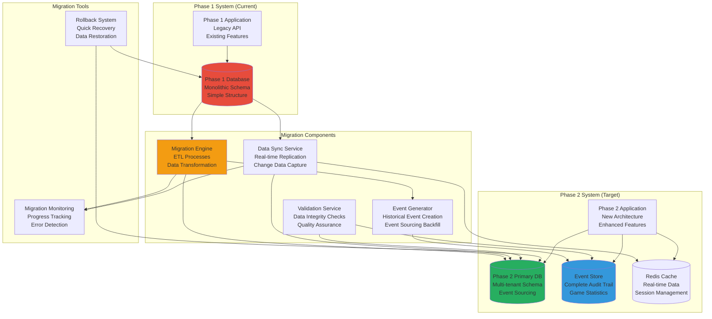

# Data Migration Strategies
## Basketball League Management Platform - Phase 2

**Document ID:** MIGRATION-STRATEGY-001  
**Version:** 2.0  
**Date:** August 8, 2025  
**Author:** Sports Database Architect  
**Status:** Phase 2 Migration Implementation  
**Classification:** Technical Implementation  

---

## Executive Summary

This document outlines comprehensive data migration strategies for transitioning the Basketball League Management Platform from Phase 1 to Phase 2, including zero-downtime migration approaches, data transformation patterns, validation strategies, and rollback procedures. The migration supports the evolution from a simple monolithic database to a sophisticated event-sourced, multi-tenant architecture.

### Migration Objectives

- **Zero-Downtime Migration**: Maintain system availability during migration
- **Data Integrity**: Ensure complete data consistency and validation
- **Schema Evolution**: Transform existing data to new schema design
- **Event History Generation**: Create event streams from existing data
- **Multi-Tenant Conversion**: Migrate to tenant-isolated architecture
- **Performance Optimization**: Improve query performance and scalability
- **Compliance Preservation**: Maintain COPPA and audit requirements

---

## Table of Contents

1. [Migration Architecture](#1-migration-architecture)
2. [Phase 1 to Phase 2 Analysis](#2-phase-1-to-phase-2-analysis)
3. [Migration Strategies](#3-migration-strategies)
4. [Data Transformation Patterns](#4-data-transformation-patterns)
5. [Event History Generation](#5-event-history-generation)
6. [Zero-Downtime Migration](#6-zero-downtime-migration)
7. [Validation and Testing](#7-validation-and-testing)
8. [Rollback Strategies](#8-rollback-strategies)
9. [Performance Monitoring](#9-performance-monitoring)
10. [Post-Migration Operations](#10-post-migration-operations)

---

## 1. Migration Architecture

### 1.1 Migration Overview



### 1.2 Migration Phases

| Phase | Duration | Description | Downtime |
|-------|----------|-------------|----------|
| **Phase 0: Preparation** | 1 week | Schema creation, tool setup, testing | None |
| **Phase 1: Initial Data Load** | 2-3 days | Bulk data migration, validation | None |
| **Phase 2: Sync Setup** | 1 day | Real-time sync activation | None |
| **Phase 3: Event Generation** | 1-2 days | Historical event creation | None |
| **Phase 4: Validation** | 2-3 days | Comprehensive testing | None |
| **Phase 5: Cutover** | 2-4 hours | Switch to new system | Minimal |
| **Phase 6: Cleanup** | 1 week | Old system decommission | None |

### 1.3 Migration Success Criteria

| Criteria | Target | Measurement |
|----------|--------|-------------|
| **Data Completeness** | 100% | All records migrated successfully |
| **Data Accuracy** | 99.99% | Validation checks pass |
| **Performance** | <2x degradation | Query response times |
| **Downtime** | <4 hours | Actual system unavailability |
| **Rollback Time** | <1 hour | Time to restore if needed |
| **Data Integrity** | 100% | Referential integrity maintained |

---

## 2. Phase 1 to Phase 2 Analysis

### 2.1 Schema Comparison

```typescript
// Phase 1 Schema Analysis
interface Phase1Schema {
  // Core Tables
  organizations: {
    id: number; // Auto-increment
    name: string;
    created_at: Date;
  };
  
  users: {
    id: number; // Auto-increment
    org_id: number;
    email: string;
    name: string;
    birth_date?: Date;
    parent_id?: number;
  };
  
  leagues: {
    id: number;
    org_id: number;
    name: string;
    sport: string;
    season: string; // Embedded in league
  };
  
  teams: {
    id: number;
    league_id: number;
    name: string;
    coach_id: number;
  };
  
  players: {
    id: number;
    team_id: number;
    user_id: number;
    jersey_number: number;
  };
  
  games: {
    id: number;
    league_id: number; // No season separation
    home_team_id: number;
    away_team_id: number;
    scheduled_time: Date;
    home_score?: number;
    away_score?: number;
    status: string;
  };
  
  // Simple statistics (limited)
  game_stats: {
    id: number;
    game_id: number;
    player_id: number;
    points: number;
    rebounds: number;
    assists: number;
  };
}

// Phase 2 Schema Analysis
interface Phase2Schema {
  // Multi-tenant foundation with UUIDs
  organizations: {
    id: UUID;
    name: string;
    slug: string;
    settings: JSONB;
    created_at: timestamptz;
  };
  
  users: {
    id: UUID;
    organization_id: UUID;
    email: string;
    first_name: string;
    last_name: string;
    coppa_compliant: boolean;
    parent_id?: UUID;
  };
  
  // Hierarchical structure
  leagues: {
    id: UUID;
    organization_id: UUID;
    name: string;
    sport: string;
    status: league_status;
  };
  
  seasons: {
    id: UUID;
    league_id: UUID;
    name: string;
    start_date: Date;
    end_date: Date;
  };
  
  divisions: {
    id: UUID;
    league_id: UUID;
    name: string;
    min_age: number;
    max_age: number;
  };
  
  // Enhanced game model
  games: {
    id: UUID;
    season_id: UUID;
    home_team_id: UUID;
    away_team_id: UUID;
    venue_id?: UUID;
    game_type: game_type;
    status: game_status;
    weather_conditions?: JSONB;
  };
  
  // Event sourcing
  events: {
    id: UUID;
    stream_id: UUID;
    event_type: string;
    event_data: JSONB;
    occurred_at: timestamptz;
  };
  
  // Rich statistics
  player_game_statistics: {
    // Detailed statistics with advanced metrics
  };
}
```

### 2.2 Data Mapping Analysis

```typescript
// Data Mapping Configuration
interface MigrationMapping {
  sourceTable: string;
  targetTable: string;
  transformations: FieldTransformation[];
  validations: ValidationRule[];
  dependencies: string[];
}

const MIGRATION_MAPPINGS: MigrationMapping[] = [
  {
    sourceTable: 'organizations',
    targetTable: 'organizations',
    transformations: [
      {
        sourceField: 'id',
        targetField: 'id',
        transform: 'INT_TO_UUID',
        params: { prefix: 'org' }
      },
      {
        sourceField: 'name',
        targetField: 'name',
        transform: 'DIRECT'
      },
      {
        sourceField: 'name',
        targetField: 'slug',
        transform: 'NAME_TO_SLUG'
      },
      {
        sourceField: null,
        targetField: 'settings',
        transform: 'DEFAULT_JSON',
        params: { default: '{}' }
      }
    ],
    validations: [
      { field: 'name', rule: 'NOT_NULL' },
      { field: 'slug', rule: 'UNIQUE' },
      { field: 'slug', rule: 'VALID_SLUG' }
    ],
    dependencies: []
  },
  
  {
    sourceTable: 'users',
    targetTable: 'users',
    transformations: [
      {
        sourceField: 'id',
        targetField: 'id',
        transform: 'INT_TO_UUID',
        params: { prefix: 'user' }
      },
      {
        sourceField: 'org_id',
        targetField: 'organization_id',
        transform: 'FK_INT_TO_UUID',
        params: { lookupTable: 'organizations', prefix: 'org' }
      },
      {
        sourceField: 'name',
        targetField: ['first_name', 'last_name'],
        transform: 'SPLIT_NAME'
      },
      {
        sourceField: 'birth_date',
        targetField: 'coppa_compliant',
        transform: 'CALCULATE_COPPA_COMPLIANCE'
      },
      {
        sourceField: 'parent_id',
        targetField: 'parent_id',
        transform: 'FK_INT_TO_UUID_NULLABLE',
        params: { lookupTable: 'users', prefix: 'user' }
      }
    ],
    validations: [
      { field: 'email', rule: 'VALID_EMAIL' },
      { field: 'coppa_compliant', rule: 'COPPA_LOGIC_CHECK' }
    ],
    dependencies: ['organizations']
  },
  
  {
    sourceTable: 'leagues',
    targetTable: 'leagues_and_seasons',
    transformations: [
      // Complex transformation that creates both leagues and seasons
    ],
    validations: [],
    dependencies: ['organizations']
  }
];

// Transformation Functions
interface FieldTransformation {
  sourceField: string | null;
  targetField: string | string[];
  transform: TransformationType;
  params?: any;
}

type TransformationType = 
  | 'DIRECT'
  | 'INT_TO_UUID'
  | 'FK_INT_TO_UUID'
  | 'FK_INT_TO_UUID_NULLABLE'
  | 'NAME_TO_SLUG'
  | 'SPLIT_NAME'
  | 'CALCULATE_COPPA_COMPLIANCE'
  | 'DEFAULT_JSON'
  | 'EXTRACT_SEASON_FROM_LEAGUE'
  | 'CREATE_DIVISION_FROM_LEAGUE';
```

---

## 3. Migration Strategies

### 3.1 Big Bang vs. Gradual Migration


### 3.2 Recommended Gradual Migration Approach

```typescript
// Migration Strategy Implementation
class GradualMigrationStrategy {
  constructor(
    private phase1DB: DatabaseConnection,
    private phase2DB: DatabaseConnection,
    private eventStore: EventStore,
    private syncService: DataSyncService
  ) {}
  
  async executeMigration(): Promise<MigrationResult> {
    const migrationId = uuid();
    const startTime = new Date();
    
    try {
      console.log(`Starting gradual migration: ${migrationId}`);
      
      // Step 1: Prepare target system
      await this.prepareTargetSystem();
      
      // Step 2: Initial bulk data load
      const bulkResult = await this.performBulkMigration();
      
      // Step 3: Setup real-time synchronization
      await this.setupRealTimeSync();
      
      // Step 4: Generate historical events
      await this.generateHistoricalEvents();
      
      // Step 5: Continuous validation
      await this.performContinuousValidation();
      
      // Step 6: Final cutover (controlled downtime)
      const cutoverResult = await this.performCutover();
      
      // Step 7: Post-migration cleanup
      await this.performCleanup();
      
      const endTime = new Date();
      
      return {
        migrationId,
        status: 'SUCCESS',
        startTime,
        endTime,
        duration: endTime.getTime() - startTime.getTime(),
        recordsMigrated: bulkResult.recordsMigrated,
        eventsGenerated: bulkResult.eventsGenerated,
        validationErrors: [],
        downtime: cutoverResult.downtime
      };
      
    } catch (error) {
      console.error('Migration failed:', error);
      await this.initiateRollback(migrationId);
      throw error;
    }
  }
  
  private async prepareTargetSystem(): Promise<void> {
    console.log('Preparing target system...');
    
    // Create Phase 2 schema
    await this.phase2DB.executeScript('schema.sql');
    
    // Setup monitoring tables
    await this.setupMigrationTables();
    
    // Verify system connectivity
    await this.verifyConnections();
    
    // Initialize lookup tables
    await this.initializeLookupTables();
  }
  
  private async performBulkMigration(): Promise<BulkMigrationResult> {
    console.log('Starting bulk data migration...');
    
    let totalRecords = 0;
    const migrationTasks: MigrationTask[] = [
      { table: 'organizations', priority: 1, batchSize: 100 },
      { table: 'users', priority: 2, batchSize: 1000 },
      { table: 'leagues', priority: 3, batchSize: 100 },
      { table: 'seasons', priority: 4, batchSize: 100 },
      { table: 'divisions', priority: 5, batchSize: 200 },
      { table: 'teams', priority: 6, batchSize: 500 },
      { table: 'players', priority: 7, batchSize: 2000 },
      { table: 'venues', priority: 8, batchSize: 200 },
      { table: 'games', priority: 9, batchSize: 1000 },
      { table: 'statistics', priority: 10, batchSize: 5000 }
    ];
    
    // Sort by priority
    migrationTasks.sort((a, b) => a.priority - b.priority);
    
    for (const task of migrationTasks) {
      console.log(`Migrating table: ${task.table}`);
      const result = await this.migrateTable(task);
      totalRecords += result.recordCount;
      
      // Update progress
      await this.updateMigrationProgress(task.table, result);
    }
    
    return {
      recordsMigrated: totalRecords,
      eventsGenerated: 0,
      tablesProcessed: migrationTasks.length
    };
  }
  
  private async migrateTable(task: MigrationTask): Promise<TableMigrationResult> {
    const mapping = MIGRATION_MAPPINGS.find(m => m.sourceTable === task.table);
    if (!mapping) {
      throw new Error(`No mapping found for table: ${task.table}`);
    }
    
    let totalRecords = 0;
    let offset = 0;
    const errors: MigrationError[] = [];
    
    while (true) {
      // Fetch batch from source
      const batch = await this.phase1DB.query(`
        SELECT * FROM ${task.table} 
        ORDER BY id 
        LIMIT ${task.batchSize} OFFSET ${offset}
      `);
      
      if (batch.rows.length === 0) {
        break; // No more data
      }
      
      // Transform and load batch
      for (const row of batch.rows) {
        try {
          const transformedData = await this.transformRow(row, mapping);
          await this.insertTransformedData(mapping.targetTable, transformedData);
          totalRecords++;
        } catch (error) {
          errors.push({
            sourceTable: task.table,
            sourceId: row.id,
            error: error.message,
            rowData: row
          });
        }
      }
      
      offset += task.batchSize;
      
      // Progress reporting
      if (offset % (task.batchSize * 10) === 0) {
        console.log(`Migrated ${totalRecords} records from ${task.table}`);
      }
    }
    
    return {
      recordCount: totalRecords,
      errorCount: errors.length,
      errors
    };
  }
  
  private async setupRealTimeSync(): Promise<void> {
    console.log('Setting up real-time synchronization...');
    
    // Setup Change Data Capture (CDC) or triggers
    await this.setupCDC();
    
    // Start sync service
    await this.syncService.start({
      sourceDB: this.phase1DB,
      targetDB: this.phase2DB,
      tables: SYNC_ENABLED_TABLES,
      batchSize: 100,
      syncInterval: 5000 // 5 seconds
    });
    
    // Monitor sync lag
    setInterval(async () => {
      const lag = await this.syncService.getSyncLag();
      if (lag > 30000) { // 30 seconds
        console.warn(`High sync lag detected: ${lag}ms`);
      }
    }, 10000);
  }
  
  private async generateHistoricalEvents(): Promise<void> {
    console.log('Generating historical events...');
    
    // Process games to generate events
    const games = await this.phase2DB.query(`
      SELECT * FROM games 
      WHERE status IN ('COMPLETED', 'FORFEITED')
      ORDER BY scheduled_time
    `);
    
    for (const game of games.rows) {
      await this.generateGameEvents(game);
    }
    
    // Generate other historical events
    await this.generateUserRegistrationEvents();
    await this.generateTeamFormationEvents();
    await this.generatePaymentEvents();
  }
  
  private async generateGameEvents(game: any): Promise<void> {
    const events: DomainEvent[] = [];
    
    // Game scheduled event
    events.push(this.createGameScheduledEvent(game));
    
    // If game was completed, generate game flow events
    if (game.status === 'COMPLETED') {
      events.push(this.createGameStartedEvent(game));
      
      // Generate scoring events from statistics
      const gameStats = await this.getGameStatistics(game.id);
      events.push(...this.createScoringEventsFromStats(game, gameStats));
      
      events.push(this.createGameCompletedEvent(game));
    }
    
    // Store events in event store
    if (events.length > 0) {
      const streamId = `game-${game.id}`;
      await this.eventStore.appendEvents(streamId, events, 0);
    }
  }
}

// Supporting Types
interface MigrationTask {
  table: string;
  priority: number;
  batchSize: number;
}

interface TableMigrationResult {
  recordCount: number;
  errorCount: number;
  errors: MigrationError[];
}

interface MigrationError {
  sourceTable: string;
  sourceId: any;
  error: string;
  rowData: any;
}

interface BulkMigrationResult {
  recordsMigrated: number;
  eventsGenerated: number;
  tablesProcessed: number;
}
```

### 3.3 Data Transformation Engine

```typescript
// Data Transformation Engine
class DataTransformationEngine {
  private uuidMappings: Map<string, Map<number, string>> = new Map();
  
  async transformRow(sourceRow: any, mapping: MigrationMapping): Promise<any> {
    const transformedRow: any = {};
    
    for (const transformation of mapping.transformations) {
      const transformedValue = await this.applyTransformation(
        sourceRow, 
        transformation
      );
      
      if (Array.isArray(transformation.targetField)) {
        // Split transformation (e.g., name -> first_name, last_name)
        for (let i = 0; i < transformation.targetField.length; i++) {
          transformedRow[transformation.targetField[i]] = transformedValue[i];
        }
      } else {
        transformedRow[transformation.targetField] = transformedValue;
      }
    }
    
    return transformedRow;
  }
  
  private async applyTransformation(
    sourceRow: any, 
    transformation: FieldTransformation
  ): Promise<any> {
    
    const sourceValue = transformation.sourceField 
      ? sourceRow[transformation.sourceField] 
      : null;
    
    switch (transformation.transform) {
      case 'DIRECT':
        return sourceValue;
        
      case 'INT_TO_UUID':
        return this.convertIntToUUID(
          sourceValue, 
          transformation.params.prefix
        );
        
      case 'FK_INT_TO_UUID':
        return this.lookupUUID(
          sourceValue,
          transformation.params.lookupTable,
          transformation.params.prefix
        );
        
      case 'FK_INT_TO_UUID_NULLABLE':
        return sourceValue 
          ? this.lookupUUID(sourceValue, transformation.params.lookupTable, transformation.params.prefix)
          : null;
          
      case 'NAME_TO_SLUG':
        return this.createSlug(sourceValue);
        
      case 'SPLIT_NAME':
        return this.splitName(sourceValue);
        
      case 'CALCULATE_COPPA_COMPLIANCE':
        return this.calculateCoppaCompliance(sourceValue, sourceRow.parent_id);
        
      case 'DEFAULT_JSON':
        return transformation.params.default;
        
      default:
        throw new Error(`Unknown transformation type: ${transformation.transform}`);
    }
  }
  
  private convertIntToUUID(intValue: number, prefix: string): string {
    // Check if we already have a mapping
    if (!this.uuidMappings.has(prefix)) {
      this.uuidMappings.set(prefix, new Map());
    }
    
    const mappingTable = this.uuidMappings.get(prefix)!;
    
    if (mappingTable.has(intValue)) {
      return mappingTable.get(intValue)!;
    }
    
    // Generate new UUID and store mapping
    const uuid = this.generateDeterministicUUID(prefix, intValue);
    mappingTable.set(intValue, uuid);
    
    return uuid;
  }
  
  private generateDeterministicUUID(prefix: string, value: number): string {
    // Create deterministic UUID based on prefix and value
    // This ensures consistent UUIDs across migration runs
    const hash = crypto.createHash('sha256')
      .update(`${prefix}-${value}`)
      .digest('hex');
    
    // Format as UUID v4
    return [
      hash.slice(0, 8),
      hash.slice(8, 12),
      '4' + hash.slice(13, 16), // Version 4
      ((parseInt(hash.slice(16, 17), 16) & 0x3) | 0x8).toString(16) + hash.slice(17, 20), // Variant
      hash.slice(20, 32)
    ].join('-');
  }
  
  private async lookupUUID(
    intValue: number, 
    lookupTable: string, 
    prefix: string
  ): Promise<string> {
    // First check our mapping cache
    const mappingTable = this.uuidMappings.get(prefix);
    if (mappingTable && mappingTable.has(intValue)) {
      return mappingTable.get(intValue)!;
    }
    
    // Generate UUID using same deterministic method
    return this.convertIntToUUID(intValue, prefix);
  }
  
  private createSlug(name: string): string {
    return name
      .toLowerCase()
      .replace(/[^a-z0-9\s-]/g, '')
      .replace(/\s+/g, '-')
      .replace(/-+/g, '-')
      .trim();
  }
  
  private splitName(fullName: string): [string, string] {
    const parts = fullName.trim().split(/\s+/);
    if (parts.length === 1) {
      return [parts[0], ''];
    }
    
    const firstName = parts[0];
    const lastName = parts.slice(1).join(' ');
    return [firstName, lastName];
  }
  
  private calculateCoppaCompliance(birthDate: Date | null, parentId: number | null): boolean {
    if (!birthDate) {
      return true; // Assume adult if no birth date
    }
    
    const age = new Date().getFullYear() - birthDate.getFullYear();
    
    if (age >= 13) {
      return true; // Adult, no COPPA restrictions
    }
    
    // Under 13, requires parent
    return parentId !== null;
  }
}
```

This comprehensive migration strategy document provides detailed approaches for safely migrating from Phase 1 to Phase 2 while maintaining system availability and data integrity. The gradual migration approach minimizes risk and allows for thorough validation at each step.