# Database Partitioning and Sharding Strategy
## Basketball League Management Platform - Phase 2

**Document ID:** PARTITIONING-STRATEGY-001  
**Version:** 2.0  
**Date:** August 8, 2025  
**Author:** Sports Database Architect  
**Status:** Phase 2 Partitioning Implementation  
**Classification:** Technical Architecture  

---

## Executive Summary

This document defines comprehensive database partitioning and sharding strategies for the Basketball League Management Platform Phase 2, designed to support 100x growth scaling while maintaining sub-100ms query performance. The partitioning approach includes time-based partitioning for events and games, tenant-based partitioning for multi-tenant isolation, and hash-based sharding for high-volume data distribution.

### Partitioning Objectives

- **Scalability**: Support 100x growth (from 1K to 100K+ games per season)
- **Performance**: Maintain sub-100ms query response times at scale
- **Maintenance**: Enable efficient data archival and maintenance operations
- **Query Pruning**: Eliminate unnecessary partition scans  
- **Parallel Processing**: Enable parallel query execution across partitions
- **Cost Optimization**: Archive old data to lower-cost storage tiers

---

## Table of Contents

1. [Partitioning Architecture](#1-partitioning-architecture)
2. [Time-Based Partitioning](#2-time-based-partitioning)
3. [Tenant-Based Partitioning](#3-tenant-based-partitioning)
4. [Hash-Based Sharding](#4-hash-based-sharding)
5. [Partition Management](#5-partition-management)
6. [Query Optimization](#6-query-optimization)
7. [Maintenance Operations](#7-maintenance-operations)
8. [Monitoring and Alerting](#8-monitoring-and-alerting)
9. [Scaling Strategies](#9-scaling-strategies)
10. [Performance Testing](#10-performance-testing)

---

## 1. Partitioning Architecture

### 1.1 Partitioning Strategy Overview

```mermaid
graph TB
    subgraph "Partitioning Strategies"
        subgraph "Time-Based Partitioning"
            TIME_EVENTS[Events Table<br/>Monthly Partitions<br/>Query Pruning<br/>Archival Ready]
            TIME_GAMES[Games Table<br/>Quarterly Partitions<br/>Season Alignment<br/>Historical Data]
            TIME_STATS[Statistics Tables<br/>Monthly Partitions<br/>Performance Metrics<br/>Analytics Ready]
        end
        
        subgraph "Tenant-Based Partitioning"
            TENANT_USERS[Users Table<br/>Organization Partitions<br/>Data Isolation<br/>Compliance Ready]
            TENANT_TEAMS[Teams/Players<br/>Organization Partitions<br/>Multi-tenant Support<br/>Security Boundaries]
        end
        
        subgraph "Hash-Based Sharding"
            HASH_AUDIT[Audit Logs<br/>Hash Partitioning<br/>Load Distribution<br/>High Volume]
            HASH_SESSIONS[User Sessions<br/>Hash Partitioning<br/>Ephemeral Data<br/>Performance Focused]
        end
        
        subgraph "Hybrid Partitioning"
            HYBRID_NOTIFICATIONS[Notifications<br/>Time + Tenant<br/>Efficient Routing<br/>Cleanup Ready]
            HYBRID_PAYMENTS[Payments<br/>Time + Tenant<br/>Financial Isolation<br/>Audit Compliance]
        end
    end
    
    subgraph "Query Router"
        ROUTER[Partition-Aware Query Router<br/>Automatic Partition Pruning<br/>Cross-Partition Coordination<br/>Performance Optimization]
    end
    
    subgraph "Management Tools"
        PARTITION_MANAGER[Partition Manager<br/>Automatic Creation<br/>Maintenance Operations<br/>Archival Automation]
        MONITORING[Partition Monitoring<br/>Size Tracking<br/>Performance Metrics<br/>Alert Management]
    end
    
    %% Query Flow
    ROUTER --> TIME_EVENTS
    ROUTER --> TIME_GAMES
    ROUTER --> TENANT_USERS
    ROUTER --> HASH_AUDIT
    ROUTER --> HYBRID_NOTIFICATIONS
    
    %% Management Flow
    PARTITION_MANAGER --> TIME_EVENTS
    PARTITION_MANAGER --> TIME_GAMES
    PARTITION_MANAGER --> TENANT_USERS
    
    MONITORING --> TIME_EVENTS
    MONITORING --> TENANT_USERS
    MONITORING --> HASH_AUDIT
    
    style TIME_EVENTS fill:#3498db
    style TENANT_USERS fill:#e74c3c
    style HASH_AUDIT fill:#27ae60
    style HYBRID_NOTIFICATIONS fill:#f39c12
    style ROUTER fill:#9b59b6
```



### 1.2 Partitioning Decision Matrix

| Table | Strategy | Partition Key | Retention | Expected Growth | Rationale |
|-------|----------|---------------|-----------|-----------------|-----------|
| **events** | Time-based | occurred_at (monthly) | 2 years active, archive after | 10M+ events/month | High-volume event sourcing |
| **games** | Time-based | scheduled_time (quarterly) | 5 years active | 100K+ games/year | Seasonal alignment |
| **users** | Tenant-based | organization_id | Indefinite | 1M+ users | Multi-tenant isolation |
| **audit_logs** | Hash-based | id (8 partitions) | 7 years | 50M+ records/month | Compliance logging |
| **notifications** | Hybrid | created_at + organization_id | 6 months | 1M+ per day | Time + tenant routing |
| **payments** | Hybrid | processed_at + organization_id | 10 years | 100K+ per month | Financial compliance |

### 1.3 Partition Size Guidelines

```sql
-- ============================================================================
-- PARTITION SIZE MONITORING
-- ============================================================================

-- Function to get partition sizes
CREATE OR REPLACE FUNCTION get_partition_sizes()
RETURNS TABLE (
    table_name TEXT,
    partition_name TEXT,
    size_bytes BIGINT,
    size_pretty TEXT,
    row_count BIGINT,
    partition_bound TEXT
) AS $$
BEGIN
    RETURN QUERY
    SELECT 
        pt.schemaname || '.' || pt.tablename as table_name,
        pt.partitionname as partition_name,
        pg_total_relation_size(pt.partitionschemaname||'.'||pt.partitionname) as size_bytes,
        pg_size_pretty(pg_total_relation_size(pt.partitionschemaname||'.'||pt.partitionname)) as size_pretty,
        pg_stat_get_tuples_inserted(c.oid) + pg_stat_get_tuples_updated(c.oid) as row_count,
        pg_get_expr(c.relpartbound, c.oid) as partition_bound
    FROM pg_partitions pt
    JOIN pg_class c ON c.relname = pt.partitionname
    WHERE pt.schemaname = 'public'
    ORDER BY size_bytes DESC;
END;
$$ LANGUAGE plpgsql;

-- Partition size thresholds
CREATE TABLE partition_size_thresholds (
    table_pattern TEXT PRIMARY KEY,
    max_size_gb INTEGER NOT NULL,
    max_rows BIGINT NOT NULL,
    warning_size_gb INTEGER NOT NULL,
    created_at TIMESTAMPTZ DEFAULT NOW()
);

INSERT INTO partition_size_thresholds VALUES
('events_%', 50, 100000000, 40),      -- 50GB, 100M rows max
('games_%', 20, 10000000, 15),        -- 20GB, 10M rows max  
('users_%', 10, 5000000, 8),          -- 10GB, 5M rows max
('audit_logs_%', 100, 200000000, 80); -- 100GB, 200M rows max
```

---

## 2. Time-Based Partitioning

### 2.1 Events Table Partitioning (Monthly)

```sql
-- ============================================================================
-- EVENTS TABLE TIME-BASED PARTITIONING
-- ============================================================================

-- Create partitioned events table
CREATE TABLE events_partitioned (
    id UUID NOT NULL DEFAULT uuid_generate_v4(),
    stream_id UUID NOT NULL,
    sequence_number INTEGER NOT NULL,
    event_type VARCHAR(255) NOT NULL,
    event_version VARCHAR(10) NOT NULL DEFAULT 'v1',
    event_data JSONB NOT NULL,
    metadata JSONB NOT NULL DEFAULT '{}',
    correlation_id UUID,
    causation_id UUID,
    user_id UUID,
    organization_id UUID,
    occurred_at TIMESTAMPTZ NOT NULL DEFAULT NOW(),
    recorded_at TIMESTAMPTZ NOT NULL DEFAULT NOW(),
    global_position BIGINT,
    checksum VARCHAR(64)
) PARTITION BY RANGE (occurred_at);

-- Create initial partitions (current + 12 months ahead)
CREATE TABLE events_2025_01 PARTITION OF events_partitioned
    FOR VALUES FROM ('2025-01-01') TO ('2025-02-01');

CREATE TABLE events_2025_02 PARTITION OF events_partitioned  
    FOR VALUES FROM ('2025-02-01') TO ('2025-03-01');

CREATE TABLE events_2025_03 PARTITION OF events_partitioned
    FOR VALUES FROM ('2025-03-01') TO ('2025-04-01');

-- Add constraints and indexes to partitions
ALTER TABLE events_2025_01 ADD CONSTRAINT events_2025_01_pkey PRIMARY KEY (id, occurred_at);
ALTER TABLE events_2025_02 ADD CONSTRAINT events_2025_02_pkey PRIMARY KEY (id, occurred_at);
ALTER TABLE events_2025_03 ADD CONSTRAINT events_2025_03_pkey PRIMARY KEY (id, occurred_at);

-- Indexes on each partition
CREATE INDEX idx_events_2025_01_stream_seq ON events_2025_01(stream_id, sequence_number);
CREATE INDEX idx_events_2025_02_stream_seq ON events_2025_02(stream_id, sequence_number);
CREATE INDEX idx_events_2025_03_stream_seq ON events_2025_03(stream_id, sequence_number);

CREATE INDEX idx_events_2025_01_correlation ON events_2025_01(correlation_id) WHERE correlation_id IS NOT NULL;
CREATE INDEX idx_events_2025_02_correlation ON events_2025_02(correlation_id) WHERE correlation_id IS NOT NULL;
CREATE INDEX idx_events_2025_03_correlation ON events_2025_03(correlation_id) WHERE correlation_id IS NOT NULL;

-- Automated partition creation function
CREATE OR REPLACE FUNCTION create_monthly_partitions(
    table_name TEXT,
    start_date DATE,
    num_months INTEGER
)
RETURNS void AS $$
DECLARE
    partition_date DATE;
    next_date DATE;
    partition_name TEXT;
    create_sql TEXT;
    index_sql TEXT;
BEGIN
    FOR i in 0..num_months-1 LOOP
        partition_date := start_date + (i || ' months')::INTERVAL;
        next_date := partition_date + '1 month'::INTERVAL;
        partition_name := table_name || '_' || to_char(partition_date, 'YYYY_MM');
        
        -- Create partition
        create_sql := format(
            'CREATE TABLE IF NOT EXISTS %I PARTITION OF %I FOR VALUES FROM (%L) TO (%L)',
            partition_name,
            table_name,
            partition_date,
            next_date
        );
        
        EXECUTE create_sql;
        
        -- Add primary key constraint
        EXECUTE format(
            'ALTER TABLE %I ADD CONSTRAINT %I PRIMARY KEY (id, occurred_at)',
            partition_name,
            partition_name || '_pkey'
        );
        
        -- Add common indexes
        EXECUTE format(
            'CREATE INDEX IF NOT EXISTS %I ON %I(stream_id, sequence_number)',
            'idx_' || partition_name || '_stream_seq',
            partition_name
        );
        
        EXECUTE format(
            'CREATE INDEX IF NOT EXISTS %I ON %I(correlation_id) WHERE correlation_id IS NOT NULL',
            'idx_' || partition_name || '_correlation', 
            partition_name
        );
        
        EXECUTE format(
            'CREATE INDEX IF NOT EXISTS %I ON %I(event_type)',
            'idx_' || partition_name || '_event_type',
            partition_name
        );
        
        RAISE NOTICE 'Created partition: %', partition_name;
    END LOOP;
END;
$$ LANGUAGE plpgsql;

-- Create partitions for next 12 months
SELECT create_monthly_partitions('events_partitioned', CURRENT_DATE, 12);
```

### 2.2 Games Table Partitioning (Quarterly/Seasonal)

```sql
-- ============================================================================
-- GAMES TABLE SEASONAL PARTITIONING
-- ============================================================================

-- Create partitioned games table aligned with basketball seasons
CREATE TABLE games_partitioned (
    id UUID NOT NULL DEFAULT uuid_generate_v4(),
    season_id UUID NOT NULL,
    home_team_id UUID NOT NULL,
    away_team_id UUID NOT NULL,
    venue_id UUID,
    court_id UUID,
    game_number VARCHAR(50),
    game_type game_type NOT NULL DEFAULT 'REGULAR',
    scheduled_time TIMESTAMPTZ NOT NULL,
    actual_start_time TIMESTAMPTZ,
    actual_end_time TIMESTAMPTZ,
    status game_status NOT NULL DEFAULT 'SCHEDULED',
    home_score INTEGER NOT NULL DEFAULT 0,
    away_score INTEGER NOT NULL DEFAULT 0,
    winner_team_id UUID,
    organization_id UUID NOT NULL,
    created_at TIMESTAMPTZ NOT NULL DEFAULT NOW(),
    updated_at TIMESTAMPTZ NOT NULL DEFAULT NOW()
) PARTITION BY RANGE (scheduled_time);

-- Create seasonal partitions (basketball seasons typically run Oct-Mar)
CREATE TABLE games_2024_fall PARTITION OF games_partitioned
    FOR VALUES FROM ('2024-10-01') TO ('2025-04-01');

CREATE TABLE games_2025_fall PARTITION OF games_partitioned
    FOR VALUES FROM ('2025-10-01') TO ('2026-04-01');

-- Add constraints and indexes
ALTER TABLE games_2024_fall ADD CONSTRAINT games_2024_fall_pkey PRIMARY KEY (id, scheduled_time);
ALTER TABLE games_2025_fall ADD CONSTRAINT games_2025_fall_pkey PRIMARY KEY (id, scheduled_time);

-- Season-specific indexes
CREATE INDEX idx_games_2024_fall_season ON games_2024_fall(season_id, status, scheduled_time);
CREATE INDEX idx_games_2025_fall_season ON games_2025_fall(season_id, status, scheduled_time);

CREATE INDEX idx_games_2024_fall_teams ON games_2024_fall(home_team_id, away_team_id);
CREATE INDEX idx_games_2025_fall_teams ON games_2025_fall(home_team_id, away_team_id);

CREATE INDEX idx_games_2024_fall_live ON games_2024_fall(status, updated_at) WHERE status = 'IN_PROGRESS';
CREATE INDEX idx_games_2025_fall_live ON games_2025_fall(status, updated_at) WHERE status = 'IN_PROGRESS';

-- Function to create seasonal game partitions
CREATE OR REPLACE FUNCTION create_seasonal_partitions(
    table_name TEXT,
    start_year INTEGER,
    num_seasons INTEGER
)
RETURNS void AS $$
DECLARE
    season_start DATE;
    season_end DATE;
    partition_name TEXT;
    create_sql TEXT;
BEGIN
    FOR i in 0..num_seasons-1 LOOP
        season_start := (start_year + i || '-10-01')::DATE;  -- October 1st
        season_end := (start_year + i + 1 || '-04-01')::DATE;  -- April 1st next year
        partition_name := table_name || '_' || (start_year + i) || '_fall';
        
        -- Create partition
        create_sql := format(
            'CREATE TABLE IF NOT EXISTS %I PARTITION OF %I FOR VALUES FROM (%L) TO (%L)',
            partition_name,
            table_name,
            season_start,
            season_end
        );
        
        EXECUTE create_sql;
        
        -- Add constraints and indexes
        EXECUTE format('ALTER TABLE %I ADD CONSTRAINT %I PRIMARY KEY (id, scheduled_time)', 
                      partition_name, partition_name || '_pkey');
        
        EXECUTE format('CREATE INDEX IF NOT EXISTS %I ON %I(season_id, status, scheduled_time)',
                      'idx_' || partition_name || '_season', partition_name);
                      
        EXECUTE format('CREATE INDEX IF NOT EXISTS %I ON %I(home_team_id, away_team_id)', 
                      'idx_' || partition_name || '_teams', partition_name);
                      
        EXECUTE format('CREATE INDEX IF NOT EXISTS %I ON %I(status, updated_at) WHERE status = ''IN_PROGRESS''',
                      'idx_' || partition_name || '_live', partition_name);
        
        RAISE NOTICE 'Created seasonal partition: %', partition_name;
    END LOOP;
END;
$$ LANGUAGE plpgsql;
```

### 2.3 Statistics Tables Partitioning

```sql
-- ============================================================================
-- STATISTICS TABLE PARTITIONING
-- ============================================================================

-- Player game statistics partitioned by game date
CREATE TABLE player_game_statistics_partitioned (
    id UUID NOT NULL DEFAULT uuid_generate_v4(),
    game_id UUID NOT NULL,
    player_id UUID NOT NULL, 
    -- Statistics columns
    minutes_played INTEGER NOT NULL DEFAULT 0,
    points INTEGER NOT NULL DEFAULT 0,
    field_goals_made INTEGER NOT NULL DEFAULT 0,
    field_goals_attempted INTEGER NOT NULL DEFAULT 0,
    rebounds INTEGER NOT NULL DEFAULT 0,
    assists INTEGER NOT NULL DEFAULT 0,
    steals INTEGER NOT NULL DEFAULT 0,
    blocks INTEGER NOT NULL DEFAULT 0,
    turnovers INTEGER NOT NULL DEFAULT 0,
    fouls INTEGER NOT NULL DEFAULT 0,
    -- Metadata
    calculated_at TIMESTAMPTZ NOT NULL DEFAULT NOW(),
    game_date DATE NOT NULL,  -- Denormalized for partitioning
    organization_id UUID NOT NULL
) PARTITION BY RANGE (game_date);

-- Create monthly partitions for current season
CREATE TABLE player_game_statistics_2025_01 PARTITION OF player_game_statistics_partitioned
    FOR VALUES FROM ('2025-01-01') TO ('2025-02-01');

CREATE TABLE player_game_statistics_2025_02 PARTITION OF player_game_statistics_partitioned
    FOR VALUES FROM ('2025-02-01') TO ('2025-03-01');

-- Add constraints and indexes
ALTER TABLE player_game_statistics_2025_01 
ADD CONSTRAINT player_game_statistics_2025_01_pkey PRIMARY KEY (id, game_date);

ALTER TABLE player_game_statistics_2025_02
ADD CONSTRAINT player_game_statistics_2025_02_pkey PRIMARY KEY (id, game_date);

-- Performance indexes
CREATE INDEX idx_pgs_2025_01_game_player ON player_game_statistics_2025_01(game_id, player_id);
CREATE INDEX idx_pgs_2025_02_game_player ON player_game_statistics_2025_02(game_id, player_id);

CREATE INDEX idx_pgs_2025_01_player_points ON player_game_statistics_2025_01(player_id, points DESC);
CREATE INDEX idx_pgs_2025_02_player_points ON player_game_statistics_2025_02(player_id, points DESC);

-- Function to maintain statistics partitions
CREATE OR REPLACE FUNCTION maintain_statistics_partitions()
RETURNS void AS $$
BEGIN
    -- Create next month's partition if it doesn't exist
    PERFORM create_monthly_partitions('player_game_statistics_partitioned', 
                                      date_trunc('month', CURRENT_DATE + '1 month'::INTERVAL)::DATE, 
                                      1);
    
    -- Create next month's partition for team statistics too
    PERFORM create_monthly_partitions('team_game_statistics_partitioned',
                                      date_trunc('month', CURRENT_DATE + '1 month'::INTERVAL)::DATE,
                                      1);
    
    RAISE NOTICE 'Statistics partitions maintenance completed';
END;
$$ LANGUAGE plpgsql;

-- Schedule monthly partition maintenance
-- SELECT cron.schedule('statistics-partition-maintenance', '0 1 1 * *', 'SELECT maintain_statistics_partitions();');
```

---

## 3. Tenant-Based Partitioning

### 3.1 Users Table Multi-Tenant Partitioning

```sql
-- ============================================================================
-- USERS TABLE TENANT-BASED PARTITIONING
-- ============================================================================

-- Create partitioned users table by organization
CREATE TABLE users_partitioned (
    id UUID NOT NULL DEFAULT uuid_generate_v4(),
    organization_id UUID NOT NULL,
    email email_address NOT NULL,
    username VARCHAR(100),
    password_hash VARCHAR(255),
    first_name VARCHAR(100) NOT NULL,
    last_name VARCHAR(100) NOT NULL,
    birth_date DATE,
    gender gender_type,
    phone phone_number,
    status user_status NOT NULL DEFAULT 'ACTIVE',
    preferences JSONB NOT NULL DEFAULT '{}',
    coppa_compliant BOOLEAN NOT NULL DEFAULT FALSE,
    parent_id UUID,
    created_at TIMESTAMPTZ NOT NULL DEFAULT NOW(),
    updated_at TIMESTAMPTZ NOT NULL DEFAULT NOW()
) PARTITION BY HASH (organization_id);

-- Create hash partitions for tenant distribution
CREATE TABLE users_partition_0 PARTITION OF users_partitioned FOR VALUES WITH (modulus 16, remainder 0);
CREATE TABLE users_partition_1 PARTITION OF users_partitioned FOR VALUES WITH (modulus 16, remainder 1);
CREATE TABLE users_partition_2 PARTITION OF users_partitioned FOR VALUES WITH (modulus 16, remainder 2);
CREATE TABLE users_partition_3 PARTITION OF users_partitioned FOR VALUES WITH (modulus 16, remainder 3);
CREATE TABLE users_partition_4 PARTITION OF users_partitioned FOR VALUES WITH (modulus 16, remainder 4);
CREATE TABLE users_partition_5 PARTITION OF users_partitioned FOR VALUES WITH (modulus 16, remainder 5);
CREATE TABLE users_partition_6 PARTITION OF users_partitioned FOR VALUES WITH (modulus 16, remainder 6);
CREATE TABLE users_partition_7 PARTITION OF users_partitioned FOR VALUES WITH (modulus 16, remainder 7);
CREATE TABLE users_partition_8 PARTITION OF users_partitioned FOR VALUES WITH (modulus 16, remainder 8);
CREATE TABLE users_partition_9 PARTITION OF users_partitioned FOR VALUES WITH (modulus 16, remainder 9);
CREATE TABLE users_partition_10 PARTITION OF users_partitioned FOR VALUES WITH (modulus 16, remainder 10);
CREATE TABLE users_partition_11 PARTITION OF users_partitioned FOR VALUES WITH (modulus 16, remainder 11);
CREATE TABLE users_partition_12 PARTITION OF users_partitioned FOR VALUES WITH (modulus 16, remainder 12);
CREATE TABLE users_partition_13 PARTITION OF users_partitioned FOR VALUES WITH (modulus 16, remainder 13);
CREATE TABLE users_partition_14 PARTITION OF users_partitioned FOR VALUES WITH (modulus 16, remainder 14);
CREATE TABLE users_partition_15 PARTITION OF users_partitioned FOR VALUES WITH (modulus 16, remainder 15);

-- Add constraints and indexes to all partitions
DO $$
DECLARE
    partition_name TEXT;
BEGIN
    FOR i IN 0..15 LOOP
        partition_name := 'users_partition_' || i;
        
        -- Primary key
        EXECUTE format('ALTER TABLE %I ADD CONSTRAINT %I PRIMARY KEY (id)', 
                      partition_name, partition_name || '_pkey');
        
        -- Unique constraints
        EXECUTE format('ALTER TABLE %I ADD CONSTRAINT %I UNIQUE (organization_id, email)',
                      partition_name, partition_name || '_org_email_unique');
                      
        EXECUTE format('ALTER TABLE %I ADD CONSTRAINT %I UNIQUE (organization_id, username) WHERE username IS NOT NULL',
                      partition_name, partition_name || '_org_username_unique');
        
        -- Performance indexes
        EXECUTE format('CREATE INDEX %I ON %I(organization_id, status) WHERE status = ''ACTIVE''',
                      'idx_' || partition_name || '_org_active', partition_name);
                      
        EXECUTE format('CREATE INDEX %I ON %I(parent_id) WHERE parent_id IS NOT NULL',
                      'idx_' || partition_name || '_parent', partition_name);
        
        -- Full-text search index
        EXECUTE format('CREATE INDEX %I ON %I USING gin((first_name || '' '' || last_name) gin_trgm_ops)',
                      'idx_' || partition_name || '_name_search', partition_name);
                      
        RAISE NOTICE 'Configured partition: %', partition_name;
    END LOOP;
END $$;

-- Function to get user partition for a given organization
CREATE OR REPLACE FUNCTION get_user_partition(org_id UUID)
RETURNS TEXT AS $$
BEGIN
    RETURN 'users_partition_' || (hashtext(org_id::TEXT) % 16);
END;
$$ LANGUAGE plpgsql IMMUTABLE;
```

### 3.2 Large Tenant Isolation Strategy

```sql
-- ============================================================================
-- LARGE TENANT ISOLATION
-- ============================================================================

-- For very large tenants, create dedicated partitions
CREATE TABLE large_tenants (
    organization_id UUID PRIMARY KEY,
    organization_name TEXT NOT NULL,
    user_count INTEGER NOT NULL DEFAULT 0,
    monthly_active_users INTEGER NOT NULL DEFAULT 0,
    dedicated_partition BOOLEAN NOT NULL DEFAULT FALSE,
    partition_name TEXT,
    created_at TIMESTAMPTZ NOT NULL DEFAULT NOW()
);

-- Function to create dedicated partition for large tenant
CREATE OR REPLACE FUNCTION create_dedicated_tenant_partition(
    org_id UUID,
    org_name TEXT
)
RETURNS TEXT AS $$
DECLARE
    partition_name TEXT;
    safe_org_name TEXT;
BEGIN
    -- Create safe partition name
    safe_org_name := regexp_replace(lower(org_name), '[^a-z0-9]', '_', 'g');
    partition_name := 'users_tenant_' || safe_org_name || '_' || substr(org_id::TEXT, 1, 8);
    
    -- Create the partition
    EXECUTE format(
        'CREATE TABLE %I PARTITION OF users_partitioned FOR VALUES IN (%L)',
        partition_name,
        org_id
    );
    
    -- Add constraints and indexes
    EXECUTE format('ALTER TABLE %I ADD CONSTRAINT %I PRIMARY KEY (id)', 
                  partition_name, partition_name || '_pkey');
    
    EXECUTE format('ALTER TABLE %I ADD CONSTRAINT %I UNIQUE (email)',
                  partition_name, partition_name || '_email_unique');
    
    -- Performance indexes for dedicated tenant
    EXECUTE format('CREATE INDEX %I ON %I(status, created_at) WHERE status = ''ACTIVE''',
                  'idx_' || partition_name || '_active_users', partition_name);
                  
    EXECUTE format('CREATE INDEX %I ON %I(parent_id) WHERE parent_id IS NOT NULL',
                  'idx_' || partition_name || '_parent_child', partition_name);
    
    -- Update large_tenants registry
    INSERT INTO large_tenants (organization_id, organization_name, dedicated_partition, partition_name)
    VALUES (org_id, org_name, TRUE, partition_name)
    ON CONFLICT (organization_id) 
    DO UPDATE SET 
        dedicated_partition = TRUE,
        partition_name = EXCLUDED.partition_name;
    
    RAISE NOTICE 'Created dedicated partition for tenant %: %', org_name, partition_name;
    RETURN partition_name;
END;
$$ LANGUAGE plpgsql;

-- Function to migrate tenant to dedicated partition
CREATE OR REPLACE FUNCTION migrate_to_dedicated_partition(
    org_id UUID,
    org_name TEXT
)
RETURNS void AS $$
DECLARE
    user_count INTEGER;
    partition_name TEXT;
BEGIN
    -- Check if tenant is large enough
    SELECT COUNT(*) INTO user_count 
    FROM users_partitioned 
    WHERE organization_id = org_id;
    
    IF user_count < 10000 THEN
        RAISE EXCEPTION 'Tenant % only has % users, minimum 10,000 required for dedicated partition', 
                       org_name, user_count;
    END IF;
    
    -- Create dedicated partition
    partition_name := create_dedicated_tenant_partition(org_id, org_name);
    
    -- Data migration would happen here in a maintenance window
    -- This is a complex operation requiring careful coordination
    
    RAISE NOTICE 'Tenant % migrated to dedicated partition %', org_name, partition_name;
END;
$$ LANGUAGE plpgsql;
```

---

## 4. Hash-Based Sharding

### 4.1 Audit Logs Hash Partitioning

```sql
-- ============================================================================
-- AUDIT LOGS HASH-BASED PARTITIONING
-- ============================================================================

-- Create hash-partitioned audit logs table
CREATE TABLE audit_logs_partitioned (
    id UUID NOT NULL DEFAULT uuid_generate_v4(),
    organization_id UUID,
    user_id UUID,
    action VARCHAR(100) NOT NULL,
    resource_type VARCHAR(100) NOT NULL,
    resource_id UUID,
    old_values JSONB,
    new_values JSONB,
    changed_fields TEXT[],
    ip_address INET,
    user_agent TEXT,
    session_id UUID,
    request_id UUID,
    severity VARCHAR(20) NOT NULL DEFAULT 'INFO',
    category VARCHAR(50) NOT NULL DEFAULT 'USER_ACTION',
    description TEXT,
    tags TEXT[],
    created_at TIMESTAMPTZ NOT NULL DEFAULT NOW()
) PARTITION BY HASH (id);

-- Create 16 hash partitions for load distribution
DO $$
BEGIN
    FOR i IN 0..15 LOOP
        EXECUTE format(
            'CREATE TABLE audit_logs_partition_%s PARTITION OF audit_logs_partitioned FOR VALUES WITH (modulus 16, remainder %s)',
            i, i
        );
        
        -- Add primary key
        EXECUTE format(
            'ALTER TABLE audit_logs_partition_%s ADD CONSTRAINT audit_logs_partition_%s_pkey PRIMARY KEY (id)',
            i, i
        );
        
        -- Add performance indexes
        EXECUTE format(
            'CREATE INDEX idx_audit_logs_partition_%s_org_created ON audit_logs_partition_%s(organization_id, created_at)',
            i, i
        );
        
        EXECUTE format(
            'CREATE INDEX idx_audit_logs_partition_%s_user_action ON audit_logs_partition_%s(user_id, action, created_at)',
            i, i
        );
        
        EXECUTE format(
            'CREATE INDEX idx_audit_logs_partition_%s_resource ON audit_logs_partition_%s(resource_type, resource_id)',
            i, i
        );
        
        -- GIN index for JSONB columns
        EXECUTE format(
            'CREATE INDEX idx_audit_logs_partition_%s_old_values ON audit_logs_partition_%s USING gin(old_values)',
            i, i
        );
        
        RAISE NOTICE 'Created audit log partition: audit_logs_partition_%', i;
    END LOOP;
END $$;
```

### 4.2 User Sessions Hash Partitioning

```sql
-- ============================================================================
-- USER SESSIONS HASH-BASED PARTITIONING
-- ============================================================================

-- Hash-partitioned user sessions for high-performance session management
CREATE TABLE user_sessions_partitioned (
    id UUID NOT NULL DEFAULT uuid_generate_v4(),
    user_id UUID NOT NULL,
    session_token VARCHAR(500) NOT NULL,
    device_type VARCHAR(50) NOT NULL DEFAULT 'WEB',
    device_info JSONB,
    ip_address INET NOT NULL,
    location JSONB,
    last_activity TIMESTAMPTZ NOT NULL DEFAULT NOW(),
    expires_at TIMESTAMPTZ NOT NULL,
    is_active BOOLEAN NOT NULL DEFAULT TRUE,
    logout_reason VARCHAR(100),
    created_at TIMESTAMPTZ NOT NULL DEFAULT NOW()
) PARTITION BY HASH (session_token);

-- Create 8 partitions for session distribution
DO $$
BEGIN
    FOR i IN 0..7 LOOP
        EXECUTE format(
            'CREATE TABLE user_sessions_partition_%s PARTITION OF user_sessions_partitioned FOR VALUES WITH (modulus 8, remainder %s)',
            i, i
        );
        
        -- Primary key and unique constraints
        EXECUTE format(
            'ALTER TABLE user_sessions_partition_%s ADD CONSTRAINT user_sessions_partition_%s_pkey PRIMARY KEY (id)',
            i, i
        );
        
        EXECUTE format(
            'ALTER TABLE user_sessions_partition_%s ADD CONSTRAINT user_sessions_partition_%s_token_unique UNIQUE (session_token)',
            i, i
        );
        
        -- Performance indexes
        EXECUTE format(
            'CREATE INDEX idx_user_sessions_partition_%s_user_active ON user_sessions_partition_%s(user_id, is_active, expires_at)',
            i, i
        );
        
        EXECUTE format(
            'CREATE INDEX idx_user_sessions_partition_%s_last_activity ON user_sessions_partition_%s(last_activity) WHERE is_active = true',
            i, i
        );
        
        RAISE NOTICE 'Created session partition: user_sessions_partition_%', i;
    END LOOP;
END $$;

-- Function to clean up expired sessions
CREATE OR REPLACE FUNCTION cleanup_expired_sessions()
RETURNS INTEGER AS $$
DECLARE
    deleted_count INTEGER := 0;
    partition_count INTEGER;
BEGIN
    -- Delete expired sessions from all partitions
    FOR i IN 0..7 LOOP
        EXECUTE format(
            'WITH deleted AS (DELETE FROM user_sessions_partition_%s WHERE expires_at < NOW() RETURNING 1) SELECT count(*) FROM deleted',
            i
        ) INTO partition_count;
        
        deleted_count := deleted_count + partition_count;
        
        RAISE NOTICE 'Deleted % expired sessions from partition %', partition_count, i;
    END LOOP;
    
    RETURN deleted_count;
END;
$$ LANGUAGE plpgsql;

-- Schedule session cleanup every hour
-- SELECT cron.schedule('session-cleanup', '0 * * * *', 'SELECT cleanup_expired_sessions();');
```

---

## 5. Partition Management

### 5.1 Automated Partition Management System

```typescript
// Partition Management Service
class PartitionManager {
  private db: DatabaseConnection;
  private partitionConfig: Map<string, PartitionConfig> = new Map();
  
  constructor(db: DatabaseConnection) {
    this.db = db;
    this.initializePartitionConfig();
    this.startAutomatedMaintenance();
  }
  
  private initializePartitionConfig(): void {
    // Time-based partition configurations
    this.partitionConfig.set('events_partitioned', {
      type: 'TIME_BASED',
      strategy: 'MONTHLY',
      retentionMonths: 24,
      archiveAfterMonths: 12,
      partitionColumn: 'occurred_at',
      advancePartitions: 3,
      maxPartitionSize: '50GB'
    });
    
    this.partitionConfig.set('games_partitioned', {
      type: 'TIME_BASED',
      strategy: 'SEASONAL',
      retentionYears: 5,
      archiveAfterYears: 2,
      partitionColumn: 'scheduled_time',
      advancePartitions: 2,
      maxPartitionSize: '20GB'
    });
    
    // Hash-based partition configurations
    this.partitionConfig.set('audit_logs_partitioned', {
      type: 'HASH_BASED',
      partitionCount: 16,
      retentionYears: 7,
      maxPartitionSize: '100GB',
      cleanupEnabled: true
    });
    
    // Tenant-based partition configurations
    this.partitionConfig.set('users_partitioned', {
      type: 'TENANT_BASED',
      partitionCount: 16,
      largeTenantsThreshold: 10000,
      dedicatedPartitionEnabled: true
    });
  }
  
  async createFuturePartitions(): Promise<void> {
    console.log('Creating future partitions...');
    
    for (const [tableName, config] of this.partitionConfig) {
      if (config.type === 'TIME_BASED') {
        await this.createTimeBasedPartitions(tableName, config);
      }
    }
  }
  
  private async createTimeBasedPartitions(
    tableName: string,
    config: PartitionConfig
  ): Promise<void> {
    try {
      if (config.strategy === 'MONTHLY') {
        const currentMonth = new Date();
        currentMonth.setDate(1);
        currentMonth.setHours(0, 0, 0, 0);
        
        for (let i = 0; i < (config.advancePartitions || 3); i++) {
          const partitionMonth = new Date(currentMonth);
          partitionMonth.setMonth(partitionMonth.getMonth() + i);
          
          const partitionName = `${tableName.replace('_partitioned', '')}_${this.formatDate(partitionMonth, 'YYYY_MM')}`;
          
          if (!(await this.partitionExists(partitionName))) {
            await this.createMonthlyPartition(tableName, partitionName, partitionMonth);
            console.log(`Created monthly partition: ${partitionName}`);
          }
        }
      } else if (config.strategy === 'SEASONAL') {
        await this.createSeasonalPartitions(tableName, config);
      }
    } catch (error) {
      console.error(`Error creating partitions for ${tableName}:`, error);
    }
  }
  
  private async createMonthlyPartition(
    tableName: string,
    partitionName: string,
    partitionDate: Date
  ): Promise<void> {
    const nextMonth = new Date(partitionDate);
    nextMonth.setMonth(nextMonth.getMonth() + 1);
    
    await this.db.query(`
      SELECT create_monthly_partitions($1, $2::DATE, 1)
    `, [tableName, partitionDate.toISOString().split('T')[0]]);
  }
  
  async dropOldPartitions(): Promise<void> {
    console.log('Dropping old partitions...');
    
    for (const [tableName, config] of this.partitionConfig) {
      if (config.type === 'TIME_BASED') {
        await this.dropOldTimeBasedPartitions(tableName, config);
      }
    }
  }
  
  private async dropOldTimeBasedPartitions(
    tableName: string,
    config: PartitionConfig
  ): Promise<void> {
    try {
      const retentionDate = new Date();
      
      if (config.retentionMonths) {
        retentionDate.setMonth(retentionDate.getMonth() - config.retentionMonths);
      } else if (config.retentionYears) {
        retentionDate.setFullYear(retentionDate.getFullYear() - config.retentionYears);
      }
      
      const oldPartitions = await this.getOldPartitions(tableName, retentionDate);
      
      for (const partition of oldPartitions) {
        // Archive data before dropping if configured
        if (config.archiveBeforeDrop) {
          await this.archivePartitionData(partition.partitionName);
        }
        
        await this.dropPartition(partition.partitionName);
        console.log(`Dropped old partition: ${partition.partitionName}`);
      }
    } catch (error) {
      console.error(`Error dropping old partitions for ${tableName}:`, error);
    }
  }
  
  async checkPartitionHealth(): Promise<PartitionHealthReport> {
    const healthReport: PartitionHealthReport = {
      healthyPartitions: 0,
      oversizedPartitions: [],
      missingPartitions: [],
      totalPartitions: 0,
      recommendations: []
    };
    
    try {
      // Get partition size information
      const partitionSizes = await this.db.query(`
        SELECT * FROM get_partition_sizes()
        WHERE size_bytes > 0
        ORDER BY size_bytes DESC
      `);
      
      healthReport.totalPartitions = partitionSizes.rows.length;
      
      for (const partition of partitionSizes.rows) {
        const config = this.getConfigForPartition(partition.table_name);
        
        if (config && this.isPartitionOversized(partition, config)) {
          healthReport.oversizedPartitions.push({
            partitionName: partition.partition_name,
            currentSize: partition.size_pretty,
            maxAllowedSize: config.maxPartitionSize,
            rowCount: partition.row_count
          });
        } else {
          healthReport.healthyPartitions++;
        }
      }
      
      // Check for missing future partitions
      healthReport.missingPartitions = await this.findMissingPartitions();
      
      // Generate recommendations
      healthReport.recommendations = this.generateHealthRecommendations(healthReport);
      
    } catch (error) {
      console.error('Error checking partition health:', error);
    }
    
    return healthReport;
  }
  
  private async partitionExists(partitionName: string): Promise<boolean> {
    const result = await this.db.query(`
      SELECT 1 FROM pg_class c
      JOIN pg_namespace n ON n.oid = c.relnamespace
      WHERE c.relname = $1 AND n.nspname = 'public'
    `, [partitionName]);
    
    return result.rows.length > 0;
  }
  
  private formatDate(date: Date, format: string): string {
    const year = date.getFullYear();
    const month = String(date.getMonth() + 1).padStart(2, '0');
    
    return format
      .replace('YYYY', String(year))
      .replace('MM', month);
  }
  
  private startAutomatedMaintenance(): void {
    // Run partition maintenance daily at 2 AM
    setInterval(async () => {
      const hour = new Date().getHours();
      if (hour === 2) {
        await this.runDailyMaintenance();
      }
    }, 60 * 60 * 1000); // Check every hour
  }
  
  private async runDailyMaintenance(): Promise<void> {
    console.log('Running daily partition maintenance...');
    
    try {
      await this.createFuturePartitions();
      await this.checkPartitionHealth();
      
      // Run weekly tasks on Sunday
      if (new Date().getDay() === 0) {
        await this.dropOldPartitions();
        await this.updatePartitionStatistics();
      }
      
    } catch (error) {
      console.error('Error in daily partition maintenance:', error);
    }
  }
}

interface PartitionConfig {
  type: 'TIME_BASED' | 'HASH_BASED' | 'TENANT_BASED';
  strategy?: 'MONTHLY' | 'SEASONAL';
  retentionMonths?: number;
  retentionYears?: number;
  archiveAfterMonths?: number;
  archiveAfterYears?: number;
  partitionColumn?: string;
  advancePartitions?: number;
  maxPartitionSize?: string;
  partitionCount?: number;
  largeTenantsThreshold?: number;
  dedicatedPartitionEnabled?: boolean;
  cleanupEnabled?: boolean;
  archiveBeforeDrop?: boolean;
}

interface PartitionHealthReport {
  healthyPartitions: number;
  oversizedPartitions: OversizedPartition[];
  missingPartitions: string[];
  totalPartitions: number;
  recommendations: string[];
}

interface OversizedPartition {
  partitionName: string;
  currentSize: string;
  maxAllowedSize: string;
  rowCount: number;
}
```

This comprehensive partitioning and sharding strategy provides the foundation for supporting 100x growth while maintaining sub-100ms query performance across the Basketball League Management Platform Phase 2. The combination of time-based, tenant-based, and hash-based partitioning strategies ensures optimal performance, maintenance efficiency, and scalability.