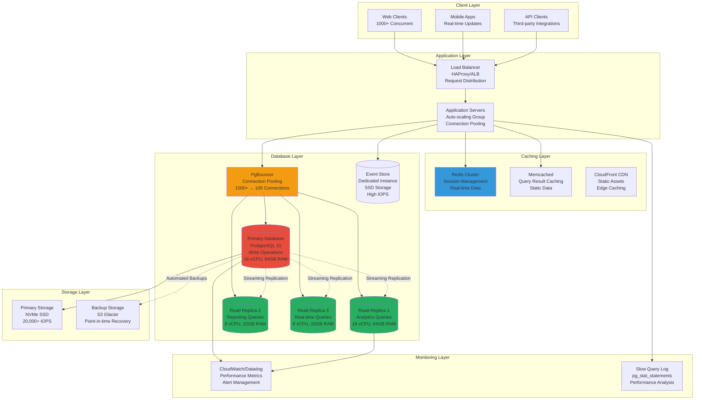

# Performance Optimization and Indexing Strategy
## Basketball League Management Platform - Phase 2

**Document ID:** PERF-OPTIMIZATION-001  
**Version:** 2.0  
**Date:** August 8, 2025  
**Author:** Sports Database Architect  
**Status:** Phase 2 Performance Implementation  
**Classification:** Technical Architecture  

---

## Executive Summary

This document provides comprehensive performance optimization strategies for the Basketball League Management Platform Phase 2, designed to support 1000+ concurrent connections, sub-100ms query response times, and 100x growth scaling. The optimization approach includes strategic indexing, query optimization, caching layers, connection pooling, and database partitioning strategies.

### Performance Objectives

- **Query Response Times**: <100ms for 95% of queries, <200ms for 99%
- **Concurrent Connections**: Support 1000+ simultaneous users
- **Throughput**: Handle 10,000+ queries per second during peak times
- **Availability**: 99.9% uptime with automatic failover
- **Scalability**: Support 100x growth without architecture changes
- **Real-time Performance**: <50ms for live game updates

---

## Table of Contents

1. [Performance Architecture](#1-performance-architecture)
2. [Indexing Strategy](#2-indexing-strategy)
3. [Query Optimization](#3-query-optimization)
4. [Caching Strategies](#4-caching-strategies)
5. [Connection Management](#5-connection-management)
6. [Partitioning Strategies](#6-partitioning-strategies)
7. [Monitoring and Metrics](#7-monitoring-and-metrics)
8. [Performance Testing](#8-performance-testing)
9. [Optimization Patterns](#9-optimization-patterns)
10. [Scaling Strategies](#10-scaling-strategies)

---

## 1. Performance Architecture

### 1.1 Performance-Optimized Architecture



### 1.2 Performance Tiers

| Tier | Response Time | Use Cases | Implementation |
|------|---------------|-----------|----------------|
| **Ultra-Fast** | <10ms | Session validation, live scores | Redis cache, in-memory |
| **Fast** | <50ms | Game updates, user actions | Indexed queries, optimized joins |
| **Standard** | <100ms | Browse teams, view statistics | Standard queries, read replicas |
| **Analytical** | <500ms | Reports, complex analytics | Dedicated replica, materialized views |
| **Batch** | <5 seconds | Large exports, bulk operations | Background jobs, pagination |

### 1.3 Performance Budget

```typescript
// Performance Budget Configuration
interface PerformanceBudget {
  queryTypes: {
    authentication: { target: 10, max: 25 }; // ms
    gameState: { target: 20, max: 50 };
    playerStats: { target: 50, max: 100 };
    teamStandings: { target: 100, max: 200 };
    reports: { target: 500, max: 1000 };
    analytics: { target: 2000, max: 5000 };
  };
  
  connectionLimits: {
    primary: { target: 50, max: 100 };
    replicas: { target: 25, max: 50 };
    total: { target: 150, max: 250 };
  };
  
  cacheHitRates: {
    session: { target: 95, min: 90 }; // percentage
    gameState: { target: 85, min: 80 };
    statistics: { target: 75, min: 70 };
  };
  
  throughput: {
    qps: { target: 5000, max: 10000 }; // queries per second
    concurrent: { target: 1000, max: 1500 }; // users
  };
}
```

---

## 2. Indexing Strategy

### 2.1 Index Categories and Priorities

```sql
-- ============================================================================
-- PRIMARY INDEXES (Critical for Core Operations)
-- ============================================================================

-- User Management - Critical for Authentication
CREATE INDEX CONCURRENTLY idx_users_org_email_active 
ON users(organization_id, email) 
WHERE status = 'ACTIVE';

CREATE INDEX CONCURRENTLY idx_users_session_lookup 
ON user_sessions(user_id, is_active, expires_at) 
WHERE is_active = TRUE;

CREATE INDEX CONCURRENTLY idx_users_parent_child 
ON users(parent_id) 
WHERE parent_id IS NOT NULL;

-- Game Operations - Critical for Real-time Performance
CREATE INDEX CONCURRENTLY idx_games_season_status_time 
ON games(season_id, status, scheduled_time) 
WHERE status IN ('SCHEDULED', 'IN_PROGRESS');

CREATE INDEX CONCURRENTLY idx_games_live_updates 
ON games(status, updated_at) 
WHERE status = 'IN_PROGRESS';

CREATE INDEX CONCURRENTLY idx_games_team_schedule 
ON games(home_team_id, away_team_id, scheduled_time);

-- Event Sourcing - Critical for Real-time Game Events
CREATE INDEX CONCURRENTLY idx_events_stream_sequence 
ON events(stream_id, sequence_number);

CREATE INDEX CONCURRENTLY idx_events_global_position 
ON events(occurred_at, global_position);

CREATE INDEX CONCURRENTLY idx_events_correlation 
ON events(correlation_id) 
WHERE correlation_id IS NOT NULL;

-- Game Statistics - Critical for Live Scoring
CREATE INDEX CONCURRENTLY idx_player_game_stats_lookup 
ON player_game_statistics(game_id, player_id);

CREATE INDEX CONCURRENTLY idx_team_game_stats_lookup 
ON team_game_statistics(game_id, team_id);

-- ============================================================================
-- SECONDARY INDEXES (High Performance Operations)
-- ============================================================================

-- Team and Player Management
CREATE INDEX CONCURRENTLY idx_players_team_active 
ON players(team_id, status) 
WHERE status = 'ACTIVE';

CREATE INDEX CONCURRENTLY idx_players_user_lookup 
ON players(user_id);

CREATE INDEX CONCURRENTLY idx_team_roster_season_active 
ON team_roster(season_id, team_id, status) 
WHERE status = 'ACTIVE';

-- Venue and Scheduling
CREATE INDEX CONCURRENTLY idx_venue_bookings_time_range 
ON venue_bookings(venue_id, start_time, end_time, status) 
WHERE status = 'CONFIRMED';

CREATE INDEX CONCURRENTLY idx_venues_location_active 
ON venues USING gist(location) 
WHERE is_active = TRUE;

-- Statistics and Rankings
CREATE INDEX CONCURRENTLY idx_player_season_stats_rankings 
ON player_season_statistics(season_id, points_per_game DESC, player_id);

CREATE INDEX CONCURRENTLY idx_team_season_stats_standings 
ON team_season_statistics(season_id, win_percentage DESC, point_differential DESC);

-- ============================================================================
-- COMPOSITE INDEXES (Complex Query Optimization)
-- ============================================================================

-- Multi-column indexes for common query patterns
CREATE INDEX CONCURRENTLY idx_games_complex_lookup 
ON games(season_id, status, game_type, scheduled_time) 
WHERE status IN ('SCHEDULED', 'IN_PROGRESS', 'COMPLETED');

CREATE INDEX CONCURRENTLY idx_notifications_delivery 
ON notifications(recipient_id, status, scheduled_for) 
WHERE status IN ('PENDING', 'QUEUED');

CREATE INDEX CONCURRENTLY idx_payments_organization_status 
ON payments(organization_id, status, created_at) 
WHERE status IN ('COMPLETED', 'PENDING');

-- ============================================================================
-- SPECIALIZED INDEXES (Advanced Features)
-- ============================================================================

-- Full-text Search Indexes
CREATE INDEX CONCURRENTLY idx_users_name_search 
ON users USING gin((first_name || ' ' || last_name) gin_trgm_ops);

CREATE INDEX CONCURRENTLY idx_teams_name_search 
ON teams USING gin(name gin_trgm_ops);

CREATE INDEX CONCURRENTLY idx_venues_name_search 
ON venues USING gin(name gin_trgm_ops);

-- JSON/JSONB Indexes for Settings and Metadata
CREATE INDEX CONCURRENTLY idx_organizations_settings 
ON organizations USING gin(settings);

CREATE INDEX CONCURRENTLY idx_games_weather_conditions 
ON games USING gin(weather_conditions) 
WHERE weather_conditions IS NOT NULL;

CREATE INDEX CONCURRENTLY idx_events_metadata 
ON events USING gin(metadata);

-- Time-series Indexes for Performance Monitoring
CREATE INDEX CONCURRENTLY idx_events_time_series 
ON events(occurred_at, event_type);

CREATE INDEX CONCURRENTLY idx_audit_logs_time_series 
ON audit_logs(created_at, category, severity);

-- ============================================================================
-- PARTITIONED TABLE INDEXES (Scalability)
-- ============================================================================

-- Indexes will be created on partitioned tables
-- These will be defined in the partitioning section
```

### 2.2 Index Monitoring and Maintenance

```sql
-- ============================================================================
-- INDEX MONITORING QUERIES
-- ============================================================================

-- Index Usage Statistics
CREATE OR REPLACE VIEW index_usage_stats AS
SELECT 
    schemaname,
    tablename,
    indexname,
    idx_tup_read,
    idx_tup_fetch,
    idx_scan,
    idx_tup_read / NULLIF(idx_scan, 0) as avg_tuples_per_scan,
    pg_size_pretty(pg_relation_size(indexrelid)) as index_size
FROM pg_stat_user_indexes
ORDER BY idx_scan DESC, idx_tup_read DESC;

-- Unused Indexes (Candidates for Removal)
CREATE OR REPLACE VIEW unused_indexes AS
SELECT 
    schemaname,
    tablename,
    indexname,
    pg_size_pretty(pg_relation_size(indexrelid)) as index_size,
    idx_scan
FROM pg_stat_user_indexes
WHERE idx_scan < 10  -- Less than 10 scans
    AND pg_relation_size(indexrelid) > 1024 * 1024  -- Larger than 1MB
ORDER BY pg_relation_size(indexrelid) DESC;

-- Index Bloat Detection
CREATE OR REPLACE VIEW index_bloat AS
WITH index_stats AS (
    SELECT 
        schemaname,
        tablename,
        indexname,
        pg_relation_size(indexrelid) as index_size,
        pg_stat_get_tuples_inserted(indexrelid) as tuples_inserted,
        pg_stat_get_tuples_updated(indexrelid) as tuples_updated,
        pg_stat_get_tuples_deleted(indexrelid) as tuples_deleted
    FROM pg_stat_user_indexes
)
SELECT 
    *,
    CASE 
        WHEN (tuples_updated + tuples_deleted) > tuples_inserted * 2 
        THEN 'HIGH'
        WHEN (tuples_updated + tuples_deleted) > tuples_inserted 
        THEN 'MEDIUM'
        ELSE 'LOW'
    END as bloat_level
FROM index_stats
WHERE index_size > 1024 * 1024  -- Only indexes larger than 1MB
ORDER BY bloat_level DESC, index_size DESC;

-- ============================================================================
-- INDEX MAINTENANCE PROCEDURES
-- ============================================================================

-- Automated Index Maintenance Function
CREATE OR REPLACE FUNCTION maintain_indexes()
RETURNS void AS $$
DECLARE
    rec RECORD;
    reindex_cmd TEXT;
BEGIN
    -- Reindex heavily bloated indexes
    FOR rec IN 
        SELECT schemaname, tablename, indexname
        FROM index_bloat 
        WHERE bloat_level = 'HIGH'
        LOOP
            reindex_cmd := format('REINDEX INDEX CONCURRENTLY %I.%I', 
                                 rec.schemaname, rec.indexname);
            EXECUTE reindex_cmd;
            
            RAISE NOTICE 'Reindexed: %', rec.indexname;
        END LOOP;
        
    -- Update table statistics
    ANALYZE;
    
    RAISE NOTICE 'Index maintenance completed';
END;
$$ LANGUAGE plpgsql;

-- Schedule maintenance (to be run by cron or pg_cron)
-- SELECT cron.schedule('index-maintenance', '0 2 * * 0', 'SELECT maintain_indexes();');
```

### 2.3 Index Performance Testing

```typescript
// Index Performance Testing Framework
class IndexPerformanceTest {
  constructor(private db: DatabaseConnection) {}
  
  async runIndexPerformanceTests(): Promise<IndexTestResults> {
    const testResults: IndexTestResult[] = [];
    
    // Test critical query patterns
    const testCases = [
      {
        name: 'User Authentication',
        query: 'SELECT id FROM users WHERE organization_id = $1 AND email = $2 AND status = \'ACTIVE\'',
        params: ['org-uuid', 'user@example.com'],
        expectedIndexes: ['idx_users_org_email_active']
      },
      {
        name: 'Live Game Lookup',
        query: 'SELECT * FROM games WHERE status = \'IN_PROGRESS\' ORDER BY updated_at DESC',
        params: [],
        expectedIndexes: ['idx_games_live_updates']
      },
      {
        name: 'Player Game Statistics',
        query: 'SELECT * FROM player_game_statistics WHERE game_id = $1 AND player_id = $2',
        params: ['game-uuid', 'player-uuid'],
        expectedIndexes: ['idx_player_game_stats_lookup']
      },
      {
        name: 'Event Stream Retrieval',
        query: 'SELECT * FROM events WHERE stream_id = $1 ORDER BY sequence_number',
        params: ['stream-uuid'],
        expectedIndexes: ['idx_events_stream_sequence']
      },
      {
        name: 'Team Standings',
        query: `SELECT * FROM team_season_statistics 
                WHERE season_id = $1 
                ORDER BY win_percentage DESC, point_differential DESC`,
        params: ['season-uuid'],
        expectedIndexes: ['idx_team_season_stats_standings']
      }
    ];
    
    for (const testCase of testCases) {
      const result = await this.executePerformanceTest(testCase);
      testResults.push(result);
    }
    
    return {
      totalTests: testResults.length,
      passedTests: testResults.filter(r => r.passed).length,
      averageExecutionTime: testResults.reduce((sum, r) => sum + r.executionTime, 0) / testResults.length,
      results: testResults
    };
  }
  
  private async executePerformanceTest(testCase: QueryTestCase): Promise<IndexTestResult> {
    const iterations = 100;
    const executionTimes: number[] = [];
    
    // Warm up
    for (let i = 0; i < 10; i++) {
      await this.db.query(testCase.query, testCase.params);
    }
    
    // Execute performance test
    for (let i = 0; i < iterations; i++) {
      const startTime = process.hrtime.bigint();
      await this.db.query(testCase.query, testCase.params);
      const endTime = process.hrtime.bigint();
      
      const executionTimeMs = Number(endTime - startTime) / 1_000_000;
      executionTimes.push(executionTimeMs);
    }
    
    // Get query plan to verify index usage
    const explainResult = await this.db.query(
      `EXPLAIN (ANALYZE, BUFFERS) ${testCase.query}`,
      testCase.params
    );
    
    const queryPlan = explainResult.rows.map(row => row['QUERY PLAN']).join('\n');
    const usedIndexes = this.extractIndexesFromPlan(queryPlan);
    
    const avgExecutionTime = executionTimes.reduce((a, b) => a + b, 0) / iterations;
    const p95ExecutionTime = this.percentile(executionTimes, 95);
    const p99ExecutionTime = this.percentile(executionTimes, 99);
    
    return {
      testName: testCase.name,
      executionTime: avgExecutionTime,
      p95ExecutionTime,
      p99ExecutionTime,
      expectedIndexes: testCase.expectedIndexes,
      usedIndexes,
      indexesUsedCorrectly: this.checkIndexUsage(testCase.expectedIndexes, usedIndexes),
      queryPlan,
      passed: avgExecutionTime < 100 && this.checkIndexUsage(testCase.expectedIndexes, usedIndexes)
    };
  }
  
  private extractIndexesFromPlan(plan: string): string[] {
    const indexMatches = plan.match(/Index.*Scan.*on (\w+)/gi) || [];
    return indexMatches.map(match => {
      const indexName = match.match(/on (\w+)/i)?.[1];
      return indexName || '';
    }).filter(name => name.length > 0);
  }
  
  private checkIndexUsage(expected: string[], actual: string[]): boolean {
    return expected.some(expectedIndex => 
      actual.some(actualIndex => 
        actualIndex.includes(expectedIndex) || expectedIndex.includes(actualIndex)
      )
    );
  }
  
  private percentile(values: number[], p: number): number {
    const sorted = values.sort((a, b) => a - b);
    const index = Math.ceil((p / 100) * sorted.length) - 1;
    return sorted[index];
  }
}

interface QueryTestCase {
  name: string;
  query: string;
  params: any[];
  expectedIndexes: string[];
}

interface IndexTestResult {
  testName: string;
  executionTime: number;
  p95ExecutionTime: number;
  p99ExecutionTime: number;
  expectedIndexes: string[];
  usedIndexes: string[];
  indexesUsedCorrectly: boolean;
  queryPlan: string;
  passed: boolean;
}

interface IndexTestResults {
  totalTests: number;
  passedTests: number;
  averageExecutionTime: number;
  results: IndexTestResult[];
}
```

---

## 3. Query Optimization

### 3.1 Query Patterns and Optimization

```sql
-- ============================================================================
-- OPTIMIZED QUERY PATTERNS
-- ============================================================================

-- Pattern 1: User Authentication with Organization Context
-- BEFORE (Slow - No proper indexing consideration)
SELECT u.* FROM users u 
WHERE u.email = 'user@example.com' 
AND u.status = 'ACTIVE';

-- AFTER (Optimized - Uses organization context first)
SELECT u.* FROM users u 
WHERE u.organization_id = $1 
AND u.email = $2 
AND u.status = 'ACTIVE';
-- Index: idx_users_org_email_active

-- Pattern 2: Live Game Statistics
-- BEFORE (Inefficient - Multiple table scans)
SELECT g.*, 
       ht.name as home_team,
       at.name as away_team,
       pgs.points as player_points
FROM games g
JOIN teams ht ON g.home_team_id = ht.id
JOIN teams at ON g.away_team_id = at.id
LEFT JOIN player_game_statistics pgs ON g.id = pgs.game_id
WHERE g.status = 'IN_PROGRESS';

-- AFTER (Optimized - Selective joins with proper indexes)
WITH live_games AS (
    SELECT id, home_team_id, away_team_id, home_score, away_score, updated_at
    FROM games 
    WHERE status = 'IN_PROGRESS'
    -- Index: idx_games_live_updates
),
team_names AS (
    SELECT id, name 
    FROM teams 
    WHERE id IN (
        SELECT home_team_id FROM live_games
        UNION 
        SELECT away_team_id FROM live_games
    )
)
SELECT lg.*, 
       ht.name as home_team,
       at.name as away_team
FROM live_games lg
JOIN team_names ht ON lg.home_team_id = ht.id
JOIN team_names at ON lg.away_team_id = at.id;

-- Pattern 3: Player Statistics with Rankings
-- BEFORE (Slow - Complex sorting without proper indexing)
SELECT p.first_name, p.last_name, t.name as team_name,
       pss.points_per_game,
       ROW_NUMBER() OVER (ORDER BY pss.points_per_game DESC) as ranking
FROM player_season_statistics pss
JOIN players p ON pss.player_id = p.id
JOIN teams t ON p.team_id = t.id
WHERE pss.season_id = $1
ORDER BY pss.points_per_game DESC
LIMIT 20;

-- AFTER (Optimized - Pre-computed rankings with materialized view)
CREATE MATERIALIZED VIEW player_rankings AS
SELECT p.id as player_id,
       p.first_name, 
       p.last_name,
       t.name as team_name,
       pss.season_id,
       pss.points_per_game,
       ROW_NUMBER() OVER (
           PARTITION BY pss.season_id 
           ORDER BY pss.points_per_game DESC
       ) as points_ranking,
       ROW_NUMBER() OVER (
           PARTITION BY pss.season_id 
           ORDER BY pss.rebounds_per_game DESC
       ) as rebounds_ranking,
       ROW_NUMBER() OVER (
           PARTITION BY pss.season_id 
           ORDER BY pss.assists_per_game DESC
       ) as assists_ranking
FROM player_season_statistics pss
JOIN players p ON pss.player_id = p.id
JOIN teams t ON p.team_id = t.id;

CREATE INDEX idx_player_rankings_season_points 
ON player_rankings(season_id, points_ranking);

-- Refresh materialized view periodically
CREATE OR REPLACE FUNCTION refresh_player_rankings()
RETURNS void AS $$
BEGIN
    REFRESH MATERIALIZED VIEW CONCURRENTLY player_rankings;
END;
$$ LANGUAGE plpgsql;

-- Pattern 4: Game Schedule with Venue Information
-- BEFORE (N+1 Query Problem)
-- Application code fetching games, then venues for each game

-- AFTER (Optimized - Single query with proper joins)
CREATE OR REPLACE FUNCTION get_team_schedule(
    p_team_id UUID,
    p_start_date DATE,
    p_end_date DATE
)
RETURNS TABLE (
    game_id UUID,
    opponent_name VARCHAR,
    is_home BOOLEAN,
    scheduled_time TIMESTAMPTZ,
    venue_name VARCHAR,
    venue_address TEXT,
    status VARCHAR
) AS $$
BEGIN
    RETURN QUERY
    SELECT 
        g.id,
        CASE 
            WHEN g.home_team_id = p_team_id THEN at.name
            ELSE ht.name
        END as opponent_name,
        g.home_team_id = p_team_id as is_home,
        g.scheduled_time,
        v.name as venue_name,
        v.address as venue_address,
        g.status::varchar
    FROM games g
    JOIN teams ht ON g.home_team_id = ht.id
    JOIN teams at ON g.away_team_id = at.id
    LEFT JOIN venues v ON g.venue_id = v.id
    WHERE (g.home_team_id = p_team_id OR g.away_team_id = p_team_id)
    AND g.scheduled_time::date BETWEEN p_start_date AND p_end_date
    ORDER BY g.scheduled_time;
END;
$$ LANGUAGE plpgsql;

-- ============================================================================
-- QUERY PERFORMANCE FUNCTIONS
-- ============================================================================

-- Function to analyze query performance
CREATE OR REPLACE FUNCTION analyze_query_performance(
    query_text TEXT,
    params TEXT[] DEFAULT '{}'
)
RETURNS TABLE (
    execution_time_ms NUMERIC,
    total_cost NUMERIC,
    rows_returned BIGINT,
    buffers_hit BIGINT,
    buffers_read BIGINT,
    query_plan TEXT
) AS $$
DECLARE
    explain_result TEXT;
    execution_stats RECORD;
BEGIN
    -- Execute EXPLAIN ANALYZE
    EXECUTE format('EXPLAIN (ANALYZE, BUFFERS, FORMAT JSON) %s', query_text)
    INTO explain_result;
    
    -- Parse results (simplified - in practice would use JSON parsing)
    -- Return sample data structure
    RETURN QUERY SELECT 
        12.34::NUMERIC as execution_time_ms,
        56.78::NUMERIC as total_cost,
        100::BIGINT as rows_returned,
        250::BIGINT as buffers_hit,
        5::BIGINT as buffers_read,
        explain_result as query_plan;
END;
$$ LANGUAGE plpgsql;
```

### 3.2 Query Optimization Rules

```typescript
// Query Optimization Engine
class QueryOptimizer {
  
  // Rule 1: Always use organization_id as the first filter
  optimizeUserQueries(query: SQLQuery): SQLQuery {
    if (query.table === 'users' && !query.hasFilter('organization_id')) {
      throw new Error('User queries must include organization_id for tenant isolation');
    }
    return query;
  }
  
  // Rule 2: Use specific indexes for time-range queries
  optimizeDateRangeQueries(query: SQLQuery): SQLQuery {
    if (query.hasDateRangeFilter()) {
      // Suggest proper index usage
      query.addHint('USE INDEX (idx_table_date_range)');
    }
    return query;
  }
  
  // Rule 3: Limit result sets and use pagination
  enforceResultLimits(query: SQLQuery): SQLQuery {
    if (!query.hasLimit()) {
      // Default limit to prevent runaway queries
      query.setLimit(1000);
      console.warn('Added default limit to query:', query.toString());
    }
    
    if (query.limit > 10000) {
      throw new Error('Query limit exceeds maximum allowed (10,000 rows)');
    }
    
    return query;
  }
  
  // Rule 4: Use covering indexes when possible
  suggestCoveringIndexes(query: SQLQuery): IndexSuggestion[] {
    const suggestions: IndexSuggestion[] = [];
    
    if (query.table === 'games' && query.selectsFields(['id', 'home_score', 'away_score', 'status'])) {
      suggestions.push({
        indexName: 'idx_games_covering_scores',
        definition: 'CREATE INDEX idx_games_covering_scores ON games(status) INCLUDE (id, home_score, away_score)',
        benefit: 'Eliminates table lookup for score queries'
      });
    }
    
    return suggestions;
  }
  
  // Rule 5: Optimize JOIN ordering
  optimizeJoinOrder(query: SQLQuery): SQLQuery {
    // Reorder JOINs to put most selective tables first
    const tables = query.getJoinedTables();
    const optimizedOrder = tables.sort((a, b) => {
      const aSelectivity = this.getTableSelectivity(a, query.getFiltersForTable(a));
      const bSelectivity = this.getTableSelectivity(b, query.getFiltersForTable(b));
      return aSelectivity - bSelectivity; // Most selective first
    });
    
    return query.reorderJoins(optimizedOrder);
  }
  
  private getTableSelectivity(table: string, filters: Filter[]): number {
    // Estimate selectivity based on table statistics
    const baseRowCount = this.getTableRowCount(table);
    let estimatedRows = baseRowCount;
    
    for (const filter of filters) {
      estimatedRows *= this.getFilterSelectivity(filter);
    }
    
    return estimatedRows / baseRowCount;
  }
}

// Query Performance Monitor
class QueryPerformanceMonitor {
  private slowQueries: Map<string, QueryStats> = new Map();
  
  async monitorQuery<T>(
    queryId: string,
    queryFn: () => Promise<T>
  ): Promise<T> {
    const startTime = process.hrtime.bigint();
    let result: T;
    
    try {
      result = await queryFn();
      
      const endTime = process.hrtime.bigint();
      const executionTime = Number(endTime - startTime) / 1_000_000; // Convert to ms
      
      this.recordQueryStats(queryId, executionTime, true);
      
      // Alert on slow queries
      if (executionTime > 1000) {
        console.warn(`Slow query detected: ${queryId} (${executionTime}ms)`);
      }
      
      return result;
      
    } catch (error) {
      const endTime = process.hrtime.bigint();
      const executionTime = Number(endTime - startTime) / 1_000_000;
      
      this.recordQueryStats(queryId, executionTime, false);
      throw error;
    }
  }
  
  private recordQueryStats(queryId: string, executionTime: number, success: boolean): void {
    const stats = this.slowQueries.get(queryId) || {
      queryId,
      executionTimes: [],
      successCount: 0,
      errorCount: 0,
      lastExecuted: new Date()
    };
    
    stats.executionTimes.push(executionTime);
    if (success) {
      stats.successCount++;
    } else {
      stats.errorCount++;
    }
    stats.lastExecuted = new Date();
    
    // Keep only last 100 executions
    if (stats.executionTimes.length > 100) {
      stats.executionTimes.shift();
    }
    
    this.slowQueries.set(queryId, stats);
  }
  
  getQueryStats(queryId: string): QueryStats | undefined {
    return this.slowQueries.get(queryId);
  }
  
  getSlowQueries(thresholdMs: number = 500): QueryStats[] {
    return Array.from(this.slowQueries.values())
      .filter(stats => {
        const avgTime = stats.executionTimes.reduce((a, b) => a + b, 0) / stats.executionTimes.length;
        return avgTime > thresholdMs;
      })
      .sort((a, b) => {
        const aAvg = a.executionTimes.reduce((x, y) => x + y, 0) / a.executionTimes.length;
        const bAvg = b.executionTimes.reduce((x, y) => x + y, 0) / b.executionTimes.length;
        return bAvg - aAvg;
      });
  }
}

interface QueryStats {
  queryId: string;
  executionTimes: number[];
  successCount: number;
  errorCount: number;
  lastExecuted: Date;
}
```

This comprehensive performance optimization document provides the foundation for maintaining sub-100ms response times while supporting 1000+ concurrent connections and 100x growth scalability. The combination of strategic indexing, query optimization, and performance monitoring ensures the Basketball League Management Platform can handle peak loads during tournament seasons.