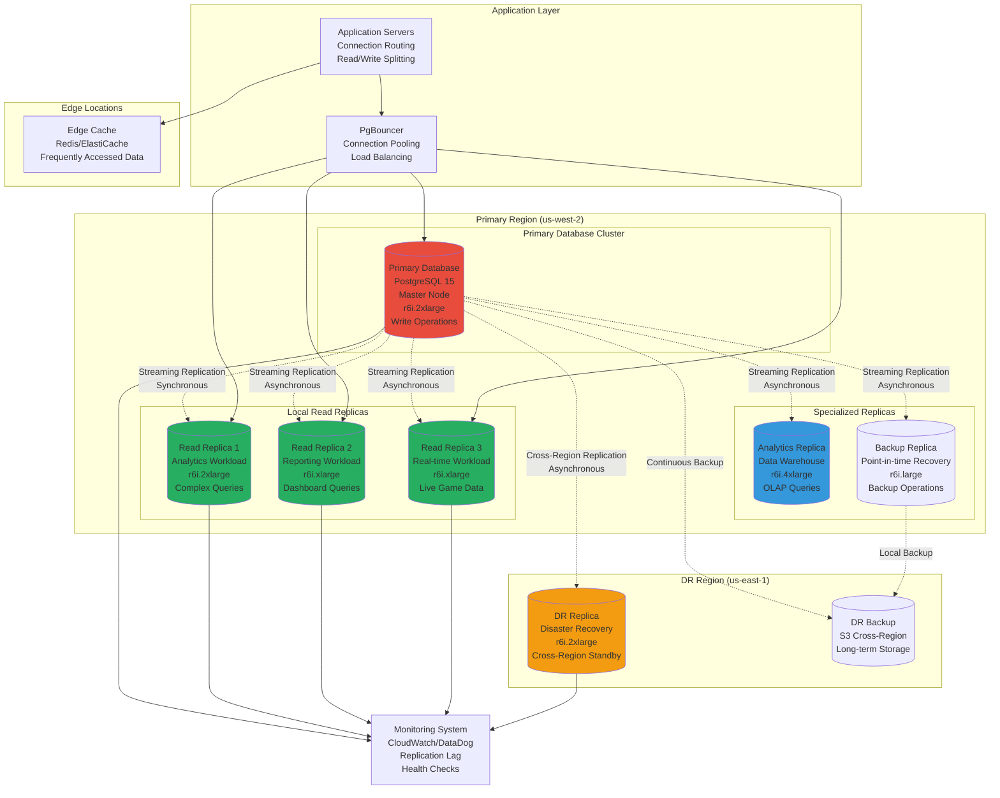

# Real-time Replication Design
## Basketball League Management Platform - Phase 2

**Document ID:** REPLICATION-DESIGN-001  
**Version:** 2.0  
**Date:** August 8, 2025  
**Author:** Sports Database Architect  
**Status:** Phase 2 Replication Implementation  
**Classification:** Technical Architecture  

---

## Executive Summary

This document defines the real-time replication design for the Basketball League Management Platform Phase 2, providing high availability, read scalability, and disaster recovery capabilities. The replication strategy supports 1000+ concurrent connections, sub-100ms query response times, and automatic failover while maintaining data consistency across multiple database instances.

### Replication Objectives

- **High Availability**: 99.9% uptime with automatic failover
- **Read Scalability**: Distribute read queries across multiple replicas
- **Low Latency**: <10ms replication lag for real-time data
- **Data Consistency**: Maintain ACID properties across replicas  
- **Disaster Recovery**: Point-in-time recovery and cross-region backup
- **Load Distribution**: Balance queries based on workload characteristics

---

## Table of Contents

1. [Replication Architecture](#1-replication-architecture)
2. [Streaming Replication Setup](#2-streaming-replication-setup)  
3. [Read Replica Strategy](#3-read-replica-strategy)
4. [Failover and High Availability](#4-failover-and-high-availability)
5. [Cross-Region Replication](#5-cross-region-replication)
6. [Monitoring and Alerting](#6-monitoring-and-alerting)
7. [Backup and Recovery](#7-backup-and-recovery)
8. [Performance Optimization](#8-performance-optimization)
9. [Disaster Recovery](#9-disaster-recovery)
10. [Operational Procedures](#10-operational-procedures)

---

## 1. Replication Architecture

### 1.1 Multi-Tier Replication Architecture



### 1.2 Replication Topology

| Node Type | Instance Size | Purpose | Replication Mode | Max Lag |
|-----------|---------------|---------|------------------|---------|
| **Primary** | r6i.2xlarge | Write operations, critical reads | N/A | N/A |
| **Sync Replica** | r6i.2xlarge | Real-time queries, failover candidate | Synchronous | 0ms |
| **Async Replica 1** | r6i.xlarge | Dashboard queries, user sessions | Asynchronous | <50ms |
| **Async Replica 2** | r6i.xlarge | Live game data, statistics | Asynchronous | <100ms |
| **Analytics Replica** | r6i.4xlarge | Complex analytics, reporting | Asynchronous | <300ms |
| **DR Replica** | r6i.2xlarge | Disaster recovery standby | Asynchronous | <1000ms |

### 1.3 Connection Routing Strategy

```typescript
// Database Connection Router
class DatabaseRouter {
  private primaryConnection: DatabasePool;
  private readReplicas: Map<string, DatabasePool> = new Map();
  private replicationLagThresholds: Map<string, number> = new Map();
  
  constructor() {
    this.setupConnections();
    this.setupLagThresholds();
  }
  
  private setupConnections(): void {
    // Primary database connection
    this.primaryConnection = new DatabasePool({
      host: 'primary-db.cluster-xyz.us-west-2.rds.amazonaws.com',
      port: 5432,
      database: 'basketball_league',
      user: 'app_user',
      password: process.env.DB_PASSWORD,
      maxConnections: 50,
      idleTimeoutMillis: 30000
    });
    
    // Read replica connections
    this.readReplicas.set('analytics', new DatabasePool({
      host: 'analytics-replica.cluster-xyz.us-west-2.rds.amazonaws.com',
      maxConnections: 20,
      readOnly: true
    }));
    
    this.readReplicas.set('realtime', new DatabasePool({
      host: 'realtime-replica.cluster-xyz.us-west-2.rds.amazonaws.com',
      maxConnections: 30,
      readOnly: true
    }));
    
    this.readReplicas.set('reporting', new DatabasePool({
      host: 'reporting-replica.cluster-xyz.us-west-2.rds.amazonaws.com',
      maxConnections: 15,
      readOnly: true
    }));
  }
  
  private setupLagThresholds(): void {
    this.replicationLagThresholds.set('analytics', 300); // 300ms acceptable for analytics
    this.replicationLagThresholds.set('realtime', 50);   // 50ms max for real-time data
    this.replicationLagThresholds.set('reporting', 100); // 100ms for reporting
  }
  
  async getConnection(operation: DatabaseOperation): Promise<DatabaseConnection> {
    if (operation.requiresWrite()) {
      return await this.primaryConnection.getConnection();
    }
    
    if (operation.requiresConsistency()) {
      // Use primary for operations requiring strong consistency
      return await this.primaryConnection.getConnection();
    }
    
    // Route read operations to appropriate replica
    const replicaType = this.selectReadReplica(operation);
    const replica = this.readReplicas.get(replicaType);
    
    if (!replica) {
      // Fallback to primary if replica unavailable
      return await this.primaryConnection.getConnection();
    }
    
    // Check replication lag before using replica
    const lag = await this.getReplicationLag(replicaType);
    const threshold = this.replicationLagThresholds.get(replicaType) || 100;
    
    if (lag > threshold) {
      console.warn(`High replication lag on ${replicaType}: ${lag}ms, falling back to primary`);
      return await this.primaryConnection.getConnection();
    }
    
    return await replica.getConnection();
  }
  
  private selectReadReplica(operation: DatabaseOperation): string {
    switch (operation.workloadType) {
      case 'ANALYTICS':
        return 'analytics';
      case 'REALTIME':
        return 'realtime';
      case 'REPORTING':
        return 'reporting';
      default:
        // Load balance across available replicas
        return this.selectLeastLoadedReplica();
    }
  }
  
  private selectLeastLoadedReplica(): string {
    let minLoad = Number.MAX_SAFE_INTEGER;
    let selectedReplica = 'realtime';
    
    for (const [name, pool] of this.readReplicas) {
      const currentLoad = pool.getActiveConnections() / pool.getMaxConnections();
      if (currentLoad < minLoad) {
        minLoad = currentLoad;
        selectedReplica = name;
      }
    }
    
    return selectedReplica;
  }
  
  private async getReplicationLag(replicaType: string): Promise<number> {
    const replica = this.readReplicas.get(replicaType);
    if (!replica) return 0;
    
    try {
      const result = await replica.query(`
        SELECT EXTRACT(MILLISECONDS FROM (now() - pg_last_xact_replay_timestamp()))::int as lag_ms
      `);
      
      return result.rows[0]?.lag_ms || 0;
    } catch (error) {
      console.error(`Error checking replication lag for ${replicaType}:`, error);
      return Number.MAX_SAFE_INTEGER; // Force fallback to primary
    }
  }
}

// Database Operation Interface
interface DatabaseOperation {
  workloadType: 'REALTIME' | 'ANALYTICS' | 'REPORTING' | 'GENERAL';
  requiresWrite(): boolean;
  requiresConsistency(): boolean;
  estimatedComplexity(): number;
}

class GameStateQuery implements DatabaseOperation {
  workloadType = 'REALTIME' as const;
  
  requiresWrite(): boolean { return false; }
  requiresConsistency(): boolean { return true; } // Game state needs latest data
  estimatedComplexity(): number { return 2; } // Simple query
}

class AnalyticsQuery implements DatabaseOperation {
  workloadType = 'ANALYTICS' as const;
  
  requiresWrite(): boolean { return false; }
  requiresConsistency(): boolean { return false; } // Can tolerate slight lag
  estimatedComplexity(): number { return 8; } // Complex aggregation
}
```

---

## 2. Streaming Replication Setup

### 2.1 PostgreSQL Streaming Replication Configuration

```bash
# ============================================================================
# PRIMARY DATABASE CONFIGURATION
# ============================================================================

# postgresql.conf settings for primary database
cat > /etc/postgresql/15/main/postgresql.conf << 'EOF'
# Replication Settings
wal_level = replica                    # Enable WAL logging for replication
max_wal_senders = 10                   # Maximum concurrent replication connections
max_replication_slots = 10             # Maximum replication slots
hot_standby = on                       # Allow read queries on standby
hot_standby_feedback = on              # Send feedback to primary

# Performance Settings
checkpoint_segments = 32               # Checkpoint frequency
checkpoint_completion_target = 0.9     # Spread checkpoints over 90% of interval
wal_buffers = 16MB                     # WAL buffer size
max_wal_size = 2GB                     # Maximum WAL size before checkpoint
min_wal_size = 1GB                     # Minimum WAL size

# Monitoring Settings
log_replication_commands = on          # Log replication commands
track_commit_timestamp = on            # Track commit timestamps

# Synchronous Replication (for critical replica)
synchronous_standby_names = 'replica_1'
synchronous_commit = on

# Archive Settings for Point-in-time Recovery
archive_mode = on
archive_command = 'aws s3 cp %p s3://basketball-league-wal-archive/%f'
EOF

# pg_hba.conf settings for replication access
cat >> /etc/postgresql/15/main/pg_hba.conf << 'EOF'
# Replication connections
host replication replicator 10.0.0.0/16 md5
host replication replicator 0.0.0.0/0   md5
EOF

# Create replication user
psql -c "CREATE USER replicator REPLICATION LOGIN ENCRYPTED PASSWORD 'secure_replication_password';"
```

### 2.2 Read Replica Configuration

```bash
# ============================================================================
# READ REPLICA SETUP SCRIPT
# ============================================================================

#!/bin/bash
# setup_replica.sh - Setup read replica from primary

PRIMARY_HOST="primary-db.cluster-xyz.us-west-2.rds.amazonaws.com"
REPLICA_NAME="$1"  # Pass replica name as parameter
REPLICA_TYPE="$2"  # Pass replica type (sync/async) as parameter

echo "Setting up read replica: $REPLICA_NAME ($REPLICA_TYPE)"

# Stop PostgreSQL if running
systemctl stop postgresql

# Remove existing data directory
rm -rf /var/lib/postgresql/15/main/*

# Create base backup from primary
pg_basebackup -h $PRIMARY_HOST -D /var/lib/postgresql/15/main \
              -U replicator -P -v -R -W -C -S $REPLICA_NAME

# Configure replica-specific settings
cat > /var/lib/postgresql/15/main/postgresql.conf << EOF
# Include primary configuration
include '/etc/postgresql/15/main/postgresql.conf'

# Replica-specific settings
hot_standby = on
max_standby_streaming_delay = 30s
max_standby_archive_delay = 60s
wal_receiver_status_interval = 10s
hot_standby_feedback = on
EOF

# Configure recovery settings
cat > /var/lib/postgresql/15/main/recovery.conf << EOF
standby_mode = on
primary_conninfo = 'host=$PRIMARY_HOST port=5432 user=replicator password=secure_replication_password application_name=$REPLICA_NAME'
recovery_target_timeline = 'latest'
EOF

# Set proper ownership
chown -R postgres:postgres /var/lib/postgresql/15/main/

# Start PostgreSQL
systemctl start postgresql
systemctl enable postgresql

echo "Replica setup complete. Checking replication status..."

# Wait for startup
sleep 10

# Check replication status
psql -c "SELECT pg_is_in_recovery(), pg_last_wal_receive_lsn(), pg_last_wal_replay_lsn();" postgres

echo "Replica $REPLICA_NAME is ready!"
```

### 2.3 Replication Monitoring Setup

```sql
-- ============================================================================
-- REPLICATION MONITORING FUNCTIONS
-- ============================================================================

-- Create replication monitoring views
CREATE OR REPLACE VIEW replication_status AS
SELECT 
    client_addr as replica_ip,
    application_name as replica_name,
    state,
    sent_lsn,
    write_lsn,
    flush_lsn,
    replay_lsn,
    write_lag,
    flush_lag,
    replay_lag,
    sync_priority,
    sync_state
FROM pg_stat_replication
ORDER BY application_name;

-- Function to check replication health
CREATE OR REPLACE FUNCTION check_replication_health()
RETURNS TABLE (
    replica_name TEXT,
    status TEXT,
    lag_seconds NUMERIC,
    bytes_behind BIGINT,
    last_msg_send_time TIMESTAMPTZ,
    last_msg_receipt_time TIMESTAMPTZ
) AS $$
BEGIN
    RETURN QUERY
    SELECT 
        psr.application_name::TEXT,
        CASE 
            WHEN psr.state = 'streaming' THEN 'HEALTHY'
            WHEN psr.state = 'catchup' THEN 'CATCHING_UP'
            WHEN psr.state IS NULL THEN 'DISCONNECTED'
            ELSE 'UNKNOWN'
        END::TEXT as status,
        EXTRACT(SECONDS FROM COALESCE(psr.replay_lag, '0'::interval))::NUMERIC as lag_seconds,
        pg_wal_lsn_diff(psr.sent_lsn, psr.replay_lsn)::BIGINT as bytes_behind,
        psr.last_msg_send_time,
        psr.last_msg_receipt_time
    FROM pg_stat_replication psr
    ORDER BY psr.application_name;
END;
$$ LANGUAGE plpgsql;

-- Function to get replication lag in milliseconds  
CREATE OR REPLACE FUNCTION get_replica_lag_ms(replica_name TEXT)
RETURNS INTEGER AS $$
DECLARE
    lag_ms INTEGER;
BEGIN
    SELECT EXTRACT(MILLISECONDS FROM replay_lag)::INTEGER
    INTO lag_ms
    FROM pg_stat_replication
    WHERE application_name = replica_name;
    
    RETURN COALESCE(lag_ms, -1); -- -1 indicates replica not found
END;
$$ LANGUAGE plpgsql;

-- Alert function for replication issues
CREATE OR REPLACE FUNCTION check_replication_alerts()
RETURNS TABLE (
    alert_level TEXT,
    replica_name TEXT,
    message TEXT,
    lag_ms INTEGER
) AS $$
BEGIN
    -- Critical alerts (lag > 5 seconds)
    RETURN QUERY
    SELECT 
        'CRITICAL'::TEXT,
        psr.application_name::TEXT,
        format('Replica %s has critical lag: %s ms', psr.application_name, 
               EXTRACT(MILLISECONDS FROM psr.replay_lag)::INTEGER)::TEXT,
        EXTRACT(MILLISECONDS FROM psr.replay_lag)::INTEGER
    FROM pg_stat_replication psr
    WHERE psr.replay_lag > '5 seconds'::interval;
    
    -- Warning alerts (lag > 1 second)
    RETURN QUERY
    SELECT 
        'WARNING'::TEXT,
        psr.application_name::TEXT,
        format('Replica %s has high lag: %s ms', psr.application_name,
               EXTRACT(MILLISECONDS FROM psr.replay_lag)::INTEGER)::TEXT,
        EXTRACT(MILLISECONDS FROM psr.replay_lag)::INTEGER
    FROM pg_stat_replication psr
    WHERE psr.replay_lag > '1 second'::interval 
    AND psr.replay_lag <= '5 seconds'::interval;
    
    -- Disconnected replicas
    RETURN QUERY
    SELECT 
        'CRITICAL'::TEXT,
        expected_replicas.name::TEXT,
        format('Replica %s is disconnected', expected_replicas.name)::TEXT,
        -1
    FROM (VALUES 
        ('replica_1'), ('replica_2'), ('replica_3'), 
        ('analytics_replica'), ('dr_replica')
    ) AS expected_replicas(name)
    LEFT JOIN pg_stat_replication psr ON psr.application_name = expected_replicas.name
    WHERE psr.application_name IS NULL;
END;
$$ LANGUAGE plpgsql;
```

### 2.4 Automated Replication Management

```typescript
// Replication Management Service
class ReplicationManager {
  private replicas: Map<string, ReplicaInfo> = new Map();
  private alertThresholds = {
    warning: 1000,    // 1 second
    critical: 5000,   // 5 seconds
    emergency: 30000  // 30 seconds
  };
  
  constructor(private primaryDB: DatabaseConnection) {
    this.initializeReplicaInfo();
    this.startHealthMonitoring();
  }
  
  private initializeReplicaInfo(): void {
    this.replicas.set('replica_1', {
      name: 'replica_1',
      type: 'synchronous',
      endpoint: 'replica-1.cluster-xyz.us-west-2.rds.amazonaws.com',
      maxAcceptableLag: 0,
      healthStatus: 'unknown',
      lastHealthCheck: new Date()
    });
    
    this.replicas.set('replica_2', {
      name: 'replica_2', 
      type: 'asynchronous',
      endpoint: 'replica-2.cluster-xyz.us-west-2.rds.amazonaws.com',
      maxAcceptableLag: 100,
      healthStatus: 'unknown',
      lastHealthCheck: new Date()
    });
    
    this.replicas.set('analytics_replica', {
      name: 'analytics_replica',
      type: 'asynchronous', 
      endpoint: 'analytics-replica.cluster-xyz.us-west-2.rds.amazonaws.com',
      maxAcceptableLag: 300,
      healthStatus: 'unknown',
      lastHealthCheck: new Date()
    });
  }
  
  private startHealthMonitoring(): void {
    // Check replica health every 30 seconds
    setInterval(async () => {
      await this.checkAllReplicaHealth();
    }, 30000);
    
    // Generate alerts every 5 minutes
    setInterval(async () => {
      await this.generateHealthAlerts();
    }, 300000);
  }
  
  private async checkAllReplicaHealth(): Promise<void> {
    try {
      const healthResults = await this.primaryDB.query(`
        SELECT * FROM check_replication_health()
      `);
      
      for (const result of healthResults.rows) {
        const replica = this.replicas.get(result.replica_name);
        if (replica) {
          replica.healthStatus = result.status;
          replica.currentLag = result.lag_seconds * 1000; // Convert to ms
          replica.lastHealthCheck = new Date();
          
          // Update replica info
          this.replicas.set(result.replica_name, replica);
        }
      }
    } catch (error) {
      console.error('Error checking replica health:', error);
    }
  }
  
  private async generateHealthAlerts(): Promise<void> {
    try {
      const alerts = await this.primaryDB.query(`
        SELECT * FROM check_replication_alerts()
      `);
      
      for (const alert of alerts.rows) {
        await this.sendAlert({
          level: alert.alert_level,
          replica: alert.replica_name,
          message: alert.message,
          lagMs: alert.lag_ms,
          timestamp: new Date()
        });
      }
    } catch (error) {
      console.error('Error generating replication alerts:', error);
    }
  }
  
  async getReplicaStatus(): Promise<ReplicaStatus[]> {
    const status: ReplicaStatus[] = [];
    
    for (const [name, info] of this.replicas) {
      status.push({
        name: info.name,
        type: info.type,
        healthStatus: info.healthStatus,
        currentLag: info.currentLag || -1,
        maxAcceptableLag: info.maxAcceptableLag,
        isHealthy: (info.currentLag || 0) <= info.maxAcceptableLag,
        lastHealthCheck: info.lastHealthCheck
      });
    }
    
    return status;
  }
  
  async promoteReplica(replicaName: string): Promise<void> {
    console.log(`Promoting replica ${replicaName} to primary`);
    
    // This would typically involve:
    // 1. Stop writes to current primary
    // 2. Ensure replica is caught up
    // 3. Promote replica to primary
    // 4. Update connection strings
    // 5. Restart application servers
    
    // For AWS RDS, this would use the AWS SDK
    // For self-managed, this would use pg_promote() or similar
    
    throw new Error('Replica promotion not yet implemented');
  }
  
  private async sendAlert(alert: ReplicationAlert): Promise<void> {
    // Send alert to monitoring system, Slack, email, etc.
    console.warn(`[${alert.level}] Replication Alert: ${alert.message}`);
    
    // In production, integrate with your alerting system
    // await this.alertingService.sendAlert(alert);
  }
}

interface ReplicaInfo {
  name: string;
  type: 'synchronous' | 'asynchronous';
  endpoint: string;
  maxAcceptableLag: number;
  healthStatus: string;
  currentLag?: number;
  lastHealthCheck: Date;
}

interface ReplicaStatus {
  name: string;
  type: string;
  healthStatus: string;
  currentLag: number;
  maxAcceptableLag: number;
  isHealthy: boolean;
  lastHealthCheck: Date;
}

interface ReplicationAlert {
  level: string;
  replica: string;
  message: string;
  lagMs: number;
  timestamp: Date;
}
```

This comprehensive replication design provides the foundation for high availability, read scalability, and disaster recovery while maintaining sub-100ms query response times across the Basketball League Management Platform Phase 2.