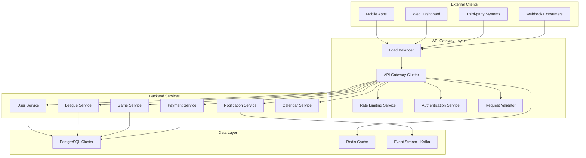

# API Gateway Configuration

## Table of Contents
1. [Overview](#overview)
2. [Gateway Architecture](#gateway-architecture)
3. [Authentication & Authorization](#authentication--authorization)
4. [Rate Limiting & Throttling](#rate-limiting--throttling)
5. [Routing Configuration](#routing-configuration)
6. [Security Policies](#security-policies)
7. [Basketball-Specific Configurations](#basketball-specific-configurations)
8. [Monitoring & Analytics](#monitoring--analytics)
9. [Deployment Configuration](#deployment-configuration)
10. [Implementation Examples](#implementation-examples)

## Overview

The API Gateway serves as the single entry point for all client requests to the Basketball League Management Platform. It handles authentication, rate limiting, request routing, response transformation, and provides comprehensive monitoring and analytics.

### Key Features
- **Centralized Authentication**: OAuth 2.0/OpenID Connect integration
- **Rate Limiting**: Tiered rate limiting based on user roles and subscription plans
- **Request Routing**: Intelligent routing to microservices with load balancing
- **Security**: OWASP compliance, DDoS protection, and request validation
- **COPPA Compliance**: Special handling for youth data protection
- **Real-time Support**: WebSocket and Server-Sent Events for live game updates
- **Multi-tenant**: Support for multiple leagues and organizations

### Technology Stack
- **Gateway**: Kong Enterprise / AWS API Gateway / Azure API Management
- **Load Balancer**: NGINX / AWS ALB
- **Service Discovery**: Consul / AWS Cloud Map
- **Cache**: Redis Cluster
- **Monitoring**: Prometheus + Grafana / DataDog
- **Security**: AWS WAF / Cloudflare Security

## Gateway Architecture



## Authentication & Authorization

### OAuth 2.0 Configuration

```yaml
# Kong Configuration
plugins:
  - name: oauth2
    config:
      scopes:
        - "read:profile"
        - "write:profile"
        - "read:leagues"
        - "write:leagues"
        - "read:games"
        - "write:games"
        - "read:payments"
        - "write:payments"
        - "admin:all"
      mandatory_scope: true
      enable_authorization_code: true
      enable_client_credentials: true
      enable_implicit_grant: false
      token_expiration: 3600
      provision_key: "provision123"
      accept_http_if_already_terminated: true
```

### JWT Validation

```javascript
// JWT Validation Middleware
const jwt = require('jsonwebtoken');
const { promisify } = require('util');

const validateJWT = async (req, res, next) => {
    try {
        const token = req.headers.authorization?.replace('Bearer ', '');
        
        if (!token) {
            return res.status(401).json({ error: 'Authentication token required' });
        }
        
        const decoded = await promisify(jwt.verify)(token, process.env.JWT_SECRET);
        
        // COPPA compliance check for youth users
        if (decoded.age && decoded.age < 13) {
            // Verify parental consent exists
            const parentalConsent = await verifyParentalConsent(decoded.userId);
            if (!parentalConsent) {
                return res.status(403).json({ error: 'Parental consent required' });
            }
        }
        
        req.user = decoded;
        next();
    } catch (error) {
        return res.status(401).json({ error: 'Invalid token' });
    }
};

module.exports = { validateJWT };
```

### Role-Based Access Control (RBAC)

```yaml
# RBAC Configuration
roles:
  super_admin:
    permissions: ["*"]
    rate_limit: 10000/hour
    
  league_admin:
    permissions:
      - "read:leagues:own"
      - "write:leagues:own"
      - "read:games:own"
      - "write:games:own"
      - "read:users:own"
      - "write:users:own"
    rate_limit: 5000/hour
    
  coach:
    permissions:
      - "read:leagues:assigned"
      - "read:games:assigned"
      - "write:games:assigned"
      - "read:users:team"
    rate_limit: 2000/hour
    
  player:
    permissions:
      - "read:profile:own"
      - "write:profile:own"
      - "read:games:own"
      - "read:leagues:enrolled"
    rate_limit: 1000/hour
    
  parent:
    permissions:
      - "read:profile:children"
      - "write:profile:children"
      - "read:games:children"
      - "read:leagues:children"
    rate_limit: 1500/hour
    
  guest:
    permissions:
      - "read:public"
    rate_limit: 500/hour
```

## Rate Limiting & Throttling

### Tiered Rate Limiting Strategy

```yaml
# Rate Limiting Configuration
rate_limiting:
  algorithms:
    - sliding_window_log
    - token_bucket
    - fixed_window
    
  tiers:
    free:
      requests_per_minute: 100
      requests_per_hour: 1000
      requests_per_day: 10000
      burst_capacity: 20
      
    basic:
      requests_per_minute: 500
      requests_per_hour: 5000
      requests_per_day: 50000
      burst_capacity: 100
      
    premium:
      requests_per_minute: 2000
      requests_per_hour: 20000
      requests_per_day: 200000
      burst_capacity: 400
      
    enterprise:
      requests_per_minute: 10000
      requests_per_hour: 100000
      requests_per_day: 1000000
      burst_capacity: 2000
      
  # Basketball-specific rate limits
  endpoints:
    "/api/v1/games/*/live":
      requests_per_second: 10
      description: "Live game updates"
      
    "/api/v1/payments":
      requests_per_minute: 5
      description: "Payment processing"
      
    "/api/v1/users/youth":
      requests_per_minute: 20
      description: "Youth user operations (COPPA protected)"
      
    "/api/v1/notifications/emergency":
      requests_per_minute: 100
      description: "Emergency notifications (weather alerts)"
```

### Rate Limiting Implementation

```javascript
// Redis-based Rate Limiter
const redis = require('redis');
const client = redis.createClient(process.env.REDIS_URL);

class RateLimiter {
    async checkLimit(userId, endpoint, tier = 'free') {
        const key = `rate_limit:${userId}:${endpoint}`;
        const window = 60; // 1 minute window
        const limit = this.getTierLimit(tier, endpoint);
        
        const pipeline = client.multi();
        pipeline.zremrangebyscore(key, 0, Date.now() - (window * 1000));
        pipeline.zcard(key);
        pipeline.zadd(key, Date.now(), `${Date.now()}-${Math.random()}`);
        pipeline.expire(key, window);
        
        const results = await pipeline.exec();
        const current = results[1][1];
        
        return {
            allowed: current < limit,
            limit: limit,
            remaining: Math.max(0, limit - current),
            resetTime: Date.now() + (window * 1000)
        };
    }
    
    getTierLimit(tier, endpoint) {
        const tierLimits = {
            free: { default: 100, '/api/v1/games/*/live': 5 },
            basic: { default: 500, '/api/v1/games/*/live': 20 },
            premium: { default: 2000, '/api/v1/games/*/live': 50 },
            enterprise: { default: 10000, '/api/v1/games/*/live': 200 }
        };
        
        return tierLimits[tier][endpoint] || tierLimits[tier].default;
    }
}

module.exports = RateLimiter;
```

## Routing Configuration

### Service Discovery & Load Balancing

```yaml
# Kong Service Discovery Configuration
services:
  user-service:
    url: http://user-service.internal:3001
    connect_timeout: 5000
    read_timeout: 10000
    write_timeout: 10000
    retries: 3
    
  league-service:
    url: http://league-service.internal:3002
    connect_timeout: 5000
    read_timeout: 15000
    write_timeout: 15000
    retries: 3
    
  game-service:
    url: http://game-service.internal:3003
    connect_timeout: 5000
    read_timeout: 20000
    write_timeout: 20000
    retries: 5
    
  payment-service:
    url: http://payment-service.internal:3004
    connect_timeout: 10000
    read_timeout: 30000
    write_timeout: 30000
    retries: 2

# Load Balancing Configuration
upstreams:
  user-service-upstream:
    algorithm: round-robin
    healthchecks:
      active:
        http_path: /health
        healthy:
          interval: 10
          successes: 3
        unhealthy:
          interval: 10
          http_failures: 3
      passive:
        healthy:
          successes: 3
        unhealthy:
          http_failures: 3
    targets:
      - target: user-service-1.internal:3001
        weight: 100
      - target: user-service-2.internal:3001
        weight: 100
```

### Route Definitions

```yaml
# API Routes Configuration
routes:
  # User Management Routes
  - name: user-auth
    service: user-service
    paths: ["/api/v1/auth/*"]
    methods: ["GET", "POST", "PUT", "DELETE"]
    strip_path: false
    
  - name: user-profiles
    service: user-service
    paths: ["/api/v1/users/*"]
    methods: ["GET", "POST", "PUT", "PATCH", "DELETE"]
    strip_path: false
    
  # League Management Routes
  - name: leagues
    service: league-service
    paths: ["/api/v1/leagues/*"]
    methods: ["GET", "POST", "PUT", "PATCH", "DELETE"]
    strip_path: false
    
  # Game Management Routes
  - name: games
    service: game-service
    paths: ["/api/v1/games/*"]
    methods: ["GET", "POST", "PUT", "PATCH", "DELETE"]
    strip_path: false
    
  # Live Game Updates (WebSocket)
  - name: live-games
    service: game-service
    paths: ["/api/v1/games/*/live"]
    protocols: ["http", "ws"]
    strip_path: false
    
  # Payment Routes
  - name: payments
    service: payment-service
    paths: ["/api/v1/payments/*"]
    methods: ["GET", "POST", "PUT"]
    strip_path: false
    
  # Youth-specific routes (COPPA compliance)
  - name: youth-users
    service: user-service
    paths: ["/api/v1/users/youth/*"]
    methods: ["GET", "POST", "PUT", "PATCH"]
    strip_path: false
```

## Security Policies

### Request Validation

```yaml
# Request Validation Plugin Configuration
plugins:
  - name: request-validator
    config:
      version: draft4
      body_schema: |
        {
          "type": "object",
          "properties": {
            "name": {"type": "string", "maxLength": 100},
            "email": {"type": "string", "format": "email"},
            "age": {"type": "integer", "minimum": 5, "maximum": 100}
          }
        }
      parameter_schema:
        - name: id
          in: path
          required: true
          schema:
            type: string
            pattern: "^[a-zA-Z0-9-]+$"
```

### CORS Configuration

```yaml
# CORS Plugin Configuration
plugins:
  - name: cors
    config:
      origins:
        - "https://gametriq.com"
        - "https://admin.gametriq.com"
        - "https://coach.gametriq.com"
        - "https://mobile.gametriq.com"
      methods:
        - "GET"
        - "POST"
        - "PUT"
        - "PATCH"
        - "DELETE"
        - "OPTIONS"
      headers:
        - "Accept"
        - "Authorization"
        - "Content-Type"
        - "X-Requested-With"
        - "X-API-Key"
      exposed_headers:
        - "X-Rate-Limit-Limit"
        - "X-Rate-Limit-Remaining"
        - "X-Rate-Limit-Reset"
      credentials: true
      max_age: 3600
```

### Security Headers

```javascript
// Security Headers Middleware
const helmet = require('helmet');

const securityHeaders = helmet({
    contentSecurityPolicy: {
        directives: {
            defaultSrc: ["'self'"],
            scriptSrc: ["'self'", "'unsafe-inline'", "https://js.stripe.com"],
            styleSrc: ["'self'", "'unsafe-inline'", "https://fonts.googleapis.com"],
            fontSrc: ["'self'", "https://fonts.gstatic.com"],
            imgSrc: ["'self'", "data:", "https:"],
            connectSrc: ["'self'", "https://api.stripe.com"],
            frameSrc: ["'self'", "https://js.stripe.com"]
        }
    },
    hsts: {
        maxAge: 31536000,
        includeSubDomains: true,
        preload: true
    }
});

module.exports = { securityHeaders };
```

## Basketball-Specific Configurations

### Youth Data Protection (COPPA)

```yaml
# COPPA Compliance Configuration
coppa_protection:
  enabled: true
  age_threshold: 13
  
  # Special handling for youth endpoints
  youth_endpoints:
    - "/api/v1/users/youth/*"
    - "/api/v1/leagues/youth/*"
    - "/api/v1/games/youth/*"
    
  # Additional security measures
  security_measures:
    - parental_consent_required: true
    - enhanced_logging: true
    - data_minimization: true
    - retention_limits: "3_years"
    
  # Rate limiting for youth data
  rate_limits:
    read_operations: 100/hour
    write_operations: 20/hour
    
plugins:
  - name: coppa-guardian
    config:
      verify_parental_consent: true
      log_youth_access: true
      anonymize_logs: true
```

### Weather Emergency Alerts

```yaml
# Emergency Alert Configuration
emergency_alerts:
  weather_service:
    provider: "weather.gov"
    alerts:
      - "heat_warning"
      - "severe_thunderstorm"
      - "tornado_watch"
      - "flash_flood"
    
  phoenix_specific:
    heat_threshold: 105 # Fahrenheit
    humidity_threshold: 60 # percent
    air_quality_threshold: 150 # AQI
    
  notification_channels:
    - sms
    - push_notification
    - email
    - in_app_banner
    
  rate_limits:
    emergency_notifications: 1000/minute
    weather_updates: 500/minute
```

### Live Game Streaming

```yaml
# WebSocket Configuration for Live Games
websocket_config:
  game_updates:
    max_connections: 10000
    heartbeat_interval: 30000
    message_rate_limit: 100/minute
    
  channels:
    - "game:{gameId}:score"
    - "game:{gameId}:events"
    - "game:{gameId}:stats"
    - "league:{leagueId}:scores"
    
  message_types:
    - "SCORE_UPDATE"
    - "GAME_EVENT"
    - "PLAYER_STAT"
    - "GAME_STATUS"
    - "REFEREE_DECISION"
```

## Monitoring & Analytics

### Metrics Collection

```yaml
# Prometheus Metrics Configuration
metrics:
  enabled: true
  path: /metrics
  
  custom_metrics:
    - name: api_requests_total
      type: counter
      labels: ["method", "endpoint", "status"]
      
    - name: api_request_duration_seconds
      type: histogram
      labels: ["method", "endpoint"]
      buckets: [0.1, 0.5, 1.0, 2.0, 5.0, 10.0]
      
    - name: active_game_sessions
      type: gauge
      labels: ["game_id", "league_id"]
      
    - name: payment_processing_duration
      type: histogram
      labels: ["payment_method", "status"]
      
    - name: coppa_protected_requests
      type: counter
      labels: ["endpoint", "consent_status"]
```

### Health Checks

```javascript
// Health Check Implementation
class HealthChecker {
    async performHealthCheck() {
        const checks = {
            database: await this.checkDatabase(),
            redis: await this.checkRedis(),
            stripe: await this.checkStripe(),
            weatherService: await this.checkWeatherService(),
            emailService: await this.checkEmailService(),
            smsService: await this.checkSMSService()
        };
        
        const overallHealth = Object.values(checks).every(check => check.status === 'healthy');
        
        return {
            status: overallHealth ? 'healthy' : 'unhealthy',
            timestamp: new Date().toISOString(),
            services: checks,
            uptime: process.uptime(),
            version: process.env.API_VERSION
        };
    }
    
    async checkDatabase() {
        try {
            const result = await db.query('SELECT 1');
            return {
                status: 'healthy',
                responseTime: result.duration,
                connection: 'active'
            };
        } catch (error) {
            return {
                status: 'unhealthy',
                error: error.message
            };
        }
    }
}
```

### Logging Configuration

```yaml
# Structured Logging Configuration
logging:
  level: info
  format: json
  
  # Basketball-specific log categories
  categories:
    - authentication
    - payments
    - youth_data_access
    - emergency_alerts
    - live_games
    - api_usage
    
  # COPPA compliance logging
  coppa_logging:
    enabled: true
    anonymize_youth_data: true
    retention_period: "7_years"
    
  # Log rotation
  rotation:
    max_size: "100MB"
    max_files: 10
    compress: true
    
  # External log shipping
  destinations:
    - type: elasticsearch
      endpoint: "https://logs.gametriq.com"
    - type: datadog
      api_key: "${DATADOG_API_KEY}"
```

## Deployment Configuration

### Docker Configuration

```dockerfile
# API Gateway Dockerfile
FROM kong:3.4-alpine

# Install custom plugins
COPY plugins /usr/local/share/lua/5.1/kong/plugins/
COPY kong.conf /etc/kong/kong.conf

# Health check
HEALTHCHECK --interval=30s --timeout=10s --start-period=5s --retries=3 \
  CMD kong health

EXPOSE 8000 8443 8001 8444

ENTRYPOINT ["kong", "start"]
```

### Kubernetes Deployment

```yaml
# API Gateway Kubernetes Deployment
apiVersion: apps/v1
kind: Deployment
metadata:
  name: api-gateway
  namespace: gametriq
spec:
  replicas: 3
  selector:
    matchLabels:
      app: api-gateway
  template:
    metadata:
      labels:
        app: api-gateway
    spec:
      containers:
      - name: kong
        image: gametriq/api-gateway:latest
        ports:
        - containerPort: 8000
        - containerPort: 8443
        env:
        - name: KONG_DATABASE
          value: postgres
        - name: KONG_PG_HOST
          valueFrom:
            secretKeyRef:
              name: postgres-secret
              key: host
        - name: KONG_ADMIN_ACCESS_LOG
          value: /dev/stdout
        - name: KONG_ADMIN_ERROR_LOG
          value: /dev/stderr
        resources:
          requests:
            memory: "512Mi"
            cpu: "500m"
          limits:
            memory: "1Gi"
            cpu: "1000m"
        livenessProbe:
          httpGet:
            path: /status
            port: 8001
          initialDelaySeconds: 30
          periodSeconds: 10
        readinessProbe:
          httpGet:
            path: /status
            port: 8001
          initialDelaySeconds: 5
          periodSeconds: 5

---
apiVersion: v1
kind: Service
metadata:
  name: api-gateway-service
  namespace: gametriq
spec:
  selector:
    app: api-gateway
  ports:
  - name: http
    port: 80
    targetPort: 8000
  - name: https
    port: 443
    targetPort: 8443
  type: LoadBalancer
```

### Environment Configuration

```yaml
# Environment-specific configurations
environments:
  development:
    database_pool_size: 10
    rate_limit_multiplier: 10
    debug_logging: true
    cors_origins: ["http://localhost:3000"]
    
  staging:
    database_pool_size: 25
    rate_limit_multiplier: 5
    debug_logging: false
    cors_origins: ["https://staging.gametriq.com"]
    
  production:
    database_pool_size: 50
    rate_limit_multiplier: 1
    debug_logging: false
    cors_origins: ["https://gametriq.com"]
    ssl_required: true
    hsts_enabled: true
```

## Implementation Examples

### Custom Plugin Development

```lua
-- COPPA Guardian Plugin (Kong)
local COPPAGuardian = {}

COPPAGuardian.PRIORITY = 1000
COPPAGuardian.VERSION = "1.0.0"

local function is_youth_endpoint(uri)
    return string.match(uri, "/api/v1/users/youth/") or
           string.match(uri, "/api/v1/leagues/youth/") or
           string.match(uri, "/api/v1/games/youth/")
end

local function verify_parental_consent(user_id)
    -- Implementation to verify parental consent
    local http = require "resty.http"
    local httpc = http.new()
    
    local res, err = httpc:request_uri("http://consent-service/verify/" .. user_id)
    if not res then
        return false
    end
    
    return res.status == 200
end

function COPPAGuardian:access(config)
    local uri = kong.request.get_path()
    
    if is_youth_endpoint(uri) then
        local user = kong.ctx.shared.authenticated_credential
        
        if user and user.age and user.age < 13 then
            local consent = verify_parental_consent(user.id)
            
            if not consent then
                return kong.response.exit(403, {
                    message = "Parental consent required for youth users"
                })
            end
            
            -- Log youth data access
            kong.log.info("Youth data accessed", {
                user_id = user.id,
                endpoint = uri,
                timestamp = os.time(),
                consent_verified = true
            })
        end
    end
end

return COPPAGuardian
```

### Circuit Breaker Implementation

```javascript
// Circuit Breaker for External Services
class CircuitBreaker {
    constructor(options = {}) {
        this.failureThreshold = options.failureThreshold || 5;
        this.resetTimeout = options.resetTimeout || 60000; // 1 minute
        this.monitoringPeriod = options.monitoringPeriod || 10000; // 10 seconds
        
        this.state = 'CLOSED'; // CLOSED, OPEN, HALF_OPEN
        this.failureCount = 0;
        this.nextAttempt = 0;
        this.successCount = 0;
    }
    
    async call(fn, ...args) {
        if (this.state === 'OPEN') {
            if (Date.now() < this.nextAttempt) {
                throw new Error('Circuit breaker is OPEN');
            } else {
                this.state = 'HALF_OPEN';
                this.successCount = 0;
            }
        }
        
        try {
            const result = await fn(...args);
            this.onSuccess();
            return result;
        } catch (error) {
            this.onFailure();
            throw error;
        }
    }
    
    onSuccess() {
        this.failureCount = 0;
        
        if (this.state === 'HALF_OPEN') {
            this.successCount++;
            
            if (this.successCount >= 3) {
                this.state = 'CLOSED';
            }
        }
    }
    
    onFailure() {
        this.failureCount++;
        
        if (this.failureCount >= this.failureThreshold) {
            this.state = 'OPEN';
            this.nextAttempt = Date.now() + this.resetTimeout;
        }
    }
}

// Usage example
const paymentCircuitBreaker = new CircuitBreaker({
    failureThreshold: 3,
    resetTimeout: 30000
});

app.post('/api/v1/payments', async (req, res) => {
    try {
        const payment = await paymentCircuitBreaker.call(
            processStripePayment,
            req.body
        );
        res.json(payment);
    } catch (error) {
        res.status(503).json({ error: 'Payment service temporarily unavailable' });
    }
});
```

### Request Transformation

```javascript
// Request/Response Transformation Middleware
class RequestTransformer {
    // Transform basketball-specific data
    static transformGameData(gameData) {
        return {
            ...gameData,
            score: {
                home: gameData.home_score || 0,
                away: gameData.away_score || 0
            },
            period: gameData.current_period || 1,
            timeRemaining: gameData.time_remaining || "12:00",
            events: gameData.game_events?.map(event => ({
                timestamp: event.timestamp,
                type: event.event_type,
                description: event.description,
                player: event.player_id ? {
                    id: event.player_id,
                    name: event.player_name
                } : null
            })) || []
        };
    }
    
    // COPPA-compliant youth data transformation
    static sanitizeYouthData(userData) {
        if (userData.age < 13) {
            return {
                id: userData.id,
                firstName: userData.first_name,
                // Remove potentially sensitive data
                teamId: userData.team_id,
                position: userData.position,
                // Don't expose last name, contact info, etc.
            };
        }
        
        return userData;
    }
}

module.exports = RequestTransformer;
```

## Performance Optimization

### Caching Strategy

```yaml
# Redis Caching Configuration
cache:
  redis:
    cluster: true
    nodes:
      - host: redis-1.gametriq.com
        port: 6379
      - host: redis-2.gametriq.com
        port: 6379
      - host: redis-3.gametriq.com
        port: 6379
    
  strategies:
    # Static data caching
    leagues:
      ttl: 3600 # 1 hour
      invalidation: "manual"
      
    # Dynamic data with shorter TTL
    game_scores:
      ttl: 30 # 30 seconds
      invalidation: "webhook"
      
    # User sessions
    user_sessions:
      ttl: 1800 # 30 minutes
      invalidation: "logout"
      
    # API responses
    api_responses:
      ttl: 300 # 5 minutes
      vary_by: ["user_role", "query_params"]
```

### Connection Pooling

```javascript
// Database Connection Pooling
const { Pool } = require('pg');

const pool = new Pool({
    host: process.env.DB_HOST,
    port: process.env.DB_PORT,
    database: process.env.DB_NAME,
    user: process.env.DB_USER,
    password: process.env.DB_PASSWORD,
    max: 20, // Maximum connections
    idleTimeoutMillis: 30000,
    connectionTimeoutMillis: 2000,
});

// Connection pool monitoring
pool.on('connect', () => {
    console.log('Connected to database');
});

pool.on('error', (err) => {
    console.error('Database connection error:', err);
});

module.exports = pool;
```

## Disaster Recovery

### Failover Configuration

```yaml
# Multi-region Failover
failover:
  primary_region: "us-west-2"
  secondary_regions:
    - "us-east-1"
    - "eu-west-1"
    
  health_check:
    interval: 30
    timeout: 10
    unhealthy_threshold: 3
    
  automatic_failover:
    enabled: true
    rpo: 300 # 5 minutes
    rto: 600 # 10 minutes
    
  data_replication:
    database: "synchronous"
    cache: "asynchronous"
    files: "cross_region_sync"
```

### Backup Strategy

```yaml
# Backup Configuration
backups:
  database:
    frequency: "4_hours"
    retention: "30_days"
    encryption: "AES-256"
    
  configuration:
    frequency: "daily"
    retention: "90_days"
    
  logs:
    frequency: "hourly"
    retention: "7_days"
    
  automated_testing:
    restore_test: "weekly"
    disaster_recovery_drill: "monthly"
```

---

## Implementation Checklist

### Phase 1: Basic Gateway Setup
- [ ] Deploy Kong/API Gateway infrastructure
- [ ] Configure basic routing to microservices
- [ ] Implement authentication (OAuth 2.0)
- [ ] Set up rate limiting
- [ ] Configure CORS policies
- [ ] Implement health checks
- [ ] Set up monitoring and logging

### Phase 2: Basketball-Specific Features
- [ ] Implement COPPA guardian plugin
- [ ] Configure youth data protection
- [ ] Set up weather alert integration
- [ ] Implement live game WebSocket support
- [ ] Configure emergency notification routing
- [ ] Set up payment processing routes

### Phase 3: Advanced Features
- [ ] Implement circuit breakers
- [ ] Configure advanced caching
- [ ] Set up request transformation
- [ ] Implement API versioning
- [ ] Configure A/B testing support
- [ ] Set up analytics and metrics

### Phase 4: Production Readiness
- [ ] Implement disaster recovery
- [ ] Configure multi-region deployment
- [ ] Set up automated testing
- [ ] Implement security scanning
- [ ] Configure performance monitoring
- [ ] Create operational runbooks

### Phase 5: Optimization & Scaling
- [ ] Optimize cache strategies
- [ ] Implement auto-scaling
- [ ] Fine-tune rate limiting
- [ ] Optimize database connections
- [ ] Implement advanced routing
- [ ] Set up predictive scaling

---

*This API Gateway Configuration is designed to handle the unique requirements of a basketball league management platform while ensuring security, performance, and compliance with youth data protection regulations.*