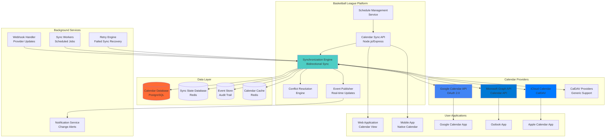
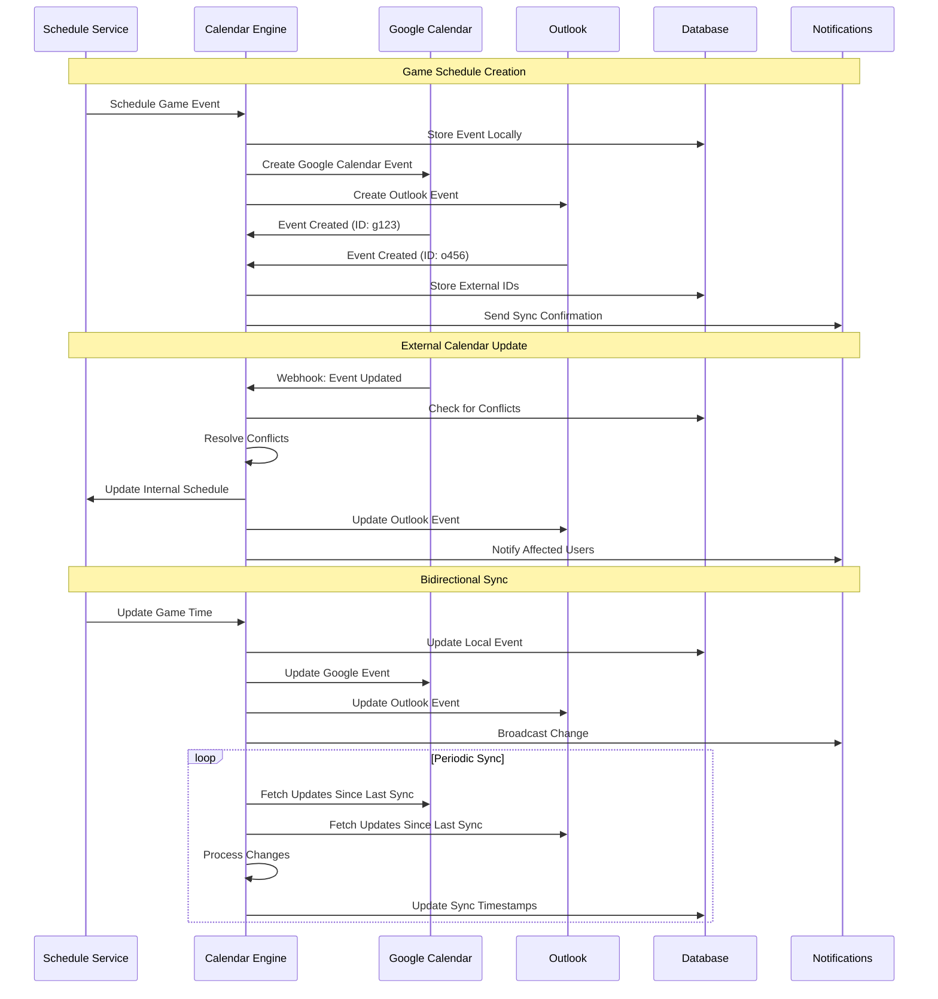

# Calendar Synchronization Design
## Basketball League Management Platform - Phase 2

**Document ID:** CALENDAR-BLMP-001  
**Version:** 1.0  
**Date:** August 8, 2025  
**Author:** Integration Architect  
**Status:** Phase 2 Integration Design  
**Classification:** Technical Architecture  

---

## Executive Summary

This document defines the comprehensive calendar synchronization architecture for the Basketball League Management Platform, enabling seamless integration with Google Calendar, Microsoft Outlook, Apple iCloud Calendar, and other calendar providers. The system supports bidirectional synchronization, conflict resolution, and real-time updates for game schedules, practices, and league events.

### Key Integration Features

- **Multi-Provider Support**: Google Calendar, Outlook, iCloud, CalDAV
- **Bidirectional Sync**: Two-way calendar synchronization
- **Real-time Updates**: Instant schedule change propagation
- **Conflict Resolution**: Intelligent handling of scheduling conflicts
- **Bulk Operations**: Mass schedule imports and exports
- **Privacy Controls**: User-controlled data sharing and visibility
- **Mobile Optimization**: Native mobile calendar app integration

---

## Table of Contents

1. [Calendar Architecture Overview](#1-calendar-architecture-overview)
2. [Provider Integrations](#2-provider-integrations)
3. [Synchronization Engine](#3-synchronization-engine)
4. [Conflict Resolution System](#4-conflict-resolution-system)
5. [Real-time Update Mechanisms](#5-real-time-update-mechanisms)
6. [Privacy and Access Control](#6-privacy-and-access-control)
7. [Basketball-Specific Calendar Features](#7-basketball-specific-calendar-features)
8. [Mobile Calendar Integration](#8-mobile-calendar-integration)

---

## 1. Calendar Architecture Overview

### 1.1 High-Level Architecture



### 1.2 Calendar Synchronization Flow



### 1.3 Technology Stack

| Component | Technology | Purpose | Scalability |
|-----------|------------|---------|-------------|
| **Calendar API** | Node.js/Express | Calendar operations API | Horizontal scaling |
| **Sync Engine** | Node.js/Bull Queue | Background synchronization | Worker pools |
| **Database** | PostgreSQL 15 | Calendar and sync data | Read replicas |
| **Cache** | Redis 7+ | Calendar event caching | Cluster mode |
| **Message Queue** | Bull/Redis | Async sync processing | Auto-scaling |
| **Google Integration** | Google Calendar API v3 | Google Calendar sync | Rate limited |
| **Microsoft Integration** | Microsoft Graph API | Outlook/Office 365 sync | Rate limited |
| **CalDAV Client** | node-caldav-adapter | Generic CalDAV support | Connection pooling |

---

## 2. Provider Integrations

### 2.1 Google Calendar Integration

```typescript
import { calendar_v3, google } from 'googleapis';
import { OAuth2Client } from 'google-auth-library';

class GoogleCalendarIntegration {
  private calendar: calendar_v3.Calendar;
  private oauth2Client: OAuth2Client;

  constructor(config: GoogleCalendarConfig) {
    this.oauth2Client = new OAuth2Client(
      config.clientId,
      config.clientSecret,
      config.redirectUrl
    );
    
    this.calendar = google.calendar({ 
      version: 'v3', 
      auth: this.oauth2Client 
    });
  }

  async authenticateUser(code: string): Promise<GoogleAuthResult> {
    try {
      const { tokens } = await this.oauth2Client.getToken(code);
      this.oauth2Client.setCredentials(tokens);

      // Store tokens securely
      await this.storeUserTokens({
        refreshToken: tokens.refresh_token!,
        accessToken: tokens.access_token!,
        expiryDate: new Date(tokens.expiry_date!)
      });

      return {
        success: true,
        accessToken: tokens.access_token!,
        refreshToken: tokens.refresh_token!
      };
    } catch (error) {
      this.logger.error('Google authentication failed', { error: error.message });
      throw new CalendarAuthenticationError('Google authentication failed');
    }
  }

  async createGameEvent(gameData: GameEventData, calendarId: string = 'primary'): Promise<GoogleEventResult> {
    try {
      const eventResource: calendar_v3.Schema$Event = {
        summary: `${gameData.homeTeam} vs ${gameData.awayTeam}`,
        description: this.buildEventDescription(gameData),
        start: {
          dateTime: gameData.startDateTime.toISOString(),
          timeZone: gameData.timeZone || 'America/Phoenix'
        },
        end: {
          dateTime: gameData.endDateTime.toISOString(),
          timeZone: gameData.timeZone || 'America/Phoenix'
        },
        location: gameData.venue,
        attendees: await this.getEventAttendees(gameData),
        reminders: {
          useDefault: false,
          overrides: [
            { method: 'email', minutes: 24 * 60 }, // 24 hours
            { method: 'popup', minutes: 60 },      // 1 hour
            { method: 'popup', minutes: 15 }       // 15 minutes
          ]
        },
        extendedProperties: {
          private: {
            gameId: gameData.gameId,
            leagueId: gameData.leagueId,
            homeTeamId: gameData.homeTeamId,
            awayTeamId: gameData.awayTeamId,
            syncedBy: 'gametriq-platform'
          }
        },
        colorId: this.getEventColor(gameData.eventType),
        visibility: gameData.isPublic ? 'public' : 'private'
      };

      const response = await this.calendar.events.insert({
        calendarId,
        requestBody: eventResource,
        sendUpdates: 'all'
      });

      // Store mapping for future updates
      await this.storeSyncMapping({
        internalEventId: gameData.gameId,
        googleEventId: response.data.id!,
        calendarId,
        lastSyncTime: new Date()
      });

      return {
        success: true,
        eventId: response.data.id!,
        htmlLink: response.data.htmlLink!,
        created: true
      };
    } catch (error) {
      if (error.code === 409) {
        // Handle duplicate event
        return await this.handleDuplicateEvent(gameData, calendarId);
      }
      
      this.logger.error('Failed to create Google Calendar event', {
        gameId: gameData.gameId,
        error: error.message
      });
      throw error;
    }
  }

  async updateGameEvent(gameData: GameEventData, googleEventId: string, calendarId: string = 'primary'): Promise<GoogleEventResult> {
    try {
      const existingEvent = await this.calendar.events.get({
        calendarId,
        eventId: googleEventId
      });

      const updatedEventResource: calendar_v3.Schema$Event = {
        ...existingEvent.data,
        summary: `${gameData.homeTeam} vs ${gameData.awayTeam}`,
        description: this.buildEventDescription(gameData),
        start: {
          dateTime: gameData.startDateTime.toISOString(),
          timeZone: gameData.timeZone || 'America/Phoenix'
        },
        end: {
          dateTime: gameData.endDateTime.toISOString(),
          timeZone: gameData.timeZone || 'America/Phoenix'
        },
        location: gameData.venue,
        extendedProperties: {
          private: {
            ...existingEvent.data.extendedProperties?.private,
            lastUpdated: new Date().toISOString()
          }
        }
      };

      const response = await this.calendar.events.update({
        calendarId,
        eventId: googleEventId,
        requestBody: updatedEventResource,
        sendUpdates: 'all'
      });

      // Update sync timestamp
      await this.updateSyncTimestamp(gameData.gameId, new Date());

      return {
        success: true,
        eventId: response.data.id!,
        htmlLink: response.data.htmlLink!,
        created: false
      };
    } catch (error) {
      this.logger.error('Failed to update Google Calendar event', {
        gameId: gameData.gameId,
        googleEventId,
        error: error.message
      });
      throw error;
    }
  }

  async deleteGameEvent(googleEventId: string, calendarId: string = 'primary'): Promise<void> {
    try {
      await this.calendar.events.delete({
        calendarId,
        eventId: googleEventId,
        sendUpdates: 'all'
      });

      // Remove sync mapping
      await this.removeSyncMapping(googleEventId);
    } catch (error) {
      if (error.code === 404) {
        // Event already deleted, clean up mapping
        await this.removeSyncMapping(googleEventId);
        return;
      }
      throw error;
    }
  }

  async setupWebhooks(calendarId: string, webhookUrl: string): Promise<GoogleWebhookChannel> {
    try {
      const watchRequest = {
        id: crypto.randomUUID(),
        type: 'web_hook',
        address: webhookUrl,
        token: await this.generateWebhookToken(),
        expiration: Date.now() + (7 * 24 * 60 * 60 * 1000) // 7 days
      };

      const response = await this.calendar.events.watch({
        calendarId,
        requestBody: watchRequest
      });

      return {
        channelId: response.data.id!,
        resourceId: response.data.resourceId!,
        expiration: new Date(parseInt(response.data.expiration!))
      };
    } catch (error) {
      this.logger.error('Failed to setup Google Calendar webhooks', {
        calendarId,
        error: error.message
      });
      throw error;
    }
  }

  private buildEventDescription(gameData: GameEventData): string {
    const lines = [
      `League: ${gameData.leagueName}`,
      `Age Group: ${gameData.ageGroup}`,
      `Season: ${gameData.season}`,
      '',
      `Home Team: ${gameData.homeTeam}`,
      `Away Team: ${gameData.awayTeam}`,
      '',
      `Venue: ${gameData.venue}`,
      `Address: ${gameData.venueAddress}`,
      ''
    ];

    if (gameData.referees && gameData.referees.length > 0) {
      lines.push('Officials:');
      gameData.referees.forEach(referee => {
        lines.push(`  • ${referee.name} (${referee.level})`);
      });
      lines.push('');
    }

    lines.push('Generated by Gametriq League Management Platform');
    lines.push(`Game ID: ${gameData.gameId}`);

    return lines.join('\n');
  }

  private async getEventAttendees(gameData: GameEventData): Promise<calendar_v3.Schema$EventAttendee[]> {
    const attendees: calendar_v3.Schema$EventAttendee[] = [];

    // Add coaches
    if (gameData.homeTeamCoach) {
      attendees.push({
        email: gameData.homeTeamCoach.email,
        displayName: `${gameData.homeTeamCoach.name} (${gameData.homeTeam} Coach)`,
        responseStatus: 'needsAction'
      });
    }

    if (gameData.awayTeamCoach) {
      attendees.push({
        email: gameData.awayTeamCoach.email,
        displayName: `${gameData.awayTeamCoach.name} (${gameData.awayTeam} Coach)`,
        responseStatus: 'needsAction'
      });
    }

    // Add referees
    if (gameData.referees) {
      gameData.referees.forEach(referee => {
        attendees.push({
          email: referee.email,
          displayName: `${referee.name} (Official)`,
          responseStatus: 'needsAction'
        });
      });
    }

    return attendees;
  }

  private getEventColor(eventType: EventType): string {
    const colorMap: Record<EventType, string> = {
      [EventType.GAME]: '11', // Red for games
      [EventType.PRACTICE]: '2', // Green for practices
      [EventType.TOURNAMENT]: '9', // Blue for tournaments
      [EventType.MEETING]: '6', // Orange for meetings
      [EventType.OTHER]: '1'  // Lavender for other events
    };

    return colorMap[eventType] || '1';
  }
}

interface GoogleCalendarConfig {
  clientId: string;
  clientSecret: string;
  redirectUrl: string;
}

interface GoogleAuthResult {
  success: boolean;
  accessToken: string;
  refreshToken: string;
}

interface GoogleEventResult {
  success: boolean;
  eventId: string;
  htmlLink: string;
  created: boolean;
}

interface GoogleWebhookChannel {
  channelId: string;
  resourceId: string;
  expiration: Date;
}
```

### 2.2 Microsoft Outlook Integration

```typescript
import { Client } from '@microsoft/microsoft-graph-client';
import { Event, Calendar } from '@microsoft/microsoft-graph-types';

class OutlookCalendarIntegration {
  private graphClient: Client;
  
  constructor(private config: OutlookConfig) {
    this.graphClient = Client.init({
      authProvider: this.getAuthProvider()
    });
  }

  async createGameEvent(gameData: GameEventData, calendarId?: string): Promise<OutlookEventResult> {
    try {
      const eventPayload: Event = {
        subject: `${gameData.homeTeam} vs ${gameData.awayTeam}`,
        body: {
          contentType: 'html',
          content: this.buildEventBody(gameData)
        },
        start: {
          dateTime: gameData.startDateTime.toISOString(),
          timeZone: gameData.timeZone || 'America/Phoenix'
        },
        end: {
          dateTime: gameData.endDateTime.toISOString(),
          timeZone: gameData.timeZone || 'America/Phoenix'
        },
        location: {
          displayName: gameData.venue,
          address: {
            street: gameData.venueAddress
          }
        },
        attendees: await this.getOutlookAttendees(gameData),
        reminderMinutesBeforeStart: 60,
        isReminderOn: true,
        sensitivity: gameData.isPublic ? 'normal' : 'private',
        categories: this.getEventCategories(gameData),
        extensions: [{
          extensionName: 'com.gametriq.calendar',
          id: 'gameData',
          '@odata.type': 'microsoft.graph.openTypeExtension',
          gameId: gameData.gameId,
          leagueId: gameData.leagueId,
          homeTeamId: gameData.homeTeamId,
          awayTeamId: gameData.awayTeamId,
          syncedBy: 'gametriq-platform'
        }]
      };

      const endpoint = calendarId 
        ? `/me/calendars/${calendarId}/events`
        : '/me/events';

      const createdEvent = await this.graphClient
        .api(endpoint)
        .post(eventPayload);

      // Store sync mapping
      await this.storeSyncMapping({
        internalEventId: gameData.gameId,
        outlookEventId: createdEvent.id,
        calendarId: calendarId || 'default',
        lastSyncTime: new Date()
      });

      return {
        success: true,
        eventId: createdEvent.id,
        webLink: createdEvent.webLink,
        created: true
      };
    } catch (error) {
      this.logger.error('Failed to create Outlook event', {
        gameId: gameData.gameId,
        error: error.message
      });
      throw error;
    }
  }

  async updateGameEvent(gameData: GameEventData, outlookEventId: string, calendarId?: string): Promise<OutlookEventResult> {
    try {
      const updatePayload: Event = {
        subject: `${gameData.homeTeam} vs ${gameData.awayTeam}`,
        body: {
          contentType: 'html',
          content: this.buildEventBody(gameData)
        },
        start: {
          dateTime: gameData.startDateTime.toISOString(),
          timeZone: gameData.timeZone || 'America/Phoenix'
        },
        end: {
          dateTime: gameData.endDateTime.toISOString(),
          timeZone: gameData.timeZone || 'America/Phoenix'
        },
        location: {
          displayName: gameData.venue
        }
      };

      const endpoint = calendarId 
        ? `/me/calendars/${calendarId}/events/${outlookEventId}`
        : `/me/events/${outlookEventId}`;

      const updatedEvent = await this.graphClient
        .api(endpoint)
        .update(updatePayload);

      // Update sync timestamp
      await this.updateSyncTimestamp(gameData.gameId, new Date());

      return {
        success: true,
        eventId: updatedEvent.id,
        webLink: updatedEvent.webLink,
        created: false
      };
    } catch (error) {
      this.logger.error('Failed to update Outlook event', {
        gameId: gameData.gameId,
        outlookEventId,
        error: error.message
      });
      throw error;
    }
  }

  async setupWebhooks(calendarId: string, webhookUrl: string): Promise<OutlookSubscription> {
    try {
      const subscription = {
        changeType: 'created,updated,deleted',
        notificationUrl: webhookUrl,
        resource: calendarId ? `/me/calendars/${calendarId}/events` : '/me/events',
        expirationDateTime: new Date(Date.now() + (4230 * 60 * 1000)).toISOString(), // 4230 minutes max
        clientState: await this.generateClientState()
      };

      const createdSubscription = await this.graphClient
        .api('/subscriptions')
        .post(subscription);

      return {
        subscriptionId: createdSubscription.id,
        resource: createdSubscription.resource,
        expiration: new Date(createdSubscription.expirationDateTime)
      };
    } catch (error) {
      this.logger.error('Failed to setup Outlook webhooks', {
        calendarId,
        error: error.message
      });
      throw error;
    }
  }

  async renewWebhookSubscription(subscriptionId: string): Promise<OutlookSubscription> {
    try {
      const updatedSubscription = await this.graphClient
        .api(`/subscriptions/${subscriptionId}`)
        .update({
          expirationDateTime: new Date(Date.now() + (4230 * 60 * 1000)).toISOString()
        });

      return {
        subscriptionId: updatedSubscription.id,
        resource: updatedSubscription.resource,
        expiration: new Date(updatedSubscription.expirationDateTime)
      };
    } catch (error) {
      this.logger.error('Failed to renew Outlook subscription', {
        subscriptionId,
        error: error.message
      });
      throw error;
    }
  }

  private buildEventBody(gameData: GameEventData): string {
    return `
      <div style="font-family: Arial, sans-serif;">
        <h3>${gameData.leagueName} - ${gameData.ageGroup}</h3>
        <p><strong>Season:</strong> ${gameData.season}</p>
        
        <table style="margin: 10px 0; border-collapse: collapse;">
          <tr>
            <td style="padding: 5px; font-weight: bold;">Home Team:</td>
            <td style="padding: 5px;">${gameData.homeTeam}</td>
          </tr>
          <tr>
            <td style="padding: 5px; font-weight: bold;">Away Team:</td>
            <td style="padding: 5px;">${gameData.awayTeam}</td>
          </tr>
          <tr>
            <td style="padding: 5px; font-weight: bold;">Venue:</td>
            <td style="padding: 5px;">${gameData.venue}</td>
          </tr>
        </table>
        
        ${gameData.referees && gameData.referees.length > 0 ? `
          <p><strong>Officials:</strong></p>
          <ul>
            ${gameData.referees.map(ref => `<li>${ref.name} (${ref.level})</li>`).join('')}
          </ul>
        ` : ''}
        
        <p><small>Generated by Gametriq League Management Platform<br>Game ID: ${gameData.gameId}</small></p>
      </div>
    `;
  }

  private async getOutlookAttendees(gameData: GameEventData): Promise<any[]> {
    const attendees = [];

    if (gameData.homeTeamCoach) {
      attendees.push({
        emailAddress: {
          address: gameData.homeTeamCoach.email,
          name: `${gameData.homeTeamCoach.name} (${gameData.homeTeam} Coach)`
        },
        type: 'required'
      });
    }

    if (gameData.awayTeamCoach) {
      attendees.push({
        emailAddress: {
          address: gameData.awayTeamCoach.email,
          name: `${gameData.awayTeamCoach.name} (${gameData.awayTeam} Coach)`
        },
        type: 'required'
      });
    }

    if (gameData.referees) {
      gameData.referees.forEach(referee => {
        attendees.push({
          emailAddress: {
            address: referee.email,
            name: `${referee.name} (Official)`
          },
          type: 'optional'
        });
      });
    }

    return attendees;
  }

  private getEventCategories(gameData: GameEventData): string[] {
    const categories = ['Basketball'];
    
    switch (gameData.eventType) {
      case EventType.GAME:
        categories.push('Game');
        break;
      case EventType.PRACTICE:
        categories.push('Practice');
        break;
      case EventType.TOURNAMENT:
        categories.push('Tournament');
        break;
      default:
        categories.push('League Event');
    }

    categories.push(gameData.ageGroup);
    return categories;
  }
}

interface OutlookConfig {
  clientId: string;
  clientSecret: string;
  redirectUrl: string;
  tenantId: string;
}

interface OutlookEventResult {
  success: boolean;
  eventId: string;
  webLink: string;
  created: boolean;
}

interface OutlookSubscription {
  subscriptionId: string;
  resource: string;
  expiration: Date;
}
```

### 2.3 iCloud Calendar (CalDAV) Integration

```typescript
import { DAVClient, createDAVClient } from 'tsdav';

class iCloudCalendarIntegration {
  private client: DAVClient;
  
  constructor(private config: iCloudConfig) {}

  async authenticateUser(username: string, appPassword: string): Promise<iCloudAuthResult> {
    try {
      this.client = await createDAVClient({
        serverUrl: 'https://caldav.icloud.com/',
        credentials: {
          username: username,
          password: appPassword
        },
        authMethod: 'Basic',
        defaultAccountType: 'caldav'
      });

      // Test connection by fetching calendars
      const calendars = await this.client.fetchCalendars();
      
      if (calendars.length === 0) {
        throw new Error('No calendars found or authentication failed');
      }

      return {
        success: true,
        calendars: calendars.map(cal => ({
          id: cal.url,
          name: cal.displayName || 'Unnamed Calendar',
          color: cal.calendarColor
        }))
      };
    } catch (error) {
      this.logger.error('iCloud authentication failed', { error: error.message });
      throw new CalendarAuthenticationError('iCloud authentication failed');
    }
  }

  async createGameEvent(gameData: GameEventData, calendarUrl: string): Promise<iCloudEventResult> {
    try {
      const icalEvent = this.buildICalEvent(gameData);
      
      const eventUrl = `${calendarUrl}/${gameData.gameId}.ics`;
      
      await this.client.createCalendarObject({
        calendar: { url: calendarUrl } as any,
        filename: `${gameData.gameId}.ics`,
        iCalString: icalEvent
      });

      // Store sync mapping
      await this.storeSyncMapping({
        internalEventId: gameData.gameId,
        icloudEventUrl: eventUrl,
        calendarUrl,
        lastSyncTime: new Date()
      });

      return {
        success: true,
        eventUrl,
        created: true
      };
    } catch (error) {
      this.logger.error('Failed to create iCloud event', {
        gameId: gameData.gameId,
        error: error.message
      });
      throw error;
    }
  }

  async updateGameEvent(gameData: GameEventData, eventUrl: string): Promise<iCloudEventResult> {
    try {
      const icalEvent = this.buildICalEvent(gameData);
      
      await this.client.updateCalendarObject({
        calendarObject: {
          url: eventUrl,
          data: icalEvent
        }
      });

      return {
        success: true,
        eventUrl,
        created: false
      };
    } catch (error) {
      this.logger.error('Failed to update iCloud event', {
        gameId: gameData.gameId,
        eventUrl,
        error: error.message
      });
      throw error;
    }
  }

  async deleteGameEvent(eventUrl: string): Promise<void> {
    try {
      await this.client.deleteCalendarObject({
        calendarObject: { url: eventUrl } as any
      });

      // Remove sync mapping
      await this.removeSyncMapping(eventUrl);
    } catch (error) {
      this.logger.error('Failed to delete iCloud event', {
        eventUrl,
        error: error.message
      });
      throw error;
    }
  }

  private buildICalEvent(gameData: GameEventData): string {
    const startDateTime = this.formatICalDateTime(gameData.startDateTime);
    const endDateTime = this.formatICalDateTime(gameData.endDateTime);
    const createdDateTime = this.formatICalDateTime(new Date());
    
    const icalLines = [
      'BEGIN:VCALENDAR',
      'VERSION:2.0',
      'PRODID:-//Gametriq//Basketball League Management//EN',
      'BEGIN:VEVENT',
      `UID:${gameData.gameId}@gametriq.com`,
      `DTSTART:${startDateTime}`,
      `DTEND:${endDateTime}`,
      `DTSTAMP:${createdDateTime}`,
      `CREATED:${createdDateTime}`,
      `LAST-MODIFIED:${createdDateTime}`,
      `SUMMARY:${gameData.homeTeam} vs ${gameData.awayTeam}`,
      `DESCRIPTION:${this.escapeICalText(this.buildEventDescription(gameData))}`,
      `LOCATION:${this.escapeICalText(gameData.venue)}`,
      `CATEGORIES:Basketball,${gameData.eventType},${gameData.ageGroup}`,
      'STATUS:CONFIRMED',
      'TRANSP:OPAQUE'
    ];

    // Add attendees
    if (gameData.homeTeamCoach) {
      icalLines.push(`ATTENDEE;ROLE=REQ-PARTICIPANT;CN=${gameData.homeTeamCoach.name}:mailto:${gameData.homeTeamCoach.email}`);
    }
    
    if (gameData.awayTeamCoach) {
      icalLines.push(`ATTENDEE;ROLE=REQ-PARTICIPANT;CN=${gameData.awayTeamCoach.name}:mailto:${gameData.awayTeamCoach.email}`);
    }

    if (gameData.referees) {
      gameData.referees.forEach(referee => {
        icalLines.push(`ATTENDEE;ROLE=OPT-PARTICIPANT;CN=${referee.name}:mailto:${referee.email}`);
      });
    }

    // Add reminders
    icalLines.push(
      'BEGIN:VALARM',
      'TRIGGER:-PT24H', // 24 hours before
      'DESCRIPTION:Game Tomorrow',
      'ACTION:DISPLAY',
      'END:VALARM',
      'BEGIN:VALARM',
      'TRIGGER:-PT1H',  // 1 hour before
      'DESCRIPTION:Game in 1 Hour',
      'ACTION:DISPLAY',
      'END:VALARM'
    );

    icalLines.push('END:VEVENT', 'END:VCALENDAR');

    return icalLines.join('\r\n');
  }

  private formatICalDateTime(date: Date): string {
    return date.toISOString().replace(/[-:]/g, '').split('.')[0] + 'Z';
  }

  private escapeICalText(text: string): string {
    return text.replace(/[\\,;]/g, '\\$&').replace(/\n/g, '\\n');
  }

  private buildEventDescription(gameData: GameEventData): string {
    const lines = [
      `League: ${gameData.leagueName}`,
      `Age Group: ${gameData.ageGroup}`,
      `Season: ${gameData.season}`,
      ``,
      `Home Team: ${gameData.homeTeam}`,
      `Away Team: ${gameData.awayTeam}`,
      `Venue: ${gameData.venue}`,
      ``
    ];

    if (gameData.referees && gameData.referees.length > 0) {
      lines.push('Officials:');
      gameData.referees.forEach(referee => {
        lines.push(`${referee.name} (${referee.level})`);
      });
      lines.push('');
    }

    lines.push('Generated by Gametriq League Management Platform');
    return lines.join('\\n');
  }
}

interface iCloudConfig {
  serverUrl: string;
}

interface iCloudAuthResult {
  success: boolean;
  calendars: Array<{
    id: string;
    name: string;
    color?: string;
  }>;
}

interface iCloudEventResult {
  success: boolean;
  eventUrl: string;
  created: boolean;
}
```

---

## 3. Synchronization Engine

### 3.1 Core Synchronization Service

```typescript
class CalendarSyncEngine {
  private syncQueue: Queue;
  private providers: Map<CalendarProvider, CalendarIntegration>;

  constructor(
    private config: SyncEngineConfig,
    private database: Database,
    private cacheManager: CacheManager
  ) {
    this.syncQueue = new Queue('calendar-sync', { 
      redis: this.config.redisUrl,
      defaultJobOptions: {
        removeOnComplete: 100,
        removeOnFail: 50,
        attempts: 3,
        backoff: {
          type: 'exponential',
          delay: 5000
        }
      }
    });

    this.initializeProviders();
    this.setupSyncWorkers();
  }

  async syncGameEvent(gameData: GameEventData, userId: string): Promise<SyncResult[]> {
    const userCalendars = await this.getUserCalendars(userId);
    const syncResults: SyncResult[] = [];

    for (const calendar of userCalendars) {
      if (!calendar.syncEnabled) continue;

      const syncJob = await this.syncQueue.add('sync-event', {
        operation: SyncOperation.CREATE_OR_UPDATE,
        gameData,
        calendar,
        userId,
        priority: this.calculateSyncPriority(gameData, calendar)
      });

      syncResults.push({
        calendarId: calendar.id,
        provider: calendar.provider,
        jobId: syncJob.id!,
        status: SyncStatus.QUEUED
      });
    }

    return syncResults;
  }

  async handleScheduleChange(changeData: ScheduleChangeData): Promise<void> {
    try {
      // Get all affected users and their calendar configurations
      const affectedUsers = await this.getAffectedUsers(changeData);
      
      for (const user of affectedUsers) {
        const userCalendars = await this.getUserCalendars(user.id);
        
        for (const calendar of userCalendars.filter(c => c.syncEnabled)) {
          await this.syncQueue.add('handle-schedule-change', {
            operation: this.getChangeOperation(changeData.changeType),
            changeData,
            calendar,
            userId: user.id
          }, {
            priority: 10 // High priority for schedule changes
          });
        }
      }
    } catch (error) {
      this.logger.error('Failed to handle schedule change', {
        changeData,
        error: error.message
      });
      throw error;
    }
  }

  async performBidirectionalSync(userId: string, calendarId: string): Promise<BidirectionalSyncResult> {
    try {
      const calendar = await this.getUserCalendar(userId, calendarId);
      const provider = this.providers.get(calendar.provider);
      
      if (!provider) {
        throw new Error(`Provider ${calendar.provider} not supported`);
      }

      // Get last sync timestamp
      const lastSync = await this.getLastSyncTimestamp(userId, calendarId);
      
      // Fetch changes from external calendar since last sync
      const externalChanges = await provider.getChangesSince(lastSync, calendar.externalCalendarId);
      
      // Fetch changes from internal system since last sync
      const internalChanges = await this.getInternalChangesSince(lastSync, userId, calendarId);
      
      // Process external changes first
      const externalSyncResults = await this.processExternalChanges(externalChanges, calendar);
      
      // Process internal changes
      const internalSyncResults = await this.processInternalChanges(internalChanges, calendar, provider);
      
      // Update last sync timestamp
      await this.updateLastSyncTimestamp(userId, calendarId, new Date());
      
      return {
        success: true,
        externalChangesProcessed: externalSyncResults.length,
        internalChangesProcessed: internalSyncResults.length,
        conflicts: await this.getConflicts(userId, calendarId),
        lastSyncTime: new Date()
      };
    } catch (error) {
      this.logger.error('Bidirectional sync failed', {
        userId,
        calendarId,
        error: error.message
      });
      
      return {
        success: false,
        error: error.message,
        externalChangesProcessed: 0,
        internalChangesProcessed: 0,
        conflicts: [],
        lastSyncTime: null
      };
    }
  }

  private async processExternalChanges(
    changes: ExternalCalendarChange[],
    calendar: UserCalendar
  ): Promise<SyncResult[]> {
    const results: SyncResult[] = [];

    for (const change of changes) {
      try {
        switch (change.type) {
          case ChangeType.CREATED:
            await this.handleExternalEventCreated(change, calendar);
            break;
          case ChangeType.UPDATED:
            await this.handleExternalEventUpdated(change, calendar);
            break;
          case ChangeType.DELETED:
            await this.handleExternalEventDeleted(change, calendar);
            break;
        }

        results.push({
          calendarId: calendar.id,
          provider: calendar.provider,
          status: SyncStatus.SUCCESS,
          eventId: change.eventId
        });
      } catch (error) {
        this.logger.error('Failed to process external change', {
          change,
          calendar: calendar.id,
          error: error.message
        });

        results.push({
          calendarId: calendar.id,
          provider: calendar.provider,
          status: SyncStatus.FAILED,
          eventId: change.eventId,
          error: error.message
        });
      }
    }

    return results;
  }

  private async handleExternalEventCreated(
    change: ExternalCalendarChange,
    calendar: UserCalendar
  ): Promise<void> {
    // Check if this event was created by our platform
    if (this.isOurEvent(change.event)) {
      // Update our sync mapping with the external event ID
      await this.updateSyncMapping(change.event.ourEventId, change.eventId);
      return;
    }

    // Check for conflicts with existing games
    const conflicts = await this.checkForConflicts(change.event, calendar.userId);
    
    if (conflicts.length > 0) {
      await this.createConflictRecord({
        userId: calendar.userId,
        calendarId: calendar.id,
        externalEventId: change.eventId,
        conflictingEvents: conflicts,
        conflictType: ConflictType.SCHEDULE_OVERLAP
      });
      return;
    }

    // Check if this could be a basketball-related event
    if (this.isPotentialBasketballEvent(change.event)) {
      await this.suggestEventImport({
        userId: calendar.userId,
        calendarId: calendar.id,
        externalEvent: change.event,
        suggestedMapping: await this.suggestEventMapping(change.event)
      });
    }
  }

  private async handleExternalEventUpdated(
    change: ExternalCalendarChange,
    calendar: UserCalendar
  ): Promise<void> {
    // Find our corresponding internal event
    const syncMapping = await this.getSyncMapping(change.eventId);
    
    if (syncMapping) {
      // This is one of our events that was updated externally
      const ourEvent = await this.getInternalEvent(syncMapping.internalEventId);
      
      if (ourEvent) {
        // Check for conflicts between external changes and our data
        const hasConflicts = await this.compareEventData(change.event, ourEvent);
        
        if (hasConflicts) {
          await this.createConflictRecord({
            userId: calendar.userId,
            calendarId: calendar.id,
            internalEventId: syncMapping.internalEventId,
            externalEventId: change.eventId,
            conflictType: ConflictType.DATA_MISMATCH,
            conflictData: {
              external: change.event,
              internal: ourEvent
            }
          });
        } else {
          // Update our internal event with external changes
          await this.updateInternalEvent(syncMapping.internalEventId, change.event);
        }
      }
    }
  }

  private calculateSyncPriority(gameData: GameEventData, calendar: UserCalendar): number {
    let priority = 5; // Default priority
    
    // Increase priority for games happening soon
    const hoursUntilGame = (gameData.startDateTime.getTime() - Date.now()) / (1000 * 60 * 60);
    if (hoursUntilGame <= 24) priority += 5;
    if (hoursUntilGame <= 2) priority += 10;
    
    // Increase priority for tournament games
    if (gameData.eventType === EventType.TOURNAMENT) priority += 3;
    
    // Increase priority for primary calendar
    if (calendar.isPrimary) priority += 2;
    
    return Math.min(priority, 20); // Cap at 20
  }

  private setupSyncWorkers(): void {
    this.syncQueue.process('sync-event', 5, async (job) => {
      const { operation, gameData, calendar, userId } = job.data;
      return await this.processSyncEvent(operation, gameData, calendar, userId);
    });

    this.syncQueue.process('handle-schedule-change', 3, async (job) => {
      const { operation, changeData, calendar, userId } = job.data;
      return await this.processScheduleChange(operation, changeData, calendar, userId);
    });

    this.syncQueue.process('bidirectional-sync', 2, async (job) => {
      const { userId, calendarId } = job.data;
      return await this.performBidirectionalSync(userId, calendarId);
    });
  }

  async schedulePeriodicSync(): Promise<void> {
    // Schedule bidirectional sync for all active users every hour
    const activeUsers = await this.getActiveUsers();
    
    for (const user of activeUsers) {
      const userCalendars = await this.getUserCalendars(user.id);
      
      for (const calendar of userCalendars.filter(c => c.syncEnabled)) {
        await this.syncQueue.add('bidirectional-sync', {
          userId: user.id,
          calendarId: calendar.id
        }, {
          repeat: { cron: '0 * * * *' }, // Every hour
          removeOnComplete: 10,
          removeOnFail: 5
        });
      }
    }
  }
}

enum SyncOperation {
  CREATE = 'create',
  UPDATE = 'update',
  DELETE = 'delete',
  CREATE_OR_UPDATE = 'create_or_update'
}

enum SyncStatus {
  QUEUED = 'queued',
  PROCESSING = 'processing',
  SUCCESS = 'success',
  FAILED = 'failed',
  CONFLICT = 'conflict'
}

enum ChangeType {
  CREATED = 'created',
  UPDATED = 'updated',
  DELETED = 'deleted'
}

enum ConflictType {
  SCHEDULE_OVERLAP = 'schedule_overlap',
  DATA_MISMATCH = 'data_mismatch',
  PERMISSION_DENIED = 'permission_denied'
}

interface SyncResult {
  calendarId: string;
  provider: CalendarProvider;
  jobId?: string;
  eventId?: string;
  status: SyncStatus;
  error?: string;
}

interface BidirectionalSyncResult {
  success: boolean;
  error?: string;
  externalChangesProcessed: number;
  internalChangesProcessed: number;
  conflicts: ConflictRecord[];
  lastSyncTime: Date | null;
}

interface ExternalCalendarChange {
  type: ChangeType;
  eventId: string;
  event: ExternalEvent;
  timestamp: Date;
}

interface ConflictRecord {
  userId: string;
  calendarId: string;
  internalEventId?: string;
  externalEventId: string;
  conflictType: ConflictType;
  conflictData?: any;
  resolved: boolean;
  createdAt: Date;
}
```

---

## 4. Conflict Resolution System

### 4.1 Conflict Detection and Resolution

```typescript
class ConflictResolutionEngine {
  constructor(
    private database: Database,
    private notificationService: NotificationService
  ) {}

  async detectConflicts(
    internalEvent: InternalEvent,
    externalEvent: ExternalEvent,
    calendar: UserCalendar
  ): Promise<ConflictDetectionResult> {
    const conflicts: DetectedConflict[] = [];

    // Check for time conflicts
    const timeConflicts = await this.detectTimeConflicts(internalEvent, externalEvent);
    conflicts.push(...timeConflicts);

    // Check for venue conflicts
    const venueConflicts = await this.detectVenueConflicts(internalEvent, externalEvent);
    conflicts.push(...venueConflicts);

    // Check for participant conflicts
    const participantConflicts = await this.detectParticipantConflicts(internalEvent, externalEvent);
    conflicts.push(...participantConflicts);

    // Check for data integrity conflicts
    const dataConflicts = await this.detectDataConflicts(internalEvent, externalEvent);
    conflicts.push(...dataConflicts);

    return {
      hasConflicts: conflicts.length > 0,
      conflicts,
      severity: this.calculateConflictSeverity(conflicts),
      resolutionStrategy: await this.suggestResolutionStrategy(conflicts, calendar)
    };
  }

  private async detectTimeConflicts(
    internalEvent: InternalEvent,
    externalEvent: ExternalEvent
  ): Promise<DetectedConflict[]> {
    const conflicts: DetectedConflict[] = [];

    // Check for direct time overlap
    if (this.hasTimeOverlap(internalEvent, externalEvent)) {
      conflicts.push({
        type: ConflictType.TIME_OVERLAP,
        severity: ConflictSeverity.HIGH,
        description: 'Events have overlapping times',
        internalValue: {
          start: internalEvent.startTime,
          end: internalEvent.endTime
        },
        externalValue: {
          start: externalEvent.startTime,
          end: externalEvent.endTime
        },
        suggestedResolution: ResolutionAction.MANUAL_REVIEW
      });
    }

    // Check for scheduling policy violations
    const policyViolations = await this.checkSchedulingPolicies(internalEvent, externalEvent);
    conflicts.push(...policyViolations);

    return conflicts;
  }

  private async detectVenueConflicts(
    internalEvent: InternalEvent,
    externalEvent: ExternalEvent
  ): Promise<DetectedConflict[]> {
    const conflicts: DetectedConflict[] = [];

    // Check if venue is different but events overlap in time
    if (internalEvent.venue !== externalEvent.location && 
        this.hasTimeOverlap(internalEvent, externalEvent)) {
      
      // Check if this creates a double-booking issue
      const venueCapacity = await this.getVenueCapacity(internalEvent.venue);
      const concurrentEvents = await this.getConcurrentEvents(
        internalEvent.startTime,
        internalEvent.endTime,
        internalEvent.venue
      );

      if (concurrentEvents.length >= venueCapacity.maxConcurrentEvents) {
        conflicts.push({
          type: ConflictType.VENUE_OVERBOOKING,
          severity: ConflictSeverity.CRITICAL,
          description: 'Venue capacity exceeded',
          internalValue: internalEvent.venue,
          externalValue: externalEvent.location,
          suggestedResolution: ResolutionAction.RESCHEDULE_EXTERNAL
        });
      }
    }

    return conflicts;
  }

  private async detectParticipantConflicts(
    internalEvent: InternalEvent,
    externalEvent: ExternalEvent
  ): Promise<DetectedConflict[]> {
    const conflicts: DetectedConflict[] = [];

    // Get participants from both events
    const internalParticipants = await this.getEventParticipants(internalEvent.id);
    const externalParticipants = this.extractExternalParticipants(externalEvent);

    // Check for participant double-booking
    const overlappingParticipants = internalParticipants.filter(ip =>
      externalParticipants.some(ep => this.isSameParticipant(ip, ep))
    );

    if (overlappingParticipants.length > 0 && this.hasTimeOverlap(internalEvent, externalEvent)) {
      conflicts.push({
        type: ConflictType.PARTICIPANT_DOUBLE_BOOKING,
        severity: ConflictSeverity.HIGH,
        description: 'Participants are double-booked',
        internalValue: overlappingParticipants.map(p => p.email),
        externalValue: externalParticipants
          .filter(ep => overlappingParticipants.some(ip => this.isSameParticipant(ip, ep)))
          .map(p => p.email),
        suggestedResolution: ResolutionAction.NOTIFY_PARTICIPANTS
      });
    }

    return conflicts;
  }

  async resolveConflict(
    conflictId: string,
    resolution: ConflictResolution,
    resolvedBy: string
  ): Promise<ConflictResolutionResult> {
    try {
      const conflict = await this.getConflict(conflictId);
      
      if (!conflict) {
        throw new Error('Conflict not found');
      }

      let result: ConflictResolutionResult;

      switch (resolution.action) {
        case ResolutionAction.ACCEPT_INTERNAL:
          result = await this.acceptInternalVersion(conflict);
          break;
        case ResolutionAction.ACCEPT_EXTERNAL:
          result = await this.acceptExternalVersion(conflict);
          break;
        case ResolutionAction.MANUAL_MERGE:
          result = await this.performManualMerge(conflict, resolution.mergeData!);
          break;
        case ResolutionAction.RESCHEDULE_INTERNAL:
          result = await this.rescheduleInternalEvent(conflict, resolution.newDateTime!);
          break;
        case ResolutionAction.RESCHEDULE_EXTERNAL:
          result = await this.rescheduleExternalEvent(conflict, resolution.newDateTime!);
          break;
        case ResolutionAction.CANCEL_SYNC:
          result = await this.cancelSyncForEvent(conflict);
          break;
        default:
          throw new Error(`Unsupported resolution action: ${resolution.action}`);
      }

      // Mark conflict as resolved
      await this.markConflictResolved(conflictId, resolution, resolvedBy);

      // Send notifications to affected users
      await this.notifyConflictResolution(conflict, resolution, result);

      return result;
    } catch (error) {
      this.logger.error('Failed to resolve conflict', {
        conflictId,
        resolution,
        error: error.message
      });
      throw error;
    }
  }

  private async acceptInternalVersion(conflict: ConflictRecord): Promise<ConflictResolutionResult> {
    // Update external calendar with internal data
    const internalEvent = await this.getInternalEvent(conflict.internalEventId!);
    const calendar = await this.getUserCalendar(conflict.userId, conflict.calendarId);
    const provider = this.getProvider(calendar.provider);

    try {
      await provider.updateEvent(
        conflict.externalEventId,
        this.convertToExternalEvent(internalEvent),
        calendar.externalCalendarId
      );

      return {
        success: true,
        action: ResolutionAction.ACCEPT_INTERNAL,
        message: 'External calendar updated with internal data'
      };
    } catch (error) {
      return {
        success: false,
        action: ResolutionAction.ACCEPT_INTERNAL,
        error: error.message
      };
    }
  }

  private async acceptExternalVersion(conflict: ConflictRecord): Promise<ConflictResolutionResult> {
    // Update internal system with external data
    const externalEvent = await this.getExternalEvent(conflict.externalEventId, conflict.calendarId);
    
    if (conflict.internalEventId) {
      // Update existing internal event
      await this.updateInternalEvent(
        conflict.internalEventId,
        this.convertToInternalEvent(externalEvent)
      );
    } else {
      // Create new internal event
      const newEvent = await this.createInternalEvent(
        this.convertToInternalEvent(externalEvent),
        conflict.userId
      );
      
      // Create sync mapping
      await this.createSyncMapping({
        internalEventId: newEvent.id,
        externalEventId: conflict.externalEventId,
        calendarId: conflict.calendarId
      });
    }

    return {
      success: true,
      action: ResolutionAction.ACCEPT_EXTERNAL,
      message: 'Internal system updated with external data'
    };
  }

  private async performManualMerge(
    conflict: ConflictRecord,
    mergeData: MergeData
  ): Promise<ConflictResolutionResult> {
    try {
      const internalEvent = await this.getInternalEvent(conflict.internalEventId!);
      const externalEvent = await this.getExternalEvent(conflict.externalEventId, conflict.calendarId);

      // Create merged event data
      const mergedEvent = this.mergeEventData(internalEvent, externalEvent, mergeData);

      // Update both internal and external events
      await this.updateInternalEvent(conflict.internalEventId!, mergedEvent);
      
      const calendar = await this.getUserCalendar(conflict.userId, conflict.calendarId);
      const provider = this.getProvider(calendar.provider);
      
      await provider.updateEvent(
        conflict.externalEventId,
        this.convertToExternalEvent(mergedEvent),
        calendar.externalCalendarId
      );

      return {
        success: true,
        action: ResolutionAction.MANUAL_MERGE,
        message: 'Events successfully merged'
      };
    } catch (error) {
      return {
        success: false,
        action: ResolutionAction.MANUAL_MERGE,
        error: error.message
      };
    }
  }

  async getUnresolvedConflicts(userId: string): Promise<ConflictSummary[]> {
    const conflicts = await this.database.query(`
      SELECT c.*, e.title as event_title, cal.provider, cal.name as calendar_name
      FROM calendar_conflicts c
      JOIN events e ON c.internal_event_id = e.id
      JOIN user_calendars cal ON c.calendar_id = cal.id
      WHERE c.user_id = ? AND c.resolved = false
      ORDER BY c.severity DESC, c.created_at ASC
    `, [userId]);

    return conflicts.map(conflict => ({
      id: conflict.id,
      eventTitle: conflict.event_title,
      calendarName: conflict.calendar_name,
      provider: conflict.provider,
      conflictType: conflict.conflict_type,
      severity: conflict.severity,
      description: conflict.description,
      createdAt: conflict.created_at,
      suggestedActions: this.getSuggestedActions(conflict)
    }));
  }

  private hasTimeOverlap(event1: TimeSlot, event2: TimeSlot): boolean {
    const start1 = new Date(event1.startTime);
    const end1 = new Date(event1.endTime);
    const start2 = new Date(event2.startTime);
    const end2 = new Date(event2.endTime);

    return start1 < end2 && start2 < end1;
  }

  private calculateConflictSeverity(conflicts: DetectedConflict[]): ConflictSeverity {
    if (conflicts.some(c => c.severity === ConflictSeverity.CRITICAL)) {
      return ConflictSeverity.CRITICAL;
    }
    if (conflicts.some(c => c.severity === ConflictSeverity.HIGH)) {
      return ConflictSeverity.HIGH;
    }
    if (conflicts.some(c => c.severity === ConflictSeverity.MEDIUM)) {
      return ConflictSeverity.MEDIUM;
    }
    return ConflictSeverity.LOW;
  }
}

enum ConflictSeverity {
  LOW = 'low',
  MEDIUM = 'medium',
  HIGH = 'high',
  CRITICAL = 'critical'
}

enum ResolutionAction {
  ACCEPT_INTERNAL = 'accept_internal',
  ACCEPT_EXTERNAL = 'accept_external',
  MANUAL_MERGE = 'manual_merge',
  RESCHEDULE_INTERNAL = 'reschedule_internal',
  RESCHEDULE_EXTERNAL = 'reschedule_external',
  MANUAL_REVIEW = 'manual_review',
  NOTIFY_PARTICIPANTS = 'notify_participants',
  CANCEL_SYNC = 'cancel_sync'
}

interface DetectedConflict {
  type: ConflictType;
  severity: ConflictSeverity;
  description: string;
  internalValue: any;
  externalValue: any;
  suggestedResolution: ResolutionAction;
}

interface ConflictResolution {
  action: ResolutionAction;
  newDateTime?: Date;
  mergeData?: MergeData;
  notes?: string;
}

interface ConflictResolutionResult {
  success: boolean;
  action: ResolutionAction;
  message?: string;
  error?: string;
}

interface ConflictSummary {
  id: string;
  eventTitle: string;
  calendarName: string;
  provider: CalendarProvider;
  conflictType: ConflictType;
  severity: ConflictSeverity;
  description: string;
  createdAt: Date;
  suggestedActions: ResolutionAction[];
}

interface MergeData {
  useInternalDateTime: boolean;
  useExternalDateTime: boolean;
  useInternalLocation: boolean;
  useExternalLocation: boolean;
  useInternalParticipants: boolean;
  useExternalParticipants: boolean;
  mergeParticipants: boolean;
  customNotes?: string;
}
```

---

## 5. Real-time Update Mechanisms

### 5.1 Webhook Processing System

```typescript
class CalendarWebhookProcessor {
  private webhookQueue: Queue;
  private activeChannels: Map<string, WebhookChannel>;

  constructor(
    private syncEngine: CalendarSyncEngine,
    private conflictResolver: ConflictResolutionEngine
  ) {
    this.webhookQueue = new Queue('webhook-processing', {
      redis: process.env.REDIS_URL,
      defaultJobOptions: {
        removeOnComplete: 200,
        removeOnFail: 50,
        attempts: 5,
        backoff: {
          type: 'exponential',
          delay: 2000
        }
      }
    });

    this.setupWebhookWorkers();
    this.activeChannels = new Map();
  }

  async handleGoogleWebhook(headers: any, body: any): Promise<WebhookProcessingResult> {
    try {
      // Verify webhook authenticity
      const channelId = headers['x-goog-channel-id'];
      const resourceState = headers['x-goog-resource-state'];
      const resourceId = headers['x-goog-resource-id'];

      if (!this.isValidGoogleWebhook(headers)) {
        throw new WebhookValidationError('Invalid Google webhook');
      }

      // Queue webhook for processing
      const job = await this.webhookQueue.add('process-google-webhook', {
        provider: CalendarProvider.GOOGLE,
        channelId,
        resourceState,
        resourceId,
        headers,
        timestamp: new Date()
      }, {
        priority: this.getWebhookPriority(resourceState)
      });

      return {
        success: true,
        jobId: job.id!,
        message: 'Webhook queued for processing'
      };
    } catch (error) {
      this.logger.error('Failed to handle Google webhook', {
        error: error.message,
        headers,
        body
      });
      throw error;
    }
  }

  async handleOutlookWebhook(headers: any, body: any): Promise<WebhookProcessingResult> {
    try {
      // Validate Outlook webhook
      const validationToken = headers['validationtoken'];
      if (validationToken) {
        // This is a subscription validation request
        return {
          success: true,
          validationResponse: validationToken
        };
      }

      // Process webhook notifications
      const notifications = Array.isArray(body.value) ? body.value : [body];
      
      for (const notification of notifications) {
        await this.webhookQueue.add('process-outlook-webhook', {
          provider: CalendarProvider.OUTLOOK,
          subscriptionId: notification.subscriptionId,
          changeType: notification.changeType,
          resource: notification.resource,
          resourceData: notification.resourceData,
          clientState: notification.clientState,
          timestamp: new Date()
        });
      }

      return {
        success: true,
        message: `${notifications.length} webhooks queued for processing`
      };
    } catch (error) {
      this.logger.error('Failed to handle Outlook webhook', {
        error: error.message,
        headers,
        body
      });
      throw error;
    }
  }

  private setupWebhookWorkers(): void {
    // Google webhook processor
    this.webhookQueue.process('process-google-webhook', 10, async (job) => {
      const { channelId, resourceState, resourceId } = job.data;
      return await this.processGoogleWebhook(channelId, resourceState, resourceId);
    });

    // Outlook webhook processor
    this.webhookQueue.process('process-outlook-webhook', 10, async (job) => {
      const { subscriptionId, changeType, resource, resourceData } = job.data;
      return await this.processOutlookWebhook(subscriptionId, changeType, resource, resourceData);
    });

    // Real-time sync processor
    this.webhookQueue.process('realtime-sync', 5, async (job) => {
      const { userId, calendarId, eventId, changeType } = job.data;
      return await this.processRealtimeSync(userId, calendarId, eventId, changeType);
    });
  }

  private async processGoogleWebhook(
    channelId: string,
    resourceState: string,
    resourceId: string
  ): Promise<any> {
    try {
      // Get channel information
      const channel = await this.getWebhookChannel(channelId);
      if (!channel) {
        this.logger.warn('Received webhook for unknown channel', { channelId });
        return { processed: false, reason: 'Unknown channel' };
      }

      // Handle different resource states
      switch (resourceState) {
        case 'exists':
          // Calendar has changes, fetch them
          await this.fetchGoogleCalendarChanges(channel.calendarId, channel.userId);
          break;
        case 'not_exists':
          // Calendar was deleted
          await this.handleCalendarDeleted(channel.calendarId, channel.userId);
          break;
        case 'sync':
          // Initial sync complete
          await this.handleInitialSyncComplete(channel.calendarId, channel.userId);
          break;
      }

      return { processed: true, resourceState };
    } catch (error) {
      this.logger.error('Failed to process Google webhook', {
        channelId,
        resourceState,
        error: error.message
      });
      throw error;
    }
  }

  private async processOutlookWebhook(
    subscriptionId: string,
    changeType: string,
    resource: string,
    resourceData: any
  ): Promise<any> {
    try {
      const subscription = await this.getWebhookSubscription(subscriptionId);
      if (!subscription) {
        this.logger.warn('Received webhook for unknown subscription', { subscriptionId });
        return { processed: false, reason: 'Unknown subscription' };
      }

      // Extract event ID from resource
      const eventId = this.extractOutlookEventId(resource);
      
      if (!eventId) {
        return { processed: false, reason: 'Could not extract event ID' };
      }

      // Queue real-time sync for this specific event
      await this.webhookQueue.add('realtime-sync', {
        userId: subscription.userId,
        calendarId: subscription.calendarId,
        eventId,
        changeType: changeType.toLowerCase(),
        provider: CalendarProvider.OUTLOOK
      }, {
        priority: 15 // High priority for real-time syncs
      });

      return { processed: true, changeType, eventId };
    } catch (error) {
      this.logger.error('Failed to process Outlook webhook', {
        subscriptionId,
        changeType,
        resource,
        error: error.message
      });
      throw error;
    }
  }

  private async processRealtimeSync(
    userId: string,
    calendarId: string,
    eventId: string,
    changeType: string
  ): Promise<any> {
    try {
      const calendar = await this.getUserCalendar(userId, calendarId);
      const provider = this.getProvider(calendar.provider);

      let syncResult;

      switch (changeType) {
        case 'created':
          syncResult = await this.handleExternalEventCreated(eventId, calendar, provider);
          break;
        case 'updated':
          syncResult = await this.handleExternalEventUpdated(eventId, calendar, provider);
          break;
        case 'deleted':
          syncResult = await this.handleExternalEventDeleted(eventId, calendar);
          break;
        default:
          this.logger.warn('Unknown change type', { changeType, eventId });
          return { processed: false, reason: 'Unknown change type' };
      }

      // Send real-time notification to user
      await this.sendRealtimeNotification(userId, {
        type: 'calendar_sync',
        calendarId,
        eventId,
        changeType,
        result: syncResult
      });

      return { processed: true, syncResult };
    } catch (error) {
      this.logger.error('Failed to process real-time sync', {
        userId,
        calendarId,
        eventId,
        changeType,
        error: error.message
      });
      throw error;
    }
  }

  private async fetchGoogleCalendarChanges(calendarId: string, userId: string): Promise<void> {
    try {
      const calendar = await this.getUserCalendar(userId, calendarId);
      const lastSyncToken = await this.getLastSyncToken(calendarId);
      
      // Fetch incremental changes using sync token
      const changes = await this.googleProvider.getIncrementalChanges(
        calendar.externalCalendarId,
        lastSyncToken
      );

      // Process each change
      for (const change of changes) {
        await this.webhookQueue.add('realtime-sync', {
          userId,
          calendarId,
          eventId: change.id,
          changeType: this.determineChangeType(change),
          provider: CalendarProvider.GOOGLE
        });
      }

      // Update sync token
      await this.updateSyncToken(calendarId, changes.nextSyncToken);
    } catch (error) {
      this.logger.error('Failed to fetch Google calendar changes', {
        calendarId,
        userId,
        error: error.message
      });
      throw error;
    }
  }

  private async sendRealtimeNotification(userId: string, notification: RealtimeNotification): Promise<void> {
    // Send via WebSocket if user is online
    const userSocket = this.socketManager.getUserSocket(userId);
    if (userSocket) {
      userSocket.emit('calendar_update', notification);
    }

    // Also send push notification for mobile devices
    await this.pushNotificationService.sendToUser(userId, {
      title: 'Calendar Updated',
      body: this.formatNotificationMessage(notification),
      data: notification
    });
  }

  private getWebhookPriority(resourceState: string): number {
    switch (resourceState) {
      case 'exists': return 10; // High priority for changes
      case 'sync': return 5;    // Medium priority for sync complete
      case 'not_exists': return 15; // Highest priority for deletions
      default: return 1;
    }
  }

  private isValidGoogleWebhook(headers: any): boolean {
    // Validate required headers
    const requiredHeaders = ['x-goog-channel-id', 'x-goog-resource-state', 'x-goog-resource-id'];
    return requiredHeaders.every(header => headers[header]);
  }

  private formatNotificationMessage(notification: RealtimeNotification): string {
    switch (notification.changeType) {
      case 'created':
        return 'New calendar event created';
      case 'updated':
        return 'Calendar event updated';
      case 'deleted':
        return 'Calendar event deleted';
      default:
        return 'Calendar synchronized';
    }
  }
}

interface WebhookProcessingResult {
  success: boolean;
  jobId?: string;
  message?: string;
  validationResponse?: string;
}

interface WebhookChannel {
  channelId: string;
  resourceId: string;
  calendarId: string;
  userId: string;
  provider: CalendarProvider;
  expiration: Date;
}

interface RealtimeNotification {
  type: string;
  calendarId: string;
  eventId: string;
  changeType: string;
  result: any;
}
```

---

## 6. Privacy and Access Control

### 6.1 Privacy-Controlled Calendar Sharing

```typescript
class CalendarPrivacyManager {
  constructor(
    private database: Database,
    private encryptionService: EncryptionService
  ) {}

  async configureCalendarPrivacy(
    userId: string,
    calendarId: string,
    privacySettings: CalendarPrivacySettings
  ): Promise<void> {
    try {
      // Validate privacy settings
      this.validatePrivacySettings(privacySettings);

      // Store encrypted privacy settings
      const encryptedSettings = await this.encryptionService.encrypt(
        JSON.stringify(privacySettings)
      );

      await this.database.query(`
        INSERT INTO calendar_privacy_settings (user_id, calendar_id, settings, updated_at)
        VALUES (?, ?, ?, NOW())
        ON DUPLICATE KEY UPDATE settings = VALUES(settings), updated_at = VALUES(updated_at)
      `, [userId, calendarId, encryptedSettings]);

      // Apply privacy settings to existing events
      await this.applyPrivacyToExistingEvents(userId, calendarId, privacySettings);

    } catch (error) {
      this.logger.error('Failed to configure calendar privacy', {
        userId,
        calendarId,
        error: error.message
      });
      throw error;
    }
  }

  async filterEventForPrivacy(
    event: CalendarEvent,
    viewerId: string,
    privacySettings: CalendarPrivacySettings
  ): Promise<FilteredCalendarEvent> {
    // If viewer is the event owner, return full event
    if (event.createdBy === viewerId) {
      return event as FilteredCalendarEvent;
    }

    const filteredEvent: FilteredCalendarEvent = {
      id: event.id,
      title: event.title,
      startTime: event.startTime,
      endTime: event.endTime
    };

    // Apply privacy rules based on settings
    if (privacySettings.shareEventDetails) {
      filteredEvent.description = event.description;
      filteredEvent.location = event.location;
    } else {
      filteredEvent.title = privacySettings.privateModeTitle || 'Basketball Event';
    }

    if (privacySettings.shareParticipants) {
      filteredEvent.participants = event.participants?.filter(p => 
        this.canViewParticipant(p, viewerId, privacySettings)
      );
    }

    if (privacySettings.shareGameScores && event.gameData) {
      filteredEvent.gameData = {
        homeTeam: event.gameData.homeTeam,
        awayTeam: event.gameData.awayTeam,
        score: event.gameData.score
      };
    }

    // COPPA compliance: Additional filtering for youth players
    if (event.hasYouthParticipants && !this.hasParentalConsent(event.id, viewerId)) {
      filteredEvent.participants = filteredEvent.participants?.map(p => ({
        ...p,
        name: p.age < 13 ? `Player ${p.jerseyNumber || ''}`.trim() : p.name,
        email: p.age < 13 ? undefined : p.email
      }));
    }

    return filteredEvent;
  }

  async shareCalendarWithRole(
    ownerId: string,
    calendarId: string,
    shareWithUserId: string,
    role: CalendarSharingRole,
    permissions: CalendarPermissions
  ): Promise<CalendarSharingResult> {
    try {
      // Validate sharing permissions
      await this.validateSharingPermissions(ownerId, calendarId, role);

      // Check if target user accepts calendar sharing
      const targetUser = await this.getUserPreferences(shareWithUserId);
      if (!targetUser.acceptCalendarSharing) {
        throw new Error('Target user does not accept calendar sharing');
      }

      // Create sharing record
      const sharingId = crypto.randomUUID();
      await this.database.query(`
        INSERT INTO calendar_sharing (
          id, owner_id, calendar_id, shared_with_user_id, 
          role, permissions, created_at, expires_at
        ) VALUES (?, ?, ?, ?, ?, ?, NOW(), ?)
      `, [
        sharingId,
        ownerId,
        calendarId,
        shareWithUserId,
        role,
        JSON.stringify(permissions),
        permissions.expiresAt || null
      ]);

      // Send sharing invitation
      await this.sendSharingInvitation({
        sharingId,
        ownerName: await this.getUserName(ownerId),
        calendarName: await this.getCalendarName(calendarId),
        recipientEmail: await this.getUserEmail(shareWithUserId),
        role,
        permissions
      });

      return {
        success: true,
        sharingId,
        message: 'Calendar sharing invitation sent'
      };
    } catch (error) {
      this.logger.error('Failed to share calendar', {
        ownerId,
        calendarId,
        shareWithUserId,
        role,
        error: error.message
      });
      throw error;
    }
  }

  async getFilteredCalendarEvents(
    calendarId: string,
    viewerId: string,
    dateRange: DateRange
  ): Promise<FilteredCalendarEvent[]> {
    try {
      // Get calendar privacy settings
      const privacySettings = await this.getCalendarPrivacySettings(calendarId);
      
      // Check viewer's access level
      const accessLevel = await this.getUserAccessLevel(viewerId, calendarId);
      
      // Fetch events within date range
      const events = await this.database.query(`
        SELECT * FROM calendar_events 
        WHERE calendar_id = ? 
        AND start_time >= ? 
        AND end_time <= ?
        ORDER BY start_time ASC
      `, [calendarId, dateRange.start, dateRange.end]);

      // Filter events based on privacy settings and access level
      const filteredEvents = await Promise.all(
        events.map(event => this.filterEventForPrivacy(event, viewerId, privacySettings))
      );

      // Apply additional filtering based on access level
      return this.applyAccessLevelFiltering(filteredEvents, accessLevel);
    } catch (error) {
      this.logger.error('Failed to get filtered calendar events', {
        calendarId,
        viewerId,
        dateRange,
        error: error.message
      });
      throw error;
    }
  }

  private async applyPrivacyToExistingEvents(
    userId: string,
    calendarId: string,
    privacySettings: CalendarPrivacySettings
  ): Promise<void> {
    // Get all events for this calendar
    const events = await this.database.query(`
      SELECT id FROM calendar_events WHERE calendar_id = ? AND created_by = ?
    `, [calendarId, userId]);

    // Update external calendar events if privacy settings changed
    for (const event of events) {
      await this.updateExternalEventPrivacy(event.id, privacySettings);
    }
  }

  private async updateExternalEventPrivacy(
    eventId: string,
    privacySettings: CalendarPrivacySettings
  ): Promise<void> {
    // Get all sync mappings for this event
    const syncMappings = await this.database.query(`
      SELECT * FROM calendar_sync_mappings WHERE internal_event_id = ?
    `, [eventId]);

    for (const mapping of syncMappings) {
      const calendar = await this.getUserCalendar(mapping.user_id, mapping.calendar_id);
      const provider = this.getProvider(calendar.provider);
      
      // Update external event with new privacy settings
      const event = await this.getInternalEvent(eventId);
      const filteredEvent = await this.filterEventForPrivacy(
        event, 
        mapping.user_id, 
        privacySettings
      );
      
      await provider.updateEvent(
        mapping.external_event_id,
        this.convertToExternalEvent(filteredEvent),
        calendar.externalCalendarId
      );
    }
  }

  private validatePrivacySettings(settings: CalendarPrivacySettings): void {
    // Ensure COPPA compliance
    if (settings.sharePersonalInfo && settings.hasYouthParticipants) {
      throw new Error('Cannot share personal info when youth participants are involved');
    }

    // Validate sharing scope
    if (settings.shareWith === 'custom' && !settings.customShareList?.length) {
      throw new Error('Custom share list cannot be empty');
    }

    // Validate time-based sharing
    if (settings.timeBasedSharing && !settings.shareTimeWindows?.length) {
      throw new Error('Time windows required for time-based sharing');
    }
  }

  private canViewParticipant(
    participant: EventParticipant,
    viewerId: string,
    privacySettings: CalendarPrivacySettings
  ): boolean {
    // Always allow viewing self
    if (participant.userId === viewerId) {
      return true;
    }

    // Check age restrictions
    if (participant.age < 13 && !this.hasParentalConsent(participant.userId, viewerId)) {
      return false;
    }

    // Check privacy level
    if (privacySettings.participantPrivacyLevel === 'names_only') {
      return true; // Return participant but will be filtered later
    }

    if (privacySettings.participantPrivacyLevel === 'none') {
      return false;
    }

    return privacySettings.shareParticipants;
  }
}

enum CalendarSharingRole {
  VIEWER = 'viewer',
  CONTRIBUTOR = 'contributor',
  COACH = 'coach',
  PARENT = 'parent',
  LEAGUE_ADMIN = 'league_admin'
}

interface CalendarPrivacySettings {
  shareEventDetails: boolean;
  shareParticipants: boolean;
  shareGameScores: boolean;
  sharePersonalInfo: boolean;
  hasYouthParticipants: boolean;
  privateModeTitle?: string;
  participantPrivacyLevel: 'full' | 'names_only' | 'none';
  shareWith: 'everyone' | 'league_members' | 'team_only' | 'custom';
  customShareList?: string[];
  timeBasedSharing: boolean;
  shareTimeWindows?: TimeWindow[];
  expirationDate?: Date;
}

interface CalendarPermissions {
  canView: boolean;
  canEdit: boolean;
  canShare: boolean;
  canDelete: boolean;
  expiresAt?: Date;
  restrictions?: string[];
}

interface FilteredCalendarEvent {
  id: string;
  title: string;
  startTime: Date;
  endTime: Date;
  description?: string;
  location?: string;
  participants?: EventParticipant[];
  gameData?: any;
}

interface CalendarSharingResult {
  success: boolean;
  sharingId: string;
  message: string;
}

interface TimeWindow {
  start: string; // HH:mm format
  end: string;   // HH:mm format
  days: number[]; // 0-6, Sunday-Saturday
}
```

---

## 7. Basketball-Specific Calendar Features

### 7.1 Game Schedule Templates

```typescript
class BasketballCalendarTemplates {
  constructor(
    private templateEngine: TemplateEngine,
    private calendarSync: CalendarSyncEngine
  ) {}

  async createSeasonScheduleTemplate(
    leagueId: string,
    seasonData: SeasonScheduleData
  ): Promise<ScheduleTemplate> {
    try {
      const template: ScheduleTemplate = {
        id: crypto.randomUUID(),
        name: `${seasonData.leagueName} ${seasonData.season} Schedule`,
        type: TemplateType.SEASON_SCHEDULE,
        leagueId,
        configuration: {
          seasonStartDate: seasonData.startDate,
          seasonEndDate: seasonData.endDate,
          gameTimeSlots: seasonData.timeSlots,
          venues: seasonData.venues,
          ageGroups: seasonData.ageGroups,
          gameFrequency: seasonData.gameFrequency, // weekly, bi-weekly, etc.
          playoffSchedule: seasonData.includePlayoffs,
          tournamentDates: seasonData.tournamentDates
        },
        eventTemplates: this.generateEventTemplates(seasonData),
        calendarSettings: {
          colorScheme: this.getLeagueColorScheme(leagueId),
          reminderSettings: this.getDefaultReminders(),
          privacySettings: this.getDefaultPrivacySettings(seasonData)
        }
      };

      await this.storeTemplate(template);
      return template;
    } catch (error) {
      this.logger.error('Failed to create season schedule template', {
        leagueId,
        seasonData,
        error: error.message
      });
      throw error;
    }
  }

  async generateTeamSchedule(
    teamId: string,
    templateId: string,
    customizations?: ScheduleCustomizations
  ): Promise<TeamScheduleResult> {
    try {
      const template = await this.getTemplate(templateId);
      const team = await this.getTeam(teamId);
      const league = await this.getLeague(team.leagueId);

      // Generate all games for the team based on template
      const games = await this.generateTeamGames(team, template, customizations);
      
      // Create calendar events
      const calendarEvents = await Promise.all(
        games.map(game => this.createGameCalendarEvent(game, template.calendarSettings))
      );

      // Generate practice schedule if requested
      let practices: CalendarEvent[] = [];
      if (customizations?.includePractices) {
        practices = await this.generatePracticeSchedule(
          team,
          template,
          customizations.practiceSettings
        );
      }

      // Generate team meetings if requested
      let meetings: CalendarEvent[] = [];
      if (customizations?.includeTeamMeetings) {
        meetings = await this.generateTeamMeetings(
          team,
          template,
          customizations.meetingSettings
        );
      }

      const allEvents = [...calendarEvents, ...practices, ...meetings];

      // Apply to team members' calendars
      const syncResults = await this.syncToTeamCalendars(teamId, allEvents);

      return {
        success: true,
        teamId,
        templateId,
        eventsCreated: allEvents.length,
        games: games.length,
        practices: practices.length,
        meetings: meetings.length,
        syncResults
      };
    } catch (error) {
      this.logger.error('Failed to generate team schedule', {
        teamId,
        templateId,
        error: error.message
      });
      throw error;
    }
  }

  private async generateTeamGames(
    team: Team,
    template: ScheduleTemplate,
    customizations?: ScheduleCustomizations
  ): Promise<GameEvent[]> {
    const games: GameEvent[] = [];
    const config = template.configuration;
    
    // Get all other teams in the same league/division
    const opponents = await this.getOpponentTeams(team.leagueId, team.ageGroup, team.division);
    
    // Calculate number of games based on league rules
    const gamesPerOpponent = this.calculateGamesPerOpponent(
      opponents.length, 
      config.gameFrequency
    );

    let currentDate = new Date(config.seasonStartDate);
    const seasonEnd = new Date(config.seasonEndDate);
    let gameCount = 0;

    while (currentDate <= seasonEnd && gameCount < (opponents.length * gamesPerOpponent)) {
      // Skip non-game days
      if (!this.isGameDay(currentDate, config)) {
        currentDate.setDate(currentDate.getDate() + 1);
        continue;
      }

      // Find available time slot and venue
      const timeSlot = await this.findAvailableTimeSlot(currentDate, config.gameTimeSlots);
      const venue = await this.findAvailableVenue(currentDate, timeSlot, config.venues);

      if (timeSlot && venue) {
        const opponent = opponents[gameCount % opponents.length];
        const isHome = gameCount % 2 === 0; // Alternate home/away

        const game: GameEvent = {
          id: crypto.randomUUID(),
          leagueId: team.leagueId,
          homeTeamId: isHome ? team.id : opponent.id,
          awayTeamId: isHome ? opponent.id : team.id,
          scheduledDate: currentDate,
          startTime: timeSlot.startTime,
          endTime: timeSlot.endTime,
          venue: venue.name,
          venueAddress: venue.address,
          ageGroup: team.ageGroup,
          division: team.division,
          gameType: GameType.REGULAR_SEASON,
          referees: await this.assignReferees(currentDate, timeSlot, team.ageGroup)
        };

        games.push(game);
        gameCount++;
      }

      // Move to next potential game date
      currentDate = this.getNextGameDate(currentDate, config.gameFrequency);
    }

    // Add playoff games if configured
    if (config.playoffSchedule) {
      const playoffGames = await this.generatePlayoffPlaceholders(team, config);
      games.push(...playoffGames);
    }

    return games;
  }

  private async generatePracticeSchedule(
    team: Team,
    template: ScheduleTemplate,
    practiceSettings: PracticeSettings
  ): Promise<CalendarEvent[]> {
    const practices: CalendarEvent[] = [];
    const config = template.configuration;

    let currentDate = new Date(config.seasonStartDate);
    const seasonEnd = new Date(config.seasonEndDate);

    while (currentDate <= seasonEnd) {
      // Check if this is a practice day
      if (practiceSettings.practiceDays.includes(currentDate.getDay())) {
        const practice: CalendarEvent = {
          id: crypto.randomUUID(),
          type: EventType.PRACTICE,
          title: `${team.name} Practice`,
          description: `Team practice for ${team.name}`,
          startTime: new Date(`${currentDate.toDateString()} ${practiceSettings.startTime}`),
          endTime: new Date(`${currentDate.toDateString()} ${practiceSettings.endTime}`),
          location: practiceSettings.venue || 'TBD',
          teamId: team.id,
          leagueId: team.leagueId,
          participants: await this.getTeamParticipants(team.id, 'practice'),
          reminders: template.calendarSettings.reminderSettings
        };

        practices.push(practice);
      }

      currentDate.setDate(currentDate.getDate() + 1);
    }

    return practices;
  }

  async createTournamentSchedule(
    tournamentId: string,
    tournamentData: TournamentData
  ): Promise<TournamentScheduleResult> {
    try {
      const tournament = await this.getTournament(tournamentId);
      const brackets = await this.generateTournamentBrackets(tournament);
      
      const scheduleEvents: CalendarEvent[] = [];

      // Generate bracket games
      for (const bracket of brackets) {
        const bracketGames = await this.generateBracketGames(bracket, tournamentData);
        scheduleEvents.push(...bracketGames);
      }

      // Add tournament ceremonies
      if (tournamentData.includeOpeningCeremony) {
        scheduleEvents.push(await this.createOpeningCeremonyEvent(tournament));
      }

      if (tournamentData.includeAwardsCeremony) {
        scheduleEvents.push(await this.createAwardsCeremonyEvent(tournament));
      }

      // Sync to all participant calendars
      const participantUsers = await this.getTournamentParticipants(tournamentId);
      const syncResults = await Promise.all(
        participantUsers.map(user => 
          this.syncToUserCalendars(user.id, scheduleEvents, {
            calendarTitle: `${tournament.name} Tournament`,
            color: 'tournament-blue'
          })
        )
      );

      return {
        success: true,
        tournamentId,
        eventsCreated: scheduleEvents.length,
        participantsSynced: syncResults.length,
        brackets: brackets.map(b => b.id)
      };
    } catch (error) {
      this.logger.error('Failed to create tournament schedule', {
        tournamentId,
        error: error.message
      });
      throw error;
    }
  }

  private async createGameCalendarEvent(
    game: GameEvent,
    calendarSettings: CalendarSettings
  ): Promise<CalendarEvent> {
    const homeTeam = await this.getTeam(game.homeTeamId);
    const awayTeam = await this.getTeam(game.awayTeamId);

    return {
      id: crypto.randomUUID(),
      type: EventType.GAME,
      title: `${homeTeam.name} vs ${awayTeam.name}`,
      description: this.buildGameDescription(game, homeTeam, awayTeam),
      startTime: new Date(`${game.scheduledDate.toDateString()} ${game.startTime}`),
      endTime: new Date(`${game.scheduledDate.toDateString()} ${game.endTime}`),
      location: game.venue,
      address: game.venueAddress,
      gameId: game.id,
      leagueId: game.leagueId,
      homeTeamId: game.homeTeamId,
      awayTeamId: game.awayTeamId,
      participants: await this.getGameParticipants(game),
      reminders: calendarSettings.reminderSettings,
      color: calendarSettings.colorScheme.gameColor,
      isPublic: game.gameType !== GameType.SCRIMMAGE
    };
  }

  private buildGameDescription(game: GameEvent, homeTeam: Team, awayTeam: Team): string {
    const lines = [
      `${game.gameType.replace('_', ' ').toUpperCase()}`,
      '',
      `Home: ${homeTeam.name}`,
      `Away: ${awayTeam.name}`,
      `Age Group: ${game.ageGroup}`,
      `Division: ${game.division}`,
      '',
      `Venue: ${game.venue}`,
      `Address: ${game.venueAddress}`,
      ''
    ];

    if (game.referees && game.referees.length > 0) {
      lines.push('Officials:');
      game.referees.forEach(ref => {
        lines.push(`  • ${ref.name} (${ref.level})`);
      });
      lines.push('');
    }

    lines.push('Generated by Gametriq League Management Platform');
    return lines.join('\n');
  }
}

interface ScheduleTemplate {
  id: string;
  name: string;
  type: TemplateType;
  leagueId: string;
  configuration: ScheduleConfiguration;
  eventTemplates: EventTemplate[];
  calendarSettings: CalendarSettings;
}

interface ScheduleConfiguration {
  seasonStartDate: Date;
  seasonEndDate: Date;
  gameTimeSlots: TimeSlot[];
  venues: Venue[];
  ageGroups: string[];
  gameFrequency: GameFrequency;
  playoffSchedule: boolean;
  tournamentDates?: Date[];
}

interface ScheduleCustomizations {
  includePractices?: boolean;
  includeTeamMeetings?: boolean;
  practiceSettings?: PracticeSettings;
  meetingSettings?: MeetingSettings;
  customReminders?: ReminderSettings[];
}

interface PracticeSettings {
  practiceDays: number[]; // Days of week (0-6)
  startTime: string;      // HH:mm format
  endTime: string;        // HH:mm format
  venue?: string;
  frequency: 'weekly' | 'bi-weekly' | 'custom';
}

enum TemplateType {
  SEASON_SCHEDULE = 'season_schedule',
  TOURNAMENT_BRACKET = 'tournament_bracket',
  PRACTICE_SCHEDULE = 'practice_schedule',
  CAMP_SCHEDULE = 'camp_schedule'
}

enum GameFrequency {
  WEEKLY = 'weekly',
  BI_WEEKLY = 'bi_weekly',
  CUSTOM = 'custom'
}

enum GameType {
  SCRIMMAGE = 'scrimmage',
  REGULAR_SEASON = 'regular_season',
  PLAYOFF = 'playoff',
  CHAMPIONSHIP = 'championship',
  TOURNAMENT = 'tournament'
}

interface TeamScheduleResult {
  success: boolean;
  teamId: string;
  templateId: string;
  eventsCreated: number;
  games: number;
  practices: number;
  meetings: number;
  syncResults: SyncResult[];
}

interface TournamentScheduleResult {
  success: boolean;
  tournamentId: string;
  eventsCreated: number;
  participantsSynced: number;
  brackets: string[];
}
```

---

## 8. Mobile Calendar Integration

### 8.1 Native Mobile Calendar Support

```typescript
class MobileCalendarIntegration {
  async addToNativeCalendar(
    gameData: GameEventData,
    mobileDeviceInfo: MobileDeviceInfo
  ): Promise<NativeCalendarResult> {
    try {
      const calendarEvent = this.convertToNativeFormat(gameData, mobileDeviceInfo.platform);
      
      switch (mobileDeviceInfo.platform) {
        case MobilePlatform.IOS:
          return await this.addToiOSCalendar(calendarEvent, mobileDeviceInfo);
        case MobilePlatform.ANDROID:
          return await this.addToAndroidCalendar(calendarEvent, mobileDeviceInfo);
        default:
          throw new Error(`Unsupported platform: ${mobileDeviceInfo.platform}`);
      }
    } catch (error) {
      this.logger.error('Failed to add to native calendar', {
        gameData,
        mobileDeviceInfo,
        error: error.message
      });
      throw error;
    }
  }

  private async addToiOSCalendar(
    event: NativeCalendarEvent,
    deviceInfo: MobileDeviceInfo
  ): Promise<NativeCalendarResult> {
    // Generate .ics file for iOS
    const icsContent = this.generateICSContent(event);
    
    // Create calendar URL for iOS
    const calendarUrl = `data:text/calendar;charset=utf-8,${encodeURIComponent(icsContent)}`;
    
    // Generate deep link for iOS Calendar app
    const deepLink = this.generateiOSDeepLink(event);
    
    return {
      success: true,
      method: 'deep_link',
      calendarUrl,
      deepLink,
      instructions: 'Tap to add to iOS Calendar'
    };
  }

  private async addToAndroidCalendar(
    event: NativeCalendarEvent,
    deviceInfo: MobileDeviceInfo
  ): Promise<NativeCalendarResult> {
    // Generate Android Calendar intent
    const calendarIntent = this.generateAndroidIntent(event);
    
    return {
      success: true,
      method: 'intent',
      calendarIntent,
      instructions: 'Tap to add to Android Calendar'
    };
  }

  generateWebCalendarLink(gameData: GameEventData, provider: CalendarProvider): string {
    switch (provider) {
      case CalendarProvider.GOOGLE:
        return this.generateGoogleCalendarLink(gameData);
      case CalendarProvider.OUTLOOK:
        return this.generateOutlookCalendarLink(gameData);
      case CalendarProvider.YAHOO:
        return this.generateYahooCalendarLink(gameData);
      default:
        return this.generateGenericCalendarLink(gameData);
    }
  }

  private generateGoogleCalendarLink(gameData: GameEventData): string {
    const baseUrl = 'https://calendar.google.com/calendar/render';
    const params = new URLSearchParams({
      action: 'TEMPLATE',
      text: `${gameData.homeTeam} vs ${gameData.awayTeam}`,
      dates: `${this.formatGoogleDate(gameData.startDateTime)}/${this.formatGoogleDate(gameData.endDateTime)}`,
      details: this.buildEventDescription(gameData),
      location: gameData.venue,
      sprop: 'name:Gametriq League Management'
    });

    return `${baseUrl}?${params.toString()}`;
  }

  private generateOutlookCalendarLink(gameData: GameEventData): string {
    const baseUrl = 'https://outlook.live.com/calendar/0/deeplink/compose';
    const params = new URLSearchParams({
      subject: `${gameData.homeTeam} vs ${gameData.awayTeam}`,
      startdt: gameData.startDateTime.toISOString(),
      enddt: gameData.endDateTime.toISOString(),
      body: this.buildEventDescription(gameData),
      location: gameData.venue,
      path: '/calendar/action/compose'
    });

    return `${baseUrl}?${params.toString()}`;
  }

  private generateiOSDeepLink(event: NativeCalendarEvent): string {
    const params = new URLSearchParams({
      title: event.title,
      location: event.location || '',
      notes: event.description || '',
      startDate: event.startTime.toISOString(),
      endDate: event.endTime.toISOString()
    });

    return `calshow:${params.toString()}`;
  }

  private generateAndroidIntent(event: NativeCalendarEvent): string {
    const startTime = event.startTime.getTime();
    const endTime = event.endTime.getTime();

    const intentData = {
      action: 'android.intent.action.INSERT',
      type: 'vnd.android.cursor.item/event',
      title: event.title,
      description: event.description,
      eventLocation: event.location,
      beginTime: startTime,
      endTime: endTime,
      allDay: false
    };

    return `intent:${JSON.stringify(intentData)}`;
  }

  private generateICSContent(event: NativeCalendarEvent): string {
    const startDateTime = this.formatICalDateTime(event.startTime);
    const endDateTime = this.formatICalDateTime(event.endTime);
    const createdDateTime = this.formatICalDateTime(new Date());
    
    const icalLines = [
      'BEGIN:VCALENDAR',
      'VERSION:2.0',
      'PRODID:-//Gametriq//Basketball League Management//EN',
      'BEGIN:VEVENT',
      `UID:${event.id}@gametriq.com`,
      `DTSTART:${startDateTime}`,
      `DTEND:${endDateTime}`,
      `DTSTAMP:${createdDateTime}`,
      `CREATED:${createdDateTime}`,
      `LAST-MODIFIED:${createdDateTime}`,
      `SUMMARY:${this.escapeICalText(event.title)}`,
      `DESCRIPTION:${this.escapeICalText(event.description || '')}`,
      `LOCATION:${this.escapeICalText(event.location || '')}`,
      'STATUS:CONFIRMED',
      'TRANSP:OPAQUE'
    ];

    // Add reminders
    if (event.reminders) {
      event.reminders.forEach(reminder => {
        icalLines.push(
          'BEGIN:VALARM',
          `TRIGGER:-PT${reminder.minutes}M`,
          `DESCRIPTION:${reminder.description}`,
          'ACTION:DISPLAY',
          'END:VALARM'
        );
      });
    }

    icalLines.push('END:VEVENT', 'END:VCALENDAR');
    return icalLines.join('\r\n');
  }

  async generateBulkCalendarExport(
    userId: string,
    exportOptions: BulkExportOptions
  ): Promise<BulkExportResult> {
    try {
      // Get user's events based on options
      const events = await this.getUserEvents(userId, exportOptions);
      
      // Generate export file based on format
      let exportData: string;
      let mimeType: string;
      let fileExtension: string;

      switch (exportOptions.format) {
        case ExportFormat.ICS:
          exportData = this.generateBulkICS(events);
          mimeType = 'text/calendar';
          fileExtension = '.ics';
          break;
        case ExportFormat.CSV:
          exportData = this.generateBulkCSV(events);
          mimeType = 'text/csv';
          fileExtension = '.csv';
          break;
        case ExportFormat.JSON:
          exportData = JSON.stringify(events, null, 2);
          mimeType = 'application/json';
          fileExtension = '.json';
          break;
        default:
          throw new Error(`Unsupported export format: ${exportOptions.format}`);
      }

      // Store export file temporarily
      const exportId = crypto.randomUUID();
      const fileName = `calendar_export_${exportId}${fileExtension}`;
      
      await this.storeExportFile(exportId, exportData, mimeType);

      return {
        success: true,
        exportId,
        fileName,
        downloadUrl: `${this.config.baseUrl}/api/calendar/exports/${exportId}`,
        eventCount: events.length,
        expiresAt: new Date(Date.now() + 24 * 60 * 60 * 1000) // 24 hours
      };
    } catch (error) {
      this.logger.error('Failed to generate bulk calendar export', {
        userId,
        exportOptions,
        error: error.message
      });
      throw error;
    }
  }

  private generateBulkICS(events: CalendarEvent[]): string {
    const icalLines = [
      'BEGIN:VCALENDAR',
      'VERSION:2.0',
      'PRODID:-//Gametriq//Basketball League Management//EN',
      'CALSCALE:GREGORIAN',
      'METHOD:PUBLISH'
    ];

    events.forEach(event => {
      const eventLines = [
        'BEGIN:VEVENT',
        `UID:${event.id}@gametriq.com`,
        `DTSTART:${this.formatICalDateTime(event.startTime)}`,
        `DTEND:${this.formatICalDateTime(event.endTime)}`,
        `DTSTAMP:${this.formatICalDateTime(new Date())}`,
        `SUMMARY:${this.escapeICalText(event.title)}`,
        `DESCRIPTION:${this.escapeICalText(event.description || '')}`,
        `LOCATION:${this.escapeICalText(event.location || '')}`,
        `CATEGORIES:Basketball,${event.type}`,
        'STATUS:CONFIRMED',
        'END:VEVENT'
      ];
      
      icalLines.push(...eventLines);
    });

    icalLines.push('END:VCALENDAR');
    return icalLines.join('\r\n');
  }

  private generateBulkCSV(events: CalendarEvent[]): string {
    const headers = [
      'Title',
      'Start Date',
      'Start Time', 
      'End Date',
      'End Time',
      'Location',
      'Description',
      'Type',
      'Home Team',
      'Away Team'
    ];

    const csvLines = [headers.join(',')];

    events.forEach(event => {
      const row = [
        this.escapeCSV(event.title),
        event.startTime.toDateString(),
        event.startTime.toLocaleTimeString(),
        event.endTime.toDateString(), 
        event.endTime.toLocaleTimeString(),
        this.escapeCSV(event.location || ''),
        this.escapeCSV(event.description || ''),
        event.type,
        this.escapeCSV(event.homeTeam || ''),
        this.escapeCSV(event.awayTeam || '')
      ];
      
      csvLines.push(row.join(','));
    });

    return csvLines.join('\n');
  }

  private formatGoogleDate(date: Date): string {
    return date.toISOString().replace(/[-:]/g, '').split('.')[0] + 'Z';
  }

  private formatICalDateTime(date: Date): string {
    return date.toISOString().replace(/[-:]/g, '').split('.')[0] + 'Z';
  }

  private escapeICalText(text: string): string {
    return text.replace(/[\\,;]/g, '\\$&').replace(/\n/g, '\\n');
  }

  private escapeCSV(text: string): string {
    if (text.includes(',') || text.includes('"') || text.includes('\n')) {
      return `"${text.replace(/"/g, '""')}"`;
    }
    return text;
  }
}

enum MobilePlatform {
  IOS = 'ios',
  ANDROID = 'android',
  WEB = 'web'
}

enum ExportFormat {
  ICS = 'ics',
  CSV = 'csv',
  JSON = 'json'
}

interface MobileDeviceInfo {
  platform: MobilePlatform;
  version: string;
  userAgent: string;
  supportedFeatures: string[];
}

interface NativeCalendarEvent {
  id: string;
  title: string;
  description?: string;
  location?: string;
  startTime: Date;
  endTime: Date;
  reminders?: Array<{
    minutes: number;
    description: string;
  }>;
}

interface NativeCalendarResult {
  success: boolean;
  method: 'deep_link' | 'intent' | 'url';
  calendarUrl?: string;
  deepLink?: string;
  calendarIntent?: string;
  instructions: string;
}

interface BulkExportOptions {
  format: ExportFormat;
  dateRange: {
    start: Date;
    end: Date;
  };
  eventTypes: EventType[];
  includePrivateEvents: boolean;
  includePractices: boolean;
  includeGames: boolean;
  teamIds?: string[];
  leagueIds?: string[];
}

interface BulkExportResult {
  success: boolean;
  exportId: string;
  fileName: string;
  downloadUrl: string;
  eventCount: number;
  expiresAt: Date;
}
```

---

## Implementation Checklist

### Core Calendar Integration
- [ ] Google Calendar API integration
- [ ] Microsoft Outlook/Graph API integration  
- [ ] iCloud CalDAV integration
- [ ] Generic CalDAV support
- [ ] Webhook setup for real-time updates

### Synchronization Engine
- [ ] Bidirectional sync implementation
- [ ] Event mapping and correlation
- [ ] Sync state management
- [ ] Batch sync operations
- [ ] Incremental sync with tokens

### Conflict Resolution
- [ ] Conflict detection algorithms
- [ ] Resolution strategy engine
- [ ] Manual conflict resolution UI
- [ ] Automated conflict handling
- [ ] Conflict notification system

### Privacy and Security
- [ ] COPPA-compliant privacy controls
- [ ] Calendar sharing permissions
- [ ] Event filtering by privacy level
- [ ] Secure credential storage
- [ ] Access control validation

### Basketball-Specific Features
- [ ] Season schedule templates
- [ ] Tournament bracket scheduling
- [ ] Practice schedule generation
- [ ] Game event templates
- [ ] Team calendar management

### Mobile Integration
- [ ] Native iOS calendar support
- [ ] Native Android calendar support
- [ ] Web calendar link generation
- [ ] Bulk export functionality
- [ ] Mobile-optimized calendar views

---

## Performance Requirements

| Metric | Requirement | Monitoring |
|--------|-------------|------------|
| **Sync Latency** | <30 seconds for real-time | Sync completion time |
| **Webhook Processing** | <5 seconds per webhook | Processing time metrics |
| **Bulk Sync Operations** | <2 minutes for 1000 events | Batch processing metrics |
| **Calendar Event Creation** | <3 seconds per event | Event creation latency |
| **Conflict Resolution** | <10 seconds detection time | Conflict processing time |
| **Mobile Calendar Export** | <15 seconds for full season | Export generation time |

---

**Document Status**: ✅ Complete - Ready for Implementation  
**Next Review**: Security and Privacy Audit  
**Dependencies**: Authentication Service, Notification Service, Database Schema  
**Compliance**: COPPA, GDPR, Calendar Provider Terms of Service