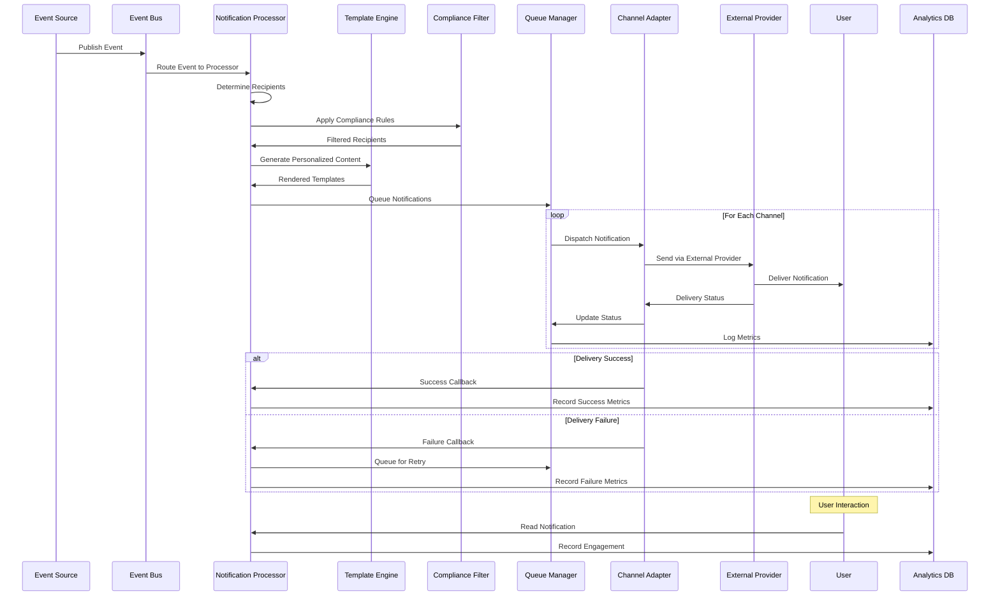

# Notification Service Architecture
## Basketball League Management Platform - Phase 2

**Document ID:** NOTIFICATION-BLMP-001  
**Version:** 1.0  
**Date:** August 8, 2025  
**Author:** Integration Architect  
**Status:** Phase 2 Integration Design  
**Classification:** Technical Architecture  

---

## Executive Summary

This document defines the comprehensive notification service architecture for the Basketball League Management Platform, providing multi-channel communication capabilities including email, SMS, push notifications, and in-app messaging. The architecture supports real-time event-driven notifications, COPPA-compliant youth communications, and basketball-specific notification workflows.

### Key Notification Features

- **Multi-Channel Delivery**: Email, SMS, Push, In-App, Voice Calls
- **Real-time Processing**: Event-driven notification triggers
- **COPPA Compliance**: Parental consent and youth protection
- **Intelligent Routing**: User preference-based delivery
- **Template Management**: Dynamic, personalized messaging
- **Analytics & Tracking**: Delivery metrics and engagement analytics
- **Emergency Notifications**: Critical safety and weather alerts

---

## Table of Contents

1. [Notification Architecture Overview](#1-notification-architecture-overview)
2. [Multi-Channel Delivery System](#2-multi-channel-delivery-system)
3. [Event-Driven Notification Engine](#3-event-driven-notification-engine)
4. [Template Management System](#4-template-management-system)
5. [COPPA-Compliant Communications](#5-coppa-compliant-communications)
6. [Basketball-Specific Notifications](#6-basketball-specific-notifications)
7. [Analytics and Performance Monitoring](#7-analytics-and-performance-monitoring)
8. [Emergency Notification System](#8-emergency-notification-system)

---

## 1. Notification Architecture Overview

### 1.1 High-Level Architecture

```mermaid
graph TB
    subgraph "Event Sources"
        GAME_SVC[Game Service<br/>Score Updates]
        SCHEDULE_SVC[Schedule Service<br/>Game Changes]
        PAYMENT_SVC[Payment Service<br/>Transaction Events]
        USER_SVC[User Service<br/>Registration Events]
        WEATHER_SVC[Weather Service<br/>Safety Alerts]
        SYSTEM_SVC[System Service<br/>Maintenance Alerts]
    end
    
    subgraph "Notification Processing Core"
        EVENT_BUS[Event Bus<br/>Apache Kafka]
        NOTIFICATION_API[Notification API<br/>REST/GraphQL]
        PROCESSOR[Notification Processor<br/>Event Routing]
        TEMPLATE_ENGINE[Template Engine<br/>Dynamic Content]
        QUEUE_MANAGER[Queue Manager<br/>Priority Processing]
    end
    
    subgraph "Channel Adapters"
        EMAIL_ADAPTER[Email Adapter<br/>SendGrid/SES]
        SMS_ADAPTER[SMS Adapter<br/>Twilio/AWS SNS]
        PUSH_ADAPTER[Push Adapter<br/>FCM/APNS]
        VOICE_ADAPTER[Voice Adapter<br/>Twilio Voice]
        INAPP_ADAPTER[In-App Adapter<br/>WebSocket]
    end
    
    subgraph "External Services"
        SENDGRID[SendGrid<br/>Email Delivery]
        TWILIO[Twilio<br/>SMS & Voice]
        FCM[Firebase Cloud<br/>Messaging]
        APNS[Apple Push<br/>Notification Service]
        AWS_SNS[AWS SNS<br/>Multi-Channel]
    end
    
    subgraph "Data Layer"
        NOTIFICATION_DB[(Notification Database<br/>PostgreSQL)]
        PREFERENCE_DB[(User Preferences<br/>Redis)]
        TEMPLATE_DB[(Template Storage<br/>PostgreSQL)]
        ANALYTICS_DB[(Analytics Database<br/>ClickHouse)]
        CACHE[(Notification Cache<br/>Redis)]
    end
    
    subgraph "User Interfaces"
        WEB_APP[Web Application<br/>Real-time Updates]
        MOBILE_APP[Mobile Applications<br/>Push Notifications]
        ADMIN_DASHBOARD[Admin Dashboard<br/>Notification Management]
        EMAIL_CLIENT[Email Clients<br/>Rich HTML Emails]
        SMS_DEVICE[Mobile Devices<br/>SMS Messages]
    end
    
    subgraph "Compliance & Security"
        COPPA_ENGINE[COPPA Compliance<br/>Engine]
        CONSENT_MGR[Consent Manager<br/>Opt-in/Opt-out]
        PRIVACY_FILTER[Privacy Filter<br/>Data Protection]
        RATE_LIMITER[Rate Limiter<br/>Anti-spam Protection]
    end
    
    GAME_SVC --> EVENT_BUS
    SCHEDULE_SVC --> EVENT_BUS
    PAYMENT_SVC --> EVENT_BUS
    USER_SVC --> EVENT_BUS
    WEATHER_SVC --> EVENT_BUS
    SYSTEM_SVC --> EVENT_BUS
    
    EVENT_BUS --> PROCESSOR
    NOTIFICATION_API --> PROCESSOR
    PROCESSOR --> TEMPLATE_ENGINE
    PROCESSOR --> QUEUE_MANAGER
    
    QUEUE_MANAGER --> EMAIL_ADAPTER
    QUEUE_MANAGER --> SMS_ADAPTER
    QUEUE_MANAGER --> PUSH_ADAPTER
    QUEUE_MANAGER --> VOICE_ADAPTER
    QUEUE_MANAGER --> INAPP_ADAPTER
    
    EMAIL_ADAPTER --> SENDGRID
    SMS_ADAPTER --> TWILIO
    PUSH_ADAPTER --> FCM
    PUSH_ADAPTER --> APNS
    VOICE_ADAPTER --> TWILIO
    SMS_ADAPTER --> AWS_SNS
    
    SENDGRID --> EMAIL_CLIENT
    TWILIO --> SMS_DEVICE
    FCM --> MOBILE_APP
    APNS --> MOBILE_APP
    INAPP_ADAPTER --> WEB_APP
    INAPP_ADAPTER --> MOBILE_APP
    
    PROCESSOR --> NOTIFICATION_DB
    PROCESSOR --> PREFERENCE_DB
    TEMPLATE_ENGINE --> TEMPLATE_DB
    PROCESSOR --> ANALYTICS_DB
    PROCESSOR --> CACHE
    
    PROCESSOR --> COPPA_ENGINE
    PROCESSOR --> CONSENT_MGR
    PROCESSOR --> PRIVACY_FILTER
    PROCESSOR --> RATE_LIMITER
    
    style PROCESSOR fill:#4ecdc4
    style TEMPLATE_ENGINE fill:#45b7d1
    style COPPA_ENGINE fill:#ff6b35
    style EVENT_BUS fill:#96ceb4
```



### 1.2 Notification Processing Flow



### 1.3 Technology Stack

| Component | Technology | Purpose | Scalability |
|-----------|------------|---------|-------------|
| **Event Bus** | Apache Kafka | Event streaming and processing | 1M+ events/sec |
| **Notification API** | Node.js/Express | HTTP API endpoints | Horizontal scaling |
| **Message Queue** | Bull Queue/Redis | Priority-based processing | Auto-scaling workers |
| **Template Engine** | Handlebars.js | Dynamic content generation | Template caching |
| **Database** | PostgreSQL 15 | Notification logs and templates | Read replicas |
| **Cache** | Redis 7+ | User preferences and templates | Cluster mode |
| **Email Service** | SendGrid/AWS SES | Email delivery | 100K+ emails/day |
| **SMS Service** | Twilio/AWS SNS | SMS delivery | Global coverage |
| **Push Notifications** | FCM/APNS | Mobile push notifications | Real-time delivery |
| **Analytics** | ClickHouse | Notification analytics | Columnar storage |

---

## 2. Multi-Channel Delivery System

### 2.1 Channel Adapter Architecture

```typescript
abstract class NotificationChannelAdapter {
  abstract channelType: NotificationChannel;
  abstract priority: number;
  abstract maxRetries: number;
  
  constructor(
    protected config: ChannelConfig,
    protected logger: Logger,
    protected metrics: MetricsCollector
  ) {}

  abstract async send(notification: ProcessedNotification): Promise<DeliveryResult>;
  abstract async validateRecipient(recipient: NotificationRecipient): Promise<ValidationResult>;
  abstract isAvailable(): Promise<boolean>;
  abstract getDeliveryStatus(messageId: string): Promise<DeliveryStatus>;
  
  async sendWithRetry(
    notification: ProcessedNotification,
    attempt: number = 1
  ): Promise<DeliveryResult> {
    try {
      const startTime = Date.now();
      const result = await this.send(notification);
      
      this.metrics.recordDeliveryAttempt({
        channel: this.channelType,
        success: result.success,
        attempt,
        duration: Date.now() - startTime,
        recipientId: notification.recipientId
      });

      return result;
    } catch (error) {
      this.logger.error(`${this.channelType} delivery failed`, {
        notificationId: notification.id,
        attempt,
        error: error.message
      });

      if (attempt < this.maxRetries && this.isRetryableError(error)) {
        const delay = this.calculateRetryDelay(attempt);
        await this.sleep(delay);
        return await this.sendWithRetry(notification, attempt + 1);
      }

      return {
        success: false,
        error: error.message,
        attempt,
        retryable: false
      };
    }
  }

  protected calculateRetryDelay(attempt: number): number {
    // Exponential backoff with jitter
    const baseDelay = 1000 * Math.pow(2, attempt - 1);
    const jitter = Math.random() * 1000;
    return Math.min(baseDelay + jitter, 300000); // Max 5 minutes
  }

  protected isRetryableError(error: any): boolean {
    const retryableCodes = ['RATE_LIMITED', 'TEMPORARY_FAILURE', 'TIMEOUT'];
    return retryableCodes.includes(error.code);
  }

  protected async sleep(ms: number): Promise<void> {
    return new Promise(resolve => setTimeout(resolve, ms));
  }
}
```

### 2.2 Email Channel Implementation

```typescript
class EmailChannelAdapter extends NotificationChannelAdapter {
  channelType = NotificationChannel.EMAIL;
  priority = 3;
  maxRetries = 3;

  private sendGrid: SendGridAPI;

  constructor(config: EmailChannelConfig, logger: Logger, metrics: MetricsCollector) {
    super(config, logger, metrics);
    this.sendGrid = new SendGridAPI(config.apiKey);
  }

  async send(notification: ProcessedNotification): Promise<DeliveryResult> {
    try {
      const emailData = this.buildEmailPayload(notification);
      
      const response = await this.sendGrid.send(emailData);
      
      return {
        success: true,
        messageId: response.messageId,
        providerId: response.headers['x-message-id'],
        deliveredAt: new Date(),
        channel: NotificationChannel.EMAIL
      };
    } catch (error) {
      throw new EmailDeliveryError(error.message, error.code);
    }
  }

  async validateRecipient(recipient: NotificationRecipient): Promise<ValidationResult> {
    // Basic email validation
    const emailRegex = /^[^\s@]+@[^\s@]+\.[^\s@]+$/;
    if (!emailRegex.test(recipient.email)) {
      return { valid: false, reason: 'Invalid email format' };
    }

    // Check against suppression lists
    const isSuppressed = await this.checkSuppressionList(recipient.email);
    if (isSuppressed) {
      return { valid: false, reason: 'Email is suppressed' };
    }

    // COPPA compliance check for youth recipients
    if (recipient.age && recipient.age < 13) {
      const hasParentalConsent = await this.checkParentalConsent(recipient.userId);
      if (!hasParentalConsent) {
        return { valid: false, reason: 'Parental consent required for youth recipient' };
      }
    }

    return { valid: true };
  }

  private buildEmailPayload(notification: ProcessedNotification): EmailPayload {
    const recipient = notification.recipient;
    const content = notification.content;

    return {
      to: [{
        email: recipient.email,
        name: recipient.name
      }],
      from: {
        email: this.config.fromEmail,
        name: this.config.fromName
      },
      subject: content.subject,
      content: [{
        type: 'text/html',
        value: content.htmlBody
      }, {
        type: 'text/plain',
        value: content.textBody
      }],
      customArgs: {
        notificationId: notification.id,
        tenantId: notification.tenantId,
        eventType: notification.eventType
      },
      trackingSettings: {
        clickTracking: { enable: true },
        openTracking: { enable: true }
      },
      categories: [
        'basketball-league',
        notification.category,
        notification.eventType
      ]
    };
  }

  async isAvailable(): Promise<boolean> {
    try {
      // Check SendGrid API health
      await this.sendGrid.getUser();
      return true;
    } catch (error) {
      this.logger.warn('SendGrid API unavailable', { error: error.message });
      return false;
    }
  }

  async getDeliveryStatus(messageId: string): Promise<DeliveryStatus> {
    try {
      const events = await this.sendGrid.getEmailEvents(messageId);
      
      // Find the latest relevant event
      const latestEvent = events
        .sort((a, b) => new Date(b.timestamp).getTime() - new Date(a.timestamp).getTime())
        .find(event => ['delivered', 'bounce', 'dropped', 'deferred'].includes(event.event));

      if (!latestEvent) {
        return { status: 'pending', timestamp: new Date() };
      }

      return {
        status: this.mapSendGridStatus(latestEvent.event),
        timestamp: new Date(latestEvent.timestamp),
        details: latestEvent.reason
      };
    } catch (error) {
      this.logger.error('Failed to get email delivery status', {
        messageId,
        error: error.message
      });
      return { status: 'unknown', timestamp: new Date() };
    }
  }

  private mapSendGridStatus(sendGridEvent: string): DeliveryStatusType {
    const statusMap: Record<string, DeliveryStatusType> = {
      'delivered': 'delivered',
      'bounce': 'failed',
      'dropped': 'failed',
      'deferred': 'pending',
      'processed': 'sent',
      'open': 'read',
      'click': 'engaged'
    };
    
    return statusMap[sendGridEvent] || 'unknown';
  }
}
```

### 2.3 SMS Channel Implementation

```typescript
class SMSChannelAdapter extends NotificationChannelAdapter {
  channelType = NotificationChannel.SMS;
  priority = 2;
  maxRetries = 2;

  private twilio: TwilioClient;

  constructor(config: SMSChannelConfig, logger: Logger, metrics: MetricsCollector) {
    super(config, logger, metrics);
    this.twilio = new TwilioClient(config.accountSid, config.authToken);
  }

  async send(notification: ProcessedNotification): Promise<DeliveryResult> {
    try {
      const smsData = this.buildSMSPayload(notification);
      
      const message = await this.twilio.messages.create(smsData);
      
      return {
        success: true,
        messageId: message.sid,
        providerId: message.sid,
        deliveredAt: new Date(),
        channel: NotificationChannel.SMS
      };
    } catch (error) {
      throw new SMSDeliveryError(error.message, error.code);
    }
  }

  async validateRecipient(recipient: NotificationRecipient): Promise<ValidationResult> {
    // Phone number validation
    if (!recipient.phoneNumber) {
      return { valid: false, reason: 'Phone number is required' };
    }

    // Normalize and validate phone number format
    const normalizedPhone = this.normalizePhoneNumber(recipient.phoneNumber);
    if (!this.isValidPhoneNumber(normalizedPhone)) {
      return { valid: false, reason: 'Invalid phone number format' };
    }

    // Check opt-out status
    const isOptedOut = await this.checkOptOutStatus(normalizedPhone);
    if (isOptedOut) {
      return { valid: false, reason: 'Recipient has opted out of SMS' };
    }

    // COPPA compliance - SMS to parent for youth players
    if (recipient.age && recipient.age < 13) {
      if (!recipient.parentPhoneNumber) {
        return { valid: false, reason: 'Parent phone number required for youth recipient' };
      }
      // Update recipient to parent's phone number
      recipient.phoneNumber = recipient.parentPhoneNumber;
    }

    return { valid: true };
  }

  private buildSMSPayload(notification: ProcessedNotification): SMSPayload {
    const recipient = notification.recipient;
    const content = notification.content;

    return {
      body: content.textBody,
      to: recipient.phoneNumber,
      from: this.config.fromNumber,
      messagingServiceSid: this.config.messagingServiceSid,
      statusCallback: `${this.config.webhookUrl}/sms/status`,
      provideFeedback: true
    };
  }

  async getDeliveryStatus(messageId: string): Promise<DeliveryStatus> {
    try {
      const message = await this.twilio.messages.get(messageId);
      
      return {
        status: this.mapTwilioStatus(message.status),
        timestamp: message.dateUpdated || new Date(),
        details: message.errorMessage
      };
    } catch (error) {
      this.logger.error('Failed to get SMS delivery status', {
        messageId,
        error: error.message
      });
      return { status: 'unknown', timestamp: new Date() };
    }
  }

  private normalizePhoneNumber(phoneNumber: string): string {
    // Remove all non-digit characters
    const digitsOnly = phoneNumber.replace(/\D/g, '');
    
    // Add country code if missing (assume US)
    if (digitsOnly.length === 10) {
      return `+1${digitsOnly}`;
    } else if (digitsOnly.length === 11 && digitsOnly.startsWith('1')) {
      return `+${digitsOnly}`;
    }
    
    return phoneNumber; // Return original if can't normalize
  }

  private isValidPhoneNumber(phoneNumber: string): boolean {
    // Basic E.164 format validation
    const e164Regex = /^\+[1-9]\d{1,14}$/;
    return e164Regex.test(phoneNumber);
  }

  private mapTwilioStatus(twilioStatus: string): DeliveryStatusType {
    const statusMap: Record<string, DeliveryStatusType> = {
      'queued': 'pending',
      'sent': 'sent',
      'delivered': 'delivered',
      'undelivered': 'failed',
      'failed': 'failed',
      'received': 'delivered'
    };
    
    return statusMap[twilioStatus] || 'unknown';
  }
}
```

### 2.4 Push Notification Implementation

```typescript
class PushChannelAdapter extends NotificationChannelAdapter {
  channelType = NotificationChannel.PUSH;
  priority = 1;
  maxRetries = 2;

  private fcm: FCMService;
  private apns: APNSService;

  constructor(config: PushChannelConfig, logger: Logger, metrics: MetricsCollector) {
    super(config, logger, metrics);
    this.fcm = new FCMService(config.fcmServerKey);
    this.apns = new APNSService(config.apnsConfig);
  }

  async send(notification: ProcessedNotification): Promise<DeliveryResult> {
    const recipient = notification.recipient;
    const deviceTokens = await this.getDeviceTokens(recipient.userId);
    
    if (deviceTokens.length === 0) {
      return {
        success: false,
        error: 'No device tokens found for user',
        retryable: false
      };
    }

    const results = await Promise.allSettled(
      deviceTokens.map(token => this.sendToDevice(notification, token))
    );

    const successCount = results.filter(r => r.status === 'fulfilled').length;
    const hasSuccess = successCount > 0;

    return {
      success: hasSuccess,
      messageId: `push_${notification.id}_${Date.now()}`,
      deliveredAt: hasSuccess ? new Date() : undefined,
      channel: NotificationChannel.PUSH,
      details: {
        totalDevices: deviceTokens.length,
        successfulDeliveries: successCount,
        results: results
      }
    };
  }

  private async sendToDevice(
    notification: ProcessedNotification,
    deviceToken: DeviceToken
  ): Promise<PushDeliveryResult> {
    const pushPayload = this.buildPushPayload(notification, deviceToken);
    
    try {
      if (deviceToken.platform === 'ios') {
        const response = await this.apns.send(pushPayload);
        return { success: true, messageId: response.id, platform: 'ios' };
      } else {
        const response = await this.fcm.send(pushPayload);
        return { success: true, messageId: response.name, platform: 'android' };
      }
    } catch (error) {
      // Check for invalid token
      if (this.isInvalidTokenError(error)) {
        await this.removeInvalidToken(deviceToken.token);
      }
      
      throw error;
    }
  }

  private buildPushPayload(
    notification: ProcessedNotification,
    deviceToken: DeviceToken
  ): PushPayload {
    const content = notification.content;
    
    if (deviceToken.platform === 'ios') {
      return {
        token: deviceToken.token,
        notification: {
          title: content.title,
          body: content.body,
          sound: this.getNotificationSound(notification.eventType)
        },
        data: {
          notificationId: notification.id,
          eventType: notification.eventType,
          ...content.data
        },
        apns: {
          payload: {
            aps: {
              badge: await this.getUserBadgeCount(notification.recipientId),
              category: this.getNotificationCategory(notification.eventType),
              'thread-id': notification.threadId
            }
          }
        }
      };
    } else {
      return {
        token: deviceToken.token,
        notification: {
          title: content.title,
          body: content.body,
          icon: this.getNotificationIcon(notification.eventType),
          color: '#FF6B35' // Gametriq orange
        },
        data: {
          notificationId: notification.id,
          eventType: notification.eventType,
          clickAction: content.clickAction || 'FLUTTER_NOTIFICATION_CLICK',
          ...content.data
        },
        android: {
          priority: this.getAndroidPriority(notification.priority),
          notification: {
            channelId: this.getNotificationChannelId(notification.eventType),
            tag: notification.threadId
          }
        }
      };
    }
  }

  async validateRecipient(recipient: NotificationRecipient): Promise<ValidationResult> {
    const deviceTokens = await this.getDeviceTokens(recipient.userId);
    
    if (deviceTokens.length === 0) {
      return { valid: false, reason: 'No device tokens registered' };
    }

    // Check notification permissions
    const hasPermission = await this.checkNotificationPermissions(recipient.userId);
    if (!hasPermission) {
      return { valid: false, reason: 'User has disabled push notifications' };
    }

    return { valid: true };
  }

  private getNotificationSound(eventType: string): string {
    const soundMap: Record<string, string> = {
      'game_reminder': 'game_whistle.caf',
      'score_update': 'score_buzzer.caf',
      'emergency': 'emergency_alert.caf',
      'payment_due': 'payment_reminder.caf'
    };
    
    return soundMap[eventType] || 'default';
  }

  private getNotificationCategory(eventType: string): string {
    const categoryMap: Record<string, string> = {
      'game_reminder': 'GAME_REMINDER_CATEGORY',
      'score_update': 'SCORE_UPDATE_CATEGORY',
      'payment_due': 'PAYMENT_CATEGORY'
    };
    
    return categoryMap[eventType] || 'GENERAL_CATEGORY';
  }
}
```

---

## 3. Event-Driven Notification Engine

### 3.1 Event Processing and Routing

```typescript
class NotificationEventProcessor {
  private eventHandlers: Map<string, EventHandler>;
  private ruleEngine: NotificationRuleEngine;

  constructor(
    private templateEngine: TemplateEngine,
    private channelManager: ChannelManager,
    private complianceEngine: ComplianceEngine
  ) {
    this.eventHandlers = new Map();
    this.ruleEngine = new NotificationRuleEngine();
    this.setupEventHandlers();
  }

  async processEvent(event: NotificationEvent): Promise<NotificationProcessingResult> {
    try {
      // Get event handler
      const handler = this.eventHandlers.get(event.type);
      if (!handler) {
        this.logger.warn(`No handler found for event type: ${event.type}`);
        return { processed: false, reason: 'No handler found' };
      }

      // Determine notification rules for this event
      const rules = await this.ruleEngine.getNotificationRules(event);
      
      if (rules.length === 0) {
        return { processed: false, reason: 'No notification rules match this event' };
      }

      // Process each rule
      const notifications: ProcessedNotification[] = [];
      
      for (const rule of rules) {
        const ruleNotifications = await this.processEventRule(event, rule);
        notifications.push(...ruleNotifications);
      }

      // Send notifications
      const deliveryResults = await this.sendNotifications(notifications);

      return {
        processed: true,
        notificationsCreated: notifications.length,
        deliveryResults,
        eventId: event.id
      };
    } catch (error) {
      this.logger.error('Failed to process notification event', {
        eventType: event.type,
        eventId: event.id,
        error: error.message
      });
      throw error;
    }
  }

  private async processEventRule(
    event: NotificationEvent,
    rule: NotificationRule
  ): Promise<ProcessedNotification[]> {
    const notifications: ProcessedNotification[] = [];

    // Get recipients based on rule criteria
    const recipients = await this.getEventRecipients(event, rule);

    for (const recipient of recipients) {
      // Apply compliance filtering
      const complianceResult = await this.complianceEngine.validateRecipient(
        recipient,
        rule,
        event
      );

      if (!complianceResult.allowed) {
        this.logger.info('Recipient filtered by compliance engine', {
          recipientId: recipient.userId,
          reason: complianceResult.reason
        });
        continue;
      }

      // Generate personalized notification content
      const content = await this.templateEngine.renderNotification(
        rule.templateId,
        {
          recipient,
          event,
          rule
        }
      );

      // Determine delivery channels based on user preferences and event priority
      const channels = await this.determineDeliveryChannels(recipient, rule, event);

      // Create notification for each channel
      for (const channel of channels) {
        const notification: ProcessedNotification = {
          id: crypto.randomUUID(),
          eventId: event.id,
          eventType: event.type,
          ruleId: rule.id,
          recipientId: recipient.userId,
          recipient,
          channel,
          content: this.adaptContentForChannel(content, channel),
          priority: rule.priority,
          category: rule.category,
          threadId: this.generateThreadId(event, recipient),
          tenantId: event.tenantId,
          scheduledFor: this.calculateScheduledTime(rule, event),
          metadata: {
            originalEventData: event.data,
            ruleVersion: rule.version,
            complianceFlags: complianceResult.flags
          },
          createdAt: new Date()
        };

        notifications.push(notification);
      }
    }

    return notifications;
  }

  private async getEventRecipients(
    event: NotificationEvent,
    rule: NotificationRule
  ): Promise<NotificationRecipient[]> {
    const recipients: NotificationRecipient[] = [];

    switch (rule.recipientType) {
      case RecipientType.TEAM_MEMBERS:
        const teamMembers = await this.getTeamMembers(event.data.teamId);
        recipients.push(...teamMembers);
        break;

      case RecipientType.LEAGUE_PARTICIPANTS:
        const leagueParticipants = await this.getLeagueParticipants(event.data.leagueId);
        recipients.push(...leagueParticipants);
        break;

      case RecipientType.GAME_PARTICIPANTS:
        const gameParticipants = await this.getGameParticipants(event.data.gameId);
        recipients.push(...gameParticipants);
        break;

      case RecipientType.PARENTS:
        const parents = await this.getParentRecipients(event.data);
        recipients.push(...parents);
        break;

      case RecipientType.COACHES:
        const coaches = await this.getCoachRecipients(event.data);
        recipients.push(...coaches);
        break;

      case RecipientType.REFEREES:
        const referees = await this.getRefereeRecipients(event.data);
        recipients.push(...referees);
        break;

      case RecipientType.CUSTOM_LIST:
        const customRecipients = await this.getCustomRecipients(rule.customRecipientList);
        recipients.push(...customRecipients);
        break;
    }

    // Apply recipient filters
    return this.applyRecipientFilters(recipients, rule.filters);
  }

  private async determineDeliveryChannels(
    recipient: NotificationRecipient,
    rule: NotificationRule,
    event: NotificationEvent
  ): Promise<NotificationChannel[]> {
    // Get user notification preferences
    const preferences = await this.getUserNotificationPreferences(recipient.userId);
    
    // Start with rule's preferred channels
    let channels = rule.channels.slice();

    // Filter based on user preferences
    channels = channels.filter(channel => {
      if (!preferences[channel]?.enabled) return false;
      
      // Check time-based preferences
      if (!this.isWithinAllowedHours(channel, preferences[channel])) return false;
      
      // Check category preferences
      if (!this.isCategoryAllowed(rule.category, preferences[channel])) return false;
      
      return true;
    });

    // For high priority notifications, ensure at least one channel
    if (channels.length === 0 && rule.priority >= NotificationPriority.HIGH) {
      // Fall back to user's most preferred channel
      const fallbackChannel = preferences.fallbackChannel || NotificationChannel.EMAIL;
      if (rule.channels.includes(fallbackChannel)) {
        channels = [fallbackChannel];
      }
    }

    // For emergency notifications, use all available channels
    if (rule.priority === NotificationPriority.EMERGENCY) {
      channels = rule.channels.slice(); // Use all rule channels regardless of preferences
    }

    return channels;
  }

  private setupEventHandlers(): void {
    // Game-related events
    this.eventHandlers.set('game.scheduled', new GameScheduledHandler());
    this.eventHandlers.set('game.updated', new GameUpdatedHandler());
    this.eventHandlers.set('game.cancelled', new GameCancelledHandler());
    this.eventHandlers.set('game.score_updated', new ScoreUpdatedHandler());
    this.eventHandlers.set('game.completed', new GameCompletedHandler());

    // Registration and payment events
    this.eventHandlers.set('registration.completed', new RegistrationCompletedHandler());
    this.eventHandlers.set('payment.succeeded', new PaymentSucceededHandler());
    this.eventHandlers.set('payment.failed', new PaymentFailedHandler());
    this.eventHandlers.set('payment.due_reminder', new PaymentDueReminderHandler());

    // User and team events
    this.eventHandlers.set('user.created', new UserCreatedHandler());
    this.eventHandlers.set('team.created', new TeamCreatedHandler());
    this.eventHandlers.set('team.roster_updated', new RosterUpdatedHandler());

    // Safety and weather events
    this.eventHandlers.set('weather.safety_alert', new WeatherSafetyHandler());
    this.eventHandlers.set('emergency.facility_alert', new FacilityEmergencyHandler());

    // System events
    this.eventHandlers.set('system.maintenance', new MaintenanceNotificationHandler());
  }

  private adaptContentForChannel(
    content: NotificationContent,
    channel: NotificationChannel
  ): NotificationContent {
    switch (channel) {
      case NotificationChannel.SMS:
        // SMS has character limits, use abbreviated content
        return {
          ...content,
          body: this.abbreviateForSMS(content.body),
          textBody: this.abbreviateForSMS(content.textBody || content.body)
        };
      
      case NotificationChannel.PUSH:
        // Push notifications need short, actionable content
        return {
          ...content,
          title: this.truncateTitle(content.title, 50),
          body: this.truncateBody(content.body, 150)
        };
      
      case NotificationChannel.EMAIL:
        // Email can handle rich content
        return content;
      
      default:
        return content;
    }
  }

  private generateThreadId(event: NotificationEvent, recipient: NotificationRecipient): string {
    // Group related notifications together
    const components = [
      event.type.split('.')[0], // Base event type (e.g., 'game', 'payment')
      event.data.gameId || event.data.leagueId || event.data.teamId,
      recipient.userId
    ].filter(Boolean);
    
    return components.join('_');
  }

  private calculateScheduledTime(rule: NotificationRule, event: NotificationEvent): Date {
    if (rule.deliveryTiming === 'immediate') {
      return new Date();
    }
    
    if (rule.deliveryTiming === 'scheduled' && rule.scheduledTime) {
      return rule.scheduledTime;
    }
    
    if (rule.deliveryTiming === 'relative' && rule.relativeOffset && event.data.scheduledTime) {
      const baseTime = new Date(event.data.scheduledTime);
      return new Date(baseTime.getTime() + rule.relativeOffset);
    }
    
    return new Date(); // Default to immediate
  }
}

enum RecipientType {
  TEAM_MEMBERS = 'team_members',
  LEAGUE_PARTICIPANTS = 'league_participants',
  GAME_PARTICIPANTS = 'game_participants',
  PARENTS = 'parents',
  COACHES = 'coaches',
  REFEREES = 'referees',
  LEAGUE_ADMINS = 'league_admins',
  CUSTOM_LIST = 'custom_list'
}

enum NotificationPriority {
  LOW = 1,
  NORMAL = 2,
  HIGH = 3,
  URGENT = 4,
  EMERGENCY = 5
}

interface NotificationRule {
  id: string;
  name: string;
  eventType: string;
  recipientType: RecipientType;
  channels: NotificationChannel[];
  templateId: string;
  priority: NotificationPriority;
  category: string;
  deliveryTiming: 'immediate' | 'scheduled' | 'relative';
  scheduledTime?: Date;
  relativeOffset?: number; // milliseconds
  filters: RecipientFilter[];
  customRecipientList?: string[];
  enabled: boolean;
  version: number;
}

interface NotificationEvent {
  id: string;
  type: string;
  tenantId: string;
  data: any;
  timestamp: Date;
  priority: NotificationPriority;
  source: string;
}

interface ProcessedNotification {
  id: string;
  eventId: string;
  eventType: string;
  ruleId: string;
  recipientId: string;
  recipient: NotificationRecipient;
  channel: NotificationChannel;
  content: NotificationContent;
  priority: NotificationPriority;
  category: string;
  threadId: string;
  tenantId: string;
  scheduledFor: Date;
  metadata: any;
  createdAt: Date;
}
```

---

## 4. Template Management System

### 4.1 Dynamic Template Engine

```typescript
class NotificationTemplateEngine {
  private handlebars: typeof Handlebars;
  private templateCache: Map<string, CompiledTemplate>;
  private helpers: TemplateHelpers;

  constructor(
    private templateRepository: TemplateRepository,
    private cacheManager: CacheManager
  ) {
    this.handlebars = Handlebars.create();
    this.templateCache = new Map();
    this.helpers = new TemplateHelpers();
    this.registerHelpers();
  }

  async renderNotification(
    templateId: string,
    context: NotificationContext
  ): Promise<NotificationContent> {
    try {
      // Get template from cache or database
      const template = await this.getTemplate(templateId);
      
      if (!template) {
        throw new TemplateNotFoundError(`Template not found: ${templateId}`);
      }

      // Compile template if not cached
      const compiledTemplate = await this.getCompiledTemplate(template);
      
      // Prepare rendering context
      const renderingContext = await this.prepareRenderingContext(context, template);
      
      // Render all template components
      const content: NotificationContent = {
        title: this.renderComponent(compiledTemplate.title, renderingContext),
        subject: this.renderComponent(compiledTemplate.subject, renderingContext),
        body: this.renderComponent(compiledTemplate.body, renderingContext),
        htmlBody: this.renderComponent(compiledTemplate.htmlBody, renderingContext),
        textBody: this.renderComponent(compiledTemplate.textBody, renderingContext),
        data: this.renderDataContext(template.dataTemplate, renderingContext)
      };

      // Validate rendered content
      this.validateRenderedContent(content, template);

      return content;
    } catch (error) {
      this.logger.error('Failed to render notification template', {
        templateId,
        error: error.message
      });
      throw error;
    }
  }

  private async getTemplate(templateId: string): Promise<NotificationTemplate | null> {
    // Check cache first
    const cacheKey = `template:${templateId}`;
    let template = await this.cacheManager.get(cacheKey);
    
    if (!template) {
      // Fetch from database
      template = await this.templateRepository.findById(templateId);
      
      if (template) {
        // Cache for 1 hour
        await this.cacheManager.set(cacheKey, template, 3600);
      }
    }

    return template;
  }

  private async getCompiledTemplate(template: NotificationTemplate): Promise<CompiledTemplate> {
    const cacheKey = `compiled:${template.id}:${template.version}`;
    
    if (this.templateCache.has(cacheKey)) {
      return this.templateCache.get(cacheKey)!;
    }

    const compiledTemplate: CompiledTemplate = {
      id: template.id,
      title: this.handlebars.compile(template.titleTemplate),
      subject: this.handlebars.compile(template.subjectTemplate),
      body: this.handlebars.compile(template.bodyTemplate),
      htmlBody: this.handlebars.compile(template.htmlBodyTemplate || template.bodyTemplate),
      textBody: this.handlebars.compile(template.textBodyTemplate || template.bodyTemplate),
      version: template.version
    };

    this.templateCache.set(cacheKey, compiledTemplate);
    return compiledTemplate;
  }

  private async prepareRenderingContext(
    context: NotificationContext,
    template: NotificationTemplate
  ): Promise<any> {
    const baseContext = {
      recipient: context.recipient,
      event: context.event,
      rule: context.rule,
      timestamp: new Date().toISOString(),
      platform: {
        name: 'Gametriq League Management',
        url: process.env.PLATFORM_URL,
        supportEmail: process.env.SUPPORT_EMAIL
      }
    };

    // Add basketball-specific context
    const basketballContext = await this.addBasketballContext(context);
    
    // Add personalization data
    const personalizationContext = await this.addPersonalizationContext(context.recipient);
    
    // Merge all contexts
    return {
      ...baseContext,
      ...basketballContext,
      ...personalizationContext,
      ...context.event.data
    };
  }

  private async addBasketballContext(context: NotificationContext): Promise<any> {
    const basketballContext: any = {};

    if (context.event.data.gameId) {
      basketballContext.game = await this.getGameDetails(context.event.data.gameId);
    }

    if (context.event.data.teamId) {
      basketballContext.team = await this.getTeamDetails(context.event.data.teamId);
    }

    if (context.event.data.leagueId) {
      basketballContext.league = await this.getLeagueDetails(context.event.data.leagueId);
    }

    if (context.event.data.playerId) {
      basketballContext.player = await this.getPlayerDetails(context.event.data.playerId);
    }

    return basketballContext;
  }

  private registerHelpers(): void {
    // Date formatting helpers
    this.handlebars.registerHelper('formatDate', (date: Date, format: string) => {
      return this.helpers.formatDate(date, format);
    });

    this.handlebars.registerHelper('formatTime', (date: Date, timeZone: string) => {
      return this.helpers.formatTime(date, timeZone);
    });

    // Basketball-specific helpers
    this.handlebars.registerHelper('teamName', (teamId: string) => {
      return this.helpers.getTeamName(teamId);
    });

    this.handlebars.registerHelper('gameScore', (homeScore: number, awayScore: number) => {
      return `${homeScore} - ${awayScore}`;
    });

    this.handlebars.registerHelper('formatCurrency', (amount: number, currency: string = 'USD') => {
      return this.helpers.formatCurrency(amount, currency);
    });

    // Conditional helpers
    this.handlebars.registerHelper('ifEquals', function(this: any, arg1: any, arg2: any, options: any) {
      return (arg1 === arg2) ? options.fn(this) : options.inverse(this);
    });

    this.handlebars.registerHelper('ifYouthPlayer', function(this: any, age: number, options: any) {
      return (age < 13) ? options.fn(this) : options.inverse(this);
    });

    // COPPA compliance helper
    this.handlebars.registerHelper('coppaCompliantName', (recipient: NotificationRecipient) => {
      if (recipient.age && recipient.age < 13) {
        return recipient.displayName || `Player ${recipient.jerseyNumber || ''}`.trim();
      }
      return recipient.name;
    });

    // URL generation helpers
    this.handlebars.registerHelper('gameUrl', (gameId: string) => {
      return `${process.env.PLATFORM_URL}/games/${gameId}`;
    });

    this.handlebars.registerHelper('teamUrl', (teamId: string) => {
      return `${process.env.PLATFORM_URL}/teams/${teamId}`;
    });

    this.handlebars.registerHelper('unsubscribeUrl', (recipientId: string, notificationType: string) => {
      return `${process.env.PLATFORM_URL}/unsubscribe?user=${recipientId}&type=${notificationType}`;
    });
  }

  async createTemplate(templateData: CreateTemplateRequest): Promise<NotificationTemplate> {
    try {
      // Validate template syntax
      await this.validateTemplateSyntax(templateData);

      // Create template
      const template: NotificationTemplate = {
        id: crypto.randomUUID(),
        name: templateData.name,
        description: templateData.description,
        category: templateData.category,
        eventTypes: templateData.eventTypes,
        titleTemplate: templateData.titleTemplate,
        subjectTemplate: templateData.subjectTemplate,
        bodyTemplate: templateData.bodyTemplate,
        htmlBodyTemplate: templateData.htmlBodyTemplate,
        textBodyTemplate: templateData.textBodyTemplate,
        dataTemplate: templateData.dataTemplate,
        variables: await this.extractVariables(templateData),
        version: 1,
        enabled: true,
        createdAt: new Date(),
        updatedAt: new Date()
      };

      await this.templateRepository.create(template);
      
      // Clear cache to force reload
      await this.clearTemplateCache(template.id);

      return template;
    } catch (error) {
      this.logger.error('Failed to create notification template', {
        templateData,
        error: error.message
      });
      throw error;
    }
  }

  private async validateTemplateSyntax(templateData: CreateTemplateRequest): Promise<void> {
    const templates = [
      templateData.titleTemplate,
      templateData.subjectTemplate,
      templateData.bodyTemplate,
      templateData.htmlBodyTemplate,
      templateData.textBodyTemplate
    ].filter(Boolean);

    for (const templateString of templates) {
      try {
        this.handlebars.compile(templateString!);
      } catch (error) {
        throw new TemplateValidationError(
          `Template syntax error: ${error.message}`,
          templateString
        );
      }
    }
  }

  private async extractVariables(templateData: CreateTemplateRequest): Promise<TemplateVariable[]> {
    const variables: Set<string> = new Set();
    const templates = [
      templateData.titleTemplate,
      templateData.subjectTemplate,
      templateData.bodyTemplate,
      templateData.htmlBodyTemplate,
      templateData.textBodyTemplate
    ].filter(Boolean);

    for (const templateString of templates) {
      const matches = templateString!.match(/{{\s*([^}]+)\s*}}/g);
      if (matches) {
        matches.forEach(match => {
          const variable = match.replace(/{{\s*|\s*}}/g, '').split('.')[0].split(' ')[0];
          variables.add(variable);
        });
      }
    }

    return Array.from(variables).map(variable => ({
      name: variable,
      type: this.inferVariableType(variable),
      required: true,
      description: this.generateVariableDescription(variable)
    }));
  }

  private renderComponent(
    compiledTemplate: HandlebarsTemplateDelegate,
    context: any
  ): string {
    try {
      return compiledTemplate(context);
    } catch (error) {
      this.logger.error('Template rendering failed', {
        error: error.message,
        context: JSON.stringify(context, null, 2)
      });
      throw new TemplateRenderingError(`Template rendering failed: ${error.message}`);
    }
  }
}

interface NotificationTemplate {
  id: string;
  name: string;
  description: string;
  category: string;
  eventTypes: string[];
  titleTemplate: string;
  subjectTemplate: string;
  bodyTemplate: string;
  htmlBodyTemplate?: string;
  textBodyTemplate?: string;
  dataTemplate?: any;
  variables: TemplateVariable[];
  version: number;
  enabled: boolean;
  createdAt: Date;
  updatedAt: Date;
}

interface CompiledTemplate {
  id: string;
  title: HandlebarsTemplateDelegate;
  subject: HandlebarsTemplateDelegate;
  body: HandlebarsTemplateDelegate;
  htmlBody: HandlebarsTemplateDelegate;
  textBody: HandlebarsTemplateDelegate;
  version: number;
}

interface TemplateVariable {
  name: string;
  type: 'string' | 'number' | 'date' | 'object' | 'array';
  required: boolean;
  description: string;
}

interface NotificationContext {
  recipient: NotificationRecipient;
  event: NotificationEvent;
  rule: NotificationRule;
}

interface NotificationContent {
  title: string;
  subject: string;
  body: string;
  htmlBody?: string;
  textBody?: string;
  data?: any;
}
```

---

## 5. COPPA-Compliant Communications

### 5.1 Youth Protection and Parental Controls

```typescript
class COPPAComplianceEngine {
  constructor(
    private consentService: ParentalConsentService,
    private privacyFilter: PrivacyFilterService,
    private auditLogger: AuditLogger
  ) {}

  async validateRecipient(
    recipient: NotificationRecipient,
    rule: NotificationRule,
    event: NotificationEvent
  ): Promise<ComplianceValidationResult> {
    try {
      // Check if recipient is a minor
      if (!this.isMinor(recipient)) {
        return { allowed: true, flags: [] };
      }

      // For minors, check parental consent
      const consentResult = await this.validateParentalConsent(recipient, rule);
      if (!consentResult.valid) {
        return {
          allowed: false,
          reason: consentResult.reason,
          flags: ['MINOR_NO_CONSENT']
        };
      }

      // Check if notification should go to parent instead of child
      const shouldRouteToParent = this.shouldRouteToParent(rule, recipient);
      if (shouldRouteToParent) {
        const parentRecipient = await this.getParentRecipient(recipient.userId);
        if (parentRecipient) {
          return {
            allowed: true,
            alternateRecipient: parentRecipient,
            flags: ['ROUTED_TO_PARENT']
          };
        }
      }

      // Apply content filtering for youth
      const contentCompliant = await this.validateContentForMinor(event, rule);
      if (!contentCompliant.compliant) {
        return {
          allowed: false,
          reason: 'Content not appropriate for minor',
          flags: ['CONTENT_FILTERED']
        };
      }

      return {
        allowed: true,
        flags: ['MINOR_WITH_CONSENT'],
        restrictions: await this.getMinorRestrictions(recipient)
      };
    } catch (error) {
      this.auditLogger.logComplianceError({
        recipientId: recipient.userId,
        ruleId: rule.id,
        eventId: event.id,
        error: error.message
      });
      throw error;
    }
  }

  private async validateParentalConsent(
    recipient: NotificationRecipient,
    rule: NotificationRule
  ): Promise<ConsentValidationResult> {
    const consent = await this.consentService.getParentalConsent(recipient.userId);
    
    if (!consent) {
      return {
        valid: false,
        reason: 'No parental consent on file'
      };
    }

    // Check if consent is current
    if (this.isConsentExpired(consent)) {
      return {
        valid: false,
        reason: 'Parental consent has expired'
      };
    }

    // Check if consent covers this type of communication
    if (!this.doesConsentCoverCommunication(consent, rule)) {
      return {
        valid: false,
        reason: 'Parental consent does not cover this type of communication'
      };
    }

    return { valid: true };
  }

  private shouldRouteToParent(rule: NotificationRule, recipient: NotificationRecipient): boolean {
    // Always route certain types of notifications to parents for minors
    const parentNotificationTypes = [
      'payment_due',
      'payment_failed', 
      'registration_required',
      'medical_form_required',
      'emergency_contact_needed',
      'disciplinary_action',
      'injury_report'
    ];

    if (parentNotificationTypes.includes(rule.category)) {
      return true;
    }

    // Check recipient's age-specific rules
    if (recipient.age && recipient.age < 10) {
      // Very young players - most notifications go to parents
      const childNotificationTypes = ['game_reminder', 'practice_reminder'];
      return !childNotificationTypes.includes(rule.category);
    }

    return false;
  }

  private async validateContentForMinor(
    event: NotificationEvent,
    rule: NotificationRule
  ): Promise<ContentComplianceResult> {
    // Check for inappropriate content categories
    const restrictedCategories = [
      'financial_details',
      'personal_contact_info',
      'disciplinary_details',
      'medical_information'
    ];

    if (restrictedCategories.includes(rule.category)) {
      return {
        compliant: false,
        reason: `Content category ${rule.category} not appropriate for minors`
      };
    }

    // Check event data for sensitive information
    const sensitiveFields = ['ssn', 'payment_info', 'medical_notes', 'parent_email'];
    const hasSensitiveData = sensitiveFields.some(field => 
      event.data.hasOwnProperty(field) && event.data[field]
    );

    if (hasSensitiveData) {
      return {
        compliant: false,
        reason: 'Event contains sensitive data not appropriate for minors'
      };
    }

    return { compliant: true };
  }

  async filterNotificationForMinor(
    notification: ProcessedNotification
  ): Promise<ProcessedNotification> {
    if (!this.isMinor(notification.recipient)) {
      return notification;
    }

    // Apply COPPA-compliant filtering
    const filteredContent = await this.privacyFilter.filterContentForMinor(
      notification.content,
      notification.recipient.age!
    );

    // Remove or anonymize personal information of other minors
    if (notification.content.data?.participants) {
      filteredContent.data.participants = notification.content.data.participants.map((p: any) => {
        if (p.age < 13 && p.userId !== notification.recipient.userId) {
          return {
            ...p,
            name: `Player ${p.jerseyNumber || ''}`.trim(),
            email: undefined,
            phone: undefined
          };
        }
        return p;
      });
    }

    return {
      ...notification,
      content: filteredContent,
      metadata: {
        ...notification.metadata,
        coppaFiltered: true,
        filterAppliedAt: new Date()
      }
    };
  }

  async handleParentalOptOut(userId: string, optOutType: ParentalOptOutType): Promise<void> {
    try {
      // Record opt-out in audit log
      await this.auditLogger.logParentalOptOut({
        userId,
        optOutType,
        timestamp: new Date()
      });

      // Update user notification preferences
      await this.updateNotificationPreferences(userId, optOutType);

      // Remove from future communications based on opt-out type
      await this.processOptOutRequest(userId, optOutType);

      // Send confirmation to parent
      await this.sendOptOutConfirmation(userId, optOutType);

    } catch (error) {
      this.logger.error('Failed to handle parental opt-out', {
        userId,
        optOutType,
        error: error.message
      });
      throw error;
    }
  }

  private async processOptOutRequest(userId: string, optOutType: ParentalOptOutType): Promise<void> {
    switch (optOutType) {
      case ParentalOptOutType.ALL_COMMUNICATIONS:
        await this.disableAllNotifications(userId);
        break;
      
      case ParentalOptOutType.MARKETING_ONLY:
        await this.disableMarketingNotifications(userId);
        break;
      
      case ParentalOptOutType.SMS_ONLY:
        await this.disableSMSNotifications(userId);
        break;
      
      case ParentalOptOutType.EMAIL_ONLY:
        await this.disableEmailNotifications(userId);
        break;
      
      case ParentalOptOutType.THIRD_PARTY_SHARING:
        await this.disableThirdPartySharing(userId);
        break;
    }
  }

  private isMinor(recipient: NotificationRecipient): boolean {
    return recipient.age !== undefined && recipient.age < 13;
  }

  private isConsentExpired(consent: ParentalConsent): boolean {
    if (!consent.expirationDate) return false;
    return consent.expirationDate < new Date();
  }

  private doesConsentCoverCommunication(
    consent: ParentalConsent,
    rule: NotificationRule
  ): boolean {
    // Check if consent permissions include this communication type
    return consent.permissions.includes(rule.category) || 
           consent.permissions.includes('all_communications');
  }

  async generateConsentRequest(
    minorUserId: string,
    parentEmail: string,
    consentType: ConsentType
  ): Promise<ConsentRequestResult> {
    try {
      const consentRequest: ParentalConsentRequest = {
        id: crypto.randomUUID(),
        minorUserId,
        parentEmail,
        consentType,
        permissions: this.getDefaultPermissionsForConsentType(consentType),
        status: 'pending',
        createdAt: new Date(),
        expiresAt: new Date(Date.now() + 7 * 24 * 60 * 60 * 1000) // 7 days
      };

      await this.consentService.createConsentRequest(consentRequest);
      
      // Send consent request email to parent
      await this.sendConsentRequestEmail(consentRequest);

      return {
        success: true,
        requestId: consentRequest.id,
        expiresAt: consentRequest.expiresAt
      };
    } catch (error) {
      this.logger.error('Failed to generate consent request', {
        minorUserId,
        parentEmail,
        consentType,
        error: error.message
      });
      throw error;
    }
  }
}

enum ParentalOptOutType {
  ALL_COMMUNICATIONS = 'all_communications',
  MARKETING_ONLY = 'marketing_only',
  SMS_ONLY = 'sms_only',
  EMAIL_ONLY = 'email_only',
  THIRD_PARTY_SHARING = 'third_party_sharing'
}

enum ConsentType {
  BASIC_COMMUNICATIONS = 'basic_communications',
  MARKETING_COMMUNICATIONS = 'marketing_communications',
  EMERGENCY_COMMUNICATIONS = 'emergency_communications',
  PHOTO_VIDEO_SHARING = 'photo_video_sharing'
}

interface ParentalConsent {
  id: string;
  minorUserId: string;
  parentUserId: string;
  parentEmail: string;
  permissions: string[];
  consentDate: Date;
  expirationDate?: Date;
  ipAddress: string;
  userAgent: string;
  status: 'active' | 'revoked' | 'expired';
}

interface ComplianceValidationResult {
  allowed: boolean;
  reason?: string;
  alternateRecipient?: NotificationRecipient;
  flags: string[];
  restrictions?: string[];
}

interface ConsentValidationResult {
  valid: boolean;
  reason?: string;
}

interface ContentComplianceResult {
  compliant: boolean;
  reason?: string;
}
```

---

## 6. Basketball-Specific Notifications

### 6.1 Game and Schedule Notifications

```typescript
class BasketballNotificationHandlers {
  
  // Game reminder notifications
  static createGameReminderHandler(): EventHandler {
    return async (event: NotificationEvent) => {
      const gameData = event.data;
      
      return {
        eventType: 'game_reminder',
        recipientTypes: [RecipientType.GAME_PARTICIPANTS, RecipientType.PARENTS],
        templates: {
          email: 'game_reminder_email',
          sms: 'game_reminder_sms',
          push: 'game_reminder_push'
        },
        scheduling: {
          triggers: [
            { offset: -24 * 60 * 60 * 1000, priority: NotificationPriority.NORMAL }, // 24 hours before
            { offset: -2 * 60 * 60 * 1000, priority: NotificationPriority.HIGH },   // 2 hours before
            { offset: -15 * 60 * 1000, priority: NotificationPriority.HIGH }        // 15 minutes before
          ]
        },
        personalization: {
          homeTeamFocus: true,
          includeDirections: true,
          includeWeatherInfo: true
        }
      };
    };
  }

  // Live score update notifications
  static createScoreUpdateHandler(): EventHandler {
    return async (event: NotificationEvent) => {
      const scoreData = event.data;
      
      // Only send for significant scoring events
      if (!this.isSignificantScoreUpdate(scoreData)) {
        return null;
      }

      return {
        eventType: 'score_update',
        recipientTypes: [RecipientType.PARENTS, RecipientType.TEAM_MEMBERS],
        templates: {
          push: 'score_update_push',
          inapp: 'score_update_inapp'
        },
        channels: [NotificationChannel.PUSH, NotificationChannel.IN_APP],
        throttling: {
          maxPerGame: 10,
          cooldownMinutes: 2
        },
        content: {
          title: `${scoreData.homeTeam} ${scoreData.homeScore} - ${scoreData.awayScore} ${scoreData.awayTeam}`,
          body: this.buildScoreUpdateMessage(scoreData),
          actions: [
            {
              id: 'view_game',
              title: 'View Game',
              url: `/games/${scoreData.gameId}`
            }
          ]
        }
      };
    };
  }

  // Tournament bracket notifications
  static createTournamentUpdateHandler(): EventHandler {
    return async (event: NotificationEvent) => {
      const tournamentData = event.data;
      
      return {
        eventType: 'tournament_update',
        recipientTypes: [RecipientType.LEAGUE_PARTICIPANTS],
        templates: {
          email: 'tournament_bracket_email',
          push: 'tournament_bracket_push'
        },
        content: {
          includeVisualBracket: true,
          highlightAdvancingTeams: true,
          showNextGames: true
        }
      };
    };
  }

  // Weather safety notifications
  static createWeatherSafetyHandler(): EventHandler {
    return async (event: NotificationEvent) => {
      const weatherData = event.data;
      
      if (weatherData.severity < WeatherSeverity.CAUTION) {
        return null; // Only send for significant weather
      }

      return {
        eventType: 'weather_safety',
        recipientTypes: [
          RecipientType.GAME_PARTICIPANTS,
          RecipientType.PARENTS,
          RecipientType.COACHES,
          RecipientType.REFEREES,
          RecipientType.LEAGUE_ADMINS
        ],
        templates: {
          email: 'weather_safety_email',
          sms: 'weather_safety_sms',
          push: 'weather_safety_push',
          voice: 'weather_safety_voice' // For emergency level
        },
        priority: this.mapWeatherSeverityToPriority(weatherData.severity),
        channels: this.getWeatherNotificationChannels(weatherData.severity),
        content: {
          weatherDetails: weatherData,
          safetyRecommendations: this.getWeatherSafetyRecommendations(weatherData),
          affectedGames: weatherData.affectedGames
        }
      };
    };
  }

  // Team roster update notifications
  static createRosterUpdateHandler(): EventHandler {
    return async (event: NotificationEvent) => {
      const rosterData = event.data;
      
      return {
        eventType: 'roster_update',
        recipientTypes: [RecipientType.TEAM_MEMBERS, RecipientType.PARENTS],
        templates: {
          email: 'roster_update_email',
          push: 'roster_update_push'
        },
        content: {
          changeType: rosterData.changeType, // 'added', 'removed', 'position_change'
          playerChanges: rosterData.changes,
          teamName: rosterData.teamName,
          effectiveDate: rosterData.effectiveDate
        }
      };
    };
  }

  // Practice cancellation notifications
  static createPracticeCancellationHandler(): EventHandler {
    return async (event: NotificationEvent) => {
      const practiceData = event.data;
      
      return {
        eventType: 'practice_cancelled',
        recipientTypes: [RecipientType.TEAM_MEMBERS, RecipientType.PARENTS, RecipientType.COACHES],
        templates: {
          email: 'practice_cancelled_email',
          sms: 'practice_cancelled_sms',
          push: 'practice_cancelled_push'
        },
        priority: NotificationPriority.HIGH, // High priority for schedule changes
        channels: [NotificationChannel.SMS, NotificationChannel.PUSH, NotificationChannel.EMAIL],
        content: {
          practiceDate: practiceData.scheduledDate,
          cancellationReason: practiceData.reason,
          rescheduleInfo: practiceData.rescheduleDetails,
          contactInfo: practiceData.coachContact
        }
      };
    };
  }

  // Playoff qualification notifications
  static createPlayoffQualificationHandler(): EventHandler {
    return async (event: NotificationEvent) => {
      const playoffData = event.data;
      
      return {
        eventType: 'playoff_qualification',
        recipientTypes: [RecipientType.TEAM_MEMBERS, RecipientType.PARENTS],
        templates: {
          email: 'playoff_qualification_email',
          push: 'playoff_qualification_push'
        },
        content: {
          qualificationType: playoffData.type, // 'qualified', 'eliminated', 'seeding_update'
          teamRanking: playoffData.ranking,
          playoffSchedule: playoffData.schedule,
          celebratoryMessage: playoffData.type === 'qualified'
        }
      };
    };
  }

  private static isSignificantScoreUpdate(scoreData: any): boolean {
    // Define significant scoring events
    const significantEvents = [
      'quarter_end',
      'half_end',
      'game_end',
      'lead_change',
      'tie_game',
      'buzzer_beater'
    ];
    
    return significantEvents.includes(scoreData.eventType) || 
           scoreData.pointDifference >= 10; // Large scoring runs
  }

  private static buildScoreUpdateMessage(scoreData: any): string {
    const { homeTeam, awayTeam, homeScore, awayScore, quarter, timeRemaining } = scoreData;
    
    if (scoreData.eventType === 'game_end') {
      const winner = homeScore > awayScore ? homeTeam : awayTeam;
      return `Final: ${winner} wins ${Math.max(homeScore, awayScore)} - ${Math.min(homeScore, awayScore)}`;
    }
    
    if (scoreData.eventType === 'quarter_end') {
      return `End of Q${quarter}: ${homeTeam} ${homeScore} - ${awayScore} ${awayTeam}`;
    }
    
    return `Q${quarter} ${timeRemaining}: ${homeTeam} ${homeScore} - ${awayScore} ${awayTeam}`;
  }

  private static mapWeatherSeverityToPriority(severity: WeatherSeverity): NotificationPriority {
    switch (severity) {
      case WeatherSeverity.EMERGENCY:
        return NotificationPriority.EMERGENCY;
      case WeatherSeverity.WARNING:
        return NotificationPriority.URGENT;
      case WeatherSeverity.CAUTION:
        return NotificationPriority.HIGH;
      default:
        return NotificationPriority.NORMAL;
    }
  }

  private static getWeatherNotificationChannels(severity: WeatherSeverity): NotificationChannel[] {
    switch (severity) {
      case WeatherSeverity.EMERGENCY:
        return [
          NotificationChannel.VOICE,
          NotificationChannel.SMS,
          NotificationChannel.PUSH,
          NotificationChannel.EMAIL,
          NotificationChannel.IN_APP
        ];
      case WeatherSeverity.WARNING:
        return [
          NotificationChannel.SMS,
          NotificationChannel.PUSH,
          NotificationChannel.EMAIL
        ];
      default:
        return [NotificationChannel.PUSH, NotificationChannel.EMAIL];
    }
  }

  private static getWeatherSafetyRecommendations(weatherData: any): string[] {
    const recommendations: string[] = [];
    
    if (weatherData.temperature > 95) {
      recommendations.push('Increase water breaks to every 10 minutes');
      recommendations.push('Watch for signs of heat exhaustion');
    }
    
    if (weatherData.heatIndex > 105) {
      recommendations.push('Consider postponing outdoor activities');
      recommendations.push('Move to air-conditioned areas when possible');
    }
    
    if (weatherData.alerts.includes('thunderstorm')) {
      recommendations.push('Move indoors immediately');
      recommendations.push('Wait 30 minutes after last thunder before resuming outdoor activities');
    }
    
    return recommendations;
  }
}

enum WeatherSeverity {
  NORMAL = 0,
  CAUTION = 1,
  WARNING = 2,
  EMERGENCY = 3
}
```

### 6.2 Payment and Registration Notifications

```typescript
class PaymentNotificationHandlers {
  
  // Registration confirmation notifications
  static createRegistrationConfirmationHandler(): EventHandler {
    return async (event: NotificationEvent) => {
      const registrationData = event.data;
      
      return {
        eventType: 'registration_confirmed',
        recipientTypes: [RecipientType.PARENTS], // Always to parent for payment confirmations
        templates: {
          email: 'registration_confirmation_email',
          sms: 'registration_confirmation_sms'
        },
        content: {
          playerName: registrationData.playerName,
          leagueName: registrationData.leagueName,
          teamAssignment: registrationData.teamName,
          seasonDetails: registrationData.seasonInfo,
          paymentReceipt: registrationData.paymentDetails,
          nextSteps: registrationData.requiredActions,
          importantDates: registrationData.keyDates
        },
        attachments: [
          {
            type: 'pdf',
            name: 'registration_receipt.pdf',
            content: registrationData.receiptPdf
          },
          {
            type: 'ical',
            name: 'season_schedule.ics',
            content: registrationData.scheduleCalendar
          }
        ]
      };
    };
  }

  // Payment reminder notifications
  static createPaymentReminderHandler(): EventHandler {
    return async (event: NotificationEvent) => {
      const paymentData = event.data;
      
      return {
        eventType: 'payment_reminder',
        recipientTypes: [RecipientType.PARENTS],
        templates: {
          email: 'payment_reminder_email',
          sms: 'payment_reminder_sms',
          push: 'payment_reminder_push'
        },
        scheduling: {
          triggers: [
            { offset: -7 * 24 * 60 * 60 * 1000, priority: NotificationPriority.NORMAL },  // 7 days before
            { offset: -3 * 24 * 60 * 60 * 1000, priority: NotificationPriority.HIGH },    // 3 days before
            { offset: -1 * 24 * 60 * 60 * 1000, priority: NotificationPriority.HIGH },    // 1 day before
            { offset: 0, priority: NotificationPriority.URGENT }                           // Due date
          ]
        },
        content: {
          amountDue: paymentData.amount,
          dueDate: paymentData.dueDate,
          paymentMethods: paymentData.acceptedMethods,
          lateFeePolicies: paymentData.lateFeeInfo,
          paymentUrl: paymentData.paymentLink,
          contactInfo: paymentData.supportContact
        }
      };
    };
  }

  // Payment failure notifications
  static createPaymentFailureHandler(): EventHandler {
    return async (event: NotificationEvent) => {
      const paymentData = event.data;
      
      return {
        eventType: 'payment_failed',
        recipientTypes: [RecipientType.PARENTS],
        templates: {
          email: 'payment_failed_email',
          sms: 'payment_failed_sms'
        },
        priority: NotificationPriority.HIGH,
        content: {
          failureReason: paymentData.failureReason,
          retryOptions: paymentData.retryMethods,
          registrationStatus: paymentData.registrationImpact,
          supportContact: paymentData.helpContact,
          alternativePaymentMethods: paymentData.alternativeMethods
        }
      };
    };
  }

  // Refund processed notifications
  static createRefundProcessedHandler(): EventHandler {
    return async (event: NotificationEvent) => {
      const refundData = event.data;
      
      return {
        eventType: 'refund_processed',
        recipientTypes: [RecipientType.PARENTS],
        templates: {
          email: 'refund_confirmation_email'
        },
        content: {
          refundAmount: refundData.amount,
          refundReason: refundData.reason,
          processingTime: refundData.estimatedDays,
          refundMethod: refundData.method,
          referenceNumber: refundData.transactionId
        },
        attachments: [
          {
            type: 'pdf',
            name: 'refund_receipt.pdf',
            content: refundData.receiptPdf
          }
        ]
      };
    };
  }

  // Fundraising notifications
  static createFundraisingHandler(): EventHandler {
    return async (event: NotificationEvent) => {
      const fundraisingData = event.data;
      
      return {
        eventType: 'fundraising_campaign',
        recipientTypes: [RecipientType.PARENTS, RecipientType.TEAM_MEMBERS],
        templates: {
          email: 'fundraising_campaign_email',
          push: 'fundraising_campaign_push'
        },
        content: {
          campaignName: fundraisingData.campaignName,
          goalAmount: fundraisingData.goalAmount,
          currentAmount: fundraisingData.currentAmount,
          deadline: fundraisingData.deadline,
          participationMethod: fundraisingData.howToParticipate,
          incentives: fundraisingData.rewards,
          teamProgress: fundraisingData.teamRanking
        }
      };
    };
  }

  // Scholarship opportunity notifications
  static createScholarshipHandler(): EventHandler {
    return async (event: NotificationEvent) => {
      const scholarshipData = event.data;
      
      return {
        eventType: 'scholarship_opportunity',
        recipientTypes: [RecipientType.PARENTS],
        templates: {
          email: 'scholarship_opportunity_email'
        },
        filters: {
          playerAgeRange: scholarshipData.eligibleAges,
          financialNeedBased: scholarshipData.needBased,
          academicRequirements: scholarshipData.academicCriteria
        },
        content: {
          scholarshipName: scholarshipData.name,
          amount: scholarshipData.amount,
          eligibilityRequirements: scholarshipData.requirements,
          applicationDeadline: scholarshipData.deadline,
          applicationProcess: scholarshipData.applicationSteps,
          contactInformation: scholarshipData.coordinatorContact
        }
      };
    };
  }
}
```

---

## 7. Analytics and Performance Monitoring

### 7.1 Notification Analytics System

```typescript
class NotificationAnalyticsService {
  constructor(
    private analyticsDB: ClickHouseClient,
    private metricsCollector: PrometheusMetrics,
    private dashboardService: GrafanaService
  ) {}

  async trackNotificationDelivery(event: NotificationDeliveryEvent): Promise<void> {
    try {
      // Store detailed analytics data
      await this.analyticsDB.insert('notification_events', {
        notification_id: event.notificationId,
        event_type: event.eventType,
        channel: event.channel,
        recipient_id: event.recipientId,
        tenant_id: event.tenantId,
        status: event.status,
        delivery_time: event.deliveryTime,
        response_time: event.responseTime,
        error_code: event.errorCode,
        retry_count: event.retryCount,
        timestamp: new Date(),
        user_agent: event.userAgent,
        device_type: event.deviceType,
        location: event.location
      });

      // Update real-time metrics
      this.metricsCollector.notificationSent.inc({
        channel: event.channel,
        status: event.status,
        tenant: event.tenantId
      });

      if (event.status === 'delivered') {
        this.metricsCollector.deliveryTime.observe(
          { channel: event.channel },
          event.deliveryTime
        );
      }
    } catch (error) {
      this.logger.error('Failed to track notification delivery', {
        event,
        error: error.message
      });
    }
  }

  async trackNotificationEngagement(event: NotificationEngagementEvent): Promise<void> {
    try {
      await this.analyticsDB.insert('notification_engagement', {
        notification_id: event.notificationId,
        recipient_id: event.recipientId,
        engagement_type: event.engagementType, // 'opened', 'clicked', 'dismissed'
        engagement_time: event.timestamp,
        click_target: event.clickTarget,
        time_to_engagement: event.timeToEngagement,
        session_id: event.sessionId
      });

      // Update engagement metrics
      this.metricsCollector.notificationEngagement.inc({
        type: event.engagementType,
        channel: event.channel
      });

      // Calculate engagement rates
      await this.updateEngagementRates(event);
    } catch (error) {
      this.logger.error('Failed to track notification engagement', {
        event,
        error: error.message
      });
    }
  }

  async generateAnalyticsReport(
    tenantId: string,
    dateRange: DateRange,
    reportType: AnalyticsReportType
  ): Promise<NotificationAnalyticsReport> {
    try {
      switch (reportType) {
        case AnalyticsReportType.DELIVERY_PERFORMANCE:
          return await this.generateDeliveryPerformanceReport(tenantId, dateRange);
        case AnalyticsReportType.ENGAGEMENT_ANALYSIS:
          return await this.generateEngagementAnalysisReport(tenantId, dateRange);
        case AnalyticsReportType.CHANNEL_EFFECTIVENESS:
          return await this.generateChannelEffectivenessReport(tenantId, dateRange);
        case AnalyticsReportType.USER_PREFERENCES:
          return await this.generateUserPreferencesReport(tenantId, dateRange);
        default:
          throw new Error(`Unsupported report type: ${reportType}`);
      }
    } catch (error) {
      this.logger.error('Failed to generate analytics report', {
        tenantId,
        dateRange,
        reportType,
        error: error.message
      });
      throw error;
    }
  }

  private async generateDeliveryPerformanceReport(
    tenantId: string,
    dateRange: DateRange
  ): Promise<DeliveryPerformanceReport> {
    const query = `
      SELECT 
        channel,
        COUNT(*) as total_sent,
        COUNT(CASE WHEN status = 'delivered' THEN 1 END) as delivered,
        COUNT(CASE WHEN status = 'failed' THEN 1 END) as failed,
        AVG(delivery_time) as avg_delivery_time,
        AVG(retry_count) as avg_retry_count
      FROM notification_events 
      WHERE tenant_id = ? 
        AND timestamp >= ? 
        AND timestamp <= ?
      GROUP BY channel
      ORDER BY total_sent DESC
    `;

    const results = await this.analyticsDB.query(query, [
      tenantId,
      dateRange.start,
      dateRange.end
    ]);

    const channelPerformance = results.map((row: any) => ({
      channel: row.channel,
      totalSent: row.total_sent,
      delivered: row.delivered,
      failed: row.failed,
      deliveryRate: (row.delivered / row.total_sent * 100).toFixed(2),
      avgDeliveryTime: row.avg_delivery_time,
      avgRetryCount: row.avg_retry_count
    }));

    // Get time series data for trending
    const trendingQuery = `
      SELECT 
        toDate(timestamp) as date,
        channel,
        COUNT(*) as count,
        COUNT(CASE WHEN status = 'delivered' THEN 1 END) as delivered_count
      FROM notification_events 
      WHERE tenant_id = ? 
        AND timestamp >= ? 
        AND timestamp <= ?
      GROUP BY date, channel
      ORDER BY date, channel
    `;

    const trendingData = await this.analyticsDB.query(trendingQuery, [
      tenantId,
      dateRange.start,
      dateRange.end
    ]);

    return {
      reportType: AnalyticsReportType.DELIVERY_PERFORMANCE,
      tenantId,
      dateRange,
      generatedAt: new Date(),
      summary: {
        totalNotifications: channelPerformance.reduce((sum, ch) => sum + ch.totalSent, 0),
        overallDeliveryRate: this.calculateOverallDeliveryRate(channelPerformance),
        avgDeliveryTime: this.calculateAvgDeliveryTime(channelPerformance)
      },
      channelPerformance,
      trending: this.formatTrendingData(trendingData)
    };
  }

  private async generateEngagementAnalysisReport(
    tenantId: string,
    dateRange: DateRange
  ): Promise<EngagementAnalysisReport> {
    const engagementQuery = `
      SELECT 
        ne.channel,
        ne.event_type,
        COUNT(ne.notification_id) as total_delivered,
        COUNT(eng.notification_id) as total_engaged,
        COUNT(CASE WHEN eng.engagement_type = 'opened' THEN 1 END) as opened,
        COUNT(CASE WHEN eng.engagement_type = 'clicked' THEN 1 END) as clicked,
        AVG(eng.time_to_engagement) as avg_time_to_engagement
      FROM notification_events ne
      LEFT JOIN notification_engagement eng ON ne.notification_id = eng.notification_id
      WHERE ne.tenant_id = ?
        AND ne.timestamp >= ?
        AND ne.timestamp <= ?
        AND ne.status = 'delivered'
      GROUP BY ne.channel, ne.event_type
      ORDER BY total_delivered DESC
    `;

    const results = await this.analyticsDB.query(engagementQuery, [
      tenantId,
      dateRange.start,
      dateRange.end
    ]);

    const engagementMetrics = results.map((row: any) => ({
      channel: row.channel,
      eventType: row.event_type,
      totalDelivered: row.total_delivered,
      totalEngaged: row.total_engaged,
      opened: row.opened,
      clicked: row.clicked,
      openRate: (row.opened / row.total_delivered * 100).toFixed(2),
      clickRate: (row.clicked / row.total_delivered * 100).toFixed(2),
      engagementRate: (row.total_engaged / row.total_delivered * 100).toFixed(2),
      avgTimeToEngagement: row.avg_time_to_engagement
    }));

    return {
      reportType: AnalyticsReportType.ENGAGEMENT_ANALYSIS,
      tenantId,
      dateRange,
      generatedAt: new Date(),
      engagementMetrics,
      insights: await this.generateEngagementInsights(engagementMetrics)
    };
  }

  private async generateChannelEffectivenessReport(
    tenantId: string,
    dateRange: DateRange
  ): Promise<ChannelEffectivenessReport> {
    // Compare channels across multiple dimensions
    const effectivenessQuery = `
      SELECT 
        channel,
        COUNT(*) as volume,
        AVG(CASE WHEN status = 'delivered' THEN 1 ELSE 0 END) as delivery_rate,
        AVG(delivery_time) as avg_delivery_time,
        COUNT(DISTINCT recipient_id) as unique_recipients,
        SUM(retry_count) as total_retries
      FROM notification_events
      WHERE tenant_id = ?
        AND timestamp >= ?
        AND timestamp <= ?
      GROUP BY channel
    `;

    const channelData = await this.analyticsDB.query(effectivenessQuery, [
      tenantId,
      dateRange.start,
      dateRange.end
    ]);

    // Get engagement data for each channel
    const engagementQuery = `
      SELECT 
        ne.channel,
        COUNT(eng.notification_id) as engagements,
        COUNT(DISTINCT eng.recipient_id) as engaged_users
      FROM notification_events ne
      LEFT JOIN notification_engagement eng ON ne.notification_id = eng.notification_id
      WHERE ne.tenant_id = ?
        AND ne.timestamp >= ?
        AND ne.timestamp <= ?
      GROUP BY ne.channel
    `;

    const engagementData = await this.analyticsDB.query(engagementQuery, [
      tenantId,
      dateRange.start,
      dateRange.end
    ]);

    // Calculate effectiveness scores
    const channelEffectiveness = channelData.map((channel: any) => {
      const engagement = engagementData.find((e: any) => e.channel === channel.channel) || {};
      
      return {
        channel: channel.channel,
        volume: channel.volume,
        deliveryRate: (channel.delivery_rate * 100).toFixed(2),
        avgDeliveryTime: channel.avg_delivery_time,
        uniqueRecipients: channel.unique_recipients,
        engagementRate: engagement.engagements ? 
          (engagement.engagements / channel.volume * 100).toFixed(2) : '0.00',
        effectivenessScore: this.calculateEffectivenessScore({
          deliveryRate: channel.delivery_rate,
          avgDeliveryTime: channel.avg_delivery_time,
          engagementRate: engagement.engagements / channel.volume || 0,
          retryRate: channel.total_retries / channel.volume
        })
      };
    });

    return {
      reportType: AnalyticsReportType.CHANNEL_EFFECTIVENESS,
      tenantId,
      dateRange,
      generatedAt: new Date(),
      channelEffectiveness,
      recommendations: this.generateChannelRecommendations(channelEffectiveness)
    };
  }

  private calculateEffectivenessScore(metrics: {
    deliveryRate: number;
    avgDeliveryTime: number;
    engagementRate: number;
    retryRate: number;
  }): number {
    // Weighted scoring algorithm
    const deliveryWeight = 0.3;
    const speedWeight = 0.2;
    const engagementWeight = 0.4;
    const reliabilityWeight = 0.1;

    const deliveryScore = metrics.deliveryRate * 100; // 0-100
    const speedScore = Math.max(0, 100 - (metrics.avgDeliveryTime / 1000)); // Better is faster
    const engagementScore = metrics.engagementRate * 100; // 0-100
    const reliabilityScore = Math.max(0, 100 - (metrics.retryRate * 20)); // Better is fewer retries

    return (
      deliveryScore * deliveryWeight +
      speedScore * speedWeight +
      engagementScore * engagementWeight +
      reliabilityScore * reliabilityWeight
    );
  }

  async createAnalyticsDashboard(tenantId: string): Promise<DashboardConfig> {
    const dashboardConfig: DashboardConfig = {
      title: `Notification Analytics - ${tenantId}`,
      panels: [
        {
          title: 'Delivery Performance',
          type: 'stat',
          targets: [{
            expr: `rate(notifications_sent_total{tenant="${tenantId}"}[5m]) * 100`,
            legendFormat: 'Notifications/sec'
          }]
        },
        {
          title: 'Channel Distribution',
          type: 'piechart',
          targets: [{
            expr: `notifications_sent_total{tenant="${tenantId}"}`,
            legendFormat: '{{channel}}'
          }]
        },
        {
          title: 'Delivery Success Rate',
          type: 'stat',
          targets: [{
            expr: `rate(notifications_delivered_total{tenant="${tenantId}"}[1h]) / rate(notifications_sent_total{tenant="${tenantId}"}[1h]) * 100`,
            legendFormat: 'Success Rate %'
          }]
        },
        {
          title: 'Response Times',
          type: 'graph',
          targets: [{
            expr: `histogram_quantile(0.95, rate(notification_delivery_duration_seconds_bucket{tenant="${tenantId}"}[5m]))`,
            legendFormat: '95th percentile'
          }]
        }
      ]
    };

    await this.dashboardService.createDashboard(dashboardConfig);
    return dashboardConfig;
  }
}

enum AnalyticsReportType {
  DELIVERY_PERFORMANCE = 'delivery_performance',
  ENGAGEMENT_ANALYSIS = 'engagement_analysis',
  CHANNEL_EFFECTIVENESS = 'channel_effectiveness',
  USER_PREFERENCES = 'user_preferences'
}

interface NotificationDeliveryEvent {
  notificationId: string;
  eventType: string;
  channel: string;
  recipientId: string;
  tenantId: string;
  status: string;
  deliveryTime: number;
  responseTime: number;
  errorCode?: string;
  retryCount: number;
  userAgent?: string;
  deviceType?: string;
  location?: string;
}

interface NotificationEngagementEvent {
  notificationId: string;
  recipientId: string;
  channel: string;
  engagementType: string;
  timestamp: Date;
  clickTarget?: string;
  timeToEngagement: number;
  sessionId: string;
}
```

---

## 8. Emergency Notification System

### 8.1 Emergency Alert Distribution

```typescript
class EmergencyNotificationSystem {
  constructor(
    private channelManager: ChannelManager,
    private locationService: LocationService,
    private weatherService: WeatherService,
    private alertingService: AlertingService
  ) {}

  async broadcastEmergencyAlert(alert: EmergencyAlert): Promise<EmergencyBroadcastResult> {
    try {
      // Validate emergency alert
      await this.validateEmergencyAlert(alert);

      // Determine affected recipients based on alert scope
      const recipients = await this.getAffectedRecipients(alert);

      // Override user notification preferences for emergency
      const emergencyChannels = await this.determineEmergencyChannels(alert.severity);

      // Generate emergency notification content
      const content = await this.generateEmergencyContent(alert);

      // Create high-priority notifications for all channels
      const notifications = await this.createEmergencyNotifications(
        recipients,
        emergencyChannels,
        content,
        alert
      );

      // Bypass normal queuing for immediate delivery
      const deliveryResults = await this.deliverEmergencyNotifications(notifications);

      // Log emergency alert for compliance
      await this.logEmergencyAlert(alert, recipients.length, deliveryResults);

      // Trigger follow-up actions
      await this.triggerFollowUpActions(alert, deliveryResults);

      return {
        success: true,
        alertId: alert.id,
        recipientsNotified: recipients.length,
        channelsUsed: emergencyChannels,
        deliveryResults,
        broadcastTime: new Date()
      };
    } catch (error) {
      this.logger.error('Emergency alert broadcast failed', {
        alertId: alert.id,
        error: error.message
      });
      
      // Escalate to system administrators
      await this.escalateEmergencyFailure(alert, error);
      throw error;
    }
  }

  private async getAffectedRecipients(alert: EmergencyAlert): Promise<NotificationRecipient[]> {
    let recipients: NotificationRecipient[] = [];

    switch (alert.scope) {
      case EmergencyScope.FACILITY:
        // Get all users at specific facility
        recipients = await this.getUsersAtFacility(alert.facilityId!);
        break;

      case EmergencyScope.LEAGUE:
        // Get all league participants
        recipients = await this.getLeagueParticipants(alert.leagueId!);
        break;

      case EmergencyScope.GEOGRAPHIC:
        // Get users within geographic boundary
        recipients = await this.getUsersInGeographicArea(alert.geographicBounds!);
        break;

      case EmergencyScope.GAME_SPECIFIC:
        // Get participants for specific games
        const gameRecipients = await Promise.all(
          alert.gameIds!.map(gameId => this.getGameParticipants(gameId))
        );
        recipients = gameRecipients.flat();
        break;

      case EmergencyScope.SYSTEM_WIDE:
        // Get all active users in tenant
        recipients = await this.getAllActiveUsers(alert.tenantId);
        break;
    }

    // For weather emergencies, filter by location proximity
    if (alert.type === EmergencyType.WEATHER && alert.weatherData) {
      recipients = await this.filterByWeatherProximity(recipients, alert.weatherData);
    }

    // Always include emergency contacts and league administrators
    const emergencyContacts = await this.getEmergencyContacts(alert.tenantId);
    recipients = [...recipients, ...emergencyContacts];

    // Remove duplicates
    return this.deduplicateRecipients(recipients);
  }

  private async determineEmergencyChannels(severity: EmergencySeverity): Promise<NotificationChannel[]> {
    switch (severity) {
      case EmergencySeverity.CRITICAL:
        // Use all available channels including voice calls
        return [
          NotificationChannel.VOICE,
          NotificationChannel.SMS,
          NotificationChannel.PUSH,
          NotificationChannel.EMAIL,
          NotificationChannel.IN_APP
        ];

      case EmergencySeverity.HIGH:
        // Multi-channel approach
        return [
          NotificationChannel.SMS,
          NotificationChannel.PUSH,
          NotificationChannel.EMAIL
        ];

      case EmergencySeverity.MEDIUM:
        // Push and SMS for immediate attention
        return [
          NotificationChannel.PUSH,
          NotificationChannel.SMS
        ];

      default:
        return [NotificationChannel.PUSH];
    }
  }

  private async generateEmergencyContent(alert: EmergencyAlert): Promise<EmergencyNotificationContent> {
    const baseContent = {
      title: this.getEmergencyTitle(alert),
      body: this.getEmergencyBody(alert),
      urgency: alert.severity,
      actionRequired: alert.actionRequired,
      contactInfo: alert.emergencyContact
    };

    // Add type-specific content
    switch (alert.type) {
      case EmergencyType.WEATHER:
        return {
          ...baseContent,
          weatherDetails: alert.weatherData,
          safetyInstructions: await this.getWeatherSafetyInstructions(alert.weatherData!),
          shelterLocations: await this.getNearestShelters(alert.geographicBounds)
        };

      case EmergencyType.FACILITY:
        return {
          ...baseContent,
          facilityInfo: await this.getFacilityInfo(alert.facilityId!),
          evacuationRoutes: await this.getEvacuationRoutes(alert.facilityId!),
          reunificationSite: alert.reunificationSite
        };

      case EmergencyType.MEDICAL:
        return {
          ...baseContent,
          medicalDetails: alert.medicalInfo,
          emergencyServices: await this.getEmergencyServices(alert.location!),
          parentNotification: true
        };

      case EmergencyType.SECURITY:
        return {
          ...baseContent,
          securityLevel: alert.securityLevel,
          lockdownProcedures: alert.lockdownInfo,
          lawEnforcementContact: alert.lawEnforcementInfo
        };

      default:
        return baseContent;
    }
  }

  private async deliverEmergencyNotifications(
    notifications: ProcessedNotification[]
  ): Promise<EmergencyDeliveryResult[]> {
    // Use dedicated emergency delivery workers with higher priority
    const deliveryPromises = notifications.map(async (notification) => {
      try {
        const adapter = await this.channelManager.getChannelAdapter(notification.channel);
        
        // Override normal retry logic for emergencies
        const result = await adapter.sendWithEmergencyPriority(notification);
        
        return {
          notificationId: notification.id,
          channel: notification.channel,
          recipientId: notification.recipientId,
          success: result.success,
          deliveryTime: result.deliveryTime,
          error: result.error
        };
      } catch (error) {
        return {
          notificationId: notification.id,
          channel: notification.channel,
          recipientId: notification.recipientId,
          success: false,
          error: error.message
        };
      }
    });

    return await Promise.all(deliveryPromises);
  }

  async handleWeatherEmergency(weatherAlert: WeatherAlert): Promise<void> {
    try {
      // Determine severity based on weather conditions
      const severity = this.assessWeatherSeverity(weatherAlert);
      
      if (severity < EmergencySeverity.MEDIUM) {
        // Not severe enough for emergency notification
        return;
      }

      // Get affected games and facilities
      const affectedGames = await this.getGamesInWeatherArea(
        weatherAlert.location,
        weatherAlert.radius,
        weatherAlert.timeWindow
      );

      const affectedFacilities = await this.getFacilitiesInWeatherArea(
        weatherAlert.location,
        weatherAlert.radius
      );

      // Create emergency alert
      const emergencyAlert: EmergencyAlert = {
        id: crypto.randomUUID(),
        type: EmergencyType.WEATHER,
        severity,
        scope: EmergencyScope.GEOGRAPHIC,
        title: `Weather Emergency: ${weatherAlert.alertType}`,
        message: this.buildWeatherEmergencyMessage(weatherAlert),
        geographicBounds: {
          center: weatherAlert.location,
          radius: weatherAlert.radius
        },
        gameIds: affectedGames.map(g => g.id),
        facilityIds: affectedFacilities.map(f => f.id),
        weatherData: weatherAlert,
        actionRequired: this.getWeatherActionRequired(weatherAlert),
        tenantId: weatherAlert.tenantId,
        createdAt: new Date(),
        expiresAt: weatherAlert.expiresAt
      };

      // Broadcast emergency alert
      await this.broadcastEmergencyAlert(emergencyAlert);

      // Take automatic actions based on severity
      if (severity === EmergencySeverity.CRITICAL) {
        await this.autoCancelGames(affectedGames);
        await this.notifyEmergencyServices(emergencyAlert);
      }

    } catch (error) {
      this.logger.error('Failed to handle weather emergency', {
        weatherAlert,
        error: error.message
      });
      throw error;
    }
  }

  private assessWeatherSeverity(weatherAlert: WeatherAlert): EmergencySeverity {
    // Heat-related emergencies (Phoenix-specific)
    if (weatherAlert.temperature >= 115 || weatherAlert.heatIndex >= 120) {
      return EmergencySeverity.CRITICAL;
    }
    if (weatherAlert.temperature >= 110 || weatherAlert.heatIndex >= 115) {
      return EmergencySeverity.HIGH;
    }
    if (weatherAlert.temperature >= 105 || weatherAlert.heatIndex >= 110) {
      return EmergencySeverity.MEDIUM;
    }

    // Severe weather conditions
    if (weatherAlert.alerts.includes('tornado') || weatherAlert.alerts.includes('flash_flood')) {
      return EmergencySeverity.CRITICAL;
    }
    if (weatherAlert.alerts.includes('severe_thunderstorm') || weatherAlert.alerts.includes('hail')) {
      return EmergencySeverity.HIGH;
    }

    // Air quality emergencies
    if (weatherAlert.airQualityIndex >= 200) {
      return EmergencySeverity.HIGH;
    }
    if (weatherAlert.airQualityIndex >= 150) {
      return EmergencySeverity.MEDIUM;
    }

    return EmergencySeverity.LOW;
  }

  private getWeatherActionRequired(weatherAlert: WeatherAlert): string {
    if (weatherAlert.temperature >= 115) {
      return 'Cancel all outdoor activities immediately. Move to air-conditioned areas.';
    }
    if (weatherAlert.temperature >= 110) {
      return 'Postpone outdoor activities. Increase hydration and rest periods.';
    }
    if (weatherAlert.alerts.includes('tornado')) {
      return 'Seek immediate shelter in a sturdy building. Avoid windows.';
    }
    if (weatherAlert.alerts.includes('severe_thunderstorm')) {
      return 'Move indoors immediately. Wait 30 minutes after last thunder.';
    }
    
    return 'Monitor conditions and take appropriate safety precautions.';
  }

  private async autoCancelGames(games: GameInfo[]): Promise<void> {
    for (const game of games) {
      try {
        await this.gameService.cancelGame(game.id, {
          reason: 'Weather emergency - automatic cancellation',
          cancelledBy: 'system',
          reschedulingRequired: true
        });

        // Send game cancellation notifications
        await this.sendGameCancellationNotification(game);
      } catch (error) {
        this.logger.error('Failed to auto-cancel game', {
          gameId: game.id,
          error: error.message
        });
      }
    }
  }

  async testEmergencySystem(tenantId: string, testType: EmergencyTestType): Promise<EmergencyTestResult> {
    try {
      const testAlert: EmergencyAlert = {
        id: `test_${crypto.randomUUID()}`,
        type: EmergencyType.SYSTEM_TEST,
        severity: EmergencySeverity.LOW,
        scope: EmergencyScope.SYSTEM_WIDE,
        title: 'Emergency System Test - Please Ignore',
        message: 'This is a test of the emergency notification system. No action is required.',
        tenantId,
        createdAt: new Date(),
        isTest: true
      };

      // Send to limited test recipients
      const testRecipients = await this.getEmergencyTestRecipients(tenantId);
      
      const result = await this.broadcastEmergencyAlert({
        ...testAlert,
        testRecipients
      });

      return {
        testId: testAlert.id,
        testType,
        recipientsTested: testRecipients.length,
        channelsTested: result.channelsUsed,
        successRate: this.calculateTestSuccessRate(result.deliveryResults),
        averageDeliveryTime: this.calculateAverageDeliveryTime(result.deliveryResults),
        issues: this.identifyTestIssues(result.deliveryResults)
      };
    } catch (error) {
      this.logger.error('Emergency system test failed', {
        tenantId,
        testType,
        error: error.message
      });
      throw error;
    }
  }
}

enum EmergencyType {
  WEATHER = 'weather',
  FACILITY = 'facility', 
  MEDICAL = 'medical',
  SECURITY = 'security',
  SYSTEM_TEST = 'system_test'
}

enum EmergencySeverity {
  LOW = 1,
  MEDIUM = 2,
  HIGH = 3,
  CRITICAL = 4
}

enum EmergencyScope {
  FACILITY = 'facility',
  LEAGUE = 'league',
  GEOGRAPHIC = 'geographic',
  GAME_SPECIFIC = 'game_specific',
  SYSTEM_WIDE = 'system_wide'
}

enum EmergencyTestType {
  FULL_SYSTEM = 'full_system',
  CHANNEL_SPECIFIC = 'channel_specific',
  GEOGRAPHIC_AREA = 'geographic_area',
  FACILITY_SPECIFIC = 'facility_specific'
}

interface EmergencyAlert {
  id: string;
  type: EmergencyType;
  severity: EmergencySeverity;
  scope: EmergencyScope;
  title: string;
  message: string;
  tenantId: string;
  
  // Scope-specific properties
  facilityId?: string;
  leagueId?: string;
  gameIds?: string[];
  facilityIds?: string[];
  geographicBounds?: {
    center: { lat: number; lng: number };
    radius: number; // in miles
  };
  
  // Type-specific data
  weatherData?: WeatherAlert;
  medicalInfo?: MedicalEmergencyInfo;
  securityLevel?: SecurityLevel;
  lockdownInfo?: LockdownInfo;
  
  actionRequired?: string;
  emergencyContact?: EmergencyContact;
  location?: { lat: number; lng: number };
  reunificationSite?: string;
  lawEnforcementInfo?: string;
  
  createdAt: Date;
  expiresAt?: Date;
  isTest?: boolean;
  testRecipients?: NotificationRecipient[];
}

interface EmergencyBroadcastResult {
  success: boolean;
  alertId: string;
  recipientsNotified: number;
  channelsUsed: NotificationChannel[];
  deliveryResults: EmergencyDeliveryResult[];
  broadcastTime: Date;
}

interface WeatherAlert {
  tenantId: string;
  alertType: string;
  location: { lat: number; lng: number };
  radius: number;
  temperature: number;
  heatIndex: number;
  airQualityIndex: number;
  alerts: string[];
  timeWindow: { start: Date; end: Date };
  expiresAt: Date;
}
```

---

## Implementation Checklist

### Core Notification Infrastructure
- [ ] Event bus setup (Apache Kafka)
- [ ] Notification API endpoints
- [ ] Multi-channel adapter architecture
- [ ] Template engine implementation
- [ ] Queue management system

### Channel Implementations
- [ ] Email channel (SendGrid/AWS SES)
- [ ] SMS channel (Twilio/AWS SNS)
- [ ] Push notification channel (FCM/APNS)
- [ ] Voice call channel (Twilio Voice)
- [ ] In-app messaging system

### COPPA Compliance
- [ ] Youth protection engine
- [ ] Parental consent management
- [ ] Content filtering for minors
- [ ] Opt-out handling system
- [ ] Audit logging for compliance

### Basketball-Specific Features
- [ ] Game reminder notifications
- [ ] Live score update system
- [ ] Weather safety alerts
- [ ] Tournament notifications
- [ ] Payment reminder system

### Emergency Systems
- [ ] Emergency alert broadcasting
- [ ] Weather emergency automation
- [ ] Facility emergency protocols
- [ ] System testing framework
- [ ] Escalation procedures

### Analytics and Monitoring
- [ ] Delivery tracking system
- [ ] Engagement analytics
- [ ] Performance monitoring
- [ ] Dashboard creation
- [ ] Report generation

---

## Performance Requirements

| Metric | Requirement | Monitoring |
|--------|-------------|------------|
| **Emergency Alert Delivery** | <30 seconds to all recipients | Emergency broadcast metrics |
| **Standard Notification Processing** | <5 minutes for batch jobs | Queue processing time |
| **Email Delivery** | <2 minutes (95th percentile) | Email adapter metrics |
| **SMS Delivery** | <30 seconds (95th percentile) | SMS adapter metrics |
| **Push Notification Delivery** | <10 seconds (95th percentile) | Push adapter metrics |
| **Template Rendering** | <1 second per notification | Template engine metrics |

---

**Document Status**: ✅ Complete - Ready for Implementation  
**Next Review**: Security and Privacy Audit  
**Dependencies**: Event Bus, User Management, Payment Service  
**Compliance**: COPPA, CAN-SPAM Act, TCPA, GDPR