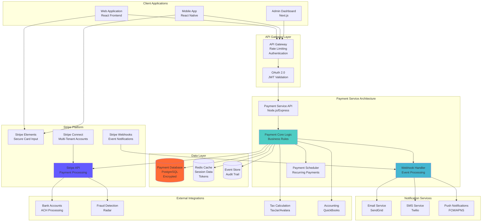
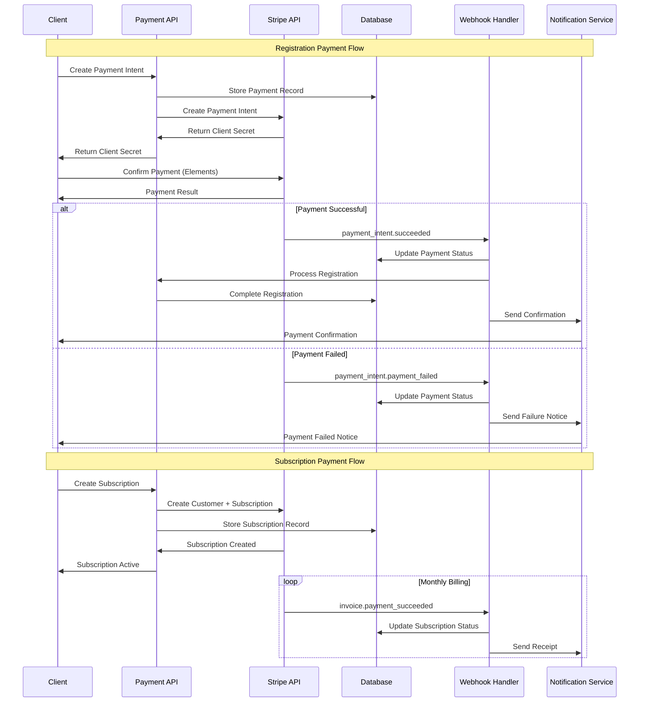

# Payment Integration Architecture
## Basketball League Management Platform - Phase 2

**Document ID:** PAYMENT-BLMP-001  
**Version:** 1.0  
**Date:** August 8, 2025  
**Author:** Integration Architect  
**Status:** Phase 2 Integration Design  
**Classification:** Technical Architecture  

---

## Executive Summary

This document defines the comprehensive payment integration architecture for the Basketball League Management Platform, leveraging Stripe as the primary payment processor. The architecture supports secure registration fee processing, recurring payments for multi-season leagues, refund management, and PCI DSS compliance while maintaining COPPA compliance for youth participants.

### Key Integration Features

- **Stripe Elements Integration**: Secure card collection with PCI compliance
- **Multi-Payment Support**: Credit cards, ACH, digital wallets (Apple Pay, Google Pay)
- **Subscription Management**: Recurring payments for seasonal leagues
- **Refund Processing**: Automated and manual refund workflows
- **Fraud Prevention**: Machine learning-based fraud detection
- **COPPA Compliance**: Parental consent and payment authorization
- **Multi-Tenant Support**: Isolated payment flows per league organization

---

## Table of Contents

1. [Payment Architecture Overview](#1-payment-architecture-overview)
2. [Stripe Integration Components](#2-stripe-integration-components)
3. [Payment Flow Implementations](#3-payment-flow-implementations)
4. [Security & Compliance](#4-security--compliance)
5. [Error Handling & Recovery](#5-error-handling--recovery)
6. [Webhook Integration](#6-webhook-integration)
7. [Multi-Tenant Payment Architecture](#7-multi-tenant-payment-architecture)
8. [Basketball-Specific Payment Features](#8-basketball-specific-payment-features)

---

## 1. Payment Architecture Overview

### 1.1 High-Level Architecture



### 1.2 Payment Processing Flow



### 1.3 Technology Stack

| Component | Technology | Purpose | Scalability |
|-----------|------------|---------|-------------|
| **Payment Processing** | Stripe API v2023-10-16 | Primary payment processor | 1000+ TPS |
| **Frontend Integration** | Stripe Elements | Secure card collection | PCI compliant |
| **Backend Service** | Node.js/Express | Payment orchestration | Horizontal scaling |
| **Database** | PostgreSQL 15 | Payment records, audit logs | Read replicas |
| **Cache** | Redis 7+ | Session management, tokens | Cluster mode |
| **Message Queue** | Redis/AWS SQS | Async payment processing | Auto-scaling |
| **Fraud Detection** | Stripe Radar | ML-based fraud prevention | Real-time scoring |
| **Tax Calculation** | TaxJar API | Sales tax automation | Multi-jurisdiction |

---

## 2. Stripe Integration Components

### 2.1 Stripe Elements Frontend Integration

```typescript
// React Component for Stripe Elements Integration
import React, { useState, useEffect } from 'react';
import {
  Elements,
  CardElement,
  useStripe,
  useElements
} from '@stripe/react-stripe-js';
import { loadStripe } from '@stripe/stripe-js';

const stripePromise = loadStripe(process.env.REACT_APP_STRIPE_PUBLIC_KEY!);

interface RegistrationPaymentProps {
  registrationId: string;
  amount: number;
  leagueName: string;
  playerName: string;
  onSuccess: (paymentIntent: any) => void;
  onError: (error: any) => void;
}

const RegistrationPaymentForm: React.FC<RegistrationPaymentProps> = ({
  registrationId,
  amount,
  leagueName,
  playerName,
  onSuccess,
  onError
}) => {
  const stripe = useStripe();
  const elements = useElements();
  const [isProcessing, setIsProcessing] = useState(false);
  const [clientSecret, setClientSecret] = useState<string>('');

  useEffect(() => {
    // Create PaymentIntent on component mount
    fetch('/api/payments/create-payment-intent', {
      method: 'POST',
      headers: {
        'Content-Type': 'application/json',
        'Authorization': `Bearer ${getAuthToken()}`
      },
      body: JSON.stringify({
        registrationId,
        amount,
        currency: 'usd',
        metadata: {
          leagueName,
          playerName,
          registrationId
        }
      })
    })
    .then(res => res.json())
    .then(data => setClientSecret(data.clientSecret))
    .catch(onError);
  }, [registrationId, amount]);

  const handleSubmit = async (event: React.FormEvent) => {
    event.preventDefault();

    if (!stripe || !elements || !clientSecret) {
      return;
    }

    setIsProcessing(true);

    const cardElement = elements.getElement(CardElement);
    if (!cardElement) {
      setIsProcessing(false);
      return;
    }

    const { error, paymentIntent } = await stripe.confirmCardPayment(clientSecret, {
      payment_method: {
        card: cardElement,
        billing_details: {
          name: playerName,
        },
      },
      setup_future_usage: 'off_session' // For future payments
    });

    setIsProcessing(false);

    if (error) {
      onError(error);
    } else if (paymentIntent?.status === 'succeeded') {
      onSuccess(paymentIntent);
    }
  };

  const cardElementOptions = {
    style: {
      base: {
        fontSize: '16px',
        color: '#424770',
        '::placeholder': {
          color: '#aab7c4',
        },
      },
    },
    hidePostalCode: false,
    iconStyle: 'solid' as const,
  };

  return (
    <form onSubmit={handleSubmit} className="payment-form">
      <div className="payment-summary">
        <h3>Registration Payment</h3>
        <p>League: {leagueName}</p>
        <p>Player: {playerName}</p>
        <p>Amount: ${(amount / 100).toFixed(2)}</p>
      </div>
      
      <div className="card-element-container">
        <CardElement options={cardElementOptions} />
      </div>
      
      <button
        type="submit"
        disabled={!stripe || isProcessing}
        className="payment-submit-btn"
      >
        {isProcessing ? 'Processing...' : `Pay $${(amount / 100).toFixed(2)}`}
      </button>
    </form>
  );
};

export const PaymentFormWrapper: React.FC<RegistrationPaymentProps> = (props) => {
  return (
    <Elements stripe={stripePromise}>
      <RegistrationPaymentForm {...props} />
    </Elements>
  );
};
```

### 2.2 Backend Payment Service Implementation

```typescript
// Payment Service Core Logic
import Stripe from 'stripe';
import { PaymentIntentCreateParams, SetupIntentCreateParams } from 'stripe';

interface PaymentConfig {
  stripeSecretKey: string;
  stripePublicKey: string;
  webhookSecret: string;
  applicationFeePercent: number;
}

class PaymentService {
  private stripe: Stripe;
  private config: PaymentConfig;

  constructor(config: PaymentConfig) {
    this.config = config;
    this.stripe = new Stripe(config.stripeSecretKey, {
      apiVersion: '2023-10-16',
      appInfo: {
        name: 'Gametriq League Management',
        version: '1.0.0',
      },
    });
  }

  async createPaymentIntent(params: CreatePaymentIntentParams): Promise<Stripe.PaymentIntent> {
    try {
      // Validate registration and calculate fees
      const registration = await this.validateRegistration(params.registrationId);
      const fees = await this.calculateFees(params.amount, registration.tenantId);
      
      const paymentIntentParams: PaymentIntentCreateParams = {
        amount: params.amount,
        currency: params.currency || 'usd',
        customer: params.customerId,
        payment_method_types: ['card'],
        capture_method: 'automatic',
        confirmation_method: 'manual',
        confirm: false,
        setup_future_usage: params.setupFutureUsage || undefined,
        application_fee_amount: fees.applicationFee,
        transfer_data: {
          destination: registration.tenant.stripeAccountId,
        },
        metadata: {
          registrationId: params.registrationId,
          leagueId: registration.leagueId,
          playerId: registration.playerId,
          tenantId: registration.tenantId,
          ...params.metadata
        },
        receipt_email: params.receiptEmail,
        description: `Registration fee for ${registration.league.name} - ${registration.player.name}`
      };

      const paymentIntent = await this.stripe.paymentIntents.create(paymentIntentParams);

      // Store payment record in database
      await this.storePaymentRecord({
        id: paymentIntent.id,
        registrationId: params.registrationId,
        amount: params.amount,
        currency: paymentIntent.currency,
        status: paymentIntent.status,
        customerId: params.customerId,
        tenantId: registration.tenantId,
        metadata: paymentIntent.metadata
      });

      return paymentIntent;
    } catch (error) {
      this.logger.error('Failed to create payment intent', {
        error: error.message,
        registrationId: params.registrationId
      });
      throw error;
    }
  }

  async createSetupIntent(params: CreateSetupIntentParams): Promise<Stripe.SetupIntent> {
    const setupIntentParams: SetupIntentCreateParams = {
      customer: params.customerId,
      payment_method_types: ['card'],
      usage: params.usage || 'off_session',
      metadata: {
        tenantId: params.tenantId,
        userId: params.userId,
        purpose: 'future_payments'
      }
    };

    return await this.stripe.setupIntents.create(setupIntentParams);
  }

  async processRecurringPayment(subscriptionId: string): Promise<Stripe.Invoice> {
    try {
      const subscription = await this.stripe.subscriptions.retrieve(subscriptionId);
      const invoice = await this.stripe.invoices.create({
        customer: subscription.customer as string,
        subscription: subscriptionId,
        auto_advance: true,
      });

      return await this.stripe.invoices.finalizeInvoice(invoice.id);
    } catch (error) {
      this.logger.error('Failed to process recurring payment', {
        subscriptionId,
        error: error.message
      });
      throw error;
    }
  }

  async processRefund(paymentIntentId: string, params: RefundParams): Promise<Stripe.Refund> {
    try {
      const refund = await this.stripe.refunds.create({
        payment_intent: paymentIntentId,
        amount: params.amount,
        reason: params.reason,
        metadata: {
          refundReason: params.reason,
          requestedBy: params.requestedBy,
          approvedBy: params.approvedBy,
          tenantId: params.tenantId
        }
      });

      // Update registration status
      await this.updateRegistrationStatus(params.registrationId, 'refunded');
      
      // Send refund notification
      await this.notificationService.sendRefundConfirmation({
        paymentIntentId,
        refundId: refund.id,
        amount: refund.amount,
        customerId: params.customerId
      });

      return refund;
    } catch (error) {
      this.logger.error('Failed to process refund', {
        paymentIntentId,
        error: error.message
      });
      throw error;
    }
  }

  private async calculateFees(amount: number, tenantId: string): Promise<FeesCalculation> {
    const tenant = await this.tenantService.getTenant(tenantId);
    const applicationFeePercent = tenant.customFeePercent || this.config.applicationFeePercent;
    
    const applicationFee = Math.round(amount * (applicationFeePercent / 100));
    const stripeFee = this.calculateStripeFee(amount);
    
    return {
      applicationFee,
      stripeFee,
      totalFees: applicationFee + stripeFee,
      netAmount: amount - applicationFee - stripeFee
    };
  }

  private calculateStripeFee(amount: number): number {
    // Stripe fee: 2.9% + $0.30 per transaction
    return Math.round(amount * 0.029 + 30);
  }
}

// Type Definitions
interface CreatePaymentIntentParams {
  registrationId: string;
  amount: number;
  currency?: string;
  customerId?: string;
  setupFutureUsage?: 'on_session' | 'off_session';
  receiptEmail?: string;
  metadata?: Record<string, string>;
}

interface CreateSetupIntentParams {
  customerId: string;
  usage?: 'on_session' | 'off_session';
  tenantId: string;
  userId: string;
}

interface RefundParams {
  registrationId: string;
  amount?: number;
  reason: 'duplicate' | 'fraudulent' | 'requested_by_customer';
  requestedBy: string;
  approvedBy: string;
  customerId: string;
  tenantId: string;
}

interface FeesCalculation {
  applicationFee: number;
  stripeFee: number;
  totalFees: number;
  netAmount: number;
}
```

### 2.3 Customer Management Integration

```typescript
class CustomerService {
  private stripe: Stripe;

  constructor(stripe: Stripe) {
    this.stripe = stripe;
  }

  async createOrUpdateCustomer(params: CustomerParams): Promise<Stripe.Customer> {
    try {
      // Check if customer already exists
      const existingCustomer = await this.findCustomerByEmail(params.email);
      
      if (existingCustomer) {
        return await this.updateCustomer(existingCustomer.id, params);
      }

      // Create new customer with COPPA considerations
      const customerData: Stripe.CustomerCreateParams = {
        email: params.email,
        name: params.name,
        phone: params.phone,
        metadata: {
          userId: params.userId,
          tenantId: params.tenantId,
          userRole: params.userRole,
          coppaCompliant: params.coppaCompliant.toString(),
          parentEmail: params.parentEmail || '',
          dateOfBirth: params.dateOfBirth || ''
        }
      };

      // Add billing address if provided
      if (params.address) {
        customerData.address = {
          line1: params.address.line1,
          line2: params.address.line2,
          city: params.address.city,
          state: params.address.state,
          postal_code: params.address.postalCode,
          country: params.address.country || 'US'
        };
      }

      const customer = await this.stripe.customers.create(customerData);

      // Store customer mapping in database
      await this.storeCustomerMapping({
        stripeCustomerId: customer.id,
        userId: params.userId,
        tenantId: params.tenantId,
        email: params.email
      });

      return customer;
    } catch (error) {
      this.logger.error('Failed to create/update customer', {
        error: error.message,
        userId: params.userId
      });
      throw error;
    }
  }

  async attachPaymentMethod(
    customerId: string,
    paymentMethodId: string
  ): Promise<Stripe.PaymentMethod> {
    const paymentMethod = await this.stripe.paymentMethods.attach(paymentMethodId, {
      customer: customerId,
    });

    // Set as default payment method if it's the first one
    const customer = await this.stripe.customers.retrieve(customerId);
    if (customer && !customer.invoice_settings?.default_payment_method) {
      await this.stripe.customers.update(customerId, {
        invoice_settings: {
          default_payment_method: paymentMethodId,
        },
      });
    }

    return paymentMethod;
  }

  async createSubscription(params: SubscriptionParams): Promise<Stripe.Subscription> {
    try {
      const subscriptionData: Stripe.SubscriptionCreateParams = {
        customer: params.customerId,
        items: [{
          price_data: {
            currency: 'usd',
            product_data: {
              name: params.leagueName,
              description: `${params.leagueName} - ${params.season} Season`,
              metadata: {
                leagueId: params.leagueId,
                tenantId: params.tenantId
              }
            },
            recurring: {
              interval: params.billingInterval,
              interval_count: params.intervalCount || 1
            },
            unit_amount: params.amount
          },
          quantity: 1
        }],
        payment_behavior: 'default_incomplete',
        payment_settings: {
          save_default_payment_method: 'on_subscription'
        },
        expand: ['latest_invoice.payment_intent'],
        metadata: {
          leagueId: params.leagueId,
          tenantId: params.tenantId,
          playerId: params.playerId,
          subscriptionType: 'league_registration'
        }
      };

      if (params.trialPeriodDays) {
        subscriptionData.trial_period_days = params.trialPeriodDays;
      }

      if (params.applicationFeePercent) {
        subscriptionData.application_fee_percent = params.applicationFeePercent;
      }

      const subscription = await this.stripe.subscriptions.create(subscriptionData);

      // Store subscription record
      await this.storeSubscriptionRecord({
        stripeSubscriptionId: subscription.id,
        customerId: params.customerId,
        leagueId: params.leagueId,
        playerId: params.playerId,
        tenantId: params.tenantId,
        status: subscription.status,
        currentPeriodStart: new Date(subscription.current_period_start * 1000),
        currentPeriodEnd: new Date(subscription.current_period_end * 1000)
      });

      return subscription;
    } catch (error) {
      this.logger.error('Failed to create subscription', {
        error: error.message,
        customerId: params.customerId,
        leagueId: params.leagueId
      });
      throw error;
    }
  }

  private async findCustomerByEmail(email: string): Promise<Stripe.Customer | null> {
    const customers = await this.stripe.customers.list({
      email: email,
      limit: 1
    });

    return customers.data.length > 0 ? customers.data[0] : null;
  }
}

interface CustomerParams {
  userId: string;
  tenantId: string;
  email: string;
  name: string;
  phone?: string;
  userRole: string;
  coppaCompliant: boolean;
  parentEmail?: string;
  dateOfBirth?: string;
  address?: {
    line1: string;
    line2?: string;
    city: string;
    state: string;
    postalCode: string;
    country?: string;
  };
}

interface SubscriptionParams {
  customerId: string;
  leagueId: string;
  playerId: string;
  tenantId: string;
  leagueName: string;
  season: string;
  amount: number;
  billingInterval: 'month' | 'year';
  intervalCount?: number;
  trialPeriodDays?: number;
  applicationFeePercent?: number;
}
```

---

## 3. Payment Flow Implementations

### 3.1 Single Registration Payment Flow

```typescript
class RegistrationPaymentFlow {
  async processRegistrationPayment(request: RegistrationPaymentRequest): Promise<PaymentResult> {
    const transaction = await this.database.beginTransaction();
    
    try {
      // Step 1: Validate registration eligibility
      const registration = await this.validateRegistrationEligibility(
        request.registrationId,
        request.userId
      );

      // Step 2: Check COPPA compliance for youth players
      if (registration.player.age < 13) {
        await this.validateParentalConsent(registration.player.id, request.parentalConsentId);
      }

      // Step 3: Calculate total amount including taxes and fees
      const pricing = await this.calculateRegistrationPricing({
        leagueId: registration.leagueId,
        playerId: registration.player.id,
        tenantId: registration.tenantId,
        location: request.billingAddress
      });

      // Step 4: Create or retrieve Stripe customer
      const customer = await this.customerService.createOrUpdateCustomer({
        userId: request.userId,
        tenantId: registration.tenantId,
        email: request.email,
        name: request.name,
        phone: request.phone,
        userRole: request.userRole,
        coppaCompliant: registration.player.age < 13,
        parentEmail: registration.player.parentEmail,
        dateOfBirth: registration.player.dateOfBirth,
        address: request.billingAddress
      });

      // Step 5: Create PaymentIntent
      const paymentIntent = await this.paymentService.createPaymentIntent({
        registrationId: request.registrationId,
        amount: pricing.totalAmount,
        currency: 'usd',
        customerId: customer.id,
        receiptEmail: request.email,
        metadata: {
          leagueName: registration.league.name,
          playerName: registration.player.name,
          season: registration.league.season,
          ageGroup: registration.league.ageGroup
        }
      });

      // Step 6: Update registration status
      await this.updateRegistrationStatus(request.registrationId, 'payment_pending');

      // Step 7: Log payment attempt
      await this.auditService.logPaymentAttempt({
        paymentIntentId: paymentIntent.id,
        registrationId: request.registrationId,
        amount: pricing.totalAmount,
        userId: request.userId,
        timestamp: new Date()
      });

      await transaction.commit();

      return {
        success: true,
        paymentIntentId: paymentIntent.id,
        clientSecret: paymentIntent.client_secret!,
        amount: pricing.totalAmount,
        fees: pricing.fees
      };

    } catch (error) {
      await transaction.rollback();
      
      this.logger.error('Registration payment flow failed', {
        error: error.message,
        registrationId: request.registrationId,
        userId: request.userId
      });

      throw new PaymentProcessingError(
        'Failed to process registration payment',
        error
      );
    }
  }

  private async calculateRegistrationPricing(params: PricingParams): Promise<RegistrationPricing> {
    const league = await this.leagueService.getLeague(params.leagueId);
    const tenant = await this.tenantService.getTenant(params.tenantId);
    
    let baseAmount = league.registrationFee;
    let discounts = 0;
    let fees = 0;
    let taxes = 0;

    // Apply early bird discount
    if (this.isEarlyBirdEligible(league)) {
      discounts += Math.round(baseAmount * league.earlyBirdDiscountPercent / 100);
    }

    // Apply multi-child discount
    const siblingCount = await this.getSiblingRegistrations(params.playerId, params.leagueId);
    if (siblingCount > 0 && league.siblingDiscountPercent) {
      discounts += Math.round(baseAmount * league.siblingDiscountPercent / 100);
    }

    // Calculate platform fees
    const platformFeePercent = tenant.customFeePercent || 2.5;
    fees += Math.round(baseAmount * platformFeePercent / 100);

    // Calculate taxes if applicable
    if (params.location && league.taxable) {
      taxes = await this.taxService.calculateTax({
        amount: baseAmount - discounts,
        location: params.location,
        productType: 'sports_registration'
      });
    }

    const subtotal = baseAmount - discounts;
    const totalAmount = subtotal + fees + taxes;

    return {
      baseAmount,
      discounts,
      subtotal,
      fees,
      taxes,
      totalAmount,
      breakdown: {
        registrationFee: baseAmount,
        earlyBirdDiscount: discounts,
        platformFee: fees,
        salesTax: taxes
      }
    };
  }
}

interface RegistrationPaymentRequest {
  registrationId: string;
  userId: string;
  email: string;
  name: string;
  phone?: string;
  userRole: string;
  parentalConsentId?: string;
  billingAddress: {
    line1: string;
    line2?: string;
    city: string;
    state: string;
    postalCode: string;
  };
}

interface PaymentResult {
  success: boolean;
  paymentIntentId: string;
  clientSecret: string;
  amount: number;
  fees: FeesBreakdown;
}

interface RegistrationPricing {
  baseAmount: number;
  discounts: number;
  subtotal: number;
  fees: number;
  taxes: number;
  totalAmount: number;
  breakdown: PricingBreakdown;
}
```

### 3.2 Subscription Payment Flow

```typescript
class SubscriptionPaymentFlow {
  async createLeagueSubscription(request: SubscriptionRequest): Promise<SubscriptionResult> {
    try {
      // Step 1: Validate subscription eligibility
      const league = await this.validateSubscriptionEligibility(request.leagueId);
      
      // Step 2: Create customer if needed
      const customer = await this.customerService.createOrUpdateCustomer(request.customerData);

      // Step 3: Create subscription with trial period
      const subscription = await this.customerService.createSubscription({
        customerId: customer.id,
        leagueId: request.leagueId,
        playerId: request.playerId,
        tenantId: request.tenantId,
        leagueName: league.name,
        season: league.season,
        amount: league.subscriptionFee,
        billingInterval: league.billingInterval,
        trialPeriodDays: league.trialDays,
        applicationFeePercent: 2.5
      });

      // Step 4: Store subscription mapping
      await this.storeSubscriptionMapping({
        stripeSubscriptionId: subscription.id,
        registrationId: request.registrationId,
        leagueId: request.leagueId,
        playerId: request.playerId,
        status: subscription.status
      });

      // Step 5: Send welcome email
      await this.notificationService.sendSubscriptionWelcome({
        email: customer.email!,
        leagueName: league.name,
        subscriptionId: subscription.id,
        nextBillingDate: new Date(subscription.current_period_end * 1000)
      });

      return {
        success: true,
        subscriptionId: subscription.id,
        status: subscription.status,
        clientSecret: (subscription.latest_invoice as any)?.payment_intent?.client_secret,
        nextBillingDate: new Date(subscription.current_period_end * 1000)
      };

    } catch (error) {
      this.logger.error('Subscription creation failed', {
        error: error.message,
        leagueId: request.leagueId
      });
      throw error;
    }
  }

  async handleSubscriptionRenewal(subscriptionId: string): Promise<void> {
    try {
      const subscription = await this.stripe.subscriptions.retrieve(subscriptionId, {
        expand: ['customer', 'latest_invoice']
      });

      const subscriptionRecord = await this.getSubscriptionRecord(subscriptionId);
      
      // Check if player is still eligible for the league
      const eligibilityCheck = await this.validatePlayerEligibility(
        subscriptionRecord.playerId,
        subscriptionRecord.leagueId
      );

      if (!eligibilityCheck.eligible) {
        // Cancel subscription if player is no longer eligible
        await this.cancelSubscription(subscriptionId, eligibilityCheck.reason);
        return;
      }

      // Update subscription status
      await this.updateSubscriptionStatus(subscriptionId, subscription.status);

      // Send renewal confirmation
      await this.notificationService.sendRenewalConfirmation({
        email: (subscription.customer as Stripe.Customer).email!,
        subscriptionId: subscriptionId,
        amount: subscription.items.data[0].price.unit_amount!,
        nextBillingDate: new Date(subscription.current_period_end * 1000)
      });

    } catch (error) {
      this.logger.error('Subscription renewal handling failed', {
        subscriptionId,
        error: error.message
      });
      throw error;
    }
  }

  async cancelSubscription(
    subscriptionId: string,
    reason: string,
    immediately = false
  ): Promise<Stripe.Subscription> {
    const cancelAtPeriodEnd = !immediately;

    const subscription = await this.stripe.subscriptions.update(subscriptionId, {
      cancel_at_period_end: cancelAtPeriodEnd,
      metadata: {
        cancellation_reason: reason,
        cancelled_at: new Date().toISOString()
      }
    });

    if (immediately) {
      await this.stripe.subscriptions.cancel(subscriptionId);
    }

    // Update local records
    await this.updateSubscriptionStatus(
      subscriptionId, 
      immediately ? 'cancelled' : 'cancel_at_period_end'
    );

    // Send cancellation confirmation
    await this.notificationService.sendCancellationConfirmation({
      subscriptionId,
      cancellationReason: reason,
      effectiveDate: immediately 
        ? new Date() 
        : new Date(subscription.current_period_end * 1000)
    });

    return subscription;
  }
}

interface SubscriptionRequest {
  registrationId: string;
  leagueId: string;
  playerId: string;
  tenantId: string;
  customerData: CustomerParams;
}

interface SubscriptionResult {
  success: boolean;
  subscriptionId: string;
  status: string;
  clientSecret?: string;
  nextBillingDate: Date;
}
```

---

## 4. Security & Compliance

### 4.1 PCI DSS Compliance Implementation

```typescript
class PCIComplianceService {
  // PCI DSS Level 1 compliance through Stripe
  private readonly SECURE_HEADERS = {
    'Strict-Transport-Security': 'max-age=31536000; includeSubDomains',
    'X-Content-Type-Options': 'nosniff',
    'X-Frame-Options': 'DENY',
    'X-XSS-Protection': '1; mode=block',
    'Content-Security-Policy': "default-src 'self'; script-src 'self' https://js.stripe.com; frame-src https://js.stripe.com; style-src 'self' 'unsafe-inline'"
  };

  validatePCICompliance(request: PaymentRequest): ComplianceResult {
    const violations: string[] = [];

    // Check for card data in logs (should never happen)
    if (this.containsCardData(request)) {
      violations.push('Card data detected in request - PCI violation');
    }

    // Validate HTTPS usage
    if (!request.secure) {
      violations.push('Non-HTTPS request detected - PCI violation');
    }

    // Validate request origin
    if (!this.isAllowedOrigin(request.origin)) {
      violations.push('Unauthorized origin - security violation');
    }

    // Check rate limiting
    if (!this.checkRateLimit(request.clientIp)) {
      violations.push('Rate limit exceeded - potential attack');
    }

    return {
      compliant: violations.length === 0,
      violations,
      riskLevel: this.calculateRiskLevel(violations.length)
    };
  }

  private containsCardData(data: any): boolean {
    const cardNumberPattern = /\b\d{4}[\s-]?\d{4}[\s-]?\d{4}[\s-]?\d{4}\b/;
    const cvvPattern = /\b\d{3,4}\b/;
    const jsonString = JSON.stringify(data);
    
    return cardNumberPattern.test(jsonString) || cvvPattern.test(jsonString);
  }

  async auditPaymentRequest(request: PaymentRequest, response: PaymentResponse): Promise<void> {
    const auditLog = {
      timestamp: new Date().toISOString(),
      requestId: request.id,
      clientIp: this.hashIP(request.clientIp), // Hash IP for privacy
      userAgent: request.userAgent,
      amount: request.amount,
      currency: request.currency,
      paymentMethodType: response.paymentMethod?.type,
      success: response.success,
      errorCode: response.errorCode,
      processingTime: response.processingTime,
      fraudScore: response.fraudScore
    };

    await this.auditService.logSecurePayment(auditLog);
  }

  private hashIP(ip: string): string {
    return crypto.createHash('sha256').update(ip + this.config.ipSalt).digest('hex');
  }
}
```

### 4.2 COPPA Compliance for Youth Payments

```typescript
class COPPAPaymentCompliance {
  async validateParentalConsent(
    playerId: string,
    parentalConsentId: string
  ): Promise<ConsentValidation> {
    const player = await this.playerService.getPlayer(playerId);
    
    if (player.age >= 13) {
      return { required: false, valid: true };
    }

    const consent = await this.consentService.getConsent(parentalConsentId);
    
    if (!consent) {
      throw new COPPAViolationError('Parental consent required for players under 13');
    }

    // Validate consent is current and not expired
    const isValid = this.validateConsentStatus(consent, player);
    
    if (!isValid) {
      throw new COPPAViolationError('Parental consent is expired or invalid');
    }

    return { required: true, valid: true, consent };
  }

  async createCOPPACompliantCustomer(
    playerData: PlayerData,
    parentData: ParentData
  ): Promise<Stripe.Customer> {
    if (playerData.age < 13) {
      // For COPPA compliance, parent is the customer, not the child
      return await this.stripe.customers.create({
        email: parentData.email,
        name: parentData.name,
        phone: parentData.phone,
        metadata: {
          parentOf: playerData.id,
          playerName: playerData.name,
          playerAge: playerData.age.toString(),
          coppaCompliant: 'true',
          consentDate: new Date().toISOString(),
          consentVersion: this.config.consentVersion
        }
      });
    } else {
      // Player 13+ can be their own customer
      return await this.stripe.customers.create({
        email: playerData.email,
        name: playerData.name,
        phone: playerData.phone,
        metadata: {
          playerId: playerData.id,
          age: playerData.age.toString(),
          coppaCompliant: 'false'
        }
      });
    }
  }

  async handleDataRetention(customerId: string): Promise<void> {
    const customer = await this.stripe.customers.retrieve(customerId);
    
    if (customer.metadata?.coppaCompliant === 'true') {
      const consentDate = new Date(customer.metadata.consentDate);
      const retentionPeriod = 3 * 365 * 24 * 60 * 60 * 1000; // 3 years
      
      if (Date.now() - consentDate.getTime() > retentionPeriod) {
        // Delete customer data per COPPA requirements
        await this.deleteCustomerData(customerId);
      }
    }
  }

  private validateConsentStatus(consent: ParentalConsent, player: PlayerData): boolean {
    // Check if consent is not expired
    if (consent.expirationDate && consent.expirationDate < new Date()) {
      return false;
    }

    // Check if consent covers payment processing
    if (!consent.permissions.includes('payment_processing')) {
      return false;
    }

    // Check if player has aged out and needs new consent
    if (player.age >= 13 && consent.playerAgeAtConsent < 13) {
      return false;
    }

    return true;
  }
}
```

### 4.3 Fraud Prevention Integration

```typescript
class FraudPreventionService {
  async assessPaymentRisk(request: PaymentRequest): Promise<RiskAssessment> {
    const riskFactors: RiskFactor[] = [];

    // Device fingerprinting
    const deviceRisk = await this.analyzeDevice(request.deviceFingerprint);
    riskFactors.push(deviceRisk);

    // IP geolocation analysis
    const locationRisk = await this.analyzeLocation(request.clientIp, request.billingAddress);
    riskFactors.push(locationRisk);

    // Velocity checks
    const velocityRisk = await this.analyzeVelocity(request.customerId, request.amount);
    riskFactors.push(velocityRisk);

    // Historical payment patterns
    const patternRisk = await this.analyzePatterns(request.customerId);
    riskFactors.push(patternRisk);

    const totalRiskScore = this.calculateRiskScore(riskFactors);
    const riskLevel = this.categorizeRisk(totalRiskScore);

    const assessment: RiskAssessment = {
      riskScore: totalRiskScore,
      riskLevel,
      riskFactors,
      recommendation: this.getRecommendation(riskLevel),
      requiresReview: riskLevel === 'HIGH' || riskLevel === 'CRITICAL',
      blockedReasons: riskFactors
        .filter(f => f.severity === 'CRITICAL')
        .map(f => f.reason)
    };

    // Log assessment for monitoring
    await this.logRiskAssessment(request.id, assessment);

    return assessment;
  }

  private async analyzeVelocity(customerId: string, amount: number): Promise<RiskFactor> {
    const timeWindow = 24 * 60 * 60 * 1000; // 24 hours
    const recentPayments = await this.getRecentPayments(customerId, timeWindow);

    let riskLevel = 'LOW';
    let reason = 'Normal payment velocity';

    // Check for unusual frequency
    if (recentPayments.length > 10) {
      riskLevel = 'HIGH';
      reason = 'Unusually high payment frequency';
    }

    // Check for unusual amounts
    const totalAmount = recentPayments.reduce((sum, p) => sum + p.amount, 0);
    if (totalAmount > 500000) { // $5000
      riskLevel = 'HIGH';
      reason = 'Unusually high payment volume';
    }

    // Check for rapid-fire payments
    const timeBetweenPayments = this.calculateAverageTimeBetweenPayments(recentPayments);
    if (timeBetweenPayments < 60000 && recentPayments.length > 3) { // Less than 1 minute
      riskLevel = 'CRITICAL';
      reason = 'Rapid successive payments detected';
    }

    return {
      type: 'velocity',
      severity: riskLevel as RiskSeverity,
      score: this.velocityToScore(riskLevel),
      reason
    };
  }

  async handleHighRiskPayment(
    paymentIntentId: string,
    riskAssessment: RiskAssessment
  ): Promise<FraudAction> {
    if (riskAssessment.riskLevel === 'CRITICAL') {
      // Block payment immediately
      await this.stripe.paymentIntents.cancel(paymentIntentId);
      
      await this.notificationService.alertFraudTeam({
        paymentIntentId,
        riskScore: riskAssessment.riskScore,
        reasons: riskAssessment.blockedReasons,
        urgency: 'immediate'
      });

      return { action: 'BLOCKED', reason: 'Critical fraud risk detected' };
    }

    if (riskAssessment.riskLevel === 'HIGH') {
      // Hold for manual review
      await this.stripe.paymentIntents.update(paymentIntentId, {
        metadata: {
          risk_level: 'HIGH',
          requires_review: 'true',
          risk_score: riskAssessment.riskScore.toString()
        }
      });

      await this.queueForManualReview(paymentIntentId, riskAssessment);

      return { action: 'HOLD_FOR_REVIEW', reason: 'High fraud risk - manual review required' };
    }

    return { action: 'APPROVE', reason: 'Acceptable risk level' };
  }

  private calculateRiskScore(riskFactors: RiskFactor[]): number {
    const weights = {
      device: 0.2,
      location: 0.3,
      velocity: 0.3,
      pattern: 0.2
    };

    return riskFactors.reduce((score, factor) => {
      const weight = weights[factor.type as keyof typeof weights] || 0.1;
      return score + (factor.score * weight);
    }, 0);
  }
}

interface RiskAssessment {
  riskScore: number;
  riskLevel: 'LOW' | 'MEDIUM' | 'HIGH' | 'CRITICAL';
  riskFactors: RiskFactor[];
  recommendation: string;
  requiresReview: boolean;
  blockedReasons: string[];
}

interface RiskFactor {
  type: string;
  severity: RiskSeverity;
  score: number;
  reason: string;
}

type RiskSeverity = 'LOW' | 'MEDIUM' | 'HIGH' | 'CRITICAL';
```

---

## 5. Error Handling & Recovery

### 5.1 Payment Error Classification and Handling

```typescript
enum PaymentErrorType {
  // Stripe API Errors
  CARD_DECLINED = 'card_declined',
  INSUFFICIENT_FUNDS = 'insufficient_funds',
  INVALID_CARD = 'invalid_card',
  EXPIRED_CARD = 'expired_card',
  PROCESSING_ERROR = 'processing_error',
  
  // Business Logic Errors
  REGISTRATION_EXPIRED = 'registration_expired',
  LEAGUE_FULL = 'league_full',
  DUPLICATE_PAYMENT = 'duplicate_payment',
  COPPA_VIOLATION = 'coppa_violation',
  
  // System Errors
  NETWORK_ERROR = 'network_error',
  SERVICE_UNAVAILABLE = 'service_unavailable',
  DATABASE_ERROR = 'database_error',
  TIMEOUT = 'timeout'
}

class PaymentErrorHandler {
  async handlePaymentError(
    error: any,
    context: PaymentContext
  ): Promise<ErrorHandlingResult> {
    const errorType = this.classifyError(error);
    const errorDetails = this.extractErrorDetails(error);

    // Log error with context
    await this.logPaymentError({
      type: errorType,
      message: error.message,
      context,
      details: errorDetails,
      timestamp: new Date()
    });

    switch (errorType) {
      case PaymentErrorType.CARD_DECLINED:
        return await this.handleDeclinedCard(error, context);
      
      case PaymentErrorType.INSUFFICIENT_FUNDS:
        return await this.handleInsufficientFunds(error, context);
      
      case PaymentErrorType.PROCESSING_ERROR:
        return await this.handleProcessingError(error, context);
      
      case PaymentErrorType.COPPA_VIOLATION:
        return await this.handleCOPPAViolation(error, context);
      
      case PaymentErrorType.NETWORK_ERROR:
        return await this.handleNetworkError(error, context);
      
      default:
        return await this.handleGenericError(error, context);
    }
  }

  private async handleDeclinedCard(
    error: any,
    context: PaymentContext
  ): Promise<ErrorHandlingResult> {
    const declineCode = error.decline_code;
    
    // Specific handling based on decline reason
    switch (declineCode) {
      case 'generic_decline':
        await this.suggestAlternativePaymentMethods(context.customerId);
        break;
      
      case 'insufficient_funds':
        await this.suggestRetryLater(context.customerId);
        break;
      
      case 'lost_card':
      case 'stolen_card':
        await this.flagSecurityConcern(context.customerId);
        break;
    }

    // Update registration status
    await this.updateRegistrationStatus(
      context.registrationId,
      'payment_failed',
      { reason: 'card_declined', declineCode }
    );

    // Send user-friendly notification
    await this.notificationService.sendPaymentFailure({
      customerId: context.customerId,
      registrationId: context.registrationId,
      reason: 'card_declined',
      declineCode,
      suggestedActions: this.getSuggestedActions(declineCode)
    });

    return {
      handled: true,
      retryable: this.isRetryableDecline(declineCode),
      userMessage: this.getUserFriendlyMessage(declineCode),
      suggestedActions: this.getSuggestedActions(declineCode)
    };
  }

  private async handleProcessingError(
    error: any,
    context: PaymentContext
  ): Promise<ErrorHandlingResult> {
    // For processing errors, implement retry with exponential backoff
    const retryAttempt = context.retryAttempt || 0;
    const maxRetries = 3;

    if (retryAttempt < maxRetries) {
      const delay = Math.pow(2, retryAttempt) * 1000; // Exponential backoff
      
      // Schedule retry
      await this.schedulePaymentRetry({
        paymentIntentId: context.paymentIntentId,
        registrationId: context.registrationId,
        delay,
        attempt: retryAttempt + 1
      });

      return {
        handled: true,
        retryable: true,
        userMessage: 'Payment is being processed. Please wait.',
        retryScheduled: true,
        retryDelay: delay
      };
    }

    // Max retries exceeded
    await this.escalateToSupport({
      paymentIntentId: context.paymentIntentId,
      registrationId: context.registrationId,
      error: error.message,
      retryAttempts: maxRetries
    });

    return {
      handled: true,
      retryable: false,
      userMessage: 'Payment processing failed. Our support team has been notified.',
      supportTicketCreated: true
    };
  }

  private async handleCOPPAViolation(
    error: any,
    context: PaymentContext
  ): Promise<ErrorHandlingResult> {
    // Log COPPA compliance violation
    await this.complianceService.logViolation({
      type: 'COPPA',
      playerId: context.playerId,
      registrationId: context.registrationId,
      details: error.message,
      timestamp: new Date()
    });

    // Send parental consent request
    const player = await this.playerService.getPlayer(context.playerId!);
    if (player.parentEmail) {
      await this.notificationService.sendParentalConsentRequest({
        parentEmail: player.parentEmail,
        playerName: player.name,
        leagueName: context.leagueName,
        registrationId: context.registrationId
      });
    }

    return {
      handled: true,
      retryable: false,
      userMessage: 'Parental consent is required. An email has been sent to the parent/guardian.',
      requiresParentalConsent: true
    };
  }

  private classifyError(error: any): PaymentErrorType {
    if (error.type === 'StripeCardError') {
      switch (error.code) {
        case 'card_declined':
          return PaymentErrorType.CARD_DECLINED;
        case 'insufficient_funds':
          return PaymentErrorType.INSUFFICIENT_FUNDS;
        case 'expired_card':
          return PaymentErrorType.EXPIRED_CARD;
        case 'invalid_cvc':
        case 'invalid_number':
        case 'invalid_expiry_month':
        case 'invalid_expiry_year':
          return PaymentErrorType.INVALID_CARD;
        default:
          return PaymentErrorType.PROCESSING_ERROR;
      }
    }

    if (error instanceof COPPAViolationError) {
      return PaymentErrorType.COPPA_VIOLATION;
    }

    if (error.code === 'ECONNRESET' || error.code === 'ETIMEDOUT') {
      return PaymentErrorType.NETWORK_ERROR;
    }

    return PaymentErrorType.PROCESSING_ERROR;
  }

  private getUserFriendlyMessage(declineCode: string): string {
    const messages: Record<string, string> = {
      'generic_decline': 'Your card was declined. Please try a different payment method.',
      'insufficient_funds': 'Insufficient funds. Please check your account balance.',
      'lost_card': 'This card has been reported as lost. Please use a different card.',
      'stolen_card': 'This card has been reported as stolen. Please use a different card.',
      'expired_card': 'Your card has expired. Please use a different payment method.',
      'processing_error': 'There was an error processing your payment. Please try again.'
    };

    return messages[declineCode] || 'Payment failed. Please try again or contact support.';
  }
}

interface PaymentContext {
  paymentIntentId: string;
  registrationId: string;
  customerId: string;
  leagueName: string;
  playerId?: string;
  amount: number;
  retryAttempt?: number;
}

interface ErrorHandlingResult {
  handled: boolean;
  retryable: boolean;
  userMessage: string;
  suggestedActions?: string[];
  retryScheduled?: boolean;
  retryDelay?: number;
  supportTicketCreated?: boolean;
  requiresParentalConsent?: boolean;
}
```

### 5.2 Payment Recovery Mechanisms

```typescript
class PaymentRecoveryService {
  async attemptPaymentRecovery(
    failedPaymentId: string,
    recoveryStrategy: RecoveryStrategy
  ): Promise<RecoveryResult> {
    const paymentRecord = await this.getPaymentRecord(failedPaymentId);
    
    switch (recoveryStrategy) {
      case RecoveryStrategy.RETRY_SAME_METHOD:
        return await this.retryWithSameMethod(paymentRecord);
      
      case RecoveryStrategy.ALTERNATIVE_METHOD:
        return await this.suggestAlternativeMethod(paymentRecord);
      
      case RecoveryStrategy.INSTALLMENT_PLAN:
        return await this.offerInstallmentPlan(paymentRecord);
      
      case RecoveryStrategy.DUNNING_MANAGEMENT:
        return await this.initiateDunningProcess(paymentRecord);
      
      default:
        throw new Error(`Unknown recovery strategy: ${recoveryStrategy}`);
    }
  }

  private async retryWithSameMethod(payment: PaymentRecord): Promise<RecoveryResult> {
    try {
      // Wait for a short period before retry
      await this.delay(5000);
      
      // Retrieve the original payment intent
      const paymentIntent = await this.stripe.paymentIntents.retrieve(payment.stripePaymentIntentId);
      
      if (paymentIntent.status === 'requires_payment_method') {
        // Retry with the last known payment method
        const confirmedIntent = await this.stripe.paymentIntents.confirm(
          paymentIntent.id,
          {
            payment_method: paymentIntent.last_payment_error?.payment_method?.id,
            return_url: this.config.returnUrl
          }
        );

        if (confirmedIntent.status === 'succeeded') {
          await this.updatePaymentStatus(payment.id, 'succeeded');
          
          return {
            success: true,
            method: RecoveryStrategy.RETRY_SAME_METHOD,
            message: 'Payment recovered successfully on retry'
          };
        }
      }

      return {
        success: false,
        method: RecoveryStrategy.RETRY_SAME_METHOD,
        message: 'Retry with same method failed'
      };
    } catch (error) {
      this.logger.error('Payment recovery retry failed', {
        paymentId: payment.id,
        error: error.message
      });
      
      return {
        success: false,
        method: RecoveryStrategy.RETRY_SAME_METHOD,
        error: error.message
      };
    }
  }

  private async offerInstallmentPlan(payment: PaymentRecord): Promise<RecoveryResult> {
    if (payment.amount < 10000) { // Less than $100
      return {
        success: false,
        method: RecoveryStrategy.INSTALLMENT_PLAN,
        message: 'Amount too small for installment plan'
      };
    }

    try {
      // Create installment plan (3 payments)
      const installmentAmount = Math.ceil(payment.amount / 3);
      const subscription = await this.stripe.subscriptions.create({
        customer: payment.customerId,
        items: [{
          price_data: {
            currency: 'usd',
            product_data: {
              name: `Registration Payment Plan - ${payment.leagueName}`,
              description: 'Installment payment plan for league registration'
            },
            recurring: {
              interval: 'month',
              interval_count: 1
            },
            unit_amount: installmentAmount
          }
        }],
        metadata: {
          original_payment_id: payment.id,
          installment_plan: 'true',
          total_installments: '3'
        },
        payment_behavior: 'default_incomplete',
        expand: ['latest_invoice.payment_intent']
      });

      // Cancel original payment intent
      await this.stripe.paymentIntents.cancel(payment.stripePaymentIntentId);

      // Update payment record
      await this.updatePaymentRecord(payment.id, {
        status: 'installment_plan',
        stripeSubscriptionId: subscription.id
      });

      // Send installment plan notification
      await this.notificationService.sendInstallmentPlanOffer({
        customerId: payment.customerId,
        subscriptionId: subscription.id,
        installmentAmount,
        totalInstallments: 3
      });

      return {
        success: true,
        method: RecoveryStrategy.INSTALLMENT_PLAN,
        subscriptionId: subscription.id,
        installmentAmount,
        message: 'Installment plan created successfully'
      };
    } catch (error) {
      this.logger.error('Installment plan creation failed', {
        paymentId: payment.id,
        error: error.message
      });
      
      return {
        success: false,
        method: RecoveryStrategy.INSTALLMENT_PLAN,
        error: error.message
      };
    }
  }

  private async initiateDunningProcess(payment: PaymentRecord): Promise<RecoveryResult> {
    const dunningSequence = await this.createDunningSequence(payment);
    
    try {
      // Schedule dunning emails
      for (const step of dunningSequence.steps) {
        await this.scheduleDunningEmail({
          paymentId: payment.id,
          customerId: payment.customerId,
          templateId: step.templateId,
          delay: step.delayDays * 24 * 60 * 60 * 1000, // Convert days to ms
          severity: step.severity
        });
      }

      // Update payment status
      await this.updatePaymentStatus(payment.id, 'dunning_process');

      return {
        success: true,
        method: RecoveryStrategy.DUNNING_MANAGEMENT,
        dunningSequenceId: dunningSequence.id,
        message: 'Dunning process initiated'
      };
    } catch (error) {
      this.logger.error('Dunning process initiation failed', {
        paymentId: payment.id,
        error: error.message
      });
      
      return {
        success: false,
        method: RecoveryStrategy.DUNNING_MANAGEMENT,
        error: error.message
      };
    }
  }

  private createDunningSequence(payment: PaymentRecord): DunningSequence {
    return {
      id: crypto.randomUUID(),
      paymentId: payment.id,
      steps: [
        {
          delayDays: 1,
          templateId: 'payment_retry_gentle',
          severity: 'low',
          subject: 'Payment Issue - Easy to Resolve'
        },
        {
          delayDays: 7,
          templateId: 'payment_retry_urgent',
          severity: 'medium',
          subject: 'Urgent: Complete Your Registration Payment'
        },
        {
          delayDays: 14,
          templateId: 'payment_final_notice',
          severity: 'high',
          subject: 'Final Notice: Registration at Risk'
        },
        {
          delayDays: 21,
          templateId: 'registration_cancellation',
          severity: 'critical',
          subject: 'Registration Cancelled - Payment Required'
        }
      ]
    };
  }
}

enum RecoveryStrategy {
  RETRY_SAME_METHOD = 'retry_same_method',
  ALTERNATIVE_METHOD = 'alternative_method',
  INSTALLMENT_PLAN = 'installment_plan',
  DUNNING_MANAGEMENT = 'dunning_management'
}

interface RecoveryResult {
  success: boolean;
  method: RecoveryStrategy;
  message: string;
  error?: string;
  subscriptionId?: string;
  installmentAmount?: number;
  dunningSequenceId?: string;
}

interface DunningSequence {
  id: string;
  paymentId: string;
  steps: DunningStep[];
}

interface DunningStep {
  delayDays: number;
  templateId: string;
  severity: 'low' | 'medium' | 'high' | 'critical';
  subject: string;
}
```

---

## 6. Webhook Integration

### 6.1 Stripe Webhook Handler Implementation

```typescript
class StripeWebhookHandler {
  private stripe: Stripe;
  private webhookSecret: string;

  constructor(stripe: Stripe, webhookSecret: string) {
    this.stripe = stripe;
    this.webhookSecret = webhookSecret;
  }

  async handleWebhook(
    payload: string,
    signature: string
  ): Promise<WebhookHandlingResult> {
    let event: Stripe.Event;

    try {
      // Verify webhook signature
      event = this.stripe.webhooks.constructEvent(
        payload,
        signature,
        this.webhookSecret
      );
    } catch (error) {
      this.logger.error('Webhook signature verification failed', {
        error: error.message
      });
      throw new WebhookVerificationError('Invalid signature');
    }

    // Log webhook receipt
    await this.logWebhookEvent({
      eventId: event.id,
      type: event.type,
      created: event.created,
      livemode: event.livemode
    });

    try {
      const result = await this.processWebhookEvent(event);
      
      // Mark webhook as processed
      await this.markWebhookProcessed(event.id, true);
      
      return result;
    } catch (error) {
      // Mark webhook as failed
      await this.markWebhookProcessed(event.id, false, error.message);
      throw error;
    }
  }

  private async processWebhookEvent(event: Stripe.Event): Promise<WebhookHandlingResult> {
    switch (event.type) {
      case 'payment_intent.succeeded':
        return await this.handlePaymentSucceeded(event);
      
      case 'payment_intent.payment_failed':
        return await this.handlePaymentFailed(event);
      
      case 'payment_intent.canceled':
        return await this.handlePaymentCanceled(event);
      
      case 'invoice.payment_succeeded':
        return await this.handleSubscriptionPaymentSucceeded(event);
      
      case 'invoice.payment_failed':
        return await this.handleSubscriptionPaymentFailed(event);
      
      case 'customer.subscription.deleted':
        return await this.handleSubscriptionDeleted(event);
      
      case 'customer.subscription.updated':
        return await this.handleSubscriptionUpdated(event);
      
      case 'charge.dispute.created':
        return await this.handleDisputeCreated(event);
      
      default:
        this.logger.info('Unhandled webhook event type', { type: event.type });
        return { processed: true, action: 'ignored' };
    }
  }

  private async handlePaymentSucceeded(event: Stripe.Event): Promise<WebhookHandlingResult> {
    const paymentIntent = event.data.object as Stripe.PaymentIntent;
    const registrationId = paymentIntent.metadata.registrationId;

    if (!registrationId) {
      this.logger.warn('Payment succeeded but no registration ID found', {
        paymentIntentId: paymentIntent.id
      });
      return { processed: true, action: 'no_action_needed' };
    }

    try {
      // Update payment record
      await this.updatePaymentRecord(paymentIntent.id, {
        status: 'succeeded',
        paidAt: new Date(paymentIntent.created * 1000),
        amountReceived: paymentIntent.amount_received,
        charges: paymentIntent.charges.data.map(charge => ({
          id: charge.id,
          amount: charge.amount,
          fee: charge.application_fee_amount,
          receiptUrl: charge.receipt_url
        }))
      });

      // Complete registration
      await this.registrationService.completeRegistration({
        registrationId,
        paymentIntentId: paymentIntent.id,
        amountPaid: paymentIntent.amount_received!,
        paidAt: new Date(paymentIntent.created * 1000)
      });

      // Send confirmation notifications
      await this.sendPaymentConfirmations({
        paymentIntentId: paymentIntent.id,
        registrationId,
        customerId: paymentIntent.customer as string,
        amount: paymentIntent.amount_received!,
        receiptUrl: paymentIntent.charges.data[0]?.receipt_url
      });

      // Trigger post-payment processes
      await this.triggerPostPaymentProcesses({
        registrationId,
        leagueId: paymentIntent.metadata.leagueId,
        playerId: paymentIntent.metadata.playerId
      });

      return {
        processed: true,
        action: 'registration_completed',
        registrationId,
        paymentIntentId: paymentIntent.id
      };
    } catch (error) {
      this.logger.error('Failed to process payment success', {
        paymentIntentId: paymentIntent.id,
        registrationId,
        error: error.message
      });
      throw error;
    }
  }

  private async handlePaymentFailed(event: Stripe.Event): Promise<WebhookHandlingResult> {
    const paymentIntent = event.data.object as Stripe.PaymentIntent;
    const registrationId = paymentIntent.metadata.registrationId;

    if (!registrationId) {
      return { processed: true, action: 'no_action_needed' };
    }

    try {
      // Update payment record
      await this.updatePaymentRecord(paymentIntent.id, {
        status: 'failed',
        failureReason: paymentIntent.last_payment_error?.message,
        failureCode: paymentIntent.last_payment_error?.code
      });

      // Update registration status
      await this.registrationService.updateRegistrationStatus(
        registrationId,
        'payment_failed',
        {
          paymentIntentId: paymentIntent.id,
          failureReason: paymentIntent.last_payment_error?.message
        }
      );

      // Initiate payment recovery process
      const recoveryResult = await this.paymentRecoveryService.attemptPaymentRecovery(
        paymentIntent.id,
        RecoveryStrategy.RETRY_SAME_METHOD
      );

      // Send failure notification with recovery options
      await this.sendPaymentFailureNotification({
        paymentIntentId: paymentIntent.id,
        registrationId,
        customerId: paymentIntent.customer as string,
        failureReason: paymentIntent.last_payment_error?.message,
        recoveryOptions: this.getRecoveryOptions(paymentIntent.last_payment_error?.code)
      });

      return {
        processed: true,
        action: 'payment_recovery_initiated',
        registrationId,
        paymentIntentId: paymentIntent.id,
        recoveryResult
      };
    } catch (error) {
      this.logger.error('Failed to process payment failure', {
        paymentIntentId: paymentIntent.id,
        registrationId,
        error: error.message
      });
      throw error;
    }
  }

  private async handleSubscriptionPaymentSucceeded(event: Stripe.Event): Promise<WebhookHandlingResult> {
    const invoice = event.data.object as Stripe.Invoice;
    const subscriptionId = invoice.subscription as string;

    if (!subscriptionId) {
      return { processed: true, action: 'no_action_needed' };
    }

    try {
      const subscription = await this.stripe.subscriptions.retrieve(subscriptionId);
      const subscriptionRecord = await this.getSubscriptionRecord(subscriptionId);

      // Update subscription status
      await this.updateSubscriptionRecord(subscriptionId, {
        status: subscription.status,
        currentPeriodStart: new Date(subscription.current_period_start * 1000),
        currentPeriodEnd: new Date(subscription.current_period_end * 1000),
        lastPaymentDate: new Date(invoice.created * 1000)
      });

      // Ensure player registration remains active
      await this.registrationService.renewRegistration({
        subscriptionId,
        leagueId: subscriptionRecord.leagueId,
        playerId: subscriptionRecord.playerId,
        paidUntil: new Date(subscription.current_period_end * 1000)
      });

      // Send renewal confirmation
      await this.sendSubscriptionRenewalConfirmation({
        subscriptionId,
        customerId: subscription.customer as string,
        amount: invoice.amount_paid!,
        nextBillingDate: new Date(subscription.current_period_end * 1000),
        receiptUrl: invoice.hosted_invoice_url
      });

      return {
        processed: true,
        action: 'subscription_renewed',
        subscriptionId,
        invoiceId: invoice.id
      };
    } catch (error) {
      this.logger.error('Failed to process subscription payment success', {
        subscriptionId,
        invoiceId: invoice.id,
        error: error.message
      });
      throw error;
    }
  }

  private async handleDisputeCreated(event: Stripe.Event): Promise<WebhookHandlingResult> {
    const dispute = event.data.object as Stripe.Dispute;
    const chargeId = dispute.charge as string;

    try {
      // Find associated payment and registration
      const paymentRecord = await this.findPaymentByChargeId(chargeId);
      
      if (paymentRecord) {
        // Create dispute record
        await this.createDisputeRecord({
          stripeDisputeId: dispute.id,
          paymentId: paymentRecord.id,
          registrationId: paymentRecord.registrationId,
          amount: dispute.amount,
          reason: dispute.reason,
          status: dispute.status,
          evidence_deadline: new Date(dispute.evidence_details?.due_by! * 1000)
        });

        // Alert support team
        await this.alertSupportTeam({
          type: 'chargeback',
          disputeId: dispute.id,
          amount: dispute.amount,
          registrationId: paymentRecord.registrationId,
          urgency: 'high'
        });

        // Automatically submit evidence if available
        await this.submitDisputeEvidence(dispute.id, paymentRecord);
      }

      return {
        processed: true,
        action: 'dispute_handled',
        disputeId: dispute.id
      };
    } catch (error) {
      this.logger.error('Failed to process dispute creation', {
        disputeId: dispute.id,
        chargeId,
        error: error.message
      });
      throw error;
    }
  }
}

interface WebhookHandlingResult {
  processed: boolean;
  action: string;
  registrationId?: string;
  paymentIntentId?: string;
  subscriptionId?: string;
  disputeId?: string;
  recoveryResult?: RecoveryResult;
}
```

---

## 7. Multi-Tenant Payment Architecture

### 7.1 Stripe Connect Implementation

```typescript
class StripeConnectService {
  private stripe: Stripe;

  constructor(stripe: Stripe) {
    this.stripe = stripe;
  }

  async createConnectedAccount(tenant: TenantData): Promise<Stripe.Account> {
    try {
      const accountParams: Stripe.AccountCreateParams = {
        type: 'express',
        country: 'US',
        email: tenant.email,
        capabilities: {
          card_payments: { requested: true },
          transfers: { requested: true }
        },
        business_type: 'non_profit', // Most youth leagues are non-profits
        company: {
          name: tenant.organizationName,
          phone: tenant.phone,
          address: {
            line1: tenant.address.line1,
            city: tenant.address.city,
            state: tenant.address.state,
            postal_code: tenant.address.postalCode,
            country: 'US'
          }
        },
        business_profile: {
          name: tenant.organizationName,
          mcc: '7941', // Athletic fields, basketball courts, sports facilities
          product_description: 'Youth basketball league registration and fees',
          support_email: tenant.email,
          support_phone: tenant.phone,
          url: tenant.website
        },
        metadata: {
          tenantId: tenant.id,
          organizationType: tenant.type,
          createdBy: tenant.createdBy
        }
      };

      const account = await this.stripe.accounts.create(accountParams);

      // Store account mapping
      await this.storeAccountMapping({
        tenantId: tenant.id,
        stripeAccountId: account.id,
        accountType: 'express',
        status: 'pending',
        createdAt: new Date()
      });

      return account;
    } catch (error) {
      this.logger.error('Failed to create connected account', {
        tenantId: tenant.id,
        error: error.message
      });
      throw error;
    }
  }

  async createAccountLink(accountId: string, tenantId: string): Promise<Stripe.AccountLink> {
    const refreshUrl = `${this.config.baseUrl}/tenant/${tenantId}/stripe/reauth`;
    const returnUrl = `${this.config.baseUrl}/tenant/${tenantId}/stripe/complete`;

    return await this.stripe.accountLinks.create({
      account: accountId,
      refresh_url: refreshUrl,
      return_url: returnUrl,
      type: 'account_onboarding'
    });
  }

  async processConnectedPayment(params: ConnectedPaymentParams): Promise<Stripe.PaymentIntent> {
    const tenant = await this.getTenantAccount(params.tenantId);
    
    if (!tenant.stripeAccountId) {
      throw new Error('Tenant Stripe account not configured');
    }

    // Calculate application fee (platform revenue)
    const applicationFee = this.calculateApplicationFee(params.amount, tenant);

    const paymentIntent = await this.stripe.paymentIntents.create({
      amount: params.amount,
      currency: 'usd',
      application_fee_amount: applicationFee,
      transfer_data: {
        destination: tenant.stripeAccountId,
      },
      metadata: {
        tenantId: params.tenantId,
        registrationId: params.registrationId,
        leagueId: params.leagueId,
        playerId: params.playerId
      }
    });

    return paymentIntent;
  }

  async handleConnectedAccountWebhook(
    event: Stripe.Event,
    connectedAccountId: string
  ): Promise<void> {
    const tenant = await this.getTenantByStripeAccount(connectedAccountId);
    
    if (!tenant) {
      this.logger.warn('Webhook for unknown connected account', {
        accountId: connectedAccountId,
        eventType: event.type
      });
      return;
    }

    switch (event.type) {
      case 'account.updated':
        await this.handleAccountUpdated(event, tenant);
        break;
      
      case 'account.application.deauthorized':
        await this.handleAccountDeauthorized(event, tenant);
        break;
      
      case 'capability.updated':
        await this.handleCapabilityUpdated(event, tenant);
        break;
    }
  }

  private async handleAccountUpdated(event: Stripe.Event, tenant: TenantRecord): Promise<void> {
    const account = event.data.object as Stripe.Account;
    
    // Update account status
    await this.updateTenantAccount(tenant.id, {
      chargesEnabled: account.charges_enabled,
      payoutsEnabled: account.payouts_enabled,
      detailsSubmitted: account.details_submitted,
      requirements: account.requirements
    });

    // Notify tenant of status changes
    if (account.charges_enabled && !tenant.chargesEnabled) {
      await this.notificationService.sendAccountActivated({
        tenantId: tenant.id,
        email: tenant.email,
        organizationName: tenant.organizationName
      });
    }
  }

  private calculateApplicationFee(amount: number, tenant: TenantRecord): number {
    // Standard platform fee: 2.5% + $0.30
    const feePercent = tenant.customFeePercent || 2.5;
    const fixedFee = 30; // $0.30 in cents
    
    return Math.round(amount * (feePercent / 100)) + fixedFee;
  }
}

interface ConnectedPaymentParams {
  tenantId: string;
  registrationId: string;
  leagueId: string;
  playerId: string;
  amount: number;
}

interface TenantRecord {
  id: string;
  stripeAccountId: string;
  email: string;
  organizationName: string;
  chargesEnabled: boolean;
  payoutsEnabled: boolean;
  customFeePercent?: number;
}
```

### 7.2 Multi-Tenant Payment Isolation

```typescript
class TenantPaymentIsolation {
  async processIsolatedPayment(params: IsolatedPaymentParams): Promise<PaymentResult> {
    // Ensure tenant isolation at database and API level
    const tenantContext = await this.establishTenantContext(params.tenantId);
    
    try {
      // Validate tenant has active payment processing
      await this.validateTenantPaymentCapability(tenantContext);
      
      // Use tenant-specific database connection
      const tenantDb = await this.getTenantDatabase(tenantContext);
      
      // Process payment with tenant isolation
      const paymentResult = await tenantDb.transaction(async (trx) => {
        // All database operations use tenant-scoped queries
        const registration = await this.getRegistration(params.registrationId, tenantContext, trx);
        const customer = await this.getOrCreateCustomer(params.customerData, tenantContext, trx);
        
        // Create payment with tenant's Stripe account
        const paymentIntent = await this.stripe.paymentIntents.create({
          amount: params.amount,
          currency: 'usd',
          customer: customer.stripeCustomerId,
          metadata: {
            tenantId: tenantContext.id,
            registrationId: params.registrationId
          }
        }, {
          stripeAccount: tenantContext.stripeAccountId // Tenant isolation
        });

        // Store payment record in tenant-scoped table
        await this.storePaymentRecord({
          ...paymentIntent,
          tenantId: tenantContext.id,
          registrationId: params.registrationId
        }, trx);

        return {
          paymentIntentId: paymentIntent.id,
          clientSecret: paymentIntent.client_secret!,
          status: paymentIntent.status
        };
      });

      return paymentResult;
    } finally {
      await this.cleanupTenantContext(tenantContext);
    }
  }

  private async establishTenantContext(tenantId: string): Promise<TenantContext> {
    const tenant = await this.tenantService.getTenant(tenantId);
    
    if (!tenant) {
      throw new TenantNotFoundError(`Tenant ${tenantId} not found`);
    }

    if (!tenant.isActive) {
      throw new TenantInactiveError(`Tenant ${tenantId} is inactive`);
    }

    // Ensure tenant has Stripe account
    if (!tenant.stripeAccountId) {
      throw new StripeAccountNotConfiguredError(`Tenant ${tenantId} Stripe account not configured`);
    }

    return {
      id: tenant.id,
      name: tenant.name,
      stripeAccountId: tenant.stripeAccountId,
      databaseUrl: tenant.databaseUrl,
      encryptionKey: tenant.encryptionKey
    };
  }

  private async validateTenantPaymentCapability(context: TenantContext): Promise<void> {
    // Check Stripe account status
    const account = await this.stripe.accounts.retrieve(context.stripeAccountId);
    
    if (!account.charges_enabled) {
      throw new PaymentCapabilityError('Tenant payment processing not enabled');
    }

    if (account.requirements?.currently_due?.length > 0) {
      throw new AccountRequirementsError('Tenant account has pending requirements');
    }

    // Check platform-specific tenant limits
    const paymentLimits = await this.getTenantPaymentLimits(context.id);
    await this.validatePaymentLimits(context.id, paymentLimits);
  }

  private async getTenantDatabase(context: TenantContext): Promise<Database> {
    // Use tenant-specific database connection with row-level security
    return await this.databaseManager.getTenantDatabase({
      tenantId: context.id,
      connectionString: context.databaseUrl,
      encryptionKey: context.encryptionKey,
      enforceRowLevelSecurity: true
    });
  }
}

interface IsolatedPaymentParams {
  tenantId: string;
  registrationId: string;
  amount: number;
  customerData: CustomerData;
}

interface TenantContext {
  id: string;
  name: string;
  stripeAccountId: string;
  databaseUrl: string;
  encryptionKey: string;
}
```

---

## 8. Basketball-Specific Payment Features

### 8.1 Tournament Entry Fee Processing

```typescript
class TournamentPaymentService {
  async processTournamentEntry(params: TournamentEntryParams): Promise<TournamentPaymentResult> {
    try {
      // Calculate tournament fees including early bird discounts
      const fees = await this.calculateTournamentFees({
        tournamentId: params.tournamentId,
        teamId: params.teamId,
        entryDate: new Date()
      });

      // Handle team-based payment (multiple players)
      const teamPlayers = await this.getTeamPlayers(params.teamId);
      const paymentSplit = this.calculatePaymentSplit(fees.totalAmount, teamPlayers.length);

      // Create payment intents for each player/parent
      const paymentIntents = await Promise.all(
        teamPlayers.map(player => this.createPlayerPaymentIntent({
          playerId: player.id,
          tournamentId: params.tournamentId,
          teamId: params.teamId,
          amount: paymentSplit.perPlayer,
          description: `${params.tournamentName} - Entry Fee (${player.name})`
        }))
      );

      // Create tournament entry record
      const tournamentEntry = await this.createTournamentEntry({
        tournamentId: params.tournamentId,
        teamId: params.teamId,
        totalFee: fees.totalAmount,
        paymentIntents: paymentIntents.map(pi => pi.id),
        status: 'payment_pending',
        entryDate: new Date()
      });

      // Send payment requests to all parents/players
      await this.sendTournamentPaymentRequests({
        tournamentEntry,
        paymentIntents,
        teamPlayers,
        dueDate: params.paymentDueDate
      });

      return {
        success: true,
        tournamentEntryId: tournamentEntry.id,
        paymentIntents: paymentIntents.map(pi => ({
          playerId: pi.metadata.playerId,
          paymentIntentId: pi.id,
          clientSecret: pi.client_secret!,
          amount: pi.amount
        })),
        totalAmount: fees.totalAmount,
        dueDate: params.paymentDueDate
      };
    } catch (error) {
      this.logger.error('Tournament entry payment processing failed', {
        tournamentId: params.tournamentId,
        teamId: params.teamId,
        error: error.message
      });
      throw error;
    }
  }

  private async calculateTournamentFees(params: TournamentFeeParams): Promise<TournamentFees> {
    const tournament = await this.tournamentService.getTournament(params.tournamentId);
    const team = await this.teamService.getTeam(params.teamId);
    
    let baseEntryFee = tournament.entryFee;
    let discounts = 0;
    let additionalFees = 0;

    // Apply early bird discount
    if (this.isEarlyBirdEligible(tournament, params.entryDate)) {
      discounts += Math.round(baseEntryFee * tournament.earlyBirdDiscountPercent / 100);
    }

    // Apply multi-tournament discount
    const teamTournamentCount = await this.getTeamTournamentCount(params.teamId, tournament.season);
    if (teamTournamentCount >= 3 && tournament.loyaltyDiscountPercent) {
      discounts += Math.round(baseEntryFee * tournament.loyaltyDiscountPercent / 100);
    }

    // Add facility fees if applicable
    if (tournament.facilityFee) {
      additionalFees += tournament.facilityFee;
    }

    // Add referee fees if applicable
    if (tournament.refereeFeesPerTeam) {
      additionalFees += tournament.refereeFeesPerTeam;
    }

    const subtotal = baseEntryFee - discounts + additionalFees;
    const platformFee = Math.round(subtotal * 0.025); // 2.5% platform fee
    const totalAmount = subtotal + platformFee;

    return {
      baseEntryFee,
      discounts,
      additionalFees,
      subtotal,
      platformFee,
      totalAmount,
      breakdown: {
        entryFee: baseEntryFee,
        earlyBirdDiscount: discounts,
        facilityFee: tournament.facilityFee || 0,
        refereeFees: tournament.refereeFeesPerTeam || 0,
        platformFee
      }
    };
  }

  async handleTournamentPaymentCompletion(tournamentEntryId: string): Promise<void> {
    const tournamentEntry = await this.getTournamentEntry(tournamentEntryId);
    const paymentStatuses = await this.getPaymentStatuses(tournamentEntry.paymentIntentIds);
    
    // Check if all payments are completed
    const allPaid = paymentStatuses.every(status => status === 'succeeded');
    
    if (allPaid) {
      // Complete tournament registration
      await this.completeTournamentRegistration({
        tournamentEntryId,
        tournamentId: tournamentEntry.tournamentId,
        teamId: tournamentEntry.teamId,
        paidAmount: tournamentEntry.totalFee,
        paidAt: new Date()
      });

      // Add team to tournament bracket
      await this.tournamentService.addTeamToBracket(
        tournamentEntry.tournamentId,
        tournamentEntry.teamId
      );

      // Send confirmation to team
      await this.sendTournamentConfirmation({
        tournamentEntryId,
        teamId: tournamentEntry.teamId,
        tournamentName: tournamentEntry.tournament.name,
        startDate: tournamentEntry.tournament.startDate
      });

      // Generate team packet
      await this.generateTournamentPacket({
        tournamentId: tournamentEntry.tournamentId,
        teamId: tournamentEntry.teamId
      });
    }
  }
}

interface TournamentEntryParams {
  tournamentId: string;
  teamId: string;
  tournamentName: string;
  paymentDueDate: Date;
}

interface TournamentPaymentResult {
  success: boolean;
  tournamentEntryId: string;
  paymentIntents: Array<{
    playerId: string;
    paymentIntentId: string;
    clientSecret: string;
    amount: number;
  }>;
  totalAmount: number;
  dueDate: Date;
}

interface TournamentFees {
  baseEntryFee: number;
  discounts: number;
  additionalFees: number;
  subtotal: number;
  platformFee: number;
  totalAmount: number;
  breakdown: TournamentFeeBreakdown;
}
```

### 8.2 Referee Payment System

```typescript
class RefereePaymentSystem {
  async processRefereePayments(gameId: string): Promise<RefereePaymentResult> {
    try {
      const game = await this.gameService.getGameWithReferees(gameId);
      
      if (game.status !== 'completed') {
        throw new Error('Cannot process referee payments for incomplete games');
      }

      const paymentResults = await Promise.all(
        game.referees.map(referee => this.processRefereePayment({
          refereeId: referee.id,
          gameId: gameId,
          amount: this.calculateRefereePayment(referee.level, game.ageGroup, game.duration),
          gameDate: game.scheduledAt,
          leagueId: game.leagueId
        }))
      );

      return {
        success: true,
        gameId,
        totalPaid: paymentResults.reduce((sum, result) => sum + result.amount, 0),
        refereePayments: paymentResults
      };
    } catch (error) {
      this.logger.error('Referee payment processing failed', {
        gameId,
        error: error.message
      });
      throw error;
    }
  }

  private async processRefereePayment(params: RefereePaymentParams): Promise<RefereePayment> {
    const referee = await this.refereeService.getReferee(params.refereeId);
    
    // Create Stripe transfer to referee's connected account
    const transfer = await this.stripe.transfers.create({
      amount: params.amount,
      currency: 'usd',
      destination: referee.stripeAccountId,
      transfer_group: `game_${params.gameId}`,
      metadata: {
        refereeId: params.refereeId,
        gameId: params.gameId,
        leagueId: params.leagueId,
        gameDate: params.gameDate.toISOString(),
        paymentType: 'referee_fee'
      }
    });

    // Record payment in database
    const paymentRecord = await this.storeRefereePayment({
      refereeId: params.refereeId,
      gameId: params.gameId,
      stripeTransferId: transfer.id,
      amount: params.amount,
      paidAt: new Date(),
      status: 'completed'
    });

    // Send payment notification to referee
    await this.notificationService.sendRefereePaymentNotification({
      refereeId: params.refereeId,
      email: referee.email,
      amount: params.amount,
      gameDate: params.gameDate,
      transferId: transfer.id
    });

    return {
      refereeId: params.refereeId,
      refereeName: referee.name,
      amount: params.amount,
      transferId: transfer.id,
      paymentRecordId: paymentRecord.id
    };
  }

  private calculateRefereePayment(
    refereeLevel: RefereeLevel,
    ageGroup: string,
    gameDuration: number
  ): number {
    // Base rates by referee level and age group
    const baseRates: Record<RefereeLevel, Record<string, number>> = {
      [RefereeLevel.YOUTH]: {
        'u8': 2500,  // $25.00
        'u10': 3000, // $30.00
        'u12': 3500, // $35.00
        'u14': 4000, // $40.00
        'u16': 4500, // $45.00
        'u18': 5000  // $50.00
      },
      [RefereeLevel.HIGH_SCHOOL]: {
        'u8': 3000,
        'u10': 3500,
        'u12': 4000,
        'u14': 4500,
        'u16': 5000,
        'u18': 5500
      },
      [RefereeLevel.COLLEGIATE]: {
        'u8': 3500,
        'u10': 4000,
        'u12': 4500,
        'u14': 5000,
        'u16': 5500,
        'u18': 6000
      }
    };

    let baseAmount = baseRates[refereeLevel]?.[ageGroup] || baseRates[RefereeLevel.YOUTH][ageGroup];
    
    // Adjust for game duration (base rate is for 40-minute games)
    const standardDuration = 40; // minutes
    const durationMultiplier = gameDuration / standardDuration;
    
    return Math.round(baseAmount * durationMultiplier);
  }

  async generateRefereePayrollReport(
    leagueId: string,
    payPeriodStart: Date,
    payPeriodEnd: Date
  ): Promise<RefereePayrollReport> {
    const refereePayments = await this.getRefereePayments({
      leagueId,
      startDate: payPeriodStart,
      endDate: payPeriodEnd
    });

    const refereeReports = refereePayments.reduce((acc, payment) => {
      if (!acc[payment.refereeId]) {
        acc[payment.refereeId] = {
          refereeId: payment.refereeId,
          refereeName: payment.referee.name,
          email: payment.referee.email,
          gamesWorked: 0,
          totalEarnings: 0,
          payments: []
        };
      }

      acc[payment.refereeId].gamesWorked += 1;
      acc[payment.refereeId].totalEarnings += payment.amount;
      acc[payment.refereeId].payments.push({
        gameId: payment.gameId,
        gameDate: payment.game.scheduledAt,
        amount: payment.amount,
        paidAt: payment.paidAt
      });

      return acc;
    }, {} as Record<string, RefereePayrollEntry>);

    const totalPaid = Object.values(refereeReports)
      .reduce((sum, referee) => sum + referee.totalEarnings, 0);

    return {
      leagueId,
      payPeriodStart,
      payPeriodEnd,
      totalReferees: Object.keys(refereeReports).length,
      totalGames: refereePayments.length,
      totalPaid,
      refereeReports: Object.values(refereeReports)
    };
  }
}

enum RefereeLevel {
  YOUTH = 'youth',
  HIGH_SCHOOL = 'high_school',
  COLLEGIATE = 'collegiate'
}

interface RefereePaymentParams {
  refereeId: string;
  gameId: string;
  amount: number;
  gameDate: Date;
  leagueId: string;
}

interface RefereePayment {
  refereeId: string;
  refereeName: string;
  amount: number;
  transferId: string;
  paymentRecordId: string;
}

interface RefereePayrollReport {
  leagueId: string;
  payPeriodStart: Date;
  payPeriodEnd: Date;
  totalReferees: number;
  totalGames: number;
  totalPaid: number;
  refereeReports: RefereePayrollEntry[];
}

interface RefereePayrollEntry {
  refereeId: string;
  refereeName: string;
  email: string;
  gamesWorked: number;
  totalEarnings: number;
  payments: Array<{
    gameId: string;
    gameDate: Date;
    amount: number;
    paidAt: Date;
  }>;
}
```

---

## Implementation Checklist

### Core Payment Integration
- [ ] Stripe Elements frontend integration
- [ ] PaymentIntent creation and confirmation
- [ ] Customer management system
- [ ] Subscription billing implementation
- [ ] Webhook endpoint configuration

### Security & Compliance
- [ ] PCI DSS compliance validation
- [ ] COPPA compliance for youth payments
- [ ] Fraud detection integration
- [ ] Security header implementation
- [ ] Audit logging system

### Error Handling & Recovery
- [ ] Payment error classification
- [ ] Retry mechanism implementation
- [ ] Payment recovery strategies
- [ ] Dunning management system
- [ ] Dispute handling process

### Multi-Tenant Architecture
- [ ] Stripe Connect account creation
- [ ] Connected account management
- [ ] Payment isolation implementation
- [ ] Tenant-specific fee calculation
- [ ] Cross-tenant security validation

### Basketball-Specific Features
- [ ] Tournament entry fee processing
- [ ] Team-based payment splitting
- [ ] Referee payment system
- [ ] Early bird discount logic
- [ ] Multi-child family discounts

### Testing & Monitoring
- [ ] Payment flow testing suite
- [ ] Webhook testing implementation
- [ ] Performance monitoring setup
- [ ] Error alerting configuration
- [ ] Financial reconciliation reports

---

## Performance Requirements

| Metric | Requirement | Monitoring |
|--------|-------------|------------|
| **Payment Processing Time** | <3 seconds (95th percentile) | Response time metrics |
| **Webhook Processing** | <1 second per webhook | Processing time histograms |
| **Fraud Detection** | <500ms scoring time | Risk assessment latency |
| **Database Operations** | <100ms query time | Query performance metrics |
| **API Throughput** | 1,000 requests/second | Rate limiting counters |
| **Uptime Requirement** | 99.9% availability | Uptime monitoring |

---

**Document Status**: ✅ Complete - Ready for Implementation  
**Next Review**: Security Audit Required  
**Dependencies**: API Gateway, Database Schema, Notification Service  
**Compliance**: PCI DSS Level 1, COPPA, State Tax Requirements