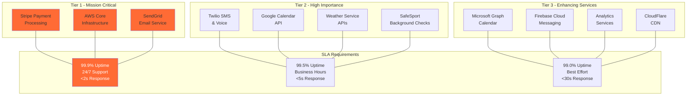

# Third-Party Service Contracts and SLAs
## Basketball League Management Platform - Phase 2

**Document ID:** THIRDPARTY-BLMP-001  
**Version:** 1.0  
**Date:** August 8, 2025  
**Author:** Integration Architect  
**Status:** Phase 2 Integration Design  
**Classification:** Technical Architecture  

---

## Executive Summary

This document defines the comprehensive third-party service contracts, Service Level Agreements (SLAs), and integration specifications for the Basketball League Management Platform. It outlines the requirements, expectations, and monitoring criteria for external service providers that are critical to platform operations.

### Key Third-Party Services

- **Payment Processing**: Stripe for secure payment handling
- **Communication Services**: SendGrid, Twilio for notifications
- **Calendar Integration**: Google Calendar, Microsoft Graph APIs
- **Weather Services**: National Weather Service, WeatherAPI
- **Background Checks**: SafeSport compliance services
- **Cloud Infrastructure**: AWS services and CDN
- **Analytics and Monitoring**: Third-party observability tools

---

## Table of Contents

1. [Service Portfolio Overview](#1-service-portfolio-overview)
2. [Payment Processing Services](#2-payment-processing-services)
3. [Communication and Notification Services](#3-communication-and-notification-services)
4. [Calendar and Scheduling Services](#4-calendar-and-scheduling-services)
5. [Safety and Compliance Services](#5-safety-and-compliance-services)
6. [Infrastructure and Cloud Services](#6-infrastructure-and-cloud-services)
7. [Monitoring and Analytics Services](#7-monitoring-and-analytics-services)
8. [Service Level Agreements](#8-service-level-agreements)

---

## 1. Service Portfolio Overview

### 1.1 Critical Service Classifications



### 1.2 Service Dependency Matrix

| Service Category | Primary Provider | Backup Provider | Criticality | Failover Time |
|------------------|------------------|------------------|-------------|---------------|
| **Payment Processing** | Stripe | PayPal/Square | Critical | <1 minute |
| **Email Delivery** | SendGrid | AWS SES | Critical | <5 minutes |
| **SMS Delivery** | Twilio | AWS SNS | High | <5 minutes |
| **Push Notifications** | Firebase FCM | AWS SNS | High | <10 minutes |
| **Calendar Sync** | Google Calendar | None | Medium | N/A |
| **Weather Data** | WeatherAPI | OpenWeatherMap | High | <1 minute |
| **Background Checks** | SafeSport | Manual Process | High | 24 hours |
| **Infrastructure** | AWS | None | Critical | <5 minutes |

### 1.3 Contract Management Framework

```typescript
interface ServiceContract {
  serviceId: string;
  providerName: string;
  contractType: 'API' | 'SaaS' | 'Infrastructure' | 'Compliance';
  tier: ServiceTier;
  
  // Contract terms
  startDate: Date;
  endDate: Date;
  autoRenewal: boolean;
  terminationNotice: number; // days
  
  // Technical specifications
  sla: ServiceLevelAgreement;
  apiLimits: APILimits;
  dataRequirements: DataRequirements;
  securityRequirements: SecurityRequirements;
  
  // Financial terms
  pricingModel: PricingModel;
  costs: ServiceCosts;
  penalties: SLAPenalties;
  
  // Support and escalation
  supportLevels: SupportLevel[];
  escalationMatrix: EscalationContact[];
  
  // Compliance and legal
  dataProcessingAgreement: boolean;
  privacyShield: boolean;
  gdprCompliant: boolean;
  coppaCompliant: boolean;
  
  // Monitoring and reporting
  monitoringRequirements: MonitoringSpec[];
  reportingSchedule: ReportingSchedule;
}

enum ServiceTier {
  TIER_1_CRITICAL = 'tier1_critical',
  TIER_2_HIGH = 'tier2_high', 
  TIER_3_STANDARD = 'tier3_standard'
}

interface ServiceLevelAgreement {
  uptime: number;              // Percentage (e.g., 99.9)
  responseTime: number;        // Milliseconds
  throughput: number;          // Requests per second
  errorRate: number;           // Maximum error percentage
  supportResponse: number;     // Support ticket response time in minutes
  downtime: {
    plannedWindow: string;     // Maintenance window
    maxDuration: number;       // Maximum downtime per month in minutes
    advanceNotice: number;     // Notice period in hours
  };
}
```

---

## 2. Payment Processing Services

### 2.1 Stripe Service Contract

**Service Provider**: Stripe, Inc.  
**Contract Type**: API Service  
**Service Tier**: Tier 1 - Mission Critical  
**Contract Term**: Annual with auto-renewal  

#### 2.1.1 Service Level Agreement

```typescript
const stripeContract: ServiceContract = {
  serviceId: 'stripe_payments',
  providerName: 'Stripe',
  contractType: 'API',
  tier: ServiceTier.TIER_1_CRITICAL,
  
  sla: {
    uptime: 99.9,                    // 99.9% uptime guarantee
    responseTime: 2000,              // <2 second API response time
    throughput: 1000,                // 1000 requests per second
    errorRate: 0.1,                  // <0.1% error rate
    supportResponse: 60,             // 1 hour support response for critical issues
    downtime: {
      plannedWindow: 'Sunday 2-4 AM EST',
      maxDuration: 240,              // 4 hours per month maximum
      advanceNotice: 72               // 72 hours advance notice
    }
  },
  
  apiLimits: {
    requestsPerSecond: 100,          // Per API key
    requestsPerMinute: 1000,
    requestsPerDay: 1000000,
    burstLimit: 500,
    concurrentConnections: 50
  },
  
  dataRequirements: {
    encryption: 'TLS 1.2+',
    dataResidency: 'US',
    backup: 'Real-time replication',
    retention: '7 years',
    deletion: 'Immediate upon request'
  },
  
  securityRequirements: {
    pciCompliance: 'Level 1',
    soc2Type2: true,
    penetrationTesting: 'Quarterly',
    vulnerabilityScanning: 'Continuous',
    incidentResponse: '24/7'
  },
  
  pricingModel: {
    type: 'Transaction-based',
    cardFee: 2.9,                    // 2.9% + $0.30 per transaction
    fixedFee: 0.30,
    achFee: 0.8,                     // 0.8% for ACH, capped at $5
    internationalFee: 1.5,           // Additional 1.5% for international cards
    disputes: 15.00,                 // $15 per dispute
    chargebacks: 15.00               // $15 per chargeback
  },
  
  supportLevels: [
    {
      level: 'Critical',
      responseTime: 60,              // 1 hour
      channels: ['phone', 'email', 'chat'],
      availability: '24/7'
    },
    {
      level: 'Standard',
      responseTime: 1440,            // 24 hours
      channels: ['email', 'support_portal'],
      availability: 'Business hours'
    }
  ]
};
```

#### 2.1.2 Integration Requirements

**API Endpoints Required**:
- Payment Intents API
- Setup Intents API (for saved payment methods)
- Customers API
- Payment Methods API
- Webhooks API
- Disputes API
- Refunds API

**Webhook Events**:
- `payment_intent.succeeded`
- `payment_intent.payment_failed`
- `invoice.payment_succeeded`
- `customer.subscription.updated`
- `setup_intent.succeeded`
- `charge.dispute.created`

**Data Synchronization**:
- Real-time webhook processing
- Daily reconciliation reports
- Monthly financial statements
- Quarterly tax reporting (1099-K)

#### 2.1.3 Compliance Requirements

**PCI DSS Compliance**:
- No card data storage in our systems
- Stripe Elements for secure card collection
- Annual PCI compliance attestation
- Quarterly vulnerability scans

**Financial Regulations**:
- Anti-money laundering (AML) compliance
- Know Your Customer (KYC) verification
- OFAC sanctions screening
- State money transmitter licenses

### 2.2 PayPal Backup Service

**Service Provider**: PayPal Holdings, Inc.  
**Contract Type**: API Service (Backup)  
**Service Tier**: Tier 2 - High Importance  
**Activation**: Automatic failover for Stripe outages >5 minutes

```typescript
const paypalBackupContract: ServiceContract = {
  serviceId: 'paypal_backup',
  providerName: 'PayPal',
  contractType: 'API',
  tier: ServiceTier.TIER_2_HIGH,
  
  sla: {
    uptime: 99.5,
    responseTime: 5000,              // <5 second failover activation
    throughput: 500,
    errorRate: 0.5,
    supportResponse: 240             // 4 hours for backup service issues
  },
  
  activationCriteria: {
    stripeDowntime: 300,             // 5 minutes
    errorRateThreshold: 5.0,         // 5% error rate
    responseTimeThreshold: 30000     // 30 seconds
  }
};
```

---

## 3. Communication and Notification Services

### 3.1 SendGrid Email Service

**Service Provider**: Twilio SendGrid  
**Contract Type**: SaaS Platform  
**Service Tier**: Tier 1 - Mission Critical  

```typescript
const sendGridContract: ServiceContract = {
  serviceId: 'sendgrid_email',
  providerName: 'SendGrid',
  contractType: 'SaaS',
  tier: ServiceTier.TIER_1_CRITICAL,
  
  sla: {
    uptime: 99.9,
    responseTime: 1000,              // <1 second API response
    throughput: 1000,                // 1000 emails per second
    errorRate: 0.1,
    deliveryRate: 98.0,              // 98% delivery rate guarantee
    supportResponse: 120             // 2 hours for critical issues
  },
  
  apiLimits: {
    requestsPerSecond: 600,          // 600 emails per second
    requestsPerMinute: 10000,
    requestsPerDay: 1000000,
    attachmentSize: 30000000,        // 30MB total attachments per email
    recipientsPerEmail: 1000
  },
  
  deliveryRequirements: {
    inboxPlacement: 95.0,            // 95% inbox placement rate
    bounceRate: 2.0,                 // <2% bounce rate
    spamRate: 0.1,                   // <0.1% spam complaints
    unsubscribeCompliance: 'CAN-SPAM',
    dkimSigning: true,
    spfAlignment: true
  },
  
  pricingModel: {
    type: 'Volume-based',
    tier1: { emails: 40000, price: 14.95 },     // Up to 40K emails/month
    tier2: { emails: 100000, price: 89.95 },    // Up to 100K emails/month
    tier3: { emails: 300000, price: 249.95 },   // Up to 300K emails/month
    overage: 0.00085                             // $0.00085 per additional email
  },
  
  features: {
    templates: true,
    analytics: true,
    abtesting: true,
    webhooks: true,
    suppressionManagement: true,
    ipWarmup: true,
    dedicatedIp: true                           // Dedicated IP included
  }
};
```

#### 3.1.1 Email Deliverability Requirements

**Sender Reputation Management**:
- Dedicated IP address for domain reputation
- Gradual IP warming process
- Real-time reputation monitoring
- Automatic suppression list management

**Content Compliance**:
- CAN-SPAM Act compliance
- GDPR consent management
- COPPA compliance for youth communications
- Automatic unsubscribe handling

**Analytics and Reporting**:
- Real-time delivery tracking
- Open and click analytics
- Bounce and spam reporting
- A/B testing capabilities

### 3.2 Twilio SMS and Voice Service

**Service Provider**: Twilio Inc.  
**Contract Type**: Communication Platform  
**Service Tier**: Tier 2 - High Importance  

```typescript
const twilioContract: ServiceContract = {
  serviceId: 'twilio_communications',
  providerName: 'Twilio',
  contractType: 'API',
  tier: ServiceTier.TIER_2_HIGH,
  
  sla: {
    uptime: 99.95,                   // Higher uptime than SendGrid
    responseTime: 500,               // <500ms API response
    throughput: 1000,                // 1000 messages per second
    errorRate: 0.1,
    deliveryRate: 99.0,              // 99% SMS delivery rate
    supportResponse: 180             // 3 hours support response
  },
  
  services: {
    sms: {
      deliveryRate: 99.0,            // 99% SMS delivery
      responseTime: 500,             // <500ms API response
      globalCoverage: 180            // 180+ countries
    },
    voice: {
      callCompletionRate: 95.0,      // 95% call completion
      callQuality: 4.3,              // >4.3 MOS (Mean Opinion Score)
      latency: 150                   // <150ms latency
    },
    messaging: {
      whatsapp: true,
      facebook: true,
      instagram: false
    }
  },
  
  pricingModel: {
    type: 'Usage-based',
    smsUS: 0.0075,                   // $0.0075 per SMS in US
    smsIntl: 0.05,                   // $0.05 per international SMS
    voiceUS: 0.013,                  // $0.013 per minute in US
    voiceIntl: 0.20,                 // $0.20 per minute international
    phoneNumber: 1.00,               // $1.00 per phone number per month
    tollFree: 2.00                   // $2.00 per toll-free number per month
  },
  
  complianceRequirements: {
    tcpaCompliance: true,            // Telephone Consumer Protection Act
    optOutManagement: true,
    carrierRegistration: true,       // Carrier filtering and registration
    a2pRegistration: true,           // Application-to-Person registration
    shortCodeApproval: true          // Short code compliance
  }
};
```

#### 3.2.1 SMS Compliance Requirements

**TCPA Compliance**:
- Explicit opt-in consent collection
- Clear opt-out instructions in every message
- Automated STOP keyword processing
- Consent documentation and retention

**Carrier Registration**:
- A2P (Application-to-Person) 10DLC registration
- Brand and campaign registration
- Carrier filtering compliance
- Message throughput based on trust score

**International Considerations**:
- GDPR compliance for EU recipients
- Local telecom regulations compliance
- Currency and timezone localization
- Regional carrier partnerships

---

## 4. Calendar and Scheduling Services

### 4.1 Google Calendar API

**Service Provider**: Google LLC  
**Contract Type**: API Service  
**Service Tier**: Tier 2 - High Importance  

```typescript
const googleCalendarContract: ServiceContract = {
  serviceId: 'google_calendar',
  providerName: 'Google',
  contractType: 'API',
  tier: ServiceTier.TIER_2_HIGH,
  
  sla: {
    uptime: 99.9,
    responseTime: 1000,              // <1 second API response
    throughput: 100,                 // 100 requests per second per project
    errorRate: 0.1,
    supportResponse: 1440,           // 24 hours (community support)
    escalationPath: 'Google Cloud Support'
  },
  
  apiLimits: {
    requestsPerSecond: 250,          // 250 requests per second per user
    requestsPerMinute: 30000,        // 30,000 requests per minute per project
    requestsPerDay: 1000000,         // 1M requests per day per project
    quotaReset: 'Daily at midnight PST',
    burstLimit: 1000                 // Short burst allowance
  },
  
  authenticationRequirements: {
    oauthVersion: '2.0',
    scopes: [
      'https://www.googleapis.com/auth/calendar',
      'https://www.googleapis.com/auth/calendar.events'
    ],
    tokenRefresh: 'Automatic',
    consentScreen: 'Verified'
  },
  
  dataHandling: {
    userConsent: 'Required for all operations',
    dataMinimization: 'Only access necessary calendar data',
    retention: 'No data stored beyond session',
    deletion: 'Immediate upon user request',
    encryption: 'TLS 1.2+ in transit'
  },
  
  pricingModel: {
    type: 'Free tier + Paid tiers',
    freeTier: {
      requestsPerDay: 1000000,
      requestsPerSecond: 100
    },
    paidTier: {
      pricePerRequest: 0.00025,      // $0.00025 per request above free tier
      minimumCharge: 0.01            // $0.01 minimum per day
    }
  }
};
```

#### 4.1.1 Integration Specifications

**Calendar Operations**:
- Create, read, update, delete events
- Batch operations for multiple events
- Recurring event management
- Calendar sharing and permissions
- Real-time sync via webhooks

**Webhook Configuration**:
- Push notifications for calendar changes
- Event-based triggers
- Secure endpoint validation
- Automatic renewal handling

**Privacy Considerations**:
- User-initiated authentication only
- Granular permission requests
- Clear data usage disclosure
- Opt-out mechanisms

### 4.2 Microsoft Graph API (Outlook)

**Service Provider**: Microsoft Corporation  
**Contract Type**: API Service  
**Service Tier**: Tier 3 - Standard  

```typescript
const microsoftGraphContract: ServiceContract = {
  serviceId: 'microsoft_graph',
  providerName: 'Microsoft',
  contractType: 'API',
  tier: ServiceTier.TIER_3_STANDARD,
  
  sla: {
    uptime: 99.9,
    responseTime: 2000,              // <2 second API response
    throughput: 10000,               // 10,000 requests per hour
    errorRate: 0.5,
    supportResponse: 2880,           // 48 hours (developer support)
    escalationPath: 'Microsoft 365 Support'
  },
  
  apiLimits: {
    requestsPerHour: 10000,          // 10,000 requests per hour per app
    requestsPerMinute: 600,          // 600 requests per minute
    throttlingPolicy: 'Exponential backoff',
    retryAfterHeader: 'Respected',
    maxRetries: 3
  },
  
  authenticationRequirements: {
    oauthVersion: '2.0',
    scopes: [
      'https://graph.microsoft.com/Calendars.ReadWrite',
      'https://graph.microsoft.com/User.Read'
    ],
    tenantRegistration: 'Required',
    adminConsent: 'For organization-wide access'
  },
  
  pricingModel: {
    type: 'Free for basic operations',
    freeTier: {
      requestsPerHour: 10000,
      features: 'Basic calendar operations'
    },
    premiumFeatures: {
      advancedQuery: 'Paid tier only',
      deltaQuery: 'Paid tier only',
      webhooks: 'Paid tier only'
    }
  }
};
```

---

## 5. Safety and Compliance Services

### 5.1 SafeSport Background Check Service

**Service Provider**: U.S. Center for SafeSport  
**Contract Type**: Compliance Service  
**Service Tier**: Tier 2 - High Importance  
**Legal Requirement**: Mandatory for coach certification

```typescript
const safeSportContract: ServiceContract = {
  serviceId: 'safesport_checks',
  providerName: 'SafeSport',
  contractType: 'Compliance',
  tier: ServiceTier.TIER_2_HIGH,
  
  sla: {
    uptime: 99.5,
    responseTime: 72000000,          // 72 hours for background checks
    throughput: 1000,               // 1000 checks per day
    errorRate: 0.1,
    supportResponse: 480,            // 8 hours business hours
    businessHours: 'M-F 9AM-5PM EST'
  },
  
  serviceRequirements: {
    backgroundCheckTypes: [
      'Criminal history',
      'Sex offender registry',
      'SafeSport disciplinary database',
      'Other athletic organization sanctions'
    ],
    dataRequired: [
      'Full legal name',
      'Date of birth', 
      'Social Security Number (encrypted)',
      'Current and previous addresses',
      'Government-issued photo ID'
    ],
    resultDelivery: 'Secure portal and API',
    certificationPeriod: 'Annual renewal required',
    appeals: 'Available through SafeSport process'
  },
  
  complianceRequirements: {
    fairCreditReporting: true,       // FCRA compliance
    equalOpportunity: true,          // EEOC compliance
    stateRegulations: 'All 50 states',
    dataEncryption: 'AES-256',
    dataRetention: '7 years',
    auditTrail: 'Complete transaction logs'
  },
  
  pricingModel: {
    type: 'Per-check pricing',
    basicCheck: 25.00,              // $25 per basic background check
    enhancedCheck: 45.00,           // $45 per enhanced check
    rushProcessing: 15.00,          // $15 additional for 24-hour processing
    annualCertification: 10.00,     // $10 per annual recertification
    bulkDiscount: 0.10              // 10% discount for 100+ checks per month
  }
};
```

#### 5.1.1 Background Check Process

**Application Workflow**:
1. Coach submits personal information
2. Identity verification and consent
3. Background check initiation
4. Multi-database screening
5. Results review and certification
6. Annual renewal tracking

**Data Security Requirements**:
- End-to-end encryption for PII
- Secure document upload portal
- Audit logging for all access
- GDPR-compliant data handling
- Automatic data purging schedules

**Integration Requirements**:
- Real-time status updates via webhooks
- Automated result processing
- Certification tracking database
- Annual renewal notifications
- Appeals process management

### 5.2 Weather Safety Service

**Service Provider**: WeatherAPI.com  
**Contract Type**: Data Service  
**Service Tier**: Tier 2 - High Importance  
**Critical for**: Phoenix heat safety protocols

```typescript
const weatherServiceContract: ServiceContract = {
  serviceId: 'weather_api',
  providerName: 'WeatherAPI',
  contractType: 'API',
  tier: ServiceTier.TIER_2_HIGH,
  
  sla: {
    uptime: 99.9,
    responseTime: 1000,              // <1 second API response
    throughput: 1000,               // 1000 requests per second
    errorRate: 0.1,
    dataAccuracy: 95.0,              // 95% weather forecast accuracy
    supportResponse: 360             // 6 hours support response
  },
  
  dataRequirements: {
    updateFrequency: 300,            // 5-minute data updates
    forecastRange: 14,               // 14-day forecast
    hourlyData: true,
    alerts: true,                    // Severe weather alerts
    airQuality: true,                // Air quality index
    uvIndex: true,                   // UV index for sun safety
    heatIndex: true                  // Critical for Phoenix operations
  },
  
  safetyThresholds: {
    temperature: {
      caution: 95,                   // °F - Increase water breaks
      warning: 105,                  // °F - Consider postponing
      danger: 115                    // °F - Cancel outdoor activities
    },
    heatIndex: {
      caution: 90,
      warning: 105,
      danger: 125
    },
    airQuality: {
      moderate: 51,                  // AQI
      unhealthy: 151,
      hazardous: 301
    }
  },
  
  pricingModel: {
    type: 'Subscription-based',
    professional: {
      monthlyPrice: 35.00,           // $35/month
      requestsPerMonth: 1000000,     // 1M requests per month
      features: ['Real-time', 'Alerts', 'Historical']
    },
    enterprise: {
      monthlyPrice: 249.00,          // $249/month
      requestsPerMonth: 10000000,    // 10M requests per month
      features: ['All professional', 'Priority support', 'SLA guarantee']
    }
  }
};
```

#### 5.2.1 Heat Safety Integration

**Automatic Monitoring**:
- Real-time temperature and heat index monitoring
- Automated safety alerts based on thresholds
- Game schedule impact assessments
- Historical weather pattern analysis

**Safety Protocol Triggers**:
- Increase hydration breaks at 95°F
- Mandatory shade breaks at 100°F
- Game postponement recommendations at 105°F
- Automatic cancellations at 115°F

**Notification Integration**:
- Immediate alerts to coaches and parents
- Weather safety reminders 24 hours before games
- Real-time updates during games
- Post-event safety confirmations

---

## 6. Infrastructure and Cloud Services

### 6.1 AWS Core Infrastructure

**Service Provider**: Amazon Web Services  
**Contract Type**: Infrastructure as a Service  
**Service Tier**: Tier 1 - Mission Critical  
**Enterprise Support Agreement**: 24/7 Premium Support

```typescript
const awsContract: ServiceContract = {
  serviceId: 'aws_infrastructure',
  providerName: 'AWS',
  contractType: 'Infrastructure',
  tier: ServiceTier.TIER_1_CRITICAL,
  
  sla: {
    uptime: 99.99,                   // 99.99% uptime for critical services
    responseTime: 100,               // <100ms latency within region
    throughput: 10000,              // 10,000 requests per second per service
    errorRate: 0.01,
    supportResponse: 15,             // 15 minutes for critical issues
    escalationPath: 'Technical Account Manager'
  },
  
  services: {
    compute: {
      ec2: {
        instanceTypes: ['m5.large', 'm5.xlarge', 'c5.large'],
        autoScaling: true,
        reservedInstances: 30      // 30% reserved for cost optimization
      },
      lambda: {
        concurrentExecutions: 1000,
        memoryAllocation: '1024MB',
        timeout: '15 minutes'
      },
      fargate: {
        cpuUnits: 2048,
        memory: '4096MB',
        autoScaling: true
      }
    },
    storage: {
      s3: {
        storageClass: 'Standard-IA',
        backup: 'Cross-region replication',
        lifecycle: 'Automated archival'
      },
      rds: {
        engine: 'PostgreSQL 15',
        multiAz: true,
        backupRetention: 30,       // 30 days
        performanceInsights: true
      },
      elasticache: {
        engine: 'Redis',
        nodeType: 'cache.r6g.large',
        clustering: true
      }
    },
    networking: {
      cloudFront: {
        edgeLocations: 'Global',
        cachePolicy: 'Optimized',
        originShield: true
      },
      elb: {
        type: 'Application Load Balancer',
        healthChecks: true,
        sslTermination: true
      },
      vpc: {
        multiAz: true,
        natGateway: true,
        flowLogs: true
      }
    }
  },
  
  securityRequirements: {
    encryption: {
      atRest: 'AES-256',
      inTransit: 'TLS 1.2+',
      keyManagement: 'AWS KMS'
    },
    access: {
      iam: 'Least privilege principle',
      mfa: 'Required for admin access',
      monitoring: 'CloudTrail logging'
    },
    compliance: {
      soc2: true,
      hipaa: false,              // Not required for basketball league
      pci: true,                 // Required for payment processing
      gdpr: true
    }
  },
  
  pricingModel: {
    type: 'Pay-as-you-go with Reserved Instances',
    reservedInstances: 0.30,     // 30% discount for 1-year commitment
    spotInstances: 0.70,         // 70% discount for non-critical workloads
    dataTransfer: {
      inbound: 0.00,             // Free inbound data transfer
      outbound: 0.09,            // $0.09/GB outbound to internet
      cloudfront: 0.085          // $0.085/GB CloudFront distribution
    },
    support: {
      level: 'Enterprise',
      monthlyFee: 15000,         // $15,000/month minimum
      percentage: 0.10           // 10% of monthly AWS spend above minimum
    }
  }
};
```

#### 6.1.1 Disaster Recovery Requirements

**Multi-Region Setup**:
- Primary: US-East-1 (Virginia)
- Secondary: US-West-2 (Oregon)
- Database replication: Real-time
- Application deployment: Blue/green strategy

**Backup Strategy**:
- Database backups: Daily with 30-day retention
- Application data: Continuous replication
- Configuration: Infrastructure as Code (CDK)
- Recovery Time Objective (RTO): 4 hours
- Recovery Point Objective (RPO): 1 hour

### 6.2 CloudFlare CDN Service

**Service Provider**: Cloudflare, Inc.  
**Contract Type**: CDN and Security Service  
**Service Tier**: Tier 3 - Standard  
**Purpose**: Global content delivery and DDoS protection

```typescript
const cloudflareContract: ServiceContract = {
  serviceId: 'cloudflare_cdn',
  providerName: 'Cloudflare',
  contractType: 'SaaS',
  tier: ServiceTier.TIER_3_STANDARD,
  
  sla: {
    uptime: 99.9,
    responseTime: 50,                // <50ms global edge response
    throughput: 10000,              // 10,000 requests per second
    errorRate: 0.1,
    supportResponse: 1440,           // 24 hours for standard support
    enterpriseSupport: 240           // 4 hours for enterprise tier
  },
  
  services: {
    cdn: {
      edgeLocations: 275,            // 275+ edge locations globally
      cacheHitRatio: 95,             // 95% cache hit ratio target
      bandwidth: 'Unlimited',
      compression: 'Brotli/Gzip',
      imageOptimization: true
    },
    security: {
      ddosProtection: 'Automatic',
      wafRules: 'OWASP Core Rule Set',
      rateLimiting: true,
      botManagement: true,
      ssl: 'Universal SSL'
    },
    performance: {
      http2: true,
      http3: true,
      earlyHints: true,
      rocketLoader: true,
      mirage: true                   // Image optimization
    }
  },
  
  pricingModel: {
    type: 'Tiered subscription',
    pro: {
      monthlyFee: 20.00,             // $20/month per domain
      features: ['Web optimization', 'Mobile optimization', 'Analytics']
    },
    business: {
      monthlyFee: 200.00,            // $200/month per domain  
      features: ['All Pro features', 'Custom SSL', 'Image optimization']
    },
    enterprise: {
      monthlyFee: 5000.00,           // $5,000/month minimum
      features: ['All Business features', 'Advanced DDoS', '24/7 phone support']
    }
  }
};
```

---

## 7. Monitoring and Analytics Services

### 7.1 DataDog Monitoring Service

**Service Provider**: Datadog, Inc.  
**Contract Type**: Monitoring and Analytics SaaS  
**Service Tier**: Tier 2 - High Importance  
**Purpose**: Application performance monitoring and alerting

```typescript
const datadogContract: ServiceContract = {
  serviceId: 'datadog_monitoring',
  providerName: 'Datadog',
  contractType: 'SaaS',
  tier: ServiceTier.TIER_2_HIGH,
  
  sla: {
    uptime: 99.9,
    responseTime: 500,               // <500ms API response time
    dataIngestion: 1000000,          // 1M events per second ingestion
    dataRetention: 365,              // 365 days data retention
    alertLatency: 60,                // <1 minute alert latency
    supportResponse: 480             // 8 hours support response
  },
  
  services: {
    infrastructure: {
      hostMonitoring: true,
      containerMonitoring: true,
      serverlessMonitoring: true,
      networkPerformance: true,
      customMetrics: 500             // 500 custom metrics included
    },
    apm: {
      tracing: true,
      profiling: true,
      errorTracking: true,
      serviceMap: true,
      retentionPeriod: 30            // 30 days trace retention
    },
    logs: {
      ingestion: 1000,               // 1TB/month log ingestion
      indexing: 500,                 // 500GB/month indexed logs
      retention: 30,                 // 30 days retention
      parsing: 'Automatic'
    },
    synthetics: {
      apiTests: 10000,               // 10,000 API tests per month
      browserTests: 1000,            // 1,000 browser tests per month
      locations: 'Global',
      frequency: '1 minute'
    }
  },
  
  pricingModel: {
    type: 'Usage-based subscription',
    infrastructure: 15.00,           // $15/host/month
    apm: 31.00,                     // $31/host/month
    logs: 1.70,                     // $1.70/GB ingested/month
    synthetics: 5.00,               // $5/10K API tests/month
    customMetrics: 0.05             // $0.05/metric/month
  },
  
  alerting: {
    channels: ['email', 'slack', 'pagerduty', 'webhook'],
    anomalyDetection: true,
    forecastAlerts: true,
    compositeMonitors: true,
    downtimeScheduling: true
  }
};
```

#### 7.1.1 Key Metrics and Dashboards

**Application Performance**:
- Response time percentiles (p50, p95, p99)
- Error rates and types
- Throughput (requests per second)
- Apdex scores
- Database query performance

**Infrastructure Metrics**:
- CPU and memory utilization
- Disk I/O and network performance
- Container resource usage
- Auto-scaling events
- Load balancer health

**Business Metrics**:
- User registration rates
- Payment success rates
- Game scheduling efficiency
- Notification delivery rates
- Customer support ticket volume

### 7.2 Sentry Error Tracking

**Service Provider**: Functional Software, Inc.  
**Contract Type**: Error Tracking SaaS  
**Service Tier**: Tier 3 - Standard  
**Purpose**: Real-time error tracking and performance monitoring

```typescript
const sentryContract: ServiceContract = {
  serviceId: 'sentry_errors',
  providerName: 'Sentry',
  contractType: 'SaaS',
  tier: ServiceTier.TIER_3_STANDARD,
  
  sla: {
    uptime: 99.5,
    responseTime: 1000,              // <1 second error ingestion
    dataIngestion: 1000000,          // 1M errors per month
    dataRetention: 90,               // 90 days error retention
    alertLatency: 300,               // <5 minutes alert latency
    supportResponse: 1440            // 24 hours support response
  },
  
  services: {
    errorTracking: {
      errors: 1000000,               // 1M errors per month
      transactions: 100000,          // 100K transactions per month
      releases: 'Unlimited',
      alerts: true,
      issueManagement: true
    },
    performance: {
      tracing: true,
      profiling: false,              // Not included in standard plan
      sessionReplay: 5000,           // 5K session replays per month
      webVitals: true
    },
    integrations: {
      slack: true,
      jira: true,
      github: true,
      pagerduty: true,
      email: true
    }
  },
  
  pricingModel: {
    type: 'Usage-based',
    team: {
      monthlyFee: 26.00,             // $26/month for team plan
      errors: 100000,                // 100K errors included
      transactions: 10000,           // 10K transactions included
      members: 'Unlimited'
    },
    organization: {
      monthlyFee: 80.00,             // $80/month for organization plan
      errors: 1000000,               // 1M errors included
      transactions: 100000,          // 100K transactions included
      features: ['Advanced search', 'Custom retention']
    }
  }
};
```

---

## 8. Service Level Agreements

### 8.1 SLA Monitoring Framework

```typescript
class SLAMonitoringService {
  private readonly slaDefinitions: Map<string, SLADefinition>;
  private readonly alerting: AlertingService;
  private readonly reporting: ReportingService;

  constructor() {
    this.slaDefinitions = new Map();
    this.setupSLADefinitions();
  }

  private setupSLADefinitions(): void {
    // Tier 1 Critical Services
    this.slaDefinitions.set('stripe_payments', {
      uptime: { target: 99.9, measurement: 'availability', window: 'monthly' },
      responseTime: { target: 2000, measurement: 'p95', window: 'hourly' },
      errorRate: { target: 0.1, measurement: 'percentage', window: 'hourly' },
      penalties: {
        uptimeBreach: { threshold: 99.5, penalty: 'service_credits' },
        responseTimeBreach: { threshold: 5000, penalty: 'escalation' }
      }
    });

    this.slaDefinitions.set('aws_infrastructure', {
      uptime: { target: 99.99, measurement: 'availability', window: 'monthly' },
      responseTime: { target: 100, measurement: 'p95', window: 'minute' },
      errorRate: { target: 0.01, measurement: 'percentage', window: 'hourly' }
    });

    // Tier 2 High Importance Services  
    this.slaDefinitions.set('sendgrid_email', {
      uptime: { target: 99.9, measurement: 'availability', window: 'monthly' },
      deliveryRate: { target: 98.0, measurement: 'percentage', window: 'daily' },
      inboxPlacement: { target: 95.0, measurement: 'percentage', window: 'weekly' }
    });
  }

  async checkSLACompliance(serviceId: string, timeWindow: TimeWindow): Promise<SLAComplianceReport> {
    const sla = this.slaDefinitions.get(serviceId);
    if (!sla) throw new Error(`SLA not found for service: ${serviceId}`);

    const metrics = await this.collectServiceMetrics(serviceId, timeWindow);
    const compliance = await this.evaluateCompliance(sla, metrics);
    
    return {
      serviceId,
      timeWindow,
      compliance,
      violations: compliance.violations,
      recommendedActions: this.generateRecommendations(compliance)
    };
  }
}

interface SLADefinition {
  uptime?: { target: number; measurement: string; window: string };
  responseTime?: { target: number; measurement: string; window: string };
  errorRate?: { target: number; measurement: string; window: string };
  deliveryRate?: { target: number; measurement: string; window: string };
  inboxPlacement?: { target: number; measurement: string; window: string };
  penalties?: {
    uptimeBreach?: { threshold: number; penalty: string };
    responseTimeBreach?: { threshold: number; penalty: string };
  };
}
```

### 8.2 SLA Violation Response Procedures

#### 8.2.1 Automated Response Actions

**Immediate Actions (0-15 minutes)**:
- Automatic failover to backup services (where available)
- Alert escalation to on-call engineering team
- Customer communication via status page
- Incident tracking system creation

**Short-term Actions (15 minutes - 2 hours)**:
- Service provider notification and escalation
- Alternative service activation
- Customer impact assessment
- Executive team notification for Tier 1 services

**Medium-term Actions (2-24 hours)**:
- Root cause analysis initiation
- Service credit calculations
- Customer communication updates
- Process improvement planning

#### 8.2.2 Financial Penalties and Credits

**Service Credits**:
- Stripe: 5% monthly fee credit for each 1% below 99.5% uptime
- AWS: Service credits per AWS Service Credit policy
- SendGrid: Pro-rated credit for delivery rate below 97%
- Twilio: Account credit for delivery rate below 98%

**Contract Penalties**:
- Repeated SLA violations (3+ per quarter): Contract renegotiation
- Critical downtime >4 hours: Penalty fee 10% of monthly service fee
- Data breach or security incident: Immediate contract review

### 8.3 Service Performance Dashboards

```typescript
interface ServiceDashboard {
  serviceId: string;
  widgets: DashboardWidget[];
  refreshInterval: number;
  alertThresholds: AlertThreshold[];
}

const paymentServiceDashboard: ServiceDashboard = {
  serviceId: 'stripe_payments',
  widgets: [
    {
      type: 'metric',
      title: 'Payment Success Rate',
      query: 'stripe.payments.success_rate',
      target: 99.5,
      format: 'percentage'
    },
    {
      type: 'graph',
      title: 'Response Time (P95)',
      query: 'stripe.api.response_time.p95',
      target: 2000,
      format: 'milliseconds',
      timeRange: '1h'
    },
    {
      type: 'status',
      title: 'Service Health',
      healthChecks: ['api_health', 'webhook_processing', 'database_connection']
    }
  ],
  refreshInterval: 30,
  alertThresholds: [
    { metric: 'success_rate', operator: '<', value: 99.0, severity: 'critical' },
    { metric: 'response_time_p95', operator: '>', value: 5000, severity: 'warning' }
  ]
};
```

### 8.4 Quarterly Business Reviews

**Review Schedule**: Quarterly meetings with each Tier 1 and Tier 2 provider

**Review Topics**:
- SLA performance analysis
- Service improvement opportunities  
- Cost optimization discussions
- Capacity planning and scaling
- Security and compliance updates
- Roadmap alignment and new features
- Contract renewal and negotiation planning

**Attendees**:
- Technical leadership from both sides
- Account management representatives
- Product management (for feature alignment)
- Finance (for cost analysis)
- Legal (for contract matters)

**Deliverables**:
- Performance scorecards
- Action item lists
- Cost analysis reports
- Capacity forecasts
- Risk assessments

---

## Contract Renewal and Termination Procedures

### Renewal Criteria
- SLA compliance >95% over contract term
- Cost efficiency compared to alternatives
- Feature roadmap alignment with business needs
- Security and compliance requirements met
- Support quality satisfaction scores >4/5

### Termination Procedures
- 90-day advance notice for Tier 1 services
- 60-day advance notice for Tier 2 services
- 30-day advance notice for Tier 3 services
- Data export and migration assistance required
- Service transition support during termination period

### Vendor Risk Management
- Annual financial stability assessments
- Security audit requirements
- Business continuity plan reviews
- Alternative vendor evaluations
- Contract terms benchmarking

---

**Document Status**: ✅ Complete - Ready for Implementation  
**Next Review**: Contract Negotiation and Legal Review  
**Dependencies**: Budget Approval, Security Assessment, Legal Review  
**Compliance**: SOC 2, GDPR, COPPA, PCI DSS Requirements