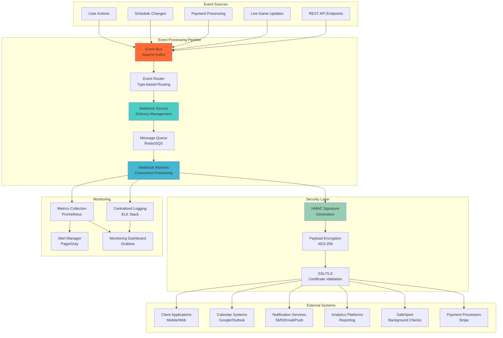
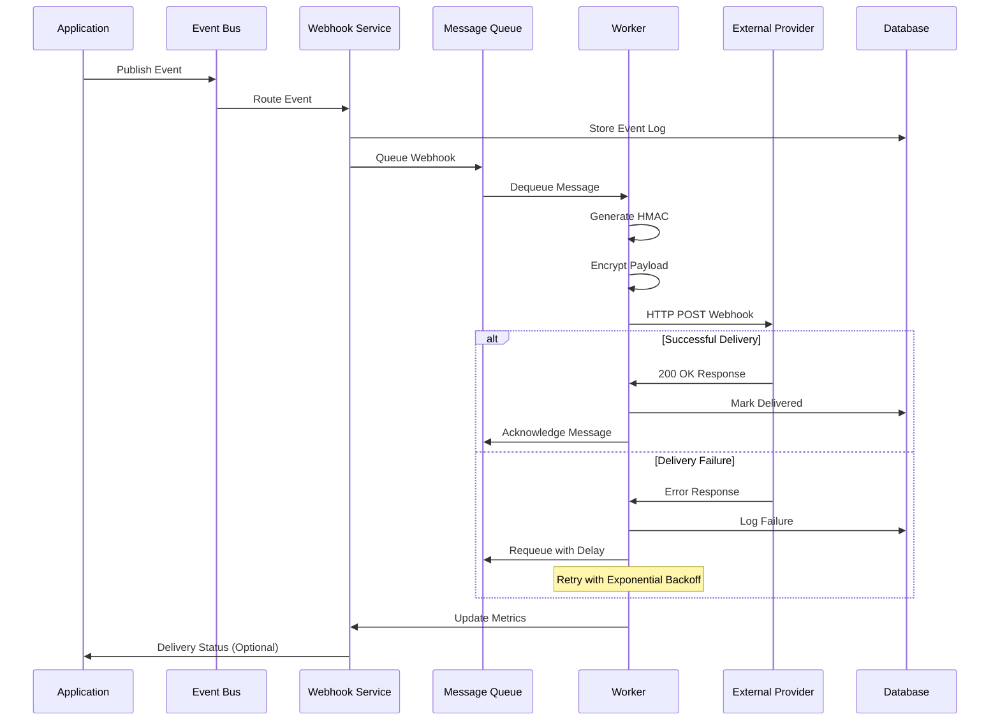

# Webhook Design Patterns
## Basketball League Management Platform - Phase 2

**Document ID:** WEBHOOK-BLMP-001  
**Version:** 1.0  
**Date:** August 8, 2025  
**Author:** Integration Architect  
**Status:** Phase 2 Integration Design  
**Classification:** Technical Architecture  

---

## Executive Summary

This document defines comprehensive webhook design patterns for the Basketball League Management Platform, enabling real-time event-driven integrations with external services, client applications, and third-party systems. The webhook architecture supports high-volume event processing, guaranteed delivery, and secure payload transmission.

### Key Design Principles

- **Event-Driven Architecture**: Asynchronous event processing and notification
- **Guaranteed Delivery**: Retry mechanisms with exponential backoff
- **Security First**: HMAC signature verification and payload encryption
- **Scalability**: Horizontal scaling with message queues and workers
- **Monitoring**: Comprehensive logging and delivery tracking
- **Compliance**: COPPA-compliant event handling for youth data

---

## Table of Contents

1. [Webhook Architecture Overview](#1-webhook-architecture-overview)
2. [Event Types and Schemas](#2-event-types-and-schemas)
3. [Security Implementation](#3-security-implementation)
4. [Delivery Patterns](#4-delivery-patterns)
5. [Error Handling & Retry Logic](#5-error-handling--retry-logic)
6. [Monitoring & Observability](#6-monitoring--observability)
7. [Basketball-Specific Events](#7-basketball-specific-events)
8. [Integration Patterns](#8-integration-patterns)

---

## 1. Webhook Architecture Overview

### 1.1 System Architecture



### 1.2 Webhook Delivery Flow



### 1.3 Core Components

| Component | Technology | Purpose | Scalability |
|-----------|------------|---------|-------------|
| **Event Bus** | Apache Kafka | Event streaming and durability | 1M+ events/sec |
| **Webhook Service** | Node.js/Express | Webhook management API | Horizontal scaling |
| **Message Queue** | Redis/AWS SQS | Delivery queue management | 100K+ messages/sec |
| **Workers** | Node.js Cluster | Concurrent webhook delivery | Auto-scaling based on load |
| **Database** | PostgreSQL | Event logs and delivery status | Read replicas |
| **Security** | Node.js Crypto | HMAC and encryption | Hardware acceleration |

---

## 2. Event Types and Schemas

### 2.1 Core Event Categories

```typescript
enum EventCategory {
  USER_MANAGEMENT = 'user_management',
  LEAGUE_OPERATIONS = 'league_operations',
  GAME_EVENTS = 'game_events',
  PAYMENT_PROCESSING = 'payment_processing',
  NOTIFICATIONS = 'notifications',
  SYSTEM_EVENTS = 'system_events'
}

enum EventType {
  // User Management Events
  USER_CREATED = 'user.created',
  USER_UPDATED = 'user.updated',
  USER_DELETED = 'user.deleted',
  USER_LOGIN = 'user.login',
  COPPA_CONSENT_UPDATED = 'user.coppa_consent_updated',
  
  // League Operations Events
  LEAGUE_CREATED = 'league.created',
  LEAGUE_UPDATED = 'league.updated',
  TEAM_CREATED = 'team.created',
  TEAM_UPDATED = 'team.updated',
  PLAYER_REGISTERED = 'league.player_registered',
  REGISTRATION_DEADLINE = 'league.registration_deadline',
  
  // Game Events
  GAME_SCHEDULED = 'game.scheduled',
  GAME_STARTED = 'game.started',
  GAME_SCORE_UPDATED = 'game.score_updated',
  GAME_COMPLETED = 'game.completed',
  GAME_CANCELLED = 'game.cancelled',
  GAME_POSTPONED = 'game.postponed',
  
  // Payment Processing Events
  PAYMENT_INITIATED = 'payment.initiated',
  PAYMENT_SUCCEEDED = 'payment.succeeded',
  PAYMENT_FAILED = 'payment.failed',
  REFUND_PROCESSED = 'payment.refund_processed',
  
  // Notification Events
  EMAIL_SENT = 'notification.email_sent',
  SMS_SENT = 'notification.sms_sent',
  PUSH_SENT = 'notification.push_sent',
  
  // System Events
  SYSTEM_MAINTENANCE = 'system.maintenance',
  API_RATE_LIMIT_EXCEEDED = 'system.rate_limit_exceeded',
  SECURITY_ALERT = 'system.security_alert'
}
```

### 2.2 Base Event Schema

```typescript
interface BaseWebhookEvent {
  id: string;                    // Unique event ID
  type: EventType;              // Event type identifier
  version: string;              // Schema version (semver)
  timestamp: string;            // ISO 8601 timestamp
  source: string;               // Event source service
  tenantId: string;            // Multi-tenant identifier
  correlationId?: string;       // Request correlation ID
  metadata: {
    userId?: string;            // Acting user ID
    sessionId?: string;         // Session identifier
    requestId?: string;         // API request ID
    ipAddress?: string;         // Client IP (privacy compliant)
    userAgent?: string;         // Client user agent
  };
  data: EventPayload;          // Event-specific payload
  signature: string;           // HMAC signature
}

interface EventPayload {
  [key: string]: any;          // Event-specific data
}
```

### 2.3 Basketball-Specific Event Schemas

#### Game Events

```typescript
interface GameEventPayload extends EventPayload {
  gameId: string;
  leagueId: string;
  homeTeamId: string;
  awayTeamId: string;
  scheduledAt: string;
  venue?: string;
  status: GameStatus;
}

interface GameScoreUpdatePayload extends GameEventPayload {
  score: {
    home: number;
    away: number;
    quarter: number;
    timeRemaining: string;
  };
  lastEvent: {
    type: 'basket' | 'foul' | 'timeout' | 'substitution';
    playerId?: string;
    teamId: string;
    points?: number;
    description: string;
  };
  statistics: GameStatistics;
}

interface GameCompletedPayload extends GameEventPayload {
  finalScore: {
    home: number;
    away: number;
    overtime: boolean;
  };
  duration: number;           // Game duration in minutes
  statistics: GameStatistics;
  winnerTeamId: string;
}
```

#### User Management Events

```typescript
interface UserCreatedPayload extends EventPayload {
  userId: string;
  email: string;
  firstName: string;
  lastName: string;
  role: UserRole;
  tenantId: string;
  coppaCompliant: boolean;
  parentalConsent?: {
    provided: boolean;
    parentEmail?: string;
    consentDate?: string;
  };
}

interface CoppaConsentUpdatedPayload extends EventPayload {
  userId: string;
  playerId?: string;          // For player accounts
  consentStatus: 'granted' | 'revoked' | 'expired';
  parentEmail: string;
  consentDate: string;
  expirationDate?: string;
}
```

#### Payment Events

```typescript
interface PaymentEventPayload extends EventPayload {
  paymentId: string;
  customerId: string;
  amount: number;             // Amount in cents
  currency: string;
  registrationId?: string;
  leagueId?: string;
  playerId?: string;
  status: PaymentStatus;
  paymentMethod: {
    type: string;
    last4?: string;
    brand?: string;
  };
}

interface PaymentSucceededPayload extends PaymentEventPayload {
  transactionId: string;
  receiptUrl: string;
  processedAt: string;
  fees: {
    platformFee: number;
    processingFee: number;
    total: number;
  };
}
```

---

## 3. Security Implementation

### 3.1 HMAC Signature Verification

```typescript
class WebhookSecurity {
  private readonly secretKey: string;
  private readonly algorithm = 'sha256';

  constructor(secretKey: string) {
    this.secretKey = secretKey;
  }

  generateSignature(payload: string, timestamp: number): string {
    const signedPayload = `${timestamp}.${payload}`;
    return crypto
      .createHmac(this.algorithm, this.secretKey)
      .update(signedPayload, 'utf8')
      .digest('hex');
  }

  verifySignature(
    payload: string,
    timestamp: number,
    receivedSignature: string,
    toleranceSeconds = 300
  ): boolean {
    // Check timestamp tolerance (prevent replay attacks)
    const currentTime = Math.floor(Date.now() / 1000);
    if (Math.abs(currentTime - timestamp) > toleranceSeconds) {
      throw new Error('Request timestamp outside tolerance');
    }

    // Generate expected signature
    const expectedSignature = this.generateSignature(payload, timestamp);
    
    // Constant-time comparison to prevent timing attacks
    return crypto.timingSafeEqual(
      Buffer.from(expectedSignature, 'hex'),
      Buffer.from(receivedSignature, 'hex')
    );
  }
}
```

### 3.2 Payload Encryption (Sensitive Data)

```typescript
class PayloadEncryption {
  private readonly encryptionKey: Buffer;
  private readonly algorithm = 'aes-256-gcm';

  constructor(encryptionKey: string) {
    this.encryptionKey = Buffer.from(encryptionKey, 'hex');
  }

  encrypt(plaintext: string): {
    encrypted: string;
    iv: string;
    authTag: string;
  } {
    const iv = crypto.randomBytes(16);
    const cipher = crypto.createCipher(this.algorithm, this.encryptionKey, iv);
    
    let encrypted = cipher.update(plaintext, 'utf8', 'hex');
    encrypted += cipher.final('hex');
    
    const authTag = cipher.getAuthTag();
    
    return {
      encrypted,
      iv: iv.toString('hex'),
      authTag: authTag.toString('hex')
    };
  }

  decrypt(encryptedData: {
    encrypted: string;
    iv: string;
    authTag: string;
  }): string {
    const iv = Buffer.from(encryptedData.iv, 'hex');
    const authTag = Buffer.from(encryptedData.authTag, 'hex');
    
    const decipher = crypto.createDecipher(this.algorithm, this.encryptionKey, iv);
    decipher.setAuthTag(authTag);
    
    let decrypted = decipher.update(encryptedData.encrypted, 'hex', 'utf8');
    decrypted += decipher.final('utf8');
    
    return decrypted;
  }
}
```

### 3.3 Security Headers and SSL

```typescript
interface WebhookSecurityConfig {
  requireHttps: boolean;
  validateCertificates: boolean;
  userAgent: string;
  headers: {
    'X-Webhook-Source': string;
    'X-Webhook-Version': string;
    'Content-Type': 'application/json';
    'User-Agent': string;
  };
  timeoutMs: number;
  maxRetries: number;
}

const securityConfig: WebhookSecurityConfig = {
  requireHttps: true,
  validateCertificates: true,
  userAgent: 'GametriqWebhook/1.0',
  headers: {
    'X-Webhook-Source': 'gametriq-platform',
    'X-Webhook-Version': '1.0',
    'Content-Type': 'application/json',
    'User-Agent': 'GametriqWebhook/1.0'
  },
  timeoutMs: 30000,
  maxRetries: 3
};
```

---

## 4. Delivery Patterns

### 4.1 Immediate Delivery Pattern

For real-time events requiring immediate processing:

```typescript
class ImmediateWebhookDelivery {
  async deliverWebhook(event: BaseWebhookEvent, endpoint: string): Promise<DeliveryResult> {
    try {
      const payload = JSON.stringify(event);
      const signature = this.security.generateSignature(payload, event.timestamp);
      
      const response = await this.httpClient.post(endpoint, payload, {
        headers: {
          ...securityConfig.headers,
          'X-Webhook-Signature': `sha256=${signature}`,
          'X-Webhook-Timestamp': event.timestamp.toString()
        },
        timeout: securityConfig.timeoutMs,
        httpsAgent: this.httpsAgent
      });
      
      return {
        success: true,
        statusCode: response.status,
        responseTime: response.responseTime,
        attempt: 1
      };
    } catch (error) {
      return this.handleDeliveryError(error, event, endpoint);
    }
  }
}
```

### 4.2 Batch Delivery Pattern

For non-critical events that can be batched:

```typescript
interface BatchWebhookConfig {
  maxBatchSize: number;
  maxWaitTimeMs: number;
  flushIntervalMs: number;
}

class BatchWebhookDelivery {
  private eventBuffer: Map<string, BaseWebhookEvent[]> = new Map();
  private config: BatchWebhookConfig;

  constructor(config: BatchWebhookConfig) {
    this.config = config;
    this.startBatchProcessor();
  }

  async queueEvent(event: BaseWebhookEvent, endpoint: string): Promise<void> {
    if (!this.eventBuffer.has(endpoint)) {
      this.eventBuffer.set(endpoint, []);
    }
    
    const events = this.eventBuffer.get(endpoint)!;
    events.push(event);
    
    // Flush if batch is full
    if (events.length >= this.config.maxBatchSize) {
      await this.flushBatch(endpoint);
    }
  }

  private async flushBatch(endpoint: string): Promise<void> {
    const events = this.eventBuffer.get(endpoint) || [];
    if (events.length === 0) return;

    const batchPayload = {
      events,
      batchId: crypto.randomUUID(),
      timestamp: Date.now()
    };

    await this.deliverBatch(batchPayload, endpoint);
    this.eventBuffer.set(endpoint, []);
  }
}
```

### 4.3 Priority-Based Delivery

```typescript
enum WebhookPriority {
  CRITICAL = 1,    // Immediate delivery, no batching
  HIGH = 2,        // Fast delivery, small batches
  NORMAL = 3,      // Standard delivery
  LOW = 4          // Large batches, can be delayed
}

interface PriorityWebhookEvent extends BaseWebhookEvent {
  priority: WebhookPriority;
  maxDelay?: number;    // Maximum acceptable delay in ms
}

class PriorityWebhookQueue {
  private queues: Map<WebhookPriority, Queue> = new Map();

  async enqueue(event: PriorityWebhookEvent, endpoint: string): Promise<void> {
    const queue = this.getQueue(event.priority);
    
    const queueItem = {
      event,
      endpoint,
      enqueuedAt: Date.now(),
      attempts: 0
    };

    await queue.add('deliver-webhook', queueItem, {
      priority: this.getPriorityWeight(event.priority),
      delay: this.calculateDelay(event),
      attempts: this.getMaxAttempts(event.priority),
      backoff: {
        type: 'exponential',
        settings: {
          initial: 1000,
          multiplier: 2,
          maxDelay: 60000
        }
      }
    });
  }

  private getMaxAttempts(priority: WebhookPriority): number {
    switch (priority) {
      case WebhookPriority.CRITICAL: return 5;
      case WebhookPriority.HIGH: return 4;
      case WebhookPriority.NORMAL: return 3;
      case WebhookPriority.LOW: return 2;
    }
  }
}
```

---

## 5. Error Handling & Retry Logic

### 5.1 Retry Strategy Implementation

```typescript
interface RetryConfig {
  maxAttempts: number;
  baseDelayMs: number;
  maxDelayMs: number;
  multiplier: number;
  jitter: boolean;
  retryableStatusCodes: number[];
}

class WebhookRetryHandler {
  private config: RetryConfig = {
    maxAttempts: 5,
    baseDelayMs: 1000,
    maxDelayMs: 300000, // 5 minutes
    multiplier: 2,
    jitter: true,
    retryableStatusCodes: [408, 429, 500, 502, 503, 504]
  };

  calculateRetryDelay(attemptNumber: number): number {
    let delay = this.config.baseDelayMs * Math.pow(this.config.multiplier, attemptNumber - 1);
    delay = Math.min(delay, this.config.maxDelayMs);
    
    if (this.config.jitter) {
      // Add jitter to prevent thundering herd
      const jitterRange = delay * 0.1;
      delay += Math.random() * jitterRange - (jitterRange / 2);
    }
    
    return Math.floor(delay);
  }

  shouldRetry(error: WebhookDeliveryError, attemptNumber: number): boolean {
    if (attemptNumber >= this.config.maxAttempts) {
      return false;
    }

    if (error.type === 'TIMEOUT') {
      return true;
    }

    if (error.type === 'HTTP_ERROR') {
      return this.config.retryableStatusCodes.includes(error.statusCode);
    }

    if (error.type === 'NETWORK_ERROR') {
      return true;
    }

    return false;
  }

  async executeWithRetry<T>(
    operation: () => Promise<T>,
    context: WebhookContext
  ): Promise<T> {
    let lastError: Error;

    for (let attempt = 1; attempt <= this.config.maxAttempts; attempt++) {
      try {
        const result = await operation();
        
        // Log successful delivery after retries
        if (attempt > 1) {
          this.logger.info('Webhook delivery succeeded after retry', {
            attempt,
            webhookId: context.webhookId,
            endpoint: context.endpoint
          });
        }
        
        return result;
      } catch (error) {
        lastError = error as Error;
        
        if (!this.shouldRetry(error as WebhookDeliveryError, attempt)) {
          break;
        }

        const delay = this.calculateRetryDelay(attempt);
        
        this.logger.warn('Webhook delivery failed, scheduling retry', {
          attempt,
          nextRetryIn: delay,
          error: error.message,
          webhookId: context.webhookId
        });

        await this.sleep(delay);
      }
    }

    throw lastError;
  }
}
```

### 5.2 Circuit Breaker Pattern

```typescript
enum CircuitBreakerState {
  CLOSED = 'closed',
  OPEN = 'open',
  HALF_OPEN = 'half_open'
}

class WebhookCircuitBreaker {
  private state: CircuitBreakerState = CircuitBreakerState.CLOSED;
  private failureCount = 0;
  private nextAttemptTime = 0;
  private successCount = 0;

  constructor(
    private readonly failureThreshold = 5,
    private readonly recoveryTimeoutMs = 60000,
    private readonly successThreshold = 3
  ) {}

  async execute<T>(operation: () => Promise<T>, endpoint: string): Promise<T> {
    if (this.state === CircuitBreakerState.OPEN) {
      if (Date.now() < this.nextAttemptTime) {
        throw new Error(`Circuit breaker is OPEN for ${endpoint}`);
      }
      this.state = CircuitBreakerState.HALF_OPEN;
      this.successCount = 0;
    }

    try {
      const result = await operation();
      this.onSuccess(endpoint);
      return result;
    } catch (error) {
      this.onFailure(endpoint);
      throw error;
    }
  }

  private onSuccess(endpoint: string): void {
    this.failureCount = 0;
    
    if (this.state === CircuitBreakerState.HALF_OPEN) {
      this.successCount++;
      if (this.successCount >= this.successThreshold) {
        this.state = CircuitBreakerState.CLOSED;
        this.logger.info('Circuit breaker closed', { endpoint });
      }
    }
  }

  private onFailure(endpoint: string): void {
    this.failureCount++;
    
    if (this.failureCount >= this.failureThreshold) {
      this.state = CircuitBreakerState.OPEN;
      this.nextAttemptTime = Date.now() + this.recoveryTimeoutMs;
      
      this.logger.error('Circuit breaker opened', {
        endpoint,
        failureCount: this.failureCount,
        nextAttemptTime: new Date(this.nextAttemptTime).toISOString()
      });
    }
  }
}
```

---

## 6. Monitoring & Observability

### 6.1 Metrics Collection

```typescript
interface WebhookMetrics {
  deliveryAttempts: Counter;
  deliverySuccess: Counter;
  deliveryFailures: Counter;
  deliveryDuration: Histogram;
  queueSize: Gauge;
  retryCount: Counter;
  circuitBreakerState: Gauge;
}

class WebhookMetricsCollector {
  private metrics: WebhookMetrics;

  constructor() {
    this.metrics = {
      deliveryAttempts: new Counter({
        name: 'webhook_delivery_attempts_total',
        help: 'Total number of webhook delivery attempts',
        labelNames: ['endpoint', 'event_type', 'tenant_id']
      }),
      
      deliverySuccess: new Counter({
        name: 'webhook_delivery_success_total',
        help: 'Total number of successful webhook deliveries',
        labelNames: ['endpoint', 'event_type', 'tenant_id']
      }),
      
      deliveryFailures: new Counter({
        name: 'webhook_delivery_failures_total',
        help: 'Total number of failed webhook deliveries',
        labelNames: ['endpoint', 'event_type', 'tenant_id', 'error_type']
      }),
      
      deliveryDuration: new Histogram({
        name: 'webhook_delivery_duration_seconds',
        help: 'Duration of webhook delivery attempts',
        labelNames: ['endpoint', 'event_type', 'status'],
        buckets: [0.1, 0.5, 1, 2, 5, 10, 30, 60]
      }),
      
      queueSize: new Gauge({
        name: 'webhook_queue_size',
        help: 'Current size of webhook delivery queue',
        labelNames: ['priority', 'tenant_id']
      })
    };
  }

  recordDeliveryAttempt(context: WebhookContext): void {
    this.metrics.deliveryAttempts.inc({
      endpoint: this.sanitizeEndpoint(context.endpoint),
      event_type: context.eventType,
      tenant_id: context.tenantId
    });
  }

  recordDeliverySuccess(context: WebhookContext, duration: number): void {
    this.metrics.deliverySuccess.inc({
      endpoint: this.sanitizeEndpoint(context.endpoint),
      event_type: context.eventType,
      tenant_id: context.tenantId
    });

    this.metrics.deliveryDuration.observe(
      {
        endpoint: this.sanitizeEndpoint(context.endpoint),
        event_type: context.eventType,
        status: 'success'
      },
      duration
    );
  }
}
```

### 6.2 Health Check Implementation

```typescript
interface WebhookHealthStatus {
  status: 'healthy' | 'degraded' | 'unhealthy';
  timestamp: string;
  checks: {
    queueHealth: HealthCheckResult;
    deliveryRate: HealthCheckResult;
    errorRate: HealthCheckResult;
    circuitBreakers: HealthCheckResult;
  };
}

class WebhookHealthChecker {
  async performHealthCheck(): Promise<WebhookHealthStatus> {
    const checks = await Promise.all([
      this.checkQueueHealth(),
      this.checkDeliveryRate(),
      this.checkErrorRate(),
      this.checkCircuitBreakers()
    ]);

    const [queueHealth, deliveryRate, errorRate, circuitBreakers] = checks;

    const overallStatus = this.determineOverallStatus(checks);

    return {
      status: overallStatus,
      timestamp: new Date().toISOString(),
      checks: {
        queueHealth,
        deliveryRate,
        errorRate,
        circuitBreakers
      }
    };
  }

  private async checkQueueHealth(): Promise<HealthCheckResult> {
    const queueSize = await this.getQueueSize();
    const maxHealthySize = 10000;

    return {
      status: queueSize > maxHealthySize ? 'unhealthy' : 'healthy',
      message: `Queue size: ${queueSize}`,
      details: { currentSize: queueSize, maxHealthySize }
    };
  }

  private async checkDeliveryRate(): Promise<HealthCheckResult> {
    const recentDeliveries = await this.getRecentDeliveryMetrics();
    const minHealthyRate = 0.95; // 95% success rate

    const successRate = recentDeliveries.successful / recentDeliveries.total;

    return {
      status: successRate >= minHealthyRate ? 'healthy' : 'degraded',
      message: `Success rate: ${(successRate * 100).toFixed(2)}%`,
      details: recentDeliveries
    };
  }
}
```

---

## 7. Basketball-Specific Events

### 7.1 Live Game Event Streaming

```typescript
class LiveGameWebhookStream {
  private gameSubscriptions = new Map<string, Set<string>>();

  async subscribeToGame(gameId: string, endpoint: string): Promise<void> {
    if (!this.gameSubscriptions.has(gameId)) {
      this.gameSubscriptions.set(gameId, new Set());
    }
    
    this.gameSubscriptions.get(gameId)!.add(endpoint);
    
    // Send initial game state
    const gameState = await this.gameService.getCurrentState(gameId);
    await this.deliverGameEvent('game.subscription_confirmed', gameId, gameState);
  }

  async broadcastScoreUpdate(gameId: string, scoreUpdate: GameScoreUpdate): Promise<void> {
    const subscribers = this.gameSubscriptions.get(gameId);
    if (!subscribers || subscribers.size === 0) return;

    const event: BaseWebhookEvent = {
      id: crypto.randomUUID(),
      type: EventType.GAME_SCORE_UPDATED,
      version: '1.0',
      timestamp: new Date().toISOString(),
      source: 'game-scoring-service',
      tenantId: scoreUpdate.tenantId,
      correlationId: scoreUpdate.correlationId,
      data: {
        gameId,
        score: scoreUpdate.score,
        quarter: scoreUpdate.quarter,
        timeRemaining: scoreUpdate.timeRemaining,
        lastEvent: scoreUpdate.lastEvent,
        statistics: scoreUpdate.statistics
      }
    };

    // Broadcast to all subscribers with high priority
    await this.priorityDelivery.broadcastToPriority(
      event,
      Array.from(subscribers),
      WebhookPriority.HIGH
    );
  }

  async handleGameCompletion(gameId: string, finalResults: GameResults): Promise<void> {
    const subscribers = this.gameSubscriptions.get(gameId);
    if (!subscribers) return;

    const completionEvent: BaseWebhookEvent = {
      id: crypto.randomUUID(),
      type: EventType.GAME_COMPLETED,
      version: '1.0',
      timestamp: new Date().toISOString(),
      source: 'game-scoring-service',
      tenantId: finalResults.tenantId,
      data: {
        gameId,
        finalScore: finalResults.finalScore,
        duration: finalResults.duration,
        statistics: finalResults.statistics,
        winnerTeamId: finalResults.winnerTeamId,
        standingsUpdate: finalResults.standingsUpdate
      }
    };

    // Deliver completion event to all subscribers
    await this.priorityDelivery.broadcastToPriority(
      completionEvent,
      Array.from(subscribers),
      WebhookPriority.CRITICAL
    );

    // Clean up subscriptions
    this.gameSubscriptions.delete(gameId);

    // Trigger downstream events
    await this.triggerStandingsUpdate(finalResults);
    await this.triggerNotifications(finalResults);
  }
}
```

### 7.2 Tournament Bracket Updates

```typescript
interface TournamentBracketUpdate {
  tournamentId: string;
  bracket: TournamentBracket;
  updatedRounds: number[];
  advancement: TeamAdvancement[];
}

class TournamentWebhookHandler {
  async handleBracketUpdate(update: TournamentBracketUpdate): Promise<void> {
    const event: BaseWebhookEvent = {
      id: crypto.randomUUID(),
      type: 'tournament.bracket_updated' as EventType,
      version: '1.0',
      timestamp: new Date().toISOString(),
      source: 'tournament-service',
      tenantId: update.bracket.tenantId,
      data: {
        tournamentId: update.tournamentId,
        bracket: update.bracket,
        updatedRounds: update.updatedRounds,
        advancement: update.advancement,
        nextGames: await this.getNextScheduledGames(update.tournamentId)
      }
    };

    // Notify tournament management systems
    await this.deliverToTournamentSubscribers(event);
    
    // Notify team coaches and parents
    await this.notifyAffectedTeams(update.advancement);
    
    // Update external bracket displays
    await this.updateExternalDisplays(event);
  }

  private async notifyAffectedTeams(advancements: TeamAdvancement[]): Promise<void> {
    for (const advancement of advancements) {
      const teamNotificationEvent: BaseWebhookEvent = {
        id: crypto.randomUUID(),
        type: 'team.tournament_advancement' as EventType,
        version: '1.0',
        timestamp: new Date().toISOString(),
        source: 'tournament-service',
        tenantId: advancement.tenantId,
        data: {
          teamId: advancement.teamId,
          tournamentId: advancement.tournamentId,
          fromRound: advancement.fromRound,
          toRound: advancement.toRound,
          nextOpponent: advancement.nextOpponent,
          nextGameTime: advancement.nextGameTime
        }
      };

      await this.deliverToTeamSubscribers(teamNotificationEvent, advancement.teamId);
    }
  }
}
```

---

## 8. Integration Patterns

### 8.1 Calendar Integration Webhooks

```typescript
class CalendarIntegrationWebhooks {
  async handleScheduleChange(scheduleUpdate: ScheduleUpdateEvent): Promise<void> {
    const calendarEvent: BaseWebhookEvent = {
      id: crypto.randomUUID(),
      type: 'schedule.game_updated' as EventType,
      version: '1.0',
      timestamp: new Date().toISOString(),
      source: 'schedule-service',
      tenantId: scheduleUpdate.tenantId,
      data: {
        gameId: scheduleUpdate.gameId,
        leagueId: scheduleUpdate.leagueId,
        homeTeamId: scheduleUpdate.homeTeamId,
        awayTeamId: scheduleUpdate.awayTeamId,
        oldDateTime: scheduleUpdate.oldDateTime,
        newDateTime: scheduleUpdate.newDateTime,
        venue: scheduleUpdate.venue,
        reason: scheduleUpdate.changeReason
      }
    };

    // Send to calendar integration services
    await this.deliverToCalendarProviders(calendarEvent, [
      'google-calendar-integration',
      'outlook-integration',
      'apple-calendar-integration'
    ]);

    // Notify affected parties
    await this.notifyScheduleChange(scheduleUpdate);
  }

  private async deliverToCalendarProviders(
    event: BaseWebhookEvent,
    providers: string[]
  ): Promise<void> {
    const endpoints = await this.getCalendarEndpoints(providers, event.tenantId);
    
    await Promise.all(
      endpoints.map(endpoint =>
        this.webhookService.deliverWithRetry(event, endpoint, {
          priority: WebhookPriority.HIGH,
          maxRetries: 5,
          customTimeout: 45000 // Longer timeout for calendar APIs
        })
      )
    );
  }
}
```

### 8.2 Payment Processing Integration

```typescript
class PaymentWebhookIntegration {
  async handleStripeWebhook(stripeEvent: Stripe.Event): Promise<void> {
    const internalEvent = await this.convertStripeEvent(stripeEvent);
    
    switch (stripeEvent.type) {
      case 'payment_intent.succeeded':
        await this.handlePaymentSuccess(internalEvent);
        break;
      case 'payment_intent.payment_failed':
        await this.handlePaymentFailure(internalEvent);
        break;
      case 'customer.subscription.updated':
        await this.handleSubscriptionUpdate(internalEvent);
        break;
      default:
        this.logger.info('Unhandled Stripe event type', { type: stripeEvent.type });
    }
  }

  private async handlePaymentSuccess(event: BaseWebhookEvent): Promise<void> {
    // Update registration status
    await this.registrationService.markAsPaid(event.data.registrationId);
    
    // Send confirmation webhooks
    const confirmationEvent: BaseWebhookEvent = {
      ...event,
      type: EventType.PAYMENT_SUCCEEDED,
      data: {
        ...event.data,
        confirmationNumber: await this.generateConfirmationNumber(),
        receiptUrl: event.data.receiptUrl
      }
    };

    // Deliver to internal systems
    await this.deliverToInternalSystems(confirmationEvent);
    
    // Send customer notifications
    await this.sendPaymentConfirmation(confirmationEvent);
  }

  private async sendPaymentConfirmation(event: BaseWebhookEvent): Promise<void> {
    const notificationEvent: BaseWebhookEvent = {
      id: crypto.randomUUID(),
      type: 'notification.payment_confirmation' as EventType,
      version: '1.0',
      timestamp: new Date().toISOString(),
      source: 'payment-service',
      tenantId: event.tenantId,
      data: {
        userId: event.data.customerId,
        paymentId: event.data.paymentId,
        amount: event.data.amount,
        confirmationNumber: event.data.confirmationNumber,
        receiptUrl: event.data.receiptUrl,
        registrationDetails: await this.getRegistrationDetails(event.data.registrationId)
      }
    };

    // Send to notification service
    await this.notificationService.sendWebhook(notificationEvent);
  }
}
```

### 8.3 Weather Safety Integration

```typescript
class WeatherSafetyWebhooks {
  async handleWeatherAlert(weatherData: WeatherAlert): Promise<void> {
    if (weatherData.severity < WeatherSeverity.CAUTION) {
      return; // Only process significant weather events
    }

    const affectedGames = await this.gameService.getGamesInArea(
      weatherData.location,
      weatherData.timeFrame
    );

    for (const game of affectedGames) {
      const safetyEvent: BaseWebhookEvent = {
        id: crypto.randomUUID(),
        type: 'safety.weather_alert' as EventType,
        version: '1.0',
        timestamp: new Date().toISOString(),
        source: 'weather-service',
        tenantId: game.tenantId,
        data: {
          gameId: game.id,
          alertType: weatherData.alertType,
          severity: weatherData.severity,
          temperature: weatherData.temperature,
          heatIndex: weatherData.heatIndex,
          recommendation: this.generateSafetyRecommendation(weatherData),
          affectedTimeFrame: weatherData.timeFrame
        }
      };

      // Deliver to league administrators immediately
      await this.deliverToLeagueAdmins(safetyEvent, game.leagueId);
      
      // Notify coaching staff and parents
      await this.notifyGameParticipants(safetyEvent, game.id);
      
      // Update game management systems
      await this.updateGameManagementSystems(safetyEvent);
    }
  }

  private generateSafetyRecommendation(weather: WeatherAlert): string {
    if (weather.heatIndex >= 105) {
      return 'CANCEL_GAMES';
    } else if (weather.heatIndex >= 95) {
      return 'INCREASE_BREAKS';
    } else if (weather.alertType === 'SEVERE_THUNDERSTORM') {
      return 'POSTPONE_UNTIL_CLEAR';
    } else {
      return 'MONITOR_CONDITIONS';
    }
  }
}
```

---

## Implementation Checklist

### Core Infrastructure
- [ ] Event bus implementation (Kafka)
- [ ] Webhook service API endpoints
- [ ] Message queue setup (Redis/SQS)
- [ ] Worker process implementation
- [ ] Database schema for event logs

### Security Implementation
- [ ] HMAC signature generation/verification
- [ ] Payload encryption for sensitive data
- [ ] SSL/TLS certificate validation
- [ ] Rate limiting and DDoS protection
- [ ] Secret key rotation mechanism

### Delivery Patterns
- [ ] Immediate delivery implementation
- [ ] Batch delivery system
- [ ] Priority-based queuing
- [ ] Circuit breaker pattern
- [ ] Retry logic with exponential backoff

### Monitoring & Observability
- [ ] Metrics collection setup
- [ ] Health check endpoints
- [ ] Alerting rules configuration
- [ ] Dashboard creation (Grafana)
- [ ] Log aggregation (ELK stack)

### Basketball-Specific Features
- [ ] Live game event streaming
- [ ] Tournament bracket webhooks
- [ ] Schedule change notifications
- [ ] Statistics update events
- [ ] Safety alert integration

### Integration Endpoints
- [ ] Calendar provider webhooks
- [ ] Payment processor integration
- [ ] Notification service webhooks
- [ ] Weather service integration
- [ ] SafeSport background check webhooks

---

## Performance Requirements

| Metric | Requirement | Monitoring |
|--------|-------------|------------|
| **Event Processing Rate** | 10,000 events/second | Kafka throughput metrics |
| **Webhook Delivery Rate** | 5,000 webhooks/second | Worker pool metrics |
| **Delivery Latency** | <5 seconds (95th percentile) | Response time histograms |
| **Success Rate** | >99.5% for critical events | Delivery success counters |
| **Queue Processing** | <30 seconds queue time | Queue size and age metrics |
| **Retry Efficiency** | <10% retry rate overall | Retry attempt counters |

---

**Document Status**: ✅ Complete - Ready for Implementation  
**Next Review**: Implementation Phase Kickoff  
**Dependencies**: API Gateway Configuration, Message Queue Setup  
**Security Review**: Required before production deployment