# COPPA Compliance Framework
## Basketball League Management Platform - Phase 2

**Document ID:** COPPA-COMP-001  
**Version:** 2.0  
**Date:** August 8, 2025  
**Author:** Youth Security Architect  
**Status:** Phase 2 COPPA Implementation  
**Classification:** Confidential - Compliance Framework  

---

## Executive Summary

This COPPA Compliance Framework provides comprehensive implementation guidelines for the Basketball League Management Platform to ensure full compliance with the Children's Online Privacy Protection Act (COPPA) and related youth privacy regulations. The framework addresses the unique challenges of youth sports platforms where children under 13 participate alongside older users, requiring sophisticated age verification, parental consent mechanisms, and data protection measures.

### Key Compliance Objectives
- **Age Verification**: Reliable mechanisms to identify users under 13
- **Parental Consent**: Verifiable parental consent for data collection and use
- **Data Minimization**: Collect only necessary information for service provision
- **Parental Rights**: Comprehensive parental control over child data
- **Safe Harbor**: Maintain compliance through documented procedures and controls

---

## Table of Contents

1. [COPPA Regulatory Overview](#1-coppa-regulatory-overview)
2. [Age Verification System](#2-age-verification-system)
3. [Parental Consent Framework](#3-parental-consent-framework)
4. [Data Collection & Minimization](#4-data-collection--minimization)
5. [Parental Rights & Controls](#5-parental-rights--controls)
6. [Technical Implementation](#6-technical-implementation)
7. [Compliance Monitoring](#7-compliance-monitoring)
8. [Incident Response & Violations](#8-incident-response--violations)
9. [Third-Party Compliance](#9-third-party-compliance)
10. [Audit & Documentation](#10-audit--documentation)

---

## 1. COPPA Regulatory Overview

### 1.1 COPPA Requirements Summary

The Children's Online Privacy Protection Act (COPPA) applies to operators of websites and online services that:
- Are directed to children under 13, OR
- Have actual knowledge they are collecting personal information from children under 13

**Key Requirements:**
1. **Notice**: Clear privacy policy describing data collection practices
2. **Consent**: Verifiable parental consent before collecting child data
3. **Disclosure**: No disclosure of child personal information to third parties
4. **Access**: Parental rights to review child's personal information
5. **Deletion**: Parental rights to refuse further collection or use
6. **Confidentiality**: Reasonable procedures to protect child information

### 1.2 Platform-Specific COPPA Challenges

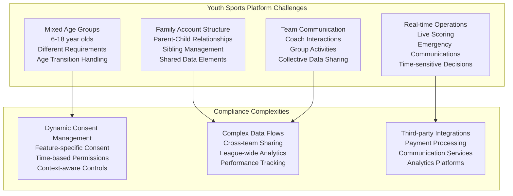

### 1.3 Regulatory Landscape

| Regulation | Jurisdiction | Age Threshold | Key Requirements |
|------------|--------------|---------------|------------------|
| **COPPA** | United States | Under 13 | Verifiable parental consent, data minimization |
| **California SB-568** | California | Under 18 | Privacy by design, data deletion rights |
| **UK Age Appropriate Design Code** | UK (applicable to US companies) | Under 18 | Privacy by default, risk assessments |
| **State Privacy Laws** | Various US states | Varies | Additional consent requirements, breach notification |

---

## 2. Age Verification System

### 2.1 Age Verification Architecture

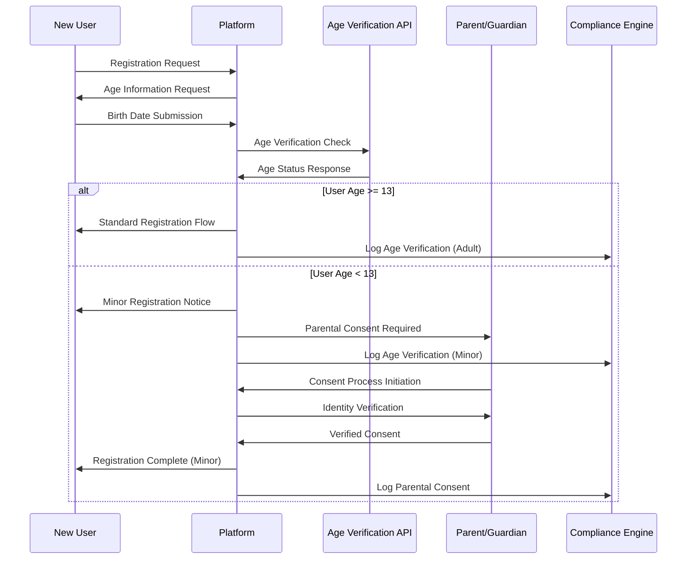

### 2.2 Age Verification Methods

#### 2.2.1 Primary Age Verification
- **Self-Declaration**: User provides birth date during registration
- **Validation Rules**: Date format validation, reasonableness checks
- **Age Calculation**: Real-time age calculation with timezone consideration
- **Audit Trail**: Complete logging of age verification attempts

#### 2.2.2 Enhanced Age Verification (When Required)
- **Parent/Guardian Verification**: Cross-reference with parent-provided information
- **School Registration Integration**: Verification through school district data
- **Birth Certificate Upload**: Secure document verification for disputed cases
- **Third-Party Age Verification Services**: Integration with specialized providers

### 2.3 Age Status Management

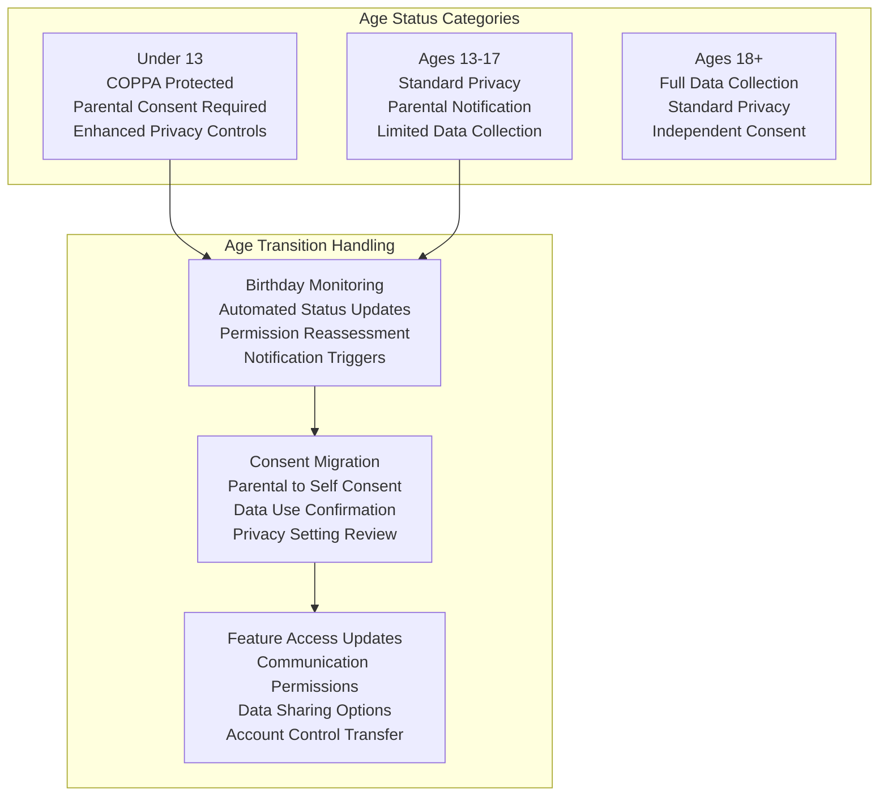

---

## 3. Parental Consent Framework

### 3.1 Verifiable Parental Consent Methods

#### 3.1.1 COPPA-Compliant Consent Mechanisms

**Tier 1 - Standard Consent Methods:**
1. **Email Plus Confirmation**
   - Email sent to parent-provided address
   - Detailed consent form with privacy notice
   - Explicit consent confirmation required
   - Follow-up verification within 24-48 hours

2. **Digital Signature**
   - Legally binding electronic signature
   - Identity verification through email/SMS
   - Consent form with comprehensive disclosures
   - Audit trail of consent process

**Tier 2 - Enhanced Verification Methods:**
1. **Credit Card Verification**
   - Small authorization charge ($0.30-$1.00)
   - Immediate reversal after verification
   - Proves cardholder access and adult status
   - Used for high-risk data collection scenarios

2. **Government ID Verification**
   - Upload of government-issued photo ID
   - Automated ID verification services
   - Face matching technology
   - Used for sensitive data collection requests

3. **Video Conference Consent**
   - Live video call with platform representative
   - Identity verification and consent explanation
   - Recorded consent session (with permission)
   - Used for complex consent scenarios

### 3.2 Consent Management System

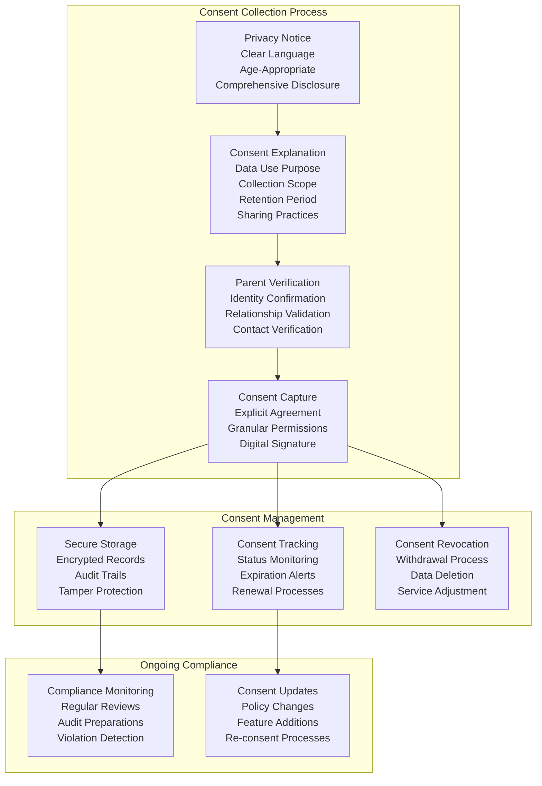

### 3.3 Granular Consent Categories

| Data Category | Description | Default Status | Parent Control |
|---------------|-------------|----------------|----------------|
| **Identity Information** | Name, birth date, gender | Required for service | Cannot opt-out |
| **Contact Information** | Email, phone, emergency contacts | Required for service | Cannot opt-out |
| **Participation Data** | Team membership, schedules, attendance | Required for service | Cannot opt-out |
| **Performance Statistics** | Game stats, skill assessments | Optional | Can opt-out |
| **Photos/Videos** | Team photos, game recordings | Optional | Granular control |
| **Communication Records** | Messages, notifications | Required with restrictions | Content control |
| **Location Data** | GPS, venue check-ins | Optional | Can opt-out |
| **Analytics Data** | Usage patterns, behavior tracking | Optional | Can opt-out |
| **Marketing Communications** | Promotional emails, surveys | Optional | Can opt-out |
| **Third-Party Sharing** | Partner integrations, analytics | Optional | Granular control |

---

## 4. Data Collection & Minimization

### 4.1 Data Minimization Principles

#### 4.1.1 Collection Limitation
**Implementation Rules:**
- Collect only data necessary for specific, legitimate purposes
- No speculative data collection for future features
- Regular review of data collection practices
- Automated data collection audits

**Technical Controls:**
```javascript
// Example: Data Collection Validation
class DataCollectionValidator {
    static validateChildDataCollection(childAge, dataType, purpose) {
        // Check if child is under 13
        if (childAge < 13) {
            // Verify parental consent exists
            if (!this.hasParentalConsent(childId, dataType)) {
                throw new COPPAViolationError('No parental consent for data collection');
            }
            
            // Verify data is necessary for stated purpose
            if (!this.isDataNecessaryForPurpose(dataType, purpose)) {
                throw new DataMinimizationError('Data not necessary for stated purpose');
            }
            
            // Check collection limits
            if (this.exceedsCollectionLimits(childId, dataType)) {
                throw new ExcessiveCollectionError('Data collection exceeds defined limits');
            }
        }
        
        return true;
    }
}
```

#### 4.1.2 Purpose Limitation
**Data Use Restrictions:**
- Personal information used only for disclosed purposes
- No secondary use without additional consent
- Clear purpose statements in privacy notices
- Purpose-specific consent tracking

#### 4.1.3 Retention Limitation
**Automated Data Lifecycle Management:**
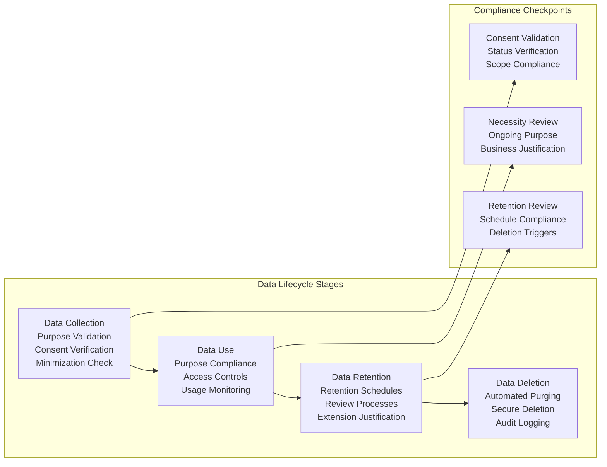

### 4.2 Data Categories & Controls

#### 4.2.1 Required Data (Service Essential)
**Data Elements:**
- Player name and age
- Parent/guardian contact information
- Emergency contact details
- Team assignment information
- Basic participation records

**Collection Controls:**
- Minimal necessary information only
- Clear necessity justification
- Enhanced consent process
- Restricted access controls

#### 4.2.2 Optional Data (Service Enhancement)
**Data Elements:**
- Detailed performance statistics
- Photos and videos
- Social preferences
- Extended contact information
- Location tracking data

**Collection Controls:**
- Granular opt-in consent
- Easy opt-out mechanisms
- Regular consent renewal
- Parent dashboard control

### 4.3 Data Quality & Accuracy

**Data Quality Controls:**
- Regular data accuracy reviews
- Parent verification processes
- Self-correction mechanisms
- Data validation rules
- Automated inconsistency detection

---

## 5. Parental Rights & Controls

### 5.1 Comprehensive Parental Dashboard

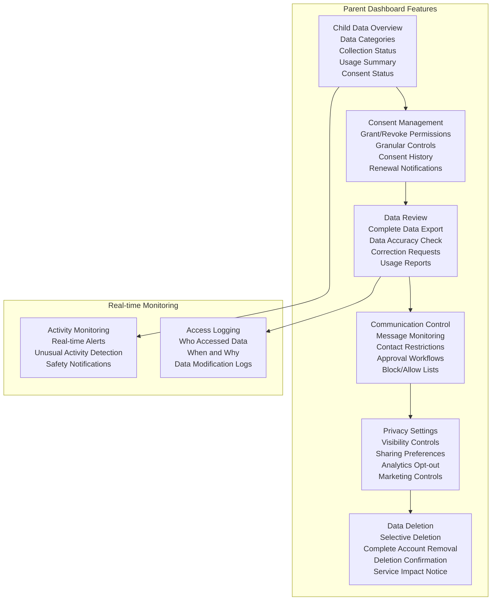

### 5.2 Parental Rights Implementation

#### 5.2.1 Right to Access
**Implementation Details:**
- Complete data export in machine-readable format
- Human-readable data summary
- Access logs and usage history
- Data sharing records
- Real-time access through parent dashboard

**Technical Implementation:**
```javascript
// Parent Data Access API
async function generateChildDataExport(parentId, childId) {
    // Verify parent-child relationship
    await verifyParentChildRelationship(parentId, childId);
    
    // Collect all child data across systems
    const childData = {
        personalInfo: await getPersonalInformation(childId),
        participationData: await getParticipationData(childId),
        communicationRecords: await getCommunicationRecords(childId),
        performanceStats: await getPerformanceStats(childId),
        photoVideoData: await getMediaData(childId),
        accessLogs: await getAccessLogs(childId),
        consentHistory: await getConsentHistory(childId)
    };
    
    // Generate secure download link
    const exportFile = await generateSecureExport(childData);
    
    // Log access request
    await auditLog('PARENT_DATA_ACCESS', parentId, childId);
    
    return exportFile;
}
```

#### 5.2.2 Right to Deletion
**Deletion Scope Options:**
1. **Selective Deletion**: Remove specific data categories
2. **Account Suspension**: Temporarily disable account
3. **Complete Deletion**: Full account and data removal
4. **Data Anonymization**: Remove identifying information while preserving aggregated data

**Deletion Process:**
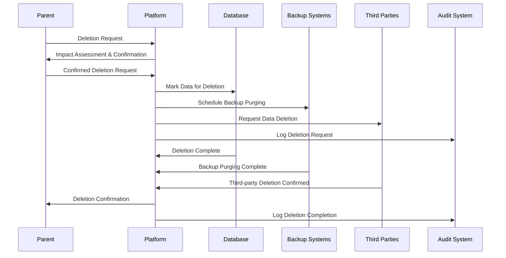

#### 5.2.3 Right to Correction
**Data Correction Process:**
- Parent-initiated correction requests
- Automated validation of corrections
- Audit trail of all corrections
- Impact assessment for corrections
- Notification to affected parties

---

## 6. Technical Implementation

### 6.1 COPPA-Compliant System Architecture

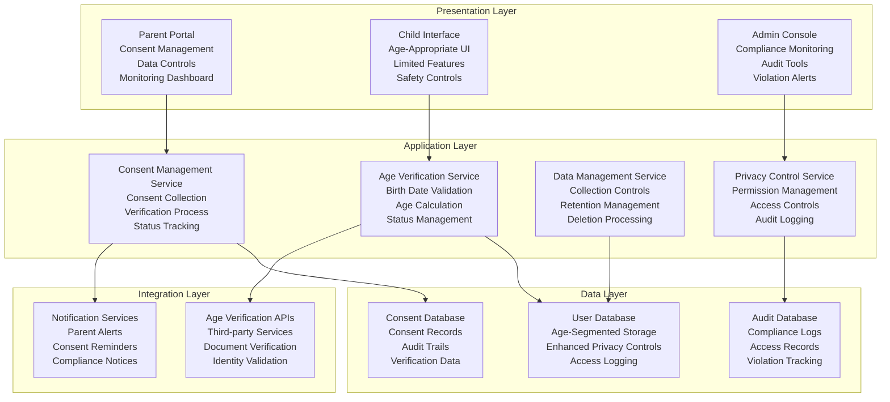

### 6.2 Data Segmentation Strategy

#### 6.2.1 Age-Based Data Segmentation
**Database Architecture:**
```sql
-- Example: Age-based table partitioning
CREATE TABLE user_profiles_under13 (
    user_id UUID PRIMARY KEY,
    parent_consent_id UUID NOT NULL REFERENCES parental_consents(id),
    encrypted_name TEXT NOT NULL,
    encrypted_birthdate TEXT NOT NULL,
    created_at TIMESTAMP WITH TIME ZONE DEFAULT NOW(),
    updated_at TIMESTAMP WITH TIME ZONE DEFAULT NOW(),
    -- Enhanced audit fields for COPPA
    coppa_consent_version INTEGER NOT NULL,
    coppa_consent_date TIMESTAMP WITH TIME ZONE NOT NULL,
    parental_review_date TIMESTAMP WITH TIME ZONE,
    data_retention_date TIMESTAMP WITH TIME ZONE NOT NULL
);

CREATE TABLE user_profiles_13_plus (
    user_id UUID PRIMARY KEY,
    name TEXT NOT NULL,
    birthdate DATE NOT NULL,
    created_at TIMESTAMP WITH TIME ZONE DEFAULT NOW(),
    updated_at TIMESTAMP WITH TIME ZONE DEFAULT NOW(),
    -- Standard privacy controls
    privacy_consent_date TIMESTAMP WITH TIME ZONE,
    marketing_opt_in BOOLEAN DEFAULT FALSE
);
```

#### 6.2.2 Access Control Implementation
**Role-Based Access Control for COPPA:**
```javascript
// COPPA-aware access control
class COPPAAccessControl {
    static async checkDataAccess(userId, requestingUserId, dataType) {
        const user = await getUserById(userId);
        
        if (user.age < 13) {
            // Enhanced controls for minors
            return this.checkMinorDataAccess(userId, requestingUserId, dataType);
        } else {
            // Standard access controls
            return this.checkStandardDataAccess(userId, requestingUserId, dataType);
        }
    }
    
    static async checkMinorDataAccess(childId, requestingUserId, dataType) {
        // Check if requesting user is parent/guardian
        const isParent = await this.isParentOf(requestingUserId, childId);
        if (isParent) {
            return { allowed: true, reason: 'Parental access' };
        }
        
        // Check if requesting user has specific consent for data type
        const hasConsent = await this.hasSpecificConsent(childId, requestingUserId, dataType);
        if (!hasConsent) {
            return { allowed: false, reason: 'No parental consent for data type' };
        }
        
        // Check if access is within scope of consent
        const consentScope = await this.getConsentScope(childId, dataType);
        const accessPurpose = this.getAccessPurpose(requestingUserId, dataType);
        
        if (!this.isWithinConsentScope(consentScope, accessPurpose)) {
            return { allowed: false, reason: 'Access outside consent scope' };
        }
        
        // Log access for audit
        await this.logMinorDataAccess(childId, requestingUserId, dataType);
        
        return { allowed: true, reason: 'Consent-based access' };
    }
}
```

### 6.3 Encryption & Data Protection

#### 6.3.1 Enhanced Encryption for Minor Data
**Field-Level Encryption:**
- AES-256 encryption for all PII of users under 13
- Separate encryption keys for different data categories
- Key rotation policies aligned with data retention schedules
- Hardware security module (HSM) for key management

**Implementation Example:**
```javascript
// Enhanced encryption for minor data
class MinorDataEncryption {
    static async encryptMinorData(childId, data, dataCategory) {
        // Get category-specific encryption key
        const encryptionKey = await this.getEncryptionKey(dataCategory);
        
        // Add COPPA-specific metadata
        const encryptedData = {
            ciphertext: await encrypt(data, encryptionKey),
            childId: childId,
            dataCategory: dataCategory,
            encryptionTimestamp: new Date().toISOString(),
            coppaProtected: true,
            parentalConsentId: await this.getConsentId(childId, dataCategory)
        };
        
        return encryptedData;
    }
    
    static async decryptMinorData(encryptedData, requestingUserId) {
        // Verify access permissions
        const accessCheck = await COPPAAccessControl.checkDataAccess(
            encryptedData.childId, 
            requestingUserId, 
            encryptedData.dataCategory
        );
        
        if (!accessCheck.allowed) {
            throw new UnauthorizedAccessError(accessCheck.reason);
        }
        
        // Decrypt data
        const encryptionKey = await this.getEncryptionKey(encryptedData.dataCategory);
        const decryptedData = await decrypt(encryptedData.ciphertext, encryptionKey);
        
        // Log decryption access
        await this.logDataDecryption(encryptedData.childId, requestingUserId);
        
        return decryptedData;
    }
}
```

---

## 7. Compliance Monitoring

### 7.1 Automated Compliance Monitoring

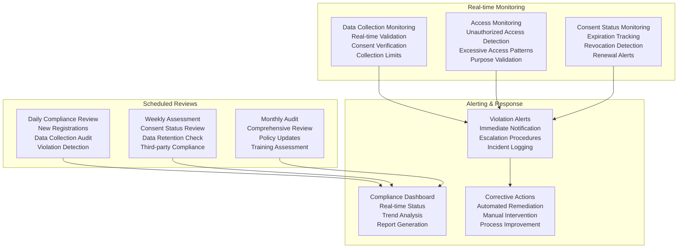

### 7.2 Compliance Metrics & KPIs

| Metric Category | Key Performance Indicator | Target Value | Monitoring Frequency |
|-----------------|---------------------------|--------------|-------------------|
| **Age Verification** | Age verification accuracy rate | >99.5% | Daily |
| | False positive rate (adult marked as child) | <0.1% | Weekly |
| | Age verification completion time | <2 minutes | Real-time |
| **Parental Consent** | Consent collection success rate | >95% | Daily |
| | Consent verification time | <24 hours | Real-time |
| | Consent renewal compliance | >98% | Monthly |
| **Data Protection** | Unauthorized access attempts | 0 successful | Real-time |
| | Data retention compliance | 100% | Weekly |
| | Data deletion completion rate | 100% within SLA | Daily |
| **Privacy Controls** | Parent dashboard utilization | >70% | Monthly |
| | Privacy setting updates | Tracked | Weekly |
| | Data export requests fulfillment | 100% within 30 days | Daily |

### 7.3 Compliance Reporting

#### 7.3.1 Automated Compliance Reports
**Daily Reports:**
- New minor registrations and consent status
- Data collection violations and remediation
- Access anomalies and investigations
- System health and security status

**Weekly Reports:**
- Consent renewal and expiration summary
- Data retention and deletion activities
- Third-party compliance verification
- Parent engagement and feedback

**Monthly Reports:**
- Comprehensive compliance assessment
- Trend analysis and risk identification
- Policy update recommendations
- Training effectiveness evaluation

**Quarterly Reports:**
- Executive compliance summary
- Regulatory landscape updates
- Audit preparation materials
- Strategic compliance planning

---

## 8. Incident Response & Violations

### 8.1 COPPA Violation Response Plan

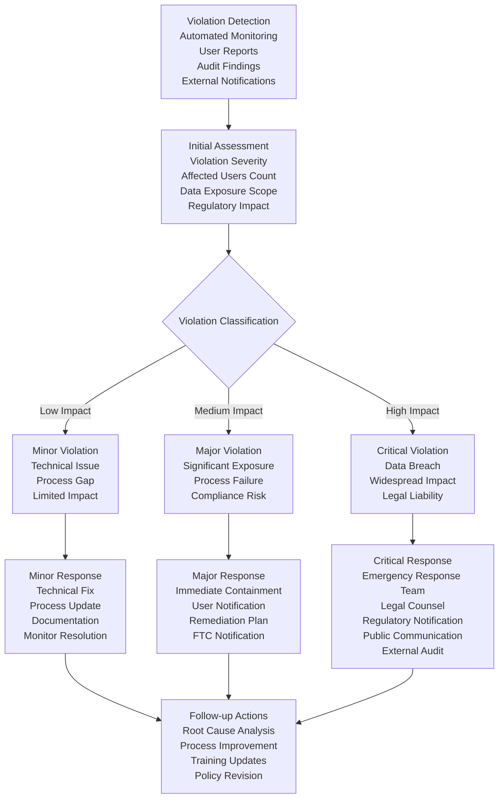

### 8.2 Violation Types & Response Procedures

#### 8.2.1 Data Collection Violations
**Common Violations:**
- Collecting data without proper consent
- Exceeding data collection scope
- Collecting unnecessary information
- Missing age verification

**Response Procedures:**
1. **Immediate Actions:**
   - Stop unauthorized data collection
   - Isolate affected data
   - Notify compliance team
   - Document violation details

2. **Assessment Actions:**
   - Determine violation scope
   - Identify affected children
   - Assess legal implications
   - Evaluate system impacts

3. **Remediation Actions:**
   - Obtain proper parental consent
   - Delete unauthorized data
   - Implement technical controls
   - Update collection procedures

#### 8.2.2 Consent Violations
**Common Violations:**
- Processing data without consent
- Exceeding consent scope
- Invalid consent collection
- Consent tracking failures

**Response Procedures:**
1. **Immediate Containment:**
   - Suspend data processing
   - Preserve audit evidence
   - Notify affected parents
   - Document consent status

2. **Remediation Process:**
   - Re-obtain valid consent
   - Update consent records
   - Implement consent controls
   - Enhance verification procedures

### 8.3 Regulatory Notification Requirements

#### 8.3.1 FTC Notification Timeline
**Notification Requirements:**
- **Discovery to Assessment**: Within 1 hour
- **Assessment to Classification**: Within 4 hours
- **Classification to Initial Response**: Within 8 hours
- **Formal FTC Notification**: Within 72 hours (if required)
- **Follow-up Report**: Within 30 days

#### 8.3.2 Notification Template
```
Subject: COPPA Compliance Incident Report - [Incident ID]

Date: [Date]
Time: [Time]
Platform: Basketball League Management Platform
Contact: [Security Contact Information]

INCIDENT SUMMARY:
- Incident Type: [Data Collection/Consent/Access/Other]
- Discovery Method: [Automated/Manual/Report]
- Affected Users: [Number of children affected]
- Data Types: [Categories of data involved]

IMMEDIATE ACTIONS TAKEN:
- [List of containment measures]
- [Data protection steps]
- [User notifications]

PRELIMINARY ASSESSMENT:
- Root Cause: [Initial assessment]
- System Impact: [Scope of impact]
- Compliance Impact: [Regulatory implications]

REMEDIATION PLAN:
- [Immediate remediation steps]
- [Long-term improvements]
- [Timeline for completion]

CONTACT INFORMATION:
- Primary Contact: [Name, Title, Phone, Email]
- Legal Counsel: [Name, Firm, Phone, Email]
- Technical Lead: [Name, Title, Phone, Email]
```

---

## 9. Third-Party Compliance

### 9.1 Third-Party Risk Assessment

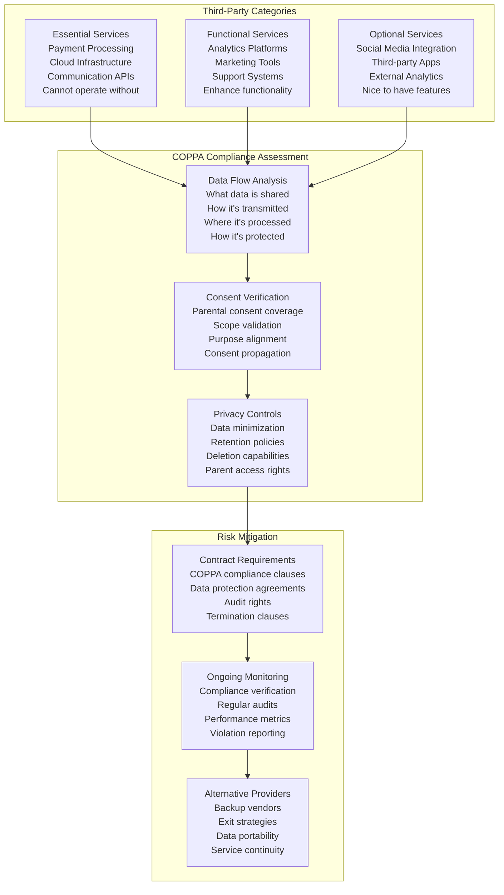

### 9.2 Third-Party Integration Controls

#### 9.2.1 Data Sharing Agreements
**Required Contract Clauses:**
1. **COPPA Compliance Certification**
2. **Data Minimization Requirements**
3. **Parental Consent Verification**
4. **Data Retention and Deletion**
5. **Security and Encryption Standards**
6. **Audit and Monitoring Rights**
7. **Breach Notification Requirements**
8. **Termination and Data Return**

#### 9.2.2 Technical Integration Controls
```javascript
// Third-party data sharing validation
class ThirdPartyDataSharing {
    static async validateDataSharing(childId, thirdPartyId, dataTypes, purpose) {
        // Verify child age and COPPA protection status
        const child = await getChildById(childId);
        if (child.age < 13) {
            return this.validateCOPPADataSharing(childId, thirdPartyId, dataTypes, purpose);
        }
        
        return this.validateStandardDataSharing(childId, thirdPartyId, dataTypes, purpose);
    }
    
    static async validateCOPPADataSharing(childId, thirdPartyId, dataTypes, purpose) {
        // Check third-party COPPA compliance status
        const thirdParty = await getThirdPartyById(thirdPartyId);
        if (!thirdParty.coppaCompliant) {
            throw new ComplianceError('Third-party not COPPA compliant');
        }
        
        // Verify specific parental consent for third-party sharing
        const hasConsent = await this.hasThirdPartyConsent(childId, thirdPartyId, dataTypes);
        if (!hasConsent) {
            throw new ConsentError('No parental consent for third-party data sharing');
        }
        
        // Validate data minimization
        const necessaryData = await this.getMinimumNecessaryData(purpose);
        const requestedData = new Set(dataTypes);
        const unnecessaryData = [...requestedData].filter(type => !necessaryData.has(type));
        
        if (unnecessaryData.length > 0) {
            throw new DataMinimizationError(`Unnecessary data types: ${unnecessaryData.join(', ')}`);
        }
        
        // Log third-party data sharing
        await this.auditThirdPartySharing(childId, thirdPartyId, dataTypes, purpose);
        
        return {
            approved: true,
            conditions: thirdParty.dataUseConditions,
            auditTrail: await this.getAuditTrail(childId, thirdPartyId)
        };
    }
}
```

---

## 10. Audit & Documentation

### 10.1 Documentation Requirements

#### 10.1.1 Policy Documentation
**Required Documents:**
1. **COPPA Privacy Policy** - Public-facing privacy notice
2. **Data Collection Procedures** - Internal data handling procedures
3. **Parental Consent Processes** - Consent collection and verification
4. **Age Verification Procedures** - Age determination methods
5. **Data Retention Schedules** - Retention and deletion timelines
6. **Third-Party Agreements** - Vendor compliance requirements
7. **Incident Response Procedures** - COPPA violation response plans
8. **Training Materials** - Staff COPPA compliance training

#### 10.1.2 Audit Trail Requirements
**Comprehensive Logging:**
- All data collection events with timestamp and purpose
- Parental consent transactions with verification details
- Age verification attempts and results
- Data access events with user identification
- Data modification and deletion activities
- Third-party data sharing transactions
- Policy updates and system changes
- Training completion and certification records

### 10.2 Audit Preparation

#### 10.2.1 Internal Audit Schedule
**Monthly Audits:**
- Data collection compliance review
- Consent status verification
- Age verification accuracy check
- Access control effectiveness
- Third-party compliance verification

**Quarterly Audits:**
- Comprehensive COPPA compliance assessment
- Policy and procedure review
- Training effectiveness evaluation
- Risk assessment and mitigation review
- Documentation completeness check

**Annual Audits:**
- Full compliance certification audit
- Third-party security assessments
- Regulatory landscape review
- Strategic compliance planning
- External audit preparation

#### 10.2.2 Regulatory Audit Readiness
**Audit Documentation Package:**
1. **Compliance Overview** - Executive summary of COPPA compliance
2. **Policy Documentation** - All current policies and procedures
3. **Technical Implementation** - System architecture and controls
4. **Audit Logs** - Comprehensive activity and compliance logs
5. **Training Records** - Staff training and certification documentation
6. **Incident Reports** - Any COPPA-related incidents and responses
7. **Third-Party Assessments** - Vendor compliance evaluations
8. **Continuous Improvement** - Compliance enhancement initiatives

---

## Conclusion

This COPPA Compliance Framework provides a comprehensive approach to protecting children's privacy in the youth sports platform environment. The framework addresses the unique challenges of mixed-age user bases, family account structures, and real-time sports operations while maintaining strict compliance with federal and state privacy regulations.

Key success factors include robust age verification, granular parental consent management, comprehensive data protection measures, and continuous compliance monitoring. The framework is designed to adapt to evolving regulatory requirements while maintaining the functionality necessary for effective youth sports league management.

Regular review and updates of this framework are essential to maintain compliance as regulations evolve and new privacy challenges emerge in the digital sports platform landscape.

---

**Document Control**
- **Next Review Date:** November 8, 2025
- **Review Frequency:** Quarterly or upon regulatory changes
- **Owner:** Youth Security Architect
- **Approvers:** Legal Counsel, Privacy Officer, CISO