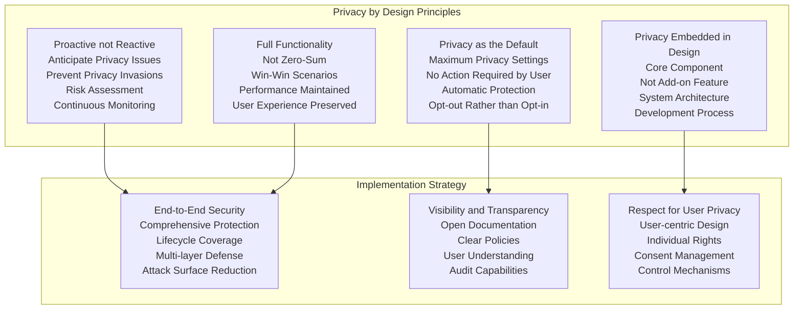
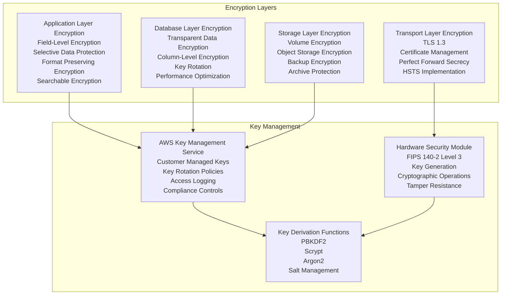
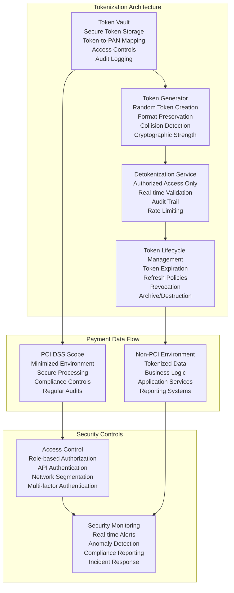
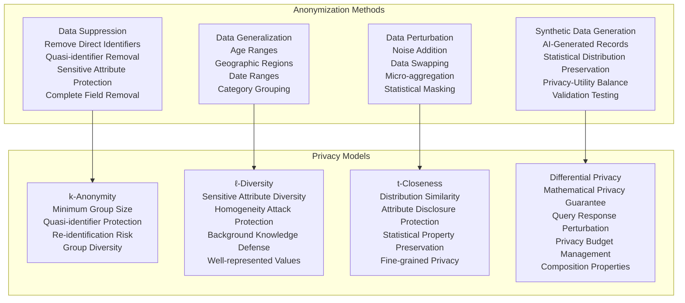
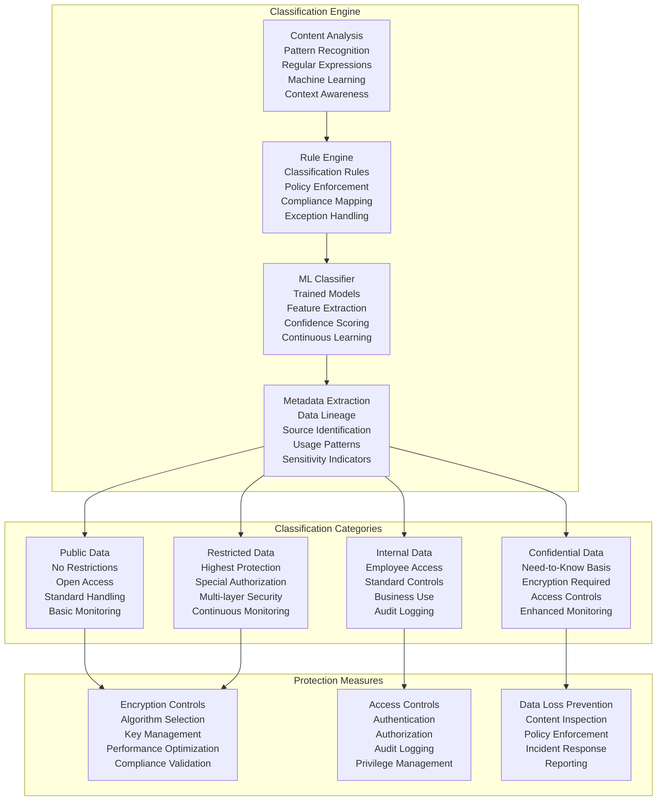
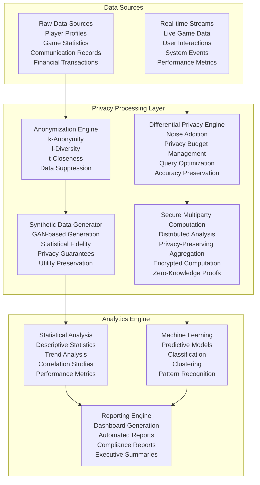
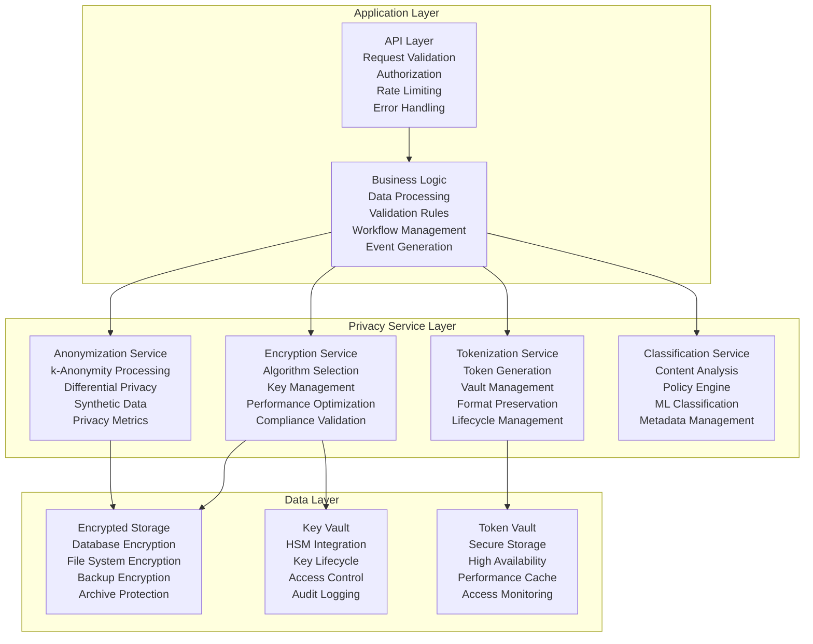
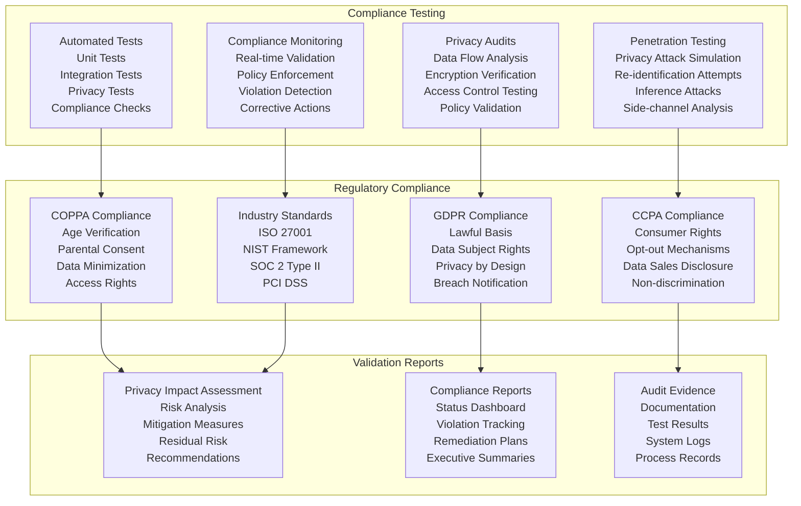
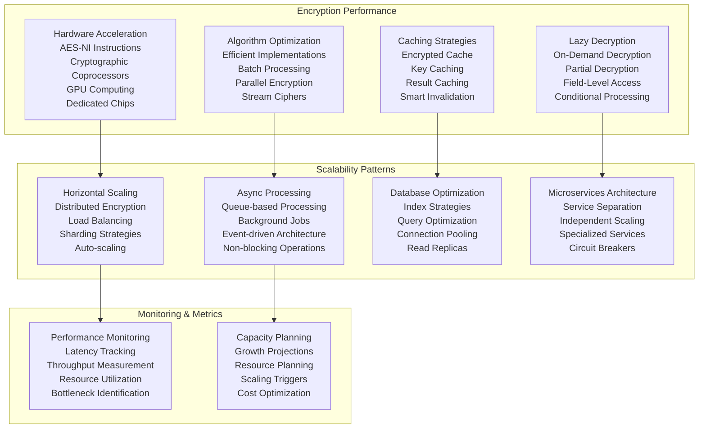

# Data Privacy Patterns
## Basketball League Management Platform - Phase 2

**Document ID:** DATA-PRIVACY-001  
**Version:** 2.0  
**Date:** August 8, 2025  
**Author:** Youth Security Architect  
**Status:** Phase 2 Privacy Implementation  
**Classification:** Confidential - Privacy Engineering  

---

## Executive Summary

This Data Privacy Patterns document defines comprehensive encryption, tokenization, and anonymization strategies for the Basketball League Management Platform, with specialized focus on protecting minor athlete data and ensuring privacy-by-design principles. The document establishes technical patterns and implementation guidelines for safeguarding sensitive information while maintaining platform functionality and regulatory compliance.

### Key Privacy Objectives
- **Encryption Standards**: Military-grade encryption for all sensitive data
- **Tokenization Framework**: PCI DSS compliant payment data protection
- **Anonymization Patterns**: Privacy-preserving analytics and reporting
- **Data Minimization**: Collect and retain only necessary information
- **Privacy by Design**: Built-in privacy controls throughout the system

---

## Table of Contents

1. [Privacy Engineering Principles](#1-privacy-engineering-principles)
2. [Encryption Architecture](#2-encryption-architecture)
3. [Tokenization Framework](#3-tokenization-framework)
4. [Anonymization & Pseudonymization](#4-anonymization--pseudonymization)
5. [Data Classification & Handling](#5-data-classification--handling)
6. [Privacy-Preserving Analytics](#6-privacy-preserving-analytics)
7. [Key Management System](#7-key-management-system)
8. [Technical Implementation Patterns](#8-technical-implementation-patterns)
9. [Compliance & Validation](#9-compliance--validation)
10. [Performance & Scalability](#10-performance--scalability)

---

## 1. Privacy Engineering Principles

### 1.1 Privacy by Design Framework

Following Ann Cavoukian's Privacy by Design principles adapted for youth sports platforms:



### 1.2 Youth-Specific Privacy Considerations

#### 1.2.1 Enhanced Protection for Minors
**Special Protections:**
- Higher encryption standards for users under 18
- Additional access controls for minor data
- Enhanced audit logging for child-related activities
- Parental consent integration for data processing
- Age-appropriate privacy notices and controls

#### 1.2.2 Privacy Risk Assessment Matrix

| Data Type | Age Group | Risk Level | Protection Requirements | Compliance Standards |
|-----------|-----------|------------|------------------------|---------------------|
| **Personal Identifiers** | Under 13 | CRITICAL | Field-level encryption, tokenization | COPPA, state laws |
| **Personal Identifiers** | 13-17 | HIGH | Standard encryption, access controls | State privacy laws |
| **Personal Identifiers** | 18+ | MEDIUM | Standard encryption | CCPA, GDPR |
| **Biometric Data** | Under 13 | CRITICAL | Prohibited collection | COPPA |
| **Biometric Data** | 13-17 | CRITICAL | Enhanced encryption, consent | State biometric laws |
| **Financial Data** | All ages | CRITICAL | Tokenization, PCI DSS | PCI DSS, financial regulations |
| **Communication Data** | Under 13 | HIGH | Encryption, monitoring | COPPA, SafeSport |
| **Performance Data** | All ages | MEDIUM | Standard encryption | Sports privacy guidelines |

---

## 2. Encryption Architecture

### 2.1 Multi-Layer Encryption Strategy



### 2.2 Field-Level Encryption Implementation

#### 2.2.1 Sensitive Data Field Encryption
**Encryption Mapping:**
```javascript
// Field-level encryption configuration
const encryptionConfig = {
    // Critical PII - AES-256-GCM with unique keys
    criticalPII: {
        fields: ['ssn', 'birthDate', 'homeAddress', 'emergencyContact'],
        algorithm: 'AES-256-GCM',
        keyType: 'UNIQUE_PER_RECORD',
        keyRotation: '90_DAYS'
    },
    
    // Standard PII - AES-256-GCM with shared tenant key
    standardPII: {
        fields: ['firstName', 'lastName', 'email', 'phoneNumber'],
        algorithm: 'AES-256-GCM',
        keyType: 'TENANT_SHARED',
        keyRotation: '180_DAYS'
    },
    
    // Financial Data - Format Preserving Encryption
    financialData: {
        fields: ['creditCardNumber', 'bankAccountNumber', 'routingNumber'],
        algorithm: 'FPE-AES-256',
        keyType: 'PCI_COMPLIANT',
        keyRotation: '30_DAYS'
    },
    
    // Communication Data - Searchable Encryption
    communicationData: {
        fields: ['messageContent', 'subject', 'attachmentContent'],
        algorithm: 'SEARCHABLE_AES-256',
        keyType: 'COMMUNICATION_KEY',
        keyRotation: '120_DAYS'
    }
};

// Encryption service implementation
class FieldLevelEncryption {
    constructor(kmsClient, configManager) {
        this.kmsClient = kmsClient;
        this.configManager = configManager;
    }
    
    async encryptField(fieldName, value, recordId, tenantId) {
        const config = this.getFieldEncryptionConfig(fieldName);
        const encryptionKey = await this.getEncryptionKey(
            config.keyType, 
            recordId, 
            tenantId
        );
        
        switch (config.algorithm) {
            case 'AES-256-GCM':
                return await this.encryptAESGCM(value, encryptionKey);
            case 'FPE-AES-256':
                return await this.encryptFPE(value, encryptionKey);
            case 'SEARCHABLE_AES-256':
                return await this.encryptSearchable(value, encryptionKey);
            default:
                throw new Error(`Unsupported algorithm: ${config.algorithm}`);
        }
    }
    
    async decryptField(fieldName, encryptedValue, recordId, tenantId) {
        const config = this.getFieldEncryptionConfig(fieldName);
        const encryptionKey = await this.getEncryptionKey(
            config.keyType, 
            recordId, 
            tenantId
        );
        
        // Verify access permissions
        await this.verifyDecryptionAccess(fieldName, recordId, tenantId);
        
        // Decrypt based on algorithm
        const decryptedValue = await this.performDecryption(
            config.algorithm, 
            encryptedValue, 
            encryptionKey
        );
        
        // Audit decryption access
        await this.auditDecryptionAccess(fieldName, recordId, tenantId);
        
        return decryptedValue;
    }
}
```

### 2.3 Database Encryption Strategy

#### 2.3.1 Transparent Data Encryption (TDE)
**Implementation:**
- AWS RDS encryption at rest using customer-managed KMS keys
- Automatic encryption for all database files, logs, and backups
- Key rotation policies aligned with compliance requirements
- Performance optimization through encryption acceleration

#### 2.3.2 Column-Level Encryption for Sensitive Fields
**Database Schema Example:**
```sql
-- User table with encrypted sensitive fields
CREATE TABLE users (
    id UUID PRIMARY KEY,
    username VARCHAR(255) NOT NULL,
    -- Encrypted fields with specific algorithms
    encrypted_first_name BYTEA, -- AES-256-GCM encrypted
    encrypted_last_name BYTEA,  -- AES-256-GCM encrypted
    encrypted_email BYTEA,      -- AES-256-GCM encrypted
    encrypted_phone BYTEA,      -- AES-256-GCM encrypted
    encrypted_ssn BYTEA,        -- AES-256-GCM with unique key
    encrypted_birth_date BYTEA, -- AES-256-GCM with unique key
    -- Metadata for encryption
    encryption_key_id VARCHAR(255) NOT NULL,
    encryption_algorithm VARCHAR(50) NOT NULL,
    created_at TIMESTAMP WITH TIME ZONE DEFAULT NOW(),
    updated_at TIMESTAMP WITH TIME ZONE DEFAULT NOW()
);

-- Minor-specific table with enhanced encryption
CREATE TABLE minor_profiles (
    id UUID PRIMARY KEY,
    user_id UUID REFERENCES users(id),
    parent_id UUID REFERENCES users(id),
    -- Enhanced encryption for COPPA compliance
    encrypted_medical_info BYTEA,     -- Unique key per record
    encrypted_emergency_contact BYTEA, -- Unique key per record
    encrypted_school_info BYTEA,      -- Unique key per record
    -- Parental consent tracking
    coppa_consent_version INTEGER,
    coppa_consent_date TIMESTAMP WITH TIME ZONE,
    -- Enhanced audit fields
    audit_encryption_key_id VARCHAR(255),
    audit_last_access TIMESTAMP WITH TIME ZONE,
    audit_access_count INTEGER DEFAULT 0
);
```

---

## 3. Tokenization Framework

### 3.1 PCI DSS Compliant Tokenization



### 3.2 Tokenization Implementation

#### 3.2.1 Format-Preserving Tokenization
**Implementation Details:**
```javascript
// Tokenization service for payment data
class PaymentTokenization {
    constructor(tokenVault, cryptoProvider) {
        this.tokenVault = tokenVault;
        this.cryptoProvider = cryptoProvider;
    }
    
    async tokenizePaymentData(paymentData, tokenType = 'RANDOM') {
        const validationResult = this.validatePaymentData(paymentData);
        if (!validationResult.valid) {
            throw new ValidationError(validationResult.errors);
        }
        
        switch (tokenType) {
            case 'RANDOM':
                return await this.generateRandomToken(paymentData);
            case 'FORMAT_PRESERVING':
                return await this.generateFPEToken(paymentData);
            case 'CRYPTOGRAPHIC':
                return await this.generateCryptoToken(paymentData);
            default:
                throw new Error(`Unsupported token type: ${tokenType}`);
        }
    }
    
    async generateRandomToken(paymentData) {
        // Generate cryptographically secure random token
        const token = this.cryptoProvider.generateSecureRandom(16);
        
        // Store token-to-data mapping in secure vault
        const tokenRecord = {
            token: token,
            originalData: await this.encryptForStorage(paymentData.cardNumber),
            tokenType: 'RANDOM',
            createdAt: new Date().toISOString(),
            expiresAt: this.calculateExpiration(paymentData.expirationDate),
            accessCount: 0,
            lastAccessed: null
        };
        
        await this.tokenVault.store(token, tokenRecord);
        
        // Return tokenized payment data
        return {
            ...paymentData,
            cardNumber: token,
            tokenized: true,
            tokenType: 'RANDOM'
        };
    }
    
    async detokenizePaymentData(tokenizedData, requestContext) {
        // Verify authorization for detokenization
        await this.verifyDetokenizationAccess(requestContext);
        
        // Retrieve token record
        const tokenRecord = await this.tokenVault.retrieve(tokenizedData.cardNumber);
        if (!tokenRecord) {
            throw new TokenNotFoundError('Invalid token');
        }
        
        // Check token expiration
        if (new Date() > new Date(tokenRecord.expiresAt)) {
            throw new TokenExpiredError('Token has expired');
        }
        
        // Decrypt original data
        const originalData = await this.decryptFromStorage(tokenRecord.originalData);
        
        // Update access tracking
        await this.updateAccessTracking(tokenizedData.cardNumber);
        
        // Audit detokenization
        await this.auditDetokenization(tokenizedData.cardNumber, requestContext);
        
        return {
            ...tokenizedData,
            cardNumber: originalData,
            tokenized: false
        };
    }
}
```

### 3.3 Non-Payment Data Tokenization

#### 3.3.1 PII Tokenization for Analytics
**Use Cases:**
- Anonymous performance analytics
- Compliance reporting without PII exposure
- Third-party integrations with privacy protection
- Research and statistical analysis

**Implementation:**
```javascript
// PII tokenization for privacy-preserving analytics
class PIITokenization {
    async tokenizeForAnalytics(userData) {
        return {
            // Replace actual identifiers with tokens
            userId: await this.generateConsistentToken(userData.id),
            parentId: await this.generateConsistentToken(userData.parentId),
            teamId: await this.generateConsistentToken(userData.teamId),
            
            // Preserve analytical value while protecting privacy
            ageGroup: this.getAgeGroup(userData.age),
            location: this.getGeneralLocation(userData.address),
            
            // Non-identifying attributes remain
            skillLevel: userData.skillLevel,
            position: userData.position,
            
            // Tokenization metadata
            tokenized: true,
            tokenVersion: '2.0',
            createdAt: new Date().toISOString()
        };
    }
    
    async generateConsistentToken(identifier) {
        // Generate consistent token for same identifier
        const salt = await this.getSalt('analytics_tokenization');
        return this.cryptoProvider.hmacSHA256(identifier, salt);
    }
}
```

---

## 4. Anonymization & Pseudonymization

### 4.1 Anonymization Techniques



### 4.2 k-Anonymity Implementation

#### 4.2.1 Youth Sports k-Anonymity Requirements
**Configuration:**
```javascript
// k-Anonymity configuration for youth sports data
const kAnonymityConfig = {
    // Minimum group sizes by data sensitivity
    minGroupSizes: {
        generalAnalytics: 5,    // k=5 for general analytics
        performanceAnalytics: 10, // k=10 for performance data
        healthAnalytics: 20,    // k=20 for health-related data
        minorSpecific: 50       // k=50 for minor-specific analysis
    },
    
    // Quasi-identifiers for youth sports
    quasiIdentifiers: [
        'ageGroup',      // Age ranges instead of exact age
        'zipCode',       // Geographic region instead of exact zip
        'schoolDistrict', // District instead of specific school
        'skillLevel',    // Broad categories
        'yearsPlaying'   // Ranges instead of exact years
    ],
    
    // Sensitive attributes requiring protection
    sensitiveAttributes: [
        'performanceRating',
        'medicalConditions',
        'behavioralNotes',
        'parentIncome',
        'specialAccommodations'
    ],
    
    // Generalization hierarchies
    generalizationHierarchy: {
        age: [
            'exactAge',      // Level 0: Exact age
            'ageRange5',     // Level 1: 5-year ranges
            'ageRange10',    // Level 2: 10-year ranges
            'ageCategory'    // Level 3: Child/Teen/Adult
        ],
        location: [
            'zipCode',       // Level 0: Exact ZIP
            'zipCode3',      // Level 1: First 3 digits
            'city',          // Level 2: City
            'county',        // Level 3: County
            'state'          // Level 4: State
        ]
    }
};

// k-Anonymity implementation
class KAnonymityProcessor {
    async anonymizeDataset(dataset, kValue, sensitivityLevel) {
        const config = kAnonymityConfig;
        const targetK = config.minGroupSizes[sensitivityLevel] || kValue;
        
        // Step 1: Identify quasi-identifiers and sensitive attributes
        const quasiIds = this.identifyQuasiIdentifiers(dataset, config.quasiIdentifiers);
        const sensitiveAttrs = this.identifySensitiveAttributes(dataset, config.sensitiveAttributes);
        
        // Step 2: Create equivalence classes
        const equivalenceClasses = this.createEquivalenceClasses(dataset, quasiIds);
        
        // Step 3: Check k-anonymity compliance
        const complianceCheck = this.checkKAnonymity(equivalenceClasses, targetK);
        
        if (!complianceCheck.compliant) {
            // Step 4: Apply generalization to achieve k-anonymity
            const generalizedDataset = await this.applyGeneralization(
                dataset, 
                quasiIds, 
                config.generalizationHierarchy, 
                targetK
            );
            
            return {
                anonymizedData: generalizedDataset,
                kValue: targetK,
                generalizationLevel: complianceCheck.requiredGeneralization,
                informationLoss: this.calculateInformationLoss(dataset, generalizedDataset)
            };
        }
        
        return {
            anonymizedData: dataset,
            kValue: targetK,
            generalizationLevel: 0,
            informationLoss: 0
        };
    }
}
```

### 4.3 Differential Privacy for Analytics

#### 4.3.1 Privacy Budget Management
**Implementation:**
```javascript
// Differential Privacy implementation for sports analytics
class DifferentialPrivacy {
    constructor(privacyBudget = 1.0) {
        this.totalPrivacyBudget = privacyBudget;
        this.remainingBudget = privacyBudget;
        this.queryHistory = [];
    }
    
    async executePrivateQuery(query, epsilon) {
        // Check privacy budget availability
        if (epsilon > this.remainingBudget) {
            throw new PrivacyBudgetExceededError(
                `Insufficient privacy budget. Requested: ${epsilon}, Available: ${this.remainingBudget}`
            );
        }
        
        // Execute query and add calibrated noise
        const trueResult = await this.executeQuery(query);
        const noisyResult = this.addCalibratedNoise(trueResult, query.sensitivity, epsilon);
        
        // Update privacy budget
        this.remainingBudget -= epsilon;
        this.queryHistory.push({
            query: query,
            epsilon: epsilon,
            timestamp: new Date().toISOString(),
            result: noisyResult
        });
        
        return noisyResult;
    }
    
    addCalibratedNoise(trueResult, sensitivity, epsilon) {
        // Laplace mechanism for numerical queries
        const scale = sensitivity / epsilon;
        const noise = this.generateLaplaceNoise(0, scale);
        
        return trueResult + noise;
    }
    
    // Example: Private count query for youth sports analytics
    async getPrivatePlayerCount(filters, epsilon = 0.1) {
        const query = {
            type: 'COUNT',
            table: 'players',
            filters: filters,
            sensitivity: 1 // Adding/removing one player changes count by at most 1
        };
        
        return await this.executePrivateQuery(query, epsilon);
    }
    
    // Example: Private average query
    async getPrivateAveragePerformance(ageGroup, epsilon = 0.2) {
        const query = {
            type: 'AVERAGE',
            table: 'performance_metrics',
            filters: { ageGroup: ageGroup },
            sensitivity: this.calculateAverageSensitivity()
        };
        
        return await this.executePrivateQuery(query, epsilon);
    }
}
```

---

## 5. Data Classification & Handling

### 5.1 Automated Data Classification



### 5.2 Classification Implementation

#### 5.2.1 Automated Classification Rules
```javascript
// Data classification engine
class DataClassificationEngine {
    constructor() {
        this.classificationRules = this.loadClassificationRules();
        this.mlClassifier = new MLDataClassifier();
    }
    
    async classifyData(dataObject, context) {
        const classificationResults = [];
        
        // Apply rule-based classification
        const ruleBasedResults = await this.applyClassificationRules(dataObject, context);
        classificationResults.push(...ruleBasedResults);
        
        // Apply ML-based classification
        const mlResults = await this.mlClassifier.classify(dataObject, context);
        classificationResults.push(...mlResults);
        
        // Resolve conflicts and determine final classification
        const finalClassification = this.resolveClassificationConflicts(classificationResults);
        
        // Apply protection measures based on classification
        await this.applyProtectionMeasures(dataObject, finalClassification);
        
        return finalClassification;
    }
    
    loadClassificationRules() {
        return {
            // PII Detection Rules
            piiRules: [
                {
                    pattern: /\b\d{3}-\d{2}-\d{4}\b/,
                    type: 'SSN',
                    classification: 'RESTRICTED',
                    confidence: 0.95
                },
                {
                    pattern: /\b\d{4}[-\s]?\d{4}[-\s]?\d{4}[-\s]?\d{4}\b/,
                    type: 'CREDIT_CARD',
                    classification: 'RESTRICTED',
                    confidence: 0.90
                },
                {
                    pattern: /\b[A-Za-z0-9._%+-]+@[A-Za-z0-9.-]+\.[A-Z|a-z]{2,}\b/,
                    type: 'EMAIL',
                    classification: 'CONFIDENTIAL',
                    confidence: 0.85
                }
            ],
            
            // Youth-Specific Rules
            youthRules: [
                {
                    field: 'age',
                    condition: (age) => age < 13,
                    classification: 'RESTRICTED',
                    reason: 'COPPA_PROTECTED',
                    confidence: 1.0
                },
                {
                    field: 'medicalInformation',
                    condition: (value) => value && value.length > 0,
                    classification: 'RESTRICTED',
                    reason: 'MEDICAL_DATA',
                    confidence: 1.0
                },
                {
                    field: 'emergencyContact',
                    condition: (value) => value && value.length > 0,
                    classification: 'CONFIDENTIAL',
                    reason: 'EMERGENCY_INFO',
                    confidence: 0.9
                }
            ],
            
            // Financial Data Rules
            financialRules: [
                {
                    pattern: /payment|billing|financial|money|cost|fee/i,
                    classification: 'CONFIDENTIAL',
                    confidence: 0.8
                },
                {
                    field: 'paymentMethod',
                    classification: 'RESTRICTED',
                    confidence: 1.0
                }
            ]
        };
    }
}
```

---

## 6. Privacy-Preserving Analytics

### 6.1 Privacy-Preserving Analytics Architecture



### 6.2 Federated Learning Implementation

#### 6.2.1 Privacy-Preserving Machine Learning
```javascript
// Federated Learning for Youth Sports Analytics
class FederatedLearning {
    constructor(privacyBudget = 1.0) {
        this.privacyBudget = privacyBudget;
        this.globalModel = null;
        this.participants = new Map();
    }
    
    async trainFederatedModel(modelConfig, participants) {
        // Initialize global model
        this.globalModel = this.initializeModel(modelConfig);
        
        for (let round = 0; round < modelConfig.rounds; round++) {
            const localUpdates = [];
            
            // Each participant trains on local data
            for (const participant of participants) {
                const localUpdate = await this.trainLocalModel(
                    participant,
                    this.globalModel,
                    modelConfig
                );
                
                // Apply differential privacy to local updates
                const privateUpdate = this.addNoiseToUpdate(
                    localUpdate,
                    modelConfig.epsilon
                );
                
                localUpdates.push(privateUpdate);
            }
            
            // Aggregate updates to create new global model
            this.globalModel = this.aggregateUpdates(localUpdates);
            
            // Evaluate model performance
            const performance = await this.evaluateModel(this.globalModel);
            console.log(`Round ${round + 1} performance:`, performance);
        }
        
        return this.globalModel;
    }
    
    async trainLocalModel(participant, globalModel, config) {
        // Get local data (never leaves participant's environment)
        const localData = await participant.getLocalData();
        
        // Train model on local data
        const localModel = this.cloneModel(globalModel);
        const trainedModel = await this.trainModel(localModel, localData, config);
        
        // Return only model parameters, not data
        return this.extractModelParameters(trainedModel);
    }
    
    addNoiseToUpdate(modelUpdate, epsilon) {
        // Apply differential privacy to model parameters
        const sensitivity = this.calculateSensitivity(modelUpdate);
        const noisyUpdate = {};
        
        for (const [layer, parameters] of Object.entries(modelUpdate)) {
            noisyUpdate[layer] = parameters.map(param => {
                const noise = this.generateLaplaceNoise(0, sensitivity / epsilon);
                return param + noise;
            });
        }
        
        return noisyUpdate;
    }
}
```

---

## 7. Key Management System

### 7.1 Hierarchical Key Management

```mermaid
graph TB
    subgraph "Key Hierarchy"
        ROOT_KEY[Root Key<br/>Hardware Security Module<br/>Master Key Protection<br/>Highest Security Level<br/>Manual Activation]
        
        TENANT_KEYS[Tenant Keys<br/>League-specific Keys<br/>Derived from Root Key<br/>Automatic Rotation<br/>Access Logging]
        
        DATA_KEYS[Data Encryption Keys<br/>Field-level Keys<br/>Application Keys<br/>Short-lived Keys<br/>Frequent Rotation]
        
        EPHEMERAL_KEYS[Ephemeral Keys<br/>Session Keys<br/>Communication Keys<br/>Temporary Keys<br/>Automatic Cleanup]
    end
    
    subgraph "Key Operations"
        GENERATION[Key Generation<br/>Cryptographically Secure<br/>Hardware Entropy<br/>Algorithm Selection<br/>Strength Validation]
        
        DISTRIBUTION[Key Distribution<br/>Secure Channels<br/>Authentication<br/>Authorization<br/>Audit Trails]
        
        ROTATION[Key Rotation<br/>Scheduled Rotation<br/>Emergency Rotation<br/>Backward Compatibility<br/>Zero-Downtime]
        
        REVOCATION[Key Revocation<br/>Immediate Revocation<br/>Cascade Effects<br/>Emergency Procedures<br/>Recovery Planning]
    end
    
    subgraph "Security Controls"
        ACCESS_CONTROL[Access Control<br/>Role-based Access<br/>Multi-factor Authentication<br/>Separation of Duties<br/>Approval Workflows]
        
        MONITORING[Key Usage Monitoring<br/>Access Logging<br/>Anomaly Detection<br/>Compliance Reporting<br/>Incident Response]
        
        BACKUP[Key Backup & Recovery<br/>Secure Storage<br/>Geographic Distribution<br/>Recovery Procedures<br/>Business Continuity]
    end
    
    ROOT_KEY --> TENANT_KEYS
    TENANT_KEYS --> DATA_KEYS
    DATA_KEYS --> EPHEMERAL_KEYS
    
    GENERATION --> DISTRIBUTION
    DISTRIBUTION --> ROTATION
    ROTATION --> REVOCATION
    
    ACCESS_CONTROL --> MONITORING
    MONITORING --> BACKUP
```



### 7.2 AWS KMS Integration

#### 7.2.1 Customer Managed Keys (CMK) Implementation
```javascript
// AWS KMS integration for key management
class AWSKeyManagementService {
    constructor(kmsClient, region) {
        this.kms = kmsClient;
        this.region = region;
        this.keyCache = new Map();
    }
    
    async createCustomerManagedKey(keySpec, usage, description) {
        const keyPolicy = this.generateKeyPolicy(usage);
        
        const createKeyRequest = {
            KeyUsage: usage,
            KeySpec: keySpec,
            Description: description,
            Policy: JSON.stringify(keyPolicy),
            Tags: [
                { TagKey: 'Environment', TagValue: process.env.NODE_ENV },
                { TagKey: 'Application', TagValue: 'basketball-league' },
                { TagKey: 'DataClassification', TagValue: 'CONFIDENTIAL' }
            ]
        };
        
        const response = await this.kms.createKey(createKeyRequest);
        
        // Create key alias for easier management
        const aliasName = `alias/basketball-league-${usage.toLowerCase()}-${Date.now()}`;
        await this.kms.createAlias({
            AliasName: aliasName,
            TargetKeyId: response.KeyMetadata.KeyId
        });
        
        return {
            keyId: response.KeyMetadata.KeyId,
            keyArn: response.KeyMetadata.Arn,
            alias: aliasName
        };
    }
    
    async encryptData(plaintext, keyId, encryptionContext = {}) {
        // Add standard encryption context
        const context = {
            ...encryptionContext,
            application: 'basketball-league',
            environment: process.env.NODE_ENV,
            timestamp: new Date().toISOString()
        };
        
        const encryptRequest = {
            KeyId: keyId,
            Plaintext: plaintext,
            EncryptionContext: context
        };
        
        const response = await this.kms.encrypt(encryptRequest);
        
        return {
            ciphertextBlob: response.CiphertextBlob,
            encryptionContext: context,
            keyId: keyId
        };
    }
    
    async decryptData(ciphertextBlob, expectedContext = {}) {
        const decryptRequest = {
            CiphertextBlob: ciphertextBlob
        };
        
        const response = await this.kms.decrypt(decryptRequest);
        
        // Verify encryption context
        this.verifyEncryptionContext(response.EncryptionContext, expectedContext);
        
        return {
            plaintext: response.Plaintext,
            keyId: response.KeyId,
            encryptionContext: response.EncryptionContext
        };
    }
    
    async rotateKey(keyId) {
        // Enable automatic key rotation
        await this.kms.enableKeyRotation({ KeyId: keyId });
        
        // Log rotation activity
        await this.auditLog('KEY_ROTATION_ENABLED', { keyId });
        
        return { rotationEnabled: true, keyId };
    }
    
    generateKeyPolicy(usage) {
        return {
            Version: '2012-10-17',
            Statement: [
                {
                    Sid: 'Enable Root Access',
                    Effect: 'Allow',
                    Principal: { AWS: `arn:aws:iam::${process.env.AWS_ACCOUNT_ID}:root` },
                    Action: 'kms:*',
                    Resource: '*'
                },
                {
                    Sid: 'Allow Application Access',
                    Effect: 'Allow',
                    Principal: { AWS: this.getApplicationRoleArn() },
                    Action: [
                        'kms:Encrypt',
                        'kms:Decrypt',
                        'kms:ReEncrypt*',
                        'kms:GenerateDataKey*',
                        'kms:DescribeKey'
                    ],
                    Resource: '*',
                    Condition: {
                        StringEquals: {
                            'kms:ViaService': `dynamodb.${this.region}.amazonaws.com`
                        }
                    }
                }
            ]
        };
    }
}
```

---

## 8. Technical Implementation Patterns

### 8.1 Encryption Service Architecture



### 8.2 Privacy-Preserving Database Patterns

#### 8.2.1 Encrypted Database Schema Design
```sql
-- Privacy-preserving database schema patterns
CREATE EXTENSION IF NOT EXISTS pgcrypto;

-- Users table with field-level encryption
CREATE TABLE users (
    id UUID PRIMARY KEY DEFAULT gen_random_uuid(),
    
    -- Publicly accessible fields
    username VARCHAR(255) UNIQUE NOT NULL,
    created_at TIMESTAMP WITH TIME ZONE DEFAULT NOW(),
    updated_at TIMESTAMP WITH TIME ZONE DEFAULT NOW(),
    
    -- Encrypted PII fields
    encrypted_first_name BYTEA,
    encrypted_last_name BYTEA,
    encrypted_email BYTEA,
    encrypted_phone BYTEA,
    
    -- Tokenized sensitive fields
    ssn_token VARCHAR(255),
    payment_method_token VARCHAR(255),
    
    -- Encryption metadata
    encryption_key_id VARCHAR(255) NOT NULL,
    encryption_algorithm VARCHAR(50) NOT NULL DEFAULT 'AES-256-GCM',
    
    -- Privacy classification
    data_classification privacy_classification NOT NULL DEFAULT 'CONFIDENTIAL',
    coppa_protected BOOLEAN DEFAULT FALSE,
    
    -- Audit fields
    last_decryption_access TIMESTAMP WITH TIME ZONE,
    decryption_access_count INTEGER DEFAULT 0,
    
    CONSTRAINT valid_classification CHECK (
        data_classification IN ('PUBLIC', 'INTERNAL', 'CONFIDENTIAL', 'RESTRICTED')
    )
);

-- Create custom enum for privacy classification
CREATE TYPE privacy_classification AS ENUM (
    'PUBLIC', 
    'INTERNAL', 
    'CONFIDENTIAL', 
    'RESTRICTED'
);

-- Anonymous analytics view
CREATE VIEW anonymous_user_analytics AS
SELECT 
    -- Use consistent hashing for anonymous identifiers
    encode(digest(id::text || 'analytics_salt', 'sha256'), 'hex') as anonymous_id,
    
    -- Generalized demographic data
    CASE 
        WHEN extract(year from age(birth_date)) < 10 THEN 'under_10'
        WHEN extract(year from age(birth_date)) < 13 THEN '10_to_12'
        WHEN extract(year from age(birth_date)) < 16 THEN '13_to_15'
        WHEN extract(year from age(birth_date)) < 18 THEN '16_to_17'
        ELSE 'adult'
    END as age_group,
    
    -- Geographic generalization (zip code -> region)
    substring(zip_code from 1 for 3) as zip_prefix,
    
    -- Non-identifying attributes
    skill_level,
    position,
    years_playing,
    
    -- Aggregated metrics only
    created_at::date as registration_date
    
FROM users 
WHERE NOT coppa_protected -- Exclude COPPA-protected users from analytics
;
```

---

## 9. Compliance & Validation

### 9.1 Privacy Compliance Validation



### 9.2 Privacy Testing Framework

#### 9.2.1 Automated Privacy Tests
```javascript
// Privacy testing framework
class PrivacyTestFramework {
    constructor() {
        this.testSuites = [
            new EncryptionTestSuite(),
            new AnonymizationTestSuite(),
            new AccessControlTestSuite(),
            new ComplianceTestSuite()
        ];
    }
    
    async runAllPrivacyTests() {
        const results = [];
        
        for (const testSuite of this.testSuites) {
            const suiteResults = await testSuite.runTests();
            results.push(suiteResults);
        }
        
        return this.generatePrivacyTestReport(results);
    }
}

class EncryptionTestSuite {
    async runTests() {
        const tests = [
            this.testFieldLevelEncryption(),
            this.testKeyRotation(),
            this.testEncryptionStrength(),
            this.testDecryptionAuthorization()
        ];
        
        const results = await Promise.all(tests);
        return { suite: 'Encryption', results };
    }
    
    async testFieldLevelEncryption() {
        // Test that sensitive fields are properly encrypted
        const testData = {
            firstName: 'John',
            lastName: 'Doe',
            ssn: '123-45-6789',
            age: 12
        };
        
        const encrypted = await this.encryptionService.encryptUserData(testData);
        
        // Verify sensitive fields are encrypted
        assert(encrypted.ssn !== testData.ssn, 'SSN should be encrypted');
        assert(typeof encrypted.encrypted_ssn === 'string', 'Encrypted SSN should be string');
        
        // Verify COPPA-protected data has enhanced encryption
        if (testData.age < 13) {
            assert(encrypted.encryption_key_id.includes('coppa'), 'COPPA data should use special keys');
        }
        
        return { test: 'Field Level Encryption', status: 'PASSED' };
    }
    
    async testDecryptionAuthorization() {
        // Test that decryption requires proper authorization
        const encryptedData = await this.getEncryptedTestData();
        
        try {
            // Attempt decryption without authorization
            await this.encryptionService.decryptData(encryptedData, { unauthorized: true });
            return { test: 'Decryption Authorization', status: 'FAILED', reason: 'Unauthorized decryption succeeded' };
        } catch (error) {
            if (error instanceof UnauthorizedAccessError) {
                return { test: 'Decryption Authorization', status: 'PASSED' };
            }
            return { test: 'Decryption Authorization', status: 'FAILED', reason: error.message };
        }
    }
}
```

---

## 10. Performance & Scalability

### 10.1 Performance Optimization Strategies



### 10.2 Performance Benchmarks

#### 10.2.1 Encryption Performance Targets
| Operation | Target Latency | Throughput | Scalability |
|-----------|---------------|------------|-------------|
| **Field Encryption** | < 1ms | 10,000 ops/sec | Linear scaling |
| **Database Encryption** | < 5ms | 5,000 ops/sec | Horizontal scaling |
| **Bulk Encryption** | < 100ms/MB | 100 MB/sec | Parallel processing |
| **Key Operations** | < 10ms | 1,000 ops/sec | Cache optimization |
| **Tokenization** | < 2ms | 8,000 ops/sec | Database scaling |
| **Anonymization** | < 50ms | 2,000 records/sec | Batch processing |

---

## Conclusion

This Data Privacy Patterns document establishes a comprehensive framework for protecting sensitive information in the Basketball League Management Platform, with particular emphasis on youth athlete data protection. The combination of advanced encryption, tokenization, and anonymization techniques ensures robust privacy protection while maintaining system performance and usability.

Key implementation priorities include field-level encryption for sensitive data, PCI DSS compliant tokenization for payment information, k-anonymity for analytics data, and comprehensive key management through AWS KMS. The framework is designed to scale with platform growth while maintaining strict privacy standards and regulatory compliance.

Regular validation through automated testing, privacy audits, and performance monitoring ensures ongoing effectiveness of privacy protections as the platform evolves and new privacy challenges emerge.

---

**Document Control**
- **Next Review Date:** November 8, 2025
- **Review Frequency:** Quarterly or upon regulatory changes
- **Owner:** Youth Security Architect
- **Approvers:** Privacy Officer, CISO, Legal Counsel