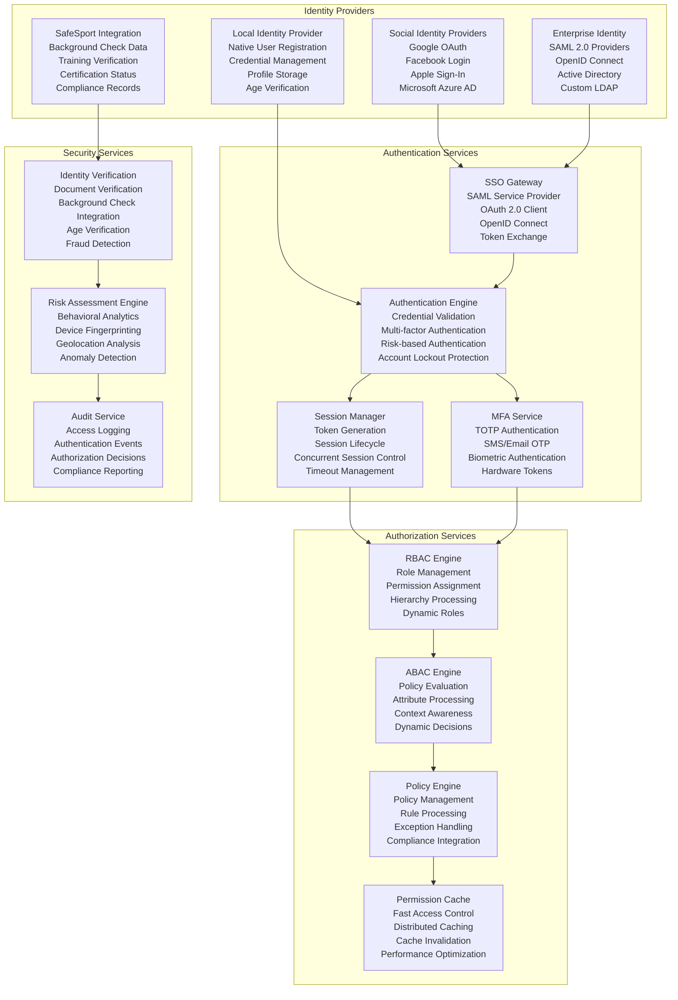
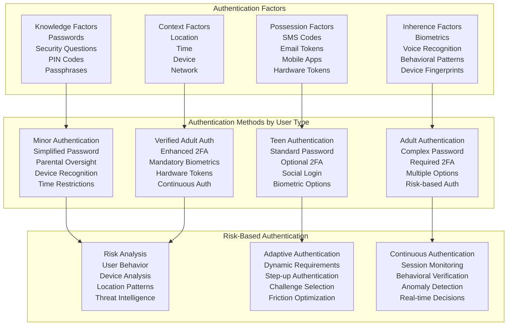
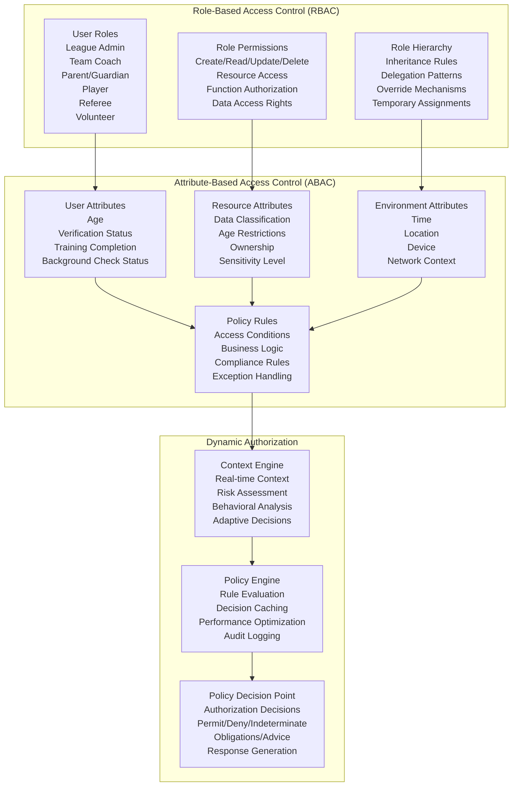
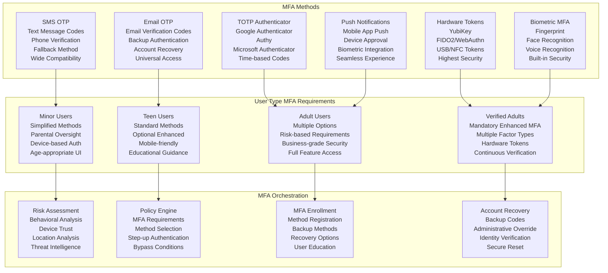
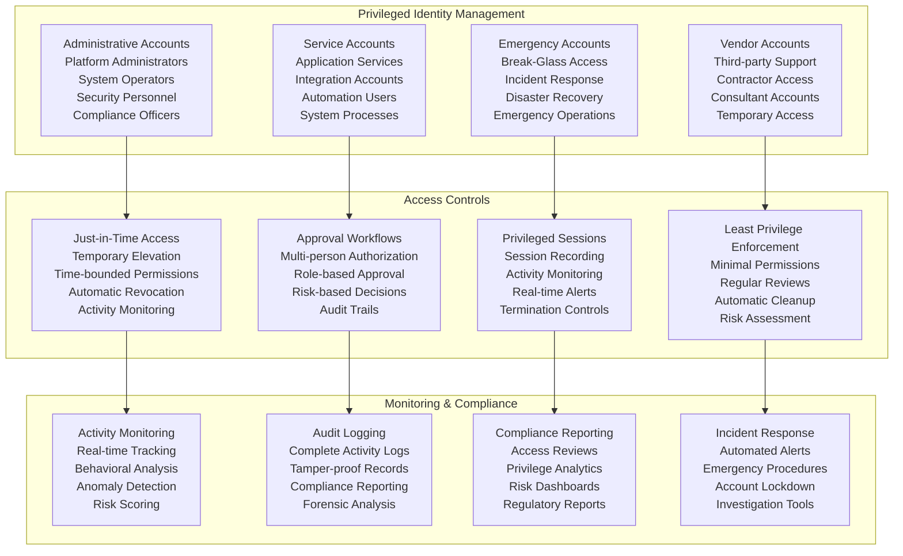
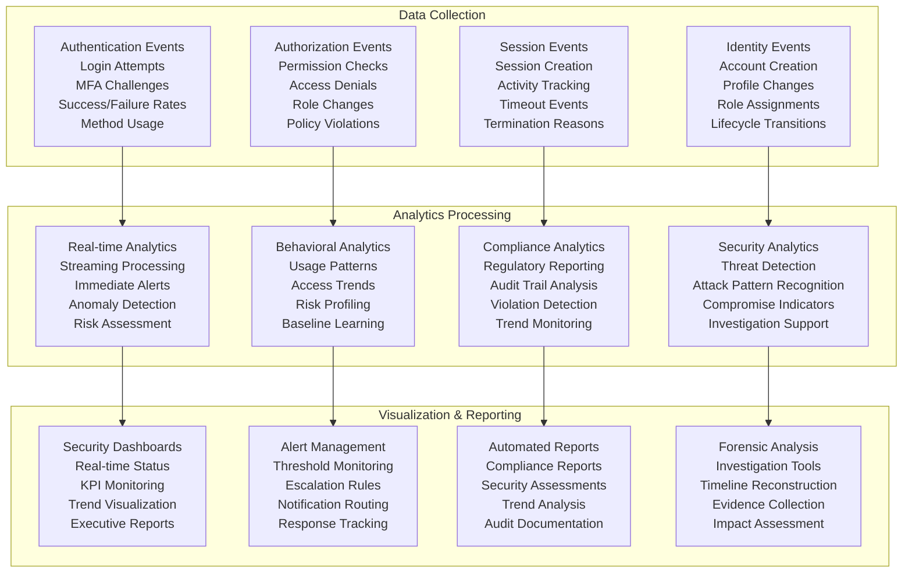

# Identity and Access Management (IAM) Design
## Basketball League Management Platform - Phase 2

**Document ID:** IAM-DESIGN-001  
**Version:** 2.0  
**Date:** August 8, 2025  
**Author:** Youth Security Architect  
**Status:** Phase 2 IAM Implementation  
**Classification:** Confidential - Security Architecture  

---

## Executive Summary

This Identity and Access Management (IAM) Design document defines a comprehensive authentication, authorization, and multi-factor authentication framework for the Basketball League Management Platform, with specialized controls for youth safety and regulatory compliance. The design implements zero-trust principles, fine-grained access controls, and robust identity verification to protect minor athletes while enabling efficient platform operations.

### Key IAM Objectives
- **Secure Authentication**: Multi-factor authentication with youth-appropriate controls
- **Fine-grained Authorization**: Role-based and attribute-based access control
- **Identity Verification**: Enhanced verification for adults working with minors
- **Compliance Integration**: COPPA and SafeSport compliance in identity management
- **Scalable Architecture**: Support for 50,000+ users with sub-second response times

---

## Table of Contents

1. [IAM Architecture Overview](#1-iam-architecture-overview)
2. [Identity Management](#2-identity-management)
3. [Authentication Framework](#3-authentication-framework)
4. [Authorization Architecture](#4-authorization-architecture)
5. [Multi-Factor Authentication](#5-multi-factor-authentication)
6. [Single Sign-On Integration](#6-single-sign-on-integration)
7. [Session Management](#7-session-management)
8. [Privileged Access Management](#8-privileged-access-management)
9. [Identity Lifecycle Management](#9-identity-lifecycle-management)
10. [Monitoring & Analytics](#10-monitoring--analytics)

---

## 1. IAM Architecture Overview

### 1.1 IAM System Architecture



### 1.2 IAM Security Principles

#### 1.2.1 Zero Trust Identity Model
**Core Principles:**
1. **Never Trust, Always Verify**: Every access request is authenticated and authorized
2. **Least Privilege Access**: Minimum permissions necessary for role functions
3. **Continuous Verification**: Ongoing validation of user identity and authorization
4. **Context-Aware Access**: Decisions based on user, device, location, and behavior
5. **Assume Breach**: Design for compromise scenarios and lateral movement prevention

#### 1.2.2 Youth-Specific IAM Requirements
**Special Considerations:**
- Enhanced identity verification for adults working with minors
- Parental consent integration for users under 13
- Age-appropriate authentication methods (simplified for children)
- Communication restrictions based on adult-minor relationships
- Automated compliance checking for SafeSport requirements
- Enhanced audit logging for minor-related access

---

## 2. Identity Management

### 2.1 User Identity Framework

```mermaid
graph TB
    subgraph "Identity Types"
        MINOR_U13[Minor Users (Under 13)<br/>COPPA Protected<br/>Parental Consent Required<br/>Enhanced Privacy Controls<br/>Simplified Authentication]
        
        TEEN_U18[Teen Users (13-17)<br/>Standard Privacy<br/>Parental Notification<br/>Graduated Permissions<br/>Social Authentication]
        
        ADULT_U18[Adult Users (18+)<br/>Full Authentication<br/>Complete Authorization<br/>Professional Verification<br/>Enhanced Security]
        
        ORGANIZATION[Organization Entities<br/>League Accounts<br/>Team Accounts<br/>Vendor Accounts<br/>System Accounts]
    end
    
    subgraph "Identity Attributes"
        CORE_ATTRS[Core Attributes<br/>Unique Identifier<br/>Display Name<br/>Contact Information<br/>Verification Status]
        
        ROLE_ATTRS[Role Attributes<br/>Primary Role<br/>Secondary Roles<br/>Permissions<br/>Organizational Units]
        
        VERIFICATION_ATTRS[Verification Attributes<br/>Identity Verification<br/>Background Check Status<br/>Training Certifications<br/>Compliance Records]
        
        CONTEXTUAL_ATTRS[Contextual Attributes<br/>Device Information<br/>Location Data<br/>Behavioral Patterns<br/>Risk Scores]
    end
    
    subgraph "Identity Lifecycle"
        REGISTRATION[User Registration<br/>Account Creation<br/>Identity Verification<br/>Initial Permissions<br/>Welcome Process]
        
        PROVISIONING[Account Provisioning<br/>Role Assignment<br/>Permission Grants<br/>Resource Access<br/>System Integration]
        
        MAINTENANCE[Account Maintenance<br/>Profile Updates<br/>Role Changes<br/>Permission Reviews<br/>Compliance Checks]
        
        DEPROVISIONING[Account Deprovisioning<br/>Access Revocation<br/>Data Retention<br/>Audit Trails<br/>Secure Deletion]
    end
    
    MINOR_U13 --> CORE_ATTRS
    TEEN_U18 --> ROLE_ATTRS
    ADULT_U18 --> VERIFICATION_ATTRS
    ORGANIZATION --> CONTEXTUAL_ATTRS
    
    CORE_ATTRS --> REGISTRATION
    ROLE_ATTRS --> PROVISIONING
    VERIFICATION_ATTRS --> MAINTENANCE
    CONTEXTUAL_ATTRS --> DEPROVISIONING
```

### 2.2 User Registration and Verification

#### 2.2.1 Multi-Tiered Registration Process
```javascript
// User registration service with age-specific handling
class UserRegistrationService {
    constructor(identityVerificationService, backgroundCheckService) {
        this.identityVerification = identityVerificationService;
        this.backgroundCheckService = backgroundCheckService;
    }
    
    async registerUser(registrationData) {
        // Step 1: Basic validation and age determination
        const validationResult = await this.validateRegistrationData(registrationData);
        if (!validationResult.valid) {
            throw new ValidationError(validationResult.errors);
        }
        
        const userAge = this.calculateAge(registrationData.birthDate);
        const registrationFlow = this.determineRegistrationFlow(userAge, registrationData.role);
        
        // Step 2: Execute appropriate registration flow
        switch (registrationFlow) {
            case 'MINOR_COPPA':
                return await this.registerMinorWithCOPPA(registrationData);
            case 'TEEN_STANDARD':
                return await this.registerTeen(registrationData);
            case 'ADULT_STANDARD':
                return await this.registerAdult(registrationData);
            case 'ADULT_VERIFIED':
                return await this.registerVerifiedAdult(registrationData);
            default:
                throw new Error(`Unknown registration flow: ${registrationFlow}`);
        }
    }
    
    async registerMinorWithCOPPA(registrationData) {
        // Enhanced registration process for COPPA compliance
        const user = await this.createBasicUserAccount(registrationData);
        
        // Require parental consent before activation
        const parentalConsentRequest = {
            childUserId: user.id,
            parentEmail: registrationData.parentEmail,
            consentType: 'COPPA_INITIAL_REGISTRATION',
            dataCategories: this.getMinorDataCategories(),
            expirationDate: this.calculateConsentExpiration()
        };
        
        await this.initiateParentalConsent(parentalConsentRequest);
        
        // Create limited identity profile pending consent
        const identityProfile = {
            userId: user.id,
            identityStatus: 'PENDING_PARENTAL_CONSENT',
            accountType: 'MINOR_COPPA',
            restrictedAccess: true,
            consentRequired: true,
            verificationLevel: 'BASIC'
        };
        
        await this.createIdentityProfile(identityProfile);
        
        return {
            user: user,
            status: 'PENDING_PARENTAL_CONSENT',
            nextSteps: ['AWAIT_PARENTAL_CONSENT'],
            estimatedActivation: '24-48 hours'
        };
    }
    
    async registerVerifiedAdult(registrationData) {
        // Enhanced registration for adults working with minors
        const user = await this.createBasicUserAccount(registrationData);
        
        // Initiate background check process
        const backgroundCheckRequest = {
            userId: user.id,
            checkTypes: this.getRequiredBackgroundChecks(registrationData.role),
            urgency: this.getBackgroundCheckUrgency(registrationData.role),
            safeSportIntegration: true
        };
        
        const backgroundCheckResult = await this.backgroundCheckService.initiateCheck(backgroundCheckRequest);
        
        // Create identity profile with verification requirements
        const identityProfile = {
            userId: user.id,
            identityStatus: 'PENDING_VERIFICATION',
            accountType: 'ADULT_VERIFIED',
            backgroundCheckId: backgroundCheckResult.checkId,
            verificationLevel: 'ENHANCED',
            restrictedAccess: true,
            verificationRequired: true
        };
        
        await this.createIdentityProfile(identityProfile);
        
        // Initiate SafeSport training requirement
        await this.initiateSafeSportTraining(user.id, registrationData.role);
        
        return {
            user: user,
            status: 'PENDING_VERIFICATION',
            backgroundCheckId: backgroundCheckResult.checkId,
            nextSteps: ['BACKGROUND_CHECK', 'SAFESPORT_TRAINING'],
            estimatedActivation: '3-5 business days'
        };
    }
}
```

### 2.3 Identity Verification Levels

| Verification Level | Requirements | Use Cases | Verification Methods |
|-------------------|--------------|-----------|---------------------|
| **Basic** | Email verification, age declaration | General users, spectators | Email confirmation, SMS verification |
| **Standard** | Basic + phone verification | Parents, teen players | Phone verification, social login verification |
| **Enhanced** | Standard + identity documents | Coaches, officials, volunteers | Government ID, document verification |
| **Professional** | Enhanced + background checks | Staff, administrators | Background checks, professional references |
| **SafeSport Certified** | Professional + training | Adult roles with minor contact | SafeSport training, ongoing compliance |

---

## 3. Authentication Framework

### 3.1 Multi-Modal Authentication Architecture



### 3.2 Authentication Implementation

#### 3.2.1 Password Policy Engine
```javascript
// Age-appropriate password policy implementation
class PasswordPolicyEngine {
    constructor() {
        this.policies = this.loadPasswordPolicies();
    }
    
    loadPasswordPolicies() {
        return {
            minor_u13: {
                minLength: 6,
                maxLength: 20,
                requireUppercase: false,
                requireLowercase: true,
                requireNumbers: true,
                requireSymbols: false,
                maxRepeatingChars: 3,
                commonPasswordCheck: true,
                personalInfoCheck: true,
                parentalAssistance: true,
                description: "Simple but secure password for children"
            },
            teen_13_17: {
                minLength: 8,
                maxLength: 50,
                requireUppercase: true,
                requireLowercase: true,
                requireNumbers: true,
                requireSymbols: false,
                maxRepeatingChars: 2,
                commonPasswordCheck: true,
                personalInfoCheck: true,
                strengthMeter: true,
                description: "Standard password requirements for teens"
            },
            adult_standard: {
                minLength: 10,
                maxLength: 128,
                requireUppercase: true,
                requireLowercase: true,
                requireNumbers: true,
                requireSymbols: true,
                maxRepeatingChars: 2,
                commonPasswordCheck: true,
                personalInfoCheck: true,
                breachCheck: true,
                strengthMeter: true,
                description: "Strong password requirements for adults"
            },
            verified_adult: {
                minLength: 12,
                maxLength: 128,
                requireUppercase: true,
                requireLowercase: true,
                requireNumbers: true,
                requireSymbols: true,
                maxRepeatingChars: 1,
                commonPasswordCheck: true,
                personalInfoCheck: true,
                breachCheck: true,
                entropyRequirement: 50,
                rotationRequired: true,
                rotationPeriod: 90, // days
                historyCheck: 12, // previous passwords
                description: "Enhanced password security for verified adults"
            }
        };
    }
    
    async validatePassword(password, userId, userType) {
        const policy = this.policies[userType];
        if (!policy) {
            throw new Error(`Unknown user type: ${userType}`);
        }
        
        const validationResults = [];
        
        // Length validation
        if (password.length < policy.minLength || password.length > policy.maxLength) {
            validationResults.push({
                rule: 'LENGTH',
                passed: false,
                message: `Password must be between ${policy.minLength} and ${policy.maxLength} characters`
            });
        }
        
        // Character requirements
        if (policy.requireUppercase && !/[A-Z]/.test(password)) {
            validationResults.push({
                rule: 'UPPERCASE',
                passed: false,
                message: 'Password must contain at least one uppercase letter'
            });
        }
        
        // Check against known breaches (for applicable user types)
        if (policy.breachCheck) {
            const breachCheck = await this.checkPasswordBreach(password);
            if (breachCheck.found) {
                validationResults.push({
                    rule: 'BREACH_CHECK',
                    passed: false,
                    message: 'Password found in known data breaches',
                    severity: 'HIGH'
                });
            }
        }
        
        // Personal information check
        if (policy.personalInfoCheck) {
            const personalInfoCheck = await this.checkPersonalInfoUsage(password, userId);
            if (personalInfoCheck.found) {
                validationResults.push({
                    rule: 'PERSONAL_INFO',
                    passed: false,
                    message: 'Password should not contain personal information',
                    details: personalInfoCheck.matches
                });
            }
        }
        
        const overallPassed = validationResults.filter(r => !r.passed).length === 0;
        
        return {
            passed: overallPassed,
            score: this.calculatePasswordStrength(password, policy),
            validations: validationResults,
            policy: policy.description
        };
    }
}
```

### 3.3 Biometric Authentication

#### 3.3.1 Age-Appropriate Biometric Controls
**Implementation Guidelines:**
- **Under 13**: Biometric collection prohibited (COPPA compliance)
- **13-17**: Biometric authentication optional with parental consent
- **18+**: Full biometric authentication available
- **Verified Adults**: Enhanced biometric requirements for sensitive operations

```javascript
// Biometric authentication service
class BiometricAuthenticationService {
    constructor(biometricProcessor, consentManager) {
        this.biometricProcessor = biometricProcessor;
        this.consentManager = consentManager;
    }
    
    async enrollBiometric(userId, biometricType, biometricData) {
        const user = await this.getUserById(userId);
        
        // Age-based biometric restrictions
        if (user.age < 13) {
            throw new COPPAViolationError('Biometric collection not permitted for users under 13');
        }
        
        if (user.age < 18) {
            // Require parental consent for minors
            const consent = await this.consentManager.getParentalConsent(
                userId, 
                'BIOMETRIC_AUTHENTICATION'
            );
            
            if (!consent.granted) {
                throw new ConsentRequiredError('Parental consent required for biometric enrollment');
            }
        }
        
        // Process biometric enrollment
        const enrollmentResult = await this.biometricProcessor.enroll({
            userId: userId,
            biometricType: biometricType,
            biometricData: biometricData,
            quality: await this.assessBiometricQuality(biometricData),
            metadata: {
                enrollmentTime: new Date().toISOString(),
                deviceInfo: this.getDeviceInfo(),
                consentVersion: consent?.version || null
            }
        });
        
        // Store enrollment with privacy protections
        await this.storeBiometricTemplate({
            userId: userId,
            templateId: enrollmentResult.templateId,
            biometricType: biometricType,
            encryptedTemplate: enrollmentResult.encryptedTemplate,
            qualityScore: enrollmentResult.qualityScore,
            consentRecords: consent ? [consent.id] : []
        });
        
        return {
            success: true,
            templateId: enrollmentResult.templateId,
            qualityScore: enrollmentResult.qualityScore
        };
    }
    
    async authenticateBiometric(userId, biometricType, biometricData) {
        // Retrieve stored biometric template
        const storedTemplate = await this.getBiometricTemplate(userId, biometricType);
        
        if (!storedTemplate) {
            throw new BiometricNotFoundError('No biometric template found for user');
        }
        
        // Perform biometric matching
        const matchResult = await this.biometricProcessor.match(
            biometricData,
            storedTemplate.encryptedTemplate
        );
        
        // Log authentication attempt
        await this.logBiometricAuthentication({
            userId: userId,
            biometricType: biometricType,
            matchScore: matchResult.score,
            threshold: matchResult.threshold,
            result: matchResult.match ? 'SUCCESS' : 'FAILURE',
            timestamp: new Date().toISOString()
        });
        
        return {
            authenticated: matchResult.match,
            confidence: matchResult.score,
            threshold: matchResult.threshold
        };
    }
}
```

---

## 4. Authorization Architecture

### 4.1 Hybrid Authorization Model



### 4.2 Youth-Specific Authorization Rules

#### 4.2.1 COPPA-Compliant Access Control
```javascript
// COPPA-compliant authorization policy engine
class COPPAAuthorizationEngine {
    constructor(policyEngine, consentManager) {
        this.policyEngine = policyEngine;
        this.consentManager = consentManager;
    }
    
    async authorizeMinorDataAccess(requestContext) {
        const { userId, targetUserId, resourceType, operation, context } = requestContext;
        
        // Get target user information
        const targetUser = await this.getUserById(targetUserId);
        
        // Check if target is COPPA-protected
        if (!this.isCOPPAProtected(targetUser)) {
            return this.authorizeStandardAccess(requestContext);
        }
        
        // Apply COPPA-specific authorization rules
        const authorizationResult = await this.applyCOPPAAuthorizationRules({
            requester: await this.getUserById(userId),
            target: targetUser,
            resourceType: resourceType,
            operation: operation,
            context: context
        });
        
        return authorizationResult;
    }
    
    async applyCOPPAAuthorizationRules(authRequest) {
        const { requester, target, resourceType, operation } = authRequest;
        
        // Rule 1: Parent/Guardian Access
        if (await this.isParentOrGuardian(requester.id, target.id)) {
            const parentalAccess = await this.evaluateParentalAccess(authRequest);
            if (parentalAccess.permitted) {
                return {
                    decision: 'PERMIT',
                    reason: 'PARENTAL_ACCESS',
                    obligations: ['LOG_PARENTAL_ACCESS'],
                    advice: parentalAccess.advice
                };
            }
        }
        
        // Rule 2: Consented Adult Access
        if (requester.age >= 18 && this.isAdultRole(requester.role)) {
            const consentCheck = await this.checkMinorConsent(target.id, requester.id, resourceType);
            
            if (!consentCheck.hasConsent) {
                return {
                    decision: 'DENY',
                    reason: 'NO_PARENTAL_CONSENT',
                    obligations: ['LOG_ACCESS_DENIAL'],
                    advice: ['REQUEST_PARENTAL_CONSENT']
                };
            }
            
            // Additional SafeSport compliance checks
            const safeSportCheck = await this.verifySafeSportCompliance(requester.id);
            if (!safeSportCheck.compliant) {
                return {
                    decision: 'DENY',
                    reason: 'SAFESPORT_NON_COMPLIANT',
                    obligations: ['LOG_COMPLIANCE_VIOLATION'],
                    advice: ['COMPLETE_SAFESPORT_REQUIREMENTS']
                };
            }
            
            return {
                decision: 'PERMIT',
                reason: 'CONSENTED_ADULT_ACCESS',
                obligations: [
                    'LOG_MINOR_DATA_ACCESS',
                    'NOTIFY_PARENT_OF_ACCESS',
                    'ENHANCE_AUDIT_TRAIL'
                ],
                conditions: {
                    supervisedAccess: this.requiresSupervision(resourceType, operation),
                    timeRestrictions: this.getAccessTimeRestrictions(),
                    dataMinimization: true
                }
            };
        }
        
        // Rule 3: Peer Access (age-appropriate)
        if (this.isPeerAccess(requester, target)) {
            return await this.evaluatePeerAccess(authRequest);
        }
        
        // Default deny for COPPA-protected data
        return {
            decision: 'DENY',
            reason: 'COPPA_PROTECTION',
            obligations: ['LOG_COPPA_PROTECTION'],
            advice: ['OBTAIN_APPROPRIATE_CONSENT']
        };
    }
    
    async checkMinorConsent(minorUserId, requesterUserId, dataCategory) {
        const consent = await this.consentManager.getMinorDataConsent(
            minorUserId,
            requesterUserId,
            dataCategory
        );
        
        return {
            hasConsent: consent && consent.status === 'GRANTED' && !consent.expired,
            consentScope: consent?.scope || [],
            consentExpiration: consent?.expirationDate,
            consentVersion: consent?.version
        };
    }
}
```

### 4.3 Role Definitions and Permissions

#### 4.3.1 Comprehensive Role Matrix
| Role | User Type | Age Requirement | Verification Level | Key Permissions |
|------|-----------|-----------------|-------------------|-----------------|
| **Super Admin** | Platform Staff | 21+ | Professional | Full system access, user management, policy configuration |
| **League Administrator** | Adult | 18+ | Enhanced | League management, team oversight, financial operations |
| **Team Coach** | Adult | 18+ | SafeSport Certified | Team management, player communication, game operations |
| **Assistant Coach** | Adult | 18+ | SafeSport Certified | Limited team management, supervised player interaction |
| **Team Manager** | Adult | 18+ | Enhanced | Administrative support, communication, logistics |
| **Parent/Guardian** | Adult | 18+ | Standard | Child data access, communication, consent management |
| **Player (Adult)** | Adult | 18+ | Standard | Own profile, team participation, communication |
| **Player (Teen)** | Teen | 13-17 | Standard | Limited profile, team participation, restricted communication |
| **Player (Child)** | Minor | 6-12 | Basic | Very limited access, parent-supervised |
| **Referee** | Adult | 18+ | Enhanced | Game officiating, incident reporting, communication |
| **Scorekeeper** | Any | 16+ | Standard | Game scoring, statistics entry, limited access |
| **Volunteer** | Adult | 18+ | Enhanced | Event support, limited communication, supervised access |
| **Spectator** | Any | Any | Basic | Public information, limited communication |

#### 4.3.2 Permission Implementation
```javascript
// Permission management system
class PermissionManager {
    constructor() {
        this.permissions = this.loadPermissionDefinitions();
        this.rolePermissions = this.loadRolePermissions();
    }
    
    loadPermissionDefinitions() {
        return {
            // User Management Permissions
            'users.create': { description: 'Create new user accounts', sensitivity: 'HIGH' },
            'users.read.own': { description: 'Read own user profile', sensitivity: 'LOW' },
            'users.read.others': { description: 'Read other user profiles', sensitivity: 'MEDIUM' },
            'users.read.minors': { description: 'Read minor user profiles', sensitivity: 'CRITICAL' },
            'users.update.own': { description: 'Update own profile', sensitivity: 'LOW' },
            'users.update.others': { description: 'Update other profiles', sensitivity: 'HIGH' },
            'users.delete': { description: 'Delete user accounts', sensitivity: 'CRITICAL' },
            
            // Communication Permissions
            'communication.send.public': { description: 'Send public messages', sensitivity: 'LOW' },
            'communication.send.team': { description: 'Send team messages', sensitivity: 'MEDIUM' },
            'communication.send.private': { description: 'Send private messages', sensitivity: 'HIGH' },
            'communication.send.minor': { description: 'Send messages to minors', sensitivity: 'CRITICAL' },
            'communication.moderate': { description: 'Moderate communications', sensitivity: 'HIGH' },
            
            // Data Access Permissions
            'data.read.public': { description: 'Read public data', sensitivity: 'LOW' },
            'data.read.team': { description: 'Read team data', sensitivity: 'MEDIUM' },
            'data.read.personal': { description: 'Read personal data', sensitivity: 'HIGH' },
            'data.read.financial': { description: 'Read financial data', sensitivity: 'CRITICAL' },
            'data.export': { description: 'Export data', sensitivity: 'HIGH' },
            
            // Administrative Permissions
            'admin.league.manage': { description: 'Manage league settings', sensitivity: 'HIGH' },
            'admin.users.manage': { description: 'Manage user accounts', sensitivity: 'CRITICAL' },
            'admin.permissions.manage': { description: 'Manage permissions', sensitivity: 'CRITICAL' },
            'admin.audit.access': { description: 'Access audit logs', sensitivity: 'HIGH' }
        };
    }
    
    async checkPermission(userId, permission, context = {}) {
        const user = await this.getUserWithRoles(userId);
        const userPermissions = await this.getUserPermissions(user);
        
        // Basic permission check
        if (!userPermissions.includes(permission)) {
            return {
                granted: false,
                reason: 'PERMISSION_NOT_ASSIGNED',
                details: { requiredPermission: permission }
            };
        }
        
        // Apply contextual restrictions
        const contextualCheck = await this.applyContextualRestrictions(
            user, permission, context
        );
        
        return contextualCheck;
    }
    
    async applyContextualRestrictions(user, permission, context) {
        // Apply age-based restrictions
        if (permission.includes('minor') && user.age < 21) {
            return {
                granted: false,
                reason: 'AGE_RESTRICTION',
                details: { minimumAge: 21, userAge: user.age }
            };
        }
        
        // Apply SafeSport compliance restrictions
        if (permission.includes('minor') || permission.includes('communication.send')) {
            const safeSportStatus = await this.checkSafeSportCompliance(user.id);
            if (!safeSportStatus.compliant) {
                return {
                    granted: false,
                    reason: 'SAFESPORT_NON_COMPLIANT',
                    details: safeSportStatus
                };
            }
        }
        
        // Apply time-based restrictions
        if (context.targetUserAge < 18 && this.isRestrictedHours()) {
            return {
                granted: false,
                reason: 'TIME_RESTRICTION',
                details: { 
                    restrictedHours: '9:00 PM - 6:00 AM',
                    currentTime: new Date().toISOString()
                }
            };
        }
        
        return {
            granted: true,
            reason: 'PERMISSION_GRANTED',
            conditions: this.getPermissionConditions(user, permission, context)
        };
    }
}
```

---

## 5. Multi-Factor Authentication

### 5.1 MFA Framework Architecture



### 5.2 Age-Appropriate MFA Implementation

#### 5.2.1 Youth MFA Service
```javascript
// Age-appropriate MFA service
class YouthMFAService {
    constructor(mfaProviders, riskEngine, consentManager) {
        this.mfaProviders = mfaProviders;
        this.riskEngine = riskEngine;
        this.consentManager = consentManager;
    }
    
    async determineMFARequirements(userId, authenticationContext) {
        const user = await this.getUserById(userId);
        const riskAssessment = await this.riskEngine.assessAuthenticationRisk(
            userId, 
            authenticationContext
        );
        
        // Age-based MFA requirements
        const mfaRequirements = await this.getAgeMFARequirements(user, riskAssessment);
        
        // Role-based additional requirements
        const roleMFARequirements = await this.getRoleMFARequirements(
            user.roles, 
            riskAssessment
        );
        
        // Combine and prioritize requirements
        const finalRequirements = this.combineMFARequirements(
            mfaRequirements, 
            roleMFARequirements, 
            riskAssessment
        );
        
        return finalRequirements;
    }
    
    async getAgeMFARequirements(user, riskAssessment) {
        if (user.age < 13) {
            return {
                required: riskAssessment.riskLevel > 'LOW',
                methods: ['PARENT_APPROVAL', 'DEVICE_RECOGNITION'],
                fallbackMethods: ['PARENTAL_OVERRIDE'],
                restrictions: {
                    biometricsProhibited: true,
                    parentalOversightRequired: true,
                    simplifiedUI: true,
                    timeRestrictions: true
                }
            };
        }
        
        if (user.age < 18) {
            return {
                required: riskAssessment.riskLevel > 'MEDIUM',
                methods: ['SMS_OTP', 'EMAIL_OTP', 'TOTP_APP'],
                fallbackMethods: ['PARENTAL_APPROVAL', 'SECURITY_QUESTIONS'],
                restrictions: {
                    biometricsOptional: true,
                    parentalNotificationRequired: true,
                    educationalGuidance: true
                }
            };
        }
        
        // Adult requirements
        return {
            required: true,
            methods: ['SMS_OTP', 'EMAIL_OTP', 'TOTP_APP', 'PUSH_NOTIFICATION'],
            fallbackMethods: ['BACKUP_CODES', 'RECOVERY_EMAIL'],
            restrictions: {
                fullBiometricsAvailable: true,
                hardwareTokensSupported: true,
                advancedFeaturesEnabled: true
            }
        };
    }
    
    async initiateParentalApprovalMFA(minorUserId, authenticationRequest) {
        // Get parent/guardian information
        const parentInfo = await this.getParentGuardianInfo(minorUserId);
        
        if (!parentInfo) {
            throw new ParentNotFoundError('No parent/guardian found for minor user');
        }
        
        // Create approval request
        const approvalRequest = {
            minorUserId: minorUserId,
            parentId: parentInfo.id,
            requestType: 'AUTHENTICATION_APPROVAL',
            authenticationContext: {
                deviceInfo: authenticationRequest.deviceInfo,
                location: authenticationRequest.location,
                timestamp: new Date().toISOString(),
                riskLevel: authenticationRequest.riskLevel
            },
            expirationTime: new Date(Date.now() + 10 * 60 * 1000) // 10 minutes
        };
        
        // Send approval request to parent
        await this.sendParentalApprovalRequest(approvalRequest);
        
        // Return pending approval status
        return {
            status: 'PENDING_PARENTAL_APPROVAL',
            approvalRequestId: approvalRequest.id,
            estimatedResponseTime: '5 minutes',
            fallbackOptions: ['WAIT_FOR_APPROVAL', 'USE_ALTERNATIVE_METHOD']
        };
    }
    
    async processParentalApproval(approvalRequestId, parentDecision) {
        const approvalRequest = await this.getApprovalRequest(approvalRequestId);
        
        // Verify parent identity and authorization
        await this.verifyParentalAuthorization(
            approvalRequest.parentId, 
            approvalRequest.minorUserId
        );
        
        if (parentDecision.approved) {
            // Grant authentication approval
            await this.completeAuthentication({
                userId: approvalRequest.minorUserId,
                method: 'PARENTAL_APPROVAL',
                approvedBy: approvalRequest.parentId,
                timestamp: new Date().toISOString(),
                additionalSecurity: {
                    parentalOversight: true,
                    sessionRestrictions: this.getMinorSessionRestrictions(),
                    activityMonitoring: true
                }
            });
            
            return {
                status: 'AUTHENTICATION_APPROVED',
                sessionRestrictions: this.getMinorSessionRestrictions(),
                parentalOversight: true
            };
        } else {
            // Log denial and handle appropriately
            await this.logParentalDenial(approvalRequest, parentDecision.reason);
            
            return {
                status: 'AUTHENTICATION_DENIED',
                reason: 'PARENTAL_DENIAL',
                nextActions: ['CONTACT_PARENT', 'TRY_LATER']
            };
        }
    }
}
```

### 5.3 Hardware Token Integration

#### 5.3.1 FIDO2/WebAuthn Implementation
```javascript
// FIDO2/WebAuthn integration for verified adults
class FIDO2Service {
    constructor(relyingPartyConfig) {
        this.rpConfig = relyingPartyConfig;
        this.attestationService = new AttestationService();
    }
    
    async initiateRegistration(userId, registrationOptions = {}) {
        const user = await this.getUserById(userId);
        
        // Verify user eligibility for hardware tokens
        if (!this.isEligibleForHardwareTokens(user)) {
            throw new EligibilityError('User not eligible for hardware token registration');
        }
        
        // Generate registration challenge
        const challenge = crypto.randomBytes(64);
        const credentialId = crypto.randomBytes(64);
        
        const registrationChallenge = {
            challenge: challenge.toString('base64url'),
            rp: {
                id: this.rpConfig.id,
                name: this.rpConfig.name
            },
            user: {
                id: Buffer.from(userId).toString('base64url'),
                name: user.email,
                displayName: user.displayName
            },
            pubKeyCredParams: [
                { alg: -7, type: 'public-key' },  // ES256
                { alg: -257, type: 'public-key' }  // RS256
            ],
            authenticatorSelection: {
                authenticatorAttachment: registrationOptions.attachment || 'cross-platform',
                requireResidentKey: true,
                userVerification: 'required'
            },
            attestation: 'direct',
            timeout: 60000,
            excludeCredentials: await this.getUserExistingCredentials(userId)
        };
        
        // Store challenge for verification
        await this.storeRegistrationChallenge(userId, challenge, credentialId);
        
        return registrationChallenge;
    }
    
    async completeRegistration(userId, registrationResponse) {
        const storedChallenge = await this.getRegistrationChallenge(userId);
        
        // Verify attestation
        const attestationResult = await this.attestationService.verifyAttestation({
            challenge: storedChallenge.challenge,
            origin: this.rpConfig.origin,
            response: registrationResponse
        });
        
        if (!attestationResult.verified) {
            throw new AttestationError('Attestation verification failed');
        }
        
        // Store credential
        const credential = {
            id: registrationResponse.id,
            userId: userId,
            publicKey: attestationResult.publicKey,
            counter: attestationResult.counter,
            transports: registrationResponse.response.getTransports(),
            attestationType: attestationResult.attestationType,
            aaguid: attestationResult.aaguid,
            credentialBackedUp: attestationResult.credentialBackedUp,
            registrationTime: new Date().toISOString()
        };
        
        await this.storeCredential(credential);
        
        // Clean up registration challenge
        await this.removeRegistrationChallenge(userId);
        
        return {
            success: true,
            credentialId: credential.id,
            attestationType: credential.attestationType
        };
    }
    
    isEligibleForHardwareTokens(user) {
        // Hardware tokens only for verified adults in sensitive roles
        return user.age >= 18 && 
               user.verificationLevel === 'ENHANCED' &&
               (user.roles.some(role => ['COACH', 'ADMIN', 'STAFF'].includes(role))) &&
               user.safeSportCompliant;
    }
}
```

---

## 6. Single Sign-On Integration

### 6.1 SSO Architecture

```mermaid
graph TB
    subgraph "Identity Providers"
        GOOGLE_SSO[Google Workspace<br/>OAuth 2.0<br/>OpenID Connect<br/>G Suite Integration<br/>Family Link Support]
        
        MICROSOFT_SSO[Microsoft Azure AD<br/>SAML 2.0<br/>Office 365 Integration<br/>School District Support<br/>Enterprise Features]
        
        APPLE_SSO[Apple Sign In<br/>OAuth 2.0<br/>Privacy Focus<br/>iOS Integration<br/>Anonymous Email]
        
        FACEBOOK_SSO[Facebook Login<br/>Social Graph<br/>Limited Youth Support<br/>Community Features<br/>Age Restrictions]
    end
    
    subgraph "SSO Gateway"
        PROTOCOL_HANDLER[Protocol Handler<br/>OAuth 2.0<br/>SAML 2.0<br/>OpenID Connect<br/>Custom Protocols]
        
        TOKEN_SERVICE[Token Service<br/>JWT Processing<br/>Token Validation<br/>Claims Extraction<br/>Token Exchange]
        
        ACCOUNT_LINKING[Account Linking<br/>Identity Resolution<br/>Account Merge<br/>Conflict Resolution<br/>Verification Process]
        
        PROVISIONING[User Provisioning<br/>Just-in-Time (JIT)<br/>Attribute Mapping<br/>Role Assignment<br/>Group Membership]
    end
    
    subgraph "Youth SSO Considerations"
        FAMILY_CONSENT[Family Consent<br/>Parental Approval<br/>Account Association<br/>Consent Tracking<br/>Age Verification]
        
        PRIVACY_CONTROLS[Privacy Controls<br/>Data Minimization<br/>Consent Scopes<br/>Information Filtering<br/>Audit Trails]
        
        SCHOOL_INTEGRATION[School Integration<br/>District SSO<br/>Student Information<br/>Parent Verification<br/>Educational Records]
    end
    
    GOOGLE_SSO --> PROTOCOL_HANDLER
    MICROSOFT_SSO --> PROTOCOL_HANDLER
    APPLE_SSO --> TOKEN_SERVICE
    FACEBOOK_SSO --> TOKEN_SERVICE
    
    PROTOCOL_HANDLER --> ACCOUNT_LINKING
    TOKEN_SERVICE --> PROVISIONING
    
    ACCOUNT_LINKING --> FAMILY_CONSENT
    PROVISIONING --> PRIVACY_CONTROLS
    PRIVACY_CONTROLS --> SCHOOL_INTEGRATION
```

### 6.2 Youth-Safe SSO Implementation

#### 6.2.1 Family-Safe Google Integration
```javascript
// Family-safe Google SSO integration
class FamilyGoogleSSOService {
    constructor(googleConfig, familyService, consentManager) {
        this.googleConfig = googleConfig;
        this.familyService = familyService;
        this.consentManager = consentManager;
    }
    
    async initiateFamilySafeLogin(loginRequest) {
        const { email, consentToFamilyLink } = loginRequest;
        
        // Check if user is part of Google Family Link
        const familyStatus = await this.checkGoogleFamilyStatus(email);
        
        if (familyStatus.isChildAccount) {
            return await this.handleChildAccountLogin(email, familyStatus, consentToFamilyLink);
        } else {
            return await this.handleStandardGoogleLogin(email);
        }
    }
    
    async handleChildAccountLogin(email, familyStatus, userConsent) {
        if (!userConsent) {
            return {
                status: 'CONSENT_REQUIRED',
                message: 'Parental consent required for child account integration',
                consentUrl: this.generateConsentUrl(email),
                familyInfo: {
                    parentEmail: familyStatus.parentEmail,
                    childAge: familyStatus.estimatedAge
                }
            };
        }
        
        // Verify parental consent through Google Family Link
        const parentalConsent = await this.verifyGoogleFamilyConsent(
            email, 
            familyStatus.parentEmail
        );
        
        if (!parentalConsent.verified) {
            return {
                status: 'PARENTAL_CONSENT_PENDING',
                message: 'Waiting for parental approval through Google Family Link',
                approvalProcess: parentalConsent.approvalProcess
            };
        }
        
        // Proceed with age-appropriate account creation
        const userAccount = await this.createChildAccountFromGoogle({
            googleEmail: email,
            parentEmail: familyStatus.parentEmail,
            familyLinkData: familyStatus,
            consentRecord: parentalConsent
        });
        
        return {
            status: 'ACCOUNT_CREATED',
            userId: userAccount.id,
            accountType: 'MINOR_GOOGLE_LINKED',
            parentalOversight: true,
            restrictions: this.getChildAccountRestrictions(familyStatus.estimatedAge)
        };
    }
    
    async createChildAccountFromGoogle(accountData) {
        const { googleEmail, parentEmail, familyLinkData, consentRecord } = accountData;
        
        // Extract safe profile information from Google
        const googleProfile = await this.getGoogleProfile(googleEmail);
        const safeProfile = this.filterChildSafeProfile(googleProfile, familyLinkData);
        
        // Create platform user account
        const userAccount = {
            email: googleEmail,
            displayName: safeProfile.displayName,
            firstName: safeProfile.givenName,
            profilePicture: safeProfile.picture, // With parental consent
            accountType: 'MINOR_GOOGLE_LINKED',
            ageEstimate: familyLinkData.estimatedAge,
            
            // Google integration data
            googleAccountId: googleProfile.sub,
            googleFamilyId: familyLinkData.familyId,
            parentGoogleEmail: parentEmail,
            
            // Privacy and consent
            coppaProtected: familyLinkData.estimatedAge < 13,
            parentalConsentSource: 'GOOGLE_FAMILY_LINK',
            consentRecordId: consentRecord.id,
            
            // Account restrictions
            requiresParentalApproval: true,
            communicationRestricted: true,
            dataMinimizationRequired: true,
            
            // Audit fields
            createdAt: new Date().toISOString(),
            createdVia: 'GOOGLE_FAMILY_SSO',
            verificationLevel: 'GOOGLE_VERIFIED'
        };
        
        const createdUser = await this.createUser(userAccount);
        
        // Link with parent account if exists
        await this.linkWithParentAccount(createdUser.id, parentEmail);
        
        // Set up appropriate permissions and restrictions
        await this.setupChildAccountPermissions(createdUser.id, familyLinkData);
        
        return createdUser;
    }
    
    filterChildSafeProfile(googleProfile, familyLinkData) {
        // Filter profile information appropriate for child accounts
        const safeProfile = {
            displayName: googleProfile.name,
            givenName: googleProfile.given_name
        };
        
        // Only include profile picture with explicit consent
        if (familyLinkData.profilePictureConsent) {
            safeProfile.picture = googleProfile.picture;
        }
        
        // Remove potentially sensitive information
        delete googleProfile.email_verified; // Platform will verify
        delete googleProfile.locale; // May reveal location
        
        return safeProfile;
    }
    
    async setupChildAccountPermissions(userId, familyLinkData) {
        const permissions = [];
        
        // Age-appropriate base permissions
        if (familyLinkData.estimatedAge >= 6) {
            permissions.push('profile.view.own', 'team.view.assigned');
        }
        
        if (familyLinkData.estimatedAge >= 10) {
            permissions.push('games.view.own', 'communication.receive.team');
        }
        
        if (familyLinkData.estimatedAge >= 13) {
            permissions.push('communication.send.moderated', 'friends.manage.restricted');
        }
        
        // Apply permissions with parental oversight
        await this.assignPermissions(userId, permissions, {
            parentalOversight: true,
            requiresApproval: permissions.filter(p => p.includes('communication')),
            restrictedFeatures: this.getAgeRestrictedFeatures(familyLinkData.estimatedAge)
        });
        
        return permissions;
    }
}
```

---

## 7. Session Management

### 7.1 Secure Session Architecture

```mermaid
graph TB
    subgraph "Session Creation"
        AUTH_SUCCESS[Authentication Success<br/>Identity Verified<br/>MFA Completed<br/>Authorization Granted<br/>Risk Assessed]
        
        TOKEN_GENERATION[Token Generation<br/>JWT Creation<br/>Cryptographic Signing<br/>Claims Population<br/>Expiration Setting]
        
        SESSION_STORAGE[Session Storage<br/>Distributed Cache<br/>Database Persistence<br/>Encrypted Storage<br/>Redundancy]
        
        CLIENT_DELIVERY[Client Delivery<br/>Secure Cookies<br/>HTTP Headers<br/>Token Validation<br/>Client Configuration]
    end
    
    subgraph "Session Management"
        SESSION_VALIDATION[Session Validation<br/>Token Verification<br/>Signature Validation<br/>Expiration Check<br/>Revocation Check]
        
        ACTIVITY_TRACKING[Activity Tracking<br/>Request Monitoring<br/>Behavior Analysis<br/>Anomaly Detection<br/>Risk Assessment]
        
        SESSION_REFRESH[Session Refresh<br/>Token Renewal<br/>Silent Refresh<br/>Security Validation<br/>Permission Updates]
        
        CONCURRENT_MGMT[Concurrent Management<br/>Multiple Sessions<br/>Device Tracking<br/>Session Limits<br/>Conflict Resolution]
    end
    
    subgraph "Session Security"
        TIMEOUT_MGMT[Timeout Management<br/>Idle Timeout<br/>Absolute Timeout<br/>Activity-based Extension<br/>Graceful Warning]
        
        RISK_MONITORING[Risk Monitoring<br/>Behavioral Changes<br/>Location Changes<br/>Device Changes<br/>Threat Detection]
        
        SESSION_TERMINATION[Session Termination<br/>Logout Processing<br/>Token Revocation<br/>Cache Cleanup<br/>Audit Logging]
        
        EMERGENCY_REVOKE[Emergency Revocation<br/>Instant Termination<br/>All Device Logout<br/>Security Incident<br/>Administrative Action]
    end
    
    AUTH_SUCCESS --> TOKEN_GENERATION
    TOKEN_GENERATION --> SESSION_STORAGE
    SESSION_STORAGE --> CLIENT_DELIVERY
    
    CLIENT_DELIVERY --> SESSION_VALIDATION
    SESSION_VALIDATION --> ACTIVITY_TRACKING
    ACTIVITY_TRACKING --> SESSION_REFRESH
    SESSION_REFRESH --> CONCURRENT_MGMT
    
    CONCURRENT_MGMT --> TIMEOUT_MGMT
    TIMEOUT_MGMT --> RISK_MONITORING
    RISK_MONITORING --> SESSION_TERMINATION
    SESSION_TERMINATION --> EMERGENCY_REVOKE
```



### 7.2 Age-Appropriate Session Controls

#### 7.2.1 Youth Session Management
```javascript
// Age-appropriate session management
class YouthSessionManager {
    constructor(tokenService, riskEngine, parentNotificationService) {
        this.tokenService = tokenService;
        this.riskEngine = riskEngine;
        this.parentNotificationService = parentNotificationService;
    }
    
    async createSession(user, authenticationContext) {
        const sessionConfig = await this.getAgeAppropriateSessionConfig(user);
        const riskAssessment = await this.riskEngine.assessSessionRisk(user, authenticationContext);
        
        // Create JWT with age-appropriate claims and restrictions
        const sessionToken = await this.tokenService.createToken({
            userId: user.id,
            userType: this.getUserType(user),
            age: user.age,
            roles: user.roles,
            permissions: await this.getSessionPermissions(user),
            
            // Session configuration
            maxAge: sessionConfig.maxDuration,
            idleTimeout: sessionConfig.idleTimeout,
            
            // Security controls
            deviceBinding: sessionConfig.requireDeviceBinding,
            locationBinding: sessionConfig.requireLocationBinding,
            
            // Youth-specific controls
            parentalOversight: sessionConfig.parentalOversight,
            communicationRestrictions: sessionConfig.communicationRestrictions,
            timeRestrictions: sessionConfig.timeRestrictions,
            
            // Risk and compliance
            riskLevel: riskAssessment.level,
            complianceRequirements: sessionConfig.complianceRequirements,
            
            // Audit and monitoring
            sessionId: crypto.randomUUID(),
            createdAt: new Date().toISOString(),
            createdBy: 'AUTHENTICATION_SERVICE'
        });
        
        // Store session with appropriate security controls
        await this.storeSession(sessionToken, sessionConfig);
        
        // Handle parental notifications for minors
        if (user.age < 18 && sessionConfig.parentalNotification) {
            await this.notifyParentsOfSession(user, sessionToken, authenticationContext);
        }
        
        return {
            sessionToken: sessionToken,
            configuration: sessionConfig,
            restrictions: this.getSessionRestrictions(user, sessionConfig),
            expiresAt: new Date(Date.now() + sessionConfig.maxDuration).toISOString()
        };
    }
    
    getAgeAppropriateSessionConfig(user) {
        if (user.age < 13) {
            return {
                maxDuration: 2 * 60 * 60 * 1000, // 2 hours
                idleTimeout: 15 * 60 * 1000,     // 15 minutes
                requireDeviceBinding: true,
                requireLocationBinding: false,
                parentalOversight: true,
                parentalNotification: true,
                communicationRestrictions: {
                    noPrivateMessages: true,
                    moderatedCommunication: true,
                    timeBasedRestrictions: true
                },
                timeRestrictions: {
                    allowedHours: { start: 6, end: 21 },
                    weekdayLimits: { maxHours: 2 },
                    weekendLimits: { maxHours: 4 }
                },
                complianceRequirements: ['COPPA'],
                features: {
                    simplifiedInterface: true,
                    enhancedPrivacy: true,
                    restrictedSharing: true
                }
            };
        }
        
        if (user.age < 18) {
            return {
                maxDuration: 4 * 60 * 60 * 1000, // 4 hours
                idleTimeout: 30 * 60 * 1000,     // 30 minutes
                requireDeviceBinding: false,
                requireLocationBinding: false,
                parentalOversight: false,
                parentalNotification: user.parentalNotificationEnabled,
                communicationRestrictions: {
                    noPrivateMessages: false,
                    moderatedCommunication: false,
                    timeBasedRestrictions: true
                },
                timeRestrictions: {
                    allowedHours: { start: 5, end: 23 },
                    noWeekdayLimits: true,
                    socialFeatureRestrictions: true
                },
                complianceRequirements: ['TEEN_PRIVACY'],
                features: {
                    standardInterface: true,
                    standardPrivacy: true,
                    controlledSharing: true
                }
            };
        }
        
        // Adult session configuration
        return {
            maxDuration: 8 * 60 * 60 * 1000, // 8 hours
            idleTimeout: 60 * 60 * 1000,     // 1 hour
            requireDeviceBinding: false,
            requireLocationBinding: false,
            parentalOversight: false,
            parentalNotification: false,
            communicationRestrictions: {},
            timeRestrictions: {},
            complianceRequirements: this.getAdultComplianceRequirements(user),
            features: {
                fullInterface: true,
                standardPrivacy: true,
                fullSharing: true
            }
        };
    }
    
    async validateSession(sessionToken) {
        // Basic token validation
        const tokenValidation = await this.tokenService.validateToken(sessionToken);
        if (!tokenValidation.valid) {
            return { valid: false, reason: 'INVALID_TOKEN' };
        }
        
        const sessionClaims = tokenValidation.claims;
        
        // Check session expiration
        if (Date.now() > sessionClaims.expiresAt) {
            await this.revokeSession(sessionToken);
            return { valid: false, reason: 'SESSION_EXPIRED' };
        }
        
        // Check idle timeout
        const lastActivity = await this.getLastActivity(sessionClaims.sessionId);
        if (Date.now() - lastActivity > sessionClaims.idleTimeout) {
            await this.revokeSession(sessionToken);
            return { valid: false, reason: 'IDLE_TIMEOUT' };
        }
        
        // Age-specific validations
        if (sessionClaims.age < 18) {
            const youthValidation = await this.validateYouthSession(sessionClaims);
            if (!youthValidation.valid) {
                return youthValidation;
            }
        }
        
        // Risk-based validation
        const currentRisk = await this.riskEngine.assessCurrentSessionRisk(sessionClaims.sessionId);
        if (currentRisk.level > sessionClaims.riskLevel) {
            return {
                valid: false,
                reason: 'ELEVATED_RISK',
                recommendedAction: 'RE_AUTHENTICATE',
                riskDetails: currentRisk
            };
        }
        
        // Update last activity
        await this.updateLastActivity(sessionClaims.sessionId);
        
        return {
            valid: true,
            sessionInfo: sessionClaims,
            remainingTime: sessionClaims.expiresAt - Date.now(),
            restrictions: this.getActiveRestrictions(sessionClaims)
        };
    }
    
    async validateYouthSession(sessionClaims) {
        // Time-based restrictions for minors
        if (sessionClaims.timeRestrictions) {
            const currentHour = new Date().getHours();
            const restrictions = sessionClaims.timeRestrictions;
            
            if (currentHour < restrictions.allowedHours.start || 
                currentHour > restrictions.allowedHours.end) {
                
                await this.revokeSession(sessionClaims.sessionId);
                return {
                    valid: false,
                    reason: 'TIME_RESTRICTION_VIOLATION',
                    allowedHours: restrictions.allowedHours,
                    currentTime: new Date().toISOString()
                };
            }
        }
        
        // Check parental session approval for very young users
        if (sessionClaims.age < 10 && sessionClaims.parentalOversight) {
            const parentalApproval = await this.checkParentalSessionApproval(
                sessionClaims.userId,
                sessionClaims.sessionId
            );
            
            if (!parentalApproval.approved) {
                return {
                    valid: false,
                    reason: 'PARENTAL_APPROVAL_REQUIRED',
                    parentNotificationSent: parentalApproval.notificationSent
                };
            }
        }
        
        return { valid: true };
    }
}
```

---

## 8. Privileged Access Management

### 8.1 PAM Architecture



### 8.2 Youth Safety Privileged Access

#### 8.2.1 Enhanced PAM for Youth Data Access
```javascript
// Privileged Access Management for youth data
class YouthDataPAM {
    constructor(approvalService, auditService, sessionRecorder) {
        this.approvalService = approvalService;
        this.auditService = auditService;
        this.sessionRecorder = sessionRecorder;
    }
    
    async requestPrivilegedAccess(accessRequest) {
        const { userId, targetResource, operation, justification, urgency } = accessRequest;
        
        // Validate user eligibility for privileged access
        const eligibilityCheck = await this.validatePrivilegedAccessEligibility(userId);
        if (!eligibilityCheck.eligible) {
            throw new PrivilegedAccessError(eligibilityCheck.reason);
        }
        
        // Determine approval requirements based on resource sensitivity
        const approvalRequirements = await this.determineApprovalRequirements(
            targetResource, 
            operation, 
            urgency
        );
        
        // Create privileged access request
        const pamRequest = {
            id: crypto.randomUUID(),
            requesterId: userId,
            targetResource: targetResource,
            requestedOperation: operation,
            justification: justification,
            urgency: urgency,
            requestTime: new Date().toISOString(),
            approvalRequirements: approvalRequirements,
            status: 'PENDING_APPROVAL'
        };
        
        // Submit for approval workflow
        const approvalWorkflow = await this.approvalService.initiatePAMApproval(pamRequest);
        
        return {
            requestId: pamRequest.id,
            status: 'PENDING_APPROVAL',
            approvalWorkflow: approvalWorkflow,
            estimatedApprovalTime: approvalRequirements.estimatedTime
        };
    }
    
    async determineApprovalRequirements(resource, operation, urgency) {
        const resourceSensitivity = await this.assessResourceSensitivity(resource);
        const operationRisk = this.assessOperationRisk(operation);
        
        if (resourceSensitivity.containsMinorData) {
            return {
                approversRequired: 2,
                requiredRoles: ['COMPLIANCE_OFFICER', 'SECURITY_LEAD'],
                additionalRequirements: [
                    'LEGAL_REVIEW_IF_BULK_ACCESS',
                    'PARENT_NOTIFICATION_IF_INDIVIDUAL_ACCESS',
                    'ENHANCED_AUDIT_LOGGING'
                ],
                maxAccessDuration: '4 hours',
                sessionRecordingRequired: true,
                estimatedTime: urgency === 'HIGH' ? '30 minutes' : '2 hours'
            };
        }
        
        if (resourceSensitivity.level === 'CRITICAL') {
            return {
                approversRequired: 2,
                requiredRoles: ['SECURITY_LEAD', 'TECHNICAL_LEAD'],
                additionalRequirements: ['ENHANCED_AUDIT_LOGGING'],
                maxAccessDuration: '8 hours',
                sessionRecordingRequired: operationRisk.level === 'HIGH',
                estimatedTime: urgency === 'HIGH' ? '15 minutes' : '1 hour'
            };
        }
        
        return {
            approversRequired: 1,
            requiredRoles: ['MANAGER', 'SECURITY_LEAD'],
            additionalRequirements: [],
            maxAccessDuration: '24 hours',
            sessionRecordingRequired: false,
            estimatedTime: urgency === 'HIGH' ? '15 minutes' : '30 minutes'
        };
    }
    
    async grantPrivilegedAccess(requestId, approvalDecision) {
        const pamRequest = await this.getPAMRequest(requestId);
        
        if (approvalDecision.approved) {
            // Create privileged session
            const privilegedSession = await this.createPrivilegedSession({
                userId: pamRequest.requesterId,
                requestId: requestId,
                permissions: this.calculatePrivilegedPermissions(
                    pamRequest.targetResource, 
                    pamRequest.requestedOperation
                ),
                restrictions: {
                    maxDuration: approvalDecision.maxDuration || pamRequest.approvalRequirements.maxAccessDuration,
                    ipRestrictions: approvalDecision.ipRestrictions,
                    timeRestrictions: approvalDecision.timeRestrictions,
                    sessionRecording: pamRequest.approvalRequirements.sessionRecordingRequired
                },
                monitoring: {
                    enhancedLogging: true,
                    realTimeMonitoring: true,
                    anomalyDetection: true,
                    alertThresholds: this.getPrivilegedAccessAlertThresholds()
                }
            });
            
            // Start session recording if required
            if (pamRequest.approvalRequirements.sessionRecordingRequired) {
                await this.sessionRecorder.startRecording(privilegedSession.id);
            }
            
            // Notify relevant parties
            await this.notifyPrivilegedAccessGranted(pamRequest, privilegedSession, approvalDecision);
            
            return {
                sessionId: privilegedSession.id,
                permissions: privilegedSession.permissions,
                restrictions: privilegedSession.restrictions,
                expiresAt: privilegedSession.expiresAt
            };
        } else {
            // Log denial and notify requester
            await this.auditService.logPrivilegedAccessDenial(pamRequest, approvalDecision);
            await this.notifyPrivilegedAccessDenied(pamRequest, approvalDecision);
            
            return {
                status: 'DENIED',
                reason: approvalDecision.reason,
                appealProcess: this.getAppealProcess()
            };
        }
    }
    
    async monitorPrivilegedSession(sessionId) {
        const session = await this.getPrivilegedSession(sessionId);
        const currentActivity = await this.getCurrentSessionActivity(sessionId);
        
        // Real-time risk assessment
        const riskAssessment = await this.assessPrivilegedSessionRisk(session, currentActivity);
        
        if (riskAssessment.riskLevel > session.alertThresholds.riskLevel) {
            await this.handlePrivilegedSessionRiskEscalation(session, riskAssessment);
        }
        
        // Check for policy violations
        const policyViolations = await this.checkPrivilegedSessionCompliance(session, currentActivity);
        
        if (policyViolations.length > 0) {
            await this.handlePrivilegedSessionPolicyViolations(session, policyViolations);
        }
        
        return {
            sessionId: sessionId,
            riskLevel: riskAssessment.riskLevel,
            policyCompliant: policyViolations.length === 0,
            remainingTime: session.expiresAt - Date.now(),
            activitySummary: currentActivity.summary
        };
    }
}
```

---

## 9. Identity Lifecycle Management

### 9.1 Lifecycle Management Architecture

```mermaid
graph TB
    subgraph "Identity Lifecycle Stages"
        PRE_REGISTRATION[Pre-Registration<br/>Interest Expression<br/>Eligibility Check<br/>Prerequisites<br/>Information Gathering]
        
        REGISTRATION[Registration<br/>Account Creation<br/>Identity Verification<br/>Initial Provisioning<br/>Welcome Process]
        
        ACTIVE_MANAGEMENT[Active Management<br/>Profile Maintenance<br/>Role Changes<br/>Permission Updates<br/>Compliance Monitoring]
        
        DEACTIVATION[Account Deactivation<br/>Temporary Suspension<br/>Role Removal<br/>Access Restriction<br/>Data Retention]
        
        TERMINATION[Account Termination<br/>Complete Removal<br/>Data Purging<br/>Audit Preservation<br/>Final Notifications]
    end
    
    subgraph "Automated Processes"
        BIRTHDAY_PROCESSING[Birthday Processing<br/>Age Transition<br/>Permission Updates<br/>Compliance Changes<br/>Notification Triggers]
        
        ROLE_TRANSITIONS[Role Transitions<br/>Seasonal Changes<br/>Team Assignments<br/>Graduation Processing<br/>Status Updates]
        
        COMPLIANCE_MONITORING[Compliance Monitoring<br/>Background Check Renewal<br/>Training Expiration<br/>Certification Tracking<br/>Violation Detection]
        
        DATA_LIFECYCLE[Data Lifecycle<br/>Retention Policies<br/>Deletion Schedules<br/>Archive Management<br/>Privacy Compliance]
    end
    
    subgraph "Youth-Specific Processes"
        AGE_TRANSITIONS[Age Transitions<br/>COPPA to Teen<br/>Teen to Adult<br/>Permission Migration<br/>Consent Transfer]
        
        PARENTAL_HANDOFF[Parental Handoff<br/>Control Transfer<br/>Consent Migration<br/>Permission Review<br/>Independence Transition]
        
        GRADUATION[Graduation Processing<br/>League Transitions<br/>Archive Decisions<br/>Alumni Status<br/>Data Disposition]
        
        FAMILY_COORDINATION[Family Coordination<br/>Sibling Management<br/>Parent Updates<br/>Family Account Sync<br/>Consent Coordination]
    end
    
    PRE_REGISTRATION --> REGISTRATION
    REGISTRATION --> ACTIVE_MANAGEMENT
    ACTIVE_MANAGEMENT --> DEACTIVATION
    DEACTIVATION --> TERMINATION
    
    BIRTHDAY_PROCESSING --> AGE_TRANSITIONS
    ROLE_TRANSITIONS --> PARENTAL_HANDOFF
    COMPLIANCE_MONITORING --> GRADUATION
    DATA_LIFECYCLE --> FAMILY_COORDINATION
```



### 9.2 Age Transition Management

#### 9.2.1 Automated Age Transition Processing
```javascript
// Age transition management for youth users
class AgeTransitionManager {
    constructor(userService, consentService, permissionService, notificationService) {
        this.userService = userService;
        this.consentService = consentService;
        this.permissionService = permissionService;
        this.notificationService = notificationService;
    }
    
    async processAgeTransitions() {
        // Find users with upcoming or recent birthdays
        const upcomingTransitions = await this.identifyUpcomingAgeTransitions();
        
        for (const transition of upcomingTransitions) {
            try {
                await this.processAgeTransition(transition);
            } catch (error) {
                console.error(`Failed to process age transition for user ${transition.userId}:`, error);
                await this.handleTransitionError(transition, error);
            }
        }
        
        return {
            processed: upcomingTransitions.length,
            successful: upcomingTransitions.filter(t => t.status === 'COMPLETED').length,
            failed: upcomingTransitions.filter(t => t.status === 'FAILED').length
        };
    }
    
    async processAgeTransition(transition) {
        const { userId, fromAge, toAge, transitionDate } = transition;
        const user = await this.userService.getUserById(userId);
        
        // Determine transition type
        const transitionType = this.determineTransitionType(fromAge, toAge);
        
        switch (transitionType) {
            case 'COPPA_TO_TEEN':
                await this.processCOPPAToTeenTransition(user, transition);
                break;
            case 'TEEN_TO_ADULT':
                await this.processTeenToAdultTransition(user, transition);
                break;
            case 'WITHIN_COPPA':
            case 'WITHIN_TEEN':
            case 'WITHIN_ADULT':
                await this.processWithinCategoryTransition(user, transition);
                break;
            default:
                throw new Error(`Unknown transition type: ${transitionType}`);
        }
        
        // Update user age and related fields
        await this.updateUserAge(userId, toAge, transitionDate);
        
        // Log transition completion
        await this.logAgeTransition(transition, 'COMPLETED');
        
        return { status: 'COMPLETED', transitionType };
    }
    
    async processCOPPAToTeenTransition(user, transition) {
        // This is a major transition from COPPA-protected to teen status
        console.log(`Processing COPPA to Teen transition for user ${user.id}`);
        
        // Step 1: Prepare transition plan
        const transitionPlan = {
            userId: user.id,
            fromStatus: 'COPPA_PROTECTED',
            toStatus: 'TEEN_USER',
            changes: {
                authenticationMethods: ['password', 'social_login', 'biometric_optional'],
                permissions: await this.calculateTeenPermissions(user),
                communicationRules: this.getTeenCommunicationRules(),
                parentalOversight: 'NOTIFICATION_ONLY',
                dataRetention: this.getTeenDataRetentionRules()
            }
        };
        
        // Step 2: Notify parents about upcoming transition
        await this.notifyParentsOfAgeTransition(user, transitionPlan);
        
        // Step 3: Migrate parental consent to teen privacy preferences
        const consentMigration = await this.migrateParentalConsentToTeenPrivacy(user);
        
        // Step 4: Update authentication capabilities
        await this.updateAuthenticationCapabilities(user.id, transitionPlan.changes.authenticationMethods);
        
        // Step 5: Migrate permissions with expanded capabilities
        await this.migratePermissions(user.id, transitionPlan.changes.permissions);
        
        // Step 6: Update communication restrictions
        await this.updateCommunicationRestrictions(user.id, transitionPlan.changes.communicationRules);
        
        // Step 7: Transition data handling from COPPA to teen privacy rules
        await this.transitionDataHandling(user.id, transitionPlan.changes.dataRetention);
        
        // Step 8: Notify user of new capabilities
        await this.notifyUserOfTransition(user, transitionPlan);
        
        return {
            transitionPlan,
            consentMigration,
            newPermissions: transitionPlan.changes.permissions
        };
    }
    
    async processTeenToAdultTransition(user, transition) {
        // Transition from teen to full adult privileges
        console.log(`Processing Teen to Adult transition for user ${user.id}`);
        
        const transitionPlan = {
            userId: user.id,
            fromStatus: 'TEEN_USER',
            toStatus: 'ADULT_USER',
            changes: {
                authenticationMethods: ['password', 'mfa_required', 'biometric', 'hardware_token'],
                permissions: await this.calculateAdultPermissions(user),
                communicationRules: this.getAdultCommunicationRules(),
                parentalOversight: 'NONE',
                dataRetention: this.getAdultDataRetentionRules(),
                accountControl: 'FULL_CONTROL'
            }
        };
        
        // Transfer account control from parents (if applicable)
        await this.transferAccountControlFromParents(user);
        
        // Update to adult authentication requirements
        await this.updateAuthenticationCapabilities(user.id, transitionPlan.changes.authenticationMethods);
        
        // Grant full adult permissions
        await this.grantAdultPermissions(user.id, transitionPlan.changes.permissions);
        
        // Remove communication restrictions
        await this.removeTeenCommunicationRestrictions(user.id);
        
        // Update data handling to adult privacy rules
        await this.transitionToAdultDataHandling(user.id);
        
        // Notify user and parents of transition
        await this.notifyAdultTransition(user, transitionPlan);
        
        return {
            transitionPlan,
            accountControlTransferred: true,
            newPermissions: transitionPlan.changes.permissions
        };
    }
    
    async migrateParentalConsentToTeenPrivacy(user) {
        // Get current parental consents
        const parentalConsents = await this.consentService.getParentalConsents(user.id);
        
        const privacyMigration = {
            userId: user.id,
            migratedConsents: [],
            newPrivacySettings: {},
            parentalNotificationSettings: {}
        };
        
        for (const consent of parentalConsents) {
            // Convert parental consent to teen privacy preference
            const privacySetting = this.convertConsentToPrivacySetting(consent);
            
            await this.consentService.createTeenPrivacySetting({
                userId: user.id,
                category: privacySetting.category,
                setting: privacySetting.value,
                source: 'MIGRATED_FROM_PARENTAL_CONSENT',
                originalConsentId: consent.id,
                canUserModify: true,
                parentalNotification: privacySetting.requiresParentalNotification
            });
            
            privacyMigration.migratedConsents.push({
                consentId: consent.id,
                category: consent.category,
                newSetting: privacySetting
            });
        }
        
        // Set default parental notification preferences
        privacyMigration.parentalNotificationSettings = {
            communicationActivity: true,
            privacySettingChanges: true,
            accountSecurityEvents: true,
            disciplinaryActions: true
        };
        
        await this.consentService.setParentalNotificationPreferences(
            user.id,
            privacyMigration.parentalNotificationSettings
        );
        
        return privacyMigration;
    }
    
    determineTransitionType(fromAge, toAge) {
        if (fromAge < 13 && toAge >= 13) {
            return 'COPPA_TO_TEEN';
        }
        if (fromAge < 18 && toAge >= 18) {
            return 'TEEN_TO_ADULT';
        }
        if (fromAge < 13 && toAge < 13) {
            return 'WITHIN_COPPA';
        }
        if (fromAge >= 13 && fromAge < 18 && toAge >= 13 && toAge < 18) {
            return 'WITHIN_TEEN';
        }
        if (fromAge >= 18 && toAge >= 18) {
            return 'WITHIN_ADULT';
        }
        return 'UNKNOWN';
    }
}
```

---

## 10. Monitoring & Analytics

### 10.1 IAM Analytics Architecture



### 10.2 Youth Safety Analytics

#### 10.2.1 Youth Protection Monitoring
```javascript
// Youth protection monitoring and analytics
class YouthProtectionAnalytics {
    constructor(analyticsEngine, alertManager, complianceReporter) {
        this.analyticsEngine = analyticsEngine;
        this.alertManager = alertManager;
        this.complianceReporter = complianceReporter;
    }
    
    async monitorYouthSafetyMetrics() {
        const safetyMetrics = await this.calculateYouthSafetyMetrics();
        const riskIndicators = await this.identifyYouthSafetyRisks();
        const complianceStatus = await this.assessYouthComplianceStatus();
        
        // Generate safety dashboard data
        const dashboardData = {
            metrics: safetyMetrics,
            risks: riskIndicators,
            compliance: complianceStatus,
            recommendations: await this.generateSafetyRecommendations(riskIndicators)
        };
        
        // Check for alert conditions
        await this.checkYouthSafetyAlerts(safetyMetrics, riskIndicators);
        
        return dashboardData;
    }
    
    async calculateYouthSafetyMetrics() {
        const timeFrame = '30_DAYS';
        
        return {
            // COPPA Compliance Metrics
            coppaCompliance: {
                protectedMinors: await this.countCOPPAProtectedUsers(),
                parentalConsentRate: await this.calculateConsentRate(timeFrame),
                consentRenewalRate: await this.calculateConsentRenewalRate(timeFrame),
                dataMinimizationCompliance: await this.assessDataMinimizationCompliance()
            },
            
            // SafeSport Compliance Metrics
            safeSportCompliance: {
                adultVerificationRate: await this.calculateAdultVerificationRate(),
                backgroundCheckCompliance: await this.calculateBackgroundCheckCompliance(),
                trainingCompletionRate: await this.calculateTrainingCompletionRate(),
                communicationMonitoringCoverage: await this.calculateMonitoringCoverage()
            },
            
            // Communication Safety Metrics
            communicationSafety: {
                monitoredMessages: await this.countMonitoredMessages(timeFrame),
                policyViolations: await this.countCommunicationViolations(timeFrame),
                escalatedReviews: await this.countEscalatedReviews(timeFrame),
                parentalReports: await this.countParentalReports(timeFrame)
            },
            
            // Access Control Metrics
            accessControl: {
                minorDataAccessAttempts: await this.countMinorDataAccess(timeFrame),
                unauthorizedAccessAttempts: await this.countUnauthorizedAccess(timeFrame),
                privilegedAccessToMinorData: await this.countPrivilegedMinorAccess(timeFrame),
                accessControlViolations: await this.countAccessViolations(timeFrame)
            },
            
            // Age Transition Metrics
            ageTransitions: {
                coppaToTeenTransitions: await this.countAgeTransitions('COPPA_TO_TEEN', timeFrame),
                teenToAdultTransitions: await this.countAgeTransitions('TEEN_TO_ADULT', timeFrame),
                transitionSuccessRate: await this.calculateTransitionSuccessRate(timeFrame),
                consentMigrationSuccessRate: await this.calculateConsentMigrationRate(timeFrame)
            }
        };
    }
    
    async identifyYouthSafetyRisks() {
        const riskIndicators = [];
        
        // High-Risk Communication Patterns
        const communicationRisks = await this.analyzeCommunicationRisks();
        riskIndicators.push(...communicationRisks);
        
        // Access Pattern Anomalies
        const accessRisks = await this.analyzeAccessPatternRisks();
        riskIndicators.push(...accessRisks);
        
        // Compliance Drift Risks
        const complianceRisks = await this.analyzeComplianceRisks();
        riskIndicators.push(...complianceRisks);
        
        // Behavioral Anomalies
        const behavioralRisks = await this.analyzeBehavioralRisks();
        riskIndicators.push(...behavioralRisks);
        
        return riskIndicators.sort((a, b) => b.riskScore - a.riskScore);
    }
    
    async analyzeCommunicationRisks() {
        const risks = [];
        
        // Analyze adult-minor communication patterns
        const adultMinorCommunication = await this.analyticsEngine.query({
            type: 'communication_analysis',
            filters: {
                senderAge: '>=18',
                recipientAge: '<18',
                timeframe: 'LAST_30_DAYS'
            },
            groupBy: ['senderId', 'recipientId'],
            metrics: ['messageCount', 'timeDistribution', 'contentAnalysis']
        });
        
        for (const pattern of adultMinorCommunication.results) {
            // Check for excessive communication
            if (pattern.messageCount > 100) {
                risks.push({
                    type: 'EXCESSIVE_ADULT_MINOR_COMMUNICATION',
                    riskScore: 0.8,
                    details: {
                        senderId: pattern.senderId,
                        recipientId: pattern.recipientId,
                        messageCount: pattern.messageCount,
                        timeframe: 'LAST_30_DAYS'
                    },
                    recommendedAction: 'INVESTIGATE_COMMUNICATION_PATTERN'
                });
            }
            
            // Check for off-hours communication
            if (pattern.timeDistribution.nightTimePercentage > 0.3) {
                risks.push({
                    type: 'OFF_HOURS_ADULT_MINOR_COMMUNICATION',
                    riskScore: 0.7,
                    details: {
                        senderId: pattern.senderId,
                        recipientId: pattern.recipientId,
                        nightTimePercentage: pattern.timeDistribution.nightTimePercentage
                    },
                    recommendedAction: 'REVIEW_COMMUNICATION_TIMING'
                });
            }
            
            // Check for concerning content patterns
            if (pattern.contentAnalysis.riskScore > 0.6) {
                risks.push({
                    type: 'CONCERNING_COMMUNICATION_CONTENT',
                    riskScore: 0.9,
                    details: {
                        senderId: pattern.senderId,
                        recipientId: pattern.recipientId,
                        contentRiskScore: pattern.contentAnalysis.riskScore,
                        riskIndicators: pattern.contentAnalysis.indicators
                    },
                    recommendedAction: 'IMMEDIATE_HUMAN_REVIEW'
                });
            }
        }
        
        return risks;
    }
    
    async checkYouthSafetyAlerts(metrics, risks) {
        // Check for critical safety alerts
        const criticalRisks = risks.filter(risk => risk.riskScore >= 0.9);
        
        for (const risk of criticalRisks) {
            await this.alertManager.triggerCriticalAlert({
                type: 'YOUTH_SAFETY_RISK',
                severity: 'CRITICAL',
                risk: risk,
                timestamp: new Date().toISOString(),
                requiredResponse: 'IMMEDIATE',
                escalationPath: ['SECURITY_TEAM', 'COMPLIANCE_OFFICER', 'LEGAL_COUNSEL']
            });
        }
        
        // Check for compliance threshold breaches
        if (metrics.coppaCompliance.parentalConsentRate < 0.95) {
            await this.alertManager.triggerComplianceAlert({
                type: 'COPPA_CONSENT_RATE_LOW',
                severity: 'HIGH',
                currentRate: metrics.coppaCompliance.parentalConsentRate,
                threshold: 0.95,
                requiredAction: 'IMPROVE_CONSENT_PROCESS'
            });
        }
        
        if (metrics.safeSportCompliance.backgroundCheckCompliance < 0.98) {
            await this.alertManager.triggerComplianceAlert({
                type: 'BACKGROUND_CHECK_COMPLIANCE_LOW',
                severity: 'HIGH',
                currentRate: metrics.safeSportCompliance.backgroundCheckCompliance,
                threshold: 0.98,
                requiredAction: 'REVIEW_BACKGROUND_CHECK_PROCESS'
            });
        }
    }
}
```

---

## Conclusion

This comprehensive IAM Design document establishes a robust, youth-focused identity and access management framework for the Basketball League Management Platform. The design prioritizes child safety through enhanced authentication methods, granular authorization controls, and continuous monitoring while maintaining usability and operational efficiency.

Key implementation priorities include age-appropriate authentication mechanisms, COPPA-compliant access controls, SafeSport integration for adult verification, and comprehensive session management with youth-specific restrictions. The framework is designed to scale with platform growth while adapting to evolving regulatory requirements and emerging security threats.

The emphasis on privacy-by-design, parental controls, and automated compliance monitoring ensures that the platform maintains the highest standards of youth protection while enabling the collaborative and competitive aspects of youth sports.

---

**Document Control**
- **Next Review Date:** November 8, 2025
- **Review Frequency:** Quarterly or upon regulatory changes
- **Owner:** Youth Security Architect
- **Approvers:** CISO, Legal Counsel, Privacy Officer