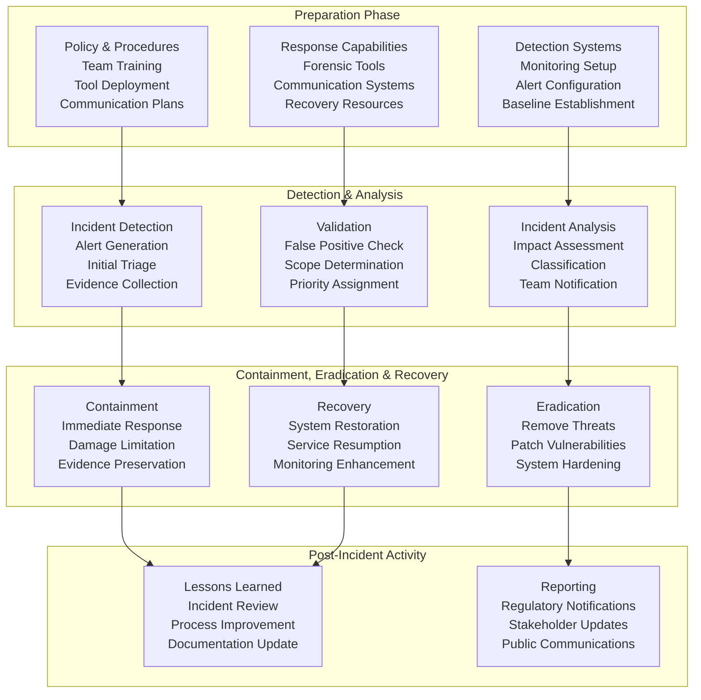
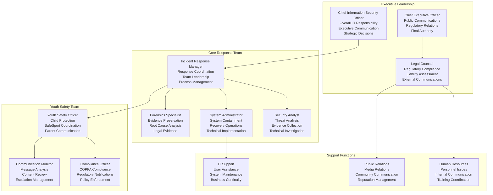
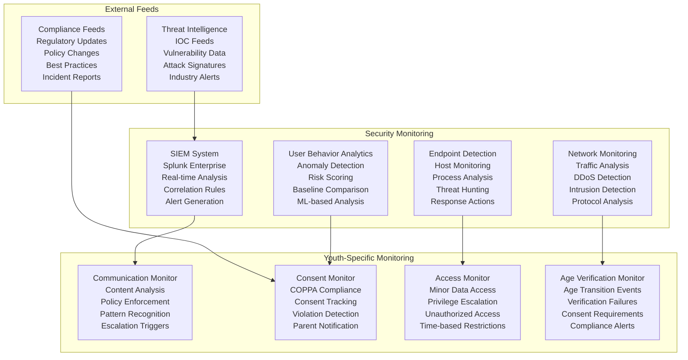
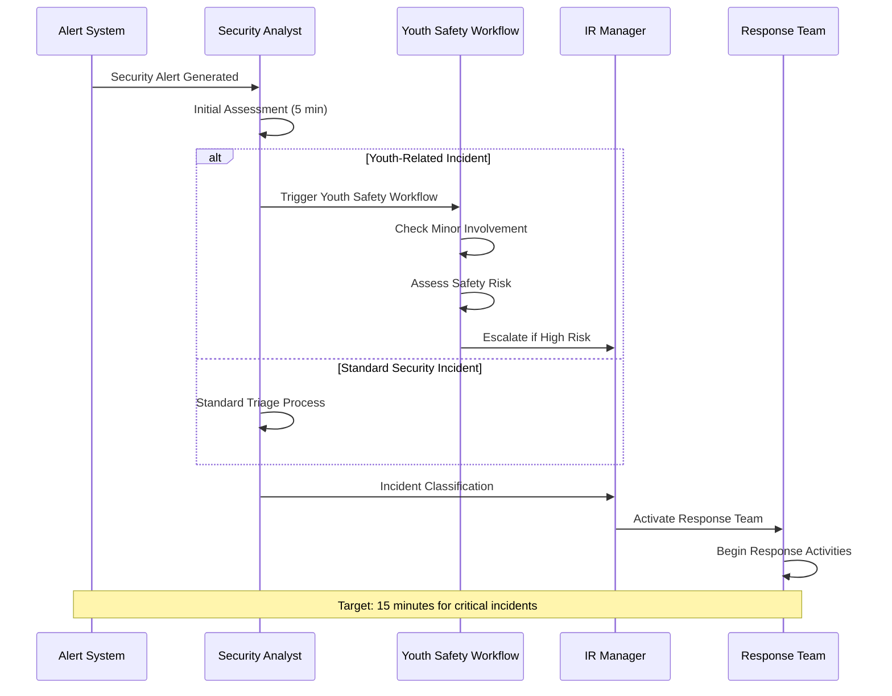
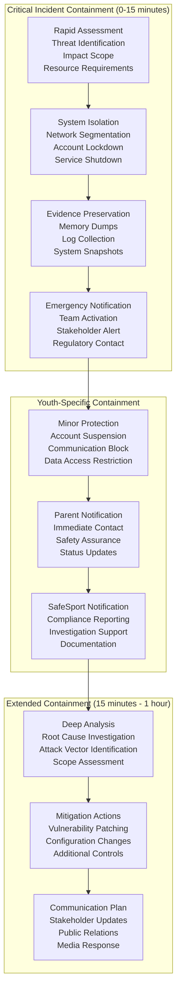
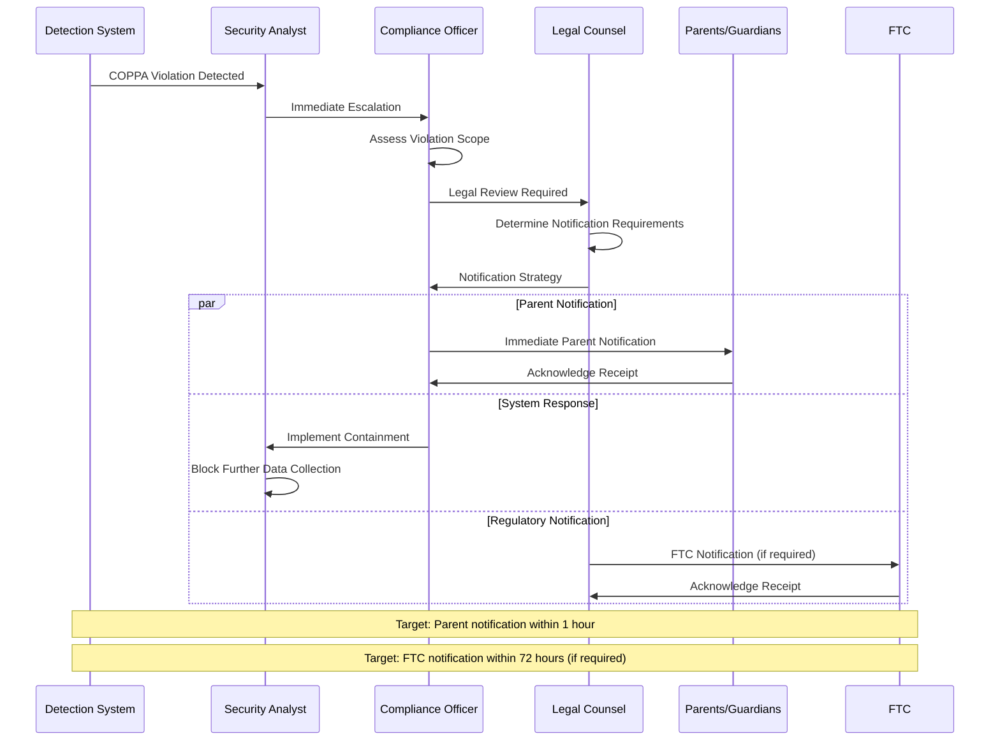
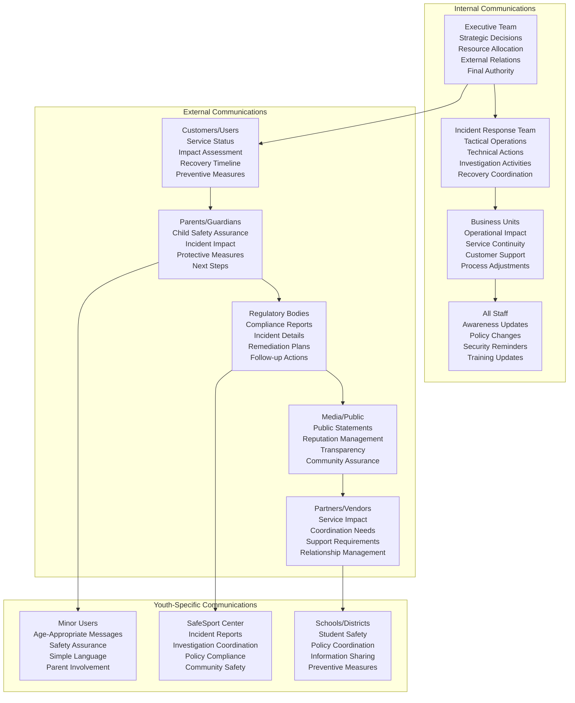

# Incident Response Plan
## Basketball League Management Platform - Phase 2

**Document ID:** IRP-001  
**Version:** 2.0  
**Date:** August 8, 2025  
**Author:** Youth Security Architect  
**Status:** Phase 2 Incident Response Framework  
**Classification:** Confidential - Incident Response  

---

## Executive Summary

This Incident Response Plan establishes comprehensive procedures for detecting, analyzing, containing, and recovering from security incidents affecting the Basketball League Management Platform. The plan includes specialized procedures for youth-related incidents, COPPA violations, SafeSport compliance breaches, and data breaches involving minor athletes, ensuring rapid response while maintaining regulatory compliance and stakeholder trust.

### Key Response Objectives
- **Rapid Detection**: Sub-15 minute detection for critical incidents
- **Swift Containment**: 1-hour containment for high-severity incidents
- **Youth Protection**: Specialized procedures for minor-related incidents
- **Compliance Adherence**: Regulatory notification within required timeframes
- **Service Continuity**: Minimal disruption to youth sports operations

---

## Table of Contents

1. [Incident Response Framework](#1-incident-response-framework)
2. [Incident Classification System](#2-incident-classification-system)
3. [Response Team Structure](#3-response-team-structure)
4. [Detection and Analysis](#4-detection-and-analysis)
5. [Containment and Eradication](#5-containment-and-eradication)
6. [Recovery and Lessons Learned](#6-recovery-and-lessons-learned)
7. [Youth-Specific Incident Procedures](#7-youth-specific-incident-procedures)
8. [Regulatory Notification Procedures](#8-regulatory-notification-procedures)
9. [Communication Protocols](#9-communication-protocols)
10. [Incident Response Playbooks](#10-incident-response-playbooks)

---

## 1. Incident Response Framework

### 1.1 NIST Incident Response Lifecycle



### 1.2 Youth Sports Platform Specific Considerations

#### 1.2.1 Special Response Requirements
- **Child Safety Priority**: Minor safety takes precedence over system availability
- **Parental Notification**: Parents must be notified of incidents affecting their children
- **Regulatory Compliance**: COPPA, SafeSport, and state privacy law notification requirements
- **Community Impact**: Youth sports community requires transparent communication
- **Seasonal Considerations**: Tournament seasons require enhanced response capabilities

#### 1.2.2 Platform-Specific Incident Types
- **COPPA Violations**: Unauthorized collection or use of child data
- **SafeSport Compliance Breaches**: Background check or training compliance failures
- **Communication Safety Incidents**: Inappropriate adult-minor communications
- **Age Verification Failures**: Incorrect age classification or consent bypassing
- **Tournament Day Disruptions**: Incidents during high-traffic tournament events

---

## 2. Incident Classification System

### 2.1 Severity Classification Matrix

| Severity | Impact Level | Response Time | Examples | Youth-Specific Considerations |
|----------|-------------|---------------|----------|------------------------------|
| **CRITICAL** | System-wide impact, youth safety risk | 15 minutes | Data breach with minor PII, SafeSport violation, platform outage during tournaments | Immediate parent/guardian notification |
| **HIGH** | Significant impact, compliance risk | 1 hour | Unauthorized access, communication policy violation, payment system breach | Parental notification within 24 hours |
| **MEDIUM** | Limited impact, service degradation | 4 hours | Performance issues, minor security events, training compliance gaps | Standard notification procedures |
| **LOW** | Minimal impact, informational | 24 hours | Failed login attempts, minor configuration issues | No special youth notifications |

### 2.2 Youth-Specific Incident Categories

#### 2.2.1 Category A: Child Safety Incidents
**Definition**: Incidents posing direct or indirect risk to minor participants

| Incident Type | Severity | Response Requirements | Notification Timeline |
|--------------|----------|----------------------|----------------------|
| **Inappropriate Communication** | HIGH-CRITICAL | SafeSport notification, law enforcement (if required) | Immediate |
| **Unauthorized Minor Data Access** | CRITICAL | COPPA violation procedures, parent notification | 1 hour |
| **Child Account Compromise** | HIGH | Account lockdown, parent notification | 30 minutes |
| **Age Verification Bypass** | HIGH | Account review, compliance assessment | 1 hour |

#### 2.2.2 Category B: Compliance Violations
**Definition**: Incidents violating youth protection regulations

| Incident Type | Severity | Response Requirements | Notification Timeline |
|--------------|----------|----------------------|----------------------|
| **COPPA Data Breach** | CRITICAL | FTC notification, parent notification | 72 hours |
| **SafeSport Violation** | HIGH | SafeSport center notification | 24 hours |
| **Background Check Failure** | HIGH | Role suspension, investigation | Immediate |
| **Training Compliance Lapse** | MEDIUM | Training renewal, monitoring | 24 hours |

#### 2.2.3 Category C: System Security Incidents
**Definition**: Traditional security incidents with youth platform implications

| Incident Type | Severity | Response Requirements | Notification Timeline |
|--------------|----------|----------------------|----------------------|
| **Data Breach** | CRITICAL | Full incident response, regulatory notifications | 72 hours |
| **System Compromise** | HIGH | Containment, forensics, recovery | 1 hour |
| **DDoS Attack** | MEDIUM-HIGH | Traffic filtering, capacity scaling | 30 minutes |
| **Malware Infection** | MEDIUM | Isolation, removal, system scanning | 1 hour |

### 2.3 Impact Assessment Framework

```javascript
// Incident impact assessment for youth platform
class IncidentImpactAssessment {
    assessIncidentImpact(incident) {
        const impact = {
            youthSafety: this.assessYouthSafetyImpact(incident),
            dataPrivacy: this.assessDataPrivacyImpact(incident),
            systemAvailability: this.assessAvailabilityImpact(incident),
            compliance: this.assessComplianceImpact(incident),
            reputation: this.assessReputationImpact(incident)
        };
        
        return {
            overallSeverity: this.calculateOverallSeverity(impact),
            impactDetails: impact,
            responseRequirements: this.determineResponseRequirements(impact),
            notificationRequirements: this.determineNotificationRequirements(impact)
        };
    }
    
    assessYouthSafetyImpact(incident) {
        const safetyFactors = {
            minorsAffected: incident.affectedUsers.filter(u => u.age < 18).length,
            communicationInvolved: incident.type.includes('COMMUNICATION'),
            adultMinorInteraction: incident.involvedRoles.includes('ADULT') && 
                                 incident.affectedUsers.some(u => u.age < 18),
            physicalSafetyRisk: incident.tags.includes('PHYSICAL_SAFETY'),
            immediateRisk: incident.urgency === 'IMMEDIATE'
        };
        
        let riskScore = 0;
        if (safetyFactors.minorsAffected > 0) riskScore += 3;
        if (safetyFactors.communicationInvolved) riskScore += 2;
        if (safetyFactors.adultMinorInteraction) riskScore += 3;
        if (safetyFactors.physicalSafetyRisk) riskScore += 4;
        if (safetyFactors.immediateRisk) riskScore += 2;
        
        return {
            riskScore: Math.min(riskScore, 10),
            factors: safetyFactors,
            riskLevel: this.calculateRiskLevel(riskScore),
            requiresImmediateAction: riskScore >= 7
        };
    }
    
    assessComplianceImpact(incident) {
        const complianceImpact = {
            coppaViolation: this.checkCOPPAViolation(incident),
            safeSportViolation: this.checkSafeSportViolation(incident),
            privacyLawViolation: this.checkPrivacyLawViolation(incident),
            financialRegulationViolation: this.checkFinancialViolation(incident)
        };
        
        return {
            hasViolation: Object.values(complianceImpact).some(v => v.violated),
            violations: complianceImpact,
            notificationRequirements: this.getNotificationRequirements(complianceImpact),
            potentialPenalties: this.calculatePotentialPenalties(complianceImpact)
        };
    }
}
```

---

## 3. Response Team Structure

### 3.1 Incident Response Organization



### 3.2 Team Responsibilities and Contact Information

#### 3.2.1 Primary Response Team
| Role | Primary | Backup | 24/7 Contact | Escalation Time |
|------|---------|---------|-------------|----------------|
| **Incident Response Manager** | John Smith | Jane Doe | +1-555-0101 | N/A |
| **Security Analyst** | Alice Johnson | Bob Wilson | +1-555-0102 | 15 minutes |
| **System Administrator** | Carol Davis | Dan Miller | +1-555-0103 | 15 minutes |
| **Youth Safety Officer** | Emily Chen | Frank Rodriguez | +1-555-0104 | Immediate |
| **Compliance Officer** | Grace Kim | Henry Taylor | +1-555-0105 | 30 minutes |
| **Legal Counsel** | Ivan Petrov | Julia Anderson | +1-555-0106 | 1 hour |

#### 3.2.2 Response Team Activation
```javascript
// Automated response team activation
class ResponseTeamActivation {
    async activateTeam(incident) {
        const requiredTeam = this.determineRequiredTeam(incident);
        const activationPlan = this.createActivationPlan(requiredTeam, incident);
        
        // Parallel activation of team members
        const activationResults = await Promise.all(
            activationPlan.members.map(member => this.activateTeamMember(member, incident))
        );
        
        // Set up incident coordination channel
        const coordinationChannel = await this.setupCoordinationChannel(incident.id);
        
        // Initialize incident tracking
        const incidentTracker = await this.initializeIncidentTracker(incident, requiredTeam);
        
        return {
            teamActivated: activationResults.filter(r => r.activated).length,
            coordinationChannel: coordinationChannel,
            incidentTracker: incidentTracker,
            estimatedResponseTime: this.calculateResponseTime(activationResults)
        };
    }
    
    determineRequiredTeam(incident) {
        const baseTeam = ['IR_MANAGER', 'SECURITY_ANALYST'];
        
        // Add youth safety team for minor-related incidents
        if (incident.involveMinors || incident.category.includes('YOUTH')) {
            baseTeam.push('YOUTH_SAFETY_OFFICER', 'COMPLIANCE_OFFICER');
        }
        
        // Add legal counsel for high-severity incidents
        if (incident.severity >= 'HIGH') {
            baseTeam.push('LEGAL_COUNSEL');
        }
        
        // Add executive team for critical incidents
        if (incident.severity === 'CRITICAL') {
            baseTeam.push('CISO', 'CEO');
        }
        
        return baseTeam;
    }
}
```

---

## 4. Detection and Analysis

### 4.1 Detection Systems and Monitoring

#### 4.1.1 Automated Detection Systems


#### 4.1.2 Detection Rules and Signatures

**Youth-Specific Detection Rules:**
```javascript
// Youth safety detection rules
const youthSafetyRules = {
    // Inappropriate communication detection
    inappropriateCommunication: {
        trigger: 'adult_to_minor_communication',
        conditions: [
            'message_content_risk_score > 0.7',
            'communication_time between 21:00 and 06:00',
            'private_message = true',
            'sender_safesport_compliant = false'
        ],
        severity: 'HIGH',
        response: 'IMMEDIATE_HUMAN_REVIEW'
    },
    
    // COPPA violation detection
    coppaViolation: {
        trigger: 'minor_data_collection',
        conditions: [
            'user_age < 13',
            'parental_consent = false',
            'data_collection_attempt = true'
        ],
        severity: 'CRITICAL',
        response: 'BLOCK_AND_INVESTIGATE'
    },
    
    // Excessive minor data access
    excessiveMinorDataAccess: {
        trigger: 'minor_data_access_pattern',
        conditions: [
            'minor_data_access_count > 50 in 1 hour',
            'accessor_role in [coach, volunteer, admin]',
            'access_pattern_unusual = true'
        ],
        severity: 'HIGH',
        response: 'INVESTIGATE_ACCESS_PATTERN'
    }
};
```

### 4.2 Incident Triage and Analysis

#### 4.2.1 Initial Triage Process


#### 4.2.2 Analysis Framework
```javascript
// Comprehensive incident analysis
class IncidentAnalyzer {
    async analyzeIncident(alert) {
        const analysis = {
            basicInfo: await this.extractBasicInfo(alert),
            youthInvolvement: await this.assessYouthInvolvement(alert),
            impactAssessment: await this.assessImpact(alert),
            threatAnalysis: await this.analyzeThreat(alert),
            evidenceCollection: await this.collectEvidence(alert),
            recommendedActions: await this.recommendActions(alert)
        };
        
        // Special analysis for youth-related incidents
        if (analysis.youthInvolvement.minorsInvolved) {
            analysis.youthSpecificAnalysis = await this.performYouthAnalysis(alert);
            analysis.complianceImpact = await this.assessComplianceImpact(alert);
            analysis.parentNotificationRequired = await this.checkParentNotification(alert);
        }
        
        return analysis;
    }
    
    async performYouthAnalysis(alert) {
        return {
            affectedMinors: await this.identifyAffectedMinors(alert),
            communicationInvolved: await this.checkCommunicationInvolvement(alert),
            dataExposureRisk: await this.assessDataExposureRisk(alert),
            safeSportImplications: await this.checkSafeSportImplications(alert),
            immediateRisks: await this.identifyImmediateRisks(alert),
            requiredNotifications: await this.determineRequiredNotifications(alert)
        };
    }
    
    async assessComplianceImpact(alert) {
        const complianceAssessment = {
            coppa: await this.checkCOPPAImpact(alert),
            safeSport: await this.checkSafeSportImpact(alert),
            statePrivacyLaws: await this.checkStatePrivacyImpact(alert),
            ferpa: await this.checkFERPAImpact(alert)
        };
        
        return {
            hasComplianceImpact: Object.values(complianceAssessment).some(c => c.violated),
            violations: complianceAssessment,
            notificationTimeframes: this.getNotificationTimeframes(complianceAssessment),
            potentialPenalties: this.calculatePotentialPenalties(complianceAssessment)
        };
    }
}
```

---

## 5. Containment and Eradication

### 5.1 Containment Strategies

#### 5.1.1 Immediate Containment Actions



#### 5.1.2 Containment Decision Matrix

| Incident Type | Immediate Actions | Youth-Specific Actions | Timeline |
|---------------|------------------|------------------------|----------|
| **COPPA Data Breach** | System isolation, log preservation | Block data access, parent notification | 15 minutes |
| **Inappropriate Communication** | Communication blocking, account suspension | Parent/guardian alert, SafeSport notification | 5 minutes |
| **System Compromise** | Network isolation, service shutdown | Check minor data exposure, enhanced monitoring | 15 minutes |
| **DDoS Attack** | Traffic filtering, capacity scaling | Tournament protection, communication continuity | 10 minutes |
| **Malware Infection** | Host isolation, malware analysis | Scan for PII exposure, verify data integrity | 20 minutes |

### 5.2 Eradication Procedures

#### 5.2.1 Threat Eradication Workflow
```javascript
// Threat eradication workflow
class ThreatEradicationManager {
    async eradicateThreat(incident) {
        const eradicationPlan = await this.createEradicationPlan(incident);
        const eradicationResults = {
            threatsRemoved: [],
            vulnerabilitiesPatched: [],
            systemsHardened: [],
            youthDataSecured: []
        };
        
        // Phase 1: Remove immediate threats
        for (const threat of eradicationPlan.immediateThreats) {
            const removalResult = await this.removeThreat(threat);
            eradicationResults.threatsRemoved.push(removalResult);
        }
        
        // Phase 2: Patch vulnerabilities
        for (const vulnerability of eradicationPlan.vulnerabilities) {
            const patchResult = await this.patchVulnerability(vulnerability);
            eradicationResults.vulnerabilitiesPatched.push(patchResult);
        }
        
        // Phase 3: Harden systems (youth-specific hardening)
        if (incident.involvesMinors) {
            const youthHardening = await this.applyYouthSpecificHardening(incident);
            eradicationResults.youthDataSecured = youthHardening;
        }
        
        // Phase 4: Verify eradication
        const verificationResult = await this.verifyEradication(incident);
        
        return {
            eradicationComplete: verificationResult.complete,
            results: eradicationResults,
            additionalActionsRequired: verificationResult.additionalActions,
            youthSafetyVerified: verificationResult.youthSafetyVerified
        };
    }
    
    async applyYouthSpecificHardening(incident) {
        const hardeningActions = [];
        
        // Enhanced access controls for minor data
        if (incident.type.includes('DATA_BREACH') && incident.affectedMinors.length > 0) {
            hardeningActions.push(await this.enhanceMinorDataProtection());
        }
        
        // Communication monitoring enhancements
        if (incident.type.includes('COMMUNICATION')) {
            hardeningActions.push(await this.enhanceCommunicationMonitoring());
        }
        
        // Age verification strengthening
        if (incident.type.includes('AGE_VERIFICATION')) {
            hardeningActions.push(await this.strengthenAgeVerification());
        }
        
        return hardeningActions;
    }
}
```

---

## 6. Recovery and Lessons Learned

### 6.1 Recovery Procedures

#### 6.1.1 Service Recovery Framework

```mermaid
graph TB
    subgraph "Recovery Planning"
        ASSESS_DAMAGE[Damage Assessment<br/>System Status<br/>Data Integrity<br/>Service Impact<br/>Youth Safety Status]
        
        RECOVERY_PLAN[Recovery Plan<br/>Priority Services<br/>Resource Requirements<br/>Timeline Definition<br/>Risk Assessment]
        
        STAKEHOLDER_COMM[Stakeholder Communication<br/>Service Status<br/>Recovery Timeline<br/>Impact Mitigation<br/>Next Steps]
    end
    
    subgraph "Recovery Execution"
        RESTORE_SYSTEMS[System Restoration<br/>Service Restart<br/>Data Recovery<br/>Performance Validation<br/>Security Verification]
        
        VALIDATE_YOUTH_SAFETY[Youth Safety Validation<br/>Data Integrity Check<br/>Communication System Test<br/>Access Control Verification<br/>Monitoring Restoration]
        
        MONITOR_RECOVERY[Recovery Monitoring<br/>Performance Metrics<br/>Error Detection<br/>User Experience<br/>Security Posture]
    end
    
    subgraph "Recovery Validation"
        FUNCTIONAL_TEST[Functional Testing<br/>End-to-end Testing<br/>User Acceptance<br/>Performance Validation<br/>Security Testing]
        
        YOUTH_SPECIFIC_TEST[Youth-Specific Testing<br/>COPPA Compliance<br/>Communication Safety<br/>Parental Controls<br/>Age Verification]
        
        GO_LIVE[Production Release<br/>Service Announcement<br/>Monitoring Enhancement<br/>Support Readiness<br/>Incident Closure]
    end
    
    ASSESS_DAMAGE --> RECOVERY_PLAN
    RECOVERY_PLAN --> STAKEHOLDER_COMM
    STAKEHOLDER_COMM --> RESTORE_SYSTEMS
    
    RESTORE_SYSTEMS --> VALIDATE_YOUTH_SAFETY
    VALIDATE_YOUTH_SAFETY --> MONITOR_RECOVERY
    
    MONITOR_RECOVERY --> FUNCTIONAL_TEST
    FUNCTIONAL_TEST --> YOUTH_SPECIFIC_TEST
    YOUTH_SPECIFIC_TEST --> GO_LIVE
```


#### 6.1.2 Recovery Validation Checklist

**System Recovery Validation:**
- [ ] All services operational and performance within SLA
- [ ] Data integrity verified through checksums and validation scripts
- [ ] Security controls functioning and monitoring active
- [ ] Backup systems operational and tested
- [ ] Network connectivity and performance restored

**Youth Safety Recovery Validation:**
- [ ] COPPA compliance controls operational
- [ ] SafeSport integration functioning
- [ ] Communication monitoring active and effective
- [ ] Parental consent systems operational
- [ ] Age verification processes working correctly
- [ ] Minor data access controls enforced
- [ ] Emergency communication systems functional

### 6.2 Post-Incident Analysis

#### 6.2.1 Lessons Learned Process
```javascript
// Post-incident analysis and lessons learned
class PostIncidentAnalysis {
    async conductLessonsLearned(incident) {
        const analysis = {
            incidentSummary: await this.generateIncidentSummary(incident),
            timelineAnalysis: await this.analyzeResponseTimeline(incident),
            effectivenessAssessment: await this.assessResponseEffectiveness(incident),
            youthSafetyReview: await this.reviewYouthSafetyResponse(incident),
            improvementOpportunities: await this.identifyImprovements(incident),
            actionItems: await this.createActionItems(incident)
        };
        
        // Generate lessons learned report
        const report = await this.generateLessonsLearnedReport(analysis);
        
        // Schedule follow-up reviews
        await this.scheduleFollowUpReviews(analysis.actionItems);
        
        // Update incident response procedures
        await this.updateIncidentProcedures(analysis.improvementOpportunities);
        
        return {
            report: report,
            actionItems: analysis.actionItems,
            procedureUpdates: analysis.improvementOpportunities,
            followUpScheduled: true
        };
    }
    
    async reviewYouthSafetyResponse(incident) {
        if (!incident.involvesMinors) {
            return { applicable: false };
        }
        
        return {
            applicable: true,
            parentNotificationEffectiveness: await this.assessParentNotification(incident),
            complianceAdherence: await this.assessComplianceAdherence(incident),
            communicationSafetyResponse: await this.assessCommunicationResponse(incident),
            minorDataProtection: await this.assessMinorDataProtection(incident),
            safeSportCoordination: await this.assessSafeSportCoordination(incident),
            recommendedImprovements: await this.identifyYouthSafetyImprovements(incident)
        };
    }
    
    async identifyImprovements(incident) {
        const improvements = [];
        
        // Detection improvements
        if (incident.detectionTime > incident.targetDetectionTime) {
            improvements.push({
                area: 'DETECTION',
                issue: 'Detection time exceeded target',
                recommendation: 'Enhance monitoring rules and alert tuning',
                priority: 'HIGH',
                timeline: '30 days'
            });
        }
        
        // Youth-specific improvements
        if (incident.involvesMinors) {
            const youthImprovements = await this.identifyYouthSpecificImprovements(incident);
            improvements.push(...youthImprovements);
        }
        
        return improvements.sort((a, b) => this.priorityScore(b.priority) - this.priorityScore(a.priority));
    }
}
```

---

## 7. Youth-Specific Incident Procedures

### 7.1 COPPA Violation Response

#### 7.1.1 COPPA Incident Response Workflow


#### 7.1.2 COPPA Response Procedures
```javascript
// COPPA violation response procedures
class COPPAViolationResponse {
    async respondToCOPPAViolation(incident) {
        const response = {
            immediateActions: [],
            parentNotifications: [],
            regulatoryActions: [],
            systemChanges: []
        };
        
        // Step 1: Immediate containment
        if (incident.type === 'UNAUTHORIZED_DATA_COLLECTION') {
            response.immediateActions.push(
                await this.blockUnauthorizedDataCollection(incident)
            );
        }
        
        // Step 2: Assess affected minors
        const affectedMinors = await this.identifyAffectedMinors(incident);
        
        // Step 3: Parent notification
        for (const minor of affectedMinors) {
            const notificationResult = await this.notifyParent({
                minorId: minor.id,
                parentId: minor.parentId,
                violationType: incident.type,
                dataInvolved: incident.dataTypes,
                immediateActions: response.immediateActions,
                timeline: incident.timeline,
                nextSteps: this.getParentNextSteps(incident)
            });
            response.parentNotifications.push(notificationResult);
        }
        
        // Step 4: Regulatory assessment
        const regulatoryRequirement = await this.assessRegulatoryNotification(incident);
        if (regulatoryRequirement.required) {
            response.regulatoryActions.push(
                await this.initiateRegulatoryNotification(incident, regulatoryRequirement)
            );
        }
        
        // Step 5: System remediation
        response.systemChanges.push(
            await this.implementCOPPASystemRemediation(incident)
        );
        
        return response;
    }
    
    async notifyParent(notificationData) {
        const notification = {
            recipientId: notificationData.parentId,
            subject: `Important: Data Privacy Incident Affecting Your Child`,
            content: this.generateParentNotificationContent(notificationData),
            urgency: 'HIGH',
            deliveryMethods: ['EMAIL', 'SMS', 'IN_APP'],
            acknowledgmentRequired: true,
            followUpRequired: true
        };
        
        const deliveryResult = await this.deliverNotification(notification);
        
        // Schedule follow-up if no acknowledgment
        if (!deliveryResult.acknowledged) {
            await this.scheduleNotificationFollowUp(notification, '1 hour');
        }
        
        return {
            notificationId: deliveryResult.notificationId,
            deliveryStatus: deliveryResult.status,
            acknowledgmentReceived: deliveryResult.acknowledged,
            parentResponse: deliveryResult.response
        };
    }
}
```

### 7.2 SafeSport Incident Response

#### 7.2.1 SafeSport Incident Categories and Responses

| Incident Type | Immediate Response | SafeSport Notification | Investigation Required | Timeline |
|---------------|-------------------|----------------------|---------------------|----------|
| **Background Check Failure** | Role suspension, access revocation | Yes, within 24 hours | Yes | Immediate |
| **Training Non-Compliance** | Role restriction, training mandate | Yes, within 48 hours | Administrative | 24 hours |
| **Inappropriate Communication** | Communication block, investigation | Yes, immediate | Yes | Immediate |
| **Policy Violation** | Review and appropriate action | Case-by-case basis | Yes | 48 hours |

#### 7.2.2 SafeSport Response Implementation
```javascript
// SafeSport incident response
class SafeSportIncidentResponse {
    async respondToSafeSportIncident(incident) {
        const response = await this.classifySafeSportIncident(incident);
        
        switch (response.category) {
            case 'BACKGROUND_CHECK_FAILURE':
                return await this.handleBackgroundCheckFailure(incident);
            case 'INAPPROPRIATE_COMMUNICATION':
                return await this.handleInappropriateCommunication(incident);
            case 'TRAINING_NON_COMPLIANCE':
                return await this.handleTrainingNonCompliance(incident);
            case 'POLICY_VIOLATION':
                return await this.handlePolicyViolation(incident);
            default:
                return await this.handleGenericSafeSportIncident(incident);
        }
    }
    
    async handleInappropriateCommunication(incident) {
        const response = {
            immediateActions: [],
            investigations: [],
            notifications: [],
            preventiveActions: []
        };
        
        // Immediate actions
        response.immediateActions.push(
            await this.blockCommunicationChannels(incident.involvedUsers),
            await this.preserveCommunicationEvidence(incident),
            await this.suspendUserAccounts(incident.violatingUsers)
        );
        
        // Start investigation
        response.investigations.push(
            await this.initiateInternalInvestigation(incident),
            await this.collectWitnessStatements(incident),
            await this.analyzeCommunicationPatterns(incident)
        );
        
        // Notifications
        response.notifications.push(
            await this.notifyAffectedParents(incident),
            await this.notifySafeSportCenter(incident),
            await this.notifyLeagueAdministration(incident)
        );
        
        // Preventive actions
        response.preventiveActions.push(
            await this.enhanceCommunicationMonitoring(),
            await this.reviewCommunicationPolicies(),
            await this.scheduleAdditionalTraining(incident.relevantUsers)
        );
        
        return response;
    }
}
```

---

## 8. Regulatory Notification Procedures

### 8.1 Notification Requirements Matrix

| Incident Type | Regulation | Notification Timeline | Recipient | Content Requirements |
|---------------|------------|----------------------|-----------|---------------------|
| **Minor Data Breach** | COPPA | 72 hours | FTC, State AG, Parents | Scope, impact, remediation |
| **SafeSport Violation** | SafeSport Act | 24 hours | U.S. Center for SafeSport | Incident details, investigation |
| **Payment Data Breach** | PCI DSS | 72 hours | Card brands, banks | Scope, affected accounts |
| **General Data Breach** | State laws | 72 hours | State AG, affected users | Legal requirements vary |

### 8.2 Regulatory Notification Implementation

#### 8.2.1 Automated Notification System
```javascript
// Regulatory notification automation
class RegulatoryNotificationManager {
    async processRegulatoryNotifications(incident) {
        const notifications = await this.determineRequiredNotifications(incident);
        const results = [];
        
        for (const notification of notifications) {
            const result = await this.processNotification(notification, incident);
            results.push(result);
            
            // Track notification for compliance
            await this.trackNotificationCompliance(notification, result);
        }
        
        return {
            notificationsSent: results.filter(r => r.sent).length,
            notificationsFailed: results.filter(r => !r.sent).length,
            complianceStatus: await this.assessNotificationCompliance(results),
            followUpRequired: results.filter(r => r.followUpRequired)
        };
    }
    
    async determineRequiredNotifications(incident) {
        const notifications = [];
        
        // COPPA notifications
        if (this.affectsMinors(incident) && this.isCOPPAViolation(incident)) {
            notifications.push({
                type: 'COPPA_VIOLATION',
                recipients: ['FTC', 'STATE_AG', 'AFFECTED_PARENTS'],
                timeline: '72_HOURS',
                priority: 'CRITICAL',
                template: 'COPPA_BREACH_NOTIFICATION'
            });
        }
        
        // SafeSport notifications
        if (this.isSafeSportIncident(incident)) {
            notifications.push({
                type: 'SAFESPORT_INCIDENT',
                recipients: ['SAFESPORT_CENTER'],
                timeline: '24_HOURS',
                priority: 'HIGH',
                template: 'SAFESPORT_INCIDENT_REPORT'
            });
        }
        
        return notifications;
    }
    
    async generateNotificationContent(notification, incident) {
        const template = await this.getNotificationTemplate(notification.template);
        const content = {
            organizationInfo: await this.getOrganizationInfo(),
            incidentDetails: await this.getIncidentDetails(incident),
            affectedIndividuals: await this.getAffectedIndividuals(incident),
            responseActions: await this.getResponseActions(incident),
            preventiveMeasures: await this.getPreventiveMeasures(incident),
            contactInformation: await this.getContactInformation(),
            timeline: await this.getIncidentTimeline(incident)
        };
        
        return template.render(content);
    }
}
```

---

## 9. Communication Protocols

### 9.1 Communication Matrix



### 9.2 Communication Templates

#### 9.2.1 Parent Notification Template
```javascript
// Parent notification template for youth incidents
const parentNotificationTemplate = {
    subject: "Important Security Update Regarding Your Child's Account",
    
    generateContent(incident, childInfo, parentInfo) {
        return `
        Dear ${parentInfo.name},

        We are writing to inform you of a security incident that may have affected your child's account on our basketball league platform.

        INCIDENT SUMMARY:
        - Date: ${incident.date}
        - Type: ${this.getParentFriendlyIncidentType(incident.type)}
        - Your child's involvement: ${this.describeChildInvolvement(incident, childInfo)}

        IMMEDIATE ACTIONS WE'VE TAKEN:
        ${this.listImmediateActions(incident)}

        YOUR CHILD'S SAFETY:
        ${this.describeSafetyMeasures(incident, childInfo)}

        WHAT YOU NEED TO KNOW:
        ${this.listParentActions(incident)}

        NEXT STEPS:
        ${this.describeNextSteps(incident)}

        We take the privacy and safety of all our young athletes very seriously. If you have any questions or concerns, please contact us immediately at:

        Emergency Contact: ${this.getEmergencyContact()}
        Email: security@basketballleague.com
        Phone: 1-800-XXX-XXXX (24/7 hotline)

        Thank you for your trust in our platform. We are committed to maintaining the highest standards of safety for your child.

        Sincerely,
        Basketball League Management Team
        `;
    }
};
```

---

## 10. Incident Response Playbooks

### 10.1 Critical Incident Playbooks

#### 10.1.1 COPPA Data Breach Playbook

**Playbook: COPPA-001**
**Trigger**: Unauthorized collection, use, or disclosure of data from users under 13

**Immediate Response (0-15 minutes):**
1. **Containment**
   - [ ] Stop unauthorized data collection/processing
   - [ ] Isolate affected systems
   - [ ] Preserve evidence and logs
   - [ ] Document initial findings

2. **Team Activation**
   - [ ] Activate Compliance Officer
   - [ ] Engage Legal Counsel
   - [ ] Notify Youth Safety Officer
   - [ ] Alert Executive Team

3. **Initial Assessment**
   - [ ] Identify affected minors
   - [ ] Determine data types involved
   - [ ] Assess potential harm
   - [ ] Estimate notification scope

**Short-term Response (15 minutes - 1 hour):**
1. **Investigation**
   - [ ] Root cause analysis
   - [ ] Timeline reconstruction
   - [ ] Impact assessment
   - [ ] Evidence collection

2. **Parent Notification Preparation**
   - [ ] Prepare notification content
   - [ ] Verify parent contact information
   - [ ] Set up communication channels
   - [ ] Plan notification delivery

**Medium-term Response (1-24 hours):**
1. **Parent Notifications**
   - [ ] Send initial notifications
   - [ ] Track delivery and responses
   - [ ] Handle parent inquiries
   - [ ] Provide ongoing updates

2. **Regulatory Assessment**
   - [ ] Determine FTC notification requirement
   - [ ] Assess state law requirements
   - [ ] Prepare regulatory notifications
   - [ ] Coordinate with legal counsel

**Long-term Response (24-72 hours):**
1. **Regulatory Notifications**
   - [ ] Submit FTC notification (if required)
   - [ ] File state notifications
   - [ ] Respond to regulatory inquiries
   - [ ] Provide additional documentation

2. **System Remediation**
   - [ ] Implement technical fixes
   - [ ] Update policies and procedures
   - [ ] Enhance monitoring
   - [ ] Train staff on changes

#### 10.1.2 SafeSport Violation Playbook

**Playbook: SAFESPORT-001**
**Trigger**: Violation of SafeSport policies or inappropriate adult-minor interactions

**Immediate Response (0-5 minutes):**
1. **Safety First**
   - [ ] Assess immediate risk to minors
   - [ ] Suspend violating user accounts
   - [ ] Block communication channels
   - [ ] Preserve evidence

2. **Emergency Protocols**
   - [ ] Contact law enforcement (if criminal activity suspected)
   - [ ] Notify parents of affected minors
   - [ ] Activate Youth Safety Officer
   - [ ] Secure incident evidence

**Investigation Phase (5 minutes - 2 hours):**
1. **Evidence Collection**
   - [ ] Preserve communication records
   - [ ] Collect witness statements
   - [ ] Document behavioral patterns
   - [ ] Secure system logs

2. **Risk Assessment**
   - [ ] Evaluate ongoing risks
   - [ ] Identify additional victims
   - [ ] Assess policy violations
   - [ ] Determine response scope

**Response Actions (2-24 hours):**
1. **SafeSport Notification**
   - [ ] Prepare incident report
   - [ ] Submit to SafeSport Center
   - [ ] Coordinate investigation
   - [ ] Provide ongoing updates

2. **Internal Actions**
   - [ ] Conduct internal investigation
   - [ ] Interview relevant parties
   - [ ] Review policy compliance
   - [ ] Implement corrective measures

### 10.2 Playbook Execution Tracking

```javascript
// Playbook execution tracking system
class PlaybookExecutor {
    async executePlaybook(playbookId, incident) {
        const playbook = await this.getPlaybook(playbookId);
        const execution = {
            playbookId: playbookId,
            incidentId: incident.id,
            startTime: new Date().toISOString(),
            phases: [],
            currentPhase: 0,
            overallStatus: 'IN_PROGRESS'
        };
        
        for (let i = 0; i < playbook.phases.length; i++) {
            const phase = playbook.phases[i];
            const phaseExecution = await this.executePhase(phase, incident, execution);
            execution.phases.push(phaseExecution);
            execution.currentPhase = i + 1;
            
            // Check for critical failures
            if (phaseExecution.status === 'FAILED' && phase.critical) {
                execution.overallStatus = 'FAILED';
                break;
            }
            
            // Update tracking
            await this.updateExecutionTracking(execution);
        }
        
        execution.endTime = new Date().toISOString();
        execution.duration = Date.parse(execution.endTime) - Date.parse(execution.startTime);
        
        if (execution.overallStatus === 'IN_PROGRESS') {
            execution.overallStatus = 'COMPLETED';
        }
        
        return execution;
    }
    
    async executePhase(phase, incident, execution) {
        const phaseExecution = {
            phaseName: phase.name,
            startTime: new Date().toISOString(),
            tasks: [],
            status: 'IN_PROGRESS'
        };
        
        for (const task of phase.tasks) {
            const taskExecution = await this.executeTask(task, incident, execution);
            phaseExecution.tasks.push(taskExecution);
            
            // Handle task failures
            if (taskExecution.status === 'FAILED' && task.required) {
                phaseExecution.status = 'FAILED';
                return phaseExecution;
            }
        }
        
        phaseExecution.endTime = new Date().toISOString();
        phaseExecution.status = 'COMPLETED';
        return phaseExecution;
    }
}
```

---

## Conclusion

This comprehensive Incident Response Plan provides the Basketball League Management Platform with robust procedures for handling security incidents, with specialized focus on youth protection and regulatory compliance. The plan emphasizes rapid response, stakeholder communication, and regulatory adherence while maintaining service continuity and community trust.

Key implementation priorities include staff training on youth-specific procedures, testing of notification systems, and regular playbook exercises to ensure readiness. The plan's emphasis on automation and clear escalation procedures ensures consistent response quality regardless of incident timing or complexity.

Regular testing, updates, and lessons learned integration ensure the incident response capability evolves with the platform and maintains effectiveness against emerging threats to youth athlete safety and data privacy.

---

**Document Control**
- **Next Review Date:** November 8, 2025  
- **Review Frequency:** Quarterly testing, annual comprehensive review  
- **Owner:** Youth Security Architect  
- **Approvers:** CISO, Legal Counsel, Youth Safety Officer