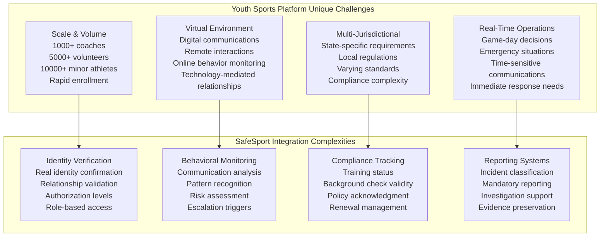
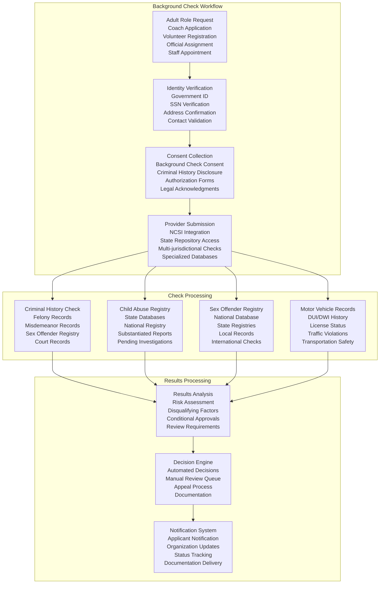
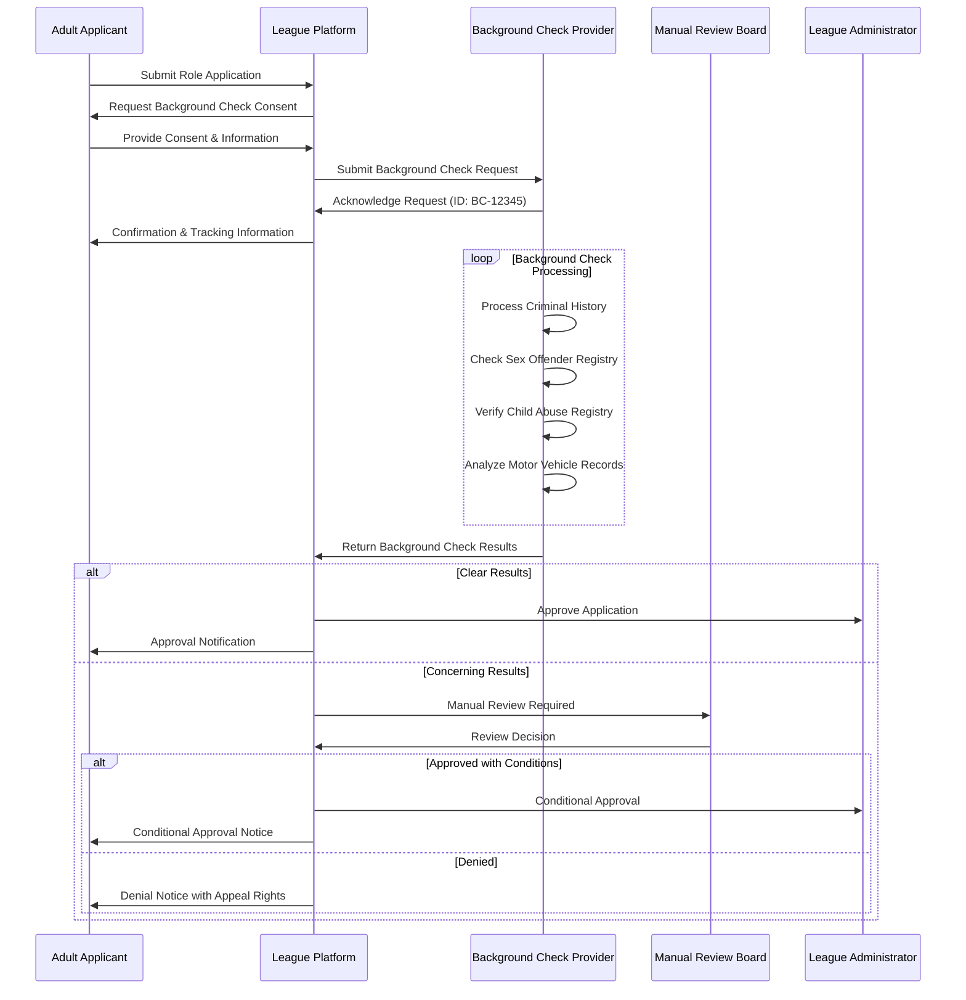
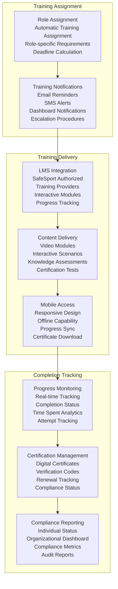
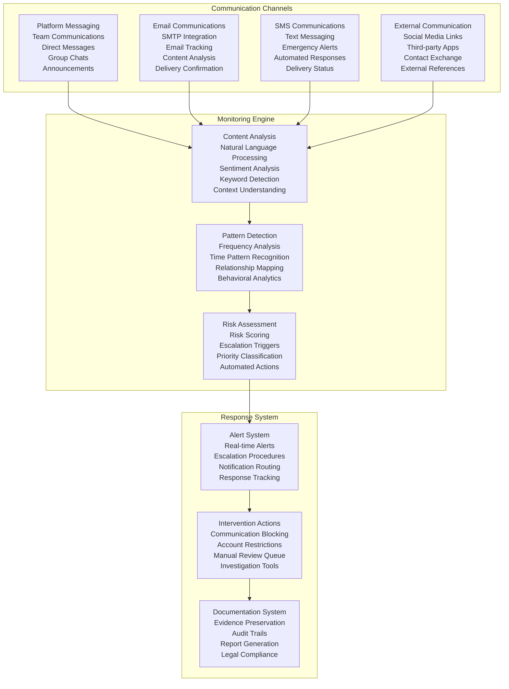
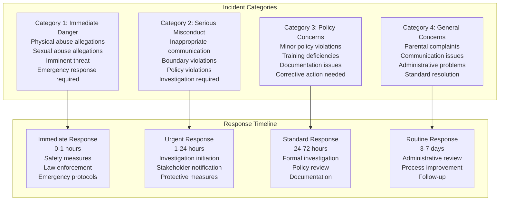
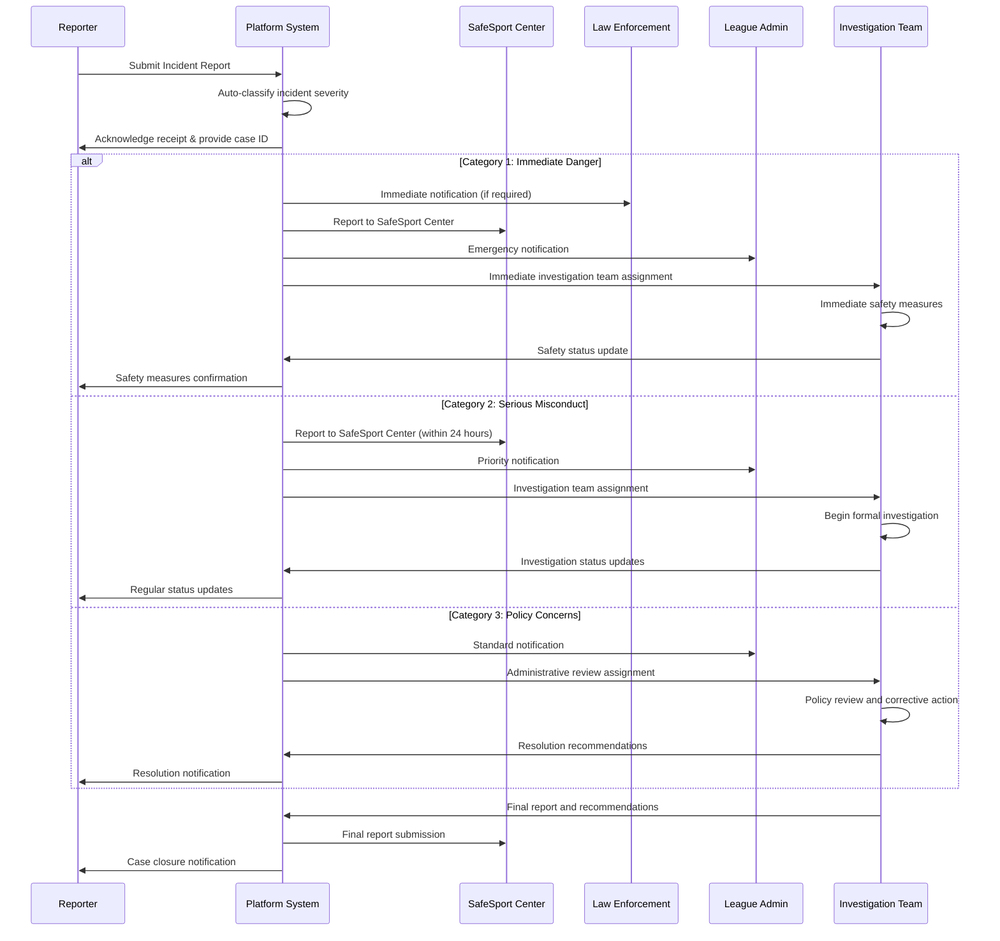
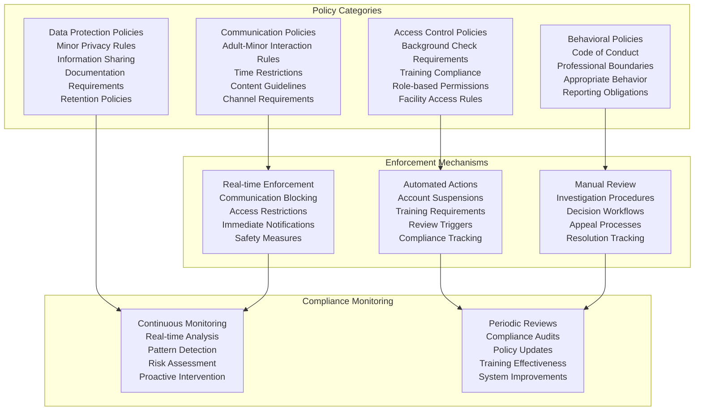
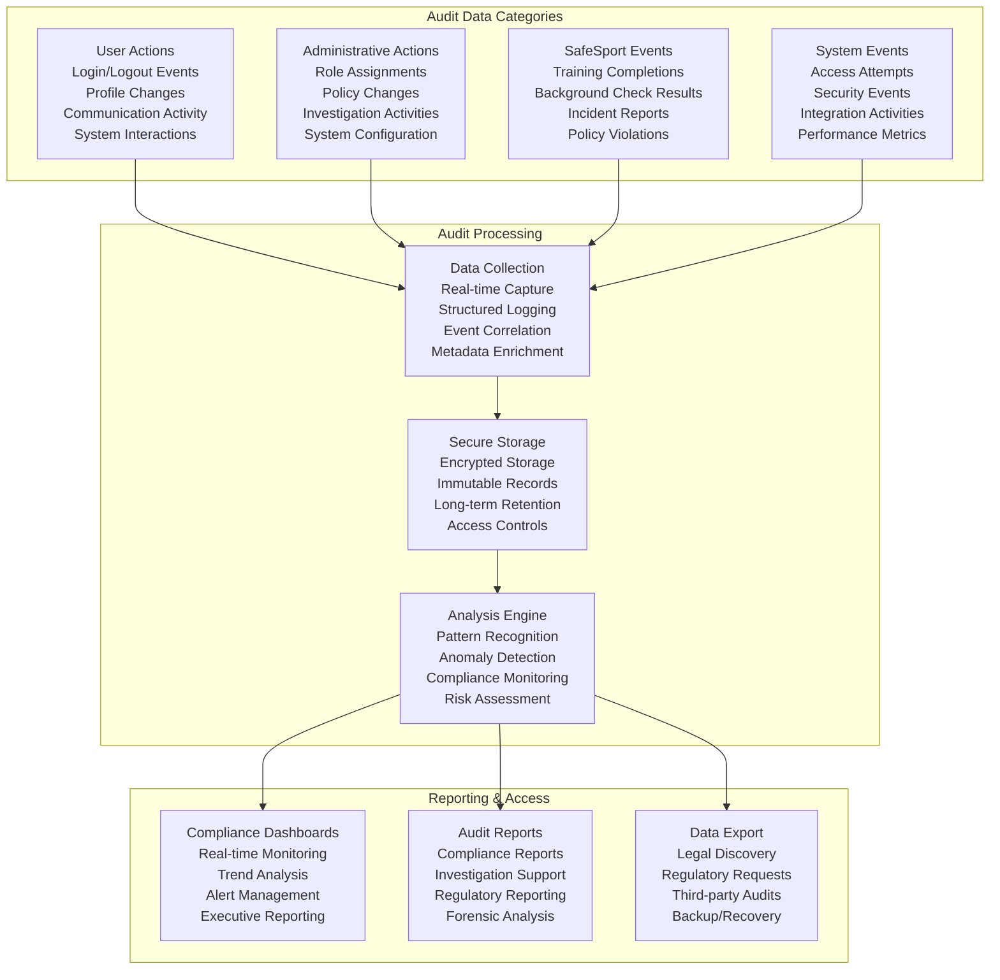
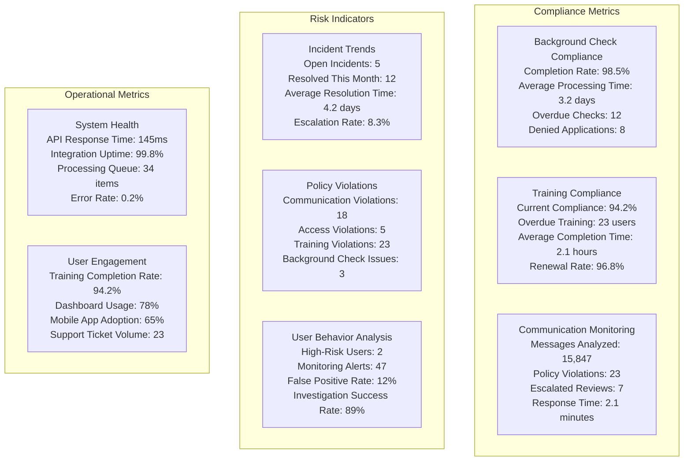

# SafeSport Integration Design
## Basketball League Management Platform - Phase 2

**Document ID:** SAFESPORT-INT-001  
**Version:** 2.0  
**Date:** August 8, 2025  
**Author:** Youth Security Architect  
**Status:** Phase 2 SafeSport Implementation  
**Classification:** Confidential - Youth Safety Framework  

---

## Executive Summary

This SafeSport Integration Design document defines comprehensive safety protocols and background check integration for the Basketball League Management Platform. The design ensures compliance with the SafeSport Authorization Act, implements robust background screening procedures, and establishes monitoring systems to protect minor athletes from abuse and misconduct. The integration provides a framework for creating safe environments in youth sports while maintaining operational efficiency.

### Key SafeSport Objectives
- **Background Check Integration**: Comprehensive screening for all adults with access to minors
- **Training Verification**: SafeSport education compliance tracking and enforcement
- **Communication Monitoring**: Transparent and appropriate adult-minor interactions
- **Incident Reporting**: Streamlined reporting and response procedures for safety concerns
- **Policy Enforcement**: Automated enforcement of youth protection policies

---

## Table of Contents

1. [SafeSport Regulatory Framework](#1-safesport-regulatory-framework)
2. [Background Check Integration](#2-background-check-integration)
3. [SafeSport Training Management](#3-safesport-training-management)
4. [Communication Monitoring System](#4-communication-monitoring-system)
5. [Incident Reporting & Response](#5-incident-reporting--response)
6. [Policy Enforcement Engine](#6-policy-enforcement-engine)
7. [Audit Trail & Compliance](#7-audit-trail--compliance)
8. [Integration Architecture](#8-integration-architecture)
9. [Operational Procedures](#9-operational-procedures)
10. [Monitoring & Analytics](#10-monitoring--analytics)

---

## 1. SafeSport Regulatory Framework

### 1.1 SafeSport Authorization Act Requirements

The SafeSport Authorization Act and related regulations establish comprehensive requirements for youth sports organizations:

**Core Requirements:**
1. **Background Checks**: Required for all adults in regular contact with minor athletes
2. **SafeSport Training**: Mandatory education for coaches, officials, and volunteers
3. **Reporting Obligations**: Mandatory reporting of suspected abuse or misconduct
4. **Communication Standards**: Guidelines for appropriate adult-minor interactions
5. **Incident Response**: Procedures for investigating and responding to reports
6. **Ongoing Monitoring**: Continuous oversight of adult participants

### 1.2 Platform-Specific SafeSport Challenges



### 1.3 Regulatory Compliance Matrix

| Regulation | Jurisdiction | Adult Categories | Requirements | Platform Implementation |
|------------|--------------|------------------|--------------|------------------------|
| **SafeSport Authorization Act** | Federal | All adult participants | Background checks, training | Integrated screening system |
| **Arizona State Requirements** | Arizona | Coaches, officials | State-specific checks | Multi-provider integration |
| **Local League Policies** | Phoenix Metro | Volunteers | Additional screening | Configurable policy engine |
| **Insurance Requirements** | Platform-wide | All covered roles | Risk mitigation | Compliance tracking |
| **Organizational Policies** | Platform-wide | All users | Code of conduct | Behavioral monitoring |

---

## 2. Background Check Integration

### 2.1 Background Check Architecture



### 2.2 Background Check Providers Integration

#### 2.2.1 Primary Provider: National Center for Safety Initiatives (NCSI)
**Integration Specifications:**
- **API Endpoint**: NCSI Background Check API v3.0
- **Authentication**: OAuth 2.0 with client credentials
- **Data Format**: JSON over HTTPS with TLS 1.3
- **Response Time**: 24-72 hours for comprehensive checks
- **Coverage**: 50 states + federal databases

**Check Categories:**
```javascript
// NCSI Background Check Request
const backgroundCheckRequest = {
    applicant: {
        personalInfo: {
            firstName: "string",
            lastName: "string",
            middleName: "string",
            dateOfBirth: "YYYY-MM-DD",
            socialSecurityNumber: "encrypted",
            driverLicenseNumber: "string"
        },
        addressHistory: [{
            street: "string",
            city: "string",
            state: "string",
            zipCode: "string",
            fromDate: "YYYY-MM-DD",
            toDate: "YYYY-MM-DD"
        }],
        contactInfo: {
            email: "string",
            phone: "string"
        }
    },
    checkTypes: [
        "CRIMINAL_HISTORY_COUNTY",
        "CRIMINAL_HISTORY_STATE", 
        "CRIMINAL_HISTORY_FEDERAL",
        "SEX_OFFENDER_REGISTRY",
        "CHILD_ABUSE_REGISTRY",
        "MOTOR_VEHICLE_RECORDS",
        "TERRORIST_WATCH_LIST"
    ],
    organizationInfo: {
        organizationId: "league-platform",
        purpose: "YOUTH_SPORTS_VOLUNTEER",
        jurisdiction: "ARIZONA"
    }
};
```

#### 2.2.2 Secondary Provider: Verified Volunteers
**Integration Specifications:**
- **Coverage**: Specialized in youth sports and volunteer screening
- **Processing Time**: 48-96 hours
- **Additional Services**: International checks, education verification
- **Cost**: Variable based on check depth

#### 2.2.3 State-Specific Providers
**Arizona DPS Integration:**
- **Direct Integration**: Arizona Department of Public Safety
- **Real-time Access**: Criminal history database
- **Specialized Checks**: Arizona-specific disqualifying factors

### 2.3 Background Check Decision Matrix

| Check Result Category | Automatic Decision | Manual Review Required | Appeal Process |
|-----------------------|-------------------|------------------------|----------------|
| **Clear Record** | ✅ Approved | ❌ No | ❌ No |
| **Minor Traffic Violations** | ✅ Approved | ❌ No | ❌ No |
| **Non-violent Misdemeanors (>7 years)** | ⚠️ Conditional | ✅ Yes | ✅ Yes |
| **Recent Non-violent Misdemeanors** | ❌ Denied | ✅ Yes | ✅ Yes |
| **Violent Crimes** | ❌ Denied | ✅ Yes | ✅ Yes |
| **Child-Related Offenses** | ❌ Permanently Denied | ❌ No | ❌ No |
| **Sex Offenses** | ❌ Permanently Denied | ❌ No | ❌ No |
| **Pending Criminal Cases** | ⏸️ Suspended | ✅ Yes | ✅ Yes |

### 2.4 Background Check Lifecycle Management



---

## 3. SafeSport Training Management

### 3.1 SafeSport Training Requirements

#### 3.1.1 Training Categories by Role
| Role | Core SafeSport | Refresher Training | Specialized Training | Frequency |
|------|----------------|-------------------|---------------------|-----------|
| **Head Coach** | ✅ Required | ✅ Annual | ✅ Leadership Module | Every 12 months |
| **Assistant Coach** | ✅ Required | ✅ Annual | ❌ Optional | Every 12 months |
| **Team Manager** | ✅ Required | ✅ Annual | ❌ Optional | Every 12 months |
| **Referee/Official** | ✅ Required | ✅ Annual | ✅ Official Module | Every 12 months |
| **Volunteer** | ✅ Required | ✅ Biennial | ❌ Optional | Every 24 months |
| **League Administrator** | ✅ Required | ✅ Annual | ✅ Admin Module | Every 12 months |

#### 3.1.2 Training Content Requirements
**Core SafeSport Training Topics:**
1. **Recognizing Misconduct**: Identifying signs of abuse and misconduct
2. **Reporting Procedures**: How and when to report concerns
3. **Appropriate Boundaries**: Professional boundaries with minor athletes
4. **Communication Guidelines**: Safe communication practices
5. **Response Protocols**: Immediate response to incidents
6. **Legal Obligations**: Understanding mandatory reporting requirements

### 3.2 Training Delivery & Tracking System



### 3.3 Training Provider Integration

#### 3.3.1 Primary Provider: SafeSport Authorized Training
**Integration Specifications:**
- **Provider**: U.S. Center for SafeSport Authorized Vendors
- **API Integration**: SafeSport Training API v2.0
- **Single Sign-On**: SAML 2.0 integration
- **Progress Tracking**: Real-time completion data
- **Certification**: Official SafeSport certificates

**API Integration Example:**
```javascript
// SafeSport Training Integration
class SafeSportTrainingIntegration {
    async assignTraining(userId, role, trainingType) {
        const trainingAssignment = {
            userId: userId,
            role: role,
            trainingType: trainingType,
            assignmentDate: new Date().toISOString(),
            dueDate: this.calculateDueDate(role, trainingType),
            organizationId: 'basketball-league-platform'
        };
        
        const response = await this.safeSportAPI.assignTraining(trainingAssignment);
        
        // Track assignment in platform
        await this.trackTrainingAssignment(userId, response.trainingId);
        
        // Send notification to user
        await this.sendTrainingNotification(userId, trainingAssignment);
        
        return response;
    }
    
    async trackTrainingProgress(userId, trainingId) {
        const progress = await this.safeSportAPI.getTrainingProgress(trainingId);
        
        // Update platform records
        await this.updateTrainingStatus(userId, progress);
        
        // Check for completion
        if (progress.status === 'COMPLETED') {
            await this.handleTrainingCompletion(userId, trainingId);
        }
        
        return progress;
    }
    
    async handleTrainingCompletion(userId, trainingId) {
        // Retrieve certificate
        const certificate = await this.safeSportAPI.getCertificate(trainingId);
        
        // Store certificate in platform
        await this.storeCertificate(userId, certificate);
        
        // Update compliance status
        await this.updateComplianceStatus(userId);
        
        // Notify user and administrators
        await this.sendCompletionNotifications(userId, certificate);
        
        // Schedule renewal reminder
        await this.scheduleRenewalReminder(userId, certificate.expirationDate);
    }
}
```

### 3.4 Training Compliance Monitoring

#### 3.4.1 Automated Compliance Tracking
**Monitoring Components:**
- **Real-time Status Dashboard**: Live view of training compliance across all users
- **Automated Notifications**: Email/SMS reminders for upcoming deadlines
- **Escalation Procedures**: Progressive notifications for overdue training
- **Role Suspension**: Automatic suspension of privileges for non-compliant users

#### 3.4.2 Training Analytics
**Key Metrics:**
- Training completion rates by role
- Average completion time by module
- Most challenging training sections
- Renewal compliance rates
- Training effectiveness scores

---

## 4. Communication Monitoring System

### 4.1 Communication Monitoring Architecture



### 4.2 Communication Policy Engine

#### 4.2.1 Adult-Minor Communication Rules
**Core Communication Policies:**
1. **Group Communication Preference**: Encourage group rather than individual communications
2. **Parent Visibility**: Parents can view all coach-child communications
3. **Time Restrictions**: No communications between 9 PM - 6 AM unless emergency
4. **Content Guidelines**: Professional, appropriate language required
5. **Photography/Video**: Parental consent required for sharing images
6. **Personal Information**: Prohibition on sharing personal contact information
7. **Meeting Arrangements**: All meetings must include another adult or parent

**Policy Implementation:**
```javascript
// Communication Policy Engine
class CommunicationPolicyEngine {
    async validateCommunication(senderId, recipientId, messageContent, channelType) {
        const sender = await this.getUserById(senderId);
        const recipient = await this.getUserById(recipientId);
        
        // Check if this involves a minor
        if (recipient.age < 18 && sender.age >= 18) {
            return this.validateAdultMinorCommunication(sender, recipient, messageContent, channelType);
        }
        
        return this.validateStandardCommunication(sender, recipient, messageContent, channelType);
    }
    
    async validateAdultMinorCommunication(adult, minor, messageContent, channelType) {
        const validationResults = [];
        
        // Check time restrictions
        const currentHour = new Date().getHours();
        if (currentHour >= 21 || currentHour < 6) {
            const isEmergency = await this.isEmergencyCommunication(messageContent);
            if (!isEmergency) {
                validationResults.push({
                    violation: 'TIME_RESTRICTION',
                    severity: 'MEDIUM',
                    action: 'BLOCK'
                });
            }
        }
        
        // Check for inappropriate content
        const contentAnalysis = await this.analyzeMessageContent(messageContent);
        if (contentAnalysis.riskScore > 0.7) {
            validationResults.push({
                violation: 'INAPPROPRIATE_CONTENT',
                severity: 'HIGH',
                action: 'BLOCK_AND_REVIEW',
                details: contentAnalysis
            });
        }
        
        // Check for personal information sharing
        const personalInfoDetection = await this.detectPersonalInformation(messageContent);
        if (personalInfoDetection.detected) {
            validationResults.push({
                violation: 'PERSONAL_INFO_SHARING',
                severity: 'MEDIUM',
                action: 'REVIEW',
                details: personalInfoDetection
            });
        }
        
        // Ensure parent visibility if required
        if (minor.age < 13 && channelType === 'DIRECT_MESSAGE') {
            const parentConsent = await this.getParentCommunicationConsent(minor.id, adult.id);
            if (!parentConsent.allowDirectMessages) {
                validationResults.push({
                    violation: 'PARENT_CONSENT_REQUIRED',
                    severity: 'HIGH',
                    action: 'BLOCK'
                });
            }
        }
        
        return {
            allowed: validationResults.length === 0,
            violations: validationResults,
            requiresReview: validationResults.some(v => v.action.includes('REVIEW'))
        };
    }
}
```

### 4.3 AI-Powered Content Analysis

#### 4.3.1 Natural Language Processing
**Content Analysis Components:**
- **Sentiment Analysis**: Detecting aggressive, inappropriate, or concerning tone
- **Intent Recognition**: Identifying requests for private meetings or personal information
- **Context Understanding**: Analyzing communication context and relationship dynamics
- **Risk Scoring**: Assigning risk scores based on multiple factors

**Risk Indicators:**
```javascript
// Risk Assessment Indicators
const riskIndicators = {
    highRisk: [
        'meet me alone',
        'don\'t tell anyone',
        'this is our secret',
        'personal phone number',
        'private social media',
        'after practice meeting'
    ],
    mediumRisk: [
        'you\'re special',
        'just between us',
        'I understand you',
        'trust me',
        'mature for your age',
        'private conversation'
    ],
    contextualRisk: [
        'compliments about physical appearance',
        'requests for personal photos',
        'gifts or special treatment mentions',
        'criticism of parents or authority',
        'isolation suggestions',
        'boundary testing language'
    ]
};
```

#### 4.3.2 Behavioral Pattern Analysis
**Pattern Detection:**
- **Communication Frequency**: Monitoring unusual communication patterns
- **Escalation Patterns**: Detecting gradual boundary crossing
- **Isolation Attempts**: Identifying efforts to separate minors from support systems
- **Grooming Behaviors**: Recognizing predatory communication patterns

---

## 5. Incident Reporting & Response

### 5.1 Incident Classification System



### 5.2 Incident Reporting Workflow



### 5.3 Mandatory Reporting Integration

#### 5.3.1 Automated Reporting Triggers
**Mandatory Reporting Scenarios:**
- Physical abuse allegations
- Sexual abuse or misconduct allegations
- Neglect or endangerment reports
- Threats of violence or harm
- Self-harm or suicidal ideation
- Substance abuse involving minors

**Automated Reporting Process:**
```javascript
// Mandatory Reporting System
class MandatoryReportingSystem {
    async processIncidentReport(incident) {
        const classification = await this.classifyIncident(incident);
        
        if (this.requiresMandatoryReporting(classification)) {
            await this.initiateMandatoryReporting(incident, classification);
        }
        
        return classification;
    }
    
    async initiateMandatoryReporting(incident, classification) {
        const reportingRequirements = await this.getReportingRequirements(
            incident.jurisdiction,
            classification.category
        );
        
        // Create reports for required authorities
        for (const requirement of reportingRequirements) {
            switch (requirement.authority) {
                case 'SAFESPORT':
                    await this.reportToSafeSport(incident, requirement);
                    break;
                case 'LAW_ENFORCEMENT':
                    await this.reportToLawEnforcement(incident, requirement);
                    break;
                case 'CHILD_PROTECTIVE_SERVICES':
                    await this.reportToCPS(incident, requirement);
                    break;
                case 'STATE_ATHLETIC_AUTHORITY':
                    await this.reportToStateAuthority(incident, requirement);
                    break;
            }
        }
        
        // Document all reporting actions
        await this.documentReportingActions(incident.id, reportingRequirements);
    }
    
    async reportToSafeSport(incident, requirement) {
        const safeSportReport = {
            incidentId: incident.id,
            reportingOrganization: 'Basketball League Management Platform',
            incidentDate: incident.incidentDate,
            location: incident.location,
            incidentType: incident.type,
            allegedPerpetrator: incident.allegedPerpetrator,
            victim: incident.victim,
            witnesses: incident.witnesses,
            incidentDescription: incident.description,
            immediateActions: incident.immediateActions,
            reportingPerson: incident.reporter
        };
        
        const response = await this.safeSportAPI.submitReport(safeSportReport);
        
        await this.logReportingAction({
            incidentId: incident.id,
            authority: 'SAFESPORT',
            reportId: response.reportId,
            submissionTime: new Date().toISOString(),
            status: response.status
        });
        
        return response;
    }
}
```

---

## 6. Policy Enforcement Engine

### 6.1 Automated Policy Enforcement



### 6.2 Policy Violation Response

#### 6.2.1 Violation Severity Matrix
| Violation Type | Severity Level | Immediate Action | Investigation Required | Appeal Rights |
|----------------|----------------|------------------|----------------------|---------------|
| **Time restriction violation** | Low | Warning notification | No | Yes |
| **Inappropriate language** | Medium | Communication restriction | Yes | Yes |
| **Boundary violation** | High | Role suspension | Yes | Yes |
| **Contact information sharing** | High | Account restriction | Yes | Yes |
| **Grooming behavior** | Critical | Permanent ban | Mandatory | Limited |
| **Abuse allegation** | Critical | Immediate suspension | Mandatory | Legal process |

#### 6.2.2 Progressive Discipline System
**Escalation Levels:**
1. **Level 1**: Automated warning and education
2. **Level 2**: Temporary communication restrictions
3. **Level 3**: Role-specific privilege suspension  
4. **Level 4**: Comprehensive account suspension
5. **Level 5**: Permanent platform ban and reporting

---

## 7. Audit Trail & Compliance

### 7.1 Comprehensive Audit Logging



### 7.2 Compliance Reporting

#### 7.2.1 Automated Compliance Reports
**Daily Reports:**
- Background check status updates
- Training completion tracking
- Policy violation summaries
- Incident report status

**Weekly Reports:**
- Compliance trend analysis
- Training effectiveness metrics
- Background check aging report
- Communication monitoring summary

**Monthly Reports:**
- Comprehensive compliance dashboard
- Regulatory requirement status
- Training renewal forecasting
- Risk assessment updates

**Quarterly Reports:**
- Executive compliance summary
- Audit readiness assessment
- Policy effectiveness review
- Strategic compliance planning

---

## 8. Integration Architecture

### 8.1 SafeSport Integration Architecture

```mermaid
graph TB
    subgraph "External Systems"
        SAFESPORT_CENTER[SafeSport Center<br/>Incident Reporting<br/>Training Verification<br/>Policy Updates<br/>Investigation Support]
        
        BACKGROUND_PROVIDERS[Background Check Providers<br/>NCSI<br/>Verified Volunteers<br/>State Agencies<br/>FBI Database]
        
        TRAINING_PROVIDERS[Training Providers<br/>SafeSport Authorized<br/>Custom Content<br/>LMS Integration<br/>Certification Management]
        
        NOTIFICATION_SERVICES[Notification Services<br/>Email (SendGrid)<br/>SMS (Twilio)<br/>Push Notifications<br/>Emergency Alerts]
    end
    
    subgraph "Platform Integration Layer"
        API_GATEWAY[API Gateway<br/>Authentication<br/>Rate Limiting<br/>Request Routing<br/>Error Handling]
        
        INTEGRATION_SERVICES[Integration Services<br/>Data Transformation<br/>Protocol Translation<br/>Error Handling<br/>Retry Logic]
        
        MESSAGE_QUEUE[Message Queue<br/>Asynchronous Processing<br/>Event Distribution<br/>Failure Recovery<br/>Load Balancing]
    end
    
    subgraph "Platform Services"
        SAFESPORT_SERVICE[SafeSport Service<br/>Policy Engine<br/>Compliance Tracking<br/>Incident Management<br/>Audit Logging]
        
        USER_SERVICE[User Service<br/>Background Check Integration<br/>Training Management<br/>Role Administration<br/>Access Control]
        
        COMMUNICATION_SERVICE[Communication Service<br/>Monitoring Engine<br/>Content Analysis<br/>Policy Enforcement<br/>Alert Generation]
        
        REPORTING_SERVICE[Reporting Service<br/>Compliance Reports<br/>Audit Trails<br/>Analytics<br/>Dashboard Data]
    end
    
    SAFESPORT_CENTER --> API_GATEWAY
    BACKGROUND_PROVIDERS --> API_GATEWAY
    TRAINING_PROVIDERS --> API_GATEWAY
    NOTIFICATION_SERVICES --> API_GATEWAY
    
    API_GATEWAY --> INTEGRATION_SERVICES
    INTEGRATION_SERVICES --> MESSAGE_QUEUE
    
    MESSAGE_QUEUE --> SAFESPORT_SERVICE
    MESSAGE_QUEUE --> USER_SERVICE
    MESSAGE_QUEUE --> COMMUNICATION_SERVICE
    MESSAGE_QUEUE --> REPORTING_SERVICE
```

### 8.2 API Integration Specifications

#### 8.2.1 SafeSport Center Integration
**Endpoint Configuration:**
```yaml
# SafeSport Center API Configuration
safesport_center_api:
  base_url: "https://api.safesport.org/v2"
  authentication:
    type: "oauth2"
    client_id: "${SAFESPORT_CLIENT_ID}"
    client_secret: "${SAFESPORT_CLIENT_SECRET}"
    scope: "incident_reporting training_verification"
  
  endpoints:
    incident_report: "/incidents"
    training_status: "/training/{user_id}/status"
    policy_updates: "/policies/updates"
    investigation_support: "/investigations"
  
  rate_limits:
    requests_per_minute: 60
    burst_limit: 10
  
  retry_policy:
    max_retries: 3
    backoff_strategy: "exponential"
    base_delay: 1000
```

---

## 9. Operational Procedures

### 9.1 Daily Operations

#### 9.1.1 Background Check Processing
**Daily Tasks:**
- Process new background check submissions
- Review completed background check results
- Update user status based on check results
- Send notifications for approved/denied applications
- Monitor background check provider SLA compliance

#### 9.1.2 Training Compliance Monitoring
**Daily Tasks:**
- Check training deadline approach notifications
- Process training completion notifications
- Update user compliance status
- Generate daily training compliance report
- Send overdue training notifications

#### 9.1.3 Communication Monitoring
**Daily Tasks:**
- Review flagged communications from automated monitoring
- Investigate policy violation alerts
- Process parent complaints or concerns
- Update communication policy violations database
- Generate daily communication monitoring summary

### 9.2 Incident Response Procedures

#### 9.2.1 Category 1 Incident Response (Immediate Danger)
**Response Timeline: 0-1 Hours**
1. **Immediate Safety Assessment** (0-15 minutes)
   - Review incident report for immediate danger indicators
   - Determine if law enforcement notification is required
   - Assess need for emergency protective measures

2. **Emergency Notifications** (15-30 minutes)
   - Contact law enforcement if required by law
   - Notify SafeSport Center through emergency reporting channel
   - Alert league administrators and safety committee
   - Inform parents of affected minors (as appropriate)

3. **Protective Measures** (30-60 minutes)
   - Suspend alleged perpetrator's access and privileges
   - Implement supervision requirements for ongoing activities
   - Document all protective measures taken
   - Establish communication protocol for ongoing situation

### 9.3 Compliance Maintenance

#### 9.3.1 Weekly Compliance Reviews
**Review Components:**
- Background check status for all adult participants
- Training compliance rates and upcoming renewals
- Policy violation trends and patterns
- Incident report status and resolution progress
- Third-party integration performance and compliance

#### 9.3.2 Monthly Compliance Audits
**Audit Scope:**
- Comprehensive review of all SafeSport requirements
- Documentation completeness and accuracy verification
- System performance and reliability assessment
- Staff training effectiveness evaluation
- Policy update requirements and implementation

---

## 10. Monitoring & Analytics

### 10.1 SafeSport Analytics Dashboard



### 10.2 Predictive Analytics

#### 10.2.1 Risk Prediction Models
**Model Categories:**
- **Communication Risk Prediction**: ML models to identify concerning communication patterns
- **Training Compliance Prediction**: Predicting users likely to miss training deadlines
- **Background Check Risk Assessment**: Identifying applications requiring manual review
- **Incident Escalation Prediction**: Predicting which incidents may escalate

#### 10.2.2 Performance Optimization
**Optimization Areas:**
- Background check processing time reduction
- Training completion rate improvement
- False positive rate reduction in communication monitoring
- Incident response time optimization

---

## Conclusion

This SafeSport Integration Design provides a comprehensive framework for implementing youth safety measures in the Basketball League Management Platform. The integration ensures compliance with SafeSport requirements while maintaining operational efficiency and user experience. Key success factors include robust background check processes, comprehensive training management, proactive communication monitoring, and effective incident response procedures.

The design emphasizes prevention through education and monitoring, swift response to concerns, and continuous improvement through analytics and feedback. Regular review and updates of policies and procedures are essential to maintain effectiveness as regulations evolve and new safety challenges emerge in youth sports environments.

---

**Document Control**
- **Next Review Date:** November 8, 2025
- **Review Frequency:** Quarterly or upon regulatory changes
- **Owner:** Youth Security Architect
- **Approvers:** SafeSport Coordinator, Legal Counsel, CISO