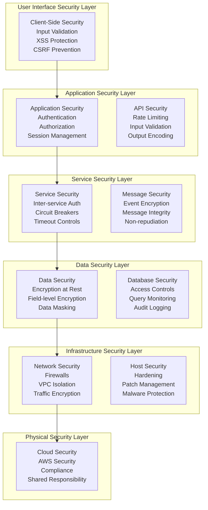
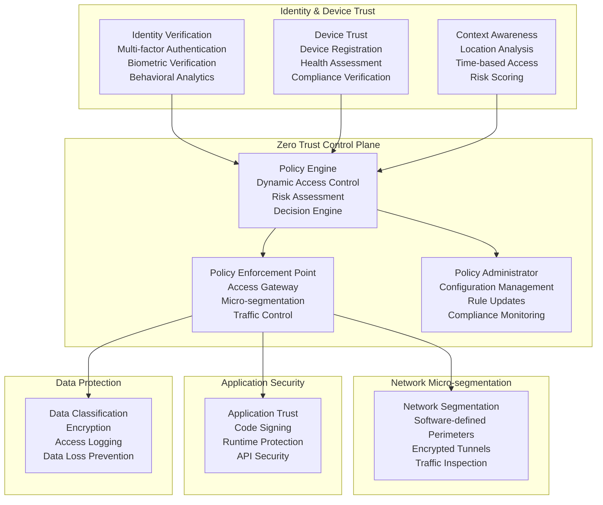
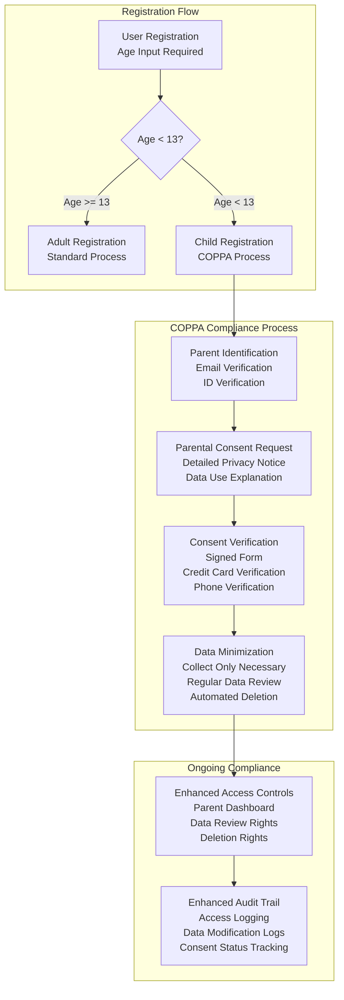
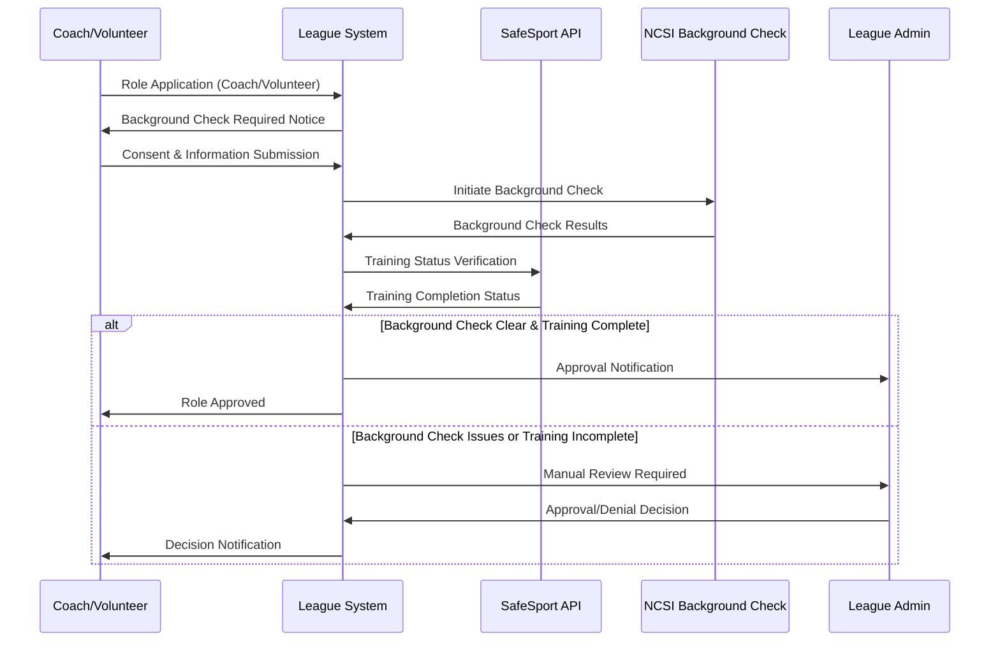
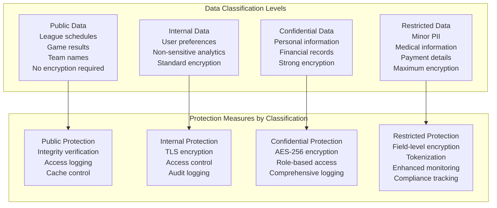
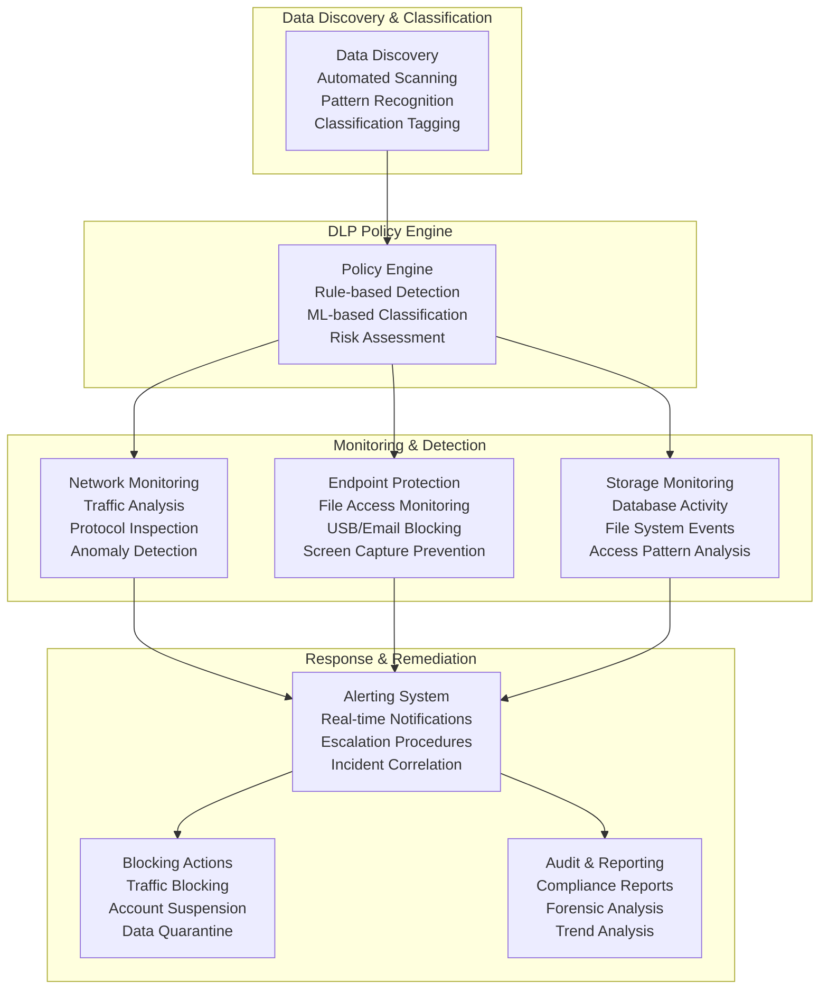
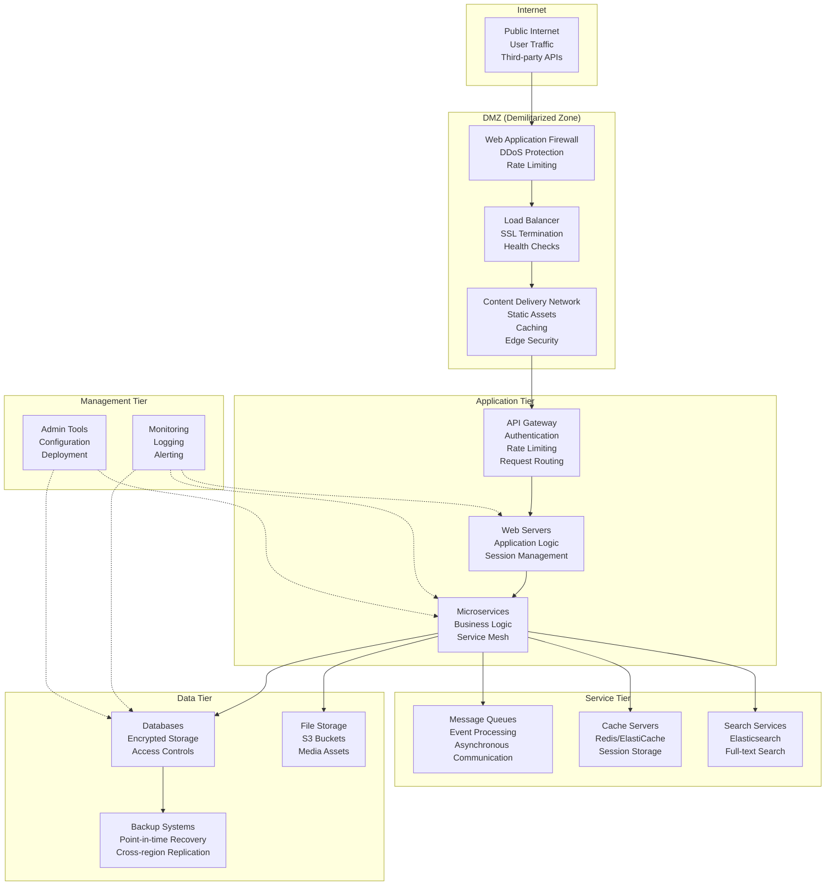
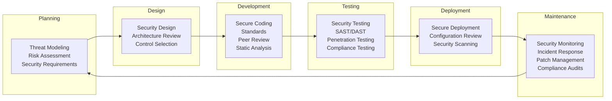
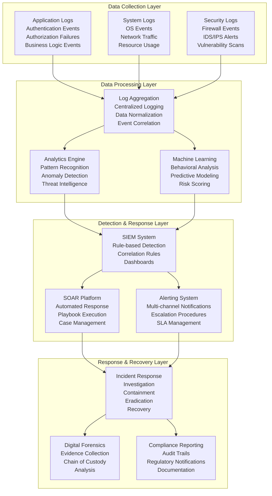
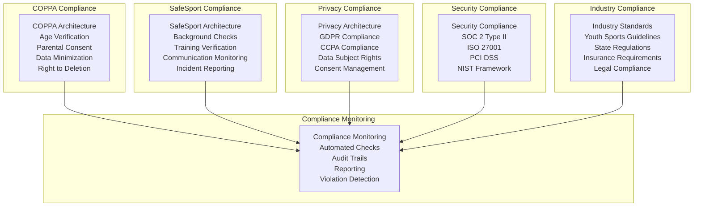

# Security Architecture Document
## Basketball League Management Platform - Phase 2

**Document ID:** SEC-ARCH-001  
**Version:** 2.0  
**Date:** August 8, 2025  
**Author:** Youth Security Architect  
**Status:** Phase 2 Security Framework  
**Classification:** Confidential - Security Architecture  

---

## Executive Summary

This Security Architecture Document defines a comprehensive, defense-in-depth security framework for the Basketball League Management Platform Phase 2, with specialized focus on youth athlete protection, COPPA compliance, and SafeSport requirements. The architecture implements Zero Trust principles, end-to-end encryption, and multi-layered security controls to protect sensitive data of minors and ensure regulatory compliance.

### Key Security Objectives
- **Youth Data Protection**: COPPA-compliant data handling for users under 13
- **SafeSport Compliance**: Background check integration and safety protocols
- **Zero Trust Architecture**: Never trust, always verify security model
- **Data Privacy**: GDPR/CCPA compliance with right to be forgotten
- **Incident Response**: Proactive threat detection and rapid response

---

## Table of Contents

1. [Security Architecture Overview](#1-security-architecture-overview)
2. [Zero Trust Architecture](#2-zero-trust-architecture)
3. [Youth-Specific Security Requirements](#3-youth-specific-security-requirements)
4. [Authentication & Authorization](#4-authentication--authorization)
5. [Data Protection Architecture](#5-data-protection-architecture)
6. [Network Security Architecture](#6-network-security-architecture)
7. [Application Security Architecture](#7-application-security-architecture)
8. [Monitoring & Incident Response](#8-monitoring--incident-response)
9. [Compliance Architecture](#9-compliance-architecture)
10. [Security Controls Framework](#10-security-controls-framework)

---

## 1. Security Architecture Overview

### 1.1 Security Design Principles

Following OWASP Security Design Principles and NIST Cybersecurity Framework:

1. **Defense in Depth**: Multiple security layers with no single point of failure
2. **Fail Secure**: System defaults to secure state during failures
3. **Principle of Least Privilege**: Minimum necessary access rights
4. **Separation of Duties**: Critical functions require multiple approvals
5. **Complete Mediation**: Every access attempt is checked
6. **Open Design**: Security through architecture, not obscurity
7. **Psychological Acceptability**: Usable security that doesn't hinder adoption
8. **Privacy by Design**: Data protection built into system architecture

### 1.2 Security Architecture Layers



### 1.3 Security Quality Attributes

| Attribute | Target | Measurement | Implementation |
|-----------|---------|-------------|----------------|
| **Confidentiality** | 100% data encryption | Encryption coverage audit | AES-256, TLS 1.3 |
| **Integrity** | Zero data tampering | Hash verification, digital signatures | HMAC, PKI |
| **Availability** | 99.9% uptime | Security incident impact | DDoS protection, failover |
| **Authentication** | 100% verified access | Failed login monitoring | MFA, SSO, biometrics |
| **Authorization** | Least privilege | Access review audits | RBAC, ABAC, dynamic permissions |
| **Non-repudiation** | Complete audit trail | Log integrity verification | Digital signatures, blockchain |
| **Accountability** | Full user traceability | Audit log completeness | Identity correlation, activity logs |

---

## 2. Zero Trust Architecture

### 2.1 Zero Trust Security Model



### 2.2 Zero Trust Implementation Components

#### 2.2.1 Policy Engine Components
- **Risk Assessment Engine**: Real-time risk scoring based on user behavior, device health, network location
- **Access Decision Engine**: Dynamic access control decisions using ML-based algorithms
- **Threat Intelligence Integration**: Real-time threat feed integration for adaptive security
- **Compliance Engine**: Automated compliance checking against youth safety regulations

#### 2.2.2 Verification Components
- **Identity Verification**: Multi-factor authentication with biometric options for adults
- **Device Verification**: Device fingerprinting, health assessment, and compliance checking
- **Application Verification**: Code integrity verification and runtime protection
- **Data Verification**: Data classification, encryption status, and access logging

---

## 3. Youth-Specific Security Requirements

### 3.1 COPPA Compliance Architecture

#### 3.1.1 Age Verification System



#### 3.1.2 Parental Control System

**Features:**
- **Parent Dashboard**: Complete visibility into child's data and activities
- **Consent Management**: Granular consent for data collection categories
- **Communication Controls**: Parent oversight of coach-child communications
- **Data Export**: Complete data portability for parental review
- **Deletion Rights**: Parent-initiated data deletion with audit trail

#### 3.1.3 Data Minimization Framework

**Implementation:**
- **Collection Limitation**: Only collect data necessary for service provision
- **Purpose Limitation**: Data used only for stated purposes
- **Retention Limitation**: Automatic deletion after defined periods
- **Quality Assurance**: Regular data accuracy verification
- **Individual Participation**: Parent access and correction rights

### 3.2 SafeSport Integration Architecture

#### 3.2.1 Background Check Workflow



#### 3.2.2 Communication Monitoring System

**Features:**
- **Message Filtering**: AI-powered content analysis for inappropriate communications
- **Escalation Protocols**: Automatic escalation for policy violations
- **Transparent Communications**: All coach-minor communications logged and accessible to parents
- **Group Communication Preference**: Encourage group rather than individual communications
- **Emergency Communication**: Secure channel for urgent safety communications

---

## 4. Authentication & Authorization

### 4.1 Multi-Layered Authentication Architecture

```mermaid
graph TB
    subgraph "Authentication Layers"
        L1[Layer 1: Identity Verification<br/>Username/Email<br/>Password Policy<br/>Account Lockout]
        L2[Layer 2: Multi-Factor Authentication<br/>SMS/Email OTP<br/>Authenticator Apps<br/>Biometric (Adult Users)]
        L3[Layer 3: Risk-Based Authentication<br/>Device Fingerprinting<br/>Behavioral Analysis<br/>Geolocation Verification]
        L4[Layer 4: Continuous Authentication<br/>Session Monitoring<br/>Activity Correlation<br/>Anomaly Detection]
    end
    
    subgraph "Identity Providers"
        LOCAL[Local Identity Store<br/>User Credentials<br/>Profile Data<br/>Preferences]
        SOCIAL[Social Identity<br/>Google SSO<br/>Facebook SSO<br/>Apple Sign-In]
        ENTERPRISE[Enterprise SSO<br/>SAML 2.0<br/>OpenID Connect<br/>Active Directory]
    end
    
    subgraph "Authorization Engine"
        RBAC[Role-Based Access Control<br/>User Roles<br/>Permission Sets<br/>Role Inheritance]
        ABAC[Attribute-Based Access Control<br/>Dynamic Attributes<br/>Policy Rules<br/>Context Awareness]
        POLICY[Policy Decision Point<br/>Rule Engine<br/>Decision Logging<br/>Performance Optimization]
    end
    
    L1 --> L2
    L2 --> L3
    L3 --> L4
    
    LOCAL --> RBAC
    SOCIAL --> RBAC
    ENTERPRISE --> RBAC
    
    RBAC --> ABAC
    ABAC --> POLICY
```

### 4.2 Role-Based Access Control (RBAC) Matrix

| Role | Users | Data Access | System Functions | Special Permissions |
|------|--------|-------------|------------------|-------------------|
| **Super Admin** | Platform operators | All data | All functions | System configuration, user management |
| **League Admin** | League administrators | League-specific data | League management | User role assignment, financial data |
| **Team Coach** | Team coaches | Team/player data | Team functions | Player management, communication |
| **Parent/Guardian** | Parents | Child-specific data | View/communication | Child data management, consent |
| **Player (13+)** | Teen players | Own data | Player functions | Profile management, communication |
| **Player (<13)** | Child players | Limited own data | Limited functions | Parent-controlled access |
| **Referee** | Game officials | Game-specific data | Scoring/officiating | Game management, incident reporting |
| **Scorekeeper** | Scorekeepers | Game scoring data | Scoring interface | Real-time score entry, statistics |
| **Volunteer** | General volunteers | Limited event data | Event functions | Event participation, basic communication |

### 4.3 Attribute-Based Access Control (ABAC) Policies

#### 4.3.1 Dynamic Access Control Rules

```javascript
// Example ABAC Policy for Coach-Player Communication
{
  "policyId": "coach-player-communication",
  "description": "Controls communication between coaches and minor players",
  "rule": {
    "permit": "deny", // Default deny
    "condition": {
      "and": [
        {
          "equals": {
            "subject.role": "coach",
            "object.type": "player"
          }
        },
        {
          "or": [
            {
              "greaterThanOrEquals": {
                "object.age": 13
              }
            },
            {
              "and": [
                {
                  "lessThan": {
                    "object.age": 13
                  }
                },
                {
                  "equals": {
                    "action.communicationType": "group"
                  }
                },
                {
                  "includes": {
                    "context.recipients": "parent"
                  }
                }
              ]
            }
          ]
        },
        {
          "equals": {
            "context.safeSportCompliant": true
          }
        }
      ]
    }
  }
}
```

---

## 5. Data Protection Architecture

### 5.1 Data Classification Framework



### 5.2 Encryption Architecture

#### 5.2.1 Encryption at Rest

**Implementation Details:**
- **Database Encryption**: AWS RDS encryption with customer-managed keys (CMK)
- **File Storage Encryption**: S3 server-side encryption with KMS keys
- **Field-Level Encryption**: Application-layer encryption for PII fields
- **Key Management**: AWS Key Management Service (KMS) with key rotation

#### 5.2.2 Encryption in Transit

**Implementation Details:**
- **TLS 1.3**: All client-server communications
- **mTLS**: Inter-service communication authentication
- **API Gateway**: TLS termination with certificate management
- **Message Queues**: Encrypted message payloads in event streams

#### 5.2.3 Encryption in Use (Future Implementation)

**Implementation Details:**
- **Confidential Computing**: AWS Nitro Enclaves for sensitive data processing
- **Homomorphic Encryption**: Analytics on encrypted data
- **Secure Multiparty Computation**: Privacy-preserving analytics

### 5.3 Data Loss Prevention (DLP) Architecture



---

## 6. Network Security Architecture

### 6.1 Network Segmentation Strategy



### 6.2 Network Security Controls

#### 6.2.1 Perimeter Security
- **Web Application Firewall (WAF)**: AWS WAF with OWASP Top 10 protection
- **DDoS Protection**: AWS Shield Advanced with automated mitigation
- **Content Delivery Network**: CloudFront with geographic restrictions
- **Load Balancer Security**: Application Load Balancer with security groups

#### 6.2.2 Internal Network Security
- **VPC Isolation**: Separate Virtual Private Clouds for environments
- **Security Groups**: Stateful firewall rules for EC2 instances
- **Network ACLs**: Stateless subnet-level access controls
- **Private Subnets**: Database and service tiers isolated from internet

#### 6.2.3 Service Mesh Security
- **Istio Service Mesh**: mTLS between all microservices
- **Network Policies**: Kubernetes-based microsegmentation
- **Traffic Encryption**: All inter-service communication encrypted
- **Identity-based Networking**: SPIFFE/SPIRE for service identity

---

## 7. Application Security Architecture

### 7.1 Secure Development Lifecycle (SDL)



### 7.2 Application Security Controls

#### 7.2.1 Input Validation & Sanitization
- **Server-side Validation**: All input validated at API layer
- **Input Sanitization**: XSS prevention through output encoding
- **SQL Injection Prevention**: Parameterized queries and ORM usage
- **File Upload Security**: Type validation, virus scanning, sandboxing

#### 7.2.2 Session Management
- **Secure Session Tokens**: Cryptographically random session IDs
- **Session Timeout**: Automatic timeout after inactivity periods
- **Session Fixation Prevention**: New session ID after authentication
- **Concurrent Session Control**: Limit concurrent sessions per user

#### 7.2.3 API Security
- **OAuth 2.0 + JWT**: Token-based authentication and authorization
- **Rate Limiting**: Prevent abuse and DDoS attacks
- **API Versioning**: Secure transition between API versions
- **Request/Response Validation**: Schema-based validation

---

## 8. Monitoring & Incident Response

### 8.1 Security Monitoring Architecture



### 8.2 Security Metrics & KPIs

| Metric Category | Key Performance Indicators | Target Values |
|-----------------|---------------------------|---------------|
| **Incident Response** | Mean Time to Detection (MTTD) | < 15 minutes |
| | Mean Time to Response (MTTR) | < 1 hour |
| | Mean Time to Recovery (MTTR) | < 4 hours |
| **Threat Detection** | False Positive Rate | < 5% |
| | True Positive Rate | > 95% |
| | Security Alert Volume | < 100/day |
| **Vulnerability Management** | Critical Vulnerabilities | 0 open > 24 hours |
| | High Vulnerabilities | < 5 open > 1 week |
| | Patch Management SLA | 95% compliance |
| **Compliance** | Audit Findings | 0 critical findings |
| | Compliance Score | > 95% |
| | Privacy Violations | 0 violations |

---

## 9. Compliance Architecture

### 9.1 Youth Sports Compliance Framework



### 9.2 Compliance Controls Matrix

| Regulation | Requirements | Technical Controls | Monitoring |
|------------|--------------|-------------------|------------|
| **COPPA** | Age verification, parental consent | Age verification API, consent workflow | Consent audit logs, age verification tracking |
| | Data minimization | Automated data classification, retention policies | Data inventory, usage monitoring |
| | Parental rights | Parent dashboard, data export/deletion | Access logs, deletion confirmations |
| **SafeSport** | Background checks | Third-party integration, verification workflow | Check status tracking, renewal monitoring |
| | Training requirements | Training system integration, status tracking | Completion monitoring, expiration alerts |
| | Communication oversight | Message monitoring, escalation workflows | Communication logs, violation detection |
| **GDPR/CCPA** | Data subject rights | Rights management portal, automated responses | Rights request tracking, response times |
| | Breach notification | Incident response automation, notification workflows | Breach detection, notification logs |
| | Data portability | Export functionality, standardized formats | Export requests, data integrity checks |

---

## 10. Security Controls Framework

### 10.1 Security Control Categories

#### 10.1.1 Preventive Controls
- **Access Controls**: Authentication, authorization, least privilege
- **Network Security**: Firewalls, network segmentation, intrusion prevention
- **Application Security**: Input validation, secure coding, configuration management
- **Data Protection**: Encryption, tokenization, data loss prevention

#### 10.1.2 Detective Controls
- **Monitoring**: SIEM, log analysis, behavioral analytics
- **Vulnerability Management**: Scanning, assessment, threat intelligence
- **Audit Logging**: Comprehensive logging, integrity protection, retention
- **Incident Detection**: Automated alerting, correlation, anomaly detection

#### 10.1.3 Corrective Controls
- **Incident Response**: Investigation, containment, eradication, recovery
- **Patch Management**: Automated patching, testing, deployment
- **Backup & Recovery**: Data backup, disaster recovery, business continuity
- **Access Revocation**: Automated deprovisioning, emergency access revocation

### 10.2 Control Implementation Matrix

| Control Family | Implementation Level | Automation Level | Monitoring Level |
|----------------|---------------------|------------------|------------------|
| **Identity & Access** | Full implementation | 90% automated | Real-time monitoring |
| **Data Protection** | Full implementation | 85% automated | Continuous monitoring |
| **Network Security** | Full implementation | 95% automated | Real-time monitoring |
| **Application Security** | Full implementation | 80% automated | Continuous monitoring |
| **Incident Response** | Full implementation | 70% automated | 24/7 monitoring |
| **Compliance** | Full implementation | 75% automated | Automated reporting |

---

## Conclusion

This Security Architecture Document provides a comprehensive, multi-layered security framework specifically designed for youth sports platforms. The architecture prioritizes the protection of minor athletes while ensuring regulatory compliance and operational security. The implementation of Zero Trust principles, combined with specialized youth protection measures, creates a robust security posture that adapts to the unique challenges of managing sensitive data for children in sports environments.

The architecture is designed to evolve with changing regulations, emerging threats, and platform growth while maintaining the highest standards of security and compliance in the youth sports domain.

---

**Document Control**
- **Next Review Date:** November 8, 2025
- **Review Frequency:** Quarterly
- **Owner:** Youth Security Architect
- **Approvers:** CISO, Legal Counsel, Compliance Officer