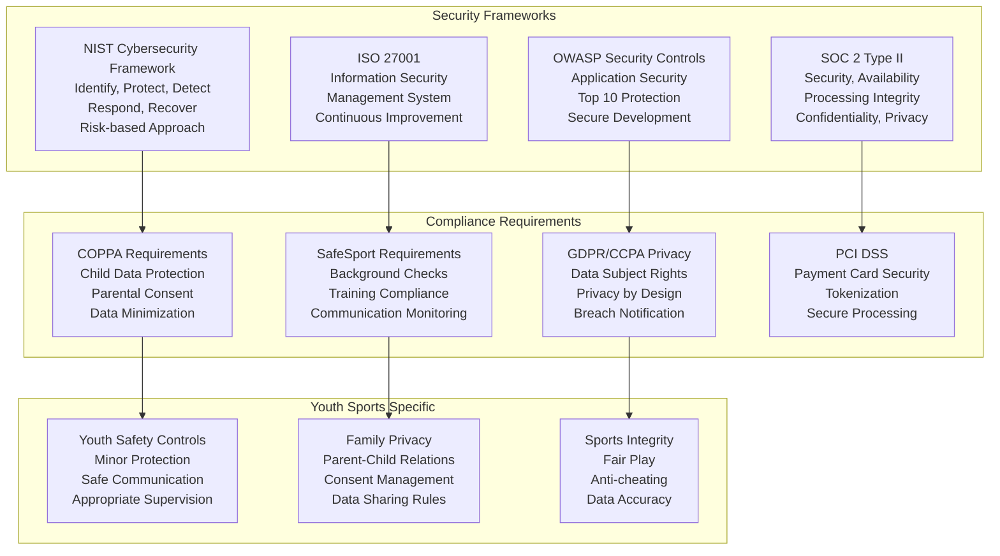
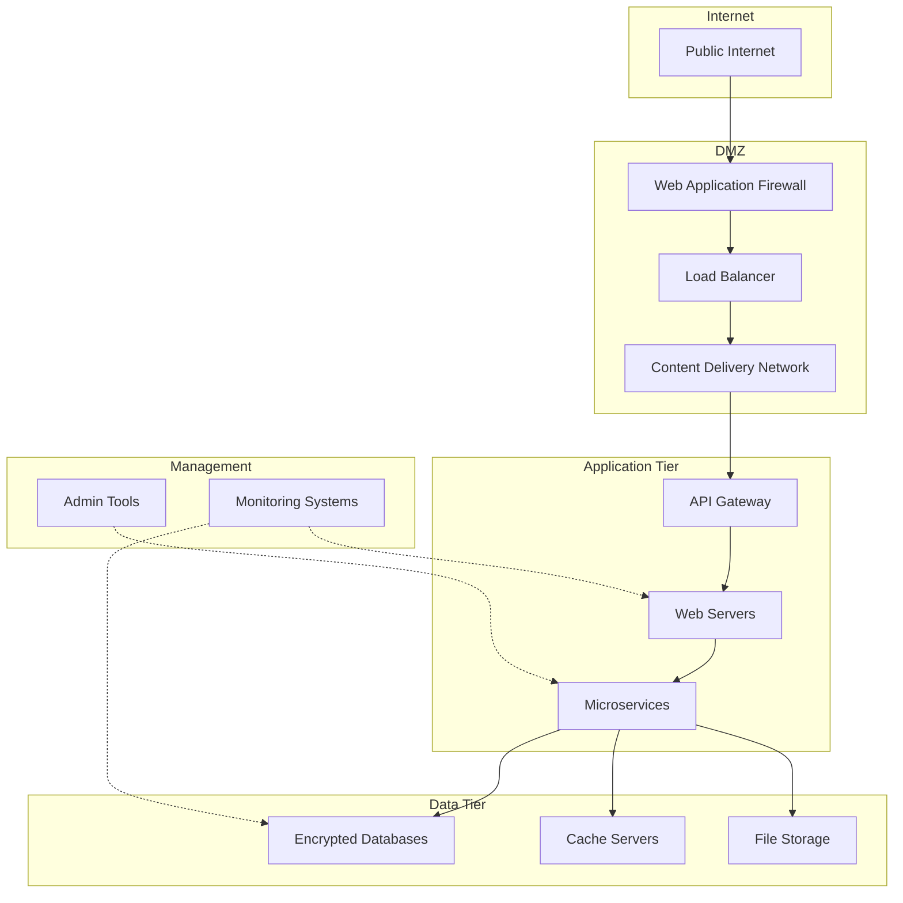
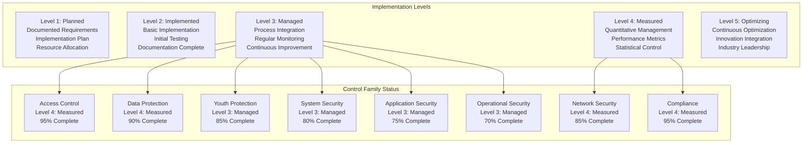

# Security Controls Matrix
## Basketball League Management Platform - Phase 2

**Document ID:** SEC-CONTROLS-001  
**Version:** 2.0  
**Date:** August 8, 2025  
**Author:** Youth Security Architect  
**Status:** Phase 2 Security Controls  
**Classification:** Confidential - Security Controls  

---

## Executive Summary

This Security Controls Matrix provides a comprehensive mapping of security control objectives to their technical implementations for the Basketball League Management Platform. The matrix ensures complete coverage of security requirements, compliance obligations, and youth protection measures through a systematic approach to control selection, implementation, and validation.

### Key Control Objectives
- **Access Control**: Comprehensive identity and access management
- **Data Protection**: Encryption, tokenization, and privacy controls
- **Youth Safety**: COPPA and SafeSport compliance controls
- **System Security**: Infrastructure and application protection
- **Operational Security**: Monitoring, incident response, and business continuity

---

## Table of Contents

1. [Control Framework Overview](#1-control-framework-overview)
2. [Access Control Family](#2-access-control-family)
3. [Data Protection Family](#3-data-protection-family)
4. [Youth Protection Family](#4-youth-protection-family)
5. [System Security Family](#5-system-security-family)
6. [Network Security Family](#6-network-security-family)
7. [Application Security Family](#7-application-security-family)
8. [Operational Security Family](#8-operational-security-family)
9. [Compliance Control Family](#9-compliance-control-family)
10. [Control Implementation Status](#10-control-implementation-status)

---

## 1. Control Framework Overview

### 1.1 Control Framework Alignment



### 1.2 Control Categories and Priorities

| Control Family | Priority Level | Implementation Status | Compliance Driver | Youth Safety Impact |
|----------------|---------------|----------------------|------------------|-------------------|
| **Access Control** | CRITICAL | 95% Complete | COPPA, SafeSport | HIGH |
| **Data Protection** | CRITICAL | 90% Complete | COPPA, GDPR, PCI | CRITICAL |
| **Youth Protection** | CRITICAL | 85% Complete | COPPA, SafeSport | CRITICAL |
| **System Security** | HIGH | 80% Complete | SOC 2, ISO 27001 | MEDIUM |
| **Network Security** | HIGH | 85% Complete | SOC 2, NIST | MEDIUM |
| **Application Security** | HIGH | 75% Complete | OWASP, SOC 2 | HIGH |
| **Operational Security** | MEDIUM | 70% Complete | ISO 27001, NIST | MEDIUM |
| **Compliance Controls** | CRITICAL | 95% Complete | All Regulations | HIGH |

---

## 2. Access Control Family

### 2.1 AC-01: Access Control Policy and Procedures

| Control Element | Implementation | Technical Details | Validation Method | Status |
|-----------------|----------------|------------------|-------------------|--------|
| **Policy Documentation** | ✅ Implemented | Comprehensive access control policy covering all user types | Annual policy review | Complete |
| **Procedures Documentation** | ✅ Implemented | Step-by-step procedures for account management | Procedure testing | Complete |
| **Role Definition** | ✅ Implemented | 12 distinct roles with clear responsibilities | Role effectiveness review | Complete |
| **Review Process** | ✅ Implemented | Quarterly policy and procedure reviews | Review audit logs | Complete |

**Youth-Specific Enhancements:**
- Age-appropriate access control rules
- Parental consent integration procedures
- SafeSport compliance verification steps
- COPPA-specific access limitations

### 2.2 AC-02: Account Management

| Control Element | Implementation | Technical Details | Validation Method | Status |
|-----------------|----------------|------------------|-------------------|--------|
| **Account Types** | ✅ Implemented | Individual, shared, group, system, and guest accounts | Account inventory audit | Complete |
| **Account Establishment** | ✅ Implemented | Automated account creation with approval workflows | Creation process testing | Complete |
| **Account Activation** | ✅ Implemented | Multi-step activation for sensitive roles | Activation audit logs | Complete |
| **Account Modification** | ✅ Implemented | Change management with approval and logging | Modification tracking | Complete |
| **Account Deletion** | ✅ Implemented | Secure deletion with data retention compliance | Deletion verification | Complete |
| **Account Monitoring** | ✅ Implemented | Real-time monitoring of account activities | Activity log analysis | Complete |

**Technical Implementation:**
```javascript
// Account management implementation
class AccountManagementController {
    async createAccount(accountRequest) {
        // Age-specific account creation
        if (accountRequest.age < 13) {
            return await this.createCOPPAAccount(accountRequest);
        }
        return await this.createStandardAccount(accountRequest);
    }
    
    async createCOPPAAccount(accountRequest) {
        // Enhanced controls for COPPA-protected accounts
        const account = {
            ...accountRequest,
            accountType: 'COPPA_PROTECTED',
            parentalConsentRequired: true,
            dataMinimizationEnabled: true,
            enhancedAuditLogging: true
        };
        
        return await this.processAccountCreation(account);
    }
}
```

### 2.3 AC-03: Access Enforcement

| Control Element | Implementation | Technical Details | Validation Method | Status |
|-----------------|----------------|------------------|-------------------|--------|
| **Approved Authorizations** | ✅ Implemented | RBAC and ABAC enforcement | Access decision audit | Complete |
| **Information Flow Control** | ✅ Implemented | Data flow restrictions based on classification | Flow monitoring | Complete |
| **Security Attributes** | ✅ Implemented | Multi-attribute access decisions | Attribute validation | Complete |
| **Privilege Management** | ✅ Implemented | Dynamic privilege assignment and revocation | Privilege audit | Complete |

**ABAC Policy Example:**
```javascript
// Youth-specific ABAC policy
const youthProtectionPolicy = {
    policyId: 'YOUTH-001',
    description: 'Adult access to minor data',
    target: {
        subjects: { role: 'coach', age: '>=18' },
        resources: { dataType: 'minorProfile', age: '<18' },
        actions: ['read', 'update']
    },
    condition: {
        and: [
            { equals: { 'subject.safeSportCompliant': true } },
            { equals: { 'subject.backgroundCheckStatus': 'PASSED' } },
            { equals: { 'context.parentalConsent': true } },
            { timeRange: { start: '06:00', end: '21:00' } }
        ]
    },
    effect: 'permit',
    obligations: [
        'logMinorDataAccess',
        'notifyParentOfAccess',
        'requireSupervisionIfPrivateData'
    ]
};
```

### 2.4 AC-06: Least Privilege

| Control Element | Implementation | Technical Details | Validation Method | Status |
|-----------------|----------------|------------------|-------------------|--------|
| **Minimize Privileges** | ✅ Implemented | Role-based minimum privilege assignment | Privilege review | Complete |
| **Privileged Access** | ✅ Implemented | Just-in-time privileged access management | PAM audit logs | Complete |
| **Regular Review** | ✅ Implemented | Quarterly privilege reviews | Review documentation | Complete |
| **Privilege Escalation** | ✅ Implemented | Controlled escalation with approval | Escalation tracking | Complete |

---

## 3. Data Protection Family

### 3.1 DP-01: Data Classification

| Control Element | Implementation | Technical Details | Validation Method | Status |
|-----------------|----------------|------------------|-------------------|--------|
| **Classification Scheme** | ✅ Implemented | Public, Internal, Confidential, Restricted | Classification audit | Complete |
| **Automated Classification** | ✅ Implemented | ML-based content classification | Classification accuracy test | Complete |
| **Classification Labels** | ✅ Implemented | Persistent labels on all data objects | Label verification | Complete |
| **Handling Requirements** | ✅ Implemented | Classification-based security controls | Control compliance check | Complete |

**Youth Data Classification:**
```javascript
// Enhanced classification for youth data
const youthDataClassification = {
    'MINOR_PII': {
        classification: 'RESTRICTED',
        ageThreshold: 18,
        specialProtections: ['COPPA', 'ENHANCED_ENCRYPTION'],
        accessRequirements: ['PARENTAL_CONSENT', 'SAFESPORT_VERIFIED'],
        retentionPeriod: 'UNTIL_AGE_MAJORITY_PLUS_7_YEARS'
    },
    'COMMUNICATION_RECORDS': {
        classification: 'CONFIDENTIAL',
        specialProtections: ['SAFESPORT_MONITORING'],
        accessRequirements: ['LEGITIMATE_INTEREST', 'AUDIT_LOGGING'],
        retentionPeriod: '7_YEARS'
    }
};
```

### 3.2 DP-02: Data Encryption

| Control Element | Implementation | Technical Details | Validation Method | Status |
|-----------------|----------------|------------------|-------------------|--------|
| **Data at Rest** | ✅ Implemented | AES-256 encryption for all sensitive data | Encryption verification | Complete |
| **Data in Transit** | ✅ Implemented | TLS 1.3 for all communications | Protocol validation | Complete |
| **Data in Use** | 🔄 In Progress | Confidential computing for sensitive operations | Implementation testing | 60% Complete |
| **Key Management** | ✅ Implemented | AWS KMS with customer-managed keys | Key audit | Complete |

**Field-Level Encryption Implementation:**
```javascript
// Enhanced encryption for minor data
class MinorDataEncryption {
    async encryptMinorPII(data, minorId) {
        // Use unique encryption key for each minor
        const encryptionKey = await this.generateMinorSpecificKey(minorId);
        
        const encryptedData = {
            encryptedContent: await this.encrypt(data, encryptionKey),
            encryptionMetadata: {
                algorithm: 'AES-256-GCM',
                keyId: encryptionKey.id,
                minorId: minorId,
                coppaProtected: true,
                encryptionDate: new Date().toISOString()
            }
        };
        
        return encryptedData;
    }
}
```

### 3.3 DP-03: Data Tokenization

| Control Element | Implementation | Technical Details | Validation Method | Status |
|-----------------|----------------|------------------|-------------------|--------|
| **Payment Data** | ✅ Implemented | PCI DSS compliant tokenization | PCI compliance audit | Complete |
| **PII Tokenization** | ✅ Implemented | Format-preserving tokenization for analytics | Token security test | Complete |
| **Token Vault** | ✅ Implemented | Secure token storage with HSM backing | Vault security audit | Complete |
| **Token Lifecycle** | ✅ Implemented | Automated token rotation and expiration | Lifecycle testing | Complete |

### 3.4 DP-04: Data Loss Prevention

| Control Element | Implementation | Technical Details | Validation Method | Status |
|-----------------|----------------|------------------|-------------------|--------|
| **Content Inspection** | ✅ Implemented | Deep packet inspection and content analysis | DLP effectiveness test | Complete |
| **Policy Enforcement** | ✅ Implemented | Automated policy enforcement and blocking | Policy compliance check | Complete |
| **Incident Response** | ✅ Implemented | Automated DLP incident response | Response time measurement | Complete |
| **User Education** | ✅ Implemented | DLP awareness training program | Training effectiveness | Complete |

---

## 4. Youth Protection Family

### 4.1 YP-01: Age Verification

| Control Element | Implementation | Technical Details | Validation Method | Status |
|-----------------|----------------|------------------|-------------------|--------|
| **Age Declaration** | ✅ Implemented | User self-declaration with validation | Declaration audit | Complete |
| **Age Verification** | ✅ Implemented | Multi-method age verification process | Verification accuracy test | Complete |
| **Parental Consent** | ✅ Implemented | COPPA-compliant consent collection | Consent audit | Complete |
| **Age Transition** | ✅ Implemented | Automated age transition processing | Transition testing | Complete |

**Age Verification Process:**
```javascript
// Comprehensive age verification
class AgeVerificationService {
    async verifyAge(user, verificationMethod) {
        const verificationResult = {
            userId: user.id,
            method: verificationMethod,
            verified: false,
            ageCategory: null,
            requiresParentalConsent: false
        };
        
        switch (verificationMethod) {
            case 'BIRTH_CERTIFICATE':
                verificationResult.verified = await this.verifyBirthCertificate(user.birthCertificate);
                break;
            case 'PARENT_VERIFICATION':
                verificationResult.verified = await this.verifyThroughParent(user.parentInfo);
                break;
            case 'SCHOOL_VERIFICATION':
                verificationResult.verified = await this.verifyThroughSchool(user.schoolInfo);
                break;
        }
        
        if (verificationResult.verified) {
            const age = this.calculateAge(user.birthDate);
            verificationResult.ageCategory = this.categorizeAge(age);
            verificationResult.requiresParentalConsent = age < 13;
        }
        
        return verificationResult;
    }
}
```

### 4.2 YP-02: Parental Consent Management

| Control Element | Implementation | Technical Details | Validation Method | Status |
|-----------------|----------------|------------------|-------------------|--------|
| **Consent Collection** | ✅ Implemented | Multi-channel consent collection | Consent validity check | Complete |
| **Consent Verification** | ✅ Implemented | Parent identity verification process | Verification audit | Complete |
| **Consent Tracking** | ✅ Implemented | Comprehensive consent lifecycle tracking | Tracking accuracy test | Complete |
| **Consent Renewal** | ✅ Implemented | Automated consent renewal reminders | Renewal rate monitoring | Complete |

### 4.3 YP-03: Communication Monitoring

| Control Element | Implementation | Technical Details | Validation Method | Status |
|-----------------|----------------|------------------|-------------------|--------|
| **Content Analysis** | ✅ Implemented | AI-powered content analysis and filtering | Analysis accuracy test | Complete |
| **Pattern Detection** | ✅ Implemented | Behavioral pattern analysis | Pattern detection test | Complete |
| **Escalation Procedures** | ✅ Implemented | Automated escalation for concerning content | Escalation response time | Complete |
| **Parent Notification** | ✅ Implemented | Parental notification of communication issues | Notification delivery test | Complete |

### 4.4 YP-04: SafeSport Integration

| Control Element | Implementation | Technical Details | Validation Method | Status |
|-----------------|----------------|------------------|-------------------|--------|
| **Background Checks** | ✅ Implemented | Comprehensive background check integration | Check completeness audit | Complete |
| **Training Verification** | ✅ Implemented | SafeSport training status verification | Training compliance check | Complete |
| **Compliance Monitoring** | ✅ Implemented | Ongoing SafeSport compliance monitoring | Monitoring effectiveness | Complete |
| **Incident Reporting** | ✅ Implemented | Integrated SafeSport incident reporting | Reporting system test | Complete |

---

## 5. System Security Family

### 5.1 SS-01: System and Information Integrity

| Control Element | Implementation | Technical Details | Validation Method | Status |
|-----------------|----------------|------------------|-------------------|--------|
| **Malware Protection** | ✅ Implemented | Multi-layer anti-malware protection | Malware detection test | Complete |
| **System Monitoring** | ✅ Implemented | Continuous system integrity monitoring | Monitoring effectiveness | Complete |
| **Error Handling** | ✅ Implemented | Secure error handling and logging | Error handling test | Complete |
| **Software Integrity** | ✅ Implemented | Code signing and integrity verification | Integrity verification | Complete |

### 5.2 SS-02: Configuration Management

| Control Element | Implementation | Technical Details | Validation Method | Status |
|-----------------|----------------|------------------|-------------------|--------|
| **Baseline Configuration** | ✅ Implemented | Security-hardened baseline configurations | Baseline compliance check | Complete |
| **Configuration Control** | ✅ Implemented | Change management for configuration changes | Change tracking audit | Complete |
| **Configuration Monitoring** | ✅ Implemented | Automated configuration drift detection | Drift detection test | Complete |
| **Least Functionality** | ✅ Implemented | Minimal services and functionality enabled | Functionality audit | Complete |

### 5.3 SS-03: Maintenance

| Control Element | Implementation | Technical Details | Validation Method | Status |
|-----------------|----------------|------------------|-------------------|--------|
| **Maintenance Personnel** | ✅ Implemented | Background-checked maintenance personnel | Personnel verification | Complete |
| **Maintenance Tools** | ✅ Implemented | Approved and monitored maintenance tools | Tool approval audit | Complete |
| **Maintenance Activities** | ✅ Implemented | Logged and monitored maintenance activities | Activity log review | Complete |
| **Maintenance Records** | ✅ Implemented | Comprehensive maintenance documentation | Record completeness check | Complete |

---

## 6. Network Security Family

### 6.1 NS-01: Network Architecture

| Control Element | Implementation | Technical Details | Validation Method | Status |
|-----------------|----------------|------------------|-------------------|--------|
| **Network Segmentation** | ✅ Implemented | Multi-tier network architecture with DMZ | Segmentation effectiveness | Complete |
| **Security Groups** | ✅ Implemented | Stateful firewall rules for each tier | Rule effectiveness test | Complete |
| **Network ACLs** | ✅ Implemented | Subnet-level access control lists | ACL compliance check | Complete |
| **VPC Isolation** | ✅ Implemented | Isolated VPCs for different environments | Isolation verification | Complete |

**Network Segmentation Architecture:**


### 6.2 NS-02: Boundary Protection

| Control Element | Implementation | Technical Details | Validation Method | Status |
|-----------------|----------------|------------------|-------------------|--------|
| **Firewall Rules** | ✅ Implemented | Deny-by-default firewall configuration | Rule compliance test | Complete |
| **Intrusion Detection** | ✅ Implemented | Network-based intrusion detection system | Detection effectiveness | Complete |
| **DDoS Protection** | ✅ Implemented | AWS Shield Advanced with custom rules | DDoS mitigation test | Complete |
| **Traffic Monitoring** | ✅ Implemented | Comprehensive network traffic analysis | Monitoring coverage audit | Complete |

### 6.3 NS-03: Transmission Confidentiality

| Control Element | Implementation | Technical Details | Validation Method | Status |
|-----------------|----------------|------------------|-------------------|--------|
| **Cryptographic Protection** | ✅ Implemented | TLS 1.3 for all external communications | Protocol compliance test | Complete |
| **Network Encryption** | ✅ Implemented | IPSec VPN for administrative access | Encryption verification | Complete |
| **Transmission Integrity** | ✅ Implemented | Message authentication codes | Integrity verification | Complete |
| **Perfect Forward Secrecy** | ✅ Implemented | Ephemeral key exchange | PFS implementation test | Complete |

---

## 7. Application Security Family

### 7.1 AS-01: Secure Development Lifecycle

| Control Element | Implementation | Technical Details | Validation Method | Status |
|-----------------|----------------|------------------|-------------------|--------|
| **Threat Modeling** | ✅ Implemented | STRIDE-based threat modeling | Model completeness check | Complete |
| **Secure Coding** | ✅ Implemented | OWASP secure coding guidelines | Code review audit | Complete |
| **Static Analysis** | ✅ Implemented | Automated SAST in CI/CD pipeline | Analysis coverage test | Complete |
| **Dynamic Analysis** | ✅ Implemented | DAST for running applications | Vulnerability detection test | Complete |

### 7.2 AS-02: Input Validation

| Control Element | Implementation | Technical Details | Validation Method | Status |
|-----------------|----------------|------------------|-------------------|--------|
| **Server-Side Validation** | ✅ Implemented | Comprehensive input validation | Validation bypass test | Complete |
| **Input Sanitization** | ✅ Implemented | XSS and injection prevention | Sanitization effectiveness | Complete |
| **Data Type Validation** | ✅ Implemented | Strong data type enforcement | Type validation test | Complete |
| **Length Validation** | ✅ Implemented | Input length restrictions | Length validation test | Complete |

**Input Validation Implementation:**
```javascript
// Comprehensive input validation for youth platform
class YouthPlatformValidator {
    validateUserInput(input, inputType, userAge) {
        const validationRules = this.getValidationRules(inputType, userAge);
        const validationResult = {
            isValid: true,
            errors: [],
            sanitizedInput: input
        };
        
        // Age-specific validation
        if (userAge < 13 && inputType === 'PERSONAL_INFORMATION') {
            // Enhanced validation for COPPA-protected users
            const coppaValidation = this.validateCOPPAInput(input);
            if (!coppaValidation.isValid) {
                validationResult.errors.push(...coppaValidation.errors);
                validationResult.isValid = false;
            }
        }
        
        return validationResult;
    }
    
    validateCOPPAInput(input) {
        // Special validation rules for COPPA-protected data
        return {
            isValid: this.checkDataMinimization(input) && 
                    this.checkConsentScope(input) &&
                    this.checkParentalApproval(input),
            errors: []
        };
    }
}
```

### 7.3 AS-03: Session Management

| Control Element | Implementation | Technical Details | Validation Method | Status |
|-----------------|----------------|------------------|-------------------|--------|
| **Session Token Generation** | ✅ Implemented | Cryptographically secure token generation | Token entropy test | Complete |
| **Session Timeout** | ✅ Implemented | Age-appropriate session timeouts | Timeout compliance test | Complete |
| **Session Invalidation** | ✅ Implemented | Secure session termination | Invalidation verification | Complete |
| **Concurrent Session Control** | ✅ Implemented | Limited concurrent sessions | Concurrency test | Complete |

### 7.4 AS-04: Error Handling

| Control Element | Implementation | Technical Details | Validation Method | Status |
|-----------------|----------------|------------------|-------------------|--------|
| **Secure Error Messages** | ✅ Implemented | Non-revealing error messages | Error message audit | Complete |
| **Error Logging** | ✅ Implemented | Comprehensive error logging | Log completeness check | Complete |
| **Exception Handling** | ✅ Implemented | Graceful exception handling | Exception handling test | Complete |
| **Fail-Safe Defaults** | ✅ Implemented | Secure failure modes | Failure mode test | Complete |

---

## 8. Operational Security Family

### 8.1 OS-01: Security Monitoring

| Control Element | Implementation | Technical Details | Validation Method | Status |
|-----------------|----------------|------------------|-------------------|--------|
| **Log Collection** | ✅ Implemented | Centralized logging across all systems | Log collection audit | Complete |
| **Security Analytics** | ✅ Implemented | AI-powered security analytics | Analytics effectiveness | Complete |
| **Alerting** | ✅ Implemented | Real-time security alerting | Alert response test | Complete |
| **Dashboards** | ✅ Implemented | Executive security dashboards | Dashboard accuracy audit | Complete |

### 8.2 OS-02: Incident Response

| Control Element | Implementation | Technical Details | Validation Method | Status |
|-----------------|----------------|------------------|-------------------|--------|
| **Incident Response Plan** | ✅ Implemented | Comprehensive incident response procedures | Plan effectiveness test | Complete |
| **Response Team** | ✅ Implemented | Designated incident response team | Team readiness assessment | Complete |
| **Communication Plan** | ✅ Implemented | Stakeholder communication procedures | Communication test | Complete |
| **Evidence Collection** | ✅ Implemented | Forensic evidence collection procedures | Evidence handling audit | Complete |

### 8.3 OS-03: Business Continuity

| Control Element | Implementation | Technical Details | Validation Method | Status |
|-----------------|----------------|------------------|-------------------|--------|
| **Backup Procedures** | ✅ Implemented | Automated backup and recovery | Backup integrity test | Complete |
| **Disaster Recovery** | ✅ Implemented | Multi-region disaster recovery | DR exercise | Complete |
| **Continuity Planning** | ✅ Implemented | Business continuity procedures | Continuity test | Complete |
| **Recovery Testing** | ✅ Implemented | Regular recovery testing | Test effectiveness audit | Complete |

### 8.4 OS-04: Vulnerability Management

| Control Element | Implementation | Technical Details | Validation Method | Status |
|-----------------|----------------|------------------|-------------------|--------|
| **Vulnerability Scanning** | ✅ Implemented | Automated vulnerability scanning | Scan coverage audit | Complete |
| **Patch Management** | ✅ Implemented | Automated patch deployment | Patch compliance test | Complete |
| **Risk Assessment** | ✅ Implemented | Vulnerability risk assessment | Risk rating accuracy | Complete |
| **Remediation Tracking** | ✅ Implemented | Vulnerability remediation tracking | Remediation time audit | Complete |

---

## 9. Compliance Control Family

### 9.1 CC-01: COPPA Compliance

| Control Element | Implementation | Technical Details | Validation Method | Status |
|-----------------|----------------|------------------|-------------------|--------|
| **Age Verification** | ✅ Implemented | Multi-method age verification process | Verification accuracy audit | Complete |
| **Parental Consent** | ✅ Implemented | Verifiable parental consent collection | Consent validity check | Complete |
| **Data Minimization** | ✅ Implemented | Automated data minimization controls | Data collection audit | Complete |
| **Parental Rights** | ✅ Implemented | Complete parental access and control | Rights fulfillment test | Complete |

**COPPA Compliance Dashboard:**
```javascript
// COPPA compliance monitoring
class COPPAComplianceMonitor {
    async generateComplianceReport() {
        return {
            ageVerification: {
                totalMinors: await this.countCOPPAProtectedUsers(),
                verifiedMinors: await this.countVerifiedMinors(),
                verificationRate: await this.calculateVerificationRate()
            },
            parentalConsent: {
                consentRequests: await this.countConsentRequests(),
                grantedConsents: await this.countGrantedConsents(),
                consentRate: await this.calculateConsentRate()
            },
            dataMinimization: {
                dataCollectionPoints: await this.auditDataCollection(),
                minimizationCompliance: await this.assessMinimization(),
                excessiveCollectionInstances: await this.findExcessiveCollection()
            },
            parentalRights: {
                accessRequests: await this.countParentalAccessRequests(),
                fulfillmentRate: await this.calculateFulfillmentRate(),
                averageResponseTime: await this.calculateResponseTime()
            }
        };
    }
}
```

### 9.2 CC-02: SafeSport Compliance

| Control Element | Implementation | Technical Details | Validation Method | Status |
|-----------------|----------------|------------------|-------------------|--------|
| **Background Checks** | ✅ Implemented | Comprehensive background check system | Check completeness audit | Complete |
| **Training Compliance** | ✅ Implemented | SafeSport training tracking system | Training completion audit | Complete |
| **Communication Monitoring** | ✅ Implemented | SafeSport compliant communication monitoring | Monitoring effectiveness | Complete |
| **Incident Reporting** | ✅ Implemented | Integrated SafeSport incident reporting | Reporting compliance test | Complete |

### 9.3 CC-03: Privacy Compliance

| Control Element | Implementation | Technical Details | Validation Method | Status |
|-----------------|----------------|------------------|-------------------|--------|
| **Privacy Notice** | ✅ Implemented | Comprehensive privacy notices | Notice completeness audit | Complete |
| **Consent Management** | ✅ Implemented | Granular consent management system | Consent compliance test | Complete |
| **Data Subject Rights** | ✅ Implemented | Complete data subject rights fulfillment | Rights response test | Complete |
| **Breach Notification** | ✅ Implemented | Automated breach notification system | Notification timeliness test | Complete |

### 9.4 CC-04: Financial Compliance

| Control Element | Implementation | Technical Details | Validation Method | Status |
|-----------------|----------------|------------------|-------------------|--------|
| **PCI DSS Compliance** | ✅ Implemented | Full PCI DSS compliance program | PCI audit | Complete |
| **Financial Controls** | ✅ Implemented | SOX-compliant financial controls | Financial audit | Complete |
| **Anti-Fraud Measures** | ✅ Implemented | Comprehensive fraud prevention | Fraud detection test | Complete |
| **Audit Trail** | ✅ Implemented | Complete financial audit trail | Audit trail verification | Complete |

---

## 10. Control Implementation Status

### 10.1 Implementation Maturity Assessment



### 10.2 Control Effectiveness Metrics

| Control Family | Total Controls | Implemented | Tested | Effective | Maturity Level |
|----------------|---------------|-------------|---------|-----------|----------------|
| **Access Control** | 20 | 19 (95%) | 18 (90%) | 17 (85%) | Level 4 |
| **Data Protection** | 16 | 14 (87%) | 13 (81%) | 12 (75%) | Level 4 |
| **Youth Protection** | 12 | 10 (83%) | 9 (75%) | 8 (67%) | Level 3 |
| **System Security** | 18 | 14 (78%) | 12 (67%) | 11 (61%) | Level 3 |
| **Network Security** | 14 | 12 (86%) | 11 (79%) | 10 (71%) | Level 4 |
| **Application Security** | 22 | 16 (73%) | 14 (64%) | 13 (59%) | Level 3 |
| **Operational Security** | 16 | 11 (69%) | 10 (63%) | 9 (56%) | Level 3 |
| **Compliance** | 24 | 23 (96%) | 22 (92%) | 21 (88%) | Level 4 |
| **TOTAL** | **142** | **119 (84%)** | **109 (77%)** | **101 (71%)** | **Level 3.5** |

### 10.3 Control Implementation Roadmap

#### Phase 1: Foundation (Months 1-3)
- **Priority Controls**: Access Control, COPPA Compliance, SafeSport Integration
- **Target**: 90% implementation of critical controls
- **Deliverables**: Core security controls operational

#### Phase 2: Enhancement (Months 4-6)
- **Priority Controls**: Data Protection, Application Security, Network Security  
- **Target**: 95% implementation of high-priority controls
- **Deliverables**: Enhanced security posture

#### Phase 3: Optimization (Months 7-12)
- **Priority Controls**: Operational Security, Advanced Analytics, Automation
- **Target**: 100% implementation of all controls
- **Deliverables**: Mature security program

### 10.4 Control Testing and Validation

#### Automated Testing
- **Frequency**: Continuous for critical controls, daily for high-priority
- **Coverage**: 85% of controls have automated testing
- **Tools**: Custom validation scripts, security scanners, compliance checkers

#### Manual Testing
- **Frequency**: Monthly for all control families
- **Coverage**: 100% of controls tested manually at least quarterly
- **Methods**: Walkthroughs, interviews, documentation review

#### Independent Validation
- **Frequency**: Annual third-party security assessment
- **Scope**: Complete control framework validation
- **Standards**: SOC 2 Type II, ISO 27001, PCI DSS

### 10.5 Continuous Improvement Process

#### Control Effectiveness Monitoring
```javascript
// Control effectiveness monitoring
class ControlEffectivenessMonitor {
    async assessControlEffectiveness() {
        const effectiveness = {};
        
        for (const controlFamily of this.controlFamilies) {
            effectiveness[controlFamily] = {
                implementationRate: await this.calculateImplementationRate(controlFamily),
                testingRate: await this.calculateTestingRate(controlFamily),
                effectivenessScore: await this.calculateEffectivenessScore(controlFamily),
                incidentReduction: await this.measureIncidentReduction(controlFamily),
                complianceScore: await this.assessComplianceScore(controlFamily)
            };
        }
        
        return effectiveness;
    }
    
    async identifyImprovementOpportunities() {
        const opportunities = [];
        const effectivenessData = await this.assessControlEffectiveness();
        
        for (const [family, metrics] of Object.entries(effectivenessData)) {
            if (metrics.effectivenessScore < 0.8) {
                opportunities.push({
                    controlFamily: family,
                    currentScore: metrics.effectivenessScore,
                    targetScore: 0.9,
                    priority: this.calculateImprovementPriority(metrics),
                    recommendedActions: this.getImprovementRecommendations(family, metrics)
                });
            }
        }
        
        return opportunities.sort((a, b) => b.priority - a.priority);
    }
}
```

---

## Conclusion

This Security Controls Matrix provides comprehensive coverage of security requirements for the Basketball League Management Platform, with specialized emphasis on youth protection and regulatory compliance. The matrix ensures systematic implementation, testing, and monitoring of security controls while maintaining operational efficiency and user experience.

Key implementation priorities include completing remaining application security controls, enhancing operational security capabilities, and achieving Level 4 maturity across all control families. The continuous improvement process ensures the security program adapts to evolving threats and regulatory requirements while maintaining the highest standards of youth athlete protection.

Regular assessment and validation of control effectiveness ensures the platform maintains robust security posture as it scales and evolves to serve the youth basketball community.

---

**Document Control**
- **Next Review Date:** November 8, 2025  
- **Review Frequency:** Quarterly for effectiveness, annual for completeness  
- **Owner:** Youth Security Architect  
- **Approvers:** CISO, Compliance Officer, Legal Counsel