# Threat Model Document
## Basketball League Management Platform - Phase 2

**Document ID:** THREAT-MODEL-001  
**Version:** 2.0  
**Date:** August 8, 2025  
**Author:** Youth Security Architect  
**Status:** Phase 2 Threat Analysis  
**Classification:** Confidential - Security Analysis  

---

## Executive Summary

This Threat Model Document provides a comprehensive analysis of security threats facing the Basketball League Management Platform Phase 2, using STRIDE/DREAD methodology to identify, assess, and prioritize threats. Special emphasis is placed on threats to youth athlete data, regulatory compliance violations, and platform-specific vulnerabilities in sports management systems.

### Key Threat Categories Identified
- **Youth Data Exposure**: COPPA violations and minor data breaches
- **SafeSport Violations**: Circumvention of safety protocols
- **Financial Fraud**: Payment processing and subscription abuse
- **Platform Abuse**: Misuse of communication and scheduling features
- **System Compromise**: Infrastructure and application vulnerabilities

---

## Table of Contents

1. [Threat Modeling Methodology](#1-threat-modeling-methodology)
2. [System Asset Inventory](#2-system-asset-inventory)
3. [STRIDE Threat Analysis](#3-stride-threat-analysis)
4. [DREAD Risk Assessment](#4-dread-risk-assessment)
5. [Youth-Specific Threat Analysis](#5-youth-specific-threat-analysis)
6. [Attack Surface Analysis](#6-attack-surface-analysis)
7. [Threat Agent Profiles](#7-threat-agent-profiles)
8. [Attack Scenarios](#8-attack-scenarios)
9. [Mitigation Strategies](#9-mitigation-strategies)
10. [Threat Monitoring & Detection](#10-threat-monitoring--detection)

---

## 1. Threat Modeling Methodology

### 1.1 STRIDE Framework Application

**STRIDE Categories Applied to Youth Sports Platform:**

| STRIDE Category | Definition | Platform Application |
|-----------------|------------|---------------------|
| **Spoofing** | Impersonating another user or system | Coach impersonation, parent account takeover, fake referee accounts |
| **Tampering** | Unauthorized modification of data | Score manipulation, schedule changes, profile alterations |
| **Repudiation** | Denying actions taken | Communication denial, payment disputes, policy violations |
| **Information Disclosure** | Exposing protected information | Minor PII exposure, financial data leaks, private communications |
| **Denial of Service** | Making system unavailable | Tournament day attacks, registration blocking, communication disruption |
| **Elevation of Privilege** | Gaining unauthorized access levels | Role escalation, admin privilege abuse, system compromise |

### 1.2 DREAD Scoring Methodology

**DREAD Risk Assessment Scale (1-10):**

| Factor | Low (1-3) | Medium (4-6) | High (7-10) |
|--------|-----------|--------------|-------------|
| **Damage Potential** | Minor inconvenience | Significant impact | Severe consequences |
| **Reproducibility** | Difficult to reproduce | Moderately reproducible | Easily reproducible |
| **Exploitability** | Requires expert knowledge | Requires some skill | Simple to exploit |
| **Affected Users** | Few users affected | Moderate user impact | Large user base affected |
| **Discoverability** | Very difficult to find | Somewhat discoverable | Easily discoverable |

### 1.3 Risk Priority Calculation

**Risk Score = (Damage + Reproducibility + Exploitability + Affected Users + Discoverability) / 5**

- **Critical (8.0-10.0)**: Immediate action required
- **High (6.0-7.9)**: Address within 30 days
- **Medium (4.0-5.9)**: Address within 90 days
- **Low (1.0-3.9)**: Address in next planning cycle

---

## 2. System Asset Inventory

### 2.1 Critical Assets Classification

### 2.2 Asset Value Assessment

| Asset Category | Business Value | Security Requirements | Compliance Impact |
|----------------|----------------|----------------------|-------------------|
| **Minor PII** | Critical - Core service delivery | Maximum security controls | COPPA, state regulations |
| **Authentication System** | Critical - Platform access control | Multi-layered protection | SOC 2, ISO 27001 |
| **Payment System** | Critical - Revenue generation | PCI DSS compliance | Financial regulations |
| **Communication System** | High - Safety compliance | SafeSport monitoring | Youth protection laws |
| **Game Management** | High - Core functionality | Standard protections | Sports integrity rules |

---

## 3. STRIDE Threat Analysis

### 3.1 Spoofing Threats

#### Threat: Coach Identity Spoofing
**STRIDE Category:** Spoofing  
**Description:** Malicious actor impersonates legitimate coach to gain access to minor athlete information or initiate inappropriate communications.

**Threat Model:**

**DREAD Assessment:**
- Damage Potential: 9 (Child safety compromise)
- Reproducibility: 3 (Requires sophisticated false documentation)
- Exploitability: 4 (Moderate skill required)
- Affected Users: 8 (Multiple children per team)
- Discoverability: 6 (Background check verification gaps)
- **Risk Score: 6.0 (HIGH)**

#### Threat: Parent Account Takeover
**STRIDE Category:** Spoofing  
**Description:** Unauthorized access to parent accounts to modify child permissions or access sensitive information.

**DREAD Assessment:**
- Damage Potential: 8 (Minor data exposure)
- Reproducibility: 7 (Common attack vectors)
- Exploitability: 6 (Standard credential attacks)
- Affected Users: 7 (Individual families affected)
- Discoverability: 8 (Standard vulnerability scanning)
- **Risk Score: 7.2 (HIGH)**

### 3.2 Tampering Threats

#### Threat: Game Score Manipulation
**STRIDE Category:** Tampering  
**Description:** Unauthorized modification of game scores, statistics, or tournament brackets for competitive advantage.

**Attack Vector Analysis:**

**DREAD Assessment:**
- Damage Potential: 6 (League integrity compromise)
- Reproducibility: 5 (Moderate technical complexity)
- Exploitability: 4 (Requires system knowledge)
- Affected Users: 9 (Entire league affected)
- Discoverability: 7 (API endpoints discoverable)
- **Risk Score: 6.2 (HIGH)**

### 3.3 Repudiation Threats

#### Threat: Communication Denial
**STRIDE Category:** Repudiation  
**Description:** Coaches or officials denying inappropriate communications with minors, compromising SafeSport compliance.

**DREAD Assessment:**
- Damage Potential: 9 (Child safety and legal liability)
- Reproducibility: 8 (Easy to delete communications)
- Exploitability: 2 (No technical skill required)
- Affected Users: 6 (Individual cases but serious impact)
- Discoverability: 4 (Requires complaint to surface)
- **Risk Score: 5.8 (MEDIUM)**

### 3.4 Information Disclosure Threats

#### Threat: Minor PII Data Breach
**STRIDE Category:** Information Disclosure  
**Description:** Unauthorized exposure of children's personal information through various attack vectors.

**Data Flow Analysis:**

**DREAD Assessment:**
- Damage Potential: 10 (COPPA violation, legal liability)
- Reproducibility: 6 (Multiple attack vectors)
- Exploitability: 5 (Moderate technical skill)
- Affected Users: 10 (All minor users affected)
- Discoverability: 7 (Common vulnerability patterns)
- **Risk Score: 7.6 (HIGH)**

### 3.5 Denial of Service Threats

#### Threat: Tournament Day DDoS Attack
**STRIDE Category:** Denial of Service  
**Description:** Coordinated attack to overwhelm platform during high-traffic tournament events.

**Attack Pattern Analysis:**

**DREAD Assessment:**
- Damage Potential: 7 (Service disruption during critical events)
- Reproducibility: 8 (Well-known attack patterns)
- Exploitability: 6 (DDoS-as-a-service availability)
- Affected Users: 10 (All platform users)
- Discoverability: 9 (Public-facing infrastructure)
- **Risk Score: 8.0 (CRITICAL)**

### 3.6 Elevation of Privilege Threats

#### Threat: Horizontal Privilege Escalation
**STRIDE Category:** Elevation of Privilege  
**Description:** User gaining access to other users' data or functions at the same privilege level.

**DREAD Assessment:**
- Damage Potential: 8 (Access to other families' data)
- Reproducibility: 5 (Requires specific conditions)
- Exploitability: 6 (Common web vulnerabilities)
- Affected Users: 8 (Multiple families per attack)
- Discoverability: 7 (Standard security testing)
- **Risk Score: 6.8 (HIGH)**

---

## 4. DREAD Risk Assessment

### 4.1 Threat Risk Matrix

| Threat | Damage | Reproducibility | Exploitability | Affected Users | Discoverability | Risk Score | Priority |
|--------|---------|----------------|----------------|----------------|-----------------|------------|----------|
| Minor PII Data Breach | 10 | 6 | 5 | 10 | 7 | 7.6 | CRITICAL |
| Tournament Day DDoS | 7 | 8 | 6 | 10 | 9 | 8.0 | CRITICAL |
| Coach Identity Spoofing | 9 | 3 | 4 | 8 | 6 | 6.0 | HIGH |
| Parent Account Takeover | 8 | 7 | 6 | 7 | 8 | 7.2 | HIGH |
| Game Score Manipulation | 6 | 5 | 4 | 9 | 7 | 6.2 | HIGH |
| Horizontal Privilege Escalation | 8 | 5 | 6 | 8 | 7 | 6.8 | HIGH |
| Payment Fraud | 9 | 4 | 5 | 6 | 5 | 5.8 | MEDIUM |
| Communication Denial | 9 | 8 | 2 | 6 | 4 | 5.8 | MEDIUM |
| Insider Data Theft | 10 | 2 | 3 | 9 | 3 | 5.4 | MEDIUM |
| Session Hijacking | 7 | 6 | 5 | 5 | 6 | 5.8 | MEDIUM |

### 4.2 Risk Heat Map

---

## 5. Youth-Specific Threat Analysis

### 5.1 COPPA Violation Scenarios

#### Scenario 1: Unauthorized Data Collection
**Threat Description:** System collecting additional data from minors without proper parental consent.

**Attack Tree:**

**Mitigation Priority:** CRITICAL

#### Scenario 2: Parental Consent Bypass
**Threat Description:** Minor users circumventing parental consent mechanisms to access restricted features.

**Risk Factors:**
- Age verification weaknesses
- Social engineering of consent process
- Technical bypass of controls
- False parental identity claims

**Mitigation Priority:** HIGH

### 5.2 SafeSport Compliance Threats

#### Threat: Communication Monitoring Evasion
**Description:** Coaches or volunteers finding ways to communicate with minors outside monitored channels.

**Evasion Techniques:**
- External communication platform usage
- Coded language in monitored communications
- Group communication abuse for private contact
- In-person communication coordination

**Detection Strategy:**
- Behavioral pattern analysis
- Communication frequency monitoring
- External platform detection
- Parent feedback integration

---

## 6. Attack Surface Analysis

### 6.1 External Attack Surface

### 6.2 Internal Attack Surface

| Component | Potential Vulnerabilities | Exposure Risk |
|-----------|--------------------------|---------------|
| **Microservices** | Insecure service communication, missing authentication | HIGH |
| **Message Queues** | Unencrypted messages, topic abuse, message injection | MEDIUM |
| **Internal APIs** | Missing authorization, excessive permissions, data exposure | HIGH |
| **Admin Interfaces** | Weak authentication, privilege escalation, configuration access | CRITICAL |
| **Monitoring Systems** | Log injection, credential exposure, configuration disclosure | MEDIUM |
| **Build Systems** | Supply chain attacks, credential theft, code injection | HIGH |

---

## 7. Threat Agent Profiles

### 7.1 External Threat Agents

#### Cybercriminals
**Motivation:** Financial gain through data theft, fraud, ransomware  
**Capabilities:** Advanced technical skills, organized groups, persistent attacks  
**Targets:** Payment data, PII for identity theft, platform disruption for ransom  
**Threat Level:** HIGH

#### Script Kiddies
**Motivation:** Curiosity, recognition, disruption  
**Capabilities:** Basic tools, known exploits, limited persistence  
**Targets:** Public-facing applications, common vulnerabilities  
**Threat Level:** MEDIUM

#### Competitive Organizations
**Motivation:** Business advantage, intelligence gathering  
**Capabilities:** Moderate technical skills, insider knowledge  
**Targets:** Game data, scheduling information, user base intelligence  
**Threat Level:** MEDIUM

#### Hacktivists
**Motivation:** Ideological beliefs, protest, publicity  
**Capabilities:** Variable skills, organized campaigns, public attacks  
**Targets:** Public services, data exposure for embarrassment  
**Threat Level:** MEDIUM

### 7.2 Internal Threat Agents

#### Malicious Insiders
**Motivation:** Financial gain, revenge, ideology  
**Capabilities:** Privileged access, system knowledge, legitimate credentials  
**Targets:** Sensitive data, system disruption, competitive intelligence  
**Threat Level:** HIGH

#### Negligent Users
**Motivation:** Unintentional actions, lack of awareness  
**Capabilities:** Legitimate access, limited security knowledge  
**Targets:** Data exposure through mistakes, social engineering victims  
**Threat Level:** MEDIUM

#### Compromised Accounts
**Motivation:** External control of legitimate accounts  
**Capabilities:** User-level access, social engineering platform  
**Targets:** Data access, lateral movement, privilege escalation  
**Threat Level:** HIGH

---

## 8. Attack Scenarios

### 8.1 Scenario 1: Coordinated Tournament Attack

**Scenario Description:**
During a major tournament with high media attention, a coordinated attack targets the platform to disrupt services and steal sensitive data.

**Attack Timeline:**

```mermaid
gantt
    title Coordinated Tournament Attack Timeline
    dateFormat  HH:mm
    axisFormat %H:%M
    
    section Reconnaissance
    Social Engineering     :done, recon1, 00:00, 2h
    Infrastructure Scanning :done, recon2, 01:00, 3h
    Account Enumeration     :done, recon3, 02:00, 2h
    
    section Initial Access
    Phishing Campaign      :done, access1, 04:00, 1h
    Credential Stuffing    :done, access2, 04:30, 1h
    API Vulnerability      :done, access3, 05:00, 1h
    
    section Persistence
    Backdoor Installation  :done, persist1, 06:00, 30min
    Privilege Escalation   :done, persist2, 06:30, 30min
    
    section Attack Execution
    DDoS Launch           :active, attack1, 07:00, 2h
    Data Exfiltration     :active, attack2, 07:00, 3h
    System Disruption     :active, attack3, 08:00, 4h
    
    section Response
    Detection & Alerting  :response1, 07:15, 15min
    Incident Response     :response2, 07:30, 4h
    Recovery Operations   :response3, 09:00, 8h
```

**Attack Vectors:**
1. **Reconnaissance Phase**
   - Social media intelligence gathering
   - DNS enumeration and subdomain discovery
   - Public-facing service scanning
   - Employee targeting for social engineering

2. **Initial Access**
   - Spear-phishing emails to staff
   - Credential stuffing attacks on user accounts
   - API vulnerability exploitation
   - Third-party service compromise

3. **Persistence & Escalation**
   - Web shell installation
   - Service account compromise
   - Privilege escalation through vulnerabilities
   - Lateral movement to critical systems

4. **Attack Execution**
   - DDoS attack to disrupt services
   - Database access for data exfiltration
   - System manipulation for prolonged disruption
   - Media attention amplification

**Impact Assessment:**
- **Immediate Impact**: Platform unavailability during peak tournament usage
- **Data Impact**: Potential exposure of 10,000+ user records including minor PII
- **Business Impact**: Revenue loss, SLA violations, reputation damage
- **Legal Impact**: COPPA violations, state privacy law violations, potential litigation
- **Recovery Cost**: Estimated $500K+ for incident response and recovery

### 8.2 Scenario 2: Insider Data Theft

**Scenario Description:**
A disgruntled employee with database access downloads sensitive information including minor athlete data for sale on dark web markets.

**Attack Details:**
- **Threat Agent**: Database administrator with legitimate access
- **Motivation**: Financial gain through data sale
- **Method**: Abuse of administrative privileges to export sensitive data
- **Detection Challenges**: Legitimate access patterns mask malicious activity

**Risk Mitigation:**
- Behavioral monitoring for unusual data access patterns
- Data loss prevention controls
- Segregation of duties for sensitive operations
- Regular access reviews and privilege audits

---

## 9. Mitigation Strategies

### 9.1 Critical Threat Mitigations

#### Tournament Day DDoS Protection (Risk Score: 8.0)

**Mitigation Controls:**
1. **AWS Shield Advanced**: Automatic DDoS detection and mitigation
2. **CloudFront Distribution**: Global edge locations for traffic distribution
3. **API Rate Limiting**: Request throttling to prevent abuse
4. **Auto-scaling Configuration**: Automatic capacity scaling during attacks
5. **Incident Response Plan**: Predefined procedures for DDoS events

**Implementation Timeline:** Immediate (30 days)
**Cost Estimate:** $5,000/month operational cost
**Effectiveness:** 95% attack mitigation

#### Minor PII Data Protection (Risk Score: 7.6)

**Mitigation Controls:**
1. **Field-Level Encryption**: AES-256 encryption for sensitive PII fields
2. **Data Classification**: Automated tagging and protection policies
3. **Access Controls**: Role-based and attribute-based access control
4. **Audit Logging**: Comprehensive access and modification logging
5. **Data Loss Prevention**: Automated detection and blocking of data exfiltration

**Implementation Timeline:** 60 days
**Cost Estimate:** $15,000 development + $2,000/month operational
**Effectiveness:** 90% data protection coverage

### 9.2 Mitigation Priority Matrix

| Threat | Current Risk | Target Risk | Mitigation Cost | Implementation Timeline | ROI |
|---------|--------------|-------------|-----------------|------------------------|-----|
| Tournament DDoS | 8.0 | 2.0 | $60K/year | 30 days | High |
| Minor PII Breach | 7.6 | 2.5 | $39K + $24K/year | 60 days | High |
| Account Takeover | 7.2 | 3.0 | $25K + $5K/year | 45 days | Medium |
| Privilege Escalation | 6.8 | 3.5 | $20K + $3K/year | 90 days | Medium |
| Score Manipulation | 6.2 | 3.8 | $15K + $2K/year | 75 days | Medium |
| Coach Spoofing | 6.0 | 2.8 | $30K + $8K/year | 120 days | High |

---

## 10. Threat Monitoring & Detection

### 10.1 Threat Detection Architecture

### 10.2 Detection Rules & Use Cases

#### High-Priority Detection Rules

1. **Multiple Failed Login Attempts**
   - **Threshold**: 5 failed attempts in 5 minutes
   - **Response**: Account lockout, admin notification
   - **Special Handling**: Parent account protection for minors

2. **Unusual Data Access Patterns**
   - **Detection**: Bulk data downloads, off-hours access
   - **Response**: User verification, data access logging
   - **Special Handling**: Minor PII access monitoring

3. **Suspicious Communication Patterns**
   - **Detection**: Private messaging to multiple minors
   - **Response**: SafeSport notification, communication review
   - **Special Handling**: Automated escalation for youth safety

4. **Privilege Escalation Attempts**
   - **Detection**: Role modification requests, unauthorized access attempts
   - **Response**: Administrative review, security team notification
   - **Special Handling**: Enhanced logging for compliance

### 10.3 Threat Hunting Procedures

#### Proactive Threat Hunting Schedule
- **Daily**: Automated IOC hunting, anomaly review
- **Weekly**: Behavioral pattern analysis, privilege audit
- **Monthly**: Comprehensive threat assessment, attack simulation
- **Quarterly**: Threat model updates, risk reassessment

#### Hunting Hypotheses
1. **Hypothesis**: Attackers are using compromised parent accounts to access multiple minor profiles
   - **Hunt**: Cross-reference account access patterns with family relationships
   - **Tools**: UEBA analytics, relationship mapping

2. **Hypothesis**: Malicious insiders are exfiltrating data during system maintenance windows
   - **Hunt**: Correlate maintenance schedules with data access anomalies
   - **Tools**: Database activity monitoring, file integrity monitoring

---

## Conclusion

This comprehensive threat model identifies and prioritizes the most critical security threats facing the Basketball League Management Platform, with particular emphasis on youth safety and regulatory compliance. The STRIDE/DREAD analysis reveals that data protection and service availability represent the highest risks, requiring immediate attention and substantial investment in security controls.

The specialized nature of youth sports platforms introduces unique threats related to child safety, requiring enhanced monitoring, specialized compliance measures, and robust incident response capabilities. Regular threat model updates and continuous monitoring are essential to adapt to evolving attack patterns and maintain the security posture necessary to protect young athletes and their families.

---

**Document Control**
- **Next Review Date:** November 8, 2025
- **Review Frequency:** Quarterly or after significant system changes
- **Owner:** Youth Security Architect
- **Approvers:** CISO, Legal Counsel, Compliance Officer