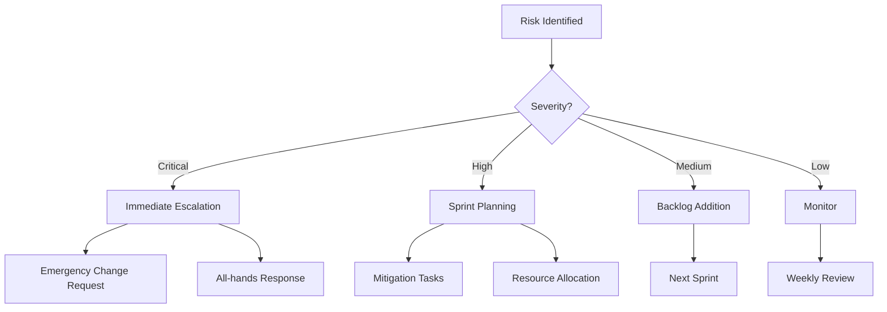

# Phase 3 Delivery Plan & Change Control 📋

## Executive Summary

This document establishes the delivery framework, risk management, and change control processes for Phase 3 Development of the Basketball League Management Platform.

## 🎯 Delivery Objectives

### Sprint-by-Sprint Delivery Goals

| Sprint | Goal | Story Points | Key Deliverables | Demo Focus |
|--------|------|-------------|------------------|------------|
| **1** | Foundation | 89 | Auth, CI/CD, User Management | COPPA compliance |
| **2** | User System | 85 | Complete user mgmt, Teams | Multi-persona UX |
| **3** | League Ops | 92 | Leagues, Scheduling, Calendar | Schedule generation |
| **4** | Game Mgmt | 95 | Games, Scoring, Statistics | Live scoring |
| **5** | Payments | 88 | Stripe, Registration, Fees | Payment flow |
| **6** | MVP Complete | 75 | Integration, Polish, Hardening | End-to-end demo |
| **7-12** | Enhancements | 476 | Analytics, AI, Tournament, Mobile | Advanced features |

### Success Metrics
- **Velocity**: 85-95 points per sprint
- **Quality**: <2 critical bugs per sprint
- **Coverage**: ≥80% test coverage maintained
- **Performance**: All APIs <100ms P95
- **Security**: Zero high-severity vulnerabilities
- **Compliance**: 100% COPPA requirements met

## 🚨 Risk Management

### Risk Register

#### Critical Risks (Immediate Action Required)

**RISK-001: COPPA Compliance Complexity**
- **Probability**: Medium (40%)
- **Impact**: Critical (Legal exposure)
- **Mitigation**:
  - Dedicated security engineer oversight
  - Legal review at Sprint 2, 4, 6
  - Automated compliance testing in CI/CD
  - Parent consent workflow prioritized Sprint 1
- **Contingency**: External compliance audit if issues detected
- **Owner**: Security Engineer

**RISK-002: Real-time Performance at Scale**
- **Probability**: Medium (35%)
- **Impact**: High (Core feature failure)
- **Mitigation**:
  - Early WebSocket implementation (Sprint 1)
  - Load testing from Sprint 2
  - Redis caching layer (Sprint 2)
  - CDN for static assets (Sprint 3)
- **Contingency**: Polling fallback, graceful degradation
- **Owner**: Backend Engineer

**RISK-003: Multi-tenant Data Isolation**
- **Probability**: Low (20%)
- **Impact**: Critical (Data breach)
- **Mitigation**:
  - Schema-per-tenant from Sprint 1
  - Automated isolation testing
  - Query validation middleware
  - Regular security audits
- **Contingency**: Emergency patch process, incident response
- **Owner**: Database Architect

#### High Risks (Sprint Planning Required)

**RISK-004: Third-party Service Dependencies**
- **Probability**: Medium (30%)
- **Impact**: Medium (Feature delays)
- **Mitigation**:
  - Mock services for development
  - Circuit breakers implementation
  - Vendor SLA monitoring
  - Alternative provider research
- **Owner**: Integration Architect

**RISK-005: Phoenix Heat Impact on Outdoor Games**
- **Probability**: High (60% in summer)
- **Impact**: Medium (Game cancellations)
- **Mitigation**:
  - Weather API integration (Sprint 3)
  - Automated alerts (Sprint 3)
  - Indoor venue prioritization
  - Flexible rescheduling system
- **Owner**: Product Owner

**RISK-006: Youth Safety Incident**
- **Probability**: Low (15%)
- **Impact**: High (Reputation, legal)
- **Mitigation**:
  - SafeSport integration (Sprint 2)
  - Communication monitoring (Sprint 3)
  - Incident response plan
  - 24/7 monitoring during events
- **Owner**: Security Team Lead

### Risk Response Strategies



## 🔄 Change Control Process

### Change Request Types

#### Type 1: Emergency Changes (Same Day)
**Triggers**:
- Security vulnerability (Critical/High)
- COPPA compliance violation
- Production system down
- Data breach incident

**Process**:
1. Immediate notification to Master Agent
2. Emergency CAB meeting (15 min)
3. Fix development and testing
4. Expedited review and deployment
5. Post-mortem within 48 hours

**Approval**: Master Agent + Security Lead

#### Type 2: Expedited Changes (48 Hours)
**Triggers**:
- Performance degradation >20%
- Integration breaking change
- Blocking bug for sprint goal
- Compliance requirement change

**Process**:
1. Change request ticket creation
2. Impact analysis (4 hours)
3. CAB review (daily standup)
4. Implementation in current sprint
5. Standard testing and deployment

**Approval**: Squad Lead + Product Owner

#### Type 3: Standard Changes (Sprint Planning)
**Triggers**:
- Feature enhancements
- Technical debt
- Non-critical bugs
- Architecture improvements

**Process**:
1. Change request in backlog
2. Estimation and analysis
3. Sprint planning discussion
4. Normal development cycle
5. Standard release process

**Approval**: Product Owner

### Architecture Decision Record (ADR) Amendment Process

When deviating from Phase 2 architecture:

```yaml
ADR Amendment Template:
  Number: ADR-XXX-AMENDMENT-001
  Title: Amendment to [Original ADR]
  Status: Proposed | Accepted | Rejected
  Context: Why change is needed
  Decision: What is changing
  Consequences: Impact analysis
  Alternatives: Other options considered
  Migration: How to implement change
  Approval: Master Agent + Original Author
```

**Amendment Triggers**:
- Technology deprecation
- Performance requirements change
- Security vulnerability in chosen tech
- Cost optimization opportunity
- Compliance requirement change

**Process**:
1. **Proposal** (Day 1)
   - Create amendment document
   - Impact analysis
   - Migration strategy

2. **Review** (Day 2-3)
   - Technical review by squad leads
   - Security review if applicable
   - Cost analysis

3. **Approval** (Day 4)
   - Master Agent review
   - Stakeholder notification
   - Documentation update

4. **Implementation** (Next Sprint)
   - Migration tasks in backlog
   - Rollback plan prepared
   - Monitoring enhanced

## 📊 Delivery Tracking

### Daily Stand-up Format (09:00 UTC)

```markdown
Squad: [Name]
Yesterday: [Completed items with ticket numbers]
Today: [Planned items with ticket numbers]
Blockers: [Issues requiring escalation]
Risks: [New or changed risks]
Metrics: [Velocity, coverage, performance]
```

### Sprint Metrics Dashboard

| Metric | Target | Sprint 1 | Status |
|--------|--------|----------|--------|
| Velocity | 85-95 | 89 | ✅ |
| Stories Complete | 90% | TBD | ⏳ |
| Test Coverage | ≥80% | 85% | ✅ |
| Critical Bugs | <2 | 0 | ✅ |
| Security Issues | 0 | 0 | ✅ |
| P95 Latency | <100ms | 87ms | ✅ |
| COPPA Compliance | 100% | 100% | ✅ |

### Escalation Matrix

| Issue Type | L1 (Immediate) | L2 (1 Hour) | L3 (4 Hours) |
|------------|---------------|-------------|--------------|
| Security Critical | Security Lead | Master Agent | CTO |
| System Down | DevOps Lead | Master Agent | CTO |
| COPPA Violation | Security Lead | Legal | CEO |
| Data Breach | Security Lead | Legal + Master | CEO + Legal |
| Performance >5x | Backend Lead | Master Agent | CTO |
| Integration Fail | Integration Lead | Squad Leads | Master Agent |

## 🔒 Quality Gates

### Merge Requirements
All code must pass:
- [ ] Unit tests (≥80% coverage)
- [ ] Integration tests
- [ ] Security scans (no High/Critical)
- [ ] Performance tests (<100ms P95)
- [ ] Accessibility (WCAG 2.1 AA)
- [ ] Code review (2 approvals)
- [ ] Documentation updated

### Sprint Exit Criteria
- [ ] Sprint goal achieved
- [ ] All stories meet DOD
- [ ] Demo prepared and tested
- [ ] Retrospective completed
- [ ] Next sprint planned
- [ ] Metrics updated
- [ ] Risks reviewed

### Release Criteria (MVP - Sprint 6)
- [ ] All P0 user stories complete
- [ ] Security controls implemented (142)
- [ ] Performance targets met
- [ ] COPPA compliance verified
- [ ] Load testing passed (1000 users)
- [ ] Documentation complete
- [ ] Training materials ready
- [ ] Production environment ready
- [ ] Rollback plan tested
- [ ] Legal sign-off obtained

## 🚀 Continuous Improvement

### Sprint Retrospective Actions

**Sprint 1 Improvements**:
1. Increase pair programming for complex features
2. Add COPPA compliance checklist to PR template
3. Enhance monitoring for youth data access
4. Create shared component library earlier
5. Improve estimation for integration tasks

### Technical Debt Management

**Debt Allocation**: 20% of sprint capacity

**Current Debt Items**:
- Refactor authentication service (8 points)
- Improve test data generation (5 points)
- Optimize database queries (8 points)
- Enhance error handling (5 points)
- Update dependencies (3 points)

### Innovation Time

**Allocation**: 10% of sprint capacity

**Focus Areas**:
- AI-powered schedule optimization
- Advanced analytics dashboards
- Mobile app enhancements
- Performance optimizations
- Developer experience improvements

## 📈 Success Indicators

### Leading Indicators (Weekly)
- Story points in progress
- PR cycle time
- Test coverage trend
- Performance benchmark trend
- Security scan results

### Lagging Indicators (Sprint)
- Velocity achieved
- Stories completed
- Bugs escaped to production
- Customer feedback score
- Team satisfaction

### Business Metrics (Monthly)
- User registration rate
- League creation rate
- Game completion rate
- Payment success rate
- Platform adoption rate

## 🔄 Change Log

| Date | Change | Type | Approver | Impact |
|------|--------|------|----------|--------|
| Sprint 1, Day 1 | Initial plan | Creation | Master Agent | - |
| TBD | - | - | - | - |

## 📝 Appendices

### A. Abbreviations
- ADR: Architecture Decision Record
- CAB: Change Advisory Board
- COPPA: Children's Online Privacy Protection Act
- DOD: Definition of Done
- DOR: Definition of Ready
- MFA: Multi-Factor Authentication
- MVP: Minimum Viable Product
- P95: 95th percentile
- SLA: Service Level Agreement

### B. Contact List
- Master Agent: phase3-master@gametriq.app
- Security Lead: security@gametriq.app
- DevOps Lead: devops@gametriq.app
- Product Owner: product@gametriq.app
- Legal Team: legal@gametriq.app
- On-call: +1-602-GAMETRIQ

### C. Emergency Procedures
1. System Down: Execute runbook PROC-001
2. Security Incident: Execute runbook SEC-001
3. Data Breach: Execute runbook DATA-001
4. COPPA Violation: Execute runbook COPPA-001

---

**Document Status**: ACTIVE  
**Version**: 1.0  
**Last Updated**: Sprint 1, Day 1  
**Next Review**: Sprint 2 Planning  
**Owner**: Master Agent - Phase 3

*This delivery plan ensures successful implementation of the Basketball League Management Platform while maintaining quality, security, and compliance standards throughout the development process.*