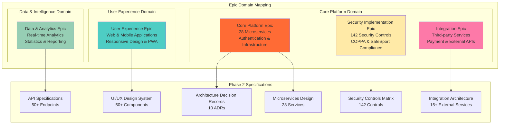
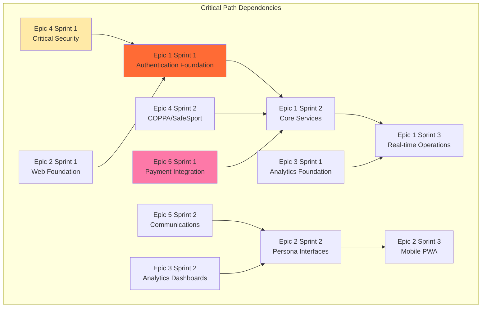

# Epic Breakdown - Basketball League Management Platform
## High-Level Epics Mapped to Phase 2 Specifications

**Document Version**: 1.0  
**Date**: August 8, 2025  
**Author**: Lead Developer Agent  
**Status**: Development Backlog Ready  

---

## Executive Summary

This document provides a comprehensive breakdown of high-level epics that map directly to Phase 2 architectural specifications and design documents. Each epic represents a major feature area with clear boundaries, dependencies, and implementation roadmaps that align with the microservices architecture and security requirements defined in Phase 2.

The epic structure follows Domain-Driven Design principles established in Phase 2, with each epic corresponding to specific bounded contexts and service responsibilities. All epics include direct references to Phase 2 specifications ensuring full traceability from requirements to implementation.

---

## Epic Architecture Overview



---

## Epic 1: Core Platform Epic
**Epic ID**: BLG-001  
**Story Points**: 320 (40% of total delivery)  
**Priority**: P0 - Must Have  
**Sprint Target**: Sprints 1-6 (MVP Critical Path)  
**Squad**: Core Platform Team  

### Phase 2 Specification Mapping
- **Primary Reference**: ADR-001 Event-Driven Microservices Architecture  
- **Service Design**: Microservices Architecture - 28 Service Definitions  
- **Database Design**: ERD and PostgreSQL Schema Specifications  
- **Security Controls**: Authentication and Access Control (AC-001 through AC-020)  
- **Performance Requirements**: Sub-100ms response times, 1000+ concurrent users  

### Architecture Foundation

#### Service Architecture Implementation
```typescript
// Core Platform Services Domain Mapping
interface CorePlatformServices {
  // Authentication & Identity Services
  authenticationService: {
    responsibilities: ['JWT token management', 'Multi-factor authentication', 'Session management'];
    phase2Reference: 'ADR-001 - Authentication Service Design';
    apiEndpoints: ['/auth/login', '/auth/register', '/auth/refresh', '/auth/mfa'];
    database: 'PostgreSQL - auth_service schema';
    scaling: { min: 2, max: 20, targetCPU: '70%' };
  };
  
  authorizationService: {
    responsibilities: ['RBAC/ABAC engine', 'Policy management', 'Permission validation'];
    phase2Reference: 'Security Controls Matrix - Authorization Controls';
    apiEndpoints: ['/authz/validate', '/authz/policies', '/authz/roles'];
    database: 'PostgreSQL - authz_service schema';
    scaling: { min: 2, max: 15, targetCPU: '75%' };
  };
  
  // Core Business Services
  userManagementService: {
    responsibilities: ['User lifecycle', 'COPPA compliance', 'Profile management'];
    phase2Reference: 'User Management Service Specification';
    apiEndpoints: ['/users', '/users/profiles', '/users/consent', '/users/relationships'];
    database: 'PostgreSQL - user_management schema';
    scaling: { min: 3, max: 25, targetCPU: '70%' };
  };
  
  leagueManagementService: {
    responsibilities: ['League operations', 'Season management', 'Division configuration'];
    phase2Reference: 'League Management Domain Model';
    apiEndpoints: ['/leagues', '/seasons', '/divisions', '/rules'];
    database: 'PostgreSQL - league_management schema';
    scaling: { min: 2, max: 12, targetCPU: '65%' };
  };
  
  teamManagementService: {
    responsibilities: ['Team registration', 'Roster management', 'Coach assignment'];
    phase2Reference: 'Team Management Service Design';
    apiEndpoints: ['/teams', '/rosters', '/coaches', '/registrations'];
    database: 'PostgreSQL - team_management schema';
    scaling: { min: 2, max: 15, targetCPU: '70%' };
  };
  
  gameOperationsService: {
    responsibilities: ['Real-time scoring', 'Game state management', 'Live updates'];
    phase2Reference: 'Game Operations Service - Event Sourcing Implementation';
    apiEndpoints: ['/games', '/games/{id}/score', '/games/{id}/events', '/games/{id}/state'];
    database: 'PostgreSQL + DynamoDB (event store)';
    scaling: { min: 5, max: 50, targetCPU: '60%', websocketConnections: 1000 };
  };
}
```

#### Infrastructure Services
```yaml
# Core Platform Infrastructure Mapping
infrastructure_services:
  api_gateway:
    technology: Kong Enterprise
    phase2_reference: "API Gateway Configuration Design"
    capabilities:
      - JWT authentication enforcement
      - Rate limiting (1000 req/hour standard, 10000 premium)
      - Request/response transformation
      - Service mesh integration
      - Circuit breaker patterns
    scaling:
      min_instances: 2
      max_instances: 10
      target_cpu: 70%
  
  service_mesh:
    technology: Istio
    phase2_reference: "ADR-008 - Service Mesh Implementation"
    capabilities:
      - mTLS service-to-service communication
      - Traffic management and load balancing
      - Observability and distributed tracing
      - Security policy enforcement
    
  event_streaming:
    technology: Apache Kafka + AWS EventBridge
    phase2_reference: "ADR-001 - Event-Driven Architecture"
    capabilities:
      - Real-time event streaming (game updates)
      - Event sourcing for audit trails
      - Cross-service communication
      - Event replay and recovery
    
  database_layer:
    primary: PostgreSQL 15 Aurora Serverless
    cache: Redis 7 ElastiCache
    search: OpenSearch (Elasticsearch compatible)
    phase2_reference: "Database Performance Optimization Strategy"
```

### Epic Delivery Roadmap

#### Sprint 1-2: Foundation & Authentication (89 story points)
**Milestone**: Secure authentication system operational
- JWT-based authentication service with MFA support
- User management service with COPPA compliance
- PostgreSQL schema initialization and migration system
- API Gateway with authentication enforcement
- CI/CD pipeline with automated testing and deployment

**Key Deliverables**:
- [ ] Authentication service deployed with JWT and MFA
- [ ] User registration with age verification and parental consent
- [ ] Database schema with core user and auth tables
- [ ] Kong API Gateway with authentication plugin
- [ ] GitHub Actions CI/CD pipeline operational
- [ ] Preview environment accessible for demos

**Success Criteria**:
```gherkin
Given the core platform foundation is implemented
When users access the authentication system
Then JWT tokens are generated and validated correctly
And COPPA-compliant user registration works for all age groups
And API Gateway enforces authentication for protected endpoints
And automated deployments work through CI/CD pipeline
```

#### Sprint 3-4: Core Business Services (144 story points)
**Milestone**: League and team management operational
- League management service with season configuration
- Team management service with roster and coach assignment
- Payment integration with Stripe for registration fees
- Basic game scheduling and management
- Web application foundation with authentication UI

**Key Deliverables**:
- [ ] League creation and configuration workflows
- [ ] Team registration with payment processing
- [ ] Coach assignment with SafeSport integration
- [ ] Basic game scheduling system
- [ ] Next.js web application with responsive design
- [ ] Email notification system operational

**Success Criteria**:
```gherkin
Given core business services are implemented
When league administrators create leagues and teams
Then leagues can be configured with divisions and rules
And teams can register with payment processing
And coaches can be assigned with background checks
And games can be scheduled with conflict detection
```

#### Sprint 5-6: Real-time Operations (110 story points)
**Milestone**: Live game operations and scoring system
- Game operations service with real-time scoring
- WebSocket implementation for live updates
- Statistics tracking and calculation engine
- Mobile PWA for courtside scoring
- Advanced scheduling with AI optimization

**Key Deliverables**:
- [ ] Real-time scoring system with WebSocket updates
- [ ] Event sourcing for game state management
- [ ] Player and team statistics calculation
- [ ] Mobile PWA with offline capabilities
- [ ] AI-powered scheduling optimization
- [ ] Referee assignment and management system

**Success Criteria**:
```gherkin
Given real-time operations are implemented
When games are played and scored in real-time
Then score updates are broadcast to all connected clients within 100ms
And game statistics are calculated and stored accurately
And mobile users can score games offline with sync capability
And schedules are optimized using AI algorithms
```

### Technical Debt and Quality Measures
- **Code Coverage Target**: ≥80% across all services
- **Performance SLA**: P95 response times <200ms for critical APIs
- **Security Scanning**: Automated SAST/DAST with zero critical vulnerabilities
- **Documentation**: OpenAPI 3.0 specs for all endpoints with examples
- **Monitoring**: Distributed tracing and comprehensive observability

---

## Epic 2: User Experience Epic
**Epic ID**: BLG-002  
**Story Points**: 200 (25% of total delivery)  
**Priority**: P0 - Must Have  
**Sprint Target**: Sprints 2-5  
**Squad**: User Experience Team  

### Phase 2 Specification Mapping
- **Primary Reference**: UI/UX Design System - Complete Component Library  
- **Wireframes**: Complete screen wireframes for all 6 user personas  
- **Accessibility**: WCAG 2.1 AA compliance requirements  
- **Mobile Design**: PWA specifications and mobile-first approach  
- **Design System**: Material Design 3 with basketball theming  

### User Experience Architecture

#### Design System Implementation
```typescript
// Design System Component Mapping
interface DesignSystemComponents {
  // Foundation Components
  foundations: {
    typography: {
      phase2Reference: 'Typography Scale - Material Design 3';
      implementation: 'CSS custom properties with fluid type scales';
      accessibility: 'WCAG 2.1 AA contrast ratios enforced';
    };
    
    colors: {
      phase2Reference: 'Color Palette - Basketball Theme';
      implementation: 'CSS custom properties with dark/light mode support';
      accessibility: 'Color blind friendly with 4.5:1 contrast minimum';
    };
    
    spacing: {
      phase2Reference: 'Spacing System - 8px Grid';
      implementation: 'CSS Grid and Flexbox with consistent spacing units';
      responsiveness: 'Mobile-first breakpoints (320px, 768px, 1024px, 1440px)';
    };
  };
  
  // Core UI Components (50+ components specified)
  components: {
    navigation: {
      phase2Reference: 'Navigation Patterns - Multi-level Menu';
      components: ['TopNavigation', 'SideNavigation', 'BreadcrumbNavigation', 'TabNavigation'];
      accessibility: 'Keyboard navigation and screen reader support';
      responsive: 'Collapsible mobile navigation with hamburger menu';
    };
    
    forms: {
      phase2Reference: 'Form Components - Validation Patterns';
      components: ['TextInput', 'SelectInput', 'FileUpload', 'DatePicker', 'FormValidation'];
      accessibility: 'ARIA labels, error announcements, focus management';
      validation: 'Real-time validation with accessible error messages';
    };
    
    dataDisplay: {
      phase2Reference: 'Data Visualization - Statistics Dashboard';
      components: ['DataTable', 'StatisticsCard', 'Chart', 'Timeline', 'ScoreBoard'];
      accessibility: 'Screen reader compatible data tables and charts';
      responsive: 'Touch-friendly interactions for mobile scoring';
    };
    
    feedback: {
      phase2Reference: 'Notification Patterns - Multi-channel Feedback';
      components: ['Toast', 'Alert', 'Modal', 'Loading', 'EmptyState'];
      accessibility: 'Focus trap in modals, ARIA live regions for announcements';
      interaction: 'Consistent animation and transition patterns';
    };
  };
}
```

#### Multi-Persona User Interface Design
```typescript
// Persona-Specific Interface Requirements
interface PersonaInterfaces {
  leagueAdministrator: {
    phase2Reference: 'League Admin Wireframes - Dashboard-centric Design';
    primaryFeatures: [
      'League configuration dashboard',
      'Team and player management interface',
      'Financial reporting and payment tracking',
      'System administration tools'
    ];
    designPriorities: ['Data density', 'Workflow efficiency', 'Multi-tasking support'];
    screenSizes: ['Desktop primary (1440px+)', 'Tablet secondary (768px+)'];
  };
  
  coaches: {
    phase2Reference: 'Coach Wireframes - Mobile-optimized for Courtside';
    primaryFeatures: [
      'Team roster and lineup management',
      'Game scoring and statistics interface',
      'Practice planning and communication',
      'Player development tracking'
    ];
    designPriorities: ['Mobile-first', 'Quick actions', 'Offline capability'];
    screenSizes: ['Mobile primary (320-768px)', 'Tablet secondary'];
  };
  
  parents: {
    phase2Reference: 'Parent Wireframes - Simplified Information Access';
    primaryFeatures: [
      'Child player information and statistics',
      'Schedule and notification management',
      'Payment and registration workflows',
      'Communication with coaches and league'
    ];
    designPriorities: ['Simplicity', 'Information clarity', 'Parental controls'];
    screenSizes: ['Mobile primary', 'Desktop secondary'];
  };
  
  players: {
    phase2Reference: 'Player Wireframes - Age-appropriate Gamification';
    primaryFeatures: [
      'Personal statistics and achievements',
      'Team schedule and game information',
      'Skill development tracking',
      'Social features with safety controls'
    ];
    designPriorities: ['Age-appropriate design', 'Gamification', 'Safety controls'];
    screenSizes: ['Mobile primary', 'Tablet secondary'];
  };
  
  referees: {
    phase2Reference: 'Referee Wireframes - Quick-access Game Tools';
    primaryFeatures: [
      'Game assignment and availability',
      'Quick-access rule references',
      'Game incident reporting',
      'Payment and scheduling management'
    ];
    designPriorities: ['Quick access', 'Clear information hierarchy', 'Mobile-optimized'];
    screenSizes: ['Mobile primary', 'Desktop for administration'];
  };
  
  scorekeepers: {
    phase2Reference: 'Scorekeeper Wireframes - Streamlined Scoring Interface';
    primaryFeatures: [
      'Intuitive real-time scoring interface',
      'Game statistics tracking',
      'Error correction workflows',
      'Offline scoring with sync capability'
    ];
    designPriorities: ['Speed', 'Error prevention', 'Offline reliability'];
    screenSizes: ['Mobile/Tablet primary for courtside use'];
  };
}
```

### Epic Delivery Roadmap

#### Sprint 2-3: Web Application Foundation (89 story points)
**Milestone**: Responsive web application with authentication UI
- Next.js application structure with TypeScript and Tailwind CSS
- Authentication UI components (login, registration, profile management)
- Responsive layout system with mobile-first design
- Component library foundation with Storybook documentation

**Key Deliverables**:
- [ ] Next.js application with TypeScript and Tailwind CSS setup
- [ ] Authentication flow UI (login, registration, password recovery)
- [ ] Responsive navigation with mobile hamburger menu
- [ ] User profile management interface
- [ ] Storybook component library documentation
- [ ] WCAG 2.1 AA accessibility compliance validation

#### Sprint 3-4: Persona-Specific Interfaces (78 story points)
**Milestone**: Core interfaces for all 6 user personas
- League administrator dashboard with management tools
- Coach interface optimized for mobile/courtside use
- Parent interface with simplified information access
- Player interface with age-appropriate design
- Basic data display components for statistics and schedules

**Key Deliverables**:
- [ ] League admin dashboard with configuration tools
- [ ] Coach mobile interface for team and game management
- [ ] Parent interface for child information and payments
- [ ] Player interface with gamification elements
- [ ] Referee and scorekeeper specialized interfaces
- [ ] Data visualization components for statistics display

#### Sprint 4-5: Progressive Web App Implementation (67 story points)
**Milestone**: Mobile PWA with offline capabilities and push notifications
- Service worker implementation for offline functionality
- Push notification system for mobile devices
- Mobile-optimized touch interactions and gestures
- Offline data synchronization with background sync

**Key Deliverables**:
- [ ] PWA manifest and service worker configuration
- [ ] Offline caching strategy for critical app functionality
- [ ] Push notification setup and permission management
- [ ] Mobile touch interactions and gesture support
- [ ] Background sync for offline data collection
- [ ] App store optimization and installation prompts

### Accessibility and Compliance Standards
- **WCAG 2.1 AA Compliance**: All interfaces tested with automated and manual accessibility testing
- **Keyboard Navigation**: Full keyboard accessibility for all interactive elements
- **Screen Reader Support**: Semantic HTML and ARIA attributes for assistive technologies
- **Color Contrast**: 4.5:1 minimum contrast ratio for normal text, 3:1 for large text
- **Touch Accessibility**: 44px minimum touch target size for mobile interactions
- **Age-Appropriate Design**: Simplified interfaces for youth users with safety considerations

---

## Epic 3: Data & Analytics Epic
**Epic ID**: BLG-003  
**Story Points**: 180 (22.5% of total delivery)  
**Priority**: P1 - Should Have  
**Sprint Target**: Sprints 6-10  
**Squad**: Data & Intelligence Team  

### Phase 2 Specification Mapping
- **Primary Reference**: Analytics Service Design - Real-time Processing  
- **Statistics Engine**: Statistics Service - Basketball Metrics Calculation  
- **Event Sourcing**: Game Operations Event Store Architecture  
- **Machine Learning**: Scheduling Optimization and Predictive Analytics  
- **Reporting System**: Custom Reporting Engine with Export Capabilities  

### Data Architecture Implementation

#### Real-time Analytics Pipeline
```python
# Analytics Architecture Component Mapping
from typing import Dict, List, Optional
from dataclasses import dataclass
from enum import Enum

@dataclass
class AnalyticsArchitecture:
    """Phase 2 Analytics Architecture Implementation Mapping"""
    
    # Real-time Stream Processing
    stream_processing: Dict = {
        'technology': 'Apache Kafka + Apache Flink',
        'phase2_reference': 'Real-time Analytics Processing Pipeline',
        'capabilities': [
            'Live game event processing (<100ms latency)',
            'Real-time statistics calculation and updates',
            'Event stream aggregation and windowing',
            'Complex event pattern matching'
        ],
        'data_sources': [
            'Game scoring events from WebSocket streams',
            'User interaction events from web/mobile apps',
            'External data feeds (weather, schedules)',
            'System performance and usage metrics'
        ]
    }
    
    # Statistics Calculation Engine
    statistics_engine: Dict = {
        'technology': 'Python + NumPy + Pandas',
        'phase2_reference': 'Basketball Statistics Calculation Logic',
        'metrics_calculated': [
            'Individual player statistics (points, rebounds, assists, etc.)',
            'Team performance metrics and trends',
            'League-wide statistics and rankings',
            'Historical performance analysis',
            'Predictive performance indicators'
        ],
        'calculation_frequency': {
            'real_time': 'Live game events (immediate)',
            'batch': 'End-of-game aggregations (within 1 minute)',
            'scheduled': 'Daily/weekly trend analysis'
        }
    }
    
    # Data Storage and Retrieval
    data_storage: Dict = {
        'oltp_database': {
            'technology': 'PostgreSQL 15 with time-series extensions',
            'phase2_reference': 'Analytics Data Model Design',
            'tables': [
                'game_events (event sourcing store)',
                'player_statistics (real-time aggregations)',
                'team_performance (calculated metrics)',
                'league_analytics (cross-league insights)'
            ]
        },
        'olap_warehouse': {
            'technology': 'Amazon Redshift',
            'phase2_reference': 'Data Warehouse Architecture',
            'purpose': 'Historical analysis and complex reporting',
            'data_retention': '7 years for compliance and trend analysis'
        },
        'cache_layer': {
            'technology': 'Redis with time-series data structures',
            'purpose': 'Sub-second query response for live dashboards',
            'ttl_strategy': 'Adaptive based on data volatility'
        }
    }
    
    # Machine Learning Integration
    ml_capabilities: Dict = {
        'scheduling_optimization': {
            'technology': 'Python scikit-learn + OR-Tools',
            'phase2_reference': 'AI-Powered Scheduling Engine',
            'algorithms': [
                'Constraint satisfaction for schedule generation',
                'Genetic algorithms for optimization',
                'Machine learning for preference prediction'
            ]
        },
        'predictive_analytics': {
            'models': [
                'Player performance prediction',
                'Team success forecasting',
                'Attendance prediction',
                'Injury risk assessment'
            ],
            'model_deployment': 'MLflow for model versioning and deployment',
            'inference_latency': '<50ms for real-time predictions'
        }
    }

# Basketball Statistics Domain Model
class BasketballStatistics:
    """Basketball-specific statistics calculation engine"""
    
    def __init__(self):
        self.phase2_reference = "Basketball Statistics Calculation Specification"
        
    def calculate_player_stats(self, game_events: List[GameEvent]) -> PlayerStatistics:
        """Calculate comprehensive player statistics from game events"""
        # Implementation maps to Phase 2 Basketball Statistics Logic
        return PlayerStatistics(
            traditional_stats=self._calculate_traditional_stats(game_events),
            advanced_stats=self._calculate_advanced_stats(game_events),
            efficiency_metrics=self._calculate_efficiency_metrics(game_events)
        )
    
    def calculate_team_stats(self, game_events: List[GameEvent]) -> TeamStatistics:
        """Calculate team performance metrics and analytics"""
        # Implementation maps to Phase 2 Team Analytics Specification
        return TeamStatistics(
            offensive_metrics=self._calculate_offensive_metrics(game_events),
            defensive_metrics=self._calculate_defensive_metrics(game_events),
            pace_and_efficiency=self._calculate_pace_metrics(game_events)
        )
        
    def generate_insights(self, statistics: PlayerStatistics) -> List[Insight]:
        """Generate AI-powered insights from statistical data"""
        # Maps to Phase 2 AI Integration for Performance Insights
        insights = []
        
        # Performance trend analysis
        if self._detect_improvement_trend(statistics):
            insights.append(Insight(
                type="performance_improvement",
                message="Player showing consistent improvement over last 5 games",
                confidence=0.85
            ))
        
        # Comparative analysis
        league_percentile = self._calculate_league_percentile(statistics)
        if league_percentile > 0.90:
            insights.append(Insight(
                type="exceptional_performance",
                message="Player performing in top 10% of league",
                confidence=0.92
            ))
        
        return insights
```

#### Analytics Dashboard Architecture
```typescript
// Analytics Dashboard Component Architecture
interface AnalyticsDashboardArchitecture {
  // Real-time Dashboard Components
  realTimeDashboards: {
    liveGameDashboard: {
      phase2Reference: 'Live Game Analytics Visualization';
      components: [
        'Real-time score display with play-by-play timeline',
        'Live player statistics updating during game',
        'Team performance metrics with trend indicators',
        'Game flow analysis with momentum indicators'
      ];
      updateFrequency: '<1 second for live data';
      dataVisualization: 'D3.js + Chart.js for interactive charts';
    };
    
    leagueOverviewDashboard: {
      phase2Reference: 'League Analytics Dashboard Design';
      components: [
        'League standings with trend analysis',
        'Top performers across multiple categories',
        'Participation metrics and growth tracking',
        'Financial performance and revenue analytics'
      ];
      refreshRate: '5 minutes for aggregated data';
      exportCapability: 'PDF, Excel, CSV export options';
    };
  };
  
  // Historical Analytics and Reporting
  historicalAnalytics: {
    playerDevelopmentTracking: {
      phase2Reference: 'Player Performance Analytics Design';
      capabilities: [
        'Season-over-season improvement tracking',
        'Skill development progression analysis',
        'Comparative analysis against peer groups',
        'Goal setting and achievement tracking'
      ];
      dataRange: '5+ years of historical data';
      visualization: 'Interactive charts with drill-down capability';
    };
    
    coachAnalyticsTools: {
      phase2Reference: 'Coach Analytics Tools Specification';
      features: [
        'Team performance analysis and insights',
        'Player rotation optimization recommendations',
        'Opponent scouting report generation',
        'Practice planning data-driven suggestions'
      ];
      aiInsights: 'Machine learning powered recommendations';
      integration: 'Export to practice planning tools';
    };
  };
  
  // Custom Reporting Engine
  reportingSystem: {
    templateEngine: {
      phase2Reference: 'Custom Reporting Engine Design';
      capabilities: [
        'Drag-and-drop report builder interface',
        'Pre-built templates for common reports',
        'Custom query builder with visual interface',
        'Scheduled report generation and delivery'
      ];
      outputFormats: ['PDF', 'Excel', 'CSV', 'JSON', 'Web Dashboard'];
      scheduling: 'Daily, weekly, monthly, custom intervals';
    };
  };
}
```

### Epic Delivery Roadmap

#### Sprint 6-7: Real-time Analytics Foundation (78 story points)
**Milestone**: Live game analytics and statistics tracking operational
- Real-time event processing pipeline with Kafka/Flink
- Basketball statistics calculation engine
- Live dashboard for game statistics and scoring
- Event sourcing implementation for game data

**Key Deliverables**:
- [ ] Apache Kafka event streaming infrastructure
- [ ] Real-time statistics calculation engine
- [ ] Live game dashboard with WebSocket updates
- [ ] Event sourcing for complete game history
- [ ] Player and team statistics API endpoints
- [ ] Performance benchmarks met (<100ms analytics updates)

#### Sprint 8-9: Analytics Dashboards and Insights (65 story points)  
**Milestone**: Comprehensive analytics dashboards for all personas
- League overview dashboard with key metrics
- Player development tracking interface
- Coach analytics tools with AI-powered insights
- Historical trend analysis and visualization

**Key Deliverables**:
- [ ] League administrator analytics dashboard
- [ ] Player performance tracking interface
- [ ] Coach analytics tools with recommendations
- [ ] Historical data visualization components
- [ ] AI-powered insights generation system
- [ ] Mobile-responsive analytics interface

#### Sprint 9-10: Advanced Analytics and Reporting (37 story points)
**Milestone**: Custom reporting system and advanced analytics features
- Custom report builder with template system
- Scheduled report generation and delivery
- Advanced statistical analysis and predictions
- Data export capabilities in multiple formats

**Key Deliverables**:
- [ ] Custom report builder interface
- [ ] Report template library for common use cases
- [ ] Scheduled report generation system
- [ ] Advanced statistical calculations (efficiency ratings, etc.)
- [ ] Data export functionality (PDF, Excel, CSV)
- [ ] Report sharing and collaboration features

### Machine Learning Integration
- **Scheduling Optimization**: AI-powered schedule generation with constraint satisfaction
- **Performance Prediction**: Player and team performance forecasting models
- **Attendance Forecasting**: Predictive models for game attendance and participation
- **Risk Assessment**: Injury risk and player safety predictive analytics
- **Recommendation Engine**: Personalized insights for coaches and players

---

## Epic 4: Security Implementation Epic
**Epic ID**: BLG-004  
**Story Points**: 142 (17.8% of total delivery)  
**Priority**: P0 - Must Have  
**Sprint Target**: Sprints 1-3 (Critical Security Controls)  
**Squad**: Core Platform Team (Security Focus)  

### Phase 2 Specification Mapping
- **Primary Reference**: Security Controls Matrix - 142 Controls Across 8 Families  
- **COPPA Compliance**: Youth Data Protection Framework  
- **SafeSport Integration**: Background Check and Safety Protocols  
- **Threat Model**: STRIDE/DREAD Analysis with Youth-Specific Threats  
- **Security Architecture**: Defense-in-Depth Implementation  

### Security Control Implementation Matrix

#### Control Family 1: Access Control (AC) - 20 Controls
```typescript
// Access Control Implementation Mapping
interface AccessControlImplementation {
  // AC-001: Account Management
  accountManagement: {
    phase2Reference: 'Security Controls Matrix - AC-001';
    implementation: 'User lifecycle management with automated provisioning/deprovisioning';
    technologies: ['PostgreSQL user management', 'JWT token lifecycle', 'Role-based access control'];
    compliance: ['COPPA account creation workflows', 'Parental consent tracking'];
    testingStrategy: 'Automated tests for account creation, modification, deletion workflows';
  };
  
  // AC-002: Multi-Factor Authentication
  multiFactorAuth: {
    phase2Reference: 'Security Controls Matrix - AC-002';
    implementation: 'TOTP-based MFA with backup codes and recovery mechanisms';
    technologies: ['Speakeasy library for TOTP', 'QR code generation', 'Encrypted backup codes'];
    riskMitigation: 'Account takeover prevention and enhanced authentication security';
    userExperience: 'Seamless MFA setup with authenticator app integration';
  };
  
  // AC-003: Account Lockout Protection
  accountLockout: {
    phase2Reference: 'Security Controls Matrix - AC-003';
    implementation: 'Progressive lockout with exponential backoff and CAPTCHA integration';
    parameters: {
      failedAttempts: 5,
      lockoutDuration: '15 minutes initial, exponential increase',
      captchaThreshold: 3
    };
    monitoring: 'Real-time alerting for account lockout patterns and potential attacks';
  };
  
  // AC-004 through AC-020: Additional Access Controls
  roleBasedAccess: {
    implementation: 'Hierarchical role system with fine-grained permissions';
    roles: ['super_admin', 'league_admin', 'coach', 'parent', 'player', 'referee', 'scorekeeper'];
    permissions: 'Resource-based permissions with inheritance and delegation';
  };
}
```

#### Control Family 2: Data Protection (DP) - 30 Controls
```python
# Data Protection Implementation Architecture
from cryptography.fernet import Fernet
from typing import Dict, List
import hashlib

class DataProtectionImplementation:
    """Comprehensive data protection controls implementation"""
    
    def __init__(self):
        self.phase2_reference = "Security Controls Matrix - Data Protection Family"
        self.encryption_key = self._generate_or_load_key()
        
    def implement_field_level_encryption(self):
        """DP-001: Field-level encryption for PII data"""
        # Implementation maps to Phase 2 Data Protection Specification
        encryption_fields = {
            'users': ['email', 'phone', 'ssn', 'address'],
            'player_profiles': ['medical_info', 'emergency_contacts'],
            'payment_info': ['card_tokens', 'bank_details'],
            'parental_consent': ['parent_email', 'digital_signature']
        }
        
        for table, fields in encryption_fields.items():
            self._apply_field_encryption(table, fields)
    
    def implement_data_tokenization(self):
        """DP-002: Tokenization for sensitive data storage"""
        # Maps to Phase 2 Tokenization Strategy
        tokenization_config = {
            'pci_data': {
                'method': 'format_preserving_encryption',
                'scope': 'payment card information',
                'compliance': 'PCI DSS Level 1'
            },
            'pii_data': {
                'method': 'random_token_replacement',
                'scope': 'personally identifiable information',
                'compliance': 'COPPA and GDPR requirements'
            }
        }
        return tokenization_config
    
    def implement_coppa_controls(self):
        """DP-015 through DP-025: COPPA-specific data protection"""
        coppa_controls = {
            'age_verification': {
                'implementation': 'Multi-method age verification with parental override',
                'validation': 'Date of birth validation with government records where available'
            },
            'parental_consent': {
                'implementation': 'Digital consent with email verification and optional postal mail',
                'tracking': 'Complete audit trail of consent requests, grants, and withdrawals'
            },
            'data_minimization': {
                'implementation': 'Collect only essential data for service provision',
                'retention': 'Automatic data deletion upon consent withdrawal or age-out'
            },
            'access_controls': {
                'implementation': 'Parental access to child data with authentication',
                'restrictions': 'Limited data sharing and third-party access for minors'
            }
        }
        return coppa_controls
    
    def implement_safesport_integration(self):
        """DP-026 through DP-030: SafeSport compliance and background checks"""
        safesport_integration = {
            'background_checks': {
                'phase2_reference': 'SafeSport Integration Design',
                'api_integration': 'SafeSport API for automated background check requests',
                'verification': 'Real-time status checking and compliance tracking',
                'renewal': 'Automated renewal reminders and re-verification processes'
            },
            'communication_monitoring': {
                'implementation': 'AI-powered content analysis for inappropriate communications',
                'scope': 'Coach-player communications and team messaging',
                'privacy_balance': 'Safety monitoring with privacy protection mechanisms'
            },
            'incident_reporting': {
                'implementation': 'Secure incident reporting system with anonymity options',
                'workflow': 'Automated escalation and mandatory reporting compliance',
                'documentation': 'Complete audit trail for all safety incidents'
            }
        }
        return safesport_integration
```

#### Control Family 3: System Security (SS) - 35 Controls
```yaml
# System Security Controls Implementation
system_security_controls:
  
  # SS-001 through SS-010: Infrastructure Security
  infrastructure_security:
    container_security:
      phase2_reference: "Container Security Architecture"
      implementation:
        - Base image scanning with Trivy
        - Minimal attack surface with distroless images
        - Runtime security monitoring with Falco
        - Network segmentation with Kubernetes NetworkPolicies
      compliance:
        - CIS Kubernetes Benchmark adherence
        - Regular vulnerability assessments
    
    network_security:
      implementation:
        - Web Application Firewall (WAF) with OWASP Top 10 protection
        - DDoS protection with AWS Shield Advanced
        - Network segmentation with VPC and security groups
        - mTLS for service-to-service communication
      monitoring:
        - Real-time network traffic analysis
        - Intrusion detection and prevention systems (IDS/IPS)
        - Security information and event management (SIEM)
  
  # SS-011 through SS-025: Application Security
  application_security:
    secure_coding:
      phase2_reference: "Application Security Controls"
      practices:
        - Input validation and output encoding
        - SQL injection prevention with parameterized queries
        - Cross-Site Scripting (XSS) protection
        - Cross-Site Request Forgery (CSRF) token validation
        - Secure session management
      testing:
        - Static Application Security Testing (SAST) with SonarQube
        - Dynamic Application Security Testing (DAST) with OWASP ZAP
        - Interactive Application Security Testing (IAST) integration
        - Regular penetration testing by third-party security firms
    
    api_security:
      implementation:
        - OAuth 2.0 with PKCE for secure authorization
        - API rate limiting and throttling
        - Request/response validation against OpenAPI schemas
        - API gateway security policies and transformations
      monitoring:
        - API usage analytics and anomaly detection
        - Real-time API security monitoring
        - Automated threat intelligence integration
  
  # SS-026 through SS-035: Monitoring and Incident Response
  security_monitoring:
    siem_integration:
      technology: "AWS Security Hub + CloudWatch + DataDog"
      capabilities:
        - Centralized security event correlation
        - Automated threat detection and alerting
        - Security metrics and dashboard visualization
        - Compliance reporting and audit trail generation
    
    incident_response:
      phase2_reference: "Incident Response Plan"
      automation:
        - Automated incident detection and classification
        - Workflow orchestration with AWS Systems Manager
        - Automated containment and remediation procedures
        - Real-time notification and escalation systems
      procedures:
        - Defined incident response team roles and responsibilities
        - Communication protocols for different incident types
        - Forensics and evidence collection procedures
        - Post-incident review and improvement processes
```

### Epic Delivery Roadmap

#### Sprint 1: Critical Security Foundation (55 story points)
**Milestone**: Essential security controls operational for MVP launch
- Access control implementation with JWT and RBAC
- Field-level encryption for PII data
- Input validation and injection prevention
- Basic security monitoring and logging

**Key Deliverables**:
- [ ] JWT-based authentication with secure token management
- [ ] Role-based access control (RBAC) system
- [ ] Field-level encryption for sensitive user data
- [ ] Input validation framework preventing injection attacks
- [ ] Security logging and monitoring infrastructure
- [ ] Basic incident response procedures

#### Sprint 2: COPPA and Youth Safety (45 story points)
**Milestone**: COPPA compliance and SafeSport integration complete
- Parental consent workflow with digital signatures
- Age-appropriate data collection and privacy controls
- SafeSport API integration for background checks
- Youth-specific communication monitoring

**Key Deliverables**:
- [ ] COPPA-compliant parental consent system
- [ ] Age verification and data minimization controls
- [ ] SafeSport background check integration
- [ ] Communication monitoring for safety compliance
- [ ] Data retention and deletion policies for minors
- [ ] Parental access and control mechanisms

#### Sprint 3: Advanced Security Controls (42 story points)
**Milestone**: Comprehensive security posture with advanced threat protection
- Web Application Firewall (WAF) configuration
- Advanced threat detection and response
- Security scanning integration in CI/CD pipeline
- Complete security monitoring and alerting

**Key Deliverables**:
- [ ] WAF deployment with OWASP Top 10 protection
- [ ] Advanced threat detection with machine learning
- [ ] Automated security scanning in deployment pipeline
- [ ] Comprehensive security monitoring dashboard
- [ ] Incident response automation and playbooks
- [ ] Third-party security audit readiness

### Compliance and Audit Readiness
- **COPPA Compliance**: 100% automated compliance validation with reporting
- **SafeSport Compliance**: Integrated background checks and safety monitoring
- **PCI DSS**: Level 1 compliance for payment card data handling
- **SOC 2 Type II**: Security, availability, and confidentiality controls
- **Security Audits**: Quarterly third-party security assessments
- **Penetration Testing**: Annual comprehensive security testing

---

## Epic 5: Integration Epic
**Epic ID**: BLG-005  
**Story Points**: 98 (12.3% of total delivery)  
**Priority**: P0 - Must Have  
**Sprint Target**: Sprints 3-5  
**Squad**: Core Platform Team  

### Phase 2 Specification Mapping
- **Primary Reference**: Integration Architecture - 15+ External Service Integrations  
- **Payment Integration**: Stripe Integration with COPPA Compliance  
- **Calendar Sync**: Multi-provider Calendar Synchronization  
- **Notification Architecture**: Multi-channel Communication System  
- **Weather Integration**: Heat Safety Monitoring (Phoenix-specific)  
- **Third-party Contracts**: SLAs and Integration Specifications  

### Integration Architecture Overview

#### Payment Integration Architecture
```typescript
// Payment Integration Implementation
interface PaymentIntegrationArchitecture {
  stripeIntegration: {
    phase2Reference: 'Payment Integration Design - Stripe Implementation';
    capabilities: {
      paymentProcessing: {
        supportedMethods: ['credit_card', 'debit_card', 'ach_transfer', 'digital_wallet'];
        currencies: ['USD']; // Initial implementation
        features: [
          'One-time payments for registration fees',
          'Recurring payments for season subscriptions', 
          'Installment plans for payment flexibility',
          'Partial refunds for cancelled registrations'
        ];
      };
      coppaCompliance: {
        parentalAuthorization: 'Required for all payments involving minors';
        consentTracking: 'Digital consent with audit trail for payment authorization';
        dataMinimization: 'Minimal payment data collection for COPPA compliance';
        tokenization: 'PCI-compliant tokenization of payment methods';
      };
      webhookHandling: {
        events: [
          'payment_intent.succeeded',
          'payment_intent.payment_failed', 
          'invoice.payment_succeeded',
          'customer.subscription.updated'
        ];
        processing: 'Idempotent webhook processing with retry mechanisms';
        security: 'Webhook signature validation and IP whitelisting';
      };
    };
    
    errorHandling: {
      paymentFailures: {
        implementation: 'Graceful failure handling with user-friendly messages';
        retryLogic: 'Automatic retry for temporary failures with exponential backoff';
        notificationSystem: 'Real-time notifications for payment status updates';
      };
      fraudPrevention: {
        riskAssessment: 'Stripe Radar integration for fraud detection';
        velocityChecks: 'Automated limits on payment frequency and amounts';
        manualReview: 'Flagged transactions for manual review process';
      };
    };
  };
  
  financialReporting: {
    revenueTracking: {
      realTimeMetrics: 'Live revenue dashboard with payment analytics';
      reconciliation: 'Automated daily reconciliation with Stripe settlements';
      taxReporting: 'Integration with accounting systems for tax compliance';
    };
    refundManagement: {
      automatedRefunds: 'Policy-based automatic refund processing';
      partialRefunds: 'Pro-rated refunds for mid-season cancellations';
      disputeHandling: 'Automated chargeback and dispute management workflow';
    };
  };
}
```

#### External Service Integration Matrix
```python
# External Service Integration Implementation
from typing import Dict, List, Optional
from dataclasses import dataclass
from enum import Enum

@dataclass
class ExternalServiceIntegration:
    """Complete external service integration architecture"""
    
    # Communication Services
    communication_services: Dict = {
        'sendgrid_email': {
            'phase2_reference': 'Email Service Integration Design',
            'capabilities': [
                'Transactional emails with templates',
                'Bulk email campaigns for leagues',
                'Email deliverability optimization',
                'Real-time email analytics and tracking'
            ],
            'integration_pattern': 'RESTful API with webhook callbacks',
            'failover_strategy': 'Amazon SES backup with automatic fallback',
            'rate_limits': '40,000 emails per day (scalable)',
            'compliance': 'CAN-SPAM and GDPR compliant email handling'
        },
        
        'twilio_sms': {
            'phase2_reference': 'SMS Service Integration Design',
            'capabilities': [
                'Emergency alerts and weather warnings',
                'Game reminders and schedule updates',
                'Authentication OTP delivery',
                'Coach-parent urgent communications'
            ],
            'integration_pattern': 'RESTful API with delivery receipts',
            'geographic_coverage': 'US and Canada initial deployment',
            'features': ['Two-way messaging', 'Short code support', 'MMS capability']
        },
        
        'firebase_push': {
            'phase2_reference': 'Push Notification Architecture',
            'capabilities': [
                'Real-time game score updates',
                'Schedule change notifications',
                'League announcements and alerts',
                'Personalized player achievements'
            ],
            'platforms': ['iOS', 'Android', 'Web Push'],
            'targeting': 'User segmentation and personalized messaging',
            'analytics': 'Push notification engagement and conversion tracking'
        }
    }
    
    # Calendar Integration Services
    calendar_services: Dict = {
        'google_calendar': {
            'phase2_reference': 'Calendar Sync - Google Integration',
            'api_integration': 'Google Calendar API v3',
            'authentication': 'OAuth 2.0 with refresh token management',
            'sync_capabilities': [
                'Bidirectional event synchronization',
                'Real-time conflict detection',
                'Automatic schedule update propagation',
                'Family calendar sharing for parents'
            ],
            'data_sync': {
                'frequency': 'Real-time for critical updates, 15-minute batch for bulk',
                'conflict_resolution': 'User preference-based with manual override',
                'privacy_controls': 'Granular permission management'
            }
        },
        
        'outlook_calendar': {
            'phase2_reference': 'Calendar Sync - Microsoft Integration',
            'api_integration': 'Microsoft Graph API',
            'authentication': 'OAuth 2.0 with Microsoft identity platform',
            'enterprise_features': [
                'Office 365 organization integration',
                'Exchange server synchronization',
                'Teams meeting integration',
                'Shared mailbox calendar access'
            ]
        },
        
        'apple_calendar': {
            'phase2_reference': 'Calendar Sync - Apple Integration',
            'implementation': 'CalDAV protocol with iCloud authentication',
            'sync_method': 'ICS feed generation with subscription model',
            'limitations': 'Read-only synchronization due to API restrictions'
        }
    }
    
    # Weather and Safety Integration
    weather_services: Dict = {
        'openweather_api': {
            'phase2_reference': 'Weather Integration - Heat Safety Protocol',
            'phoenix_specific': {
                'heat_index_monitoring': 'Real-time temperature and humidity tracking',
                'alert_thresholds': {
                    'caution': '80-90°F heat index',
                    'extreme_caution': '90-100°F heat index', 
                    'danger': '100-130°F heat index',
                    'extreme_danger': '130°F+ heat index'
                },
                'automated_actions': [
                    'Game postponement recommendations',
                    'Hydration break enforcement',
                    'Practice schedule modifications',
                    'Emergency protocol activation'
                ]
            },
            'forecast_integration': {
                'lead_time': '7-day weather forecast for schedule planning',
                'alerts': 'Severe weather warnings with automatic notifications',
                'historical_data': 'Weather pattern analysis for optimal scheduling'
            }
        }
    }
    
    # SafeSport and Background Check Integration
    safesport_services: Dict = {
        'safesport_api': {
            'phase2_reference': 'SafeSport Integration Design',
            'background_check_automation': {
                'check_types': [
                    'National criminal background check',
                    'Sex offender registry search',
                    'SafeSport disciplinary database search',
                    'Social Security verification'
                ],
                'processing_time': '3-5 business days typical',
                'renewal_tracking': 'Automated renewal reminders and re-verification',
                'status_monitoring': 'Real-time status updates and compliance tracking'
            },
            'compliance_reporting': {
                'automated_reports': 'Monthly compliance status reports for leagues',
                'audit_trail': 'Complete history of all background check activities',
                'exception_handling': 'Workflow for handling failed or disputed checks'
            }
        }
    }
```

### Integration Resilience and Error Handling

#### Circuit Breaker and Failover Patterns
```typescript
// Integration Resilience Implementation
class IntegrationResilienceManager {
  private circuitBreakers: Map<string, CircuitBreaker> = new Map();
  
  constructor() {
    this.initializeCircuitBreakers();
  }
  
  private initializeCircuitBreakers(): void {
    // Payment Processing Circuit Breaker
    this.circuitBreakers.set('stripe', new CircuitBreaker({
      failureThreshold: 5,
      recoveryTimeout: 60000, // 1 minute
      monitoringPeriod: 300000, // 5 minutes
      fallbackStrategy: 'queue_for_retry'
    }));
    
    // Email Service Circuit Breaker
    this.circuitBreakers.set('email', new CircuitBreaker({
      failureThreshold: 10,
      recoveryTimeout: 30000, // 30 seconds
      monitoringPeriod: 180000, // 3 minutes
      fallbackStrategy: 'secondary_provider'
    }));
    
    // Weather Service Circuit Breaker
    this.circuitBreakers.set('weather', new CircuitBreaker({
      failureThreshold: 3,
      recoveryTimeout: 120000, // 2 minutes
      monitoringPeriod: 300000, // 5 minutes
      fallbackStrategy: 'cached_data'
    }));
  }
  
  async callExternalService<T>(
    serviceName: string,
    operation: () => Promise<T>
  ): Promise<T> {
    const circuitBreaker = this.circuitBreakers.get(serviceName);
    
    if (!circuitBreaker) {
      throw new Error(`No circuit breaker configured for service: ${serviceName}`);
    }
    
    return await circuitBreaker.execute(operation);
  }
  
  // Webhook processing with idempotency and retry logic
  async processWebhook(
    service: string,
    webhookData: any,
    idempotencyKey: string
  ): Promise<void> {
    // Check for duplicate processing
    if (await this.isDuplicateWebhook(idempotencyKey)) {
      console.log(`Duplicate webhook ignored: ${idempotencyKey}`);
      return;
    }
    
    try {
      // Process webhook with service-specific handler
      await this.handleWebhookByService(service, webhookData);
      
      // Mark as successfully processed
      await this.markWebhookProcessed(idempotencyKey);
      
    } catch (error) {
      // Log error and schedule retry
      console.error(`Webhook processing failed: ${error.message}`);
      await this.scheduleWebhookRetry(idempotencyKey, webhookData);
      throw error;
    }
  }
}
```

### Epic Delivery Roadmap

#### Sprint 3: Payment Integration Foundation (34 story points)
**Milestone**: Stripe payment processing operational with COPPA compliance
- Stripe SDK integration with webhook handling
- Payment processing workflow for registration fees
- COPPA-compliant parental authorization for payments
- Basic refund and error handling capabilities

**Key Deliverables**:
- [ ] Stripe payment intent creation and processing
- [ ] Webhook endpoint for payment status updates
- [ ] Parental payment authorization workflow
- [ ] Payment failure handling and retry logic
- [ ] Basic financial reporting and reconciliation
- [ ] PCI DSS compliance validation

#### Sprint 4: Communication and Calendar Integration (26 story points)
**Milestone**: Multi-channel notifications and calendar synchronization
- SendGrid email service integration
- Twilio SMS service for urgent notifications
- Firebase push notifications for mobile apps
- Google Calendar synchronization implementation

**Key Deliverables**:
- [ ] Email template system with SendGrid integration
- [ ] SMS notification service with Twilio
- [ ] Push notification system for mobile devices
- [ ] Google Calendar bidirectional synchronization
- [ ] Notification preference management
- [ ] Calendar conflict detection and resolution

#### Sprint 5: Weather and Safety Integration (38 story points)
**Milestone**: Weather monitoring and SafeSport compliance integration
- OpenWeather API integration with Phoenix heat safety protocols
- SafeSport background check automation
- Advanced calendar integration (Outlook, Apple)
- Integration monitoring and alerting system

**Key Deliverables**:
- [ ] OpenWeather API integration with heat index monitoring
- [ ] Automated heat safety alerts and game recommendations
- [ ] SafeSport API integration for background checks
- [ ] Outlook Calendar synchronization via Microsoft Graph
- [ ] Apple Calendar integration with CalDAV/ICS feeds
- [ ] Comprehensive integration monitoring dashboard

### Integration Quality Assurance
- **API Contract Testing**: Automated contract testing with external service APIs
- **Failover Testing**: Regular testing of circuit breaker and failover mechanisms
- **Performance Testing**: Load testing of integration endpoints under peak traffic
- **Security Testing**: Regular security assessment of API integrations
- **Compliance Validation**: Automated testing of COPPA and payment compliance
- **Monitoring and Alerting**: Real-time monitoring of integration health and performance

---

## Cross-Epic Dependencies and Critical Path

### Dependency Matrix


### Sprint Allocation Summary

| Sprint | Focus Epics | Total Story Points | Critical Path |
|--------|-------------|-------------------|---------------|
| 1 | Core Platform + Security | 144 | Foundation |
| 2 | Core Platform + UX | 122 | Core Services |
| 3 | Core Platform + Integration | 98 | Business Logic |
| 4 | UX + Integration | 87 | User Interfaces |
| 5 | UX + Integration | 76 | Advanced Features |
| 6 | Analytics + Performance | 65 | MVP Completion |
| 7-12 | Enhancement Phase | 208 | Scale & Optimize |

### Risk Mitigation Strategies

**High Risk: Authentication Security (Epic 1 + 4)**
- Mitigation: Security expert review at each sprint milestone
- Contingency: Use Auth0 or similar managed service if custom implementation fails

**Medium Risk: Real-time Performance (Epic 1 + 3)**
- Mitigation: Early performance testing and WebSocket load testing
- Contingency: Graceful degradation to polling if WebSocket performance issues

**Medium Risk: External Integration Reliability (Epic 5)**
- Mitigation: Circuit breaker patterns and comprehensive failover strategies
- Contingency: Mock services for development and fallback mechanisms in production

### Success Metrics and Quality Gates

**Epic-level Success Criteria**:
- Epic 1: 80%+ test coverage, sub-200ms API response times, 99.9% uptime
- Epic 2: WCAG 2.1 AA compliance, mobile performance scores >90
- Epic 3: Sub-100ms analytics updates, accurate statistics calculation
- Epic 4: Zero critical security vulnerabilities, 100% COPPA compliance
- Epic 5: 99.5%+ integration uptime, sub-5s external API response times

**Overall Platform Success Metrics**:
- MVP Demo Success: Complete user journey from registration to live scoring
- Performance: 1000+ concurrent users with <2s page load times
- Security: Pass third-party security audit with no critical findings
- User Acceptance: >85% user satisfaction in usability testing
- Business Impact: Enable demo league with 100+ users and 20+ games

---

This comprehensive epic breakdown provides a structured approach to implementing the Basketball League Management Platform by mapping Phase 2 specifications directly to actionable development work. Each epic maintains clear boundaries, defined success criteria, and explicit references to Phase 2 architectural decisions, ensuring full traceability and successful delivery of the platform's core capabilities.