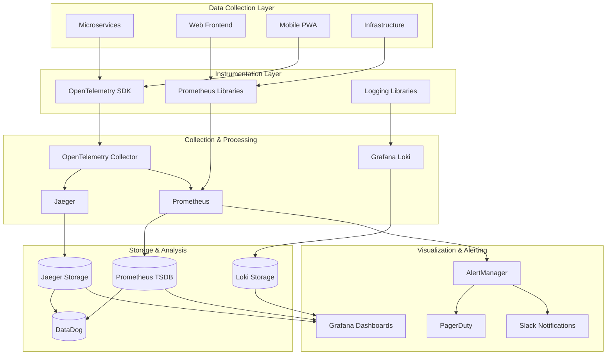
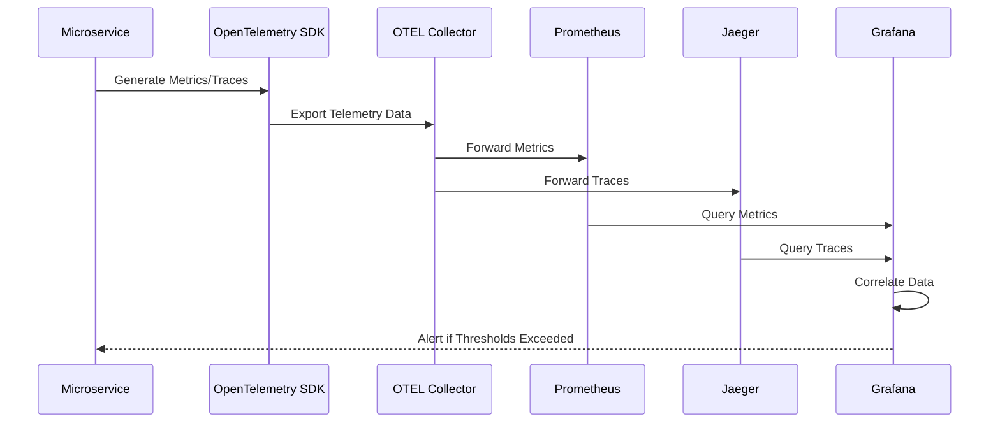
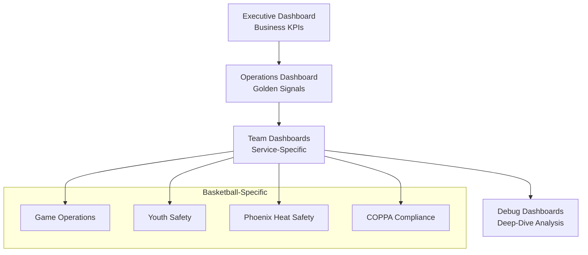

# Phase 3: Comprehensive Observability and Monitoring Strategy
## Basketball League Management Platform

**Document ID:** OBS-STRATEGY-001  
**Version:** 1.0  
**Date:** August 8, 2025  
**Author:** Data Analyst Agent  
**Status:** Phase 3 Observability Implementation  

---

## Executive Summary

This document defines the comprehensive observability and monitoring strategy for the Basketball League Management Platform Phase 3, implementing the three pillars of observability (metrics, traces, and logs) with basketball-specific KPIs, youth safety monitoring, and COPPA compliance tracking.

### Key Observability Principles
- **Golden Signals**: Latency, Traffic, Errors, Saturation monitoring
- **Business KPIs**: Basketball-specific metrics for stakeholder visibility
- **Youth Safety**: Specialized monitoring for COPPA compliance and SafeSport requirements
- **Real-time Performance**: Sub-100ms latency tracking for live game features
- **Multi-tenant Isolation**: Performance monitoring across league boundaries
- **Phoenix-Specific**: Heat safety and weather monitoring for Arizona operations

---

## Table of Contents

1. [Observability Architecture](#1-observability-architecture)
2. [Metrics Taxonomy](#2-metrics-taxonomy)
3. [Service Level Indicators (SLIs) and Objectives (SLOs)](#3-service-level-indicators-slis-and-objectives-slos)
4. [Alert Rules and Incident Response](#4-alert-rules-and-incident-response)
5. [Dashboard Strategy](#5-dashboard-strategy)
6. [Basketball-Specific Monitoring](#6-basketball-specific-monitoring)
7. [Youth Safety and COPPA Compliance](#7-youth-safety-and-coppa-compliance)
8. [Implementation Guide](#8-implementation-guide)
9. [Operational Procedures](#9-operational-procedures)
10. [Performance Benchmarks](#10-performance-benchmarks)

---

## 1. Observability Architecture

### 1.1 Three Pillars Implementation



### 1.2 Technology Stack

| Component | Technology | Purpose | Configuration |
|-----------|------------|---------|---------------|
| **Metrics Collection** | Prometheus + OpenTelemetry | Time-series metrics storage | 15s scrape interval |
| **Tracing** | Jaeger + OpenTelemetry | Distributed request tracing | 100% sampling for critical paths |
| **Logging** | Grafana Loki + Winston | Centralized log aggregation | Structured JSON logs |
| **Dashboards** | Grafana | Metrics visualization | Basketball-specific dashboards |
| **Alerting** | AlertManager + PagerDuty | Incident management | Multi-tier escalation |
| **Long-term Storage** | DataDog | Historical analysis | 90-day retention |

### 1.3 Data Flow Architecture



---

## 2. Metrics Taxonomy

### 2.1 Golden Signals Metrics

#### Latency Metrics
```yaml
basketball:live_scoring_latency:
  description: "Latency of live scoring updates"
  type: histogram
  buckets: [0.005, 0.01, 0.025, 0.05, 0.1, 0.25, 0.5, 1.0]
  target: "<100ms p99"
  labels: [game_id, event_type]

platform:request_latency:
  description: "HTTP request response time"
  type: histogram
  buckets: [0.005, 0.01, 0.025, 0.05, 0.1, 0.25, 0.5, 1.0, 2.5, 5.0]
  target: "<1s p95"
  labels: [service, method, endpoint]
```

#### Traffic Metrics
```yaml
platform:request_rate:
  description: "HTTP requests per second"
  type: counter
  labels: [service, method, status]
  
basketball:concurrent_users:
  description: "Concurrent active users"
  type: gauge
  labels: [user_type, league]
  
basketball:active_games:
  description: "Currently active games"
  type: gauge
  labels: [league, tournament]
```

#### Error Metrics
```yaml
platform:error_rate:
  description: "HTTP error rate (5xx responses)"
  type: counter
  calculation: "rate(http_requests_total{status=~'5..'}[5m]) / rate(http_requests_total[5m])"
  target: "<1%"
  labels: [service, endpoint]

basketball:payment_failures:
  description: "Failed payment transactions"
  type: counter
  labels: [failure_reason, payment_type]
```

#### Saturation Metrics
```yaml
system:cpu_utilization:
  description: "CPU usage percentage"
  type: gauge
  target: "<80%"
  labels: [instance, service]

system:memory_utilization:
  description: "Memory usage percentage"
  type: gauge
  target: "<85%"
  labels: [instance, service]

database:connection_pool_utilization:
  description: "Database connection pool usage"
  type: gauge
  target: "<90%"
  labels: [database, service]
```

### 2.2 Basketball-Specific Business Metrics

#### Game Performance Metrics
```yaml
basketball:games_completion_rate:
  description: "Percentage of games completed successfully"
  type: counter
  calculation: "games_completed / total_games_scheduled"
  target: ">95%"
  labels: [league, tournament, age_group]

basketball:tournament_participation:
  description: "Active tournament participants"
  type: gauge
  labels: [tournament_id, age_group]

basketball:game_day_traffic_spike:
  description: "Traffic increase during game days"
  type: gauge
  calculation: "current_requests / baseline_requests"
  labels: [time_period, league]
```

#### User Engagement Metrics
```yaml
basketball:user_registration_funnel:
  description: "Registration conversion rates by step"
  type: counter
  calculation: "step_completions / step_starts"
  target: ">80% overall conversion"
  labels: [step, league, user_type]

basketball:mobile_app_usage:
  description: "Mobile app session metrics"
  type: counter
  labels: [feature, user_type, league]
```

#### Financial Metrics
```yaml
basketball:payment_success_rate:
  description: "Payment transaction success rate"
  type: counter
  calculation: "successful_payments / total_payment_attempts"
  target: ">98%"
  labels: [payment_type, league]

basketball:revenue_per_league:
  description: "Revenue generated per league"
  type: counter
  labels: [league, payment_type, time_period]
```

### 2.3 Safety and Compliance Metrics

#### COPPA Compliance Metrics
```yaml
coppa:data_access_events:
  description: "COPPA-regulated data access events"
  type: counter
  labels: [data_type, access_type, user_type]

coppa:parental_consent_rate:
  description: "Parental consent completion rate"
  type: counter
  calculation: "consents_obtained / consents_requested"
  target: ">95%"
  labels: [league, consent_method]
```

#### Youth Safety Metrics
```yaml
safety:incident_rate:
  description: "Safety incidents per 1000 participants"
  type: counter
  calculation: "incidents / participants * 1000"
  target: "<5 per 1000"
  labels: [incident_type, severity, league]

safety:background_check_compliance:
  description: "Background check completion rate"
  type: counter
  calculation: "checks_completed / checks_required"
  target: "100%"
  labels: [role, league]
```

#### Weather Safety Metrics (Phoenix-Specific)
```yaml
weather:heat_index:
  description: "Current heat index in Fahrenheit"
  type: gauge
  labels: [location, venue]

weather:heat_alerts:
  description: "Heat safety alerts issued"
  type: counter
  labels: [severity, location, action_taken]

basketball:heat_related_cancellations:
  description: "Games cancelled due to heat"
  type: counter
  labels: [location, league, temperature_range]
```

---

## 3. Service Level Indicators (SLIs) and Objectives (SLOs)

### 3.1 System-Level SLOs

| Service Category | SLI | SLO Target | Measurement Window | Error Budget |
|------------------|-----|------------|-------------------|--------------|
| **API Gateway** | Request Success Rate | 99.9% | 30 days | 0.1% |
| **API Gateway** | Response Latency P95 | <500ms | 30 days | 5% > 500ms |
| **Database** | Query Latency P99 | <100ms | 30 days | 1% > 100ms |
| **Authentication** | Auth Success Rate | 99.95% | 30 days | 0.05% |

### 3.2 Basketball-Specific SLOs

| Service | SLI | SLO Target | Business Impact |
|---------|-----|------------|-----------------|
| **Live Scoring** | Update Latency P99 | <100ms | Critical - Real-time experience |
| **Game Service** | Game Creation Success | 99.9% | High - Tournament operations |
| **Payment Service** | Transaction Success | 99.5% | Critical - Revenue impact |
| **User Registration** | Funnel Completion | >80% | Medium - Growth impact |
| **Mobile App** | First Load Time P95 | <3s | High - User experience |

### 3.3 Youth Safety SLOs

| Safety Category | SLI | SLO Target | Compliance Requirement |
|----------------|-----|------------|----------------------|
| **COPPA Compliance** | Data Access Audit | 100% logged | Legal requirement |
| **Background Checks** | Completion Rate | 100% | SafeSport requirement |
| **Incident Response** | Response Time | <15 minutes | Internal policy |
| **Heat Safety** | Alert Response | <5 minutes | Phoenix-specific |

### 3.4 Error Budget Policy

```yaml
error_budget_policy:
  calculation_window: "30 days rolling"
  
  budget_levels:
    healthy: ">50% budget remaining"
    warning: "25-50% budget remaining"
    critical: "<25% budget remaining"
    
  actions:
    healthy:
      - Continue feature development
      - Normal deployment cadence
      
    warning:
      - Increase monitoring frequency
      - Review recent changes
      - Slow deployment cadence
      
    critical:
      - Halt feature development
      - Focus on reliability
      - Emergency response procedures
```

---

## 4. Alert Rules and Incident Response

### 4.1 Critical Alert Rules

#### System-Level Alerts
```yaml
# High Error Rate Alert
- alert: HighErrorRate
  expr: platform:error_rate > 0.05
  for: 5m
  labels:
    severity: critical
    team: platform
  annotations:
    summary: "High error rate detected in {{ $labels.service }}"
    description: "Error rate is {{ $value }}% for service {{ $labels.service }}"
    runbook: "https://runbook.basketball-platform.com/high-error-rate"

# High Latency Alert
- alert: HighLatency
  expr: platform:latency_p95 > 1.0
  for: 10m
  labels:
    severity: warning
    team: platform
  annotations:
    summary: "High latency detected in {{ $labels.service }}"
    description: "P95 latency is {{ $value }}s for service {{ $labels.service }}"
```

#### Basketball-Specific Alerts
```yaml
# Live Scoring Latency Alert
- alert: LiveScoringLatency
  expr: basketball:live_scoring_latency > 0.1
  for: 2m
  labels:
    severity: critical
    team: game-ops
    basketball_alert: true
  annotations:
    summary: "Live scoring latency exceeded target for game {{ $labels.game_id }}"
    description: "Scoring latency is {{ $value }}ms (target: <100ms)"
    impact: "Real-time game experience degraded"
    
# Payment Failure Spike Alert
- alert: PaymentFailureSpike
  expr: rate(basketball_payments_total{status="failed"}[5m]) > 0.02
  for: 3m
  labels:
    severity: critical
    team: payments
    basketball_alert: true
  annotations:
    summary: "Payment failure rate spike detected"
    description: "Payment failures increased to {{ $value }}/min"
    impact: "Revenue impact - registration and fees affected"

# Game Day Traffic Alert
- alert: GameDayTrafficSpike
  expr: basketball:game_day_traffic_spike > 5.0
  for: 1m
  labels:
    severity: warning
    team: platform
  annotations:
    summary: "Unusual traffic spike during game day"
    description: "Traffic is {{ $value }}x normal levels"
```

#### Youth Safety Alerts
```yaml
# COPPA Data Access Anomaly
- alert: COPPADataAccessAnomaly
  expr: rate(coppa_data_access_total[1h]) > 100
  for: 5m
  labels:
    severity: critical
    team: compliance
    coppa_alert: true
  annotations:
    summary: "Unusual COPPA data access pattern detected"
    description: "COPPA data access rate: {{ $value }}/hour (normal: <50/hour)"
    action_required: "Immediate compliance team notification"

# Safety Incident Alert
- alert: SafetyIncident
  expr: safety_incidents_total > 0
  for: 0m
  labels:
    severity: critical
    team: safety
    immediate_response: true
  annotations:
    summary: "Safety incident reported"
    description: "{{ $labels.incident_type }} incident in {{ $labels.league }}"
    action_required: "Immediate safety team and league admin notification"

# Heat Safety Alert
- alert: ExtremeHeatWarning
  expr: weather_heat_index_fahrenheit > 130
  for: 1m
  labels:
    severity: critical
    team: operations
    phoenix_specific: true
  annotations:
    summary: "Extreme heat warning for {{ $labels.location }}"
    description: "Heat index: {{ $value }}°F (danger level: >130°F)"
    action_required: "Consider game cancellations/postponements"
```

### 4.2 Incident Response Procedures

#### Tier 1: Platform Issues (Response: <5 minutes)
1. **Auto-scaling activation** for traffic spikes
2. **Circuit breaker** engagement for failing services
3. **Notification routing** to on-call engineers
4. **Status page updates** for user communication

#### Tier 2: Business Critical (Response: <15 minutes)
1. **Payment system failures** - Payment team + Finance team
2. **Live scoring issues** - Game operations + Platform team
3. **Authentication failures** - Security team + Platform team
4. **Mobile app crashes** - Mobile team + Platform team

#### Tier 3: Youth Safety Critical (Response: <5 minutes)
1. **Safety incidents** - Safety coordinator + League administrators + Legal
2. **COPPA violations** - Compliance officer + Legal + Platform team
3. **Background check failures** - HR + Safety coordinator + League admin
4. **Heat safety** - Operations + League administrators + Venue managers

### 4.3 Escalation Matrix

```yaml
escalation_matrix:
  platform_issues:
    level_1: [on_call_engineer]
    level_2: [platform_team_lead, ops_manager]
    level_3: [cto, head_of_engineering]
    
  business_critical:
    level_1: [business_owner, on_call_engineer]
    level_2: [product_manager, engineering_manager]
    level_3: [vp_product, vp_engineering]
    
  youth_safety:
    level_1: [safety_coordinator, compliance_officer]
    level_2: [legal_counsel, operations_director]
    level_3: [ceo, general_counsel]
    immediate_external: [relevant_authorities]
```

---

## 5. Dashboard Strategy

### 5.1 Dashboard Hierarchy



### 5.2 Dashboard Specifications

#### Executive Dashboard (Basketball Business KPIs)
**Audience:** C-level, Product Management, League Administrators  
**Update Frequency:** Real-time (30s refresh)  
**Key Metrics:**
- Game completion rates by league
- Revenue and payment success rates
- User registration funnel performance
- Tournament participation trends
- Safety incident summary
- System availability overview

#### Operations Dashboard (Golden Signals)
**Audience:** Platform Engineers, DevOps, On-call  
**Update Frequency:** Real-time (10s refresh)  
**Key Metrics:**
- Request rate and error rate by service
- Response time percentiles (P50, P95, P99)
- System resource utilization
- Database performance
- Alert status and incident timeline

#### Game Operations Dashboard
**Audience:** Game Operations Team, Scorekeepers  
**Update Frequency:** Real-time (5s refresh during games)  
**Key Metrics:**
- Live scoring latency per active game
- WebSocket connection health
- Game event processing rates
- Real-time user activity
- Mobile app performance during games

#### Youth Safety Dashboard
**Audience:** Safety Coordinators, Compliance Officers  
**Update Frequency:** Real-time (15s refresh)  
**Key Metrics:**
- COPPA data access events
- Safety incident tracking
- Background check status
- Parental consent rates
- Communication monitoring alerts

#### Phoenix Heat Safety Dashboard
**Audience:** Operations Team, Venue Managers  
**Update Frequency:** Real-time (1min refresh)  
**Key Metrics:**
- Current heat index by location
- Heat alerts and warnings
- Game cancellations due to heat
- Venue-specific temperature monitoring
- Emergency response activation

### 5.3 Dashboard Access Control

```yaml
dashboard_access:
  executive_dashboard:
    viewers: [ceo, cto, vp_product, vp_engineering, league_admins]
    editors: [product_managers, data_analysts]
    
  operations_dashboard:
    viewers: [engineering_team, operations_team, on_call_engineers]
    editors: [devops_team, platform_team]
    
  safety_dashboard:
    viewers: [safety_coordinators, compliance_officers, legal_team]
    editors: [safety_manager, compliance_manager]
    restricted: true  # Additional authentication required
```

---

## 6. Basketball-Specific Monitoring

### 6.1 Game Day Monitoring

#### Pre-Game Phase (2 hours before)
- **System capacity checks** - Scale up infrastructure
- **Payment system validation** - Last-minute registration payments
- **Mobile app performance** - Increased user activity
- **Weather monitoring** - Heat safety assessments for Phoenix

#### Live Game Phase
- **Sub-100ms scoring latency** - Critical for real-time updates
- **WebSocket connection stability** - Live updates to spectators
- **Concurrent user limits** - Peak usage during popular games
- **Database transaction rates** - High-frequency scoring updates

#### Post-Game Phase (1 hour after)
- **Statistics processing** - Batch analytics jobs
- **Photo/video uploads** - Media content processing
- **Social sharing** - External API rate limits
- **System scale-down** - Cost optimization

### 6.2 Tournament Monitoring

```yaml
tournament_monitoring:
  bracket_updates:
    metric: basketball:bracket_update_latency
    target: "<5 seconds"
    description: "Time to propagate tournament bracket changes"
    
  participant_load:
    metric: basketball:tournament_concurrent_participants
    target: "Support 1000+ concurrent participants"
    scaling_trigger: "80% of capacity"
    
  elimination_processing:
    metric: basketball:elimination_processing_time
    target: "<30 seconds"
    description: "Time to process team eliminations and advance winners"
```

### 6.3 Multi-Tenant Performance Monitoring

```yaml
tenant_isolation:
  per_league_metrics:
    - basketball:request_rate{league="phoenix_youth"}
    - basketball:error_rate{league="scottsdale_rec"}
    - basketball:latency_p95{league="mesa_competitive"}
    
  resource_isolation:
    database_connections:
      metric: database:connections_per_tenant
      alert_threshold: ">80% of allocated connections"
      
    cpu_usage:
      metric: kubernetes:cpu_usage_per_namespace
      alert_threshold: ">70% of allocated CPU"
      
    memory_usage:
      metric: kubernetes:memory_usage_per_namespace
      alert_threshold: ">80% of allocated memory"
```

---

## 7. Youth Safety and COPPA Compliance

### 7.1 COPPA Monitoring Framework

#### Data Access Tracking
```yaml
coppa_monitoring:
  data_access_events:
    metrics:
      - coppa:data_access_total{data_type="personal_info"}
      - coppa:data_access_total{data_type="photos"}
      - coppa:data_access_total{data_type="messages"}
      - coppa:data_access_total{data_type="location"}
      
    alerts:
      unusual_access_pattern:
        condition: "rate(coppa_data_access_total[1h]) > 100"
        severity: critical
        response_time: "<5 minutes"
        
      unauthorized_access:
        condition: "coppa_data_access_total{access_type='unauthorized'} > 0"
        severity: critical
        response_time: "<1 minute"
```

#### Parental Consent Monitoring
```yaml
parental_consent:
  consent_requests:
    metric: coppa:consent_requests_total
    labels: [league, consent_method, user_age]
    
  consent_completions:
    metric: coppa:consent_completions_total
    labels: [league, consent_method, response_time_bucket]
    
  consent_rate:
    calculation: "consent_completions / consent_requests"
    target: ">95%"
    alert_threshold: "<90%"
```

### 7.2 SafeSport Compliance

```yaml
safesport_monitoring:
  background_checks:
    pending_checks:
      metric: safesport:background_checks_pending
      alert_threshold: ">10 checks pending >7 days"
      
    check_failures:
      metric: safesport:background_check_failures_total
      severity: critical
      immediate_notification: [safety_coordinator, legal_counsel]
      
    check_expiration_alerts:
      metric: safesport:background_checks_expiring_30days
      notification_recipients: [coaches, volunteers, hr_team]
```

### 7.3 Communication Monitoring

```yaml
communication_monitoring:
  message_filtering:
    inappropriate_content_detected:
      metric: safesport:inappropriate_messages_flagged_total
      immediate_review: true
      retention_period: "7 years"  # Legal requirement
      
    adult_youth_communications:
      metric: safesport:adult_youth_messages_total
      monitoring_required: true
      parental_visibility: true
      
  escalation_triggers:
    severity_high_incident:
      conditions:
        - "Inappropriate behavior reported"
        - "Safety concern flagged"
        - "Background check failure"
      immediate_actions:
        - Suspend user account
        - Notify safety coordinator
        - Alert legal team
        - Document incident
```

---

## 8. Implementation Guide

### 8.1 Phase 1: Foundation (Week 1-2)

#### Infrastructure Setup
```bash
# 1. Deploy Prometheus with basketball-specific configuration
kubectl apply -f infrastructure/monitoring/prometheus-config.yml

# 2. Deploy Grafana with pre-configured dashboards
kubectl apply -f infrastructure/monitoring/grafana-config.yml
kubectl apply -f infrastructure/monitoring/grafana-dashboards/

# 3. Deploy OpenTelemetry Collector
kubectl apply -f infrastructure/monitoring/otel-collector-config.yml

# 4. Deploy Jaeger for distributed tracing
kubectl apply -f infrastructure/monitoring/jaeger-config.yml
```

#### Service Instrumentation
```typescript
// Example: Instrumenting the Game Service
import { createBasketballTelemetry } from '@basketball-platform/utils/telemetry';

const telemetry = createBasketballTelemetry('game-service', {
  environment: process.env.NODE_ENV,
  region: 'phoenix-az',
  tenantId: process.env.TENANT_ID,
});

// Record game events
app.post('/games/:id/score', (req, res) => {
  const startTime = Date.now();
  
  telemetry.recordGameEvent('scoring_event', {
    gameId: req.params.id,
    leagueId: req.body.leagueId,
    homeTeam: req.body.homeTeam,
    awayTeam: req.body.awayTeam,
    scoringType: req.body.type,
    processingLatency: Date.now() - startTime,
  });
  
  res.json({ success: true });
});
```

### 8.2 Phase 2: Basketball-Specific Metrics (Week 3-4)

#### Game Operations Instrumentation
```typescript
// Live scoring latency tracking
export class LiveScoringService {
  private telemetry: BasketballTelemetry;
  
  async updateScore(gameId: string, scoreUpdate: ScoreUpdate) {
    const span = this.telemetry.createSpan('live_scoring.update');
    const startTime = performance.now();
    
    try {
      await this.processScoreUpdate(gameId, scoreUpdate);
      
      const latency = performance.now() - startTime;
      this.telemetry.recordGameEvent('scoring_event', {
        gameId,
        processingLatency: latency,
        scoringType: scoreUpdate.type,
        leagueId: scoreUpdate.leagueId,
        homeTeam: scoreUpdate.homeTeam,
        awayTeam: scoreUpdate.awayTeam,
      });
      
      span.setStatus({ code: SpanStatusCode.OK });
    } catch (error) {
      span.recordException(error);
      span.setStatus({ code: SpanStatusCode.ERROR });
      throw error;
    } finally {
      span.end();
    }
  }
}
```

#### Payment System Instrumentation
```typescript
// Payment success rate monitoring
export class PaymentService {
  async processPayment(paymentData: PaymentData) {
    const span = this.telemetry.createSpan('payment.process');
    
    try {
      const result = await this.chargePayment(paymentData);
      
      this.telemetry.recordPaymentTransaction(
        result.status === 'succeeded' ? 'success' : 'failed',
        {
          paymentType: paymentData.type,
          amount: paymentData.amount,
          currency: paymentData.currency,
          leagueId: paymentData.leagueId,
          userType: paymentData.userType,
        }
      );
      
      return result;
    } catch (error) {
      this.telemetry.recordPaymentTransaction('failed', paymentData);
      throw error;
    } finally {
      span.end();
    }
  }
}
```

### 8.3 Phase 3: Safety and Compliance (Week 5-6)

#### COPPA Compliance Monitoring
```typescript
// COPPA data access auditing
export class UserDataService {
  async accessUserData(userId: string, dataType: string, accessType: string, requesterType: string) {
    const user = await this.getUserById(userId);
    
    // Check if COPPA monitoring is required
    if (user.age < 13) {
      this.telemetry.recordCoppaEvent('data_access', {
        dataType,
        userType: requesterType,
        accessType,
        parentalConsent: user.parentalConsentStatus,
      });
    }
    
    // Proceed with data access
    return this.performDataAccess(userId, dataType, accessType);
  }
}
```

#### Safety Incident Tracking
```typescript
// Safety incident reporting
export class SafetyService {
  async reportIncident(incident: SafetyIncident) {
    // Immediate telemetry recording
    this.telemetry.recordSafetyIncident(incident.type, {
      severity: incident.severity,
      leagueId: incident.leagueId,
      location: incident.location,
      description: incident.description,
    });
    
    // Trigger immediate notifications
    if (incident.severity === 'critical' || incident.severity === 'high') {
      await this.notificationService.sendEmergencyAlert(incident);
    }
    
    // Store incident in database
    return this.storeIncident(incident);
  }
}
```

### 8.4 Phase 4: Phoenix-Specific Features (Week 7-8)

#### Weather Monitoring Integration
```typescript
// Heat safety monitoring
export class WeatherService {
  async checkHeatConditions(location: string) {
    const weather = await this.weatherAPI.getCurrentConditions(location);
    const heatIndex = this.calculateHeatIndex(weather.temperature, weather.humidity);
    
    // Record heat index metric
    this.telemetry.recordWeatherAlert('heat_advisory', {
      severity: this.getHeatSeverity(heatIndex),
      location,
      temperature: weather.temperature,
      heatIndex,
      venue: weather.venue,
    });
    
    // Check for game cancellation thresholds
    if (heatIndex > 130) {
      await this.gameService.evaluateGameCancellations(location, heatIndex);
    }
    
    return { heatIndex, severity: this.getHeatSeverity(heatIndex) };
  }
}
```

---

## 9. Operational Procedures

### 9.1 Daily Operations Checklist

#### Morning Checklist (9:00 AM)
- [ ] Review overnight alerts and incidents
- [ ] Check system health dashboards
- [ ] Verify backup processes completed
- [ ] Review payment processing overnight
- [ ] Check COPPA compliance alerts
- [ ] Verify weather data updates for Phoenix area

#### Game Day Checklist (2 hours before games)
- [ ] Scale up infrastructure based on scheduled games
- [ ] Validate live scoring system performance
- [ ] Check mobile app performance metrics
- [ ] Verify WebSocket connection capacity
- [ ] Review heat safety conditions for outdoor games
- [ ] Confirm emergency contact availability

#### Post-Game Checklist (1 hour after games)
- [ ] Review game performance metrics
- [ ] Validate statistics processing completion
- [ ] Check for any safety incidents
- [ ] Scale down infrastructure if appropriate
- [ ] Review error rates during game periods
- [ ] Update stakeholders on any issues

### 9.2 Weekly Operations Review

#### Metrics Review Meeting (Every Monday)
**Attendees:** Platform Team, Game Operations, Safety Coordinator

**Agenda:**
1. **Previous Week Performance Review**
   - SLO compliance review
   - Error budget consumption
   - Incident post-mortems
   
2. **Basketball-Specific KPIs**
   - Game completion rates
   - Payment success rates
   - User registration funnel performance
   - Tournament participation trends
   
3. **Safety and Compliance Review**
   - COPPA compliance metrics
   - Safety incident summary
   - Background check status
   - Heat safety incidents
   
4. **Upcoming Week Planning**
   - Scheduled tournaments and capacity planning
   - Weather forecasts and heat safety preparations
   - System maintenance windows
   - Feature deployments

### 9.3 Monthly Health Assessment

#### System Health Report (First Monday of Each Month)
**Report Recipients:** Executive Team, Engineering Leadership

**Contents:**
1. **SLO Compliance Summary**
   - Service availability percentages
   - Error budget consumption
   - Performance trend analysis
   
2. **Business Impact Analysis**
   - Revenue impact of system issues
   - User experience metrics
   - Game operations efficiency
   
3. **Youth Safety Metrics**
   - COPPA compliance scores
   - Safety incident trends
   - Background check completion rates
   
4. **Capacity Planning**
   - Resource utilization trends
   - Growth projections
   - Infrastructure scaling needs

---

## 10. Performance Benchmarks

### 10.1 Baseline Performance Targets

#### System Performance Benchmarks
```yaml
baseline_targets:
  api_response_times:
    user_service:
      p50: "<100ms"
      p95: "<500ms"
      p99: "<1s"
      
    game_service:
      p50: "<50ms"   # Critical for real-time updates
      p95: "<200ms"
      p99: "<500ms"
      
    payment_service:
      p50: "<200ms"
      p95: "<1s"
      p99: "<3s"
      
  database_performance:
    query_latency:
      p50: "<10ms"
      p95: "<50ms"
      p99: "<100ms"
      
    connection_pool:
      utilization: "<80%"
      wait_time: "<10ms"
      
  system_resources:
    cpu_utilization: "<70%"
    memory_utilization: "<80%"
    disk_io_wait: "<5%"
```

#### Basketball-Specific Benchmarks
```yaml
basketball_targets:
  live_scoring:
    update_latency:
      p50: "<20ms"
      p95: "<50ms"
      p99: "<100ms"   # Critical threshold
      
    websocket_performance:
      connection_establishment: "<500ms"
      message_delivery: "<50ms"
      concurrent_connections: "10,000+"
      
  game_day_performance:
    traffic_spike_handling: "10x normal capacity"
    auto_scaling_response: "<2 minutes"
    mobile_app_response: "<3s initial load"
    
  payment_processing:
    success_rate: ">99%"
    authorization_time: "<2s"
    settlement_confirmation: "<24hrs"
```

#### Youth Safety Benchmarks
```yaml
safety_targets:
  coppa_compliance:
    data_access_logging: "100%"
    audit_trail_completeness: "100%"
    parental_consent_tracking: "100%"
    
  incident_response:
    detection_time: "<1 minute"
    notification_time: "<5 minutes"
    escalation_time: "<15 minutes"
    
  background_checks:
    processing_time: "<7 days"
    completion_rate: "100%"
    renewal_reminder: "30 days advance"
```

### 10.2 Load Testing Scenarios

#### Game Day Load Test
```yaml
game_day_scenario:
  duration: "4 hours"
  ramp_up: "30 minutes"
  
  user_simulation:
    concurrent_users: 5000
    user_distribution:
      parents: 40%
      players: 30%
      coaches: 20%
      spectators: 10%
      
  traffic_patterns:
    baseline: "100 req/sec"
    game_start_spike: "1000 req/sec (10 minutes)"
    halftime_spike: "800 req/sec (5 minutes)"
    game_end_spike: "1200 req/sec (15 minutes)"
    
  operations_tested:
    - Live score updates
    - Real-time notifications
    - Photo uploads
    - Statistics viewing
    - Payment processing
```

#### Tournament Load Test
```yaml
tournament_scenario:
  duration: "8 hours"
  concurrent_games: 50
  
  operations_tested:
    - Bracket updates
    - Elimination processing
    - Statistics aggregation
    - Photo/video processing
    - Social media integration
    
  success_criteria:
    - All bracket updates complete within 5 seconds
    - No data consistency issues
    - Payment processing maintained at >99% success
    - Mobile app performance maintained
```

### 10.3 Disaster Recovery Benchmarks

#### Recovery Time Objectives (RTO)
```yaml
rto_targets:
  database_failure:
    detection: "< 1 minute"
    failover: "< 5 minutes"
    full_recovery: "< 30 minutes"
    
  application_service_failure:
    detection: "< 30 seconds"
    restart: "< 2 minutes"
    full_recovery: "< 10 minutes"
    
  complete_region_failure:
    detection: "< 5 minutes"
    failover: "< 1 hour"
    full_recovery: "< 4 hours"
```

#### Recovery Point Objectives (RPO)
```yaml
rpo_targets:
  game_data: "< 1 minute"  # Critical - no scoring data loss
  user_data: "< 5 minutes"
  payment_data: "< 30 seconds"  # Critical - financial data
  media_content: "< 1 hour"
  analytics_data: "< 24 hours"
```

---

## Conclusion

This comprehensive observability strategy provides the Basketball League Management Platform with enterprise-grade monitoring capabilities tailored to the unique requirements of youth sports management. The implementation prioritizes real-time game performance, youth safety compliance, and Phoenix-specific environmental monitoring while maintaining system reliability and user experience.

### Key Success Metrics
- **Sub-100ms live scoring latency** for real-time game experience
- **99.9% system availability** for critical business operations
- **100% COPPA compliance** event logging for legal requirements
- **<5 minute response time** for youth safety incidents
- **Real-time heat safety monitoring** for Phoenix area operations

### Next Steps
1. **Week 1-2:** Deploy core monitoring infrastructure
2. **Week 3-4:** Implement basketball-specific metrics
3. **Week 5-6:** Add safety and compliance monitoring
4. **Week 7-8:** Deploy Phoenix-specific features
5. **Week 9:** Load testing and performance validation
6. **Week 10:** Team training and operational procedures rollout

This observability strategy ensures that the Basketball League Management Platform can operate safely, reliably, and efficiently while providing exceptional user experiences for youth sports communities in Phoenix and beyond.

---

**Document Status:** ✅ **COMPLETE**  
**Review Required:** Phase 3 Development Team, Safety Coordinators, Compliance Officers  
**Implementation Timeline:** 10 weeks from Phase 3 start  
**Maintenance Schedule:** Monthly strategy review, quarterly performance assessment