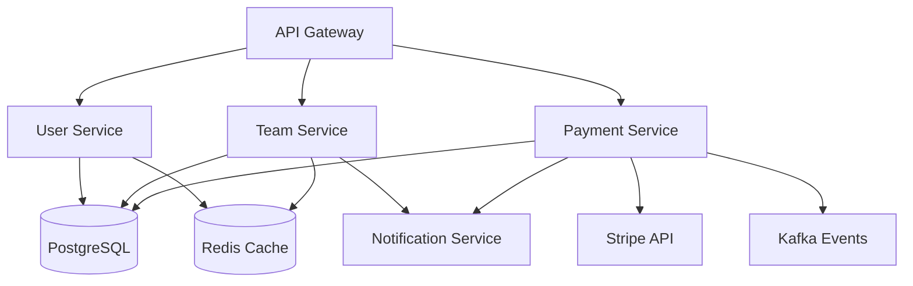

# Sprint 2: Complete User Management, Teams & Payments 🏀

## Executive Summary

**Sprint**: 2 of 12  
**Duration**: 10 days  
**Start**: Current  
**Demo**: Day 10  
**Velocity Target**: 85 points  
**Feature Flags**: `team_flow_v1`, `payments_v1`

Building on Sprint 1's authentication foundation, Sprint 2 delivers complete user management, team formation workflows, and Stripe payment integration - all with COPPA/SafeSport compliance.

## 🎯 Sprint 2 Objectives

### Primary Deliverables

1. **Complete User Management** (25 points)
   - Adult/child profiles with COPPA segregation
   - RBAC roles (Admin, Coach, Parent, Player, Referee, Scorekeeper)
   - Organization/league membership
   - Parental consent administration

2. **Team Formation & Rosters** (30 points)
   - Team creation and editing
   - Invite system with join codes/QR
   - Roster rules enforcement (age limits, size)
   - Coach assignment and permissions

3. **Payments Foundation** (30 points)
   - Stripe checkout for registration/dues
   - Receipt generation and email
   - Refund processing
   - Signed webhooks with idempotency
   - Payment ledger and reconciliation

## 🚩 Feature Flags

```typescript
// Feature flags for progressive rollout
const featureFlags = {
  team_flow_v1: {
    enabled: true,
    description: "Team creation and roster management",
    rollout: 100, // % of tenants
    minAge: null  // Available to all ages with consent
  },
  payments_v1: {
    enabled: true,
    description: "Stripe payment processing",
    rollout: 50,  // Start with 50% rollout
    minAge: 18,   // Adults only can pay
    parentProxy: true // Parents pay for minors
  }
}
```

## 📋 Definition of Ready (DOR)

- [ ] User stories have acceptance criteria in Gherkin
- [ ] API contracts defined in OpenAPI 3.0
- [ ] Database migrations prepared
- [ ] UI mockups linked from Phase 2
- [ ] Dependencies identified (auth service from Sprint 1)
- [ ] Test scenarios documented
- [ ] Phase 2 ADR/ERD references included

## ✅ Definition of Done (DOD)

- [ ] Code implemented with TypeScript
- [ ] Unit tests ≥80% coverage
- [ ] API tests passing
- [ ] E2E tests for critical paths
- [ ] WCAG 2.1 AA accessibility validated
- [ ] Performance targets met (see Quality Gates)
- [ ] Security scans clean
- [ ] Documentation updated
- [ ] Deployed to preview behind flags
- [ ] Monitoring configured
- [ ] Demo prepared

## 🏗️ Service Architecture

### New Services (Sprint 2)



### Service Responsibilities

**User Service** (`/services/user-service/`)
- Profile management (adult/child differentiated)
- RBAC role assignment
- Organization membership
- Consent tracking
- COPPA compliance

**Team Service** (`/services/team-service/`)
- Team CRUD operations
- Invite generation and validation
- Join flow (codes/QR)
- Roster management
- Coach assignment

**Payment Service** (`/services/payments-service/`)
- Stripe checkout session creation
- Webhook processing (signed, idempotent)
- Receipt generation
- Refund processing
- Ledger management
- Parent-proxy payments for minors

## 🔒 Security & Compliance

### COPPA/SafeSport Requirements
- Minors NEVER handle payments directly
- Parent proxy for all minor transactions
- Consent verification before team join
- Coach background check status validation
- Communication restrictions enforced

### Payment Security (PCI Scope Reduction)
- No card data stored (Stripe tokenization)
- Webhook signature verification
- Idempotency keys for all mutations
- Rate limiting on payment endpoints
- Audit trail for all transactions

### RBAC Implementation
```typescript
const permissions = {
  'league.admin': ['*'],
  'team.coach': ['team.edit', 'roster.manage', 'invite.send'],
  'parent': ['child.manage', 'payment.make', 'consent.grant'],
  'player.adult': ['profile.edit', 'team.join'],
  'player.minor': ['profile.view', 'team.join.withConsent'],
  'referee': ['game.officiate', 'availability.set'],
  'scorekeeper': ['score.record', 'stats.view']
}
```

## 🎨 User Experience Flows

### Team Formation Flow
```
1. Coach creates team
   → Sets age division (U10, U12, etc)
   → Defines roster limits
   → Generates invite code/QR

2. Parent receives invite
   → Views team details
   → Grants consent for child
   → Completes registration payment

3. Child joins team
   → Profile linked to roster
   → Jersey number assigned
   → Access to team schedule
```

### Payment Flow (Parent Proxy)
```
1. Parent initiates payment for child
   → Selects registration type
   → Reviews fees and policies
   → Redirected to Stripe Checkout

2. Stripe processes payment
   → Card tokenized (no PCI scope)
   → Payment confirmed
   → Webhook received

3. System processes webhook
   → Signature verified
   → Idempotency checked
   → Ledger updated
   → Receipt emailed
   → Child registration activated
```

## 📊 Quality Gates

### Performance Targets
| Metric | Target | Blocking |
|--------|--------|----------|
| API P95 | <100ms | Yes |
| Web Checkout P95 | <500ms | Yes |
| Roster Operations P95 | <250ms | Yes |
| Database Queries | <50ms | Yes |
| Redis Cache Hit Rate | >90% | No |

### Quality Requirements
- Code Coverage: ≥80% (blocking)
- WCAG 2.1 AA: Pass (blocking)
- Security Vulnerabilities: No High/Critical (blocking)
- Multi-tenant Isolation Tests: Pass (blocking)
- Payment Test Coverage: 100% (blocking)

## 🚀 Sprint Plan

### Days 1-2: Foundation
- [ ] Service scaffolding (3 services)
- [ ] Database migrations
- [ ] OpenAPI specifications
- [ ] Redis configuration

### Days 3-4: User Management
- [ ] Profile CRUD APIs
- [ ] RBAC implementation
- [ ] Organization membership
- [ ] Consent administration

### Days 5-6: Team Formation
- [ ] Team CRUD operations
- [ ] Invite system
- [ ] Join flows (code/QR)
- [ ] Roster management

### Days 7-8: Payments
- [ ] Stripe integration
- [ ] Checkout sessions
- [ ] Webhook processing
- [ ] Refund handling
- [ ] Ledger system

### Days 9: Integration & Testing
- [ ] E2E test suites
- [ ] Load testing
- [ ] Security validation
- [ ] Performance optimization

### Day 10: Demo & Retrospective
- [ ] Demo preparation
- [ ] Stakeholder presentation
- [ ] Sprint retrospective
- [ ] Sprint 3 planning

## 👥 Squad Assignments

### Squad 1: Backend Services
**Lead**: Backend Engineer Agent
- User Service implementation
- Team Service implementation
- Payment Service implementation
- API documentation

### Squad 2: Frontend
**Lead**: Frontend Engineer Agent
- Profile management UI
- Team creation/join flows
- Payment checkout integration
- Storybook components

### Squad 3: Mobile
**Lead**: Mobile Developer Agent
- Join team via QR/code
- Roster view (offline-capable)
- Payment status (read-only)
- Background sync

### Squad 4: Platform
**Lead**: DevOps Engineer Agent
- Redis cluster setup
- Load testing (k6)
- Monitoring dashboards
- Alert configuration

### Squad 5: Quality
**Lead**: QA Manager Agent
- Test automation
- E2E scenarios
- Contract testing
- Performance validation

## 📈 KPI Dashboards

### Business Metrics
- Invite → Join conversion rate
- Payment success rate
- Refund rate
- Time to roster completion
- Consent grant rate

### Technical Metrics
- API response times (P50, P95, P99)
- Webhook processing latency
- Cache hit rates
- Error rates by service
- Database connection pool usage

### Compliance Metrics
- COPPA consent completion
- Minor payment blocks
- Audit trail completeness
- RBAC violation attempts

## 🎭 Demo Scenarios (Day 10)

### Scenario 1: Complete Team Formation
1. League admin creates new season
2. Coach creates U12 team
3. Coach sends invites to parents
4. Parent receives invite, reviews, consents
5. Parent completes payment for child
6. Child appears on roster
7. Show real-time roster update

### Scenario 2: Payment & Refund
1. Parent initiates registration payment
2. Complete Stripe checkout (test mode)
3. Show webhook processing
4. Display receipt and ledger entry
5. Process refund
6. Show ledger reconciliation

### Scenario 3: Security & Compliance
1. Attempt minor direct payment (blocked)
2. Show RBAC in action
3. Display audit trail
4. Demonstrate multi-tenant isolation

## 🚨 Risks & Mitigations

### Risk 1: Payment Integration Complexity
**Mitigation**: Use Stripe's proven patterns, test mode first

### Risk 2: COPPA Compliance in Payments
**Mitigation**: Strict parent-proxy enforcement, legal review

### Risk 3: Roster Rule Complexity
**Mitigation**: Start simple, iterate based on feedback

### Risk 4: Performance at Scale
**Mitigation**: Redis caching, database indexing, load tests

## 🔄 ADR References

### Applicable Phase 2 ADRs
- ADR-001: Event-Driven Microservices
- ADR-003: Multi-Tenant Architecture
- ADR-006: API Gateway Pattern
- ADR-009: Security Architecture

### Potential ADR Amendments
- None identified yet

## 📋 Backlog Expansion

### User Management Epic (25 points)
- US-201: Adult profile management (5)
- US-202: Child profile with COPPA (8)
- US-203: RBAC implementation (5)
- US-204: Organization membership (3)
- US-205: Consent administration (4)

### Team Formation Epic (30 points)
- TS-301: Team CRUD operations (5)
- TS-302: Invite generation system (5)
- TS-303: Join via code/QR (8)
- TS-304: Roster management (8)
- TS-305: Coach assignment (4)

### Payments Epic (30 points)
- PS-401: Stripe integration (8)
- PS-402: Checkout sessions (5)
- PS-403: Webhook processing (8)
- PS-404: Refund system (5)
- PS-405: Payment ledger (4)

## ✅ Success Criteria

- All 3 services operational
- 85 story points delivered
- Feature flags controlling rollout
- Zero payment security issues
- 100% COPPA compliance maintained
- Demo showcases complete user journey

---

**Status**: ACTIVE  
**Confidence**: HIGH  
**Blockers**: None  
**Next Update**: Daily Standup @ 09:00

*Sprint 2 will deliver the complete user and team management foundation with secure payment processing, maintaining our commitment to youth safety and platform excellence.*