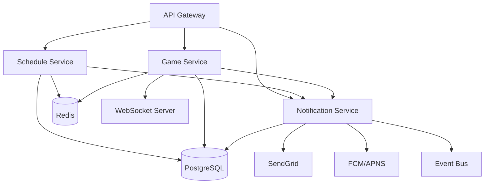

# Sprint 3: League Operations, Scheduling & Game Management 🏀

## Executive Summary

**Sprint**: 3 of 12  
**Duration**: 10 days  
**Start**: Current  
**Demo**: Day 10  
**Velocity Target**: 92 points  
**Feature Flags**: `scheduling_v1`, `games_v1`, `notifications_v1`

Sprint 3 delivers the core basketball league functionality: league operations, intelligent scheduling with conflict detection, complete game lifecycle management, and foundational notifications.

## 🎯 Sprint 3 Objectives

### Primary Deliverables

1. **League Operations** (Epic OPS-01, 22 points)
   - Seasons with start/end dates
   - Divisions (U10, U12, U14, etc.)
   - Venue management with capacity
   - Eligibility rules and roster locks
   - Standings tracking (W/L/Points)
   - Phoenix heat policy integration

2. **Scheduling Engine** (Epic SCH-01, 28 points)
   - Round-robin schedule generator
   - Conflict detection and resolution
   - Venue/team/official double-booking prevention
   - Calendar views (league/division/team)
   - ICS export functionality
   - Reschedule workflow with notifications

3. **Game Management** (Epic GM-01, 30 points)
   - Game lifecycle (Scheduled → Live → Final)
   - Official/scorekeeper assignments
   - Pre-game roster check-in
   - Live scoring with WebSocket updates
   - Period/quarter/clock management
   - Post-game finalization → standings update

4. **Notifications MVP** (Epic NT-01, 12 points)
   - Email/push notification templates
   - Schedule publication alerts
   - Game update notifications
   - Score/result notifications
   - Rate limiting and opt-in management

## 🚩 Feature Flags

```typescript
const featureFlags = {
  scheduling_v1: {
    enabled: true,
    description: "Schedule generation and management",
    rollout: 100,
    features: ['generator', 'conflict_detection', 'calendar_views']
  },
  games_v1: {
    enabled: true,
    description: "Game lifecycle and live management",
    rollout: 100,
    features: ['assignments', 'check_in', 'live_scoring', 'standings']
  },
  notifications_v1: {
    enabled: true,
    description: "Email and push notifications",
    rollout: 50,
    rate_limit: '100/hour/league'
  }
}
```

## 📋 Definition of Ready (DOR)

- [ ] ERDs defined for seasons/divisions/venues/games/standings
- [ ] API contracts in OpenAPI 3.0
- [ ] UI mockups from Phase 2 referenced
- [ ] Conflict detection rules documented
- [ ] Phoenix heat policy requirements clear
- [ ] Test scenarios for scheduling edge cases
- [ ] Phase 2 ADR references included

## ✅ Definition of Done (DOD)

- [ ] Code implemented with TypeScript
- [ ] Unit tests ≥80% coverage
- [ ] API tests passing
- [ ] E2E tests for critical paths
- [ ] Schedule queries P95 <150ms
- [ ] Game queries P95 <120ms
- [ ] WebSocket latency P95 <50ms
- [ ] WCAG 2.1 AA accessibility
- [ ] Security scans clean
- [ ] Timezone handling correct (America/Phoenix)
- [ ] Multi-tenant isolation verified
- [ ] Deployed behind feature flags
- [ ] Monitoring configured
- [ ] Demo prepared

## 🏗️ Service Architecture

### New Services (Sprint 3)



### Service Responsibilities

**Schedule Service** (`/services/schedule-service/`)
- Season/division/venue CRUD
- Round-robin schedule generation
- Conflict detection engine
- Calendar views and ICS export
- Reschedule workflow
- Blackout date management
- Heat policy enforcement

**Game Service** (`/services/game-service/`)
- Game lifecycle management
- Official/scorekeeper assignments
- Roster check-in and eligibility
- Live score updates (WebSocket)
- Period/quarter/clock tracking
- Game finalization
- Standings calculation

**Notification Service** (`/services/notification-service/`)
- Template management
- Email provider integration
- Push notification dispatch
- Rate limiting
- Opt-in preferences
- Delivery tracking
- Retry logic with DLQ

## 🔒 Security & Compliance

### RBAC Extensions
```typescript
const schedulePermissions = {
  'league.admin': ['schedule.*', 'season.*', 'division.*', 'venue.*'],
  'team.coach': ['schedule.view', 'game.checkin:own', 'reschedule.request'],
  'parent': ['schedule.view:child', 'game.view:child'],
  'player': ['schedule.view:own', 'game.view:own'],
  'referee': ['game.view:assigned', 'availability.set'],
  'scorekeeper': ['game.score:assigned', 'game.finalize:assigned']
}
```

### Audit Requirements
- All schedule changes logged with user/reason
- Game score modifications tracked
- Reschedule requests with approval chain
- Standing updates with calculation trace
- Notification delivery status

### Phoenix-Specific Requirements
- Heat index calculation for outdoor venues
- Automatic game warnings above 105°F
- Time-of-day restrictions (10am-6pm summer)
- Hydration break enforcement
- Emergency cancellation protocols

## 🎨 User Experience Flows

### Schedule Generation Flow
```
1. Admin creates season
   → Sets start/end dates
   → Configures divisions
   → Assigns venues

2. System generates schedule
   → Round-robin algorithm
   → Conflict detection
   → Heat policy applied
   → Draft preview shown

3. Admin reviews/adjusts
   → Drag-drop editor
   → Conflict warnings
   → Manual overrides

4. Schedule published
   → Teams notified
   → Calendars updated
   → ICS available
```

### Game Day Flow
```
1. Pre-game (2 hours before)
   → Reminder notifications
   → Weather check (Phoenix)
   → Roster check-in opens

2. Game time
   → Officials arrive
   → Final roster locked
   → Game status: LIVE
   → WebSocket active

3. During game
   → Score updates
   → Period transitions
   → Timeout tracking
   → Foul recording

4. Post-game
   → Final score confirmed
   → Game status: FINAL
   → Standings updated
   → Results notified
```

## 📊 Quality Gates

### Performance Targets
| Metric | Target | Blocking |
|--------|--------|----------|
| Schedule Query P95 | <150ms | Yes |
| Game Query P95 | <120ms | Yes |
| WebSocket Latency P95 | <50ms | Yes |
| Schedule Generation | <5s for 100 games | Yes |
| Conflict Detection | <500ms | Yes |
| ICS Export | <2s | No |
| Notification Dispatch | <1s | No |

### Quality Requirements
- Code Coverage: ≥80% (blocking)
- WCAG 2.1 AA: Pass (blocking)
- Security: No High/Critical (blocking)
- Multi-tenant Tests: Pass (blocking)
- Timezone Tests: Pass (blocking)
- Heat Policy Tests: Pass (required for Phoenix)

## 🚀 Sprint Plan

### Days 1-2: Data Model & Migrations
- [ ] ERDs for all entities
- [ ] Database migrations
- [ ] Seed data for testing
- [ ] Update ADRs if needed

### Days 3-4: Schedule Service
- [ ] Season/division/venue CRUD
- [ ] Round-robin generator
- [ ] Conflict detection
- [ ] Calendar endpoints

### Days 5-6: Game Service
- [ ] Game lifecycle
- [ ] Assignment system
- [ ] Live scoring WebSocket
- [ ] Standings calculation

### Days 7-8: Frontend & Mobile
- [ ] Calendar components
- [ ] Schedule editor
- [ ] Game management UI
- [ ] Mobile check-in flow

### Day 9: Integration & Testing
- [ ] E2E test suites
- [ ] Load testing
- [ ] Security validation
- [ ] Performance optimization

### Day 10: Demo & Retrospective
- [ ] Demo preparation
- [ ] Stakeholder presentation
- [ ] Sprint retrospective
- [ ] Sprint 4 planning

## 👥 Squad Assignments

### Squad 1: Backend Services
**Lead**: Backend Engineer Agent
- Schedule Service implementation
- Game Service with WebSocket
- Notification Service setup
- API documentation

### Squad 2: Frontend
**Lead**: Frontend Engineer Agent
- Calendar views (month/week/day)
- Schedule editor with drag-drop
- Game detail pages
- Assignment management UI

### Squad 3: Mobile
**Lead**: Mobile Developer Agent
- Team schedule view
- Pre-game check-in
- Basic scoring controls
- Push notification handling

### Squad 4: Platform
**Lead**: DevOps Engineer Agent
- Cron job configuration
- WebSocket infrastructure
- Load testing setup
- Monitoring expansion

### Squad 5: Quality
**Lead**: QA Manager Agent
- Scheduling test scenarios
- Game lifecycle E2E
- Conflict detection tests
- Performance validation

## 📈 KPI Dashboards

### Business Metrics
- Games scheduled per league
- Conflict resolution rate
- On-time game start %
- Reschedule request rate
- Notification delivery rate
- Calendar export usage

### Technical Metrics
- Schedule generation time
- Conflict detection latency
- WebSocket connection count
- Game query performance
- Notification queue depth
- Cache hit rates

### Operational Metrics
- Heat cancellations (Phoenix)
- Official assignment rate
- Roster check-in completion
- Score finalization time
- Standing calculation accuracy

## 🎭 Demo Scenarios (Day 10)

### Scenario 1: Season Setup to Schedule
1. Create season with 3 divisions
2. Add 5 venues with capacity
3. Generate round-robin schedule
4. Show conflict detection
5. Resolve conflicts manually
6. Publish schedule
7. View in calendar/export ICS

### Scenario 2: Game Day Operations
1. Pre-game notifications sent
2. Heat warning for outdoor game
3. Coach completes check-in
4. Game goes live
5. Real-time score updates
6. Period transitions
7. Game finalized
8. Standings auto-update

### Scenario 3: Reschedule Flow
1. Coach requests reschedule
2. System checks conflicts
3. Admin approves change
4. Notifications sent
5. Calendars updated
6. Audit trail shown

### Scenario 4: Monitoring Dashboard
1. Show schedule query latency
2. Display conflict metrics
3. WebSocket connections
4. Notification delivery rate
5. Heat policy triggers

## 🚨 Risks & Mitigations

### Risk 1: Schedule Generation Complexity
**Impact**: High - Core feature
**Mitigation**: Start with simple round-robin, iterate

### Risk 2: WebSocket Scalability
**Impact**: Medium - Live games
**Mitigation**: Redis pub/sub, connection pooling

### Risk 3: Timezone Handling
**Impact**: High - Schedule accuracy
**Mitigation**: Strict America/Phoenix, comprehensive tests

### Risk 4: Heat Policy Edge Cases
**Impact**: Medium - Phoenix-specific
**Mitigation**: Clear rules, manual override option

### Risk 5: Notification Delivery
**Impact**: Low - User communication
**Mitigation**: Retry logic, DLQ, delivery tracking

## 🔄 ADR Considerations

### Potential New ADRs
- ADR-011: Schedule Generation Algorithm
- ADR-012: WebSocket Architecture for Live Games
- ADR-013: Notification Delivery Strategy

### Existing ADR Updates
- ADR-001: Event-driven updates for game events
- ADR-007: Real-time architecture expansion

## 📋 Backlog Expansion

### League Operations (22 points)
- OPS-301: Season CRUD (3)
- OPS-302: Division management (3)
- OPS-303: Venue configuration (3)
- OPS-304: Eligibility rules (5)
- OPS-305: Standings calculation (5)
- OPS-306: Heat policy (3)

### Scheduling (28 points)
- SCH-401: Round-robin generator (8)
- SCH-402: Conflict detection (8)
- SCH-403: Calendar views (5)
- SCH-404: ICS export (3)
- SCH-405: Reschedule workflow (4)

### Game Management (30 points)
- GM-501: Game lifecycle (5)
- GM-502: Assignments (4)
- GM-503: Check-in system (5)
- GM-504: Live scoring (8)
- GM-505: Game finalization (5)
- GM-506: Standings update (3)

### Notifications (12 points)
- NT-601: Template system (3)
- NT-602: Email integration (3)
- NT-603: Push setup (3)
- NT-604: Rate limiting (3)

## ✅ Success Criteria

- All 3 services operational
- 92 story points delivered
- Schedule generation <5s for 100 games
- Conflict detection 100% accurate
- WebSocket latency <50ms
- Heat policy implemented
- Demo showcases full journey

---

**Status**: ACTIVE  
**Confidence**: HIGH  
**Blockers**: None  
**Next Update**: Daily Standup @ 09:00

*Sprint 3 will complete the core platform functionality, enabling full league operations from season creation through game completion and standings.*