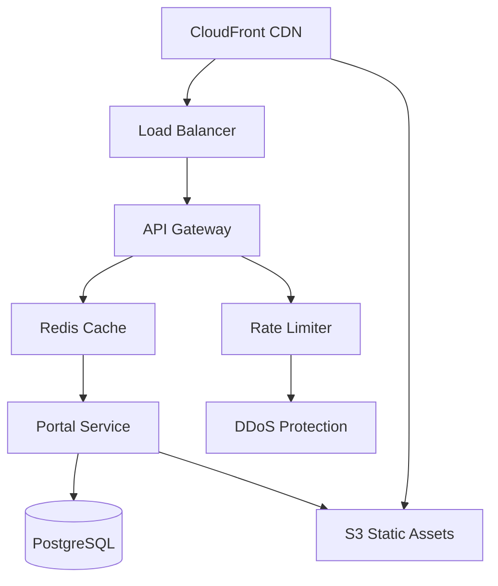

# Sprint 4: Public Portal, Playoffs & Production Hardening 🏆

## Executive Summary

**Sprint**: 4 of 12  
**Duration**: 10 days  
**Start**: Current  
**Demo**: Day 10  
**Velocity Target**: 88 points  
**Feature Flags**: `public_portal_v1`, `playoffs_v1`, `ref_assign_v1`, `reports_v1`, `ops_hardening_v1`

Sprint 4 transforms the platform from internal-only to public-facing, adds playoff tournament management, streamlines officials operations, and implements production-grade operational excellence.

## 🎯 Sprint 4 Objectives

### Primary Deliverables

1. **Public League Portal** (Epic PORTAL-01, 20 points)
   - Read-only public pages (no auth required)
   - League/division/team schedules and standings
   - Game results and live scores
   - Shareable links with social cards
   - ICS calendar exports
   - SEO optimization

2. **Playoffs & Brackets** (Epic PO-01, 25 points)
   - Seed teams from regular season standings
   - Single/double elimination brackets
   - Third-place match option
   - Drag-drop rescheduling
   - Auto-advance winners
   - Bracket visualization

3. **Officials Management** (Epic OFF-01, 18 points)
   - Referee availability calendar
   - Automatic assignment optimizer
   - Conflict prevention rules
   - Manual override capability
   - Payout export (CSV)
   - Notification system

4. **Reporting & Exports** (Epic REP-01, 15 points)
   - CSV/JSON exports (rosters, results, payments)
   - League health dashboards
   - Revenue reporting
   - Participation metrics
   - Custom date ranges
   - Tenant-scoped data

5. **Production Hardening** (Epic OPS-01, 10 points)
   - Database backup automation
   - Disaster recovery runbook
   - SLOs and error budgets
   - On-call alerting
   - Cost guardrails
   - Privacy policy & ToS

## 🚩 Feature Flags

```typescript
const featureFlags = {
  public_portal_v1: {
    enabled: true,
    description: "Public-facing league pages",
    rollout: 100,
    cache_ttl: 300, // 5 minutes
    features: ['standings', 'schedules', 'results', 'teams']
  },
  playoffs_v1: {
    enabled: true,
    description: "Tournament bracket management",
    rollout: 50,
    max_teams: 32,
    formats: ['single_elim', 'double_elim']
  },
  ref_assign_v1: {
    enabled: true,
    description: "Officials assignment engine",
    rollout: 100,
    auto_assign: true,
    constraint_levels: ['strict', 'balanced', 'relaxed']
  },
  reports_v1: {
    enabled: true,
    description: "Data exports and reporting",
    rollout: 100,
    formats: ['csv', 'json', 'pdf'],
    rate_limit: '10/hour/user'
  },
  ops_hardening_v1: {
    enabled: true,
    description: "Production operational features",
    features: ['backups', 'slos', 'cost_alerts', 'pii_scrubbing']
  }
}
```

## 📋 Definition of Ready (DOR)

- [ ] Public portal UI mockups approved
- [ ] Bracket generation algorithms documented
- [ ] Officials assignment rules defined
- [ ] Export data schemas specified
- [ ] Backup/restore procedures documented
- [ ] Privacy policy and ToS drafted
- [ ] Performance targets for public endpoints set

## ✅ Definition of Done (DOD)

- [ ] Code coverage ≥82%
- [ ] Portal reads P95 <120ms
- [ ] Bracket operations P95 <200ms
- [ ] Officials assignment P95 <300ms
- [ ] WebSocket latency P95 <40ms
- [ ] WCAG 2.1 AA compliant
- [ ] No security vulnerabilities
- [ ] No PII in logs
- [ ] Multi-tenant isolation verified
- [ ] SEO smoke tests passing
- [ ] Backup/restore test successful
- [ ] Demo prepared

## 🏗️ Architecture Enhancements

### Public Portal Architecture



### Bracket Management System

```typescript
interface BracketConfig {
  format: 'single_elimination' | 'double_elimination';
  teams: Team[];
  seeds: Map<Team, number>;
  venues: Venue[];
  startDate: Date;
  thirdPlaceMatch: boolean;
  reseedAfterRound: boolean;
}

interface BracketNode {
  id: string;
  round: number;
  position: number;
  match?: Game;
  winner?: Team;
  loser?: Team;
  parent?: BracketNode;
  children: BracketNode[];
}
```

### Officials Assignment Engine

```typescript
interface AssignmentConstraints {
  noDoubleBooking: boolean;
  minimumRestPeriod: Duration;
  skillLevelMatch: boolean;
  travelTimeBuffer: Duration;
  venuePreferences: Map<Official, Venue[]>;
  blacklistTeams: Map<Official, Team[]>;
  payGradeRules: PayGrade[];
}

interface AssignmentResult {
  assignments: Map<Game, Official[]>;
  conflicts: Conflict[];
  cost: number;
  utilization: Map<Official, number>;
  suggestions: Suggestion[];
}
```

## 🔒 Security & Privacy

### Public Portal Security
- No authentication required for read access
- Rate limiting: 100 req/min per IP
- CDN caching for static content
- Tenant isolation via URL structure
- CORS configured for known domains
- DDoS protection via CloudFront

### PII Scrubbing
```typescript
const piiPatterns = [
  /\b\d{3}-\d{2}-\d{4}\b/g,  // SSN
  /\b[A-Z0-9._%+-]+@[A-Z0-9.-]+\.[A-Z]{2,}\b/gi,  // Email
  /\b\d{10,12}\b/g,  // Phone
  /\b\d{4}[\s-]?\d{4}[\s-]?\d{4}[\s-]?\d{4}\b/g,  // Credit card
];

function scrubPII(text: string): string {
  return piiPatterns.reduce((scrubbed, pattern) => 
    scrubbed.replace(pattern, '[REDACTED]'), text);
}
```

### Privacy Policy Requirements
- COPPA compliance statement
- Data collection disclosure
- Parental rights section
- Data retention policies
- Third-party services disclosure
- Contact information

## 🎨 User Experience Flows

### Public Portal Flow
```
1. Visitor lands on league page
   → No login required
   → Views current standings
   → Browses schedules

2. Selects specific team
   → Team roster displayed
   → Recent results shown
   → Upcoming games listed

3. Exports calendar
   → ICS file generated
   → Phoenix timezone preserved
   → Updates reflected
```

### Playoff Bracket Flow
```
1. Admin creates bracket
   → Seeds from standings
   → Selects format
   → Sets start date

2. Bracket generated
   → Visual display
   → Conflict checks
   → Venue assignments

3. Games progress
   → Scores entered
   → Winners advance
   → Bracket updates
   → Next round scheduled

4. Championship
   → Final game
   → Champion recorded
   → Season complete
```

### Officials Assignment Flow
```
1. Officials set availability
   → Calendar interface
   → Block dates/times
   → Venue preferences

2. Auto-assignment runs
   → Constraints applied
   → Optimal solution found
   → Conflicts flagged

3. Manual adjustments
   → Drag-drop interface
   → Validation checks
   → Notifications sent

4. Export for payroll
   → CSV generated
   → Hours calculated
   → Rates applied
```

## 📊 Quality Gates

### Performance Targets
| Metric | Target | Blocking |
|--------|--------|----------|
| Public Portal P95 | <120ms | Yes |
| Bracket Gen (32 teams) | <2s | Yes |
| Officials Assignment P95 | <300ms | Yes |
| Export Generation | <10s | Yes |
| Cache Hit Rate | >80% | No |
| SEO Score | >90 | No |

### Operational Targets
| Metric | Target | Blocking |
|--------|--------|----------|
| Backup Success Rate | 100% | Yes |
| Restore Test Time | <30min | Yes |
| Error Budget | <0.1% | No |
| Cost per User | <$0.50 | No |
| Log PII Instances | 0 | Yes |

## 🚀 Sprint Plan

### Days 1-2: Data Models & Planning
- [ ] ERDs for brackets and officials
- [ ] Privacy policy draft
- [ ] Backup strategy design
- [ ] Update ADRs if needed

### Days 3-4: Backend Implementation
- [ ] Public portal endpoints
- [ ] Bracket generation algorithm
- [ ] Officials assignment engine
- [ ] Export APIs

### Days 5-6: Frontend Development
- [ ] Public portal pages
- [ ] Bracket visualization
- [ ] Officials calendar
- [ ] Export triggers

### Days 7-8: Production Hardening
- [ ] Backup automation
- [ ] SLO configuration
- [ ] Cost monitoring
- [ ] PII scrubbing

### Day 9: Integration & Testing
- [ ] E2E test suites
- [ ] Load testing
- [ ] SEO validation
- [ ] Restore drill

### Day 10: Demo & Retrospective
- [ ] Demo preparation
- [ ] Stakeholder presentation
- [ ] Sprint retrospective
- [ ] Sprint 5 planning

## 👥 Squad Assignments

### Squad 1: Public Experience
**Lead**: Frontend Engineer Agent
- Public portal implementation
- Bracket UI development
- SEO optimization
- Social sharing cards

### Squad 2: Competition Management
**Lead**: Backend Engineer Agent
- Bracket generation algorithm
- Officials assignment engine
- Export API development
- Performance optimization

### Squad 3: Mobile Experience
**Lead**: Mobile Developer Agent
- Portal mobile views
- Bracket viewer
- Push notification updates
- Offline capability

### Squad 4: Operations
**Lead**: DevOps Engineer Agent
- Backup automation
- DR runbook
- SLO implementation
- Cost monitoring

### Squad 5: Quality & Compliance
**Lead**: QA Manager Agent
- E2E test automation
- Performance validation
- Security scanning
- Accessibility testing

## 📈 KPI Dashboards

### Public Engagement Metrics
- Unique visitors per day
- Page views per session
- ICS export count
- Share link clicks
- Mobile vs desktop ratio
- Bounce rate

### Competition Metrics
- Brackets created
- Games per bracket
- Auto vs manual advances
- Reschedule rate
- Completion rate

### Officials Metrics
- Availability coverage
- Assignment success rate
- Manual override rate
- Travel time average
- Utilization percentage

### Operational Metrics
- Backup success rate
- Restore test results
- Error budget consumption
- Cost per transaction
- SLO compliance

## 🎭 Demo Scenarios (Day 10)

### Scenario 1: Public Portal Experience
1. Navigate to public league page (no login)
2. View current standings
3. Browse team schedule
4. Check live game score
5. Export team calendar (ICS)
6. Share team page on social media

### Scenario 2: Playoff Tournament
1. Generate 16-team single elimination bracket
2. Show seeding from standings
3. Play first round game
4. Auto-advance winner
5. Reschedule conflict
6. Complete championship

### Scenario 3: Officials Management
1. Set referee availability
2. Run auto-assignment for weekend
3. Review assignments
4. Manual override one game
5. Export payout report

### Scenario 4: Production Operations
1. Show backup running
2. Demonstrate restore process
3. Display SLO dashboard
4. Review cost trends
5. Verify PII-free logs

## 🚨 Risks & Mitigations

### Risk 1: Public Portal Performance
**Impact**: High - User experience
**Mitigation**: CDN caching, database indexes, load testing

### Risk 2: Bracket Complexity
**Impact**: Medium - Feature completeness
**Mitigation**: Start with single elimination, iterate

### Risk 3: Officials Constraints
**Impact**: Medium - Assignment quality
**Mitigation**: Configurable rules, manual override

### Risk 4: Backup/Restore Time
**Impact**: High - Data loss
**Mitigation**: Incremental backups, parallel restore

### Risk 5: PII Leakage
**Impact**: Critical - Compliance
**Mitigation**: Automated scanning, log scrubbing

## 🔄 ADR Considerations

### New ADRs Required
- ADR-014: Public Portal Caching Strategy
- ADR-015: Bracket Generation Algorithm
- ADR-016: Officials Assignment Optimization
- ADR-017: Backup and Recovery Strategy

### Existing ADR Updates
- ADR-001: Event sourcing for bracket progression
- ADR-009: Security for public endpoints

## 📋 Backlog Expansion

### Public Portal (20 points)
- PORTAL-401: Public standings page (3)
- PORTAL-402: Team schedule view (3)
- PORTAL-403: Game results display (3)
- PORTAL-404: ICS export (3)
- PORTAL-405: Social sharing (3)
- PORTAL-406: SEO optimization (5)

### Playoffs (25 points)
- PO-501: Bracket generation (8)
- PO-502: Seeding logic (3)
- PO-503: Game scheduling (5)
- PO-504: Winner advancement (5)
- PO-505: Bracket visualization (4)

### Officials (18 points)
- OFF-601: Availability calendar (5)
- OFF-602: Assignment algorithm (8)
- OFF-603: Manual overrides (3)
- OFF-604: Payout export (2)

### Reporting (15 points)
- REP-701: Data export APIs (5)
- REP-702: Dashboard creation (5)
- REP-703: Report scheduling (3)
- REP-704: Access controls (2)

### Operations (10 points)
- OPS-801: Backup automation (3)
- OPS-802: SLO configuration (2)
- OPS-803: Cost monitoring (2)
- OPS-804: PII scrubbing (3)

## ✅ Success Criteria

- Public portal live without authentication
- Bracket generation for 4-32 teams
- Officials assignment respecting constraints
- All exports under 10 seconds
- Zero PII in logs
- Backup/restore tested successfully
- Demo showcases all features

---

**Status**: ACTIVE  
**Confidence**: HIGH  
**Blockers**: None  
**Next Update**: Daily Standup @ 09:00

*Sprint 4 will transform the platform from internal tool to public-facing service with professional tournament management and production-grade operations.*